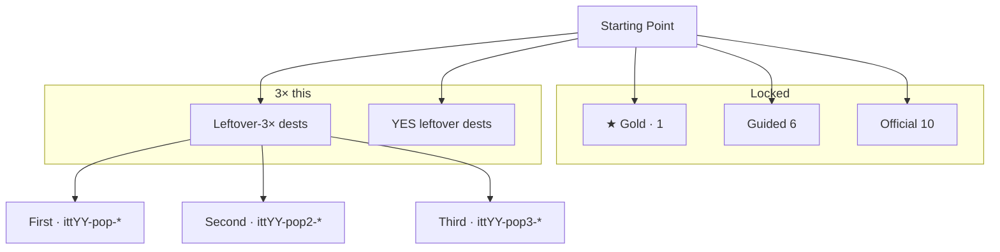
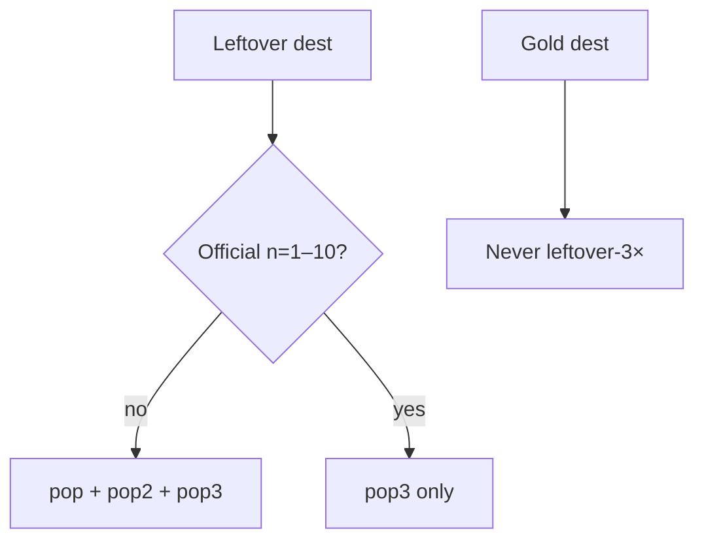

# 1994–1998 leftover-3× ×3 — map

**Date:** 2026-09-07  
**Same steps as 1999–2005:** count existing → 3× unique dests → dest-true machines → 3 leftover writers per legal dest → YES leftover → score until positive → e2e complete (not strip-only).  
**Famous that calendar year only.** No dest-farm. Gold dest never leftover-3×. First/second never official n=1–10. Third may as `pop3`. Leftover never writes the star.

---

## Diagrams — check every flow

Gold: 1994 Cool Site of the Day `itt94-csotd` · 1995 Amazon SSL `itt95-ssl-checkout` · 1996 Portal wars `itt96-portal-wars` · 1997 PointCast `itt97-pointcast` · 1998 I'm Feeling Lucky `itt98-lucky`.

---

## Painted leftover-3× doors (on-disk dests only)

Dest folders frozen: 1994=53 · 1995=51 · 1996=52 · 1997=56 · 1998=52.

### 1994 — 27 dests · 65 leftover-3× machines

**First 9** leftover dests (3 machines each): pizzahut · netmarket · imdb · prodigy · pathfinder · cnn · apple · bbc · microsoft  
**Second 9:** ibm · webcrawler · ncsa · infoseek · mcom · gnn · well · time · nyt  
**Third 9:** yahoo · cern · fishcam · whitehouse · nasa · iuma · hotwired · lycos (official `pop3` only) + **compuserve** leftover (3 machines)

Gold dest `csotd` never leftover-3×.

### 1995 — 27 dests · 65 leftover-3× machines

**First 9:** espn · cnet · timewarner · hotbot · aol · apple · ibm · infoseek · nyt  
**Second 9:** pathfinder · wsj · salon · tripod · suck · zdnet · weather · well · pbs  
**Third 9:** auctionweb · geocities · yahoo · altavista · cnn · microsoft · netscape · classmates (official `pop3`) + **loc** leftover (3 machines)

Gold dest `amazon` never leftover-3×.

### 1996 — 27 dests · 65 leftover-3× machines

**First 9:** totalny · pathfinder · hotbot · craigslist · icq · espn · disney · archive · askjeeves  
**Second 9:** mtv · cnn · microsoft · netscape · suck · tripod · zdnet · well · weather  
**Third 9:** hotmail · spacejam · yahoo · geocities · amazon · auctionweb · excite · altavista (official `pop3`) + **angelfire** leftover (3 machines)

Gold dest `portals` never leftover-3×.

### 1997 — 27 dests · 63 leftover-3× machines

**First 9:** newscom · drudgereport · hotwired · winamp · netflix · amazon · yahoo · cnn · geocities  
**Second 9:** netscape · altavista · espn · disney · lycos · goto · suck · tripod · zdnet  
**Third 9 official `pop3` only:** icq · ebay · hotmail · slashdot · drudge · hotbot · aim · apple · microsoft

Gold dest `pointcast` never leftover-3×.

### 1998 — 27 dests · 65 leftover-3× machines

**First 9:** opendiary · icqweb · broadcastcom · go · excite · geocities · aol · lycos · winamp  
**Second 9:** cnn · microsoft · netscape · icq · altavista · about · gamespot · valve · youvegotmail  
**Third 9:** yahoo · amazon · ebay · cdnow · hotmail · mozilla · slashdot · dmoz (official `pop3`) + **snap** leftover (3 machines)

`go` is first leftover only. Third last dest is `snap` so dests stay unique. Gold dest `google` never leftover-3×.

---

## YES leftover (famous leftover, not leftover-3× 27, not gold)

| Year | Dests | Machines |
|------|-------|---------:|
| 1994 | intel sun mit startingpoint weather loc exploratorium smithsonian personal | 27 |
| 1995 | match npr beanies opentext hotwired sun | 18 |
| 1996 | aolportal bluemountain four11 infospace realplayer theglobe xoom | 21 |
| 1997 | mp3com scripting usatoday yandex dancing-baby | 15 |
| 1998 | ayb bowienet four11 hillmancurtis mp3com realplayer textfiles | 21 |

---

## Year beat

| Year | Beat |
|------|------|
| 1994 | 1994 leftover. Cool Site of the Day is the chip. Mosaic / 14.4. No Amazon SSL. |
| 1995 | 1995 leftover. Amazon SSL is the chip. AOL is #1 visits. |
| 1996 | 1996 leftover. Portal wars is the chip. Space Jam leftover. No Google. |
| 1997 | 1997 leftover. PointCast is the chip. AIM seed leftover. No Google mass. |
| 1998 | 1998 leftover. I'm Feeling Lucky is the chip. Yahoo is loud. |
