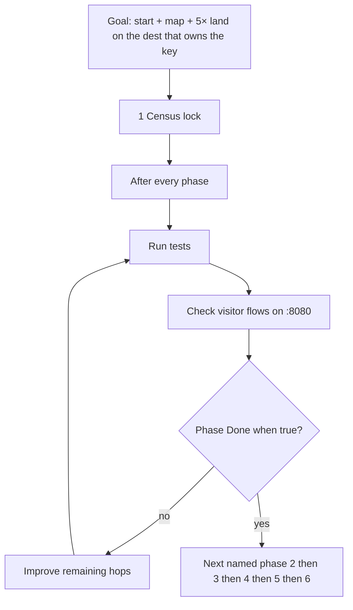

# 1994–1998 start + flow hops — goals, phases, steps

**Date:** 2026-10-10  
**Status:** Phases 1–5 implemented 2026-10-10. Phase 6 not started. Not ship law.  
**Ship law:** [`DISK-TRUTH.md`](DISK-TRUTH.md) · `js/year-card.json` · `scripts/itt_gate.py` `SHIP_YEARS`.  
**Band already done:** working-flow phases 1–6 on 1994–1997 and 1998–2001 ([`WORKING-FLOW-PHASES.md`](WORKING-FLOW-PHASES.md)). This program does not reopen those six.  
**Per-year steps:** [`1994-1998-start-flow/`](1994-1998-start-flow/).  
**Local:** http://127.0.0.1:8080

First five live years: **1994, 1995, 1996, 1997, 1998**. Frozen HTML. Official trail n=10 each. Starting Point is `years/YYYY/pages/home.html` painted by `ui/year/start.js` from `ui/year/start-data.js`.

Do not dest-farm. Do not unfreeze 1994–2006. Do not restore leftover-3× unique. Do not restore 2015/2016. Do not start a phase until the user names **start**.



---

## Goals

| # | Goal | Done when |
|---|------|-----------|
| G1 | Visitor on Starting Point reaches the dest that owns the official or leftover `whenKey` in one click, or the hop dest links that dest. | Guided six hrefs in `ui/year/start-data.js` resolve on disk. Official keys in the six match `js/config/flow-trails.js` or the hop dest links the trail dest. |
| G2 | 5× F1–F5 and `js/config/flow-maps.js` name the live room. Tombstoned 5× panels say empty / removed, not REAL. | `e2e/5x-recheck.matrix.json` `room` equals the dest that can write the `key`, or the live spec asserts count 0 and the map copy matches. |
| G3 | No ghost `whenKey`. `data-official-verb` sits on a dest with `data-official-key`, or extras skip. | No `data-next-when-key` / official-verb whose key is missing from that year’s trail. |
| G4 | 1998 n=10 Snap stays official. Skip-Intro runner stays off the official ten unless named onto the trail. | `flow-trails.js` 1998 n=10 is `itt98-snap`. `years/1998/sites/playable/game.html` is extra, not stop 10. |
| G5 | Leftover-2× unique dests stay dest-disjoint leftover trail n=11–20. Catalog n stays 71 / 117 / 76 / 46 / 28. | `e2e/leftover-2x-unique-links.matrix.json` unchanged. No dest folders added. |

**Out of scope:** dest-farm, leftover-3× unique restore, unfreeze, 1999–2004 `2x`, working-flow phases 1–6 redo.

---

## Phases

| Phase | What it finishes | Files | State |
|-------|------------------|-------|-------|
| 1 | Census lock. This map. Per-year step files. YEAR-INCOMPLETE-NOW pointer. | this file · `1994-1998-start-flow/*.md` | **Implemented 2026-10-10** · cites re-verified on disk |
| 2 | Start guided hops. `start-data.js` items land on the dest that owns the key, or the lobby links that dest. | `ui/year/start-data.js` · existing dest HTML links only | **Implemented 2026-10-10** · NCSA leftover off P0 six · Slashdot → `story.html` |
| 3 | 5× + flow-map honesty. Matrix `room` and map href match live dest, or copy says tombstone. | `js/config/flow-maps.js` · `e2e/5x-recheck.matrix.json` · `e2e/1994-5x-live.spec.js` | **Implemented 2026-10-10** · IUMA F1 → `listen.html` · F5 NCSA tombstone · 1995–1998 extras stay extras |
| 4 | Ghost official keys. 1995 Amazon bookstore Search verb / `itt95-amazon` next-flow. | `years/1995/sites/amazon/index.html` | **Implemented 2026-10-10** · Search is not official-verb · next is `itt95-ssl-checkout` |
| 5 | 1998 trail shape honesty. Snap n=10. Skip-Intro stays extra. | `js/config/flow-trails.js` (read) · start-data / map / playable copy | **Implemented 2026-10-10** · Skip-Intro extra · Snap stays n=10 |
| 6 | Verify. Named year packs + start trails. Dest-true 12. No dest-farm. | Playwright `--workers=1` · `npm run check` | Not started |

**After every phase (mandatory loop).** Do not open the next phase while this loop is red.

1. **Run tests** — Playwright `--workers=1` on that phase’s spec list below. Then `npm run check`. If the phase touched visitor I/O, dest-true 12.
2. **Check flows** — Serve http://127.0.0.1:8080. Walk Starting Point → star, then each hop that phase named. Empty / trap / incomplete write nothing. Complete writes one envelope.
3. **Reiterate on improving** — If a test fails or a hop still opens the wrong dest, fix that hole in this phase. Re-run steps 1–2. Log the remaining hole in the year file. Do not dest-farm a new dest to make a test green.
4. **Close the phase** only when that phase’s **Done when** is true and the improve log for this phase is empty or deferred with a cite.

Do not run full warehouse unless named.

---

## Locked disk (do not regress)

Official n=1–10 dests exist. `data-official-key` matches `whenKey`. Stars:

| Year | Star key | Star dest | leftover-2× n |
|------|----------|-----------|--------------:|
| 1994 | `itt94-csotd` | `sites/csotd/index.html` | 71 |
| 1995 | `itt95-ssl-checkout` | `sites/amazon/ssl-checkout.html` | 117 |
| 1996 | `itt96-portal-wars` | `sites/portals/wars.html` | 76 |
| 1997 | `itt97-pointcast` | `sites/pointcast/index.html` | 46 |
| 1998 | `itt98-lucky` | `sites/google/lucky.html` | 28 |

Gold leftover (`data-itt-gold-lx`) is on all five star dests. Leftover n=11–20 dests exist. Leftover save uses short `data-lo-key`; `keyOf` prefixes `ittYY-`. `#ott-guided-YYYY` is painted by `ui/year/start.js` (six `li`). Official dest leftover-2× first paint stays 0.

---

## Phase 1 close — census re-verified 2026-10-10

Phase 1 **Done when:** this map exists, per-year step files exist, YEAR-INCOMPLETE-NOW points here, cites match disk.

Re-verify (no dest-farm):

- Year-card `kind: html` + `frozen: true` for 1994–1998. Stars match trail n=1. Start `href` matches `../` + trail n=1 dest.
- Official n=1–10 dest files exist for all five years. leftover-2× catalog ids = matrix dests: 71 / 117 / 76 / 46 / 28.
- Gold leftover `data-itt-gold-lx` on all five star dests.
- **H1 1994 IUMA (census):** `listen.html` has `data-official-key="itt94-iuma"`. At census the lobby had no `listen.html` link and 5× F1 used `sites/iuma/index.html`. **Live after phase 3:** lobby links `listen.html`; matrix / map F1 / `1994-5x-live` use `sites/iuma/listen.html`.
- **H2 1994 NCSA:** leftover `data-lo-key="trail-q"`. No official-key. 5× F5 matrix key `itt94-whatsnew`.
- **H3 1995 Amazon (census):** bookstore `index.html` had `data-official-verb` and `itt95-amazon`, no `data-official-key`. SSL checkout owns `itt95-ssl-checkout`. **Live after phase 4:** Search has no official-verb; next-when-key is `itt95-ssl-checkout`.
- **H4 1997 Slashdot:** lobby links `story.html`. Story owns `itt97-sd-comments-ie4`.
- **H5 1998:** n=10 is Snap. `sites/playable/game.html` exists with `skipintro` and is not on the 1998 trail.
- leftover-3× unique config gone. `e2e/1994-1998-leftover-3x.matrix.json` still 290 rows (tombstone).
- Named later-phase specs exist on disk: `year-start-trails`, `1994-1999-official-10`, year mvp 1994–1998, `1994-5x-live`, `5x-real-dests`, `1995-ssl-checkout`, `1998-densify`.

Holes stay in the improve log for phases 2–5. Phase 1 does not edit dest HTML.

---

## Findings this scan (phase 1 census)

| Sev | Year | Hole | Live dest that owns the key | What start / map / 5× open |
|-----|------|------|-----------------------------|----------------------------|
| bug | 1994 | IUMA split | `sites/iuma/listen.html` `itt94-iuma` | Census: lobby had no `listen.html` link. **Live after phase 3:** lobby links listen; F1 matrix/map/live use listen. 4× N8 stays lobby extra. |
| bug | 1994 | NCSA 5× vs leftover | leftover n=16 `itt94-trail-q` on `sites/ncsa/index.html` | Census: start item 4 mixed NCSA with CERN. **Live after phases 2–3:** P0 six is CERN only; F5 map tombstone; live F5 count 0. |
| bug | 1995 | Ghost official | star is `ssl-checkout.html` `itt95-ssl-checkout` | Census: bookstore Search had `data-official-verb` and `data-next-when-key="itt95-amazon"`. **Live after phase 4:** Search has no official-verb; next-when-key is `itt95-ssl-checkout`; hop href `ssl-checkout.html`. |
| hop | 1997 | Slashdot lobby | `sites/slashdot/story.html` `itt97-sd-comments-ie4` | Census: start listed lobby. **Live after phase 2:** start href is `story.html`. Lobby still links story. |
| shape | 1998 | Year game off trail | n=10 is Snap `itt98-snap` | Census: playable `game.html` exists (`skipintro` / `itt98-game-skipintro`) and is not in 1998 `flow-trails.js`. **Live after phase 5:** start/map/cabinet/layers/atlas copy call Skip-Intro extra. Dest stays extra. |
| honesty | 1994–1998 | leftover-3× matrix | unique-3× catalogs empty | `e2e/1994-1998-leftover-3x.matrix.json` still 290 rows. Spec is a tombstone. Do not restore engines. |
| by design | all five | leftover-2× vs leftover trail | unique dest hrefs on leftover dests | Leftover trail n=11–20 dests are dest-disjoint the unique catalog. |

1996 start guided dests match official n=1–5 plus map. No IUMA-class split found. Extra flow-map keys stay extras.

---

## Phase 2 — Start guided hops

**Start:** named 2026-10-10.  
**Do:** edit `ui/year/start-data.js` and add one link on an existing dest HTML file when the lobby is the hop. Do not add dest folders.

| Year | Step | Change | Closed |
|------|------|--------|--------|
| 1994 | 2.1 | IUMA is not on the guided six. Leave guided six. If IUMA stays on the year map, phase 3 owns the lobby→listen link. | **yes** |
| 1994 | 2.2 | Split leftover NCSA off the P0 six. Item 4 is CERN official n=3 only (`sites/cern/index.html`). NCSA leftover n=16 stays on leftover trail / map / dest. | **yes** |
| 1995 | 2.3 | Keep Amazon star as `ssl-checkout.html`. Bookstore home stays a hop. Phase 4 strips the ghost verb. | **yes** (no href change) |
| 1996 | 2.4 | Confirm six `li`. Item 5 is My Yahoo + GeoCities (both official). All guided dest files exist. | **yes** (no href change) |
| 1997 | 2.5 | Point start Slashdot href at `../sites/slashdot/story.html` (`itt97-sd-comments-ie4`). Lobby still links `story.html`. | **yes** |
| 1998 | 2.6 | Keep Lucky as star. Google! index stays empty-search hop (`google.js` lucky button). | **yes** (no href change) |

No dest folders added. Frozen dest HTML untouched.

**Done when:** `e2e/year-start-trails.spec.js` still 6 `li`. `e2e/1994-1999-official-10.spec.js` / year mvp still green. Each start official href either is the trail dest or links it.

**Close 2026-10-10.** Catalog 24 years · 6 items. `npm run check` ALL CHECKS PASSED. Phase 2 Playwright 29 passed / 54 skipped. dest-true 12: 415 passed. :8080 click: 1994 CERN `itt94-cern`; 1997 Slashdot `story.html` `itt97-sd-comments-ie4`; NCSA off P0 six; stars unchanged.

---

## Phase 3 — 5× and flow-map honesty

**Start:** named 2026-10-10 (implement phases 3). Option A: lobby links `listen.html`; 5× matrix room for `itt94-iuma` is `sites/iuma/listen.html`.  
**Do:** `js/config/flow-maps.js`, `e2e/5x-recheck.matrix.json`, live 5× specs. Existing dest HTML may gain one `listen.html` link on IUMA lobby.

| Year | Step | Change | Closed |
|------|------|--------|--------|
| 1994 | 3.1 | IUMA lobby `index.html` links `listen.html` (existing file). 5× matrix `room` for `itt94-iuma` is `sites/iuma/listen.html`. `1994-5x-live` F1 completes official write on listen. `5x-real-dests` locks the lobby link. | **yes** |
| 1994 | 3.2 | Map 5× F1 and culture IUMA href `sites/iuma/listen.html` · copy names `itt94-iuma`. 4× N8 stays lobby `sites/iuma/index.html` (extra `itt94-iuma-dl` empty; lobby hops to listen). | **yes** |
| 1994 | 3.3 | 5× F5 NCSA map copy: leftover trail-q · 5× panel removed · empty never writes. Matrix / `1994-5x-live` F5 stay on `sites/ncsa/index.html` and assert 5× count 0. | **yes** |
| 1995–1998 | 3.4 | Walked `flow-maps.js` hrefs vs `years/YYYY/` disk: **0 missing**. Off-trail keys stay extras. Tombstoned F-branch REAL copy on dests that do not write that 5× key. 1998 F1 map href aligned to leftover `sites/altavista/index.html` (matrix + `1998-5x-live`). No dest folders added. | **yes** |

**Done when:** `e2e/1994-5x-live.spec.js` and `e2e/5x-real-dests.spec.js` agree on IUMA path. Map hrefs exist. No new dest folders.

**Close 2026-10-10.** Option A on disk. Playwright `1994-5x-live` + `5x-real-dests` + `1994-mvp` **10 passed**. `npm run check` ALL CHECKS PASSED. dest-true 12: **415 passed**. :8080: IUMA lobby → `listen.html` writes `itt94-iuma`; NCSA leftover `trail-q` and 5× count 0; map F1 listen + F5 tombstone. 1995 has no labeled 5× F1–F5 map branch (5× lives in matrix / live spec). 1996 F1 keeps official `my.html` and says extra `itt96-myportal` empty. 1997 F1/F2/F4 stay on lobbies that hop to the official dest. Ghost `itt95-amazon` closed in phase 4. Skip-Intro copy stays phase 5.

---

## Phase 4 — Ghost official keys

**Start:** named 2026-10-10 (implement phase 4). Frozen dest HTML except `years/1995/sites/amazon/index.html`.  
**Do:** strip bookstore Search `data-official-verb`. Retarget next-when-key to the star. Do not dest-farm. Cart keys stay cart keys.

| Year | Step | Change | Closed |
|------|------|--------|--------|
| 1995 | 4.1 | Search submit is not official-verb. Stripped `data-official-verb` (and unused `data-official-status`) from bookstore Search. Form still GETs `search.html`. | **yes** |
| 1995 | 4.2 | `data-next-when-key` is `itt95-ssl-checkout`. Hop href stays `ssl-checkout.html`. `hidden` dropped so the hop is visible without a ghost write. | **yes** |
| 1994–1998 | 4.3 | Census: only hop dest with `data-official-verb` and no `data-official-key` is `years/1995/sites/amazon/index.html`. Leftover / 4× / pop `data-next-when-key` extras stay extras. 1996 Amazon keeps official `itt96-amazon`. | **yes** |

**Done when:** 1995 bookstore Search does not write. SSL checkout still writes `itt95-ssl-checkout`. Empty search writes nothing. Ghost key `itt95-amazon` is not a 1995 trail `whenKey`. Cart keys `itt95-amazon-cart` / `itt95-amazon-orders` stay cart storage.

**Close 2026-10-10.** Bookstore Search has no official-verb. Next hop is SSL checkout / `itt95-ssl-checkout`. Playwright `1995-ssl-checkout` + `1995-mvp` + official-10: **19 passed / 54 skipped**. `npm run check` ALL CHECKS PASSED. dest-true 12: **415 passed**. :8080: empty and filled Search write nothing; SSL complete writes `itt95-ssl-checkout`.

---

## Phase 5 — 1998 trail shape

**Start:** named 2026-10-10 (implement phase 5). Frozen dest HTML. `flow-trails.js` 1998 n=10 Snap is read-only.  
**Do not** move Skip-Intro onto official n=10 unless the user names that.

| Step | Change | Closed |
|------|--------|--------|
| 5.1 | Keep `flow-trails.js` 1998 n=10 Snap (`itt98-snap`, `sites/snap/index.html`). Checklist already matches. No trail edit. | **yes** |
| 5.2 | Start map line: Snap n=10 · Skip-Intro extra. Map Enter do: extra · `itt98-game-skipintro`. Cabinet `extra: true` paints “Year game extra · not official n=10”. Layers one-thing is Lucky. Atlas game label extra. | **yes** |
| 5.3 | Do not dest-farm a second 1998 official game dest. Playable `game.html` stays extra `itt98-game-skipintro`. No dest HTML edited. | **yes** |

**Done when:** official-10 e2e still finishes Snap as n=10. Playable `game.html` still loads as extra.

**Close 2026-10-10.** Snap stays official n=10. Skip-Intro stays extra. Playwright `1998-mvp` + `1998-densify` + official-10: **18 passed / 54 skipped**. `npm run check` ALL CHECKS PASSED. dest-true 12: **415 passed** (includes `1998 n=10 itt98-snap`). :8080 **20/20**: Lucky trap/empty write nothing, complete writes `itt98-lucky`; Snap empty writes nothing, complete writes `itt98-snap`; Skip-Intro load writes nothing; cabinet extra; map extra copy.

---

## After-phase test lists

Serve: `python3 -m http.server 8080 --bind 127.0.0.1` unless `BASE_URL` is set.

| Phase | Playwright `--workers=1` | Flows to click on :8080 | Improve if |
|-------|--------------------------|-------------------------|------------|
| 1 | none (docs only). Confirm cites still match disk. | — | A cite is stale vs live dest |
| 2 | `e2e/year-start-trails.spec.js` `e2e/1994-1999-official-10.spec.js` plus that year’s mvp (`1994-mvp` … `1998-mvp`) | Each year’s Starting Point six. Star dest writes. Hop dest links the trail dest. | Guided href 404s or misses the key dest |
| 3 | `e2e/1994-5x-live.spec.js` `e2e/5x-real-dests.spec.js` plus `1994-mvp` | IUMA lobby → listen (or tombstone copy). NCSA leftover vs 5× F5 copy. Year map F1–F5. | Map says REAL and the dest writes nothing |
| 4 | `e2e/1995-ssl-checkout.spec.js` `e2e/1995-mvp.spec.js` `e2e/1994-1999-official-10.spec.js` | Amazon bookstore Search writes nothing. SSL checkout writes `itt95-ssl-checkout`. | Ghost `itt95-amazon` still appears |
| 5 | `e2e/1998-mvp.spec.js` `e2e/1998-densify.spec.js` official-10 | Lucky n=1. Snap n=10. Skip-Intro loads as extra. | Skip-Intro is treated as stop 10 |
| 6 | All of the above, then dest-true 12 | Starting Point → star for 1994–1998 | Any phase Done when is still false |

Every Playwright line is:

```
npx playwright test <specs> --workers=1
npm run check
```

Visitor I/O phases (2–6) also run dest-true 12 before close.

## Improve log (reiterate)

Keep remaining holes here until the phase that owns them is green. Do not skip.

| Phase | Remaining | Fix in | Closed |
|-------|-----------|--------|--------|
| 1 | Census re-verified 2026-10-10. All trail hrefs exist. Start stars match n=1. leftover-2× n 71/117/76/46/28. Named holes still on disk (IUMA, NCSA, Amazon ghost, Slashdot lobby, 1998 Skip-Intro). Deferred to phases 2–5. | — | **yes** |
| 2 | NCSA leftover split off 1994 P0 six. Slashdot start href is `story.html`. 1995–1996–1998 hops confirmed. | 2.1–2.6 | **yes** |
| 3 | IUMA lobby links `listen.html`. F1 matrix/map/live agree. F5 NCSA tombstone. 1995–1998 map hrefs exist; extras stay extras. | 3.1–3.4 | **yes** |
| 4 | 1995 Amazon Search `data-official-verb` · `itt95-amazon` next-flow | 4.1–4.3 | **yes** |
| 5 | 1998 Skip-Intro off trail (honesty copy) | 5.1–5.3 | **yes** |
| 6 | Wait until 2–5 close | 6 | no |

## Phase 6 — Verify

Full gate after 2–5 are green:

1. `npx playwright test e2e/year-start-trails.spec.js e2e/1994-1999-official-10.spec.js e2e/1994-5x-live.spec.js e2e/1994-mvp.spec.js e2e/1995-mvp.spec.js e2e/1996-mvp.spec.js e2e/1997-mvp.spec.js e2e/1998-mvp.spec.js e2e/1998-densify.spec.js --workers=1`
2. `npm run check`
3. dest-true 12
4. Recheck :8080 Starting Point → star for 1994–1998
5. If anything fails, reopen the phase that owns the hole. Do not dest-farm.

Do not run full warehouse unless named.

---

## Per-year files

| Year | File |
|------|------|
| 1994 | [`1994-1998-start-flow/1994.md`](1994-1998-start-flow/1994.md) |
| 1995 | [`1994-1998-start-flow/1995.md`](1994-1998-start-flow/1995.md) |
| 1996 | [`1994-1998-start-flow/1996.md`](1994-1998-start-flow/1996.md) |
| 1997 | [`1994-1998-start-flow/1997.md`](1994-1998-start-flow/1997.md) |
| 1998 | [`1994-1998-start-flow/1998.md`](1994-1998-start-flow/1998.md) |
