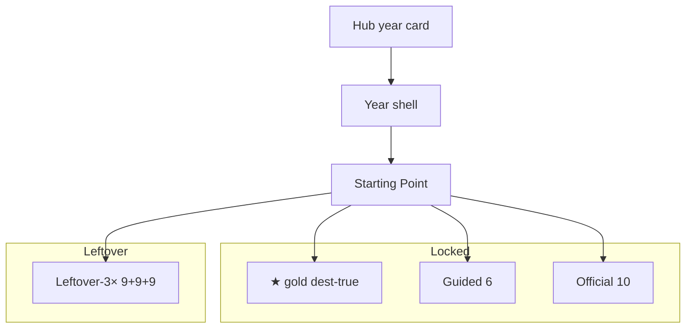
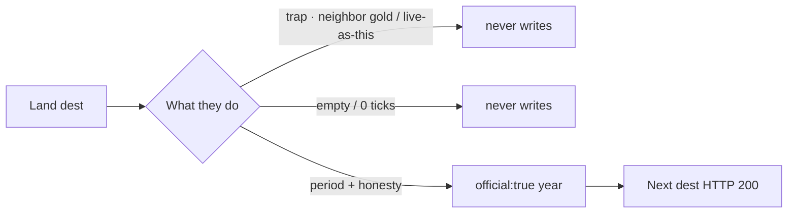

# 1994–2000 — check every flow

**Date:** 2026-09-10  
**Status:** **DONE.** Dest-true leftover-note 19 dests.  
**Lock:** [`1994-2000-DEST-TRUE-UNIQUE-RESEARCH-GOALS-PHASES-FLOWS-MINUTE-2026-09-10.md`](1994-2000-DEST-TRUE-UNIQUE-RESEARCH-GOALS-PHASES-FLOWS-MINUTE-2026-09-10.md)  
**Official 10:** `js/config/flow-trails.js`

Guided stays **exactly 6**. Warehouse each dest **once**. Leftover **2× is not this cut.** Leftover never writes the star.

---

## Year card

## Official dest minute (the 19 leftover-note dests)

Walk: CERN · White House · NASA · HotWired · CNN · Microsoft 95 · Space Jam · My Yahoo · GeoCities · AuctionWeb · AltaVista · Drudge · Microsoft 97 · Mozilla.org · Slashdot · DMOZ · SourceForge · Gnutella · Y2K.

## Pass table

| Check | Pass |
|-------|------|
| Guided | 6 every year |
| Warehouse | 0 dest dups |
| Leftover 2× | **not this cut** |
| Leftover-note dest face | gone on official n=1–10 |
| Dest-true 19 | trap/empty never write · `official:true` |
| Dest freeze | 48–56 dests · no dest-farm |

**e2e:** `e2e/1994-2000-dest-true-leftover-note.spec.js` **19/19**.
