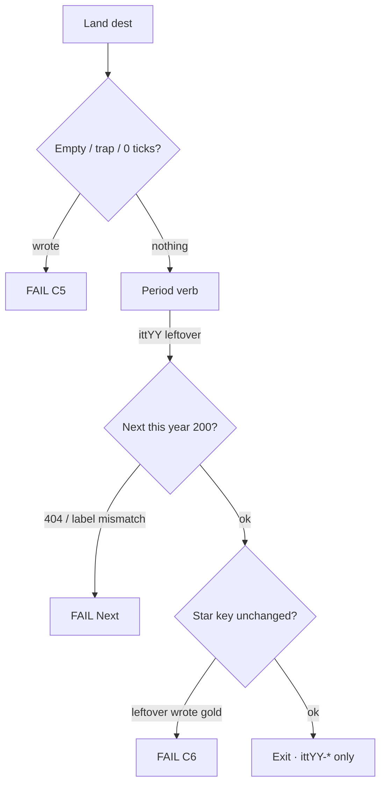

# Improve more — research · locks · dest minutes · options

**Date:** 2026-09-10  
**Status:** research lock. **Named implement 2026-09-10:** Option 1 + Option 2 (KEEP Next chain + home source order). Options 3–7 still unpicked.  
**Branch:** `museum/1994-2020-lean`  
**Pushed tip this file assumes:** `ddd3abe28` — *Ship hub 27 years (1994–2020). Wipe 2021–2025.*  
**Prefix:** `ittYY-*` only. Incomplete / trap / 0 ticks never write. Leftover never writes the star.

**This file is not:** dest-farm · leftover-4× on a lock year · leftover 2× writers on the 2011 extra-27 · CUT-OPEN 2021–2025 · a forest restore · official 20 · a 7th guided `<li>` · Feel A densify as a dest catalog.

---

## 0. How to read

**Trust order:** live `years/` · `scripts/itt_gate.py` `SHIP_YEARS` · [`DISK-TRUTH.md`](DISK-TRUTH.md) · this file · year `YYYY-READ-FIRST.md` thesis/bans only.

A dest-minute is: **land → trap / empty / 0 ticks / skip wait never write → complete leftover or gold only → Next same-year dest HTTP 200.** Leftover never writes the star.

| Bucket | Meaning |
|--------|---------|
| **Legal now** | Dest already on disk. No new folder. No new leftover-official key. No leftover-4× on a lock year. |
| **Named later** | Legal leftover / lean-door work. Do not start until a cut names the row. |
| **Never** | Illegal even if an older checklist still has an empty box. |
| **Stale paper** | Header or row lost to disk. Do **not** execute. |

Two bars. Do not mix.

| Bar | 100% | Now (2026-09-10 disk) |
|-----|------|------------------------|
| **Ship / playable** | Hub door · gold dest file · official 10 files · guided exactly 6 · leftover 2× on dests the year lock requires | **26/27 live years.** Extra-27 2011 rooms are leftover-3× only **on purpose.** |
| **Museum-grade A (feel)** | (1) star is a period product verb (2) official-10 dests write `whenKey` from the period control (3) leftover is not a checkbox plaque (4) forest does not drown the thesis (5) costume is era-true (6) pixels **or** honest `[failed-final]` | **No year is 100%.** This is the remaining visitor work. |

Gold product (same rule as 1995 SSL / 2018 GDPR / 2019 Disney+ / 2020 Zoom Leave):

> multipage **or** multipath · trap never writes · empty never writes · reload persist · period costume · **not** dest-field / two-tick plaque as the save

File count is not completeness. 1996 Space Jam beats a 300-page forest.

---

## 1. Ship law (current)

Live tree + hub + `SHIP_YEARS` = **27 years (1994–2020)**. 2020 Zoom Leave is the last live door. **2021–2025 have no year trees.**

```
# scripts/itt_gate.py
_WIPED = {"2021", "2022", "2023", "2024", "2025"}
SHIP_YEARS = 1994–2020
```

Lean doors: **2007 + 2009 + 2011 + 2013–2020**.  
2013 is Vine 6s (17 dests). 2018 is GDPR Manage (13 dests). 2020 is Zoom Leave (15 dests).  
2011 star stays `itt11-gplus`. Official 10 / guided 6 / leftover-official **313** stay frozen.

### Stale paper (do not execute)

| File | Lie vs disk |
|------|-------------|
| [`REMAINING-CHECKLISTS-2026-09-09.md`](REMAINING-CHECKLISTS-2026-09-09.md) | Still says **31 years** · 2023 Plus / 2024 4o live · 2025 boarded |
| [`SHORTFALL-TRUTH-PASSPORT-4O-MATRIX-GOALS-PHASES-FLOWS-MINUTE-2026-09-09.md`](SHORTFALL-TRUTH-PASSPORT-4O-MATRIX-GOALS-PHASES-FLOWS-MINUTE-2026-09-09.md) | Same 31-year / 4o-live notebook |
| [`MUSEUM-GRADE-A-TO-100-EVERY-YEAR.md`](MUSEUM-GRADE-A-TO-100-EVERY-YEAR.md) | Ship law “1994–2019 minus 2006–2007 · 2020–2025 wiped.” **2006 / 2007 / 2020 are live.** Per-year *feel* sentences can still be true; hub range is not. |
| [`EVERY-YEAR-NEXT-IMPROVE-MAP-GOALS-PHASES-FLOWS-MINUTE-2026-09-03.md`](EVERY-YEAR-NEXT-IMPROVE-MAP-GOALS-PHASES-FLOWS-MINUTE-2026-09-03.md) | Header “26 years · 2020 wiped.” Wave 6–9 *feel* rows can still be leftover work. |
| [`YEAR-E2E-POTENTIAL.md`](YEAR-E2E-POTENTIAL.md) | Generated snapshot. V6 treats extra leftover-3× doors as a fail. Extra doors are not a hole. |
| [`MUSEUM-GRADE-100-GATES-EVERY-YEAR-1994-2023.md`](MUSEUM-GRADE-100-GATES-EVERY-YEAR-1994-2023.md) | 2026-08-28 scoreboard. 2007/2020 boarded · 2021–2023 live. Loses. |

---

## 2. Measurable now (live tree 2026-09-10)

### 2.1 Calendar

| Slice | n | % |
|-------|--:|--:|
| Live years 1994–2020 | 27 / 32 | **84.4** |
| Wiped on purpose 2021–2025 | 5 / 32 | 15.6 |

Wiped is the lock, not unfinished work.

### 2.2 Playable floor (5 slices × 27 years)

| Check | Years | % |
|-------|------:|--:|
| Hub door | 27 / 27 | 100 |
| Guided exactly 6 | 27 / 27 | 100 |
| Gold dest file exists | 27 / 27 | 100 |
| Official 10 dest files exist | 27 / 27 | 100 |
| Leftover 2× on every dest the lock requires | 26 / 27 | 96.3 |
| **Floor slices** | **134 / 135** | **99.3** |

The 27 dests without leftover 2× are the 2011 extra-27 leftover-3× unique websites. **That is not a legal leftover-2× hole** (see §4). Dest-weighted leftover 2× = **1,538 / 1,565 (98.3%)** if you count extra-27 as missing; **1,538 / 1,538 (100%)** on dests the leftover-official freeze covers.

### 2.3 Leftover machines (legal coverage)

| Machine | Status | % |
|---------|--------|--:|
| Leftover 3× first + legal second + third | 27 / 27 years | 100 |
| Leftover 4× on contracted years (1997–2000, 2005–2010, 2014) | 11 / 11 | 100 |
| Leftover 4× stays 0 on 2012 / 2016 / 2017 / 2019 | 4 / 4 | 100 |

2013 leftover-3× second is **2 dests** (Chrome + Medium) — lock, not a shortfall.  
2018 leftover-3× second is **NEVER** (13 dests = official 10 + first 3).  
2020 leftover-3× second is **NEVER**.

### 2.4 Per-year playable (do not treat extra-27 as a year fail)

| Year | Dests | Leftover 2× | Leftover 3× legal | Leftover 4× | Playable |
|------|------:|------------:|:-----------------:|:-----------:|:--------:|
| 1994–2010 | 23–199 | 100 | Y | contract / opt | **100** |
| **2011** | **98** | **71 / 98** (extra-27 are 3×-only) | Y | n/a · leftover-4× NEVER | **100 under year lock** |
| 2012–2020 | 13–71 | 100 | Y | banned / 0 | **100** |

---

## 3. Binding locks (C-rows)

| # | Lock | Fail if |
|--:|------|---------|
| C2 | Guided `#ott-guided-YYYY ol > li` exactly 6 | 7th `<li>` |
| C4 | Stars stay | chip moves |
| C5 | Empty / trap / 0 ticks never write | incomplete writes |
| C6 | Leftover complete never writes gold | leftover writes star or official `whenKey` |
| C7 / C8 | Leftover-3× first/second never official n=1–10 | first/second sits on official dest |
| C11 / C16 | No new dest folders · 5k / leftover-120 are research | dest-farm |
| C23 | Leftover-4× = 0 on lock years | `data-4x-go` on **2012 / 2013 / 2016 / 2017 / 2018 / 2019 / 2020** |

Also bind:

- Prefix `ittYY-*` only. Neighbor-year write is a fail.
- Never invent brand pixels. Harvest Wayback `id_` **or** `[failed-final]` / RECON.
- ILS June table **ends 2018**. Never invent a 2019+ websites cell.
- Do not `git checkout` an old forest.
- 2011 leftover-official rows **313 freeze**. Leftover writers stay **exactly 2** on dests that already have leftover 2×. Third `data-lo-save` is a fail.
- Extra-27: dest-farm lifted **only** for those 27 folders. **Not new verbs on dests already leftover-3×.**

---

## 4. Finding — 2011 extra-27

**Companions:** [`2011-READ-FIRST.md`](2011-READ-FIRST.md) · [`2011-NEW-UNIQUE-WEBSITES-LEFTOVER-3X-2026-09-09.md`](2011-NEW-UNIQUE-WEBSITES-LEFTOVER-3X-2026-09-09.md) · [`2011-2X-FLOWS-GOALS-PHASES-FLOWS-MINUTE-2026-09-09.md`](2011-2X-FLOWS-GOALS-PHASES-FLOWS-MINUTE-2026-09-09.md) · [`2011-RESEARCH.md`](2011-RESEARCH.md)

### 4.1 Why they exist

Pew May / Aug 2011: search **59%** typical day · email **61%** · SNS **65%** of online adults (Facebook **92%** of SNS users).  
comScore 2011: Yahoo **#1 U.S. property Jan–May** (~189M). Google Sites took #1 from June. Microsoft Sites (Bing + MSN + Live + Hotmail) #2/#3 (~174–180M). Facebook.com ~157–166M.  
Pingdom 17 Jan 2012: **555 million** sites in Dec (label separately from ILS June **346,004,403**). Hotmail **360M**. Facebook **800M+**. YouTube **48 hours / minute**.

The extra-27 are the **first board** of unique 2011 websites that were **not** already leftover-3× dests. Dest-farm lifted for those 27 only. Leftover-3× doors stay **54** (extra-27 swapped in, not 54→81). Official 10 / guided 6 / star / leftover-official 313 frozen.

### 4.2 Census (all 27, live `years/2011/sites/<slug>/index.html`)

`aol apple ask bing color craigslist ebay espn evernote flickr foursquare gowalla groupon huffpost hulu imgur kickstarter livingsocial megaupload msn pandora quora reader tumblr vimeo yahoo yelp`

| Fact | All 27 |
|------|--------|
| Files | `index.html` only. No `more.html`. HTML freeze: +27 `index.html` only. |
| Leftover 3× | **3** stacked `ITT-POP3X` panels (first / second / third). Same `data-pop-panel="1"`. |
| Leftover 2× | **0.** No `data-lo-panel` / `data-lo-save`. No `ITT-LO-OFFICIAL-D2`. |
| Unique session | Named once (Yahoo Mail, Bing query, …) then cloned 3×. |
| Page kind | Thin `[failed-final]` plaque. Not a 2011 Mail / SERP / bid room. |
| leftover-official matrix | **No extra-27 rows.** 313 freeze. |

Sibling that **has** leftover 2×: `years/2011/sites/pinterest/index.html` — leftover 2× `pin` + leftover-official `pin-d2` + leftover-3× stacked **on top**. Do **not** clone that whole stack onto extra-27.

### 4.3 Intended KEEP Next chain

```
yahoo → bing → msn → aol → ebay → craigslist → apple → ask → espn
  → tumblr → flickr → yelp → groupon → livingsocial → gowalla → color
  → reader → megaupload → hulu → pandora → foursquare → quora
  → kickstarter → evernote → imgur → vimeo → huffpost → spotify
```

### 4.4 Live Next defects (verified 2026-09-10)

| From | Live Next | Should be | Target exists? |
|------|-----------|-----------|:--------------:|
| `sites/espn/index.html` | `../icloud/index.html` | `../tumblr/index.html` | both yes |
| `sites/megaupload/index.html` | `../kindlefire/index.html` | `../hulu/index.html` | both yes |
| `sites/huffpost/index.html` | `../spotify/index.html` | keep (chain exit onto official dest) | yes |

Both broken Nexts are HTTP 200. They isolate `tumblr…reader` and `hulu…huffpost` from a yahoo start.

### 4.5 Why leftover 2× on extra-27 is not legal now

DISK-TRUTH (2026-09-02) said leftover 2× is on every dest. That described the pre–extra-27 dests (the 313 leftover-official rows).

Year-scoped later locks win:

> Dest-farm lifted **only** for the named first-board 27. **Not new verbs on dests already leftover-3×.** Official 10 / guided 6 / star / leftover-official **313 stay frozen.**

Adding `*-lx` + `*-d2` would grow leftover-official past 313. That is a new leftover-official writer machine, not the folder lift.

**Legal leftover 2× on 2011** = mass hops + second-path feel on the **original 71** dests that already have exactly two leftover writers. Extra-27 stay leftover-3× plaques until a named freeze lift (Option 6).

---

## 5. Finding — Feel A (visitor leftover)

### 5.1 Factory leftover phrases still on disk (1994–2020)

Exact strings `Save leftover` · `Note leftover` · `Do leftover` · `Type leftover` · `Open leftover`.

| Phrase | Hits |
|--------|-----:|
| Open leftover | 5,487 |
| Type leftover | 1,784 |
| Note leftover | 825 |
| Do leftover | 562 |
| Save leftover | **0** (Wave 7 already killed the factory save) |
| **Total** | **8,658** |

| Year | Hits | Feel leftover |
|------|-----:|---------------|
| 1994 | 286 | Open leftover NASA / tour / headline |
| 1995 | 277 | Open leftover CNN / tour |
| 1996 | 201 | Lightest pre-97 |
| 1997 | 736 | Forest 4× Open leftover |
| 1998 | 520 | same |
| 1999 | 385 | same |
| 2000 | 459 | same |
| 2001 | 235 | cut-forest |
| 2002 | 196 | thinnest factory *lines*; still Open leftover dests |
| 2003 | 70 | Photobucket / MySpace leftover |
| 2004 | 430 | thefacebook vs Open leftover forest |
| 2005 | 558 | Upload is a product; leftover still Open leftover |
| 2006 | 565 | Live Twttr; leftover still Open leftover |
| **2007** | **421** | Lean door · 28 `c.html` still “Open leftover headline” / “Note leftover IE7” |
| **2008** | **1,092** | Biggest warehouse · gold is GitHub issue |
| 2009 | 443 | Like can be a verb; leftover still plaque |
| 2010 | 330 | IG gold ok; Open leftover tile / feed |
| **2011** | **514** | Hangout is a product; official save still “Save Timeline / Save IG” |
| 2012 | 107 | IG Android ok |
| **2013** | **0 factory** | leftover-2× / “Go leftover” two-tick instead |
| 2014 | 57 | leftover-2× ticks; failed-final present |
| 2015 | 169 | Periscope LIVE vs Open leftover |
| 2016 | 110 | Stories gold |
| 2017 | 226 | Face ID product; literacy dests still Note leftover |
| **2018** | **0 factory** | GDPR Manage is the closest lean gold; leftover-2× remains |
| **2019** | **271** | Disney+ Continue vs dest-field Note leftover |
| **2020** | **0 factory** | Leave is a product; official dests are “Ack leftover” + two ticks |

### 5.2 Gold dests (product verb vs leftover fold)

| Year | Gold file | Write | Leftover on the gold fold? |
|------|-----------|-------|----------------------------|
| 1995 | `years/1995/sites/amazon/ssl-checkout.html` | name + card + city → **Place this order** | leftover-2× still on the page |
| 2005 | `years/2005/sites/youtube/upload.html` | title → **Upload** `itt05-yt-uploads` | two `data-yt-req` ticks sit on gold |
| 2011 | `years/2011/sites/googleplus/index.html` | circle + Ada/Al → **Hangout** `itt11-gplus` | leftover panel + two ticks below · `[failed-final]` |
| 2013 | `years/2013/sites/vine/record.html` | Hold → **Post 6s** `itt13-vine-posts` | leftover-2× two-tick on the same page |
| 2018 | `years/2018/sites/gdpr/index.html` | **Manage** → Save preferences · Accept All trap | leftover-2× on gold · **no** `[failed-final]` |
| 2020 | `years/2020/sites/zoom/meeting.html` | mute / chat → **Leave** · Join trap | leftover-2× on gold · **no** `[failed-final]` |

Gold *writes* are period verbs. Gold *rooms* still look leftover.

### 5.3 Official 10 (2011 trail, for Option 4)

From `js/config/flow-trails.js`:

| n | Dest | File | `whenKey` |
|--:|------|------|-----------|
| 1 | Google+ | `sites/googleplus/index.html` | `itt11-gplus` |
| 2 | Spotify US | `sites/spotify/index.html` | `itt11-spotify` |
| 3 | Siri | `sites/iphone/index.html` | `itt11-siri` |
| 4 | Timeline | `sites/facebook/index.html` | `itt11-timeline` |
| 5 | iPad 2 leftover | `sites/ipad/index.html` | `itt11-ipad2` |
| 6 | Airbnb leftover | `sites/airbnb/index.html` | `itt11-airbnb` |
| 7 | IG iOS leftover | `sites/instagram/index.html` | `itt11-ig` |
| 8 | Twitter leftover | `sites/twitter/index.html` | `itt11-tweets` |
| 9 | Qwikster leftover | `sites/qwikster/index.html` | `itt11-qwikster` |
| 10 | Letter Swap | `sites/playable/game.html` | `itt11-game-letterswap` |

1995 / 2005 official dests already bind `data-official-verb` to the period control.  
2011 official dests still show **Save Timeline / Save IG / Save Siri** + dest-field + two ticks.  
2013 official dests have **no** `data-official-verb` (write via leftover-3× “Go leftover”).  
2020 official dests show **Save 15s leftover** / **Ack leftover**.

### 5.4 Home fold

`ui/year/start.js` moves leftover-3× into `<details>Also this year` **after paint**.

In HTML, leftover-3× strips sit **above** `#itt-year-start` on **2011–2020**.  
1996 / 2008 already wrap warehouse in `.itt-home-more`.

No-JS / first paint still drowns Google+ / Vine / Zoom.

### 5.5 Stills vs `[failed-final]` (lean 2011–2020)

| Year | failed-final marks | Real `` | Note |
|------|-------------------:|-------------:|------|
| 2011 | 450 | 7 | a few Wayback `.ico` · gold G+ is failed-final only |
| 2012 | 76 | 3 | |
| 2013 | 2 | 0 | Vine only |
| 2014 | 32 | 0 | honesty present |
| 2015 | 134 | 6 | |
| 2016 | 90 | 5 | |
| 2017 | 119 | 2 | |
| 2018 | 0 | 0 | GDPR / official dests have neither |
| 2019 | 126 | 0 | |
| 2020 | 0 | 0 | Zoom / official dests have neither |

`assets/period/2011+` is empty or missing. Slice 6 on lean years is **failed-final or nothing**. 2013 / 2018 / 2020 are often nothing.

### 5.6 Year-by-year feel remaining (A bar only)

| Year | Feel leftover | One sentence |
|------|:-------------:|--------------|
| 1994 | High | CSotD/Yahoo can win; NASA/WH/HotWired still say Open leftover. |
| 1995 | Med | SSL is a real checkout; CNN leftover still Open leftover. |
| 1996 | Med | Fewer plaques; home warehouse + thin portal-wars lobby. |
| 1997 | High | 4× Open leftover forest is the save. |
| 1998 | High | Lucky is strong; Amazon/search leftover still plaque. |
| 1999 | High | AIM gold; Ask/SourceForge leftover plaque. |
| 2000 | High | MapQuest product; CNN/Netcenter Open leftover. |
| 2001 | Med | Cut-forest; leftover still Open leftover dest. |
| 2002 | Low–med | Thin, not plaque-drowned. |
| 2003 | Med | Photobucket/MySpace leftover still Open leftover. |
| 2004 | High | thefacebook gold vs Open leftover forest. |
| 2005 | High | Upload is a product; leftover still Open leftover. |
| 2006 | High | Live Twttr; leftover still Open leftover. |
| 2007 | High | Lean door, 421 leftover plaques, `c.html` unfinished feel. |
| 2008 | High | GitHub issue is a product; 551-page Open leftover warehouse. |
| 2009 | High | Like can be a verb; leftover still plaque, almost no pixels. |
| 2010 | Med | IG gold ok; Open leftover tile/feed. |
| 2011 | Med | Hangout is a product; official save is Save X + two ticks. |
| 2012 | Med | IG Android ok; leftover still Open leftover. |
| 2013 | Med | Vine hold/post is gold; dests are leftover-2×/3× two-tick; 0 stills. |
| 2014 | Low | Factory phrases thin; leftover-2× still ticks. |
| 2015 | Med | Periscope can be LIVE if leftover is demoted. |
| 2016 | Med | Stories gold; leftover still Open leftover. |
| 2017 | Med | Face ID product; literacy dests still Note leftover. |
| 2018 | Med | GDPR Manage is the closest lean gold; official dests leftover-2×. |
| 2019 | High | Disney+ Continue is a product; dest-field Note leftover. |
| 2020 | Med | Leave is a product; official dests are Ack leftover + two ticks. |

---

## 6. Finding — 2011 visitor habit vs rooms

Locked numbers: [`2011-RESEARCH.md`](2011-RESEARCH.md) · Pew *Search and email still top the list* (9 Aug 2011) · Pew SNS (26 Aug 2011) · comScore Media Metrix 2011 · Pingdom *Internet 2011 in numbers* (17 Jan 2012).

| Habit | 2011 fact | Museum now |
|-------|-----------|------------|
| Email / search | Typical-day ceiling | Extra-27 *names* Yahoo Mail / Bing / Ask; pages are forms |
| Yahoo | #1 U.S. property Jan–May ~189M | Dest exists; no Mail session |
| Microsoft Sites | Bing + MSN + Hotmail ~174–180M | Bing / MSN plaques; Hotmail already leftover-3× |
| Facebook | 800M+ · Pew SNS 65% of online adults | Timeline leftover exists; G+ is the **star**, not the mass dest |
| Desktop shell | Win7 + IE 9 (IE9 14 Mar; January IE8 honesty) | Locked. Chrome is a product room |
| Instagram | 14M · **iOS only** | Android / Stories / Reels are traps |
| Spotify US | 14 Jul invite Free / $4.99 / $9.99 · Facebook-open 22 Sep | Official n=2. Do not make July look like September |
| Siri | 4S 14 Oct. Not iPhone 4 | Official n=3 |

A second dest board (WordPress, CNN, Weather, WebMD, MySpace, TIME 50 leftover) is **not lifted**. Corpus `docs/references/2011/corpus-2011-unique-urls.txt` (~10,320 URLs) is a visit list, **not** a room list.

---

## 7. Waves 6–9 vs disk

Source: [`EVERY-YEAR-NEXT-IMPROVE-MAP-GOALS-PHASES-FLOWS-MINUTE-2026-09-03.md`](EVERY-YEAR-NEXT-IMPROVE-MAP-GOALS-PHASES-FLOWS-MINUTE-2026-09-03.md). Header hub-range is stale. Pass checkboxes were e2e/key passes, not leftover-feel.

| Wave | Claimed | Disk leftover-feel |
|------|---------|--------------------|
| **6** lean polish (2007 / 2012 / 2017 / 2018 / 2019) | Ticked | **Still leftover feel.** 2007 `c.html` still Open leftover / Note leftover. 2019 dest-field Note leftover. 2018 factory gone, leftover-2× remains. |
| **7** forest plaque → period verb | Ticked (`Save leftover 2×` = 0) | **Relabel only.** Buttons became **Open leftover X**, not Bid / Search / Cart. |
| **8** gold + official 3× hops | Ticked | 1995 / 2005 / 2011 gold have huge 3×-also. **2018 GDPR has no hop strip.** 2020 was not in the wave. |
| **9** home warehouse under `.itt-home-more` | Ticked via `start.js` | **Done after paint.** Source still puts leftover-3× first on 2011–2020. |

---

## 8. NEVER / NAMED-LATER / LEGAL-NOW

### Never

| Action | Why |
|--------|-----|
| New dest folders on any live year | C11 / C16 dest-farm |
| 2011 second board (wordpress / blogger / cnn / weather / webmd / TIME 50 leftover) | Extra-27 was the named lift |
| Leftover 2× / leftover-official writers on extra-27 | leftover-official **313 freeze** · “not new verbs on dests already leftover-3×” |
| `more.html` on extra-27 | HTML freeze: +27 `index.html` only |
| Leftover-4× on **2012 / 2013 / 2016 / 2017 / 2018 / 2019 / 2020** | C23 |
| Leftover-4× on 2011 | extra-27 Do not · leftover 4× NEVER |
| 2018 leftover-3× **second** | 13 dests = official 10 + first 3. Inventing one is dest-farm |
| 2020 leftover-3× second | lean first + third only |
| Restore 2013 31-dest forest · `iphone/5c` · `telegram/chat` | lean door is 17 dests |
| Restore 2018 108-page / 52-dest forest | lean door is 13 dests |
| 2019 `ios13dark/` `ftcfb/` `inboxend/` | leftover-6× dest-farm (2014-only) |
| Move any star / second star | C4 |
| 7th guided `<li>` | C2 |
| Official 20 | official stays 10 |
| Leftover complete writes gold | C6 |
| Empty / trap / 0 ticks write | C5 |
| Leftover-3× first/second on official n=1–10 | C7 / C8 |
| Grow 2003 leftover-3× second past 5 dests | dest-farm (24th folder) |
| `git checkout` an old forest | DISK-TRUTH |
| Invent a 2019+ June ILS websites cell | table ends 2018 |
| Invent brand pixels | harvest or `[failed-final]` |
| Unboard 2021–2025 without a **named** CUT-OPEN | `_WIPED` · rebuild only when named |
| Invent 2025 R1 / Operator / o3-mini gold | no `2025-READ-FIRST.md` · no star |

### Named later

| Action | How if named |
|--------|----------------|
| Full leftover-official ~12k dest-minute walk | Dest-minute existing leftover-official dests. Stay sample until named. Do not dest-farm. |
| 2010–2019 “2× every number” hops | Research lock. Hops on dests on disk only. Leftover-4× / new dest still forbidden even if named. |
| CUT-OPEN **2021 / 2022 / 2023 / 2024 / 2025** | Own named cut. Remove from `_WIPED`. Lean door. READ-FIRST star. Guided 6. Official 10. Leftover 2× ×2. Leftover-3× first + third. Leftover-4× **0**. Do not restore a forest. **2025 still has no star.** |
| Leftover 2× on extra-27 | Requires lifting leftover-official **313**. See Option 6. |
| Leftover-3× residual dests not already named | Do not leftover-3× residual dests unless that row is named. |

### Legal now (no new named freeze)

| Action | Constraint |
|--------|------------|
| Fix extra-27 Next chain (espn → tumblr · megaupload → hulu) | Same-year dest already on disk. Not a new verb. |
| Dest-minute existing leftover-3× KEEP chain | Trap / empty never write · leftover-3× key only · `itt11-gplus` empty · Next 200 |
| Relabel Open leftover / Note leftover / Type leftover → period verb | Same `data-lo-key`. No third writer. Dest already on disk. |
| Bind official `whenKey` to the period control | Leftover-2× moves below Next. Leftover complete does not write official key. |
| Put leftover-3× **after** `#itt-year-start` in HTML | Do not rely on `start.js`. No new dests. |
| Stamp `[failed-final]` on 2013 / 2018 / 2020 official dests | Do not invent logos. |
| Fill missing mass hops **inside** existing 2011 leftover-2× blocks on the original 71 | Leftover writers stay exactly 2. |
| Finish uncommitted 2011 Next / map / e2e wiring | Only if it retargets dests already on disk. No new leftover-official rows. |

---

## 9. Visitor walk (unchanged)

```
Hub → year card available
  → Skip connect · year-true shell
  → Starting Point
       guided ol = 6
       ★ chip = gold dest
       leftover / 3× **below** the <ol>
  → About dual-cite
  → ★ gold: trap never writes · complete writes ittYY-star
  → Official 10: Next after write · leftover ≠ gold
  → Leftover dest: period verb · Next 200 · gold unchanged
  → Year game
  → Exit · ittYY-* only
```



2011 gold walk:

```
Hub → 2011 → Win7 + IE 9 → Starting Point
  ★ Google+ chip · guided 6
  leftover-3× below the <ol>
  About: 346,004,403 June · 555M Dec · labeled
  ★ Google+: empty / G+ won / 0–1 people never write
       circle ≥2 + Ada + Al + Hangout writes itt11-gplus only
  Official 10: Spotify → Siri → Timeline → iPad 2 → Airbnb → IG iOS → Twitter → Qwikster → Letter Swap
  Extra-27 leftover-3×: yahoo … huffpost · leftover-3× key only · never itt11-gplus
```

---

## 10. Options (pick one)

Do not stack. Name the option before any implement.

### Option 1 — Extra-27 playable (smallest · legal now) · **implemented 2026-09-10**

**Goal:** The KEEP leftover-3× chain walks. Rooms stay plaques.

**In**

1. `years/2011/sites/espn/index.html` — all three leftover-3× Next → `../tumblr/index.html`
2. `years/2011/sites/megaupload/index.html` — all three leftover-3× Next → `../hulu/index.html`
3. Dest-minute yahoo → … → huffpost → spotify
4. Uncommitted Next / `years/2011/pages/map.html` / `js/config/flow-maps.js` / leftover-3× e2e matrix **only** if they retarget dests already on disk

**Out**

- leftover 2× writers on extra-27
- `more.html`
- second dest board
- collapsing the 3 stacked leftover-3× panels (that is the leftover-3× contract; matrix already counts 3)

**Dest-minute (each of the 27)** · **walked 2026-09-10**

1. Land `[failed-final]` dest. `data-itt-year="2011"`.
2. Trap (Yahoo-as-1995-gold / Google Instant / Venmo / IG Android / 2012 raid / …) → nothing.
3. Empty / 0 ticks → nothing.
4. Unique leftover-3× session → `itt11-pop-<slug>` (and pop2 / pop3) only.
5. `itt11-gplus` empty.
6. Next = next KEEP · HTTP 200.

Playwright: `e2e/2011-keep-chain.spec.js` (KEEP first-chain yahoo→spotify) · 405 leftover-3× dest-minutes on the 27 dests × first/second/third (empty / trap / miss / complete / gold empty / Next 200). All passed.

**Verify**

```
# serve
python3 -m http.server 8080 --bind 127.0.0.1

# clear
# localStorage keys itt11-*

npx playwright test e2e/2010-2015-leftover-3x.spec.js --grep "2011" --workers=1
npx playwright test e2e/one-thing-per-year.spec.js --grep 2011 --workers=1
```

Walk by hand: yahoo leftover → bing → … → huffpost → spotify. Confirm espn is tumblr, megaupload is hulu.

**Visitor notice:** Low. The walk stops lying.  
**Risk:** Low.

---

### Option 2 — Home thesis wins (Wave 9 for real) · **implemented 2026-09-10**

**Goal:** Guided 6 + gold chip win Starting Point without waiting for JS. Source leftover-3× now sits after `#itt-year-start` on every live year home (1994–2020).

**In**

Move leftover-3× blocks **after** `#itt-year-start` in:

- `years/2011/pages/home.html` (fattest leftover-3× strips)
- then `years/2012/pages/home.html` … `years/2020/pages/home.html` if they still paint 3× first
- 1996 / 2008 already use `.itt-home-more` — leave unless source order is still wrong

**Out**

- New dests
- Deleting leftover-3× strips
- Changing guided 6 / star chip

**Dest-minute**

1. View-source Starting Point: `#itt-year-start` before `itt-pop3x` / `itt-pop-more` / `itt-pop-3x3`.
2. After paint: chip + guided 6 still first; leftover under Also this year.
3. No-JS: thesis still wins the fold.

**Verify**

```
npx playwright test e2e/year-start-trails.spec.js --grep "2011|2013|2020" --workers=1
npx playwright test e2e/one-thing-per-year.spec.js --grep "2011|2013|2020" --workers=1
```

**Visitor notice:** High on first paint and no-JS.  
**Risk:** Low. Specs that scrape source order may need a tweak.

---

### Option 3 — Period verbs on dests already on disk (real Wave 7)

**Goal:** The visible save is the year action. Same leftover keys.

**Highest-ROI years if you do not want all 27**

| Year | Why | Example relabel (keep `data-lo-key`) |
|------|-----|--------------------------------------|
| **2008** | 1,092 factory lines | Open leftover product → Install leftover / Search leftover / Open leftover issue |
| **2007** | Lean door · 28 `c.html` | Open leftover headline → Read leftover headline · Note leftover IE7 → Use leftover IE7 |
| **2019** | 145 dest-field Note leftover next to Disney+ Continue | Note leftover $5B / funeral / fine → period control |
| **2011 official dests** | Save Timeline / Save IG / Save Siri | Like leftover / Tweet leftover / Play leftover · **never** “Save IG” |

**In:** button / heading copy on dests already on disk.  
**Out:** new `data-lo-save` keys · third writer · new dest folders · leftover-4×.

**Dest-minute (each touched dest)**

1. Land. Trap / empty / 0 ticks never write.
2. Period verb writes the **same** leftover key as before.
3. Star key unchanged.
4. Next same-year HTTP 200.

The cut only counts if the **period control** is the save, not a retitle of a two-tick lock.

**Verify (pick the year you named)**

```
npx playwright test e2e/2007-flows.spec.js e2e/2007-mvp.spec.js --workers=1
# or
npx playwright test e2e/2008-flows.spec.js e2e/2008-mvp.spec.js --workers=1
# or
npx playwright test e2e/2011-flows.spec.js e2e/one-thing-per-year.spec.js --grep 2011 --workers=1
# or
npx playwright test e2e/2019-flows.spec.js e2e/one-thing-per-year.spec.js --grep 2019 --workers=1
```

**Visitor notice:** Highest of anything legal.  
**Risk:** Medium.

---

### Option 4 — Official dests write from the period control

**Goal:** Official 10 `whenKey` comes from the period button. Leftover-2× sits below Next.

**Start year:** 2011 official n=2–9 (n=1 Hangout already writes `itt11-gplus` from the Hangout control). Then 2013 / 2019 / 2020 if named.

**In**

- Bind `data-official-verb` (or the existing period control) to `whenKey`
- Two ticks = honesty only, not the lock on the official write
- Leftover-2× panel complete does **not** write the official key

**Out**

- Moving the star
- Leftover writing `itt11-gplus` / `itt13-vine-posts` / `itt19-disneyplus` / `itt20-zoom`

**Dest-minute (each official dest)**

1. Land. Empty / trap never write.
2. Period control writes `whenKey` `{real, year}`.
3. Leftover-2× complete → leftover key only · official key unchanged.
4. Next official dest HTTP 200.

**Verify**

```
npx playwright test e2e/2011-trail-real-flows.spec.js e2e/one-thing-per-year.spec.js --grep 2011 --workers=1
```

**Visitor notice:** High on the official 10 walk.  
**Risk:** Medium. Touches gold-adjacent e2e.

---

### Option 5 — Honesty stamps on lean doors

**Goal:** 2013 / 2018 / 2020 official dests are museum objects (failed-final) even when there is no harvest.

**In**

- Stamp `[failed-final]` + `data-itt-capture-cite` on official dests that currently have 0
- Harvest stills **only** from dated Wayback `id_` if a later named pass wants pixels

**Out**

- Invented logos
- New dests
- Treating failed-final as a reason to dest-farm

**Verify:** gold + official dests still write; leftover still never writes the star; no new `` without a cite.

**Visitor notice:** Medium.  
**Risk:** Low if stamp only. Medium if harvest.

---

### Option 6 — Named leftover-official 313 lift (not legal until named)

**Only if a later cut lifts leftover-official 313.**

Then, and only then:

1. Reuse the **existing** leftover-3× verb on extra-27 `index.html`
2. Add **exactly two** leftover 2× writers (`data-lo-save`) — **not** leftover-official d2 unless the lift says so
3. One `ITT-2X-LINKS` block of hops to dests already on disk
4. No `more.html` · no new dest · no third writer · no leftover-4×

Playable-floor dests become **98 / 98**. Until the lift is named, this is dest-farm of **writers**.

---

### Option 7 — Do not improve machines

Hub is 27 years. 2020 Zoom Leave is the last door. Playable floor is complete under current locks. Further work is costume.

**Visitor notice:** None new. Honest.

---

## 11. What I would not pick

- Another 2011 dest board
- Leftover 2× on extra-27 without naming Option 6
- Leftover-4× on lock years
- Unboard 2021–2025 (2025 has no star)
- Walking the ~12k leftover-official matrix
- Treating V6 “doors 21/9” as remaining implement work
- Executing [`REMAINING-CHECKLISTS-2026-09-09.md`](REMAINING-CHECKLISTS-2026-09-09.md) as if 2023/2024 were live

---

## 12. Recommend (not started)

If one cut: **Option 3 on 2011 official dests + 2007 `c.html`**, or **Option 1** if you only want the extra-27 chain honest.

If two cuts, in order: **Option 1** then **Option 2**. Next-chain first, then home fold. Feel verbs (Option 3) are a separate named wave.

Do not start until the option is named in chat or as a cut header.

---

## 13. Companions

| File | Use |
|------|-----|
| [`DISK-TRUTH.md`](DISK-TRUTH.md) | Live years |
| [`README.md`](README.md) | Docs hub · Bar A vs Bar B |
| `scripts/itt_gate.py` | `SHIP_YEARS` · `_WIPED` |
| [`2011-READ-FIRST.md`](2011-READ-FIRST.md) | 2011 thesis · do / do not |
| [`2011-RESEARCH.md`](2011-RESEARCH.md) | Locked 2011 numbers |
| [`2011-NEW-UNIQUE-WEBSITES-LEFTOVER-3X-2026-09-09.md`](2011-NEW-UNIQUE-WEBSITES-LEFTOVER-3X-2026-09-09.md) | Extra-27 first board |
| [`2011-2X-FLOWS-GOALS-PHASES-FLOWS-MINUTE-2026-09-09.md`](2011-2X-FLOWS-GOALS-PHASES-FLOWS-MINUTE-2026-09-09.md) | 2011 leftover 2× map · 313 freeze |
| [`EVERY-YEAR-NEXT-IMPROVE-MAP-GOALS-PHASES-FLOWS-MINUTE-2026-09-03.md`](EVERY-YEAR-NEXT-IMPROVE-MAP-GOALS-PHASES-FLOWS-MINUTE-2026-09-03.md) | Waves 6–9 · hub-range stale |
| [`MUSEUM-GRADE-A-TO-100-EVERY-YEAR.md`](MUSEUM-GRADE-A-TO-100-EVERY-YEAR.md) | Feel slices · hub-range stale |
| `js/config/flow-trails.js` | Official 10. Do not invent a second n=1 |
| `ui/year/start-data.js` | Guided `<ol>` exactly 6 |

**Legal:** Educational. `localStorage` only. No exploit / PoC / live OAuth / live CDN.

Serve: `python3 -m http.server 8080 --bind 127.0.0.1`  
Clear `ittYY-*` for the year you are checking.

---

## 14. Deep-research run (2026-09-10) vs this file

Workflow `deep-research` finished **Partial**. It agrees on never-rows (no dest-farm, no leftover-4× lock years, no star / official 20 / 7th `<li>`, no CUT-OPEN 2025 without a star). Pew / comScore cites land on the same 2011 habit table as §6.

Where that run **loses to this file + live disk**:

| Claim in the run | Disk / this file |
|------------------|------------------|
| Adding leftover 2× on extra-27 is just “dests already on disk” | leftover-official **313 freeze** · “not new verbs on dests already leftover-3×.” Option 6 only. |
| Wave 7 shipped = leftover feel done | `Save leftover 2×` = 0. **Open leftover / Note leftover** still 8,658. Option 3. |
| Wave 9 shipped = home fold done | JS fold was done. HTML leftover-3× sat above `#itt-year-start`. **Option 2 implemented** this session. |
| 2011 home still has leftover-3× above start | Fixed. |
| Hub-range conflict (25 / 28 / 31 years) | `SHIP_YEARS` = **27** (1994–2020). Older scoreboards are stale paper. |

Where it **adds** a named-later legal hop we did not pick: 2018 GDPR gold still Next→TikTok only; `igtv` and `github` exist on disk. That is leftover Wave 8 hops to folders already on disk — not dest-farm. Not started.

Pew (9 Aug 2011 · 26 Aug 2011) and comScore Media Metrix Jan / Jun / Dec 2011 URLs are in the run’s source list. They do not change the extra-27 KEEP list.
