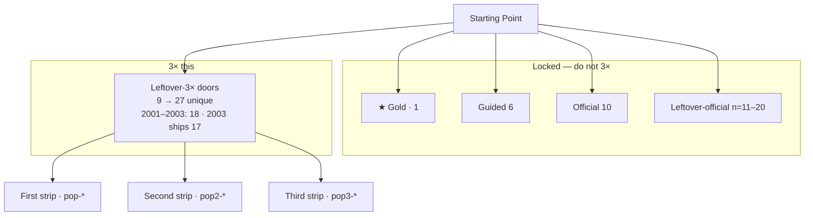
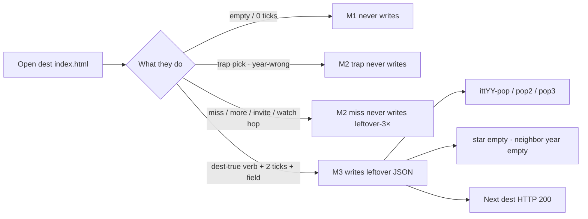
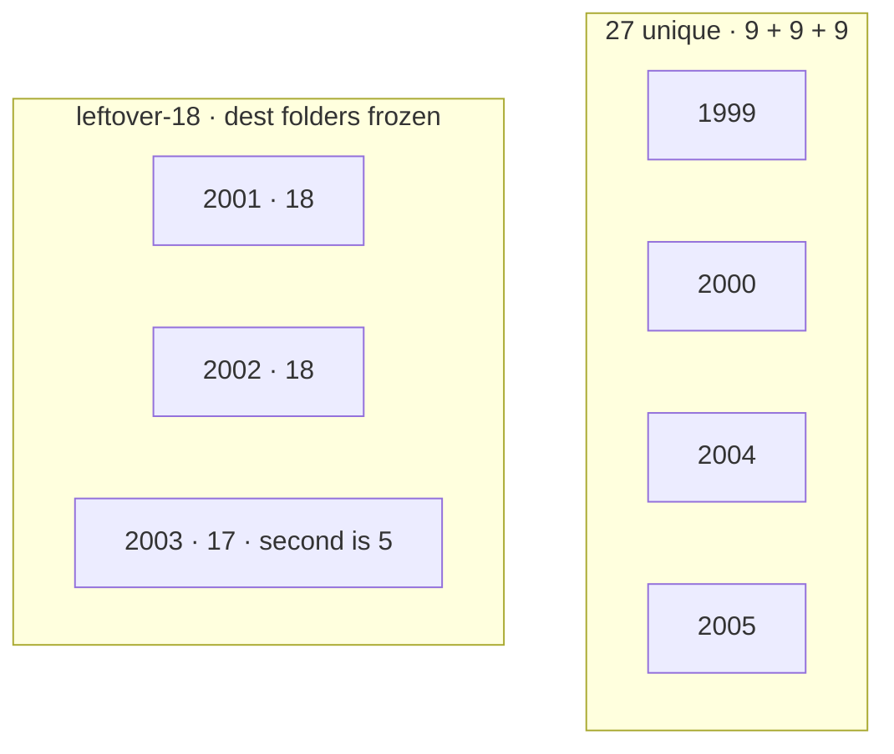
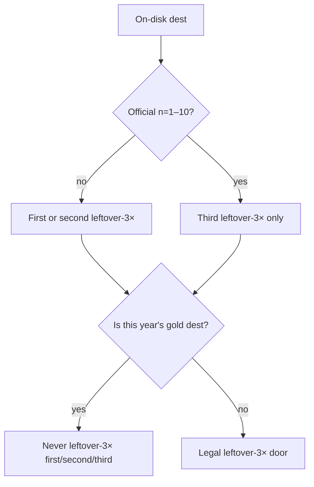
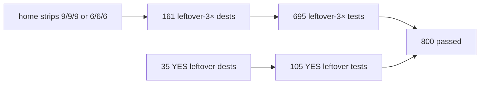

# 1999–2005 leftover-3× ×3 — map (disk now)

**Date:** 2026-09-07  
**Status:** MAP + dest-true leftover-3× machines **shipped**. Dest folders unchanged. Official 10 / gold / guided 6 locked.  
**Paint:** [`scripts/paint-1999-2005-leftover-3x-x3.py`](../scripts/paint-1999-2005-leftover-3x-x3.py)  
**Dest-true upgrade:** [`scripts/implement-1999-2005-lo3x-real.py`](../scripts/implement-1999-2005-lo3x-real.py)  
**YES leftover dests:** [`scripts/implement-1999-2005-yes-lo-real.py`](../scripts/implement-1999-2005-yes-lo-real.py)  
**e2e:** [`e2e/1999-2005-leftover-3x.spec.js`](../e2e/1999-2005-leftover-3x.spec.js) (695 dest-true tests) · [`e2e/1999-2005-yes-leftover.spec.js`](../e2e/1999-2005-yes-leftover.spec.js) · `npm run test:e2e:1999-2005-3x`  
**Dest-by-dest bibles:** [`1999-2005-famous-3x-every-dest/`](1999-2005-famous-3x-every-dest/README.md)

---

## Diagrams (check this)

### Year card — what is 3× and what is locked

### Visitor machine on every leftover-3× dest

### Per-year leftover-3× door counts

### First / second / third — who may sit where

AIM 1999 and MapQuest 2000 are gold — off the third nine. 2001 first may keep Google/Yahoo leftover-18 HOLD.

### e2e check

---

## What 3× is

Leftover-3× used to be **one nine** (3 first + 3 second + 3 third).  
3× that = **three leftover nines = 27 unique doors**, except leftover-18 years.

| Layer | 3×? |
|-------|-----|
| ★ Gold | no · stays 1 |
| Guided 6 | no · stays 6 |
| Official 10 | no · stays 10 |
| Leftover-official n=11–20 | no · stays 10 |
| Leftover-3× doors | **yes** · 9 → 27 (18 on 2001–2003) |
| Dest folders | **no** · no dest-farm |

**V6 now:** 27 unique famous leftover-3× doors on 1999 / 2000 / 2004 / 2005. 18 on leftover-18 (2003 ships 17). First/second must not sit on official n=1–10 dests, except leftover-18 may keep the shipped 2001 Google/Yahoo overlap. Third may reuse official dests. Gold dest is never on the third nine.

---

## Scoreboard

| Year | Dest folders | Leftover-3× unique doors | First | Second | Third | Gold dest off third? |
|------|-------------:|-------------------------:|------:|-------:|------:|----------------------|
| 1999 | 48 | **27** | 9 | 9 | 9 | AIM off |
| 2000 | 54 | **27** | 9 | 9 | 9 | MapQuest off |
| 2001 | 29 | **18** | 6 | 6 | 6 | leftover-18 |
| 2002 | 26 | **18** | 6 | 6 | 6 | leftover-18 |
| 2003 | 23 | **17** | 6 | 5 | 6 | leftover-18 · 1 dest short |
| 2004 | 90 | **27** | 9 | 9 | 9 | thefacebook not the third-only door |
| 2005 | 117 | **27** | 9 | 9 | 9 | Upload off first/second |

JSON first = `scripts/popular-3x-sites.json`.  
JSON third = `scripts/popular-3x3-sites.json`.  
Second lives on `years/YYYY/pages/home.html` + `ui/year/start-extra.js` as `p.itt-pop-more`.

---

## Official 10 (do not put on leftover-3× first/second)

| Year | ★ Gold | Official dests n=1–10 |
|------|--------|------------------------|
| 1999 | AIM `itt99-aim` | `aim` `napster` `google` `blogger` `y2k` `sourceforge` `paypal` `amazon` `ebay` `askjeeves` |
| 2000 | MapQuest `itt00-mapquest` | `mapquest` `amazon` `ebay` `paypal` `napster` `gnutella` `pets` `google` `cnn` `y2k` |
| 2001 | Wikipedia `itt01-wiki` | `wikipedia` `archive` `itunes` `apple` `napster` `movabletype` `google` `yahoo` `amazon` `playable` |
| 2002 | StumbleUpon `itt02-stumble` | `stumbleupon` `isp` `kazaa` `wired` `phoenix` `mozilla` `ipod` `friendster` `movabletype` `playable` |
| 2003 | Photobucket `itt03-photobucket` | `photobucket` `itunes` `wordpress` `linkedin` `myspace` `friendster` `adsense` `bloglines` `blogger` `playable` |
| 2004 | thefacebook networks | `facebook` `gmail` `firefox` `flickr` `delicious` `digg` `web20conference` |
| 2005 | YouTube upload `itt05-yt-uploads` | `youtube` `maps` `pandora` `housingmaps` `digg` `reddit` `flickr` `itunes` `techcrunch` `playable` |

---

## Painted leftover-3× doors

Fame marks:

- **CHART** — contemporaneous Media Metrix / Nielsen (deep-research [S8][S10])
- **EVENT** — same-year launch / acquire / cultural event already frozen in year RESEARCH / READ-FIRST
- **YEAR** — on-disk dest that was a household leftover that year (portal, IM, P2P, blog, social) but not on the chart pages the research opened
- **OFF3** — official dest, legal only on the **third** nine
- **HOLD** — leftover-18 shipped overlap (2001 first on official Google/Yahoo)

### 1999 — 27

**First 9** `itt99-pop-<id>`

| Dest | Fame | Why that year |
|------|------|----------------|
| `livejournal` | YEAR | diary / blog 1999 |
| `neopets` | YEAR | pet-site mania 1999 |
| `egroups` | YEAR | mailing-list web before Yahoo Groups |
| `yahoo` | CHART | Media Metrix Sep 1999 top property |
| `geocities` | CHART + EVENT | Yahoo buy 1999 |
| `slashdot` | YEAR | geek news habit |
| `msn` | CHART | Media Metrix 1999 |
| `hampsterdance` | EVENT | viral 1999 |
| `webvan` | EVENT | bubble grocery |

**Second 9** `itt99-pop2-<id>`

| Dest | Fame | Why that year |
|------|------|----------------|
| `theonion` | YEAR | satire site |
| `drkoop` | EVENT | health-portal bubble |
| `sixdegrees` | YEAR | social graph |
| `aol` | CHART | #1 visits through mid-2000 |
| `excite` | CHART | Media Metrix 1999 |
| `icq` | CHART | pager habit |
| `altavista` | CHART | Media Metrix 1999 |
| `netscape` | CHART | AOL close Mar 1999 |
| `yahoomessenger` | YEAR | IM next to AIM |

**Third 9** `itt99-pop3-<id>` · official dests allowed

| Dest | Fame | Note |
|------|------|------|
| `blogger` | EVENT + OFF3 | Pyra Aug 1999 |
| `etrade` | YEAR | daytrade leftover |
| `paypal` | EVENT + OFF3 | Confinity / X.com 1999 |
| `amazon` | CHART + OFF3 | Bezos POTY |
| `ebay` | CHART + OFF3 | multicolor 1999 |
| `google` | EVENT + OFF3 | $25M Jun 1999 · not #1 |
| `napster` | EVENT + OFF3 | launch + RIAA Dec 1999 |
| `y2k` | EVENT + OFF3 | countdown |
| `askjeeves` | OFF3 | official 10 · **not AIM** |

AIM is gold. Not on any leftover-3× first/second. Not on third.

**1999 CHART leftover-eligible not used on first/second leftover-3×:** `microsoft` `about` `hotbot` `cnn` — stay leftover-2× / leftover-official.  
**BLOCKED (chart, no folder):** Hotmail, Lycos, Go.com, Angelfire, Tripod, Real.com.

### 2000 — 27

**First 9**

| Dest | Fame |
|------|------|
| `half` | EVENT · Half.com / eBay-era used media |
| `limewire` | EVENT · 2000 P2P after Napster |
| `travelocity` | YEAR · travel portal vs Expedia |
| `yahoo` | CHART · #1 visits from mid-2000 |
| `geocities` | CHART continuity |
| `slashdot` | YEAR |
| `msn` | CHART |
| `excite` | CHART continuity |
| `icq` | CHART continuity |

**Second 9**

| Dest | Fame |
|------|------|
| `ivillage` | YEAR · women portal |
| `metafilter` | YEAR · blog community |
| `napsterweb` | EVENT · Napster in the browser |
| `aol` | CHART · still mass · Yahoo passing it |
| `microsoft` | CHART |
| `blogger` | YEAR continuity |
| `altavista` | CHART continuity |
| `homestar` | YEAR · Flash toon |
| `kottke` | YEAR · blogroll |

**Third 9**

| Dest | Note |
|------|------|
| `expedia` | leftover travel |
| `paypal` `ebay` `amazon` `napster` `google` `pets` `cnn` | OFF3 |
| `gnutella` | OFF3 · **not MapQuest** |

Baidu / Everything2 are off first (not US household 2000). MapQuest is gold — off third.

### 2001 — leftover-18 · 18 doors · no nine C

**First 6** (shipped overlap HOLD on official Google/Yahoo)

`google` HOLD · `yahoo` HOLD · `cnn` YEAR · `slashdot` YEAR · `blogger` YEAR · `microsoft` CHART (Nielsen Jun 2001)

**Second 6**

`moveon` EVENT · `grok` EVENT (Grokster) · `appleimac` YEAR · `mozilla` YEAR · `encarta` YEAR · `dmoz` YEAR

**Third 6** OFF3 allowed

`ebay` · `paypal` · `excite` · `wikipedia` · `itunes` · `napster`

Do not add a 19th dest. Do not dest-farm.

### 2002 — leftover-18 · 18 doors

**First 6**

`daypop` YEAR · `googlenews` EVENT (Sep 2002) · `technorati` YEAR · `wikipedia` YEAR · `google` YEAR · `lastfm` YEAR

**Second 6**

`fark` YEAR · `homestar` YEAR · `blogspot` YEAR · `netflix` YEAR · `mtv` YEAR · `ebay` YEAR

**Third 6** OFF3

`amazon` · `yahoo` · `blogger` · `friendster` · `kazaa` · `wired`

### 2003 — leftover-18 · 17 doors · shortfall 1

**First 6** (JSON aligned to start-extra, not old myspace/wordpress)

`skype` EVENT · `delicious` EVENT · `hi5` YEAR · `wikipedia` YEAR · `google` YEAR · `cnn` YEAR

**Second 5** — no 6th non-official dest left

`flash` YEAR · `phoenix` YEAR · `4chan` YEAR · `kazaa` YEAR · `firebird` YEAR

**Third 6** OFF3

`amazon` · `yahoo` · `blogger` · `itunes` · `wordpress` · `myspace`

Only 23 dest folders. After official 10 + nine A, five non-official dests remain for first/second. Need six. **Do not invent a dest.**

### 2004 — 27 · A′ famous (Piczo/Tagged/Odeo off)

**First 9**

`myspace` EVENT · `wikipedia` YEAR · `yahoo` CHART · `skype` YEAR · `livejournal` YEAR · `friendster` YEAR · `cnn` YEAR · `bbc` YEAR · `imdb` YEAR

**Second 9**

`amazon` YEAR · `ebay` YEAR · `orkut` EVENT (Google social) · `craigslist` YEAR · `wow` EVENT (23 Nov 2004) · `linkedin` YEAR · `wordpress` YEAR · `itunes` YEAR · `bloglines` YEAR

**Third 9** OFF3 + leftover

`digg` · `gmail` · `delicious` · `facebook` · `firefox` · `flickr` · `web20conference` · `google` · `msn`

### 2005 — 27 · leftover-3× 2× KEEP dests stay off this 27

**First 9**

`milliondollar` EVENT · `clubpenguin` EVENT · `kayak` EVENT · `myspace` CHART (Zeitgeist #1 gainer + top 10 visits) · `wikipedia` EVENT (500k EN) · `yahoo` CHART (#1 visits) · `dailymotion` EVENT · `googlevideo` EVENT · `earth` EVENT (28 Jun Keyhole)

**Second 9**

`firefox` YEAR · `gmail` YEAR · `vimeo` EVENT · `google` CHART · `amazon` YEAR · `msn` CHART · `aol` YEAR · `skype` EVENT (eBay $2.6B) · `delicious` EVENT (Yahoo 9 Dec)

**Third 9** OFF3

`maps` · `reddit` · `digg` · `youtube` · `flickr` · `itunes` · `pandora` · `housingmaps` · `techcrunch`

2005 leftover-3× **2×** strips stay separate (facebook / lastfm / reader · analytics / googleearth / secondlife · yelp / odeo / linkedin). They are not leftover-3× ×3 doors.

---

## Machine on every leftover-3× dest

Each painted dest has a leftover-3× writer on `sites/<dest>/index.html`:

| Strip | Button | Writes | Never writes |
|-------|--------|--------|--------------|
| First | `[data-pop-go]:not([data-pop-key])` | `ittYY-pop-<id>` | star |
| Second | `[data-pop-go][data-pop-key=pop2-<id>]` | `ittYY-pop2-<id>` | star |
| Third | `[data-pop-go][data-pop-key=pop3-<id>]` | `ittYY-pop3-<id>` | star |

Visitor:

1. **M1 empty/trap** — empty field, 0 ticks, or trap pick → never writes  
2. **M2 miss/wall** — anachronism pick (`<star> as leftover 3×`) → never writes  
3. **M3 complete** — dest-true leftover pick + 2 honesty ticks + field ≥2 + Go → leftover JSON `{real:true, leftover:true, year, multiStep:true}`

Official rooms keep their trail machines. Leftover-3× is a leftover panel on the same dest, not a rebuild.

---

## e2e

| Spec | What it proves |
|------|----------------|
| `e2e/1999-2005-leftover-3x.spec.js` | home strip counts 9/9/9 or 6/6/6 (2003 6/5/6) · every first dest writes `pop-*` · every third dest writes `pop3-*` · star stays empty |
| `e2e/popular-3x-sites.spec.js` | first JSON rooms · count is 9 / 6 / 3 by year |
| `e2e/year-3x3.spec.js` · `year-3x3-all.spec.js` | third strip · gold dest not on third nine |
| `e2e/year-more-3x.spec.js` | second strip ≥ 9 / 5 |
| `e2e/1999-densify.spec.js` … `2005-densify.spec.js` | strip counts + leftover never writes gold |
| `e2e/2005-2010-3x-2x-cut.spec.js` | 2005 leftover-3× 2× nine still unique vs this 27 |

CI canary: `npm run test:e2e:1999-2005-3x`.

---

## Hard locks

- Do not 3× official 10, gold, or guided 6  
- Do not dest-farm. Hotmail / Lycos / Go.com stay **BLOCKED**  
- 2001–2003 dest folders stay 29 / 26 / 23  
- Do not add leftover-4× on 2001–2004  
- 2001 first may keep Google/Yahoo (leftover-18 HOLD). Do not spread that overlap to 1999/2000/2004/2005  
- Leftover complete never writes the star (`itt99-aim` · `itt00-mapquest` · `itt01-wiki` · `itt02-stumble` · `itt03-photobucket` · `itt04-thefacebook-networks` · `itt05-yt-uploads`)  
- Wiped years stay boarded  

---

## Open (not this paint)

- 2003 second strip still **5 / 6** (no 6th non-official dest)  
- Deep-research did not open 2000 / 2002 / 2003 / 2004 Nielsen tables — YEAR dests on those years are event/household, not chart-certified  
- Leftover-2× dests that are not on these 27 stay factory leftover-official / leftover-4× (1999, 2000, 2005)  
- Second-strip `pop2-*` writers are on dest HTML; the named leftover-3× spec walks first + third. Second is covered by home-strip count + dest panel presence  

When a year is named to deepen leftover-2× into dest-true 3-outcome machines, walk [`1999-2005-famous-3x-every-dest/`](1999-2005-famous-3x-every-dest/README.md). Do not reopen leftover-3× ×3 unless a dest on this map is wrong.
