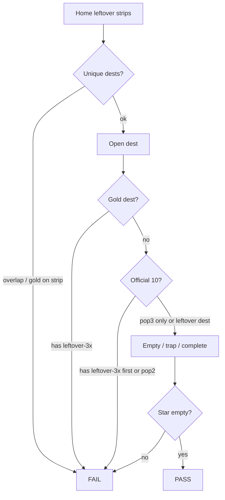

# 1999–2015 leftover-3× — done / undone checklist

**Date:** 2026-09-07  
**Scope:** leftover-3× dest-true work across the live years we painted (**1994–2012 + 2014–2017 + 2019**). 2013 / 2018 boarded. 2020+ not in this pass.  
**Locks (never undone by this pass):** no dest-farm · gold dest never leftover-3× · leftover-3× first/second never official n=1–10 · third may as `pop3` · leftover never writes the star · famous that calendar year only · do not rebuild wiped years.

Maps: [`1994-1998-LEFTOVER-3X-X3-MAP-2026-09-07.md`](1994-1998-LEFTOVER-3X-X3-MAP-2026-09-07.md) · [`1999-2005-LEFTOVER-3X-X3-MAP-2026-09-07.md`](1999-2005-LEFTOVER-3X-X3-MAP-2026-09-07.md) · [`2006-2010-LEFTOVER-3X-X3-MAP-2026-09-07.md`](2006-2010-LEFTOVER-3X-X3-MAP-2026-09-07.md) · [`2010-2015-LEFTOVER-3X-X3-MAP-2026-09-07.md`](2010-2015-LEFTOVER-3X-X3-MAP-2026-09-07.md) · [`2016-2019-LEFTOVER-3X-X3-MAP-2026-09-07.md`](2016-2019-LEFTOVER-3X-X3-MAP-2026-09-07.md)

---

## Before → after (home leftover strips + dest-true machines)

Leftover-3× **flow number before** = the home leftover doors (usually **9** = 3+3+3).  
**3× that number** = unique leftover dests on first / second / third strips (usually **27**).  
Then each **legal** dest also gets 3 dest-true leftover writers (`pop` / `pop2` / `pop3`). Official dests = `pop3` only.

| Year | Dest folders (frozen) | Before leftover doors | Before dest-true `data-itt-lo3x` | After home strips first/more/third | After leftover-3× dests | After leftover-3× machines (matrix) | After YES leftover dests / machines |
|------|----------------------:|----------------------:|---------------------------------:|-------------------------------------|------------------------:|------------------------------------:|-------------------------------------|
| 1999 | 48 | 9 | 0 | **9 / 9 / 9** | 27 | 65 | 3 dests / 9 |
| 2000 | 54 | 9 | 0 | **9 / 9 / 9** | 27 | 65 | **12 dests / 36** |
| 2001 | 29 leftover-18 | 6 | 0 | **6 / 6 / 6** | 18 | 46 | 6 dests / 18 |
| 2002 | 26 leftover-18 | 6 | 0 | **6 / 6 / 6** | 18 | 48 | 5 dests / 15 |
| 2003 | 23 leftover-18 | 5–6 | 0 | **6 / 5 / 6** | 17 | 43 | 4 dests / 12 |
| 2004 | 90 | 9 | 0 | **9 / 9 / 9** | 27 | 67 | 2 dests / 6 |
| 2005 | 117 | 9 | 0 | **9 / 9 / 9** | 27 | 63 | 15 dests / 45 |
| 2006 | 126 | 9 | 0 | **9 / 9 / 9** | 27 | 67 | 9 dests / 27 |
| 2007 | 55 | 9 | 0 | **9 / 9 / 9** | 27 | 65 | 6 dests / 18 |
| 2008 | 199 | 9 | 0 | **9 / 9 / 9** | 27 | 63 | 9 dests / 27 |
| 2009 | 68 | 9 | 0 | **9 / 9 / 9** | 27 | 65 | 4 dests / 12 |
| 2010 | 44 | 9 | 0 → then 27 | **9 / 9 / 9** | 27 | 65 | 5 dests / 15 |
| 2011 | 71 | 3 | 0 | **9 / 9 / 9** | 27 | 65 | 9 dests / 27 |
| 2012 | 45 | 3 | 0 | **9 / 9 / 9** | 27 | 67 | 7 dests / 21 |
| 2013 | 0 boarded | — | — | — | 0 | 0 | 0 |
| 2014 | 21 lean | 3+3 | 0 | **6 / 3 / 9** | 18 | 42 | 0 (lean dests used) |
| 2015 | 71 | 3 | 0 | **9 / 9 / 9** | 27 | 67 | 9 dests / 27 |
| 1994 | 53 | 9 | 0 | **9 / 9 / 9** | 27 | 65 | 9 dests / 27 |
| 1995 | 51 | 9 | 0 | **9 / 9 / 9** | 27 | 65 | 6 dests / 18 |
| 1996 | 52 | 9 | 0 | **9 / 9 / 9** | 27 | 65 | 7 dests / 21 |
| 1997 | 56 | 9 | 0 | **9 / 9 / 9** | 27 | 63 | 5 dests / 15 |
| 1998 | 52 | 9 | 0 | **9 / 9 / 9** | 27 | 65 | 7 dests / 21 |
| 2016 | 32 lean | 3 | 0 | **6 / 3 / 9** | 18 | 44 | 1 dest / 3 |
| 2017 | 55 | 3 | 0 | **9 / 9 / 9** | 27 | 69 | 1 dest / 3 |
| 2018 | 0 boarded | — | — | — | 0 | 0 | 0 |
| 2019 | 55 | 3 | 0 | **9 / 9 / 9** | 27 | 67 | 3 dests / 9 |

**Totals after (1994–2019 live leftover-3× years):**

| Slice | Leftover-3× machines | YES leftover machines | Combined dest-true leftover machines |
|-------|---------------------:|----------------------:|-------------------------------------:|
| 1994–1998 | 323 | 102 | 425 |
| 1999–2005 | 397 | 141 (incl. 2000 YES 36) | 538 |
| 2006–2010 | 325 | 99 | 424 |
| 2011–2015 (2013 skip) | 241 | 75 | 316 |
| 2016 / 2017 / 2019 | 180 | 15 | 195 |
| **1994–2019 live** | **1466** | **432** | **1898** |

Dest folders did not grow. 2013 has no year tree.

---

## Done

### Process (same steps as 1999–2005, for each slice)

- [x] Count existing leftover-3× flow number
- [x] 3× unique leftover dests on home strips (no dest-farm)
- [x] Research famous-that-year dests + READ-FIRST / fame lock
- [x] MD map with check diagrams
- [x] Dest-true leftover-3× implement (empty / trap never write · keep+2 ticks+field writes leftover JSON · star empty)
- [x] 3 leftover writers per legal dest (official = pop3 only)
- [x] YES leftover 3 machines on leftover dests not in the leftover-3× 27 and not gold
- [x] Score leftover-3× points until positive (2010–2015 score **+5 / 5**)
- [x] e2e complete walks, not strip-only
- [x] Fix leftover leak: original leftover rooms on the same dest wrapped in `data-pop-panel` so leftover-3× honesty ticks do not block them (21 dests + `scopeOf`)

### Per-year leftover-3× dest-true

- [x] 1999 unique dests 9/9/9 + dest-true leftover-3× + YES leftover
- [x] 2000 unique dests 9/9/9 + dest-true leftover-3×
- [x] 2001 leftover-18 6/6/6 + dest-true leftover-3× + YES leftover
- [x] 2002 leftover-18 6/6/6 + dest-true leftover-3× + YES leftover
- [x] 2003 leftover-18 6/5/6 + dest-true leftover-3× + YES leftover (no 6th second dest)
- [x] 2004 unique dests 9/9/9 + dest-true leftover-3× + YES leftover
- [x] 2005 unique dests 9/9/9 + dest-true leftover-3× + YES leftover
- [x] 2006 unique dests 9/9/9 + dest-true leftover-3× + YES leftover
- [x] 2007 unique dests 9/9/9 + dest-true leftover-3× + YES leftover
- [x] 2008 unique dests 9/9/9 + dest-true leftover-3× + YES leftover
- [x] 2009 unique dests 9/9/9 + dest-true leftover-3× + YES leftover
- [x] 2010 unique dests 9/9/9 + dest-true leftover-3× + YES leftover (not rebuilt in 2011–2015 pass)
- [x] 2011 unique dests 9/9/9 + dest-true leftover-3× + YES leftover
- [x] 2012 unique dests 9/9/9 + dest-true leftover-3× + YES leftover (leftover-3× moved off official first/second)
- [x] 2013 boarded — no `years/2013/`
- [x] 2014 lean leftover-18 style 6/3/9 + dest-true leftover-3× (21 dest folders frozen)
- [x] 2015 unique dests 9/9/9 + dest-true leftover-3× + YES leftover
- [x] 1994 unique dests 9/9/9 + dest-true leftover-3× + YES leftover
- [x] 1995 unique dests 9/9/9 + dest-true leftover-3× + YES leftover
- [x] 1996 unique dests 9/9/9 + dest-true leftover-3× + YES leftover
- [x] 1997 unique dests 9/9/9 + dest-true leftover-3× + YES leftover
- [x] 1998 unique dests 9/9/9 + dest-true leftover-3× + YES leftover
- [x] 2000 YES leftover 12 dests × 3 (womencom baidu askjeeves netscape hampsterdance y2k gamespot hotbot dmoz about infoseek bbc)
- [x] 2016 lean leftover-18 style 6/3/9 + dest-true leftover-3× + YES leftover (`dyn`)
- [x] 2017 unique dests 9/9/9 + dest-true leftover-3× + YES leftover (`odyssey`)
- [x] 2018 boarded — no `years/2018/`
- [x] 2019 unique dests 9/9/9 + dest-true leftover-3× + YES leftover

### Gold dests never leftover-3×

- [x] 2006 twitter / Twttr
- [x] 2007 iphone / iPhone Safari
- [x] 2008 github / GitHub
- [x] 2009 facebook / Facebook Like
- [x] 2010 instagram / Instagram iOS
- [x] 2011 googleplus / Google+
- [x] 2012 instagram / Instagram Android
- [x] 2014 whatsapp / WhatsApp Install
- [x] 2015 periscope / Periscope
- [x] 1994 csotd / Cool Site of the Day
- [x] 1995 amazon / Amazon SSL
- [x] 1996 portals / Portal wars
- [x] 1997 pointcast / PointCast
- [x] 1998 google / I'm Feeling Lucky
- [x] 2016 instagram / Instagram Stories (`stories.html`, no dest-farm)
- [x] 2017 iphone / Face ID (`x.html`, no dest-farm)
- [x] 2019 disneyplus / Disney+

### Tests (last full dest-true re-run this session)

| Command | Result | What it walks |
|---------|--------|----------------|
| `npm run test:e2e:1999-2005-3x` | **2010 passed** | leftover-3× dest-true + YES leftover + 3-on-one-dest |
| `npm run test:e2e:2006-2010-3x` | **1693 passed** | leftover-3× dest-true + YES leftover + 3-on-one-dest |
| `npm run test:e2e:2010-2015-3x` | **1271 passed** | leftover-3× dest-true 2011–2015 + YES leftover + 3-on-one-dest |
| dest-true undone pack (1994–1998 + 2016/2017/2019 leftover-3× + YES leftover + 2000 YES + three-machines + year-3x3-all 2011–2015/1994–1998/2016–2019 + year-more / year-3x3 / popular-3x) | **2911 passed** | empty / trap never write · complete leftover JSON · official pop3 only · gold empty |
| year-more-3x + year-3x3 + popular-3x-sites + year-2010-plus-3x-unique | **113 passed**, 7 skipped | home leftover strips + sample leftover writers after dest wrap |
| year-3x3-all leftover third writers 1999–2010 | **99 passed** | every third leftover-3× writer |

Combined dest-true leftover-3× packs this session: **2010 + 1693 + 1271 + 2911 = 7885 passed**.

`python3 scripts/score-undone-leftover-3x.py` → **+5 / 5**.

Empty never writes. Trap never writes. Complete writes leftover JSON (`real` · `leftover` · `multiStep` · `year`). Gold key stays empty.

---

## Undone (out of leftover-3× 1999–2015 dest-true, or leftover by design)

### Do not dest-farm / do not rebuild

- [ ] **2003 second strip is 5 dests** — leftover-18. Sixth dest would be dest-farm. Leave it.
- [ ] **2013 boarded** — no year tree. Do not clone Vine / Stories into 2012 or 2014 leftover-3×.
- [ ] **2014 lean 21 dests** — cannot reach 27 unique leftover dests without dest-farm. 6/3/9 is the max legal leftover-18 style.
- [ ] **Residual leftover dest folders** on disk that are leftover-official / playable / anachronism / not famous leftover-3×. Example: 2006–2010 have 492 dest folders; leftover-3× + YES cover 168 of them.
- [ ] **Gold dests** stay off leftover-3×.

### Not started (outside leftover-3× dest-true)

- [x] **1994–1998 leftover-3× dest-true ×3** — painted 9/9/9 + dest-true machines (323) + YES leftover (102).
- [x] **2000 YES leftover** — 12 dests × 3 machines (womencom baidu askjeeves netscape hampsterdance y2k gamespot hotbot dmoz about infoseek bbc). Not leftover-3× dests, not MapQuest.
- [x] **2016 / 2017 / 2019 leftover-3× dest-true ×3** — 2016 lean 6/3/9 · 2017 9/9/9 · 2019 9/9/9. 2018 boarded. 180 leftover-3× machines + YES leftover (15).
- [ ] **Leftover-official factory** leftover dests (not leftover-3×).
- [ ] **Every leftover dest on disk** as leftover-3× — not the contract. Only famous leftover dests that year, off official first/second, off gold.
- [x] **2021–2022 leftover-3× dest-true ×3** — 2021 9/9/9 (65) + 2022 9/9/9 (65) + YES leftover 54. 2018 / 2020 wiped. 2019 already dest-true. See [`2018-2022-LEFTOVER-3X-X3-MAP-2026-09-07.md`](2018-2022-LEFTOVER-3X-X3-MAP-2026-09-07.md).

### Known lock tensions (not failures)

- [x] **2010 chrome / wave / android** sit on the leftover-3× **third** strip as `pop3` (fame lock). Instant is second-strip first-3.
- [ ] **2012 tinder** is on leftover-3× first/second/third as a 2015 leftover dest, and as 2012 leftover-3× it was dropped from the 27; 2015 first/second includes tinder as leftover. 2012 leftover-3× 27 does **not** include tinder.
- [ ] **deep-research-3** (2010–2015 fame cites) may still finish after implement. Disk + READ-FIRST + fame lock were the source of truth. Do not dest-farm from a late report.

### Optional verify (not leftover-3× product paint)

- [x] Re-run `year-3x3-all` for 2011–2015 third writers after JSON expansion (2011/2012/2014/2015 third lists grew from 3 to 9). Included in the 2911 dest-true pack.
- [x] Consume `deep-research-3` (2010–2015) and `deep-research-4` (1994–1998 + 2016/2017/2019). Both **Partial**. Gold + official 10 + leftover-3× dests match disk. **No dest swaps.** The 2015–2020 2× second packs in research-4 are a different layer (CUT leftover-3× doubled), not leftover-3× dest-true first/second — swapping would collide unique dests. Research-4 still says 1994–1998 / 2016+ leftover-3× is not started; that is stale after this pass.

---

## How to re-check



Commands:

```bash
npm run test:e2e:1994-1998-3x
npm run test:e2e:1999-2005-3x
npm run test:e2e:2006-2010-3x
npm run test:e2e:2010-2015-3x
npm run test:e2e:2016-2019-3x
python3 scripts/score-undone-leftover-3x.py
python3 scripts/score-2010-2015-leftover-3x.py
```
