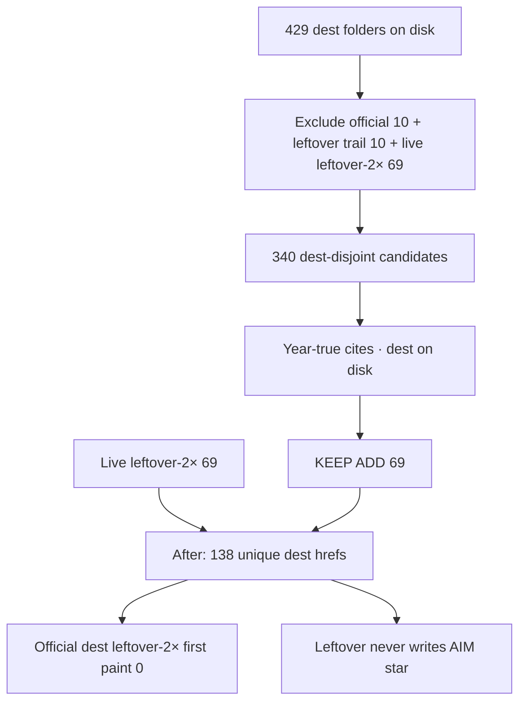

# 1999 leftover-2× unique dest links — double research

**Date:** 2026-09-26  
**Kind:** leftover-2× unique dest **links** (hrefs). Not dest-farm. Not leftover dest KEEP.  
**Status:** implemented 2026-09-26. Leftover-2× unique dests **69 → 138**. Dest folders stay **429**. Official dest leftover-2× first paint **0**.  
**Ship law:** [`DISK-TRUTH.md`](DISK-TRUTH.md) · [`LEFTOVER-2X-UNIQUE-LINKS.md`](LEFTOVER-2X-UNIQUE-LINKS.md) L1–L13.  
**Source run:** deep-research workflow 2026-09-26 (status **Partial**).

---

## Question

Can 1999 leftover-2× unique dests **double** (69 → 138) with dests already on disk and year-true cites?

## Answer

**Yes.** Dest folders on disk: **429**. Live leftover-2× unique dests: **69**. Cap after 2×: **138**. Room after exclusions: **340** dests with `index.html`. This pass names **exactly 69 KEEP ADD dests**. All 69 have `years/1999/sites/<slug>/index.html`. Overlap with the live 69: **0**. Missing dest folders: **0**.

Do not dest-farm. Miss the cap rather than invent dests. Catalog + leftover dest rails written 2026-09-26. Official dest HTML leftover-2× first paint 0.



---

## Law this pass

| Rule | Value |
|------|--------|
| What 2×s | Unique dest **hrefs** in leftover-2× rails |
| One dest once | No duplicate slug in the 1999 leftover-2× list |
| Dest on disk | `years/1999/sites/<slug>/index.html` already |
| Official dest leftover-2× | First paint **0** |
| leftover-3× unique | Catalog stays **empty** |
| leftover-4× unique | No 1999 row |
| Star | Leftover never writes `itt99-aim` |
| Alphabetical fill | Out (`123-reg` class) |
| Extra dest DROP | Do not restore |

### Ban list (not ADD)

**Official n=1–10:** `aim` · `napster` · `google` · `blogger` · `y2k` · `sourceforge` · `paypal` · `amazon` · `ebay` · `askjeeves`

**Leftover trail n=11–20:** `yahoo` · `cnn` · `microsoft` · `geocities` · `slashdot` · `livejournal` · `dmoz` · `excite` · `aol` · `netscape`

**Extra dest DROP:** `apple` · `geocities` · `hotmail` · `microsoft` · `netflix` · `yahoo`  
`apple` / `hotmail` / `netflix` have no dest folder. `yahoo` / `microsoft` / `geocities` stay leftover-trail dests only.

**Hotmail:** ClickZ Sep 1999 site #9 (13,648k unique visitors). No `years/1999/sites/hotmail/index.html`. DROP. Not in the live 69. Not in KEEP ADD.

---

## Counts

| Bucket | n |
|--------|---|
| Dest folders with `index.html` | 429 |
| Live leftover-2× unique dests | 69 |
| Official 10 | 10 |
| Leftover trail 10 | 10 |
| leftover dest KEEP | 0 |
| extra dest KEEP | 0 |
| leftover-3× unique catalog | empty |
| Dest-disjoint room | 340 |
| KEEP ADD this pass | 69 |
| After 2× (if implemented) | 138 |

---

## Live leftover-2× 69 (already in catalog — not ADD)

`youvegotmail` · `about` · `altavista` · `boocom` · `bowienet` · `drkoop` · `egroups` · `etrade` · `flash4` · `gamespot` · `hampsterdance` · `hotbot` · `icq` · `infoseek` · `matrix` · `msn` · `msngaming` · `mynetscape` · `neopets` · `netcenter` · `seti` · `sixdegrees` · `theonion` · `webvan` · `yahoomessenger` · `zombo` · `lycos` · `go` · `bbc` · `infospace` · `bluemountain` · `realplayer` · `tripod` · `passport` · `looksmart` · `snap` · `xoom` · `goto` · `juno` · `weather` · `attnet` · `mtv` · `fortunecity` · `citysearch` · `sportsline` · `earthlink` · `barnes` · `womencom` · `ivillage` · `foxnews` · `macromedia` · `cdnow` · `mindspring` · `sony` · `snowball` · `idg` · `mypoints` · `travelocity` · `mcafee` · `mapquest` · `msnbc` · `pathfinder` · `digitalcity` · `expedia` · `broadcastcom` · `warnerbros` · `go2net` · `exciteathome` · `nbci`

Lycos #4 / BBC #8 / InfoSpace #10 (Hosting.com June 1999) and the September 1999 ClickZ dests through `nbci` are already in this 69.

---

## KEEP ADD 69 (proposed)

All dest-disjoint from the live 69, official 10, leftover trail 10, leftover-3×, leftover-4×. All have `index.html` on disk as of 2026-09-26.

Ranks 1–27 are reserved-144 dests still unused as leftover-2× unique dest **links**. Ranks 28–69 are harvest leftover dests n=45–86 ([`2x-harvest-c-1999.md`](2x-harvest-c-1999.md)). Together they fill ADD 69.

### 1–27 · reserved dests unused as leftover-2× links

| # | slug | why this year |
|---|------|----------------|
| 1 | `craigslist` | Reserved 1999 mass · dest on disk |
| 2 | `cyworld` | Wikipedia Category Internet properties established in 1999 |
| 3 | `diaryland` | Sep 1999 hosted blog tool |
| 4 | `digitalspy` | Established 1999 · dest on disk |
| 5 | `disney` | Go Network / Disney–Infoseek orbit · dest on disk |
| 6 | `drudge` | 1999 news leftover · dest on disk |
| 7 | `drugstore` | 1999 e-tail leftover · dest on disk |
| 8 | `dslreports` | Established 1999 · dest on disk |
| 9 | `ehow` | Established 1999 · dest on disk |
| 10 | `epinions` | Established 1999 · dest on disk |
| 11 | `espn` | 1999 sports leftover · dest on disk |
| 12 | `etoys` | 1999 e-tail leftover · dest on disk |
| 13 | `eurogamer` | Established 1999 · dest on disk |
| 14 | `everquest` | 1999 MMO leftover · dest on disk |
| 15 | `ezboard` | 1999 forum leftover · dest on disk |
| 16 | `fark` | Established 1999 · dest on disk |
| 17 | `fatwallet` | Established 1999 · dest on disk |
| 18 | `flooz` | 1999 bubble leftover · dest on disk |
| 19 | `freeserve` | 1999 ISP leftover · dest on disk |
| 20 | `freshdirect` | Harvest 1999 leftover · dest on disk |
| 21 | `gamefaqs` | 1999 games leftover · dest on disk |
| 22 | `gamerankings` | Established 1999 · dest on disk |
| 23 | `garageband` | Established 1999 · dest on disk |
| 24 | `h2g2` | Established 1999 · dest on disk |
| 25 | `halfcom` | Established 1999 · dest on disk |
| 26 | `hushmail` | Established 1999 · dest on disk |
| 27 | `ie5` | IE5 1999 shell leftover · dest on disk |

### 28–69 · harvest leftover dests n=45–86

| # | slug | harvest n | why this year |
|---|------|-----------|----------------|
| 28 | `imode` | 45 | i-mode 1999 · Timeline of the Internet |
| 29 | `surveymonkey` | 46 | Wikipedia Category established 1999 |
| 30 | `seamless` | 47 | Seamless 1999 leftover |
| 31 | `overstock` | 48 | Overstock 1999 leftover |
| 32 | `ofoto` | 49 | Ofoto / Kodak Gallery 1999 leftover |
| 33 | `jibjab` | 50 | JibJab 1999 leftover |
| 34 | `fastmail` | 51 | Fastmail 1999 leftover |
| 35 | `slickdeals` | 52 | Slickdeals 1999 leftover |
| 36 | `trademe` | 53 | Trade Me 1999 leftover |
| 37 | `ctrip` | 54 | Ctrip 1999 leftover |
| 38 | `dangdang` | 55 | Dangdang 1999 leftover |
| 39 | `dcinside` | 56 | DCinside 1999 leftover |
| 40 | `fc2` | 57 | FC2 1999 leftover |
| 41 | `kaskus` | 58 | Kaskus 1999 leftover |
| 42 | `tianya` | 59 | Tianya 1999 leftover |
| 43 | `eksisozluk` | 60 | Ekşi Sözlük 1999 leftover |
| 44 | `indexhu` | 61 | Index.hu 1999 leftover |
| 45 | `nunl` | 62 | NU.nl 1999 leftover |
| 46 | `malaysiakini` | 63 | Malaysiakini 1999 leftover |
| 47 | `bungie` | 64 | Halo.Bungie.Org 1999 leftover |
| 48 | `neogaf` | 65 | NeoGAF 1999 leftover |
| 49 | `dvdtalk` | 66 | DVD Talk 1999 leftover |
| 50 | `adventuregamers` | 67 | Adventure Gamers 1999 leftover |
| 51 | `ocremix` | 68 | OverClocked ReMix 1999 leftover |
| 52 | `advogato` | 69 | Advogato 1999 leftover |
| 53 | `postini` | 70 | Postini 1999 leftover |
| 54 | `singingfish` | 71 | Singingfish 1999 leftover |
| 55 | `icravetv` | 72 | ICraveTV 1999 leftover |
| 56 | `pitas` | 73 | Pitas Jul 1999 first hosted blog tool |
| 57 | `thirdvoice` | 74 | Third Voice in 1999 best-sites set |
| 58 | `webshots` | 75 | Webshots 1999 leftover |
| 59 | `cluetrain` | 76 | Cluetrain Manifesto 1999 leftover |
| 60 | `healthline` | 77 | Healthline 1999 leftover |
| 61 | `speechbot` | 78 | Speechbot 1999 leftover |
| 62 | `internet2` | 79 | Internet2 / Abilene 1999 leftover |
| 63 | `asheron` | 80 | Asheron's Call 1999 leftover |
| 64 | `quake3` | 81 | Quake III Arena 1999 leftover |
| 65 | `unreal` | 82 | Unreal Tournament 1999 leftover |
| 66 | `aoe2` | 83 | Age of Empires II 1999 leftover |
| 67 | `dreamcast` | 84 | Dreamcast 1999 leftover |
| 68 | `counterstrike` | 85 | Counter-Strike 1999 leftover |
| 69 | `healtheon` | 86 | Healtheon 1999 leftover |

Slug list (paste into catalog):

```
craigslist, cyworld, diaryland, digitalspy, disney, drudge, drugstore, dslreports, ehow, epinions, espn, etoys, eurogamer, everquest, ezboard, fark, fatwallet, flooz, freeserve, freshdirect, gamefaqs, gamerankings, garageband, h2g2, halfcom, hushmail, ie5, imode, surveymonkey, seamless, overstock, ofoto, jibjab, fastmail, slickdeals, trademe, ctrip, dangdang, dcinside, fc2, kaskus, tianya, eksisozluk, indexhu, nunl, malaysiakini, bungie, neogaf, dvdtalk, adventuregamers, ocremix, advogato, postini, singingfish, icravetv, pitas, thirdvoice, webshots, cluetrain, healthline, speechbot, internet2, asheron, quake3, unreal, aoe2, dreamcast, counterstrike, healtheon
```

---

## Strong cites not in the ranked 69

On disk, dest-disjoint from live 69 / official 10 / leftover trail. Ranked list started at `craigslist`, so these visit-rank dests were left out.

| slug | cite | June / Sep 1999 |
|------|------|-----------------|
| `americangreetings` | Hosting.com June 1999 **#9** · 38,912,000 visits | strongest unused June dest |
| `angelfire` | ClickZ Sep 1999 site **#13** · 11,075k | homestead leftover |
| `zdnet` | ClickZ Sep 1999 property #15 / site #24 | tech leftover |
| `cnet` | ClickZ Sep 1999 property #17 / site #34 | tech leftover |
| `theglobe` | ClickZ Sep 1999 property #49 · 3,083k | community leftover |

**Swap option:** put these five at the top of KEEP ADD and drop the last five harvest dests (`unreal` · `aoe2` · `dreamcast` · `counterstrike` · `healtheon`) if visit-rank should beat reserved-order.

Also dest-disjoint and on disk, **not** given KEEP/DROP in this pass: `alibaba` · `alltheweb` · `battlenet` · `ign` · `imdb` · `match` · `monster` · `naver` · `qq` · `sina` · `twochannel` · `xanga` · `zappos` and other reserved slugs before `craigslist`. `albino` Wikipedia launch is **1996**, so it is not an established-in-1999 dest.

Harvest dests 145–288 exist on disk. Those rows are Wikipedia category dumps (C2). This pass treats them as alphabetical-fill class, not famous-that-year ADD.

---

## Sources

| # | Source | What it gave |
|---|--------|----------------|
| S1 | [`e2e/leftover-2x-unique-links.matrix.json`](../e2e/leftover-2x-unique-links.matrix.json) 1999 row | Live leftover-2× **69** |
| S2 | [`js/config/leftover-3x-unique.js`](../js/config/leftover-3x-unique.js) | leftover-3× catalog **empty** |
| S3 | [`js/config/flow-trails.js`](../js/config/flow-trails.js) 1999 | Official 10 + leftover trail 10 |
| S4 | [Hosting.com June visits since 1995](https://hosting.com/blog/the-most-visited-websites-every-year-since-1995/) | June 1999 top 10 · `americangreetings` #9 remaining |
| S5 | [`2x-harvest-c-1999.md`](2x-harvest-c-1999.md) | Harvest dests 45–86 + reserved 144 |
| S7 | [ClickZ Top 50 Sep 1999](https://clickz.com/top-50-sites-and-properties-of-september-1999/58164/) | `angelfire` · `zdnet` · `cnet` · `theglobe` · Hotmail #9 no dest |
| S9 | [Wikipedia Category Internet properties established in 1999](https://en.wikipedia.org/w/api.php?action=query&list=categorymembers&cmtitle=Category:Internet_properties_established_in_1999&cmlimit=500&format=json) | ~302 members · slug map to dest folders |
| S13 | [`TODO-EXTRA-DEST-RESEARCH.md`](TODO-EXTRA-DEST-RESEARCH.md) | Extra dest DROP six |
| S19 | [`2x-harvest-c-1999.md`](2x-harvest-c-1999.md) reserved 144 + dests 45–86 | Ranked KEEP ADD order |

---

## Coverage gaps (why Partial)

- Not every harvest n=45–144 dest HTML was opened. Sampled dests had `index.html`.
- Wikipedia HTML is truncated (~200 of ~302). Remaining matches used API titles + dest-folder names.
- ClickZ “CitySearch-Ticketmaster” already has leftover-2× `citysearch`. `ticketmaster` dest exists; that source does not uniquely name that slug.
- Porn / TLD / Infowars / Goatse / Naked News are not ADD dests.
- `playable` skipped (museum game). `netflix` is extra dest DROP.
- If harvest n=45–86 ranked before reserved `craigslist`…`ie5`, the **same 69 slugs** would ship in a different order.

---

## Implemented 2026-09-26

1. 69 KEEP ADD slugs in `js/config/leftover-2x-unique-links.js` 1999 and the matrix (n=138).  
2. Rewrote existing leftover dest leftover-2× rails, then **injected** rails on leftover dests that had none (leftover trail dests yahoo / microsoft / geocities). Official dest HTML leftover-2× first paint 0. 1999 flow map lists all **138** unique dests.  
3. Dest folders stay **429**. leftover-3× catalogs stay empty.  
4. Spec pin: `expect(byYear["1999"]).toBe(138)`.
