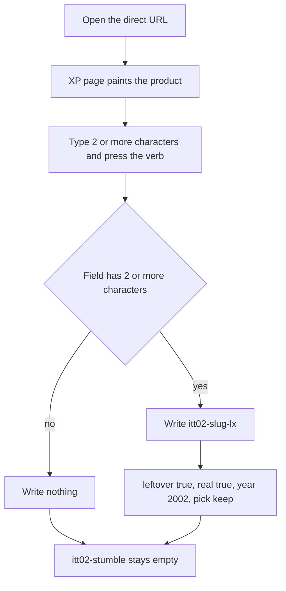
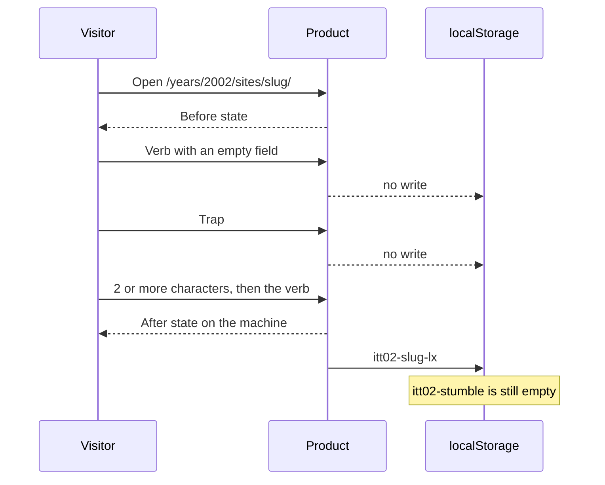
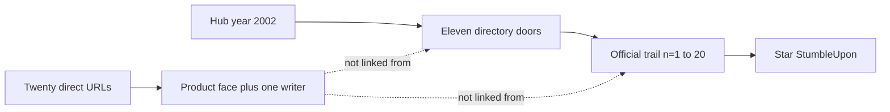

# 2002 famous double — twenty leftover rooms

**Date:** 2026-10-05
**Status:** Implemented 2026-10-05. Twenty leftover folders are on disk. Official trail still 20. Star still `itt02-stumble`. Not leftover-2×. Spec: `e2e/2002-famous-double.spec.js`.
**Ship law:** [`DISK-TRUTH.md`](DISK-TRUTH.md) · `js/year-card.json` (2002 stays frozen) · [`FAMOUS-DOUBLE-CRITERIA.md`](FAMOUS-DOUBLE-CRITERIA.md).

The forest class says Stop for a new 1994–2006 folder. This pass is the named implement: the same double as 2016, asked for 2002 in the same breath as the build. Hand-written rooms. No generator that calls `assert_mutable`. The year card stays `frozen: true`.

## Goal

Double the official 2002 trail with twenty real rooms that are not already on the 2002 disk. Each room is one visitor verb, one cite, one leftover writer. The official twenty, the StumbleUpon star, Room Sticky, the eleven directory doors, and the guided six stay as they are.

## What this pass keeps

| Surface | Stays |
|---------|--------|
| Official trail | n=1–20, same hrefs, same whenKeys |
| Star | `itt02-stumble` only, from StumbleUpon |
| Year toy | `itt02-game-roomsticky` only |
| Directory | Start, Stumble, KaZaA, Wired, Friendster, Phoenix, Always-on, Google News, Daypop, Yahoo!, About |
| Guided six | `#ott-guided-2002` still six items |
| Existing forest dests | Two leftover writers where they already had them |
| These 20 rooms | One writer, `itt02-<slug>-lx`, no 2× strip, no 4× strip, no second game |

Disk after the implement: **250** first-level folders under `years/2002/sites/`. **302** HTML files under `years/2002/`. **264** HTML files that contain `data-lo-panel`.

## How a room works

An empty verb click, the trap button, and a one-character field all take the refuse branch. The trap button is labeled with the wrong action and the sheet adds “ · never writes”. The verb is the only save. Pressing it with a filled field swaps the product to the after line and writes the key.

The year frame can open a room inside `iframe#content`. The parent URL stays on `/years/2002/`. The directory does not gain a door.

## The twenty

| # | Slug | Verb | Key | What the visitor does | Cite |
|--:|------|------|-----|------------------------|------|
| 1 | `audiogalaxy` | Halt | `itt02-audiogalaxy-lx` | The search comes back prohibited | CNET, 18 Jun 2002 |
| 2 | `ffxi` | Enter | `itt02-ffxi-lx` | Enter Vana'diel on the Japan service | IGN, 28 Feb 2002 |
| 3 | `plaxo` | Request | `itt02-plaxo-lx` | Request a plain-text contact update | Wired, 12 Nov 2002 |
| 4 | `ichat` | Send | `itt02-ichat-lx` | Send an AIM line | Apple, 23 Aug 2002 |
| 5 | `tabletpc` | Ink | `itt02-tabletpc-lx` | Ink a note on the slate | Microsoft, 7 Nov 2002 |
| 6 | `qt6` | Play | `itt02-qt6-lx` | Play MPEG-4 | Apple, 15 Oct 2002, for the 15 Jul release |
| 7 | `dotnet` | Run | `itt02-dotnet-lx` | Run the framework | Microsoft, 13 Feb 2002 |
| 8 | `eclipse2` | Open | `itt02-eclipse2-lx` | Open a Java project | Eclipse, 28 Jun 2002 |
| 9 | `apache2` | Start | `itt02-apache2-lx` | Start httpd 2.0.35 | LWN, 5 Apr 2002 |
| 10 | `j2se14` | Compile | `itt02-j2se14-lx` | Compile with 1.4 | Sun, 6 Feb 2002 |
| 11 | `adwords` | Bid | `itt02-adwords-lx` | Set a max cost per click | Google, 20 Feb 2002 |
| 12 | `aws` | Call | `itt02-aws-lx` | Call the catalog API | Amazon, 16 Jul 2002 |
| 13 | `nokia7650` | Snap | `itt02-nokia7650-lx` | Send a VGA picture as MMS | CNET, 26 Jun 2002 |
| 14 | `sidekick` | Chat | `itt02-sidekick-lx` | Send AIM on the monochrome Hiptop | T-Mobile, 1 Oct 2002 |
| 15 | `bb5810` | Read | `itt02-bb5810-lx` | Read push mail | RIM, 4 Mar 2002 |
| 16 | `imacg4` | Tilt | `itt02-imacg4-lx` | Tilt the floating screen | Apple, 7 Jan 2002 |
| 17 | `dwmx` | Publish | `itt02-dwmx-lx` | Publish the page | Macromedia, 29 May 2002 |
| 18 | `ns7` | Tab | `itt02-ns7-lx` | Open a tab | ZDNet, 29 Aug 2002 |
| 19 | `nnw` | Subscribe | `itt02-nnw-lx` | Subscribe in NetNewsWire Lite | Ranchero history, Lite 1.0 on 19 Sep 2002 |
| 20 | `tungsten` | Slide | `itt02-tungsten-lx` | Slide open Graffiti | Computerworld, 28 Oct 2002 |

Direct URLs, with the museum on port 8080:

1. http://127.0.0.1:8080/years/2002/sites/audiogalaxy/index.html
2. http://127.0.0.1:8080/years/2002/sites/ffxi/index.html
3. http://127.0.0.1:8080/years/2002/sites/plaxo/index.html
4. http://127.0.0.1:8080/years/2002/sites/ichat/index.html
5. http://127.0.0.1:8080/years/2002/sites/tabletpc/index.html
6. http://127.0.0.1:8080/years/2002/sites/qt6/index.html
7. http://127.0.0.1:8080/years/2002/sites/dotnet/index.html
8. http://127.0.0.1:8080/years/2002/sites/eclipse2/index.html
9. http://127.0.0.1:8080/years/2002/sites/apache2/index.html
10. http://127.0.0.1:8080/years/2002/sites/j2se14/index.html
11. http://127.0.0.1:8080/years/2002/sites/adwords/index.html
12. http://127.0.0.1:8080/years/2002/sites/aws/index.html
13. http://127.0.0.1:8080/years/2002/sites/nokia7650/index.html
14. http://127.0.0.1:8080/years/2002/sites/sidekick/index.html
15. http://127.0.0.1:8080/years/2002/sites/bb5810/index.html
16. http://127.0.0.1:8080/years/2002/sites/imacg4/index.html
17. http://127.0.0.1:8080/years/2002/sites/dwmx/index.html
18. http://127.0.0.1:8080/years/2002/sites/ns7/index.html
19. http://127.0.0.1:8080/years/2002/sites/nnw/index.html
20. http://127.0.0.1:8080/years/2002/sites/tungsten/index.html

## Phases

1. **Research.** Twenty slugs that were free on the 2002 disk, each with a 2002 primary date and one verb. Dropped on purpose: Safari, Skype, MySpace, WordPress, del.icio.us, Bloglines, the iTunes Music Store, Star Wars Galaxies, North American Final Fantasy XI, EVE Online, Windows Media Player 9 final, NetNewsWire paid 1.0, the Tungsten W phone, Opera 7 final, and a second Jaguar room for Rendezvous. Also dropped anything that already had a 2002 folder, including StumbleUpon, KaZaA, Friendster, BitTorrent, LinkedIn, Flash MX, and the official trail.
2. **Faces.** Each room links `period-2002.css` and then `css/2002-double-face.css`. The shared XP sheet still paints a white outset panel. The new sheet wins on these twenty pages and paints the machine: a search window, a PlayOnline screen, a contact card, a buddy list, a slate, a player, a code window, a workbench, a terminal, a compiler, a sponsored column, an XML pane, a camera phone, a monochrome Hiptop, a BlackBerry, a floating iMac panel, a split Dreamweaver view, a tab strip, three RSS panes, or a Tungsten slider.
3. **Save law.** The verb is the save. A field of at least two characters, then the verb, writes `itt02-<slug>-lx`. An empty click, the trap, and one character write nothing. `js/immersion-2002.js` boots the same leftover writer as the rest of the year. The computed key is not one of the twenty official whenKeys, so the writer does not refuse it as an official trail key. The 2002 address bar accepts the localhost URL for each room.
4. **Register, do not list.** `js/config/2002.js` `rooms[]` quotes each new `sites/<slug>/index.html` so the year URL map and `test_2002_urlmap_complete` see the file. The path is not added to the directory, Starting Point, `pages/home.html`, `flow-trails.js`, the map, or `leftover-2x-unique-links.js`.
5. **Check.** `e2e/2002-famous-double.spec.js` covers the folder count, the frozen trail, the omitted doors, and one save per room. The 2001–2007 freezes move with the disk: dests 250, HTML 302, leftover panels 264.

## Honest limits on the page

- Final Fantasy XI in this room is the 16 May 2002 Japan open. North America is late October 2003.
- Eclipse 2.0 needs a 1.3 JRE and does not include one.
- The Amazon room is the 16 July 2002 catalog API. S3 arrives in 2006. EC2 is a later service.
- The Nokia 7650 was announced 19 November 2001 and reached stores by 26 June 2002.
- The Sidekick screen is monochrome.
- The BlackBerry 5810 has no speaker and no microphone. Voice needs a headset. Twice, 18 March 2002.
- NetNewsWire in this room is Lite 1.0 on 19 September 2002. The paid 1.0 is 11 February 2003.
- The Tungsten room is the T, on sale 28 October 2002. The Tungsten W phone is a first-quarter 2003 product.
- No room draws a brand mark. Each page carries `[failed-final]` and the cite. The glass clip hides that line from the visitor. The cite under the verb stays visible.

## Save refusals

| Click | Key `itt02-<slug>-lx` | Star `itt02-stumble` |
|-------|------------------------|----------------------|
| Verb with nothing filled | empty | empty |
| Trap | empty | empty |
| One character, then the verb | empty | empty |
| Two or more characters, then the verb | written, leftover true | empty |
