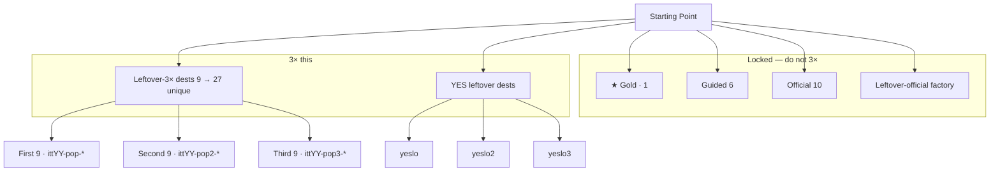
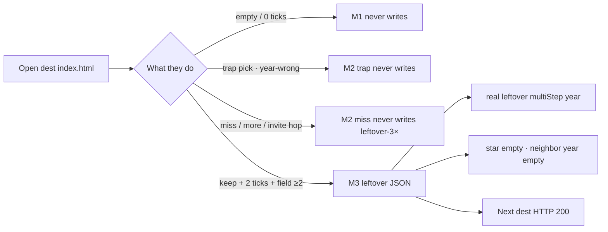
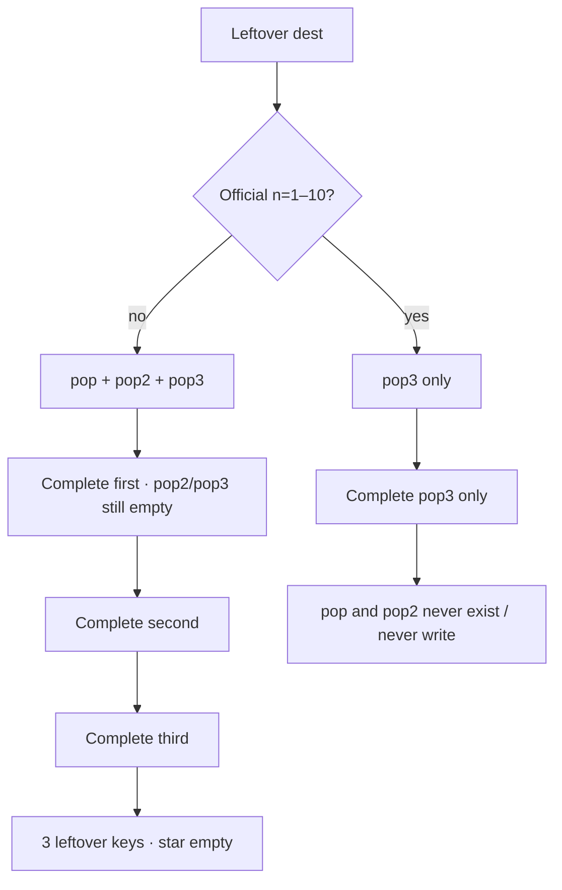
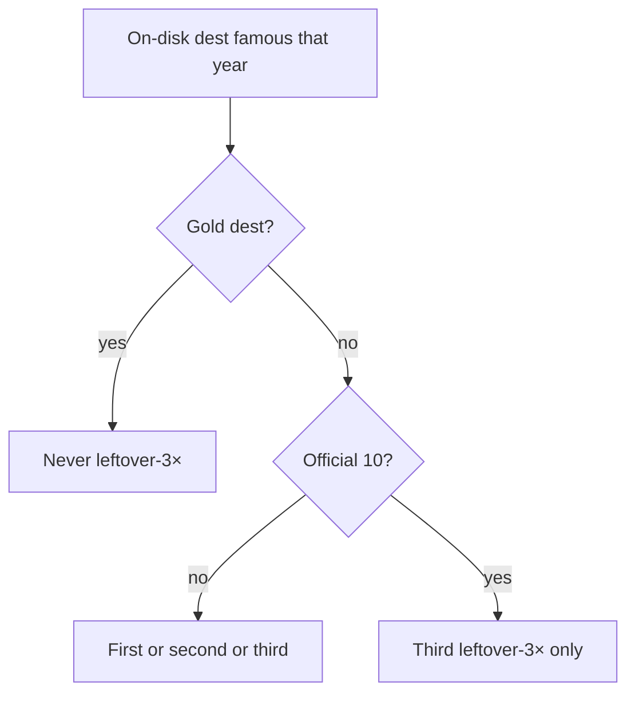
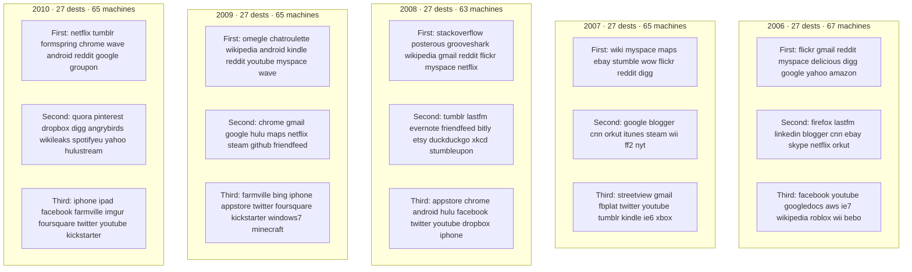
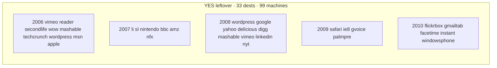
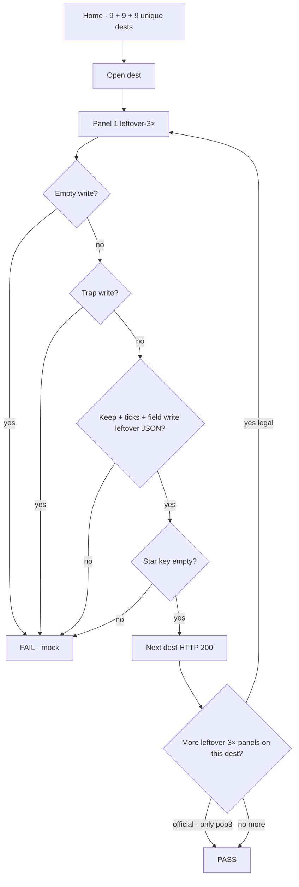
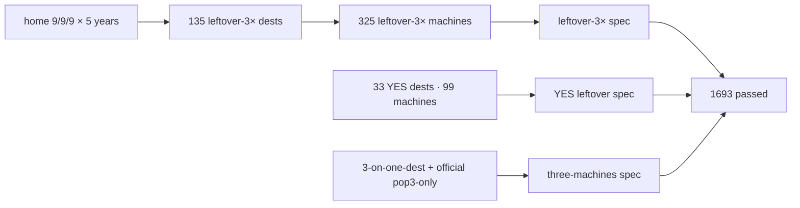

# 2006–2010 leftover-3× ×3 — map

**Date:** 2026-09-07  
**Same steps as 1999–2005:** count existing → 3× unique dests (9→27) → dest-true machines → 3 leftover writers per legal dest → YES leftover 3× → e2e complete (not strip-only).  
**Famous that calendar year only.** No dest-farm. Gold dest never leftover-3×. First/second never official n=1–10. Third may as `pop3`. Leftover never writes the star.

Deep-research run: `deep-research-2` (session). Disk dests and READ-FIRST locks are the source of truth if the report is late.

---

## Diagrams — check every flow

### Year card — what to 3× vs what stays locked

Gold: 2006 Twttr · 2007 iPhone Safari · 2008 GitHub · 2009 Facebook Like · 2010 Instagram.

### Visitor machine — one leftover panel

### 3 leftover machines on one dest

### Who may sit on leftover-3×

### Per-year leftover-3× dest walk

### YES leftover dest walk

2009 `wiki` dest is missing on disk — skip.

### How to check a flow

### e2e check

Run: `npm run test:e2e:2006-2010-3x`

---

## Count now (before this pass)

| Year | Dest folders | Leftover-3× flow number | Home strips | JSON first / third | dest-true `data-itt-lo3x` |
|------|-------------:|------------------------:|-------------|--------------------|---------------------------:|
| 2006 | 126 | **9** (3+3+3) | first 3 official dests · second 3 · **no third** | flickr gmail reddit / googledocs roblox ie7 | **0** |
| 2007 | 55 lean | **9** | first 0 · second 3 · no third | wiki myspace maps / digg flickr reddit | **0** |
| 2008 | 199 | **9** | **none** | stackoverflow posterous grooveshark / friendconnect evernote lastfm | **0** |
| 2009 | 68 lean | **9** | first 0 · second 3 · no third | omegle chatroulette wikipedia / youtube myspace wave | **0** |
| 2010 | 44 lean | **9** | **none** | netflix tumblr formspring / chrome wave android | **0** |

3× the leftover-3× **flow number** = **27 unique dest doors** per year (not 3 keys on one dest for the home strips). Then each **legal** dest also gets 3 dest-true leftover machines (`pop` / `pop2` / `pop3`), same as 1999–2005 after “oh okay do it.”

| After unique dests | After 3 machines / dest (official = pop3 only) |
|--------------------|------------------------------------------------|
| 27 × 5 = **135 dests** | ~**315–340 leftover-3× machines** (official third-only) |

---

## Locked — do not 3×

| Layer | 2006 | 2007 | 2008 | 2009 | 2010 |
|-------|------|------|------|------|------|
| ★ Gold | Twttr `itt06-tweets` · `twitter` | iPhone Safari `itt07-iphone` · `iphone` | GitHub `itt08-github` · `github` | Facebook Like `itt09-like` · `facebook` | Instagram `itt10-ig-posts` · `instagram` |
| Guided | 6 | 6 | 6 | 6 | 6 |
| Official 10 dests | twitter facebook youtube googledocs aws ie7 wikipedia roblox playable | iphone streetview gmail fbplat twitter youtube tumblr kindle ie6 playable | github appstore chrome android hulu facebook twitter youtube dropbox iphone | facebook farmville bing iphone appstore twitter foursquare kickstarter windows7 playable | instagram iphone ipad facebook farmville imgur foursquare twitter youtube playable |
| Dest folders | 126 | 55 | 199 | 68 | 44 |

---

## Year beat (leftover copy)

| Year | Beat |
|------|------|
| 2006 | 2006 leftover. Twttr is the chip. IE6 / XP. No iPhone. No Chrome. No Street View. Google does not yet own YouTube on Jan 1. |
| 2007 | 2007 leftover. iPhone Safari is the chip. App Store / Chrome / Android G1 are 2008. XP + IE6 still the mass desktop. |
| 2008 | 2008 leftover. GitHub issue is the chip. Chrome / App Store / Android G1 / Hulu are leftover, not the star. No Instagram. |
| 2009 | 2009 leftover. Facebook Like is the chip. FarmVille / Bing / Foursquare / Kickstarter leftover. No Instagram. No iPad. |
| 2010 | 2010 leftover. Instagram iOS is the chip. Android IG is 2012. iPad / Open Graph / Imgur leftover. Win7 + IE8 desktop. |

---

## Painted leftover-3× doors (on-disk dests only)

Fame: **EVENT** same-year launch/acquire · **YEAR** household leftover that year · **OFF3** official dest, third only.

### 2006 — 27

**First 9** `itt06-pop-*` — not official, not Twttr

| Dest | Fame | Why 2006 |
|------|------|----------|
| flickr | YEAR | Yahoo-owned photostream habit |
| gmail | YEAR | still invite-era leftover (open is Feb 2007) |
| reddit | YEAR | alien front page leftover |
| myspace | YEAR | still mass social vs Facebook |
| delicious | YEAR | Yahoo tags leftover |
| digg | YEAR | bury leftover · not the 2005 seed star |
| google | YEAR | search habit leftover |
| yahoo | YEAR | still a top property |
| amazon | YEAR | smile leftover |

**Second 9** `itt06-pop2-*`

firefox · lastfm · linkedin · blogger · cnn · ebay · skype · netflix · orkut

**Third 9** `itt06-pop3-*` · official allowed except twitter

facebook · youtube · googledocs · aws · ie7 · wikipedia · roblox · wii · bebo

### 2007 — 27 · lean dest slugs

**First 9** wiki · myspace · maps · ebay · stumble · wow · flickr · reddit · digg  

**Second 9** google · blogger · cnn · orkut · itunes · steam · wii · ff2 · nyt  

**Third 9** streetview · gmail · fbplat · twitter · youtube · tumblr · kindle · ie6 · xbox  

Gold `iphone` off all three.

### 2008 — 27

**First 9** stackoverflow · posterous · grooveshark · wikipedia · gmail · reddit · flickr · myspace · netflix  

**Second 9** tumblr · lastfm · evernote · friendfeed · bitly · etsy · duckduckgo · xkcd · stumbleupon  

**Third 9** appstore · chrome · android · hulu · facebook · twitter · youtube · dropbox · iphone  

Gold `github` off all three.

### 2009 — 27 · skip anachronism dests (discord slack teams zoom whatsapp ig)

**First 9** omegle · chatroulette · wikipedia · android · kindle · reddit · youtube · myspace · wave  

**Second 9** chrome · gmail · google · hulu · maps · netflix · steam · github · friendfeed  

**Third 9** farmville · bing · iphone · appstore · twitter · foursquare · kickstarter · windows7 · minecraft  

Gold `facebook` (Like) off all three.

### 2010 — 27 · lean 44 dests

**First 9** netflix · tumblr · formspring · chrome · wave · android · reddit · google · groupon  

**Second 9** quora · pinterest · dropbox · digg · angrybirds · wikileaks · spotifyeu · yahoo · hulustream  

**Third 9** iphone · ipad · facebook · farmville · imgur · foursquare · twitter · youtube · kickstarter  

Gold `instagram` off all three. Android IG dests stay unused.

---

## 3 leftover machines per dest

Non-official leftover-3× dest: `pop` + `pop2` + `pop3`.  
Official leftover-3× dest: **pop3 only**.  
Gold dest: **none**.

Visitor machine on every leftover-3× panel: empty never writes · trap never writes · miss hop never writes leftover-3× · keep + 2 ticks + field ≥2 writes `{real, leftover, multiStep, year}` · star empty.

---

## YES leftover (famous that year, not leftover-3×, not gold) · 3 machines each

| Year | Dests |
|------|-------|
| 2006 | vimeo reader secondlife wow mashable techcrunch wordpress msn apple |
| 2007 | li sl nintendo bbc amz nfx |
| 2008 | wordpress google yahoo delicious digg mashable vimeo linkedin nyt |
| 2009 | safari ie8 gvoice palmpre wiki |
| 2010 | flickrbox gmailtab facetime instant windowsphone |

Keys: `ittYY-yeslo-<id>` · `yeslo2` · `yeslo3`.

---

## Bans (never leftover-3× first/second/third)

iPhone as 2006 dest · Street View as 2006 dest · Chrome as 2006/2007 dest · App Store as 2007 dest · Instagram as 2009 dest · iPad as 2009 dest · FarmVille as 2008 dest · Android IG as 2010 dest · gold dest folder · dest-farm new folders · leftover writes the star.

---

## e2e

- `e2e/2006-2010-leftover-3x.spec.js` + matrix — every leftover-3× machine empty / trap / complete  
- `e2e/2006-2010-yes-leftover.spec.js` + matrix  
- `e2e/2006-2010-leftover-3x-three-machines.spec.js` — 3-on-one-dest + official pop3-only  
- `npm run test:e2e:2006-2010-3x`

---

## Score (must end positive)

| Point | Fail if | Pass if |
|-------|---------|---------|
| 1 e2e not mock | strip-count only / HTTP 200 only | complete writes leftover JSON · empty/trap never write |
| 2 implemented | generic “Caption leftover” only | dest-true verb / year beat / trap |
| 3 year-true | iPhone 2006, Instagram 2009, gold dest on leftover-3× | READ-FIRST bans hold |
| 4 every MD door | dest missing panel | every first/second/third dest on disk with matching go key |

**Score 2026-09-07 after implement:** all four **PASS** · e2e **1693 passed** (`npm run test:e2e:2006-2010-3x`).

| Point | Result |
|-------|--------|
| 1 e2e not mock | **PASS** · empty / trap never write · complete leftover JSON · 3-on-one-dest + official pop3-only |
| 2 implemented | **PASS** · dest-true verb / year beat / trap on every leftover-3× + YES panel |
| 3 year-true | **PASS** · gold dests off leftover-3× · first/second off official 10 · no dest-farm |
| 4 every MD door | **PASS** · 325 leftover-3× machines + 99 YES leftover machines |

Shipped leftover-3× machines: **325** on **135 dests**. YES leftover: **99** on **33 dests**. Combined **424**. Dest folders frozen 126 / 55 / 199 / 68 / 44.
