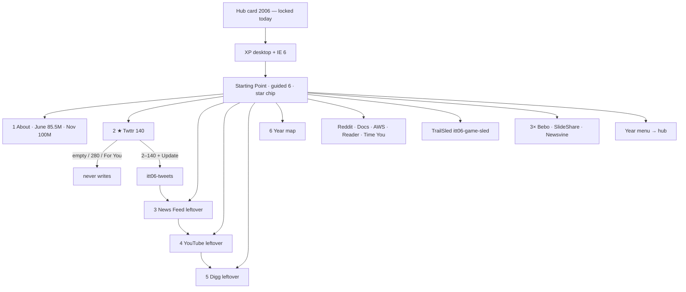

# 2006 — From-scratch map: goals, steps, flows

**Date:** 2026-08-27  
**This file is the one implementer map.** Lean door is **on disk** (P1–P8 this pass).  
**Disk now:** hub **1994–2019 minus 2007** (25 years).  
**Prefix:** `itt06`  
**Clone shape:** live `years/2005/` (XP + IE6 · guided 6 · star chip) **thinned to a lean door**.  
**Never restore** leftover `js/config/2006.js` urlMap forest (twitterbird · wikihow06 · diggv4 · bebo dest dump · meebo · huffpost · wikileaks · youtubeembed · …).

| Companion | When you need it |
|-----------|------------------|
| [`2006-READ-FIRST.md`](2006-READ-FIRST.md) | One-page thesis · star · bans · dual-cite |
| [`2006-FROM-SCRATCH-RESEARCH-GOALS-PHASES-FLOWS-MINUTE-VISITED-2026-08-27.md`](2006-FROM-SCRATCH-RESEARCH-GOALS-PHASES-FLOWS-MINUTE-VISITED-2026-08-27.md) | Harvest · visit log · 5k walk queue |
| Older notebooks | `2006-RESEARCH.md` · `2006-MUSEUM-GRADE.md` · implement bibles that say **LIVE / 100%** — **lose** to this file + READ-FIRST + live tree |
| [`ARCHITECTURE.md`](ARCHITECTURE.md) | Config + content. No year-forked engines. |
| Parent | `years/2005/` · `itt05` · YouTube **upload** (independent all year) |
| Child | `years/2007/` · also wiped · iPhone Safari · **not** this door |

**Legal:** Educational. `localStorage` only. No real Twitter account, Facebook login, YouTube upload, S3 bucket, or Time cover pixels. **Never invent brand pixels.**

**5k websites** = research envelope (ILS June **85,507,314**). **Not** dest count.

**Trail already on disk** in `js/config/flow-trails.js` `"2006"` — **do not invent new official hrefs.** Dests 404 until rebuild.

**This pass:** map only. **Do not** start P1.

---

# 1. Goal (what “done” means)

Build a **lean 2006 museum year** a visitor can *use*, same shape as live 2005 / 2010 lean doors:

```
Hub card “2006” (today: locked)
  → XP desktop + IE 6 chrome (Vista / IE7 / Firefox 2 are leftover, not the shell)
  → Starting Point (quiet)
        ★ Twitter 140 chip
        6-step guided list
  → type ≤140 + Update          itt06-tweets
  → News Feed leftover          itt06-feed
  → YouTube leftover            itt06-yt          (independent until Oct 9)
  → Digg leftover               itt06-digg
  → leftover: Reddit · Docs · AWS · Reader · Time You
  → TrailSled
  → first 3× Bebo · SlideShare · Newsvine
  → ← Year menu → hub
  state only under itt06-*
```

Dest paths **must** be the official 10 already named:

`twitter/index.html` · `facebook/feed.html` · `youtube/index.html` · `digg/index.html` · `reddit/index.html` · `docs/index.html` · `aws/index.html` · `reader/index.html` · `time-you/index.html` · `playable/game.html`

**One hero.** Star chip, official trail #1, and year-start stop 1 are the **same Twttr 140 room**.

**News Feed is leftover even though it is official-2.** Do not move the star.

**Not done if:** Feed / YouTube-sale / Digg / Docs / Time You is the chip, empty Update writes, 280 / For You / X UI is the compose, iPhone / Chrome / Vista Aero is the default shell, Starting Point is a leftover wall, or the old urlMap forest is restored.

**HTML cap:** prefer **~50–70**. Hard stop **90**. Old forest drowned Twitter.

---

# 2. Thesis (copy must match About + home)

**2006 is when the social web breaks through on a fat laptop — Twttr 140 is the save, News Feed / YouTube-sale / Digg / Docs / S3 are leftover, XP+IE6 is still the mass shell, and there is no iPhone.**

| Theme | Period truth |
|-------|----------------|
| Star | **Twttr public 15 Jul** · SMS **40404** · **140** from SMS length · “What are you doing?” · first tweet **21 Mar** is literacy, not the gold screen |
| Social leftover | **News Feed + Mini-Feed 5 Sep** · “Calm down. Breathe.” · privacy **8 Sep** · Facebook **open 26 Sep** · geographic networks · 13+ |
| Video leftover | YouTube **independent until 9 Oct** · Google **$1.65B stock** announce · close **13 Nov** · still Flash · brand stays YouTube |
| Geek front page | **Digg peak** · Reddit still sparse |
| Office on the web | Writely bought **9 Mar** · **Google Docs & Spreadsheets 10 Oct** |
| Cloud leftover | **S3 14 Mar** · $0.15/GB-mo · 5 GB objects · **EC2 Aug** limited beta (GA **2008**) |
| Culture leftover | *Time* **You** Person of the Year · Dec 2006 · Lev Grossman |
| Browser leftover | **IE7 18 Oct** · **Firefox 2 24 Oct** · mass default stays **IE6** |
| OS | **Windows XP** Luna · Vista **RTM 8 Nov** · **retail 30 Jan 2007** — **BAN** as 2006 default |
| Phone | **None.** Fat laptop. iPhone is **2007**. App Store is **2008**. |
| Scale | ILS June **85,507,314 (+32%)** · users **1,160,335,280** · birthmark **Twttr** · Netcraft hostnames pass **100M Nov** (97.9M Oct → ~101M) |
| Mood | type 140 to 40404 · friends’ walls shout into a feed · Google buys the video site · rent a disk called S3 |

Shell default: **Windows XP + Internet Explorer 6**. Broadband default. Dial-up residual honesty only.

**Dual-cite (do not blend):** June ILS **85,507,314**. Netcraft **100M** is **November**. About must label both.

---

# 3. Hard bans (never 2006 default)

| Ban | Why |
|-----|-----|
| Restore leftover `js/config/2006.js` urlMap | Forest drowned the thesis. That is why the year is wiped. |
| 85 million dests | Envelope, not dest count |
| **iPhone** / **App Store** | 2007 / **10 Jul 2008** |
| **Chrome** as default browser | Public beta **2 Sep 2008** |
| **Street View** pegman | **May 2007** |
| Gmail “anyone can sign up” as January 2006 | Invites end **14 Feb 2007** |
| YouTube “a Google company” on a March / June room | Announce **9 Oct** · close **13 Nov** |
| Facebook campus-only **after 26 Sep** | Open that day |
| Vista Aero as the year chrome | Retail **30 Jan 2007** |
| 280 / For You / blue check / X wordmark | Later Twitter / X |
| Like button as 2006 gold | **2009** |
| Instagram · Reactions · Reels · Stories | Later |
| Spotify stream / Netflix stream-as-primary | Later |
| Invented Twitter bird / Time mirror cover | Harvest WDM / WA or `[failed-final]` |
| 7th guided `<li>` | Always |
| Adult-video top-10 room | Compiled lists only |
| `data-official-verb` on the gold dest if empty Update can fire it | Gold dests never write on incomplete click |

---

# 4. Align these three pointers

```
hero  =  years/2006/sites/twitter/index.html
      =  home data-ott-one-thing="2006"
      =  flowTrails["2006"][0].href
      =  YEAR_STARTS["2006"] step 1   (step 0 is always About)
key   =  itt06-tweets
```

Guided list on home (`#ott-guided-2006`) stays **exactly 6** `<li>`:

1. About 2006 → `about.html`  
2. Twitter 140 → `sites/twitter/index.html`  
3. News Feed leftover → `sites/facebook/feed.html`  
4. YouTube leftover → `sites/youtube/index.html`  
5. Digg leftover → `sites/digg/index.html`  
6. Year flow map → `map.html`

Reddit / Docs / AWS / Reader / Time You / TrailSled / Bebo / SlideShare / Newsvine sit **below** the year banner (official leftover + 3× pack). Star chip never changes when leftover rooms are added. Do **not** add a 7th guided item for News Feed.

---

# 5. Steal from shipped years (do not invent a new engine)

| Steal | From | Into 2006 |
|-------|------|-----------|
| XP desktop + IE 6 chrome | **live 2005** `years/2005/index.html` | Keep IE6 · `Address:` · no Vista · no Chrome habit |
| Lean door + quiet Starting Point | **2010** / **2005** after quiet pass | Clone guided 6 · star chip · leftover pack · felt trail |
| Trap vs save | **2018** Accept All never writes · **2019** trial never writes | **Empty Update** never writes · **280 / For You** never write · **Update** with 2–140 chars does |
| 2-path gold | **1999** AIM · **2005** YouTube upload | Twttr: compose field + Update · reload persist |
| Leftover official not drowning the chip | **2005** Talk / Analytics leftover · **2008** Chrome leftover | Feed · YouTube-sale · Digg · Docs · S3 |
| Official verb engine | `js/immersion/official-verb.js` | Stamp dests 2–10. **Do not** stamp gold dest if incomplete click can write |
| Year extras kit | `year-2005-extras.js` shape | `year-2006-extras.js` via `YearExtras.forYear("2006")` when named |
| Official 10 + game | `flow-trails.js` `"2006"` · `year-playable.js` | 10 stops · TrailSled `itt06-game-sled` (Line Rider Sep 2006) |
| Dual-cite About | 2005 / 2010 About | June 85,507,314 + Nov 100M labeled |
| Incomplete never writes | all lean years | Every gold / official / leftover button |
| 3× pack already named | `scripts/popular-3x-sites.json` `"2006"` | **Bebo · SlideShare · Newsvine** — do not invent a new trio |

---

# 6. Visitor flows (life → museum → proof)

Each flow is how a person used 2006, then the room, then what must write. **Nothing below exists on disk today.** Proof is the contract when P1–P8 are named.

### A — Open the year · `[ ]` wiped

**Life:** You boot Windows XP. IE 6 is what came with the PC. Broadband is common. There is no Home button to swipe.  
**Museum:** Hub card (locked today) → `years/2006/` → XP → IE 6 → `pages/home.html`.  
**Proof:** `itt-last-year=2006`. Twitter 140 chip. Guided 6. `SHIP_YEARS` includes 2006 **only after P8**.

### B — Read the thesis · `[ ]`

**Life:** The counted web is ~85.5 million sites in June. Hostnames pass 100 million in November. Twttr is the Live Stats birthmark.  
**Museum:** `pages/about.html` — **85,507,314 (+32%)** · **1,160,335,280** · Twttr · Nov **100M** labeled. Bans listed.  
**Proof:** About dual-cite is literacy only. `itt06-thesis-ack` is **not** a plan dest.

### C — ★ Twitter 140 (star) · `[ ]`

**Life:** 15 Jul public. SMS to 40404. 140 because that is what fit. “What are you doing?” First tweet (21 Mar) is a footnote you tell later.  
**Museum:** `sites/twitter/index.html`  
- Empty Update → **no write**  
- >140 chars → **no write** (counter refuses)  
- For You / 280 / X chrome → **not on the page**  
- 2–140 chars + Update → write  

```json
itt06-tweets = {
  "text": "just setting up my twttr",
  "chars": 24,
  "sms": "40404",
  "limit": 140,
  "real": true,
  "year": "2006"
}
```

Reload still shows the save. Next chip → News Feed leftover. **Not** the first-tweet plaque as the only control.

### D — News Feed leftover · `[ ]`

**Life:** 5 Sep. Your friends’ walls shout into one page. People revolt. Zuckerberg: “Calm down. Breathe.” Extra privacy 8 Sep. Open registration 26 Sep.  
**Museum:** `sites/facebook/feed.html` — see the feed + set **one** privacy leftover. Campus-only copy after 26 Sep is a lie.  
**Proof:** ignore / modern React feed never writes. Privacy leftover + see feed → `itt06-feed`. **Not the chip.**

### E — YouTube leftover · `[ ]`

**Life:** Independent all spring and summer. Flash. Google announces $1.65B stock 9 Oct. Closes 13 Nov. Brand stays YouTube.  
**Museum:** `sites/youtube/index.html` — watch / upload theater. Honesty: **independent until Oct**.  
**Proof:** “Google Video is the gold” never writes. Year-start “a Google company” never writes. Ack + watch/upload theater → `itt06-yt`.

### F — Digg leftover · `[ ]`

**Life:** Geek front page. Peak year. Bury is real.  
**Museum:** `sites/digg/index.html` — Digg or bury a **2006** seed.  
**Proof:** iPhone story / modern algorithm UI never writes. Digg or bury → `itt06-digg`.

### G — Reddit leftover · `[ ]`

**Life:** Still small next to Digg.  
**Museum:** `sites/reddit/index.html` — boost leftover sparse front.  
**Proof:** awards / 2020 redesign never write. Boost → `itt06-reddit`.

### H — Google Docs leftover · `[ ]`

**Life:** Writely bought 9 Mar. Docs & Spreadsheets 10 Oct. Type in the browser.  
**Museum:** `sites/docs/index.html` — type ≥2 in the browser doc.  
**Proof:** “desktop Office only” never writes. Type + save theater → `itt06-docs`.

### I — AWS leftover · `[ ]`

**Life:** S3 14 Mar. $0.15/GB-month. 5 GB objects. Developers, not shoppers. EC2 is an August limited beta.  
**Museum:** `sites/aws/index.html` — put an object (theater).  
**Proof:** consumer AWS console never writes. Put object → `itt06-aws`.

### J — Google Reader leftover · `[ ]`

**Life:** RSS in a Gmail-ish shell by September.  
**Museum:** `sites/reader/index.html` — mark unread leftover.  
**Proof:** Feedly 2013 never writes. Mark unread → `itt06-reader`.

### K — Time You leftover · `[ ]`

**Life:** December. *You* are Person of the Year. User-generated web. Lev Grossman.  
**Museum:** `sites/time-you/index.html` — open the issue theater.  
**Proof:** invented Time cover pixels never ship. Open issue → `itt06-time-you`. Harvest or `[failed-final]`.

### L — TrailSled year game · `[ ]`

**Life:** Line Rider (Sep 2006) is the link you forwarded. Kongregate launches in October.  
**Museum:** `sites/playable/game.html` · **TrailSled**. Not Line Rider art. Not the star.  
**Proof:** load never writes. First run → `itt06-game-sled`. Pack-finish without acts never writes the official key.

### M — Official 10 (product hooks)

1 Twitter 140 · 2 News Feed · 3 YouTube · 4 Digg · 5 Reddit · 6 Docs · 7 AWS · 8 Reader · 9 Time You · 10 TrailSled.

Each has a named period verb (`data-tw06-update` / `data-ff06-privacy` / `data-yt06-ack` / `data-dg06-digg` / …). **No** `data-5x-save` on these ten. Gold dest has **no** `data-official-verb` if empty Update can fire it.

### N — Year-start

About → Twitter 140 → News Feed leftover. Same contract as 2005 About → YouTube upload → leftover.

### O — Back

Year is one URL `/years/2006/`. IE Back = JS `historyStack`. Crumbs stay in-year. Year menu = hub.

### P — 3× leftover popular (already named on disk)

**Life:** MySpace is still mass social. Bebo is the school network outside Facebook colleges. SlideShare puts decks on the web. Newsvine seeds headlines.  
**Museum:** `scripts/popular-3x-sites.json` `"2006"` is already **Bebo · SlideShare · Newsvine**. Fill+go via `year-popular-3x.js`.  
**Proof:** `itt06-pop-bebo` / `itt06-pop-slideshare` / `itt06-pop-newsvine`. Type ≥2 chars. **Not the chip.** Do not swap this trio for MySpace / YouTube / Wikipedia — those are continuity or official leftover, not the 3× ids.

### Q — Continuity chips (not dest folders)

Wikipedia · Google sparse · Yahoo · Amazon live as **continuity chips** (`data-itt-continuity-archive` / `data-itt-forest`), not a second forest of clone rooms. MySpace / Flickr may be thin leftover rooms **only if** HTML stays under the cap.

---

# 7. Lean file list (when scaffolded)

```
years/2006/
  index.html
  pages/home.html · about.html · map.html · whats-new.html
  sites/twitter/index.html
  sites/facebook/feed.html
  sites/youtube/index.html
  sites/digg/index.html
  sites/reddit/index.html
  sites/docs/index.html
  sites/aws/index.html
  sites/reader/index.html
  sites/time-you/index.html
  sites/bebo/index.html
  sites/slideshare/index.html
  sites/newsvine/index.html
  sites/playable/game.html · famous.html · extra-a.html · extra-b.html
  pages/error/404.html · unreachable.html
```

Optional thin leftovers **only if** HTML stays ≤90: `sites/myspace/index.html` · `sites/flickr/index.html`. TechCrunch is **NEVER** a dest on this door.

**Do not add:** `twitterbird` · `wikihow06` · `diggv4` · `meebo` · `huffpost` · `wikileaks` · `youtubeembed` · IE7 as default chrome · Vista Aero shell · iPhone room · Chrome room · Street View · Gmail-open-to-all as year-start dest.

---

# 8. Check diagram (visitor)



**Gold click table**

| Click | Writes? |
|-------|---------|
| Open Twitter room | no |
| Update with empty field | **no** |
| Paste 141+ chars | **no** |
| For You / Like / 280 control (must not exist) | **no** |
| Type 2–140 + Update | **yes** `itt06-tweets` |
| Reload | persist |
| Open News Feed after | leftover `itt06-feed` only |

**Fail the year if any of these are true**

- Hub unlocked while `years/2006/` is missing  
- Guided `<ol>` ≠ 6  
- Star is Feed / YouTube / Digg / Time You  
- Empty Update writes  
- Costume is Vista / Chrome / iPhone Safari  
- Official dest is a “Type leftover” plaque  
- Leftover urlMap forest restored  
- Invented Twitter bird or Time cover ships without harvest / `[failed-final]`

---

# 9. Phases (only when implement is named)

| Phase | Goal | Acceptance |
|-------|------|------------|
| **P0** | This map + READ-FIRST in the implementer’s head | no HTML yet |
| **P1** | Lean shell `years/2006/` · `itt06` · XP+IE6 · hub **still locked** | boot `/years/2006/` · no hub unlock |
| **P2** | Home guided 6 · star chip · felt trail · quiet start | `ol` = 6 · star = Twitter |
| **P3** | Gold Twttr machine | empty never writes · e2e one-thing |
| **P4** | Official dests 2–9 as period verbs | `whenKey` from product control |
| **P5** | Playable TrailSled | `itt06-game-sled` |
| **P6** | 3× Bebo / SlideShare / Newsvine + continuity chips | forest honesty · no dest dump |
| **P7** | Failed-final or harvested stills | no invented bird |
| **P8** | Hub unlock + `SHIP_YEARS` + e2e un-ignore | `check-all-years` counts 2006 **only after named** |

**Do not start P1 until the user names implement.**

---

# 10. 100% museum-grade A (after rebuild)

Same six slices as [`MUSEUM-GRADE-A-TO-100-EVERY-YEAR.md`](MUSEUM-GRADE-A-TO-100-EVERY-YEAR.md):

1. Gold = 140 Update, not a plaque.  
2. Official 10 write `itt06-*` from period controls.  
3. Leftover Feed / YouTube-sale / Digg are verbs, not “Type leftover”.  
4. Lean home — thesis is Twttr, not 300 continuity rooms.  
5. XP+IE6 costume.  
6. Harvested Twttr / Feed / YT stills **or** `[failed-final]`.

Until P1–P8 are **named and built**, 2006 stays **0% exhibit / 100% wipe**.

---

# 11. Not done if

Empty Update writes · 280 / For You / X is the compose · News Feed is the chip · YouTube is “a Google company” in June · Vista / Chrome / iPhone is the shell · guided ≠ 6 · forest restored · hub unlocked with no writer · Time cover or Twitter bird invented.
