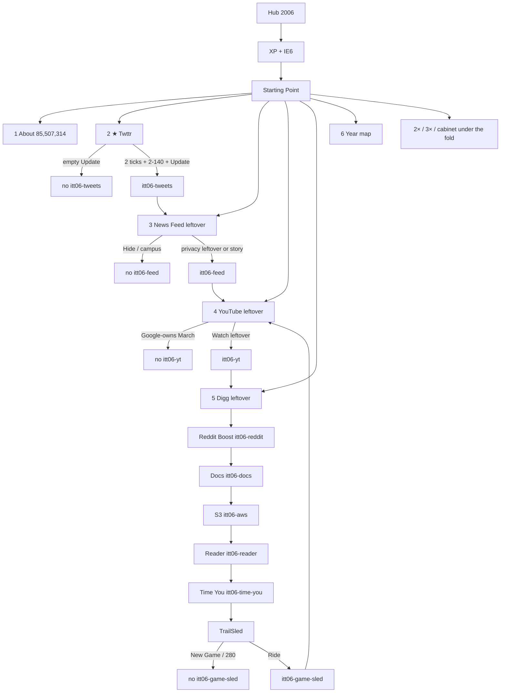
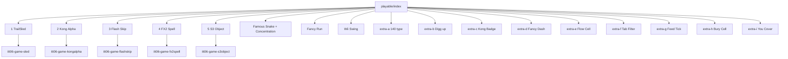
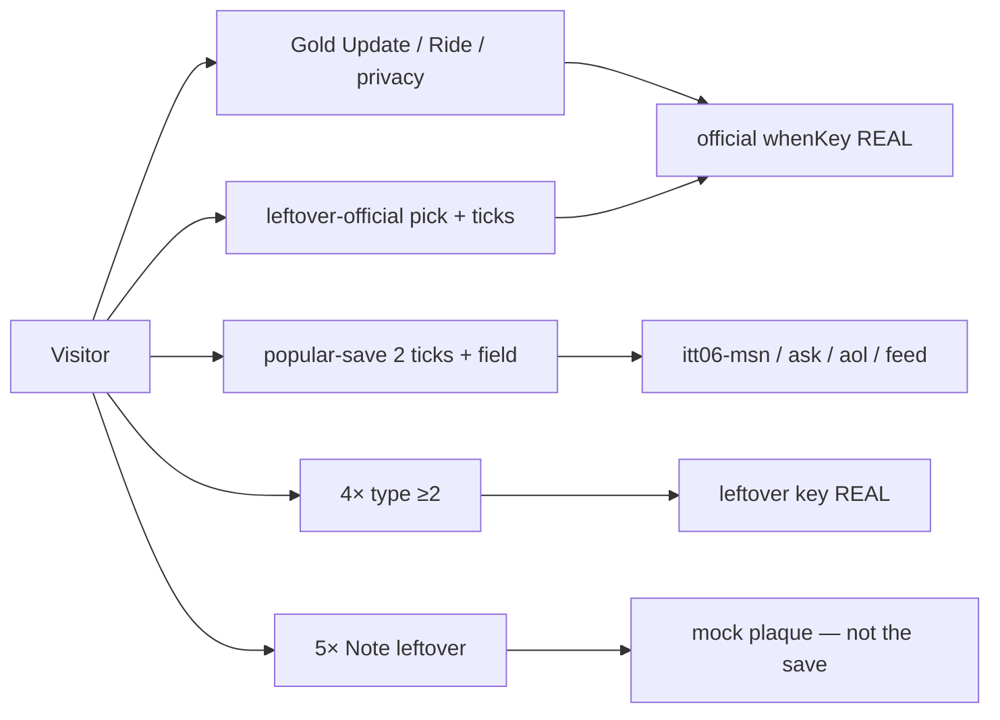

# 2006 — In place: goals · phases · flows · minute · e2e · every dest

**Date:** 2026-08-29  
**Status:** lean door **on disk** · named implement **live** · cabinet **18** · REAL e2e **green** for this door. Prefix `itt06`. Dest-by-dest minute for **every live file** (66 HTML) in **2020 grain** (machine · keys · numbered incompletes · trap · complete selectors · payload · next · reload · neighbor). 2× leftover trail lists all **142** rows.  
**Read first:** [`2006-READ-FIRST.md`](2006-READ-FIRST.md) — **wins** on star / prefix / bans.  
**Harvest:** [`2006-FROM-SCRATCH-RESEARCH-GOALS-PHASES-FLOWS-MINUTE-VISITED-2026-08-29.md`](2006-FROM-SCRATCH-RESEARCH-GOALS-PHASES-FLOWS-MINUTE-VISITED-2026-08-29.md)  
**Locks bible:** [`2006-FROM-SCRATCH-GOALS-PHASES-FLOWS-MINUTE-E2E-2026-08-29.md`](2006-FROM-SCRATCH-GOALS-PHASES-FLOWS-MINUTE-E2E-2026-08-29.md)  
**Games harvest:** [`2006-GAMES-FROM-SCRATCH-RESEARCH-GOALS-PHASES-FLOWS-MINUTE-VISITED-2026-08-29.md`](2006-GAMES-FROM-SCRATCH-RESEARCH-GOALS-PHASES-FLOWS-MINUTE-VISITED-2026-08-29.md)  
**Games locks:** [`2006-GAMES-FROM-SCRATCH-GOALS-PHASES-FLOWS-MINUTE-E2E-2026-08-29.md`](2006-GAMES-FROM-SCRATCH-GOALS-PHASES-FLOWS-MINUTE-E2E-2026-08-29.md)  
**5k walk map:** [`2006-5K-WEB-FLOW-MAP.md`](2006-5K-WEB-FLOW-MAP.md)  
**Shape stolen from:** [`2020-FROM-SCRATCH-GOALS-PHASES-FLOWS-MINUTE-E2E-2026-08-28.md`](2020-FROM-SCRATCH-GOALS-PHASES-FLOWS-MINUTE-E2E-2026-08-28.md) (every-file minute) · 2014 5k map · 2005 cabinet density.

| | |
|--|--|
| Star | Twttr 140 Update · `sites/twitter/index.html` · **`itt06-tweets`** |
| Shell | Windows XP + Internet Explorer 6 |
| Scale | ILS June **85,507,314 (+32%)** · users **1,160,335,280** · 13.6 / site · birthmark **Twttr** |
| Hostnames late | Netcraft Nov **101,435,253** — **do not blend with June ILS** |
| Guided | **exactly 6** (`start-data.js` `"2006"`) |
| Official 10 | every `whenKey` in `flow-trails.js` `"2006"` writes from a **period control** |
| 3× | **Bebo · SlideShare · Newsvine** only |
| Popular F | MSN · Ask · Feed · AOL · ★ Twttr |
| HTML | **66** · cap **≤90** |
| Playable | **18** (same count as 2005 / 2008 / 2010 / 2014) |
| 2× leftover writers | **142** e2e rows (`2x-links-all-years` 2006) |
| Prefix | `itt06-*` only |
| Neighbors | `itt05-*` / `itt07-*` stay empty |
| Forest | **never restore** leftover urlMap dump |
| Banned on Starting Point | `meebo` · `huffpost` · `wikileaks` (HTML **kept**, unlinked) |

**Legal:** Educational. `localStorage` only. **Never invent brand pixels.** `[failed-final]`. No real tweets, S3 buckets, YouTube CDN, Facebook login, ripped SWF.

**5k websites** = research envelope (ILS June 85,507,314). **Not** dest count.

Serve: `python3 -m http.server 8080 --bind 127.0.0.1`  
Clear every `itt06-*` before a check walk. After each complete, only `itt06-*` may appear.

**Git only if asked.**

---

## Goals

Visitor can *use* the live 2006 door the same way they use 2005 / 2010 / 2018 lean doors:

- Hub card **2006** is open.  
- Shell **XP + IE 6**. Vista / IE7 / Firefox 2 are leftover, not the chrome.  
- Visitor completes **Twttr 140 Update** (`itt06-tweets`). **Empty Update never writes.**  
- Visitor completes official leftovers: News Feed privacy · YouTube independent-until-Oct · Digg/bury · Reddit boost · Docs type · S3 put-object · Reader unread · Time You · TrailSled run.  
- Visitor walks the **18-page cabinet** (game 1–5 · famous · more-a/b · extras A–I).  
- Visitor completes popular leftover MSN / Ask / Feed / AOL from **Save popular session**, not 5×.  
- About prints **85,507,314** June and labels **November 101,435,253** separately.  
- Guided is **exactly 6**. All writes `itt06-*`. Incomplete writes nothing.  
- **5k websites stay the envelope.** Hard stop **90 HTML**.

**Visitor outcome**

```
Hub → 2006
  → XP desktop + IE 6
  → About: 85,507,314 June · 1,160,335,280 · Twttr · Nov 101,435,253 labeled
  → ★ Twttr: “What are you doing?” · 2–140 + Update → itt06-tweets
  → News Feed leftover · privacy 8 Sep → itt06-feed
  → YouTube leftover · independent until 9 Oct → itt06-yt
  → Digg leftover · bury a 2006 seed → itt06-digg
  → Reddit · Docs · AWS · Reader · Time You
  → TrailSled  itt06-game-sled
  → Cabinet: Kong Alpha · Flash Skip · FX2 Spell · S3 Object
             Fancy Run · Wii Swing · extras A–I
  → 3× Bebo · SlideShare · Newsvine
  → Popular: MSN · Ask · AOL
  → 142 leftover 4× writers
  → Exit · itt06-* only
```

---

## Align (already live — keep aligned)

```
hero  =  years/2006/sites/twitter/index.html
      =  home YearUI.START.href / start-data.js "2006".href
      =  flowTrails["2006"][0].href
key   =  itt06-tweets
guided =  exactly 6
year game = sites/playable/game.html · sled · itt06-game-sled
```

Star dest and key **do not move**. A 7th guided item fails the year.

---

## Hard bans

| Never 2006 default | Correct |
|--------------------|---------|
| Restore leftover `js/config/2006.js` urlMap forest | drowned Twitter |
| 85 million dest folders | envelope, not dests |
| iPhone / App Store | 2007 / 10 Jul 2008 |
| Chrome as default browser | 2 Sep 2008 |
| Street View pegman | May 2007 |
| Gmail “anyone can sign up” as January 2006 | invites end 14 Feb 2007 |
| YouTube “a Google company” on a March–7 Oct room | announce 9 Oct · close 13 Nov |
| Facebook campus-only after 26 Sep | open that day |
| Vista Aero as year chrome | RTM 8 Nov 2006 · retail 30 Jan 2007 |
| 280 / For You / X wordmark | later Twitter |
| 140 numeral on 2006 homepage chrome | WA 3 Dec does **not** print it |
| SXSW-as-mass Twitter | March 2007 |
| Like button as 2006 gold | 2009 |
| Official Line Rider / Bosh / Nintendo / Kong pixels | `[failed-final]` · TrailSled original |
| Ripped `.swf` | never |
| `meebo` · `huffpost` · `wikileaks` on Starting Point | unlink (files stay) |
| TechCrunch as a dest | press leftover only |
| 7th guided item | always |
| Type leftover as the official save | 4× stays under |
| 5× “Note leftover” as the official save | mock plaque |
| `git checkout` an old 300-HTML forest | lean door ≤90 |

---

## Gold minute (the one-thing)

**URL:** `/years/2006/sites/twitter/index.html`  
**Key:** `itt06-tweets`  
**Machine:** `js/immersion/year-2006-extras.js` · `data-tw06-post`  
**Costume:** [WA 3 Dec 2006](https://web.archive.org/web/20061203201128/http://twitter.com/) · [WDM Twitter 2006](https://www.webdesignmuseum.org/gallery/twitter-2006)

| Beat | Do | Writes? |
|------|----|---------|
| Wipe | `localStorage.removeItem("itt06-tweets")` | — |
| Incomplete 1 | Update with empty `[data-tw06-body]` | **no** |
| Incomplete 2 | 0 or 1 `[data-tw06-req]` + Update | **no** |
| Incomplete 3 | 141+ chars (counter refuses) | **no** |
| Trap A | `[data-tw06-trap]` Post 280 / For You | **no** |
| Trap B | iPhone / X / Like as gold | **no** (must not exist) |
| Complete | Tick both `[data-tw06-req]` · type 2–140 · `[data-tw06-post]` Update | **`itt06-tweets`** |
| Payload | `real:true` · `year:"2006"` · `limit:140` · `sms:"40404"` · `multiStep:true` | must include `real` + `year` |
| Next | `[data-next-flow]` → News Feed leftover | hidden until key exists |
| Reload | key still present · Next still visible | yes |
| Neighbor | no `itt05-*` / `itt07-*` | — |

4× leftover (`itt06-t140` / `t140-2` / `t140-d2`) stays **under**. Must **not** write `itt06-tweets`.

---

## Guided 6 (count is the test)

`start-data.js` `"2006".items` **= 6**. YearUI paints Starting Point.

| # | Copy | href | Pass |
|--:|------|------|------|
| 1 | About 2006 | `pages/about.html` | HTTP 200 · June 85,507,314 · Nov labeled · no iPhone product |
| 2 | ★ Twitter 140 | `sites/twitter/index.html` | HTTP 200 · Update machine |
| 3 | News Feed leftover | `sites/facebook/feed.html` | HTTP 200 · leftover, not the chip |
| 4 | YouTube leftover | `sites/youtube/index.html` | HTTP 200 · independent until Oct |
| 5 | Digg leftover | `sites/digg/index.html` | HTTP 200 · leftover |
| 6 | Year flow map | `pages/map.html` | HTTP 200 · map |

Do **not** add News Feed as a 7th item. It is already #3.

---

## Official 10 — every stop is a writer

Each `whenKey` in `flow-trails.js` `"2006"` must **write from a period control**. Load-only is a hole. “Type leftover” as the official save **fails the year**.

| n | Name | href | whenKey | Incomplete | Complete | Next |
|--:|------|------|---------|------------|----------|------|
| 1 | Twitter 140 | `sites/twitter/index.html` | `itt06-tweets` | Gold minute | Gold complete | News Feed |
| 2 | News Feed | `sites/facebook/feed.html` | `itt06-feed` | Hide · 0 privacy leftover | see a story **or** one 8 Sep privacy leftover | YouTube |
| 3 | YouTube | `sites/youtube/index.html` | `itt06-yt` | “Google Video is gold” · year-start Google-owned | clip + Watch **or** lo pick watch | Digg |
| 4 | Digg | `sites/digg/index.html` | `itt06-digg` | iPhone story · modern algo | Digg **or** bury a **2006** seed | Reddit |
| 5 | Reddit | `sites/reddit/index.html` | `itt06-reddit` | awards · 2020 redesign · Type leftover only | Boost leftover sparse front | Docs |
| 6 | Google Docs | `sites/docs/index.html` | `itt06-docs` | desktop-Office-only · empty | type ≥2 in the browser doc | AWS |
| 7 | AWS | `sites/aws/index.html` | `itt06-aws` | consumer console / Drive | put an object · $0.15/GB-mo honesty | Reader |
| 8 | Google Reader | `sites/reader/index.html` | `itt06-reader` | Feedly 2013 | mark unread leftover | Time You |
| 9 | Time You | `sites/time-you/index.html` | `itt06-time-you` | invent Time cover pixels | open the issue theater · `[failed-final]` | TrailSled |
| 10 | TrailSled | `sites/playable/game.html` | `itt06-game-sled` | pack-finish without a run | first **run** | YouTube |

After each official write: `[data-next-flow][data-next-when-key]` visible · HTTP 200 · home chip **still** the star.

---

## Popular leftover (F1–F5) — REAL, not 5×

| F | Dest | Key | Incomplete | Complete |
|---|------|-----|------------|----------|
| F1 | `sites/msn/index.html` | `itt06-msn` | Save empty | channel ≥2 · 2 `[data-popular-req]` · Save popular session |
| F2 | `sites/ask/index.html` | `itt06-ask` | Save empty | query ≥2 · 2 ticks · Save |
| F3 | `sites/facebook/feed.html` | `itt06-feed` | Save 0 ticks | 2 ticks · Save (also privacy leftover / story) |
| F4 | `sites/aol/index.html` | `itt06-aol` | Save empty | screen ≥2 · 2 ticks · Save |
| F5 | `sites/twitter/index.html` | `itt06-tweets` | star page loads | gold minute |

5× `data-5x-save` on MSN / Ask / AOL is **leftover mock chrome**. Do not use it as the check.

---

## 3× leftover popular (already named)

| id | href | Key | Verb | Trap |
|----|------|-----|------|------|
| bebo | `sites/bebo/index.html` | `itt06-pop-bebo` | name a profile ≥2 | “Bebo is the 2006 gold” |
| slideshare | `sites/slideshare/index.html` | `itt06-pop-slideshare` | title a deck ≥2 | live upload |
| newsvine | `sites/newsvine/index.html` | `itt06-pop-newsvine` | seed a headline ≥2 | “Newsvine replaced Digg as gold” |

---

## Cabinet — 18 pages (density = 2008 / 2010)

| File | Machine | Primary write | Incomplete | Complete |
|------|---------|---------------|------------|----------|
| `index.html` | painted `[data-year-playable]` + 4× | `itt06-playable` leftover | empty 4× | type ≥2 leftover |
| `game.html` | Ride `#play-start` · hills · 280 trap | **`itt06-game-sled`** | New Game · 1 hill · 280 | Ride demo **or** 2 hills |
| `game-2.html` | pack · phrase `alpha` | `itt06-game-kongalpha` | Finish first | Start · Act×2 · type alpha · Finish |
| `game-3.html` | pack · wait 800ms | `itt06-game-flashskip` | Finish first / 0 acts | Start · Act×2 · wait · Finish |
| `game-4.html` | pack · phrase `restore` | `itt06-game-fx2spell` | Finish first | Start · Act×2 · type restore · Finish |
| `game-5.html` | pack · phrase `put` | `itt06-game-s3object` | Finish first | Start · Act×2 · type put · Finish |
| `famous.html` | famous-kit snake + memory | `itt06-game-snake` / `memory` | Start incomplete | play leftover |
| `more-a.html` | more-kit Fancy Run | `itt06-game-fancy` | Finish without Start | Start + acts + Finish |
| `more-b.html` | more-kit Wii Swing | `itt06-game-wiiswing` | Finish without Start | Start + hold + Finish |
| `extra-a.html` | minute-extra t140type | `itt06-game-t140type` | Finish without Start | `?test=1` Start+Finish |
| `extra-b.html` | minute-extra diggup | `itt06-game-diggup` | same | same |
| `extra-c.html` | more kongbadge2 | `itt06-game-kongbadge2` | same | same |
| `extra-d.html` | more fancydash | `itt06-game-fancydash` | same | same |
| `extra-e.html` | more flowcell | `itt06-game-flowcell` | same | same |
| `extra-f.html` | more ie7tab | `itt06-game-ie7tab` | same | same |
| `extra-g.html` | more feedtick | `itt06-game-feedtick` | same | same |
| `extra-h.html` | more burycell | `itt06-game-burycell` | same | same |
| `extra-i.html` | more youcover | `itt06-game-youcover` | same | same |

None of game-2…5 / extras / famous / more write `itt06-game-sled` or `itt06-tweets`.

---

## EVERY dest on disk (minute)

66 HTML files (error pages included). Each row is a flow. Thin doors are lists, not writers.

Grain stolen from [`2020-FROM-SCRATCH-GOALS-PHASES-FLOWS-MINUTE-E2E-2026-08-28.md`](2020-FROM-SCRATCH-GOALS-PHASES-FLOWS-MINUTE-E2E-2026-08-28.md) D.01–D.54: machine · keys · numbered incompletes · trap · complete selectors · payload · next · reload · neighbor. 2014 / 2005 5k walk: [`2006-5K-WEB-FLOW-MAP.md`](2006-5K-WEB-FLOW-MAP.md).

### D.01 `index.html` — Internet Explorer 6.0 — XP + IE6 shell

| | |
|--|--|
| URL | `/years/2006/index.html` |
| Machine | **thin-door · chrome-habit** |
| Keys in file | `_none_` |
| Primary write | `itt06-MISSING (no write)` |
| 3×-also exits | iframe → `pages/home.html` |
| Date / beat | Windows XP + Internet Explorer 6 most of the year · broadband default |
| Cite | years/2005 IE6 shell · years/2007 still XP until leftover Vista · IE7 18 Oct leftover · Firefox 2 24 Oct leftover |

**Incomplete (never writes)**

1. Load the page — must not write
2. Any empty button — must not write
3. This dest is a list / shell, not a writer

**Trap (never writes):** Do not add a dest-field checkbox and call it 3× · Vista Aero as year chrome · Chrome as default

**Complete:** Skip-connect · home loads. No write.

**Payload:** none

**Next:** `pages/home.html`

**Reload:** key still present · Next still visible.

**Neighbor:** no `itt05-*` / `itt07-*`. Completing this dest must **not** write `itt06-tweets` unless this dest **is** the gold Twttr page.

Boot must load `js/config/2006.js` + `js/browser-2006.js` + `js/immersion-2006.js`. Console must not 404 `js/config/immersion-2006.js`. Title **Internet Explorer 6.0 — 2006**. Vista RTM 8 Nov is leftover literacy, not this chrome.

### D.02 `pages/about.html` — About 2006 — dual scale · bans

| | |
|--|--|
| URL | `/years/2006/pages/about.html` |
| Machine | **thesis literacy** |
| Keys in file | `thesis-ack (scoped)` |
| Primary write | `itt06-thesis-ack / thesis-ack` |
| 3×-also exits | ≥3 live hrefs (home · map · Twttr · one leftover) |
| Date / beat | ILS June **85,507,314 (+32%)** · users **1,160,335,280** · 13.6 / site · birthmark **Twttr** · Netcraft Nov **101,435,253** labeled separately |
| Cite | ILS June 2006 cell · Netcraft November hostnames · harvest `2006-FROM-SCRATCH-RESEARCH-…-2026-08-29.md` |

**Incomplete (never writes)**

1. Load — must not write
2. Save with 0 `[data-thesis-req]`
3. Save with 1 tick

**Trap (never writes):** Blend June ILS with November Netcraft into one digit · invent a June ILS 2006 hostname as Netcraft · iPhone / Chrome / Street View as 2006 products

**Complete:** Tick both `[data-thesis-req]` · `[data-itt-real-save]` → thesis literacy. **Not the star.**

**Payload:** `real:true` · year-scoped thesis

**Next:** `pages/home.html`

**Reload:** key still present · Next still visible.

**Neighbor:** no `itt05-*` / `itt07-*`. Completing this dest must **not** write `itt06-tweets` unless this dest **is** the gold Twttr page.

Must print: **85,507,314** June · **1,160,335,280** users · Twttr birthmark · November **101,435,253** as a **separate** Netcraft label. Two ticks required. iPhone / Chrome / Street View sit in the ban list, not as products.

### D.03 `pages/home.html` — Starting Point — 2006

| | |
|--|--|
| URL | `/years/2006/pages/home.html` |
| Machine | **thin-door · YearUI paintStart · leftover rails** |
| Keys in file | `trail keys listed, not written here` |
| Primary write | `none on load` |
| 3×-also exits | star chip · guided 6 · 2× rails · 3× Bebo / SlideShare / Newsvine · cabinet |
| Date / beat | live lean door · 66 HTML |
| Cite | `js/year-ui/start-data.js` `"2006"` · `js/year-ui/start.js` · home 19,049 B |

**Incomplete (never writes)**

1. Load the page — must not write official keys
2. Any empty button — must not write
3. This dest is a list / shell, not a writer

**Trap (never writes):** `meebo` / `huffpost` / `wikileaks` href anywhere on this page · 7th guided `<li>` · star chip pointing off `sites/twitter/index.html`

**Complete:** Lists only. Star chip `data-ott-one-thing="2006"` → `sites/twitter/index.html`. Guided items **= 6**. 3× wall is Bebo · SlideShare · Newsvine only.

**Payload:** none

**Next:** visitor picks a dest

**Reload:** key still present · Next still visible.

**Neighbor:** no `itt05-*` / `itt07-*`. Completing this dest must **not** write `itt06-tweets` unless this dest **is** the gold Twttr page.

Must keep: star chip · guided 6 matching `start-data.js` · `#ott-2x-2006` / `#ott-2x-2006-next` / `#ott-2x-2006-6x` leftover rails · pop trio Bebo / SlideShare / Newsvine · cabinet link HTTP 200. **Check:** `grep -E 'meebo|huffpost|wikileaks' years/2006/pages/home.html` is empty of hrefs (files stay on disk).

### D.04 `pages/map.html` — 2006 flow map

| | |
|--|--|
| URL | `/years/2006/pages/map.html` |
| Machine | **thin-door · map** |
| Keys in file | `official whenKeys listed` |
| Primary write | `none on load` |
| 3×-also exits | official 10 + leftovers + games · `data-itt-2x-add-map` |
| Date / beat | live |
| Cite | `js/config/flow-maps.js` `ITT.flowMaps["2006"]` · `js/config/flow-trails.js` `"2006"` |

**Incomplete (never writes)**

1. Load the page — must not write
2. Any empty button — must not write
3. This dest is a list / shell, not a writer

**Trap (never writes):** plaque-only official stop · map that hides TrailSled

**Complete:** `data-itt-ten-flows` / flow-maps paint official 10. Every href exists (HTTP 200). Link to `playable/game.html` is live.

**Payload:** none

**Next:** visitor picks a dest

**Reload:** key still present · Next still visible.

**Neighbor:** no `itt05-*` / `itt07-*`. Completing this dest must **not** write `itt06-tweets` unless this dest **is** the gold Twttr page.

Map is a list. Writers live on dests. Official 10 order: Twttr → Feed → YouTube → Digg → Reddit → Docs → AWS → Reader → Time You → TrailSled.

### D.05 `pages/whats-new.html` — What’s new — 2006

| | |
|--|--|
| URL | `/years/2006/pages/whats-new.html` |
| Machine | **thin-door** |
| Keys in file | `_none_` |
| Primary write | `none` |
| 3×-also exits | home · about · map |
| Date / beat | live pointer |
| Cite | — |

**Incomplete (never writes)**

1. Load the page — must not write
2. Any empty button — must not write
3. This dest is a list / shell, not a writer

**Trap (never writes):** invent dests here

**Complete:** Literacy only. No write.

**Payload:** none

**Next:** `pages/home.html`

**Reload:** key still present · Next still visible.

**Neighbor:** no `itt05-*` / `itt07-*`. Completing this dest must **not** write `itt06-tweets` unless this dest **is** the gold Twttr page.

Short pointer. Not a writer. 535 B.

### D.06 `pages/error/404.html` — 404 — 2006

| | |
|--|--|
| URL | `/years/2006/pages/error/404.html` |
| Machine | **error** |
| Keys in file | `_none_` |
| Primary write | `none` |
| 3×-also exits | 0 |
| Date / beat | — |
| Cite | — |

**Incomplete (never writes)**

1. Load the page — must not write
2. Any empty button — must not write
3. This dest is an error page, not a writer

**Trap (never writes):** —

**Complete:** No write.

**Payload:** none

**Next:** —

**Reload:** key still present · Next still visible.

**Neighbor:** no `itt05-*` / `itt07-*`. Completing this dest must **not** write `itt06-tweets` unless this dest **is** the gold Twttr page.

Skipped by e2e dest walks. 484 B.

### D.07 `pages/error/unreachable.html` — Unreachable — 2006

| | |
|--|--|
| URL | `/years/2006/pages/error/unreachable.html` |
| Machine | **error** |
| Keys in file | `_none_` |
| Primary write | `none` |
| 3×-also exits | 0 |
| Date / beat | — |
| Cite | — |

**Incomplete (never writes)**

1. Load the page — must not write
2. Any empty button — must not write
3. This dest is an error page, not a writer

**Trap (never writes):** —

**Complete:** No write.

**Payload:** none

**Next:** —

**Reload:** key still present · Next still visible.

**Neighbor:** no `itt05-*` / `itt07-*`. Completing this dest must **not** write `itt06-tweets` unless this dest **is** the gold Twttr page.

Skipped by e2e dest walks. 500 B.

### D.08 `sites/twitter/index.html` — ★ Twttr — gold · official 1

| | |
|--|--|
| URL | `/years/2006/sites/twitter/index.html` |
| Machine | **year-verb gold · `data-tw06-*` · `js/immersion/year-2006-extras.js`** |
| Keys in file | `itt06-tweets · itt06-t140 · itt06-t140-2 · itt06-t140-d2` |
| Primary write | `itt06-tweets` |
| 3×-also exits | ≥3 live hrefs (home · map · Feed · YouTube) · Next Feed after write |
| Date / beat | 15 Jul public · SMS **40404** · 140 from SMS · “What are you doing?” · first tweet 21 Mar is literacy, not the gold screen |
| Cite | [WA 3 Dec 2006](https://web.archive.org/web/20061203201128/http://twitter.com/) · [WDM Twitter 2006](https://www.webdesignmuseum.org/gallery/twitter-2006) · harvest gold minute |

**Incomplete (never writes)**

1. Update with empty `[data-tw06-body]`
2. 0 or 1 `[data-tw06-req]` + Update
3. 141+ chars (counter refuses · over-140 never writes)

**Trap (never writes):** `[data-tw06-trap]` Post 280 / For You · iPhone / X wordmark / Like as gold · SXSW-as-mass (March 2007)

**Complete:** Tick both `[data-tw06-req]` · type **2–140** in `[data-tw06-body]` · `[data-tw06-post]` Update → **`itt06-tweets`**. Timeline paints. Next Feed appears.

**Payload:** `real:true` · `year:"2006"` · `limit:140` · `sms:"40404"` · `multiStep:true`

**Next:** `sites/facebook/feed.html` News Feed leftover

**Reload:** key still present · Next still visible.

**Neighbor:** no `itt05-*` / `itt07-*`. Completing this dest must **not** write `itt06-tweets` unless this dest **is** the gold Twttr page.

4× leftovers under this dest: `itt06-t140` · `itt06-t140-2` · `itt06-t140-d2`. Empty `[data-4x-go]` never writes. Type ≥2 + go writes the leftover key only. Must **not** steal `itt06-tweets`. Costume: teal `#9ae4e8` · word **Twttr** · no bird pixel (WA 3 Dec does **not** print a 140 numeral on homepage chrome). Popular F5 is this same dest — gold minute is the check, not a 5× plaque. See **Gold minute**.

### D.09 `sites/facebook/feed.html` — News Feed leftover — official 2

| | |
|--|--|
| URL | `/years/2006/sites/facebook/feed.html` |
| Machine | **year-verb leftover · `data-ff06-*` + story + leftover-official + popular-save** |
| Keys in file | `itt06-feed · itt06-facebook-feed · itt06-feed-d3 · itt06-pop3-facebook` |
| Primary write | `itt06-feed` |
| 3×-also exits | ≥3 live hrefs · Next YouTube after official write |
| Date / beat | **5 Sep 2006** stream · **8 Sep** privacy leftover (Wired: Facebook yields) · open **26 Sep** · geographic networks |
| Cite | FB blog 5 Sep · Wired 6 Sep · Wired 8 Sep · harvest Feed minute |

**Incomplete (never writes)**

1. `[data-feed-hide]` Hide News Feed
2. empty Share / `[data-fb-status-post]` with blank textarea
3. 0 `[data-ff06-req]` + `[data-ff06-save]`
4. 0 `[data-popular-req]` + `[data-itt-popular-save]`
5. leftover-official pick `chip` + save

**Trap (never writes):** `[data-ff06-trap]` campus-only after 26 Sep · Like button as 2006 gold (2009) · Type leftover `facebook-feed` as the official save

**Complete:** Any one of: click `[data-feed-story]` · tick both `[data-ff06-req]` + pick `see` or `privacy` + `[data-ff06-save]` · leftover-official pick `feed` + 2 `[data-lo-req]` + `[data-lo-save]` · popular 2 ticks + `[data-itt-popular-save]`. Writes **`itt06-feed`**.

**Payload:** `real:true` · `year:"2006"` · `multiStep:true` · leftover not the chip

**Next:** `sites/youtube/index.html` YouTube leftover

**Reload:** key still present · Next still visible.

**Neighbor:** no `itt05-*` / `itt07-*`. Completing this dest must **not** write `itt06-tweets` unless this dest **is** the gold Twttr page.

4× leftovers under this dest: `itt06-facebook-feed` · `itt06-feed-d3` · `itt06-pop3-facebook`. Empty `[data-4x-go]` never writes. Type ≥2 + go writes the leftover key only. Must **not** steal `itt06-feed`. Official dest 2 lives **here**, not on `sites/facebook/index.html`. Guided #3. Popular F3. Costume: `#3b5998` bar · no official f glyph.

### D.10 `sites/facebook/index.html` — Facebook open leftover — not official dest 2

| | |
|--|--|
| URL | `/years/2006/sites/facebook/index.html` |
| Machine | **dest-field-4x leftover · pop3 facebook** |
| Keys in file | `itt06-fb-feed-lx · itt06-fb-feed-2 · itt06-fb-feed-lx-d2 · itt06-pop3-facebook` |
| Primary write | `itt06-fb-feed-lx (leftover only)` |
| 3×-also exits | ≥3 live hrefs · link to `feed.html` |
| Date / beat | Open **26 Sep 2006** · geographic networks · campus-only **after** that date is a lie |
| Cite | FB newsroom 26 Sep · harvest Facebook leftover |

**Incomplete (never writes)**

1. Load — must not write `itt06-feed`
2. Empty 4× go — must not write leftover
3. Empty pop3 field + go

**Trap (never writes):** Campus-only after 26 Sep as product truth · this page as official dest 2 · Type leftover as `itt06-feed`

**Complete:** 4× field ≥2 + go writes leftover `itt06-fb-feed-lx` / `fb-feed-2` / `fb-feed-lx-d2` only. pop3 facebook writes `itt06-pop3-facebook`. Link to `feed.html` for official dest 2.

**Payload:** `real:true` · `year:"2006"` · `multiStep:true` · `kind:"query"`

**Next:** `sites/facebook/feed.html` for the official Feed save

**Reload:** key still present · Next still visible.

**Neighbor:** no `itt05-*` / `itt07-*`. Completing this dest must **not** write `itt06-tweets` unless this dest **is** the gold Twttr page.

4× leftovers under this dest: `itt06-fb-feed-lx` · `itt06-fb-feed-2` · `itt06-fb-feed-lx-d2`. Empty `[data-4x-go]` never writes. Type ≥2 + go writes the leftover key only. Must **not** steal `itt06-feed`. Not guided. Not official 10 n=2.

### D.11 `sites/youtube/index.html` — YouTube leftover — official 3

| | |
|--|--|
| URL | `/years/2006/sites/youtube/index.html` |
| Machine | **year-verb leftover · `data-yt06-*` + leftover-official + pop3** |
| Keys in file | `itt06-yt · itt06-pop3-youtube · itt06-yt-ack · itt06-yt-ack-2 · itt06-yt-ack-d2` |
| Primary write | `itt06-yt` |
| 3×-also exits | ≥3 live hrefs · Next Digg after official write |
| Date / beat | Independent until **9 Oct 2006** announce · close **13 Nov** · Broadcast Yourself |
| Cite | YouTube / Google deal 9 Oct · close 13 Nov · harvest YouTube minute |

**Incomplete (never writes)**

1. Watch with no clip / 0 ticks
2. leftover-official pick `bury` + save
3. Empty 4× go

**Trap (never writes):** `[data-yt06-trap]` Google-owns March · “a Google company” as year-start · this dest as the star chip

**Complete:** Clip + `[data-yt06-watch]` **or** leftover-official pick `watch` + 2 ticks + save → **`itt06-yt`**. 4× `yt-ack*` stays leftover.

**Payload:** `real:true` · `year:"2006"` · `multiStep:true` · independent-until-Oct

**Next:** `sites/digg/index.html` Digg leftover

**Reload:** key still present · Next still visible.

**Neighbor:** no `itt05-*` / `itt07-*`. Completing this dest must **not** write `itt06-tweets` unless this dest **is** the gold Twttr page.

4× leftovers under this dest: `itt06-yt-ack` · `itt06-yt-ack-2` · `itt06-yt-ack-d2`. Empty `[data-4x-go]` never writes. Type ≥2 + go writes the leftover key only. Must **not** steal `itt06-yt`. Costume: Broadcast Yourself · YouTube, Inc. · **no Google wordmark** on this March–7 Oct room. Official dest 3 lives **here**, not on `about.html`.

### D.12 `sites/youtube/about.html` — YouTube leftover about — independent until Oct

| | |
|--|--|
| URL | `/years/2006/sites/youtube/about.html` |
| Machine | **dest-field-4x leftover about** |
| Keys in file | `itt06-yt-ab · itt06-yt-ab-d2` |
| Primary write | `itt06-yt-ab (leftover only)` |
| 3×-also exits | home · map · index |
| Date / beat | Nov+ may say the deal closed · still leftover about |
| Cite | 9 Oct announce · 13 Nov close |

**Incomplete (never writes)**

1. Load — must not write `itt06-yt`
2. Empty 4× go · hop-trap

**Trap (never writes):** Treat this about as official dest 3 · “Google owned YouTube in March”

**Complete:** 4× hop + field ≥2 + go writes `itt06-yt-ab` / `yt-ab-d2` only.

**Payload:** `real:true` · `year:"2006"` · `multiStep:true` · `kind:"query"`

**Next:** `sites/youtube/index.html` for the official Watch save

**Reload:** key still present · Next still visible.

**Neighbor:** no `itt05-*` / `itt07-*`. Completing this dest must **not** write `itt06-tweets` unless this dest **is** the gold Twttr page.

4× leftovers under this dest: `itt06-yt-ab` · `itt06-yt-ab-d2`. Empty `[data-4x-go]` never writes. Type ≥2 + go writes the leftover key only. Must **not** steal `itt06-yt`. Not official dest 3.

### D.13 `sites/digg/index.html` — Digg leftover — official 4

| | |
|--|--|
| URL | `/years/2006/sites/digg/index.html` |
| Machine | **leftover-official + dest-field-4x** |
| Keys in file | `itt06-digg · itt06-digg-v4 · itt06-digg-v4-2 · itt06-digg-v4-d2 · itt06-index-d10` |
| Primary write | `itt06-digg` |
| 3×-also exits | ≥3 live hrefs · Next Reddit after official write |
| Date / beat | 2006 peak / bury · v4 is **2010** |
| Cite | harvest Digg minute · Digg v4 2010 redesign |

**Incomplete (never writes)**

1. leftover-official pick `bury` as the only pick + save (need pick `digg`)
2. 0 `[data-lo-req]` + save
3. Empty 4× go

**Trap (never writes):** iPhone story as a 2006 seed · modern algo · Digg v4 as 2006 gold · Type leftover `digg-v4` as the official save

**Complete:** leftover-official pick `digg` + 2 `[data-lo-req]` + Digg it / `[data-lo-save]` → **`itt06-digg`**. 4× `digg-v4*` stays leftover.

**Payload:** `real:true` · `year:"2006"` · `multiStep:true`

**Next:** `sites/reddit/index.html` Reddit leftover

**Reload:** key still present · Next still visible.

**Neighbor:** no `itt05-*` / `itt07-*`. Completing this dest must **not** write `itt06-tweets` unless this dest **is** the gold Twttr page.

4× leftovers under this dest: `itt06-digg-v4` · `itt06-digg-v4-2` · `itt06-digg-v4-d2` · `itt06-index-d10`. Empty `[data-4x-go]` never writes. Type ≥2 + go writes the leftover key only. Must **not** steal `itt06-digg`. Guided #5. Official dest 4 lives **here**, not on `about.html`.

### D.14 `sites/digg/about.html` — Digg leftover about — 2006

| | |
|--|--|
| URL | `/years/2006/sites/digg/about.html` |
| Machine | **dest-field-4x leftover about** |
| Keys in file | `itt06-dg-ab · itt06-dg-ab-d2` |
| Primary write | `itt06-dg-ab (leftover only)` |
| 3×-also exits | home · map · index |
| Date / beat | about residual |
| Cite | — |

**Incomplete (never writes)**

1. Load — must not write `itt06-digg`
2. Empty 4× go · hop-trap

**Trap (never writes):** This about as official dest 4

**Complete:** 4× hop + field ≥2 + go writes `itt06-dg-ab` / `dg-ab-d2` only.

**Payload:** `real:true` · `year:"2006"` · `multiStep:true` · `kind:"query"`

**Next:** `sites/digg/index.html` for the official Digg/bury save

**Reload:** key still present · Next still visible.

**Neighbor:** no `itt05-*` / `itt07-*`. Completing this dest must **not** write `itt06-tweets` unless this dest **is** the gold Twttr page.

4× leftovers under this dest: `itt06-dg-ab` · `itt06-dg-ab-d2`. Empty `[data-4x-go]` never writes. Type ≥2 + go writes the leftover key only. Must **not** steal `itt06-digg`. Not official dest 4.

### D.15 `sites/reddit/index.html` — Reddit leftover — official 5

| | |
|--|--|
| URL | `/years/2006/sites/reddit/index.html` |
| Machine | **year-verb leftover · list boost + leftover-official** |
| Keys in file | `itt06-reddit · itt06-reddit-d2 · itt06-reddit-d3` |
| Primary write | `itt06-reddit` |
| 3×-also exits | ≥3 live hrefs · Next Docs after official write |
| Date / beat | sparse 2006 front · leftover boost · not awards |
| Cite | harvest Reddit minute · 2020 redesign is the trap era |

**Incomplete (never writes)**

1. leftover-official pick `award` + save
2. 0 ticks + Boost / `[data-lo-save]`
3. field shorter than 2 + Boost
4. Empty 4× go

**Trap (never writes):** awards / 2020 redesign as 2006 gold · Type leftover `reddit-d2` as the official save

**Complete:** `[data-reddit-up]` on the sparse front **or** leftover-official pick `sub` + 2 `[data-lo-req]` + field ≥2 + Boost → **`itt06-reddit`**.

**Payload:** `real:true` · `year:"2006"` · `multiStep:true`

**Next:** `sites/docs/index.html` Google Docs leftover

**Reload:** key still present · Next still visible.

**Neighbor:** no `itt05-*` / `itt07-*`. Completing this dest must **not** write `itt06-tweets` unless this dest **is** the gold Twttr page.

4× leftovers under this dest: `itt06-reddit-d2` · `itt06-reddit-d3`. Empty `[data-4x-go]` never writes. Type ≥2 + go writes the leftover key only. Must **not** steal `itt06-reddit`. Official dest 5 lives **here**, not on `about.html`.

### D.16 `sites/reddit/about.html` — Reddit leftover about — 2006

| | |
|--|--|
| URL | `/years/2006/sites/reddit/about.html` |
| Machine | **dest-field-4x leftover about** |
| Keys in file | `itt06-rdit-ab · itt06-rdit-ab-d2` |
| Primary write | `itt06-rdit-ab (leftover only)` |
| 3×-also exits | home · map · index |
| Date / beat | about residual |
| Cite | — |

**Incomplete (never writes)**

1. Load — must not write `itt06-reddit`
2. Empty 4× go · hop-trap

**Trap (never writes):** This about as official dest 5

**Complete:** 4× hop + field ≥2 + go writes `itt06-rdit-ab` / `rdit-ab-d2` only.

**Payload:** `real:true` · `year:"2006"` · `multiStep:true` · `kind:"query"`

**Next:** `sites/reddit/index.html` for the official Boost save

**Reload:** key still present · Next still visible.

**Neighbor:** no `itt05-*` / `itt07-*`. Completing this dest must **not** write `itt06-tweets` unless this dest **is** the gold Twttr page.

4× leftovers under this dest: `itt06-rdit-ab` · `itt06-rdit-ab-d2`. Empty `[data-4x-go]` never writes. Type ≥2 + go writes the leftover key only. Must **not** steal `itt06-reddit`. Not official dest 5.

### D.17 `sites/docs/index.html` — Google Docs leftover — official 6

| | |
|--|--|
| URL | `/years/2006/sites/docs/index.html` |
| Machine | **leftover-official + dest-field-4x · browser doc** |
| Keys in file | `itt06-docs · itt06-docs-lx · itt06-docs-lx-d2 · itt06-docs-lx2 · itt06-index-d11` |
| Primary write | `itt06-docs` |
| 3×-also exits | ≥3 live hrefs · Next AWS after official write |
| Date / beat | **10 Oct 2006** / **11 Oct PDT** Writely + Spreadsheets as Google Docs |
| Cite | Google Docs launch 10 Oct 2006 · harvest Docs minute |

**Incomplete (never writes)**

1. leftover-official pick `desktop` + save
2. empty field + save
3. 0 ticks + save
4. Empty 4× go

**Trap (never writes):** desktop-Office-only as the 2006 gold · Type leftover `docs-lx` as the official save

**Complete:** leftover-official pick `doc` + 2 ticks + type ≥2 in the browser doc / `[data-lo-save]` → **`itt06-docs`**. Official-verb Save document is the period save.

**Payload:** `real:true` · `year:"2006"` · `multiStep:true` · in-browser

**Next:** `sites/aws/index.html` AWS leftover

**Reload:** key still present · Next still visible.

**Neighbor:** no `itt05-*` / `itt07-*`. Completing this dest must **not** write `itt06-tweets` unless this dest **is** the gold Twttr page.

4× leftovers under this dest: `itt06-docs-lx` · `itt06-docs-lx2` · `itt06-docs-lx-d2` · `itt06-index-d11`. Empty `[data-4x-go]` never writes. Type ≥2 + go writes the leftover key only. Must **not** steal `itt06-docs`. Official dest 6 lives **here**, not on `about.html`.

### D.18 `sites/docs/about.html` — Docs leftover about — 10 Oct 2006

| | |
|--|--|
| URL | `/years/2006/sites/docs/about.html` |
| Machine | **dest-field-4x leftover about** |
| Keys in file | `itt06-docs-ab · itt06-docs-ab-d2` |
| Primary write | `itt06-docs-ab (leftover only)` |
| 3×-also exits | home · map · index |
| Date / beat | 10 Oct / 11 Oct PDT honesty |
| Cite | Google Docs 10 Oct 2006 |

**Incomplete (never writes)**

1. Load — must not write `itt06-docs`
2. Empty 4× go · hop-trap

**Trap (never writes):** This about as official dest 6

**Complete:** 4× hop + field ≥2 + go writes `itt06-docs-ab` / `docs-ab-d2` only. Print 10 Oct / 11 Oct PDT honesty.

**Payload:** `real:true` · `year:"2006"` · `multiStep:true` · `kind:"query"`

**Next:** `sites/docs/index.html` for the official Save document

**Reload:** key still present · Next still visible.

**Neighbor:** no `itt05-*` / `itt07-*`. Completing this dest must **not** write `itt06-tweets` unless this dest **is** the gold Twttr page.

4× leftovers under this dest: `itt06-docs-ab` · `itt06-docs-ab-d2`. Empty `[data-4x-go]` never writes. Type ≥2 + go writes the leftover key only. Must **not** steal `itt06-docs`. Not official dest 6.

### D.19 `sites/aws/index.html` — AWS leftover — official 7 · S3 14 Mar

| | |
|--|--|
| URL | `/years/2006/sites/aws/index.html` |
| Machine | **leftover-official + dest-field-4x** |
| Keys in file | `itt06-aws · itt06-aws-2 · itt06-aws-d2 · itt06-index-d6` |
| Primary write | `itt06-aws` |
| 3×-also exits | ≥3 live hrefs · Next Reader after official write |
| Date / beat | **14 Mar 2006** S3 · **$0.15/GB-mo** · **$0.20/GB** xfer · **5 GB** object |
| Cite | AWS S3 launch 14 Mar 2006 · harvest AWS minute |

**Incomplete (never writes)**

1. leftover-official pick `console` + save
2. 0 ticks + save
3. Empty 4× go

**Trap (never writes):** consumer console / Drive as 2006 gold · Type leftover `aws` as the official save · this dest as official-7 **and** official-EC2

**Complete:** leftover-official pick `s3` + 2 ticks + put-object / `[data-lo-save]` → **`itt06-aws`**. Print **$0.15/GB-mo** · **$0.20/GB** xfer · **5 GB**.

**Payload:** `real:true` · `year:"2006"` · `multiStep:true` · s3-put

**Next:** `sites/reader/index.html` Google Reader leftover

**Reload:** key still present · Next still visible.

**Neighbor:** no `itt05-*` / `itt07-*`. Completing this dest must **not** write `itt06-tweets` unless this dest **is** the gold Twttr page.

4× leftovers under this dest: `itt06-aws` · `itt06-aws-2` · `itt06-aws-d2` · `itt06-index-d6`. Empty `[data-4x-go]` never writes. Type ≥2 + go writes the leftover key only. Must **not** steal `itt06-aws`. Official dest 7 is **S3**, not EC2. EC2 is a separate leftover dest (24 Aug limited beta).

### D.20 `sites/aws/about.html` — AWS leftover about — 14 Mar 2006

| | |
|--|--|
| URL | `/years/2006/sites/aws/about.html` |
| Machine | **dest-field-4x leftover about** |
| Keys in file | `itt06-aws-ab · itt06-aws-ab-d2` |
| Primary write | `itt06-aws-ab (leftover only)` |
| 3×-also exits | home · map · index |
| Date / beat | 14 Mar S3 residual |
| Cite | S3 14 Mar 2006 |

**Incomplete (never writes)**

1. Load — must not write `itt06-aws`
2. Empty 4× go · hop-trap

**Trap (never writes):** This about as official dest 7

**Complete:** 4× hop + field ≥2 + go writes `itt06-aws-ab` / `aws-ab-d2` only.

**Payload:** `real:true` · `year:"2006"` · `multiStep:true` · `kind:"query"`

**Next:** `sites/aws/index.html` for the official put-object

**Reload:** key still present · Next still visible.

**Neighbor:** no `itt05-*` / `itt07-*`. Completing this dest must **not** write `itt06-tweets` unless this dest **is** the gold Twttr page.

4× leftovers under this dest: `itt06-aws-ab` · `itt06-aws-ab-d2`. Empty `[data-4x-go]` never writes. Type ≥2 + go writes the leftover key only. Must **not** steal `itt06-aws`. Not official dest 7.

### D.21 `sites/ec2/index.html` — EC2 leftover — 24 Aug 2006 limited beta

| | |
|--|--|
| URL | `/years/2006/sites/ec2/index.html` |
| Machine | **dest-field-4x leftover** |
| Keys in file | `itt06-ec2-06 · itt06-ec2-06-d2` |
| Primary write | `itt06-ec2-06 (leftover only)` |
| 3×-also exits | home · map · AWS S3 |
| Date / beat | **24 Aug 2006** limited beta · **not** official dest 7 |
| Cite | AWS EC2 limited beta 24 Aug 2006 |

**Incomplete (never writes)**

1. Load — must not write `itt06-aws`
2. Empty 4× go

**Trap (never writes):** EC2 as official dest 7 · consumer console as 2006 gold

**Complete:** 4× field ≥2 + go writes `itt06-ec2-06` / `ec2-06-d2` only.

**Payload:** `real:true` · `year:"2006"` · `multiStep:true` · `kind:"query"`

**Next:** `sites/aws/index.html` for official S3

**Reload:** key still present · Next still visible.

**Neighbor:** no `itt05-*` / `itt07-*`. Completing this dest must **not** write `itt06-tweets` unless this dest **is** the gold Twttr page.

4× leftovers under this dest: `itt06-ec2-06` · `itt06-ec2-06-d2`. Empty `[data-4x-go]` never writes. Type ≥2 + go writes the leftover key only. Must **not** steal `itt06-aws`. Limited beta honesty. Not the S3 put-object.

### D.22 `sites/reader/index.html` — Google Reader leftover — official 8

| | |
|--|--|
| URL | `/years/2006/sites/reader/index.html` |
| Machine | **leftover-official + dest-field-4x** |
| Keys in file | `itt06-reader · itt06-reader-2 · itt06-reader-d2` |
| Primary write | `itt06-reader` |
| 3×-also exits | ≥3 live hrefs · Next Time You after official write |
| Date / beat | 2006 unread leftover · Feedly is **2013** |
| Cite | Google Reader 2005–2013 · harvest Reader minute |

**Incomplete (never writes)**

1. leftover-official pick `feedly` + save
2. empty URL + save
3. 0 ticks + save
4. Empty 4× go

**Trap (never writes):** Feedly 2013 as 2006 gold · Type leftover `reader` as the official save

**Complete:** leftover-official pick `feed` + 2 ticks + URL ≥2 + mark unread / `[data-lo-save]` → **`itt06-reader`**.

**Payload:** `real:true` · `year:"2006"` · `multiStep:true`

**Next:** `sites/time-you/index.html` Time You leftover

**Reload:** key still present · Next still visible.

**Neighbor:** no `itt05-*` / `itt07-*`. Completing this dest must **not** write `itt06-tweets` unless this dest **is** the gold Twttr page.

4× leftovers under this dest: `itt06-reader` · `itt06-reader-2` · `itt06-reader-d2`. Empty `[data-4x-go]` never writes. Type ≥2 + go writes the leftover key only. Must **not** steal `itt06-reader`. Official dest 8 lives **here**, not on `about.html`. 4× next on this dest still points Digg — leftover rail, not official next.

### D.23 `sites/reader/about.html` — Reader leftover about — 2006

| | |
|--|--|
| URL | `/years/2006/sites/reader/about.html` |
| Machine | **dest-field-4x leftover about** |
| Keys in file | `itt06-rd-ab · itt06-rd-ab-d2` |
| Primary write | `itt06-rd-ab (leftover only)` |
| 3×-also exits | home · map · index |
| Date / beat | about residual |
| Cite | — |

**Incomplete (never writes)**

1. Load — must not write `itt06-reader`
2. Empty 4× go · hop-trap

**Trap (never writes):** This about as official dest 8 · Feedly as 2006

**Complete:** 4× hop + field ≥2 + go writes `itt06-rd-ab` / `rd-ab-d2` only.

**Payload:** `real:true` · `year:"2006"` · `multiStep:true` · `kind:"query"`

**Next:** `sites/reader/index.html` for the official unread save

**Reload:** key still present · Next still visible.

**Neighbor:** no `itt05-*` / `itt07-*`. Completing this dest must **not** write `itt06-tweets` unless this dest **is** the gold Twttr page.

4× leftovers under this dest: `itt06-rd-ab` · `itt06-rd-ab-d2`. Empty `[data-4x-go]` never writes. Type ≥2 + go writes the leftover key only. Must **not** steal `itt06-reader`. Not official dest 8.

### D.24 `sites/time-you/index.html` — Time You leftover — official 9

| | |
|--|--|
| URL | `/years/2006/sites/time-you/index.html` |
| Machine | **year-verb leftover · `data-ty06-*` + leftover-official** |
| Keys in file | `itt06-time-you · itt06-timeyou · itt06-timeyou-2 · itt06-timeyou-d2` |
| Primary write | `itt06-time-you` |
| 3×-also exits | ≥3 live hrefs · Next TrailSled after official write |
| Date / beat | Dec 2006 Person of the Year theater · **You** |
| Cite | Time Person of the Year 2006 · harvest Time You minute |

**Incomplete (never writes)**

1. `[data-ty06-trap]` invent cover JPEG
2. leftover-official pick `cover` + save
3. 0 ticks + save
4. Empty 4× go

**Trap (never writes):** invent Time cover pixels · official Time masthead art · Type leftover `timeyou` as the official save

**Complete:** `[data-ty06-open]` **or** leftover-official pick `you` + 2 ticks + `[data-lo-save]` → **`itt06-time-you`**. `[failed-final]` — no cover JPEG.

**Payload:** `real:true` · `year:"2006"` · `multiStep:true` · failed-final

**Next:** `sites/playable/game.html` TrailSled

**Reload:** key still present · Next still visible.

**Neighbor:** no `itt05-*` / `itt07-*`. Completing this dest must **not** write `itt06-tweets` unless this dest **is** the gold Twttr page.

4× leftovers under this dest: `itt06-timeyou` · `itt06-timeyou-2` · `itt06-timeyou-d2`. Empty `[data-4x-go]` never writes. Type ≥2 + go writes the leftover key only. Must **not** steal `itt06-time-you`. Official dest 9 lives **here**, not on `about.html`. Never invent the mirror cover.

### D.25 `sites/time-you/about.html` — Time You leftover about — Dec 2006

| | |
|--|--|
| URL | `/years/2006/sites/time-you/about.html` |
| Machine | **dest-field-4x leftover about** |
| Keys in file | `itt06-ty-ab · itt06-ty-ab-d2` |
| Primary write | `itt06-ty-ab (leftover only)` |
| 3×-also exits | home · map · index |
| Date / beat | Dec 2006 residual |
| Cite | Time Person of the Year 2006 |

**Incomplete (never writes)**

1. Load — must not write `itt06-time-you`
2. Empty 4× go · hop-trap

**Trap (never writes):** This about as official dest 9 · invent cover JPEG

**Complete:** 4× hop + field ≥2 + go writes `itt06-ty-ab` / `ty-ab-d2` only.

**Payload:** `real:true` · `year:"2006"` · `multiStep:true` · `kind:"query"`

**Next:** `sites/time-you/index.html` for the official open-issue

**Reload:** key still present · Next still visible.

**Neighbor:** no `itt05-*` / `itt07-*`. Completing this dest must **not** write `itt06-tweets` unless this dest **is** the gold Twttr page.

4× leftovers under this dest: `itt06-ty-ab` · `itt06-ty-ab-d2`. Empty `[data-4x-go]` never writes. Type ≥2 + go writes the leftover key only. Must **not** steal `itt06-time-you`. Not official dest 9.

### D.26 `sites/playable/game.html` — TrailSled — official 10 · year game

| | |
|--|--|
| URL | `/years/2006/sites/playable/game.html` |
| Machine | **year-game Ride · `js/games/year-2006-sled.js` + `year-game-boot.js` · `#play-start` · hills · 280 trap** |
| Keys in file | `itt06-game-sled · itt06-playable-game · itt06-playable-d8` |
| Primary write | `itt06-game-sled` |
| 3×-also exits | cabinet index · game-2 · YouTube after official write |
| Date / beat | Line Rider–class museum original · Line Rider **23 Sep 2006** is honesty, not pixels |
| Cite | `js/config/year-playable.js` `"2006"` id `sled` · games harvest 2026-08-29 · Line Rider 23 Sep 2006 |

**Incomplete (never writes)**

1. `[data-game-start]` New Game alone (never writes the official key)
2. 1 hill only / no Ride
3. 280 / For You trap on the sled
4. pack-finish without a run
5. Empty 4× go

**Trap (never writes):** official Line Rider / Bosh art · ripped `.swf` · this dest as the star chip · Type leftover `playable-game` as the official save

**Complete:** `#play-start` Ride / demo **or** two hills that write → **`itt06-game-sled`**. Best stored via year-game `sled`. Next YouTube appears.

**Payload:** `real:true` · `year:"2006"` · `multiStep:true` · sled run

**Next:** `sites/youtube/index.html` YouTube leftover (official next) · cabinet `game-2.html` Kong Alpha

**Reload:** key still present · Next still visible.

**Neighbor:** no `itt05-*` / `itt07-*`. Completing this dest must **not** write `itt06-tweets` unless this dest **is** the gold Twttr page.

4× leftovers under this dest: `itt06-playable-game` · `itt06-playable-d8`. Empty `[data-4x-go]` never writes. Type ≥2 + go writes the leftover key only. Must **not** steal `itt06-game-sled`. Canvas + `year-2006-sled.js` must stay. Lean clicker without `#play-start` fails `year-games-real`. New Game stays `[data-game-start]` and **never** writes the official key.

### D.27 `sites/playable/index.html` — TrailSled · 2006 game cabinet

| | |
|--|--|
| URL | `/years/2006/sites/playable/index.html` |
| Machine | **painted `[data-year-playable]` + dest-field-4x leftover** |
| Keys in file | `itt06-playable · itt06-playable-d9` |
| Primary write | `itt06-playable (leftover only)` |
| 3×-also exits | game 1–5 · famous · more-a/b · extras A–I |
| Date / beat | cabinet door · 18 pages (same count as 2005 / 2008 / 2010 / 2014) |
| Cite | `js/config/year-playable.js` · 2005 / 2008 / 2010 / 2014 18-page pattern |

**Incomplete (never writes)**

1. Load — must not write `itt06-game-sled`
2. Empty 4× go

**Trap (never writes):** cabinet as the year gold · hide game-2…5

**Complete:** Lists 18. 4× field ≥2 + go writes `itt06-playable` / `playable-d9` leftover only. Every listed href HTTP 200.

**Payload:** `real:true` · `year:"2006"` · `multiStep:true` · `kind:"query"`

**Next:** `sites/playable/game.html` TrailSled

**Reload:** key still present · Next still visible.

**Neighbor:** no `itt05-*` / `itt07-*`. Completing this dest must **not** write `itt06-tweets` unless this dest **is** the gold Twttr page.

4× leftovers under this dest: `itt06-playable` · `itt06-playable-d9`. Empty `[data-4x-go]` never writes. Type ≥2 + go writes the leftover key only. Must **not** steal `itt06-game-sled`. 18 pages: `index` · `game` · `game-2`…`game-5` · `famous` · `more-a` · `more-b` · `extra-a`…`extra-i`.

### D.28 `sites/playable/game-2.html` — Kong Alpha — leftover pack 2

| | |
|--|--|
| URL | `/years/2006/sites/playable/game-2.html` |
| Machine | **pack leftover · `data-game-id="kongalpha"` · `year-pack-boot.js`** |
| Keys in file | `itt06-game-kongalpha · itt06-playable-game-2` |
| Primary write | `itt06-game-kongalpha` |
| 3×-also exits | cabinet index · sites/playable/game-3.html |
| Date / beat | Kongregate **alpha**. Wikipedia **10 Oct 2006** is literacy only · on-site launch often cited **17 Oct**. Dual-cite. Do not retitle unless named. |
| Cite | games harvest 2026-08-29 · `js/games/year-pack-boot.js` |

**Incomplete (never writes)**

1. Finish first / Finish without Start
2. 0 `[data-pack-act]`
3. type anything but `alpha` / empty `[data-pack-type]`
4. Empty 4× go

**Trap (never writes):** this dest writes `itt06-game-kongalpha` as if it were TrailSled · official Line Rider / Kong / Nintendo / Firefox art · ripped `.swf`

**Complete:** `[data-game-start]` Start · `[data-pack-act]` ×2 · type `alpha` in `[data-pack-type]` · `[data-pack-finish]` Finish → **`itt06-game-kongalpha`**. `?test=1` is the e2e shortcut on extras.

**Payload:** `real:true` · `year:"2006"` · `multiStep:true` · game `kongalpha`

**Next:** `sites/playable/game-3.html` Flash Skip

**Reload:** key still present · Next still visible.

**Neighbor:** no `itt05-*` / `itt07-*`. Completing this dest must **not** write `itt06-tweets` unless this dest **is** the gold Twttr page.

4× leftovers under this dest: `itt06-playable-game-2`. Empty `[data-4x-go]` never writes. Type ≥2 + go writes the leftover key only. Must **not** steal `itt06-game-kongalpha`. Honesty on disk currently prints 10 Oct. Dual-cite lives in the games harvest. Museum original — no Kong badge art. Must **not** write `itt06-game-sled` or `itt06-tweets`.

### D.29 `sites/playable/game-3.html` — Flash Skip — leftover pack 3

| | |
|--|--|
| URL | `/years/2006/sites/playable/game-3.html` |
| Machine | **pack leftover · `data-game-id="flashskip"` · `year-pack-boot.js`** |
| Keys in file | `itt06-game-flashskip · itt06-playable-game-3` |
| Primary write | `itt06-game-flashskip` |
| 3×-also exits | cabinet index · sites/playable/game-4.html |
| Date / beat | Flash skip leftover · wait 800ms · no ripped `.swf` |
| Cite | games harvest 2026-08-29 · `js/games/year-pack-boot.js` |

**Incomplete (never writes)**

1. Finish first / Finish without Start
2. 0 `[data-pack-act]`
3. Finish before the 800ms wait
4. Empty 4× go

**Trap (never writes):** this dest writes `itt06-game-flashskip` as if it were TrailSled · official Line Rider / Kong / Nintendo / Firefox art · ripped `.swf`

**Complete:** `[data-game-start]` Start · `[data-pack-act]` ×2 · wait 800ms · `[data-pack-finish]` Finish → **`itt06-game-flashskip`**.

**Payload:** `real:true` · `year:"2006"` · `multiStep:true` · game `flashskip`

**Next:** `sites/playable/game-4.html` FX2 Spell

**Reload:** key still present · Next still visible.

**Neighbor:** no `itt05-*` / `itt07-*`. Completing this dest must **not** write `itt06-tweets` unless this dest **is** the gold Twttr page.

4× leftovers under this dest: `itt06-playable-game-3`. Empty `[data-4x-go]` never writes. Type ≥2 + go writes the leftover key only. Must **not** steal `itt06-game-flashskip`. Wait is the honesty. Finish-first never writes. Must **not** write `itt06-game-sled` or `itt06-tweets`.

### D.30 `sites/playable/game-4.html` — FX2 Spell — leftover pack 4

| | |
|--|--|
| URL | `/years/2006/sites/playable/game-4.html` |
| Machine | **pack leftover · `data-game-id="fx2spell"` · `year-pack-boot.js`** |
| Keys in file | `itt06-game-fx2spell · itt06-playable-game-4` |
| Primary write | `itt06-game-fx2spell` |
| 3×-also exits | cabinet index · sites/playable/game-5.html |
| Date / beat | Firefox 2 **24 Oct 2006** leftover spell · not the year shell |
| Cite | games harvest 2026-08-29 · `js/games/year-pack-boot.js` |

**Incomplete (never writes)**

1. Finish first / Finish without Start
2. 0 `[data-pack-act]`
3. type anything but `restore` / empty `[data-pack-type]`
4. Empty 4× go

**Trap (never writes):** this dest writes `itt06-game-fx2spell` as if it were TrailSled · official Line Rider / Kong / Nintendo / Firefox art · ripped `.swf`

**Complete:** `[data-game-start]` Start · `[data-pack-act]` ×2 · type `restore` in `[data-pack-type]` · `[data-pack-finish]` Finish → **`itt06-game-fx2spell`**. `?test=1` is the e2e shortcut on extras.

**Payload:** `real:true` · `year:"2006"` · `multiStep:true` · game `fx2spell`

**Next:** `sites/playable/game-5.html` S3 Object

**Reload:** key still present · Next still visible.

**Neighbor:** no `itt05-*` / `itt07-*`. Completing this dest must **not** write `itt06-tweets` unless this dest **is** the gold Twttr page.

4× leftovers under this dest: `itt06-playable-game-4`. Empty `[data-4x-go]` never writes. Type ≥2 + go writes the leftover key only. Must **not** steal `itt06-game-fx2spell`. Phrase `restore`. Extra-f already owns `itt06-game-ie7tab` so this dest is **not** an IE7 tab clone. Must **not** write `itt06-game-sled` or `itt06-tweets`.

### D.31 `sites/playable/game-5.html` — S3 Object — leftover pack 5

| | |
|--|--|
| URL | `/years/2006/sites/playable/game-5.html` |
| Machine | **pack leftover · `data-game-id="s3object"` · `year-pack-boot.js`** |
| Keys in file | `itt06-game-s3object · itt06-playable-game-5` |
| Primary write | `itt06-game-s3object` |
| 3×-also exits | cabinet index · sites/playable/famous.html |
| Date / beat | S3 put-object leftover cabinet · not official dest 7 |
| Cite | games harvest 2026-08-29 · `js/games/year-pack-boot.js` |

**Incomplete (never writes)**

1. Finish first / Finish without Start
2. 0 `[data-pack-act]`
3. type anything but `put` / empty `[data-pack-type]`
4. Empty 4× go

**Trap (never writes):** this dest writes `itt06-game-s3object` as if it were TrailSled · official Line Rider / Kong / Nintendo / Firefox art · ripped `.swf`

**Complete:** `[data-game-start]` Start · `[data-pack-act]` ×2 · type `put` in `[data-pack-type]` · `[data-pack-finish]` Finish → **`itt06-game-s3object`**. `?test=1` is the e2e shortcut on extras.

**Payload:** `real:true` · `year:"2006"` · `multiStep:true` · game `s3object`

**Next:** `sites/playable/famous.html` Famous

**Reload:** key still present · Next still visible.

**Neighbor:** no `itt05-*` / `itt07-*`. Completing this dest must **not** write `itt06-tweets` unless this dest **is** the gold Twttr page.

4× leftovers under this dest: `itt06-playable-game-5`. Empty `[data-4x-go]` never writes. Type ≥2 + go writes the leftover key only. Must **not** steal `itt06-game-s3object`. Phrase `put`. Official S3 write still lives on `sites/aws/index.html`. Must **not** write `itt06-game-sled` or `itt06-tweets`.

### D.32 `sites/playable/famous.html` — Famous games · Pocket Snake + Concentration

| | |
|--|--|
| URL | `/years/2006/sites/playable/famous.html` |
| Machine | **famous-kit · `data-game-id="snake"` + `memory`** |
| Keys in file | `itt06-game-snake · itt06-game-memory · itt06-playable-famous · itt06-playable-d7` |
| Primary write | `itt06-game-snake / itt06-game-memory` |
| 3×-also exits | cabinet index · more-a |
| Date / beat | famous leftover pair (same kit as 2005 / 2008 / 2010) |
| Cite | year-playable famous · famous-kit |

**Incomplete (never writes)**

1. Start incomplete / quit mid-board
2. Empty 4× go

**Trap (never writes):** this dest writes `itt06-game-sled` · official Nokia / card-back art

**Complete:** Play leftover snake or memory to a finish → `itt06-game-snake` / `itt06-game-memory`.

**Payload:** `real:true` · `year:"2006"` · `multiStep:true`

**Next:** `sites/playable/more-a.html` Fancy Run

**Reload:** key still present · Next still visible.

**Neighbor:** no `itt05-*` / `itt07-*`. Completing this dest must **not** write `itt06-tweets` unless this dest **is** the gold Twttr page.

4× leftovers under this dest: `itt06-playable-famous` · `itt06-playable-d7`. Empty `[data-4x-go]` never writes. Type ≥2 + go writes the leftover key only. Must **not** steal `itt06-game-sled`. Must **not** write `itt06-game-sled` or `itt06-tweets`.

### D.33 `sites/playable/more-a.html` — Fancy Run — leftover more-kit

| | |
|--|--|
| URL | `/years/2006/sites/playable/more-a.html` |
| Machine | **more-kit · `data-game-id="fancy"`** |
| Keys in file | `itt06-game-fancy · itt06-playable-more-a · itt06-playable-d10` |
| Primary write | `itt06-game-fancy` |
| 3×-also exits | cabinet · more-b |
| Date / beat | Fancy Pants Adventure–class leftover · original **14 Mar 2006** · museum run, not Newgrounds rip |
| Cite | Fancy Pants 14 Mar 2006 · games harvest |

**Incomplete (never writes)**

1. Finish without Start
2. 0 acts
3. Empty 4× go

**Trap (never writes):** official Fancy Pants / Newgrounds art · ripped `.swf` · this dest as year gold

**Complete:** `[data-game-start]` Start + acts + `[data-game-finish]` Finish → **`itt06-game-fancy`**.

**Payload:** `real:true` · `year:"2006"` · `multiStep:true` · fancy

**Next:** `sites/playable/more-b.html` Wii Swing

**Reload:** key still present · Next still visible.

**Neighbor:** no `itt05-*` / `itt07-*`. Completing this dest must **not** write `itt06-tweets` unless this dest **is** the gold Twttr page.

4× leftovers under this dest: `itt06-playable-more-a` · `itt06-playable-d10`. Empty `[data-4x-go]` never writes. Type ≥2 + go writes the leftover key only. Must **not** steal `itt06-game-fancy`. Leftover 14 Mar. Must **not** write `itt06-game-sled`.

### D.34 `sites/playable/more-b.html` — Wii Swing — leftover more-kit

| | |
|--|--|
| URL | `/years/2006/sites/playable/more-b.html` |
| Machine | **more-kit · `data-game-id="wiiswing"`** |
| Keys in file | `itt06-game-wiiswing · itt06-playable-more-b · itt06-playable-d11` |
| Primary write | `itt06-game-wiiswing` |
| 3×-also exits | cabinet · extra-a |
| Date / beat | Wii Sports leftover · **19 Nov 2006** · museum swing, not Nintendo art |
| Cite | Wii launch 19 Nov 2006 · games harvest |

**Incomplete (never writes)**

1. Finish without Start
2. no hold
3. Empty 4× go

**Trap (never writes):** official Nintendo / Wii Sports art · this dest as year gold · Wii as the 2006 chip

**Complete:** `[data-game-start]` Start + hold + `[data-game-finish]` Finish → **`itt06-game-wiiswing`**.

**Payload:** `real:true` · `year:"2006"` · `multiStep:true` · wiiswing

**Next:** `sites/playable/extra-a.html` 140 type

**Reload:** key still present · Next still visible.

**Neighbor:** no `itt05-*` / `itt07-*`. Completing this dest must **not** write `itt06-tweets` unless this dest **is** the gold Twttr page.

4× leftovers under this dest: `itt06-playable-more-b` · `itt06-playable-d11`. Empty `[data-4x-go]` never writes. Type ≥2 + go writes the leftover key only. Must **not** steal `itt06-game-wiiswing`. Leftover 19 Nov. Must **not** write `itt06-game-sled`. `[failed-final]`.

### D.35 `sites/playable/extra-a.html` — 140 type — leftover extra-a

| | |
|--|--|
| URL | `/years/2006/sites/playable/extra-a.html` |
| Machine | **minute-extra / more · `data-game-id="t140type"`** |
| Keys in file | `itt06-game-t140type · itt06-playable-extra-a · itt06-playable-d2` |
| Primary write | `itt06-game-t140type` |
| 3×-also exits | cabinet · sites/playable/extra-b.html |
| Date / beat | SMS 140 type leftover · not the gold Update |
| Cite | games harvest 2026-08-29 · extras C–I e2e `year-extra-cde` / `fg` / `hi` |

**Incomplete (never writes)**

1. Finish without Start
2. 0 acts
3. Empty 4× go

**Trap (never writes):** this dest writes `itt06-game-sled` · official brand pixels · ripped `.swf`

**Complete:** `?test=1` Start + Finish (or Start · acts · Finish) → **`itt06-game-t140type`**.

**Payload:** `real:true` · `year:"2006"` · `multiStep:true` · extra `t140type`

**Next:** `sites/playable/extra-b.html` extra-b

**Reload:** key still present · Next still visible.

**Neighbor:** no `itt05-*` / `itt07-*`. Completing this dest must **not** write `itt06-tweets` unless this dest **is** the gold Twttr page.

4× leftovers under this dest: `itt06-playable-extra-a` · `itt06-playable-d2`. Empty `[data-4x-go]` never writes. Type ≥2 + go writes the leftover key only. Must **not** steal `itt06-game-t140type`. Must **not** write `itt06-game-sled` or `itt06-tweets`.

### D.36 `sites/playable/extra-b.html` — Digg up — leftover extra-b

| | |
|--|--|
| URL | `/years/2006/sites/playable/extra-b.html` |
| Machine | **minute-extra / more · `data-game-id="diggup"`** |
| Keys in file | `itt06-game-diggup · itt06-playable-extra-b · itt06-playable-d3` |
| Primary write | `itt06-game-diggup` |
| 3×-also exits | cabinet · sites/playable/extra-c.html |
| Date / beat | Digg-up leftover cell · not official dest 4 |
| Cite | games harvest 2026-08-29 · extras C–I e2e `year-extra-cde` / `fg` / `hi` |

**Incomplete (never writes)**

1. Finish without Start
2. 0 acts
3. Empty 4× go

**Trap (never writes):** this dest writes `itt06-game-sled` · official brand pixels · ripped `.swf`

**Complete:** `?test=1` Start + Finish (or Start · acts · Finish) → **`itt06-game-diggup`**.

**Payload:** `real:true` · `year:"2006"` · `multiStep:true` · extra `diggup`

**Next:** `sites/playable/extra-c.html` extra-c

**Reload:** key still present · Next still visible.

**Neighbor:** no `itt05-*` / `itt07-*`. Completing this dest must **not** write `itt06-tweets` unless this dest **is** the gold Twttr page.

4× leftovers under this dest: `itt06-playable-extra-b` · `itt06-playable-d3`. Empty `[data-4x-go]` never writes. Type ≥2 + go writes the leftover key only. Must **not** steal `itt06-game-diggup`. Must **not** write `itt06-game-sled` or `itt06-tweets`.

### D.37 `sites/playable/extra-c.html` — Kong Badge — leftover extra-c

| | |
|--|--|
| URL | `/years/2006/sites/playable/extra-c.html` |
| Machine | **minute-extra / more · `data-game-id="kongbadge2"`** |
| Keys in file | `itt06-game-kongbadge2 · itt06-playable-extra-c · itt06-playable-d4` |
| Primary write | `itt06-game-kongbadge2` |
| 3×-also exits | cabinet · sites/playable/extra-d.html |
| Date / beat | Kong badge leftover · not official Kong pixels · not game-2 |
| Cite | games harvest 2026-08-29 · extras C–I e2e `year-extra-cde` / `fg` / `hi` |

**Incomplete (never writes)**

1. Finish without Start
2. 0 acts
3. Empty 4× go

**Trap (never writes):** this dest writes `itt06-game-sled` · official brand pixels · ripped `.swf`

**Complete:** `?test=1` Start + Finish (or Start · acts · Finish) → **`itt06-game-kongbadge2`**.

**Payload:** `real:true` · `year:"2006"` · `multiStep:true` · extra `kongbadge2`

**Next:** `sites/playable/extra-d.html` extra-d

**Reload:** key still present · Next still visible.

**Neighbor:** no `itt05-*` / `itt07-*`. Completing this dest must **not** write `itt06-tweets` unless this dest **is** the gold Twttr page.

4× leftovers under this dest: `itt06-playable-extra-c` · `itt06-playable-d4`. Empty `[data-4x-go]` never writes. Type ≥2 + go writes the leftover key only. Must **not** steal `itt06-game-kongbadge2`. Must **not** write `itt06-game-sled` or `itt06-tweets`.

### D.38 `sites/playable/extra-d.html` — Fancy Dash — leftover extra-d

| | |
|--|--|
| URL | `/years/2006/sites/playable/extra-d.html` |
| Machine | **minute-extra / more · `data-game-id="fancydash"`** |
| Keys in file | `itt06-game-fancydash · itt06-playable-extra-d · itt06-playable-d5` |
| Primary write | `itt06-game-fancydash` |
| 3×-also exits | cabinet · sites/playable/extra-e.html |
| Date / beat | Fancy dash leftover · not more-a Fancy Run |
| Cite | games harvest 2026-08-29 · extras C–I e2e `year-extra-cde` / `fg` / `hi` |

**Incomplete (never writes)**

1. Finish without Start
2. 0 acts
3. Empty 4× go

**Trap (never writes):** this dest writes `itt06-game-sled` · official brand pixels · ripped `.swf`

**Complete:** `?test=1` Start + Finish (or Start · acts · Finish) → **`itt06-game-fancydash`**.

**Payload:** `real:true` · `year:"2006"` · `multiStep:true` · extra `fancydash`

**Next:** `sites/playable/extra-e.html` extra-e

**Reload:** key still present · Next still visible.

**Neighbor:** no `itt05-*` / `itt07-*`. Completing this dest must **not** write `itt06-tweets` unless this dest **is** the gold Twttr page.

4× leftovers under this dest: `itt06-playable-extra-d` · `itt06-playable-d5`. Empty `[data-4x-go]` never writes. Type ≥2 + go writes the leftover key only. Must **not** steal `itt06-game-fancydash`. Must **not** write `itt06-game-sled` or `itt06-tweets`.

### D.39 `sites/playable/extra-e.html` — Flow Cell — leftover extra-e

| | |
|--|--|
| URL | `/years/2006/sites/playable/extra-e.html` |
| Machine | **minute-extra / more · `data-game-id="flowcell"`** |
| Keys in file | `itt06-game-flowcell · itt06-playable-extra-e · itt06-playable-d6` |
| Primary write | `itt06-game-flowcell` |
| 3×-also exits | cabinet · sites/playable/extra-f.html |
| Date / beat | Flow cell leftover · cabinet density |
| Cite | games harvest 2026-08-29 · extras C–I e2e `year-extra-cde` / `fg` / `hi` |

**Incomplete (never writes)**

1. Finish without Start
2. 0 acts
3. Empty 4× go

**Trap (never writes):** this dest writes `itt06-game-sled` · official brand pixels · ripped `.swf`

**Complete:** `?test=1` Start + Finish (or Start · acts · Finish) → **`itt06-game-flowcell`**.

**Payload:** `real:true` · `year:"2006"` · `multiStep:true` · extra `flowcell`

**Next:** `sites/playable/extra-f.html` extra-f

**Reload:** key still present · Next still visible.

**Neighbor:** no `itt05-*` / `itt07-*`. Completing this dest must **not** write `itt06-tweets` unless this dest **is** the gold Twttr page.

4× leftovers under this dest: `itt06-playable-extra-e` · `itt06-playable-d6`. Empty `[data-4x-go]` never writes. Type ≥2 + go writes the leftover key only. Must **not** steal `itt06-game-flowcell`. Must **not** write `itt06-game-sled` or `itt06-tweets`.

### D.40 `sites/playable/extra-f.html` — Tab Filter — leftover extra-f

| | |
|--|--|
| URL | `/years/2006/sites/playable/extra-f.html` |
| Machine | **minute-extra / more · `data-game-id="ie7tab"`** |
| Keys in file | `itt06-game-ie7tab · itt06-playable-extra-f · itt06-playable-df` |
| Primary write | `itt06-game-ie7tab` |
| 3×-also exits | cabinet · sites/playable/extra-g.html |
| Date / beat | IE7 tab leftover · **18 Oct** · not the year shell · not game-4 |
| Cite | games harvest 2026-08-29 · extras C–I e2e `year-extra-cde` / `fg` / `hi` |

**Incomplete (never writes)**

1. Finish without Start
2. 0 acts
3. Empty 4× go

**Trap (never writes):** this dest writes `itt06-game-sled` · official brand pixels · ripped `.swf`

**Complete:** `?test=1` Start + Finish (or Start · acts · Finish) → **`itt06-game-ie7tab`**.

**Payload:** `real:true` · `year:"2006"` · `multiStep:true` · extra `ie7tab`

**Next:** `sites/playable/extra-g.html` extra-g

**Reload:** key still present · Next still visible.

**Neighbor:** no `itt05-*` / `itt07-*`. Completing this dest must **not** write `itt06-tweets` unless this dest **is** the gold Twttr page.

4× leftovers under this dest: `itt06-playable-extra-f` · `itt06-playable-df`. Empty `[data-4x-go]` never writes. Type ≥2 + go writes the leftover key only. Must **not** steal `itt06-game-ie7tab`. Must **not** write `itt06-game-sled` or `itt06-tweets`.

### D.41 `sites/playable/extra-g.html` — Feed Tick — leftover extra-g

| | |
|--|--|
| URL | `/years/2006/sites/playable/extra-g.html` |
| Machine | **minute-extra / more · `data-game-id="feedtick"`** |
| Keys in file | `itt06-game-feedtick · itt06-playable-extra-g · itt06-playable-dg` |
| Primary write | `itt06-game-feedtick` |
| 3×-also exits | cabinet · sites/playable/extra-h.html |
| Date / beat | Feed tick leftover · not official dest 2 |
| Cite | games harvest 2026-08-29 · extras C–I e2e `year-extra-cde` / `fg` / `hi` |

**Incomplete (never writes)**

1. Finish without Start
2. 0 acts
3. Empty 4× go

**Trap (never writes):** this dest writes `itt06-game-sled` · official brand pixels · ripped `.swf`

**Complete:** `?test=1` Start + Finish (or Start · acts · Finish) → **`itt06-game-feedtick`**.

**Payload:** `real:true` · `year:"2006"` · `multiStep:true` · extra `feedtick`

**Next:** `sites/playable/extra-h.html` extra-h

**Reload:** key still present · Next still visible.

**Neighbor:** no `itt05-*` / `itt07-*`. Completing this dest must **not** write `itt06-tweets` unless this dest **is** the gold Twttr page.

4× leftovers under this dest: `itt06-playable-extra-g` · `itt06-playable-dg`. Empty `[data-4x-go]` never writes. Type ≥2 + go writes the leftover key only. Must **not** steal `itt06-game-feedtick`. Must **not** write `itt06-game-sled` or `itt06-tweets`.

### D.42 `sites/playable/extra-h.html` — Bury Cell — leftover extra-h

| | |
|--|--|
| URL | `/years/2006/sites/playable/extra-h.html` |
| Machine | **minute-extra / more · `data-game-id="burycell"`** |
| Keys in file | `itt06-game-burycell · itt06-playable-extra-h · itt06-playable-dh` |
| Primary write | `itt06-game-burycell` |
| 3×-also exits | cabinet · sites/playable/extra-i.html |
| Date / beat | Bury cell leftover · not official dest 4 |
| Cite | games harvest 2026-08-29 · extras C–I e2e `year-extra-cde` / `fg` / `hi` |

**Incomplete (never writes)**

1. Finish without Start
2. 0 acts
3. Empty 4× go

**Trap (never writes):** this dest writes `itt06-game-sled` · official brand pixels · ripped `.swf`

**Complete:** `?test=1` Start + Finish (or Start · acts · Finish) → **`itt06-game-burycell`**.

**Payload:** `real:true` · `year:"2006"` · `multiStep:true` · extra `burycell`

**Next:** `sites/playable/extra-i.html` extra-i

**Reload:** key still present · Next still visible.

**Neighbor:** no `itt05-*` / `itt07-*`. Completing this dest must **not** write `itt06-tweets` unless this dest **is** the gold Twttr page.

4× leftovers under this dest: `itt06-playable-extra-h` · `itt06-playable-dh`. Empty `[data-4x-go]` never writes. Type ≥2 + go writes the leftover key only. Must **not** steal `itt06-game-burycell`. Must **not** write `itt06-game-sled` or `itt06-tweets`.

### D.43 `sites/playable/extra-i.html` — You Cover — leftover extra-i

| | |
|--|--|
| URL | `/years/2006/sites/playable/extra-i.html` |
| Machine | **minute-extra / more · `data-game-id="youcover"`** |
| Keys in file | `itt06-game-youcover · itt06-playable-extra-i · itt06-playable-di` |
| Primary write | `itt06-game-youcover` |
| 3×-also exits | cabinet · sites/playable/index.html |
| Date / beat | You-cover leftover theater · not official dest 9 · no Time JPEG |
| Cite | games harvest 2026-08-29 · extras C–I e2e `year-extra-cde` / `fg` / `hi` |

**Incomplete (never writes)**

1. Finish without Start
2. 0 acts
3. Empty 4× go

**Trap (never writes):** this dest writes `itt06-game-sled` · official brand pixels · ripped `.swf`

**Complete:** `?test=1` Start + Finish (or Start · acts · Finish) → **`itt06-game-youcover`**.

**Payload:** `real:true` · `year:"2006"` · `multiStep:true` · extra `youcover`

**Next:** `sites/playable/index.html` cabinet

**Reload:** key still present · Next still visible.

**Neighbor:** no `itt05-*` / `itt07-*`. Completing this dest must **not** write `itt06-tweets` unless this dest **is** the gold Twttr page.

4× leftovers under this dest: `itt06-playable-extra-i` · `itt06-playable-di`. Empty `[data-4x-go]` never writes. Type ≥2 + go writes the leftover key only. Must **not** steal `itt06-game-youcover`. Must **not** write `itt06-game-sled` or `itt06-tweets`.

### D.44 `sites/bebo/index.html` — Bebo leftover — 3×

| | |
|--|--|
| URL | `/years/2006/sites/bebo/index.html` |
| Machine | **p06 profile leftover + dest-field-4x + pop key** |
| Keys in file | `itt06-pop-bebo · itt06-bebo · itt06-bebo-2 · itt06-bebo-d2 · itt06-index-d7` |
| Primary write | `itt06-pop-bebo` |
| 3×-also exits | ≥3 live hrefs · home 3× wall |
| Date / beat | Bebo leftover 2006 · not the chip |
| Cite | 3× lock · harvest popular 3× |

**Incomplete (never writes)**

1. name shorter than 2 + `[data-p06-go]`
2. Empty 4× go

**Trap (never writes):** “Bebo is the 2006 gold” · this dest as the star chip

**Complete:** `[data-p06-key="bebo-name"]` name a profile ≥2 + go → **`itt06-pop-bebo`**. 4× `bebo*` leftover stays under.

**Payload:** `real:true` · `year:"2006"` · `multiStep:true`

**Next:** Starting Point 3× wall / next leftover

**Reload:** key still present · Next still visible.

**Neighbor:** no `itt05-*` / `itt07-*`. Completing this dest must **not** write `itt06-tweets` unless this dest **is** the gold Twttr page.

4× leftovers under this dest: `itt06-bebo` · `itt06-bebo-2` · `itt06-bebo-d2` · `itt06-index-d7`. Empty `[data-4x-go]` never writes. Type ≥2 + go writes the leftover key only. Must **not** steal `itt06-pop-bebo`. Named 3×. Not guided. Not official 10.

### D.45 `sites/slideshare/index.html` — SlideShare leftover — 3×

| | |
|--|--|
| URL | `/years/2006/sites/slideshare/index.html` |
| Machine | **p06 deck leftover + dest-field-4x + pop key** |
| Keys in file | `itt06-pop-slideshare · itt06-slides · itt06-slides-2 · itt06-slides-d2` |
| Primary write | `itt06-pop-slideshare` |
| 3×-also exits | ≥3 live hrefs · home 3× wall |
| Date / beat | SlideShare leftover 2006 · not a live upload |
| Cite | 3× lock · harvest popular 3× |

**Incomplete (never writes)**

1. title shorter than 2 + `[data-p06-go]`
2. Empty 4× go

**Trap (never writes):** live upload / official SlideShare deck art · this dest as the star

**Complete:** `[data-p06-key="slides-up"]` title a deck ≥2 + go → **`itt06-pop-slideshare`**.

**Payload:** `real:true` · `year:"2006"` · `multiStep:true`

**Next:** Starting Point 3× wall / next leftover

**Reload:** key still present · Next still visible.

**Neighbor:** no `itt05-*` / `itt07-*`. Completing this dest must **not** write `itt06-tweets` unless this dest **is** the gold Twttr page.

4× leftovers under this dest: `itt06-slides` · `itt06-slides-2` · `itt06-slides-d2`. Empty `[data-4x-go]` never writes. Type ≥2 + go writes the leftover key only. Must **not** steal `itt06-pop-slideshare`. Named 3×. No live upload.

### D.46 `sites/newsvine/index.html` — Newsvine leftover — 3×

| | |
|--|--|
| URL | `/years/2006/sites/newsvine/index.html` |
| Machine | **p06 seed leftover + dest-field-4x + pop key** |
| Keys in file | `itt06-pop-newsvine · itt06-nv · itt06-nv-2 · itt06-nv-d2` |
| Primary write | `itt06-pop-newsvine` |
| 3×-also exits | ≥3 live hrefs · home 3× wall |
| Date / beat | Newsvine leftover 2006 · seed a headline |
| Cite | 3× lock · harvest popular 3× |

**Incomplete (never writes)**

1. headline shorter than 2 + `[data-p06-go]`
2. Empty 4× go

**Trap (never writes):** “Newsvine replaced Digg as gold” · this dest as official dest 4

**Complete:** `[data-p06-key="nv-seed"]` seed a headline ≥2 + go → **`itt06-pop-newsvine`**.

**Payload:** `real:true` · `year:"2006"` · `multiStep:true`

**Next:** Starting Point 3× wall / next leftover

**Reload:** key still present · Next still visible.

**Neighbor:** no `itt05-*` / `itt07-*`. Completing this dest must **not** write `itt06-tweets` unless this dest **is** the gold Twttr page.

4× leftovers under this dest: `itt06-nv` · `itt06-nv-2` · `itt06-nv-d2`. Empty `[data-4x-go]` never writes. Type ≥2 + go writes the leftover key only. Must **not** steal `itt06-pop-newsvine`. Named 3×. Digg stays official dest 4.

### D.47 `sites/msn/index.html` — MSN leftover — popular F1

| | |
|--|--|
| URL | `/years/2006/sites/msn/index.html` |
| Machine | **popular-save REAL + p06 channel + dest-field-4x + 5× plaque under** |
| Keys in file | `itt06-msn · itt06-msn-d2` |
| Primary write | `itt06-msn` |
| 3×-also exits | ≥3 live hrefs · Next leftover after popular-save |
| Date / beat | MSN portal leftover 2006 · still mass |
| Cite | popular F matrix · harvest popular leftover |

**Incomplete (never writes)**

1. `[data-itt-popular-save]` with 0 ticks / empty `[data-popular-field]`
2. empty `[data-p06-go]` (`msn-ch`)
3. Empty 4× go

**Trap (never writes):** 5× `[data-5x-save]` “Note leftover” as the official / popular save · this dest as the star

**Complete:** channel ≥2 · 2 `[data-popular-req]` · `[data-itt-popular-save]` → **`itt06-msn`**. p06 Open channel leftover writes a period note, not the popular key unless wired to the same save.

**Payload:** `real:true` · `year:"2006"` · `multiStep:true`

**Next:** Next leftover / Starting Point

**Reload:** key still present · Next still visible.

**Neighbor:** no `itt05-*` / `itt07-*`. Completing this dest must **not** write `itt06-tweets` unless this dest **is** the gold Twttr page.

4× leftovers under this dest: `itt06-msn` · `itt06-msn-d2`. Empty `[data-4x-go]` never writes. Type ≥2 + go writes the leftover key only. Must **not** steal `itt06-msn`. 5× `data-5x-save` is **leftover mock chrome**. Do not use it as the check. Popular F1.

### D.48 `sites/ask/index.html` — Ask leftover — popular F2

| | |
|--|--|
| URL | `/years/2006/sites/ask/index.html` |
| Machine | **popular-save REAL + p06 query + dest-field-4x + 5× plaque under** |
| Keys in file | `itt06-ask · itt06-index-d5` |
| Primary write | `itt06-ask` |
| 3×-also exits | ≥3 live hrefs |
| Date / beat | Ask leftover 2006 · Jeeves residual |
| Cite | popular F matrix |

**Incomplete (never writes)**

1. Save popular with empty query / 0 ticks
2. empty `[data-p06-go]` (`ask-q`)
3. Empty 4× go

**Trap (never writes):** 5× plaque as the save · this dest as the star

**Complete:** query ≥2 · 2 ticks · `[data-itt-popular-save]` → **`itt06-ask`**.

**Payload:** `real:true` · `year:"2006"` · `multiStep:true`

**Next:** Next leftover / Starting Point

**Reload:** key still present · Next still visible.

**Neighbor:** no `itt05-*` / `itt07-*`. Completing this dest must **not** write `itt06-tweets` unless this dest **is** the gold Twttr page.

4× leftovers under this dest: `itt06-ask` · `itt06-index-d5`. Empty `[data-4x-go]` never writes. Type ≥2 + go writes the leftover key only. Must **not** steal `itt06-ask`. 5× under. Popular F2.

### D.49 `sites/aol/index.html` — AOL leftover — popular F4

| | |
|--|--|
| URL | `/years/2006/sites/aol/index.html` |
| Machine | **popular-save REAL + p06 screen + dest-field-4x + 5× plaque under** |
| Keys in file | `itt06-aol · itt06-index-d4` |
| Primary write | `itt06-aol` |
| 3×-also exits | ≥3 live hrefs |
| Date / beat | AOL leftover 2006 · screen name residual |
| Cite | popular F matrix |

**Incomplete (never writes)**

1. Save popular with empty screen / 0 ticks
2. empty `[data-p06-go]` (`aol-sn`)
3. Empty 4× go

**Trap (never writes):** 5× plaque as the save · this dest as the star

**Complete:** screen ≥2 · 2 ticks · `[data-itt-popular-save]` → **`itt06-aol`**.

**Payload:** `real:true` · `year:"2006"` · `multiStep:true`

**Next:** Next leftover / Starting Point

**Reload:** key still present · Next still visible.

**Neighbor:** no `itt05-*` / `itt07-*`. Completing this dest must **not** write `itt06-tweets` unless this dest **is** the gold Twttr page.

4× leftovers under this dest: `itt06-aol` · `itt06-index-d4`. Empty `[data-4x-go]` never writes. Type ≥2 + go writes the leftover key only. Must **not** steal `itt06-aol`. 5× under. Popular F4. (F3 is Feed · F5 is Twttr.)

### D.50 `sites/amazon/index.html` — Amazon leftover — cart

| | |
|--|--|
| URL | `/years/2006/sites/amazon/index.html` |
| Machine | **p06 cart-add + dest-field-4x** |
| Keys in file | `itt06-cart · itt06-cart-2 · itt06-cart-d2 · itt06-index-d3` |
| Primary write | `itt06-cart` |
| 3×-also exits | ≥3 live hrefs (home · map · Twttr · one leftover) |
| Date / beat | cart leftover · **not** S3 / official dest 7 |
| Cite | Amazon 2006 mass · harvest Amazon leftover |

**Incomplete (never writes)**

1. Load — must not write official whenKeys
2. empty `[data-p06-go]` (`cart-add`)
3. Empty 4× go

**Trap (never writes):** this dest as official dest 7 · live checkout / wallet

**Complete:** Add leftover cart ≥2 via `[data-p06-key="cart-add"]` **or** 4× `cart*` field ≥2 + go.

**Payload:** `real:true` · `year:"2006"` · `multiStep:true` · `kind:"query"`

**Next:** Next leftover / Starting Point

**Reload:** key still present · Next still visible.

**Neighbor:** no `itt05-*` / `itt07-*`. Completing this dest must **not** write `itt06-tweets` unless this dest **is** the gold Twttr page.

4× leftovers under this dest: `itt06-cart` · `itt06-cart-2` · `itt06-cart-d2` · `itt06-index-d3`. Empty `[data-4x-go]` never writes. Type ≥2 + go writes the leftover key only. Must **not** steal `itt06-tweets`. Cart leftover. AWS S3 stays on `sites/aws/index.html`.

### D.51 `sites/calendar/index.html` — Google Calendar leftover — 13 Apr

| | |
|--|--|
| URL | `/years/2006/sites/calendar/index.html` |
| Machine | **p06 gcal-add + dest-field-4x** |
| Keys in file | `itt06-gcal-lx · itt06-gcal-2 · itt06-gcal-lx-d2 · itt06-index-d8` |
| Primary write | `itt06-gcal-lx` |
| 3×-also exits | ≥3 live hrefs (home · map · Twttr · one leftover) |
| Date / beat | **13 Apr 2006** Calendar leftover |
| Cite | Google Calendar 13 Apr 2006 |

**Incomplete (never writes)**

1. Load — must not write official whenKeys
2. empty `[data-p06-go]` (`gcal-add`)
3. Empty 4× go

**Trap (never writes):** Calendar as 2006 gold · live Google account

**Complete:** Add leftover event ≥2 via `gcal-add` **or** 4× `gcal-lx*`.

**Payload:** `real:true` · `year:"2006"` · `multiStep:true` · `kind:"query"`

**Next:** Next leftover / Starting Point

**Reload:** key still present · Next still visible.

**Neighbor:** no `itt05-*` / `itt07-*`. Completing this dest must **not** write `itt06-tweets` unless this dest **is** the gold Twttr page.

4× leftovers under this dest: `itt06-gcal-lx` · `itt06-gcal-2` · `itt06-gcal-lx-d2` · `itt06-index-d8`. Empty `[data-4x-go]` never writes. Type ≥2 + go writes the leftover key only. Must **not** steal `itt06-tweets`. 13 Apr leftover. Not official 10.

### D.52 `sites/delicious/index.html` — delicious leftover — bookmark

| | |
|--|--|
| URL | `/years/2006/sites/delicious/index.html` |
| Machine | **p06 deli-save + dest-field-4x** |
| Keys in file | `itt06-deli-lx · itt06-deli-2 · itt06-deli-lx-d2 · itt06-index-d9` |
| Primary write | `itt06-deli-lx` |
| 3×-also exits | ≥3 live hrefs (home · map · Twttr · one leftover) |
| Date / beat | bookmark leftover 2006 |
| Cite | delicious 2006 mass |

**Incomplete (never writes)**

1. Load — must not write official whenKeys
2. empty `[data-p06-go]` (`deli-save`)
3. Empty 4× go

**Trap (never writes):** live delicious account · this dest as the star

**Complete:** Save leftover bookmark ≥2 via `deli-save` **or** 4× `deli-lx*`.

**Payload:** `real:true` · `year:"2006"` · `multiStep:true` · `kind:"query"`

**Next:** Next leftover / Starting Point

**Reload:** key still present · Next still visible.

**Neighbor:** no `itt05-*` / `itt07-*`. Completing this dest must **not** write `itt06-tweets` unless this dest **is** the gold Twttr page.

4× leftovers under this dest: `itt06-deli-lx` · `itt06-deli-2` · `itt06-deli-lx-d2` · `itt06-index-d9`. Empty `[data-4x-go]` never writes. Type ≥2 + go writes the leftover key only. Must **not** steal `itt06-tweets`. Bookmark leftover. Not official 10.

### D.53 `sites/firefox/index.html` — Firefox 2 leftover — 24 Oct

| | |
|--|--|
| URL | `/years/2006/sites/firefox/index.html` |
| Machine | **p06 fx2-dl + dest-field-4x** |
| Keys in file | `itt06-fx2-lx · itt06-fx2-2 · itt06-fx2-lx-d2` |
| Primary write | `itt06-fx2-lx` |
| 3×-also exits | ≥3 live hrefs (home · map · Twttr · one leftover) |
| Date / beat | **24 Oct 2006** leftover download · **not** the year shell |
| Cite | Firefox 2 24 Oct 2006 |

**Incomplete (never writes)**

1. Load — must not write official whenKeys
2. empty `[data-p06-go]` (`fx2-dl`)
3. Empty 4× go

**Trap (never writes):** Firefox 2 as year chrome · this dest replaces IE6

**Complete:** Download leftover note via `fx2-dl` **or** 4× `fx2-lx*`.

**Payload:** `real:true` · `year:"2006"` · `multiStep:true` · `kind:"query"`

**Next:** Next leftover / Starting Point

**Reload:** key still present · Next still visible.

**Neighbor:** no `itt05-*` / `itt07-*`. Completing this dest must **not** write `itt06-tweets` unless this dest **is** the gold Twttr page.

4× leftovers under this dest: `itt06-fx2-lx` · `itt06-fx2-2` · `itt06-fx2-lx-d2`. Empty `[data-4x-go]` never writes. Type ≥2 + go writes the leftover key only. Must **not** steal `itt06-tweets`. Leftover download. Shell stays XP+IE6. Cabinet game-4 is the FX2 spell, not this dest.

### D.54 `sites/flickr/index.html` — Flickr leftover — photostream

| | |
|--|--|
| URL | `/years/2006/sites/flickr/index.html` |
| Machine | **dest-field-4x leftover** |
| Keys in file | `itt06-fl-lx · itt06-fl-2 · itt06-fl-lx-d2` |
| Primary write | `itt06-fl-lx` |
| 3×-also exits | ≥3 live hrefs (home · map · Twttr · one leftover) |
| Date / beat | photostream leftover · Yahoo-owned residual |
| Cite | Flickr 2006 · Yahoo 20 Mar 2005 residual |

**Incomplete (never writes)**

1. Load — must not write official whenKeys
2. Empty 4× go

**Trap (never writes):** live Flickr upload · official Flickr pink/blue art as harvested pixels

**Complete:** 4× field ≥2 + go writes `itt06-fl-lx` / `fl-2` / `fl-lx-d2`.

**Payload:** `real:true` · `year:"2006"` · `multiStep:true` · `kind:"query"`

**Next:** Next leftover / Starting Point

**Reload:** key still present · Next still visible.

**Neighbor:** no `itt05-*` / `itt07-*`. Completing this dest must **not** write `itt06-tweets` unless this dest **is** the gold Twttr page.

4× leftovers under this dest: `itt06-fl-lx` · `itt06-fl-2` · `itt06-fl-lx-d2`. Empty `[data-4x-go]` never writes. Type ≥2 + go writes the leftover key only. Must **not** steal `itt06-tweets`. Photostream leftover. Not official 10.

### D.55 `sites/gmail/index.html` — Gmail leftover — still invite-ish

| | |
|--|--|
| URL | `/years/2006/sites/gmail/index.html` |
| Machine | **p06 gmail-compose + dest-field-4x** |
| Keys in file | `itt06-gmail-lx · itt06-gmail-2 · itt06-gmail-lx-d2` |
| Primary write | `itt06-gmail-lx` |
| 3×-also exits | ≥3 live hrefs (home · map · Twttr · one leftover) |
| Date / beat | still invite-ish 2006 · open-to-all is **14 Feb 2007** |
| Cite | Gmail invites end 14 Feb 2007 |

**Incomplete (never writes)**

1. Load — must not write official whenKeys
2. empty `[data-p06-go]` (`gmail-compose`)
3. Empty 4× go

**Trap (never writes):** “anyone can sign up” as January 2006 gold · this dest as 2007 Gmail open

**Complete:** Compose leftover ≥2 via `gmail-compose` **or** 4× `gmail-lx*`.

**Payload:** `real:true` · `year:"2006"` · `multiStep:true` · `kind:"query"`

**Next:** Next leftover / Starting Point

**Reload:** key still present · Next still visible.

**Neighbor:** no `itt05-*` / `itt07-*`. Completing this dest must **not** write `itt06-tweets` unless this dest **is** the gold Twttr page.

4× leftovers under this dest: `itt06-gmail-lx` · `itt06-gmail-2` · `itt06-gmail-lx-d2`. Empty `[data-4x-go]` never writes. Type ≥2 + go writes the leftover key only. Must **not** steal `itt06-tweets`. Invite leftover. Open-to-all is the 2007 dest.

### D.56 `sites/maps/index.html` — Google Maps leftover — no Street View

| | |
|--|--|
| URL | `/years/2006/sites/maps/index.html` |
| Machine | **p06 maps-go + dest-field-4x** |
| Keys in file | `itt06-maps-lx · itt06-maps-2 · itt06-maps-lx-d2` |
| Primary write | `itt06-maps-lx` |
| 3×-also exits | ≥3 live hrefs (home · map · Twttr · one leftover) |
| Date / beat | Maps leftover 2006 · **Street View is May 2007** |
| Cite | Google Maps 2005 residual · Street View May 2007 |

**Incomplete (never writes)**

1. Load — must not write official whenKeys
2. empty `[data-p06-go]` (`maps-go`)
3. Empty 4× go

**Trap (never writes):** Street View pegman as 2006 gold · live Google Maps tiles

**Complete:** Go leftover ≥2 via `maps-go` **or** 4× `maps-lx*`.

**Payload:** `real:true` · `year:"2006"` · `multiStep:true` · `kind:"query"`

**Next:** Next leftover / Starting Point

**Reload:** key still present · Next still visible.

**Neighbor:** no `itt05-*` / `itt07-*`. Completing this dest must **not** write `itt06-tweets` unless this dest **is** the gold Twttr page.

4× leftovers under this dest: `itt06-maps-lx` · `itt06-maps-2` · `itt06-maps-lx-d2`. Empty `[data-4x-go]` never writes. Type ≥2 + go writes the leftover key only. Must **not** steal `itt06-tweets`. No pegman. Street View is the 2007 leftover.

### D.57 `sites/myspace/index.html` — MySpace leftover — still mass social

| | |
|--|--|
| URL | `/years/2006/sites/myspace/index.html` |
| Machine | **p06 ms-profile + dest-field-4x** |
| Keys in file | `itt06-ms · itt06-ms-2 · itt06-ms-d2` |
| Primary write | `itt06-ms` |
| 3×-also exits | ≥3 live hrefs (home · map · Twttr · one leftover) |
| Date / beat | still mass social 2006 · not the chip |
| Cite | MySpace 2006 mass |

**Incomplete (never writes)**

1. Load — must not write official whenKeys
2. empty `[data-p06-go]` (`ms-profile`)
3. Empty 4× go

**Trap (never writes):** MySpace as the 2006 star · official Tom / layout pixels as harvested art

**Complete:** Profile leftover ≥2 via `ms-profile` **or** 4× `ms*`.

**Payload:** `real:true` · `year:"2006"` · `multiStep:true` · `kind:"query"`

**Next:** Next leftover / Starting Point

**Reload:** key still present · Next still visible.

**Neighbor:** no `itt05-*` / `itt07-*`. Completing this dest must **not** write `itt06-tweets` unless this dest **is** the gold Twttr page.

4× leftovers under this dest: `itt06-ms` · `itt06-ms-2` · `itt06-ms-d2`. Empty `[data-4x-go]` never writes. Type ≥2 + go writes the leftover key only. Must **not** steal `itt06-tweets`. Mass leftover. Star stays Twttr.

### D.58 `sites/ie7/index.html` — IE7 leftover — 18 Oct 2006 download

| | |
|--|--|
| URL | `/years/2006/sites/ie7/index.html` |
| Machine | **dest-field-4x leftover** |
| Keys in file | `itt06-ie7-06 · itt06-ie7-06-d2` |
| Primary write | `itt06-ie7-06` |
| 3×-also exits | ≥3 live hrefs (home · map · Twttr · one leftover) |
| Date / beat | **18 Oct 2006** leftover download · **not** the year shell |
| Cite | IE7 18 Oct 2006 |

**Incomplete (never writes)**

1. Load — must not write official whenKeys
2. Empty 4× go

**Trap (never writes):** IE7 as year chrome · this dest replaces `index.html` IE6

**Complete:** 4× field ≥2 + go writes `itt06-ie7-06` / `ie7-06-d2`.

**Payload:** `real:true` · `year:"2006"` · `multiStep:true` · `kind:"query"`

**Next:** Next leftover / Starting Point

**Reload:** key still present · Next still visible.

**Neighbor:** no `itt05-*` / `itt07-*`. Completing this dest must **not** write `itt06-tweets` unless this dest **is** the gold Twttr page.

4× leftovers under this dest: `itt06-ie7-06` · `itt06-ie7-06-d2`. Empty `[data-4x-go]` never writes. Type ≥2 + go writes the leftover key only. Must **not** steal `itt06-tweets`. Leftover download. Shell stays IE6. Extra-f is the tab-filter cabinet, not this dest.

### D.59 `sites/ie7/about.html` — IE7 leftover about — 18 Oct 2006

| | |
|--|--|
| URL | `/years/2006/sites/ie7/about.html` |
| Machine | **dest-field-4x leftover about** |
| Keys in file | `itt06-ie7-ab · itt06-ie7-ab-d2` |
| Primary write | `itt06-ie7-ab` |
| 3×-also exits | ≥3 live hrefs (home · map · Twttr · one leftover) |
| Date / beat | 18 Oct residual about |
| Cite | IE7 18 Oct 2006 |

**Incomplete (never writes)**

1. Load — must not write official whenKeys
2. Empty 4× go

**Trap (never writes):** This about as year chrome

**Complete:** 4× hop + field ≥2 + go writes `itt06-ie7-ab` / `ie7-ab-d2`.

**Payload:** `real:true` · `year:"2006"` · `multiStep:true` · `kind:"query"`

**Next:** Next leftover / Starting Point

**Reload:** key still present · Next still visible.

**Neighbor:** no `itt05-*` / `itt07-*`. Completing this dest must **not** write `itt06-tweets` unless this dest **is** the gold Twttr page.

4× leftovers under this dest: `itt06-ie7-ab` · `itt06-ie7-ab-d2`. Empty `[data-4x-go]` never writes. Type ≥2 + go writes the leftover key only. Must **not** steal `itt06-tweets`. About residual. Not the shell.

### D.60 `sites/secondlife/index.html` — Second Life leftover — teleport

| | |
|--|--|
| URL | `/years/2006/sites/secondlife/index.html` |
| Machine | **p06 sl-tp + dest-field-4x** |
| Keys in file | `itt06-sl-lx · itt06-sl-2 · itt06-sl-lx-d2` |
| Primary write | `itt06-sl-lx` |
| 3×-also exits | ≥3 live hrefs (home · map · Twttr · one leftover) |
| Date / beat | teleport leftover 2006 |
| Cite | Second Life 2006 leftover |

**Incomplete (never writes)**

1. Load — must not write official whenKeys
2. empty `[data-p06-go]` (`sl-tp`)
3. Empty 4× go

**Trap (never writes):** official Linden / avatar art · live grid

**Complete:** Teleport leftover ≥2 via `sl-tp` **or** 4× `sl-lx*`.

**Payload:** `real:true` · `year:"2006"` · `multiStep:true` · `kind:"query"`

**Next:** Next leftover / Starting Point

**Reload:** key still present · Next still visible.

**Neighbor:** no `itt05-*` / `itt07-*`. Completing this dest must **not** write `itt06-tweets` unless this dest **is** the gold Twttr page.

4× leftovers under this dest: `itt06-sl-lx` · `itt06-sl-2` · `itt06-sl-lx-d2`. Empty `[data-4x-go]` never writes. Type ≥2 + go writes the leftover key only. Must **not** steal `itt06-tweets`. Teleport leftover. `[failed-final]`.

### D.61 `sites/skype/index.html` — Skype leftover — eBay-owned

| | |
|--|--|
| URL | `/years/2006/sites/skype/index.html` |
| Machine | **p06 sk-call + dest-field-4x** |
| Keys in file | `itt06-sk-lx · itt06-sk-lx-d2` |
| Primary write | `itt06-sk-lx` |
| 3×-also exits | ≥3 live hrefs (home · map · Twttr · one leftover) |
| Date / beat | eBay-owned leftover 2006 |
| Cite | eBay acquired Skype 2005 residual |

**Incomplete (never writes)**

1. Load — must not write official whenKeys
2. empty `[data-p06-go]` (`sk-call`)
3. Empty 4× go

**Trap (never writes):** live Skype call · official Skype glyph as harvested pixels

**Complete:** Call leftover ≥2 via `sk-call` **or** 4× `sk-lx*`.

**Payload:** `real:true` · `year:"2006"` · `multiStep:true` · `kind:"query"`

**Next:** Next leftover / Starting Point

**Reload:** key still present · Next still visible.

**Neighbor:** no `itt05-*` / `itt07-*`. Completing this dest must **not** write `itt06-tweets` unless this dest **is** the gold Twttr page.

4× leftovers under this dest: `itt06-sk-lx` · `itt06-sk-lx-d2`. Empty `[data-4x-go]` never writes. Type ≥2 + go writes the leftover key only. Must **not** steal `itt06-tweets`. eBay-owned leftover. Not official 10.

### D.62 `sites/wikipedia/index.html` — Wikipedia leftover — cite

| | |
|--|--|
| URL | `/years/2006/sites/wikipedia/index.html` |
| Machine | **p06 wiki-cite-go + dest-field-4x + pop3 wikipedia** |
| Keys in file | `itt06-wiki-cite · itt06-wiki-cite-2 · itt06-wiki-cite-d2 · itt06-pop3-wikipedia` |
| Primary write | `itt06-wiki-cite` |
| 3×-also exits | ≥3 live hrefs (home · map · Twttr · one leftover) |
| Date / beat | cite leftover · born 2001 · mass 2006 |
| Cite | Wikipedia 2006 residual |

**Incomplete (never writes)**

1. Load — must not write official whenKeys
2. empty `[data-p06-go]` (`wiki-cite-go`)
3. Empty 4× go

**Trap (never writes):** 2006-as-birth · live edit / account

**Complete:** Cite leftover ≥2 via `wiki-cite-go` **or** 4× `wiki-cite*` · pop3 writes `itt06-pop3-wikipedia`.

**Payload:** `real:true` · `year:"2006"` · `multiStep:true` · `kind:"query"`

**Next:** Next leftover / Starting Point

**Reload:** key still present · Next still visible.

**Neighbor:** no `itt05-*` / `itt07-*`. Completing this dest must **not** write `itt06-tweets` unless this dest **is** the gold Twttr page.

4× leftovers under this dest: `itt06-wiki-cite` · `itt06-wiki-cite-2` · `itt06-wiki-cite-d2`. Empty `[data-4x-go]` never writes. Type ≥2 + go writes the leftover key only. Must **not** steal `itt06-tweets`. Cite leftover. Not official 10.

### D.63 `sites/wordpress/index.html` — WordPress.com leftover — post

| | |
|--|--|
| URL | `/years/2006/sites/wordpress/index.html` |
| Machine | **p06 wp-pub + dest-field-4x** |
| Keys in file | `itt06-wp-lx · itt06-wp-2 · itt06-wp-lx-d2` |
| Primary write | `itt06-wp-lx` |
| 3×-also exits | ≥3 live hrefs (home · map · Twttr · one leftover) |
| Date / beat | .com leftover post 2006 |
| Cite | WordPress.com 2006 leftover |

**Incomplete (never writes)**

1. Load — must not write official whenKeys
2. empty `[data-p06-go]` (`wp-pub`)
3. Empty 4× go

**Trap (never writes):** live publish / official WP glyph as harvested pixels

**Complete:** Publish leftover ≥2 via `wp-pub` **or** 4× `wp-lx*`.

**Payload:** `real:true` · `year:"2006"` · `multiStep:true` · `kind:"query"`

**Next:** Next leftover / Starting Point

**Reload:** key still present · Next still visible.

**Neighbor:** no `itt05-*` / `itt07-*`. Completing this dest must **not** write `itt06-tweets` unless this dest **is** the gold Twttr page.

4× leftovers under this dest: `itt06-wp-lx` · `itt06-wp-2` · `itt06-wp-lx-d2`. Empty `[data-4x-go]` never writes. Type ≥2 + go writes the leftover key only. Must **not** steal `itt06-tweets`. .com leftover. Not official 10.

### D.64 `sites/meebo/index.html` — Meebo leftover — NEVER on Starting Point

| | |
|--|--|
| URL | `/years/2006/sites/meebo/index.html` |
| Machine | **p06 meebo-send + dest-field-4x** |
| Keys in file | `itt06-meebo-lx · itt06-meebo-2 · itt06-meebo-lx-d2` |
| Primary write | `itt06-meebo-lx` |
| 3×-also exits | 0 on Starting Point (file stays) |
| Date / beat | Meebo leftover 2006 · HTML **kept** · **unlinked** from Starting Point |
| Cite | P6b unlink · harvest NEVER dests |

**Incomplete (never writes)**

1. Load — must not write official whenKeys
2. empty `[data-p06-go]` (`meebo-send`)
3. Empty 4× go

**Trap (never writes):** re-add `meebo` href to home 2× / 3× / guided

**Complete:** 2× e2e may still hit the file. p06 `meebo-send` / 4× `meebo-lx*` write leftover keys only. **Do not** add this href back to Starting Point.

**Payload:** `real:true` · `year:"2006"` · `multiStep:true` · `kind:"query"`

**Next:** none from Starting Point

**Reload:** key still present · Next still visible.

**Neighbor:** no `itt05-*` / `itt07-*`. Completing this dest must **not** write `itt06-tweets` unless this dest **is** the gold Twttr page.

4× leftovers under this dest: `itt06-meebo-lx` · `itt06-meebo-2` · `itt06-meebo-lx-d2`. Empty `[data-4x-go]` never writes. Type ≥2 + go writes the leftover key only. Must **not** steal `itt06-tweets`. **Unlinked.** Do not add this href back to home 2× / 3× / guided.

### D.65 `sites/huffpost/index.html` — HuffPost leftover — NEVER on Starting Point

| | |
|--|--|
| URL | `/years/2006/sites/huffpost/index.html` |
| Machine | **p06 huff-open + dest-field-4x** |
| Keys in file | `itt06-huff · itt06-huff-2 · itt06-huff-d2` |
| Primary write | `itt06-huff` |
| 3×-also exits | 0 on Starting Point (file stays) |
| Date / beat | HuffPost leftover 2006 · HTML **kept** · **unlinked** |
| Cite | P6b unlink |

**Incomplete (never writes)**

1. Load — must not write official whenKeys
2. empty `[data-p06-go]` (`huff-open`)
3. Empty 4× go

**Trap (never writes):** re-add `huffpost` href to home 2× / 3× / guided · TechCrunch as a dest

**Complete:** 2× e2e may still hit the file. p06 `huff-open` / 4× `huff*` write leftover keys only. TechCrunch stays press leftover, not a dest.

**Payload:** `real:true` · `year:"2006"` · `multiStep:true` · `kind:"query"`

**Next:** none from Starting Point

**Reload:** key still present · Next still visible.

**Neighbor:** no `itt05-*` / `itt07-*`. Completing this dest must **not** write `itt06-tweets` unless this dest **is** the gold Twttr page.

4× leftovers under this dest: `itt06-huff` · `itt06-huff-2` · `itt06-huff-d2`. Empty `[data-4x-go]` never writes. Type ≥2 + go writes the leftover key only. Must **not** steal `itt06-tweets`. **Unlinked.** Do not add this href back to home 2× / 3× / guided.

### D.66 `sites/wikileaks/index.html` — WikiLeaks leftover — NEVER on Starting Point

| | |
|--|--|
| URL | `/years/2006/sites/wikileaks/index.html` |
| Machine | **p06 wl-read + dest-field-4x** |
| Keys in file | `itt06-wl · itt06-wl-2 · itt06-wl-d2` |
| Primary write | `itt06-wl` |
| 3×-also exits | 0 on Starting Point (file stays) |
| Date / beat | WikiLeaks leftover 2006 · HTML **kept** · **unlinked** |
| Cite | P6b unlink |

**Incomplete (never writes)**

1. Load — must not write official whenKeys
2. empty `[data-p06-go]` (`wl-read`)
3. Empty 4× go

**Trap (never writes):** re-add `wikileaks` href to home 2× / 3× / guided

**Complete:** 2× e2e may still hit the file. p06 `wl-read` / 4× `wl*` write leftover keys only.

**Payload:** `real:true` · `year:"2006"` · `multiStep:true` · `kind:"query"`

**Next:** none from Starting Point

**Reload:** key still present · Next still visible.

**Neighbor:** no `itt05-*` / `itt07-*`. Completing this dest must **not** write `itt06-tweets` unless this dest **is** the gold Twttr page.

4× leftovers under this dest: `itt06-wl` · `itt06-wl-2` · `itt06-wl-d2`. Empty `[data-4x-go]` never writes. Type ≥2 + go writes the leftover key only. Must **not** steal `itt06-tweets`. **Unlinked.** Do not add this href back to home 2× / 3× / guided.

## 2× leftover trail (142 REAL rows)

Home rails `#ott-2x-2006` · `#ott-2x-2006-next` · `#ott-2x-2006-6x` · about · H4 list dests with `data-trail-keys`. Each dest’s 4× panel:

1. Click Save leftover empty → **no** key.  
2. Type ≥2 (or hops A+B) → Save → `itt06-<suffix>` · `real:true` · `year:"2006"` · `multiStep:true`.  
3. Next href HTTP 200. Neighbor years empty.

This is **leftover**, not the official save. Official dests still use the period verb in **EVERY dest** above. `kind: hops` needs two hop clicks then field; `kind: checks` needs the named ticks; `kind: query` is field ≥2 + go.

Re-test: `npx playwright test e2e/2x-links-all-years.spec.js --grep "2× leftover 2006" --workers=1`  
Last run: **142 / 142**.

| # | Dest | Key | Kind | Title | Next |
|--:|------|-----|------|-------|------|
| 1 | `sites/twitter/index.html` | `itt06-t140` | query | Twitter leftover 140 | `sites/facebook/index.html` |
| 2 | `sites/facebook/index.html` | `itt06-fb-feed-lx` | query | Facebook Feed leftover post | `sites/youtube/index.html` |
| 3 | `sites/youtube/index.html` | `itt06-yt-ack` | query | YouTube Google-owns leftover | `sites/docs/index.html` |
| 4 | `sites/docs/index.html` | `itt06-docs-lx` | query | Google Docs leftover save | `sites/aws/index.html` |
| 5 | `sites/aws/index.html` | `itt06-aws` | query | AWS leftover bucket | `sites/reader/index.html` |
| 6 | `sites/reader/index.html` | `itt06-reader` | query | Google Reader leftover add | `sites/digg/index.html` |
| 7 | `sites/digg/index.html` | `itt06-digg-v4` | hops | Digg leftover front | `sites/time-you/index.html` |
| 8 | `sites/time-you/index.html` | `itt06-timeyou` | hops | Time You leftover two trails | `sites/bebo/index.html` |
| 9 | `sites/bebo/index.html` | `itt06-bebo` | query | Bebo leftover profile | `sites/slideshare/index.html` |
| 10 | `sites/slideshare/index.html` | `itt06-slides` | query | SlideShare leftover deck | `sites/newsvine/index.html` |
| 11 | `sites/newsvine/index.html` | `itt06-nv` | query | Newsvine leftover seed | `sites/wikileaks/index.html` |
| 12 | `sites/wikileaks/index.html` | `itt06-wl` | query | WikiLeaks leftover read | `sites/meebo/index.html` |
| 13 | `sites/meebo/index.html` | `itt06-meebo-lx` | query | Meebo leftover chat theater | `sites/huffpost/index.html` |
| 14 | `sites/huffpost/index.html` | `itt06-huff` | query | HuffPost leftover headline | `sites/wikipedia/index.html` |
| 15 | `sites/wikipedia/index.html` | `itt06-wiki-cite` | query | Wikipedia leftover cite | `sites/myspace/index.html` |
| 16 | `sites/myspace/index.html` | `itt06-ms` | hops | MySpace still-mass leftover | `sites/amazon/index.html` |
| 17 | `sites/amazon/index.html` | `itt06-cart` | query | Amazon leftover cart | `sites/gmail/index.html` |
| 18 | `sites/gmail/index.html` | `itt06-gmail-lx` | query | Gmail leftover (still invite-ish) | `sites/twitter/index.html` |
| 19 | `sites/flickr/index.html` | `itt06-fl-lx` | query | Flickr leftover photostream | `sites/firefox/index.html` |
| 20 | `sites/firefox/index.html` | `itt06-fx2-lx` | query | Firefox 2 leftover download | `sites/maps/index.html` |
| 21 | `sites/maps/index.html` | `itt06-maps-lx` | query | Maps leftover (no Street View) | `sites/delicious/index.html` |
| 22 | `sites/delicious/index.html` | `itt06-deli-lx` | query | delicious leftover bookmark | `sites/wordpress/index.html` |
| 23 | `sites/wordpress/index.html` | `itt06-wp-lx` | query | WordPress.com leftover post | `sites/calendar/index.html` |
| 24 | `sites/calendar/index.html` | `itt06-gcal-lx` | query | Google Calendar leftover (13 Apr) | `sites/secondlife/index.html` |
| 25 | `sites/secondlife/index.html` | `itt06-sl-lx` | query | Second Life leftover teleport | `sites/skype/index.html` |
| 26 | `sites/skype/index.html` | `itt06-sk-lx` | query | Skype leftover (eBay-owned) | `sites/twitter/index.html` |
| 27 | `sites/twitter/index.html` | `itt06-t140-2` | query | Twitter leftover 2× next | `sites/facebook/index.html` |
| 28 | `sites/facebook/index.html` | `itt06-fb-feed-2` | query | Feed leftover 2× next | `sites/youtube/index.html` |
| 29 | `sites/youtube/index.html` | `itt06-yt-ack-2` | query | YouTube leftover 2× next | `sites/docs/index.html` |
| 30 | `sites/docs/index.html` | `itt06-docs-lx2` | query | Docs leftover 2× next | `sites/aws/index.html` |
| 31 | `sites/aws/index.html` | `itt06-aws-2` | query | AWS leftover 2× next | `sites/reader/index.html` |
| 32 | `sites/reader/index.html` | `itt06-reader-2` | query | Reader leftover 2× next | `sites/digg/index.html` |
| 33 | `sites/digg/index.html` | `itt06-digg-v4-2` | hops | Digg leftover 2× next | `sites/time-you/index.html` |
| 34 | `sites/time-you/index.html` | `itt06-timeyou-2` | hops | Time You leftover 2× next | `sites/bebo/index.html` |
| 35 | `sites/bebo/index.html` | `itt06-bebo-2` | query | Bebo leftover 2× next | `sites/slideshare/index.html` |
| 36 | `sites/slideshare/index.html` | `itt06-slides-2` | query | SlideShare leftover 2× next | `sites/newsvine/index.html` |
| 37 | `sites/newsvine/index.html` | `itt06-nv-2` | query | Newsvine leftover 2× next | `sites/wikileaks/index.html` |
| 38 | `sites/wikileaks/index.html` | `itt06-wl-2` | query | WikiLeaks leftover 2× next | `sites/meebo/index.html` |
| 39 | `sites/meebo/index.html` | `itt06-meebo-2` | query | Meebo leftover 2× next | `sites/huffpost/index.html` |
| 40 | `sites/huffpost/index.html` | `itt06-huff-2` | query | HuffPost leftover 2× next | `sites/wikipedia/index.html` |
| 41 | `sites/wikipedia/index.html` | `itt06-wiki-cite-2` | query | Wikipedia leftover 2× next | `sites/myspace/index.html` |
| 42 | `sites/myspace/index.html` | `itt06-ms-2` | hops | MySpace leftover 2× next | `sites/amazon/index.html` |
| 43 | `sites/amazon/index.html` | `itt06-cart-2` | query | Amazon leftover 2× next | `sites/gmail/index.html` |
| 44 | `sites/gmail/index.html` | `itt06-gmail-2` | query | Gmail leftover 2× next | `sites/flickr/index.html` |
| 45 | `sites/flickr/index.html` | `itt06-fl-2` | query | Flickr leftover 2× next | `sites/firefox/index.html` |
| 46 | `sites/firefox/index.html` | `itt06-fx2-2` | query | Firefox 2 leftover 2× next | `sites/maps/index.html` |
| 47 | `sites/maps/index.html` | `itt06-maps-2` | query | Maps leftover 2× next | `sites/delicious/index.html` |
| 48 | `sites/delicious/index.html` | `itt06-deli-2` | query | delicious leftover 2× next | `sites/wordpress/index.html` |
| 49 | `sites/wordpress/index.html` | `itt06-wp-2` | query | WordPress leftover 2× next | `sites/calendar/index.html` |
| 50 | `sites/calendar/index.html` | `itt06-gcal-2` | query | Calendar leftover 2× next | `sites/secondlife/index.html` |
| 51 | `sites/secondlife/index.html` | `itt06-sl-2` | query | Second Life leftover 2× next | `sites/skype/index.html` |
| 52 | `sites/aol/index.html` | `itt06-aol` | query | 2006 leftover · aol | `sites/twitter/index.html` |
| 53 | `sites/ask/index.html` | `itt06-ask` | query | 2006 leftover · ask | `sites/twitter/index.html` |
| 54 | `sites/facebook/feed.html` | `itt06-facebook-feed` | query | 2006 leftover · facebook feed | `sites/twitter/index.html` |
| 55 | `sites/msn/index.html` | `itt06-msn` | query | 2006 leftover · msn | `sites/twitter/index.html` |
| 56 | `sites/playable/extra-a.html` | `itt06-playable-extra-a` | query | 2006 leftover · playable extra a | `sites/twitter/index.html` |
| 57 | `sites/playable/extra-b.html` | `itt06-playable-extra-b` | query | 2006 leftover · playable extra b | `sites/twitter/index.html` |
| 58 | `sites/playable/extra-c.html` | `itt06-playable-extra-c` | query | 2006 leftover · playable extra c | `sites/twitter/index.html` |
| 59 | `sites/playable/extra-d.html` | `itt06-playable-extra-d` | query | 2006 leftover · playable extra d | `sites/twitter/index.html` |
| 60 | `sites/playable/extra-e.html` | `itt06-playable-extra-e` | query | 2006 leftover · playable extra e | `sites/twitter/index.html` |
| 61 | `sites/playable/famous.html` | `itt06-playable-famous` | query | 2006 leftover · playable famous | `sites/twitter/index.html` |
| 62 | `sites/playable/game.html` | `itt06-playable-game` | query | 2006 leftover · playable game | `sites/twitter/index.html` |
| 63 | `sites/playable/index.html` | `itt06-playable` | query | 2006 leftover · playable | `sites/twitter/index.html` |
| 64 | `sites/playable/more-a.html` | `itt06-playable-more-a` | query | 2006 leftover · playable more a | `sites/twitter/index.html` |
| 65 | `sites/playable/more-b.html` | `itt06-playable-more-b` | query | 2006 leftover · playable more b | `sites/twitter/index.html` |
| 66 | `sites/reddit/index.html` | `itt06-reddit-d2` | query | 2006 leftover · reddit | `sites/twitter/index.html` |
| 67 | `sites/amazon/index.html` | `itt06-cart-d2` | query | 2006 leftover · cart d2 | `sites/twitter/index.html` |
| 68 | `sites/aws/index.html` | `itt06-aws-d2` | query | 2006 leftover · aws d2 | `sites/twitter/index.html` |
| 69 | `sites/bebo/index.html` | `itt06-bebo-d2` | query | 2006 leftover · bebo d2 | `sites/twitter/index.html` |
| 70 | `sites/calendar/index.html` | `itt06-gcal-lx-d2` | query | 2006 leftover · gcal lx d2 | `sites/twitter/index.html` |
| 71 | `sites/delicious/index.html` | `itt06-deli-lx-d2` | query | 2006 leftover · deli lx d2 | `sites/twitter/index.html` |
| 72 | `sites/digg/index.html` | `itt06-digg-v4-d2` | query | 2006 leftover · digg v4 d2 | `sites/twitter/index.html` |
| 73 | `sites/docs/index.html` | `itt06-docs-lx-d2` | query | 2006 leftover · docs lx d2 | `sites/twitter/index.html` |
| 74 | `sites/facebook/index.html` | `itt06-fb-feed-lx-d2` | query | 2006 leftover · fb feed lx d2 | `sites/twitter/index.html` |
| 75 | `sites/firefox/index.html` | `itt06-fx2-lx-d2` | query | 2006 leftover · fx2 lx d2 | `sites/twitter/index.html` |
| 76 | `sites/flickr/index.html` | `itt06-fl-lx-d2` | query | 2006 leftover · fl lx d2 | `sites/twitter/index.html` |
| 77 | `sites/gmail/index.html` | `itt06-gmail-lx-d2` | query | 2006 leftover · gmail lx d2 | `sites/twitter/index.html` |
| 78 | `sites/huffpost/index.html` | `itt06-huff-d2` | query | 2006 leftover · huff d2 | `sites/twitter/index.html` |
| 79 | `sites/maps/index.html` | `itt06-maps-lx-d2` | query | 2006 leftover · maps lx d2 | `sites/twitter/index.html` |
| 80 | `sites/meebo/index.html` | `itt06-meebo-lx-d2` | query | 2006 leftover · meebo lx d2 | `sites/twitter/index.html` |
| 81 | `sites/myspace/index.html` | `itt06-ms-d2` | query | 2006 leftover · ms d2 | `sites/twitter/index.html` |
| 82 | `sites/newsvine/index.html` | `itt06-nv-d2` | query | 2006 leftover · nv d2 | `sites/twitter/index.html` |
| 83 | `sites/reader/index.html` | `itt06-reader-d2` | query | 2006 leftover · reader d2 | `sites/twitter/index.html` |
| 84 | `sites/secondlife/index.html` | `itt06-sl-lx-d2` | query | 2006 leftover · sl lx d2 | `sites/twitter/index.html` |
| 85 | `sites/skype/index.html` | `itt06-sk-lx-d2` | query | 2006 leftover · sk lx d2 | `sites/twitter/index.html` |
| 86 | `sites/slideshare/index.html` | `itt06-slides-d2` | query | 2006 leftover · slides d2 | `sites/twitter/index.html` |
| 87 | `sites/time-you/index.html` | `itt06-timeyou-d2` | query | 2006 leftover · timeyou d2 | `sites/twitter/index.html` |
| 88 | `sites/twitter/index.html` | `itt06-t140-d2` | query | 2006 leftover · t140 d2 | `sites/twitter/index.html` |
| 89 | `sites/wikileaks/index.html` | `itt06-wl-d2` | query | 2006 leftover · wl d2 | `sites/twitter/index.html` |
| 90 | `sites/wikipedia/index.html` | `itt06-wiki-cite-d2` | query | 2006 leftover · wiki cite d2 | `sites/twitter/index.html` |
| 91 | `sites/wordpress/index.html` | `itt06-wp-lx-d2` | query | 2006 leftover · wp lx d2 | `sites/twitter/index.html` |
| 92 | `sites/youtube/index.html` | `itt06-yt-ack-d2` | query | 2006 leftover · yt ack d2 | `sites/twitter/index.html` |
| 93 | `sites/amazon/index.html` | `itt06-index-d3` | query | 2006 leftover pack 3 · index | `sites/twitter/index.html` |
| 94 | `sites/aol/index.html` | `itt06-index-d4` | query | 2006 leftover pack 3 · index | `sites/twitter/index.html` |
| 95 | `sites/ask/index.html` | `itt06-index-d5` | query | 2006 leftover pack 3 · index | `sites/twitter/index.html` |
| 96 | `sites/aws/index.html` | `itt06-index-d6` | query | 2006 leftover pack 3 · index | `sites/twitter/index.html` |
| 97 | `sites/bebo/index.html` | `itt06-index-d7` | query | 2006 leftover pack 3 · index | `sites/twitter/index.html` |
| 98 | `sites/calendar/index.html` | `itt06-index-d8` | query | 2006 leftover pack 3 · index | `sites/twitter/index.html` |
| 99 | `sites/delicious/index.html` | `itt06-index-d9` | query | 2006 leftover pack 3 · index | `sites/twitter/index.html` |
| 100 | `sites/digg/index.html` | `itt06-index-d10` | query | 2006 leftover pack 3 · index | `sites/twitter/index.html` |
| 101 | `sites/docs/index.html` | `itt06-index-d11` | query | 2006 leftover pack 3 · index | `sites/twitter/index.html` |
| 102 | `sites/facebook/feed.html` | `itt06-feed-d3` | query | 2006 leftover pack 3 · feed | `sites/twitter/index.html` |
| 103 | `sites/msn/index.html` | `itt06-msn-d2` | query | 2006 leftover · msn d2 | `sites/twitter/index.html` |
| 104 | `sites/playable/extra-a.html` | `itt06-playable-d2` | query | 2006 leftover · playable d2 | `sites/twitter/index.html` |
| 105 | `sites/playable/extra-b.html` | `itt06-playable-d3` | query | 2006 leftover · playable d2 | `sites/twitter/index.html` |
| 106 | `sites/playable/extra-c.html` | `itt06-playable-d4` | query | 2006 leftover · playable d2 | `sites/twitter/index.html` |
| 107 | `sites/playable/extra-d.html` | `itt06-playable-d5` | query | 2006 leftover · playable d2 | `sites/twitter/index.html` |
| 108 | `sites/playable/extra-e.html` | `itt06-playable-d6` | query | 2006 leftover · playable d2 | `sites/twitter/index.html` |
| 109 | `sites/playable/famous.html` | `itt06-playable-d7` | query | 2006 leftover · playable d2 | `sites/twitter/index.html` |
| 110 | `sites/playable/game.html` | `itt06-playable-d8` | query | 2006 leftover · playable d2 | `sites/twitter/index.html` |
| 111 | `sites/playable/index.html` | `itt06-playable-d9` | query | 2006 leftover · playable d2 | `sites/twitter/index.html` |
| 112 | `sites/playable/more-a.html` | `itt06-playable-d10` | query | 2006 leftover · playable d2 | `sites/twitter/index.html` |
| 113 | `sites/playable/more-b.html` | `itt06-playable-d11` | query | 2006 leftover · playable d2 | `sites/twitter/index.html` |
| 114 | `sites/reddit/index.html` | `itt06-reddit-d3` | query | 2006 leftover · reddit d2 | `sites/twitter/index.html` |
| 115 | `sites/ie7/index.html` | `itt06-ie7-06` | checks | IE7 leftover — 18 Oct 2006 | `sites/twitter/index.html` |
| 116 | `sites/ie7/index.html` | `itt06-ie7-06-d2` | query | 2006 leftover · ie7 d2 | `sites/twitter/index.html` |
| 117 | `sites/ec2/index.html` | `itt06-ec2-06` | checks | EC2 leftover — 24 Aug 2006 | `sites/twitter/index.html` |
| 118 | `sites/ec2/index.html` | `itt06-ec2-06-d2` | query | 2006 leftover · ec2 d2 | `sites/twitter/index.html` |
| 119 | `sites/playable/extra-f.html` | `itt06-playable-extra-f` | query | 2006 leftover · playable extra f | `sites/playable/game.html` |
| 120 | `sites/playable/extra-f.html` | `itt06-playable-df` | query | 2006 leftover · playable extra f d2 | `sites/twitter/index.html` |
| 121 | `sites/playable/extra-g.html` | `itt06-playable-extra-g` | query | 2006 leftover · playable extra g | `sites/playable/game.html` |
| 122 | `sites/playable/extra-g.html` | `itt06-playable-dg` | query | 2006 leftover · playable extra g d2 | `sites/twitter/index.html` |
| 123 | `sites/playable/extra-h.html` | `itt06-playable-extra-h` | query | 2006 leftover · playable extra h | `sites/playable/game.html` |
| 124 | `sites/playable/extra-h.html` | `itt06-playable-dh` | query | 2006 leftover · playable extra h d2 | `sites/twitter/index.html` |
| 125 | `sites/playable/extra-i.html` | `itt06-playable-extra-i` | query | 2006 leftover · playable extra i | `sites/playable/game.html` |
| 126 | `sites/playable/extra-i.html` | `itt06-playable-di` | query | 2006 leftover · playable extra i d2 | `sites/twitter/index.html` |
| 127 | `sites/docs/about.html` | `itt06-docs-ab` | hops | Docs leftover about — 10 Oct 2006 | `sites/aws/index.html` |
| 128 | `sites/docs/about.html` | `itt06-docs-ab-d2` | query | 2006 leftover · docs about d2 | `sites/aws/index.html` |
| 129 | `sites/aws/about.html` | `itt06-aws-ab` | hops | AWS leftover about — 14 Mar 2006 | `sites/reader/index.html` |
| 130 | `sites/aws/about.html` | `itt06-aws-ab-d2` | query | 2006 leftover · aws about d2 | `sites/reader/index.html` |
| 131 | `sites/reader/about.html` | `itt06-rd-ab` | hops | Reader leftover about — 2006 | `sites/time-you/index.html` |
| 132 | `sites/reader/about.html` | `itt06-rd-ab-d2` | query | 2006 leftover · reader about d2 | `sites/time-you/index.html` |
| 133 | `sites/time-you/about.html` | `itt06-ty-ab` | hops | Time You leftover about — Dec 2006 | `sites/reddit/index.html` |
| 134 | `sites/time-you/about.html` | `itt06-ty-ab-d2` | query | 2006 leftover · time-you about d2 | `sites/reddit/index.html` |
| 135 | `sites/reddit/about.html` | `itt06-rdit-ab` | hops | Reddit leftover about — 2006 | `sites/digg/index.html` |
| 136 | `sites/reddit/about.html` | `itt06-rdit-ab-d2` | query | 2006 leftover · reddit about d2 | `sites/digg/index.html` |
| 137 | `sites/digg/about.html` | `itt06-dg-ab` | hops | Digg leftover about — 2006 | `sites/youtube/index.html` |
| 138 | `sites/digg/about.html` | `itt06-dg-ab-d2` | query | 2006 leftover · digg about d2 | `sites/youtube/index.html` |
| 139 | `sites/youtube/about.html` | `itt06-yt-ab` | hops | YouTube leftover about — independent until Oct | `sites/twitter/index.html` |
| 140 | `sites/youtube/about.html` | `itt06-yt-ab-d2` | query | 2006 leftover · youtube about d2 | `sites/twitter/index.html` |
| 141 | `sites/ie7/about.html` | `itt06-ie7-ab` | hops | IE7 leftover about — 18 Oct 2006 | `sites/twitter/index.html` |
| 142 | `sites/ie7/about.html` | `itt06-ie7-ab-d2` | query | 2006 leftover · ie7 about d2 | `sites/twitter/index.html` |

Rows that land on `sites/meebo` · `sites/huffpost` · `sites/wikileaks` are **file still on disk** leftover writers. Starting Point must stay unlinked (P6b). Do not promote those three back onto the 2× home rails.

## Flow diagrams (walk yourself)

### Year door



### Cabinet



### Official vs leftover vs mock



---

## Phases (already named · on disk)

| Phase | Goal | Acceptance |
|-------|------|------------|
| **P0** | Research freeze year + games | harvest MDs · no dest invent |
| **P4** | Official 2 / 5 / 10 period verbs | Feed privacy · Reddit boost · TrailSled Ride |
| **P4b** | Type leftover not official save | dests 2 / 5 / 10 |
| **P6b** | Unlink NEVER dests | no meebo/huffpost/wikileaks on home |
| **P7** | Pixels | `[failed-final]` · no invented bird |
| **P-cab** | Cabinet = 18 | game-2…5 · extras A–I listed |
| **P-pop** | Popular F1–F4 REAL | `data-itt-popular-save` |
| **P8** | e2e | commands below · do not weaken incomplete-empty |

---

## Minute walk (you)

Clear `itt06-*`. Serve 8080.

1. Home: guided 6 · star Twttr · no banned dests · 3× trio visible.  
2. About: 85,507,314 · Nov labeled · iPhone is a ban, not a product.  
3. Gold minute table.  
4. Official 2–10 tables.  
5. Cabinet table game-2…5 + one extra (`?test=1` Start+Finish).  
6. Popular MSN empty then complete.  
7. One 4× leftover: empty Save → no; type `ok leftover` → leftover key.  
8. Storage: only `itt06-*`.

---

## e2e (re-run)

```bash
python3 -m http.server 8080 --bind 127.0.0.1

npx playwright test e2e/2006-implemented-real.spec.js --workers=1
npx playwright test e2e/one-thing-per-year.spec.js --grep 2006 --workers=1
npx playwright test e2e/leftover-official.spec.js --grep 2006 --workers=1
npx playwright test e2e/year-games-real.spec.js --grep 2006 --workers=1
npx playwright test e2e/popular-flows-all-years.spec.js --grep 2006 --workers=1
npx playwright test e2e/year-extra-cde.spec.js e2e/year-extra-fg.spec.js e2e/year-extra-hi.spec.js --grep 2006 --workers=1
npx playwright test e2e/2x-links-all-years.spec.js --grep "2× leftover 2006" --workers=1
python3 scripts/check-all-years.py
node scripts/audit-mock-flows.js
```

**Last green this door**

| Pack | Result |
|------|--------|
| `2006-implemented-real` | **18 / 18** |
| leftover-official 2006 | **8 / 8** |
| one-thing 2006 | **2 / 2** |
| TrailSled + extras C–I | **pass** |
| popular 2006 F1–F5 | **5 / 5** |
| 2× leftover 2006 | **142 / 142** |

**Museum-wide last run:** gold + leftover-official + games + popular = **495 / 498**. Failures: **2005 F1 Ask · F2 YouTube · F3 Maps** (no popular-save — same hole 2006 had).

**Ignore for this door:** `2006-mvp` · `2006-real-flows` · `2006-flows` (wiped-forest selectors).

Do **not** weaken incomplete-empty.

---

## Fail the year if

- Guided ≠ 6  
- Star is Feed / YouTube / Digg / TrailSled / Fancy / Wii  
- Empty Update or empty Ride writes  
- Official dest’s **visible save** is “Type leftover” or 5× “Note leftover”  
- meebo / huffpost / wikileaks return to Starting Point  
- Invented Twitter bird / Line Rider Bosh / Nintendo / Time cover  
- Forest restored · ILS June blended with Netcraft November  
- Hub locked to “fix” research  

---

*Educational reconstruction · localStorage theater only · never invent brand pixels · never rip SWF.*
