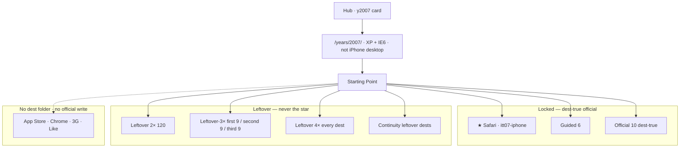
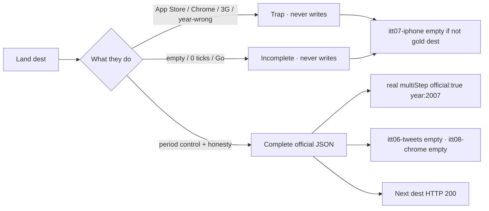
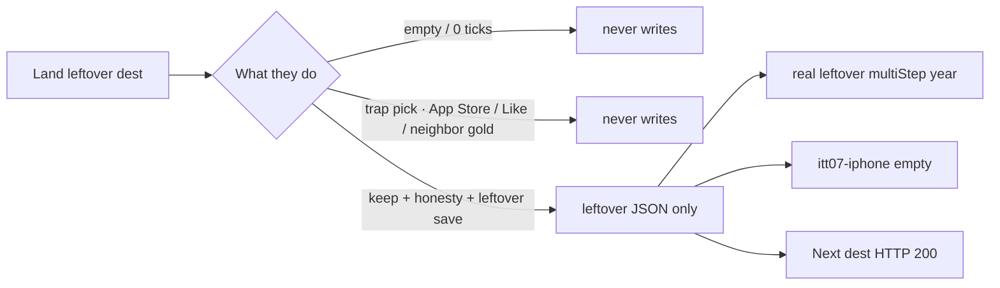
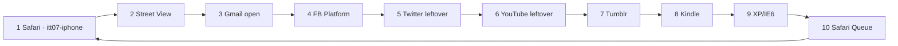
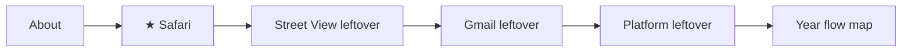
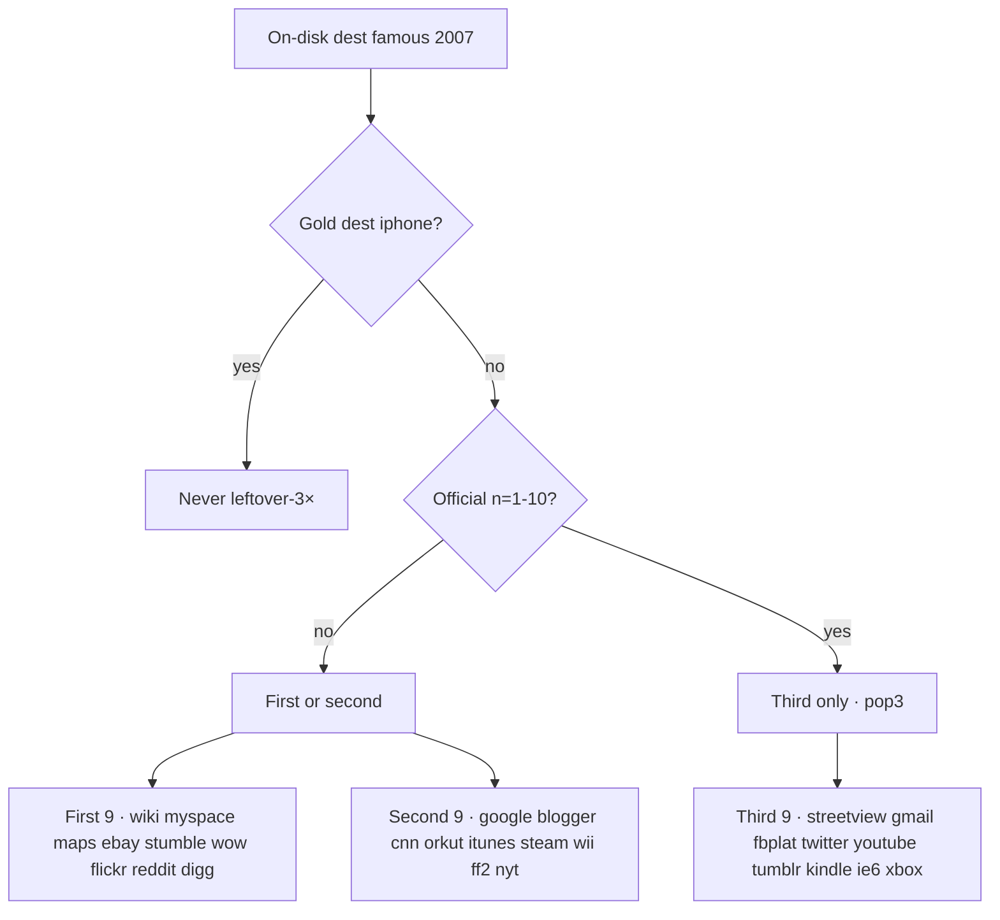

# 2007 — check every flow

**Date:** 2026-09-10  
**Prefix** `itt07` · star **iPhone Safari**  
**Lock:** [`2007-READ-FIRST.md`](2007-READ-FIRST.md) · dest-true map [`2007-DEST-TRUE-UNIQUE-MAP-GOALS-PHASES-FLOWS-MINUTE-2026-09-10.md`](2007-DEST-TRUE-UNIQUE-MAP-GOALS-PHASES-FLOWS-MINUTE-2026-09-10.md) · dest minutes [`2007-EVERY-FLOW-GOALS-PHASES-FLOWS-MINUTE-2026-09-10.md`](2007-EVERY-FLOW-GOALS-PHASES-FLOWS-MINUTE-2026-09-10.md)

```
test -d years/2007 && echo tree-ok
```

Guided stays **exactly 6**. Chip never moves off Safari. Desktop stays **XP + IE6**. Hub **25 years open**. 2008 / 2009 boarded.

---

## Year card — locked vs leftover vs dest-true



---

## Visitor minute — official dest (n=1–10)



Use this walk on: Safari · Street View · Gmail open · Platform · Twitter leftover · YouTube leftover · Tumblr · Kindle · IE6 · Safari Queue.

---

## Visitor minute — leftover dest (never the star)



---

## Official 10 Next chain



n=11–20 leftover trail only. Do not promote.

---

## Guided 6



`#ott-guided-2007 ol > li` = **6**. No 7th `<li>`.

---

## Leftover-3× who may sit



---

## Check table

| Step | Pass |
|------|------|
| Hub card 2007 | `a.year-card.available.y2007` |
| `/years/2007/` Skip connect | XP · IE6 · not iPhone desktop |
| Chip | ★ Safari → `sites/iphone/index.html` |
| Guided ol | **6** |
| About | June **121,892,559** · Jan **106,875,138** · users **1,373,327,790** |
| Gold empty / App Store / Chrome | write nothing |
| Gold URL + ticks + Go | `itt07-iphone` `{official:true}` |
| Official 10 dest-true | trap/empty never write · complete official key · Next 200 |
| Neighbor keys | `itt06-tweets` · `itt08-chrome` empty |
| Leftover complete | never `itt07-iphone` |
| Exit | `itt07-*` only |
| Leftover-3× first | no `iphone` |
| Warehouse | each dest **once** |
| `#ott-2x-2007` | below guided · not inside `<ol>` |
| Atlas / hub | **25 years open** · 2007 available · 2008/2009 boarded |

**e2e:** `e2e/2007-every-link.spec.js` (every dest folder + every home dest href + official dest-true face) · `e2e/2007-dest-true-official.spec.js` · `e2e/2007-mvp.spec.js` · `e2e/gold-leftover-isolation.spec.js` · `e2e/hub-years.spec.js`

**DONE 2026-09-10:** tree-ok · un-board · dest-true official 10 · first-board 27 · leftover never writes gold · dest freeze **82**.
