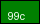

# 2007 — Clear goals, step-by-step phases, how-to, and period user flows

**Date:** 2026-07-31  
**Purpose:** One **readable** playbook for building and verifying the **2007** museum year:

1. **Goals** — what “done” means  
2. **Phases** — ordered steps and **how each is achieved**  
3. **User flows A–T** — each matches how people used the internet **in 2007**  
4. **Images** — period assets from this repo (shell chrome, product logos)

**Legal:** Educational reconstruction only. Trademarks belong to their owners. Interactions are **localStorage theater** (no real cellular data, App Store binaries, map tiles, SMTP, payments, or third-party APIs). **Never invent brand pixels.**

| Companion docs | Role |
|----------------|------|
| [`2007-RESEARCH.md`](2007-RESEARCH.md) | Thesis · timeline · bans |
| [`2007-DEEP-RESEARCH-FRESH-2026-07-31.md`](2007-DEEP-RESEARCH-FRESH-2026-07-31.md) | Product kits · primary sources |
| [`2007-RELATABLE-CONTENT-AND-PERIOD-VOICE-2026-07-31.md`](2007-RELATABLE-CONTENT-AND-PERIOD-VOICE-2026-07-31.md) | Daily life · voice · slang |
| [`2007-CONNECTIONS-AND-TRAILS.md`](2007-CONNECTIONS-AND-TRAILS.md) | Product bridges |
| [`2007-IMPLEMENTATION-GOALS-PHASES-AND-USER-FLOWS.md`](2007-IMPLEMENTATION-GOALS-PHASES-AND-USER-FLOWS.md) | Long-form densify bible (detail) |
| [`2007-MUSEUM-GRADE.md`](2007-MUSEUM-GRADE.md) | Ship status |
| Live tree | `years/2007/` · prefix **`itt07`** |
| e2e | `e2e/2007-mvp` · `real-flows` · `densify` · `trail` · **`flows` (A–T)** |

**Status marks**

| Mark | Meaning |
|------|---------|
| **[x]** | Done on disk |
| **[ ]** | Open residual |
| **[~]** | Optional forever (does not block ship) |

---

# Part 1 — Overall goals

## 1.1 One-line goal

Build a **museum-grade 2007 Web immersion**: Windows XP + IE shell, period sites, and **real local interactions** that recreate how people used the internet in calendar year **2007** — especially **iPhone Safari (no App Store)**, **open Gmail**, **Street View**, **Facebook Platform**, and **Twitter’s SXSW breakout** — while most people still live on the **desktop** Web 2.0 stack.

## 1.2 Visitor outcome (done = visitor can do this)

```
Hub → open 2007
  → XP desktop + IE (IE6/7 story · Vista optional product only)
  → Starting Point / About:
        121,892,559 sites · 1.37B users · Tumblr birthmark
        thesis: phone becomes a real browser · desktop still mass
        hard bans: Chrome · App Store · Android mass phones
  → iPhone: Jan 9 announce · Jun 29 ship · multi-touch Safari · history theater
  → Gmail: open signup Feb 14 (not invite-only year story)
  → Street View: May 29 · SF / NYC / Vegas / Miami / Denver
  → Facebook Platform: May 24 · add/remove SuperPoke-class apps · Beacon honesty
  → Twitter: SXSW breakout · 140 · “What are you doing?”
  → YouTube: Google-owned ALL year · Flash culture
  → Continuity: MySpace mass · Digg · Flickr · Docs · AWS · Netflix DVD (+ seed)
  → Exit → hub resume · all state under itt07-* localStorage
```

## 1.3 Year thesis (copy must match)

**2007 is when the phone becomes a real web browser you carry — and more of the web opens to everyone:**

| Theme | Period truth |
|-------|----------------|
| Mobile | iPhone announce **Jan 9** · ship US **Jun 29** · **Safari only** · **no App Store** |
| Accounts | Gmail **open worldwide Feb 14** |
| Maps | **Street View** (museum **May 29**) · five US cities |
| Social platform | **Facebook Platform May 24** · late **Beacon** privacy fight |
| Status | **Twitter** breakout at **SXSW March** (born 2006) |
| Video | **YouTube Google-owned all year** (deal closed Nov 13, 2006) |
| OS | **Vista retail Jan 30** · **XP still mass default** |
| Future phones | **Android OHA Nov 5** — announce only, **no mass phones** |

Mood: mobile *promise* + platform *power* + privacy panic — **fat laptops for most of the world**.

## 1.4 Locked facts (do not invent)

| Fact | Value |
|------|------:|
| Websites (June class) | **121,892,559** (+43% from 2006) |
| Internet users | **1,373,327,790** |
| Live Stats birthmark | **Tumblr** |
| iPhone prices (announce) | **$499** 4GB · **$599** 8GB |
| Carrier class | **Cingular** (→ AT&T) exclusive US |
| Street View cities | SF · NYC · Las Vegas · Miami · Denver |
| Storage prefix | **`itt07`** |
| Shell default | **Windows XP + IE 6/7** |

## 1.5 Hard bans (never 2007 default product)

| Ban | Correct era |
|-----|-------------|
| **Chrome** browser | Sep 2008 |
| **App Store** / native app grid | Jul 2008 |
| **iPhone 3G** as “the” 2007 phone | 2008 |
| **Android mass phones** | late 2008+ |
| Gmail **invite-only as year default** | Open Feb 14, 2007 |
| Modern iOS / X / Reels / For You | Later |
| Netflix **streaming-first** | DVD still primary 2007 |
| Campus-only Facebook | Ended Sep 2006 |

## 1.6 Engineering rules (every phase)

1. **Config + content** — densify inside `years/2007/`; no new browser engine.  
2. Content pages load **only** `js/immersion-2007.js`.  
3. Year-native storage: **`itt07-*`** via `ITT.util.immersionStorageKey`.  
4. Keep every **`data-*`** hook when editing HTML.  
5. **Period voice** — no “Museum theater” lead copy on product rooms.  
6. **Never invent brand pixels** — WA / RECON / CONTINUITY only; log CAPTURE.  
7. Gates green before calling a phase done. **Git only if the user asks.**

## 1.7 Global gates

```bash
python3 -m http.server 8080 --bind 127.0.0.1
# open http://127.0.0.1:8080/years/2007/

python3 scripts/test-authenticity.py
python3 scripts/smoke-production.py

npx playwright test e2e/2007-*.spec.js e2e/hub-years.spec.js --workers=1
# includes: mvp · real-flows · densify · trail · flows A–T
```

---

# Part 2 — Period visual grammar (images on disk)

These files ship with the project. Paths are relative to **`docs/`**. Use them in rooms and docs; do not invent replacements.

### 2.1 Shell — Windows XP + IE-class chrome

The immersion **looks like a period desktop browser**, not a modern SPA.

| Asset | Preview |
|-------|---------|
| XP Start |  |
| XP taskbar strip |  |
| Back |  |
| Forward |  |
| Stop |  |
| Reload |  |
| Home |  |
| Search |  |
| Favorites |  |
| History |  |
| Mail |  |
| Throbber |  |

**How used:** `years/2007/index.html` shell + `css/win95-netscape.css` / period IE overrides · chrome paths under `assets/period/2007/chrome/`.

### 2.2 Signature product marks (2007 rooms)

| Product | Image | Room |
|---------|-------|------|
| Gmail |  | `sites/gmail/` |
| Google Maps |  | `sites/maps/` · Street View |
| Facebook |  | `sites/facebook/` |
| YouTube |  | `sites/youtube/` |
| Digg |  | `sites/digg/` |
| MySpace |  | `sites/myspace/` |
| Flickr |  | `sites/flickr/` |
| Google |  | `sites/google/` |
| Netflix |  | `sites/netflix/` |
| Amazon smile |  | `sites/amazon/` |
| iTunes 99¢ |  | `sites/itunes/` |

### 2.3 External reference images (not in repo — open for research only)

Do **not** download into brand folders without CAPTURE log + authenticity notes.

| Subject | Primary / narrative URL |
|---------|-------------------------|
| iPhone announce PR | [Apple Newsroom 2007-01-09](https://www.apple.com/newsroom/2007/01/09Apple-Reinvents-the-Phone-with-iPhone/) |
| Street View launch | [Google Lat Long — Introducing Street View](https://maps.googleblog.com/2007/05/introducing-street-view.html) |
| Year essay + screenshots | [Cybercultural — Internet 2007](https://cybercultural.com/p/internet-2007/) |
| Period top stories | [RWW Top 10 Web Tech 2007](https://ricmac.org/2007/12/31/top-10-web-tech-stories-of-2007/) |

**Pixel residual (optional Phase 14):** dedicated iPhone product still · pegman / Street View UI crop · Twitter bird period mark — only from dated WA / WDM with README.

---

# Part 3 — Phase map (step by step)

| Phase | Name | Done when… | Status |
|------:|------|------------|--------|
| **0** | Inventory freeze | Disk + e2e + prefix known | **[x]** |
| **1** | Research lock | Thesis · bans · scale · timeline frozen | **[x]** |
| **2** | Home / About scale + thesis | Live Stats + bans + trails on Starting Point | **[x]** |
| **3** | Gmail open honesty | Open-default copy (not invite year story) | **[x]** |
| **4** | iPhone densify | History · presets · announce→ship multipage | **[x]** |
| **5** | Street View densify | Five cities · Maps handoff · turn state | **[x]** |
| **6** | Facebook Platform densify | Add/remove apps · Beacon about | **[x]** |
| **7** | Twitter SXSW densify | About depth · profile ← timeline | **[x]** |
| **8** | YouTube + continuity year-truth | Google-owned · MySpace/Digg/Netflix honesty | **[x]** |
| **9** | Vista + Android note | Product room · About OHA (no phone shop) | **[x]** |
| **10** | Trail wiring | Home connection trails + bridges | **[x]** |
| **11** | Hooks + storage audit | Signature flows mutate **`itt07` only** | **[x]** |
| **12** | Hard e2e densify + trails + A–T | All `e2e/2007-*.spec.js` green | **[x]** |
| **13** | Docs + museum-grade claim | Research + MUSEUM-GRADE honest | **[x]** |
| **14** | Optional pixel polish | WA/WDM iPhone · pegman · Platform chrome | **[~]** |
| **15** | Optional P2 rooms | Tumblr · Kindle thin rooms (FriendFeed/OpenSocial still open) | **[x]** Tumblr · Kindle · **[~]** FriendFeed/OpenSocial |
| **16** | Relatable voice densify | About / whats-new / cool + P0 product abouts | **[x]** |

**Densify ship** = Phases **0–13**.  
**P2 partial** = **15** Tumblr + Kindle shipped thin.  
**Voice** = **16** shipped on pages + P0 abouts.

---

# Part 4 — Each phase: goal · how achieved · acceptance

## Phase 0 — Inventory freeze **[x]**

### Goal
Know what exists so work is densify/verify, not accidental rebuild.

### How achieved
1. `find years/2007 -name '*.html' | wc -l` · `ls years/2007/sites`  
2. `find assets/period/2007 -type f | wc -l`  
3. Confirm hub card **2007 available**  
4. Confirm `storagePrefix: "itt07"` in immersion config  
5. List `e2e/2007-*.spec.js`  
6. Confirm P0 folders: `iphone` · `gmail` · `maps` · `facebook` · `twitter` · `youtube`

### Acceptance
- [x] Tree live · hub unlocked · prefix `itt07`

---

## Phase 1 — Research lock **[x]**

### Goal
Freeze thesis, scale, bans, and timeline so implementers do not invent dates.

### How achieved
1. Write/update `2007-RESEARCH.md` + deep research  
2. Lock Live Stats **121,892,559** / **1,373,327,790**  
3. Lock bans (Chrome · App Store · Android phones)  
4. Lock Street View cities + May 29 museum date  
5. Open primary sources (Apple · Lat Long · Cybercultural)

### Acceptance
- [x] Docs cite locked numbers and bans  
- [x] Relatable voice pack available for copy

---

## Phase 2 — Home / About scale + thesis **[x]**

### Goal
Visitor sees correct scale, thesis, bans, and tour entry on day one.

### How achieved
1. Edit `years/2007/pages/home.html` — scale strip · tour · connection trails  
2. Edit `pages/about.html` — thesis · scale box · timeline · bans  
3. Edit `whats-new.html` / `cool.html` — year-truth lists  
4. Assert copy in e2e Flow B

### Acceptance
- [x] Body contains **121,892,559** · bans · signature products

### Images involved
Shell chrome (Part 2.1) · Google / YouTube / Gmail logos on linked rooms.

---

## Phase 3 — Gmail open copy honesty **[x]**

### Goal
Product truth = **open signup after Feb 14**, not invite-only year story.

### How achieved
1. Update `sites/gmail/index.html` · `about.html` · `compose` · `inbox` · `invite`  
2. Invites = **legacy / share with friends**, not gate  
3. Keep hooks: `data-gmail-login` · `data-gmail-compose` · `data-gmail-draft`  
4. Keys: `itt07-gmail` · `itt07-gmail-msgs` · `itt07-gmail-drafts`

### Acceptance
- [x] About says Feb 14 open · compose/send mutates storage  
- [x] e2e Gmail flows green  


---

## Phase 4 — iPhone densify **[x]**

### Goal
Visitor experiences **announce → ship → Safari web** with **no App Store**.

### How achieved
1. `sites/iphone/about.html` — Jan 9 · prices · Jun 29 · bans  
2. `sites/iphone/index.html` — URL form · screen theater · presets  
3. `js/immersion/iphone.js` — history list · **`itt07-iphone-history`**  
4. Dirbar **iPhone** on shell  

### Acceptance
- [x] “No App Store” honest · history persists · presets work  

**Reference (external):** Apple Newsroom stills — research only until CAPTURE harvest.

---

## Phase 5 — Street View densify **[x]**

### Goal
Maps feature of **May 2007**: walk five launch cities; state persists.

### How achieved
1. `sites/maps/streetview.html` — five cities · viewer status  
2. `sites/maps/index.html` — clear CTA to Street View (not “banned”)  
3. `maps.js` — city + turn/heading theater · **`itt07-streetview`**  
4. Dirbar label **Street View** (not only “Maps”)

### Acceptance
- [x] All five cities clickable · storage key · Maps → SV handoff  


---

## Phase 6 — Facebook Platform densify **[x]**

### Goal
May 24 developer platform: add/remove apps; late-year Beacon honesty.

### How achieved
1. `sites/facebook/platform.html` — SuperPoke-class add  
2. Remove-app control · list updates  
3. Key **`itt07-fb-apps`**  
4. `about.html` — Beacon Nov privacy  

### Acceptance
- [x] Add + remove mutate storage · Beacon copy present  


---

## Phase 7 — Twitter SXSW densify **[x]**

### Goal
Growth-year Twitter: 140 chars, SXSW story, timeline + profile.

### How achieved
1. Compose → timeline · **`itt07-tweets`**  
2. `about.html` — SXSW · plasmas · SMS class  
3. `profile.html` reads own tweets  

### Acceptance
- [x] Compose + profile green in e2e  

---

## Phase 8 — YouTube + continuity year-truth **[x]**

### Goal
No residual “independent YouTube” or wrong-year continuity copy.

### How achieved
1. YouTube about: **Google-owned all year**  
2. Sweep googlevideo / mashable / residual 2006 paste  
3. Netflix: DVD primary + Watch Now **seed**  
4. MySpace / Digg still mass  

### Acceptance
- [x] Ownership + continuity honesty in signature rooms  


---

## Phase 9 — Vista + Android note **[x]**

### Goal
Vista retail is real; XP shell remains default; Android is announce-only.

### How achieved
1. `sites/microsoft/vista.html` product room  
2. About timeline: Nov 5 OHA · **no phone shop**  
3. Shell stays XP + IE  

### Acceptance
- [x] About bans Android mass phones · Vista not forced shell  


---

## Phase 10 — Trail wiring **[x]**

### Goal
Home shows multi-product **connection trails** (how 2007 life actually linked).

### How achieved
1. Home trails: Mobile web · Open Google · Maps on street · Platforms · Video front page · Blogosphere · Who owns social  
2. Cross-links Maps ↔ Street View · Gmail ↔ Maps · Platform ↔ Feed · YT ↔ Digg  
3. Document bridges in `2007-CONNECTIONS-AND-TRAILS.md`  

### Acceptance
- [x] Home contains trail copy · trail e2e green  

---

## Phase 11 — Hooks + storage audit **[x]**

### Goal
Every signature action mutates **only** `itt07-*` (no silent `itt06` bleed).

### How achieved
1. Grep immersion modules for year keys  
2. Manual DevTools check per Flow C–I  
3. e2e asserts keys after actions  

### Acceptance
- [x] Real-flows + densify + flows specs pass  

---

## Phase 12 — Hard e2e densify + trails + A–T **[x]**

### Goal
Automated proof for densify gates and **every period flow A–T**.

### How achieved
1. `e2e/2007-densify.spec.js`  
2. `e2e/2007-trail-real-flows.spec.js`  
3. `e2e/2007-flows.spec.js` — one describe per flow A–T  
4. `e2e/2007-mvp.spec.js` · `2007-real-flows.spec.js`  

### Acceptance
- [x] `npx playwright test e2e/2007-*.spec.js --workers=1` green  

---

## Phase 13 — Docs + museum-grade claim **[x]**

### Goal
Docs match disk; claim densify honestly.

### How achieved
1. Update `2007-MUSEUM-GRADE.md` · `DISK-TRUTH.md`  
2. Link research + flows + connections  
3. Residual list only optional items  

### Acceptance
- [x] Status files say densify landed · residual optional  

---

## Phase 14 — Optional pixel polish **[~]**

### Goal
Richer authentic stills without inventing pixels.

### How achieved
1. CAPTURE-LOG dated WA/WDM harvest  
2. README-AUTHENTICITY per folder  
3. Prefer RECON labeled if uncertain  

### Acceptance
- [ ] Optional — never blocks ship  

---

## Phase 15 — Optional P2 rooms **[x]** partial

### Goal
Tumblr · Kindle · FriendFeed · OpenSocial as thin honest rooms.

### How achieved
1. `sites/tumblr/index.html` — Feb launch · birthmark · no fake dash engine  
2. `sites/amazon/kindle.html` — Nov 19 · $399 · no invented device PNG  
3. Wired on home · about · whats-new · cool · `urlMap`  
4. FriendFeed / OpenSocial still optional forever  

### Acceptance
- [x] Tumblr + Kindle rooms live  
- [ ] FriendFeed / OpenSocial  

---

## Phase 16 — Relatable voice densify **[x]**

### Goal
Copy feels like **living in 2007** (day rituals, period words, calendar).

### How achieved
1. Voice pack MD written  
2. `about` · `whats-new` · `cool` densified  
3. P0 abouts densified: iPhone · Gmail · Street View · Facebook · Platform · Twitter · YouTube · Vista  

### Acceptance
- [x] About has day-in-life + period words  
- [x] Product-about voice kits applied

---

# Part 5 — Period user flows (match 2007 real life)

Each flow = **2007 ritual** → museum steps → pages → hooks → storage.  
**Real** = DOM and/or **`itt07-*` localStorage** change.

---

## Flow A — Enter the year (always first)

**2007 ritual:** Sit at a Windows XP PC, open IE (often IE7 late year), broadband always-on.

| Step | Visitor action | System response |
|-----:|----------------|-----------------|
| 1 | Hub → **2007** | Load `years/2007/` shell |
| 2 | Connect / Skip | Desktop + IE window |
| 3 | Starting Point loads | Tour + trails inject |
| 4 | Location bar theater | `urlMap` |

**Pages:** `years/2007/index.html` · `pages/home.html`  
**Done when:** Dirbar shows **iPhone · Gmail · Street View · Facebook · Twitter · YouTube**.


**e2e:** `Flow A` in `2007-flows.spec.js`

---

## Flow B — Learn the year (thesis)

**2007 ritual:** Blogs and magazines talk iPhone lines, open Gmail, Facebook apps, Twitter at SXSW.

| Step | Action | Result |
|-----:|--------|--------|
| 1 | Open **About 2007** | Scale **121,892,559** · **1.37B** users · Tumblr |
| 2 | Read signature list | iPhone · Gmail open · Street View · Platform · Twitter · YT |
| 3 | Read bans | No Chrome · App Store · Android mass phones |
| 4 | Optional What’s New / Cool | Period Top 10 energy |

**Pages:** `pages/about.html` · `home.html` · `whats-new.html` · `cool.html`  
**Done when:** Visitor can say: “phone becomes a browser; desktop still mass; accounts open up.”

---

## Flow C — iPhone: announce, ship, browse the web

**2007 ritual:** Jan 9 keynote shock → June lines at Apple/Cingular → **Safari** on multi-touch glass. Desktop sites often broken. **No App Store.**

| Step | Action | Result |
|-----:|--------|--------|
| 1 | Dirbar **iPhone** | Product room |
| 2 | Read **About** | Jan 9 · $499/$599 · Jun 29 · no App Store |
| 3 | Type URL · **Go** | Screen theater + status |
| 4 | History list | **`itt07-iphone-history`** |
| 5 | Preset (Maps / Google / YouTube) | Same key |

**Hooks:** `data-iphone-browse` · `data-iphone-screen` · `data-iphone-status`  
**Honesty:** No real cellular network · no App Store binaries.  
**Ban:** App Store grid · iPhone 3G as default.

---

## Flow D — Gmail: open to everyone

**2007 ritual (from Feb 14):** Create an account **without** begging for invites; search mail; conversation view.

| Step | Action | Result |
|-----:|--------|--------|
| 1 | Open **Gmail** | Open-signup framing |
| 2 | About | **Feb 14, 2007** open worldwide |
| 3 | Sign-in theater → inbox | `itt07-gmail` |
| 4 | Compose → Send | **`itt07-gmail-msgs`** |
| 5 | Optional Save Draft | **`itt07-gmail-drafts`** |
| 6 | Invites page | Legacy share — **not** the main gate |


**Ban:** Invite-only as **year default** story.

---

## Flow E — Street View: walk the city from Maps

**2007 ritual (from May):** Drop into panoramic streets in a few US cities; “I found my house”; privacy jokes.

| Step | Action | Result |
|-----:|--------|--------|
| 1 | Open **Maps** | Ajax Maps continuity |
| 2 | Open **Street View** | May 29 + five cities |
| 3 | Pick **San Francisco** (or NYC / Vegas / Miami / Denver) | Viewer updates |
| 4 | Optional turn left/right | Heading theater |
| 5 | Persist | **`itt07-streetview`** |


**Cities lock:** SF · New York · Las Vegas · Miami · Denver only as launch set.  
**Honesty:** No live Google tiles.

---

## Flow F — Facebook Platform: add an app

**2007 ritual (from May 24):** Apps inside Facebook; SuperPoke spam; MySpace often still larger mass.

| Step | Action | Result |
|-----:|--------|--------|
| 1 | Open **Platform** | May 24 developer platform |
| 2 | Add **SuperPoke!** (or class) | List updates |
| 3 | Storage | **`itt07-fb-apps`** |
| 4 | Remove app | List shrinks |
| 5 | About Beacon (late year) | Nov privacy honesty |
| 6 | Optional Feed / profile | Continuity keys |


**Ban:** Reactions · Reels · modern Instant Games framing.

---

## Flow G — Twitter: SXSW breakout year

**2007 ritual:** 140 characters; hallway plasma screens; SMS shortcode; “What are you doing?”

| Step | Action | Result |
|-----:|--------|--------|
| 1 | Dirbar **Twitter** | Sparse home |
| 2 | Status ≤140 · update | Timeline shows post |
| 3 | Storage | **`itt07-tweets`** |
| 4 | About | Born 2006 · **SXSW 2007** breakout |
| 5 | Profile | Own tweets from storage |

**Ban:** For You · long posts · blue checks · “X” branding.

---

## Flow H — YouTube: Google-owned all year

**2007 ritual:** Flash “Broadcast Yourself”; embed everywhere; **CNN/YouTube debates** (Jul/Sep) make video political.

| Step | Action | Result |
|-----:|--------|--------|
| 1 | Open YouTube | Mid-2000s chrome |
| 2 | Watch / upload title | `itt07-yt-views` · `itt07-yt-uploads` |
| 3 | About | Google-owned **all year** |


**Ban:** “Google just bought YouTube *this* year” as 2007 news · modern Material UI.

---

## Flow I — Digg: still the geek front page

**2007 ritual:** Digg still huge for link popularity; digg/bury culture.

| Step | Action | Result |
|-----:|--------|--------|
| 1 | Open Digg | Popular list |
| 2 | digg it / bury | **`itt07-digg-links`** |
| 3 | Optional submit | Mine list |


---

## Flow J — MySpace: still mass social

**2007 ritual:** Top 8 drama · HTML profiles · music players · still enormous early/mid year.

| Step | Action | Result |
|-----:|--------|--------|
| 1 | Open MySpace | Continuity densify |
| 2 | Profile / invite / forms | `itt07-myspace-*` |
| 3 | About honesty | Mass king under Facebook pressure |


---

## Flow K — Continuity: Flickr · Docs · AWS · Reader

**2007 ritual:** Yahoo Flickr; Google Docs collab; AWS for devs; Reader for RSS geeks.

| Step | Action | Result |
|-----:|--------|--------|
| 1 | Flickr upload | `itt07-flickr-stream` |
| 2 | Docs edit/save | `itt07-docs` |
| 3 | AWS bucket theater | `itt07-aws-buckets` |
| 4 | Reader subscribe | `itt07-reader-subs` |


---

## Flow L — Maps Local Search (+ Street View)

**2007 ritual:** Drag/zoom Ajax maps; Local Search; after May try Street View.

| Step | Action | Result |
|-----:|--------|--------|
| 1 | Maps search / zoom | `itt07-maps-state` |
| 2 | Jump to Street View | → Flow E |

---

## Flow M — Google / Yahoo start the day

**2007 ritual:** Many open Google or Yahoo first, then branch to social/video/mail.

| Step | Action | Result |
|-----:|--------|--------|
| 1 | Google search form | Catalog results theater |
| 2 | Teaser links | Maps · Gmail · YouTube |


---

## Flow N — Vista retail (optional product)

**2007 ritual:** Some buy Vista Jan 30; many keep XP; UAC jokes.

| Step | Action | Result |
|-----:|--------|--------|
| 1 | Open Vista product page | Retail GA honesty |
| 2 | Shell stays XP | Educational contrast |

**Ban:** Vista as *only* museum shell.

---

## Flow O — Android / OHA note (not a phone shop)

**2007 ritual (Nov 5):** “Android platform” · “not a Gphone”; phones **2008**.

| Step | Action | Result |
|-----:|--------|--------|
| 1 | Read About timeline | Nov 5 OHA |
| 2 | No “buy Android phone” P0 | Ban mass phones |

---

## Flow P — Netflix DVD mail (+ streaming seed)

**2007 ritual:** Red-envelope queue is religion; limited electronic delivery / “Watch Now” seed.

| Step | Action | Result |
|-----:|--------|--------|
| 1 | Add title to queue | **`itt07-netflix-queue`** |
| 2 | Copy honesty | DVD primary · streaming seed only |


**Ban:** Netflix as streaming-first 2007 product.

---

## Flow Q — Amazon smile (+ optional Kindle)

**2007 ritual:** Shop Amazon; late year Kindle $399 sells out (optional densify).

| Step | Action | Result |
|-----:|--------|--------|
| 1 | Add to cart | cart keys under `itt07` |
| 2 | Optional Kindle note | Nov 19 · P2 |


---

## Flow R — Wikipedia look something up

**2007 ritual:** Free encyclopedia habit (often via Google).

| Step | Action | Result |
|-----:|--------|--------|
| 1 | Browse / edit theater | Wiki continuity rooms |


---

## Flow S — Culture: privacy + ads boom

**2007 ritual:** DoubleClick/aQuantive deals; late year **Beacon** freakout.

| Step | Action | Result |
|-----:|--------|--------|
| 1 | Facebook about Beacon | Nov honesty |
| 2 | Optional AdSense continuity | `itt07-adsense` |

---

## Flow T — Exit and resume

**2007 ritual:** Close browser; come back tomorrow with the same drafts and tweets.

| Step | Action | Result |
|-----:|--------|--------|
| 1 | Desktop **Exit** | Return to hub |
| 2 | Resume last year | `itt-last-year` = 2007 |
| 3 | Clear site data | All `itt07-*` reset |

---

# Part 6 — Recommended demo order (life in 2007)

| Order | Flow | Why it matches 2007 |
|------:|------|---------------------|
| 1 | **A** Enter year | XP + IE still mass |
| 2 | **B** Thesis | Scale + bans + mobile thesis |
| 3 | **C** iPhone | Defining product of the year |
| 4 | **D** Gmail open | Feb 14 unlock |
| 5 | **E** Street View | May Maps moment |
| 6 | **F** Facebook Platform | May developer platform |
| 7 | **G** Twitter SXSW | Breakout culture |
| 8 | **H** YouTube | Google-owned video |
| 9 | **I–K** Digg / MySpace / continuity | Desktop Web 2.0 daily life |
| 10 | **N–O** Vista / Android note | OS + future phone honesty |
| 11 | **T** Exit | Resume storage |

### Four product trails (Home already sketches these)

| Trail | Steps | Assert keys |
|-------|-------|-------------|
| **1. Mobile web** | iPhone about → browse → history | `itt07-iphone-history` |
| **2. Open accounts** | Gmail open → compose → inbox | `itt07-gmail-msgs` |
| **3. Maps on the street** | Maps → Street View → city | `itt07-streetview` |
| **4. Platforms** | FB Platform add → Twitter update → YouTube | `itt07-fb-apps` · `itt07-tweets` · `itt07-yt-*` |

---

# Part 7 — Storage key quick reference

| Key | Product |
|-----|---------|
| `itt07-iphone-history` | iPhone Safari |
| `itt07-gmail` · `itt07-gmail-msgs` · `itt07-gmail-drafts` | Gmail |
| `itt07-streetview` · `itt07-maps-state` | Maps / Street View |
| `itt07-fb-apps` · `itt07-thefacebook` · `itt07-fb-feed` | Facebook |
| `itt07-tweets` | Twitter |
| `itt07-yt-uploads` · `itt07-yt-views` | YouTube |
| `itt07-digg-links` | Digg |
| `itt07-myspace-*` | MySpace |
| `itt07-docs` · `itt07-aws-buckets` · `itt07-reader-subs` | Docs / AWS / Reader |
| `itt07-netflix-queue` | Netflix |
| `itt07-flickr-stream` · … | Continuity |

Never write `itt06-*` from a 2007 page (except one-time migrate if module supports it).

---

# Part 8 — Definition of done

| Check | Pass criteria | Status |
|-------|---------------|--------|
| Thesis | About/Home match locked scale + bans | **[x]** |
| Flows A–T | Specced + e2e | **[x]** |
| P0 C–H | Each mutates `itt07` + DOM | **[x]** |
| Gmail open | Not invite-default year story | **[x]** |
| iPhone | No App Store · history UI | **[x]** |
| Street View | Five cities + storage | **[x]** |
| Platform | Add + remove app | **[x]** |
| e2e | mvp · real-flows · densify · trail · flows | **[x]** |
| Docs | This file + MUSEUM-GRADE honest | **[x]** |
| Optional pixels / P2 | Tumblr · Kindle · WA stills | **[~]** |

```bash
python3 scripts/test-authenticity.py
python3 scripts/smoke-production.py
npx playwright test e2e/2007-*.spec.js e2e/hub-years.spec.js --workers=1
```

---

# Part 9 — What not to do

| Anti-goal | Why |
|-----------|-----|
| Real map tiles / cellular / App Store binaries | Legal + offline museum |
| Invent brand GIFs | CAPTURE / RECON only |
| Chrome or App Store as 2007 defaults | Hard bans |
| Android phone retail as P0 | Announce-only year |
| Gmail invite-only year story | Open Feb 14 |
| Replace XP shell with Vista-only | XP still mass |
| Soft mock buttons | Soft = bug; real storage or honest refuse |

---

# Part 10 — One-page “start here” for the next session

**If ship is already densify-green (current disk):**

1. Optional **Phase 16** — apply voice kits to `iphone/about` · `twitter/about` · `facebook/about` · `maps/streetview`.  
2. Optional **Phase 14** — CAPTURE dated pixels only.  
3. Optional **Phase 15** — thin Tumblr / Kindle rooms.  
4. Or begin **2008 research** (Chrome · App Store · Android phones).

**If re-building from wipe:** run Phases **0 → 13** in order; after each phase run the matching e2e describe; git only if asked.

---

**Document status:** Clear goals · phased how-to · period flows A–T · on-disk images.  
**Implements with:** `years/2007/` · `itt07` · `e2e/2007-flows.spec.js`.  
**Voice pack:** [`2007-RELATABLE-CONTENT-AND-PERIOD-VOICE-2026-07-31.md`](2007-RELATABLE-CONTENT-AND-PERIOD-VOICE-2026-07-31.md).
