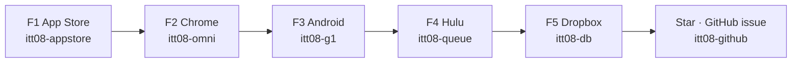
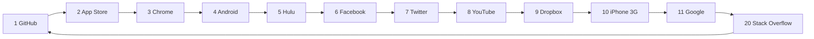
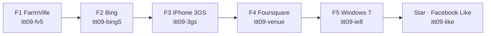
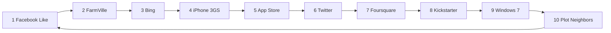

# 2008 and 2009 — same five measurable flows

Not ship law. Live `years/` and [`DISK-TRUTH.md`](DISK-TRUTH.md) win. Counts below were read from the working tree on 2026-09-23. Nothing in this file is committed.

A measurable 5× is five literacy loops. It is not a longer trail. Each loop refuses an empty click, writes `pack: "5x"` only when its checks are done, and hides Next until that key exists. The year’s official star is a different key.

---

## Goal

Make 2009’s five named loops measurable in the same way 2008’s five already are, without turning the boarded year into a hub door and without writing the Facebook Like star from a 5× save.

| | Goal |
|---|---|
| 2008 | Keep the five live plaques. Do not grow the trail to 50 stops. |
| 2009 | Five plaques, one home chip row, empty never writes, finished save is `pack: "5x"`, star `itt09-like` stays empty. |
| Both | Same test shape as `e2e/2008-5x-live.spec.js`. |
| Push | `docs/DISK-TRUTH.md` and `scripts/itt_5x_contract.py` name only the years whose plaques exist. |

---

## Flow diagrams

Both chains refuse an empty click. A finished 5× save writes `pack: "5x"`. The star key is separate.

### 2008 5×



### 2008 trail



Stops 12–19 are Yahoo, Wikipedia, Gmail, Flickr, Reddit, Amazon, MySpace, and del.icio.us. Stop 20 returns to GitHub.

### 2009 5×



### 2009 trail



2009 has no leftover stops past 10. The 5× keys are not the trail keys.

## Measured now

| | 2008 | 2009 |
|---|---:|---:|
| Destination folders | 591 | 78 |
| Hub card | Yes | No. Boarded. |
| Home chip row | `#ott-5x-2008`, 6 links | `#ott-5x-2009` on the boarded plaque, 6 links |
| Live plaques (`data-5x-live` + `data-5x-save`) | 5 | 5 |
| Trail stops | 20. Star `itt08-github` | 10. Star `itt09-like` |
| Leftover stops n>10 | 10 | 0 |

### 2008 — built

| Step | Page | Key | Checks | Next |
|---|---|---|---:|---|
| F1 | `years/2008/sites/appstore/index.html` | `itt08-appstore` | 2 | Chrome |
| F2 | `years/2008/sites/chrome/index.html` | `itt08-omni` | 3 | Android |
| F3 | `years/2008/sites/android/index.html` | `itt08-g1` | 2 | Hulu |
| F4 | `years/2008/sites/hulu/index.html` | `itt08-queue` | 2 | Dropbox |
| F5 | `years/2008/sites/dropbox/index.html` | `itt08-db` | 2 | `sites/github/issue.html` |

Home chips also link the GitHub issue. That sixth link is the star, not a sixth loop. `e2e/2008-5x-live.spec.js` passed (6 tests). `scripts/check-5x-contract.py` requires a plaque only on these five 2008 rooms.

### 2009 — plaques are on the boarded pages

Each `index.html` exists and has `data-5x-save`. The suffix is not the official key. A finished 5× save does not write `itt09-like`.

| Step | Page | Map line | Official stop | Trail key |
|---|---|---|---:|---|
| F1 | `years/2009/sites/farmville/index.html` | plant | n=2 | `itt09-farm` |
| F2 | `years/2009/sites/bing/index.html` | decision | n=3 | `itt09-bing` |
| F3 | `years/2009/sites/iphone/index.html` | 3GS, no iPad | n=4 | `itt09-iphone` |
| F4 | `years/2009/sites/foursquare/index.html` | venue | n=7 | `itt09-4sq` |
| F5 | `years/2009/sites/windows7/index.html` | IE8 residual | n=9 | `itt09-win7` |

Star stays n=1, Facebook Like, `itt09-like`, `sites/facebook/index.html`. These five rooms are also official stops. A 5× key must not be `itt09-like`.

`years/2009/pages/home.html` says the year is boarded. `docs/DISK-TRUTH.md` says the folder stays, the shell is a plaque, and there is no year card.

---

## Phase 0 — Measure

**Goal:** One table of what exists before any new plaque.

**Status:** Done for the counts above.

| Step | Done when |
|---|---|
| 0.1 Count dest folders for 2008 and 2009 | 591 and 78 |
| 0.2 Confirm 2008 plaques and chip row | Five `data-5x-live` pages and `#ott-5x-2008` |
| 0.3 Confirm 2009 map names and missing plaques | Five index files, zero `data-5x-save` |
| 0.4 Confirm trail numbers | 2008 stops at n=20. 2009 stops at n=10 |

---

## Phase 1 — Research the five 2009 rooms

**Goal:** Each loop’s check text comes from a dated source, and each page’s current save is known so the new plaque does not double-write the star.

**Status:** In progress. Four research runs are reading this slice. Do not build plaques from memory.

| Step | Done when |
|---|---|
| 1.1 Quote the save control on each of the five pages | Button or form name, and the key a finished visit writes today |
| 1.2 Prove an empty click on that control stores nothing | Same rule as 2008 |
| 1.3 Prove a finished official visit does not need `itt09-like` | Like stays the Facebook page |
| 1.4 One primary URL and a 2009 date for FarmVille, Bing, iPhone 3GS, Foursquare, Windows 7 | Cited in this file before Phase 3 |
| 1.5 Write the two checks (three only if the room needs a third, as Chrome did) | Checks are the 2009 fact, not a copy of the 2008 sentences |

### Fifteen added research tasks

Each one is a single question. A reader writes the answer with a file path. Phase 3 does not start off a guess.

| # | Question | Done when |
|---|---|---|
| R1 | What does `years/2009/sites/farmville/index.html` write, and on which control? | Key name, empty-click result, handler file |
| R2 | Same for `sites/bing/index.html` | Key name, empty-click result, handler file |
| R3 | Same for `sites/iphone/index.html` | Key name, empty-click result, handler file |
| R4 | Same for `sites/foursquare/index.html` | Key name, empty-click result, handler file |
| R5 | Same for `sites/windows7/index.html` | Key name, empty-click result, handler file |
| R6 | What writes `itt09-like` on `sites/facebook/index.html`? | Control and the trap that must not write |
| R7 | Which 2008 5× suffixes collide with an official `whenKey`? | None. Chrome 5× is `itt08-omni`. Hulu 5× is `itt08-queue`. Official keys stay `itt08-chrome` and `itt08-hulu`. |
| R8 | How does `js/immersion/year-5x-pack.js` turn `data-5x-suffix` into a key? | Exact string rule |
| R9 | What does `years/2009/pages/home.html` say about boarded? | Quoted sentence |
| R10 | Does the hub link 2009? | Yes or no, with the hub file |
| R11 | Which `e2e/*.spec.js` files already open these five 2009 rooms? | File names only |
| R12 | What does `docs/DISK-TRUTH.md` say about 2009 in one sentence? | Quote |
| R13 | List all ten 2009 `whenKey` values | From `js/config/flow-trails.js` |
| R14 | Will `css/itt-leftover-fold.css` hide a new `data-5x-live` plaque on an official page? | The selector |
| R15 | The 2009 flow-map still names Omegle, Chatroulette, and Wikipedia as leftover-3×. Are those catalogs empty? | `leftover-3x-unique.js` is `{}` or not |

---

## Phase 2 — Boarded-year gate

**Goal:** Decide where the five plaques may appear. 2009 is not a hub door.

| Step | Rule |
|---|---|
| 2.1 Do not add a 2009 card to the hub | `DISK-TRUTH` stays boarded |
| 2.2 Do not turn `years/2009/index.html` back into a playable shell | The plaque page stays the door |
| 2.3 Plaques, if built, live on the five site pages only | Same as a book that exists on disk but is not on the hub |
| 2.4 Home chip row `#ott-5x-2009` only if Starting Point is still the boarded plaque | Six links: five rooms, then Facebook Like. No seventh flow |
| 2.5 Stop Phase 3 if a source says the year must not grow any new visitor control | Record that here and leave the map branch as a name only |

---

## Phase 3 — Build the five 2009 loops

**Goal:** Match the 2008 mechanism. Do not add trail stops 11–50.

For each room, one block:

- `data-5x-loop` and `data-5x-live="1"`
- `data-5x-year="2009"`
- `data-5x-suffix` so the key is `itt09-` plus that suffix, and the suffix is not `like`
- `data-5x-req` checks from Phase 1
- `data-5x-save` and `data-5x-status`
- `data-5x-next` hidden until the key exists

Chain:

```text
FarmVille → Bing → iPhone 3GS → Foursquare → Windows 7 → Facebook Like
```

| Step | Done when |
|---|---|
| 3.1 F1 FarmVille | Empty Save stores nothing. Checks write `itt09-` + suffix with `pack: "5x"`. Next is Bing |
| 3.2 F2 Bing | Same. Next is the 3GS page |
| 3.3 F3 iPhone | Same. Next is Foursquare |
| 3.4 F4 Foursquare | Same. Next is Windows 7 |
| 3.5 F5 Windows 7 | Same. Next is `sites/facebook/index.html`. `itt09-like` is still empty |
| 3.6 Chip row | `#ott-5x-2009` has those six hrefs, or Phase 2.4 said not to add it |
| 3.7 Fold | `data-5x-live="1"` is not moved into the hidden “Also this year” box |
| 3.8 Contract | `plaque_required` is true for these five 2009 paths and still false everywhere else |

Official stops 2, 3, 4, 7, and 9 stay. The 5× suffix must not reuse `farm`, `bing`, `iphone`, `4sq`, or `win7` if that key is what the official verb already writes. Pick a distinct suffix, the way 2008 Android uses `g1` beside `itt08-android`.

---

## Phase 4 — Tests

**Goal:** One spec that fails if a loop writes early, writes the star, or drops its Next link.

| Step | File | Assert |
|---|---|---|
| 4.1 | `e2e/2009-5x-live.spec.js` | Home or chip row has 6 site links, if Phase 2.4 allowed the row |
| 4.2 | same | Each F page: Save with no checks stores nothing |
| 4.3 | same | All checks then Save stores `pack: "5x"` and `year: "2009"` |
| 4.4 | same | Next link becomes visible and points at the next room in the chain |
| 4.5 | same | After F5, `itt09-like` is still empty |
| 4.6 | `python3 scripts/check-5x-contract.py` | Passes |
| 4.7 | `e2e/2008-5x-live.spec.js` | Still passes. 2008 was not loosened to make 2009 fit |

---

## Phase 5 — Ship notes, then push

**Goal:** The canonical note matches the tree that gets committed.

| Step | Done when |
|---|---|
| 5.1 | `DISK-TRUTH` 2009 line says boarded, and either “5× F1–F5 on the five site pages” or “5× not built” |
| 5.2 | 2008 line stays “5× F1–F5 App Store, Chrome, Android, Hulu, Dropbox” |
| 5.3 | This plan’s Phase 1 date table is filled or marked blocked |
| 5.4 | Commit is the whole working tree on `museum/1994-2020-lean`, not a partial copy of these five files |
| 5.5 | Push only after Phase 4 is green |

Current branch matches `origin/museum/1994-2020-lean` at `20b7730ca`. The 5× work is still uncommitted.

---

## Out of scope

- Restoring leftover-3× catalogs. They are empty on purpose.
- Adding 2009 to the hub.
- Turning the 2008 or 2009 trail into 50 stops.
- Building the 2012 F1–F5 set. The contract does not require those plaques yet.
- The shell look (one background per year, a window that matches the year).
