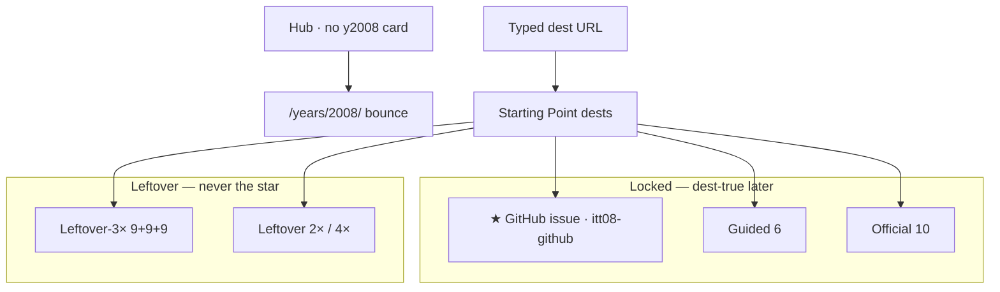
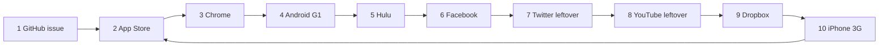
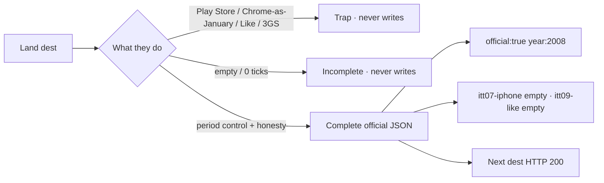
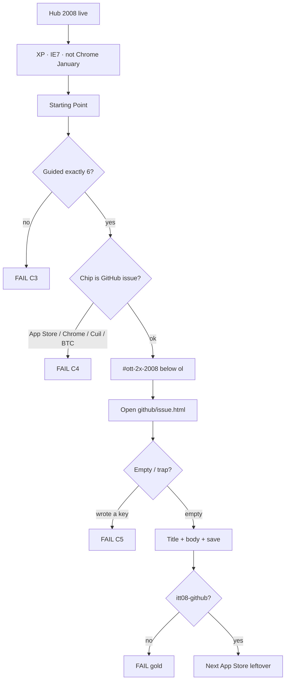
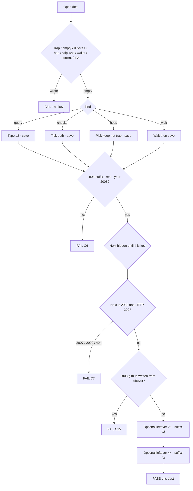
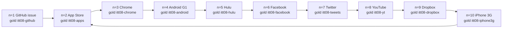
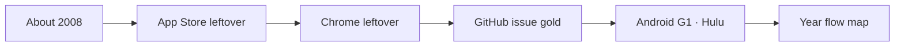

# 2008 — check every flow

**Date:** 2026-09-10  
**Prefix** `itt08` · star **GitHub issue** `itt08-github`  
**Door:** **live** (2026-09-10). Hub card · XP+IE7.  
**Dest-true unique research:** [`2008-DEST-TRUE-UNIQUE-RESEARCH-GOALS-PHASES-FLOWS-MINUTE-2026-09-10.md`](2008-DEST-TRUE-UNIQUE-RESEARCH-GOALS-PHASES-FLOWS-MINUTE-2026-09-10.md)  
**Every flow minutes:** [`2008-EVERY-FLOW-GOALS-PHASES-FLOWS-MINUTE-2026-09-10.md`](2008-EVERY-FLOW-GOALS-PHASES-FLOWS-MINUTE-2026-09-10.md)  
**5k walk:** [`2008-5K-WEB-FLOW-MAP-2026-09-10.md`](2008-5K-WEB-FLOW-MAP-2026-09-10.md)  
**Dest minutes:** [`2008-CUT-DOUBLE-DEST-MINUTES-2026-09-06.md`](2008-CUT-DOUBLE-DEST-MINUTES-2026-09-06.md)  
**Official 10:** `js/config/flow-trails.js` `"2008"` n=1–10  
**Leftover trail:** same file n=11–20

---

## Year card — locked vs leftover (boarded)

## Official 10 Next chain

## Official dest minute (named implement later)

Clear every `itt08-*` before you start. After each complete, only `itt08-*` may appear. No `itt07-*`. No `itt09-*`.

Serve: `python3 -m http.server 8080 --bind 127.0.0.1`  
Open `/years/2008/` · DevTools → Application → Local Storage.

---

## 0. Door

| Step | Pass |
|------|------|
| Hub card 2008 | `a.year-card.available.y2008` |
| `/years/2008/` Skip connect | XP · IE7 · not Chrome January |
| Chip | ★ GitHub issue → `sites/github/issue.html` |
| Guided `#ott-guided-2008 ol > li` | **exactly 6** |
| About | ILS June **172,338,726** · users **1,571,601,630** · Dec Netcraft labeled December |
| Gold empty / trap | write nothing |
| Gold title + body + save | `itt08-github` |
| Leftover complete | never `itt08-github` |
| `#ott-2x-2008` | below guided · not inside `<ol>` · 105 dests |
| Exit | `itt08-*` only |

---

## 1. Shared dest check — do this on every writer

**Fail if:** leftover writes `itt08-github` · Next writes gold · trap wrote · missing `real` or `year:"2008"`.

---

## 2. Official 10 — gold chain

Leftover on the same dest uses `*-lx` (GitHub leftover is `gh-issue`). Never leftover-write the gold suffix.

| n | URL | Trap | Save | Gold | Leftover |
|--:|-----|------|------|------|----------|
| 1 | `/years/2008/sites/github/issue.html` | Copilot / leftover-as-gold | title + body | `itt08-github` | `itt08-gh-issue` |
| 2 | `/years/2008/sites/appstore/index.html` | Play Store / millions day one | Get leftover | `itt08-apps` | `itt08-apps-lx` |
| 3 | `/years/2008/sites/chrome/index.html` | Chrome as January OS | Download leftover | `itt08-chrome` | `itt08-chrome-lx` |
| 4 | `/years/2008/sites/android/index.html` | Global-mass Android | Claim leftover G1 | `itt08-android` | `itt08-android-lx` |
| 5 | `/years/2008/sites/hulu/index.html` | Hulu-as-star / Netflix-only | Play leftover | `itt08-hulu` | `itt08-hulu-lx` |
| 6 | `/years/2008/sites/facebook/index.html` | Like-as-2008 / Beacon-launched-2008 | Open leftover feed | `itt08-facebook` | `itt08-facebook-lx` |
| 7 | `/years/2008/sites/twitter/index.html` | 280 / For You / X | Tweet leftover 140 | `itt08-tweets` | `itt08-tweets-lx` |
| 8 | `/years/2008/sites/youtube/index.html` | Google-does-not-own-YouTube | Watch leftover | `itt08-yt` | `itt08-yt-lx` |
| 9 | `/years/2008/sites/dropbox/index.html` | iCloud / Dropbox-as-star | Sync leftover | `itt08-dropbox` | `itt08-dropbox-lx` |
| 10 | `/years/2008/sites/iphone/index.html` | 3GS / Safari-only-year | Browse leftover 3G | `itt08-iphone3g` | `itt08-iphone3g-lx` |

n=10 Next is App Store leftover. It does **not** rewrite n=1 gold.

---

## 3. Leftover trail n=11–20

```mermaid
flowchart LR
  L11["n=11 Google\nitt08-google-rlx"] --> L12["n=12 Yahoo\nitt08-yahoo-rlx"]
  L12 --> L13["n=13 Wikipedia\nitt08-wikipedia-rlx"]
  L13 --> L14["n=14 Gmail\nitt08-gmail-rlx"]
  L14 --> L15["n=15 Flickr\nitt08-flickr-rlx"]
  L15 --> L16["n=16 Reddit\nitt08-rd-lx"]
  L16 --> L17["n=17 Amazon\nitt08-amazon-rlx"]
  L17 --> L18["n=18 MySpace\nitt08-myspace-rlx"]
  L18 --> L19["n=19 del.icio.us\nitt08-delicious-rlx"]
  L19 --> L20["n=20 Stack Overflow\nitt08-so-lx"]
  L20 --> STAR["★ github/issue.html\nNext only · no leftover gold write"]
```

n=20 Next is the gold dest. Completing SO leftover must **not** write `itt08-github`.

---

## 4. CUT-DOUBLE Next walk — Pack A 35

Start: `/years/2008/sites/firefox/downloadday.html`

**Trap check A:** Cuil won · wallet/mine/price · X rebrand · live OAuth · Beacon-as-star · donate live · Twitch 2011 · FarmVille 2009 · torrent · iCloud 2011 · Google buy as 2008.

---

## 5. CUT-DOUBLE Next walk — Pack B 35

**Trap check B:** DDG as Google-killer · IE8 / Win7 as January shell · iPlayer counted twice · live stream · official Adobe splash as WA.

---

## 6. CUT-DOUBLE Next walk — Pack C 35

Ends on the gold dest. Next does **not** write gold.

```mermaid
flowchart LR
  C01[C01 ag-dp] --> C02[C02 armor-dp]
  C02 --> C03[C03 pogo-dp]
  C03 --> C04[C04 neo-dp]
  C04 --> C05[C05 habbo-dp]
  C05 --> C06[C06 gaia-dp]
  C06 --> C07[C07 rs-dp]
  C07 --> C08[C08 wk-dp]
  C08 --> C09[C09 sl-dp]
  C09 --> C10[C10 xbl-dp]
  C10 --> C11[C11 wii-dp]
  C11 --> C12[C12 psn-dp]
  C12 --> C13[C13 ign-dp]
  C13 --> C14[C14 armory-dp]
  C14 --> C15[C15 mega-dp]
  C15 --> C16[C16 rsfile-dp]
  C16 --> C17[C17 sky-dp]
  C17 --> C18[C18 heroku-dp]
  C18 --> C19[C19 bb-dp]
  C19 --> C20[C20 wl-dp]
  C20 --> C21[C21 chan-dp]
  C21 --> C22[C22 whale-dp]
  C22 --> C23[C23 see-dp]
  C23 --> C24[C24 identica-dp]
  C24 --> C25[C25 gae-dp]
  C25 --> C26[C26 stumble-dp]
  C26 --> C27[C27 digg-lx]
  C27 --> C28[C28 rd-lx]
  C28 --> C29[C29 ms-us]
  C29 --> C30[C30 geo-lx]
  C30 --> C31[C31 flickr-lx]
  C31 --> C32[C32 del-lx]
  C32 --> C33[C33 fs-asia]
  C33 --> C34[C34 github-lx]
  C34 --> C35[C35 ythd-dp]
  C35 --> STAR["★ github/issue.html\nNext only · leftover never writes itt08-github"]
```

**Trap check C:** `github-lx` writes gold · MySpace already dead in the US · SkyDrive as OneDrive · WikiLeaks dump · Chanology raid · `ythd-dp` colliding with index `yt-hd`.

C34 URL: `/years/2008/sites/github/about.html` · suffix `github-lx`.  
C35 URL: `/years/2008/sites/youtube/hd.html` · suffix `ythd-dp` (index leftover stays `yt-hd`).

---

## 7. Guided 6 (not leftover)

Map URL: `/years/2008/pages/map.html` — dest-minutes table must list official 10 + 105.

---

## 8. Game (not a leftover key)

**Goo Span** is official **game**. Famous cabinets a–i are **not** in the +105.

| URL | Pass |
|-----|------|
| `/years/2008/sites/playable/game.html` | year game writes its own key · never leftover gold |
| `/years/2008/sites/playable/famous.html` | 2 cabinets · not counted as dests |

---

**Live check:** dest folders **198** · HTML **551** · named leftover **105** · star / guided 6 / official 10 frozen.
