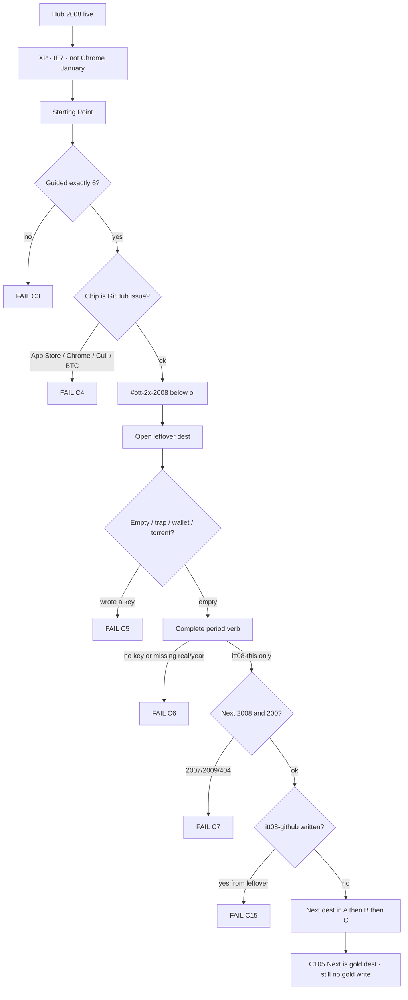

# 2008 — double criteria map

**Date:** 2026-09-06  
**Not an implement order.** Tick a **row id**. Implement only what you name.  
**Year is live.** `years/2008/` is **on disk**. Hub card **available**. Star **GitHub issue** `itt08-github`.

**This file is the lock for “does a double match other years.”** Gates going green is not enough. HTML count is not enough. Cloning AltaVista / Hamster Dance / Pets.com is not enough.

**Read first:** [`2008-MUSEUM-GRADE.md`](2008-MUSEUM-GRADE.md) · [`DISK-TRUTH.md`](DISK-TRUTH.md)  
**Dest minutes (CUT-DOUBLE):** [`2008-CUT-DOUBLE-DEST-MINUTES-2026-09-06.md`](2008-CUT-DOUBLE-DEST-MINUTES-2026-09-06.md)  
**Master bible (lags star):** [`2008-MASTER-BIBLE-GOALS-PHASES-FLOWS-SOURCES.md`](2008-MASTER-BIBLE-GOALS-PHASES-FLOWS-SOURCES.md) — still talks App Store as chip. **Star on disk is GitHub issue.**  
**Harvest:** [`2008-DEEP-RESEARCH-WEB-HARVEST-2026-08-01.md`](2008-DEEP-RESEARCH-WEB-HARVEST-2026-08-01.md)  
**Official 10:** `js/config/flow-trails.js` `"2008"`  
**Disk:** live tree + `scripts/itt_gate.py` `SHIP_YEARS`

When sources disagree: **this map + live tree + `flow-trails.js` win.** Older “App Store is the star / 311 HTML / 92 rooms” sentences **lose**.

5k websites = **research envelope** (ILS June **172,338,726**). **Never 5,000 dests.**

---

## Law (do not break)

Museum live includes **2008**. Guided **exactly 6**. Official **10**. Star does **not** move (`itt08-github` · GitHub issue). Empty / trap / 0 ticks / 1 hop / skip wait / App Store-as-gold / Chrome-as-January / Bitcoin-wallet **never write**. Leftover complete **never** writes the star. No dest-field plaques. No invented brand pixels. ILS June **172,338,726 (+41%)**. Netcraft June **same cell**. Dec Netcraft **186,727,854** is **December**, not June. 2× leftover already on dests. Double = **+105 year-true dests** (105 → **~210**). Do **not** pad by reprinting 1999 rooms. Do **not** `git checkout` an old forest. Do **not** move the star to App Store / Chrome / Cuil / Bitcoin.

Year differences live in **config + content**, not a skin.

---

## Criteria (always)

| # | Rule | Fail if |
|--:|------|---------|
| C1 | Double = **year-true 2008 dests** a visitor can finish. Not 2× raw hrefs. Not dest-field plaques. Not more AltaVista. | “I added 105 Hamster Dance rooms” ships |
| C2 | **+105** dest folders · Pack A 35 + Pack B 35 + Pack C 35 → **~210** websites | +20 plaques · reprint 353 HTML · 5,000 dests |
| C3 | Guided `#ott-guided-2008 ol > li` **exactly 6** | 7th `<li>` |
| C4 | Star **GitHub issue** does not move. `itt08-github` is **never** a leftover key | chip is App Store / Chrome / Cuil / Bitcoin |
| C5 | Incomplete / trap / empty / 0 ticks / 1 hop / skip wait / wallet / torrent / IPA **never writes** | wallet writes · empty writes |
| C6 | Complete writes `{real:true, multiStep:true, year:"2008", leftover?:true}` under `itt08-<suffix>` | missing `real` or `year` |
| C7 | Next hidden until **this** dest’s key exists. Next is a **2008** dest, HTTP 200 | Next to 2007/2009 · 404 |
| C8 | Prefix `itt08-*` only after a walk | any `itt07-*` / `itt09-*` |
| C9 | ILS June **172,338,726**. Netcraft June **same**. Dec **186,727,854** labeled December | blend June / December |
| C10 | Dual-cite Pack A. Continuity Pack C may be thin | Pack A unsourced |
| C11 | No official Apple / Google / Nintendo / EA / Rockstar / Disney / BBC / Mozilla pixels | brand as art |
| C12 | Bitcoin verb = **read the paper**. No wallet / mine / price / genesis | payload / ticker / 2009 chain as 2008 gold |
| C13 | Strip `#ott-2x-2008` sits **below** guided, not inside the `<ol>` | strip inside guided |
| C14 | Do not implement until named. Do not `git checkout` an old forest | HTML this pass without a named row |
| C15 | Leftover complete **never** writes `itt08-github`. GitHub literacy leftover is `itt08-github-lx` | leftover writes gold |
| C16 | Spotify is **Europe invite, Oct**. US is **2011** | Spotify US dest |
| C17 | iPhone **3GS** / FarmVille / Bing / Chrome-as-January / Win7-as-January are **not** 2008 defaults | any as chip |
| C18 | Extra games a–i and more-c/d are **cabinets**, not part of the +105 | cabinet counted as a dest |
| C19 | Goo Span is official **game**, not a leftover key | game gold on the leftover strip |
| C20 | Shell stays **XP + IE7**. Chrome / iPhone / G1 are **rooms** | Chrome January OS · iPhone January desktop |

---

## What “match other years” means here

A double is **not** dense enough if any of these is still true:

| Bar | Fail if |
|-----|---------|
| **V1 Variety** | Most new folders are **another year’s rooms** (1999 Napster / 2000 Pets / 2001 Zombo / 2009 FarmVille / 2011 Spotify US) with a 2008 sticker |
| **V2 Amount** | Count of **year-true other 2008 websites** is a thin plaque list, not Pack A 35 famous/ambitious + Pack B mass + Pack C portals |
| **V3 Number** | HTML went up by **reprinting 1999 pages** or deepening Amazon to 40 SKUs, not by adding 2008 dests |
| **B1 Verb** | Visitor leftover is still **Type leftover** / **Save leftover** / **Do leftover** |
| **B2 Depth** | Named leftover dest is a **single** `index.html` with no second period page |
| **B3 Named leftover** | A leftover this map **named as a dest** is still not a folder, or is a 1-line stub |
| **B4 Listed** | Dest folder exists but Starting Point / `#ott-2x-2008` never links it |
| **B5 Games** | Famous cabinets ≠ 2, or year game is plaque-only, or a cabinet is counted in the +105 |
| **B6 Honesty** | Room still *is* 1999 (AltaVista gold, Hamster Dance as 2008 story, Pets.com, Y2K) |

A double **is** dense enough when:

1. The **named 105** new dests exist as **2008** rooms (or honest second paths on listed rooms).  
2. Each has a **year-true verb** + visible trap + Next 200.  
3. Portals (Yahoo / Google / Amazon / MySpace) are **2008 costume** — Facebook passes MySpace *worldwide*, US still MySpace.  
4. Starting Point lists new dests **below** guided. Famous = 2. Star + guided stay locked.  
5. HTML count is a **side effect**, not the goal. Stop at **~210 dest folders / ~700 HTML**.

**2006 is the size peer** (126 dests · 385 HTML). Double 2008 should *feel* like 2006’s amount of *other websites*, not like 2006 reprinted.

Shared leftover machine:

```
open dest
  empty / trap / 0 ticks / 1 hop / skip wait / wallet / torrent / IPA   →  no key
  complete year-true verb                                                →  itt08-*  {real, multiStep, year:"2008", kind}
  Next href HTTP 200 · gold key unchanged
```



---

## Two legal cuts (pick one before any implement)

Do not mix these.

| Id | Cut | Door | Dest add | Variety rule |
|----|-----|------|---------:|--------------|
| **CUT-KEEP** | Live forest as-is | star + guided 6 + official 10 + leftover 2× already on dests | **0** | Do not grow. Relabel leftover verbs only. |
| **CUT-DOUBLE** | 2006 size peer | live forest **plus** named 105 | **+105** (35+35+35) → **~210** | Pack A famous/ambitious first. Pack B Nielsen/comScore mass. Pack C portals / games / crisis costume. |

**STRIKE if ticked as a build plan:** restore an old `years/2008/` forest and call it double.  
**STRIKE if ticked as double:** +20 plaques · Amazon SKU farm · more `zombo` / `y2k` / `pets` · 5,000 dests.

Do **not** start CUT-DOUBLE until a pack (A / B / C) is **named**.

---

## Disk now (2026-09-06)

**Cut used:** **CUT-DOUBLE** named and built 2026-09-06. Star / official 10 / guided 6 unchanged.

| | 2008 now | Double bar |
|--|----------|------------|
| HTML | **353** → **551** after CUT-DOUBLE | **~700** side-effect cap |
| Site folders (not playable) | **105** → **198** after CUT-DOUBLE | **~210** |
| Hub card | **available** | stay |
| `SHIP_YEARS` | 2008 **in** | stay |
| Official 10 | on disk · GitHub n=1 | **do not rewrite hrefs** |
| Leftover machines | **827** | leftover 2× + 4× on every *new* dest |
| 4× pages | **105** | 4× on every new dest |
| 2× matrix | **859** | row per new leftover dest |
| Star | GitHub issue `itt08-github` | do not move |
| Shell | XP + IE7 | stay |
| Scale | ILS June **172,338,726** · Dropbox birthmark | stay |
| Neighbor years | 2007 / 2009 live | do not leak `itt07-*` / `itt09-*` |

**Guided 6 (lock — do not grow · matches `start-data.js`):**

About 2008 → App Store → Chrome → GitHub issue → Android G1 · Hulu → Year flow map.

**Official 10 (lock — `flow-trails.js`):**

GitHub issue · App Store leftover · Chrome · Android G1 · Hulu · Facebook · Twitter · YouTube · Dropbox · iPhone 3G.

---

# L. LAW ROWS

Tick **L-*** only if you are checking a hard lock. These are not dest work.

| Id | Criterion | Target | Disk now |
|----|-----------|--------|----------|
| **L-star** | Star does not move | `itt08-github` · issue save | **ON DISK** |
| **L-guide** | Guided exactly 6 | do not grow the chip `<ol>` | **ON DISK** |
| **L-off10** | Official 10 | locked trail · Goo Span is the game | **ON DISK** |
| **L-empty** | Empty / trap / 0 ticks never write | wallet · torrent · IPA · empty | **LOCK** |
| **L-lx** | GitHub literacy leftover ≠ gold | `itt08-github-lx` never writes `itt08-github` | **LOCK** |
| **L-px** | No invented brand pixels | harvest or `[failed-final]` | **LOCK** |
| **L-ils** | ILS June | **172,338,726 (+41%)** · users **1,571,601,630** · 9.1 | **LOCK** |
| **L-net** | Netcraft June = same cell | Dec **186,727,854** labeled December | **LOCK** |
| **L-chrome** | Chrome is a **room** | not January shell | **ON DISK** |
| **L-spotify** | Europe invite Oct | no US dest | **ON DISK** |
| **L-3gs** | 3GS is **2009** | 3GS as 2008 default | **LOCK** |
| **L-farm** | FarmVille is **2009** | FarmVille dest | **LOCK** |
| **L-bing** | Bing is **2009** | Bing dest | **LOCK** |
| **L-btc** | Paper only | no wallet / mine / price / genesis | **LOCK** |
| **L-cuil** | Flop is leftover | “Cuil won” as gold | **LOCK** |
| **L-prefix** | `itt08-*` only | no `itt07-*` / `itt09-*` | **LOCK** |
| **L-clone** | Do not double 1999 costume | no new `zombo` / `y2k` / `pets` / `altavista` | **LOCK** |
| **L-5k** | 5k = envelope | 5,000 dest folders | **LOCK** |
| **L-year** | Config + content are 2008 | not a 1999 leftover skin | **LOCK** |

---

# V. VARIETY / NUMBER / AMOUNT

This is the bar a dest-farm double would miss.

| Id | Criterion | Pass looks like | Disk now |
|----|-----------|-----------------|----------|
| **V1-08** | 2008 variety | Year-true mix: Download Day · Cuil · Bitcoin paper · FriendFeed · TweetDeck · bit.ly · reCAPTCHA · Connect · Beacon · myBO · Justin.tv · Kongregate · Mafia Wars · Wrath · Spore · Braid · iPlayer · Mint · Yelp · Lively. Official leftover: App Store / Chrome / G1 / Hulu / Dropbox. Portals are 2008 costume. | **ON DISK** — named 105 shipped; 1999 costume not doubled |
| **V2-08** | Amount of *other* 2008 websites | Named 105 are real leftover machines, not About plaques | **ON DISK** — 105 of 105 leftover + `*-d2` + `*-4x` |
| **V3-08** | Number (HTML) is a side effect of year-true dests | Reprinting Amazon ≠ pass | **551** HTML · do not score by `wc` |
| **V4-08** | Peer check | 2006 = **126** dests. Double target **~210**. 5,000 dests **banned**. | dests **198** = named 105 machines (12 second paths on existing dests). Do not farm 12 plaques |

**Do not score V\* by `find years/2008 -name '*.html' | wc`.**  
**Do not score V\* by leftover-machine count if those machines sit on AltaVista / Zombo.**

**Already year-true (keep, do not rebuild):**  
`github` · `appstore` · `iphone` · `chrome` · `android` · `hulu` · `facebook` · `twitter` · `youtube` · `dropbox` · `spotify` · `stackoverflow` · `airbnb` · `groupon` · `tumblr` · `firefox` · `friendconnect` · `evernote` · `posterous` · `steam` · `grooveshark` · `lastfm` · `mashable` · `techcrunch`

**Clone leftover (do not double):**  
`altavista` · `askjeeves` · `bowienet` · `daypop` · `encarta` · `gnutella` · `hampsterdance` · `hotbot` · `housingmaps` · `infoseek` · `kazaa` · `loudcloud` · `milliondollar` · `moreover` · `napster` · `netcenter` · `netscape` · `pets` · `phoenix` · `y2k` · `youvegotmail` · `zombo` · `blogdex` · `dmoz`

---

# N. NAMED DOUBLE 105

Bible dests. Each row is one leftover machine. Star key `itt08-github` stays **off** this list.

Every row: Disk now = **ON DISK** (CUT-DOUBLE 2026-09-06). Verb + trap + Next on dest. Dest-minutes: [`2008-CUT-DOUBLE-DEST-MINUTES-2026-09-06.md`](2008-CUT-DOUBLE-DEST-MINUTES-2026-09-06.md).

## Pack A — famous / ambitious 2008 (35) · `itt08-*-dp` / listed key

| Id | Dest | Verb | Key suffix | Path when named |
|----|------|------|------------|-----------------|
| **N-A01** | Firefox Download Day | wait · pledge + download theater · **8,002,530** | `fx3-day` | `sites/firefox/downloadday.html` *(folder exists)* |
| **N-A02** | Cuil leftover | query · 120B claim · crash | `cuil-dp` | `sites/cuil/index.html` |
| **N-A03** | Bitcoin **paper** leftover | checks · 31 Oct metzdowd · **no wallet** | `btc-paper` | `sites/bitcoin/index.html` |
| **N-A04** | FriendFeed leftover | hops · follow a leftover feed | `ffeed-dp` | `sites/friendfeed/index.html` |
| **N-A05** | TweetDeck leftover | hops · add a column · still Twitter | `tdeck-dp` | `sites/tweetdeck/index.html` |
| **N-A06** | bit.ly leftover | query · shorten ≥2 | `bitly-dp` | `sites/bitly/index.html` |
| **N-A07** | reCAPTCHA leftover | query · type two words · Google buy is **2009** (trap) | `recap-dp` | `sites/recaptcha/index.html` |
| **N-A08** | Facebook Connect leftover | hops · connect leftover · not gold | `fbcon-dp` | `sites/fbconnect/index.html` |
| **N-A09** | Beacon leftover | checks · opt out · not “launched 2008” gold | `beacon-dp` | `sites/beacon/index.html` |
| **N-A10** | my.barackobama leftover | hops · RSVP leftover · no donate live | `mybo-dp` | `sites/mybo/index.html` |
| **N-A11** | change.gov leftover | checks · Dec transition · not 2009.gov gold | `change-dp` | `sites/changegov/index.html` |
| **N-A12** | Lehman literacy leftover | checks · 15 Sep · no trade | `lehman-dp` | `sites/lehman/index.html` |
| **N-A13** | Justin.tv leftover | hops · watch leftover · not Twitch | `jtv-dp` | `sites/justin/index.html` |
| **N-A14** | Ustream leftover | hops · go leftover · not Zoom | `ustream-dp` | `sites/ustream/index.html` |
| **N-A15** | Vimeo leftover | query · upload leftover title · no CDN | `vimeo-dp` | `sites/vimeo/index.html` |
| **N-A16** | Kongregate leftover | hops · play leftover | `kong-dp` | `sites/kongregate/index.html` |
| **N-A17** | Newgrounds leftover | hops · portal leftover | `ng-dp` | `sites/newgrounds/index.html` |
| **N-A18** | Miniclip leftover | hops · play leftover | `mini-dp` | `sites/miniclip/index.html` |
| **N-A19** | Mafia Wars leftover | hops · job leftover · not FarmVille | `mafia-dp` | `sites/mafiawars/index.html` |
| **N-A20** | Scrabulous leftover | hops · tile leftover · no Hasbro art | `scrab-dp` | `sites/scrabulous/index.html` |
| **N-A21** | WoW Wrath leftover | hops · armory leftover · 13 Nov | `wotlk-dp` | `sites/wow/index.html` |
| **N-A22** | Spore leftover | hops · cell leftover · 7 Sep | `spore-dp` | `sites/spore/index.html` |
| **N-A23** | Braid leftover | hops · fold leftover · 6 Aug | `braid-dp` | `sites/braid/index.html` |
| **N-A24** | LittleBigPlanet leftover | hops · sack leftover · Oct/Nov | `lbp-dp` | `sites/lbp/index.html` |
| **N-A25** | GTA IV leftover | hops · load leftover · 29 Apr | `gtaiv-dp` | `sites/gtaiv/index.html` |
| **N-A26** | Club Penguin leftover | hops · waddle leftover | `cp-dp` | `sites/clubpenguin/index.html` |
| **N-A27** | BBC iPlayer leftover | hops · play leftover · no live iPlayer | `iplayer-dp` | `sites/iplayer/index.html` |
| **N-A28** | Mint leftover | query · budget leftover · no live bank | `mint-dp` | `sites/mint/index.html` |
| **N-A29** | Yelp leftover | query · review leftover | `yelp-dp` | `sites/yelp/index.html` |
| **N-A30** | Etsy leftover | hops · shop leftover · no checkout | `etsy-dp` | `sites/etsy/index.html` |
| **N-A31** | LimeWire leftover | query · search leftover · no real download | `lime-dp` | `sites/limewire/index.html` |
| **N-A32** | Pirate Bay literacy | checks · trial weather · **no torrent** | `tpb-dp` | `sites/piratebay/index.html` |
| **N-A33** | MobileMe leftover | hops · sync leftover · not iCloud | `mme-dp` | `sites/mobileme/index.html` |
| **N-A34** | Google Lively leftover | hops · walk leftover · closed Dec | `lively-dp` | `sites/lively/index.html` |
| **N-A35** | Google Knol leftover | query · write leftover · not Wikipedia gold | `knol-dp` | `sites/knol/index.html` |

**N-A01 fail if:** new `sites/firefox2/` fork instead of `downloadday.html` on the existing dest.  
**Pack A fail if:** Cuil “won” · Bitcoin wallet / mine / price / genesis · TweetDeck as X · Connect writes gold · Beacon-as-star · myBO donate live · Justin.tv as Twitch · Mafia Wars as FarmVille · official EA / Rockstar / Disney / BBC pixels · torrent / IPA payload.

Add **N-A36** only if App Engine is named later (`sites/appengine/` · `gae-dp`). Not in the 35 until a row is ticked.

## Pack B — Nielsen / comScore mass 2008 (35)

None is the GitHub write. Official leftover dests are **not** here.

| Id | Dest | Verb | Key suffix | Path when named |
|----|------|------|------------|-----------------|
| **N-B01** | hi5 leftover | hops | `hi5-dp` | `sites/hi5/index.html` |
| **N-B02** | Orkut leftover | hops | `orkut-dp` | `sites/orkut/index.html` |
| **N-B03** | Bebo leftover | hops · AOL buy Mar | `bebo-dp` | `sites/bebo/index.html` |
| **N-B04** | Ning leftover | hops · +303% | `ning-dp` | `sites/ning/index.html` |
| **N-B05** | Scribd leftover | query | `scribd-dp` | `sites/scribd/index.html` |
| **N-B06** | Live Spaces leftover | hops | `spaces-dp` | `sites/livespaces/index.html` |
| **N-B07** | Craigslist leftover | hops | `cl-dp` | `sites/craigslist/index.html` |
| **N-B08** | Weather leftover | query | `wx-dp` | `sites/weather/index.html` |
| **N-B09** | NYT leftover | hops | `nyt-dp` | `sites/nyt/index.html` |
| **N-B10** | BBC leftover | hops · not iPlayer gold | `bbc-dp` | `sites/bbc/index.html` |
| **N-B11** | Huffington Post leftover | hops | `huff-dp` | `sites/huffpo/index.html` |
| **N-B12** | Gizmodo leftover | hops | `giz-dp` | `sites/gizmodo/index.html` |
| **N-B13** | Engadget leftover | hops | `eng-dp` | `sites/engadget/index.html` |
| **N-B14** | Ars Technica leftover | hops | `ars-dp` | `sites/ars/index.html` |
| **N-B15** | CollegeHumor leftover | hops | `ch-dp` | `sites/collegehumor/index.html` |
| **N-B16** | Funny or Die leftover | hops | `fod-dp` | `sites/funnyordie/index.html` |
| **N-B17** | I Can Has Cheezburger leftover | hops | `ichc-dp` | `sites/icanhas/index.html` |
| **N-B18** | Failblog leftover | hops | `fail-dp` | `sites/failblog/index.html` |
| **N-B19** | xkcd leftover | hops | `xkcd-dp` | `sites/xkcd/index.html` |
| **N-B20** | The Onion leftover | hops | `onion-dp` | `sites/onion/index.html` |
| **N-B21** | YTMND leftover | hops | `ytmnd-dp` | `sites/ytmnd/index.html` |
| **N-B22** | Disqus leftover | hops | `disqus-dp` | `sites/disqus/index.html` |
| **N-B23** | Plurk leftover | hops | `plurk-dp` | `sites/plurk/index.html` |
| **N-B24** | DuckDuckGo leftover | query · founded Sep · **not** Google-killer | `ddg-dp` | `sites/duckduckgo/index.html` |
| **N-B25** | Pandora leftover | hops · no live stream | `pandora-dp` | `sites/pandora/index.html` |
| **N-B26** | Imeem leftover | hops | `imeem-dp` | `sites/imeem/index.html` |
| **N-B27** | TripAdvisor leftover | hops | `ta-dp` | `sites/tripadvisor/index.html` |
| **N-B28** | Kayak leftover | query | `kayak-dp` | `sites/kayak/index.html` |
| **N-B29** | Zillow leftover | query | `zillow-dp` | `sites/zillow/index.html` |
| **N-B30** | Flash 10 leftover | checks · Adobe · no official splash rip | `flash10-dp` | `sites/flash10/index.html` |
| **N-B31** | Silverlight leftover | checks | `silver-dp` | `sites/silverlight/index.html` |
| **N-B32** | HTML5 leftover | checks · Jan draft · apps still won | `html5-dp` | `sites/html5/index.html` |
| **N-B33** | OpenSocial leftover | hops · 675M registered class | `osoc-dp` | `sites/opensocial/index.html` |
| **N-B34** | IE8 beta leftover | checks · not January shell | `ie8-dp` | `sites/ie8/index.html` |
| **N-B35** | Windows 7 PDC leftover | checks · announce room · not January OS | `win7-dp` | `sites/windows7/index.html` |

**Pack B fail if:** DDG as gold search · IE8/Win7 as January chrome · iPlayer counted twice as N-A27 · live stream · official Adobe splash as claimed WA without harvest.

## Pack C — portals / games / crisis costume (35)

Pack C thin is OK. Pack C still REAL. Still 2008 leftover. Never the chip.

| Id | Dest | Verb | Key suffix | Path when named |
|----|------|------|------------|-----------------|
| **N-C01** | AddictingGames leftover | hops | `ag-dp` | `sites/addicting/index.html` |
| **N-C02** | Armor Games leftover | hops | `armor-dp` | `sites/armorgames/index.html` |
| **N-C03** | Pogo leftover | hops | `pogo-dp` | `sites/pogo/index.html` |
| **N-C04** | Neopets leftover | hops | `neo-dp` | `sites/neopets/index.html` |
| **N-C05** | Habbo leftover | hops | `habbo-dp` | `sites/habbo/index.html` |
| **N-C06** | Gaia leftover | hops | `gaia-dp` | `sites/gaia/index.html` |
| **N-C07** | RuneScape leftover | hops | `rs-dp` | `sites/runescape/index.html` |
| **N-C08** | Webkinz leftover | hops | `wk-dp` | `sites/webkinz/index.html` |
| **N-C09** | Second Life leftover | hops | `sl-dp` | `sites/secondlife/index.html` |
| **N-C10** | Xbox Live leftover | hops | `xbl-dp` | `sites/xboxlive/index.html` |
| **N-C11** | Wii leftover | hops | `wii-dp` | `sites/wii/index.html` |
| **N-C12** | PSN leftover | hops | `psn-dp` | `sites/psn/index.html` |
| **N-C13** | IGN leftover | hops | `ign-dp` | `sites/ign/index.html` |
| **N-C14** | WoW Armory leftover | hops · second path of N-A21 | `armory-dp` | `sites/wow/armory.html` |
| **N-C15** | Megaupload literacy | checks · no real host | `mega-dp` | `sites/megaupload/index.html` |
| **N-C16** | RapidShare leftover | checks · no real host | `rsfile-dp` | `sites/rapidshare/index.html` |
| **N-C17** | SkyDrive leftover | hops · not OneDrive 2014 | `sky-dp` | `sites/skydrive/index.html` |
| **N-C18** | Heroku leftover | query | `heroku-dp` | `sites/heroku/index.html` |
| **N-C19** | Bitbucket leftover | hops · 2008 | `bb-dp` | `sites/bitbucket/index.html` |
| **N-C20** | WikiLeaks leftover | checks · no leak dump | `wl-dp` | `sites/wikileaks/index.html` |
| **N-C21** | Chanology literacy | checks · no raid | `chan-dp` | `sites/chanology/index.html` |
| **N-C22** | Fail Whale leftover | hops · Twitter costume | `whale-dp` | `sites/failwhale/index.html` |
| **N-C23** | Seesmic leftover | hops | `see-dp` | `sites/seesmic/index.html` |
| **N-C24** | Identi.ca leftover | hops | `identica-dp` | `sites/identica/index.html` |
| **N-C25** | App Engine leftover | query · deploy leftover · no live GCP | `gae-dp` | `sites/appengine/index.html` |
| **N-C26** | StumbleUpon leftover | hops | `stumble-dp` | `sites/stumbleupon/index.html` |
| **N-C27** | Digg deepen leftover | hops · second path | `digg-lx` | `sites/digg/more.html` |
| **N-C28** | Reddit deepen leftover | hops · second path | `rd-lx` | `sites/reddit/more.html` |
| **N-C29** | MySpace US-still-wins leftover | hops · US > Facebook | `ms-us` | `sites/myspace/us.html` |
| **N-C30** | GeoCities still-#6 leftover | hops | `geo-lx` | `sites/geocities/more.html` |
| **N-C31** | Flickr deepen leftover | hops | `flickr-lx` | `sites/flickr/more.html` |
| **N-C32** | Delicious deepen leftover | hops | `del-lx` | `sites/delicious/more.html` |
| **N-C33** | Friendster Asia leftover | hops · already a dest | `fs-asia` | `sites/friendster/asia.html` |
| **N-C34** | GitHub **literacy leftover** | checks · **never** writes `itt08-github` | `github-lx` | `sites/github/about.html` |
| **N-C35** | YouTube HD leftover | hops · Dec 720p class · not gold | `ythd-dp` | `sites/youtube/hd.html` |

**Pack C fail if:** `github-lx` writes gold · MySpace “already dead worldwide” as US fact · SkyDrive as OneDrive · WikiLeaks dump · Chanology raid · cabinet counted as a dest.

---

## Sources opened (Pack A dual-cite)

| Fact | Cite |
|------|------|
| ILS June 2008 | **172,338,726 (+41%)** · users **1,571,601,630** · 9.1 · Dropbox birthmark — [ILS](https://www.internetlivestats.com/total-number-of-websites/) |
| Netcraft June 2008 | **same 172,338,726** — [WA 28 Jul 2008](https://web.archive.org/web/20080728234417/http://news.netcraft.com/archives/2008/06/22/june_2008_web_server_survey.html) |
| Netcraft end-2008 | **186,727,854** — [Heise 5 Jan 2009](https://www.heise.de/news/Zahl-der-Websites-steigt-2008-um-31-5-Millionen-193524.html) · **December** |
| Thesis | [Cybercultural 2008](https://cybercultural.com/p/internet-2008/) |
| App Store | [Apple 10 Jul 2008](https://www.apple.com/newsroom/2008/07/10iPhone-3G-on-Sale-Tomorrow/) · **>500** · **>125** free · 3G **11 Jul** · **$199/$299** |
| Weekend | [Apple 14 Jul](https://www.apple.com/newsroom/2008/07/14iPhone-App-Store-Downloads-Top-10-Million-in-First-Weekend/) · **10M+** downloads |
| Chrome | [WDM Chrome 1.0](https://www.webdesignmuseum.org/software/google-chrome-1-0-in-2008) · beta **2 Sep** · 1.0 **11 Dec** |
| Stack Overflow | [Joel 15 Sep 2008](https://www.joelonsoftware.com/2008/09/15/stack-overflow-launches/) · [WIRED same day](https://www.wired.com/2008/09/stackoverflow-filled-with-programming-queries/) |
| Firefox 3 | [Mozilla 2 Jul](https://blog.mozilla.org/en/firefox/were-official/) · **8,002,530** · 17–18 Jun 18:16 UTC |
| Bitcoin paper | [Satoshi 31 Oct 2008](https://satoshi.nakamotoinstitute.org/emails/cryptography/1/) · genesis is **2009** |
| Cuil | [TC 27 Jul](https://techcrunch.com/2008/07/27/cuill-launches-a-massive-search-engine/) · [down](https://techcrunch.com/2008/07/28/andcuil-is-down/) · [backlash](https://techcrunch.com/2008/07/29/how-to-lose-your-cuil-20-seconds-after-launch/) |
| Social mass | [TC 31 Dec](https://techcrunch.com/2008/12/31/top-social-media-sites-of-2008-facebook-still-rising/) · [ZDNet 23 Jun](https://www.zdnet.com/article/facebook-overtakes-myspace-globally/) |
| US top sites | [Nielsen 2008](https://www.nielsen.com/insights/2008/tops-in-2008-top-websites-downloader-markets/) |
| Video | [comScore May 2008](https://www.comscore.com/Insights/Press-Releases/2008/07/US-Online-Videos) · YouTube 4.1B |
| FriendFeed public | **25 Feb 2008** — [TC 14 Mar](https://techcrunch.com/2008/03/14/friendfeed-is-this-years-twitter-but-why/) · beta [TC 1 Oct 2007](https://techcrunch.com/2007/10/01/friendfeed-taking-a-poke-at-the-monster-social-networks/) |
| TweetDeck | **4 Jul 2008** — [Wiki](https://en.wikipedia.org/wiki/TweetDeck) · [Estes / Gizmodo 5 Mar 2013](https://www.yahoo.com/news/tweetdeck-app-2008-2013-041251060.html) |
| bit.ly | **8 Jul 2008** — [WIRED](https://www.wired.com/2008/07/bitdotly-is-a-big-deal-url-shortener/) · [Scripting News](http://www.scripting.com/stories/2008/07/08/bitlyLaunchesToday.html) |
| LittleBigPlanet | **NA 27 Oct / EU 5 Nov 2008** — Wiki · [Eurogamer](https://www.eurogamer.net/lbp-out-in-uk-on-5th-november) · [GamesIndustry](https://www.gamesindustry.biz/littlebigplanet-uk-release-set-for-november-5) |
| Etsy | NYT 23 Dec 2008 Nov **$10.8M** · Exciting Commerce year **$88.3M** |
| Yelp | S-1 2008 class ~**5.7M** uniques · ~**1.99M** reviews · GMV not dual-cited |

---

## Default if named

Name **one** row. Do not start Pack B until Pack A N-A01–N-A10 are ticked.

| Pick | Why |
|------|-----|
| **N-A02 Cuil** | Famous flop the forest does not have |
| **N-A01 Download Day** | Guinness verb on a dest that already exists |

**Implement only after you say so.**
