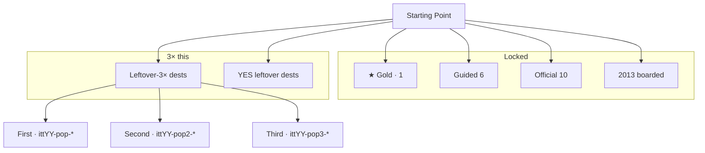
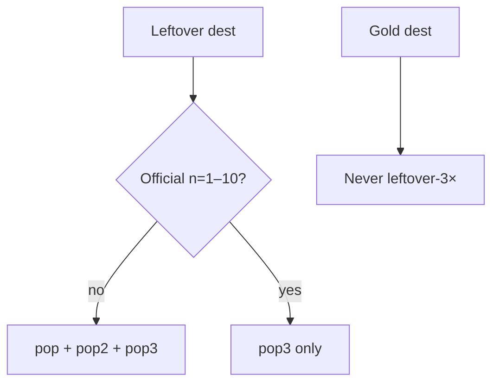

# 2010–2015 leftover-3× ×3 — map

**Date:** 2026-09-07  
**Same steps as 1999–2005 / 2006–2010:** count existing → 3× unique dests → dest-true machines → 3 leftover writers per legal dest → YES leftover → score until positive → e2e complete (not strip-only).  
**Famous that calendar year only.** No dest-farm. Gold dest never leftover-3×. First/second never official n=1–10. Third may as `pop3`. Leftover never writes the star.  
**2013 stays boarded.** No `years/2013/`.  
**2010 leftover-3× ×3 is already painted.** Do not rebuild. Count it as done.

Deep-research run: `deep-research-3` (session). Disk dests + READ-FIRST + fame lock are the source of truth if the report is late.

---

## Diagrams — check every flow

Gold: 2010 Instagram iOS `itt10-ig-posts` · 2011 Google+ `itt11-gplus` · 2012 Instagram Android `itt12-ig-android` · 2014 WhatsApp Install `itt14-wa-install` · 2015 Periscope `itt15-periscope`.

---

## Count now (before this pass)

| Year | Live | Dest folders | Leftover-3× flow number | Home first/more/third | dest-true `data-itt-lo3x` |
|------|------|-------------:|------------------------:|-----------------------|---------------------------:|
| 2010 | yes | 44 | **27 dests already** (9+9+9) | 9 / 9 / 9 | **27** |
| 2011 | yes | 71 (4 no index) | **3** (JSON first trio) | 0 / 0 / 0 | **0** |
| 2012 | yes | 45 | **3** | 0 / 0 / 0 | **0** |
| 2013 | boarded | 0 | 0 | — | 0 |
| 2014 | lean | 21 | **3** first JSON + **3** more | 0 / 3 / 0 | **0** |
| 2015 | yes | 71 (2 no index) | **3** | 0 / 0 / 0 | **0** |

3× the leftover-3× **flow number** = 27 unique dest doors when dest folders allow. **2014 lean stays 21 dests** — leftover-18 style: use every legal leftover dest on disk. Do not dest-farm.

---

## Locked — do not 3×

| Layer | 2010 | 2011 | 2012 | 2014 | 2015 |
|-------|------|------|------|------|------|
| ★ Gold | instagram `itt10-ig-posts` | googleplus `itt11-gplus` | instagram `itt12-ig-android` | whatsapp `itt14-wa-install` | periscope `itt15-periscope` |
| Guided | 6 | 6 | 6 | 6 | 6 |
| Official dest folders | instagram iphone ipad facebook farmville imgur foursquare twitter youtube playable | googleplus spotify iphone facebook ipad airbnb instagram twitter qwikster playable | instagram pinterest facebook iphone wikipedia medium path flipboard playable | whatsapp heartbleed icebucket iphone material slack twitch playable | periscope googlephotos windows10 applemusic edge apple snapchat discord letsencrypt playable |
| Dest folders | 44 frozen | 71 frozen | 45 frozen | 21 frozen | 71 frozen |

**Skip / anachronism (never leftover-3× first/second):**  
2011 `discord` `zoom` `teams` `notion` `figma` `fn` `tt` `edge` `slack` `snapchat` `whatsapp` `brave` `among` `patreon` · 2012 `vinewait` `tinder` (2013 mass) · 2014 `echoinvite` · 2015 `apple` has no `index.html`.

---

## Painted leftover-3× doors (on-disk dests only)

### 2010 — already done · do not rebuild

First 9: netflix tumblr formspring chrome wave android reddit google groupon  
Second 9: quora pinterest dropbox digg angrybirds wikileaks spotifyeu yahoo hulustream  
Third 9: iphone ipad facebook farmville imgur foursquare twitter youtube kickstarter  
YES leftover: instant flickrbox gmailtab facetime windowsphone

### 2011 — 27 dests

**First 9** `itt11-pop-*` — not official, not G+

| Dest | Why 2011 |
|------|----------|
| icloud | Photo Stream 12 Oct |
| pinterest | still invite-only (10M uniques is 2012) |
| linkedin | 19 May IPO |
| kindlefire | 15 Nov $199 |
| minecraft | 1.0 18 Nov |
| twitch | Justin.tv → Twitch 6 Jun |
| dropbox | leftover sync habit |
| chrome | Chrome leftover · not default desktop |
| gmusic | Google Music 16 Nov |

**Second 9** `itt11-pop2-*`

android4 · lion · netflix · reddit · steam · skype (Microsoft May) · github · lastfm · xbox

**Third 9** `itt11-pop3-*` — official leftover dests + YouTube leftover

spotify · iphone · facebook · ipad · airbnb · instagram · twitter · qwikster · youtube

### 2012 — 27 dests

Leftover-3× **moves off** official Medium / Path / Flipboard / Facebook / Maps / SOPA / Pinterest first/second.

**First 9:** drawsomething · googledrive · snapchat · youtube · uber · buzzfeed · chrome · soundcloud · surface  
**Second 9:** trello · lyft · kindlefire · tumblr · netflix · gmail · amazon · twitter · waze  
**Third 9:** medium · path · flipboard · pinterest · facebook · iphone · wikipedia · reddit · windows8

### 2014 — lean leftover-18 style (no dest-farm)

21 dest folders. Legal leftover dests after gold + official = 12. Official leftover dests get pop3 only.

**First 6:** snapchat · instagram · uber · twitter · musically14 · truecrypt  
**Second 3:** oculus · serial · ello  
**Third 9:** youtube · wikipedia · facebook · heartbleed · icebucket · iphone · material · slack · twitch

### 2015 — 27 dests

Snap Discover is official — leftover-3× first/second stay off `snapchat/`. Vine stays (not Discord first).

**First 9:** instagram · spotify · netflix · meerkat · applemusicsub · win10get · vine · echo · youtube  
**Second 9:** uber · twitch · slack · tinder · reddit · twitter · facebook · gmail · chrome  
**Third 9:** googlephotos · windows10 · applemusic · edge · snapchat · discord · letsencrypt · wikipedia · nyt

---

## YES leftover (famous leftover, not leftover-3× 27, not gold)

| Year | Dests |
|------|-------|
| 2010 | already: instant flickrbox gmailtab facetime windowsphone |
| 2011 | chromebook ubercab silk rdio jobs nintendo roblox wallet maps |
| 2012 | googleplus nexus play yahoo windows-phone drivebox tumblr12 |
| 2014 | none extra (lean 21 — leftover dests already used) |
| 2015 | messenger hbonow secret titleii ytgaming pinterest tumblr github linkedin |

---

## Year beat

| Year | Beat |
|------|------|
| 2010 | 2010 leftover. Instagram iOS is the chip. Android IG is 2012. Win7 + IE8 desktop. |
| 2011 | 2011 leftover. Google+ Circles is the chip. Win7 + IE9. Snap Stories / IG Android are later. |
| 2012 | 2012 leftover. Instagram Android is the chip. Vine / Stories are 2013. Win7 residual. |
| 2014 | 2014 leftover. WhatsApp Install is the chip. Echo is 2015. Win7 + IE9. |
| 2015 | 2015 leftover. Periscope Go LIVE is the chip. Stories-as-2015-default never writes. |

---

## Implement order

1. Paint unique dests on home strips + `popular-3x-sites.json` / `popular-3x3-sites.json` / `start-extra.js` — **not 2010, not 2013**.
2. Dest-true leftover-3× first on each first dest.
3. Three machines per legal dest (official = pop3 only).
4. YES leftover 3 machines.
5. Score until every point is positive.
6. e2e complete walks: `npm run test:e2e:2010-2015-3x`.

---

## Score (must all be +)

| # | Point | Pass when |
|---|-------|-----------|
| 1 | Unique dests 3× | 2011/2012/2015 home 9/9/9 · 2014 6/3/9 · 2010 still 9/9/9 |
| 2 | Gold off leftover-3× | gold dest pages have no `data-itt-lo3x` |
| 3 | Official first/second empty | official dests have no unkeyed leftover-3× first / no pop2 |
| 4 | Dest-true complete | empty/trap never write · keep+2 ticks+field writes leftover JSON · star empty |
| 5 | Dest folders frozen | 44/71/45/0/21/71 |
| 6 | e2e green | leftover-3× + YES + three-machines |

---

## e2e

- `e2e/2010-2015-leftover-3x.spec.js` + matrix  
- `e2e/2010-2015-yes-leftover.spec.js` + matrix  
- `e2e/2010-2015-leftover-3x-three-machines.spec.js`  
- Run: `npm run test:e2e:2010-2015-3x`
