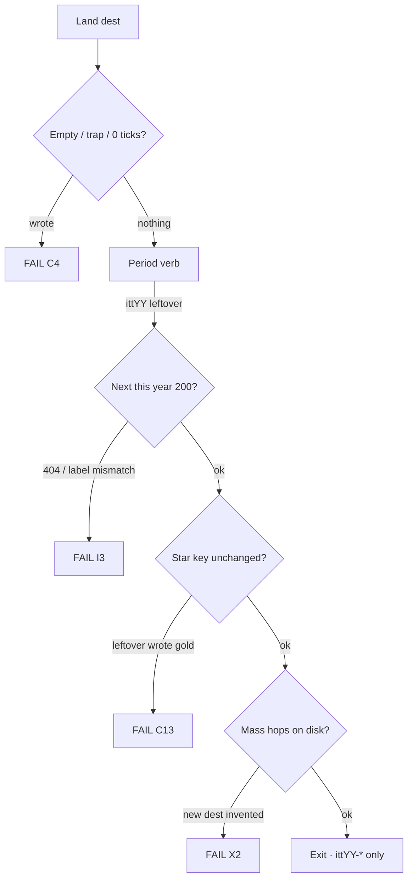

# 2010–2019 — 2× every number · map · goals · phases · flows · dest minutes

**Date:** 2026-09-03  
**Status:** **H1–H5 hops implemented 2026-09-03.** Dest / HTML / official 10 / guided 6 / leftover writers unchanged. G1 (game deepen) not started.  
**This file is the implementer visitor map** (life → museum → proof · dest minutes · phases).  
**Lock (legal vs illegal 2×):** [`2010-2019-2X-EVERY-NUMBER-RESEARCH-GOALS-PHASES-FLOWS-MINUTE-2026-09-03.md`](2010-2019-2X-EVERY-NUMBER-RESEARCH-GOALS-PHASES-FLOWS-MINUTE-2026-09-03.md)  
**Hub now:** 26 years open · **1994–2019**. **Wiped:** 2020–2025.  
**Prefix:** `itt10` … `itt19`

Leftover **2× is already the floor** (writers `<2` = **0**). Official **10**. Guided **6**. Stars **n=1**. Playable **20** (2011 **22**). Lean dest / HTML caps stay. Leftover **4× / “Do leftover” forbidden.**

**5k websites** = research envelope. **Not** 5,000 dest folders. **Not a dest list from a Partial `/workflow` packet.**

| Companion | When you need it |
|-----------|------------------|
| **This file** | Implementer map · dest minutes · flows A–T · phases H1–G1 |
| [`2010-2019-2X-EVERY-NUMBER-RESEARCH-GOALS-PHASES-FLOWS-MINUTE-2026-09-03.md`](2010-2019-2X-EVERY-NUMBER-RESEARCH-GOALS-PHASES-FLOWS-MINUTE-2026-09-03.md) | Legal vs illegal 2× · Pew / comScore hop lock |
| [`2011-2020-2X-LEFTOVER-RESEARCH-2026-08-31.md`](2011-2020-2X-LEFTOVER-RESEARCH-2026-08-31.md) | Leftover 2× = 9+9+9 + leftover-official on disk |
| [`THIN-YEARS-FLOWS-LINKS-RESEARCH-2026-09-03.md`](THIN-YEARS-FLOWS-LINKS-RESEARCH-2026-09-03.md) | Wave 3 hop lock |
| [`2011-2020-EVERY-FLOW-MINUTE-GOALS-PHASES-STEPS-2026-08-31.md`](2011-2020-EVERY-FLOW-MINUTE-GOALS-PHASES-STEPS-2026-08-31.md) | Dest catalogs 2012–2019 |
| Year `YYYY-READ-FIRST.md` | Thesis · star · bans |
| `js/config/flow-trails.js` | Official 10. Do not invent a second n=1 |
| `ui/year/start-data.js` | Guided `<ol>` exactly 6 |
| [`DISK-TRUTH.md`](DISK-TRUTH.md) | Which years exist |

**Trust order:** live `years/` · `scripts/itt_gate.py` `SHIP_YEARS` · DISK-TRUTH · the lock · this map · year READ-FIRST.

**Legal:** Educational. `localStorage` only. No exploit / PoC / live OAuth / live CDN. **Never invent brand pixels.**

Serve: `python3 -m http.server 8080 --bind 127.0.0.1`  
Clear `ittYY-*` for the year you are checking.

---

# 1. Goal (what “done” means)

```
Hub card YYYY available
  → year-true shell
  → Starting Point
        ★ gold chip
        guided ol = 6
        leftover / 3× below the <ol>
  → About dual-cite
  → ★ gold: trap never writes · complete writes ittYY-star
  → Official 10: Next after write · leftover ≠ gold
  → Leftover dest: period verb · 2 writers · Next 200
       + mass hops to dests already on disk (legal 2× links)
  → Year game (existing cabinet)
  → Exit · ittYY-* only
```

**One hero per year.** Star chip, official trail #1, and year-start stop 1 are the **same gold room**.

**2× done** means: every dest on disk has year-true mass hops (label = dest name · href this year · HTTP 200) and leftover still writes exactly **two** leftover keys. Dest count, HTML count, official 10, guided 6, playable file count **unchanged**.

**Not done if:** 7th guided `<li>` · star moved · leftover wrote gold · Accept All wrote · invented June ILS cell · 2020+ dests · new dest folder · leftover 4× · `game-6.html`.

---

# 2. Thesis (copy must match About + home)

| Year | One-line thesis | Star | Shell |
|------|-----------------|------|-------|
| **2010** | Tablet + camera-phone filter arrive; Facebook colonizes the rest of the Web | `itt10-ig` · Instagram iOS | Win7 + IE 8 residual |
| **2011** | Google tries to rebuild Facebook as Circles; Spotify becomes legal in the US; the phone grows a voice | `itt11-gplus` · Google+ Circles | Win7 + IE 9 |
| **2012** | Photos leave the iPhone; Facebook buys the camera and goes public; Wikipedia goes black for a day | `itt12-ig-android` · IG Android | Win7 + IE 9 residual (Win8 is a room) |
| **2013** | The loop is six seconds and the phone goes flat | `itt13-vine-posts` · Vine 6s | Win7 + IE 9 |
| **2014** | Messaging becomes the mass internet — WhatsApp is the $19 billion install; TLS bleeds; a summer video loop fills a charity | `itt14-wa-install` · WhatsApp Install | Win7 + IE 9 residual |
| **2015** | Live video is a button; photos back up themselves; Windows is free for a year | `itt15-periscope` · Periscope Go LIVE | Win7 residual + Chrome habit |
| **2016** | The 24-hour Story jumps to the mass feed; sidewalks fill with phones; Like grows five faces | `itt16-ig-stories` · IG Stories | Win10 rising + Chrome habit |
| **2017** | The face becomes the password; a free storm eats Saturday; tweets get twice as long | `itt17-faceid` · Face ID / iPhone X | Win10 mass + Chrome habit |
| **2018** | The banner is the door; a quiz becomes a hearing; the loops change their name | `itt18-gdpr` · GDPR Manage | Win10 mass + Chrome habit |
| **2019** | Who’s watching is the door; a 7-day trial is the trap; Continue is the save | `itt19-disneyplus` · Disney+ Continue | Win10 mass + Chrome habit |

Scale print: ILS June cells through **2018** only. 2019 About says **table ends 2018** at **1,630,322,579**. ITU 2019 **4.1B / 53.6%**.

---

# 3. Hard bans

| Ban | Why |
|-----|-----|
| New dest folder | Lean cap · 9+9+9 freeze · I1 |
| New HTML on 2014/2016/2017/2019 | Already at or over paper cap |
| Official 20 / guided 12 / 2 stars | n=1 freeze |
| Third leftover writer / “Do leftover” | leftover 4× ban |
| `game-6.html` / `extra-j.html` | Playable cabinet cap |
| 2014 `google.com` dest | I8 · Chrome habit is 2015+ |
| 2016 Allo / Note 7 / TikTok brand | READ-FIRST |
| TikTok dest before 2 Aug 2018 | Name lock |
| Invented June 2019 ILS cell | Table ends 2018 |
| 2011 Figma / Notion / Teams / Discord / Zoom on 3× | Honesty unlist |
| 2020–2025 dest rebuild | Wiped |
| Invented brand pixels / exploit PoC | Always |
| Waves H1–G1 in one dump | X12 · one named wave |

---

# 4. Align

```
hero 2010 = years/2010/sites/instagram/index.html
         = data-ott-one-thing="2010"
         = flowTrails["2010"][0]
key      = itt10-ig

hero 2011 = years/2011/sites/googleplus/index.html
         = data-ott-one-thing="2011"
         = flowTrails["2011"][0]
key      = itt11-gplus

hero 2012 = years/2012/sites/instagram/android.html
         = data-ott-one-thing="2012"
         = flowTrails["2012"][0]
key      = itt12-ig-android

hero 2013 = years/2013/sites/vine/record.html
         = data-ott-one-thing="2013"
         = flowTrails["2013"][0]
key      = itt13-vine-posts

hero 2014 = years/2014/sites/whatsapp/index.html
         = data-ott-one-thing="2014"
         = flowTrails["2014"][0]
key      = itt14-wa-install

hero 2015 = years/2015/sites/periscope/index.html
         = data-ott-one-thing="2015"
         = flowTrails["2015"][0]
key      = itt15-periscope

hero 2016 = years/2016/sites/instagram/stories.html
         = data-ott-one-thing="2016"
         = flowTrails["2016"][0]
key      = itt16-ig-stories

hero 2017 = years/2017/sites/iphone/x.html
         = data-ott-one-thing="2017"
         = flowTrails["2017"][0]
key      = itt17-faceid

hero 2018 = years/2018/sites/gdpr/index.html
         = data-ott-one-thing="2018"
         = flowTrails["2018"][0]
key      = itt18-gdpr

hero 2019 = years/2019/sites/disneyplus/home.html
         = data-ott-one-thing="2019"
         = flowTrails["2019"][0]
key      = itt19-disneyplus

```

Guided 6 live in `ui/year/start-data.js`. Official 10 live in `js/config/flow-trails.js`. Do **not** invent a second list.

---

# 5. Shared leftover minute (every dest, every year)

1. Land. `[failed-final]` or harvested still. `data-itt-year="YYYY"`.  
2. Empty / 0 ticks / 1 hop / skip wait → **nothing**.  
3. Trap (year table below) → **nothing**. Never write the star.  
4. Period verb → `ittYY-<suffix>` leftover only. **Not** the star suffix.  
5. Second writer (`-d2` / about / more) → **different** leftover key.  
6. Next href this year · HTTP 200 · label = dest name.  
7. Legal 2× links: add missing **mass hops** from that year’s list. Do not add a third writer.  
8. Exit. Only `ittYY-*`.



---

# 6. Visitor flows (life → museum → proof)

Shared envelope for every live year. Year-true rooms in the dest minutes.

### A — Open the year

**Life:** You still boot the year’s mass PC.  
**Museum:** Hub card available → `years/YYYY/` → year-true shell → `pages/home.html`.  
**Proof:** `itt-last-year=YYYY`. Gold chip. Guided 6. `SHIP_YEARS` includes YYYY.

### B — Read the thesis

**Life:** The year’s one sentence (table in §2).  
**Museum:** `pages/about.html` · dual-cite scale · bans.  
**Proof:** 2019 prints “table ends 2018.” No invented June blend.

### C — ★ Gold

**Life:** The year-native verb (filter / Circles / Android share / hold 6s / Install / Go LIVE / 24h Story / look / Manage / Continue).  
**Museum:** gold path in §4. Incomplete never writes.  
**Proof:** star key only. Next = official n=2.

### D–L — Official 10 leftover

Walk `flow-trails.js` n=2…9. Each: trap never writes · complete writes that `whenKey` · leftover ≠ gold · Next 200.

### M — Mass leftover 2× (legal links)

**Life:** After the star you still open the sites everyone actually used (Pew / comScore).  
**Museum:** leftover dests already on disk · period verb · 2 writers · mass hops from §8.  
**Proof:** no new folder · writers still 2 · gold unchanged.

### N — Year game

**Life:** A Saturday game that is not the chip.  
**Museum:** `sites/playable/game.html` · existing `game-2..5`.  
**Proof:** game key only. No `game-6`.

### O — Exit

**Museum:** Year menu → hub.  
**Proof:** only `ittYY-*`.

Year-true C–L (official names):

- **2010:** n=1 Instagram · n=2 iPhone 4 · n=3 iPad · n=4 Open Graph · n=5 FarmVille peak · n=6 Imgur · n=7 Foursquare · n=8 Twitter · n=9 YouTube · n=10 Sling Nest
- **2011:** n=1 Google+ · n=2 Spotify US · n=3 Siri · n=4 Timeline · n=5 iPad 2 leftover · n=6 Airbnb leftover · n=7 IG iOS leftover · n=8 Twitter leftover · n=9 Qwikster leftover · n=10 Letter Swap
- **2012:** n=1 Instagram Android · n=2 Pinterest · n=3 Facebook IPO · n=4 Facebook 1B · n=5 Maps flop · n=6 SOPA · n=7 Medium · n=8 Path · n=9 Flipboard · n=10 Guess Doodle
- **2013:** n=1 Vine 6s · n=2 IG Video · n=3 Stories · n=4 iOS 7 · n=5 Touch ID · n=6 Snowden · n=7 Telegram · n=8 Yahoo×Tumblr · n=9 Win8.1 · n=10 Loop Six
- **2014:** n=1 WhatsApp · n=2 Chat · n=3 Heartbleed · n=4 Ice Bucket · n=5 iPhone 6 · n=6 Apple Pay · n=7 Material · n=8 Slack · n=9 Twitch · n=10 Tile Fold
- **2015:** n=1 Periscope Go LIVE · n=2 Google Photos · n=3 Windows 10 · n=4 Apple Music · n=5 Edge Spartan · n=6 Watch leftover · n=7 Snap Discover · n=8 Discord · n=9 Let's Encrypt · n=10 Blob Rush
- **2016:** n=1 Instagram Stories · n=2 Pokémon GO · n=3 Reactions · n=4 WhatsApp E2E · n=5 iPhone 7 · n=6 Vine goodbye · n=7 Spectacles · n=8 musical.ly · n=9 Win10 upgrade ends · n=10 Gym Rush
- **2017:** n=1 Face ID / iPhone X · n=2 Fortnite BR · n=3 Twitter 280 · n=4 Teams GA · n=5 Vine gone · n=6 Nintendo Switch · n=7 WannaCry · n=8 musical.ly · n=9 Equifax freeze · n=10 Storm Circle
- **2018:** n=1 GDPR Manage · n=2 TikTok For You · n=3 Hearing · n=4 IGTV · n=5 Chrome 68 · n=6 HomePod · n=7 Spectre · n=8 Fortnite on Switch · n=9 GitHub $7.5B · n=10 Consent Dash
- **2019:** n=1 Disney+ Who’s watching · n=2 TikTok For You · n=3 Apple Arcade · n=4 Apple TV+ · n=5 Stadia · n=6 iPhone 11 · n=7 AirPods Pro · n=8 Chrome habit · n=9 Windows 10 residual · n=10 Continue Row

---

# 7. What 2× means on this map

| Kind | Now | 2× on this map |
|------|-----|----------------|
| Dests / HTML / official / guided / stars | frozen | **Do not 2×** |
| Leftover writers | ≥2 / dest | **Already 2×.** Do not add a third |
| Links | thin dests 29–35 hrefs | Add mass hops on dests **on disk** |
| Flows | leftover already 2 paths | More 3-step leftover *walks*, not 20 official |
| Games | 5 cabinets + extras | Deepen existing files |
| 2020–2025 | wiped | **Out of scope** |

Href honesty: 2011 already has 5,249 hrefs (3,395 in 3× dumps). Do **not** clone the dest list onto every 2011 page. 2014 is the first hop year (2,451 hrefs · 198 leftover saves).

---

# 8. Dest catalogs + dest minutes

Every folder under `years/YYYY/sites/`. Role from live tree + `flow-trails.js`. **HTML / dest counts do not grow.**

**Minute columns:** Trap never writes. Complete writes leftover key (never star). Next = first mass dest ≠ self. **2× hops** = mass dests on disk to add to that dest’s 2×-link / 3× strip if missing. Honesty-unlisted: hops stay off Starting Point / 3× / home.

## 2010 — Instagram iOS · `itt10-ig` · 44 dests · prefix `itt10`

**Shell:** Win7 + IE 8 residual.  
**Gold path:** `sites/instagram/index.html`.  
**Game:** Sling Nest · `itt10-game-slingnest`.  
**Mass hops (legal 2×):** `facebook` · `youtube` · `twitter` · `tumblr` · `reddit` · `netflix` · `yahoo` · `google` · `pinterest` · `farmville`.  
**Never hop / never add:** IG Android, Stories, Reels, Spotify US dest-as-2010.  
**Trap (all leftover):** IG Android / Stories / Reels / live upload.  
**Complete verb class:** Filter leftover / Like leftover / Queue leftover / Tweet leftover.

| # | Slug | Role | Band | HTML | Hrefs | Leftover key |
|--:|------|------|------|-----:|------:|--------------|
| 1 | `android` | leftover | leftover | 1 | 33 | `android` |
| 2 | `angrybirds` | leftover | leftover | 1 | 32 | `angrybirds` |
| 3 | `ask` | leftover | leftover | 1 | 34 | `ask` |
| 4 | `browserchoice` | leftover | leftover | 1 | 33 | `browserchoice` |
| 5 | `chrome` | leftover | leftover | 2 | 65 | `habit` |
| 6 | `digg` | leftover | leftover | 1 | 33 | `digg` |
| 7 | `dropbox` | leftover | leftover | 1 | 32 | `dropbox` |
| 8 | `facebook` | official | official | 4 | 149 | `fb-og` |
| 9 | `facetime` | leftover | leftover | 1 | 32 | `facetime` |
| 10 | `farmnote` | leftover | leftover | 1 | 32 | `farmnote` |
| 11 | `farmville` | official | official | 2 | 73 | `farm` |
| 12 | `flickrbox` | leftover | leftover | 1 | 32 | `flickrbox` |
| 13 | `formspring` | leftover | leftover | 1 | 30 | `formspring` |
| 14 | `foursqnote` | leftover | leftover | 1 | 32 | `foursqnote` |
| 15 | `foursquare` | official | official | 2 | 72 | `4sq` |
| 16 | `gmailtab` | leftover | leftover | 1 | 32 | `gmailtab` |
| 17 | `google` | leftover | leftover | 1 | 34 | `google` |
| 18 | `groupon` | leftover | leftover | 1 | 31 | `groupon` |
| 19 | `groupondeal` | leftover | leftover | 1 | 31 | `groupondeal` |
| 20 | `hulustream` | leftover | leftover | 1 | 32 | `hulustream` |
| 21 | `ie9` | leftover | leftover | 1 | 32 | `ie9` |
| 22 | `imgur` | official | official | 1 | 37 | `imgur` |
| 23 | `instagram` | gold | star | 2 | 74 | `instagram` |
| 24 | `instagramios` | leftover | leftover | 1 | 31 | `instagramios` |
| 25 | `instant` | leftover | leftover | 1 | 33 | `instant` |
| 26 | `ipad` | official | official | 4 | 147 | `ipad` |
| 27 | `iphone` | official | official | 2 | 71 | `iphone4` |
| 28 | `kickstarter` | leftover | leftover | 1 | 32 | `kickstarter` |
| 29 | `netflix` | leftover | leftover | 1 | 30 | `netflix` |
| 30 | `pinbeta` | leftover | leftover | 1 | 32 | `pinbeta` |
| 31 | `pinterest` | leftover | leftover | 2 | 64 | `pinterest` |
| 32 | `playable` | playable | game | 20 | 841 | `playable-extra-b` |
| 33 | `quora` | leftover | leftover | 1 | 31 | `quora` |
| 34 | `quorawait` | leftover | leftover | 1 | 31 | `quorawait` |
| 35 | `reddit` | leftover | leftover | 2 | 67 | `reddit` |
| 36 | `spotifyeu` | leftover | leftover | 1 | 32 | `spotifyeu` |
| 37 | `tumblr` | leftover | leftover | 1 | 30 | `tumblr` |
| 38 | `twitter` | official | official | 1 | 37 | `tweets` |
| 39 | `uber` | leftover | leftover | 1 | 33 | `uber` |
| 40 | `wave` | leftover | leftover | 1 | 34 | `wave` |
| 41 | `wikileaks` | leftover | leftover | 1 | 32 | `wikileaks` |
| 42 | `windowsphone` | leftover | leftover | 1 | 32 | `windowsphone` |
| 43 | `yahoo` | leftover | leftover | 1 | 32 | `yahoo` |
| 44 | `youtube` | official | official | 2 | 71 | `yt` |

### Dest minutes

| # | Dest | Path | Key | Kind | Trap | Complete | Next | 2× hops (on disk) |
|--:|------|------|-----|------|------|----------|------|-------------------|
| 1 | `android` | `sites/android/index.html` | `itt10-android` | leftover 2× (already 2 writers) | IG Android / Stories / Reels / live upload | period verb · second path `-d2` | `facebook` | facebook · youtube · twitter · tumblr · reddit |
| 2 | `angrybirds` | `sites/angrybirds/index.html` | `itt10-angrybirds` | leftover 2× (already 2 writers) | IG Android / Stories / Reels / live upload | period verb · second path `-d2` | `facebook` | facebook · youtube · twitter · tumblr · reddit |
| 3 | `ask` | `sites/ask/index.html` | `itt10-ask` | leftover 2× (already 2 writers) | IG Android / Stories / Reels / live upload | period verb · second path `-d2` | `facebook` | facebook · youtube · twitter · tumblr · reddit |
| 4 | `browserchoice` | `sites/browserchoice/index.html` | `itt10-browserchoice` | leftover 2× (already 2 writers) | IG Android / Stories / Reels / live upload | period verb · second path `-d2` | `facebook` | facebook · youtube · twitter · tumblr · reddit |
| 5 | `chrome` | `sites/chrome/index.html` | `itt10-habit` | leftover 2× (already 2 writers) | IG Android / Stories / Reels / live upload | period verb · second path `-d2` | `facebook` | facebook · youtube · twitter · tumblr · reddit |
| 6 | `digg` | `sites/digg/index.html` | `itt10-digg` | leftover 2× (already 2 writers) | IG Android / Stories / Reels / live upload | period verb · second path `-d2` | `facebook` | facebook · youtube · twitter · tumblr · reddit |
| 7 | `dropbox` | `sites/dropbox/index.html` | `itt10-dropbox` | leftover 2× (already 2 writers) | IG Android / Stories / Reels / live upload | period verb · second path `-d2` | `facebook` | facebook · youtube · twitter · tumblr · reddit |
| 8 | `facebook` | `sites/facebook/index.html` | `itt10-fb-og` | official leftover | IG Android / Stories / Reels / live upload | trail verb · leftover ≠ gold | `youtube` | youtube · twitter · tumblr · reddit · netflix |
| 9 | `facetime` | `sites/facetime/index.html` | `itt10-facetime` | leftover 2× (already 2 writers) | IG Android / Stories / Reels / live upload | period verb · second path `-d2` | `facebook` | facebook · youtube · twitter · tumblr · reddit |
| 10 | `farmnote` | `sites/farmnote/index.html` | `itt10-farmnote` | leftover 2× (already 2 writers) | IG Android / Stories / Reels / live upload | period verb · second path `-d2` | `facebook` | facebook · youtube · twitter · tumblr · reddit |
| 11 | `farmville` | `sites/farmville/index.html` | `itt10-farm` | official leftover | IG Android / Stories / Reels / live upload | trail verb · leftover ≠ gold | `facebook` | facebook · youtube · twitter · tumblr · reddit |
| 12 | `flickrbox` | `sites/flickrbox/index.html` | `itt10-flickrbox` | leftover 2× (already 2 writers) | IG Android / Stories / Reels / live upload | period verb · second path `-d2` | `facebook` | facebook · youtube · twitter · tumblr · reddit |
| 13 | `formspring` | `sites/formspring/index.html` | `itt10-formspring` | leftover 2× (already 2 writers) | IG Android / Stories / Reels / live upload | period verb · second path `-d2` | `facebook` | facebook · youtube · twitter · tumblr · reddit |
| 14 | `foursqnote` | `sites/foursqnote/index.html` | `itt10-foursqnote` | leftover 2× (already 2 writers) | IG Android / Stories / Reels / live upload | period verb · second path `-d2` | `facebook` | facebook · youtube · twitter · tumblr · reddit |
| 15 | `foursquare` | `sites/foursquare/index.html` | `itt10-4sq` | official leftover | IG Android / Stories / Reels / live upload | trail verb · leftover ≠ gold | `facebook` | facebook · youtube · twitter · tumblr · reddit |
| 16 | `gmailtab` | `sites/gmailtab/index.html` | `itt10-gmailtab` | leftover 2× (already 2 writers) | IG Android / Stories / Reels / live upload | period verb · second path `-d2` | `facebook` | facebook · youtube · twitter · tumblr · reddit |
| 17 | `google` | `sites/google/index.html` | `itt10-google` | leftover 2× (already 2 writers) | IG Android / Stories / Reels / live upload | period verb · second path `-d2` | `facebook` | facebook · youtube · twitter · tumblr · reddit |
| 18 | `groupon` | `sites/groupon/index.html` | `itt10-groupon` | leftover 2× (already 2 writers) | IG Android / Stories / Reels / live upload | period verb · second path `-d2` | `facebook` | facebook · youtube · twitter · tumblr · reddit |
| 19 | `groupondeal` | `sites/groupondeal/index.html` | `itt10-groupondeal` | leftover 2× (already 2 writers) | IG Android / Stories / Reels / live upload | period verb · second path `-d2` | `facebook` | facebook · youtube · twitter · tumblr · reddit |
| 20 | `hulustream` | `sites/hulustream/index.html` | `itt10-hulustream` | leftover 2× (already 2 writers) | IG Android / Stories / Reels / live upload | period verb · second path `-d2` | `facebook` | facebook · youtube · twitter · tumblr · reddit |
| 21 | `ie9` | `sites/ie9/index.html` | `itt10-ie9` | leftover 2× (already 2 writers) | IG Android / Stories / Reels / live upload | period verb · second path `-d2` | `facebook` | facebook · youtube · twitter · tumblr · reddit |
| 22 | `imgur` | `sites/imgur/index.html` | `itt10-imgur` | official leftover | IG Android / Stories / Reels / live upload | trail verb · leftover ≠ gold | `facebook` | facebook · youtube · twitter · tumblr · reddit |
| 23 | `instagram` | `sites/instagram/index.html` | `itt10-ig` | gold · never a 2× leftover key | IG Android / Stories / Reels / live upload | year-true gold verb | `iphone` | facebook · youtube · twitter · tumblr · reddit |
| 24 | `instagramios` | `sites/instagramios/index.html` | `itt10-instagramios` | leftover 2× (already 2 writers) | IG Android / Stories / Reels / live upload | period verb · second path `-d2` | `facebook` | facebook · youtube · twitter · tumblr · reddit |
| 25 | `instant` | `sites/instant/index.html` | `itt10-instant` | leftover 2× (already 2 writers) | IG Android / Stories / Reels / live upload | period verb · second path `-d2` | `facebook` | facebook · youtube · twitter · tumblr · reddit |
| 26 | `ipad` | `sites/ipad/index.html` | `itt10-ipad` | official leftover | IG Android / Stories / Reels / live upload | trail verb · leftover ≠ gold | `facebook` | facebook · youtube · twitter · tumblr · reddit |
| 27 | `iphone` | `sites/iphone/index.html` | `itt10-iphone4` | official leftover | IG Android / Stories / Reels / live upload | trail verb · leftover ≠ gold | `facebook` | facebook · youtube · twitter · tumblr · reddit |
| 28 | `kickstarter` | `sites/kickstarter/index.html` | `itt10-kickstarter` | leftover 2× (already 2 writers) | IG Android / Stories / Reels / live upload | period verb · second path `-d2` | `facebook` | facebook · youtube · twitter · tumblr · reddit |
| 29 | `netflix` | `sites/netflix/index.html` | `itt10-netflix` | leftover 2× (already 2 writers) | IG Android / Stories / Reels / live upload | period verb · second path `-d2` | `facebook` | facebook · youtube · twitter · tumblr · reddit |
| 30 | `pinbeta` | `sites/pinbeta/index.html` | `itt10-pinbeta` | leftover 2× (already 2 writers) | IG Android / Stories / Reels / live upload | period verb · second path `-d2` | `facebook` | facebook · youtube · twitter · tumblr · reddit |
| 31 | `pinterest` | `sites/pinterest/index.html` | `itt10-pinterest` | leftover 2× (already 2 writers) | IG Android / Stories / Reels / live upload | period verb · second path `-d2` | `facebook` | facebook · youtube · twitter · tumblr · reddit |
| 32 | `playable` | `sites/playable/game.html` | `itt10-game-slingnest` | game | IG Android / Stories / Reels / live upload | Sling Nest finish | `instagram` | facebook · youtube · twitter · tumblr · reddit |
| 33 | `quora` | `sites/quora/index.html` | `itt10-quora` | leftover 2× (already 2 writers) | IG Android / Stories / Reels / live upload | period verb · second path `-d2` | `facebook` | facebook · youtube · twitter · tumblr · reddit |
| 34 | `quorawait` | `sites/quorawait/index.html` | `itt10-quorawait` | leftover 2× (already 2 writers) | IG Android / Stories / Reels / live upload | period verb · second path `-d2` | `facebook` | facebook · youtube · twitter · tumblr · reddit |
| 35 | `reddit` | `sites/reddit/index.html` | `itt10-reddit` | leftover 2× (already 2 writers) | IG Android / Stories / Reels / live upload | period verb · second path `-d2` | `facebook` | facebook · youtube · twitter · tumblr · netflix |
| 36 | `spotifyeu` | `sites/spotifyeu/index.html` | `itt10-spotifyeu` | leftover 2× (already 2 writers) | IG Android / Stories / Reels / live upload | period verb · second path `-d2` | `facebook` | facebook · youtube · twitter · tumblr · reddit |
| 37 | `tumblr` | `sites/tumblr/index.html` | `itt10-tumblr` | leftover 2× (already 2 writers) | IG Android / Stories / Reels / live upload | period verb · second path `-d2` | `facebook` | facebook · youtube · twitter · reddit · netflix |
| 38 | `twitter` | `sites/twitter/index.html` | `itt10-tweets` | official leftover | IG Android / Stories / Reels / live upload | trail verb · leftover ≠ gold | `facebook` | facebook · youtube · tumblr · reddit · netflix |
| 39 | `uber` | `sites/uber/index.html` | `itt10-uber` | leftover 2× (already 2 writers) | IG Android / Stories / Reels / live upload | period verb · second path `-d2` | `facebook` | facebook · youtube · twitter · tumblr · reddit |
| 40 | `wave` | `sites/wave/index.html` | `itt10-wave` | leftover 2× (already 2 writers) | IG Android / Stories / Reels / live upload | period verb · second path `-d2` | `facebook` | facebook · youtube · twitter · tumblr · reddit |
| 41 | `wikileaks` | `sites/wikileaks/index.html` | `itt10-wikileaks` | leftover 2× (already 2 writers) | IG Android / Stories / Reels / live upload | period verb · second path `-d2` | `facebook` | facebook · youtube · twitter · tumblr · reddit |
| 42 | `windowsphone` | `sites/windowsphone/index.html` | `itt10-windowsphone` | leftover 2× (already 2 writers) | IG Android / Stories / Reels / live upload | period verb · second path `-d2` | `facebook` | facebook · youtube · twitter · tumblr · reddit |
| 43 | `yahoo` | `sites/yahoo/index.html` | `itt10-yahoo` | leftover 2× (already 2 writers) | IG Android / Stories / Reels / live upload | period verb · second path `-d2` | `facebook` | facebook · youtube · twitter · tumblr · reddit |
| 44 | `youtube` | `sites/youtube/index.html` | `itt10-yt` | official leftover | IG Android / Stories / Reels / live upload | trail verb · leftover ≠ gold | `facebook` | facebook · twitter · tumblr · reddit · netflix |

**Fail if:** dests ≠ 44 · star moves · leftover writes `itt10-ig` · new folder · leftover 4×.

## 2011 — Google+ Circles · `itt11-gplus` · 71 dests · prefix `itt11`

**Shell:** Win7 + IE 9.  
**Gold path:** `sites/googleplus/index.html`.  
**Game:** Letter Swap · `itt11-game-letterswap`.  
**Mass hops (legal 2×):** `facebook` · `youtube` · `twitter` · `gmail` · `google` · `spotify` · `instagram` · `reddit` · `netflix`.  
**Never hop / never add:** figma, notion, teams, discord, zoom, brave, edge, slack, among, fn.  
**Trap (all leftover):** G+ replaced Facebook / IG Android / neighbor year.  
**Complete verb class:** Circle leftover / Timeline leftover / Invite leftover / Queue leftover.

| # | Slug | Role | Band | HTML | Hrefs | Leftover key |
|--:|------|------|------|-----:|------:|--------------|
| 1 | `airbnb` | official | official | 3 | 105 | `airbnb` |
| 2 | `among` | honesty-unlisted | unlisted | 1 | 34 | `c29` |
| 3 | `amz` | leftover | leftover | 1 | 33 | `c3` |
| 4 | `android4` | leftover | leftover | 2 | 66 | `and4` |
| 5 | `brave` | honesty-unlisted | unlisted | 1 | 34 | `c38` |
| 6 | `chrome` | leftover | leftover | 2 | 68 | `chrome` |
| 7 | `chromebook` | leftover | leftover | 2 | 67 | `cbook` |
| 8 | `cont` | leftover | leftover | 1 | 33 | `c39` |
| 9 | `discord` | honesty-unlisted | unlisted | 1 | 35 | `c15` |
| 10 | `dropbox` | leftover | leftover | 2 | 66 | `dropbox` |
| 11 | `edge` | honesty-unlisted | unlisted | 1 | 35 | `c35` |
| 12 | `epic` | leftover | leftover | 1 | 32 | `c24` |
| 13 | `facebook` | official | official | 4 | 139 | `timeline-2` |
| 14 | `ff` | leftover | leftover | 1 | 35 | `c37` |
| 15 | `figma` | honesty-unlisted | unlisted | 1 | 32 | `c19` |
| 16 | `fn` | honesty-unlisted | unlisted | 1 | 35 | `c28` |
| 17 | `github` | leftover | leftover | 1 | 35 | `c20` |
| 18 | `gmail` | leftover | leftover | 1 | 34 | `c11` |
| 19 | `gmusic` | leftover | leftover | 2 | 73 | `gmusic` |
| 20 | `google` | leftover | leftover | 1 | 35 | `c10` |
| 21 | `googleplus` | gold | star | 4 | 142 | `googleplus` |
| 22 | `hotmail` | leftover | leftover | 2 | 66 | `hotmail` |
| 23 | `icloud` | leftover | leftover | 3 | 97 | `icloud` |
| 24 | `ig` | leftover | leftover | 1 | 34 | `c7` |
| 25 | `instagram` | official | official | 3 | 103 | `instagram` |
| 26 | `ipad` | official | official | 3 | 101 | `ipad` |
| 27 | `iphone` | official | official | 3 | 105 | `iphone` |
| 28 | `jobs` | leftover | leftover | 2 | 71 | `jobs` |
| 29 | `kindle` | leftover | leftover | 1 | 33 | `c33` |
| 30 | `kindlefire` | leftover | leftover | 2 | 69 | `kfire` |
| 31 | `lastfm` | leftover | leftover | 2 | 67 | `lastfm` |
| 32 | `li` | leftover | leftover | 1 | 32 | `c21` |
| 33 | `linkedin` | leftover | leftover | 2 | 69 | `li` |
| 34 | `lion` | leftover | leftover | 2 | 69 | `lion` |
| 35 | `maps` | leftover | leftover | 1 | 33 | `c12` |
| 36 | `minecraft` | leftover | leftover | 2 | 71 | `mc` |
| 37 | `netflix` | leftover | leftover | 2 | 67 | `nfx` |
| 38 | `nfx` | leftover | leftover | 1 | 36 | `c5` |
| 39 | `nintendo` | leftover | leftover | 1 | 33 | `c27` |
| 40 | `notion` | honesty-unlisted | unlisted | 1 | 33 | `c18` |
| 41 | `patreon` | leftover | leftover | 1 | 34 | `c32` |
| 42 | `pinterest` | leftover | leftover | 2 | 69 | `pin` |
| 43 | `playable` | playable | game | 22 | 854 | `playable-extra-b` |
| 44 | `pp` | leftover | leftover | 1 | 31 | `c13` |
| 45 | `ps` | leftover | leftover | 1 | 34 | `c25` |
| 46 | `qwikster` | official | official | 3 | 105 | `qwikster` |
| 47 | `rdio` | leftover | leftover | 2 | 71 | `rdio` |
| 48 | `reddit` | leftover | leftover | 3 | 103 | `reddit` |
| 49 | `roblox` | leftover | leftover | 1 | 33 | `c30` |
| 50 | `safari` | leftover | leftover | 1 | 34 | `c36` |
| 51 | `silk` | leftover | leftover | 2 | 67 | `silk` |
| 52 | `siri` | leftover | leftover | 1 | 34 | `siri-2p` |
| 53 | `skype` | leftover | leftover | 2 | 65 | `skype` |
| 54 | `slack` | honesty-unlisted | unlisted | 1 | 35 | `c14` |
| 55 | `snapchat` | leftover | leftover | 3 | 99 | `snap` |
| 56 | `spotify` | official | official | 4 | 149 | `spotify` |
| 57 | `ss` | leftover | leftover | 1 | 33 | `c31` |
| 58 | `steam` | leftover | leftover | 3 | 101 | `steam` |
| 59 | `teams` | honesty-unlisted | unlisted | 1 | 35 | `c17` |
| 60 | `tt` | leftover | leftover | 1 | 31 | `c9` |
| 61 | `twitch` | leftover | leftover | 3 | 104 | `twitch` |
| 62 | `twitter` | official | official | 4 | 143 | `twitter` |
| 63 | `ubercab` | leftover | leftover | 2 | 66 | `uber` |
| 64 | `vita` | leftover | leftover | 2 | 68 | `vita` |
| 65 | `wallet` | leftover | leftover | 2 | 65 | `wallet` |
| 66 | `whatsapp` | leftover | leftover | 3 | 108 | `wa` |
| 67 | `wiki` | leftover | leftover | 1 | 34 | `c2` |
| 68 | `wp75` | leftover | leftover | 2 | 68 | `wp75` |
| 69 | `xbox` | leftover | leftover | 1 | 33 | `c26` |
| 70 | `youtube` | leftover | leftover | 3 | 105 | `yt` |
| 71 | `zoom` | honesty-unlisted | unlisted | 1 | 31 | `c16` |

### Dest minutes

| # | Dest | Path | Key | Kind | Trap | Complete | Next | 2× hops (on disk) |
|--:|------|------|-----|------|------|----------|------|-------------------|
| 1 | `airbnb` | `sites/airbnb/index.html` | `itt11-airbnb` | official leftover | G+ replaced Facebook / IG Android / neighbor year | trail verb · leftover ≠ gold | `facebook` | facebook · youtube · twitter · gmail · google |
| 2 | `among` | `sites/among/index.html` | `itt11-c29` | honesty · file may stay | G+ replaced Facebook / IG Android / neighbor year | Not-2011 leftover (never offered on home / 3×) | `facebook` | — (do not list on 3× / home) |
| 3 | `amz` | `sites/amz/index.html` | `itt11-c3` | leftover 2× (already 2 writers) | G+ replaced Facebook / IG Android / neighbor year | period verb · second path `-d2` | `facebook` | facebook · youtube · twitter · gmail · google |
| 4 | `android4` | `sites/android4/index.html` | `itt11-and4` | leftover 2× (already 2 writers) | G+ replaced Facebook / IG Android / neighbor year | period verb · second path `-d2` | `facebook` | facebook · youtube · twitter · gmail · google |
| 5 | `brave` | `sites/brave/index.html` | `itt11-c38` | honesty · file may stay | G+ replaced Facebook / IG Android / neighbor year | Not-2011 leftover (never offered on home / 3×) | `facebook` | — (do not list on 3× / home) |
| 6 | `chrome` | `sites/chrome/index.html` | `itt11-chrome` | leftover 2× (already 2 writers) | G+ replaced Facebook / IG Android / neighbor year | period verb · second path `-d2` | `facebook` | facebook · youtube · twitter · gmail · google |
| 7 | `chromebook` | `sites/chromebook/index.html` | `itt11-cbook` | leftover 2× (already 2 writers) | G+ replaced Facebook / IG Android / neighbor year | period verb · second path `-d2` | `facebook` | facebook · youtube · twitter · gmail · google |
| 8 | `cont` | `sites/cont/index.html` | `itt11-c39` | leftover 2× (already 2 writers) | G+ replaced Facebook / IG Android / neighbor year | period verb · second path `-d2` | `facebook` | facebook · youtube · twitter · gmail · google |
| 9 | `discord` | `sites/discord/index.html` | `itt11-c15` | honesty · file may stay | G+ replaced Facebook / IG Android / neighbor year | Not-2011 leftover (never offered on home / 3×) | `facebook` | — (do not list on 3× / home) |
| 10 | `dropbox` | `sites/dropbox/index.html` | `itt11-dropbox` | leftover 2× (already 2 writers) | G+ replaced Facebook / IG Android / neighbor year | period verb · second path `-d2` | `facebook` | facebook · youtube · twitter · gmail · google |
| 11 | `edge` | `sites/edge/index.html` | `itt11-c35` | honesty · file may stay | G+ replaced Facebook / IG Android / neighbor year | Not-2011 leftover (never offered on home / 3×) | `facebook` | — (do not list on 3× / home) |
| 12 | `epic` | `sites/epic/index.html` | `itt11-c24` | leftover 2× (already 2 writers) | G+ replaced Facebook / IG Android / neighbor year | period verb · second path `-d2` | `facebook` | facebook · youtube · twitter · gmail · google |
| 13 | `facebook` | `sites/facebook/index.html` | `itt11-timeline` | official leftover | G+ replaced Facebook / IG Android / neighbor year | trail verb · leftover ≠ gold | `youtube` | youtube · twitter · gmail · google · spotify |
| 14 | `ff` | `sites/ff/index.html` | `itt11-c37` | leftover 2× (already 2 writers) | G+ replaced Facebook / IG Android / neighbor year | period verb · second path `-d2` | `facebook` | facebook · youtube · twitter · gmail · google |
| 15 | `figma` | `sites/figma/index.html` | `itt11-c19` | honesty · file may stay | G+ replaced Facebook / IG Android / neighbor year | Not-2011 leftover (never offered on home / 3×) | `facebook` | — (do not list on 3× / home) |
| 16 | `fn` | `sites/fn/index.html` | `itt11-c28` | honesty · file may stay | G+ replaced Facebook / IG Android / neighbor year | Not-2011 leftover (never offered on home / 3×) | `facebook` | — (do not list on 3× / home) |
| 17 | `github` | `sites/github/index.html` | `itt11-c20` | leftover 2× (already 2 writers) | G+ replaced Facebook / IG Android / neighbor year | period verb · second path `-d2` | `facebook` | facebook · youtube · twitter · gmail · google |
| 18 | `gmail` | `sites/gmail/index.html` | `itt11-c11` | leftover 2× (already 2 writers) | G+ replaced Facebook / IG Android / neighbor year | period verb · second path `-d2` | `facebook` | facebook · youtube · twitter · google · spotify |
| 19 | `gmusic` | `sites/gmusic/index.html` | `itt11-gmusic` | leftover 2× (already 2 writers) | G+ replaced Facebook / IG Android / neighbor year | period verb · second path `-d2` | `facebook` | facebook · youtube · twitter · gmail · google |
| 20 | `google` | `sites/google/index.html` | `itt11-c10` | leftover 2× (already 2 writers) | G+ replaced Facebook / IG Android / neighbor year | period verb · second path `-d2` | `facebook` | facebook · youtube · twitter · gmail · spotify |
| 21 | `googleplus` | `sites/googleplus/index.html` | `itt11-gplus` | gold · never a 2× leftover key | G+ replaced Facebook / IG Android / neighbor year | year-true gold verb | `spotify` | facebook · youtube · twitter · gmail · google |
| 22 | `hotmail` | `sites/hotmail/index.html` | `itt11-hotmail` | leftover 2× (already 2 writers) | G+ replaced Facebook / IG Android / neighbor year | period verb · second path `-d2` | `facebook` | facebook · youtube · twitter · gmail · google |
| 23 | `icloud` | `sites/icloud/index.html` | `itt11-icloud` | leftover 2× (already 2 writers) | G+ replaced Facebook / IG Android / neighbor year | period verb · second path `-d2` | `facebook` | facebook · youtube · twitter · gmail · google |
| 24 | `ig` | `sites/ig/index.html` | `itt11-c7` | leftover 2× (already 2 writers) | G+ replaced Facebook / IG Android / neighbor year | period verb · second path `-d2` | `facebook` | facebook · youtube · twitter · gmail · google |
| 25 | `instagram` | `sites/instagram/index.html` | `itt11-ig` | official leftover | G+ replaced Facebook / IG Android / neighbor year | trail verb · leftover ≠ gold | `facebook` | facebook · youtube · twitter · gmail · google |
| 26 | `ipad` | `sites/ipad/index.html` | `itt11-ipad2` | official leftover | G+ replaced Facebook / IG Android / neighbor year | trail verb · leftover ≠ gold | `facebook` | facebook · youtube · twitter · gmail · google |
| 27 | `iphone` | `sites/iphone/index.html` | `itt11-siri` | official leftover | G+ replaced Facebook / IG Android / neighbor year | trail verb · leftover ≠ gold | `facebook` | facebook · youtube · twitter · gmail · google |
| 28 | `jobs` | `sites/jobs/index.html` | `itt11-jobs` | leftover 2× (already 2 writers) | G+ replaced Facebook / IG Android / neighbor year | period verb · second path `-d2` | `facebook` | facebook · youtube · twitter · gmail · google |
| 29 | `kindle` | `sites/kindle/index.html` | `itt11-c33` | leftover 2× (already 2 writers) | G+ replaced Facebook / IG Android / neighbor year | period verb · second path `-d2` | `facebook` | facebook · youtube · twitter · gmail · google |
| 30 | `kindlefire` | `sites/kindlefire/index.html` | `itt11-kfire` | leftover 2× (already 2 writers) | G+ replaced Facebook / IG Android / neighbor year | period verb · second path `-d2` | `facebook` | facebook · youtube · twitter · gmail · google |
| 31 | `lastfm` | `sites/lastfm/index.html` | `itt11-lastfm` | leftover 2× (already 2 writers) | G+ replaced Facebook / IG Android / neighbor year | period verb · second path `-d2` | `facebook` | facebook · youtube · twitter · gmail · google |
| 32 | `li` | `sites/li/index.html` | `itt11-c21` | leftover 2× (already 2 writers) | G+ replaced Facebook / IG Android / neighbor year | period verb · second path `-d2` | `facebook` | facebook · youtube · twitter · gmail · google |
| 33 | `linkedin` | `sites/linkedin/index.html` | `itt11-li` | leftover 2× (already 2 writers) | G+ replaced Facebook / IG Android / neighbor year | period verb · second path `-d2` | `facebook` | facebook · youtube · twitter · gmail · google |
| 34 | `lion` | `sites/lion/index.html` | `itt11-lion` | leftover 2× (already 2 writers) | G+ replaced Facebook / IG Android / neighbor year | period verb · second path `-d2` | `facebook` | facebook · youtube · twitter · gmail · google |
| 35 | `maps` | `sites/maps/index.html` | `itt11-c12` | leftover 2× (already 2 writers) | G+ replaced Facebook / IG Android / neighbor year | period verb · second path `-d2` | `facebook` | facebook · youtube · twitter · gmail · google |
| 36 | `minecraft` | `sites/minecraft/index.html` | `itt11-mc` | leftover 2× (already 2 writers) | G+ replaced Facebook / IG Android / neighbor year | period verb · second path `-d2` | `facebook` | facebook · youtube · twitter · gmail · google |
| 37 | `netflix` | `sites/netflix/index.html` | `itt11-nfx` | leftover 2× (already 2 writers) | G+ replaced Facebook / IG Android / neighbor year | period verb · second path `-d2` | `facebook` | facebook · youtube · twitter · gmail · google |
| 38 | `nfx` | `sites/nfx/index.html` | `itt11-c5` | leftover 2× (already 2 writers) | G+ replaced Facebook / IG Android / neighbor year | period verb · second path `-d2` | `facebook` | facebook · youtube · twitter · gmail · google |
| 39 | `nintendo` | `sites/nintendo/index.html` | `itt11-c27` | leftover 2× (already 2 writers) | G+ replaced Facebook / IG Android / neighbor year | period verb · second path `-d2` | `facebook` | facebook · youtube · twitter · gmail · google |
| 40 | `notion` | `sites/notion/index.html` | `itt11-c18` | honesty · file may stay | G+ replaced Facebook / IG Android / neighbor year | Not-2011 leftover (never offered on home / 3×) | `facebook` | — (do not list on 3× / home) |
| 41 | `patreon` | `sites/patreon/index.html` | `itt11-c32` | leftover 2× (already 2 writers) | G+ replaced Facebook / IG Android / neighbor year | period verb · second path `-d2` | `facebook` | facebook · youtube · twitter · gmail · google |
| 42 | `pinterest` | `sites/pinterest/index.html` | `itt11-pin` | leftover 2× (already 2 writers) | G+ replaced Facebook / IG Android / neighbor year | period verb · second path `-d2` | `facebook` | facebook · youtube · twitter · gmail · google |
| 43 | `playable` | `sites/playable/game.html` | `itt11-game-letterswap` | game | G+ replaced Facebook / IG Android / neighbor year | Letter Swap finish | `googleplus` | facebook · youtube · twitter · gmail · google |
| 44 | `pp` | `sites/pp/index.html` | `itt11-c13` | leftover 2× (already 2 writers) | G+ replaced Facebook / IG Android / neighbor year | period verb · second path `-d2` | `facebook` | facebook · youtube · twitter · gmail · google |
| 45 | `ps` | `sites/ps/index.html` | `itt11-c25` | leftover 2× (already 2 writers) | G+ replaced Facebook / IG Android / neighbor year | period verb · second path `-d2` | `facebook` | facebook · youtube · twitter · gmail · google |
| 46 | `qwikster` | `sites/qwikster/index.html` | `itt11-qwikster` | official leftover | G+ replaced Facebook / IG Android / neighbor year | trail verb · leftover ≠ gold | `facebook` | facebook · youtube · twitter · gmail · google |
| 47 | `rdio` | `sites/rdio/index.html` | `itt11-rdio` | leftover 2× (already 2 writers) | G+ replaced Facebook / IG Android / neighbor year | period verb · second path `-d2` | `facebook` | facebook · youtube · twitter · gmail · google |
| 48 | `reddit` | `sites/reddit/index.html` | `itt11-reddit` | leftover 2× (already 2 writers) | G+ replaced Facebook / IG Android / neighbor year | period verb · second path `-d2` | `facebook` | facebook · youtube · twitter · gmail · google |
| 49 | `roblox` | `sites/roblox/index.html` | `itt11-c30` | leftover 2× (already 2 writers) | G+ replaced Facebook / IG Android / neighbor year | period verb · second path `-d2` | `facebook` | facebook · youtube · twitter · gmail · google |
| 50 | `safari` | `sites/safari/index.html` | `itt11-c36` | leftover 2× (already 2 writers) | G+ replaced Facebook / IG Android / neighbor year | period verb · second path `-d2` | `facebook` | facebook · youtube · twitter · gmail · google |
| 51 | `silk` | `sites/silk/index.html` | `itt11-silk` | leftover 2× (already 2 writers) | G+ replaced Facebook / IG Android / neighbor year | period verb · second path `-d2` | `facebook` | facebook · youtube · twitter · gmail · google |
| 52 | `siri` | `sites/siri/index.html` | `itt11-siri-2p` | leftover 2× (already 2 writers) | G+ replaced Facebook / IG Android / neighbor year | period verb · second path `-d2` | `facebook` | facebook · youtube · twitter · gmail · google |
| 53 | `skype` | `sites/skype/index.html` | `itt11-skype` | leftover 2× (already 2 writers) | G+ replaced Facebook / IG Android / neighbor year | period verb · second path `-d2` | `facebook` | facebook · youtube · twitter · gmail · google |
| 54 | `slack` | `sites/slack/index.html` | `itt11-c14` | honesty · file may stay | G+ replaced Facebook / IG Android / neighbor year | Not-2011 leftover (never offered on home / 3×) | `facebook` | — (do not list on 3× / home) |
| 55 | `snapchat` | `sites/snapchat/index.html` | `itt11-snap` | leftover 2× (already 2 writers) | G+ replaced Facebook / IG Android / neighbor year | period verb · second path `-d2` | `facebook` | facebook · youtube · twitter · gmail · google |
| 56 | `spotify` | `sites/spotify/index.html` | `itt11-spotify` | official leftover | G+ replaced Facebook / IG Android / neighbor year | trail verb · leftover ≠ gold | `facebook` | facebook · youtube · twitter · gmail · google |
| 57 | `ss` | `sites/ss/index.html` | `itt11-c31` | leftover 2× (already 2 writers) | G+ replaced Facebook / IG Android / neighbor year | period verb · second path `-d2` | `facebook` | facebook · youtube · twitter · gmail · google |
| 58 | `steam` | `sites/steam/index.html` | `itt11-steam` | leftover 2× (already 2 writers) | G+ replaced Facebook / IG Android / neighbor year | period verb · second path `-d2` | `facebook` | facebook · youtube · twitter · gmail · google |
| 59 | `teams` | `sites/teams/index.html` | `itt11-c17` | honesty · file may stay | G+ replaced Facebook / IG Android / neighbor year | Not-2011 leftover (never offered on home / 3×) | `facebook` | — (do not list on 3× / home) |
| 60 | `tt` | `sites/tt/index.html` | `itt11-c9` | leftover 2× (already 2 writers) | G+ replaced Facebook / IG Android / neighbor year | period verb · second path `-d2` | `facebook` | facebook · youtube · twitter · gmail · google |
| 61 | `twitch` | `sites/twitch/index.html` | `itt11-twitch` | leftover 2× (already 2 writers) | G+ replaced Facebook / IG Android / neighbor year | period verb · second path `-d2` | `facebook` | facebook · youtube · twitter · gmail · google |
| 62 | `twitter` | `sites/twitter/index.html` | `itt11-tweets` | official leftover | G+ replaced Facebook / IG Android / neighbor year | trail verb · leftover ≠ gold | `facebook` | facebook · youtube · gmail · google · spotify |
| 63 | `ubercab` | `sites/ubercab/index.html` | `itt11-uber` | leftover 2× (already 2 writers) | G+ replaced Facebook / IG Android / neighbor year | period verb · second path `-d2` | `facebook` | facebook · youtube · twitter · gmail · google |
| 64 | `vita` | `sites/vita/index.html` | `itt11-vita` | leftover 2× (already 2 writers) | G+ replaced Facebook / IG Android / neighbor year | period verb · second path `-d2` | `facebook` | facebook · youtube · twitter · gmail · google |
| 65 | `wallet` | `sites/wallet/index.html` | `itt11-wallet` | leftover 2× (already 2 writers) | G+ replaced Facebook / IG Android / neighbor year | period verb · second path `-d2` | `facebook` | facebook · youtube · twitter · gmail · google |
| 66 | `whatsapp` | `sites/whatsapp/index.html` | `itt11-wa` | leftover 2× (already 2 writers) | G+ replaced Facebook / IG Android / neighbor year | period verb · second path `-d2` | `facebook` | facebook · youtube · twitter · gmail · google |
| 67 | `wiki` | `sites/wiki/index.html` | `itt11-c2` | leftover 2× (already 2 writers) | G+ replaced Facebook / IG Android / neighbor year | period verb · second path `-d2` | `facebook` | facebook · youtube · twitter · gmail · google |
| 68 | `wp75` | `sites/wp75/index.html` | `itt11-wp75` | leftover 2× (already 2 writers) | G+ replaced Facebook / IG Android / neighbor year | period verb · second path `-d2` | `facebook` | facebook · youtube · twitter · gmail · google |
| 69 | `xbox` | `sites/xbox/index.html` | `itt11-c26` | leftover 2× (already 2 writers) | G+ replaced Facebook / IG Android / neighbor year | period verb · second path `-d2` | `facebook` | facebook · youtube · twitter · gmail · google |
| 70 | `youtube` | `sites/youtube/index.html` | `itt11-yt` | leftover 2× (already 2 writers) | G+ replaced Facebook / IG Android / neighbor year | period verb · second path `-d2` | `facebook` | facebook · twitter · gmail · google · spotify |
| 71 | `zoom` | `sites/zoom/index.html` | `itt11-c16` | honesty · file may stay | G+ replaced Facebook / IG Android / neighbor year | Not-2011 leftover (never offered on home / 3×) | `facebook` | — (do not list on 3× / home) |

**Fail if:** dests ≠ 71 · star moves · leftover writes `itt11-gplus` · new folder · leftover 4×.

## 2012 — IG Android · `itt12-ig-android` · 45 dests · prefix `itt12`

**Shell:** Win7 + IE 9 residual (Win8 is a room).  
**Gold path:** `sites/instagram/android.html`.  
**Game:** Guess Doodle · `itt12-game-guessdoodle`.  
**Mass hops (legal 2×):** `facebook` · `youtube` · `google` · `yahoo` · `amazon` · `wikipedia` · `twitter` · `tumblr` · `pinterest` · `instagram`.  
**Never hop / never add:** Vine 6s-as-2012, IG Stories, TikTok.  
**Trap (all leftover):** Vine 6s / Stories / Super-Like mass.  
**Complete verb class:** Pin leftover / IPO leftover / Blackout leftover / Swipe leftover.

| # | Slug | Role | Band | HTML | Hrefs | Leftover key |
|--:|------|------|------|-----:|------:|--------------|
| 1 | `amazon` | leftover | leftover | 1 | 34 | `amazon-rlx` |
| 2 | `buzzfeed` | leftover | leftover | 2 | 68 | `bz-lx` |
| 3 | `chrome` | leftover | leftover | 1 | 34 | `chrome-d2` |
| 4 | `drawsomething` | leftover | leftover | 1 | 31 | `draw-lx` |
| 5 | `drivebox` | leftover | leftover | 1 | 33 | `gdb-lx` |
| 6 | `facebook` | official | official | 3 | 116 | `facebook` |
| 7 | `flipboard` | official | official | 3 | 109 | `pop-flipboard` |
| 8 | `gmail` | leftover | leftover | 1 | 34 | `gmail-rlx` |
| 9 | `google` | leftover | leftover | 1 | 34 | `google-rlx` |
| 10 | `googledrive` | leftover | leftover | 1 | 32 | `gd-lx` |
| 11 | `googleplus` | leftover | leftover | 1 | 33 | `googleplus-d2` |
| 12 | `igabout` | leftover | leftover | 1 | 33 | `iga-lx` |
| 13 | `instagram` | gold | star | 4 | 145 | `ig-lx` |
| 14 | `iphone` | official | official | 2 | 74 | `iphone-d2` |
| 15 | `ipoabout` | leftover | leftover | 1 | 33 | `ipoa-lx` |
| 16 | `kindlefire` | leftover | leftover | 1 | 33 | `kf-lx` |
| 17 | `lyft` | leftover | leftover | 2 | 67 | `ly-lx` |
| 18 | `medium` | official | official | 3 | 109 | `pop-medium` |
| 19 | `netflix` | leftover | leftover | 1 | 34 | `netflix-rlx` |
| 20 | `nexus` | leftover | leftover | 1 | 31 | `nexus-lx` |
| 21 | `path` | official | official | 3 | 109 | `pop-path` |
| 22 | `pinabout` | leftover | leftover | 1 | 33 | `pina-lx` |
| 23 | `pinterest` | official | official | 2 | 76 | `pin` |
| 24 | `play` | leftover | leftover | 1 | 32 | `play-d2` |
| 25 | `playable` | playable | game | 20 | 851 | `playable-extra-b` |
| 26 | `reddit` | leftover | leftover | 3 | 102 | `reddit-d4` |
| 27 | `snapchat` | leftover | leftover | 1 | 33 | `snapchat` |
| 28 | `soundcloud` | leftover | leftover | 2 | 67 | `soundcloud-pop` |
| 29 | `surface` | leftover | leftover | 1 | 31 | `surface-lx` |
| 30 | `tinder` | leftover | leftover | 3 | 105 | `td-lx` |
| 31 | `trello` | leftover | leftover | 2 | 68 | `tr-lx` |
| 32 | `tumblr` | leftover | leftover | 1 | 32 | `tumblr-d2` |
| 33 | `tumblr12` | leftover | leftover | 1 | 33 | `tb12-lx` |
| 34 | `twitter` | leftover | leftover | 1 | 33 | `twitter` |
| 35 | `twnote12` | leftover | leftover | 1 | 33 | `tw12-lx` |
| 36 | `uber` | leftover | leftover | 1 | 34 | `ub-lx` |
| 37 | `vinewait` | leftover | leftover | 1 | 32 | `vw-lx` |
| 38 | `waze` | leftover | leftover | 2 | 68 | `wz-lx` |
| 39 | `wikipedia` | official | official | 2 | 75 | `sopa` |
| 40 | `windows-phone` | leftover | leftover | 1 | 31 | `wp-lx` |
| 41 | `windows8` | leftover | leftover | 2 | 69 | `w8b-lx` |
| 42 | `yahoo` | leftover | leftover | 1 | 33 | `yahoo-rlx` |
| 43 | `yahoo-marissa` | leftover | leftover | 1 | 31 | `marissa-lx` |
| 44 | `youtube` | leftover | leftover | 1 | 33 | `yt-lx` |
| 45 | `ytnote12` | leftover | leftover | 1 | 33 | `yt12-lx` |

### Dest minutes

| # | Dest | Path | Key | Kind | Trap | Complete | Next | 2× hops (on disk) |
|--:|------|------|-----|------|------|----------|------|-------------------|
| 1 | `amazon` | `sites/amazon/index.html` | `itt12-amazon-rlx` | leftover 2× (already 2 writers) | Vine 6s / Stories / Super-Like mass | period verb · second path `-d2` | `facebook` | facebook · youtube · google · yahoo · wikipedia |
| 2 | `buzzfeed` | `sites/buzzfeed/index.html` | `itt12-bz-lx` | leftover 2× (already 2 writers) | Vine 6s / Stories / Super-Like mass | period verb · second path `-d2` | `facebook` | facebook · youtube · google · yahoo · amazon |
| 3 | `chrome` | `sites/chrome/index.html` | `itt12-chrome-d2` | leftover 2× (already 2 writers) | Vine 6s / Stories / Super-Like mass | period verb · second path `-d2` | `facebook` | facebook · youtube · google · yahoo · amazon |
| 4 | `drawsomething` | `sites/drawsomething/index.html` | `itt12-draw-lx` | leftover 2× (already 2 writers) | Vine 6s / Stories / Super-Like mass | period verb · second path `-d2` | `facebook` | facebook · youtube · google · yahoo · amazon |
| 5 | `drivebox` | `sites/drivebox/index.html` | `itt12-gdb-lx` | leftover 2× (already 2 writers) | Vine 6s / Stories / Super-Like mass | period verb · second path `-d2` | `facebook` | facebook · youtube · google · yahoo · amazon |
| 6 | `facebook` | `sites/facebook/index.html` | `itt12-fb-ipo` | official leftover | Vine 6s / Stories / Super-Like mass | trail verb · leftover ≠ gold | `youtube` | youtube · google · yahoo · amazon · wikipedia |
| 7 | `flipboard` | `sites/flipboard/index.html` | `itt12-pop-flipboard` | official leftover | Vine 6s / Stories / Super-Like mass | trail verb · leftover ≠ gold | `facebook` | facebook · youtube · google · yahoo · amazon |
| 8 | `gmail` | `sites/gmail/index.html` | `itt12-gmail-rlx` | leftover 2× (already 2 writers) | Vine 6s / Stories / Super-Like mass | period verb · second path `-d2` | `facebook` | facebook · youtube · google · yahoo · amazon |
| 9 | `google` | `sites/google/index.html` | `itt12-google-rlx` | leftover 2× (already 2 writers) | Vine 6s / Stories / Super-Like mass | period verb · second path `-d2` | `facebook` | facebook · youtube · yahoo · amazon · wikipedia |
| 10 | `googledrive` | `sites/googledrive/index.html` | `itt12-gd-lx` | leftover 2× (already 2 writers) | Vine 6s / Stories / Super-Like mass | period verb · second path `-d2` | `facebook` | facebook · youtube · google · yahoo · amazon |
| 11 | `googleplus` | `sites/googleplus/index.html` | `itt12-googleplus-d2` | leftover 2× (already 2 writers) | Vine 6s / Stories / Super-Like mass | period verb · second path `-d2` | `facebook` | facebook · youtube · google · yahoo · amazon |
| 12 | `igabout` | `sites/igabout/index.html` | `itt12-iga-lx` | leftover 2× (already 2 writers) | Vine 6s / Stories / Super-Like mass | period verb · second path `-d2` | `facebook` | facebook · youtube · google · yahoo · amazon |
| 13 | `instagram` | `sites/instagram/android.html` | `itt12-ig-android` | gold · never a 2× leftover key | Vine 6s / Stories / Super-Like mass | year-true gold verb | `pinterest` | facebook · youtube · google · yahoo · amazon |
| 14 | `iphone` | `sites/iphone/index.html` | `itt12-maps` | official leftover | Vine 6s / Stories / Super-Like mass | trail verb · leftover ≠ gold | `facebook` | facebook · youtube · google · yahoo · amazon |
| 15 | `ipoabout` | `sites/ipoabout/index.html` | `itt12-ipoa-lx` | leftover 2× (already 2 writers) | Vine 6s / Stories / Super-Like mass | period verb · second path `-d2` | `facebook` | facebook · youtube · google · yahoo · amazon |
| 16 | `kindlefire` | `sites/kindlefire/index.html` | `itt12-kf-lx` | leftover 2× (already 2 writers) | Vine 6s / Stories / Super-Like mass | period verb · second path `-d2` | `facebook` | facebook · youtube · google · yahoo · amazon |
| 17 | `lyft` | `sites/lyft/index.html` | `itt12-ly-lx` | leftover 2× (already 2 writers) | Vine 6s / Stories / Super-Like mass | period verb · second path `-d2` | `facebook` | facebook · youtube · google · yahoo · amazon |
| 18 | `medium` | `sites/medium/index.html` | `itt12-pop-medium` | official leftover | Vine 6s / Stories / Super-Like mass | trail verb · leftover ≠ gold | `facebook` | facebook · youtube · google · yahoo · amazon |
| 19 | `netflix` | `sites/netflix/index.html` | `itt12-netflix-rlx` | leftover 2× (already 2 writers) | Vine 6s / Stories / Super-Like mass | period verb · second path `-d2` | `facebook` | facebook · youtube · google · yahoo · amazon |
| 20 | `nexus` | `sites/nexus/index.html` | `itt12-nexus-lx` | leftover 2× (already 2 writers) | Vine 6s / Stories / Super-Like mass | period verb · second path `-d2` | `facebook` | facebook · youtube · google · yahoo · amazon |
| 21 | `path` | `sites/path/index.html` | `itt12-pop-path` | official leftover | Vine 6s / Stories / Super-Like mass | trail verb · leftover ≠ gold | `facebook` | facebook · youtube · google · yahoo · amazon |
| 22 | `pinabout` | `sites/pinabout/index.html` | `itt12-pina-lx` | leftover 2× (already 2 writers) | Vine 6s / Stories / Super-Like mass | period verb · second path `-d2` | `facebook` | facebook · youtube · google · yahoo · amazon |
| 23 | `pinterest` | `sites/pinterest/index.html` | `itt12-pin` | official leftover | Vine 6s / Stories / Super-Like mass | trail verb · leftover ≠ gold | `facebook` | facebook · youtube · google · yahoo · amazon |
| 24 | `play` | `sites/play/index.html` | `itt12-play-d2` | leftover 2× (already 2 writers) | Vine 6s / Stories / Super-Like mass | period verb · second path `-d2` | `facebook` | facebook · youtube · google · yahoo · amazon |
| 25 | `playable` | `sites/playable/game.html` | `itt12-game-guessdoodle` | game | Vine 6s / Stories / Super-Like mass | Guess Doodle finish | `instagram` | facebook · youtube · google · yahoo · amazon |
| 26 | `reddit` | `sites/reddit/index.html` | `itt12-reddit-d4` | leftover 2× (already 2 writers) | Vine 6s / Stories / Super-Like mass | period verb · second path `-d2` | `facebook` | facebook · youtube · google · yahoo · amazon |
| 27 | `snapchat` | `sites/snapchat/index.html` | `itt12-snapchat` | leftover 2× (already 2 writers) | Vine 6s / Stories / Super-Like mass | period verb · second path `-d2` | `facebook` | facebook · youtube · google · yahoo · amazon |
| 28 | `soundcloud` | `sites/soundcloud/index.html` | `itt12-soundcloud-pop` | leftover 2× (already 2 writers) | Vine 6s / Stories / Super-Like mass | period verb · second path `-d2` | `facebook` | facebook · youtube · google · yahoo · amazon |
| 29 | `surface` | `sites/surface/index.html` | `itt12-surface-lx` | leftover 2× (already 2 writers) | Vine 6s / Stories / Super-Like mass | period verb · second path `-d2` | `facebook` | facebook · youtube · google · yahoo · amazon |
| 30 | `tinder` | `sites/tinder/index.html` | `itt12-td-lx` | leftover 2× (already 2 writers) | Vine 6s / Stories / Super-Like mass | period verb · second path `-d2` | `facebook` | facebook · youtube · google · yahoo · amazon |
| 31 | `trello` | `sites/trello/index.html` | `itt12-tr-lx` | leftover 2× (already 2 writers) | Vine 6s / Stories / Super-Like mass | period verb · second path `-d2` | `facebook` | facebook · youtube · google · yahoo · amazon |
| 32 | `tumblr` | `sites/tumblr/index.html` | `itt12-tumblr-d2` | leftover 2× (already 2 writers) | Vine 6s / Stories / Super-Like mass | period verb · second path `-d2` | `facebook` | facebook · youtube · google · yahoo · amazon |
| 33 | `tumblr12` | `sites/tumblr12/index.html` | `itt12-tb12-lx` | leftover 2× (already 2 writers) | Vine 6s / Stories / Super-Like mass | period verb · second path `-d2` | `facebook` | facebook · youtube · google · yahoo · amazon |
| 34 | `twitter` | `sites/twitter/index.html` | `itt12-twitter` | leftover 2× (already 2 writers) | Vine 6s / Stories / Super-Like mass | period verb · second path `-d2` | `facebook` | facebook · youtube · google · yahoo · amazon |
| 35 | `twnote12` | `sites/twnote12/index.html` | `itt12-tw12-lx` | leftover 2× (already 2 writers) | Vine 6s / Stories / Super-Like mass | period verb · second path `-d2` | `facebook` | facebook · youtube · google · yahoo · amazon |
| 36 | `uber` | `sites/uber/index.html` | `itt12-ub-lx` | leftover 2× (already 2 writers) | Vine 6s / Stories / Super-Like mass | period verb · second path `-d2` | `facebook` | facebook · youtube · google · yahoo · amazon |
| 37 | `vinewait` | `sites/vinewait/index.html` | `itt12-vw-lx` | leftover 2× (already 2 writers) | Vine 6s / Stories / Super-Like mass | period verb · second path `-d2` | `facebook` | facebook · youtube · google · yahoo · amazon |
| 38 | `waze` | `sites/waze/index.html` | `itt12-wz-lx` | leftover 2× (already 2 writers) | Vine 6s / Stories / Super-Like mass | period verb · second path `-d2` | `facebook` | facebook · youtube · google · yahoo · amazon |
| 39 | `wikipedia` | `sites/wikipedia/index.html` | `itt12-sopa` | official leftover | Vine 6s / Stories / Super-Like mass | trail verb · leftover ≠ gold | `facebook` | facebook · youtube · google · yahoo · amazon |
| 40 | `windows-phone` | `sites/windows-phone/index.html` | `itt12-wp-lx` | leftover 2× (already 2 writers) | Vine 6s / Stories / Super-Like mass | period verb · second path `-d2` | `facebook` | facebook · youtube · google · yahoo · amazon |
| 41 | `windows8` | `sites/windows8/index.html` | `itt12-w8b-lx` | leftover 2× (already 2 writers) | Vine 6s / Stories / Super-Like mass | period verb · second path `-d2` | `facebook` | facebook · youtube · google · yahoo · amazon |
| 42 | `yahoo` | `sites/yahoo/index.html` | `itt12-yahoo-rlx` | leftover 2× (already 2 writers) | Vine 6s / Stories / Super-Like mass | period verb · second path `-d2` | `facebook` | facebook · youtube · google · amazon · wikipedia |
| 43 | `yahoo-marissa` | `sites/yahoo-marissa/index.html` | `itt12-marissa-lx` | leftover 2× (already 2 writers) | Vine 6s / Stories / Super-Like mass | period verb · second path `-d2` | `facebook` | facebook · youtube · google · yahoo · amazon |
| 44 | `youtube` | `sites/youtube/index.html` | `itt12-yt-lx` | leftover 2× (already 2 writers) | Vine 6s / Stories / Super-Like mass | period verb · second path `-d2` | `facebook` | facebook · google · yahoo · amazon · wikipedia |
| 45 | `ytnote12` | `sites/ytnote12/index.html` | `itt12-yt12-lx` | leftover 2× (already 2 writers) | Vine 6s / Stories / Super-Like mass | period verb · second path `-d2` | `facebook` | facebook · youtube · google · yahoo · amazon |

**Fail if:** dests ≠ 45 · star moves · leftover writes `itt12-ig-android` · new folder · leftover 4×.

## 2013 — Vine 6s · `itt13-vine-posts` · 31 dests · prefix `itt13`

**Shell:** Win7 + IE 9.  
**Gold path:** `sites/vine/record.html`.  
**Game:** Loop Six · `itt13-game-loopsix`.  
**Mass hops (legal 2×):** `facebook` · `instagram` · `youtube` · `twitter` · `tumblr` · `snapchat` · `whisper` · `telegram` · `healthcare`.  
**Never hop / never add:** TikTok, IG Stories, Yahoo dest (not on disk).  
**Trap (all leftover):** TikTok / IG Stories / hold-under-6s.  
**Complete verb class:** Hold 6s leftover / Story leftover / Ack leftover / Chat leftover.

| # | Slug | Role | Band | HTML | Hrefs | Leftover key |
|--:|------|------|------|-----:|------:|--------------|
| 1 | `askfm` | leftover | leftover | 2 | 58 | `ask-lx` |
| 2 | `bitcoin13` | leftover | leftover | 2 | 57 | `bt-13` |
| 3 | `chrome` | leftover | leftover | 2 | 59 | `ch-lx` |
| 4 | `facebook` | leftover | leftover | 2 | 59 | `fb-lx` |
| 5 | `hangouts13` | leftover | leftover | 2 | 57 | `hg-13` |
| 6 | `healthcare` | leftover | leftover | 4 | 122 | `healthca-d2` |
| 7 | `instagram` | official | official | 2 | 65 | `instagram-rlx` |
| 8 | `ios7about` | leftover | leftover | 2 | 58 | `ios7-lx` |
| 9 | `iphone` | official | official | 4 | 134 | `iphone-5c` |
| 10 | `medium` | leftover | leftover | 2 | 57 | `md-lx` |
| 11 | `ouya` | leftover | leftover | 2 | 58 | `oy-lx` |
| 12 | `patreon` | leftover | leftover | 2 | 57 | `pa-13` |
| 13 | `playable` | playable | game | 20 | 780 | `playable-extra-b` |
| 14 | `reddit` | leftover | leftover | 2 | 59 | `rd-lx` |
| 15 | `snapabout` | leftover | leftover | 1 | 30 | `sna-lx` |
| 16 | `snapchat` | official | official | 2 | 67 | `snapchat-about` |
| 17 | `snowden` | official | official | 2 | 66 | `snowden-ack` |
| 18 | `teleabout` | leftover | leftover | 1 | 30 | `tla-lx` |
| 19 | `telegram` | official | official | 3 | 98 | `telegram-chat` |
| 20 | `touchabout` | leftover | leftover | 1 | 30 | `tid-lx` |
| 21 | `tumblr` | official | official | 2 | 65 | `tumblr-yahoo` |
| 22 | `tumblr13` | leftover | leftover | 1 | 30 | `tb2-lx` |
| 23 | `twitter` | leftover | leftover | 2 | 61 | `twb-lx` |
| 24 | `twitteripo` | leftover | leftover | 1 | 29 | `ti-13` |
| 25 | `vine` | gold | star | 3 | 100 | `vine-lx` |
| 26 | `vineabout` | leftover | leftover | 1 | 30 | `vina-lx` |
| 27 | `whisper` | leftover | leftover | 1 | 30 | `wh-lx` |
| 28 | `windows81` | official | official | 1 | 33 | `win81` |
| 29 | `xboxone` | leftover | leftover | 1 | 30 | `xb-lx` |
| 30 | `yikyak13` | leftover | leftover | 1 | 29 | `yk-13` |
| 31 | `youtube` | leftover | leftover | 1 | 31 | `ytb-lx` |

### Dest minutes

| # | Dest | Path | Key | Kind | Trap | Complete | Next | 2× hops (on disk) |
|--:|------|------|-----|------|------|----------|------|-------------------|
| 1 | `askfm` | `sites/askfm/index.html` | `itt13-ask-lx` | leftover 2× (already 2 writers) | TikTok / IG Stories / hold-under-6s | period verb · second path `-d2` | `facebook` | facebook · instagram · youtube · twitter · tumblr |
| 2 | `bitcoin13` | `sites/bitcoin13/index.html` | `itt13-bt-13` | leftover 2× (already 2 writers) | TikTok / IG Stories / hold-under-6s | period verb · second path `-d2` | `facebook` | facebook · instagram · youtube · twitter · tumblr |
| 3 | `chrome` | `sites/chrome/index.html` | `itt13-ch-lx` | leftover 2× (already 2 writers) | TikTok / IG Stories / hold-under-6s | period verb · second path `-d2` | `facebook` | facebook · instagram · youtube · twitter · tumblr |
| 4 | `facebook` | `sites/facebook/index.html` | `itt13-fb-lx` | leftover 2× (already 2 writers) | TikTok / IG Stories / hold-under-6s | period verb · second path `-d2` | `instagram` | instagram · youtube · twitter · tumblr · snapchat |
| 5 | `hangouts13` | `sites/hangouts13/index.html` | `itt13-hg-13` | leftover 2× (already 2 writers) | TikTok / IG Stories / hold-under-6s | period verb · second path `-d2` | `facebook` | facebook · instagram · youtube · twitter · tumblr |
| 6 | `healthcare` | `sites/healthcare/index.html` | `itt13-healthca-d2` | leftover 2× (already 2 writers) | TikTok / IG Stories / hold-under-6s | period verb · second path `-d2` | `facebook` | facebook · instagram · youtube · twitter · tumblr |
| 7 | `instagram` | `sites/instagram/index.html` | `itt13-ig-posts` | official leftover | TikTok / IG Stories / hold-under-6s | trail verb · leftover ≠ gold | `facebook` | facebook · youtube · twitter · tumblr · snapchat |
| 8 | `ios7about` | `sites/ios7about/index.html` | `itt13-ios7-lx` | leftover 2× (already 2 writers) | TikTok / IG Stories / hold-under-6s | period verb · second path `-d2` | `facebook` | facebook · instagram · youtube · twitter · tumblr |
| 9 | `iphone` | `sites/iphone/index.html` | `itt13-ios7` | official leftover | TikTok / IG Stories / hold-under-6s | trail verb · leftover ≠ gold | `facebook` | facebook · instagram · youtube · twitter · tumblr |
| 10 | `medium` | `sites/medium/index.html` | `itt13-md-lx` | leftover 2× (already 2 writers) | TikTok / IG Stories / hold-under-6s | period verb · second path `-d2` | `facebook` | facebook · instagram · youtube · twitter · tumblr |
| 11 | `ouya` | `sites/ouya/index.html` | `itt13-oy-lx` | leftover 2× (already 2 writers) | TikTok / IG Stories / hold-under-6s | period verb · second path `-d2` | `facebook` | facebook · instagram · youtube · twitter · tumblr |
| 12 | `patreon` | `sites/patreon/index.html` | `itt13-pa-13` | leftover 2× (already 2 writers) | TikTok / IG Stories / hold-under-6s | period verb · second path `-d2` | `facebook` | facebook · instagram · youtube · twitter · tumblr |
| 13 | `playable` | `sites/playable/game.html` | `itt13-game-loopsix` | game | TikTok / IG Stories / hold-under-6s | Loop Six finish | `vine` | facebook · instagram · youtube · twitter · tumblr |
| 14 | `reddit` | `sites/reddit/index.html` | `itt13-rd-lx` | leftover 2× (already 2 writers) | TikTok / IG Stories / hold-under-6s | period verb · second path `-d2` | `facebook` | facebook · instagram · youtube · twitter · tumblr |
| 15 | `snapabout` | `sites/snapabout/index.html` | `itt13-sna-lx` | leftover 2× (already 2 writers) | TikTok / IG Stories / hold-under-6s | period verb · second path `-d2` | `facebook` | facebook · instagram · youtube · twitter · tumblr |
| 16 | `snapchat` | `sites/snapchat/index.html` | `itt13-snap-story` | official leftover | TikTok / IG Stories / hold-under-6s | trail verb · leftover ≠ gold | `facebook` | facebook · instagram · youtube · twitter · tumblr |
| 17 | `snowden` | `sites/snowden/index.html` | `itt13-snowden-ack` | official leftover | TikTok / IG Stories / hold-under-6s | trail verb · leftover ≠ gold | `facebook` | facebook · instagram · youtube · twitter · tumblr |
| 18 | `teleabout` | `sites/teleabout/index.html` | `itt13-tla-lx` | leftover 2× (already 2 writers) | TikTok / IG Stories / hold-under-6s | period verb · second path `-d2` | `facebook` | facebook · instagram · youtube · twitter · tumblr |
| 19 | `telegram` | `sites/telegram/index.html` | `itt13-telegram-chat` | official leftover | TikTok / IG Stories / hold-under-6s | trail verb · leftover ≠ gold | `facebook` | facebook · instagram · youtube · twitter · tumblr |
| 20 | `touchabout` | `sites/touchabout/index.html` | `itt13-tid-lx` | leftover 2× (already 2 writers) | TikTok / IG Stories / hold-under-6s | period verb · second path `-d2` | `facebook` | facebook · instagram · youtube · twitter · tumblr |
| 21 | `tumblr` | `sites/tumblr/index.html` | `itt13-tumblr-yahoo` | official leftover | TikTok / IG Stories / hold-under-6s | trail verb · leftover ≠ gold | `facebook` | facebook · instagram · youtube · twitter · snapchat |
| 22 | `tumblr13` | `sites/tumblr13/index.html` | `itt13-tb2-lx` | leftover 2× (already 2 writers) | TikTok / IG Stories / hold-under-6s | period verb · second path `-d2` | `facebook` | facebook · instagram · youtube · twitter · tumblr |
| 23 | `twitter` | `sites/twitter/index.html` | `itt13-twb-lx` | leftover 2× (already 2 writers) | TikTok / IG Stories / hold-under-6s | period verb · second path `-d2` | `facebook` | facebook · instagram · youtube · tumblr · snapchat |
| 24 | `twitteripo` | `sites/twitteripo/index.html` | `itt13-ti-13` | leftover 2× (already 2 writers) | TikTok / IG Stories / hold-under-6s | period verb · second path `-d2` | `facebook` | facebook · instagram · youtube · twitter · tumblr |
| 25 | `vine` | `sites/vine/record.html` | `itt13-vine-posts` | gold · never a 2× leftover key | TikTok / IG Stories / hold-under-6s | year-true gold verb | `instagram` | facebook · instagram · youtube · twitter · tumblr |
| 26 | `vineabout` | `sites/vineabout/index.html` | `itt13-vina-lx` | leftover 2× (already 2 writers) | TikTok / IG Stories / hold-under-6s | period verb · second path `-d2` | `facebook` | facebook · instagram · youtube · twitter · tumblr |
| 27 | `whisper` | `sites/whisper/index.html` | `itt13-wh-lx` | leftover 2× (already 2 writers) | TikTok / IG Stories / hold-under-6s | period verb · second path `-d2` | `facebook` | facebook · instagram · youtube · twitter · tumblr |
| 28 | `windows81` | `sites/windows81/index.html` | `itt13-win81` | official leftover | TikTok / IG Stories / hold-under-6s | trail verb · leftover ≠ gold | `facebook` | facebook · instagram · youtube · twitter · tumblr |
| 29 | `xboxone` | `sites/xboxone/index.html` | `itt13-xb-lx` | leftover 2× (already 2 writers) | TikTok / IG Stories / hold-under-6s | period verb · second path `-d2` | `facebook` | facebook · instagram · youtube · twitter · tumblr |
| 30 | `yikyak13` | `sites/yikyak13/index.html` | `itt13-yk-13` | leftover 2× (already 2 writers) | TikTok / IG Stories / hold-under-6s | period verb · second path `-d2` | `facebook` | facebook · instagram · youtube · twitter · tumblr |
| 31 | `youtube` | `sites/youtube/index.html` | `itt13-ytb-lx` | leftover 2× (already 2 writers) | TikTok / IG Stories / hold-under-6s | period verb · second path `-d2` | `facebook` | facebook · instagram · twitter · tumblr · snapchat |

**Fail if:** dests ≠ 31 · star moves · leftover writes `itt13-vine-posts` · new folder · leftover 4×.

## 2014 — WhatsApp Install · `itt14-wa-install` · 30 dests · prefix `itt14`

**Shell:** Win7 + IE 9 residual.  
**Gold path:** `sites/whatsapp/index.html`.  
**Game:** Tile Fold · `itt14-game-tilefold`.  
**Mass hops (legal 2×):** `facebook` · `instagram` · `youtube` · `wikipedia` · `twitter` · `slack` · `snapchat` · `uber` · `twitch`.  
**Never hop / never add:** google dest, Watch buy, exploit.  
**Trap (all leftover):** Messenger-as-star / exploit / Watch-as-2014.  
**Complete verb class:** Install leftover / Rotate leftover / Nominate leftover / Join leftover.

| # | Slug | Role | Band | HTML | Hrefs | Leftover key |
|--:|------|------|------|-----:|------:|--------------|
| 1 | `alipay` | leftover | leftover | 2 | 58 | `ali-lx` |
| 2 | `echoinvite` | leftover | leftover | 2 | 57 | `ec-6x` |
| 3 | `ello` | leftover | leftover | 2 | 57 | `el-6x` |
| 4 | `facebook` | leftover | leftover | 2 | 60 | `fb2-lx` |
| 5 | `giphy` | leftover | leftover | 2 | 59 | `gi2-lx` |
| 6 | `heartbleed` | official | official | 2 | 64 | `heartbleed` |
| 7 | `icebucket` | official | official | 2 | 65 | `icebucket` |
| 8 | `instagram` | leftover | leftover | 2 | 58 | `ig-lx` |
| 9 | `iphone` | official | official | 3 | 96 | `iphone6` |
| 10 | `iphone6about` | leftover | leftover | 2 | 57 | `ip6-lx` |
| 11 | `material` | official | official | 2 | 60 | `material` |
| 12 | `materialabout` | leftover | leftover | 2 | 57 | `mata-lx` |
| 13 | `musically14` | leftover | leftover | 2 | 56 | `ml-6x` |
| 14 | `oculus` | leftover | leftover | 2 | 56 | `oc-6x` |
| 15 | `payabout` | leftover | leftover | 2 | 57 | `pay-lx` |
| 16 | `playable` | playable | game | 20 | 760 | `playable-extra-b` |
| 17 | `serial` | leftover | leftover | 2 | 56 | `se-6x` |
| 18 | `slack` | official | official | 2 | 64 | `slack` |
| 19 | `slackabout` | leftover | leftover | 2 | 57 | `sl2-lx` |
| 20 | `snapchat` | leftover | leftover | 2 | 57 | `sc-lx` |
| 21 | `swarm` | leftover | leftover | 2 | 57 | `sw-lx` |
| 22 | `truecrypt` | leftover | leftover | 2 | 56 | `tc-6x` |
| 23 | `twitch` | official | official | 1 | 34 | `twitch` |
| 24 | `twitchabout` | leftover | leftover | 1 | 29 | `tw2-lx` |
| 25 | `twitter` | leftover | leftover | 1 | 29 | `twt-lx` |
| 26 | `uber` | leftover | leftover | 2 | 58 | `ub2-lx` |
| 27 | `waabout` | leftover | leftover | 1 | 29 | `waa-lx` |
| 28 | `whatsapp` | gold | star | 3 | 96 | `whatsapp` |
| 29 | `wikipedia` | leftover | leftover | 1 | 29 | `wk2-lx` |
| 30 | `youtube` | leftover | leftover | 2 | 59 | `yt2-lx` |

### Dest minutes

| # | Dest | Path | Key | Kind | Trap | Complete | Next | 2× hops (on disk) |
|--:|------|------|-----|------|------|----------|------|-------------------|
| 1 | `alipay` | `sites/alipay/index.html` | `itt14-ali-lx` | leftover 2× (already 2 writers) | Messenger-as-star / exploit / Watch-as-2014 | period verb · second path `-d2` | `facebook` | facebook · instagram · youtube · wikipedia · twitter |
| 2 | `echoinvite` | `sites/echoinvite/index.html` | `itt14-ec-6x` | leftover 2× (already 2 writers) | Messenger-as-star / exploit / Watch-as-2014 | period verb · second path `-d2` | `facebook` | facebook · instagram · youtube · wikipedia · twitter |
| 3 | `ello` | `sites/ello/index.html` | `itt14-el-6x` | leftover 2× (already 2 writers) | Messenger-as-star / exploit / Watch-as-2014 | period verb · second path `-d2` | `facebook` | facebook · instagram · youtube · wikipedia · twitter |
| 4 | `facebook` | `sites/facebook/index.html` | `itt14-fb2-lx` | leftover 2× (already 2 writers) | Messenger-as-star / exploit / Watch-as-2014 | period verb · second path `-d2` | `instagram` | instagram · youtube · wikipedia · twitter · slack |
| 5 | `giphy` | `sites/giphy/index.html` | `itt14-gi2-lx` | leftover 2× (already 2 writers) | Messenger-as-star / exploit / Watch-as-2014 | period verb · second path `-d2` | `facebook` | facebook · instagram · youtube · wikipedia · twitter |
| 6 | `heartbleed` | `sites/heartbleed/index.html` | `itt14-heartbleed` | official leftover | Messenger-as-star / exploit / Watch-as-2014 | trail verb · leftover ≠ gold | `facebook` | facebook · instagram · youtube · wikipedia · twitter |
| 7 | `icebucket` | `sites/icebucket/index.html` | `itt14-icebucket` | official leftover | Messenger-as-star / exploit / Watch-as-2014 | trail verb · leftover ≠ gold | `facebook` | facebook · instagram · youtube · wikipedia · twitter |
| 8 | `instagram` | `sites/instagram/index.html` | `itt14-ig-lx` | leftover 2× (already 2 writers) | Messenger-as-star / exploit / Watch-as-2014 | period verb · second path `-d2` | `facebook` | facebook · youtube · wikipedia · twitter · slack |
| 9 | `iphone` | `sites/iphone/index.html` | `itt14-iphone6` | official leftover | Messenger-as-star / exploit / Watch-as-2014 | trail verb · leftover ≠ gold | `facebook` | facebook · instagram · youtube · wikipedia · twitter |
| 10 | `iphone6about` | `sites/iphone6about/index.html` | `itt14-ip6-lx` | leftover 2× (already 2 writers) | Messenger-as-star / exploit / Watch-as-2014 | period verb · second path `-d2` | `facebook` | facebook · instagram · youtube · wikipedia · twitter |
| 11 | `material` | `sites/material/index.html` | `itt14-material` | official leftover | Messenger-as-star / exploit / Watch-as-2014 | trail verb · leftover ≠ gold | `facebook` | facebook · instagram · youtube · wikipedia · twitter |
| 12 | `materialabout` | `sites/materialabout/index.html` | `itt14-mata-lx` | leftover 2× (already 2 writers) | Messenger-as-star / exploit / Watch-as-2014 | period verb · second path `-d2` | `facebook` | facebook · instagram · youtube · wikipedia · twitter |
| 13 | `musically14` | `sites/musically14/index.html` | `itt14-ml-6x` | leftover 2× (already 2 writers) | Messenger-as-star / exploit / Watch-as-2014 | period verb · second path `-d2` | `facebook` | facebook · instagram · youtube · wikipedia · twitter |
| 14 | `oculus` | `sites/oculus/index.html` | `itt14-oc-6x` | leftover 2× (already 2 writers) | Messenger-as-star / exploit / Watch-as-2014 | period verb · second path `-d2` | `facebook` | facebook · instagram · youtube · wikipedia · twitter |
| 15 | `payabout` | `sites/payabout/index.html` | `itt14-pay-lx` | leftover 2× (already 2 writers) | Messenger-as-star / exploit / Watch-as-2014 | period verb · second path `-d2` | `facebook` | facebook · instagram · youtube · wikipedia · twitter |
| 16 | `playable` | `sites/playable/game.html` | `itt14-game-tilefold` | game | Messenger-as-star / exploit / Watch-as-2014 | Tile Fold finish | `whatsapp` | facebook · instagram · youtube · wikipedia · twitter |
| 17 | `serial` | `sites/serial/index.html` | `itt14-se-6x` | leftover 2× (already 2 writers) | Messenger-as-star / exploit / Watch-as-2014 | period verb · second path `-d2` | `facebook` | facebook · instagram · youtube · wikipedia · twitter |
| 18 | `slack` | `sites/slack/index.html` | `itt14-slack` | official leftover | Messenger-as-star / exploit / Watch-as-2014 | trail verb · leftover ≠ gold | `facebook` | facebook · instagram · youtube · wikipedia · twitter |
| 19 | `slackabout` | `sites/slackabout/index.html` | `itt14-sl2-lx` | leftover 2× (already 2 writers) | Messenger-as-star / exploit / Watch-as-2014 | period verb · second path `-d2` | `facebook` | facebook · instagram · youtube · wikipedia · twitter |
| 20 | `snapchat` | `sites/snapchat/index.html` | `itt14-sc-lx` | leftover 2× (already 2 writers) | Messenger-as-star / exploit / Watch-as-2014 | period verb · second path `-d2` | `facebook` | facebook · instagram · youtube · wikipedia · twitter |
| 21 | `swarm` | `sites/swarm/index.html` | `itt14-sw-lx` | leftover 2× (already 2 writers) | Messenger-as-star / exploit / Watch-as-2014 | period verb · second path `-d2` | `facebook` | facebook · instagram · youtube · wikipedia · twitter |
| 22 | `truecrypt` | `sites/truecrypt/index.html` | `itt14-tc-6x` | leftover 2× (already 2 writers) | Messenger-as-star / exploit / Watch-as-2014 | period verb · second path `-d2` | `facebook` | facebook · instagram · youtube · wikipedia · twitter |
| 23 | `twitch` | `sites/twitch/index.html` | `itt14-twitch` | official leftover | Messenger-as-star / exploit / Watch-as-2014 | trail verb · leftover ≠ gold | `facebook` | facebook · instagram · youtube · wikipedia · twitter |
| 24 | `twitchabout` | `sites/twitchabout/index.html` | `itt14-tw2-lx` | leftover 2× (already 2 writers) | Messenger-as-star / exploit / Watch-as-2014 | period verb · second path `-d2` | `facebook` | facebook · instagram · youtube · wikipedia · twitter |
| 25 | `twitter` | `sites/twitter/index.html` | `itt14-twt-lx` | leftover 2× (already 2 writers) | Messenger-as-star / exploit / Watch-as-2014 | period verb · second path `-d2` | `facebook` | facebook · instagram · youtube · wikipedia · slack |
| 26 | `uber` | `sites/uber/index.html` | `itt14-ub2-lx` | leftover 2× (already 2 writers) | Messenger-as-star / exploit / Watch-as-2014 | period verb · second path `-d2` | `facebook` | facebook · instagram · youtube · wikipedia · twitter |
| 27 | `waabout` | `sites/waabout/index.html` | `itt14-waa-lx` | leftover 2× (already 2 writers) | Messenger-as-star / exploit / Watch-as-2014 | period verb · second path `-d2` | `facebook` | facebook · instagram · youtube · wikipedia · twitter |
| 28 | `whatsapp` | `sites/whatsapp/index.html` | `itt14-wa-install` | gold · never a 2× leftover key | Messenger-as-star / exploit / Watch-as-2014 | year-true gold verb | `whatsapp` | facebook · instagram · youtube · wikipedia · twitter |
| 29 | `wikipedia` | `sites/wikipedia/index.html` | `itt14-wk2-lx` | leftover 2× (already 2 writers) | Messenger-as-star / exploit / Watch-as-2014 | period verb · second path `-d2` | `facebook` | facebook · instagram · youtube · twitter · slack |
| 30 | `youtube` | `sites/youtube/index.html` | `itt14-yt2-lx` | leftover 2× (already 2 writers) | Messenger-as-star / exploit / Watch-as-2014 | period verb · second path `-d2` | `facebook` | facebook · instagram · wikipedia · twitter · slack |

**Fail if:** dests ≠ 30 · star moves · leftover writes `itt14-wa-install` · new folder · leftover 4×.

## 2015 — Periscope Go LIVE · `itt15-periscope` · 36 dests · prefix `itt15`

**Shell:** Win7 residual + Chrome habit.  
**Gold path:** `sites/periscope/index.html`.  
**Game:** Blob Rush · `itt15-game-blobrush`.  
**Mass hops (legal 2×):** `instagram` · `spotify` · `netflix` · `windows10` · `snapchat` · `googlephotos` · `peach` · `discord`.  
**Never hop / never add:** IG Stories, Pokémon GO, Chromium Edge, Facebook dest (not on disk).  
**Trap (all leftover):** empty title / Stories / Chromium Edge / FB Live mass.  
**Complete verb class:** Go LIVE leftover / Backup leftover / Upgrade leftover / Discover leftover.

| # | Slug | Role | Band | HTML | Hrefs | Leftover key |
|--:|------|------|------|-----:|------:|--------------|
| 1 | `adblock` | leftover | leftover | 2 | 58 | `adblock-rlx` |
| 2 | `agario` | leftover | leftover | 2 | 57 | `ag-6x` |
| 3 | `amppage` | leftover | leftover | 2 | 58 | `amppage-rlx` |
| 4 | `apple` | official | official | 4 | 133 | `apple-about` |
| 5 | `applemusic` | official | official | 3 | 99 | `applemusic` |
| 6 | `applemusicsub` | leftover | leftover | 1 | 29 | `am-sub` |
| 7 | `discord` | official | official | 2 | 65 | `discord` |
| 8 | `discordabout` | leftover | leftover | 1 | 30 | `discordabo-rlx` |
| 9 | `discoverabout` | leftover | leftover | 1 | 30 | `discoverab-rlx` |
| 10 | `echo` | leftover | leftover | 2 | 59 | `echo-lx` |
| 11 | `edge` | official | official | 1 | 37 | `edge` |
| 12 | `edgeabout` | leftover | leftover | 1 | 30 | `edgeabout-rlx` |
| 13 | `fblive` | leftover | leftover | 1 | 27 | `fblive-d2` |
| 14 | `googlephotos` | official | official | 3 | 101 | `googlephotos` |
| 15 | `instagram` | leftover | leftover | 2 | 57 | `ig-d2` |
| 16 | `instant` | leftover | leftover | 1 | 29 | `ia-6x` |
| 17 | `ios9` | leftover | leftover | 1 | 29 | `block` |
| 18 | `leabout` | leftover | leftover | 1 | 30 | `leabout-rlx` |
| 19 | `letsencrypt` | official | official | 1 | 37 | `le` |
| 20 | `meerkat` | leftover | leftover | 1 | 28 | `meerkat-d2` |
| 21 | `meerkatlive` | leftover | leftover | 1 | 29 | `meerkat-live` |
| 22 | `netflix` | leftover | leftover | 2 | 58 | `nf` |
| 23 | `peach` | leftover | leftover | 1 | 28 | `peach-lx` |
| 24 | `periabout` | leftover | leftover | 1 | 30 | `periabout-rlx` |
| 25 | `periscope` | gold | star | 3 | 105 | `periscope-d3` |
| 26 | `photosabout` | leftover | leftover | 1 | 30 | `photosabou-rlx` |
| 27 | `playable` | playable | game | 20 | 801 | `xb` |
| 28 | `secret` | leftover | leftover | 1 | 29 | `sec-6x` |
| 29 | `snapchat` | official | official | 3 | 97 | `snap-h` |
| 30 | `spotify` | leftover | leftover | 1 | 28 | `spot` |
| 31 | `swiftoss` | leftover | leftover | 1 | 29 | `sw-6x` |
| 32 | `titleii` | leftover | leftover | 1 | 29 | `t2-6x` |
| 33 | `watchabout` | leftover | leftover | 1 | 30 | `watchabout-rlx` |
| 34 | `waweb` | leftover | leftover | 1 | 29 | `ww-6x` |
| 35 | `win10get` | leftover | leftover | 1 | 29 | `gw10` |
| 36 | `windows10` | official | official | 3 | 102 | `win10` |

### Dest minutes

| # | Dest | Path | Key | Kind | Trap | Complete | Next | 2× hops (on disk) |
|--:|------|------|-----|------|------|----------|------|-------------------|
| 1 | `adblock` | `sites/adblock/index.html` | `itt15-adblock-rlx` | leftover 2× (already 2 writers) | empty title / Stories / Chromium Edge / FB Live mass | period verb · second path `-d2` | `instagram` | instagram · spotify · netflix · windows10 · snapchat |
| 2 | `agario` | `sites/agario/index.html` | `itt15-ag-6x` | leftover 2× (already 2 writers) | empty title / Stories / Chromium Edge / FB Live mass | period verb · second path `-d2` | `instagram` | instagram · spotify · netflix · windows10 · snapchat |
| 3 | `amppage` | `sites/amppage/index.html` | `itt15-amppage-rlx` | leftover 2× (already 2 writers) | empty title / Stories / Chromium Edge / FB Live mass | period verb · second path `-d2` | `instagram` | instagram · spotify · netflix · windows10 · snapchat |
| 4 | `apple` | `sites/apple/index.html` | `itt15-watch` | official leftover | empty title / Stories / Chromium Edge / FB Live mass | trail verb · leftover ≠ gold | `instagram` | instagram · spotify · netflix · windows10 · snapchat |
| 5 | `applemusic` | `sites/applemusic/index.html` | `itt15-applemusic` | official leftover | empty title / Stories / Chromium Edge / FB Live mass | trail verb · leftover ≠ gold | `instagram` | instagram · spotify · netflix · windows10 · snapchat |
| 6 | `applemusicsub` | `sites/applemusicsub/index.html` | `itt15-am-sub` | leftover 2× (already 2 writers) | empty title / Stories / Chromium Edge / FB Live mass | period verb · second path `-d2` | `instagram` | instagram · spotify · netflix · windows10 · snapchat |
| 7 | `discord` | `sites/discord/index.html` | `itt15-discord` | official leftover | empty title / Stories / Chromium Edge / FB Live mass | trail verb · leftover ≠ gold | `instagram` | instagram · spotify · netflix · windows10 · snapchat |
| 8 | `discordabout` | `sites/discordabout/index.html` | `itt15-discordabo-rlx` | leftover 2× (already 2 writers) | empty title / Stories / Chromium Edge / FB Live mass | period verb · second path `-d2` | `instagram` | instagram · spotify · netflix · windows10 · snapchat |
| 9 | `discoverabout` | `sites/discoverabout/index.html` | `itt15-discoverab-rlx` | leftover 2× (already 2 writers) | empty title / Stories / Chromium Edge / FB Live mass | period verb · second path `-d2` | `instagram` | instagram · spotify · netflix · windows10 · snapchat |
| 10 | `echo` | `sites/echo/index.html` | `itt15-echo-lx` | leftover 2× (already 2 writers) | empty title / Stories / Chromium Edge / FB Live mass | period verb · second path `-d2` | `instagram` | instagram · spotify · netflix · windows10 · snapchat |
| 11 | `edge` | `sites/edge/index.html` | `itt15-edge` | official leftover | empty title / Stories / Chromium Edge / FB Live mass | trail verb · leftover ≠ gold | `instagram` | instagram · spotify · netflix · windows10 · snapchat |
| 12 | `edgeabout` | `sites/edgeabout/index.html` | `itt15-edgeabout-rlx` | leftover 2× (already 2 writers) | empty title / Stories / Chromium Edge / FB Live mass | period verb · second path `-d2` | `instagram` | instagram · spotify · netflix · windows10 · snapchat |
| 13 | `fblive` | `sites/fblive/index.html` | `itt15-fblive-d2` | leftover 2× (already 2 writers) | empty title / Stories / Chromium Edge / FB Live mass | period verb · second path `-d2` | `instagram` | instagram · spotify · netflix · windows10 · snapchat |
| 14 | `googlephotos` | `sites/googlephotos/index.html` | `itt15-googlephotos` | official leftover | empty title / Stories / Chromium Edge / FB Live mass | trail verb · leftover ≠ gold | `instagram` | instagram · spotify · netflix · windows10 · snapchat |
| 15 | `instagram` | `sites/instagram/index.html` | `itt15-ig-d2` | leftover 2× (already 2 writers) | empty title / Stories / Chromium Edge / FB Live mass | period verb · second path `-d2` | `spotify` | spotify · netflix · windows10 · snapchat · googlephotos |
| 16 | `instant` | `sites/instant/index.html` | `itt15-ia-6x` | leftover 2× (already 2 writers) | empty title / Stories / Chromium Edge / FB Live mass | period verb · second path `-d2` | `instagram` | instagram · spotify · netflix · windows10 · snapchat |
| 17 | `ios9` | `sites/ios9/index.html` | `itt15-block` | leftover 2× (already 2 writers) | empty title / Stories / Chromium Edge / FB Live mass | period verb · second path `-d2` | `instagram` | instagram · spotify · netflix · windows10 · snapchat |
| 18 | `leabout` | `sites/leabout/index.html` | `itt15-leabout-rlx` | leftover 2× (already 2 writers) | empty title / Stories / Chromium Edge / FB Live mass | period verb · second path `-d2` | `instagram` | instagram · spotify · netflix · windows10 · snapchat |
| 19 | `letsencrypt` | `sites/letsencrypt/index.html` | `itt15-le` | official leftover | empty title / Stories / Chromium Edge / FB Live mass | trail verb · leftover ≠ gold | `instagram` | instagram · spotify · netflix · windows10 · snapchat |
| 20 | `meerkat` | `sites/meerkat/index.html` | `itt15-meerkat-d2` | leftover 2× (already 2 writers) | empty title / Stories / Chromium Edge / FB Live mass | period verb · second path `-d2` | `instagram` | instagram · spotify · netflix · windows10 · snapchat |
| 21 | `meerkatlive` | `sites/meerkatlive/index.html` | `itt15-meerkat-live` | leftover 2× (already 2 writers) | empty title / Stories / Chromium Edge / FB Live mass | period verb · second path `-d2` | `instagram` | instagram · spotify · netflix · windows10 · snapchat |
| 22 | `netflix` | `sites/netflix/index.html` | `itt15-nf` | leftover 2× (already 2 writers) | empty title / Stories / Chromium Edge / FB Live mass | period verb · second path `-d2` | `instagram` | instagram · spotify · windows10 · snapchat · googlephotos |
| 23 | `peach` | `sites/peach/index.html` | `itt15-peach-lx` | leftover 2× (already 2 writers) | empty title / Stories / Chromium Edge / FB Live mass | period verb · second path `-d2` | `instagram` | instagram · spotify · netflix · windows10 · snapchat |
| 24 | `periabout` | `sites/periabout/index.html` | `itt15-periabout-rlx` | leftover 2× (already 2 writers) | empty title / Stories / Chromium Edge / FB Live mass | period verb · second path `-d2` | `instagram` | instagram · spotify · netflix · windows10 · snapchat |
| 25 | `periscope` | `sites/periscope/index.html` | `itt15-periscope` | gold · never a 2× leftover key | empty title / Stories / Chromium Edge / FB Live mass | year-true gold verb | `googlephotos` | instagram · spotify · netflix · windows10 · snapchat |
| 26 | `photosabout` | `sites/photosabout/index.html` | `itt15-photosabou-rlx` | leftover 2× (already 2 writers) | empty title / Stories / Chromium Edge / FB Live mass | period verb · second path `-d2` | `instagram` | instagram · spotify · netflix · windows10 · snapchat |
| 27 | `playable` | `sites/playable/game.html` | `itt15-game-blobrush` | game | empty title / Stories / Chromium Edge / FB Live mass | Blob Rush finish | `periscope` | instagram · spotify · netflix · windows10 · snapchat |
| 28 | `secret` | `sites/secret/index.html` | `itt15-sec-6x` | leftover 2× (already 2 writers) | empty title / Stories / Chromium Edge / FB Live mass | period verb · second path `-d2` | `instagram` | instagram · spotify · netflix · windows10 · snapchat |
| 29 | `snapchat` | `sites/snapchat/index.html` | `itt15-snap-discover` | official leftover | empty title / Stories / Chromium Edge / FB Live mass | trail verb · leftover ≠ gold | `instagram` | instagram · spotify · netflix · windows10 · googlephotos |
| 30 | `spotify` | `sites/spotify/index.html` | `itt15-spot` | leftover 2× (already 2 writers) | empty title / Stories / Chromium Edge / FB Live mass | period verb · second path `-d2` | `instagram` | instagram · netflix · windows10 · snapchat · googlephotos |
| 31 | `swiftoss` | `sites/swiftoss/index.html` | `itt15-sw-6x` | leftover 2× (already 2 writers) | empty title / Stories / Chromium Edge / FB Live mass | period verb · second path `-d2` | `instagram` | instagram · spotify · netflix · windows10 · snapchat |
| 32 | `titleii` | `sites/titleii/index.html` | `itt15-t2-6x` | leftover 2× (already 2 writers) | empty title / Stories / Chromium Edge / FB Live mass | period verb · second path `-d2` | `instagram` | instagram · spotify · netflix · windows10 · snapchat |
| 33 | `watchabout` | `sites/watchabout/index.html` | `itt15-watchabout-rlx` | leftover 2× (already 2 writers) | empty title / Stories / Chromium Edge / FB Live mass | period verb · second path `-d2` | `instagram` | instagram · spotify · netflix · windows10 · snapchat |
| 34 | `waweb` | `sites/waweb/index.html` | `itt15-ww-6x` | leftover 2× (already 2 writers) | empty title / Stories / Chromium Edge / FB Live mass | period verb · second path `-d2` | `instagram` | instagram · spotify · netflix · windows10 · snapchat |
| 35 | `win10get` | `sites/win10get/index.html` | `itt15-gw10` | leftover 2× (already 2 writers) | empty title / Stories / Chromium Edge / FB Live mass | period verb · second path `-d2` | `instagram` | instagram · spotify · netflix · windows10 · snapchat |
| 36 | `windows10` | `sites/windows10/index.html` | `itt15-win10` | official leftover | empty title / Stories / Chromium Edge / FB Live mass | trail verb · leftover ≠ gold | `instagram` | instagram · spotify · netflix · snapchat · googlephotos |

**Fail if:** dests ≠ 36 · star moves · leftover writes `itt15-periscope` · new folder · leftover 4×.

## 2016 — IG Stories · `itt16-ig-stories` · 32 dests · prefix `itt16`

**Shell:** Win10 rising + Chrome habit.  
**Gold path:** `sites/instagram/stories.html`.  
**Game:** Gym Rush · `itt16-game-gymrush`.  
**Mass hops (legal 2×):** `facebook` · `youtube` · `whatsapp` · `vine` · `pokemongo` · `snapchat` · `instagram` · `windows10` · `netflix` · `reddit`.  
**Never hop / never add:** TikTok brand, Reels, Face ID, Allo dest.  
**Trap (all leftover):** empty Story / TikTok / Reels / Face ID.  
**Complete verb class:** 24h leftover / Catch leftover / React leftover / Lock leftover.

| # | Slug | Role | Band | HTML | Hrefs | Leftover key |
|--:|------|------|------|-----:|------:|--------------|
| 1 | `alphago` | leftover | leftover | 2 | 58 | `alphago-rlx` |
| 2 | `assistant` | leftover | leftover | 2 | 57 | `as-6x` |
| 3 | `dyn` | leftover | leftover | 2 | 58 | `dyn-lx` |
| 4 | `e2eabout` | leftover | leftover | 2 | 58 | `e2eabout-rlx` |
| 5 | `facebook` | official | official | 2 | 67 | `facebook-about` |
| 6 | `fblive` | leftover | leftover | 2 | 56 | `fblive-d2` |
| 7 | `houseparty` | leftover | leftover | 2 | 57 | `hp-6x` |
| 8 | `inbox` | leftover | leftover | 2 | 57 | `in-6x` |
| 9 | `instagram` | gold | star | 3 | 102 | `instagram-about` |
| 10 | `iphone` | official | official | 3 | 97 | `iphone7` |
| 11 | `iphone7about` | leftover | leftover | 2 | 58 | `iphone7abo-rlx` |
| 12 | `jio` | leftover | leftover | 2 | 57 | `ji-6x` |
| 13 | `linkedinms` | leftover | leftover | 2 | 57 | `li-6x` |
| 14 | `moments` | leftover | leftover | 1 | 29 | `mom-2` |
| 15 | `musically` | official | official | 2 | 67 | `musically` |
| 16 | `netflix` | leftover | leftover | 2 | 62 | `nf` |
| 17 | `playable` | playable | game | 20 | 794 | `xb` |
| 18 | `pogoabout` | leftover | leftover | 1 | 30 | `pogoabout-rlx` |
| 19 | `pokemongo` | official | official | 2 | 68 | `pogo` |
| 20 | `reactabout` | leftover | leftover | 1 | 30 | `reactabout-rlx` |
| 21 | `reddit` | leftover | leftover | 2 | 59 | `reddit-d2` |
| 22 | `slack` | leftover | leftover | 1 | 29 | `slack-2` |
| 23 | `smario` | leftover | leftover | 1 | 29 | `sm-6x` |
| 24 | `snapchat` | official | official | 2 | 64 | `snap-h` |
| 25 | `spectabout` | leftover | leftover | 1 | 29 | `spectabout-rlx` |
| 26 | `storyabout` | leftover | leftover | 1 | 29 | `storyabout-rlx` |
| 27 | `superbowl` | leftover | leftover | 1 | 29 | `superbowl-rlx` |
| 28 | `vine` | official | official | 3 | 95 | `vine-h` |
| 29 | `whatsapp` | official | official | 2 | 65 | `whatsapp-about` |
| 30 | `win10end` | leftover | leftover | 1 | 29 | `win10end-rlx` |
| 31 | `windows10` | official | official | 1 | 37 | `win10-end` |
| 32 | `youtube` | leftover | leftover | 2 | 61 | `yt-2` |

### Dest minutes

| # | Dest | Path | Key | Kind | Trap | Complete | Next | 2× hops (on disk) |
|--:|------|------|-----|------|------|----------|------|-------------------|
| 1 | `alphago` | `sites/alphago/index.html` | `itt16-alphago-rlx` | leftover 2× (already 2 writers) | empty Story / TikTok / Reels / Face ID | period verb · second path `-d2` | `facebook` | facebook · youtube · whatsapp · vine · pokemongo |
| 2 | `assistant` | `sites/assistant/index.html` | `itt16-as-6x` | leftover 2× (already 2 writers) | empty Story / TikTok / Reels / Face ID | period verb · second path `-d2` | `facebook` | facebook · youtube · whatsapp · vine · pokemongo |
| 3 | `dyn` | `sites/dyn/index.html` | `itt16-dyn-lx` | leftover 2× (already 2 writers) | empty Story / TikTok / Reels / Face ID | period verb · second path `-d2` | `facebook` | facebook · youtube · whatsapp · vine · pokemongo |
| 4 | `e2eabout` | `sites/e2eabout/index.html` | `itt16-e2eabout-rlx` | leftover 2× (already 2 writers) | empty Story / TikTok / Reels / Face ID | period verb · second path `-d2` | `facebook` | facebook · youtube · whatsapp · vine · pokemongo |
| 5 | `facebook` | `sites/facebook/index.html` | `itt16-fb-react` | official leftover | empty Story / TikTok / Reels / Face ID | trail verb · leftover ≠ gold | `youtube` | youtube · whatsapp · vine · pokemongo · snapchat |
| 6 | `fblive` | `sites/fblive/index.html` | `itt16-fblive-d2` | leftover 2× (already 2 writers) | empty Story / TikTok / Reels / Face ID | period verb · second path `-d2` | `facebook` | facebook · youtube · whatsapp · vine · pokemongo |
| 7 | `houseparty` | `sites/houseparty/index.html` | `itt16-hp-6x` | leftover 2× (already 2 writers) | empty Story / TikTok / Reels / Face ID | period verb · second path `-d2` | `facebook` | facebook · youtube · whatsapp · vine · pokemongo |
| 8 | `inbox` | `sites/inbox/index.html` | `itt16-in-6x` | leftover 2× (already 2 writers) | empty Story / TikTok / Reels / Face ID | period verb · second path `-d2` | `facebook` | facebook · youtube · whatsapp · vine · pokemongo |
| 9 | `instagram` | `sites/instagram/stories.html` | `itt16-ig-stories` | gold · never a 2× leftover key | empty Story / TikTok / Reels / Face ID | year-true gold verb | `pokemongo` | facebook · youtube · whatsapp · vine · pokemongo |
| 10 | `iphone` | `sites/iphone/index.html` | `itt16-iphone7` | official leftover | empty Story / TikTok / Reels / Face ID | trail verb · leftover ≠ gold | `facebook` | facebook · youtube · whatsapp · vine · pokemongo |
| 11 | `iphone7about` | `sites/iphone7about/index.html` | `itt16-iphone7abo-rlx` | leftover 2× (already 2 writers) | empty Story / TikTok / Reels / Face ID | period verb · second path `-d2` | `facebook` | facebook · youtube · whatsapp · vine · pokemongo |
| 12 | `jio` | `sites/jio/index.html` | `itt16-ji-6x` | leftover 2× (already 2 writers) | empty Story / TikTok / Reels / Face ID | period verb · second path `-d2` | `facebook` | facebook · youtube · whatsapp · vine · pokemongo |
| 13 | `linkedinms` | `sites/linkedinms/index.html` | `itt16-li-6x` | leftover 2× (already 2 writers) | empty Story / TikTok / Reels / Face ID | period verb · second path `-d2` | `facebook` | facebook · youtube · whatsapp · vine · pokemongo |
| 14 | `moments` | `sites/moments/index.html` | `itt16-mom-2` | leftover 2× (already 2 writers) | empty Story / TikTok / Reels / Face ID | period verb · second path `-d2` | `facebook` | facebook · youtube · whatsapp · vine · pokemongo |
| 15 | `musically` | `sites/musically/index.html` | `itt16-musically` | official leftover | empty Story / TikTok / Reels / Face ID | trail verb · leftover ≠ gold | `facebook` | facebook · youtube · whatsapp · vine · pokemongo |
| 16 | `netflix` | `sites/netflix/index.html` | `itt16-nf` | leftover 2× (already 2 writers) | empty Story / TikTok / Reels / Face ID | period verb · second path `-d2` | `facebook` | facebook · youtube · whatsapp · vine · pokemongo |
| 17 | `playable` | `sites/playable/game.html` | `itt16-game-gymrush` | game | empty Story / TikTok / Reels / Face ID | Gym Rush finish | `instagram` | facebook · youtube · whatsapp · vine · pokemongo |
| 18 | `pogoabout` | `sites/pogoabout/index.html` | `itt16-pogoabout-rlx` | leftover 2× (already 2 writers) | empty Story / TikTok / Reels / Face ID | period verb · second path `-d2` | `facebook` | facebook · youtube · whatsapp · vine · pokemongo |
| 19 | `pokemongo` | `sites/pokemongo/index.html` | `itt16-pogo` | official leftover | empty Story / TikTok / Reels / Face ID | trail verb · leftover ≠ gold | `facebook` | facebook · youtube · whatsapp · vine · snapchat |
| 20 | `reactabout` | `sites/reactabout/index.html` | `itt16-reactabout-rlx` | leftover 2× (already 2 writers) | empty Story / TikTok / Reels / Face ID | period verb · second path `-d2` | `facebook` | facebook · youtube · whatsapp · vine · pokemongo |
| 21 | `reddit` | `sites/reddit/index.html` | `itt16-reddit-d2` | leftover 2× (already 2 writers) | empty Story / TikTok / Reels / Face ID | period verb · second path `-d2` | `facebook` | facebook · youtube · whatsapp · vine · pokemongo |
| 22 | `slack` | `sites/slack/index.html` | `itt16-slack-2` | leftover 2× (already 2 writers) | empty Story / TikTok / Reels / Face ID | period verb · second path `-d2` | `facebook` | facebook · youtube · whatsapp · vine · pokemongo |
| 23 | `smario` | `sites/smario/index.html` | `itt16-sm-6x` | leftover 2× (already 2 writers) | empty Story / TikTok / Reels / Face ID | period verb · second path `-d2` | `facebook` | facebook · youtube · whatsapp · vine · pokemongo |
| 24 | `snapchat` | `sites/snapchat/index.html` | `itt16-spectacles` | official leftover | empty Story / TikTok / Reels / Face ID | trail verb · leftover ≠ gold | `facebook` | facebook · youtube · whatsapp · vine · pokemongo |
| 25 | `spectabout` | `sites/spectabout/index.html` | `itt16-spectabout-rlx` | leftover 2× (already 2 writers) | empty Story / TikTok / Reels / Face ID | period verb · second path `-d2` | `facebook` | facebook · youtube · whatsapp · vine · pokemongo |
| 26 | `storyabout` | `sites/storyabout/index.html` | `itt16-storyabout-rlx` | leftover 2× (already 2 writers) | empty Story / TikTok / Reels / Face ID | period verb · second path `-d2` | `facebook` | facebook · youtube · whatsapp · vine · pokemongo |
| 27 | `superbowl` | `sites/superbowl/index.html` | `itt16-superbowl-rlx` | leftover 2× (already 2 writers) | empty Story / TikTok / Reels / Face ID | period verb · second path `-d2` | `facebook` | facebook · youtube · whatsapp · vine · pokemongo |
| 28 | `vine` | `sites/vine/index.html` | `itt16-vine-end` | official leftover | empty Story / TikTok / Reels / Face ID | trail verb · leftover ≠ gold | `facebook` | facebook · youtube · whatsapp · pokemongo · snapchat |
| 29 | `whatsapp` | `sites/whatsapp/index.html` | `itt16-wa-e2e` | official leftover | empty Story / TikTok / Reels / Face ID | trail verb · leftover ≠ gold | `facebook` | facebook · youtube · vine · pokemongo · snapchat |
| 30 | `win10end` | `sites/win10end/index.html` | `itt16-win10end-rlx` | leftover 2× (already 2 writers) | empty Story / TikTok / Reels / Face ID | period verb · second path `-d2` | `facebook` | facebook · youtube · whatsapp · vine · pokemongo |
| 31 | `windows10` | `sites/windows10/index.html` | `itt16-win10-end` | official leftover | empty Story / TikTok / Reels / Face ID | trail verb · leftover ≠ gold | `facebook` | facebook · youtube · whatsapp · vine · pokemongo |
| 32 | `youtube` | `sites/youtube/index.html` | `itt16-yt-2` | leftover 2× (already 2 writers) | empty Story / TikTok / Reels / Face ID | period verb · second path `-d2` | `facebook` | facebook · whatsapp · vine · pokemongo · snapchat |

**Fail if:** dests ≠ 32 · star moves · leftover writes `itt16-ig-stories` · new folder · leftover 4×.

## 2017 — Face ID / iPhone X · `itt17-faceid` · 55 dests · prefix `itt17`

**Shell:** Win10 mass + Chrome habit.  
**Gold path:** `sites/iphone/x.html`.  
**Game:** Storm Circle · `itt17-game-stormcircle`.  
**Mass hops (legal 2×):** `youtube` · `reddit` · `amazon` · `fortnite` · `teams` · `twitter` · `musically` · `facebook2b` · `switch`.  
**Never hop / never add:** TikTok dest, GDPR-as-new, WannaCry payload.  
**Trap (all leftover):** unlock-without-look / tweet under 140 as 280 / payload.  
**Complete verb class:** Look leftover / Drop leftover / Type-past-140 leftover / Patch leftover.

| # | Slug | Role | Band | HTML | Hrefs | Leftover key |
|--:|------|------|------|-----:|------:|--------------|
| 1 | `airpods17` | leftover | leftover | 1 | 36 | `ap17-dp` |
| 2 | `amazon` | leftover | leftover | 2 | 76 | `amzn` |
| 3 | `android8` | leftover | leftover | 1 | 36 | `oreo-dp` |
| 4 | `applepark` | leftover | leftover | 1 | 36 | `park-dp` |
| 5 | `bch` | leftover | leftover | 1 | 36 | `bch-dp` |
| 6 | `bitcoinath` | leftover | leftover | 1 | 36 | `btc` |
| 7 | `bitmoji` | leftover | leftover | 1 | 36 | `bitmoji-rlx` |
| 8 | `cloudbleed` | leftover | leftover | 1 | 36 | `cbleed-dp` |
| 9 | `cmebtc` | leftover | leftover | 1 | 36 | `cmebtc-dp` |
| 10 | `coreml` | leftover | leftover | 1 | 36 | `coreml-dp` |
| 11 | `creditfrz` | leftover | leftover | 1 | 36 | `cfrz-dp` |
| 12 | `discord17` | leftover | leftover | 1 | 36 | `dc17-dp` |
| 13 | `echoshow` | leftover | leftover | 1 | 36 | `show` |
| 14 | `equifax` | official | official | 1 | 42 | `equifax` |
| 15 | `equifaxabout` | leftover | leftover | 1 | 36 | `equifaxabo-rlx` |
| 16 | `faceabout` | leftover | leftover | 1 | 36 | `faceabout-rlx` |
| 17 | `facebook2b` | leftover | leftover | 1 | 36 | `fb2b-dp` |
| 18 | `flashend` | leftover | leftover | 1 | 35 | `fl-6x` |
| 19 | `fnstw` | leftover | leftover | 1 | 36 | `stw-dp` |
| 20 | `fortnite` | official | official | 2 | 81 | `fortnite` |
| 21 | `homepodann` | leftover | leftover | 1 | 36 | `hpodann-dp` |
| 22 | `hqtrivia` | leftover | leftover | 1 | 36 | `hqtrivia-rlx` |
| 23 | `ios11` | leftover | leftover | 1 | 36 | `ios11-dp` |
| 24 | `ios11ar` | leftover | leftover | 1 | 35 | `ar-6x` |
| 25 | `iphone` | gold | star | 3 | 114 | `iphone-about` |
| 26 | `iphone8` | leftover | leftover | 1 | 36 | `iphone8-dp` |
| 27 | `krack` | leftover | leftover | 1 | 35 | `kr-6x` |
| 28 | `musically` | official | official | 1 | 39 | `musically` |
| 29 | `musically17` | leftover | leftover | 1 | 36 | `musically1-rlx` |
| 30 | `nnrepeal` | leftover | leftover | 1 | 35 | `nn-6x` |
| 31 | `notpetya` | leftover | leftover | 1 | 36 | `notpetya-rlx` |
| 32 | `odyssey` | leftover | leftover | 1 | 36 | `odyssey-dp` |
| 33 | `pixel2` | leftover | leftover | 1 | 35 | `px-6x` |
| 34 | `pixelbook` | leftover | leftover | 1 | 36 | `pbook-dp` |
| 35 | `playable` | playable | game | 20 | 923 | `xb` |
| 36 | `pubgnote` | leftover | leftover | 1 | 36 | `pubgnote-rlx` |
| 37 | `reddit` | leftover | leftover | 2 | 73 | `reddit-2` |
| 38 | `signal17` | leftover | leftover | 1 | 36 | `sig17-dp` |
| 39 | `slack17` | leftover | leftover | 1 | 36 | `slack17-dp` |
| 40 | `snapipo` | leftover | leftover | 1 | 35 | `snap-2` |
| 41 | `switch` | official | official | 2 | 82 | `switch` |
| 42 | `t280about` | leftover | leftover | 1 | 36 | `t280about-rlx` |
| 43 | `teams` | official | official | 2 | 81 | `teams` |
| 44 | `telegram17` | leftover | leftover | 1 | 36 | `tg17-dp` |
| 45 | `twitter` | official | official | 2 | 81 | `twitter-about` |
| 46 | `vault7` | leftover | leftover | 1 | 36 | `vault7-dp` |
| 47 | `vine` | official | official | 1 | 41 | `vine-gone` |
| 48 | `wannaabout` | leftover | leftover | 1 | 36 | `wannaabout-rlx` |
| 49 | `wannacry` | official | official | 2 | 79 | `wannacry` |
| 50 | `watch3` | leftover | leftover | 1 | 36 | `watch3-dp` |
| 51 | `xboxonex` | leftover | leftover | 1 | 36 | `xonex-dp` |
| 52 | `yahoo3b` | leftover | leftover | 1 | 36 | `yahoo3b-dp` |
| 53 | `youtube` | leftover | leftover | 2 | 74 | `yt-2` |
| 54 | `youtubetv` | leftover | leftover | 1 | 35 | `ytv-6x` |
| 55 | `zoom17` | leftover | leftover | 1 | 36 | `zoom17-dp` |

### Dest minutes

| # | Dest | Path | Key | Kind | Trap | Complete | Next | 2× hops (on disk) |
|--:|------|------|-----|------|------|----------|------|-------------------|
| 1 | `airpods17` | `sites/airpods17/index.html` | `itt17-ap17-dp` | leftover 2× (already 2 writers) | unlock-without-look / tweet under 140 as 280 / payload | period verb · second path `-d2` | `youtube` | youtube · reddit · amazon · fortnite · teams |
| 2 | `amazon` | `sites/amazon/index.html` | `itt17-amzn` | leftover 2× (already 2 writers) | unlock-without-look / tweet under 140 as 280 / payload | period verb · second path `-d2` | `youtube` | youtube · reddit · fortnite · teams · twitter |
| 3 | `android8` | `sites/android8/index.html` | `itt17-oreo-dp` | leftover 2× (already 2 writers) | unlock-without-look / tweet under 140 as 280 / payload | period verb · second path `-d2` | `youtube` | youtube · reddit · amazon · fortnite · teams |
| 4 | `applepark` | `sites/applepark/index.html` | `itt17-park-dp` | leftover 2× (already 2 writers) | unlock-without-look / tweet under 140 as 280 / payload | period verb · second path `-d2` | `youtube` | youtube · reddit · amazon · fortnite · teams |
| 5 | `bch` | `sites/bch/index.html` | `itt17-bch-dp` | leftover 2× (already 2 writers) | unlock-without-look / tweet under 140 as 280 / payload | period verb · second path `-d2` | `youtube` | youtube · reddit · amazon · fortnite · teams |
| 6 | `bitcoinath` | `sites/bitcoinath/index.html` | `itt17-btc` | leftover 2× (already 2 writers) | unlock-without-look / tweet under 140 as 280 / payload | period verb · second path `-d2` | `youtube` | youtube · reddit · amazon · fortnite · teams |
| 7 | `bitmoji` | `sites/bitmoji/index.html` | `itt17-bitmoji-rlx` | leftover 2× (already 2 writers) | unlock-without-look / tweet under 140 as 280 / payload | period verb · second path `-d2` | `youtube` | youtube · reddit · amazon · fortnite · teams |
| 8 | `cloudbleed` | `sites/cloudbleed/index.html` | `itt17-cbleed-dp` | leftover 2× (already 2 writers) | unlock-without-look / tweet under 140 as 280 / payload | period verb · second path `-d2` | `youtube` | youtube · reddit · amazon · fortnite · teams |
| 9 | `cmebtc` | `sites/cmebtc/index.html` | `itt17-cmebtc-dp` | leftover 2× (already 2 writers) | unlock-without-look / tweet under 140 as 280 / payload | period verb · second path `-d2` | `youtube` | youtube · reddit · amazon · fortnite · teams |
| 10 | `coreml` | `sites/coreml/index.html` | `itt17-coreml-dp` | leftover 2× (already 2 writers) | unlock-without-look / tweet under 140 as 280 / payload | period verb · second path `-d2` | `youtube` | youtube · reddit · amazon · fortnite · teams |
| 11 | `creditfrz` | `sites/creditfrz/index.html` | `itt17-cfrz-dp` | leftover 2× (already 2 writers) | unlock-without-look / tweet under 140 as 280 / payload | period verb · second path `-d2` | `youtube` | youtube · reddit · amazon · fortnite · teams |
| 12 | `discord17` | `sites/discord17/index.html` | `itt17-dc17-dp` | leftover 2× (already 2 writers) | unlock-without-look / tweet under 140 as 280 / payload | period verb · second path `-d2` | `youtube` | youtube · reddit · amazon · fortnite · teams |
| 13 | `echoshow` | `sites/echoshow/index.html` | `itt17-show` | leftover 2× (already 2 writers) | unlock-without-look / tweet under 140 as 280 / payload | period verb · second path `-d2` | `youtube` | youtube · reddit · amazon · fortnite · teams |
| 14 | `equifax` | `sites/equifax/index.html` | `itt17-equifax` | official leftover | unlock-without-look / tweet under 140 as 280 / payload | trail verb · leftover ≠ gold | `youtube` | youtube · reddit · amazon · fortnite · teams |
| 15 | `equifaxabout` | `sites/equifaxabout/index.html` | `itt17-equifaxabo-rlx` | leftover 2× (already 2 writers) | unlock-without-look / tweet under 140 as 280 / payload | period verb · second path `-d2` | `youtube` | youtube · reddit · amazon · fortnite · teams |
| 16 | `faceabout` | `sites/faceabout/index.html` | `itt17-faceabout-rlx` | leftover 2× (already 2 writers) | unlock-without-look / tweet under 140 as 280 / payload | period verb · second path `-d2` | `youtube` | youtube · reddit · amazon · fortnite · teams |
| 17 | `facebook2b` | `sites/facebook2b/index.html` | `itt17-fb2b-dp` | leftover 2× (already 2 writers) | unlock-without-look / tweet under 140 as 280 / payload | period verb · second path `-d2` | `youtube` | youtube · reddit · amazon · fortnite · teams |
| 18 | `flashend` | `sites/flashend/index.html` | `itt17-fl-6x` | leftover 2× (already 2 writers) | unlock-without-look / tweet under 140 as 280 / payload | period verb · second path `-d2` | `youtube` | youtube · reddit · amazon · fortnite · teams |
| 19 | `fnstw` | `sites/fnstw/index.html` | `itt17-stw-dp` | leftover 2× (already 2 writers) | unlock-without-look / tweet under 140 as 280 / payload | period verb · second path `-d2` | `youtube` | youtube · reddit · amazon · fortnite · teams |
| 20 | `fortnite` | `sites/fortnite/index.html` | `itt17-fortnite` | official leftover | unlock-without-look / tweet under 140 as 280 / payload | trail verb · leftover ≠ gold | `youtube` | youtube · reddit · amazon · teams · twitter |
| 21 | `homepodann` | `sites/homepodann/index.html` | `itt17-hpodann-dp` | leftover 2× (already 2 writers) | unlock-without-look / tweet under 140 as 280 / payload | period verb · second path `-d2` | `youtube` | youtube · reddit · amazon · fortnite · teams |
| 22 | `hqtrivia` | `sites/hqtrivia/index.html` | `itt17-hqtrivia-rlx` | leftover 2× (already 2 writers) | unlock-without-look / tweet under 140 as 280 / payload | period verb · second path `-d2` | `youtube` | youtube · reddit · amazon · fortnite · teams |
| 23 | `ios11` | `sites/ios11/index.html` | `itt17-ios11-dp` | leftover 2× (already 2 writers) | unlock-without-look / tweet under 140 as 280 / payload | period verb · second path `-d2` | `youtube` | youtube · reddit · amazon · fortnite · teams |
| 24 | `ios11ar` | `sites/ios11ar/index.html` | `itt17-ar-6x` | leftover 2× (already 2 writers) | unlock-without-look / tweet under 140 as 280 / payload | period verb · second path `-d2` | `youtube` | youtube · reddit · amazon · fortnite · teams |
| 25 | `iphone` | `sites/iphone/x.html` | `itt17-faceid` | gold · never a 2× leftover key | unlock-without-look / tweet under 140 as 280 / payload | year-true gold verb | `fortnite` | youtube · reddit · amazon · fortnite · teams |
| 26 | `iphone8` | `sites/iphone8/index.html` | `itt17-iphone8-dp` | leftover 2× (already 2 writers) | unlock-without-look / tweet under 140 as 280 / payload | period verb · second path `-d2` | `youtube` | youtube · reddit · amazon · fortnite · teams |
| 27 | `krack` | `sites/krack/index.html` | `itt17-kr-6x` | leftover 2× (already 2 writers) | unlock-without-look / tweet under 140 as 280 / payload | period verb · second path `-d2` | `youtube` | youtube · reddit · amazon · fortnite · teams |
| 28 | `musically` | `sites/musically/index.html` | `itt17-musically` | official leftover | unlock-without-look / tweet under 140 as 280 / payload | trail verb · leftover ≠ gold | `youtube` | youtube · reddit · amazon · fortnite · teams |
| 29 | `musically17` | `sites/musically17/index.html` | `itt17-musically1-rlx` | leftover 2× (already 2 writers) | unlock-without-look / tweet under 140 as 280 / payload | period verb · second path `-d2` | `youtube` | youtube · reddit · amazon · fortnite · teams |
| 30 | `nnrepeal` | `sites/nnrepeal/index.html` | `itt17-nn-6x` | leftover 2× (already 2 writers) | unlock-without-look / tweet under 140 as 280 / payload | period verb · second path `-d2` | `youtube` | youtube · reddit · amazon · fortnite · teams |
| 31 | `notpetya` | `sites/notpetya/index.html` | `itt17-notpetya-rlx` | leftover 2× (already 2 writers) | unlock-without-look / tweet under 140 as 280 / payload | period verb · second path `-d2` | `youtube` | youtube · reddit · amazon · fortnite · teams |
| 32 | `odyssey` | `sites/odyssey/index.html` | `itt17-odyssey-dp` | leftover 2× (already 2 writers) | unlock-without-look / tweet under 140 as 280 / payload | period verb · second path `-d2` | `youtube` | youtube · reddit · amazon · fortnite · teams |
| 33 | `pixel2` | `sites/pixel2/index.html` | `itt17-px-6x` | leftover 2× (already 2 writers) | unlock-without-look / tweet under 140 as 280 / payload | period verb · second path `-d2` | `youtube` | youtube · reddit · amazon · fortnite · teams |
| 34 | `pixelbook` | `sites/pixelbook/index.html` | `itt17-pbook-dp` | leftover 2× (already 2 writers) | unlock-without-look / tweet under 140 as 280 / payload | period verb · second path `-d2` | `youtube` | youtube · reddit · amazon · fortnite · teams |
| 35 | `playable` | `sites/playable/game.html` | `itt17-game-stormcircle` | game | unlock-without-look / tweet under 140 as 280 / payload | Storm Circle finish | `iphone` | youtube · reddit · amazon · fortnite · teams |
| 36 | `pubgnote` | `sites/pubgnote/index.html` | `itt17-pubgnote-rlx` | leftover 2× (already 2 writers) | unlock-without-look / tweet under 140 as 280 / payload | period verb · second path `-d2` | `youtube` | youtube · reddit · amazon · fortnite · teams |
| 37 | `reddit` | `sites/reddit/index.html` | `itt17-reddit-2` | leftover 2× (already 2 writers) | unlock-without-look / tweet under 140 as 280 / payload | period verb · second path `-d2` | `youtube` | youtube · amazon · fortnite · teams · twitter |
| 38 | `signal17` | `sites/signal17/index.html` | `itt17-sig17-dp` | leftover 2× (already 2 writers) | unlock-without-look / tweet under 140 as 280 / payload | period verb · second path `-d2` | `youtube` | youtube · reddit · amazon · fortnite · teams |
| 39 | `slack17` | `sites/slack17/index.html` | `itt17-slack17-dp` | leftover 2× (already 2 writers) | unlock-without-look / tweet under 140 as 280 / payload | period verb · second path `-d2` | `youtube` | youtube · reddit · amazon · fortnite · teams |
| 40 | `snapipo` | `sites/snapipo/index.html` | `itt17-snap-2` | leftover 2× (already 2 writers) | unlock-without-look / tweet under 140 as 280 / payload | period verb · second path `-d2` | `youtube` | youtube · reddit · amazon · fortnite · teams |
| 41 | `switch` | `sites/switch/index.html` | `itt17-switch` | official leftover | unlock-without-look / tweet under 140 as 280 / payload | trail verb · leftover ≠ gold | `youtube` | youtube · reddit · amazon · fortnite · teams |
| 42 | `t280about` | `sites/t280about/index.html` | `itt17-t280about-rlx` | leftover 2× (already 2 writers) | unlock-without-look / tweet under 140 as 280 / payload | period verb · second path `-d2` | `youtube` | youtube · reddit · amazon · fortnite · teams |
| 43 | `teams` | `sites/teams/index.html` | `itt17-teams` | official leftover | unlock-without-look / tweet under 140 as 280 / payload | trail verb · leftover ≠ gold | `youtube` | youtube · reddit · amazon · fortnite · twitter |
| 44 | `telegram17` | `sites/telegram17/index.html` | `itt17-tg17-dp` | leftover 2× (already 2 writers) | unlock-without-look / tweet under 140 as 280 / payload | period verb · second path `-d2` | `youtube` | youtube · reddit · amazon · fortnite · teams |
| 45 | `twitter` | `sites/twitter/index.html` | `itt17-twitter-280` | official leftover | unlock-without-look / tweet under 140 as 280 / payload | trail verb · leftover ≠ gold | `youtube` | youtube · reddit · amazon · fortnite · teams |
| 46 | `vault7` | `sites/vault7/index.html` | `itt17-vault7-dp` | leftover 2× (already 2 writers) | unlock-without-look / tweet under 140 as 280 / payload | period verb · second path `-d2` | `youtube` | youtube · reddit · amazon · fortnite · teams |
| 47 | `vine` | `sites/vine/index.html` | `itt17-vine-gone` | official leftover | unlock-without-look / tweet under 140 as 280 / payload | trail verb · leftover ≠ gold | `youtube` | youtube · reddit · amazon · fortnite · teams |
| 48 | `wannaabout` | `sites/wannaabout/index.html` | `itt17-wannaabout-rlx` | leftover 2× (already 2 writers) | unlock-without-look / tweet under 140 as 280 / payload | period verb · second path `-d2` | `youtube` | youtube · reddit · amazon · fortnite · teams |
| 49 | `wannacry` | `sites/wannacry/index.html` | `itt17-wannacry` | official leftover | unlock-without-look / tweet under 140 as 280 / payload | trail verb · leftover ≠ gold | `youtube` | youtube · reddit · amazon · fortnite · teams |
| 50 | `watch3` | `sites/watch3/index.html` | `itt17-watch3-dp` | leftover 2× (already 2 writers) | unlock-without-look / tweet under 140 as 280 / payload | period verb · second path `-d2` | `youtube` | youtube · reddit · amazon · fortnite · teams |
| 51 | `xboxonex` | `sites/xboxonex/index.html` | `itt17-xonex-dp` | leftover 2× (already 2 writers) | unlock-without-look / tweet under 140 as 280 / payload | period verb · second path `-d2` | `youtube` | youtube · reddit · amazon · fortnite · teams |
| 52 | `yahoo3b` | `sites/yahoo3b/index.html` | `itt17-yahoo3b-dp` | leftover 2× (already 2 writers) | unlock-without-look / tweet under 140 as 280 / payload | period verb · second path `-d2` | `youtube` | youtube · reddit · amazon · fortnite · teams |
| 53 | `youtube` | `sites/youtube/index.html` | `itt17-yt-2` | leftover 2× (already 2 writers) | unlock-without-look / tweet under 140 as 280 / payload | period verb · second path `-d2` | `reddit` | reddit · amazon · fortnite · teams · twitter |
| 54 | `youtubetv` | `sites/youtubetv/index.html` | `itt17-ytv-6x` | leftover 2× (already 2 writers) | unlock-without-look / tweet under 140 as 280 / payload | period verb · second path `-d2` | `youtube` | youtube · reddit · amazon · fortnite · teams |
| 55 | `zoom17` | `sites/zoom17/index.html` | `itt17-zoom17-dp` | leftover 2× (already 2 writers) | unlock-without-look / tweet under 140 as 280 / payload | period verb · second path `-d2` | `youtube` | youtube · reddit · amazon · fortnite · teams |

**Fail if:** dests ≠ 55 · star moves · leftover writes `itt17-faceid` · new folder · leftover 4×.

## 2018 — GDPR Manage · `itt18-gdpr` · 52 dests · prefix `itt18`

**Shell:** Win10 mass + Chrome habit.  
**Gold path:** `sites/gdpr/index.html`.  
**Game:** Consent Dash · `itt18-game-consentdash`.  
**Mass hops (legal 2×):** `youtube` · `instagram` · `tiktok` · `reddit` · `wikipedia` · `github` · `cambridge` · `fortnite` · `discord`.  
**Never hop / never add:** Reels, Chromium Edge default, Accept All writes.  
**Trap (all leftover):** Accept All / Reels / Chromium Edge default.  
**Complete verb class:** Manage leftover / For You leftover / Hearing leftover / Not-secure leftover.

| # | Slug | Role | Band | HTML | Hrefs | Leftover key |
|--:|------|------|------|-----:|------:|--------------|
| 1 | `androidpie` | leftover | leftover | 1 | 35 | `pie-dp` |
| 2 | `applemusic` | leftover | leftover | 1 | 35 | `am` |
| 3 | `btc18` | leftover | leftover | 1 | 35 | `btc18-dp` |
| 4 | `cambridge` | leftover | leftover | 1 | 35 | `cambridge-rlx` |
| 5 | `cf1111` | leftover | leftover | 1 | 35 | `dns-dp` |
| 6 | `chrome` | official | official | 1 | 39 | `not-secure` |
| 7 | `clpersonals` | leftover | leftover | 1 | 34 | `cl-6x` |
| 8 | `discord` | leftover | leftover | 2 | 71 | `dc` |
| 9 | `duplex` | leftover | leftover | 1 | 35 | `duplex-dp` |
| 10 | `epicstore` | leftover | leftover | 1 | 35 | `egs-dp` |
| 11 | `fnios` | leftover | leftover | 1 | 37 | `fi-6x` |
| 12 | `fnswitch` | leftover | leftover | 1 | 35 | `fnswitch-rlx` |
| 13 | `fortnite` | official | official | 2 | 72 | `fn-cr` |
| 14 | `fypabout` | leftover | leftover | 1 | 35 | `fypabout-rlx` |
| 15 | `gdpr` | gold | star | 3 | 112 | `gdpr-d3` |
| 16 | `gdpra` | leftover | leftover | 1 | 35 | `gdpra-rlx` |
| 17 | `github` | official | official | 3 | 115 | `gh-h` |
| 18 | `githubms` | leftover | leftover | 1 | 35 | `githubms-rlx` |
| 19 | `godofwar` | leftover | leftover | 1 | 35 | `gow-dp` |
| 20 | `gplusend` | leftover | leftover | 1 | 34 | `gp-6x` |
| 21 | `groupft` | leftover | leftover | 1 | 35 | `gft-dp` |
| 22 | `homepod` | official | official | 2 | 75 | `homepod` |
| 23 | `homepodabout` | leftover | leftover | 1 | 35 | `homepodabo-rlx` |
| 24 | `igtvabout` | leftover | leftover | 1 | 35 | `igtvabout-rlx` |
| 25 | `instagram` | official | official | 2 | 76 | `instagram-about` |
| 26 | `ios12` | leftover | leftover | 1 | 35 | `ios12-dp` |
| 27 | `iphonexr` | leftover | leftover | 1 | 35 | `xr-dp` |
| 28 | `iphonexs` | leftover | leftover | 1 | 35 | `xs-dp` |
| 29 | `itunesmovie` | leftover | leftover | 1 | 34 | `im-6x` |
| 30 | `labo` | leftover | leftover | 1 | 35 | `labo-dp` |
| 31 | `mastodon` | leftover | leftover | 1 | 34 | `ma-6x` |
| 32 | `memoji` | leftover | leftover | 1 | 35 | `memoji-dp` |
| 33 | `mojave` | leftover | leftover | 1 | 35 | `mojave-dp` |
| 34 | `notsecure` | leftover | leftover | 1 | 38 | `notsecure-rlx` |
| 35 | `oculusgo` | leftover | leftover | 1 | 35 | `ogo-dp` |
| 36 | `pixel3` | leftover | leftover | 1 | 35 | `pixel3-dp` |
| 37 | `playable` | playable | game | 20 | 903 | `xb` |
| 38 | `portal18` | leftover | leftover | 1 | 35 | `portal-dp` |
| 39 | `rdr2` | leftover | leftover | 1 | 35 | `rdr2-dp` |
| 40 | `reddit` | leftover | leftover | 2 | 71 | `reddit-2` |
| 41 | `screentime` | leftover | leftover | 1 | 34 | `st-6x` |
| 42 | `slack18` | leftover | leftover | 1 | 35 | `slack18-dp` |
| 43 | `smashbros` | leftover | leftover | 1 | 35 | `smash-dp` |
| 44 | `spectre` | official | official | 1 | 38 | `spectre` |
| 45 | `spectre18` | leftover | leftover | 1 | 35 | `spectre18-rlx` |
| 46 | `tiktok` | official | official | 3 | 115 | `tt-h` |
| 47 | `trust` | official | official | 1 | 39 | `hearing` |
| 48 | `tumblrban` | leftover | leftover | 1 | 35 | `tumblr18-dp` |
| 49 | `watch4` | leftover | leftover | 1 | 35 | `watch4-dp` |
| 50 | `wikipedia` | leftover | leftover | 2 | 72 | `wiki-2` |
| 51 | `youtube` | leftover | leftover | 2 | 72 | `yt-2` |
| 52 | `zoom18` | leftover | leftover | 1 | 35 | `zoom18-dp` |

### Dest minutes

| # | Dest | Path | Key | Kind | Trap | Complete | Next | 2× hops (on disk) |
|--:|------|------|-----|------|------|----------|------|-------------------|
| 1 | `androidpie` | `sites/androidpie/index.html` | `itt18-pie-dp` | leftover 2× (already 2 writers) | Accept All / Reels / Chromium Edge default | period verb · second path `-d2` | `youtube` | youtube · instagram · tiktok · reddit · wikipedia |
| 2 | `applemusic` | `sites/applemusic/index.html` | `itt18-am` | leftover 2× (already 2 writers) | Accept All / Reels / Chromium Edge default | period verb · second path `-d2` | `youtube` | youtube · instagram · tiktok · reddit · wikipedia |
| 3 | `btc18` | `sites/btc18/index.html` | `itt18-btc18-dp` | leftover 2× (already 2 writers) | Accept All / Reels / Chromium Edge default | period verb · second path `-d2` | `youtube` | youtube · instagram · tiktok · reddit · wikipedia |
| 4 | `cambridge` | `sites/cambridge/index.html` | `itt18-cambridge-rlx` | leftover 2× (already 2 writers) | Accept All / Reels / Chromium Edge default | period verb · second path `-d2` | `youtube` | youtube · instagram · tiktok · reddit · wikipedia |
| 5 | `cf1111` | `sites/cf1111/index.html` | `itt18-dns-dp` | leftover 2× (already 2 writers) | Accept All / Reels / Chromium Edge default | period verb · second path `-d2` | `youtube` | youtube · instagram · tiktok · reddit · wikipedia |
| 6 | `chrome` | `sites/chrome/index.html` | `itt18-not-secure` | official leftover | Accept All / Reels / Chromium Edge default | trail verb · leftover ≠ gold | `youtube` | youtube · instagram · tiktok · reddit · wikipedia |
| 7 | `clpersonals` | `sites/clpersonals/index.html` | `itt18-cl-6x` | leftover 2× (already 2 writers) | Accept All / Reels / Chromium Edge default | period verb · second path `-d2` | `youtube` | youtube · instagram · tiktok · reddit · wikipedia |
| 8 | `discord` | `sites/discord/index.html` | `itt18-dc` | leftover 2× (already 2 writers) | Accept All / Reels / Chromium Edge default | period verb · second path `-d2` | `youtube` | youtube · instagram · tiktok · reddit · wikipedia |
| 9 | `duplex` | `sites/duplex/index.html` | `itt18-duplex-dp` | leftover 2× (already 2 writers) | Accept All / Reels / Chromium Edge default | period verb · second path `-d2` | `youtube` | youtube · instagram · tiktok · reddit · wikipedia |
| 10 | `epicstore` | `sites/epicstore/index.html` | `itt18-egs-dp` | leftover 2× (already 2 writers) | Accept All / Reels / Chromium Edge default | period verb · second path `-d2` | `youtube` | youtube · instagram · tiktok · reddit · wikipedia |
| 11 | `fnios` | `sites/fnios/index.html` | `itt18-fi-6x` | leftover 2× (already 2 writers) | Accept All / Reels / Chromium Edge default | period verb · second path `-d2` | `youtube` | youtube · instagram · tiktok · reddit · wikipedia |
| 12 | `fnswitch` | `sites/fnswitch/index.html` | `itt18-fnswitch-rlx` | leftover 2× (already 2 writers) | Accept All / Reels / Chromium Edge default | period verb · second path `-d2` | `youtube` | youtube · instagram · tiktok · reddit · wikipedia |
| 13 | `fortnite` | `sites/fortnite/index.html` | `itt18-fn-switch` | official leftover | Accept All / Reels / Chromium Edge default | trail verb · leftover ≠ gold | `youtube` | youtube · instagram · tiktok · reddit · wikipedia |
| 14 | `fypabout` | `sites/fypabout/index.html` | `itt18-fypabout-rlx` | leftover 2× (already 2 writers) | Accept All / Reels / Chromium Edge default | period verb · second path `-d2` | `youtube` | youtube · instagram · tiktok · reddit · wikipedia |
| 15 | `gdpr` | `sites/gdpr/index.html` | `itt18-gdpr` | gold · never a 2× leftover key | Accept All / Reels / Chromium Edge default | year-true gold verb | `tiktok` | youtube · instagram · tiktok · reddit · wikipedia |
| 16 | `gdpra` | `sites/gdpra/index.html` | `itt18-gdpra-rlx` | leftover 2× (already 2 writers) | Accept All / Reels / Chromium Edge default | period verb · second path `-d2` | `youtube` | youtube · instagram · tiktok · reddit · wikipedia |
| 17 | `github` | `sites/github/index.html` | `itt18-github` | official leftover | Accept All / Reels / Chromium Edge default | trail verb · leftover ≠ gold | `youtube` | youtube · instagram · tiktok · reddit · wikipedia |
| 18 | `githubms` | `sites/githubms/index.html` | `itt18-githubms-rlx` | leftover 2× (already 2 writers) | Accept All / Reels / Chromium Edge default | period verb · second path `-d2` | `youtube` | youtube · instagram · tiktok · reddit · wikipedia |
| 19 | `godofwar` | `sites/godofwar/index.html` | `itt18-gow-dp` | leftover 2× (already 2 writers) | Accept All / Reels / Chromium Edge default | period verb · second path `-d2` | `youtube` | youtube · instagram · tiktok · reddit · wikipedia |
| 20 | `gplusend` | `sites/gplusend/index.html` | `itt18-gp-6x` | leftover 2× (already 2 writers) | Accept All / Reels / Chromium Edge default | period verb · second path `-d2` | `youtube` | youtube · instagram · tiktok · reddit · wikipedia |
| 21 | `groupft` | `sites/groupft/index.html` | `itt18-gft-dp` | leftover 2× (already 2 writers) | Accept All / Reels / Chromium Edge default | period verb · second path `-d2` | `youtube` | youtube · instagram · tiktok · reddit · wikipedia |
| 22 | `homepod` | `sites/homepod/index.html` | `itt18-homepod` | official leftover | Accept All / Reels / Chromium Edge default | trail verb · leftover ≠ gold | `youtube` | youtube · instagram · tiktok · reddit · wikipedia |
| 23 | `homepodabout` | `sites/homepodabout/index.html` | `itt18-homepodabo-rlx` | leftover 2× (already 2 writers) | Accept All / Reels / Chromium Edge default | period verb · second path `-d2` | `youtube` | youtube · instagram · tiktok · reddit · wikipedia |
| 24 | `igtvabout` | `sites/igtvabout/index.html` | `itt18-igtvabout-rlx` | leftover 2× (already 2 writers) | Accept All / Reels / Chromium Edge default | period verb · second path `-d2` | `youtube` | youtube · instagram · tiktok · reddit · wikipedia |
| 25 | `instagram` | `sites/instagram/index.html` | `itt18-igtv` | official leftover | Accept All / Reels / Chromium Edge default | trail verb · leftover ≠ gold | `youtube` | youtube · tiktok · reddit · wikipedia · github |
| 26 | `ios12` | `sites/ios12/index.html` | `itt18-ios12-dp` | leftover 2× (already 2 writers) | Accept All / Reels / Chromium Edge default | period verb · second path `-d2` | `youtube` | youtube · instagram · tiktok · reddit · wikipedia |
| 27 | `iphonexr` | `sites/iphonexr/index.html` | `itt18-xr-dp` | leftover 2× (already 2 writers) | Accept All / Reels / Chromium Edge default | period verb · second path `-d2` | `youtube` | youtube · instagram · tiktok · reddit · wikipedia |
| 28 | `iphonexs` | `sites/iphonexs/index.html` | `itt18-xs-dp` | leftover 2× (already 2 writers) | Accept All / Reels / Chromium Edge default | period verb · second path `-d2` | `youtube` | youtube · instagram · tiktok · reddit · wikipedia |
| 29 | `itunesmovie` | `sites/itunesmovie/index.html` | `itt18-im-6x` | leftover 2× (already 2 writers) | Accept All / Reels / Chromium Edge default | period verb · second path `-d2` | `youtube` | youtube · instagram · tiktok · reddit · wikipedia |
| 30 | `labo` | `sites/labo/index.html` | `itt18-labo-dp` | leftover 2× (already 2 writers) | Accept All / Reels / Chromium Edge default | period verb · second path `-d2` | `youtube` | youtube · instagram · tiktok · reddit · wikipedia |
| 31 | `mastodon` | `sites/mastodon/index.html` | `itt18-ma-6x` | leftover 2× (already 2 writers) | Accept All / Reels / Chromium Edge default | period verb · second path `-d2` | `youtube` | youtube · instagram · tiktok · reddit · wikipedia |
| 32 | `memoji` | `sites/memoji/index.html` | `itt18-memoji-dp` | leftover 2× (already 2 writers) | Accept All / Reels / Chromium Edge default | period verb · second path `-d2` | `youtube` | youtube · instagram · tiktok · reddit · wikipedia |
| 33 | `mojave` | `sites/mojave/index.html` | `itt18-mojave-dp` | leftover 2× (already 2 writers) | Accept All / Reels / Chromium Edge default | period verb · second path `-d2` | `youtube` | youtube · instagram · tiktok · reddit · wikipedia |
| 34 | `notsecure` | `sites/notsecure/index.html` | `itt18-notsecure-rlx` | leftover 2× (already 2 writers) | Accept All / Reels / Chromium Edge default | period verb · second path `-d2` | `youtube` | youtube · instagram · tiktok · reddit · wikipedia |
| 35 | `oculusgo` | `sites/oculusgo/index.html` | `itt18-ogo-dp` | leftover 2× (already 2 writers) | Accept All / Reels / Chromium Edge default | period verb · second path `-d2` | `youtube` | youtube · instagram · tiktok · reddit · wikipedia |
| 36 | `pixel3` | `sites/pixel3/index.html` | `itt18-pixel3-dp` | leftover 2× (already 2 writers) | Accept All / Reels / Chromium Edge default | period verb · second path `-d2` | `youtube` | youtube · instagram · tiktok · reddit · wikipedia |
| 37 | `playable` | `sites/playable/game.html` | `itt18-game-consentdash` | game | Accept All / Reels / Chromium Edge default | Consent Dash finish | `gdpr` | youtube · instagram · tiktok · reddit · wikipedia |
| 38 | `portal18` | `sites/portal18/index.html` | `itt18-portal-dp` | leftover 2× (already 2 writers) | Accept All / Reels / Chromium Edge default | period verb · second path `-d2` | `youtube` | youtube · instagram · tiktok · reddit · wikipedia |
| 39 | `rdr2` | `sites/rdr2/index.html` | `itt18-rdr2-dp` | leftover 2× (already 2 writers) | Accept All / Reels / Chromium Edge default | period verb · second path `-d2` | `youtube` | youtube · instagram · tiktok · reddit · wikipedia |
| 40 | `reddit` | `sites/reddit/index.html` | `itt18-reddit-2` | leftover 2× (already 2 writers) | Accept All / Reels / Chromium Edge default | period verb · second path `-d2` | `youtube` | youtube · instagram · tiktok · wikipedia · github |
| 41 | `screentime` | `sites/screentime/index.html` | `itt18-st-6x` | leftover 2× (already 2 writers) | Accept All / Reels / Chromium Edge default | period verb · second path `-d2` | `youtube` | youtube · instagram · tiktok · reddit · wikipedia |
| 42 | `slack18` | `sites/slack18/index.html` | `itt18-slack18-dp` | leftover 2× (already 2 writers) | Accept All / Reels / Chromium Edge default | period verb · second path `-d2` | `youtube` | youtube · instagram · tiktok · reddit · wikipedia |
| 43 | `smashbros` | `sites/smashbros/index.html` | `itt18-smash-dp` | leftover 2× (already 2 writers) | Accept All / Reels / Chromium Edge default | period verb · second path `-d2` | `youtube` | youtube · instagram · tiktok · reddit · wikipedia |
| 44 | `spectre` | `sites/spectre/index.html` | `itt18-spectre` | official leftover | Accept All / Reels / Chromium Edge default | trail verb · leftover ≠ gold | `youtube` | youtube · instagram · tiktok · reddit · wikipedia |
| 45 | `spectre18` | `sites/spectre18/index.html` | `itt18-spectre18-rlx` | leftover 2× (already 2 writers) | Accept All / Reels / Chromium Edge default | period verb · second path `-d2` | `youtube` | youtube · instagram · tiktok · reddit · wikipedia |
| 46 | `tiktok` | `sites/tiktok/index.html` | `itt18-tiktok-fyp` | official leftover | Accept All / Reels / Chromium Edge default | trail verb · leftover ≠ gold | `youtube` | youtube · instagram · reddit · wikipedia · github |
| 47 | `trust` | `sites/trust/index.html` | `itt18-hearing` | official leftover | Accept All / Reels / Chromium Edge default | trail verb · leftover ≠ gold | `youtube` | youtube · instagram · tiktok · reddit · wikipedia |
| 48 | `tumblrban` | `sites/tumblrban/index.html` | `itt18-tumblr18-dp` | leftover 2× (already 2 writers) | Accept All / Reels / Chromium Edge default | period verb · second path `-d2` | `youtube` | youtube · instagram · tiktok · reddit · wikipedia |
| 49 | `watch4` | `sites/watch4/index.html` | `itt18-watch4-dp` | leftover 2× (already 2 writers) | Accept All / Reels / Chromium Edge default | period verb · second path `-d2` | `youtube` | youtube · instagram · tiktok · reddit · wikipedia |
| 50 | `wikipedia` | `sites/wikipedia/index.html` | `itt18-wiki-2` | leftover 2× (already 2 writers) | Accept All / Reels / Chromium Edge default | period verb · second path `-d2` | `youtube` | youtube · instagram · tiktok · reddit · github |
| 51 | `youtube` | `sites/youtube/index.html` | `itt18-yt-2` | leftover 2× (already 2 writers) | Accept All / Reels / Chromium Edge default | period verb · second path `-d2` | `instagram` | instagram · tiktok · reddit · wikipedia · github |
| 52 | `zoom18` | `sites/zoom18/index.html` | `itt18-zoom18-dp` | leftover 2× (already 2 writers) | Accept All / Reels / Chromium Edge default | period verb · second path `-d2` | `youtube` | youtube · instagram · tiktok · reddit · wikipedia |

**Fail if:** dests ≠ 52 · star moves · leftover writes `itt18-gdpr` · new folder · leftover 4×.

## 2019 — Disney+ Continue · `itt19-disneyplus` · 59 dests · prefix `itt19`

**Shell:** Win10 mass + Chrome habit.  
**Gold path:** `sites/disneyplus/home.html`.  
**Game:** Continue Row · `itt19-game-continuerow`.  
**Mass hops (legal 2×):** `youtube` · `instagram` · `tiktok` · `wikipedia` · `stadia` · `arcade` · `appletv` · `chrome` · `windows10`.  
**Never hop / never add:** June ILS cell, Zoom-as-mass, Reels, trial writes.  
**Trap (all leftover):** 7-day trial / Zoom-as-mass / invented June cell.  
**Complete verb class:** Continue leftover / For You leftover / Arcade leftover / Founder leftover.

| # | Slug | Role | Band | HTML | Hrefs | Leftover key |
|--:|------|------|------|-----:|------:|--------------|
| 1 | `airpodsabout` | leftover | leftover | 1 | 37 | `airpodsabo-rlx` |
| 2 | `airpodspro` | official | official | 2 | 78 | `airpods-pro` |
| 3 | `alloend` | leftover | leftover | 1 | 37 | `allo-dp` |
| 4 | `apex` | leftover | leftover | 1 | 37 | `apex-dp` |
| 5 | `applecard` | leftover | leftover | 1 | 37 | `acard-dp` |
| 6 | `appletv` | official | official | 2 | 78 | `appletv` |
| 7 | `arcade` | official | official | 2 | 81 | `arcade` |
| 8 | `arcadeabout` | leftover | leftover | 1 | 37 | `arcadeabou-rlx` |
| 9 | `art17` | leftover | leftover | 1 | 37 | `art17-dp` |
| 10 | `catalina` | leftover | leftover | 1 | 37 | `cata-dp` |
| 11 | `chrome` | official | official | 1 | 39 | `chrome` |
| 12 | `chrome19` | leftover | leftover | 1 | 37 | `chrome19-rlx` |
| 13 | `cnil` | leftover | leftover | 1 | 36 | `cn-6x` |
| 14 | `disneyplus` | gold | star | 4 | 164 | `dplus-ix` |
| 15 | `dplusabout` | leftover | leftover | 1 | 37 | `dplusabout-rlx` |
| 16 | `edge` | leftover | leftover | 1 | 37 | `edge-lx` |
| 17 | `findmy19` | leftover | leftover | 1 | 37 | `findmy-dp` |
| 18 | `fiveg` | leftover | leftover | 1 | 37 | `fiveg-dp` |
| 19 | `fn19` | leftover | leftover | 1 | 37 | `fn19-rlx` |
| 20 | `fnch2` | leftover | leftover | 1 | 37 | `fnch2-dp` |
| 21 | `fnwc` | leftover | leftover | 1 | 37 | `fnwc-dp` |
| 22 | `fold19` | leftover | leftover | 1 | 41 | `fold-dp` |
| 23 | `fortnite` | leftover | leftover | 1 | 36 | `marsh` |
| 24 | `ftcfb` | leftover | leftover | 1 | 41 | `ft-6x` |
| 25 | `gamepass` | leftover | leftover | 1 | 37 | `gpass-dp` |
| 26 | `gplus19` | leftover | leftover | 1 | 37 | `gplus19-dp` |
| 27 | `huawei19` | leftover | leftover | 1 | 37 | `huawei-dp` |
| 28 | `inboxend` | leftover | leftover | 1 | 36 | `ib-6x` |
| 29 | `instagram` | leftover | leftover | 2 | 78 | `ig-lx` |
| 30 | `ios13dark` | leftover | leftover | 1 | 36 | `dk-6x` |
| 31 | `ipados` | leftover | leftover | 1 | 36 | `ip-6x` |
| 32 | `iphone` | official | official | 1 | 40 | `iphone11` |
| 33 | `itunesend` | leftover | leftover | 1 | 37 | `itunes-dp` |
| 34 | `libra` | leftover | leftover | 1 | 40 | `lb-6x` |
| 35 | `lyftipo` | leftover | leftover | 1 | 37 | `lyft-dp` |
| 36 | `marshnote` | leftover | leftover | 1 | 37 | `marshnote-rlx` |
| 37 | `mixer19` | leftover | leftover | 1 | 37 | `mixer-dp` |
| 38 | `newsplus` | leftover | leftover | 1 | 37 | `news-dp` |
| 39 | `pixel4` | leftover | leftover | 1 | 37 | `pixel4-dp` |
| 40 | `playable` | playable | game | 20 | 913 | `xb-lx` |
| 41 | `quest` | leftover | leftover | 1 | 35 | `quest-lx` |
| 42 | `sidecar` | leftover | leftover | 1 | 37 | `sidecar-dp` |
| 43 | `signinap` | leftover | leftover | 1 | 37 | `siwa-dp` |
| 44 | `slackipo` | leftover | leftover | 1 | 37 | `slipo-dp` |
| 45 | `stadia` | official | official | 2 | 83 | `stadia` |
| 46 | `stadiaabout` | leftover | leftover | 1 | 37 | `stadiaabou-rlx` |
| 47 | `swiftui` | leftover | leftover | 1 | 37 | `swiftui-dp` |
| 48 | `tiktok` | official | official | 2 | 83 | `tiktok` |
| 49 | `tt19` | leftover | leftover | 1 | 37 | `tt19-rlx` |
| 50 | `uberipo` | leftover | leftover | 1 | 37 | `uber-dp` |
| 51 | `watch5` | leftover | leftover | 1 | 37 | `watch5-dp` |
| 52 | `wework` | leftover | leftover | 1 | 37 | `wework-dp` |
| 53 | `wikipedia` | leftover | leftover | 2 | 78 | `wiki-lx` |
| 54 | `win10n` | leftover | leftover | 1 | 37 | `win10n-rlx` |
| 55 | `windows10` | official | official | 1 | 39 | `win10` |
| 56 | `xcloud` | leftover | leftover | 1 | 37 | `xcloud-dp` |
| 57 | `youtube` | leftover | leftover | 2 | 76 | `yt-lx` |
| 58 | `ytcoppa` | leftover | leftover | 1 | 37 | `ytcoppa-dp` |
| 59 | `zoom19` | leftover | leftover | 1 | 37 | `zoom19-dp` |

### Dest minutes

| # | Dest | Path | Key | Kind | Trap | Complete | Next | 2× hops (on disk) |
|--:|------|------|-----|------|------|----------|------|-------------------|
| 1 | `airpodsabout` | `sites/airpodsabout/index.html` | `itt19-airpodsabo-rlx` | leftover 2× (already 2 writers) | 7-day trial / Zoom-as-mass / invented June cell | period verb · second path `-d2` | `youtube` | youtube · instagram · tiktok · wikipedia · stadia |
| 2 | `airpodspro` | `sites/airpodspro/index.html` | `itt19-airpods-pro` | official leftover | 7-day trial / Zoom-as-mass / invented June cell | trail verb · leftover ≠ gold | `youtube` | youtube · instagram · tiktok · wikipedia · stadia |
| 3 | `alloend` | `sites/alloend/index.html` | `itt19-allo-dp` | leftover 2× (already 2 writers) | 7-day trial / Zoom-as-mass / invented June cell | period verb · second path `-d2` | `youtube` | youtube · instagram · tiktok · wikipedia · stadia |
| 4 | `apex` | `sites/apex/index.html` | `itt19-apex-dp` | leftover 2× (already 2 writers) | 7-day trial / Zoom-as-mass / invented June cell | period verb · second path `-d2` | `youtube` | youtube · instagram · tiktok · wikipedia · stadia |
| 5 | `applecard` | `sites/applecard/index.html` | `itt19-acard-dp` | leftover 2× (already 2 writers) | 7-day trial / Zoom-as-mass / invented June cell | period verb · second path `-d2` | `youtube` | youtube · instagram · tiktok · wikipedia · stadia |
| 6 | `appletv` | `sites/appletv/index.html` | `itt19-appletv` | official leftover | 7-day trial / Zoom-as-mass / invented June cell | trail verb · leftover ≠ gold | `youtube` | youtube · instagram · tiktok · wikipedia · stadia |
| 7 | `arcade` | `sites/arcade/index.html` | `itt19-arcade` | official leftover | 7-day trial / Zoom-as-mass / invented June cell | trail verb · leftover ≠ gold | `youtube` | youtube · instagram · tiktok · wikipedia · stadia |
| 8 | `arcadeabout` | `sites/arcadeabout/index.html` | `itt19-arcadeabou-rlx` | leftover 2× (already 2 writers) | 7-day trial / Zoom-as-mass / invented June cell | period verb · second path `-d2` | `youtube` | youtube · instagram · tiktok · wikipedia · stadia |
| 9 | `art17` | `sites/art17/index.html` | `itt19-art17-dp` | leftover 2× (already 2 writers) | 7-day trial / Zoom-as-mass / invented June cell | period verb · second path `-d2` | `youtube` | youtube · instagram · tiktok · wikipedia · stadia |
| 10 | `catalina` | `sites/catalina/index.html` | `itt19-cata-dp` | leftover 2× (already 2 writers) | 7-day trial / Zoom-as-mass / invented June cell | period verb · second path `-d2` | `youtube` | youtube · instagram · tiktok · wikipedia · stadia |
| 11 | `chrome` | `sites/chrome/index.html` | `itt19-chrome` | official leftover | 7-day trial / Zoom-as-mass / invented June cell | trail verb · leftover ≠ gold | `youtube` | youtube · instagram · tiktok · wikipedia · stadia |
| 12 | `chrome19` | `sites/chrome19/index.html` | `itt19-chrome19-rlx` | leftover 2× (already 2 writers) | 7-day trial / Zoom-as-mass / invented June cell | period verb · second path `-d2` | `youtube` | youtube · instagram · tiktok · wikipedia · stadia |
| 13 | `cnil` | `sites/cnil/index.html` | `itt19-cn-6x` | leftover 2× (already 2 writers) | 7-day trial / Zoom-as-mass / invented June cell | period verb · second path `-d2` | `youtube` | youtube · instagram · tiktok · wikipedia · stadia |
| 14 | `disneyplus` | `sites/disneyplus/home.html` | `itt19-disneyplus` | gold · never a 2× leftover key | 7-day trial / Zoom-as-mass / invented June cell | year-true gold verb | `tiktok` | youtube · instagram · tiktok · wikipedia · stadia |
| 15 | `dplusabout` | `sites/dplusabout/index.html` | `itt19-dplusabout-rlx` | leftover 2× (already 2 writers) | 7-day trial / Zoom-as-mass / invented June cell | period verb · second path `-d2` | `youtube` | youtube · instagram · tiktok · wikipedia · stadia |
| 16 | `edge` | `sites/edge/index.html` | `itt19-edge-lx` | leftover 2× (already 2 writers) | 7-day trial / Zoom-as-mass / invented June cell | period verb · second path `-d2` | `youtube` | youtube · instagram · tiktok · wikipedia · stadia |
| 17 | `findmy19` | `sites/findmy19/index.html` | `itt19-findmy-dp` | leftover 2× (already 2 writers) | 7-day trial / Zoom-as-mass / invented June cell | period verb · second path `-d2` | `youtube` | youtube · instagram · tiktok · wikipedia · stadia |
| 18 | `fiveg` | `sites/fiveg/index.html` | `itt19-fiveg-dp` | leftover 2× (already 2 writers) | 7-day trial / Zoom-as-mass / invented June cell | period verb · second path `-d2` | `youtube` | youtube · instagram · tiktok · wikipedia · stadia |
| 19 | `fn19` | `sites/fn19/index.html` | `itt19-fn19-rlx` | leftover 2× (already 2 writers) | 7-day trial / Zoom-as-mass / invented June cell | period verb · second path `-d2` | `youtube` | youtube · instagram · tiktok · wikipedia · stadia |
| 20 | `fnch2` | `sites/fnch2/index.html` | `itt19-fnch2-dp` | leftover 2× (already 2 writers) | 7-day trial / Zoom-as-mass / invented June cell | period verb · second path `-d2` | `youtube` | youtube · instagram · tiktok · wikipedia · stadia |
| 21 | `fnwc` | `sites/fnwc/index.html` | `itt19-fnwc-dp` | leftover 2× (already 2 writers) | 7-day trial / Zoom-as-mass / invented June cell | period verb · second path `-d2` | `youtube` | youtube · instagram · tiktok · wikipedia · stadia |
| 22 | `fold19` | `sites/fold19/index.html` | `itt19-fold-dp` | leftover 2× (already 2 writers) | 7-day trial / Zoom-as-mass / invented June cell | period verb · second path `-d2` | `youtube` | youtube · instagram · tiktok · wikipedia · stadia |
| 23 | `fortnite` | `sites/fortnite/index.html` | `itt19-marsh` | leftover 2× (already 2 writers) | 7-day trial / Zoom-as-mass / invented June cell | period verb · second path `-d2` | `youtube` | youtube · instagram · tiktok · wikipedia · stadia |
| 24 | `ftcfb` | `sites/ftcfb/index.html` | `itt19-ft-6x` | leftover 2× (already 2 writers) | 7-day trial / Zoom-as-mass / invented June cell | period verb · second path `-d2` | `youtube` | youtube · instagram · tiktok · wikipedia · stadia |
| 25 | `gamepass` | `sites/gamepass/index.html` | `itt19-gpass-dp` | leftover 2× (already 2 writers) | 7-day trial / Zoom-as-mass / invented June cell | period verb · second path `-d2` | `youtube` | youtube · instagram · tiktok · wikipedia · stadia |
| 26 | `gplus19` | `sites/gplus19/index.html` | `itt19-gplus19-dp` | leftover 2× (already 2 writers) | 7-day trial / Zoom-as-mass / invented June cell | period verb · second path `-d2` | `youtube` | youtube · instagram · tiktok · wikipedia · stadia |
| 27 | `huawei19` | `sites/huawei19/index.html` | `itt19-huawei-dp` | leftover 2× (already 2 writers) | 7-day trial / Zoom-as-mass / invented June cell | period verb · second path `-d2` | `youtube` | youtube · instagram · tiktok · wikipedia · stadia |
| 28 | `inboxend` | `sites/inboxend/index.html` | `itt19-ib-6x` | leftover 2× (already 2 writers) | 7-day trial / Zoom-as-mass / invented June cell | period verb · second path `-d2` | `youtube` | youtube · instagram · tiktok · wikipedia · stadia |
| 29 | `instagram` | `sites/instagram/index.html` | `itt19-ig-lx` | leftover 2× (already 2 writers) | 7-day trial / Zoom-as-mass / invented June cell | period verb · second path `-d2` | `youtube` | youtube · tiktok · wikipedia · stadia · arcade |
| 30 | `ios13dark` | `sites/ios13dark/index.html` | `itt19-dk-6x` | leftover 2× (already 2 writers) | 7-day trial / Zoom-as-mass / invented June cell | period verb · second path `-d2` | `youtube` | youtube · instagram · tiktok · wikipedia · stadia |
| 31 | `ipados` | `sites/ipados/index.html` | `itt19-ip-6x` | leftover 2× (already 2 writers) | 7-day trial / Zoom-as-mass / invented June cell | period verb · second path `-d2` | `youtube` | youtube · instagram · tiktok · wikipedia · stadia |
| 32 | `iphone` | `sites/iphone/index.html` | `itt19-iphone11` | official leftover | 7-day trial / Zoom-as-mass / invented June cell | trail verb · leftover ≠ gold | `youtube` | youtube · instagram · tiktok · wikipedia · stadia |
| 33 | `itunesend` | `sites/itunesend/index.html` | `itt19-itunes-dp` | leftover 2× (already 2 writers) | 7-day trial / Zoom-as-mass / invented June cell | period verb · second path `-d2` | `youtube` | youtube · instagram · tiktok · wikipedia · stadia |
| 34 | `libra` | `sites/libra/index.html` | `itt19-lb-6x` | leftover 2× (already 2 writers) | 7-day trial / Zoom-as-mass / invented June cell | period verb · second path `-d2` | `youtube` | youtube · instagram · tiktok · wikipedia · stadia |
| 35 | `lyftipo` | `sites/lyftipo/index.html` | `itt19-lyft-dp` | leftover 2× (already 2 writers) | 7-day trial / Zoom-as-mass / invented June cell | period verb · second path `-d2` | `youtube` | youtube · instagram · tiktok · wikipedia · stadia |
| 36 | `marshnote` | `sites/marshnote/index.html` | `itt19-marshnote-rlx` | leftover 2× (already 2 writers) | 7-day trial / Zoom-as-mass / invented June cell | period verb · second path `-d2` | `youtube` | youtube · instagram · tiktok · wikipedia · stadia |
| 37 | `mixer19` | `sites/mixer19/index.html` | `itt19-mixer-dp` | leftover 2× (already 2 writers) | 7-day trial / Zoom-as-mass / invented June cell | period verb · second path `-d2` | `youtube` | youtube · instagram · tiktok · wikipedia · stadia |
| 38 | `newsplus` | `sites/newsplus/index.html` | `itt19-news-dp` | leftover 2× (already 2 writers) | 7-day trial / Zoom-as-mass / invented June cell | period verb · second path `-d2` | `youtube` | youtube · instagram · tiktok · wikipedia · stadia |
| 39 | `pixel4` | `sites/pixel4/index.html` | `itt19-pixel4-dp` | leftover 2× (already 2 writers) | 7-day trial / Zoom-as-mass / invented June cell | period verb · second path `-d2` | `youtube` | youtube · instagram · tiktok · wikipedia · stadia |
| 40 | `playable` | `sites/playable/game.html` | `itt19-game-continuerow` | game | 7-day trial / Zoom-as-mass / invented June cell | Continue Row finish | `disneyplus` | youtube · instagram · tiktok · wikipedia · stadia |
| 41 | `quest` | `sites/quest/index.html` | `itt19-quest-lx` | leftover 2× (already 2 writers) | 7-day trial / Zoom-as-mass / invented June cell | period verb · second path `-d2` | `youtube` | youtube · instagram · tiktok · wikipedia · stadia |
| 42 | `sidecar` | `sites/sidecar/index.html` | `itt19-sidecar-dp` | leftover 2× (already 2 writers) | 7-day trial / Zoom-as-mass / invented June cell | period verb · second path `-d2` | `youtube` | youtube · instagram · tiktok · wikipedia · stadia |
| 43 | `signinap` | `sites/signinap/index.html` | `itt19-siwa-dp` | leftover 2× (already 2 writers) | 7-day trial / Zoom-as-mass / invented June cell | period verb · second path `-d2` | `youtube` | youtube · instagram · tiktok · wikipedia · stadia |
| 44 | `slackipo` | `sites/slackipo/index.html` | `itt19-slipo-dp` | leftover 2× (already 2 writers) | 7-day trial / Zoom-as-mass / invented June cell | period verb · second path `-d2` | `youtube` | youtube · instagram · tiktok · wikipedia · stadia |
| 45 | `stadia` | `sites/stadia/index.html` | `itt19-stadia` | official leftover | 7-day trial / Zoom-as-mass / invented June cell | trail verb · leftover ≠ gold | `youtube` | youtube · instagram · tiktok · wikipedia · arcade |
| 46 | `stadiaabout` | `sites/stadiaabout/index.html` | `itt19-stadiaabou-rlx` | leftover 2× (already 2 writers) | 7-day trial / Zoom-as-mass / invented June cell | period verb · second path `-d2` | `youtube` | youtube · instagram · tiktok · wikipedia · stadia |
| 47 | `swiftui` | `sites/swiftui/index.html` | `itt19-swiftui-dp` | leftover 2× (already 2 writers) | 7-day trial / Zoom-as-mass / invented June cell | period verb · second path `-d2` | `youtube` | youtube · instagram · tiktok · wikipedia · stadia |
| 48 | `tiktok` | `sites/tiktok/index.html` | `itt19-tiktok` | official leftover | 7-day trial / Zoom-as-mass / invented June cell | trail verb · leftover ≠ gold | `youtube` | youtube · instagram · wikipedia · stadia · arcade |
| 49 | `tt19` | `sites/tt19/index.html` | `itt19-tt19-rlx` | leftover 2× (already 2 writers) | 7-day trial / Zoom-as-mass / invented June cell | period verb · second path `-d2` | `youtube` | youtube · instagram · tiktok · wikipedia · stadia |
| 50 | `uberipo` | `sites/uberipo/index.html` | `itt19-uber-dp` | leftover 2× (already 2 writers) | 7-day trial / Zoom-as-mass / invented June cell | period verb · second path `-d2` | `youtube` | youtube · instagram · tiktok · wikipedia · stadia |
| 51 | `watch5` | `sites/watch5/index.html` | `itt19-watch5-dp` | leftover 2× (already 2 writers) | 7-day trial / Zoom-as-mass / invented June cell | period verb · second path `-d2` | `youtube` | youtube · instagram · tiktok · wikipedia · stadia |
| 52 | `wework` | `sites/wework/index.html` | `itt19-wework-dp` | leftover 2× (already 2 writers) | 7-day trial / Zoom-as-mass / invented June cell | period verb · second path `-d2` | `youtube` | youtube · instagram · tiktok · wikipedia · stadia |
| 53 | `wikipedia` | `sites/wikipedia/index.html` | `itt19-wiki-lx` | leftover 2× (already 2 writers) | 7-day trial / Zoom-as-mass / invented June cell | period verb · second path `-d2` | `youtube` | youtube · instagram · tiktok · stadia · arcade |
| 54 | `win10n` | `sites/win10n/index.html` | `itt19-win10n-rlx` | leftover 2× (already 2 writers) | 7-day trial / Zoom-as-mass / invented June cell | period verb · second path `-d2` | `youtube` | youtube · instagram · tiktok · wikipedia · stadia |
| 55 | `windows10` | `sites/windows10/index.html` | `itt19-win10` | official leftover | 7-day trial / Zoom-as-mass / invented June cell | trail verb · leftover ≠ gold | `youtube` | youtube · instagram · tiktok · wikipedia · stadia |
| 56 | `xcloud` | `sites/xcloud/index.html` | `itt19-xcloud-dp` | leftover 2× (already 2 writers) | 7-day trial / Zoom-as-mass / invented June cell | period verb · second path `-d2` | `youtube` | youtube · instagram · tiktok · wikipedia · stadia |
| 57 | `youtube` | `sites/youtube/index.html` | `itt19-yt-lx` | leftover 2× (already 2 writers) | 7-day trial / Zoom-as-mass / invented June cell | period verb · second path `-d2` | `instagram` | instagram · tiktok · wikipedia · stadia · arcade |
| 58 | `ytcoppa` | `sites/ytcoppa/index.html` | `itt19-ytcoppa-dp` | leftover 2× (already 2 writers) | 7-day trial / Zoom-as-mass / invented June cell | period verb · second path `-d2` | `youtube` | youtube · instagram · tiktok · wikipedia · stadia |
| 59 | `zoom19` | `sites/zoom19/index.html` | `itt19-zoom19-dp` | leftover 2× (already 2 writers) | 7-day trial / Zoom-as-mass / invented June cell | period verb · second path `-d2` | `youtube` | youtube · instagram · tiktok · wikipedia · stadia |

**Fail if:** dests ≠ 59 · star moves · leftover writes `itt19-disneyplus` · new folder · leftover 4×.

---

# 9. Games 2× minutes (existing cabinets)

Every year already has `game.html` + `game-2..5` + `extra-a..i` + `more-a..d` + `index.html` + `famous.html` = **20**. 2011 = **22** (`more.html` + `close.html`). Freeze.

| Year | Cabinet | Key | Legal 2× minute | Illegal |
|------|---------|-----|-----------------|---------|
| 2010 | Sling Nest | `itt10-game-slingnest` | Land `sites/playable/game.html` · Start · incomplete never writes · deepen rounds inside `game.html` + `game-2..5` · one hop back to `instagram` | `game-6` · Rovio art |
| 2011 | Letter Swap | `itt11-game-letterswap` | Land `sites/playable/game.html` · Start · incomplete never writes · deepen rounds inside `game.html` + `game-2..5` · one hop back to `googleplus` | 23rd playable HTML |
| 2012 | Guess Doodle | `itt12-game-guessdoodle` | Land `sites/playable/game.html` · Start · incomplete never writes · deepen rounds inside `game.html` + `game-2..5` · one hop back to `instagram` | Draw Something sprites |
| 2013 | Loop Six | `itt13-game-loopsix` | Land `sites/playable/game.html` · Start · incomplete never writes · deepen rounds inside `game.html` + `game-2..5` · one hop back to `vine` | Vine embed / TikTok clone |
| 2014 | Tile Fold | `itt14-game-tilefold` | Land `sites/playable/game.html` · Start · incomplete never writes · deepen rounds inside `game.html` + `game-2..5` · one hop back to `whatsapp` | new dest |
| 2015 | Blob Rush | `itt15-game-blobrush` | Land `sites/playable/game.html` · Start · incomplete never writes · deepen rounds inside `game.html` + `game-2..5` · one hop back to `periscope` | Agar.io sprites |
| 2016 | Gym Rush | `itt16-game-gymrush` | Land `sites/playable/game.html` · Start · incomplete never writes · deepen rounds inside `game.html` + `game-2..5` · one hop back to `instagram` | Pokémon sprites · slither.io as year game |
| 2017 | Storm Circle | `itt17-game-stormcircle` | Land `sites/playable/game.html` · Start · incomplete never writes · deepen rounds inside `game.html` + `game-2..5` · one hop back to `iphone` | Fortnite / Epic art |
| 2018 | Consent Dash | `itt18-game-consentdash` | Land `sites/playable/game.html` · Start · incomplete never writes · deepen rounds inside `game.html` + `game-2..5` · one hop back to `gdpr` | Accept All writes gold |
| 2019 | Continue Row | `itt19-game-continuerow` | Land `sites/playable/game.html` · Start · incomplete never writes · deepen rounds inside `game.html` + `game-2..5` · one hop back to `disneyplus` | Disney / Marvel art · Consent Dash clone |

---

# 10. Phases (only after you name a wave)

Do **not** mix with Wave 8 gold 3× (2000/2004) or Wave 9 home fold. One phase · verify · look.

| Phase | Years | Kind | New dests? | Named ask |
|------:|-------|------|------------|-----------|
| **H1** | 2014 | 2×-strip + thin dest hops | No | `start H1` / `implement 2014 hops` |
| **H2** | 2013 · 2016 | same recipe | No | `start H2` |
| **H3** | 2010 · 2015 | same recipe | No | `start H3` |
| **H4** | 2012 · 2017 · 2018 · 2019 | missing mass hops only | No | `start H4` |
| **H5** | 2011 | period verbs · keep honesty unlisted | No | `start H5` |
| **G1** | 2010–2019 | deepen existing game files | No | `start G1` |
| **V** | that year | leftover walk · one-thing · link audit | No | after each H |

## H1 files (2014 · first)

Dests stay **30**. HTML stays **82**. Touch existing files only.

Gold + official + thin dests (29–34 hrefs):

```
years/2014/sites/whatsapp/index.html
years/2014/sites/whatsapp/chat.html
years/2014/sites/heartbleed/index.html
years/2014/sites/icebucket/index.html
years/2014/sites/iphone/index.html
years/2014/sites/iphone/pay.html
years/2014/sites/material/index.html
years/2014/sites/slack/index.html
years/2014/sites/twitch/index.html
years/2014/sites/twitter/index.html
years/2014/sites/wikipedia/index.html
years/2014/sites/twitchabout/index.html
years/2014/sites/waabout/index.html
```

### H1 minute (every file above)

1. Land. Keep both leftover writers.  
2. In `data-itt-2x-links` / `data-itt-3x-also`, add missing hops:  
   `../facebook/index.html` Facebook leftover · `../instagram/index.html` Instagram leftover · `../youtube/index.html` YouTube leftover · `../wikipedia/index.html` Wikipedia leftover · `../twitter/index.html` Twitter leftover · `../slack/index.html` Slack leftover.  
3. Skip self. Label = dest name.  
4. Do **not** add `sites/google/`.  
5. Trap / empty still write nothing.

**H1 pass:** dests=30 · HTML=82 · writers `<2` = 0 · one-thing 2014 · hops 200 · no `years/2014/sites/google/`. **Ticked 2026-09-03.**

### Pass table (hops · 2026-09-03)

| Phase | Years | Dests | HTML | under2 | one-thing | Notes |
|-------|-------|------:|-----:|-------:|-----------|-------|
| H1 | 2014 | 30 | 82 | 0 | pass | no google dest |
| H2 | 2013 · 2016 | 31 / 32 | 82 / 82 | 0 | pass | IG/Snap/Stories rooms, not missing index |
| H3 | 2010 · 2015 | 44 / 36 | 82 / 82 | 0 | pass | |
| H4 | 2012 · 2017 · 2018 · 2019 | 45 / 55 / 52 / 59 | 93 / 91 / 91 / 96 | 0 | pass | table ends 2018 still |
| H5 | 2011 | 71 | 156 | 0 | pass | 3× dest-list not cloned · honesty dests not on gold 2× strip |
| G1 | — | — | — | — | — | **not started** |

Gold dest hop hrefs HTTP 200 = **447 / 447**. one-thing 2010–2019 = **20 / 20**.

## H2–H5 minute

Same as H1 using that year’s **Mass hops** row in §8. 2011 (H5): do **not** add honesty dests to 3× / home. Do **not** clone the 71-dest list.

## G1 minute

Edit `years/YYYY/sites/playable/game.html` and `game-2.html`…`game-5.html` only. More rounds / year-true copy. File count unchanged.

---

# 11. Verify (when a phase is named)

1. Dest count + HTML count unchanged.  
2. Official 10 + guided 6 unchanged.  
3. Leftover writers `<2` excl. playable = **0**. Writers `>2` = fail.  
4. New hops: label = dest name · href this year · HTTP 200.  
5. 2011 honesty dests stay off Starting Point / 3×.  
6. `itt_gate.py` / check-all-years / link audit 0 broken.  
7. `e2e/one-thing-per-year.spec.js` that year.  
8. 2018 Accept All never writes. 2019 About: table ends 2018.  
9. 2014: no `sites/google/`.  
10. Playable HTML count unchanged.

---

# 12. Not done if

Messenger / empty Story / trial / Accept All writes the star · exploit writes · Watch is the 2014 chip · guided ≠ 6 · forest restored · leftover 4× · 2020+ dests · June 2019 ILS cell · brand pixels invented.

---

# 13. Visit log (this map pass)

Opened / counted on disk:

- Live `years/2010/` … `years/2019/` dest folders (455 dests) + HTML + href + `data-lo-key`  
- `js/config/flow-trails.js` official 10  
- `ui/year/start-data.js` guided 6  
- Lock file written this session  
- Pew *Social Media Use in 2018* · *Teens 2018* · fact sheet 2012–2019 cells  
- comScore MMX Jun 2012 / Aug 2012 · Video Metrix Jun 2012  
- Year READ-FIRST 2010–2019 · leftover 9+9+9 freeze

`/workflow` **deep-research-2** extra hop cites — fold when it finishes. **Not a dest list.**

---

# 14. Did / did not

**Did:** map every 2010–2019 dest (role · key · trap · complete · Next · legal 2× hops) · lock visitor flows A–O · phase H1 file list · index this map from the lock + docs/README + DISK-TRUTH.

**Did not:** add dests · add HTML · add leftover writers · move official 10 or guided 6 · rebuild 2020+ · start H1 · commit.

When you name a phase (recommend **H1 = 2014 hops**), implement that phase only.
