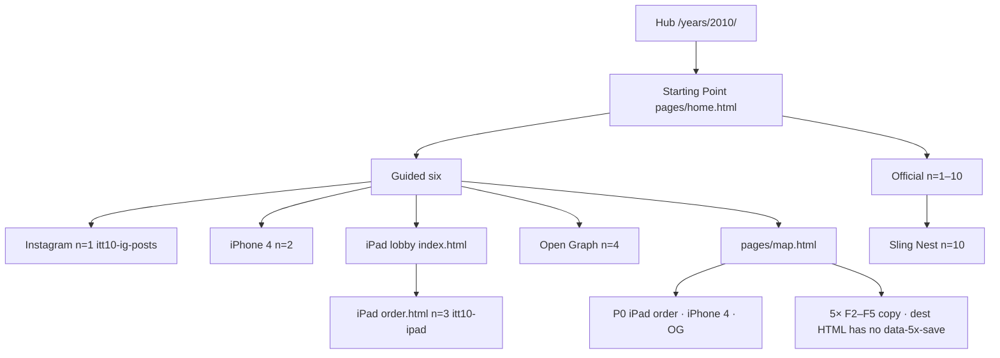

# 2010 — start + every live flow

**Date:** 2026-10-10  
**Status:** Census of flows on disk. Not ship law. Not dest-farm. No implement phase started.  
**Ship law:** [`DISK-TRUTH.md`](DISK-TRUTH.md) · `js/year-card.json` · `scripts/itt_gate.py` `SHIP_YEARS`.  
**Tick list:** [`checklists/2010.md`](checklists/2010.md).  
**Local:** http://127.0.0.1:8080

Lean HTML door. Official trail **10**. leftover trail **0**. leftover-2× unique **12**. leftover-3× unique **0**. leftover-4× unique **3**. dest folders **29**. Chrome: Windows 7 · IE 8.

---

## Counts on disk

| Layer | n | Source |
|-------|---|--------|
| Official trail | **10** | `js/config/flow-trails.js` `"2010"` |
| leftover trail n=11+ | **0** | lean 10+0 · no leftover rows in `flow-trails.js` |
| leftover-2× unique dests | **12** | `e2e/leftover-2x-unique-links.matrix.json` |
| leftover-3× unique dests | **0** | catalogs empty |
| leftover-4× unique dests | **3** | netflix · tumblr · wave |
| dest folders with `index.html` | **29** | `years/2010/sites/` · `e2e/lean-double-leftover.spec.js` WANT 29 |
| Starting Point guided | **6** | `ui/year/start-data.js` · `#ott-guided-2010` |
| Official dests with `data-official-verb` | **10 / 10** | every trail dest owns its `whenKey` |
| Gold leftover on star | **1** | `instagram/index.html` `data-itt-gold-lx` · `data-lo-key=gold-lx` |
| 5× `data-5x-save` on dest HTML | **0** | pack does not load on 2010 dests |
| About thesis panel | **yes** | `pages/about.html` `data-itt-real-save` |

**Door:** http://127.0.0.1:8080/years/2010/  
**Starting Point:** http://127.0.0.1:8080/years/2010/pages/home.html  
**Map:** http://127.0.0.1:8080/years/2010/pages/map.html  
**Star:** `itt10-ig-posts` · http://127.0.0.1:8080/years/2010/sites/instagram/index.html  
**year-card:** kind html · leanBoot · star `itt10-ig-posts`

---

## Starting Point six

Painted by `ui/year/start.js` from `ITT.YearUI.START["2010"]`. Atlas `guidedFull["2010"]` matches.

| # | Label | href | Lands on |
|---|-------|------|----------|
| 1 | About 2010 | `about.html` | thesis panel · writes `itt10-thesis-ack` |
| 2 | Instagram — filter then share | `../sites/instagram/index.html` | official n=1 `itt10-ig-posts` |
| 3 | iPhone 4 — FaceTime Wi-Fi · Antenna | `../sites/iphone/index.html` | official n=2 `itt10-iphone4` |
| 4 | iPad — $499 · 300k day one | `../sites/ipad/index.html` | lobby · links `order.html` |
| 5 | Open Graph — Like ×2 | `../sites/facebook/index.html` | official n=4 `itt10-fb-og` |
| 6 | Year flow map | `map.html` | `js/config/flow-maps.js` `"2010"` |

Star chip href: `../sites/instagram/index.html`.

---

## Official trail n=1–10

Every href exists. Every dest has `data-official-key` + `data-official-verb`. Empty / incomplete writes nothing. Writer is `official-verb.js`.

| n | Name | Key | Dest | Gold I/O |
|---|------|-----|------|----------|
| 1 | Instagram | `itt10-ig-posts` | `sites/instagram/index.html` | named filter + caption · Share. Also writes `itt10-ig`. Second share writes extra `itt10-ig-2`. |
| 2 | iPhone 4 | `itt10-iphone4` | `sites/iphone/index.html` | FaceTime Wi-Fi tick + antenna bumper |
| 3 | iPad | `itt10-ipad` | `sites/ipad/order.html` | capacity + Wi-Fi/3G · also extra `itt10-ipad-order` |
| 4 | Open Graph | `itt10-fb-og` | `sites/facebook/index.html` | Like CNN then IMDb |
| 5 | FarmVille peak | `itt10-farm` | `sites/farmville/index.html` | plant after honesty tick |
| 6 | Imgur | `itt10-imgur` | `sites/imgur/index.html` | filename then upload |
| 7 | Foursquare | `itt10-4sq` | `sites/foursquare/index.html` | check-in after reqs |
| 8 | Twitter | `itt10-tweets` | `sites/twitter/index.html` | lurk tick · 2010 tweet |
| 9 | YouTube | `itt10-yt` | `sites/youtube/index.html` | 35h honesty leftover face on official dest |
| 10 | Sling Nest | `itt10-game-slingnest` | `sites/playable/game.html` | year game · also official-verb |

Next hops in `flow-trails.js` walk 1→10 then loop to Instagram.

---

## Map + 5× copy

`ITT.flowMaps["2010"]` · thesis: tablet + filter + Like · still mostly a laptop.

| Branch | Sites | Live key on dest |
|--------|-------|------------------|
| ★ Star | `sites/instagram/index.html` | `itt10-ig-posts` |
| P0 machines | iPad `order.html` · iPhone 4 · Open Graph | `itt10-ipad` · `itt10-iphone4` · `itt10-fb-og` |
| New · 2010 extras | IG second share · iPad radios | extra `itt10-ig-2` · extra `itt10-ipad-order` on the official dests |
| 5× F1–F5 · 2010 | **F2** Instagram · **F3** Imgur · **F4** Facebook OG · **F5** YouTube | map `do` names `itt10-facebook` and `itt10-youtube`. Dest HTML owns `itt10-fb-og` and `itt10-yt`. **No F1 row.** |

`e2e/5x-recheck.matrix.json` 2010 is `mode: panel`, star Instagram, four flows:

| suffix | room | matrix key | dest official key |
|--------|------|------------|-------------------|
| facebook | `sites/facebook/index.html` | `itt10-facebook` | `itt10-fb-og` |
| youtube | `sites/youtube/index.html` | `itt10-youtube` | `itt10-yt` |
| tweets | `sites/twitter/index.html` | `itt10-tweets` | `itt10-tweets` |
| 4sq | `sites/foursquare/index.html` | `itt10-4sq` | `itt10-4sq` |

No 2010 dest HTML has `data-5x-save` / `data-5x-loop`, so `year-5x-pack.js` does not boot on those rooms. `e2e/2010-5x-live.spec.js` is absent. Warehouse `2010-flows` 5× F1 Ask leftover `itt10-ask` skips: `years/2010/sites/ask/` is not on disk.

---

## leftover-2× unique (12)

Catalog dests already on disk. Rails fold unless `?deep=1`. Official dest leftover-2× first paint **0**. Self-skip when the open dest is in the catalog (flipboard 11/12). `data-lo-key` suffixes prefix via `keyOf` to `itt10-*-lx`.

| # | Dest | Key | URL |
|---|------|-----|-----|
| 1 | angry | `itt10-angry-lx` | http://127.0.0.1:8080/years/2010/sites/angry/index.html |
| 2 | flipboard | `itt10-flipboard-lx` | http://127.0.0.1:8080/years/2010/sites/flipboard/index.html |
| 3 | cityville | `itt10-cityville-lx` | http://127.0.0.1:8080/years/2010/sites/cityville/index.html |
| 4 | kinect | `itt10-kinect-lx` | http://127.0.0.1:8080/years/2010/sites/kinect/index.html |
| 5 | minecraft | `itt10-minecraft-lx` | http://127.0.0.1:8080/years/2010/sites/minecraft/index.html |
| 6 | hulu | `itt10-hulu-lx` | http://127.0.0.1:8080/years/2010/sites/hulu/index.html |
| 7 | googlebuzz | `itt10-googlebuzz-lx` | http://127.0.0.1:8080/years/2010/sites/googlebuzz/index.html |
| 8 | path | `itt10-path-lx` | http://127.0.0.1:8080/years/2010/sites/path/index.html |
| 9 | ibooks | `itt10-ibooks-lx` | http://127.0.0.1:8080/years/2010/sites/ibooks/index.html |
| 10 | chromewebstore | `itt10-chromewebstore-lx` | http://127.0.0.1:8080/years/2010/sites/chromewebstore/index.html |
| 11 | google | `itt10-google-lx` | http://127.0.0.1:8080/years/2010/sites/google/index.html |
| 12 | android | `itt10-android-lx` | http://127.0.0.1:8080/years/2010/sites/android/index.html |

lean-double leftover KEEP matrix is **10** (angry through ibooks, no `path` / `google` / `android`). leftover-2× unique 12 is the live unique-link catalog. Do not dest-farm to 24 until named `2x`.

---

## leftover-4× unique (3)

| Dest | Key | URL |
|------|-----|-----|
| netflix | `itt10-pop4-netflix` | http://127.0.0.1:8080/years/2010/sites/netflix/index.html |
| tumblr | `itt10-pop4-tumblr` | http://127.0.0.1:8080/years/2010/sites/tumblr/index.html |
| wave | `itt10-pop4-wave` | http://127.0.0.1:8080/years/2010/sites/wave/index.html |

Stacked leftover-4× **0**. leftover-3× unique JS/engines gone. `DEST-TRUE-FLOW-NAMES.md` still labels some of these leftover-3× unique; live class is leftover-4× unique for these three.

---

## Playable + extras

Year game: Sling Nest `itt10-game-slingnest` · official n=10. Famous cabinets: Pocket Snake + Brick Bat (`famous.html` · `e2e/famous-games.spec.js` `snake` / `breakout`).

`ITT.yearExtraGames["2010"]` extras (off official ten):

| File | Title | Key |
|------|-------|-----|
| `extra-a.html` | Open Graph burst | `itt10-game-ogburst` |
| `extra-b.html` | iPad tilt | `itt10-game-ipadtilt` |
| `extra-c.html` | Rag Hill | `itt10-game-raghill` |
| `extra-d.html` | Four Objects | `itt10-game-fourobj` |
| `extra-e.html` | Filter Hold | `itt10-game-filterhold` |
| `extra-f.html` | Filter Two | `itt10-game-filter2` |
| `extra-g.html` | OG Note | `itt10-game-ognote` |
| `extra-h.html` | iPad Note | `itt10-game-ipadnote` |
| `extra-i.html` | FaceTime Wait | `itt10-game-ftwait` |
| `more-a.html` | Rag Hill | `itt10-game-raghill` (same key as extra-c) |
| `more-b.html` | Meat Run | `itt10-game-meatrun` |
| `more-c.html` | Meat Boy Run | `itt10-game-meatboyr` |
| `more-d.html` | Limbo Walk | `itt10-game-limbowalk` |
| `game-2.html` | IG filter | `igfilter` |
| `game-3.html` | iPad rotate | `ipadrot` |
| `game-4.html` | OG like | `oglike` |
| `game-5.html` | Imgur up | `imgurup` |

`js/immersion/year-2010-extras.js` boots iPad order / iPhone FaceTime / Open Graph / Twitter 140 on dests that have those controls. Official-verb on iPad order returns before the extra writer.

---

## All 29 dest folders

| Folder | Class |
|--------|--------|
| instagram | official n=1 · gold leftover |
| iphone | official n=2 |
| ipad | official n=3 on `order.html` · lobby `index.html` · `safari.html` extra |
| facebook | official n=4 · `cnn.html` / `imdb.html` Like targets |
| farmville | official n=5 |
| imgur | official n=6 |
| foursquare | official n=7 |
| twitter | official n=8 |
| youtube | official n=9 |
| playable | official n=10 + extras + famous |
| angry flipboard cityville kinect minecraft hulu googlebuzz path ibooks chromewebstore google android | leftover-2× unique |
| netflix tumblr wave | leftover-4× unique |
| groupon | leftover pop face `itt10-pop-groupon` · `data-itt-lo3x` · not leftover-2× / 4× unique |
| reddit | leftover pop face `itt10-pop3-reddit` · `submit.html` extra |
| chrome | dest folder · no official / lo-key |
| formspring | dest folder · leftover face copy · no save key |

---

## Dest-lock / warehouse skips (not on disk)

`e2e/2010-mvp.spec.js` and `e2e/2010-flows.spec.js` skip when the dest is missing. Live tree has **no** folders for: `pinterest` `uber` `quora` `digg` `ask` `instant` `facetime` `yahoo` `ie9` `windowsphone` `kickstarter` plus Cablegate / BrowserChoice rooms. FaceTime I/O lives on `iphone/index.html`, not a `facetime/` dest. Do not dest-farm those folders from this map.

[`DEST-TRUE-FLOW-NAMES.md`](DEST-TRUE-FLOW-NAMES.md) 2010 lists **41** research names (KEEP / DROP / DO-NOT-APPLY). That sheet is not the live trail. DROP dests stay dropped.

---

## Holes (census only)

| Id | What | Live |
|----|------|------|
| H1 | Start iPad is lobby `index.html` | Lobby links `order.html`. Official write is `itt10-ipad` on order. Same pattern as 1994 IUMA lobby → listen. |
| H2 | Map 5× F1 missing · F4/F5 keys | Map `do` `itt10-facebook` / `itt10-youtube` vs dest `itt10-fb-og` / `itt10-yt`. Matrix same mismatch. Dest HTML 5× count 0. |
| H3 | leftover trail 0 | Lean 10+0. leftover-2× unique 12 are dest hrefs, not leftover-trail n=11+. |
| H4 | Four dest folders off unique catalogs | `chrome` `formspring` `groupon` `reddit` exist. groupon/reddit have pop leftover faces. |
| H5 | Warehouse dest-lock tests | Pinterest / UberCab / Ask / Instant dest folders stay skipped. |

Do not dest-farm to close H2–H5. Do not restore leftover-3× unique catalogs.

---

## Locks already on disk

| Pack | What it locks |
|------|----------------|
| `e2e/2010-mvp.spec.js` | shell · about dual scale · Instagram · iPad order · iPhone 4 · Open Graph · FarmVille · Foursquare · Twitter · Imgur · Sling Nest |
| `e2e/2010-flows.spec.js` | guided 6 · thesis · official I/O · dest-lock skips |
| `e2e/2010-trail-real-flows.spec.js` | official trail dests |
| `e2e/leftover-2x-unique-links.spec.js` | 2010 n=12 |
| `e2e/leftover-4x-unique.spec.js` | netflix · tumblr · wave |
| `e2e/lean-double-leftover.spec.js` | dest folders 29 |
| `e2e/year-start-trails.spec.js` | `?trail=2010-start` |
| `e2e/famous-games.spec.js` | snake · breakout |
| `docs/checklists/2010.md` | official 10 + leftover-2× 12 ticks |

---

## 3× of leftover-2× unique 12

Live leftover-3× unique dest-**links** is **3** (formspring · groupon · reddit) on dests already on disk. leftover-3× unique dest-**true** catalog stays `[]`. leftover-4× unique **3** stays netflix · tumblr · wave.

Law for leftover unique dests: one dest once · dest-disjoint official 10, leftover-2× unique, leftover-4× unique · after = min(N × unique dest hrefs, dests on disk) · do not dest-farm dest folders · do not grow leftover-3× unique past **=3** / **2021=5**.

| Read | n |
|------|---|
| leftover-2× unique now | **12** |
| 3 × 12 | **36** |
| dest folders on disk | **29** |
| links-only cap `min(36, 29)` | **29** |
| leftover dests not already leftover-2× | **7** (chrome · formspring · groupon · reddit · netflix · tumblr · wave) |
| dest-disjoint leftover dests if leftover-4× stays leftover-4× | **4** (chrome · formspring · groupon · reddit) |

**Path A · links-only.** leftover-3× unique catalog from dests already on disk, dest-disjoint leftover-2× 12 and official 10. Cap **4** (or **7** if leftover-4× dests are reused as leftover-3× unique dests, which collapses leftover-4×). Does not reach 36.

**Path B · dest folders.** 36 leftover-3× unique dests dest-disjoint leftover-2× 12 and official 10 needs **29** new leftover dest folders after taking the 7 leftover dests still off leftover-2×. Dest-farm. Waits on named leftover-3× restore / `2x`.

Path A leftover-3× unique dest-links n=3 is live. Path B dest-farm stays off. leftover-3× unique dest-true catalogs stay empty.

---

## Out of scope until named

`2x` dest doubling. famous-double. leftover-3× unique dest-true restore. dest-farm of Ask / Pinterest / Uber / Instant folders. Implement of H2 map/5× key honesty until the user names **start** and a 2010 phase. Path B leftover-3× unique dest-farm 12→36 stays off.
