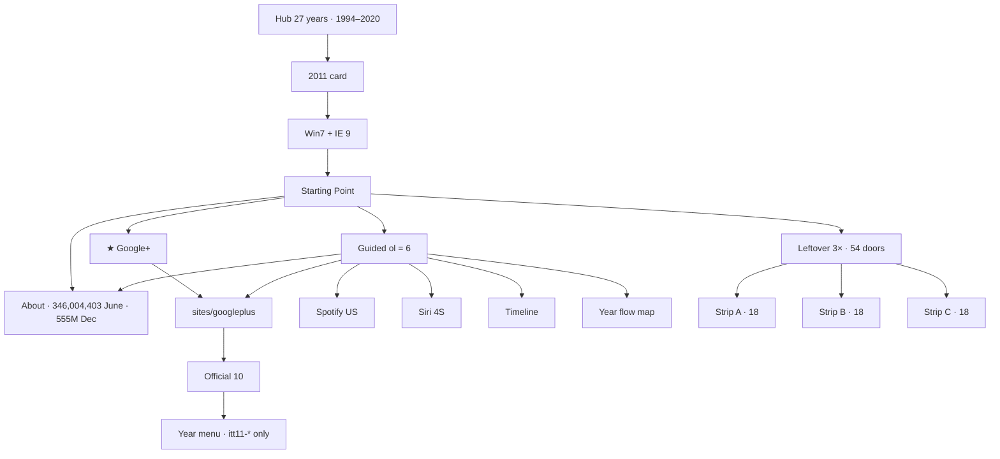
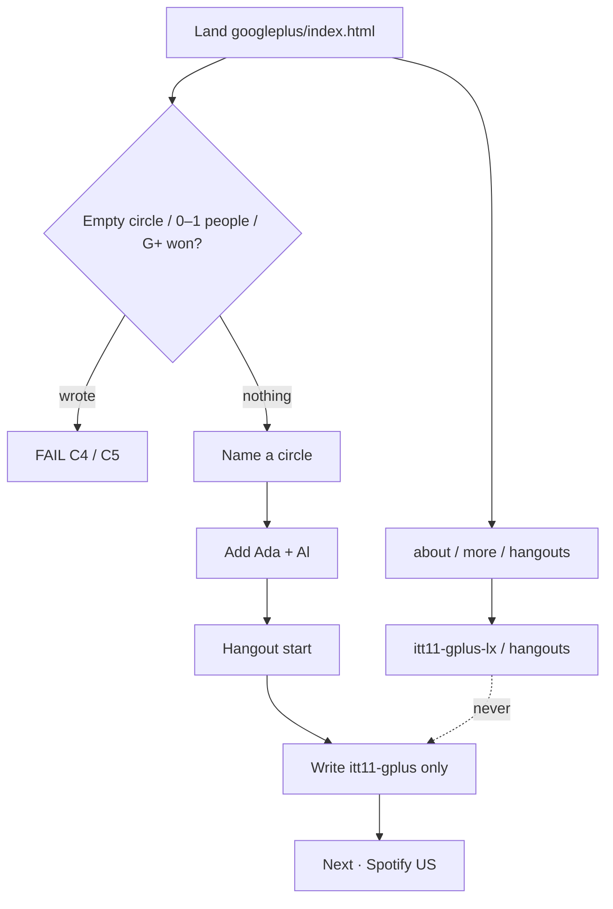
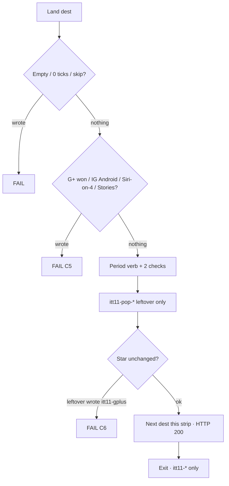
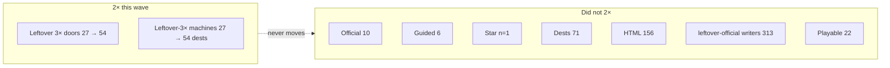
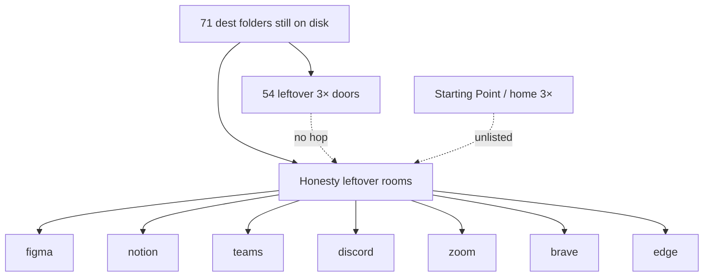
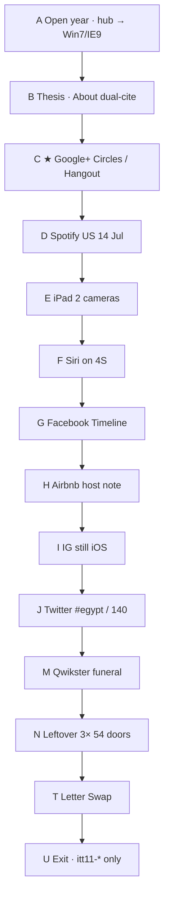

# 2011 — flow diagrams (live)

**Date:** 2026-09-09  
**Live:** leftover 3× doors **54** (18+18+18). Official **10**. Guided **6**. Star `itt11-gplus`.  
**Map:** [`2011-2X-FLOWS-GOALS-PHASES-FLOWS-MINUTE-2026-09-09.md`](2011-2X-FLOWS-GOALS-PHASES-FLOWS-MINUTE-2026-09-09.md)

These diagrams are the visitor walks on disk. Leftover never writes the star. Empty / trap never writes.

---

## 1. Year envelope



---

## 2. ★ Gold — Google+ Circles / Hangout



---

## 3. Official 10

```mermaid
flowchart LR
  n1[1 Google+ · itt11-gplus] --> n2[2 Spotify US · itt11-spotify]
  n2 --> n3[3 Siri · itt11-siri]
  n3 --> n4[4 Timeline · itt11-timeline]
  n4 --> n5[5 iPad 2 leftover · itt11-ipad2]
  n5 --> n6[6 Airbnb leftover · itt11-airbnb]
  n6 --> n7[7 IG iOS leftover · itt11-ig]
  n7 --> n8[8 Twitter leftover · itt11-tweets]
  n8 --> n9[9 Qwikster leftover · itt11-qwikster]
  n9 --> n10[10 Letter Swap · itt11-game-letterswap]
  n10 --> n1
```



n=2…9 leftover ≠ gold. n=1 is the only star write.

---

## 4. One leftover dest (every leftover-3× door)



---

## 5. Leftover 3× 2× — three strips of 18

Was 9+9+9 = 27. Now **18+18+18 = 54**. Same dest folders. No new rooms.

```mermaid
flowchart TD
  start[Starting Point] --> A[Strip A · data-itt-pop3x]
  start --> B[Strip B · data-itt-pop-more]
  start --> C[Strip C · data-itt-pop-3x3]

  subgraph A18[A · 18 dests]
    A1[iCloud] --> A2[Pinterest] --> A3[LinkedIn] --> A4[ICS]
    A4 --> A5[Lion] --> A6[Netflix] --> A7[Dropbox] --> A8[Chrome]
    A8 --> A9[Google Music]
    A9 --> A10[Gmail] --> A11[Google] --> A12[Hotmail]
    A12 --> A13[Wikipedia] --> A14[Snapchat] --> A15[WhatsApp]
    A15 --> A16[Rdio] --> A17[Amazon] --> A18[Chromebook] --> A1
  end

  subgraph B18[B · 18 dests]
    B1[Kindle Fire] --> B2[Minecraft] --> B3[Twitch] --> B4[Reddit]
    B4 --> B5[Steam] --> B6[Skype] --> B7[GitHub] --> B8[Last.fm]
    B8 --> B9[Xbox]
    B9 --> B10[Kindle] --> B11[Silk] --> B12[Siri dest]
    B12 --> B13[Jobs] --> B14[Maps] --> B15[Safari]
    B15 --> B16[Firefox] --> B17[IG chip] --> B18[Netflix chip] --> B1
  end

  subgraph C18[C · 18 dests]
    C1[Spotify] --> C2[Siri phone] --> C3[Timeline] --> C4[iPad 2]
    C4 --> C5[Airbnb] --> C6[IG iOS] --> C7[Twitter] --> C8[Qwikster]
    C8 --> C9[YouTube]
    C9 --> C10[Vita] --> C11[WP7.5] --> C12[PayPal]
    C12 --> C13[PlayStation] --> C14[Nintendo] --> C15[UberCab]
    C15 --> C16[Wallet] --> C17[Roblox] --> C18[LinkedIn chip] --> C1
  end

  A --> A18
  B --> B18
  C --> C18
```

Nodes 10–18 on each strip are the 2× add. Nodes 1–9 were the old 9.

---

## 6. What 2×’d vs what stayed frozen



---

## 7. Honesty unlist (not on the 54)



---

## 8. Flows A–T (period session → museum)



C is the only star write. N is the 2×. T is a cabinet, not leftover 2×.
