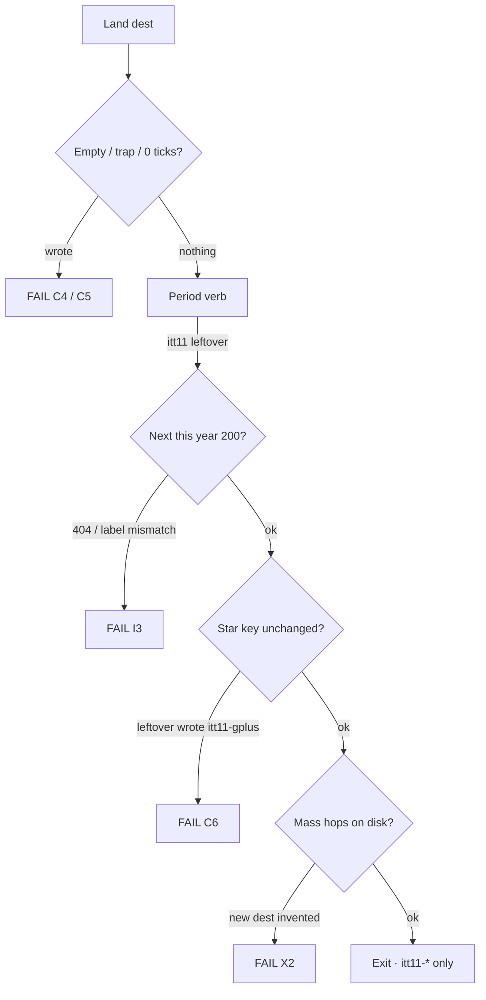

# 2011 — 2× flows · goals · phases · dest minutes

**Date:** 2026-09-09  
**Status:** **Leftover 3× dest doors 2×’d 2026-09-09: 27 → 54 (9+9+9 → 18+18+18).** Dest / HTML / official 10 / guided 6 / leftover-official writers unchanged. Honesty dests stay unlisted. H6 games not started.  
**Hub now:** 27 years open · **1994–2020**. 2011 is a **live lean door**. 2021–2025 are not on the hub.  
**Prefix:** `itt11-*`  
**Star:** `itt11-gplus` · Google+ Circles / Hangout. Leftover never writes it.

**5k websites** = ILS / Pingdom research envelope. **Not** 5,000 dest folders. Corpus `docs/references/2011/corpus-2011-unique-urls.txt` (~10,320 URLs) is a visit list, not a room list.

Deep research `deep-research-2` is walking the 5k envelope + every source this pack names. This file is the implementer map those cites must land on.

| Companion | When you need it |
|-----------|------------------|
| **This file** | 2011-only 2× map · goals · phases · flows A–T · dest minutes |
| [`2011-NEW-UNIQUE-WEBSITES-LEFTOVER-3X-2026-09-09.md`](2011-NEW-UNIQUE-WEBSITES-LEFTOVER-3X-2026-09-09.md) | **New unique 2011 websites** · not leftover-3× dests |
| [`2011-2X-FLOW-DIAGRAMS-2026-09-09.md`](2011-2X-FLOW-DIAGRAMS-2026-09-09.md) | Visitor flow diagrams · leftover 3× 18+18+18 |
| [`2011-READ-FIRST.md`](2011-READ-FIRST.md) | Thesis · do / do not · gold |
| [`2011-RESEARCH.md`](2011-RESEARCH.md) | Locked numbers · dual-cite scale |
| [`2011-2X-CRITERIA-MAP-2026-09-01.md`](2011-2X-CRITERIA-MAP-2026-09-01.md) | C1–C9 |
| [`2011-2X-LEFTOVER-RESEARCH-2026-09-01.md`](2011-2X-LEFTOVER-RESEARCH-2026-09-01.md) | Leftover 120 freeze · star never in the list |
| [`2011-2X-LEFTOVER-GOALS-PHASES-FLOWS-MINUTE-2026-09-01.md`](2011-2X-LEFTOVER-GOALS-PHASES-FLOWS-MINUTE-2026-09-01.md) | Pack A leftover dest-minute |
| [`2011-CHECK-EVERY-FLOW-MAP.md`](2011-CHECK-EVERY-FLOW-MAP.md) | Gold trap / save |
| [`2011-GOALS-PHASES-AND-USER-FLOWS-CLEAR.md`](2011-GOALS-PHASES-AND-USER-FLOWS-CLEAR.md) | Flows A–T in prose |
| [`2011-FROM-SCRATCH-GOALS-PHASES-MINUTE-STEPS.md`](2011-FROM-SCRATCH-GOALS-PHASES-MINUTE-STEPS.md) | Door already built |
| [`2010-2019-2X-EVERY-NUMBER-RESEARCH-GOALS-PHASES-FLOWS-MINUTE-2026-09-03.md`](2010-2019-2X-EVERY-NUMBER-RESEARCH-GOALS-PHASES-FLOWS-MINUTE-2026-09-03.md) | Legal vs illegal 2× |
| [`2010-2019-2X-EVERY-NUMBER-MAP-GOALS-PHASES-FLOWS-MINUTE-2026-09-03.md`](2010-2019-2X-EVERY-NUMBER-MAP-GOALS-PHASES-FLOWS-MINUTE-2026-09-03.md) | Shared leftover minute |
| [`2011-2020-5K-WEB-FLOW-MAP.md`](2011-2020-5K-WEB-FLOW-MAP.md) | 5k envelope · **stale** on “2011 boarded” |
| [`2011-2020-2X-LEFTOVER-RESEARCH-2026-08-31.md`](2011-2020-2X-LEFTOVER-RESEARCH-2026-08-31.md) | 9+9+9 freeze · no 120 forest |
| [`DISK-TRUTH.md`](DISK-TRUTH.md) | Live years |
| `js/config/flow-trails.js` | Official **10**. Do not invent a second n=1 |
| `ui/year/start-data.js` | Guided `<ol>` exactly **6** |
| `e2e/2x-links.matrix.json` · `e2e/leftover-official.matrix.json` | 2011 leftover 2× / leftover-official rows |
| `docs/references/2011/` | Corpus · Wikipedia TSV · CDX · visit logs |

**Trust order:** live `years/2011/` · `scripts/itt_gate.py` `SHIP_YEARS` · DISK-TRUTH · this map · READ-FIRST. Older notebooks that say “2011 boarded” or “leftover 2× 120 forest” **lose**.

**Legal:** Educational. `localStorage` only. No exploit / PoC / live OAuth / live CDN. **Never invent brand pixels.**

Serve: `python3 -m http.server 8080 --bind 127.0.0.1`  
Clear `itt11-*` before a check.

---

# 1. Goal (what “2× 2011 flows” means)

```
Hub card 2011 available
  → Win7 + IE 9
  → Starting Point
        ★ Google+ chip
        guided ol = 6
        leftover / 3× below the <ol>  (honesty dests unlisted)
  → About: 346,004,403 June · 555M Dec · labeled
  → ★ Google+: empty / G+ won / 0–1 people never write
       complete (circle ≥2 + Ada + Al + Hangout) writes itt11-gplus only
  → Official 10: Next after write · leftover ≠ gold
  → Every dest on disk: period verb · exactly 2 leftover writers
       + mass hops to dests already on disk (legal 2×)
  → Letter Swap (existing cabinet)
  → Exit · itt11-* only
```

**2× done** means: every dest already on disk has the **2011 mass-hop set** (label = dest name · href this year · HTTP 200) and leftover still writes **exactly two** leftover keys. Dest count, HTML count, official 10, guided 6, playable file count, leftover-official row count **unchanged**.

**Not done if:** 7th guided `<li>` · second star · leftover wrote `itt11-gplus` · Accept All / empty / trap wrote · new `years/2011/sites/<slug>/` · leftover 4× / “Do leftover” · `game-6.html` · `extra-j.html` · Figma / Notion / Teams / Discord / Zoom / Brave / Chromium Edge re-offered as mass 3× · invented June ILS cell · 2021+ dest.

Visitor-facing 2× is **density of year-true hops and leftover feel**. It is not twice the rooms.

---

# 2. Remeasure (2026-09-09 · live tree)

Hrefs = every `href=` under `years/2011/` (sites + pages).

| Kind | Sept 3 paper | Live now | 2× this map |
|------|-------------:|---------:|-------------|
| Dests | 71 | **98** | First-board unique leftover rooms (+27). Do not dest-farm again unless lifted |
| HTML | 156 | **183** | +27 `index.html` only. No `more.html` on the new dests |
| Hrefs | 5,249 | **13,965** | Do **not** dump toward 27,930. 3× already fat |
| loSave | 313 | **313** | Floor met. No third writer |
| official-verb | 9 | **9** | Stay |
| leftover-official rows | 313 | **313** | **Freeze** (those rows *are* leftover 2×) |
| 2×-links rows | 313 | **313** | **Freeze** |
| 2×-link blocks | — | **149** | Fill **missing mass hops inside** existing blocks |
| 3× blocks | — | **150** | Do **not** clone the dest list again |
| Playable HTML | 22 | **22** | **Freeze** |
| Official | 10 | **10** | **Freeze** |
| Guided | 6 | **6** | **Freeze** |
| Star | `itt11-gplus` | `itt11-gplus` | **n=1** |

2011 is already the densest live year. Legal 2× here is **hops + leftover feel on files already on disk**, not more rooms and not another 3× dump.

---

# 3. Thesis (copy must match About + home)

**2011 is the year Google tries to rebuild Facebook as Circles, Spotify finally becomes legal in the United States, and the phone grows a voice** — Google+ field trial (28 Jun) · Spotify US invite-free (14 Jul) · iPad 2 camera (2 Mar) · Facebook Timeline (22 Sep) · iPhone 4S / Siri (14 Oct) — while most people still live on a **Windows 7 / IE 9** laptop.

Scale: Live Stats June **346,004,403** sites · Pingdom Dec **555 million** sites. **Label the source.** Do not invent a blended “450 million.” ILS June table **ends 2018**.

---

# 4. Criteria (all of them · fail closed)

| # | Rule | Fail if |
|--:|------|---------|
| C1 | Prefix `itt11-*` | Any other prefix writes |
| C2 | Guided **6** | 7th `<li>` in `start-data.js` |
| C3 | Official **10** in `flow-trails.js` | Official 20 · second n=1 list |
| C4 | One star `itt11-gplus` | Leftover wrote gold · second star |
| C5 | G+ won / IG Android as 2011 default / Siri-on-4 never write | Those traps write |
| C6 | Leftover never writes the star | `itt11-gplus` from a leftover dest |
| C7 | ILS June **346,004,403** · Pingdom Dec **555M** | Unlabeled blend |
| C8 | Chrome is a **product room** | Chrome as the year shell |
| C9 | Cabinets ≠ leftover 2× | Game key used as leftover 2× key |
| X1 | 2× only a legal kind | 20 official · 12 guided · 2 stars · leftover 4× · new dest |
| X2 | Hrefs 2× = hops to dests **on disk this year** | New folder to fill a strip |
| X3 | Leftover writers stay **exactly 2** / dest | Third `data-lo-save` · “Do leftover” |
| X4 | Playable stays **22** HTML | `game-6.html` · `extra-j.html` |
| X10 | Figma / Notion / Teams / Discord / Zoom / Brave / Chromium Edge stay **unlisted** as mass 3× | Re-offered on Starting Point / home 3× |
| ILS | June table ends **2018** | Invented 2019+ June cell |

Incomplete REAL (empty field, 0 ticks, 1 hop, trap, Allow / Accept All / Join) **never writes**.

---

# 5. Align

```
hero 2011 = years/2011/sites/googleplus/index.html
         = data-ott-one-thing="2011"
         = flowTrails["2011"][0]
key      = itt11-gplus
```

**Guided 6** (`ui/year/start-data.js`):

1. About 2011 — dual scale · bans  
2. Google+ — Circles · Hangout  
3. Spotify US — invite  
4. Siri — 4S  
5. Timeline — memoir  
6. Year flow map  

**Official 10** (`js/config/flow-trails.js`):

| n | Name | Path | whenKey | Next |
|--:|------|------|---------|------|
| 1 | Google+ | `sites/googleplus/index.html` | `itt11-gplus` | Spotify US |
| 2 | Spotify US | `sites/spotify/index.html` | `itt11-spotify` | Siri |
| 3 | Siri | `sites/iphone/index.html` | `itt11-siri` | Timeline |
| 4 | Timeline | `sites/facebook/index.html` | `itt11-timeline` | iPad 2 |
| 5 | iPad 2 leftover | `sites/ipad/index.html` | `itt11-ipad2` | Airbnb |
| 6 | Airbnb leftover | `sites/airbnb/index.html` | `itt11-airbnb` | IG iOS |
| 7 | IG iOS leftover | `sites/instagram/index.html` | `itt11-ig` | Twitter |
| 8 | Twitter leftover | `sites/twitter/index.html` | `itt11-tweets` | Qwikster |
| 9 | Qwikster leftover | `sites/qwikster/index.html` | `itt11-qwikster` | Letter Swap |
| 10 | Letter Swap | `sites/playable/game.html` | `itt11-game-letterswap` | Google+ |

Do **not** invent a second list.

---

# 6. Hard bans

| Ban | Why |
|-----|-----|
| New dest folder | Lean cap · X2 · I1 |
| New about/more HTML just to hold links | HTML freeze 156 |
| Official 20 / guided 12 / 2 stars | n=1 freeze |
| Third leftover writer / “Do leftover” | leftover 4× ban |
| `game-6.html` / `extra-j.html` | Playable cabinet cap |
| Clone every dest slug onto every page | 2011 3× already does this (13,965 hrefs) |
| IG Android / Stories / Reels / web composer as 2011 default | Android is **3 Apr 2012** |
| Siri on iPhone 4 | 4S only · 14 Oct |
| G+ won / G+ replaced Facebook | Field trial · invite until 20 Sep |
| July Spotify as the 22 Sep Facebook-open day | Invite wall drops **22 Sep** |
| Vine · iPhone 5 · Win8 · Snapchat Stories · Graph Search · UberX mass | 2012+ |
| Figma / Notion / Teams / Discord / Zoom / Brave / Chromium Edge as mass 3× | X10 honesty unlist |
| 1,388 Wikipedia-established names as rooms | Corpus ≠ dests |
| Invented brand pixels / exploit PoC / live OAuth | Always |
| 2021–2025 dests | Not on disk · not this year |
| Dump all 71 dests’ hops in one unreviewed pass | One named wave, then look |

---

# 7. Shared leftover minute (every 2011 dest)

1. Land. `[failed-final]` or harvested still. `data-itt-year="2011"`.  
2. Empty / 0 ticks / 1 hop / skip wait → **nothing**.  
3. Trap (dest table below) → **nothing**. Never write `itt11-gplus`.  
4. Period verb → `itt11-<suffix>` leftover only. **Not** the star.  
5. Second writer (`-d2` / about / more / `-lx`) → **different** leftover key.  
6. Next href this year · HTTP 200 · label = dest name.  
7. Legal 2× links: add missing **mass hops** from §8. Do not add a third writer.  
8. Exit. Only `itt11-*`.



---

# 8. Legal 2× hop set (on disk · 2011-true)

**Mass hops** (Pew / comScore-class dests that already exist as 2011 rooms). Label = dest name. Href resolves under `years/2011/`.

`facebook` · `youtube` · `twitter` · `google` · `reddit` · `netflix` · `instagram` · `spotify` · `gmail` · `wiki`

**Also-this-year leftover hops** (allowed on leftover dests, never as a second gold):

`googleplus` (as a dest, never writes star) · `iphone` · `ipad` · `airbnb` · `chrome` · `dropbox` · `pinterest` · `linkedin` · `skype` · `whatsapp` · `hotmail` · `snapchat` · `qwikster`

**Honesty-unlisted** (rooms may exist; hops stay **off** Starting Point / home 3× / pop strips):

`figma` · `notion` · `teams` · `discord` · `zoom` · `brave` · `edge`

**Never hop / never add:** IG Android dest-as-2011 · Stories · Reels · Vine · iPhone 5 · Win8 · Graph Search · UberX mass · TikTok brand · ChatGPT.

**Href honesty:** a 2× hop is missing only if that dest’s existing `data-itt-2x-links` block does not already name it. Do not add a second block. Do not add a new HTML file to hold the links.

---

# 9. Visitor flows A–T (life → museum → legal 2× → proof)

Each flow is a **period session**. 2× is a **second leftover walk + missing mass hops**, not a second gold and not official 20.

### A — Open the year

**Life:** You still boot a Windows 7 laptop. January was IE 8.  
**Museum:** Hub card 2011 → `years/2011/` → Win7 + IE 9 → `pages/home.html`.  
**2×:** Resume `itt-last-year=2011` still works. No 2021–2025 cards.  
**Proof:** Gold chip. Guided 6. `SHIP_YEARS` includes 2011.

### B — Read the thesis

**Life:** Circles + legal US streaming + a voice in the phone.  
**Museum:** `pages/about.html` · 346,004,403 June · 555M Dec · bans.  
**2×:** Literacy still two checks. Optional `itt11-thesis-ack`. No extra About HTML.  
**Proof:** Dual-cite labeled. IG Android / Vine / iPhone 5 / Win8 / Stories / UberX / “G+ won” visible as bans.

### C — ★ Google+ (the 2011 object)

**Life:** A friend sends an invite. College / parents / boss in different Circles. Then Hangout — up to ten faces. Field trial. Does not replace Facebook.  
**Museum:** `sites/googleplus/index.html` · field-trial ack · named circle · two Hangout checks · start.  
**2×:** `about.html` / `more.html` / `hangouts.html` stay leftover (`itt11-gplus-lx`, `itt11-hangouts`). Mass hops on those leftover pages only. Star page does **not** grow a leftover writer.  
**Proof:** empty / 0–1 people / G+ won → nothing. Complete → `itt11-gplus` only. Next = Spotify US.

### D — Spotify finally legal in the US

**Life:** Europe had this in 2008. America gets it 14 Jul. Desktop client. Free if you have an invite. $4.99 kills ads on the computer. $9.99 takes it to the phone. Facebook is not the July door. 22 Sep the invite wall drops.  
**Museum:** `sites/spotify/index.html` · three SKUs · two honesty boxes · invite. `itt11-spotify`. No stream.  
**2×:** leftover `-lx` / `-d2` already on disk. Add missing mass hops (facebook · youtube · twitter · netflix · lastfm · rdio · gmusic) **if absent**.  
**Proof:** July copy ≠ 22 Sep Facebook-open. Leftover ≠ `itt11-gplus`.

### E — Unbox the iPad 2

**Life:** First iPad had no camera. This one does. Smart Cover wakes it. Still $499. Ships 11 Mar.  
**Museum:** `sites/ipad/index.html` · capacity + radio + camera → `itt11-ipad2`.  
**2×:** leftover about/more already exist. Hops: iphone · icloud · itunes-class chrome room · facebook.  
**Proof:** no iPhone 5. No iPad 3.

### F — Ask the phone

**Life:** 14 Oct. iPhone 4S. Siri is a beta: EN-US/UK/AU + FR + DE. Jobs died the next day. Not on iPhone 4.  
**Museum:** `sites/iphone/index.html` · 2011-class phrase → `itt11-siri`.  
**2×:** leftover `-lx` / `siri` dest. Empty never writes. Hops: ipad · icloud · facebook.  
**Proof:** Siri-on-4 trap writes nothing.

### G — Rebuild Facebook as a memoir

**Life:** f8, 22 Sep. Cover photo. Timeline is the story of your life. Graph Search is two years away.  
**Museum:** `sites/facebook/index.html` · Cover + two literacy checks → `itt11-timeline`.  
**2×:** leftover `about` / `more` / `pop` already 4 HTML. Hops: youtube · twitter · instagram · googleplus (dest, not star).  
**Proof:** Graph Search trap never writes. Leftover keys `itt11-timeline-lx` / `itt11-facebook` never write gold.

### H — Message an Airbnb host

**Life:** Not a hotel cart. Search a city, pick a listing, write the host a note.  
**Museum:** `sites/airbnb/index.html` · city → listing → note → `itt11-airbnb`.  
**2×:** about/more leftover already. Hops: facebook · maps · google.  
**Proof:** no payment. Star untouched.

### I — Filter a photo (still iPhone only)

**Life:** Instagram launched 6 Oct 2010. 2011 is the habit year. Android is 3 Apr 2012.  
**Museum:** `sites/instagram/index.html` · named filter → Share leftover `itt11-ig`.  
**2×:** about/more leftover. Hops: facebook · twitter · googleplus dest. **Never** hop an Android composer.  
**Proof:** IG Android trap never writes.

### J — #egypt or lurk

**Life:** Twitter year-in-review #1 is **#egypt**. 250 million tweets a day by October. 140 chars. You do not have to tweet.  
**Museum:** `sites/twitter/index.html` · follow **or** 140 → `itt11-tweets`.  
**2×:** leftover `-lx`. Hops: facebook · youtube · reddit. CJK stay 140.  
**Proof:** 280 / X-brand trap never writes.

### K — Continuity mail / search

**Life:** Gmail, Hotmail, Google, Wikipedia still exist. They are rooms, not the year.  
**Museum:** `gmail` · `hotmail` · `google` · `wiki` leftover chips.  
**2×:** each chip already has 2 writers (`itt11-c10`…`c13` + `-d2`). Fill mass hops. No new mail dest.  
**Proof:** writers stay 2.

### L — Reblog / deal / snap seed

**Life:** Tumblr 39M blogs. Groupon IPO 4 Nov. Picaboo becomes Snapchat in September. The picture disappears.  
**Museum:** snap dest `sites/snapchat/index.html` `itt11-snap`. Groupon/Tumblr live as leftover feel on existing dests or chips — **do not add folders**.  
**2×:** snap leftover `-lx` already 3 HTML. Hops: facebook · instagram (iOS) · twitter. Not Stories.  
**Proof:** Stories trap never writes.

### M — Watch Netflix split, then reverse

**Life:** 18 Sep Qwikster. 10 Oct they take it back. About three weeks.  
**Museum:** `sites/qwikster/index.html` · announce then reverse → `itt11-qwikster`. Funeral, not a store.  
**2×:** leftover about/more. Hops: netflix · nfx · youtube · facebook.  
**Proof:** no Qwikster store cart.

### N — Mass leftover 2× (legal links)

**Life:** After the star you still open YouTube, Reddit, Facebook, Gmail.  
**Museum:** leftover dests already on disk · period verb · 2 writers · mass hops from §8.  
**2×:** this **is** the 2×. Walk every dest in §12. Missing mass hop → add inside the existing `data-itt-2x-links` block.  
**Proof:** dest count still 71. loSave still 313. gold unchanged.

### O — Try Chrome as a product

**Life:** IE 9 is the year shell. Chrome is a room you visit.  
**Museum:** `sites/chrome/index.html`.  
**2×:** leftover more.html already. Hops: google · gmail · facebook · youtube.  
**Proof:** shell stays IE 9.

### P — Android ICS leftover

**Life:** Ice Cream Sandwich, 18 Oct. Instagram is still iOS.  
**Museum:** `sites/android4/index.html` · honesty chip.  
**2×:** leftover more.html. Hops: chrome · google · youtube. Never IG Android.  
**Proof:** ICS honesty. No Play Store gold.

### Q — Hardware leftovers (Kindle Fire, Lion, Chromebook, WP7.5)

**Life:** Kindle Fire $199 (15 Nov). Lion. Chromebook. Windows Phone 7.5.  
**Museum:** dests already on disk.  
**2×:** fill mass hops. Writers stay 2.  
**Proof:** no new hardware dest.

### R — Honesty-only rooms

**Life:** Figma / Notion / Teams / Discord / Zoom / Brave / Chromium Edge are **not** 2011 mass.  
**Museum:** dests may exist as honesty leftover (`itt11-c15`…`c19`, `c35`, `c38`, `c16`, `c17`).  
**2×:** **do not** put them on Starting Point / home 3×. Do not add hops *to* them from mass dests.  
**Proof:** X10. Unlisted.

### S — 5× leftovers already named

**Life:** Twitter · Groupon feel · Tumblr feel · About wiki · Airbnb.  
**Museum:** popular-flow pack on dests that exist.  
**2×:** more hops, not more plaques.  
**Proof:** leftover ≠ star.

### T — Letter Swap (leftover game)

**Life:** A Saturday word rack. Not the chip.  
**Museum:** `sites/playable/game.html` · `itt11-game-letterswap`. Cabinets `game-2`…`game-5` + extras already 22 files.  
**2×:** deepen copy / year-true levels **inside** existing files.  
**Proof:** no `game-6.html`. Game key never a leftover 2× key (C9).

### U — Exit

**Museum:** Year menu → hub.  
**Proof:** only `itt11-*`. Neighbor year empty of `itt11`.

---

# 10. Phases (minute steps)

Do **not** run H1–V in one dump. One named wave, then look.

### Phase 0 — Freeze · `[x]` this wave · ROI 10

1. Re-read this file + READ-FIRST + C1–C9 + X1–X10.  
2. Confirm live counts: dests **71** · HTML **156** · official **10** · guided **6** · playable **22** · loSave **313**.  
3. Confirm hub last year is **2020**. Do not touch 2021–2025.  
4. Do **not** `git checkout` an old 2011 forest.  
5. Git only if asked.

### Phase H1 — Audit missing mass hops · `[x]` 2026-09-09 · ROI 9

1. For each dest in §12, open the existing `data-itt-2x-links` block.  
2. Tick which of the 10 mass hops (`facebook youtube twitter google reddit netflix instagram spotify gmail wiki`) are already present.  
3. Write the missing list **per dest** (no new dests).  
4. Honesty dests: confirm they are **absent** from Starting Point / home 3×.  
5. Stop. Look.

### Phase H2 — Fill missing mass hops (named dests only) · `[x]` 2026-09-09 · ROI 8

1. On files **already on disk**, add the missing hop: `href` this year · HTTP 200 · label = dest name.  
2. Prefer the existing `data-itt-2x-links` block. Do not add a second block. Do not add HTML.  
3. Do not copy the full 71-slug list.  
4. Do not add hops to honesty-unlisted dests from mass pages.  
5. Spot-check 10 dests in the browser: click each new hop, confirm 200, confirm leftover still 2 writers, confirm star untouched.

### Phase H3 — Leftover feel / second path · `[ ]` · ROI 7

1. Every dest already has ≥2 leftover writers. **Do not add a third.**  
2. Where the second path (`-d2` / `-lx` / about / more) is a plaque with no period verb, rewrite the verb so a visitor can finish it (empty still never writes).  
3. Official leftover dests (n=2…9): leftover ≠ gold · Next 200.  
4. Gold dest leftover pages (`googleplus/about.html`, `more.html`, `hangouts.html`) stay `gplus-lx` / `hangouts` and **never** write `itt11-gplus`.

### Phase H4 — Official + guided freeze check · `[ ]` · ROI 10

1. `flow-trails.js` 2011 still exactly the 10 rows in §5.  
2. `start-data.js` 2011 `items` still exactly 6.  
3. Walk official 10: trap never writes · complete writes that `whenKey` · leftover ≠ gold.  
4. Gold: G+ won / empty circle / 0–1 people never write.

### Phase H5 — Honesty unlist · `[x]` 2026-09-09 · ROI 8

1. `figma` `notion` `teams` `discord` `zoom` `brave` `edge` off Starting Point, home 3×, pop-3x3.  
2. Their leftover keys (`itt11-c15` `c16` `c17` `c18` `c19` `c35` `c38` + `-d2`) may stay.  
3. Fail if any of those seven appear as “also this year” mass.

### Phase H6 — Playable deepen (optional, named) · `[ ]` · ROI 4

1. Stay inside the 22 HTML files.  
2. Year-true copy / extra levels. No `game-6`.  
3. Game keys stay game keys (C9).

### Phase V — Verify · `[ ]` · ROI 10

1. Hub: 2011 available · 27 open years · no 2021–2025 cards.  
2. `itt11-*` only after a 2011 session.  
3. Star writes only from Google+ complete.  
4. Leftover dest complete does not write `itt11-gplus`.  
5. Dest count 71 · HTML 156 · official 10 · guided 6 · playable 22 · loSave 313.  
6. New hops HTTP 200 · label = dest name.  
7. Clear `itt11-*` and re-walk gold + one leftover dest + one honesty dest.

---

# 11. Dest catalog (71 · freeze)

Role from live tree + `flow-trails.js`. **HTML / dest counts do not grow.**

**Band:** `star` · `official` · `leftover` · `honesty` · `game`.

| # | Slug | Role | Band | HTML | Leftover keys (never star) |
|--:|------|------|------|-----:|----------------------------|
| 1 | `airbnb` | leftover gold | leftover | 3 | `airbnb` `airbnb-lx` `airbnb-2` + `-d2` |
| 2 | `among` | chip | leftover | 1 | `c29` + `-d2` |
| 3 | `amz` | chip | leftover | 1 | `c3` + `-d2` |
| 4 | `android4` | ICS leftover | leftover | 2 | `and4` `and4-2` + `-d2` |
| 5 | `brave` | honesty | honesty | 1 | `c38` + `-d2` |
| 6 | `chrome` | product room | leftover | 2 | `chrome` `chrome-2` + `-d2` |
| 7 | `chromebook` | leftover | leftover | 2 | `cbook` + `-d2` |
| 8 | `cont` | chip | leftover | 1 | `c39` + `-d2` |
| 9 | `discord` | honesty | honesty | 1 | `c15` + `-d2` |
| 10 | `dropbox` | leftover | leftover | 2 | `dropbox` `dropbox-2` + `-d2` |
| 11 | `edge` | honesty | honesty | 1 | `c35` + `-d2` |
| 12 | `epic` | chip | leftover | 1 | `c24` + `-d2` |
| 13 | `facebook` | official n=4 | official | 4 | `timeline-lx` `facebook` `fb-3x` + `-d2` |
| 14 | `ff` | chip | leftover | 1 | `c37` + `-d2` |
| 15 | `figma` | honesty | honesty | 1 | `c19` + `-d2` |
| 16 | `fn` | chip | leftover | 1 | `c28` + `-d2` |
| 17 | `github` | leftover | leftover | 1 | `c20` + `-d2` |
| 18 | `gmail` | leftover | leftover | 1 | `c11` + `-d2` |
| 19 | `gmusic` | leftover | leftover | 2 | `gmusic` `gmusic-2` + `-d2` |
| 20 | `google` | leftover | leftover | 1 | `c10` + `-d2` |
| 21 | `googleplus` | **star** | star | 4 | leftover pages: `gplus-lx` `gplus-2` `hangouts` `googleplus` + `-d2` |
| 22 | `hotmail` | leftover | leftover | 2 | `hotmail` `hotmail-2` + `-d2` |
| 23 | `icloud` | leftover | leftover | 3 | `icloud` `c34` + `-d2` |
| 24 | `ig` | chip | leftover | 1 | `c7` + `-d2` |
| 25 | `instagram` | official n=7 | official | 3 | `ig-lx` `ig-2` `instagram` + `-d2` |
| 26 | `ipad` | official n=5 | official | 3 | `ipad2-lx` `ipad` + `-d2` |
| 27 | `iphone` | official n=3 | official | 3 | `siri-lx` `siri-2` `iphone` + `-d2` |
| 28 | `jobs` | leftover | leftover | 2 | `jobs` + `-d2` |
| 29 | `kindle` | chip | leftover | 1 | `c33` + `-d2` |
| 30 | `kindlefire` | leftover | leftover | 2 | `kfire` + `-d2` |
| 31 | `lastfm` | leftover | leftover | 2 | `lastfm` + `-d2` |
| 32 | `li` | chip | leftover | 1 | `c21` + `-d2` |
| 33 | `linkedin` | leftover | leftover | 2 | `li` `li-2` + `-d2` |
| 34 | `lion` | leftover | leftover | 2 | `lion` + `-d2` |
| 35 | `maps` | leftover | leftover | 1 | `c12` + `-d2` |
| 36 | `minecraft` | leftover | leftover | 2 | `mc` + `-d2` |
| 37 | `netflix` | leftover | leftover | 2 | `nfx` `nfx-2` + `-d2` |
| 38 | `nfx` | chip | leftover | 1 | `c5` + `-d2` |
| 39 | `nintendo` | leftover | leftover | 1 | `c27` + `-d2` |
| 40 | `notion` | honesty | honesty | 1 | `c18` + `-d2` |
| 41 | `patreon` | chip | leftover | 1 | `c32` + `-d2` |
| 42 | `pinterest` | leftover | leftover | 2 | `pin` `pin-2` + `-d2` |
| 43 | `playable` | game | game | 22 | game keys + extras · **not** leftover 2× keys |
| 44 | `pp` | chip | leftover | 1 | `c13` + `-d2` |
| 45 | `ps` | chip | leftover | 1 | `c25` + `-d2` |
| 46 | `qwikster` | official n=9 | official | 3 | `qwikster-lx` `qwikster-2` + `-d2` |
| 47 | `rdio` | leftover | leftover | 2 | `rdio` + `-d2` |
| 48 | `reddit` | leftover | leftover | 2 | `reddit` `c4` `reddit-3x` + `-d2` |
| 49 | `roblox` | chip | leftover | 1 | `c30` + `-d2` |
| 50 | `safari` | chip | leftover | 1 | `c36` + `-d2` |
| 51 | `silk` | leftover | leftover | 2 | `silk` + `-d2` |
| 52 | `siri` | leftover leaf | leftover | 1 | `siri-2p` + `-d2` |
| 53 | `skype` | leftover | leftover | 2 | `skype` + `-d2` |
| 54 | `slack` | honesty-lean | leftover | 1 | `c14` + `-d2` |
| 55 | `snapchat` | leftover seed | leftover | 3 | `snap` `snap-lx` `snap-2` + `-d2` |
| 56 | `spotify` | official n=2 | official | 3 | `spotify-lx` `spotify-2` `c6` + `-d2` |
| 57 | `ss` | chip | leftover | 1 | `c31` + `-d2` |
| 58 | `steam` | leftover | leftover | 2 | `steam` `c23` + `-d2` |
| 59 | `teams` | honesty | honesty | 1 | `c17` + `-d2` |
| 60 | `tt` | chip | leftover | 1 | `c9` + `-d2` |
| 61 | `twitch` | leftover | leftover | 2 | `twitch` `c22` + `-d2` |
| 62 | `twitter` | official n=8 | official | 3 | `tweets-lx` `tweets-2` `twitter` `c8` + `-d2` |
| 63 | `ubercab` | leftover seed | leftover | 2 | `uber` + `-d2` · **not** UberX mass |
| 64 | `vita` | leftover | leftover | 2 | `vita` + `-d2` |
| 65 | `wallet` | leftover | leftover | 2 | `wallet` + `-d2` |
| 66 | `whatsapp` | leftover | leftover | 3 | `wa` `wa-lx` + `-d2` · 1B messages Oct, not 2014 Install |
| 67 | `wiki` | leftover | leftover | 1 | `c2` + `-d2` |
| 68 | `wp75` | leftover | leftover | 2 | `wp75` + `-d2` |
| 69 | `xbox` | chip | leftover | 1 | `c26` + `-d2` |
| 70 | `youtube` | leftover | leftover | 2 | `yt` `c1` `yt-3x` + `-d2` |
| 71 | `zoom` | honesty | honesty | 1 | `c16` + `-d2` |

Pages (not dests): `pages/home.html` `about.html` `map.html` (+ whatever else is already there). Do not add a page to hold hops.

---

# 12. Dest minutes (every dest)

**Trap (all leftover unless noted):** G+ won · IG Android · Siri-on-4 · Stories · Reels · Vine · iPhone 5 · Win8 · Graph Search · UberX mass · empty / 0 ticks.  
**Complete:** period verb · second path `-d2` / `-lx`. **Never** `itt11-gplus` except row 21 gold.  
**2× hops:** add only if missing from that dest’s existing 2× block.

| # | Dest | Path | Complete key | Kind | Next | 2× hops (on disk) |
|--:|------|------|--------------|------|------|-------------------|
| 1 | `airbnb` | `sites/airbnb/index.html` | `itt11-airbnb` leftover | leftover 2× | `instagram` | facebook · maps · google · youtube · twitter |
| 2 | `among` | `sites/among/index.html` | `itt11-c29` | leftover 2× | `facebook` | facebook · youtube · twitter · reddit · wiki |
| 3 | `amz` | `sites/amz/index.html` | `itt11-c3` | leftover 2× | `facebook` | facebook · youtube · google · wiki |
| 4 | `android4` | `sites/android4/index.html` | `itt11-and4` | leftover 2× | `chrome` | chrome · google · youtube · facebook · **never IG Android** |
| 5 | `brave` | `sites/brave/index.html` | `itt11-c38` | honesty unlist | — | **no mass 3×** · hops stay off home |
| 6 | `chrome` | `sites/chrome/index.html` | `itt11-chrome` | leftover 2× | `google` | google · gmail · facebook · youtube · wiki |
| 7 | `chromebook` | `sites/chromebook/index.html` | `itt11-cbook` | leftover 2× | `chrome` | chrome · google · gmail · youtube |
| 8 | `cont` | `sites/cont/index.html` | `itt11-c39` | leftover 2× | `facebook` | facebook · youtube · twitter |
| 9 | `discord` | `sites/discord/index.html` | `itt11-c15` | honesty unlist | — | **no mass 3×** |
| 10 | `dropbox` | `sites/dropbox/index.html` | `itt11-dropbox` | leftover 2× | `facebook` | facebook · gmail · google · wiki |
| 11 | `edge` | `sites/edge/index.html` | `itt11-c35` | honesty unlist | — | **no mass 3×** |
| 12 | `epic` | `sites/epic/index.html` | `itt11-c24` | leftover 2× | `steam` | steam · facebook · youtube |
| 13 | `facebook` | `sites/facebook/index.html` | `itt11-timeline` official leftover | official n=4 | `ipad` | youtube · twitter · instagram · google · reddit |
| 14 | `ff` | `sites/ff/index.html` | `itt11-c37` | leftover 2× | `chrome` | chrome · google · facebook |
| 15 | `figma` | `sites/figma/index.html` | `itt11-c19` | honesty unlist | — | **no mass 3×** |
| 16 | `fn` | `sites/fn/index.html` | `itt11-c28` | leftover 2× | `facebook` | facebook · youtube · twitter |
| 17 | `github` | `sites/github/index.html` | `itt11-c20` | leftover 2× | `google` | google · wiki · facebook · dropbox |
| 18 | `gmail` | `sites/gmail/index.html` | `itt11-c11` | leftover 2× | `google` | google · facebook · hotmail · wiki |
| 19 | `gmusic` | `sites/gmusic/index.html` | `itt11-gmusic` | leftover 2× | `spotify` | spotify · youtube · lastfm · rdio |
| 20 | `google` | `sites/google/index.html` | `itt11-c10` | leftover 2× | `gmail` | gmail · youtube · wiki · maps · facebook |
| 21 | `googleplus` | `sites/googleplus/index.html` | **`itt11-gplus` gold only** | star | `spotify` | leftover pages only: facebook · youtube · twitter · gmail. Gold page: no extra leftover writer |
| 22 | `hotmail` | `sites/hotmail/index.html` | `itt11-hotmail` | leftover 2× | `gmail` | gmail · facebook · google · wiki |
| 23 | `icloud` | `sites/icloud/index.html` | `itt11-icloud` | leftover 2× | `iphone` | iphone · ipad · facebook · gmail |
| 24 | `ig` | `sites/ig/index.html` | `itt11-c7` | leftover 2× | `instagram` | instagram · facebook · twitter · **never Android** |
| 25 | `instagram` | `sites/instagram/index.html` | `itt11-ig` official leftover | official n=7 | `twitter` | facebook · twitter · googleplus dest · youtube |
| 26 | `ipad` | `sites/ipad/index.html` | `itt11-ipad2` official leftover | official n=5 | `airbnb` | iphone · icloud · facebook · youtube |
| 27 | `iphone` | `sites/iphone/index.html` | `itt11-siri` official leftover | official n=3 | `facebook` | ipad · icloud · facebook · youtube |
| 28 | `jobs` | `sites/jobs/index.html` | `itt11-jobs` | leftover 2× | `iphone` | iphone · ipad · facebook · wiki |
| 29 | `kindle` | `sites/kindle/index.html` | `itt11-c33` | leftover 2× | `kindlefire` | kindlefire · amz · facebook |
| 30 | `kindlefire` | `sites/kindlefire/index.html` | `itt11-kfire` | leftover 2× | `amz` | amz · silk · facebook · youtube |
| 31 | `lastfm` | `sites/lastfm/index.html` | `itt11-lastfm` | leftover 2× | `spotify` | spotify · rdio · gmusic · youtube |
| 32 | `li` | `sites/li/index.html` | `itt11-c21` | leftover 2× | `linkedin` | linkedin · facebook · google |
| 33 | `linkedin` | `sites/linkedin/index.html` | `itt11-li` | leftover 2× | `facebook` | facebook · google · gmail · wiki |
| 34 | `lion` | `sites/lion/index.html` | `itt11-lion` | leftover 2× | `safari` | safari · icloud · ipad |
| 35 | `maps` | `sites/maps/index.html` | `itt11-c12` | leftover 2× | `google` | google · facebook · airbnb |
| 36 | `minecraft` | `sites/minecraft/index.html` | `itt11-mc` | leftover 2× | `youtube` | youtube · reddit · facebook · steam |
| 37 | `netflix` | `sites/netflix/index.html` | `itt11-nfx` | leftover 2× | `qwikster` | qwikster · youtube · facebook · twitter |
| 38 | `nfx` | `sites/nfx/index.html` | `itt11-c5` | leftover 2× | `netflix` | netflix · qwikster · youtube |
| 39 | `nintendo` | `sites/nintendo/index.html` | `itt11-c27` | leftover 2× | `facebook` | facebook · youtube · wiki |
| 40 | `notion` | `sites/notion/index.html` | `itt11-c18` | honesty unlist | — | **no mass 3×** |
| 41 | `patreon` | `sites/patreon/index.html` | `itt11-c32` | leftover 2× | `youtube` | youtube · facebook · twitter |
| 42 | `pinterest` | `sites/pinterest/index.html` | `itt11-pin` | leftover 2× | `facebook` | facebook · instagram · google · youtube |
| 43 | `playable` | `sites/playable/game.html` | `itt11-game-letterswap` | game · C9 | `googleplus` | deepen inside 22 files · no `game-6` |
| 44 | `pp` | `sites/pp/index.html` | `itt11-c13` | leftover 2× | `facebook` | facebook · amz · google |
| 45 | `ps` | `sites/ps/index.html` | `itt11-c25` | leftover 2× | `facebook` | facebook · youtube · steam |
| 46 | `qwikster` | `sites/qwikster/index.html` | `itt11-qwikster` official leftover | official n=9 | `playable` | netflix · nfx · youtube · facebook |
| 47 | `rdio` | `sites/rdio/index.html` | `itt11-rdio` | leftover 2× | `spotify` | spotify · lastfm · gmusic · youtube |
| 48 | `reddit` | `sites/reddit/index.html` | `itt11-reddit` | leftover 2× | `facebook` | facebook · youtube · twitter · wiki · google |
| 49 | `roblox` | `sites/roblox/index.html` | `itt11-c30` | leftover 2× | `minecraft` | minecraft · youtube · facebook |
| 50 | `safari` | `sites/safari/index.html` | `itt11-c36` | leftover 2× | `chrome` | chrome · icloud · ipad |
| 51 | `silk` | `sites/silk/index.html` | `itt11-silk` | leftover 2× | `kindlefire` | kindlefire · amz · chrome |
| 52 | `siri` | `sites/siri/index.html` | `itt11-siri-2p` | leftover leaf | `iphone` | iphone · ipad · icloud |
| 53 | `skype` | `sites/skype/index.html` | `itt11-skype` | leftover 2× | `facebook` | facebook · hotmail · gmail |
| 54 | `slack` | `sites/slack/index.html` | `itt11-c14` | leftover (not 2013 mass) | `facebook` | facebook · gmail · **off home 3× if it reads as 2013** |
| 55 | `snapchat` | `sites/snapchat/index.html` | `itt11-snap` | leftover seed | `instagram` | instagram · facebook · twitter · **never Stories** |
| 56 | `spotify` | `sites/spotify/index.html` | `itt11-spotify` official leftover | official n=2 | `iphone` | facebook · youtube · lastfm · rdio · gmusic · netflix |
| 57 | `ss` | `sites/ss/index.html` | `itt11-c31` | leftover 2× | `facebook` | facebook · youtube · twitter |
| 58 | `steam` | `sites/steam/index.html` | `itt11-steam` | leftover 2× | `facebook` | facebook · youtube · minecraft · wiki |
| 59 | `teams` | `sites/teams/index.html` | `itt11-c17` | honesty unlist | — | **no mass 3×** |
| 60 | `tt` | `sites/tt/index.html` | `itt11-c9` | leftover 2× | `twitter` | twitter · facebook · youtube |
| 61 | `twitch` | `sites/twitch/index.html` | `itt11-twitch` | leftover (Justin.tv rename) | `youtube` | youtube · facebook · reddit · steam |
| 62 | `twitter` | `sites/twitter/index.html` | `itt11-tweets` official leftover | official n=8 | `qwikster` | facebook · youtube · reddit · instagram · wiki |
| 63 | `ubercab` | `sites/ubercab/index.html` | `itt11-uber` | leftover seed | `facebook` | facebook · maps · **never UberX mass** |
| 64 | `vita` | `sites/vita/index.html` | `itt11-vita` | leftover 2× | `facebook` | facebook · youtube · playstation-class `ps` |
| 65 | `wallet` | `sites/wallet/index.html` | `itt11-wallet` | leftover 2× | `google` | google · gmail · facebook |
| 66 | `whatsapp` | `sites/whatsapp/index.html` | `itt11-wa` | leftover (1B msgs Oct) | `facebook` | facebook · skype · twitter · **not 2014 Install gold** |
| 67 | `wiki` | `sites/wiki/index.html` | `itt11-c2` | leftover 2× | `google` | google · facebook · youtube · reddit |
| 68 | `wp75` | `sites/wp75/index.html` | `itt11-wp75` | leftover 2× | `facebook` | facebook · skype · hotmail |
| 69 | `xbox` | `sites/xbox/index.html` | `itt11-c26` | leftover 2× | `facebook` | facebook · youtube · steam |
| 70 | `youtube` | `sites/youtube/index.html` | `itt11-yt` | leftover 2× | `facebook` | facebook · twitter · reddit · google · wiki |
| 71 | `zoom` | `sites/zoom/index.html` | `itt11-c16` | honesty unlist | — | **no mass 3×** · Zoom-as-mass is 2020 |

---

# 13. Gold minute (do not 2× the star)

`sites/googleplus/index.html`

1. Field-trial honesty visible (28 Jun invite · public 20 Sep).  
2. Empty circle / 0 people / 1 person / G+ won → **nothing**.  
3. Named circle ≥2 + Ada + Al + Hangout start → `itt11-gplus`.  
4. Next = Spotify US.  
5. Leftover pages on the same dest write `itt11-gplus-lx` / `itt11-hangouts` only.

---

# 14. Sources this map expects you to have opened

Visit, do not invent rooms from:

- [`docs/references/2011/corpus-2011-unique-urls.txt`](references/2011/corpus-2011-unique-urls.txt) — sample; extract hop labels  
- [`references/2011/wikipedia-2011-pages.tsv`](references/2011/wikipedia-2011-pages.tsv) · `wikipedia-2011-extlinks.tsv` · `wikipedia-2011-established.tsv`  
- [`references/2011/wayback-2011-cdx-originals.tsv`](references/2011/wayback-2011-cdx-originals.tsv) · harvest `HARVEST-QUEUE-2011.md`  
- Visit logs `notes/VISIT-LOG-2026-08-02-deep-research.txt` · `VISIT-LOG-2026-08-17.txt`  
- ILS June websites (346,004,403) · [Pingdom Internet 2011 in numbers](https://www.pingdom.com/blog/internet-2011-in-numbers/)  
- Product dates in [`2011-RESEARCH.md`](2011-RESEARCH.md) locked timeline  

Wayback: use `id_` or mark RECON. Never invent brand pixels.

---

# 15. Not done / do not

- Implement before a named wave.  
- Dest-farm.  
- Leftover 4×.  
- Move official 10 or guided 6.  
- Unboard 2021–2025.  
- Restore an old 2011 forest.  
- Commit unless asked.

**Named implement line (when you say go):** Phase H1 only — audit missing mass hops on the 71 dests. Then look.
