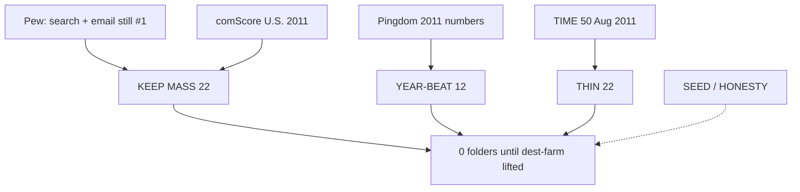

# 2011 leftover 3× — new unique websites · full research

**Date:** 2026-09-09  
**Status:** First board **27 boarded** (2026-09-09). Leftover **2×** stamped on those dests **2026-09-10** (two leftover writers · never `itt11-gplus`). Dest-farm lifted **only** for the named first-board 27 below. Not new verbs on dests already leftover-3×.  
**Do not dest-farm** beyond those 27. Official 10 / guided 6 / star / leftover-official 313 stay frozen.  
**Star** `itt11-gplus` never leftover. Official 10 / guided 6 frozen. ILS June **346,004,403** · Pingdom Dec **555 million** — label, do not blend.  
**Pew May 2011:** search 92% / email 92% still beat social (65% of online adults). Desktop Win7 + IE 9 is the mass session. Smartphone ownership 35% of U.S. adults (Pew 11 Jul 2011).

This replaces the short 27-name list. Every year-true website below is **not** already a leftover-3× dest on the live 18+18+18 strips.

---

## Method

Opened, then ranked:

- [Pingdom Internet 2011 in numbers](https://www.pingdom.com/blog/internet-2011-in-numbers/) (17 Jan 2012)
- [Pingdom 29 social nets ≥1M/day](https://www.pingdom.com/blog/social-networks-one-million-visitors-per-day/) (25 Mar 2011)
- [Pingdom blog hosts 2011](https://www.pingdom.com/blog/the-most-reliable-and-unreliable-blogging-services-of-2011/)
- comScore Media Metrix U.S. top 50: [Jan](https://adtechdaily.com/2011/03/01/comscore-media-metrix-ranks-top-50-us-web-properties-for-january-2011/) · [May](https://www.comscore.com/content/download/8947/file/Comscore%20Media%20Metrix%20Ranks%20Top%2050%20U.S.%20Web%20Properties%20for%20May%202011.pdf) · [Oct](https://biz-file.com/f/1111/comScore-Media-Metrix-Ranks-Top-50-US-Web-Properties-October-2011.pdf) · [Dec wrap](https://clickz.com/top-20-u-s-web-properties-google-surges-past-yahoo/46861/)
- TIME 50 Best Websites 16 Aug 2011 ([list recap](https://stephenslighthouse.com/2011/08/24/time-magazine-list-of-the-50-best-websites-of-2011/))
- Pew [search + email Aug 2011](https://www.pewresearch.org/internet/2011/08/09/search-and-email-still-top-the-list-of-most-popular-online-activities/) · [SNS 65% Aug 2011](https://www.pewresearch.org/internet/2011/08/26/65-of-online-adults-use-social-networking-sites-2/) · [SNS platforms: FB 92% / MySpace 29% / LI 18% / Twitter 13%](https://www.pewresearch.org/internet/2011/06/16/part-2-who-are-social-networking-site-users/)
- Groupon IPO · Gowalla→Facebook · Color · Megaupload still-up
- Locked [`2011-RESEARCH.md`](2011-RESEARCH.md) timeline

**Keep** = U.S. mass habit or a 2011 year-beat. **Thin** = real 2011 object (TIME 50 / deal / radio / locker) not daily mass. **Seed / funeral** = 2011-true, not mass. **Honesty** = famous somewhere, not this museum’s U.S. desktop gold. **Drop** = wrong year or already leftover-3×.

---

## Already leftover-3× (do not re-add)

icloud pinterest linkedin android4 lion netflix dropbox chrome gmusic gmail google hotmail wiki snapchat whatsapp rdio amz chromebook · kindlefire minecraft twitch reddit steam skype github lastfm xbox kindle silk siri jobs maps safari ff ig nfx · spotify iphone facebook ipad airbnb instagram twitter qwikster youtube vita wp75 pp ps nintendo ubercab wallet roblox li

Star `googleplus` · game `playable` · honesty unlist figma notion teams discord zoom brave edge · wrong-year chips among fn tt slack patreon.

Hotmail is already a leftover-3× dest — **MSN / Live is the new portal dest**, not a second Hotmail.

---

## Wrong year (never a 2011 leftover dest)

Vine · Tinder · Medium · Google Drive · Outlook.com · UberX · Slack · Discord · Figma · Notion · TikTok · Instagram Android · Stories · Reels · Graph Search · iPhone 5 · Windows 8 · Apple Maps · Swarm · Venmo mass · Apple Pay · GPT / ChatGPT.

---

# 1. KEEP MASS — U.S. desktop 2011 (comScore / Pew)

comScore U.S. unique visitors. Yahoo was **#1 property Jan–May 2011** (~179–189M). Google Sites took #1 from June. Microsoft Sites (Bing + MSN + Live + Hotmail) sat #2/#3 all year (~174–180M). Facebook.com ~157–166M. AOL ~108–115M.

| # | Website | 2011 why | Unique leftover session | Trap | Opened |
|--:|---------|----------|-------------------------|------|--------|
| 1 | **Yahoo** | #1 U.S. property Jan–May 188.8M (May). Mail + news + search. | check leftover Yahoo Mail then homepage | Yahoo-as-1995-gold | comScore May / Dec 2011 |
| 2 | **Bing** | Microsoft search vs Google Instant. IE 9 year shell. | type leftover Bing query then not Instant | Google Instant as this | comScore Microsoft Sites |
| 3 | **MSN / Windows Live** | Live.com portal. Hotmail dest already exists. | open leftover MSN then Live | Outlook.com as 2011 / Hotmail-as-this | Pingdom Hotmail 360M · Microsoft Sites |
| 4 | **AOL** | #5 U.S. property ~108–115M. Portal leftover. | open leftover AOL then mail | AOL-as-1996-gold | comScore 2011 |
| 5 | **eBay** | #15 Oct 73.6M. PayPal still eBay-owned. | bid leftover auction then not Venmo | Venmo / PayPal dest as this | comScore Oct 2011 |
| 6 | **Craigslist** | #19 Oct 53.2M. Housing / jobs / for-sale habit. | post leftover for-sale then honesty | live post / live email | comScore Oct 2011 |
| 7 | **Apple.com** | #12 Oct 79.9M. Store + support. Not Siri dest. | open leftover Apple store then 4S honesty | Siri-on-4 / iPhone 5 | comScore Oct 2011 |
| 8 | **Ask** | Ask Network #7–9 ~90M. Search leftover. | type leftover Ask query then not Instant | Google as this | comScore 2011 |
| 9 | **ESPN** | #26 May 38.1M. Sports web habit. | open leftover scoreboard then honesty | live stream gold | comScore May 2011 |
| 10 | **CNN / Turner** | Turner Digital #6 May 102.5M. News habit. | read leftover CNN then honesty | 24h cable as this dest | comScore May 2011 |
| 11 | **NYTimes** | NYT Digital #14 Oct 79.2M. Paywall year. | open leftover article then paywall honesty | live subscribe | comScore Oct 2011 |
| 12 | **Weather.com** | Weather Channel #17 Oct 58.5M. | check leftover forecast then honesty | Apple Weather as 2011 | comScore Oct 2011 |
| 13 | **Walmart.com** | #29 May 33.6M. Mass retail vs Amazon dest. | add leftover aisle then not Amazon dest | Amazon-as-this | comScore May 2011 |
| 14 | **WordPress.com** | Pingdom **70M blogs**. comScore #36 May 30.0M. | publish leftover WP.com post | Blogger as this | Pingdom 2011 in numbers |
| 15 | **Blogger** | Pingdom 2011 most reliable blog host. | publish leftover Blogger post | WordPress as this | Pingdom blog hosts 2011 |
| 16 | **Tumblr** | Pingdom **39M blogs**. 11M → 37M+ in 2011. | reblog leftover then dashboard | 2013 Yahoo sale as this | Pingdom 2011 in numbers |
| 17 | **Flickr** | Pingdom social list. Photo locker vs IG iOS dest. | upload leftover Flickr then photostream | IG Android / Stories | Pingdom 29 social nets |
| 18 | **Yelp** | comScore #35 May 30.1M · entered top 50 Jan. | write leftover review then stars | Maps dest as this | comScore Jan / May 2011 |
| 19 | **Huffington Post** | Entered top 50 Jan #41. | read leftover HuffPost then honesty | live comment gold | comScore Jan 2011 |
| 20 | **WebMD** | #39 Oct 28.5M. | look leftover symptom then honesty | live diagnosis | comScore Oct 2011 |
| 21 | **MySpace** | Pew SNS: 29% of SNS users. Pingdom #12 social daily. Fallen. | play leftover MySpace song then honesty | MySpace-as-2005-gold | Pew Jun 2011 · Pingdom Mar 2011 |
| 22 | **Adobe.com** | #31 May 32.6M. Flash / Reader still 2011 web. | download leftover Reader then Flash honesty | Flash-as-gold dest | comScore May 2011 |

---

# 2. KEEP YEAR-BEAT — 2011 event

| # | Website | 2011 why | Unique leftover session | Trap | Opened |
|--:|---------|----------|-------------------------|------|--------|
| 23 | **Groupon** | IPO **4 Nov**. Priced **$20**. Close **$26.11** (+31%). $700M raise. | buy leftover deal then GRPN honesty | Groupon-as-gold dest / live buy | [Groupon IPO pricing](https://investor.groupon.com/press-releases/press-release-details/2011/Groupon-Announces-Pricing-of-Initial-Public-Offering) · [CNN 4 Nov](https://web.archive.org/web/20111107013548/http://money.cnn.com/2011/11/04/technology/groupon_IPO/index.htm) |
| 24 | **LivingSocial** | #2 daily deal vs Groupon. | buy leftover LivingSocial deal | Groupon IPO as this | 2011 deal war |
| 25 | **Gowalla** | Facebook buys team **2–5 Dec**. Service winds down **end Jan 2012**. Lost to Foursquare. | stamp leftover passport then sale honesty | Foursquare as this / live check-in | [CNN 2 Dec](https://web.archive.org/web/20201112012921/https://money.cnn.com/2011/12/02/technology/gowalla_facebook/index.htm) · [NYT 5 Dec](https://archive.nytimes.com/bits.blogs.nytimes.com/2011/12/05/facebook-acquires-gowalla-a-location-based-social-service/) |
| 26 | **Color** | Color Labs launch **Mar 2011**. Famous $41M flop. | open leftover Color then flop honesty | Instagram as this | Mar 2011 Color |
| 27 | **Google Buzz** | Google **kills Buzz** (wind-down 2011). Not G+ star. | open leftover Buzz then shutdown honesty | G+ won / G+ as this | 2011 Buzz funeral |
| 28 | **MobileMe** | Funeral into iCloud 12 Oct. iCloud dest already leftover-3×. | close leftover MobileMe then iCloud honesty | iCloud Photo Stream as this | Apple iCloud 4 Oct / 12 Oct |
| 29 | **HP TouchPad** | webOS tablet. **Fire sale Aug 2011** then kill. | see leftover $99 TouchPad then funeral | iPad 2 as this | Aug 2011 fire sale |
| 30 | **Zynga / CityVille** | FarmVille leftover peak was 2010. CityVille 2010–11. **Zynga IPO 16 Dec 2011**. | plant leftover CityVille then IPO honesty | FarmVille-as-2010-gold dest | Zynga IPO Dec 2011 |
| 31 | **Turntable.fm** | TIME 50. DJ rooms 2011. | take leftover DJ booth then room | Spotify-US-as-this | TIME 50 Best 2011 |
| 32 | **Google Reader** | Still the RSS habit. Kill is **2013**. | share leftover item then star | 2013 shutdown as 2011 gold | 2011 reader mass |
| 33 | **Megaupload** | Locker still up all of 2011. Raid **19 Jan 2012**. | fetch leftover file then not 2012 raid | 2012 raid as 2011 default | 2011 locker |
| 34 | **Angie’s List** | IPO **17 Nov 2011** (after Groupon). Local reviews. | search leftover pro then honesty | Yelp as this | Nov 2011 IPO |

---

# 3. THIN KEEP — real 2011, not daily mass

TIME 50 (16 Aug) + 2011 product leftover. Not dest-farm from the whole 50.

| # | Website | 2011 why | Unique leftover session | Trap | Opened |
|--:|---------|----------|-------------------------|------|--------|
| 35 | **Hulu** | Legal U.S. stream leftover vs Netflix Instant Queue dest. | play leftover Hulu then ads | Instant Queue as this | 2011 Watch Instantly rival |
| 36 | **Pandora** | U.S. radio. Thumbs. Not Spotify official. | thumb leftover station then not Spotify | Spotify-US-as-this | 2011 U.S. radio |
| 37 | **Foursquare** | Check-in + mayorship. Gowalla dies. | check in leftover then mayorship | Swarm 2014 / UberX | 2011 location |
| 38 | **Quora** | TIME 50. Q&A leftover. | ask leftover then follow topic | 2026 Quora as this | TIME 50 |
| 39 | **Kickstarter** | TIME 50. Crowdfund. | back leftover project then pledge theater | live pledge | TIME 50 |
| 40 | **Evernote** | TIME 50. Clip + sync. | clip leftover note then sync theater | Notion-as-2011 | TIME 50 |
| 41 | **Etsy** | Handmade marketplace. | list leftover shop item | eBay as this | 2011 craft web |
| 42 | **Imgur** | Image host under Reddit dest. | upload leftover image then link | Reddit dest as this | 2011 meme pipe |
| 43 | **Vimeo** | Staff-pick video vs YouTube 48h/min dest. | watch leftover staff pick | YouTube upload-as-gold | 2011 video leftover |
| 44 | **Khan Academy** | TIME 50. Free lessons. | start leftover lesson then honesty | live course gold | TIME 50 |
| 45 | **DuckDuckGo** | TIME 50. Search leftover vs Google Instant dest. | type leftover DDG then not Instant | Google as this | TIME 50 |
| 46 | **Hipmunk** | TIME 50. Flight search. | search leftover flight then honesty | live book | TIME 50 |
| 47 | **Instapaper** | TIME 50. Read later. | save leftover article then later | Pocket as 2011 gold | TIME 50 |
| 48 | **8tracks** | TIME 50 #1. Human mix ≥8 songs. | play leftover mix then not Pandora | Pandora as this / Spotify-US | TIME 50 |
| 49 | **HBO GO** | TIME 50. Authenticate leftover. | sign leftover HBO GO then honesty | live stream / Netflix as this | TIME 50 |
| 50 | **Klout** | TIME 50. Score leftover. | check leftover Klout score then honesty | score-as-gold | TIME 50 |
| 51 | **Polyvore** | TIME 50. Fashion sets. | build leftover set then honesty | Pinterest dest as this | TIME 50 |
| 52 | **OnLive** | TIME 50. Cloud game stream 2011. | start leftover OnLive then honesty | Stadia / GeForce Now as 2011 | TIME 50 |
| 53 | **Join.me** | TIME 50. Screen share leftover. Not Zoom mass. | start leftover join.me then honesty | Zoom-as-2011 | TIME 50 |
| 54 | **Storify** | TIME 50. Curate tweets leftover. | build leftover story then honesty | 280 / X-brand | TIME 50 |
| 55 | **Grantland** | TIME 50. Bill Simmons 2011. | read leftover Grantland then honesty | live ESPN+ | TIME 50 |
| 56 | **Bleacher Report** | TIME 50. Fan sports blog. | read leftover B/R then honesty | ESPN dest as this | TIME 50 |

---

# 4. SEED / HONESTY — 2011-true, not U.S. mass leftover-3× first

Use only if dest-farm is lifted **and** a KEEP slot is refused. Do not put these on Starting Point as mass.

| Website | 2011 why | Session | Trap |
|---------|----------|---------|------|
| **Orkut** | Pingdom Mar: #2 social daily (Brazil / India) | open leftover scrap then honesty | Facebook-as-this / U.S. gold |
| **LiveJournal** | Pingdom social list. Early SNS. Now RU-based | post leftover LJ then honesty | Tumblr as this |
| **Hi5 / Tagged** | Pingdom social list. Spam-invite leftover | open leftover Hi5 then honesty | Facebook-as-this |
| **Digg** | Post-v4 leftover. Not 2005 gold | bury leftover then honesty | Reddit dest as this |
| **StumbleUpon** | Discover leftover | stumble leftover then honesty | Pinterest dest as this |
| **Delicious** | Yahoo bookmark leftover | save leftover tag then honesty | 2011 Yahoo dest as this |
| **Formspring** | 2010–11 Q&A leftover | answer leftover then honesty | 2012 kill as 2011 gold |
| **Kik** | Teen IM leftover | send leftover Kik then honesty | WhatsApp dest as this / Install 2014 |
| **Grooveshark** | Stream leftover. Lawsuits. | play leftover Grooveshark then honesty | Spotify-US-as-this |
| **Justin.tv** | Parent of Twitch dest. General live | watch leftover Justin.tv then Twitch honesty | Twitch dest as this |
| **Ustream** | Live leftover | watch leftover Ustream then honesty | Twitch dest as this |
| **iGoogle** | Custom homepage leftover | add leftover gadget then honesty | Google Instant dest as this |
| **SkyDrive** | Microsoft locker. Not Drive 2012 | upload leftover SkyDrive then honesty | Drive-as-2011 / Dropbox dest |
| **Box** | Enterprise locker leftover | upload leftover Box then honesty | Dropbox dest as this |
| **Path** | Intimate SNS 2010–12 | add leftover Path friend then honesty | Facebook dest as this |
| **Waze** | 2011 growing. Google buy is 2013 | report leftover jam then honesty | Apple Maps / Maps dest as this |
| **OpenTable** | Reserve leftover | book leftover table then honesty | live reservation |
| **4chan** | Imageboard leftover | open leftover board then honesty | live post |
| **Stack Overflow** | Dev Q&A leftover | ask leftover then honesty | GitHub dest as this |
| **Nook** | BN tablet leftover vs Kindle Fire dest | open leftover Nook then $199 Fire honesty | Fire dest as this |
| **MapQuest** | Maps leftover vs Google Maps dest | search leftover MapQuest then honesty | Maps dest as this |
| **OkCupid / Match** | Dating leftover | open leftover profile then honesty | Tinder-as-2011 |
| **Chatroulette** | 2010 leftover still 2011 | next leftover then honesty | live cam |
| **Posterous / Typepad** | Pingdom blog-host survey | publish leftover then honesty | Tumblr / WP as this |
| **Qzone / Renren / vKontakte / Mixi** | Pingdom social — not U.S. desktop gold | honesty chip only | U.S. mass 3× |

---

# 5. Dest minutes (KEEP + YEAR-BEAT)

Shared leftover-3× minute if ever boarded:

1. New dest folder **only** after dest-farm is lifted by name.  
2. Land `[failed-final]` or harvested `id_`. `data-itt-year="2011"`.  
3. Empty / trap / 0 ticks → nothing. Never `itt11-gplus`.  
4. Unique session above → leftover-3× key only.  
5. Next = next KEEP in §1 then §2. HTTP 200.  
6. Official 10 / guided 6 / star / dests-already-on-disk leftover-3× **unchanged**.

---

# 6. Counts

| Band | n | Folders on disk today |
|------|--:|----------------------:|
| Already leftover-3× dests | 54 | 54 (plus chips) |
| KEEP MASS new | 22 | first-board subset on disk |
| KEEP YEAR-BEAT new | 12 | first-board subset on disk |
| THIN KEEP new | 22 | first-board subset on disk |
| SEED / HONESTY | listed | **0** (not U.S. mass first) |
| First board 27 | 27 | **27** (`yahoo` … `huffpost`) |

First board **27 is on disk**. Do not dest-farm the rest of KEEP MASS + YEAR-BEAT (34) or the TIME 50 unless a later wave is lifted by name. Not Orkut-as-U.S.-gold. Not 1,388 Wikipedia names.

Suggested first board (27) — **boarded**:

yahoo bing msn aol ebay craigslist apple ask espn tumblr flickr yelp groupon livingsocial gowalla color reader megaupload hulu pandora foursquare quora kickstarter evernote imgur vimeo huffpost

Second board if a later wave: wordpress blogger nyt cnn weather walmart webmd myspace adobe buzz mobileme touchpad zynga turntable angie khan ddg hipmunk instapaper 8tracks hbogo klout polyvore onlive joinme storify grantland.

---

# 7. Sources opened this pass

- Pingdom Internet 2011 in numbers — 555M sites · +300M · 2.1B users · Facebook 800M+ · Twitter 225M / 100M active / 250M tweets/day / **#egypt** · Tumblr **39M** · WordPress **70M** · Hotmail **360M** · WhatsApp 1B msgs Oct  
- Pingdom 29 social nets 25 Mar 2011 — Facebook · **Orkut #2 daily** · Twitter · LinkedIn · Flickr · **MySpace #12** · Friendster off the list  
- Pingdom blog hosts 2011 — Blogger most reliable · WP.com · Typepad · Posterous · Tumblr 11M→37M+  
- comScore U.S. 2011 — Yahoo #1 Jan–May · Google #1 from June · Microsoft Sites #2/#3 · AOL · Amazon · Ask · eBay · craigslist · Apple · ESPN · Turner · NYT · Weather · Yelp · WordPress · LinkedIn · Twitter.com · MySpace · HuffPost enters Jan · Netflix.com property (Netflix dest already leftover-3×)  
- Pew Aug 2011 search+email 92% · SNS 65% of online adults · daily: email 61 · search 59 · SNS 43  
- Pew Jun 2011 SNS mix: Facebook 92% · MySpace 29% · LinkedIn 18% · Twitter 13%  
- Pew Jul 2011 smartphone 35% of U.S. adults  
- TIME 50 Best Websites 16 Aug 2011 — 8tracks · HBO GO · Turntable.fm · Pinterest (already leftover-3×) · Quora · Kickstarter · Evernote · Airbnb (official dest) · Google+ (star) · DuckDuckGo · Hipmunk · Instapaper · Khan Academy · Klout · OnLive · Polyvore · Grantland · Bleacher Report  
- Groupon IPO 3–4 Nov 2011 $20 → $26.11  
- Gowalla → Facebook 2–5 Dec 2011 · wind-down end Jan 2012  
- ILS June 346,004,403  

---

## Do not

- Dest-farm beyond the named first-board 27.  
- Restore the deleted unique-verb pack.  
- Official 20 / guided 12 / second star / leftover 4×.  
- Board Orkut / Qzone / vKontakte as U.S. mass 3×.  
- Board Vine / Drive / Outlook.com / UberX / Stories.  
- Re-add Facebook YouTube Google Gmail Twitter Wikipedia Amazon Netflix Spotify Instagram etc.  
- Unboard 2021–2025.  
- Commit unless asked.
