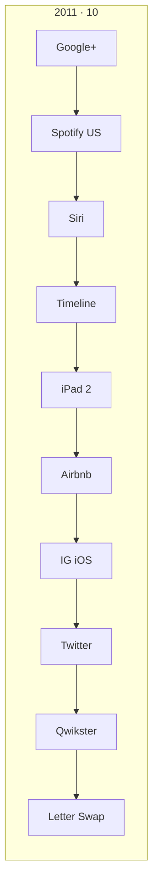
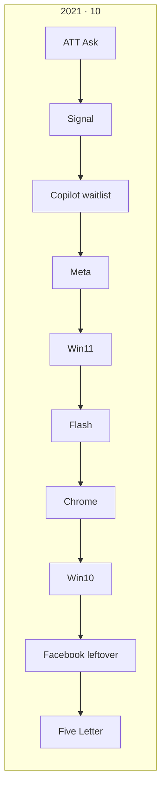
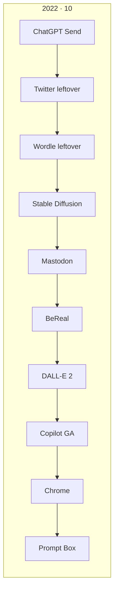
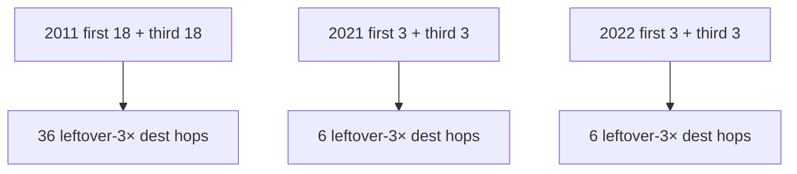

# 2011 vs 2021 vs 2022 — flow count (disk)

**Date:** 2026-09-10  
**Law:** official **10** + guided **6** + leftover **2×** (two writers) on every dest. Leftover-4× **0**.  
**2011** is a **dense** lean door. **2021 / 2022** are dest freeze **15** lean doors (match 2020).  
**2×** = leftover writers, not dest folders.

Counted on disk. Not dest-farm.

---

## Locked bar (same for all three)

| Bar | 2011 | 2021 | 2022 |
|-----|-----:|-----:|-----:|
| Official 10 | 10 | 10 | 10 |
| Guided `<ol>` | 6 | 6 | 6 |
| Leftover 2× floor (dests × 2) | **196** | **30** | **30** |
| Leftover-4× | 0 | 0 | 0 |
| Gold dest on leftover-3× first | no | no | no |

---

## Density (disk)

| Count | 2011 | 2021 | 2022 |
|-------|-----:|-----:|-----:|
| Dest folders | **98** | **98** | **98** |
| HTML | **183** | **103** | **103** |
| Official dests with `data-official-key` | 10 | 10 | 10 |
| Dest-true verb-host | **0** | **10** | **10** |
| Leftover writers (`data-lo-save`) | **367** | **367** | **367** |
| Dests with ≥2 leftover writers | 98 / 98 | 15 / 15 | 15 / 15 |
| Leftover writers per dest | 2 / 4 / 6 / 8 · playable 59 | **2 / 4 / 6 / 8 · playable 59** | **2 / 4 / 6 / 8 · playable 59** |
| Leftover-3× first dests | **18** | **3** | **3** |
| Leftover-3× third dests | **18** | **3** | **3** |
| `2x-links.matrix.json` rows | **313** | **0** | **0** |
| start-extra warehouse | yes | no (all dests already on strips) | no |
| Extra-game dests | 14 listed | 0 | 0 |

2011 leftover writers 367 − 196 floor = **171 extra leftover machines** on dest pages (not dest freeze). Playable cabinet alone is 59 writers / 22 HTML.

---

## Official 10 (different dests · same count)

---

## Leftover-3× (this is the density gap)

**2011 first 18:** iCloud · Pinterest · LinkedIn · Android 4 · Lion · Netflix · Dropbox · Chrome · Google Music · Yahoo · Bing · MSN · AOL · eBay · Craigslist · Apple · Ask · ESPN  

**2011 third 18:** Spotify · iPhone · Facebook · iPad · Airbnb · Instagram · Twitter · Qwikster · YouTube · Hulu · Pandora · Foursquare · Quora · Kickstarter · Evernote · Imgur · Vimeo · HuffPost  

**2021 first 3:** YouTube · Wikipedia · Facebook · **third 3:** Clubhouse · NFT · Squid  

**2022 first 3:** YouTube · Wikipedia · Twitter · **third 3:** Facebook · FTX · Luna  

---

## Visitor walk totals (how many completes)

If a visitor does **every leftover writer + official 10 + guided 6**:

| Walk | 2011 | 2021 | 2022 |
|------|-----:|-----:|-----:|
| Official completes | 10 | 10 | 10 |
| Guided steps | 6 | 6 | 6 |
| Leftover writer completes | **367** | **30** | **30** |
| Leftover-3× dest hops | **36** | **6** | **6** |
| **Listed leftover-2× matrix rows** | **313** | 0 (writers live on dests, not matrix) | 0 |

2021 / 2022 leftover 2× is **on the dest HTML**, not `2x-links.matrix.json`. Same leftover-2× law. Different listing surface.

---

## What this is not

- 2011 dest freeze 15. 2011 is the dense lean door (98 dests). 2021 / 2022 match **2020** dest freeze 15.
- Dest-true verb-host: **2021 / 2022 have it on official 10**. 2011 official dests have `data-official-key` and write official, but **no** `data-official-verb-host` (older dest face).
- Do not dest-farm 2021 / 2022 up to 98 dests to “match 2011.”
- Do not dest-farm leftover-4×.

## One line

**Official 10 and guided 6 are the same count. 2011 has ~6.5× dests, ~12× leftover writers, and leftover-3× 18+18 instead of 3+3. 2021 and 2022 match each other (15 dests · 30 leftover writers · leftover-3× 3+3).**
