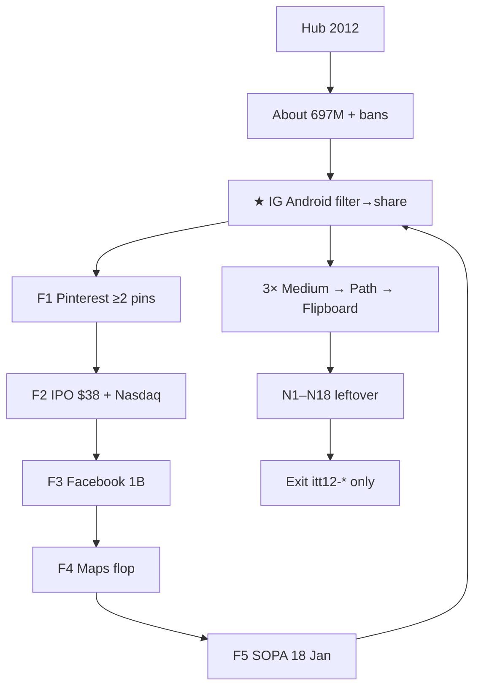

# 2012 — from scratch · goals · phases · minute steps · every flow

**Date:** 2026-08-19  
**Status:** Lean door on disk (2026-08-19). Hub unlocked. **`years/2012/`** · star `itt12-ig-android` · leftover pack.  
**Read first:** [`2012-READ-FIRST.md`](2012-READ-FIRST.md).  
**Do not restore** `/tmp` clones or the deleted 2012 forest.  
**Git only if asked.** Incomplete never writes. Prefix **`itt12-*`**. Never invent brand pixels.

This file is the **only** 2012 implement queue. Same **flow budget** as a finished year after the 1994–2000 leftover pack.

---

## 0. Flow budget (same number as other years)

A finished year on this museum is **not** “every Wikipedia 2012 row.” It is this pack:

| Layer | Count | What it is |
|-------|------:|------------|
| Guided home `<ol>` | **6** | Destinations. Not a 7th step. |
| ★ Star | **1** | The year object. Chip on home. |
| 5× leftover F1–F5 | **5** | REAL writers. Next-chain to the star. |
| 3× popular | **3** | Medium · Path · Flipboard |
| 4× leftover N1–N18 | **18** | Second paths on rooms you already built |
| Thesis ack | **1** | About page, 2 checks |
| Year game | **1** | Guess Doodle class · no Zynga art |
| **Writer sessions** | **29** | 1+5+3+18+1+1 |
| **Unique rooms** | **~28 slugs** | Lean. Not 115. Not 286 wiki misses. |

Guided six **are** star + five F dests (or star + F + one 3×). They do **not** add six extra keys.

```
Hub → 2012 → Win7 + IE9 residual
  → About · 697,089,489 June · bans
  → ★ Instagram Android · filter → share → itt12-ig-android
  → F1 Pinterest pin → F2 IPO $38 → F3 1B → F4 Maps flop → F5 SOPA → ★
  → 3× Medium draft · Path moment · Flipboard flip
  → 18 leftover on those rooms + SoundCloud, Tinder, UberX, Win8, Chrome, AMA…
  → Exit · itt12-* only
```

---

## 1. Thesis (locked)

**2012 is the year the square photo leaves the iPhone, Facebook buys the camera and goes public, Wikipedia goes black for a day, Chrome passes Internet Explorer, and the Start button dies.**

One-line for About:

> Instagram ships on Android (3 Apr, 1M downloads in a day). Facebook announces the $1B buy (9 Apr) and IPOs at $38 (18 May). Wikipedia blacks out SOPA/PIPA (18 Jan). Chrome is #1 worldwide for a full month (May). Windows 8 ships (26 Oct). Tinder launches (12 Sep). Gangnam Style is the first YouTube clip to 1B views (21 Dec). Desktop is still a **Windows 7 / IE 9** laptop for most of the year — Win8 is a **product room**.

### Scale (dual-cite · never blend unlabeled)

| Fact | Value | Source |
|------|------:|--------|
| Websites June | **697,089,489** (**+101%** vs 2011 June 346M) | [Internet Live Stats](https://www.internetlivestats.com/total-number-of-websites/) |
| Users June | **2,518,453,530** | same table |
| Users per site June | **3.6** | same |
| Hosts later in 2012 | Netcraft drop after ~40M junk hostnames removed (Aug) | ILS / USPTO note — **do not** “correct” June 697M |
| Facebook MAU | **1 billion** announced **4 Oct 2012** | BBC / Facebook |
| IG at Android launch | ~**30M** users · **1M** Android downloads day one | Instagram / Reuters |
| Chrome vs IE | Chrome **32.43%** vs IE **32.12%** **May 2012** full month | StatCounter / TNW 1 Jun 2012 |
| Storage | `itt12` | project |
| Shell default | **Win7 + IE 9** | Win8 is Oct · not January chrome |

About prints **697,089,489** *and* the Chrome-over-IE May fact, each labeled.

---

## 2. Locked timeline (copy + build)

| Date | Event | Exhibit |
|------|-------|---------|
| **18 Jan 2012** | SOPA/PIPA blackout · Wikipedia + others go dark 24h | `sites/wikipedia/sopa.html` · F5 |
| **6 Feb 2012** | Draw Something launches | playable leftover · not Zynga art |
| **11 Mar 2012** | Gowalla shuts down | funeral chip (corpus: Mashable) |
| **21 Mar 2012** | Zynga / OMGPOP Draw Something class deal | playable honesty |
| **3 Apr 2012** | **Instagram Android** · 1M downloads < 24h | **★ star** |
| **9 Apr 2012** | Facebook announces Instagram **$1B** | IG honesty + IPO trail |
| **5 Apr 2012** | Google **Project Glass** unveiled | chip only · not a room |
| **18 May 2012** | Facebook IPO **$38** · Nasdaq delay lore | `sites/facebook/ipo.html` · F2 |
| **May 2012** | Chrome #1 worldwide full month | `sites/chrome/` leftover |
| **6 Sep 2012** | IG deal **closes** ($300M cash + 23M shares) | IG honesty · not a second star |
| **12 Sep 2012** | **Tinder** launches | leftover swipe · not 2013 star |
| **12 Sep 2012** | iPhone 5 / iOS 6 announced | `sites/iphone/` |
| **19–21 Sep 2012** | iPhone 5 ships · **Maps flop** (no transit, squished bridges) | `sites/iphone/maps.html` · F4 |
| **4 Oct 2012** | Facebook **1 billion** MAU | `sites/facebook/index.html` · F3 |
| **26 Oct 2012** | **Windows 8** + Surface RT | `sites/windows8/` · leftover |
| **29 Aug 2012** | Obama **AMA** on Reddit (site strain) | `sites/reddit/ama.html` |
| **21 Dec 2012** | Gangnam Style first YT video to **1B** views | `sites/youtube/` leftover |
| **Nov 2012** | IG limited **desktop** web | IG honesty · not Stories |

**2013+ never default:** Vine 6s (Jan 2013) · Snap Stories (Oct 2013) · iOS 7 flat · WhatsApp-as-star · Material.

---

## 3. Why the last 2012 died (do not repeat)

| Old object | Why mock |
|------------|----------|
| Lean door + dest-field plaques | Checkbox “I read the 2012 note” wrote REAL keys |
| SoundCloud as one-thing | Historical row. SoundCloud is a **leftover**, not the year object |
| IE5 / XP chrome on a 2012 card | Costume lie |
| 115-room / 286-wiki forest | Wikipedia-established-in-2012 ≠ a session |
| 5,000 dest homes | Opening every WDM/wiki card is how leftover became theater |

**Rebuild rule:** every listed flow is a **verb** (filter, pin, bid-literacy, blackout, swipe, flip). Incomplete never writes.

---

## 4. Harvest stack (the “5k” — honest)

A single pass cannot GET 5,000 unique 2012 product homepages. This project already locked that for 2014/2015. **Stacked unique URLs**, not 5,000 live dest clicks.

| Stack | Count / what | Use |
|-------|--------------|-----|
| Corpus `docs/references/5x-improve-corpus-1994-2013-urls.txt` | **141,509** lines · **5,873** mention `2012` · **974** hosts | Newsroom + WA calendars. Top hosts: archive.org, TechCrunch, Verge, Engadget, IGN, Forbes, Guardian, NYT, Mashable, Instagram blog, AllThingsD, Apple, Bloomberg, SEC |
| Wikipedia internet-properties harvest | **286** titles classed 2012 | Candidate **names**, not rooms |
| Prior 10k harvest | **285** harvested · **21** old disk-hit · **264** “missing” | Missing ≠ build |
| WDM `/gallery/year-2012` first page | **18** exhibits (page/2+ **403**) | Costume only: NBC, Netflix, Skype, Time, Yelp, Newgrounds, YouTube, Pirate Bay, Roblox, GameSpot, McDonald’s, Windows Phone, iPhone 5, IGN, Bieber YT, CS, Tumblr, SLAC, PSY YT, Instagram |
| Version Museum kits | Facebook 33 · YouTube 39 · Google Search 41 · IE 54 · Windows 88 · iOS 27 | Stills with `id_` or **failed-final** |
| Official | Apple Newsroom iPhone 5 · Facebook IPO S-1 / newsroom · Instagram blog Apr 2012 · Wikimedia SOPA · StatCounter May 2012 · Microsoft Win8 | Dates + copy |
| ILS | June **697,089,489** | About only |

**WDM cards that are NOT 2012 rooms:** McDonald’s · SLAC · Counter-Strike · Bieber channel · Pirate Bay as gold. Games wing already has Newgrounds / Roblox — **trail**, do not clone.

**Corpus signal (use as sources, not rooms):** Instagram blog (37) · Gowalla shutdown · ICANN new gTLD strings Jun 2012 · Bing “new Bing” May 2012 · Scott Guthrie Azure Jun 2012 · Megaupload/Mega Oct 2012.

---

## 5. Website data to implement (lean rooms)

Build **these slugs**. Continuity brands (Yahoo, Amazon, Gmail, Wikipedia main) are **chips**, not new machines.

| Slug | Why 2012 | Writer keys | Incomplete |
|------|----------|-------------|------------|
| `sites/instagram/android.html` | ★ Android 3 Apr | `itt12-ig-android` | no named filter |
| `sites/instagram/index.html` | iOS continuity + $1B honesty | (star lives on android.html) | — |
| `sites/pinterest/index.html` | Public / mass pin | `itt12-pin` F1 | 0–1 pin |
| `sites/facebook/ipo.html` | $38 · 18 May · Nasdaq delay | `itt12-fb-ipo` F2 | 0–1 check |
| `sites/facebook/index.html` | 1B MAU 4 Oct | `itt12-facebook` F3 | skip 1B ack |
| `sites/iphone/maps.html` | iOS 6 Maps flop | `itt12-maps` F4 | 0–1 check |
| `sites/wikipedia/sopa.html` | 18 Jan blackout | `itt12-sopa` F5 | skip blackout |
| `sites/medium/index.html` | Ev Williams draft | `itt12-pop-medium` 3× | empty draft |
| `sites/path/index.html` | 50-friend moment | `itt12-pop-path` 3× | empty moment |
| `sites/flipboard/index.html` | Magazine flip | `itt12-pop-flipboard` 3× | 0 flips |
| `sites/soundcloud/index.html` | Timed comment leftover | `itt12-soundcloud` N1 | no play / no comment |
| `sites/twitter/index.html` | Still **140** | `itt12-tweets` N2 | empty tweet |
| `sites/youtube/index.html` | Gangnam 1B 21 Dec | `itt12-yt` N3 | no play ack |
| `sites/tinder/index.html` | Swipe seed 12 Sep | `itt12-tinder` N4 | 0 swipes |
| `sites/uber/index.html` | UberX leftover | `itt12-uberx` N5 | no city / not SF-class honesty |
| `sites/windows8/index.html` | Start is gone | `itt12-win8` N6 | 0–1 check |
| `sites/iphone/index.html` | iPhone 5 · Lightning | `itt12-iphone5` N7 | 0–1 check |
| `sites/chrome/index.html` | Chrome > IE May | `itt12-chrome` N8 | 0–1 check |
| `sites/reddit/ama.html` | Obama AMA 6 Nov | `itt12-ama` N9 | empty question |
| `sites/waze/index.html` | Social GPS leftover | `itt12-waze` N10 | no dest |
| `sites/trello/index.html` | Board leftover | `itt12-trello` N11 | no card |
| `sites/tumblr/index.html` | Dashboard leftover | `itt12-tumblr` N12 | empty post |
| `sites/play/index.html` | Play store / Nexus class | `itt12-play` N13 | skip honesty |
| `sites/playable/game.html` | Guess Doodle | `itt12-game-guessdoodle` N14 | no start |
| `sites/lyft/index.html` | 2012 seed (Zimride → Lyft) | `itt12-lyft` N15 | skip seed ack |
| `sites/buzzfeed/index.html` | Listicle leftover | `itt12-buzzfeed` N16 | no quiz/list |
| `sites/snapchat/index.html` | Snaps **not** Stories | `itt12-snap` N17 | no snap |
| `sites/googleplus/index.html` | 2011 star residual | `itt12-gplus` N18 | 0–1 check |
| `pages/about.html` | Dual-cite + bans | `itt12-thesis-ack` | 0–1 check |
| `pages/home.html` `map.html` `whats-new.html` | Door | — | — |

**Pixels (after rooms exist):** `assets/period/2012/{instagram,facebook,pinterest,iphone,windows8,chrome,youtube,medium,path,flipboard}/` · WA `id_` or **[failed-final]** CSS wordmark. Continuity: 2011 IG iOS stills only if dated.

---

## 6. Every flow (minute)

### Guided 6 (home `<ol>` — dests, not extra keys)

1. About 2012 (bans + 697M)  
2. ★ Instagram Android  
3. Facebook IPO  
4. SOPA blackout  
5. iPhone Maps flop  
6. Pinterest  

Atlas chips sit **under** the six, never as a 7th `<li>`.

### ★ Star — Instagram Android · `itt12-ig-android`

**Do:** pick a **named 2012 filter** (X-Pro II / Lo-Fi / Earlybird **as labels**, RECON UI) → optional caption → Share.  
**Incomplete:** Share with no filter.  
**Writes:** `{ filter, caption?, platform:"android", real, multiStep, year:"2012" }`.  
**Honesty:** 3 Apr · 1M day-one · $1B announced 9 Apr · deal closes 6 Sep · **not** Stories · desktop web is Nov limited.  
**Next:** Pinterest (F1) or IPO.  
**e2e:** empty share blocked · filter+share writes · no `itt11` / `itt13`.

### F1–F5 (5× leftover · Next toward star)

| ID | Session | File | Key | Incomplete | Next |
|----|---------|------|-----|------------|------|
| F1 | Pinterest ≥2 pins | `pinterest/index.html` | `itt12-pin` | 0–1 pin | IPO |
| F2 | Facebook IPO literacy | `facebook/ipo.html` | `itt12-fb-ipo` | 0–1 ($38 **and** Nasdaq delay) | 1B |
| F3 | Facebook 1B | `facebook/index.html` | `itt12-facebook` | skip 4 Oct | Maps |
| F4 | iOS Maps flop | `iphone/maps.html` | `itt12-maps` | 0–1 | SOPA |
| F5 | SOPA 18 Jan | `wikipedia/sopa.html` | `itt12-sopa` | skip blackout | ★ Android |

### 3× popular

| ID | Session | File | Key | Incomplete | Next |
|----|---------|------|-----|------------|------|
| 3×A | Medium draft | `medium/index.html` | `itt12-pop-medium` | empty title/body | Path |
| 3×B | Path moment | `path/index.html` | `itt12-pop-path` | empty | Flipboard |
| 3×C | Flipboard flip ≥2 sections | `flipboard/index.html` | `itt12-pop-flipboard` | 0–1 flip | ★ |

### 4× leftover N1–N18 (same count as 1994–2000)

| ID | Session | File | Key | Incomplete | Next |
|----|---------|------|-----|------------|------|
| N1 | SoundCloud timed comment | `soundcloud/` | `itt12-soundcloud` | no play + comment | Twitter |
| N2 | Twitter 140 | `twitter/` | `itt12-tweets` | empty / >140 | YouTube |
| N3 | YouTube Gangnam 1B | `youtube/` | `itt12-yt` | skip play | Tinder |
| N4 | Tinder swipe ≥2 | `tinder/` | `itt12-tinder` | 0 swipe | UberX |
| N5 | UberX leftover | `uber/` | `itt12-uberx` | empty / 2010 SF-only lie | Win8 |
| N6 | Win8 Start-is-gone | `windows8/` | `itt12-win8` | 0–1 | iPhone 5 |
| N7 | iPhone 5 Lightning | `iphone/` | `itt12-iphone5` | 0–1 | Chrome |
| N8 | Chrome > IE May | `chrome/` | `itt12-chrome` | 0–1 | AMA |
| N9 | Obama AMA | `reddit/ama.html` | `itt12-ama` | empty q | Waze |
| N10 | Waze dest | `waze/` | `itt12-waze` | empty | Trello |
| N11 | Trello card | `trello/` | `itt12-trello` | empty | Tumblr |
| N12 | Tumblr post | `tumblr/` | `itt12-tumblr` | empty | Play |
| N13 | Play / Nexus literacy | `play/` | `itt12-play` | skip | Guess Doodle |
| N14 | Guess Doodle start | `playable/game.html` | `itt12-game-guessdoodle` | no start | Lyft |
| N15 | Lyft seed | `lyft/` | `itt12-lyft` | skip | BuzzFeed |
| N16 | BuzzFeed list | `buzzfeed/` | `itt12-buzzfeed` | skip | Snap |
| N17 | Snapchat **snap** (not Story) | `snapchat/` | `itt12-snap` | no send | G+ residual |
| N18 | G+ leftover (2011 keeps star) | `googleplus/` | `itt12-gplus` | 0–1 | home |

### Thesis · `itt12-thesis-ack`

Two checks on About: (1) IG Android + IPO + SOPA + Chrome>IE are 2012; (2) no Vine / Stories / WhatsApp-star. 0–1 never writes.

---

## 7. Phases (implement in this order)

### P0 — Freeze · ROI 10 · do not code

1. Recite star, F1–F5, 3×, June **697,089,489**, bans.  
2. Confirm `years/2012/` **absent**.  
3. Confirm 2011 disk still iOS-only IG and bans Android.  
4. Stop. Wait for **implement 2012**.

### P1 — Year door · ROI 10

1. Clone **structure** from `years/2011/` (index, pages, error). Retarget year string **2012**.  
2. `js/config/2012.js` · `js/browser-2012.js` · `js/immersion-2012.js` · `itt12`.  
3. `css/period-2012.css` (`@import` 2011 Aero). **Not** Metro as default chrome.  
4. Hub card `available`. `SHIP_YEARS` includes 2012.  
5. About: dual-cite + timeline + bans.  
6. Home: `data-ott-one-thing="2012"` → `sites/instagram/android.html`. Guided **6**.  
7. Smoke: hub → 2012 → home.

**Done when:** card opens. Chip is Android IG. Shell is Win7/IE9.

### P2 — Star · ROI 10

1. `instagram/android.html` filter tray + share.  
2. Museum stills only.  
3. Share disabled until a named filter.  
4. Write `itt12-ig-android`.  
5. Honesty $1B / close date / not Stories.  
6. e2e incomplete / complete / isolation.

### P3 — F1–F5 · ROI 9

Build the five rooms in the table. Each: incomplete blocked · Next live · `data-5x-*` **or** native machine (IPO / SOPA / Maps can be checks; pin is product).  
Home `#ott-5x-2012` six chips (F1–F5 + star).

### P4 — 3× · ROI 9

Medium · Path · Flipboard. Keys `itt12-pop-*`. Empty never writes.

### P5 — P0 leftover machines · ROI 8

SoundCloud timed comment · Twitter 140 · YouTube Gangnam · Tinder swipe · UberX · Win8 · iPhone 5. These are N1–N7.

### P6 — Rest of N8–N18 · ROI 7

Chrome>IE · AMA · Waze · Trello · Tumblr · Play · Guess Doodle · Lyft · BuzzFeed · Snap · G+ residual.

### P7 — Continuity chips · ROI 5

Yahoo · Google · Amazon · Gmail · Netflix · Wikipedia **main** (not only SOPA). Label continuity. **No** new dest-field.

### P8 — Trails + map · ROI 8

`flow-maps.js` 2012 branches: ★ · 5× · 3× · 4× leftover.  
`flow-trails.js`: IG Android `whenKey` → Pinterest.  
`data-next-flow` after every writer.

### P9 — Pixels · ROI 4

WA `id_` queue. Failed-final if missing. Never redraw the IG camera or Facebook f from memory.

### P10 — e2e · ROI 9

```
e2e/2012-mvp.spec.js
e2e/2012-flows.spec.js
e2e/2012-5x-live.spec.js
e2e/2012-4x-flows.spec.js
e2e/one-thing-per-year.spec.js   # 2012 Android block
```

Also: About bans · guided 6 · no `itt11`/`itt13` · no dest-field.

### P11 — Hub + stamp · ROI 6

Unlock card. `DISK-TRUTH.md` HTML count. This file `[x]` only after P10 green.

---

## 8. Diagrams

```mermaid
flowchart LR
  N1[SoundCloud] --> N2[Twitter 140]
  N2 --> N3[YT Gangnam]
  N3 --> N4[Tinder]
  N4 --> N5[UberX]
  N5 --> N6[Win8]
  N6 --> N7[iPhone 5]
  N7 --> N8[Chrome]
  N8 --> N9[AMA]
  N9 --> N10[Waze]
  N10 --> N11[Trello]
  N11 --> N12[Tumblr]
  N12 --> N13[Play]
  N13 --> N14[Guess Doodle]
  N14 --> N15[Lyft]
  N15 --> N16[BuzzFeed]
  N16 --> N17[Snap]
  N17 --> N18[G+ leftover]
```





---

## 9. Hard bans (never 2012 default)

| Ban | Correct era |
|-----|-------------|
| Vine 6-second star | **2013** |
| Snap **Stories** 24h | **Oct 2013** |
| IG **Stories** | **2016** |
| WhatsApp as the year chip | **2014** |
| iPhone 6 / Pay / Bendgate | **2014** |
| Material Design | **2014** |
| Slack as default | **2014** |
| Periscope / Apple Music | **2015** |
| TikTok / musical.ly mass | **2016–18** |
| “Facebook already owned IG in 2011” | deal is **2012** |
| Dest-field “I read the 2012 note” | never |
| Metro shell as January default | Win8 ships **26 Oct** |
| Restore 115-room forest | never |

---

## 10. Definition of done

- [x] Hub 2012 opens · Win7 + IE9  
- [x] About: **697,089,489** + Chrome>IE May + bans  
- [x] Guided `<ol>` = **6** · chip = `instagram/android.html`  
- [x] Star: no filter never writes · filter+share writes `itt12-ig-android`  
- [x] F1–F5 write · Next live · chips 6  
- [x] 3× Medium / Path / Flipboard write  
- [x] 18 leftover keys write · empty blocked  
- [x] Thesis + Guess Doodle  
- [x] 0 dest-field · 0 `itt11`/`itt13` leak  
- [x] `npm run test:e2e:2012` + one-thing 2012 green

**Do not start P1 until you say implement 2012.**
