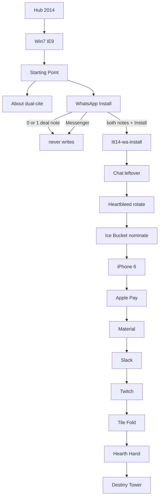

# 2014 — every flow · minute · e2e

**Date:** 2026-08-29  
**Door:** lean on disk · **75 HTML** · prefix **`itt14-*`** · shell **Win7 + IE 9**  
**This file:** every dest, every writer on that dest, trap / incomplete / complete, key, Next, and the e2e that proves it.  
**Read first:** [`2014-READ-FIRST.md`](2014-READ-FIRST.md)  
**Shorter dest index:** [`2014-IN-PLACE-DONE-GOALS-PHASES-FLOWS-MINUTE-E2E-2026-08-29.md`](2014-IN-PLACE-DONE-GOALS-PHASES-FLOWS-MINUTE-E2E-2026-08-29.md)

**Legal:** Educational `localStorage` only. Never invent brand pixels. No OpenSSL exploit. No Ice Bucket celebrity still. No Apple Pay PAN. No Slack bill.

**5k websites** = research envelope (ILS June **968,882,453**). **Not** dest count.

Serve:

```bash
python3 -m http.server 8080 --bind 127.0.0.1
```

Clear every `itt14-*` before a check walk. After a complete, only `itt14-*` may appear. **No `itt13-*`. No `itt15-*`.**

---

## One line

**2014 is when messaging becomes the mass internet — WhatsApp is the $19 billion install, TLS bleeds, and a summer video loop fills a charity.** Still a Win7 laptop.

Star = **WhatsApp Install** · Newsroom 19 Feb: **$4B cash + $12B stock = $16B** + **$3B RSU** = **$19B** · 450M MAU · independent brand · Messenger standalone · close 6 Oct.

---

## Locks

| Lock | Value |
|------|--------|
| Star / chip / trail n=1 | `sites/whatsapp/index.html` · `itt14-wa-install` |
| Guided `#ott-guided-2014 ol > li` | **exactly 6** |
| Official 10 | WhatsApp · Chat · Heartbleed · Ice Bucket · iPhone 6 · Pay · Material · Slack · Twitch · Tile Fold |
| First 3× | Snapchat · Instagram · Uber |
| 3×3 | YouTube · Wikipedia · Facebook |
| Year game | Tile Fold · `itt14-game-tilefold` |
| Full-more | Hearth Hand · Destiny Tower |
| 5× plaques | **none** |
| HTML | **75** · do not wipe · do not add dest folders |
| Neighbor years | `itt13-*` / `itt15-*` stay empty |

---

## How every writer class works

Four machines can sit on one dest. They **never share a key** (except leftover-official `lo-panel` on some official dests, which has its **own** key). Official period verb is the gold save. 4× is leftover.

### A. Official period verb (`js/immersion/year-2014-extras.js`)

Host: `html[data-official-key]` + period hooks (`data-wa14-*`, `data-hb14-*`, …).

| Rule | Meaning |
|------|---------|
| Trap | Named trap button. **Never writes.** |
| Incomplete | Empty · 0–1 honesty tick · 0–1 deal note · no pick. **Never writes.** |
| Complete | Every required tick / pick / note + the verb. Writes `{ real:true, year:"2014", multiStep:true, … }`. |
| Next | `[hidden][data-next-flow][data-next-when-key="KEY"]` unhides after that key exists. |

e2e: `e2e/2014-implemented-real.spec.js` + `e2e/2014-flows.spec.js`.

### B. Leftover-official panel (`[data-lo-panel]`)

Separate leftover machine on 8 official dests. Trap / 0 ticks / ticks-only / wrong pick / empty field never write. Complete writes `{ real:true, leftover:true, year:"2014" }` to the **lo** key (sometimes the same suffix as official, sometimes `-lx`).

e2e: `e2e/leftover-official.spec.js` + `e2e/leftover-official.matrix.json` rows `year:2014`.

### C. Popular leftover (`[data-pop-go]` / `[data-ytl]`)

Pick + honesty tick + field (when present) + Go. Empty / no pick never writes.

e2e: `e2e/popular-flows-all-years.spec.js` · `e2e/popular-3x-sites.spec.js` · year-true / pop strips on home.

### D. 4× leftover (`[data-4x-go]`)

`data-4x-min="2"`. Type **≥2** chars · Go. Empty / 1 char never writes. Key `itt14-<slug>`.

e2e: `e2e/2x-links-all-years.spec.js` (matrix rows) · leftover-official does **not** cover these.

Generic 4× minute (every dest that lists a `data-4x-go` below):

```
1. Open dest. DevTools → Application → Local Storage. Confirm key absent.
2. Click Go with empty field. Key still absent.
3. Type 1 character. Go. Key still absent.
4. Type 2+ characters (placeholder text is fine). Go.
5. Key itt14-<slug> = { real:true, year:"2014", … }.
6. Next unhides. No itt13-* / itt15-*.
```

### E. Full-more / cabinet game

Start · play engine · win writes `ittYY-game-<id>`. Trap never writes. Load never writes.

e2e: `e2e/year-full-more.spec.js` (`?test=1`) · `e2e/year-full-more-play-all.spec.js` (real play) · Tile Fold in `2014-implemented-real.spec.js`.

---

## Master visitor walk (one sitting)

```
http://127.0.0.1:8080/
  → 2014 card
  → /years/2014/  Skip connect
        Win7 desktop · IE 9 · dirbar Start · WhatsApp · Heartbleed · Ice Bucket · iPhone 6 · About
  → iframe Starting Point
        ★ WhatsApp Install
        guided 6
  → About: dual-cite 968,882,453 June vs 861,379,152 January
  → WhatsApp: both deal notes → Install     itt14-wa-install
  → Chat leftover                              itt14-wa-chat
  → Heartbleed rotate                          itt14-heartbleed
  → Ice Bucket nominate                        itt14-icebucket
  → iPhone 6 size                              itt14-iphone6
  → Apple Pay tap                              itt14-applepay
  → Material I/O                               itt14-material
  → Slack #general                             itt14-slack
  → Twitch $970M                               itt14-twitch
  → Tile Fold A+B                              itt14-game-tilefold
  → more-c Hearth Hand                         itt14-game-hearthand
  → more-d Destiny Tower                       itt14-game-destinytw
  → first 3× Snap · IG · Uber                  itt14-pop-*
  → Exit. Only itt14-*.
```



---

## e2e command board

```bash
# Official 10 + guided + Tile Fold
npx playwright test e2e/2014-flows.spec.js e2e/2014-implemented-real.spec.js --workers=1

# Sibling densify bar (About dual-cite · guided 6 · star trap · leftover copy · dirbar dests)
npx playwright test e2e/2014-densify.spec.js --workers=1

# Leftover-official panels on official dests
npx playwright test e2e/leftover-official.spec.js --grep '2014' --workers=1

# 2× leftover trail
npx playwright test e2e/2x-links-all-years.spec.js --grep '2014' --workers=1

# Popular leftover
npx playwright test e2e/popular-flows-all-years.spec.js --grep '2014' --workers=1
npx playwright test e2e/popular-3x-sites.spec.js --grep '2014' --workers=1

# Full-more Hearth Hand + Destiny Tower
npx playwright test e2e/year-full-more.spec.js --grep '2014' --workers=1
npx playwright test e2e/year-full-more-play-all.spec.js --grep '2014' --workers=1

# Cabinet extras / famous
npx playwright test e2e/year-extra-cde.spec.js e2e/year-extra-fg.spec.js e2e/year-extra-hi.spec.js --grep '2014' --workers=1
```

Last named pass: **2014-flows + 2014-implemented-real = 16/16**. Full-more 2014 c/d included in the **62/62** play-all run.

---

## 0. Door + Starting Point

**URLs:** `/years/2014/` · `/years/2014/pages/home.html`

| Step | Do | Pass |
|------|----|------|
| 0.1 | Hub card 2014 | `a.year-card.available.y2014` |
| 0.2 | Open `/years/2014/` · Skip connect | Win7 · IE 9 residual · **not** Vine · **not** Periscope · **not** Chrome habit chrome |
| 0.3 | iframe Starting Point | chip `★ One-thing · WhatsApp Install REAL` → `sites/whatsapp/index.html` |
| 0.4 | Count `#ott-guided-2014 ol > li` | **6** |
| 0.5 | Thesis strip | $19 billion install · June **968,882,453** · **1B Sep** |
| 0.6 | Strips | 3× Snap·IG·Uber · pop-more Heartbleed·Ice·Slack · 3×3 YT·Wiki·FB · 2× trails · 6× pack |

**Fail if:** 7th guided `<li>` · chip is Ice Bucket / Heartbleed / Watch / Slack / Twitch · title says Chrome habit.

**e2e:** `2014-flows.spec.js` “guided stays exactly 6” · `2014-implemented-real.spec.js` “guided 6 + star chip”.

### Guided 6 (minute)

| # | Label | Opens |
|---|-------|--------|
| 1 | About 2014 — dual scale · bans | `pages/about.html` |
| 2 | WhatsApp — two deal notes · Install | `sites/whatsapp/index.html` |
| 3 | Heartbleed leftover — rotate | `sites/heartbleed/index.html` |
| 4 | Ice Bucket leftover — nominate | `sites/icebucket/index.html` |
| 5 | iPhone 6 leftover | `sites/iphone/index.html` |
| 6 | Year flow map | `pages/map.html` |

---

## Official 10 — full minute + e2e

### F1 · WhatsApp Install ★ · D.08

**URL:** `/years/2014/sites/whatsapp/index.html`  
**Key:** `itt14-wa-install`  
**Look:** 2014 install theater · two deal notes · Install · Open Messenger instead · `[failed-final]` no official mark. Honesty: independent brand · **$0.99 / year** after year one · close **6 Oct**. Newsroom: **$4B cash + $12B stock = $16B** + **$3B RSU**.

| Flow | Clicks | Writes? |
|------|--------|---------|
| Trap | `[data-wa14-messenger]` Open Messenger instead | **never** |
| Incomplete | `[data-wa14-install]` with 0 deal notes | **never** |
| Incomplete | `[data-wa14-deal="16b"]` then Install | **never** |
| Incomplete | only `[data-wa14-deal="rsu"]` then Install | **never** |
| Complete | 16b **and** rsu **then** Install | `{ real:true, year:"2014", deal16, rsu3, cash4, stock12, total:"19B", date:"2014-02-19" }` |

**Next:** `chat.html` unhides after `itt14-wa-install`.

**Also on dest (leftover, not the chip):** 4× `data-4x-go="wa-lx"` → `itt14-wa-lx`.

**e2e:**

```
npx playwright test e2e/2014-implemented-real.spec.js --grep 'WhatsApp Install'
npx playwright test e2e/2014-flows.spec.js --grep 'star'
```

Visitor: Messenger → nothing. Install → nothing. $4B+$12B → Install → nothing. $3B RSU → Install → key. Reload still shows save.

---

### F2 · WhatsApp chat leftover · D.09

**URL:** `/years/2014/sites/whatsapp/chat.html`  
**Official key:** `itt14-wa-chat`  
**Look:** two honesty ticks (standalone brand · $0.99/year) · note field · Send.

| Flow | Clicks | Writes? |
|------|--------|---------|
| Incomplete | Send empty | **never** |
| Incomplete | 0–1 `data-wa14-req` + note | **never** |
| Complete | both ticks + note ≥2 + Send | `{ real:true, year:"2014", note }` |

**Next:** Heartbleed.

**Also:** `data-lo-panel` leftover-official `itt14-wa-chat` (suffix `wa-chat`, field, pick `chat`) · 4× `chat-lx` · 4× `whatsapp-d3`.

**e2e:** `2014-implemented-real.spec.js` “WhatsApp chat empty never writes” · leftover-official `2014 wa-chat`.

---

### F3 · Heartbleed rotate · D.10

**URL:** `/years/2014/sites/heartbleed/index.html`  
**Official key:** `itt14-heartbleed`  
**Look:** CVE-2014-0160 · 7 Apr · 64k heartbeat · no log trace · two ticks · Exploit trap · Rotate.

| Flow | Clicks | Writes? |
|------|--------|---------|
| Trap | `[data-hb14-exploit]` | **never** |
| Incomplete | Rotate with 0 ticks | **never** |
| Incomplete | 1 tick + Rotate | **never** |
| Complete | both `[data-hb14-req]` + Rotate | `{ real:true, cve:"CVE-2014-0160", rotated:true, date:"2014-04-07" }` |

**Next:** Ice Bucket.

**Also:** pop `itt14-pop-heartbleed` · lo-panel `itt14-heartbleed-lx` · 4× `hb-lx` / `hb-lx-d2`.

**e2e:** `2014-flows.spec.js` Heartbleed · `2014-implemented-real.spec.js` Heartbleed · leftover-official `2014 heartbleed-lx`.

---

### F4 · Ice Bucket nominate · D.11

**URL:** `/years/2014/sites/icebucket/index.html`  
**Official key:** `itt14-icebucket`  
**Look:** ALS summer · Kennedy 15 Jul · Frates 31 Jul · name field · Nominate · Celebrity still trap.

| Flow | Clicks | Writes? |
|------|--------|---------|
| Trap | `[data-ice14-celeb]` | **never** |
| Incomplete | Nominate with empty / 1 char | **never** |
| Complete | name ≥2 + `[data-ice14-dump]` | `{ real:true, nominate, summer:true }` |

**Next:** iPhone 6.

**Also:** pop `itt14-pop-icebucket` · lo-panel `itt14-icebucket-lx` · 4× `ib-lx` / `ice-lx` / `ib-lx-d2`.

**e2e:** `2014-flows.spec.js` Ice Bucket · `2014-implemented-real.spec.js` celeb trap · leftover-official `2014 icebucket-lx`.

---

### F5 · iPhone 6 leftover · D.12

**URL:** `/years/2014/sites/iphone/index.html`  
**Official key:** `itt14-iphone6`  
**Look:** 9 Sep announce · 19 Sep ship · 4.7" / 5.5" · two ticks · Watch trap · Face ID trap · Save.

| Flow | Clicks | Writes? |
|------|--------|---------|
| Trap | `[data-ip14-watch]` | **never** |
| Trap | `[data-ip14-faceid]` | **never** |
| Incomplete | Save with 0 ticks / no size | **never** |
| Incomplete | ticks only, no size | **never** |
| Complete | both ticks + `[data-ip14-size="6"]` or `6-plus` + Save | `{ real:true, size, date:"2014-09-09" }` |

**Next:** Apple Pay.

**Also:** lo-panel `itt14-iphone6` (pick `6`) · 4× `ip-lx` / `ip-lx-d2`.

**e2e:** `2014-implemented-real.spec.js` iPhone 6 · leftover-official `2014 iphone6`.

---

### F6 · Apple Pay leftover · D.13

**URL:** `/years/2014/sites/iphone/pay.html`  
**Official key:** `itt14-applepay`  
**Look:** US October · NFC + Touch ID · two ticks · Tap leftover. No real card.

| Flow | Clicks | Writes? |
|------|--------|---------|
| Incomplete | Tap with 0 ticks | **never** |
| Incomplete | 1 tick + Tap | **never** |
| Complete | both `[data-pay14-req]` + Tap | `{ real:true, tap:true, month:"2014-10" }` |

**Next:** Material.

**Also:** lo-panel `itt14-applepay` (pick `tap`) · 4× `iphone-pay` / `iphone-d2`.

**e2e:** `2014-implemented-real.spec.js` Apple Pay · leftover-official `2014 applepay`.

---

### F7 · Material leftover · D.14

**URL:** `/years/2014/sites/material/index.html`  
**Official key:** `itt14-material`  
**Look:** I/O 25 Jun · Lollipop 12 Nov · two ticks · Save leftover.

| Flow | Clicks | Writes? |
|------|--------|---------|
| Incomplete | Save with 0–1 ticks | **never** |
| Complete | both `[data-mat14-req]` + Save | `{ real:true, io:"2014-06-25", lollipop:"2014-11-12" }` |

**Next:** Slack.

**Also:** lo-panel `itt14-material` (pick `paper`) · 4× `mat-lx` / `material-d2`.

**e2e:** `2014-implemented-real.spec.js` Material · leftover-official `2014 material`.

---

### F8 · Slack leftover · D.15

**URL:** `/years/2014/sites/slack/index.html`  
**Official key:** `itt14-slack`  
**Look:** public 12 Feb · searchable log · #general / #eng · Join. Not Teams. Not the chip.

| Flow | Clicks | Writes? |
|------|--------|---------|
| Incomplete | Join with no tick / no channel | **never** |
| Incomplete | tick only | **never** |
| Complete | `[data-sl14-req]` + `#general` or `#eng` + Join | `{ real:true, chan, date:"2014-02-12" }` |

**Next:** Twitch.

**Also:** pop `itt14-pop-slack` · lo-panel `itt14-slack` (field + pick `chan`) · 4× `sl-lx` / `slack-d3`.

**e2e:** `2014-implemented-real.spec.js` Slack · leftover-official `2014 slack`.

---

### F9 · Twitch leftover · D.16

**URL:** `/years/2014/sites/twitch/index.html`  
**Official key:** `itt14-twitch`  
**Look:** Amazon 25 Aug · **$970M** cash · Google trap · tick · stream note · Save.

| Flow | Clicks | Writes? |
|------|--------|---------|
| Trap | `[data-tw14-google]` Google bought Twitch | **never** |
| Incomplete | Save empty / 0 ticks | **never** |
| Complete | tick + note ≥2 + Save | `{ real:true, amazon:true, note, date:"2014-08-25" }` |

**Next:** Tile Fold.

**Also:** lo-panel `itt14-twitch` (pick `stream`) · 4× `twch-lx` / `tw-lx`.

**e2e:** `2014-implemented-real.spec.js` Twitch · leftover-official `2014 twitch`.

---

### F10 · Tile Fold year game · D.17 / D.58

**URL:** `/years/2014/sites/playable/game.html`  
**Official key:** `itt14-game-tilefold`  
**Look:** New Fold · Tile A · Tile B · Flappy gold trap. Star stays WhatsApp.

| Flow | Clicks | Writes? |
|------|--------|---------|
| Load | open page | **never** |
| Trap | `[data-tile-trap]` | **never** |
| Incomplete | Tile A only | **never** |
| Complete | Tile A **and** Tile B | `{ real:true, folds:2, gameId:"tilefold" }` |
| Reset | New Fold | clears run · does not erase a prior best unless you play again |

**Next:** WhatsApp Install.

**Also:** 4× `playable-game` / `playable-d16` (leftover, not the year-game key).

**e2e:** `2014-implemented-real.spec.js` Tile Fold.

---

## About (guided 1) · D.03

**URL:** `/years/2014/pages/about.html`  
**Key:** `itt14-thesis-ack` (literacy only — **must not** write `itt14-wa-install`)

Must print:

- ILS June **968,882,453** (+44%) · users **2,925,249,355**
- Parent June 2013 **672,985,183 (−3%)** · child June 2015 **863,105,652 (−11%)**
- **1 billion hostnames** first crossed **September 2014**
- Netcraft **January 2014** **861,379,152** — January, not June
- Netcraft January 2015 **876,812,666** — dip after 1B
- 5k = research envelope
- Bans table: Watch · Win10 · exploit · IG Stories · Snap Discover · Periscope · WhatsApp=Messenger · WhatsApp Web (21 Jan 2015) · `google.com` · ChatGPT

| Flow | Clicks | Writes? |
|------|--------|---------|
| Incomplete | Save with 0–1 `[data-thesis-req]` | **never** |
| Complete | both ticks + `[data-itt-real-save]` | `itt14-thesis-ack` only |

Visitor e2e (manual): tick both · Save · confirm `itt14-wa-install` still absent.

---

## Map · What’s new · errors

| # | Dest | Flow | e2e |
|---|------|------|-----|
| D.01 | `years/2014/index.html` | Shell paints Win7+IE9 · iframe home | hub / year-start specs |
| D.04 | `pages/map.html` | Lists official 10 keys · 2× / 6× leftover maps | open + count 10 `<ol data-itt-ten-flows> li` |
| D.05 | `pages/whats-new.html` | Literacy | open 200 |
| D.06 | `pages/error/404.html` | 404 | open 200 |
| D.07 | `pages/error/unreachable.html` | Unreachable | open 200 |

Map must name: `itt14-wa-install` … `itt14-game-tilefold`. Fail if a leaf is `#` or a missing file.

---

## First 3× · 3×3 · popular leftover

Generic pop minute:

```
1. Open dest. Confirm itt14-pop-<id> absent.
2. Go with no pick. Key absent.
3. Pick a button [data-pop-pick]. Tick [data-pop-req]. Fill [data-pop-field] if present.
4. [data-pop-go]. Key { real:true, year:"2014" }.
5. Next unhides. Discover / Stories / Periscope never appear as 2014 default.
```

| # | Dest | pop id | Key | Next | Honesty |
|---|------|--------|-----|------|---------|
| D.27 | `sites/snapchat/index.html` | snapchat | `itt14-pop-snapchat` | Instagram | Stories 2013 habit · **not** Discover 27 Jan 2015 · **not** IG Stories 2016 |
| D.28 | `sites/instagram/index.html` | instagram | `itt14-pop-instagram` | Uber | not Stories |
| D.29 | `sites/uber/index.html` | uber | `itt14-pop-uber` | — | leftover ride · not the chip |
| D.30 | `sites/youtube/index.html` | youtube | `itt14-pop3-youtube` | — | Alexa mass leftover |
| D.31 | `sites/wikipedia/index.html` | wikipedia | `itt14-pop3-wikipedia` | — | Alexa mass leftover |
| D.32 | `sites/facebook/index.html` | facebook | `itt14-pop3-facebook` | — | News Feed leftover · not the $19B chip |
| D.33 | `sites/twitter/index.html` | twitter | `itt14-pop-twitter` | — | Alexa mass leftover |

Each of these dests **also** has 4× leftover slugs (see leftover table). Popular save and 4× save are different keys.

**e2e:** `popular-3x-sites.spec.js` · `popular-flows-all-years.spec.js` (2014 rows include twitter / facebook / youtube / icebucket / whatsapp).

Home strips that **link** these (not writers themselves):

- `[data-itt-pop3x="2014"]` Snap · IG · Uber
- `[data-itt-pop-more="2014"]` Heartbleed · Ice Bucket · Slack
- `[data-itt-pop-3x3="2014"]` YouTube · Wikipedia · Facebook
- L5 Giphy · Swarm · Alipay
- L6 waabout · iphone6about · materialabout
- L7 twitchabout · payabout · slackabout
- L8 about-pack

---

## Leftover-official matrix (8 dests)

These are **extra** machines on official dests. Incomplete never writes. Complete writes leftover blob.

| Dest | Key | Suffix | Pick | Field | e2e name |
|------|-----|--------|------|-------|----------|
| `whatsapp/chat.html` | `itt14-wa-chat` | wa-chat | chat | yes | `2014 wa-chat` |
| `heartbleed/index.html` | `itt14-heartbleed-lx` | heartbleed-lx | patch | no | `2014 heartbleed-lx` |
| `icebucket/index.html` | `itt14-icebucket-lx` | icebucket-lx | dump | no | `2014 icebucket-lx` |
| `iphone/index.html` | `itt14-iphone6` | iphone6 | 6 | no | `2014 iphone6` |
| `iphone/pay.html` | `itt14-applepay` | applepay | tap | no | `2014 applepay` |
| `material/index.html` | `itt14-material` | material | paper | no | `2014 material` |
| `slack/index.html` | `itt14-slack` | slack | chan | yes | `2014 slack` |
| `twitch/index.html` | `itt14-twitch` | twitch | stream | no | `2014 twitch` |

Minute for each:

```
1. Open dest. Wait [data-lo-panel] [data-lo-save][data-lo-bound="1"].
2. Clear the key.
3. Trap click. Key absent.
4. Save 0 ticks. Key absent.
5. Tick all [data-lo-req]. Save. Key absent.
6. Wrong pick (if any) + Save. Key absent.
7. If field: Save empty. Key absent. Fill placeholder ≥2.
8. Need pick + Save.
9. Blob real + leftover + year 2014. Neighbors itt13-<suffix> / itt15-<suffix> empty.
```

```bash
npx playwright test e2e/leftover-official.spec.js --grep '2014' --workers=1
```

---

## 4× leftover — every slug

**Contract (all of these):** empty / 1 char never writes. 2+ chars + `[data-4x-go="<slug>"]` writes `itt14-<slug>`.

**2× trail e2e** (`e2e/2x-links.matrix.json`) covers the first chain:

`wa-lx` → `hb-lx` → `ice-lx` → `ip-lx` → `sl-lx` → `tw-lx` → back to WhatsApp.

Every other slug is the same 4× minute. Walk them from home `#ott-2x-2014` / `#ott-2x-2014-next` / `#ott-2x-2014-6x` / `#ott-2x-2014-add`.

| Dest | slugs (`data-4x-go`) | Keys |
|------|----------------------|------|
| whatsapp/index.html | wa-lx | `itt14-wa-lx` |
| whatsapp/chat.html | chat-lx, whatsapp-d3 | `itt14-chat-lx` `itt14-whatsapp-d3` |
| whatsapp/about.html | whatsapp-about, whatsapp-d2 | `itt14-whatsapp-about` `itt14-whatsapp-d2` |
| heartbleed/index.html | hb-lx, hb-lx-d2 | `itt14-hb-lx` `itt14-hb-lx-d2` |
| heartbleed/about.html | heartbleed-about, heartbleed-d2 | `itt14-heartbleed-about` `itt14-heartbleed-d2` |
| icebucket/index.html | ib-lx, ice-lx, ib-lx-d2 | `itt14-ib-lx` `itt14-ice-lx` `itt14-ib-lx-d2` |
| icebucket/about.html | icebucket-about, icebucket-d2 | `itt14-icebucket-about` `itt14-icebucket-d2` |
| iphone/index.html | ip-lx, ip-lx-d2 | `itt14-ip-lx` `itt14-ip-lx-d2` |
| iphone/pay.html | iphone-pay, iphone-d2 | `itt14-iphone-pay` `itt14-iphone-d2` |
| material/index.html | mat-lx, material-d2 | `itt14-mat-lx` `itt14-material-d2` |
| slack/index.html | sl-lx, slack-d3 | `itt14-sl-lx` `itt14-slack-d3` |
| slack/about.html | slack-about, slack-d2 | `itt14-slack-about` `itt14-slack-d2` |
| twitch/index.html | twch-lx, tw-lx | `itt14-twch-lx` `itt14-tw-lx` |
| snapchat/index.html | sc-lx, snapchat-d3 | `itt14-sc-lx` `itt14-snapchat-d3` |
| snapchat/about.html | snapchat-about, snapchat-d2 | `itt14-snapchat-about` `itt14-snapchat-d2` |
| instagram/index.html | ig-lx, ig-lx-d2 | `itt14-ig-lx` `itt14-ig-lx-d2` |
| instagram/about.html | instagram-about, instagram-d2 | `itt14-instagram-about` `itt14-instagram-d2` |
| uber/index.html | ub2-lx, ub-lx | `itt14-ub2-lx` `itt14-ub-lx` |
| uber/about.html | uber-about, uber-d2 | `itt14-uber-about` `itt14-uber-d2` |
| facebook/index.html | fb2-lx, fb-lx, fb2-lx-d2 | `itt14-fb2-lx` `itt14-fb-lx` `itt14-fb2-lx-d2` |
| facebook/about.html | facebook-about, facebook-d2 | `itt14-facebook-about` `itt14-facebook-d2` |
| youtube/index.html | yt2-lx, yt-lx | `itt14-yt2-lx` `itt14-yt-lx` |
| youtube/about.html | youtube-about, youtube-d2 | `itt14-youtube-about` `itt14-youtube-d2` |
| wikipedia/index.html | wk2-lx, wk-lx | `itt14-wk2-lx` `itt14-wk-lx` |
| twitter/index.html | twt-lx, twitter-d2 | `itt14-twt-lx` `itt14-twitter-d2` |
| alibaba/index.html | baba-14, baba-14-d2 | `itt14-baba-14` `itt14-baba-14-d2` |
| alipay/index.html | ali-lx, ali-lx-d2 | `itt14-ali-lx` `itt14-ali-lx-d2` |
| beats/index.html | beats-14, beats-14-d2 | `itt14-beats-14` `itt14-beats-14-d2` |
| ebaypaypal/index.html | ebay-pp, ebay-pp-d2 | `itt14-ebay-pp` `itt14-ebay-pp-d2` |
| echoinvite/index.html | ec-6x, ec-6x-d2 | `itt14-ec-6x` `itt14-ec-6x-d2` |
| ello/index.html | el-6x, el-6x-d2 | `itt14-el-6x` `itt14-el-6x-d2` |
| giphy/index.html | gi2-lx, gi-lx, gi2-lx-d2 | `itt14-gi2-lx` `itt14-gi-lx` `itt14-gi2-lx-d2` |
| ios8/index.html | ios8-14, ios8-14-d2 | `itt14-ios8-14` `itt14-ios8-14-d2` |
| iphone6about/index.html | ip6-lx, iphone6abo-d2 | `itt14-ip6-lx` `itt14-iphone6abo-d2` |
| materialabout/index.html | mata-lx, materialab-d2 | `itt14-mata-lx` `itt14-materialab-d2` |
| messenger/index.html | msg-14, msg-14-d2 | `itt14-msg-14` `itt14-msg-14-d2` |
| musically14/index.html | ml-6x, musically1-d2 | `itt14-ml-6x` `itt14-musically1-d2` |
| oculus/index.html | oc-6x, oculus-d2 | `itt14-oc-6x` `itt14-oculus-d2` |
| payabout/index.html | pay-lx, payabout-d2 | `itt14-pay-lx` `itt14-payabout-d2` |
| serial/index.html | se-6x, serial-d2 | `itt14-se-6x` `itt14-serial-d2` |
| slackabout/index.html | sl2-lx, slackabout-d2 | `itt14-sl2-lx` `itt14-slackabout-d2` |
| swarm/index.html | sw-lx, swarm-d2 | `itt14-sw-lx` `itt14-swarm-d2` |
| swift/index.html | swift-14, swift-14-d2 | `itt14-swift-14` `itt14-swift-14-d2` |
| truecrypt/index.html | tc-6x, truecrypt-d2 | `itt14-tc-6x` `itt14-truecrypt-d2` |
| twitchabout/index.html | tw2-lx, twitchabou-d2 | `itt14-tw2-lx` `itt14-twitchabou-d2` |
| waabout/index.html | waa-lx, waabout-d2 | `itt14-waa-lx` `itt14-waabout-d2` |
| watchline/index.html | watch-14, watch-14-d2 | `itt14-watch-14` `itt14-watch-14-d2` |
| win10line/index.html | win10-14, win10-14-d2 | `itt14-win10-14` `itt14-win10-14-d2` |
| playable/index.html | playable, playable-d17 | `itt14-playable` `itt14-playable-d17` |
| playable/extra-a … extra-i | playable-extra-* + playable-d2…d10 | `itt14-playable-extra-*` |
| playable/famous | playable-famous, playable-d11 | `itt14-playable-famous` |
| playable/game.html | playable-game, playable-d16 | leftover keys — **not** tilefold |
| playable/game-2…5 | playable-game-2…5 + d12…d15 | leftover |
| playable/more-a / more-b | playable-more-a/b + d18/d19 | leftover |

**Honesty on Watch / Win10 dests:** announced 2014, **ships 2015**. Completing 4× does **not** make them the chip.

**Honesty on Messenger dest:** Messenger is a **separate app**. Completing `itt14-msg-14` never writes `itt14-wa-install`.

**Honesty on musical.ly dest:** leftover 2014 door. TikTok For You is **2018** star, not this dest.

---

## YTL leftover (`data-ytl-key`)

About / densify dests with a year-true leftover pick machine. Empty / no pick never writes.

| Dest | ytl key | Writes |
|------|---------|--------|
| alipay | pop4-alipay | `itt14-pop4-alipay` |
| facebook/about | pop7-fb14 | `itt14-pop7-fb14` |
| giphy | pop4-giphy | `itt14-pop4-giphy` |
| heartbleed/about | pop7-hb14 | `itt14-pop7-hb14` |
| icebucket/about | pop7-ib14 | `itt14-pop7-ib14` |
| instagram/about | pop7-ig14 | `itt14-pop7-ig14` |
| iphone6about | pop5-iphone6about | `itt14-pop5-iphone6about` |
| materialabout | pop5-materialabout | `itt14-pop5-materialabout` |
| payabout | pop6-payabout | `itt14-pop6-payabout` |
| slack/about | pop7-slack14 | `itt14-pop7-slack14` |
| slackabout | pop6-slackabout | `itt14-pop6-slackabout` |
| snapchat/about | pop7-snap14 | `itt14-pop7-snap14` |
| swarm | pop4-swarm | `itt14-pop4-swarm` |
| twitchabout | pop6-twitchabout | `itt14-pop6-twitchabout` |
| uber/about | pop7-uber14 | `itt14-pop7-uber14` |
| waabout | pop5-waabout | `itt14-pop5-waabout` |
| whatsapp/about | pop7-wa14 | `itt14-pop7-wa14` |
| youtube/about | pop7-yt14 | `itt14-pop7-yt14` |

Minute: pick → tick → field (if any) → verb. Same as pop.

---

## Games — every playable dest

Cabinet: `/years/2014/sites/playable/index.html`

| Dest | Title | Kind | Official / full key | Trap | How to complete | e2e |
|------|-------|------|---------------------|------|-----------------|-----|
| game.html | Tile Fold | year game | `itt14-game-tilefold` | Flappy | Tile A + Tile B | `2014-implemented-real` Tile Fold |
| more-c.html | Hearth Hand | cards · full-more | `itt14-game-hearthand` | Official card art | Start · play 3 pale cards (not red X) | `year-full-more-play-all` `2014 c hearthand` |
| more-d.html | Destiny Tower | corridor · full-more | `itt14-game-destinytw` | Official ghost | Start · mouse + click shoot 3 reds | `year-full-more-play-all` `2014 d destinytw` |
| more-a.html | Clone Flood | leftover kit | `itt14-game-clone` | — | Start · play leftover kit | year-more-games |
| more-b.html | Inn Tick | leftover kit | `itt14-game-inn` | — | Start · play leftover kit | year-more-games |
| famous.html | Snake / Memory | famous kit | `itt14-game-snake` / memory | — | play famous | `famous-games.spec.js` |
| extra-c.html | Slack Chan | extra | `itt14-game-slackchan` | — | Start · play | year-extra-cde |
| extra-d.html | Ice Pour | extra | `itt14-game-icepour` | — | Start · play | year-extra-cde |
| extra-e.html | Rotate TLS | extra | `itt14-game-rotatels` | — | Start · play | year-extra-cde |
| extra-f.html | WA 2-step | extra | `itt14-game-wa2step` | — | Start · play | year-extra-fg |
| extra-g.html | Bleed note | extra | `itt14-game-bleednote` | — | Start · play | year-extra-fg |
| extra-h.html | Install 2 | extra | `itt14-game-install2` | — | Start · play | year-extra-hi |
| extra-i.html | Ice note | extra | `itt14-game-icenote` | — | Start · play | year-extra-hi |
| game-2.html | Ice hold | leftover | `itt14-game-icehold` | — | Start · play | year extras |
| game-3.html | WA ticks | leftover | `itt14-game-waticks` | — | Start · play | year extras |
| game-4.html | HB patch | leftover | `itt14-game-hbpatch` | — | Start · play | year extras |
| game-5.html | Pay tap | leftover | `itt14-game-paytap` | — | Start · play | year extras |
| extra-a / extra-b | leftover | 4× only | playable-extra-a/b | — | 4× minute | 2× / leftover |

### Hearth Hand minute (more-c)

```
1. Open /years/2014/sites/playable/more-c.html
2. Hard-refresh. Confirm canvas at the top (play surface).
3. Click Official card art (trap). itt14-game-hearthand absent.
4. Start. Click three pale cards. Skip the far-right red X.
5. Key { real:true, fullMore:true, year:"2014", engine:"cards" }.
6. Next: Destiny Tower unhides.
```

`?test=1` + Start writes 12 for e2e gate (`year-full-more.spec.js`).

### Destiny Tower minute (more-d)

```
1. Open more-d.html. Trap Official ghost. Key absent.
2. Start. Move mouse, click to shoot three red blocks before they reach the bottom.
3. Key itt14-game-destinytw { real:true, fullMore:true, year:"2014" }.
```

---

## Dest-by-dest index (D.01–D.75)

Every live HTML file. “Machines” = writers on that page. Visit = open + links 200.

| # | Path | Role | Machines (keys) |
|---|------|------|-----------------|
| D.01 | `index.html` | Shell | none |
| D.02 | `pages/home.html` | Start · guided 6 · strips | none (links only) |
| D.03 | `pages/about.html` | Dual-cite | thesis-ack |
| D.04 | `pages/map.html` | Official 10 + leftover maps | none |
| D.05 | `pages/whats-new.html` | Literacy | none |
| D.06 | `pages/error/404.html` | 404 | none |
| D.07 | `pages/error/unreachable.html` | Unreachable | none |
| D.08 | `sites/whatsapp/index.html` | **STAR** | wa-install · wa-lx |
| D.09 | `sites/whatsapp/chat.html` | Official leftover | wa-chat · lo · chat-lx · whatsapp-d3 |
| D.10 | `sites/heartbleed/index.html` | Official leftover | heartbleed · pop · lo-lx · hb-lx |
| D.11 | `sites/icebucket/index.html` | Official leftover | icebucket · pop · lo-lx · ib/ice-lx |
| D.12 | `sites/iphone/index.html` | Official leftover | iphone6 · lo · ip-lx |
| D.13 | `sites/iphone/pay.html` | Official leftover | applepay · lo · iphone-pay |
| D.14 | `sites/material/index.html` | Official leftover | material · lo · mat-lx |
| D.15 | `sites/slack/index.html` | Official leftover | slack · pop · lo · sl-lx |
| D.16 | `sites/twitch/index.html` | Official leftover | twitch · lo · tw-lx · twch-lx |
| D.17 | `sites/playable/game.html` | Year game | tilefold · 4× leftover |
| D.18–D.26 | `*/about.html` | About leftover | ytl + 4× |
| D.27–D.33 | 3× / 3×3 / twitter | Popular leftover | pop + 4× |
| D.34 | `messenger/index.html` | Messenger residual | 4× msg-14 |
| D.35–D.40 | *about leftover dests | densify | ytl + 4× |
| D.41 | `watchline/index.html` | Watch announce 2015 ship | 4× watch-14 |
| D.42 | `win10line/index.html` | Win10 announce 2015 ship | 4× win10-14 |
| D.43–D.56 | ios8 swift beats alibaba alipay ebaypaypal oculus ello serial musically truecrypt echo swarm giphy | residual | 4× / ytl |
| D.57 | `playable/index.html` | Cabinet | 4× + links |
| D.58–D.75 | playable games / extras / famous / more-* | games | see Games table |

---

## Fail if (any dest)

- Empty Start / empty Go / trap / 0–1 tick writes
- Official Install writes without **both** deal notes
- Messenger / Exploit / Celebrity still / Watch / Face ID / Google-bought-Twitch writes
- `itt14-wa-install` written from any leftover dest
- Guided list has 7 `<li>`
- Chip is not WhatsApp Install
- Neighbor `itt13-*` or `itt15-*` appears
- Official Nintendo / Apple / WhatsApp / Slack / Twitch / OpenSSL pixels
- Heartbleed exploit payload
- Apple Pay real PAN
- more-c / more-d fail real play
- A home / map / 3× link 404s

---

## What “fully working” means for this door

Visitor can sit at the hub, open 2014, complete the star (two Newsroom deal notes + Install), walk official 10 with every trap staying empty, play Tile Fold + Hearth Hand + Destiny Tower, walk 3× and leftover 4× without any of those writing the star, and leave with **only** `itt14-*` in localStorage.

That is the same bar as 2006, dest-by-dest.

*75 dests · official 10 REAL · leftover 4× leftover · games on cabinet · e2e listed per flow.*
