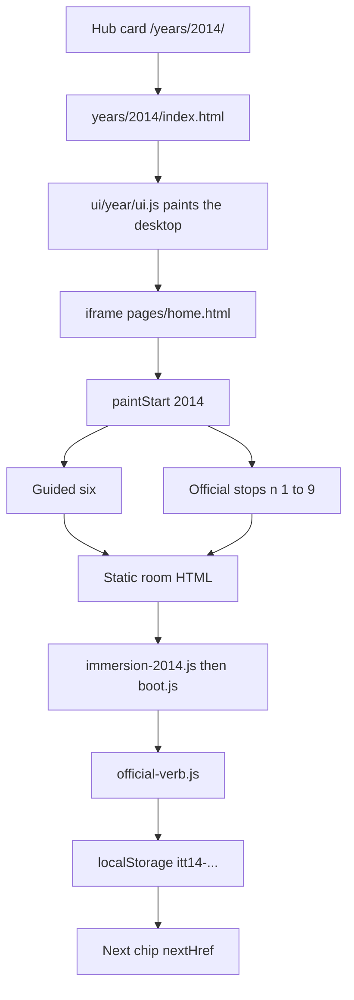
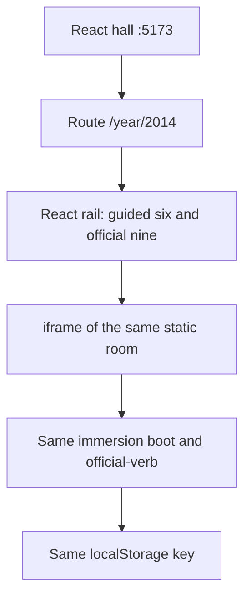

# 2014 — existing flow, then the React flow

**Date:** 2026-09-25
**Static door:** `years/2014/` stays. Tests and the hub card still open it.
**React door:** [http://localhost:5173/year/2014](http://localhost:5173/year/2014)
**Trail:** `js/config/flow-trails.js` year `"2014"`. Nine stops. There is no stop 10. Stop 9 returns to WhatsApp.
**Star:** `itt14-wa-install` on `sites/whatsapp/index.html`.

2014 is the first year in the React app. 2015 and later still use the generic shell. 2018 stays wiped.

## Existing flow

What each piece does:

| Step | File | What the visitor gets |
|---|---|---|
| 1 | `index.html` hub card `y2014` | Enters `/years/2014/` |
| 2 | `years/2014/index.html` | Loads `ui/year/ui.js` and calls `ITT.YearUI.paint("2014")` |
| 3 | `ui/year/shell.js` | Win7 desktop, IE window, iframe aimed at `pages/home.html` |
| 4 | `years/2014/pages/home.html` | Calls `ITT.YearUI.paintStart("2014")` |
| 5 | `ui/year/start-data.js` | Star plus six links: About, WhatsApp, Heartbleed, Ice Bucket, iPhone 6, flow map |
| 6 | `js/config/flow-trails.js` | The nine official stops below. Start page shows n ≤ 10, so all nine show |
| 7 | Room HTML | Period page. Save control is `data-official-verb` |
| 8 | `js/immersion-2014.js` | Sets the year and loads `js/immersion/boot.js` |
| 9 | `js/immersion/official-verb.js` | Empty, trap, and unfinished visits write nothing. A finished visit writes that stop's `whenKey` with `{official:true, year:"2014"}` |

Official nine, in order:

| n | Room | Key | Next |
|--:|---|---|---|
| 1 | `sites/whatsapp/index.html` | `itt14-wa-install` | Heartbleed |
| 2 | `sites/heartbleed/index.html` | `itt14-heartbleed` | Ice Bucket |
| 3 | `sites/icebucket/index.html` | `itt14-icebucket` | iPhone 6 |
| 4 | `sites/iphone/index.html` | `itt14-iphone6` | Apple Pay |
| 5 | `sites/applepay/index.html` | `itt14-applepay` | Material |
| 6 | `sites/material/index.html` | `itt14-material` | Slack |
| 7 | `sites/slack/index.html` | `itt14-slack` | Twitch |
| 8 | `sites/twitch/index.html` | `itt14-twitch` | Tile Fold |
| 9 | `sites/playable/game.html` | `itt14-game-tilefold` | WhatsApp |

There is no leftover trail after n 9. The guided six is a short door list. It is not a second trail. Apple Pay, Material, Slack, Twitch, and Tile Fold are on the official trail and are not in the guided six.

## New flow

The React page owns the door and the nine save screens. About, the Starting Point, and the flow map still open the static page in the frame. The HTML rooms stay on disk for the hub.

| Piece | Now | Later, one stop at a time |
|---|---|---|
| Hall and year chrome | React | Stays React |
| Guided six and the nine-stop list | React | Stays React |
| Room page and its save button | Existing HTML inside the frame | A React room that writes the same `whenKey` |
| `years/2014/` on port 8080 | Unchanged | Unchanged until that room's React save matches the static one |

Order for each later room:

1. Pick the next `n` from the table. Start at n 1, WhatsApp.
2. Read that HTML file and write down the real action: field, ticks, trap, and the key.
3. Build a React screen for that action only.
4. Empty and trap still write nothing. A finished visit still writes only that `whenKey`.
5. Point the React rail at the React screen instead of the iframe for that one stop.
6. Leave the static file in place so the hub and the old tests still pass.

Do not rename keys. Do not add a tenth official stop. Do not turn 2015 into this shape until 2014's nine saves have a React screen.
