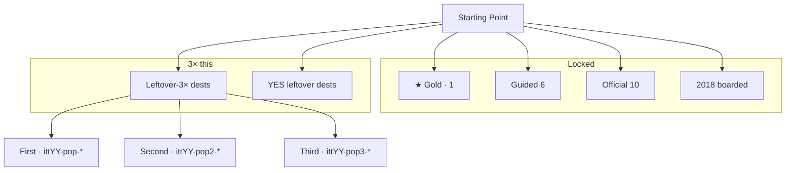
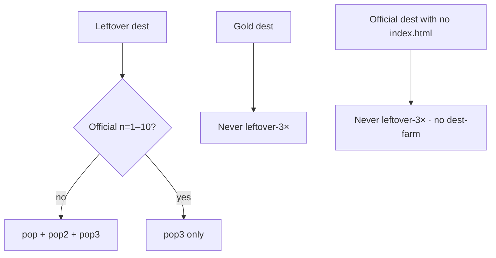

# 2016 / 2017 / 2019 leftover-3× ×3 — map

**Date:** 2026-09-07  
**Same steps as 1999–2005.** 2018 boarded — no year tree. Do not dest-farm official dests that have no `index.html`.  
**Famous that calendar year only.** Gold dest never leftover-3×. First/second never official n=1–10. Third may as `pop3`. Leftover never writes the star.

---

## Diagrams — check every flow

Gold: 2016 Instagram Stories `itt16-ig-stories` · 2017 Face ID `itt17-faceid` · 2019 Disney+ `itt19-disneyplus`.

---

## Painted leftover-3× doors (on-disk dests only)

Dest folders frozen: 2016=32 · 2017=55 · 2019=55. 2018 boarded.

### 2016 — lean leftover-18 style · 18 dests · 44 leftover-3× machines

21+ dest folders. Official dests without `index.html` (`facebook` / `whatsapp` / `windows10`) are never leftover-3×.

**First 6:** slack · reddit · netflix · youtube · alphago · assistant  
**Second 3:** houseparty · inbox · jio  
**Third 9:** pokemongo · iphone · vine · snapchat · musically (official `pop3`) + smario · fblive · moments · superbowl leftover (3 machines)

Gold dest `instagram` (`stories.html`) never leftover-3×.

### 2017 — 27 dests · 69 leftover-3× machines

Official dests without `index.html` (`twitter` / `vine`) and gold `iphone` (`x.html`) are never leftover-3×.

**First 9:** snapipo · bitcoinath · echoshow · reddit · youtube · hqtrivia · notpetya · yahoo3b · discord17  
**Second 9:** amazon · android8 · bitmoji · cloudbleed · creditfrz · flashend · pixel2 · signal17 · telegram17  
**Third 9:** fortnite · teams · switch · wannacry · musically · equifax (official `pop3`) + xboxonex · slack17 · pixelbook leftover (3 machines)

### 2019 — 27 dests · 67 leftover-3× machines

Official dest without `index.html` (`iphone`) is never leftover-3×. Gold dest `disneyplus` never leftover-3×.

**First 9:** facebook · fortnite · hidelikes · instagram · netflix · reddit · slack · snapchat · twitch  
**Second 9:** youtube · zoom10m · wework · gplus · pinterest · twitter · spotify · tumblr · wikipedia  
**Third 9:** tiktok · arcade · appletv · stadia · airpodspro · chrome · windows10 (official `pop3`) + oculusquest · nyt leftover (3 machines)

---

## YES leftover (famous leftover, not leftover-3× 27, not gold)

| Year | Dests | Machines |
|------|-------|---------:|
| 2016 | dyn | 3 |
| 2017 | odyssey | 3 |
| 2019 | area51 libra applecard | 9 |

2016 YES reduced to `dyn` because fblive / moments became leftover-3×. 2017 YES reduced to `odyssey` because pixelbook / slack17 became leftover-3×.

---

## Year beat

| Year | Beat |
|------|------|
| 2016 | 2016 leftover. Instagram Stories is the chip. No TikTok brand. No Reels. |
| 2017 | 2017 leftover. Face ID is the chip. Vine is gone. No TikTok US mass. |
| 2019 | 2019 leftover. Disney+ Who's watching is the chip. Trial never writes. |
