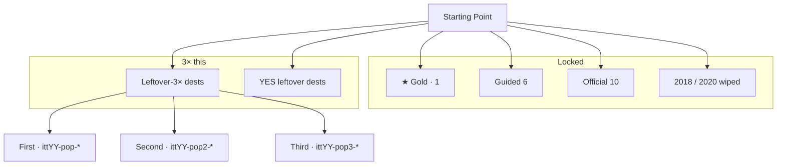
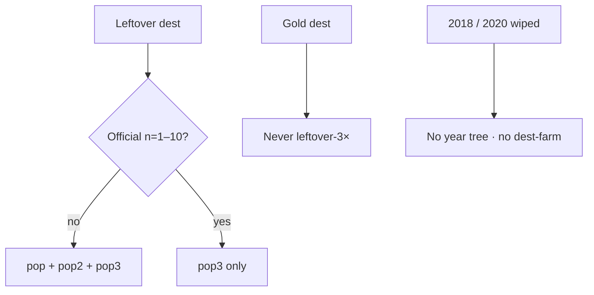

# 2018–2022 leftover-3× ×3 — map

**Date:** 2026-09-07  
**Same steps as 1999–2005:** count existing leftover-3× flow number → 3× unique dests → dest-true machines → 3 leftover writers per legal dest → YES leftover → score until positive → e2e complete (not strip-only).  
**Famous that calendar year only.** No dest-farm. Gold dest never leftover-3×. First/second never official n=1–10. Third may as `pop3`. Leftover never writes the star.

**Wiped years stay wiped.** 2018 and 2020 have no `years/` tree. Do not clone GDPR / Zoom into 2019 or 2021 leftover-3×.

**2019 leftover-3× dest-true is already painted** (9/9/9 · 67 machines). Do not rebuild.

Deep-research run: `deep-research-5` — **Partial**, consumed. First/third nines + 2022 YES leftover match disk. **No dest swaps.** Report still says dest-true = 0 / JSON trios; that is stale after the 2021–2022 dest-true paint.

---

## Diagrams — check every flow

Gold: 2018 GDPR Manage `itt18-gdpr` (paper only) · 2019 Disney+ `itt19-disneyplus` (already done) · 2020 Zoom Leave `itt20-zoom` (paper only) · 2021 ATT Ask `itt21-att` · 2022 ChatGPT Send `itt22-chatgpt`.

---

## Count now (before this pass)

| Year | Live | Dest folders | Leftover-3× flow number | Home first/more/third | dest-true `data-itt-lo3x` |
|------|------|-------------:|------------------------:|-----------------------|---------------------------:|
| 2018 | **wiped** | 0 | JSON trio only | — | 0 |
| 2019 | yes | 55 | **27 already** | 9 / 9 / 9 | **67 machines** |
| 2020 | **wiped** | 0 | JSON trio only | — | 0 |
| 2021 | yes | **107** (all have `index.html`) | **3** (JSON first) + 3 more strip | 0 / 3 / 0 | **0** |
| 2022 | yes | **88** (all have `index.html`) | **3** (JSON first) + 3 more strip | 0 / 3 / 0 | **0** |

3× the leftover-3× **flow number 3** = **27 unique dest doors** (9/9/9) when dest folders allow. 2021 and 2022 have room. Do not dest-farm.

---

## Locked — do not 3×

| Layer | 2018 | 2019 | 2020 | 2021 | 2022 |
|-------|------|------|------|------|------|
| ★ Gold | gdpr `itt18-gdpr` | disneyplus `itt19-disneyplus` | zoom `itt20-zoom` | att `itt21-att` | chatgpt `itt22-chatgpt` |
| Official dest folders | gdpr tiktok trust instagram chrome homepod spectre fortnite github playable | already painted | zoom reels openai flash tiktok markets edge ccpa chrome playable | att signal copilot meta windows11 flash chrome windows10 facebook playable | chatgpt twitter wordle stablediffusion mastodon bereal dalle2 chrome windows10 playable |
| Dest folders | 0 frozen | 55 frozen | 0 frozen | **107 frozen** | **88 frozen** |

**Skip / anachronism (never leftover-3× first/second):**  
2018 / 2020 — no dests.  
2021: ChatGPT · Wordle NYT tiles · Threads · X · Midjourney / SD mass · Zoom-as-gold · GPT-4 · Meta consumer app as gold · ATT dest leftover-3×.  
2022: Plus · GPT-4 · Bing Chat · Threads · X · ATT-as-gold · ChatGPT dest leftover-3× · live SD weights.

---

## Painted leftover-3× doors (on-disk dests only)

### 2018 — boarded

No `years/2018/`. JSON first trio reddit / youtube / wikipedia and third tiktok / github / homepod stay paper. Do not rebuild.

### 2019 — already done · do not rebuild

First 9: facebook fortnite hidelikes instagram netflix reddit slack snapchat twitch  
Second 9: youtube zoom10m wework gplus pinterest twitter spotify tumblr wikipedia  
Third 9: tiktok arcade appletv stadia airpodspro chrome windows10 oculusquest nyt  
YES leftover: area51 libra applecard

### 2020 — boarded

No `years/2020/`. JSON first trio meet / hbomax / quibi and third teams / discord / tiktok stay paper. Do not rebuild.

### 2021 — 27 dests

**First 9** `itt21-pop-*` — not official, not ATT

| Dest | Why 2021 |
|------|----------|
| youtube | mass leftover · not the chip |
| wikipedia | mass leftover |
| discord | 2021 leftover habit · Stage is leftover |
| clubhouse | audio leftover · Pack A #33 |
| nft | NFT literacy leftover |
| squid | Squid Game print leftover |
| shorts | YouTube Shorts US 18 Mar / global 13 Jul |
| airtag | 20 Apr · $29 / $99 four-pack |
| gme | Jan squeeze literacy · no live broker |

**Second 9** `itt21-pop2-*`

beeple (Christie's $69.3M 11 Mar) · bayc (Apr mint leftover) · opensea · coinbase (14 Apr COIN) · spaces21 (Spaces host 3 May) · fboutage (4 Oct BGP) · haugen (Facebook Files 3 Oct) · log4j (patch leftover · no exploit) · rbxipo (10 Mar listing)

**Third 9** `itt21-pop3-*` — official leftover dests + TikTok leftover filler

signal · copilot · meta · windows11 · flash · chrome · windows10 · facebook · **tiktok** leftover

Gold `att` and `playable` stay off leftover-3×.

### 2022 — 27 dests

**First 9** `itt22-pop-*` — not official, not ChatGPT

| Dest | Why 2022 |
|------|----------|
| youtube | mass leftover |
| wikipedia | mass leftover |
| facebook | leftover · not official 2022 |
| ftx | 11 Nov collapse literacy · no live book |
| steamdeck | 25 Feb leftover |
| passkeys | WWDC 6 Jun / iOS 16 leftover |
| midjourney | 12 Jul open beta leftover · not the chip |
| lensa3 | Magic Avatars Nov 2022 leftover |
| tiktok | leftover · not 2018 merge gold |

**Second 9** `itt22-pop2-*`

temu (US ~1 Sep) · merge (15 Sep Ethereum) · lastpass (Dec rotate leftover) · whisper (21 Sep) · copilotga (21 Jun GA $10/mo) · ios16 (12 Sep Lock Screen) · figmaad (15 Sep Adobe announce) · reddit · instagram

**Third 9** `itt22-pop3-*` — official leftover dests + Craiyon leftover filler

twitter · wordle · stablediffusion · mastodon · bereal · dalle2 · chrome · windows10 · **craiyon** leftover

Gold `chatgpt` and `playable` stay off leftover-3×.

---

## YES leftover (famous leftover, not leftover-3× 27, not gold)

| Year | Dests |
|------|-------|
| 2018 | none — wiped |
| 2019 | already: area51 libra applecard |
| 2020 | none — wiped |
| 2021 | ios15 whatsapp21 telegram21 dalle1 codex win365 pixel6 robinhood paramount |
| 2022 | discord netflix github notionai slack heardle quordle lockdown win22h2 |

---

## Year beat

| Year | Beat |
|------|------|
| 2018 | paper only. GDPR Manage is the chip. No year tree. |
| 2019 | 2019 leftover. Disney+ Who's watching is the chip. Trial never writes. |
| 2020 | paper only. Zoom Leave is the chip. No year tree. |
| 2021 | 2021 leftover. ATT Ask is the chip. No ChatGPT. No Wordle NYT. Win10 + Chrome habit. |
| 2022 | 2022 leftover. ChatGPT Send is the chip. Plus / GPT-4 / Bing / X are 2023. |

---

## Dest-true leftover machine

Empty / 0 ticks / trap pick never writes. Keep + two honesty ticks + field ≥2 writes `{real:true, leftover:true, multiStep:true, year}`. Star key stays empty. Official dests = `pop3` only. Leftover dests = `pop` + `pop2` + `pop3`. YES leftover = `yeslo` / `yeslo2` / `yeslo3`.
