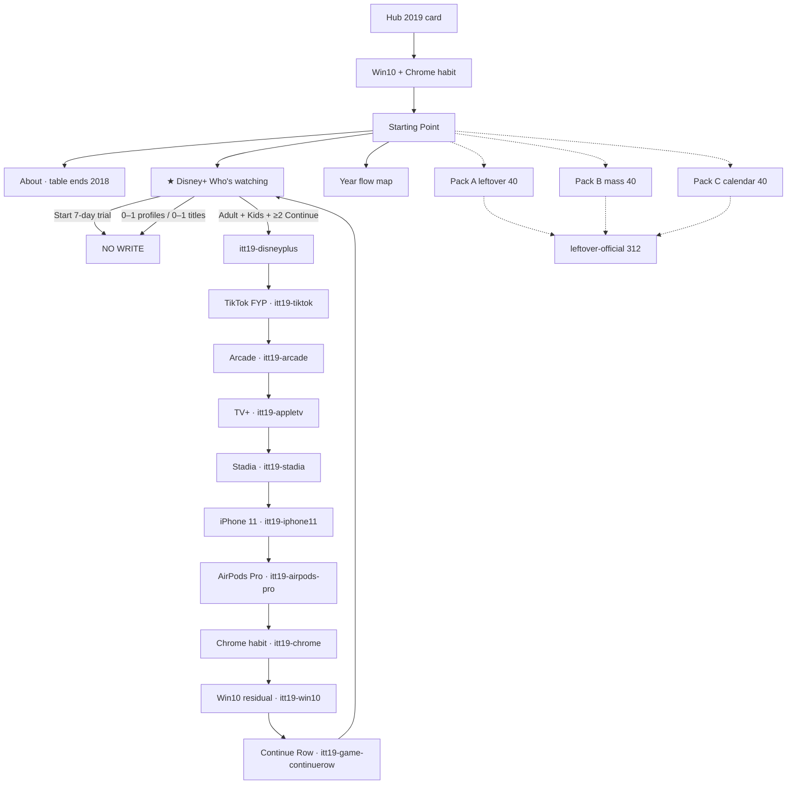
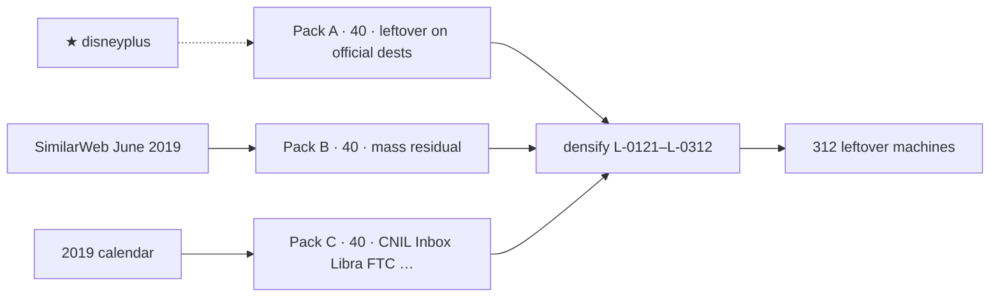
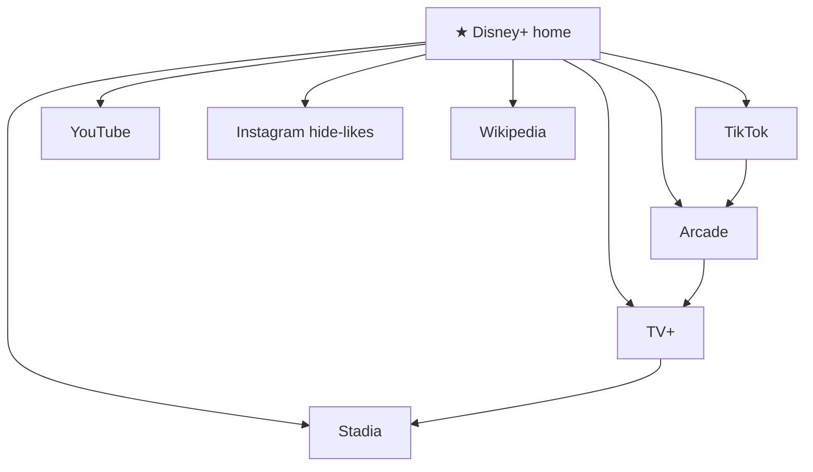

# 2019 — implementer map

**Date:** 2026-09-05  
**Status:** **RESEARCH LOCK.** No `years/2019/` on disk. Do not implement until named.  
**This file is the map.** Dest minutes live in [`nostalgia-5k-every-flow/2019.md`](nostalgia-5k-every-flow/2019.md).  
**Prefix:** `itt19`  
**Clone:** live `years/2017/` (55 dests · 91 HTML · 312 leftover machines). **Not** wiped 2018.

| Companion | Role |
|-----------|------|
| [`2019-READ-FIRST.md`](2019-READ-FIRST.md) | Thesis · star · bans |
| [`2019-FROM-SCRATCH-RESEARCH-…-2026-09-05.md`](2019-FROM-SCRATCH-RESEARCH-GOALS-PHASES-FLOWS-MINUTE-VISITED-2026-09-05.md) | Sources · 5k envelope · calendar |
| [`2019-FROM-SCRATCH-DEST-CATALOG-…-2026-09-05.md`](2019-FROM-SCRATCH-DEST-CATALOG-FLOWS-LINKS-GAMES-2026-09-05.md) | 55 dest folders · official 10 minutes |
| [`nostalgia-5k-every-flow/2019.md`](nostalgia-5k-every-flow/2019.md) | Every leftover dest minute (312) |
| [`2019-CHECK-EVERY-FLOW-MAP.md`](2019-CHECK-EVERY-FLOW-MAP.md) | Trap / save / key checklist |

Serve later: `python3 -m http.server 8080 --bind 127.0.0.1`

---

## 1. Night map

```
Hub card “2019”  (locked today)
        │
        ▼
years/2019/index.html     Win10 mass + Chrome habit
        │
        ▼
pages/home.html           ★ Disney+ chip · guided 6 · atlas below
        │
        ├── pages/about.html          table ends 2018 · ITU 4.1B / 53.6%
        ├── ★ disneyplus/home.html    Who’s watching + Continue
        │         disneyplus/index.html   7-day trial = TRAP
        ├── tiktok/index.html         FYP leftover
        ├── arcade/index.html         $4.99 leftover
        ├── appletv/index.html        trail n=4 · not a 7th guided item
        ├── stadia/index.html         Founder’s
        ├── iphone/iphone11.html
        ├── airpodspro/index.html
        ├── chrome/ + windows10/      habit residual
        ├── playable/game.html        Continue Row
        └── pages/map.html
```



**Hero alignment (do not drift)**

```
hero  =  years/2019/sites/disneyplus/home.html
      =  home data-ott-one-thing="2019"
      =  flowTrails["2019"][0].href
      =  YEAR_STARTS["2019"] step 1   (step 0 = About)
key   =  itt19-disneyplus
```

---

## 2. Flow bar (same as live 2017)

| Bar | 2017 live | 2019 lock |
|-----|----------:|----------:|
| Dest folders | 55 | **55** |
| HTML | 91 | **91–140** |
| Leftover machines | 312 | **312** |
| Official 10 | 10 | 10 |
| Guided `<ol>` | 6 | **6** |
| Trails | 10 | 10 |
| 2× rows | 312 | = leftover dest keys |
| Playable HTML | 20 | 20 |

5k websites = research envelope. Not 5,000 rooms.

---

## 3. Guided 6 (home · frozen)

| # | Label | Path |
|--:|-------|------|
| 1 | About 2019 | `pages/about.html` |
| 2 | Disney+ Who’s watching | `sites/disneyplus/home.html` |
| 3 | TikTok For You | `sites/tiktok/index.html` |
| 4 | Apple Arcade | `sites/arcade/index.html` |
| 5 | Stadia | `sites/stadia/index.html` |
| 6 | Year flow map | `pages/map.html` |

TV+ is trail **n=4**, not a 7th `<li>`. Atlas / leftover dump **below** the banner.

---

## 4. Official 10 (night trail)

| n | Room | Path | whenKey | Incomplete | Complete | Next |
|--:|------|------|---------|------------|----------|------|
| 1 | ★ Disney+ Continue | `disneyplus/home.html` | `itt19-disneyplus` | weeklong trial · 0–1 profiles · 0–1 titles · do not quote “Who’s watching” as 2019 press | ≥2 profiles (Kids allowed) + ≥2 Continue-watching titles | TikTok |
| 2 | TikTok FYP | `tiktok/index.html` | `itt19-tiktok` | empty caption · 2018 merge as gold | caption ≥2 + Post · FTC 27 Feb $5.7M + C.D. Cal. 27 Mar | Arcade |
| 3 | Apple Arcade | `arcade/index.html` | `itt19-arcade` | no pick · IAP | pick + Play · $4.99 | TV+ |
| 4 | Apple TV+ | `appletv/index.html` | `itt19-appletv` | no original | pick + Watch · Newsroom 10 Sep $4.99 / 7-day / 100+ countries · CNBC 1 Nov | Stadia |
| 5 | Stadia | `stadia/index.html` | `itt19-stadia` | no box · 2023 shutdown copy | Founder’s **$129.99** · Night Blue controller · Chromecast Ultra · 3 months Pro · 9 a.m. PST | iPhone 11 |
| 6 | iPhone 11 | `iphone/iphone11.html` | `itt19-iphone11` | no color · Face-ID-as-new | color + stores 20 Sep | AirPods Pro |
| 7 | AirPods Pro | `airpodspro/index.html` | `itt19-airpods-pro` | 0–1 tick | 2 ticks + Pair · $249 | Chrome |
| 8 | Chrome habit | `chrome/index.html` | `itt19-chrome` | Edge as default | habit leftover | Win10 |
| 9 | Win10 residual | `windows10/index.html` | `itt19-win10` | Win11 · free upgrade still on | 2016-ended honesty | Continue Row |
| 10 | Continue Row | `playable/game.html` | `itt19-game-continuerow` | trial click · Consent Dash | two profiles + row survives Kids | Disney+ |

Leftover plaques on these dests use `*-lx` / `*-d2` only. Leftover complete **never** writes the official whenKey.

---

## 5. Visitor flows A–T

| Flow | Life | Museum | Proof |
|------|------|--------|-------|
| **A** Open year | Win10 mass · Chrome habit · Edge is preview | Hub → shell → `pages/home.html` | `itt-last-year=2019` · chip Disney+ · guided 6 |
| **B** Thesis | ILS June table ends 2018 · ITU 4.1B / 53.6% | `pages/about.html` | optional `itt19-thesis-ack` |
| **C** Star | 12 Nov · $6.99 / $69.99 · Who’s watching | `disneyplus/index.html` trap · `home.html` Continue | `itt19-disneyplus` |
| **D** TikTok | US mass · COPPA $5.7M · merge was 2018 | `tiktok/index.html` | `itt19-tiktok` |
| **E** Arcade | 19 Sep · $4.99 · no IAP | `arcade/index.html` | `itt19-arcade` |
| **F** TV+ | 1 Nov · $4.99 | `appletv/index.html` | `itt19-appletv` |
| **G** Stadia | 19 Nov Founder’s | `stadia/index.html` | `itt19-stadia` |
| **H** iPhone 11 | stores 20 Sep | `iphone/iphone11.html` | `itt19-iphone11` |
| **I** AirPods Pro | 30 Oct · $249 | `airpodspro/index.html` | `itt19-airpods-pro` |
| **J** Marshmello | 2 Feb · **10.7M peak concurrent** (Epic via press · not unique attendees) · not Travis | `fortnite/marshmello.html` | `itt19-marshmello` |
| **K** Continuity | G+ / Inbox / Huawei / Libra / FTC / hide likes | one dest each | leftover `itt19-*` |
| **L** 3× popular | SimilarWeb June: YT / IG / Wikipedia | fill+go | `itt19-pop-*` |
| **M** Year game | Who’s watching as a toy | Continue Row | `itt19-game-continuerow` |
| **N** Official 10 | night trail | §4 | each whenKey |
| **O** Year-start | About → star → TikTok | `YEAR_STARTS` | same as 2017 shape |
| **P** Back | one URL `/years/2019/` | crumbs in-year | Year menu = hub |
| **Q–T** Residual | 2018 GDPR / 2020 Zoom weather | About one-liners · Zoom 10M literacy dest only | never mute gold |

---

## 6. Dest map — 55 folders

```
sites/
  disneyplus/     ★ n=1     tiktok/        n=2      arcade/       n=3
  appletv/        n=4      stadia/        n=5      iphone/       n=6
  airpodspro/     n=7      chrome/        n=8      windows10/    n=9
  playable/       n=10 + extras
  youtube/  instagram/  wikipedia/          3× leftover popular
  google/   facebook/   amazon/   twitter/  reddit/   netflix/
  yahoo/    bing/       msn/      bbc/      ebay/     linkedin/
  pinterest/ twitch/    spotify/  snapchat/ tumblr/   paypal/
  imdb/     nyt/        cnn/      apple/    microsoft/
  discord/  slack/
  fortnite/     Marshmello
  ios13/  ipados/  libra/  cnil/  ftc/  inbox/  gplus/  huawei/
  edgerc/ hidelikes/ applecard/ oculusquest/ fortnitewc/
  wework/ area51/ zoom10m/     (Zoom = Dec 10M literacy only)
```

Hops are dest-name links **inside this list**. No dest farm. No Baidu / VK / Yandex / adult-video rooms.

---

## 7. Leftover 312

```
Pack A  40   leftover on official dests     L-0001–L-0040
Pack B  40   SimilarWeb June 2019 mass      L-0041–L-0080
Pack C  40   2019 calendar leftovers        L-0081–L-0120
densify      leftover-official on 55 dests
             + playable extra writers       L-0121–L-0312
─────────────────────────────────────────
total        312 leftover dest minutes
```

Every leftover dest:

```
trap → no write
0 ticks → no write
empty field → no write
wrong pick → no write
complete → itt19-<suffix>  {real, leftover, year:"2019"}
star itt19-disneyplus stays empty
```

---

## 8. Scale (print on About)

| Cite | Print as |
|------|----------|
| ILS June | table **ends 2018** at **1,630,322,579 (−8%)**. No 2019 row. |
| Netcraft January 2019 | **1,518,207,412** hostnames · **label January** |
| ITU 2019 | **4.1 billion / 53.6%** · 3.6 billion still offline |
| Pew Feb/Jun 2019 | smartphone **81%** · 37% mostly go online via phone · Facebook **69%** of US adults |

---

## 9. Hard bans (on the map)

Reels · Meta · Zoom mute/leave as gold · COVID · Travis Scott · HBO Max · Quibi · Chromium Edge as default · GDPR as chip · Face ID as new · musical.ly merge as unlock · invented ILS June 2019 cell · Consent Dash · dest farm · leftover 4× · 7th guided `<li>` · Disney/Marvel/Grogu pixels.

---

## 10. Phases

| Phase | What |
|-------|------|
| **S0** | This map · research lock · **you are here** |
| S1 | Clone `years/2017` → `years/2019` · rewrite door |
| S2 | Disney+ star (index trap + home Continue) |
| S3–S6 | TikTok · Arcade · TV+ · Stadia · iPhone 11 · AirPods Pro |
| S7 | Marshmello + calendar dests |
| S8 | Mass residual dests |
| S9 | Official 10 + `flow-trails.js` |
| S10 | Continue Row + playable 20 |
| S11 | 3× YouTube / Instagram / Wikipedia |
| S12 | leftover-official → **312** machines |
| S13 | Hub unlock · `SHIP_YEARS` += 2019 |
| S14 | e2e |
| S15–S18 | pixels · gates · look |

Command when ready: `implement 2019 from scratch`

---

## 11. Door + HTML tree

```
years/2019/
  index.html                         Win10-mass desktop · Chrome habit · dirbar
  pages/
    home.html                        chip ★ Disney+ · guided 6 · atlas below
    about.html                       ILS ends 2018 · Netcraft Jan · ITU 4.1B
    map.html                         this night · official 10 · leftover packs
    whats-new.html                   calendar one-liners · no politics dump
    error/404.html
    error/unreachable.html
  sites/                             55 dest folders · §12
  playable/                          20 HTML · §15
```

Dirbar: Disney+ · TikTok · Arcade · Stadia · About.  
Shell: `os-win10` · Chrome habit · iOS 13 leftover. Edge residual = **Chromium preview**, not default.

**Year-start** (`YEAR_STARTS["2019"]`)

| Step | Room |
|-----:|------|
| 0 | `pages/about.html` |
| 1 | `sites/disneyplus/home.html` |
| 2 | `sites/tiktok/index.html` |

---

## 12. Every dest — path · official · leftover keys · hops · next

Hops are dest-name links on the landing. Next is in-year, HTTP 200.

| # | Folder | Pages | Official key | Leftover keys | Trap | Next |
|--:|--------|-------|--------------|---------------|------|------|
| 1 | `disneyplus/` | `index` trap · `home` ★ · `about` · `queue` | `itt19-disneyplus` | `disney-lx` `disney-d2` `disney-ab` `disney-q` `disney-join` `disney-about` `disney-queue` | 7-day trial | TikTok |
| 2 | `tiktok/` | `index` · `create` · `about` | `itt19-tiktok` | `tiktok-lx` `tiktok-d2` `tiktok-ab` `coppa-lx` `tiktok-create` | empty caption · 2018 merge | Arcade |
| 3 | `arcade/` | `index` · `play` · `about` | `itt19-arcade` | `arcade-lx` `arcade-d2` `arcade-ab` `arcade-play` `arcade-play2` | no pick · IAP | TV+ |
| 4 | `appletv/` | `index` · `watch` · `about` | `itt19-appletv` | `appletv-lx` `tv-d2` `tv-ab` `tv-watch` `tv-watch2` | no original | Stadia |
| 5 | `stadia/` | `index` · `stream` · `about` | `itt19-stadia` | `stadia-lx` `stadia-d2` `stadia-ab` `stadia-stream` `stadia-founders` | 2023 shutdown | iPhone 11 |
| 6 | `iphone/` | `iphone11.html` | `itt19-iphone11` | `iphone11-lx` `ip11-d2` `ip11-ab` `ip11-color` `ip11-stores` | Face-ID-as-new | AirPods Pro |
| 7 | `airpodspro/` | `index` · `pair` | `itt19-airpods-pro` | `airpods-lx` `app-d2` `app-ab` `app-pair` `app-anc` | $159 as Pro | Chrome |
| 8 | `chrome/` | `index` | `itt19-chrome` | `chrome-lx` `ch-d2` `ch-ab` `ch-habit` | Edge as default | Win10 |
| 9 | `windows10/` | `index` | `itt19-win10` | `win10-lx` `w10-d2` `w10-ab` `w10-free` | Win11 | Continue Row |
| 10 | `playable/` | 20 HTML · §15 | `itt19-game-continuerow` | `play-lx` `cr-d2` `cr-ab` `cr-kids` + extra keys | Consent Dash | Disney+ |
| 11 | `youtube/` | `index` | — | `yt-lx` `yt-d2` `yt-ab` `pop-youtube` | Disney+ as YT gold | Instagram |
| 12 | `instagram/` | `index` | — | `ig-lx` `ig-d2` `ig-ab` `pop-instagram` | Reels / Stories-as-2019 | Wikipedia |
| 13 | `wikipedia/` | `index` | — | `wiki-lx` `wiki-d2` `wiki-ab` `pop-wikipedia` | empty search | Google |
| 14 | `google/` | `index` | — | `google-lx` `g-d2` `g-ab` `g-q` | empty query | Facebook |
| 15 | `facebook/` | `index` | — | `fb-lx` `fb-d2` `fb-ab` `fb-feed` | Like-as-2009-gold | Amazon |
| 16 | `amazon/` | `index` | — | `amz-lx` `amz-d2` `amz-ab` `amz-cart` | live buy | Twitter |
| 17 | `twitter/` | `index` | — | `tw-lx` `tw-d2` `tw-ab` `tw-280` | 280 as 2017 gold | Reddit |
| 18 | `reddit/` | `index` | — | `rd-lx` `rd-d2` `rd-ab` `rd-front` | empty | Netflix |
| 19 | `netflix/` | `index` | — | `nflx-lx` `nflx-d2` `nflx-ab` `nflx-st3` | Disney+ as Netflix | Yahoo |
| 20 | `yahoo/` | `index` | — | `yh-lx` `yh-d2` `yh-ab` `yh-q` | empty | Bing |
| 21 | `bing/` | `index` | — | `bing-lx` `bing-d2` `bing-ab` `bing-q` | empty | MSN |
| 22 | `msn/` | `index` | — | `msn-lx` `msn-d2` `msn-ab` `msn-q` | empty | BBC |
| 23 | `bbc/` | `index` | — | `bbc-lx` `bbc-d2` `bbc-ab` `bbc-story` | empty | eBay |
| 24 | `ebay/` | `index` | — | `ebay-lx` `ebay-d2` `ebay-ab` `ebay-bid` | Buy It Now trap | LinkedIn |
| 25 | `linkedin/` | `index` | — | `li-lx` `li-d2` `li-ab` `li-inv` | empty invite | Pinterest |
| 26 | `pinterest/` | `index` | — | `pin-lx` `pin-d2` `pin-ab` `pin-save` | empty | Twitch |
| 27 | `twitch/` | `index` | — | `twitch-lx` `twitch-d2` `twitch-ab` `twitch-live` | empty | Spotify |
| 28 | `spotify/` | `index` | — | `spot-lx` `spot-d2` `spot-ab` `spot-play` | live stream | Snapchat |
| 29 | `snapchat/` | `index` | — | `sc-lx` `sc-d2` `sc-ab` `sc-snap` | Stories-as-2016-gold | Tumblr |
| 30 | `tumblr/` | `index` | — | `tb-lx` `tb-d2` `tb-ab` `tb-post` | empty | PayPal |
| 31 | `paypal/` | `index` | — | `pp-lx` `pp-d2` `pp-ab` `pp-send` | empty send | IMDb |
| 32 | `imdb/` | `index` | — | `imdb-lx` `imdb-d2` `imdb-ab` `imdb-title` | empty | NYT |
| 33 | `nyt/` | `index` | — | `nyt-lx` `nyt-d2` `nyt-ab` `nyt-story` | empty | CNN |
| 34 | `cnn/` | `index` | — | `cnn-lx` `cnn-d2` `cnn-ab` `cnn-story` | empty | Apple |
| 35 | `apple/` | `index` | — | `apple-lx` `apple-d2` `apple-ab` `apple-nr` | Arcade-as-gold | Microsoft |
| 36 | `microsoft/` | `index` | — | `ms-lx` `ms-d2` `ms-ab` `ms-edge` | Edge as default | Discord |
| 37 | `discord/` | `index` | — | `dc-lx` `dc-d2` `dc-ab` `dc-join` | empty server | Slack |
| 38 | `slack/` | `index` | — | `sl-lx` `sl-d2` `sl-ab` `sl-ws` | empty | Fortnite |
| 39 | `fortnite/` | `marshmello.html` | — | `marshmello` `fn-lx` `fn-d2` `fn-ab` `marsh-lit` | Travis Scott | iOS 13 |
| 40 | `ios13/` | `index` | — | `dk-6x` `ios13-lx` `ios13-d2` `ios13-ab` | iOS 14 | iPadOS |
| 41 | `ipados/` | `index` | — | `ip-6x` `ipados-lx` `ipados-d2` `ipados-ab` | empty | Libra |
| 42 | `libra/` | `index` | — | `libra-lx` `libra-d2` `libra-ab` `libra-wp` | live wallet | CNIL |
| 43 | `cnil/` | `index` | — | `cnil-lx` `cnil-d2` `cnil-ab` `cnil-50` | GDPR as chip | FTC |
| 44 | `ftc/` | `index` | — | `ftc-lx` `ftc-d2` `ftc-ab` `ftc-5b` | writes `itt18-gdpr` | Inbox |
| 45 | `inbox/` | `index` | — | `inbox-lx` `inbox-d2` `inbox-ab` `inbox-off` | still-on costume | G+ |
| 46 | `gplus/` | `index` | — | `gplus-lx` `gplus-d2` `gplus-ab` `gplus-die` | 2011 G+ gold | Huawei |
| 47 | `huawei/` | `index` | — | `hw-lx` `hw-d2` `hw-ab` `hw-gms` | exploit dest | Edge RC |
| 48 | `edgerc/` | `index` | — | `edge-lx` `edge-d2` `edge-ab` `edge-rc` `edge-prev` | default browser | hide likes |
| 49 | `hidelikes/` | `index` | — | `hide-lx` `hide-d2` `hide-ab` `hide-ig` | Reels | Apple Card |
| 50 | `applecard/` | `index` | — | `card-lx` `card-d2` `card-ab` `card-pay` | live card | Quest |
| 51 | `oculusquest/` | `index` | — | `quest-lx` `quest-d2` `quest-ab` `quest-buy` | Meta branding | World Cup |
| 52 | `fortnitewc/` | `index` | — | `wc-lx` `wc-d2` `wc-ab` `wc-cup` | Travis Scott | WeWork |
| 53 | `wework/` | `index` | — | `ww-lx` `ww-d2` `ww-ab` `ww-ipo` | empty | Area 51 |
| 54 | `area51/` | `index` | — | `a51-lx` `a51-d2` `a51-ab` `a51-raid` | empty | Zoom 10M |
| 55 | `zoom10m/` | `index` | — | `z10-lx` `z10-d2` `z10-ab` `z10-dec` `z10-lit` | mute/leave gold · `itt20-zoom` | Disney+ |

---

## 13. Leftover packs on the map



**Pack A** sits on official dests. Keys never equal `disneyplus` / `tiktok` / `arcade` / `appletv` / `stadia` / `iphone11` / `airpods-pro` / `chrome` / `win10` / `game-continuerow`.

**Pack B** hops: Google · YouTube · Facebook · Wikipedia · Twitter · Yahoo · Instagram · Amazon · Reddit · Netflix. Never rooms: Baidu · Yandex · VK · Pornhub.

**Pack C** calendar → dest:

| When | Dest |
|------|------|
| 21 Jan CNIL €50M | `cnil/` |
| 2 Feb Marshmello 10.7M | `fortnite/marshmello.html` |
| 27 Feb COPPA $5.7M | leftover on `tiktok/` |
| 2 Apr Inbox off · G+ dies | `inbox/` · `gplus/` |
| 15 May Huawei GMS | `huawei/` |
| 21 May Quest | `oculusquest/` |
| 3 Jun / 19–30 Sep iOS 13 · iPadOS | `ios13/` · `ipados/` |
| 18 Jun Libra | `libra/` |
| 17 Jul hide likes | `hidelikes/` |
| 24 Jul FTC $5B | `ftc/` |
| 26 Jul World Cup | `fortnitewc/` |
| Aug Apple Card | `applecard/` |
| 4 Nov Edge RC | `edgerc/` |
| Dec Zoom 10M | `zoom10m/` literacy only |

---

## 14. 2× hop graph (legal)

Hops are dest-name links to dests **on the 55-list**. Gold hops from Disney+:



From any leftover dest: hop `youtube` · `instagram` · `wikipedia` (3× popular). Next after leftover save is the next dest in §12, never only home, never a neighbor year.

---

## 15. Playable 20

| File | Job | Leftover keys | Writes gold? |
|------|-----|---------------|--------------|
| `game.html` | **Continue Row** year game | `play-lx` `cr-d2` `cr-ab` `cr-kids` | official n=10 `itt19-game-continuerow` |
| `famous.html` | Pocket Snake · Brick Bat | `fam-lx` `fam-d2` `fam-ab` `fam-x` | no |
| `index.html` | playable door | `pidx-lx` `pidx-d2` `pidx-ab` `pidx-x` | no |
| `extra-a` … `extra-i` | year-extra-minute | `xa-lx` … `xi-x` | no |
| `more.html` · `more-a` … `more-d` | more leftover toys | `more-lx` … `md-x` | no |
| `game-2` … `game-5` | cabinets · not the year game | `g2-lx` … `g5-x` | no |

`game.html` script = `year-2019-continuerow.js`. **Not** `year-2018-consentdash.js`. **Not** Storm Circle.

---

## 16. Engine + file steal (when named)

| File | From | Into 2019 |
|------|------|-----------|
| Year door | `years/2017/` | `years/2019/` then rewrite rooms |
| Config | `js/config/2017.js` | `js/config/2019.js` · year string only |
| Extras | `js/immersion/year-2017-extras.js` | `js/immersion/year-2019-extras.js` |
| CSS | `css/period-2017.css` | `css/period-2019.css` `@import` 2017 + Who’s watching costume |
| Game | new | `js/games/year-2019-continuerow.js` |
| Trails | `js/config/flow-trails.js` | `"2019"` length **10** |
| Guided | `ui/year/start-data.js` | `#ott-guided-2019` exactly 6 |
| Hub | `index.html` | `.y2019.available` at S13 |
| Gate | `scripts/itt_gate.py` | drop `2019` from `_WIPED` at S13 |
| 3× | `scripts/popular-3x-sites.json` | youtube / instagram / wikipedia |
| e2e | 2017 pack shape | `2019-mvp` · `2019-flows` · `2019-trail-real-flows` |

Delete after clone: 2017 product rooms (Face ID / Fortnite BR / 280 / Teams / Vine gone / Switch / WannaCry payload costume). Keep lean door + playable 20 + leftover-official panels.

---

## 17. Atlas below the banner (not guided)

CNIL €50M · G+ funeral · Inbox gone · Huawei GMS · Libra · FTC $5B · IG hide likes · iPadOS · Edge preview · Marshmello · Apple Card · Quest · World Cup · WeWork · Area 51 · Zoom 10M literacy.

These are leftover dests or About one-liners. They never become a 7th guided item and never move the chip.

---

## 18. CDX walk queue (verify chrome · not dests)

For each host × month `2019-01` … `2019-12`:

```
https://web.archive.org/cdx/search/cdx?url=HOST/*&from=YYYYMM&to=YYYYMM&output=json&fl=original,timestamp,statuscode,mimetype&filter=statuscode:200&limit=50
```

| Cluster | Hosts |
|---------|-------|
| Star | disneyplus.com · thewaltdisneycompany.com · preview.disneyplus.com |
| Apple | apple.com/newsroom · apple.com/apple-arcade · tv.apple.com · apple.com/iphone-11 · apple.com/airpods-pro |
| Stadia / funerals | stadia.google.com · blog.google · plus.google.com · inbox.google.com |
| TikTok | tiktok.com · newsroom.tiktok.com |
| Mass | youtube.com · facebook.com · instagram.com · wikipedia.org · twitter.com · netflix.com · amazon.com · reddit.com |
| Policy | ftc.gov · cnil.fr · 2017-2021.commerce.gov |
| Browser | blogs.windows.com · microsoftedgeinsider.com |
| Games | fortnite.com · epicgames.com |
| Scale | internetlivestats.com · itu.int · news.netcraft.com |

Pixel queue until `[failed-final]`: H19-01 TikTok chrome · H19-02 Disney+ Who’s watching · H19-03 Arcade tab · H19-04 TV+ · H19-05 iPhone 11 colors · H19-06 AirPods Pro · H19-07 Stadia controller.

---

## 19. Check walk (after implement)

1. Guided count = 6  
2. Chip → `disneyplus/home.html`  
3. Trial never writes `itt19-disneyplus`  
4. Complete writes `{real, year:"2019", multiStep}`  
5. Official 10 each write their whenKey · leftover never writes those keys  
6. Leftover dest walk **312 / 312**  
7. 2× matrix row for every leftover key  
8. About prints table-ends-2018 + Netcraft January + ITU 4.1B / 53.6%  
9. Game is Continue Row  
10. Prefix `itt19-*` only  

Full leftover minutes: [`nostalgia-5k-every-flow/2019.md`](nostalgia-5k-every-flow/2019.md) L-0001–L-0312.

