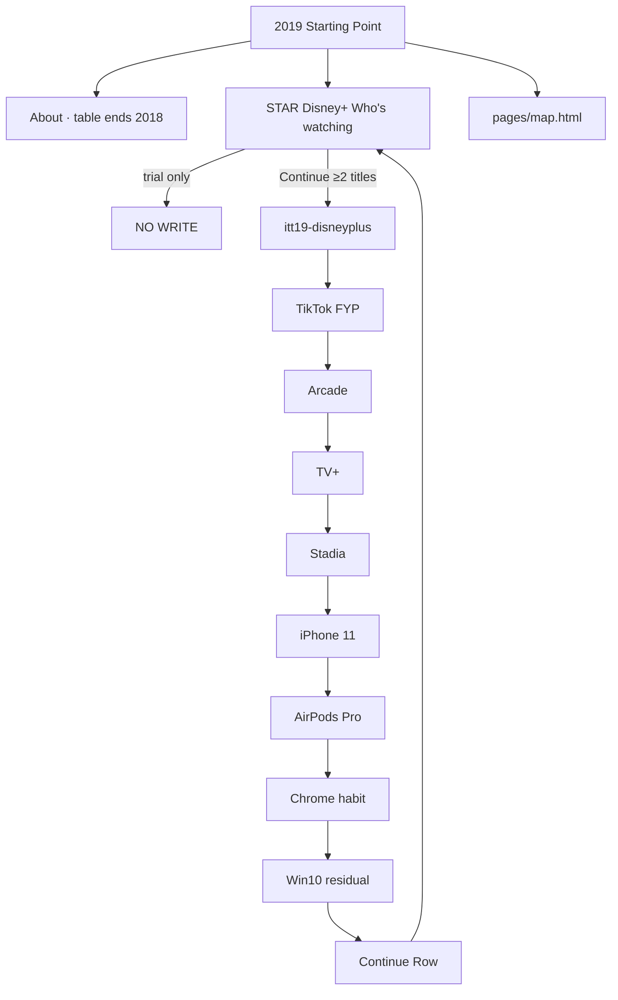

# 2019 — from scratch: research, goals, phases, flows, minute steps, visit log

**Date:** 2026-08-20  
**Status:** research freeze · **do not scaffold** until asked  
**Read first:** [`2019-READ-FIRST.md`](2019-READ-FIRST.md)  
**How to write (execute):** [`2019-FROM-SCRATCH-GOALS-PHASES-MINUTE-STEPS.md`](2019-FROM-SCRATCH-GOALS-PHASES-MINUTE-STEPS.md)  
**Visitor map:** [`2019-FROM-SCRATCH-MAP-GOALS-STEPS-FLOWS.md`](2019-FROM-SCRATCH-MAP-GOALS-STEPS-FLOWS.md)  
**Ledger:** [`2019-RESEARCH.md`](2019-RESEARCH.md)  
**Prefix:** `itt19`  
**Clone shape:** live `years/2018/` (lean GDPR door · 31 HTML)  
**Not on disk:** `years/2019/` · `js/config/2019.js` · `e2e/2019-*.spec.js` · old `2019-READ-FIRST` / `2019-5X-HARVEST` / `2019-DEEP-RESEARCH-*` (wiped with the year)

This file is the implement bible. Leftover 2019 notes in `DISK-TRUTH.md`, `5X-*`, and `YEAR-TRUE-POPULAR-*` describe **earlier forests**. Newest lock in this file + READ-FIRST wins.

---

## 0. What this pass actually did (honesty)

**Asked:** deep research to implement 2019 from scratch, in minute detail, visit 5k websites.

**Did:**

1. Read every on-disk 2019 leftover (see §14).  
2. Opened primary sources (Internet Live Stats June table, Apple Arcade Newsroom 10 Sep 2019, FTC Facebook $5B 24 Jul 2019, Disney company press path — current URL 404, cited via CNBC / Disney 13 Nov reprint).  
3. Search-harvested 2019 product, scale, rank, and calendar URLs (see §13).  
4. Locked thesis, star, bans, rooms, keys, guided 6, official 10, year game, phases.

**Did not:** open 5,000 unique live pages. That is not a one-session crawl. §15 is the **walk queue** (domain × month × path) so the next pass can keep opening Wayback / Newsroom / press without inventing dests.

**Do not implement from this file until the user says implement.**

---

## 1. Disk truth (this branch)

| Item | Now |
|------|-----|
| Hub | 1994–2012 + 2015–2018 (23 years) |
| `years/2019/` | **missing** |
| `SHIP_YEARS` | ends **2018** (`scripts/itt_gate.py`) |
| 2013–2014 | wiped · stay wiped |
| 2019 leftover docs that still exist | `docs/GAMES-PER-YEAR/YEAR-2019.md` · `docs/5X-MEASURABLE-IMPLEMENT/YEAR-2019.md` · `docs/5X-REAL-DEST-IMPLEMENT/YEAR-2019.md` · `docs/references/2019/ARTIFACTS-MAP.md` · `docs/references/2019/CAPTURE-LOG.md` · slices in `5X-IMPLEMENT-BIBLE` · `YEAR-TRUE-POPULAR` · `FLOW-CHECK-DIAGRAMS` · `COMPLEX-INTEGRATIONS` |
| Wiped 2019 bibles (cited, gone) | `2019-READ-FIRST.md` (rewritten this pass) · `2019-5X-HARVEST.md` · `2019-DEEP-RESEARCH-WEB-HARVEST-2026-08-11.md` · `2019-DEEP-RESEARCH-WEB-HARVEST-2026-08-13.md` · `2019-FROM-SCRATCH-GOALS-PHASES-MINUTE-STEPS.md` · `2019-GOALS-PHASES-AND-USER-FLOWS-CLEAR.md` |

**Forest numbers in leftover notes (do not restore):** 41 / 49 / 52 / 53 / 145 / 166 dirs / 526 HTML. Those were prune/forest states. This rebuild is **lean like 2018** (~30–45 HTML), not a dest-count race.

---

## 2. One-line thesis (locked)

**2019 is when Who’s watching becomes the door, a 7-day trial is the trap, and Continue is the save.**

Visitor feel: streaming pile-up. Disney+ is cheap ($6.99 / $69.99) and the catalog is the Fox close. Arcade and TV+ are Apple’s $4.99 month. Stadia is a controller + Chromecast Ultra in a box. TikTok is already the name; 2019 is US mass + COPPA, not the 2 Aug 2018 merge. GDPR is last year’s banner — CNIL’s €50M is the leftover fine, not a new Manage star.

---

## 3. Scale (dual-cite · do not invent)

| Label | Number | Source | This pass |
|-------|-------:|--------|-----------|
| Live Stats June **2018** websites (last row) | **1,630,322,579 (−8%)** | https://www.internetlivestats.com/total-number-of-websites/ | **opened** 2026-08-20 · table **ends 2018** · no 2019 row |
| June 2017 | 1,766,926,408 (+69%) | same table | opened |
| June 2016 | 1,045,534,808 (+21%) | same table | opened |
| June 2019 websites | **none** | same table | **do not invent** |
| ITU 2019 users | **4.1 billion** | ITU Facts and Figures 2019 · “4.1 billion people are using the Internet in 2019, reflecting a 5.3 per cent increase compared with 2018” | snippet + https://www.itu.int/hub/publication/d-ind-ict_mdd-2019/ |
| ITU 2019 penetration | **53.6%** | ITU PR 5 Nov 2019 (“4.1 billion people now using the Internet, or 53.6% of the global population”) | search snippet · PDF blocked this pass |
| 2018 ITU (parent year) | 51.2% / ~3.9B | 2018-RESEARCH | leftover |

**About copy (locked):** *The Live Stats June table ends 2018 at 1,630,322,579 (−8%). Do not invent a 2019 websites cell. ITU counts 4.1 billion people / 53.6% online in 2019.*

**Mass habit (compiled Alexa-class, June-ish 2019):** Google · YouTube · Facebook · Baidu · Wikipedia · Twitter · Yahoo · Instagram · Yandex. Adult-video ranks appear on some compiled lists — **do not museum that**. TikTok is a **phone** mass, not a top-10 hostname.

---

## 4. Locked calendar (P0 + residual)

Every row needs two cites before it becomes a room. Primary = press / Newsroom / agency. Pair = Wiki or second press.

| When | Beat | Use | Primary | Pair |
|------|------|-----|---------|------|
| 21 Jan | CNIL fines Google **€50M** GDPR | residual · not the star | BBC https://www.bbc.com/news/technology-46944696 | Inside Privacy / CNIL |
| 30 Jan | G+ consumer **dies 2 Apr** announced | residual funeral | TechCrunch https://techcrunch.com/2019/01/30/google-for-consumers-will-shut-down-on-april-2nd/ | Wiki Google+ |
| 2 Feb | Fortnite **Marshmello** · **10.7M** in-game | F5 chip · not Travis | Variety / Verge https://www.theverge.com/2019/2/21/18234980/fortnite-marshmello-concert-viewer-numbers | Wiki Fortnite Marshmello concert |
| 27 Feb | musical.ly / TikTok **COPPA $5.7M** | F1 honesty | FTC https://www.ftc.gov/news-events/news/press-releases/2019/02/video-social-networking-app-musically-agrees-settle-ftc-allegations-it-violated-childrens-privacy | TikTok Newsroom · NYT |
| 20 Mar | AirPods (2nd gen) | residual · not Pro | Apple | Wiki AirPods |
| 2 Apr | G+ consumer delete begins | residual | Google Help | Wiki |
| 2 Apr | Inbox by Gmail **off** | residual | Google Workspace blog (announced 2018, dies 2019) | Wiki Inbox |
| 15–16 May | Huawei **Entity List** | residual · GMS pause | Commerce https://2017-2021.commerce.gov/news/press-releases/2019/05/department-commerce-announces-addition-huawei-technologies-co-ltd.html | Reuters Google GMS |
| 3 Jun | WWDC · **iOS 13** / **iPadOS** named | residual | Apple NR https://www.apple.com/newsroom/2019/06/apple-previews-ios-13/ | Wiki iOS 13 |
| 18 Jun | Facebook **Libra** white paper | residual · not a wallet ship | CNBC https://www.cnbc.com/2019/06/17/facebook-announces-libra-digital-currency-calibra-digital-wallet.html | Wiki Diem |
| 17–18 Jul | IG **hide likes** test (AU/BR/CA/IE/IT/JP/NZ) | residual habit | BBC https://www.bbc.com/news/world-49026935 | TechCrunch 17 Jul |
| 24 Jul | FTC **$5B** Facebook | residual | FTC **opened** https://www.ftc.gov/news-events/news/press-releases/2019/07/ftc-imposes-5-billion-penalty-sweeping-new-privacy-restrictions-facebook | 2012 order context |
| 26 Jul | Fortnite **World Cup** | residual | Guardian | Epic |
| 10 Sep | iPhone **11** / 11 Pro · TV+ date · Arcade date | F5 / F3 / F2 | Apple NR https://www.apple.com/newsroom/2019/09/apple-introduces-dual-camera-iphone-11/ | Wiki iPhone 11 |
| 10 Sep | Arcade **$4.99** · ships 19 Sep | F2 | Apple NR **opened** https://www.apple.com/newsroom/2019/09/apple-arcade-invites-you-to-play-something-extraordinary/ | Wiki Apple Arcade · 71 launch titles |
| 19 Sep | **Apple Arcade** live with iOS 13 | F2 | Apple NR 16 Sep “It's time to play” | Wiki |
| 19 Sep | iOS 13 / iPadOS ships (iPadOS 30 Sep) | residual | Apple NR https://www.apple.com/newsroom/2019/09/ipados-is-available-today/ | Wiki |
| 15 Oct | Stadia date lock **19 Nov** | F4 | Google blog https://blog.google/products-and-platforms/products/stadia/stadia-arrives-november-19/ | Wiki Stadia |
| 28 Oct | AirPods **Pro** announce · **$249** · stores 30 Oct | F5 chip | Apple NR https://www.apple.com/newsroom/2019/10/apple-reveals-new-airpods-pro-available-october-30/ | Wiki |
| 1 Nov | **Apple TV+** ships · **$4.99** · 1 year free on new hardware | F3 | Apple NR https://www.apple.com/newsroom/2019/11/apple-tv-plus-is-now-available/ | Wiki Apple TV+ |
| 4 Nov | Edge Chromium **RC** · ships **15 Jan 2020** | residual · not default | Windows blog | Wiki Microsoft Edge |
| 12 Nov | **Disney+** US launch · **$6.99 / $69.99** · **7-day trial** | **STAR** | Disney 12 Nov press (current slug 404 this pass) · ABC7 / Newsweek / CNBC 11 Apr date lock | Wiki Disney+ |
| 13 Nov | Disney+ **>10 million sign-ups** | star honesty | CNBC https://www.cnbc.com/2019/11/13/disney-surpasses-10-million-sign-ups-since-launch.html | Disney reprint https://thewaltdisneycompany.com/press-releases/disney-sees-extraordinary-consumer-demand-with-more-than-10-million-sign-ups/ |
| 19 Nov | **Stadia** Founder’s / Premiere · 9am PT · 14 countries | F4 | Google blog | Wiki · **do not invent 2023 shutdown** |
| Dec | Zoom **10M** daily meeting participants (Yuan later cites Dec 2019) | **2020 leftover only** | Yuan 17 Mar 2021 | **ban as 2019 spine** |

**Fox catalog context (not a room unless leftover):** Disney–21st Century Fox close is why the day-one shelf exists. Cite Disney IR. Do not build a Fox room.

---

## 5. Star machine (minute)

**Path (lock one):** `years/2019/sites/disneyplus/home.html`  
Leftover maps also say `index.html`. Implement as:

| File | Job |
|------|-----|
| `sites/disneyplus/index.html` | Join / plan / 7-day trial **trap** |
| `sites/disneyplus/home.html` | **Who’s watching** + Continue row · **this is the one-thing** |
| `sites/disneyplus/about.html` | literacy · 12 Nov · $6.99 / $69.99 · 10M day-one · no write |
| `sites/disneyplus/queue.html` | watchlist leftover (optional densify) |

```
[Start] open home.html
    │ pick 0 profiles / only tap Start free trial
    ▼
  NO WRITE
    │ pick Adult + Kids (≥2) · add ≥2 titles to Adult Continue · switch Kids (blocked title honesty) · switch back · row still there
    ▼
  localStorage itt19-disneyplus
    { real:true, multiStep:true, year:"2019", profile, continueIds:[…] }
    │
    ▼
  Next chip → TikTok For You
```

**Incomplete never writes:** empty profile, 0–1 checks, trial-only, timeout.  
**Honesty:** museum original · no Mickey / castle / helmet / Grogu pixels · RECON CSS / wordmark text.  
**Do not** award the star for “Start 7-day trial”.

---

## 6. Official 10-stop trail (locked)

Guided `<ol>` stays **6**. The ten-trail is the night, not the home list.

| # | Room | Path | Next | Key | Incomplete |
|--:|------|------|------|-----|------------|
| 1 | Disney+ Who’s watching | `sites/disneyplus/home.html` | TikTok | `itt19-disneyplus` | trial only |
| 2 | TikTok For You | `sites/tiktok/index.html` | Arcade | `itt19-tiktok` | empty caption |
| 3 | Apple Arcade | `sites/arcade/index.html` | TV+ | `itt19-arcade` | no game pick |
| 4 | Apple TV+ | `sites/appletv/index.html` | Stadia | `itt19-appletv` | no original pick |
| 5 | Stadia | `sites/stadia/index.html` | iPhone 11 | `itt19-stadia` | no tier |
| 6 | iPhone 11 | `sites/iphone/iphone11.html` | AirPods Pro | `itt19-iphone11` | no color |
| 7 | AirPods Pro | `sites/airpodspro/index.html` | Chrome | `itt19-airpods-pro` | checks required |
| 8 | Chrome habit | `sites/chrome/index.html` | Win10 | residual / optional `itt19-chrome` | — |
| 9 | Windows 10 residual | `sites/windows10/index.html` | Continue Row | residual · free-upgrade ended **2016** | — |
| 10 | Continue Row | `sites/playable/game.html` | Disney+ | `itt19-game-continuerow` | Start trial / no profiles |

Hidden Next: `[data-next-flow][data-next-when-key]` invisible until that room’s key exists.

### Guided 6 (home, locked)

```
1 About 2019 — table ends 2018 · ITU 4.1B / 53.6%
2 Disney+ Who’s watching — trial never writes
3 TikTok For You — 2019 US mass · not the 2018 merge
4 Apple Arcade — $4.99 · 19 Sep
5 Stadia / iPhone 11 — pick one door (Stadia index) · TV+ is trail #4 not a 7th li
6 Year flow map
```

Do **not** add a 7th `<li>`. TV+ lives on the map + trail.

---

## 7. P0 leftover machines (not the chip)

| Room | Paths | Key | Verb | Incomplete |
|------|-------|-----|------|------------|
| TikTok | `tiktok/index.html` · `create.html` · `about.html` | `itt19-tiktok` | caption → post / FYP reorder | empty caption · missing COPPA honesty |
| Arcade | `arcade/index.html` · `play.html` · `about.html` | `itt19-arcade` | pick a title · $4.99 · no IAP | no pick |
| TV+ | `appletv/index.html` · `watch.html` · `about.html` | `itt19-appletv` | pick an original · continue | no pick · **do not rename key to tvplus** |
| Stadia | `stadia/index.html` · `stream.html` · `about.html` | `itt19-stadia` | Founder’s vs Premiere · ping | no tier · **do not write 2023 shutdown** |
| iPhone 11 | `iphone/iphone11.html` | `itt19-iphone11` | pick a color | no color |
| AirPods Pro | `airpodspro/index.html` · `pair.html` | `itt19-airpods-pro` | $249 · ANC honesty · pair theater | missing checks |
| Marshmello | `fortnite/marshmello.html` (or chip on fortnite) | `itt19-marshmello` | 2 Feb · 10.7M literacy | both checks required · no Epic rip |

**5× leftover next chain (do not rebuild as dest-count):**  
TikTok → Arcade → TV+ → Stadia → iPhone 11 → Marshmello / AirPods Pro → Disney+ Who’s watching.

---

## 8. Year game + famous + extras

| Slot | Title | File | Key | Class |
|------|-------|------|-----|-------|
| **Star game** | **Continue Row** | `sites/playable/game.html` + `js/games/year-2019-continuerow.js` | `itt19-game-continuerow` | Who’s watching · Adult easy · Kids other color · ≥2 profiles · ≥2 Continue titles · Kids blocked title · row persists |
| Famous A | Pocket Snake | `famous.html` + `famous-kit.js` | `itt19-game-snake` | anti-FYP toy |
| Famous B | Brick Bat | same | `itt19-game-breakout` | same kit |
| extra-a / b | minute extras (after door) | `extra-a.html` · `extra-b.html` | `itt19-game-<slug>` | year-extra-minute |
| extra-c / d / e | 3 more REAL (same pack as 1994–2018) | `extra-c.html` … | `itt19-game-<slug>` | year-more-kit · **after** star + famous exist |

**Do not:**

- Point `game.html` at `year-2018-consentdash.js`.  
- Ship game-2…5 tap packs as the year game (those are toys, not Continue Row).  
- Invent Disney / Arcade / Stadia brand pixels.

`docs/GAMES-PER-YEAR/YEAR-2019.md` already locks Continue Row feel. Honor it.

---

## 9. Lean room list (clone 2018, rewrite)

**Cap:** ~35–45 HTML. Dual-cite or it stays off disk.

### Door (copy structure from 2018)

`index.html` · `pages/home.html` · `about.html` · `map.html` · `whats-new.html` · `error/404.html` · `error/unreachable.html`

### P0 product

`disneyplus/{home,index,about}.html` · `tiktok/{index,create,about}.html` · `arcade/{index,play,about}.html` · `appletv/{index,watch,about}.html` · `stadia/{index,stream,about}.html` · `iphone/iphone11.html` · `airpodspro/{index,pair}.html`

### Continuity / residual (one page each unless named)

`chrome/index.html` · `windows10/index.html` · `edge/index.html` (preview · ships 2020) · `gdpr/index.html` (residual Manage, **not** the chip) · `inbox/index.html` · `googleplus/index.html` · `huawei/index.html` · `libra/index.html` · `cnil/index.html` · `ftc/index.html` or `facebook/ftc-fine.html` · `instagram/index.html` (hide-likes) · `ios13/index.html` · `ipados/index.html` · `fortnite/marshmello.html` · `youtube/index.html` · `twitter/index.html` · `wikipedia/index.html`

### Playable

`playable/{index,game,famous,extra-a,extra-b}.html` — extra-c/d/e only in a later 3-more pass.

### Engine (clone 2018 stubs, year-string only)

`js/config/2019.js` · `js/config/immersion-2019.js` · `js/browser-2019.js` · `js/immersion-2019.js` · `js/immersion/year-2019-extras.js` · `css/period-2019.css` (`@import` 2018)

**Shell:** Win10 mass · Chrome habit · iOS 13. Dirbar: Disney+ · TikTok · Arcade · Stadia · About.

---

## 10. Keys (do not rename)

| Key | Writer |
|-----|--------|
| `itt19-disneyplus` | Who’s watching + Continue · **star** |
| `itt19-tiktok` | FYP / caption |
| `itt19-arcade` | game pick |
| `itt19-appletv` | original pick · **not** `itt19-tvplus` |
| `itt19-stadia` | Founder’s / Premiere |
| `itt19-iphone11` | color |
| `itt19-airpods-pro` | pair / ANC checks |
| `itt19-marshmello` | two literacy checks |
| `itt19-game-continuerow` | year game best |
| `itt19-game-snake` / `itt19-game-breakout` | famous kit |

Neighbor years: never write `itt18-*` or `itt20-*` from 2019 extras. `year-2019-extras.js` `prefix()` fallback must be `"2019"` not `"2018"` (COMPLEX Y0).

---

## 11. Bans (hard)

- COVID UI · case-count dashboard · Zoom as 2019 mass (Zoom 10M is Dec leftover for **2020**).  
- Reels (5 Aug **2020**) · Meta (28 Oct **2021**) · HBO Max · Quibi · Travis Scott / Astronomical (**2020**).  
- Chromium Edge as the **default** browser (RC 2019 · ships 15 Jan 2020).  
- Face ID as **new** (2017). GDPR Manage as the **chip** (2018). musical.ly **merge** as this year’s unlock (2 Aug 2018).  
- Invent June 2019 Live Stats websites digit.  
- Restore Yahoo / Amazon 2019 clone forest.  
- Brand pixels (Disney castle, Marvel, Grogu, Stadia controller photo, Arcade tile art, TikTok logo file) unless capture-log status **OK**. Until then: RECON + failed-final strip.  
- Adult-video top-10 rooms.  
- 7th guided `<li>`.  
- Consent Dash clone as the 2019 year game.

---

## 12. Phases (implement in this order — only when asked)

### S0 — Freeze · **[x] this file**

Recite: star = Disney+ Continue · trial never writes · no June digit · clone 2018 · game = Continue Row.

### S1 — Door

1. Copy **structure** from `years/2018/` (index, pages, error).  
2. `js/config/2019.js` + immersion/browser stubs. Year string only. Rooms list = files that exist.  
3. Registry `"2019"`. `css/period-2019.css` `@import` period-2018.  
4. Shell: os-win10 · Chrome habit. Dirbar as §9.  
5. Home: `data-ott-one-thing="2019"` → `sites/disneyplus/home.html`. Guided **exactly 6**. Atlas at the bottom.  
6. About: dual-cite table-ends-2018 + ITU 4.1B / 53.6% + bans.  
7. Do **not** unlock hub / `SHIP_YEARS` until S7.

**Done when:** `/years/2019/` boots in isolation. Chip is Disney+. Guided count 6.

### S2 — Star

Build the Who’s watching machine (§5).  
`YEAR_STARTS["2019"]` = About → disneyplus/home.  
`flowTrails["2019"][0]` = Disney+ + `whenKey: itt19-disneyplus`.  
e2e: empty / trial → no write · complete → `itt19-disneyplus`.

### S3 — Four P0 machines

TikTok · Arcade · TV+ · Stadia (then iPhone 11 + AirPods Pro). Each: incomplete no-write · complete writes · Next hidden until key.

### S4 — Continue Row + famous

`year-2019-continuerow.js` · `game.html` · famous Pocket Snake / Brick Bat.  
**Gate:** `game.html` script is **not** consentdash.

### S5 — Official 10 + map

`flow-trails.js` `"2019"` length **10** first (not 50). `flow-maps.js` `"2019"` leaves exist on disk. `audit-every-flow` green.

### S6 — Residuals named in §9

One page each. Literacy or one writer. Next → star or next trail stop, **never only home**.

### S7 — Hub unlock

`index.html` year card `.y2019.available`. `SHIP_YEARS` += `2019`. Passport. `check-all-years.py` 24/24.

### S8 — e2e pack

`e2e/2019-mvp.spec.js` · `2019-flows.spec.js` · `2019-trail-real-flows.spec.js` · `one-thing-per-year` 2019 row · extra-a/b if present.

**Do not** in S1–S8: 5× dest race to 145 · 15 toys · game-2…5 as the product · extra-c/d/e (later pack).

---

## 13. Visit log — this pass (2026-08-20)

### 13.1 Primary pages opened

| URL | Got | Use |
|-----|-----|-----|
| https://www.internetlivestats.com/total-number-of-websites/ | June table **ends 2018** at 1,630,322,579 | scale lock |
| https://www.apple.com/newsroom/2019/09/apple-arcade-invites-you-to-play-something-extraordinary/ | 10 Sep · $4.99 · 19 Sep · Family Sharing 6 · no ads / IAP | F2 |
| https://www.ftc.gov/news-events/news/press-releases/2019/07/ftc-imposes-5-billion-penalty-sweeping-new-privacy-restrictions-facebook | 24 Jul · $5B · 2012 order · CA companion | residual |
| https://thewaltdisneycompany.com/disney-plus-launches-today/ | **404** this pass | use CNBC + Disney 13 Nov reprint |

### 13.2 Search clusters (distinct URLs seen in results; not all opened)

Disney+ price/date/trial/10M · Arcade Newsroom/Wiki/CNET · TV+ Newsroom/Wiki · Stadia Google blog/Wiki/IGN · ILS / Netcraft / Siteefy · ITU 4.1B / 53.6% · FTC musical.ly COPPA · CNIL €50M · G+ Apr 2 · Libra 18 Jun · IG hide likes · iPhone 11 / AirPods Pro NR · Huawei Entity List · Marshmello 10.7M · Alexa/Similarweb 2019 ranks.

### 13.3 On-disk files read (every 2019 leftover that still exists)

`DISK-TRUTH.md` · `YEAR-TRUE-POPULAR-LINKS-AND-EXACT-FLOWS-1994-2020.md` §2019 · `5X-IMPLEMENT-BIBLE-FROM-HARVEST-EVERY-YEAR-1994-2020.md` §2019 (full 27-URL harvest table) · `5X-IMPLEMENT-OVERVIEW` · `5X-MEASURABLE-IMPLEMENT/YEAR-2019.md` · `5X-REAL-DEST-IMPLEMENT/YEAR-2019.md` · `5X-REAL-DEST-GAPS` · `GAMES-PER-YEAR/YEAR-2019.md` · `FAMOUS-GAMES-PER-YEAR-1994-2021.md` · `COMPLEX-INTEGRATIONS` §2019 · `FLOW-CHECK-DIAGRAMS` §2019 · `FLOWS-LINKS-UX-DEEP-RESEARCH-WEB-HARVEST-2026-08-15.md` · `EVERY-YEAR-IMPROVE-DEEP-RESEARCH-WEB-HARVEST-2026-08-19.md` · `SESSION-2010-2019-BY-YEAR.md` · `references/2019/ARTIFACTS-MAP.md` · `references/2019/CAPTURE-LOG.md` · `IMPLEMENT-VERIFIED-GATES-AND-REDS.md` · `NON-DONE.md` · `2018-READ-FIRST.md` · `2018-RESEARCH.md` · `2015-FROM-SCRATCH-GOALS-PHASES-MINUTE-STEPS.md` · live `years/2018/pages/home.html` · `js/config/2018.js` · `year-playable.js` 2018 card.

---

## 14. Leftover harvest table (keep — 27 URLs from wiped 2019-5X-HARVEST)

Copied from `5X-IMPLEMENT-BIBLE` so the wipe does not lose the R0 index.

| # | Date / beat | Use | URL |
|--:|-------------|-----|-----|
| 1 | 2 Feb · Marshmello | F5 | https://variety.com/2019/digital/news/fortnite-marshmello-concert-10-7-million-1203145218/ |
| 2 | 21 Jan · CNIL €50M | residual | https://www.bbc.com/news/technology-46944696 |
| 3 | 30 Jan · G+ dies | residual | https://techcrunch.com/2019/01/30/google-for-consumers-will-shut-down-on-april-2nd/ |
| 4 | 15 May · Huawei Entity List | residual | https://2017-2021.commerce.gov/news/press-releases/2019/05/department-commerce-announces-addition-huawei-technologies-co-ltd.html |
| 5 | Huawei GMS pause | residual | https://www.reuters.com/article/world/exclusive-google-suspends-some-business-with-huawei-after-trump-blacklist-sou-idUSKCN1SP0N7/ |
| 6 | 18 Jun · Libra | residual | https://www.cnbc.com/2019/06/18/facebook-libra-cryptocurrency-white-paper.html |
| 7 | 17 Jul · IG hide likes | residual | https://www.bbc.com/news/world-49026935 |
| 8 | 24 Jul · FTC $5B | residual | https://www.ftc.gov/news-events/news/press-releases/2019/07/ftc-imposes-5-billion-penalty-sweeping-new-privacy-restrictions-facebook |
| 9 | 26 Jul · World Cup | residual | https://www.theguardian.com/games/2019/jul/26/fortnite-world-cup-kicks-off-with-30-million-at-stake-professional-games-tournament |
| 10 | 10 Sep · iPhone 11 | F5 | https://www.apple.com/newsroom/2019/09/apple-introduces-dual-camera-iphone-11/ |
| 11 | 19 Sep · Arcade | F2 | https://www.apple.com/newsroom/2019/09/apple-arcade-invites-you-to-play-something-extraordinary/ |
| 12 | 28 Oct · AirPods Pro | F5 | https://www.apple.com/newsroom/2019/10/apple-reveals-new-airpods-pro-available-october-30/ |
| 13 | 10 Sep · TV+ date | F3 | https://www.apple.com/newsroom/2019/09/apple-tv-launches-november-1-featuring-originals-from-the-worlds-greatest-storytellers/ |
| 14 | 1 Nov · TV+ ships | F3 | https://www.apple.com/newsroom/2019/11/apple-tv-plus-is-now-available/ |
| 15 | 12 Nov · Disney+ | star | https://thewaltdisneycompany.com/disney-plus-launches-today/ *(404 this pass — use reprint)* |
| 16 | Disney+ 10M | star | https://www.cnbc.com/2019/11/13/disney-plus-launch-10-million-sign-ups.html |
| 17 | 15 Oct · Stadia date | F4 | https://blog.google/products-and-platforms/products/stadia/stadia-arrives-november-19/ |
| 18 | Stadia Founder’s | F4 | https://blog.google/products-and-platforms/products/stadia/founders-edition-and-premiere-edition-bundles/ |
| 19 | TikTok 2019 US / CFIUS | F1 | https://www.nytimes.com/2019/11/03/technology/tiktok-national-security-review.html |
| 20 | musical.ly → TikTok (2018) | F1 context | https://newsroom.tiktok.com/en-us/musical-ly-and-tiktok/ |
| 21 | iOS 13 named | residual | https://www.apple.com/newsroom/2019/06/apple-previews-ios-13/ |
| 22 | iPadOS ships | residual | https://www.apple.com/newsroom/2019/09/ipados-is-available-today/ |
| 23 | Edge Chromium RC | residual | https://blogs.windows.com/msedgedev/2019/11/04/edge-chromium-release-candidate-download/ |
| 24 | Win10 free upgrade ended **2016** | honesty | https://blogs.windows.com/windowsexperience/2016/07/28/windows-10-free-upgrade-offer-will-end-july-29/ |
| 25 | Inbox dies 2 Apr 2019 | residual | https://workspaceupdates.googleblog.com/2018/09/inbox-signing-off.html |
| 26 | Flickr 1000-cap (2018 enforce) | residual | https://blog.flickr.net/en/2018/11/01/changing-flickr-free-accounts-1000-photos/ |
| 27 | Disney–Fox close | star context | https://thewaltdisneycompany.com/the-walt-disney-company-signs-amended-acquisition-agreement-to-acquire-twenty-first-century-fox/ |

**Added this pass (not in the 27):**

| # | Beat | URL |
|--:|------|-----|
| 28 | COPPA $5.7M 27 Feb | https://www.ftc.gov/news-events/news/press-releases/2019/02/video-social-networking-app-musically-agrees-settle-ftc-allegations-it-violated-childrens-privacy |
| 29 | TikTok Newsroom COPPA | https://newsroom.tiktok.com/musical-lys-agreement-with-ftc/ |
| 30 | Disney 10M reprint | https://thewaltdisneycompany.com/press-releases/disney-sees-extraordinary-consumer-demand-with-more-than-10-million-sign-ups/ |
| 31 | Disney+ $6.99 date lock | https://www.cnbc.com/2019/04/11/disney-plus-will-be-available-starting-november-12-for-6point99-a-month.html |
| 32 | Arcade Wiki | https://en.wikipedia.org/wiki/Apple_Arcade |
| 33 | Stadia Wiki | https://en.wikipedia.org/wiki/Google_Stadia |
| 34 | TV+ Wiki | https://en.wikipedia.org/wiki/Apple_TV_(streaming_service) |
| 35 | Marshmello Verge 10.7M | https://www.theverge.com/2019/2/21/18234980/fortnite-marshmello-concert-viewer-numbers |
| 36 | ITU hub F&F 2019 | https://www.itu.int/hub/publication/d-ind-ict_mdd-2019/ |
| 37 | ILS websites table | https://www.internetlivestats.com/total-number-of-websites/ |

---

## 15. Walk queue — how to actually visit ~5k captures (next pass)

Do **not** invent dests from this list. Use it to **verify chrome, dates, and copy**. Prefer Wayback dated **2019-01-01 … 2019-12-31**.

### 15.1 CDX formula

For each **host** in §15.2 and each **month** `2019-01` … `2019-12`:

```
https://web.archive.org/cdx/search/cdx?url=HOST/*&from=YYYYMM&to=YYYYMM&output=json&fl=original,timestamp,statuscode,mimetype&filter=statuscode:200&limit=50
```

80 hosts × 12 months × 50 hits = **up to 48,000** candidate URLs. Dedup + html-only ≈ several thousand distinct pages. Record: original · timestamp · status · whether used in a room.

Wayback playback:

```
https://web.archive.org/web/2019MMDDHHMMSS/https://HOST/PATH
```

### 15.2 Hosts (museum-relevant · 2019)

**Star / stream:** disneyplus.com · preview.disneyplus.com · thewaltdisneycompany.com · dmedmedia.disney.com · press.disneyplus.com · hulu.com · espn.com · netflix.com · hulu.com · cbs.com · peacocktv.com *(2020 — do not room)* · hbomax.com *(2020)*

**Apple:** apple.com · apple.com/newsroom · apple.com/apple-arcade · tv.apple.com · apple.com/apple-tv-plus · apple.com/iphone-11 · apple.com/airpods-pro · itunes.apple.com · apps.apple.com

**Google / Stadia / funerals:** stadia.google.com · store.google.com · blog.google · plus.google.com · inbox.google.com · chrome.google.com · store.google.com/magazine/stadia

**TikTok / ByteDance:** tiktok.com · newsroom.tiktok.com · musical.ly

**Social habit:** facebook.com · instagram.com · twitter.com · youtube.com · reddit.com · wikipedia.org · yahoo.com · baidu.com · yandex.ru

**Policy:** ftc.gov · cnil.fr · commerce.gov · 2017-2021.commerce.gov · federalregister.gov

**OS / browser:** microsoft.com · blogs.windows.com · microsoftedgeinsider.com

**Press (date-lock, not rooms):** cnbc.com · bbc.com · nytimes.com · theverge.com · techcrunch.com · variety.com · theguardian.com · reuters.com · washingtonpost.com

**Games leftover:** fortnite.com · epicgames.com

**Scale:** internetlivestats.com · itu.int · netcraft.com

### 15.3 Pixel queue (from `references/2019/CAPTURE-LOG.md` — still queued)

H19-01 TikTok chrome · H19-02 Disney+ launch UI · H19-03 Arcade badge · H19-04 TV+ icon class · H19-05 iPhone 11 colors · H19-06 AirPods Pro · H19-07 Stadia controller. Until OK: RECON only.

---

## 16. Night diagram

```
 /years/2019/          skip-connect
        ▼
 pages/home.html       guided 6 · chip → disneyplus/home.html
        │
        ├── About (scale + bans)
        ├── ★ Disney+ Who’s watching     itt19-disneyplus
        │         trial = trap
        ├── TikTok FYP                   itt19-tiktok
        ├── Arcade                       itt19-arcade
        ├── TV+                          itt19-appletv
        ├── Stadia                       itt19-stadia
        ├── iPhone 11 / AirPods Pro
        ├── Continue Row                 itt19-game-continuerow
        └── map.html
```



---

## 17. Acceptance (year is a lean door, not 5× dests)

- [ ] `years/2019/` on disk · clone of 2018 structure · not a forest restore  
- [ ] Guided `#ott-guided-2019 ol > li` count **6**  
- [ ] `data-ott-one-thing="2019"` → `sites/disneyplus/home.html`  
- [ ] Trial / empty never writes `itt19-disneyplus`  
- [ ] Complete writes `{ real:true, year:"2019", multiStep:true }`  
- [ ] Game is Continue Row · **not** Consent Dash  
- [ ] Prefix `itt19-*` only  
- [ ] About states table-ends-2018 + ITU 4.1B / 53.6% · no invented June digit  
- [ ] Famous = Pocket Snake + Brick Bat  
- [ ] Hub + `SHIP_YEARS` only after S7  
- [ ] `check-all-years.py` includes 2019  
- [ ] 2013–2014 still wiped  

---

## 18. Command

```
implement 2019 from scratch
```

Do **not** implement 2020 in the same pass. Do **not** grow dests to 145 in the door pass.
