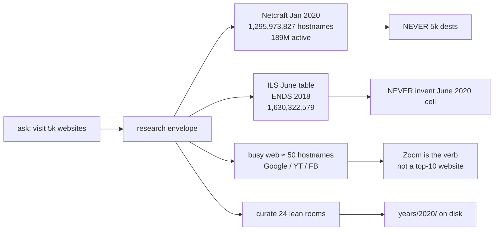
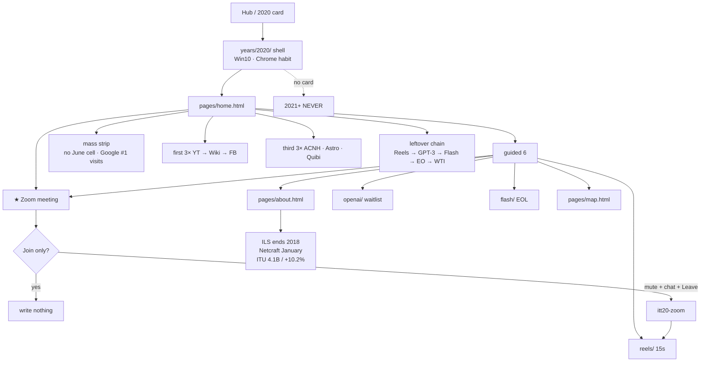
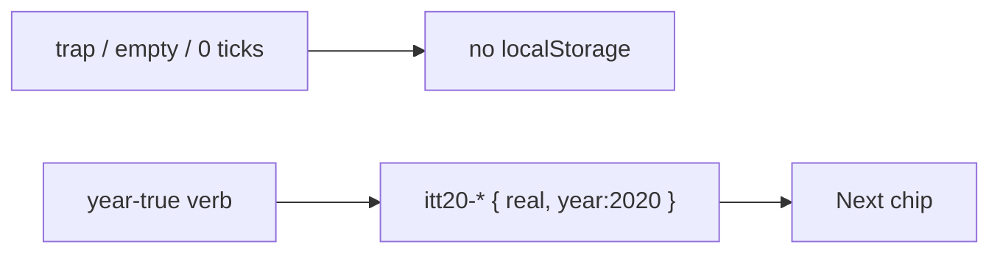
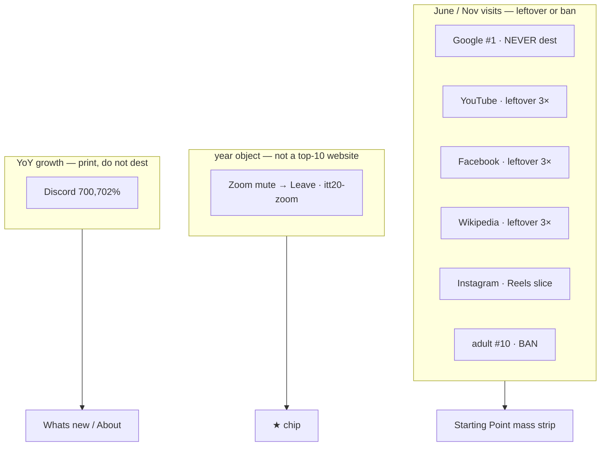

# 2020 — 5k-web flow map

**Date:** 2026-08-22  
**What this is:** the walkable map for the 5k-web pass. Green = on disk. Amber = later. Red = correctly never.  
**Door:** `years/2020/` · prefix **`itt20`** · star **Zoom mute → Leave**  
**How to use:** walk top to bottom. Open the companion if a box needs the long cite.

Legend: **DONE** · **PARTIAL** · **OPEN** · **NEVER**

---

## Companions (read these, do not copy them here)

| File | When you need it |
|------|------------------|
| [`2020-READ-FIRST.md`](2020-READ-FIRST.md) | Thesis · star · do / do not |
| [`2020-FROM-SCRATCH-5K-WEB-RESEARCH-IMPLEMENT-BIBLE.md`](2020-FROM-SCRATCH-5K-WEB-RESEARCH-IMPLEMENT-BIBLE.md) | **Scale · mass · 5k envelope · Phase A–D** |
| [`2020-3X-WRITE-OUT-GOALS-PHASES-FLOWS-MINUTE.md`](2020-3X-WRITE-OUT-GOALS-PHASES-FLOWS-MINUTE.md) | **3× written out** — goals · every room · minute |
| [`2020-3X-DEEP-RESEARCH-HARVEST-2026-08-22.md`](2020-3X-DEEP-RESEARCH-HARVEST-2026-08-22.md) | **3× harvest** — SimilarWeb 50 · DataReportal · three leftover trios |
| [`2020-CHECK-EVERY-FLOW-MAP.md`](2020-CHECK-EVERY-FLOW-MAP.md) | Visitor click walk · trap · save · key |
| [`2020-FROM-SCRATCH-IMPLEMENT-MAP-GOALS-STEPS-FLOWS-E2E-MINUTE.md`](2020-FROM-SCRATCH-IMPLEMENT-MAP-GOALS-STEPS-FLOWS-E2E-MINUTE.md) | Markup · machine · e2e minute |
| [`2020-FROM-SCRATCH-MAP-GOALS-STEPS-FLOWS.md`](2020-FROM-SCRATCH-MAP-GOALS-STEPS-FLOWS.md) | Lean size vs 2015–2019 (older lock; **this file + 5k bible win on scale**) |
| [`2020-FROM-SCRATCH-GOALS-PHASES-MINUTE-STEPS.md`](2020-FROM-SCRATCH-GOALS-PHASES-MINUTE-STEPS.md) | Older execute list |
| [`2020-FROM-SCRATCH-RESEARCH-GOALS-PHASES-FLOWS-MINUTE-VISITED-2026-08-21.md`](2020-FROM-SCRATCH-RESEARCH-GOALS-PHASES-FLOWS-MINUTE-VISITED-2026-08-21.md) | 2026-08-21 harvest + 10k walk queue |
| [`YEAR-WEB-RESEARCH-10K-TO-BILLION.md`](YEAR-WEB-RESEARCH-10K-TO-BILLION.md) | Cross-year Gray 10,022 → ILS billion |
| [`YEAR-WEB-FLOW-CHECK-DIAGRAM.md`](YEAR-WEB-FLOW-CHECK-DIAGRAM.md) | Whole-museum flow-check |
| [`YEAR-IMPROVE-MAP.md`](YEAR-IMPROVE-MAP.md) | Lean band · C2 costume · C3 pixels |
| [`DISK-TRUTH.md`](DISK-TRUTH.md) | Hub 1994–2013 + 2015–2020 · 2014 / 2021+ wiped |
| Parent | `years/2019/` · `itt19` · Disney+ Continue |

**Legal:** Educational. `localStorage` only. Never invent brand pixels. No ChatGPT. No 2021+. No 5,000 dests.

---

## 0. What “5k websites” maps to

Same shape as Gray’s **10,022** in [`YEAR-WEB-RESEARCH-10K-TO-BILLION.md`](YEAR-WEB-RESEARCH-10K-TO-BILLION.md) §0: a **count of the real Web**, not a dest list.



| Envelope | Number | Maps to |
|----------|-------:|---------|
| Gray Dec 1994 | 10,022 | 1994 scale fact — see 10k bible |
| This ask | ~5,000 | Walk budget · notable + mass + Wayback |
| Netcraft Jan 2020 | **1,295,973,827** / **189M active** | About table |
| Netcraft Jan 2021 | **1,197,982,359** | About table · January, not June |
| ILS June | **ends 2018** | About · **no 2020 June digit** |
| ITU 2019 | **4.1B / 53.6%** | About |
| ITU 2020 look-back | **+10.2%** | About |
| Hosting.com June 2020 | Google **#1** ~77.7B | Home mass strip · no google.com dest |
| SimilarWeb Nov 2020 (full 50 opened) | Google 92.5B · YT 34.6B · FB 25.5B · **Zoom #15 / 2.7B** · Discord #24 / 1.2B | Dual-cite mass · see 3× harvest |
| DataReportal Oct 2020 | **4.66B** internet · **4.14B** social | Labeled pair · do not average with ITU |
| Discord YoY | 443k → 3.1B · **700,702%** | What’s new honesty · **no room** |
| Wiki “established 2020” | **category missing** | Nothing to scrape |
| Disk | **24 rooms / ~43 HTML** | Lean hard stop **50** |

Cites live in the [5k bible](2020-FROM-SCRATCH-5K-WEB-RESEARCH-IMPLEMENT-BIBLE.md) §§2–3.

---

## 1. Visitor flow (whole year)

Same template as [`YEAR-WEB-FLOW-CHECK-DIAGRAM.md`](YEAR-WEB-FLOW-CHECK-DIAGRAM.md) §2.



**Check**

- [x] Hub card 2020 live · 2021+ locked — [`DISK-TRUTH.md`](DISK-TRUTH.md)
- [x] Guided `#ott-guided-2020` exactly **6**
- [x] Star = `sites/zoom/meeting.html` = trail #1 = year-start step 1
- [x] Join never writes `itt20-zoom`
- [x] About prints ends 2018 · 4.1 · 10.2 · participants · ChatGPT ban
- [x] Phase A mass / Netcraft / Discord honesty on About + home + What’s new
- [ ] C2 shell still `win95-netscape` + `browser-ie9` — [`YEAR-IMPROVE-MAP.md`](YEAR-IMPROVE-MAP.md) C2
- [ ] C3 0 period pixels — RECON on Zoom only
- [ ] P9 leftover 3× still dest-field

Visitor click list: [`2020-CHECK-EVERY-FLOW-MAP.md`](2020-CHECK-EVERY-FLOW-MAP.md).

---

## 2. Align (one hero)

```
hero  =  years/2020/sites/zoom/meeting.html
      =  home [data-ott-one-thing="2020"]
      =  flowTrails["2020"][0].href
      =  YEAR_STARTS["2020"] step 1
key   =  itt20-zoom
trap  =  sites/zoom/index.html  Join
```

Guided `#ott-guided-2020` — **exactly 6** (never a 7th `<li>`):

| # | Label | Path |
|--:|-------|------|
| 1 | About 2020 | `pages/about.html` |
| 2 | Zoom meeting | `sites/zoom/meeting.html` |
| 3 | Reels 15s | `sites/reels/index.html` |
| 4 | GPT-3 waitlist | `sites/openai/index.html` |
| 5 | Flash EOL | `sites/flash/index.html` |
| 6 | Year flow map | `pages/map.html` |

TikTok EO · WTI · Edge · CCPA · first 3× · third 3× live **below** the banner. Not guided.

---

## 3. Every writer (trap → save → key)

Detail + incomplete table: [`2020-CHECK-EVERY-FLOW-MAP.md`](2020-CHECK-EVERY-FLOW-MAP.md) · machines: [`2020-FROM-SCRATCH-IMPLEMENT-MAP-GOALS-STEPS-FLOWS-E2E-MINUTE.md`](2020-FROM-SCRATCH-IMPLEMENT-MAP-GOALS-STEPS-FLOWS-E2E-MINUTE.md) · extras: `js/immersion/year-2020-extras.js`.



| Flow | Path | Trap | Save | Key | Status |
|------|------|------|------|-----|--------|
| About thesis | `pages/about.html` | 0–1 tick | both ticks + Save | `itt20-thesis-ack` | DONE |
| **★ Zoom** | `zoom/meeting.html` | Join / no mute / empty chat | mute → chat ≥2 → Leave | **`itt20-zoom`** | DONE |
| Reels | `reels/index.html` | 24s / no audio / 0 ticks | 15s + Use Audio | `itt20-reels` | DONE |
| GPT-3 | `openai/index.html` | ChatGPT button / empty email | waitlist | `itt20-gpt3` | DONE |
| Flash | `flash/index.html` | Play SWF | Uninstall leftover plugin site | `itt20-flash` | DONE |
| TikTok EO | `tiktok/` | Banned | leftover FYP + caption | `itt20-tiktok-eo` | DONE |
| WTI | `markets/wti.html` | Buy the dip | May 2020 + cannot take delivery | `itt20-wti` | DONE |
| Edge 79 | `edge/` | Legacy Edge | Chromium 79 | `itt20-edge` | DONE |
| CCPA | `ccpa/` | Accept All | Do Not Sell | `itt20-ccpa` | DONE |
| Meet pair | `meet/` | Zoom-as-star | leftover code | `itt20-meet` | DONE |
| Chrome / Win10 | `chrome/` `windows10/` | Switch / Get Win10 | habit / stay | `itt20-chrome` `itt20-win10` | DONE |
| Mixer / hack / HBO / Peacock / Epic / SpaceHey | on disk | store / send / trial | leftover verb | `itt20-*` | DONE |
| First 3× | `youtube` `wikipedia` `facebook` | empty / 0 pick | pop-req + field | `itt20-pop-*` | PARTIAL dest-field |
| Third 3× | `acnh` `astro` `quibi` | Nook art / empty | leftover pick | `itt20-pop3-*` | DONE |
| Sus Vote | `playable/game.html` | “launched 2020” | 2018 + surge + eject | `itt20-game-among` | DONE |
| Discord dest | — | — | — | — | **NEVER** this pass |
| google.com dest | — | — | — | — | **NEVER** |
| ChatGPT / 2021+ | — | — | — | — | **NEVER** |

---

## 3b. Three leftover 3× (2026-08-22 harvest)

Full cites: [`2020-3X-DEEP-RESEARCH-HARVEST-2026-08-22.md`](2020-3X-DEEP-RESEARCH-HARVEST-2026-08-22.md).

```
★ Zoom (#15 / 2.7B · 300M participants)
        │
   first 3×          second 3×           third 3×
   YT · Wiki · FB    SHOULD be unique    ACNH · Astro · Quibi
   #2 #5 #3          Discord print       20 Mar · 23 Apr · funeral
                     Netflix / Office
                     NOW: pop-more
                     DUPLICATES 3×3
```

- [x] First 3× on disk (visit rooms)
- [x] Third 3× on disk (year-true leftover)
- [x] Second 3× unique — Meet / Mixer / HBO Max · not a copy of the third

## 4. Mass vs year object

From Hosting.com June + SimilarWeb November (5k bible §3). Zoom is **not** on this chart.



Home mass strip (Phase A **DONE**): no June cell · Netcraft January · Google #1 visits · Zoom not a top-10 website · 300M *participants*.

---

## 5. Phases

Full minute steps: [5k bible §7](2020-FROM-SCRATCH-5K-WEB-RESEARCH-IMPLEMENT-BIBLE.md).

| Phase | What | Status |
|-------|------|--------|
| **A** | About Netcraft + June top 10 + Teams pair + Discord honesty · home mass · What’s new · `config/2020.js` rooms[] · READ-FIRST pointer | **DONE** 2026-08-22 |
| **B** | Leftover 3× dest-field → product verbs (P9) | OPEN · named later |
| **C** | C2 costume (stop IE9 chrome) · C3 stills | OPEN · cross-year with 2015–2019 |
| **D** | 5k dests · google.com · adult · Baidu dest · ChatGPT · 2021+ · forest restore · invent June 2020 cell | **NEVER** |

```
A honesty  →  B leftover verbs  →  C costume/stills
                 D never
```

---

## 6. Life → museum → proof (A–P shape)

Same lettering as [`2020-FROM-SCRATCH-MAP-GOALS-STEPS-FLOWS.md`](2020-FROM-SCRATCH-MAP-GOALS-STEPS-FLOWS.md) §4 and the 2019 map. Updated for Phase A.

| # | Life | Museum | Proof |
|---|------|--------|-------|
| A | Win10 mass · Chrome habit · Edge 79 shipped 15 Jan | Hub → `years/2020/` → Starting Point | `itt-last-year=2020` · Zoom chip · guided 6 |
| B | ILS June ends 2018 · Netcraft January ~1.30B / 189M active · ITU 4.1B / +10.2% | `pages/about.html` | strings in `e2e/2020-mvp` · optional `itt20-thesis-ack` |
| C | 10M → 300M **participants** | Join trap · mute → Leave | `itt20-zoom` · no `itt19-*` / `itt21-*` |
| D | Reels 5 Aug · 15s | `reels/` | `itt20-reels` |
| E | GPT-3 API 11 Jun · not ChatGPT | `openai/` | `itt20-gpt3` |
| F | Flash 31 Dec | `flash/` | `itt20-flash` |
| G | EO 13942 · app still works | `tiktok/` | `itt20-tiktok-eo` |
| H | WTI −$37.63 | `markets/wti.html` | `itt20-wti` |
| I | Edge / CCPA / Meet pair / Teams 75M DAU | leftover rooms | `itt20-edge` `itt20-ccpa` `itt20-meet` |
| J | Google / YT / FB hostname habit | first 3× | `itt20-pop-*` |
| K | ACNH · Astronomical · Quibi | third 3× | `itt20-pop3-*` |
| L | Among Us **2018** · Steam peak 26 Sep | Sus Vote | `itt20-game-among` |
| M | Discord 700,702% · not a dest | About / What’s new only | no key |
| N | Year menu → hub | exit | Resume → 2020 |

---

## 7. Recheck

```
npm run test:e2e:2020
npx playwright test e2e/one-thing-per-year.spec.js --grep 2020
```

Last pack this pass: **46 passed** (mvp + flows + trail-real + gold grep).

Hub / handoff / year-start: [`YEAR-WEB-FLOW-CHECK-DIAGRAM.md`](YEAR-WEB-FLOW-CHECK-DIAGRAM.md) (2020 is last live year).

---

## 8. One-line pin

**~1.3 billion January hostnames. Google eats the visits. Mute → Leave is the year. 24 rooms. The other 1,295,973,803 hostnames stay unbuilt on purpose.**
