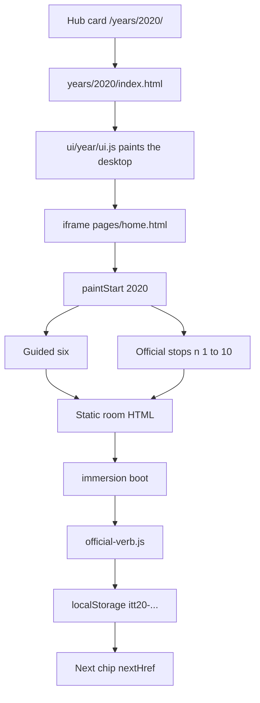
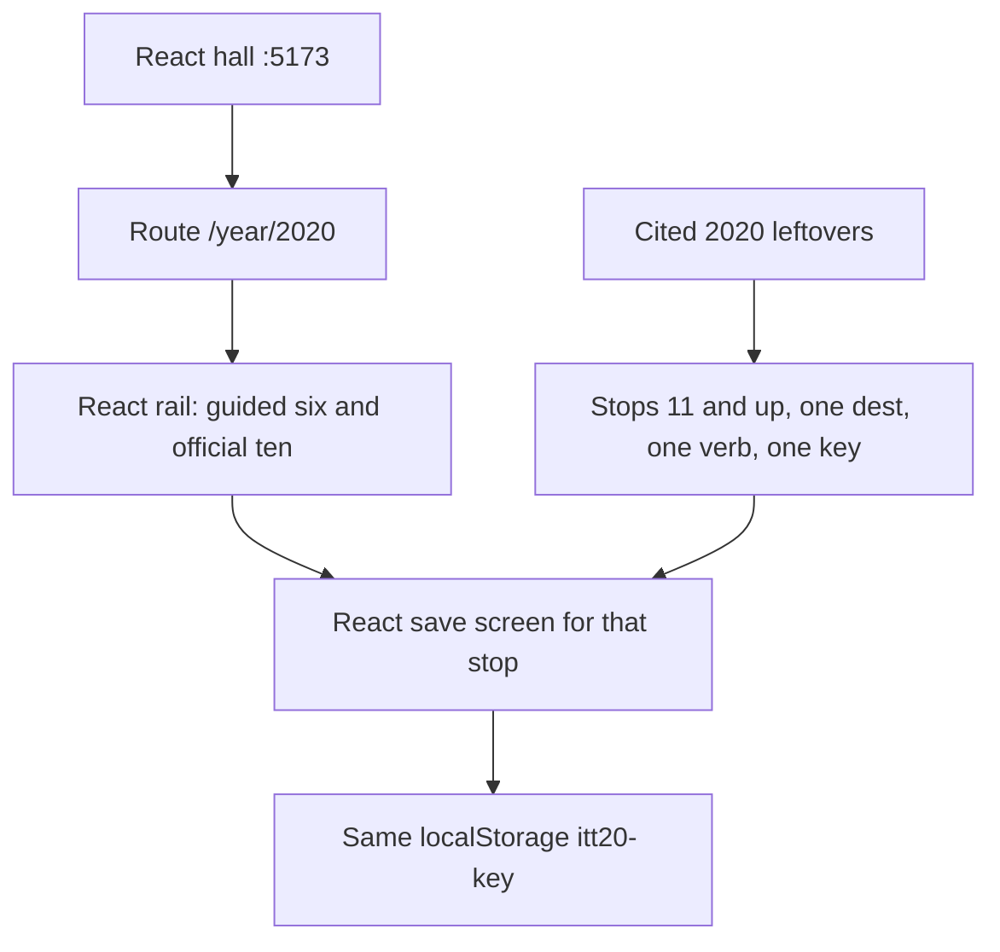

# 2020 — existing flow, then the React flow

**Date:** 2026-09-25
**Static HTML:** `years/2020/` is removed. The hub card opens the built React year.
**React door:** [http://127.0.0.1:8080/app/index.html#/year/2020](http://127.0.0.1:8080/app/index.html#/year/2020)
**Trail:** `js/config/flow-trails.js` year `"2020"`. Ten stops. Stop 10 returns to Zoom Leave.
**Star:** `itt20-zoom` on `sites/zoom/meeting.html`. Leave is the save. Stay and an empty click write nothing.
**Research:** `deep-research` is still running. This file does not list new leftover stops until that pass returns a primary 2020 URL and date for each one.

## Existing flow

| Step | File | What the visitor gets |
|---|---|---|
| 1 | Hub card `y2020` | Enters `/years/2020/` |
| 2 | `years/2020/index.html` | `ITT.YearUI.paint("2020")` |
| 3 | `ui/year/shell.js` | Desktop and iframe aimed at `pages/home.html` |
| 4 | `years/2020/pages/home.html` | `ITT.YearUI.paintStart("2020")` |
| 5 | `ui/year/start-data.js` | Star plus six links: About, Zoom Leave, Houseparty, Classroom, Among Us, flow map |
| 6 | `js/config/flow-trails.js` | The ten stops below |
| 7 | Room HTML | Period page. Finished visit writes that stop's `whenKey` |
| 8 | `official-verb.js` | Empty, Stay, and trap write nothing. A finished Leave writes `itt20-zoom` with `{official:true, year:"2020"}` |

Official ten, in order. These stay frozen.

| n | Room | Key | Next |
|--:|---|---|---|
| 1 | `sites/zoom/meeting.html` | `itt20-zoom` | Houseparty |
| 2 | `sites/houseparty/index.html` | `itt20-houseparty` | Discord |
| 3 | `sites/discord/index.html` | `itt20-discord` | Teams |
| 4 | `sites/teams/index.html` | `itt20-teams` | Classroom |
| 5 | `sites/classroom/index.html` | `itt20-classroom` | Netflix |
| 6 | `sites/netflix/index.html` | `itt20-netflix` | TikTok |
| 7 | `sites/tiktok/index.html` | `itt20-tiktok` | Among Us |
| 8 | `sites/amongus/index.html` | `itt20-amongus` | Animal Crossing |
| 9 | `sites/animalcrossing/index.html` | `itt20-acnh` | Year game |
| 10 | `sites/playable/game.html` | `itt20-game-leave` | Zoom Leave |

The guided six is About, Zoom, Houseparty, Classroom, Among Us, and the flow map. Discord, Teams, Netflix, TikTok, Animal Crossing, and the year game are on the official ten and are not in that six.

There is no leftover trail after n 10. [`FIVE-K-SITE-WALK.md`](FIVE-K-SITE-WALK.md) section 2020 says KEEP 12 and **0 cited rows that are not already on disk**. Names in that list without their own cite row: Coinbase, Figma, HBO Max, Notion, Peacock, Robinhood. Airbnb is marked do not add. Those names are not flows yet.

## New flow

Same shape as 2014. React owns the door. Each official stop gets a React save screen. HTML stays for the hub until the React door is the one the hub and the tests use.

| Piece | Today | Next |
|---|---|---|
| Hall card | React, generic shell | Stays |
| `/year/2020` | Buttons open the static room in a frame | A `Year2020` rail, same pattern as `Year2014` |
| Official ten saves | Still the HTML room | One React screen per stop. Same key. Empty and trap write nothing |
| About, Starting Point, flow map | Static pages in the frame | Stay framed until each has its own React page |
| Extra flows | None | Only after `deep-research` returns a 2020 date and a primary URL |

Order:

1. Freeze the table above. Do not rename `itt20-zoom` and do not add a second key on Zoom.
2. Build `react/src/year2020.js` and `Year2020.jsx` from that table. Zoom first: Leave writes `itt20-zoom`. Stay writes nothing.
3. Repeat for stops 2 through 10. One screen at a time. Leave each HTML file in place.
4. When the research report lands, score each candidate against this file. A row needs a product, one verb, a 2020 date, and one primary URL. Drop 2019 and 2021 dates. Drop anything already in the official ten.
5. Add at most the accepted leftovers as n 11 upward. One new folder only if the page is not already on disk. Do not dest-farm the five-thousand-site list into folders.

## Research result — 16 leftovers, not built

**Status:** partial. The pass returned 16 products with a 2020 public date. It did not fill 20. None of these screens exist yet. The official ten stay frozen. A second key on Zoom, Houseparty, Discord, Teams, Classroom, Netflix, TikTok, Among Us, Animal Crossing, or the year game is refused.

| n | Product | Verb | Date | Primary page |
|--:|---|---|---|---|
| 11 | Messenger Rooms | Join | 24 Apr 2020 | https://about.fb.com/news/2020/04/introducing-messenger-rooms/ |
| 12 | Instagram Live Shopping | Shop | 25 Aug 2020 | https://about.fb.com/news/2020/08/making-it-easier-to-shop-and-sell-on-our-apps/ |
| 13 | Amazon Live | Shop | 27 Sep 2020 | https://press.aboutamazon.com/2020/9/mark-your-calendars-prime-day-is-here-in-time-for-the-holidays-on-october-13-14 |
| 14 | Twitter Spaces | Join | 17 Dec 2020 | https://x.com/kayvz/status/1339642353032724482 |
| 15 | Instagram Reels | Record | 5 Aug 2020 | https://about.instagram.com/blog/announcements/introducing-instagram-reels-announcement |
| 16 | YouTube Shorts | Watch | 14 Sep 2020 | https://blog.youtube/news-and-events/building-youtube-shorts/ |
| 17 | Snapchat Spotlight | Submit | 23 Nov 2020 | https://newsroom.snap.com/introducing-spotlight |
| 18 | Fall Guys | Play | 4 Aug 2020 PS4 debut | https://blog.playstation.com/2020/07/27/ps-plus-games-for-august-announced/ |
| 19 | VALORANT | Play | 2 Jun 2020 worldwide | https://playvalorant.com/en-us/news/announcements/valorant-closed-beta-ends-may-28/ |
| 20 | Warzone | Drop | 10 Mar 2020 | https://investor.activision.com/news-releases/news-release-details/call-duty-delivers-game-changing-free-play-experience-call-duty |
| 21 | Flight Simulator | Fly | 18 Aug 2020 | https://news.xbox.com/en-us/2020/08/18/microsoft-flight-simulator-available-now/ |
| 22 | Chromium Edge | Download | 15 Jan 2020 | https://blogs.windows.com/windowsexperience/2020/01/15/new-year-new-browser-the-new-microsoft-edge-is-out-of-preview-and-now-available-for-download/ |
| 23 | macOS Big Sur | Update | 12 Nov 2020 | https://www.apple.com/newsroom/2020/11/macos-big-sur-is-here/ |
| 24 | Chrome third-party cookies | Phase out | Wayback 14 Jan 2020 | https://web.archive.org/web/20200114235027/https://blog.chromium.org/2020/01/building-more-private-web-path-towards.html |
| 25 | PayPal crypto | Buy | 21 Oct 2020 | https://newsroom.paypal-corp.com/2020-10-21-PayPal-Launches-New-Service-Enabling-Users-to-Buy-Hold-and-Sell-Cryptocurrency |
| 26 | Google News Showcase | Read | 1 Oct 2020 | https://blog.google/company-news/outreach-and-initiatives/google-news-initiative/google-news-showcase/ |

Dropped: Coinbase, Figma, HBO Max, Notion, Peacock, and Robinhood had no cite row in the five-thousand-site note. Robinhood’s buy limit is 28 Jan 2021. Airbnb stays on the 2011 key. Clubhouse had no 2020 public-launch post. Slack Connect and Skype Meet Now had no company post opened. Quibi, Byte, and Genshin had no primary page opened in this pass.

Holds before any of these become a screen: Messenger Rooms rolled out in some countries that week, not worldwide on 24 Apr. Amazon Live itself started in 2019; the September page is a Prime Day feature. The Chrome cookie day is the Wayback capture time, not a byline printed on the live post. PayPal merchant checkout is early 2021. Only the US buy, hold, and sell date is 2020.
