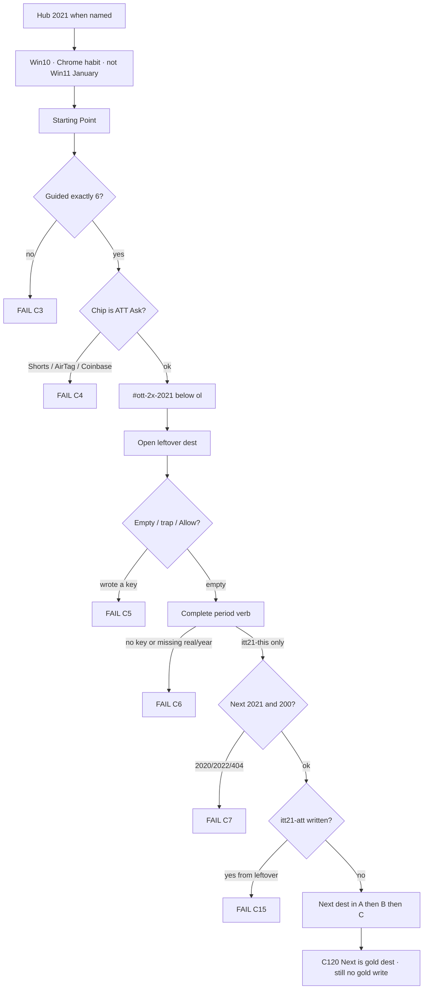

# 2021 — 2× leftover criteria map

**Date:** 2026-09-01  
**Not an implement order.** Tick a **row id**. Implement only what you name.  
**Year is wiped.** `years/2021/` is **absent**. Hub card **locked**. `_WIPED` includes **2021**.

**This file is the lock for “does leftover 2× match the other years.”** Gates going green is not enough. HTML count is not enough. A 51-row second-path pad is not enough.

**Read first:** [`2021-READ-FIRST.md`](2021-READ-FIRST.md)  
**2× dest list:** [`2021-2X-LEFTOVER-RESEARCH-2026-09-01.md`](2021-2X-LEFTOVER-RESEARCH-2026-09-01.md)  
**Walk this (goals · phases · every dest minute):** [`2021-2X-LEFTOVER-GOALS-PHASES-FLOWS-MINUTE-2026-09-01.md`](2021-2X-LEFTOVER-GOALS-PHASES-FLOWS-MINUTE-2026-09-01.md)  
**Year lock / scale / official 10:** [`2021-FROM-SCRATCH-RESEARCH-GOALS-PHASES-FLOWS-MINUTE-VISITED-2026-09-01.md`](2021-FROM-SCRATCH-RESEARCH-GOALS-PHASES-FLOWS-MINUTE-VISITED-2026-09-01.md)  
**Bar language:** [`MUSEUM-DENSITY-MAP-2026-08-29.md`](MUSEUM-DENSITY-MAP-2026-08-29.md) B1–B6  
**Peer leftover cut:** [`2005-2X-LEFTOVER-RESEARCH-2026-08-31.md`](2005-2X-LEFTOVER-RESEARCH-2026-08-31.md) (120 = 40+40+40)  
**Disk:** [`DISK-TRUTH.md`](DISK-TRUTH.md) + `scripts/itt_gate.py`

When sources disagree: **this map + the 2026-09-01 leftover freeze win.** Older “51 rows / 32 `-dp` / 85 HTML / 376 HTML / door live / SHIP_YEARS includes 2021” sentences **lose**.

---

## Law (do not break)

Museum live ends **2019**. **2020–2025 boarded.** 2007 / 2009 / 2011 boarded. Guided **exactly 6**. Official **10**. Star does **not** move (`itt21-att` · Ask App Not to Track). Empty / trap / 0 ticks / 1 hop / skip wait / **Allow Tracking** **never write**. Leftover complete **never** writes the star. No dest-field plaques. No invented brand pixels. ILS June **table ends 2018** — **no June 2021 websites cell**. Netcraft Jan **1,197,982,359**. ITU **4.9B / 63%**. 2× leftover is **120** writers (Pack A 40 + Pack B 40 + Pack C 40). Do **not** pad to 2018’s **171**. Do **not** ship an 18-row stub as 2×. Do **not** `git checkout` an old 2020–2025 forest. Log4j verb = **patch**. No live IDFA / mint / broker. No ChatGPT / Wordle-millions / Meta-app / Zoom-as-2021-gold as defaults.

Year differences live in **config + content**, not a skin.

---

## Criteria (always)

Same envelope as 2005 2× leftover, 2014 6× leftover, 2001–2002 criteria map.

| # | Rule | Fail if |
|--:|------|---------|
| C1 | 2× = leftover **REAL writers** a visitor can finish. Not 2× raw hrefs. Not dest-field plaques. | “I read the 2021 note” ships |
| C2 | **120** writers · Pack A 40 + Pack B 40 + Pack C 40 | 18-row stub · 51-row pad · 32-row deepen alone |
| C3 | Guided `#ott-guided-2021 ol > li` **exactly 6** | 7th `<li>` |
| C4 | Star **ATT Ask** does not move. `itt21-att` is **never** a 2× key | chip is Shorts / AirTag / Coinbase / Clubhouse |
| C5 | Incomplete / trap / empty / 0 ticks / 1 hop / skip wait / Allow **never writes** | Allow writes · empty writes |
| C6 | Complete writes `{real:true, multiStep:true, year:"2021", kind}` under `itt21-<suffix>` | missing `real` or `year` |
| C7 | Next hidden until **this** dest’s key exists. Next is a **2021** dest, HTTP 200 | Next to 2020/2022 · 404 |
| C8 | Prefix `itt21-*` only after a walk | any `itt20-*` / `itt22-*` |
| C9 | ILS June **table ends 2018**. Netcraft Jan **1,197,982,359**. ITU **4.9B / 63%** | invented June 2021 websites cell |
| C10 | Dual-cite Pack A. Continuity Pack C may be thin | Pack A unsourced |
| C11 | No official Apple / YouTube / Meta / Coinbase / OpenSea / Discord / TikTok pixels | brand still as art |
| C12 | Log4j verb = **patch**. No exploit / PoC | payload room |
| C13 | Strip `#ott-2x-2021` sits **below** guided, not inside the `<ol>` | strip inside guided |
| C14 | Do not implement until named. Do not `git checkout` an old forest | HTML this pass |
| C15 | Leftover complete **never** writes `itt21-att`. ATT literacy leftover is `itt21-att-lx` | leftover writes gold |
| C16 | Wordle seed is **90 users 1 Nov**. NYT / millions is **2022** | Wordle-millions dest |
| C17 | ChatGPT / GPT-4 / Threads / X / Midjourney-mass / SD-mass are **not** 2021 dests | Send as 2021 gold |
| C18 | Extra games a–i and game-2…5 are **cabinets**, not part of the 120 | cabinet counted as a 2× dest |
| C19 | Five Letter is official **game**, not a 2× key | game gold on the leftover strip |
| C20 | Pack C thin is OK. Pack C still REAL. Still 2021 leftover. Never the chip | dest-field continuity |

---

## What “match other years” means here

A year is **not** dense enough if any of these is still true:

| Bar | Fail if |
|-----|---------|
| **V1 Variety** | Most folders are **another year’s rooms** (2017 Vine / 2018 TikTok-merge / 2019 Continue / 2020 Zoom / 2022 ChatGPT) with a 2021 sticker |
| **V2 Amount** | Count of **year-true leftover products** is a thin 18 / 32 / 51 pad, not Pack A 40 year-true products + leftover-official + continuity |
| **V3 Number** | HTML went up by **reprinting an old 2021 forest** or cloning 2017 leftovers, not by adding 2021 dests |
| **B1 Verb** | Visitor leftover is still **Type leftover** / **Save leftover** / **Do leftover** |
| **B2 Depth** | Official / named leftover dest is a **single** `index.html` with no second period page |
| **B3 Named leftover** | A leftover this map **named as a dest** is still not a folder, or is a 1-line stub |
| **B4 Listed** | Dest folder exists but Starting Point / `#ott-2x-2021` never links it |
| **B5 Games** | Famous cabinets ≠ 2, or year game is plaque-only, or a cabinet is counted as one of the 120 |
| **B6 Honesty** | Room still *is* 2020 Zoom, 2022 ChatGPT, Win11-as-January, Meta-the-app, Wordle-millions, Allow-as-save |

A year **is** dense enough when:

1. The **named 120** leftover dests exist as **that year’s** rooms (or honest second paths on listed rooms).  
2. Each has a **year-true verb** + visible trap + Next 200.  
3. Portals (YouTube / Wikipedia / Facebook / Google / Amazon) are **costume leftover**, rewritten for 2021 — not a 2017/2020 dump.  
4. Starting Point lists those dests **below** guided. Famous = 2. Star + guided stay locked.  
5. HTML count is a **side effect**, not the goal.

**2005 is the leftover-count peer.** 2005 2× is dense because it has **120 leftover REAL writers**. It is not dense because Yahoo has many pages. **2014 6×** is the dest-minute peer (incomplete / trap / complete / Next).

Shared leftover machine:

```
open dest
  empty / trap / 0 ticks / 1 hop / skip wait / Allow   →  no key
  complete year-true verb                              →  itt21-*  {real, multiStep, year:"2021", kind}
  Next href HTTP 200 · gold key unchanged
```



---

## Two legal cuts (pick one before any implement)

Do not mix these. The first 2021 door mixed them: lean HTML **plus** a 51-row second-path pad, and called it 2×.

| Id | Cut | Door | 2× | Variety rule |
|----|-----|------|---:|--------------|
| **CUT-LEAN** | READ-FIRST lean door only | star + guided 6 + official 10 + About dual-cite | **0** leftover 2× dests this cut | Year-true gold. Portals are leftover hops, not a forest. |
| **CUT-2X** | 2005 leftover peer | lean door **plus** `#ott-2x-2021` | **120** (40+40+40) | Pack A year-true products first. Pack B leftover-official / 3×. Pack C continuity costume. |

**STRIKE if ticked as a build plan:** restore the old `years/2021/` forest and call it 2×.  
**STRIKE if ticked as 2×:** 18-row stub · 32-row deepen alone · 51-row `sig-lx` / `attabout` / extra-a–e pad.

Do **not** start CUT-2X until CUT-LEAN P0 is named and shipped.

---

## Disk now (2026-09-01 after wipe)

**Cut used:** **none.** Year is wiped. This map is a freeze.

| | 2021 now | Peer |
|--|----------|------|
| HTML | **0** · `years/2021/` **absent** | 2019 live · 2005 wipe+freeze · 2020 wiped |
| Site folders | **0** | — |
| Hub card | **locked** · `year-card locked y2021` | 2020 / 2022–2025 also locked |
| `SHIP_YEARS` | 2021 in `_WIPED` | 23 open years end **2019** |
| `start-data.js` / `start-extra.js` | **no** `"2021"` key | — |
| `flow-trails.js` | **no** `"2021"` block | — |
| 2× matrix rows | **0** | bible **120** · not 51 · not 171 |
| Star | ATT Ask `itt21-att` — **not on disk** | do not move when rebuilt |
| Guided 6 | lock only | About · ATT · Signal · Copilot · Meta · Map |
| Official 10 | lock only | ATT · Signal · Copilot · Meta · Win11 · Flash · Chrome · Win10 · Facebook leftover · Five Letter |
| Neighbor years | 2020 / 2022–2025 **stay wiped** | do not invent dests for them |

---

# L. LAW ROWS

Tick **L-*** only if you are checking a hard lock. These are not dest work.

| Id | Criterion | Target | Disk now |
|----|-----------|--------|----------|
| **L-board** | 2020–2025 wiped · live ends 2019 | no `years/2021/` · no `years/2020/` · no `years/2022/` | **ON DISK** (wiped) |
| **L-guide** | Guided exactly 6 | do not grow the chip `<ol>` | **LOCK** (no tree) |
| **L-off10** | Official 10 | locked trail · Five Letter is the game | **LOCK** |
| **L-star** | Star does not move | `itt21-att` · Ask App Not to Track | **LOCK** |
| **L-empty** | Empty / trap / 0 ticks never write | Allow · empty Ask · 0 ticks | **LOCK** |
| **L-allow** | Allow Tracking never writes gold | Ask is the save | **LOCK** |
| **L-lx** | ATT literacy leftover ≠ gold | `itt21-att-lx` never writes `itt21-att` | **LOCK** |
| **L-px** | No invented brand pixels | harvest or `[failed-final]` | **LOCK** |
| **L-wipe** | Do not checkout wiped forests | no 376-file git restore | **ON DISK** (tree gone) |
| **L-171** | Do not pad 2× to 171 | 2018’s 171 banned | **LOCK** |
| **L-120** | 2× leftover is the **named 120** | do **not** ship 18 / 32 / 51 as 2× | **LOCK** |
| **L-ils** | ILS June table ends 2018 | print **1,630,322,579** as last June cell · no 2021 row | **LOCK** |
| **L-net** | Netcraft is January | **1,197,982,359** · never call it June | **LOCK** |
| **L-itu** | ITU is people | **4.9B / 63%** · do not blend with hostnames | **LOCK** |
| **L-log4j** | Verb is patch | no exploit / PoC | **LOCK** |
| **L-chatgpt** | No ChatGPT dest | Send is **2022** | **LOCK** |
| **L-wordle** | Seed only | 90 users 1 Nov · NYT **2022** | **LOCK** |
| **L-meta** | App stays Facebook | rename leftover ≠ consumer app | **LOCK** |
| **L-win11** | Win11 is 5 Oct leftover | Win10 is January mass | **LOCK** |
| **L-zoom** | Zoom is not 2021 gold | Join is **2020** · wiped sibling | **LOCK** |
| **L-prefix** | `itt21-*` only | no `itt20-*` / `itt22-*` | **LOCK** |
| **L-year** | Config + content are 2021 | not a 2017 leftover skin | **LOCK** |

**Guided 6 (lock):**

About → ★ ATT Ask → Signal leftover → Copilot waitlist → Meta rename → Year map.

**Official 10 (lock):**

ATT Ask · Signal leftover · Copilot waitlist · Meta rename · Win11 leftover · Flash brick · Chrome habit · Win10 residual · Facebook leftover · Five Letter.

---

# V. VARIETY / NUMBER / AMOUNT

This is the bar the first 2021 door missed (51-row pad on thin rooms).

| Id | Criterion | Pass looks like | Disk now |
|----|-----------|-----------------|----------|
| **V1-21** | 2021 variety | Year-true mix: Shorts · AirTag · Coinbase · Beeple · BAYC · Log4j patch · iOS 15 Focus · Spaces · Super Follows · FB outage · Haugen · DALL·E 1 · Codex · Win365 · Android 12 · Pixel 6 · Wordle seed. Official leftover: Signal / Copilot / Meta / Win11 / Flash. Portals are 2021 costume. | **WIPED** — no folders |
| **V2-21** | Amount of *other* 2021 websites | Named 120 are real leftover machines, not About plaques | **WIPED** |
| **V3-21** | Number (HTML) is a side effect of year-true dests | Restoring 376 HTML ≠ pass | **WIPED** (0 HTML) |
| **V4-21** | Peer check | 2005 2× = **120**. 2014 6× = dest-minute honesty. 2018 2× = **171** is **banned** as a target. | bible **120** |

**Do not score V\* by `find years/2021 -name '*.html' | wc`.**  
**Do not score V\* by matrix row count if those rows are second-path pads on the same thin room.**

---

# N. NAMED 2× LEFTOVER 120

Bible dests. Each row is one leftover machine. Star key `itt21-att` stays **off** this list.

Every row: Disk now = **WIPED** (no folder). Depth = —. Verb = **LOCK** (named, not built).

## Pack A — year-true 2021 products (40) · `itt21-*-dp` / listed key

| Id | Dest | Verb | Key suffix | Path when named |
|----|------|------|------------|-----------------|
| **N-A01** | YouTube Shorts leftover | hops · Watch + Create | `shorts-dp` | `sites/shorts/index.html` |
| **N-A02** | AirTag leftover | query · `$29` / 20 Apr / iOS 14.5 | `airtag-dp` | `sites/airtag/index.html` |
| **N-A03** | Coinbase listing leftover | checks · 14 Apr COIN · not live trade | `coin-dp` | `sites/coinbase/index.html` |
| **N-A04** | Beeple Everydays leftover | checks · 11 Mar $69.3M · no live mint | `beeple-dp` | `sites/beeple/index.html` |
| **N-A05** | BAYC leftover | query · 0.08 ETH · Apr/May · no live mint | `bayc-dp` | `sites/bayc/index.html` |
| **N-A06** | Log4j **patch** leftover | checks · 9 Dec · **no exploit** | `log4j-dp` | `sites/log4j/index.html` |
| **N-A07** | WhatsApp policy leftover | checks · 4 Jan / 15 May · not Signal gold | `wa21-dp` | `sites/whatsapp21/index.html` |
| **N-A08** | Telegram surge leftover | query · ~5.6M 6–10 Jan | `tg21-dp` | `sites/telegram21/index.html` |
| **N-A09** | iOS 15 Focus leftover | checks · 20 Sep · not ATT gold | `ios15-dp` | `sites/ios15/index.html` |
| **N-A10** | Mail Privacy leftover | checks · iOS 15 · no live inbox | `mailpp-dp` | `sites/mailpriv/index.html` |
| **N-A11** | iCloud Private Relay leftover | wait · beta · no live VPN | `relay-dp` | `sites/relay/index.html` |
| **N-A12** | Hide My Email leftover | query · iOS 15 · no live Apple ID | `hidemail-dp` | `sites/hidemail/index.html` |
| **N-A13** | Twitter Spaces leftover | hops · 3 May / 21 Oct · still Twitter · not X | `spaces-dp` | `sites/spaces21/index.html` |
| **N-A14** | Super Follows leftover | query · $2.99 / $4.99 / $9.99 · not X Premium | `superfol-dp` | `sites/superfol/index.html` |
| **N-A15** | Facebook outage leftover | checks · 4 Oct BGP · app still Facebook | `fbout-dp` | `sites/fboutage/index.html` |
| **N-A16** | Haugen leftover | checks · 3 Oct / 5 Oct · no leak dump | `haugen-dp` | `sites/haugen/index.html` |
| **N-A17** | DALL·E 1 leftover | query · 5 Jan research · **not public** · not Midjourney | `dalle1-dp` | `sites/dalle1/index.html` |
| **N-A18** | OpenAI Codex leftover | query · 10 Aug private beta · not ChatGPT | `codex-dp` | `sites/codex/index.html` |
| **N-A19** | Windows 365 leftover | checks · 14 Jul · not Win11-as-January | `win365-dp` | `sites/win365/index.html` |
| **N-A20** | Android 12 leftover | checks · 4 Oct Material You | `and12-dp` | `sites/android12/index.html` |
| **N-A21** | Pixel 6 leftover | query · 19 Oct Tensor · no official glyph | `pixel6-dp` | `sites/pixel6/index.html` |
| **N-A22** | TikTok-as-2021 leftover | hops · not 2018 merge gold · not Reels | `tt21-dp` | `sites/tiktok21/index.html` |
| **N-A23** | Snap Spotlight leftover | hops · not Snap-as-gold | `spotlight-dp` | `sites/snapspot/index.html` |
| **N-A24** | Discord Stage leftover | hops · no live voice | `dstage-dp` | `sites/dstage/index.html` |
| **N-A25** | Substack leftover | query · no live subscribe | `substack-dp` | `sites/substack21/index.html` |
| **N-A26** | Notion 2021 leftover | query · no live workspace | `notion21-dp` | `sites/notion21/index.html` |
| **N-A27** | FigJam leftover | hops · no live board | `figjam-dp` | `sites/figjam/index.html` |
| **N-A28** | Roblox listing leftover | checks · 10 Mar · no live trade | `rbxipo-dp` | `sites/rbxipo/index.html` |
| **N-A29** | Affirm leftover | checks · 13 Jan · no live loan | `affirm-dp` | `sites/affirm/index.html` |
| **N-A30** | Paramount+ leftover | query · 4 Mar · not Disney+ Continue | `paramount-dp` | `sites/paramount/index.html` |
| **N-A31** | Disney+ Day leftover | hops · 12 Nov · Continue stays **2019** | `dplus21-dp` | `sites/dplus21/index.html` |
| **N-A32** | NBA Top Shot leftover | query · 22 Feb class · no live mint | `topshot-dp` | `sites/topshot/index.html` |
| **N-A33** | Clubhouse leftover | hops · not the chip · no live room | `club-dp` | `sites/clubhouse/index.html` |
| **N-A34** | GME leftover | checks · Jan literacy · **no live broker** | `gme-dp` | `sites/gme/index.html` |
| **N-A35** | Epic v Apple leftover | checks · no live store | `epic-dp` | `sites/epic/index.html` |
| **N-A36** | Robinhood leftover | checks · no live trade | `hood-dp` | `sites/robinhood/index.html` |
| **N-A37** | OpenSea leftover | query · **no live mint** | `opensea-dp` | `sites/opensea/index.html` |
| **N-A38** | Wordle **seed** leftover | query · 90 users 1 Nov · NYT is **2022** | `wordle-dp` | `sites/wordleseed/index.html` |
| **N-A39** | Copilot **second path** | query · not ChatGPT · not official waitlist key | `cop-lx` | `sites/copilot/more.html` |
| **N-A40** | ATT **literacy leftover** | checks · **never** writes `itt21-att` | `att-lx` | `sites/att/about.html` |

**Pack A fail if:** India Shorts beta stamped 2021 · AirTag without $29 / iOS 14.5 · Coinbase live order · Beeple/BAYC/OpenSea/Top Shot live mint · Log4j payload · WhatsApp-as-ATT · iOS 15 writes gold · Spaces/Super Follows as X · “Meta is down” as app name · DALL·E as public generator · Codex as ChatGPT · Win365 as Win11 January · TikTok-as-star · Continue-as-2021-gold · Wordle millions · `att-lx` writes `itt21-att`.

## Pack B — leftover-official / 3× / second paths (40)

None is the Ask write. Official leftover dests may live here. Five Letter is **not** here.

| Id | Dest | Verb | Key suffix | Path when named |
|----|------|------|------------|-----------------|
| **N-B41** | Signal leftover | query · handle + 2 ticks | `signal` | `sites/signal/index.html` |
| **N-B42** | Signal 2nd path | hops | `sig-lx` | `sites/signal/more.html` |
| **N-B43** | Copilot waitlist | query · empty email never writes · not ChatGPT | `copilot` | `sites/copilot/index.html` |
| **N-B44** | Meta rename | checks · 28 Oct · app stays Facebook | `meta` | `sites/meta/index.html` |
| **N-B45** | Meta app stays FB | checks | `meta-lx` | `sites/meta/about.html` |
| **N-B46** | Win11 leftover | checks · 4–5 Oct phased | `win11` | `sites/windows11/index.html` |
| **N-B47** | Win11 not January | checks | `win11-lx` | `sites/windows11/about.html` |
| **N-B48** | Flash brick | checks · 12 Jan block · Play SWF is trap | `flash-brick` | `sites/flash/index.html` |
| **N-B49** | Flash Play trap | hops · live SWF never writes | `flash-lx` | `sites/flash/about.html` |
| **N-B50** | Chrome habit | checks · no official logo | `chrome` | `sites/chrome/index.html` |
| **N-B51** | Chrome 2nd path | query | `chrome-lx` | `sites/chrome/about.html` |
| **N-B52** | Win10 residual | checks · mass January | `win10` | `sites/windows10/index.html` |
| **N-B53** | Facebook leftover | query · not ATT gold | `pop-facebook` | `sites/facebook/index.html` |
| **N-B54** | YouTube leftover 3× | hops · not Shorts-as-gold | `pop-youtube` | `sites/youtube/index.html` |
| **N-B55** | Wikipedia leftover 3× | query · no live edit | `pop-wiki` | `sites/wikipedia/index.html` |
| **N-B56** | Facebook leftover 3× | hops · not Meta app | `pop-fb3` | `sites/facebook3x/index.html` |
| **N-B57** | Clubhouse 3×3 | hops · not the chip | `pop3-club` | `sites/clubhouse/about.html` |
| **N-B58** | NFT literacy 3×3 | checks · no live mint | `pop3-nft` | `sites/nft/index.html` |
| **N-B59** | Squid print 3×3 | query · no official stills | `pop3-squid` | `sites/squid/index.html` |
| **N-B60** | musical.ly leftover | hops · merge is **2018** | `mly-lx` | `sites/musically17/index.html` |
| **N-B61** | Equifax leftover | checks · no live SSN | `eq-lx` | `sites/equifax/index.html` |
| **N-B62** | AirPods leftover | query · no official glyph | `pods-lx` | `sites/airpods17/index.html` |
| **N-B63** | Discord leftover | hops · no live stage | `disc-lx` | `sites/discord17/index.html` |
| **N-B64** | Echo Show leftover | query · no live Alexa | `echo-lx` | `sites/echoshow/index.html` |
| **N-B65** | Pixel leftover 2 | checks | `pix-lx` | `sites/pixel2/index.html` |
| **N-B66** | Telegram leftover 2 | hops · not Telegram-as-gold | `tg-lx` | `sites/telegram17/index.html` |
| **N-B67** | Watch leftover | query · no official glyph | `watch-lx` | `sites/watch3/index.html` |
| **N-B68** | Xbox leftover | hops | `xbox-lx` | `sites/xboxonex/index.html` |
| **N-B69** | Yahoo 3B leftover | checks | `y3b-lx` | `sites/yahoo3b/index.html` |
| **N-B70** | Zoom leftover note | checks · Join-as-save is trap · not 2020 gold | `zoom-lx` | `sites/zoom17/index.html` |
| **N-B71** | Teams leftover | query | `teams-lx` | `sites/teams/index.html` |
| **N-B72** | Slack leftover | hops · no live workspace | `slack-lx` | `sites/slack17/index.html` |
| **N-B73** | Bitcoin leftover | checks · no live trade | `btc-lx` | `sites/bitcoinath/index.html` |
| **N-B74** | NFT mint-trap dest | checks · mint button never writes | `nft-lx` | `sites/nft/about.html` |
| **N-B75** | Spaces 2nd path | hops · not X | `spc-lx` | `sites/spaces21/about.html` |
| **N-B76** | Super Follows 2nd | query · not X Premium | `sf-lx` | `sites/superfol/about.html` |
| **N-B77** | iCloud leftover | checks · no live iCloud | `icloud-lx` | `sites/icloud21/index.html` |
| **N-B78** | FaceTime leftover | hops · no live call | `ft-lx` | `sites/facetime21/index.html` |
| **N-B79** | iMessage leftover | query · no live iMessage | `imsg-lx` | `sites/imessage21/index.html` |
| **N-B80** | Win11 pop-more 2nd | checks · not January mass | `w11-more` | `sites/win11more/index.html` |

**Pack B fail if:** Signal writes ATT · Copilot is ChatGPT Send · Meta opens a consumer app · Win11 is January chrome · Flash Play writes · official Chrome pixels · Zoom Join writes 2020 gold · musical.ly stamped as 2021 merge · WannaCry / iOS 11 / Snap IPO / Vine-gone cloned as 2021 rooms · Five Letter counted as a 2× dest.

**Skip (not dests):** WannaCry (**2017**) · iOS 11 (**2017**) · Vine-gone (**2017**) · Snap IPO (**2017**).

## Pack C — mass continuity leftover (40)

Thin OK. Still REAL. Still 2021 leftover. Never the chip.

| Id | Dest | Verb | Key suffix | Path when named |
|----|------|------|------------|-----------------|
| **N-C81** | YouTube leftover watch | hops · not Shorts-as-gold | `yt-lx` | `sites/youtube/watch.html` |
| **N-C82** | Wikipedia leftover edit | query · no live save | `wk-lx` | `sites/wikipedia/edit.html` |
| **N-C83** | Amazon leftover | query · not 1-Click gold | `amzn-lx` | `sites/amazon/index.html` |
| **N-C84** | Reddit leftover | hops · no live submit | `reddit-lx` | `sites/reddit/index.html` |
| **N-C85** | Netflix leftover | query · no live stream | `nfx-lx` | `sites/netflix/index.html` |
| **N-C86** | Spotify leftover | hops · no live play | `spot-lx` | `sites/spotify/index.html` |
| **N-C87** | Instagram leftover | hops · Stories is **2016** | `ig-lx` | `sites/instagram/index.html` |
| **N-C88** | Twitter leftover | query · **still Twitter · not X** | `tw-lx` | `sites/twitter/index.html` |
| **N-C89** | TikTok leftover 2 | hops · not 2018 merge gold | `tt-lx` | `sites/tiktok/index.html` |
| **N-C90** | Google leftover | query · not Lucky-as-2021 | `g-lx` | `sites/google/index.html` |
| **N-C91** | Gmail leftover | hops · no live send | `gm-lx` | `sites/gmail/index.html` |
| **N-C92** | Maps leftover | query · Street View is **2007** | `maps-lx` | `sites/maps/index.html` |
| **N-C93** | PayPal leftover | checks · no live pay | `pp-lx` | `sites/paypal/index.html` |
| **N-C94** | Slack leftover 2 | hops | `sl-lx` | `sites/slack/index.html` |
| **N-C95** | Discord leftover 2 | query · no live voice | `dc-lx` | `sites/discord/index.html` |
| **N-C96** | Zoom leftover 2 | checks · Join-as-save trap · not 2020 gold | `zm-lx` | `sites/zoom/index.html` |
| **N-C97** | Teams leftover 2 | hops | `tm-lx` | `sites/teams21/index.html` |
| **N-C98** | Notion leftover 2 | query | `no-lx` | `sites/notion/index.html` |
| **N-C99** | Figma leftover | hops · no live file | `fg-lx` | `sites/figma/index.html` |
| **N-C100** | GitHub leftover | query · not Copilot-as-gold | `gh-lx` | `sites/github/index.html` |
| **N-C101** | LinkedIn leftover | hops | `li-lx` | `sites/linkedin/index.html` |
| **N-C102** | Twitch leftover | query · no live bits | `twitch-lx` | `sites/twitch/index.html` |
| **N-C103** | Steam leftover | hops · no live buy | `steam-lx` | `sites/steam/index.html` |
| **N-C104** | Epic leftover 2 | checks · no live store | `egs-lx` | `sites/epicstore/index.html` |
| **N-C105** | PlayStation leftover | query · no official mark | `ps-lx` | `sites/playstation/index.html` |
| **N-C106** | Xbox leftover 2 | hops | `xb-lx` | `sites/xbox/index.html` |
| **N-C107** | Nintendo leftover | query · Switch is **2017** gold | `nin-lx` | `sites/nintendo/index.html` |
| **N-C108** | Fortnite leftover | hops · not 2017 gold | `fn-lx` | `sites/fortnite/index.html` |
| **N-C109** | Among Us leftover | checks · viral is **2020** | `au-lx` | `sites/amongus/index.html` |
| **N-C110** | Roblox leftover play | hops · not IPO-as-this-dest | `rbx-lx` | `sites/roblox/index.html` |
| **N-C111** | Substack leftover 2 | query | `ss-lx` | `sites/substack/index.html` |
| **N-C112** | Patreon leftover | checks · no live pledge | `pat-lx` | `sites/patreon/index.html` |
| **N-C113** | Twitch bits leftover | query | `bits-lx` | `sites/twitch/bits.html` |
| **N-C114** | Kindle leftover | hops · no live buy | `kindle-lx` | `sites/kindle/index.html` |
| **N-C115** | iCloud leftover 2 | checks | `ic2-lx` | `sites/icloud/index.html` |
| **N-C116** | Edge leftover | query · no official mark | `edge-lx` | `sites/edge/index.html` |
| **N-C117** | Safari leftover | hops | `saf-lx` | `sites/safari/index.html` |
| **N-C118** | Firefox leftover | query | `ff-lx` | `sites/firefox/index.html` |
| **N-C119** | Brave leftover | checks | `brave-lx` | `sites/brave/index.html` |
| **N-C120** | Continuity close | hops · not Five Letter gold · Next is ATT dest | `cont-lx` | `sites/playable/more.html` |

**C120 Next is the gold dest.** Completing C120 still does **not** write `itt21-att`. Ask on the gold dest does.

**Not on the named 120** (do not count as 2×): extra games a–i · game-2…5 · Five Letter gold · dest-field About plaques · Jan 6 / Parler / James Webb / Perseverance mood lines · second ATT gold.

---

# B. DENSITY BARS (same ids as the museum map)

| Id | Bar | 2021 now |
|----|-----|----------|
| **B1-21** | Verb still Type/Save/Do leftover | **WIPED** — fail later if plaques return |
| **B2-21** | Named dest is one `index.html` | **WIPED** — Pack A/B official leftovers need a second period page |
| **B3-21** | Bible dest missing | **WIPED** — all 120 missing (expected until named) |
| **B4-21** | Home / `#ott-2x-2021` lists dests | **WIPED** — strip must sit below guided |
| **B5-21** | Famous = 2, game not plaque, cabinets ≠ 2× | **LOCK** — Five Letter official · extras not in 120 |
| **B6-21** | Wrong-year room | **LOCK** — ChatGPT / Wordle-millions / Meta-app / Zoom-gold / Win11-January / X / Threads banned |

After a named CUT-2X, tick B1–B4 **ON DISK** only when every **N-A\*** / **N-B\*** / **N-C\*** row is a year-true leftover machine, listed, Next 200.

---

# BAN / STRIKE

| Id | Do not | Why |
|----|--------|-----|
| **BAN-forest-git** | `git checkout` old `years/2021/` / 2020–2025 trees | READ-FIRST · 376 HTML loses |
| **BAN-51** | Ship 51-row second-path pad as 2× | first-door miss · not leftover products |
| **BAN-32** | Ship 32-row deepen alone as 2× | Pack B/C missing |
| **BAN-18** | Ship 18-row stub as 2× | thinner than 2005 |
| **BAN-171** | Pad 2× to 171 | Density map C-171 · 2018’s number |
| **BAN-10k** | 10,000 dest folders | 10k = Netcraft research envelope |
| **BAN-june** | Invent a June 2021 ILS websites cell | table ends 2018 |
| **BAN-blend** | Blend ILS / Netcraft / ITU into one digit | C9 |
| **BAN-star** | Move `itt21-att` or make Shorts the chip | lock |
| **BAN-guide** | Guided ≠ 6 | lock |
| **BAN-allow** | Allow Tracking as the save | trap |
| **BAN-chatgpt** | ChatGPT / GPT-4 dest | **2022** |
| **BAN-wordle-nyt** | Wordle millions / NYT tiles | NYT **31 Jan 2022** |
| **BAN-meta-app** | Meta consumer app as 2021 default | apps stay Facebook / Instagram / WhatsApp |
| **BAN-zoom-gold** | Zoom mute → leave as 2021 gold | **2020** · wiped |
| **BAN-x** | X / X Premium as 2021 copy | still Twitter |
| **BAN-threads** | Threads dest | later |
| **BAN-midjourney** | Midjourney / SD mass as 2021 dest | DALL·E 1 is research, not public |
| **BAN-log4j** | Exploit / PoC / “run the payload” | same law as Heartbleed / KRACK |
| **BAN-idfa** | Live IDFA / ATT prompt against real apps | localStorage only |
| **BAN-mint** | Live mint / live broker / live loan | literacy |
| **BAN-px** | Invent brand pixels | `[failed-final]` |
| **BAN-plaque** | Dest-field “I read the 2021 note” | C1 |
| **BAN-mood** | Jan 6 / Afghanistan / Ever Given as dests | year mood, not product verbs |
| **BAN-2017-clone** | WannaCry / iOS 11 / Vine-gone / Snap IPO as 2021 dests | wrong year |
| **BAN-cabinet** | Count extra games a–i as 2× dests | cabinets |

**STRIKE as a success metric:** `html=376` · `html=85` · `2×=51` · `2×=32` · `2×=18` · “start page has 260 links” · “I restored the forest.”

**DO NOT TOUCH unless you name the row:** star · guided 6 · official 10 · Allow-never-writes · 2020 / 2022–2025 boarded · empty-never-writes · `implement-*.py` · GeoCities · games wing.

---

# G. GATES (green ≠ criteria)

| Gate | What it proves later | What it does **not** prove |
|------|----------------------|----------------------------|
| `itt_gate.py` | 2021 stays in `_WIPED` until named | leftover verbs |
| `check-all-years.py` | live years boot | 2021 dests |
| `oss-visitor-gate.mjs` | ship pack | 2× honesty |
| `e2e/2x-links-all-years.spec.js --grep 2021` | 120 matrix rows exist | year-true verbs · not plaques |
| `e2e/hub-years.spec.js` | hub card state | density |
| HTML `wc` | file count | V1 / B1 / B6 |

Tick **G-real** only after a visitor walk of **N-A\*** → **N-B\*** → **N-C\*** with year-true verbs, empty/trap never writing, and `itt21-att` still empty until Ask.

---

# How to tick a rebuild (still not an implement)

1. Pick **CUT-LEAN** or **CUT-2X**. Write it on the ticket.  
2. If CUT-2X: CUT-LEAN P0 must already be named and shipped (door · star ATT · About dual-cite · guided 6).  
3. Tick **N-A\*** rows you will make year-true first (verb + trap + Next).  
4. Then **N-B\*** leftover-official / 3×. Then **N-C\*** continuity.  
5. Tick **V1-21** if you will refuse a 2017/2020 photocopy as the density strategy.  
6. Do **not** tick HTML targets.  
7. Leave **L-star L-guide L-empty L-allow L-board L-log4j L-chatgpt** closed.

**Minimum pass (CUT-2X):** every **N-A** / **N-B** / **N-C** row is ON DISK · year-true verb · not a 1-line Save leftover · B1 clear on those dests · V1 no longer a neighbor-year dump · leftover complete does not write `itt21-att`.

**This pass:** no row is ticked for implement. Research freeze only.

---

## Sources (this map wins when they disagree)

- 2026-09-01 leftover freeze (120 dests) + leftover minute walk  
- READ-FIRST thesis · star · official 10 · bans  
- From-scratch harvest dual-cite (ILS ends 2018 · Netcraft Jan · ITU people)  
- Density map B1–B6 + C-171 + no wiped-forest restore  
- 2005 leftover cut (40+40+40)  
- Live tree for boarded years / stars on **open** years  

**Verdict key:** ON DISK · LOCK · WIPED · FAIL · BAN · CUT (pick first).

**Walk later:** [`2021-2X-LEFTOVER-GOALS-PHASES-FLOWS-MINUTE-2026-09-01.md`](2021-2X-LEFTOVER-GOALS-PHASES-FLOWS-MINUTE-2026-09-01.md).
