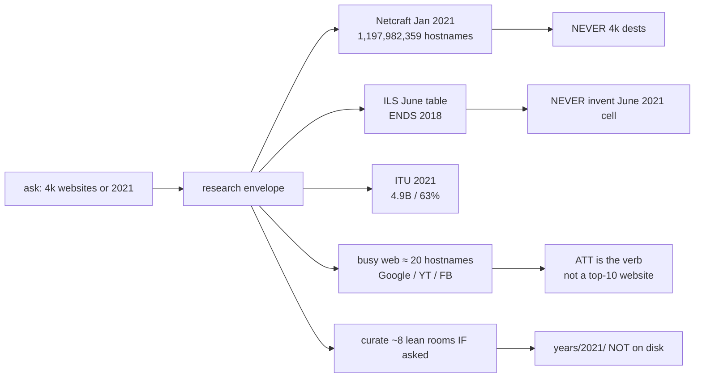
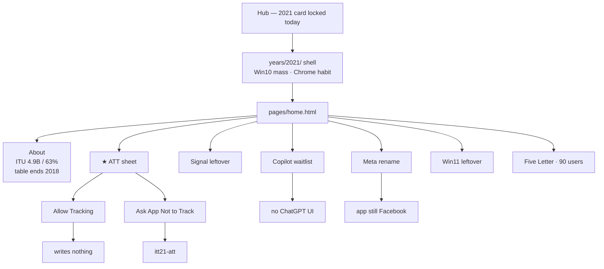
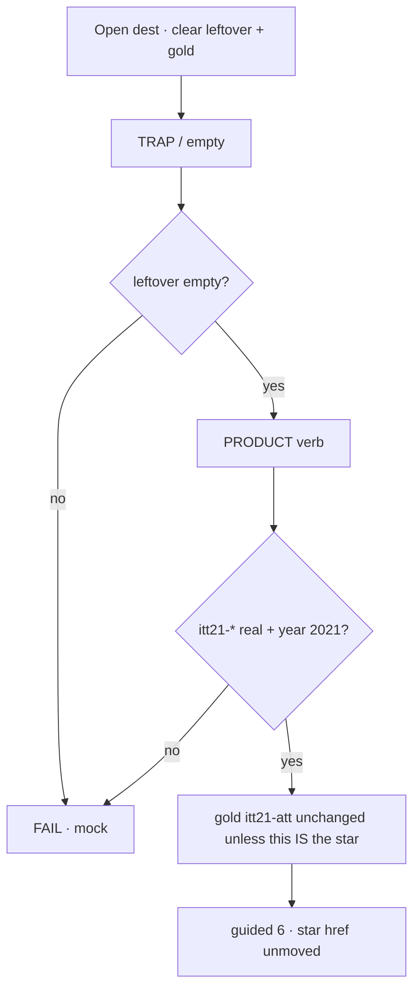
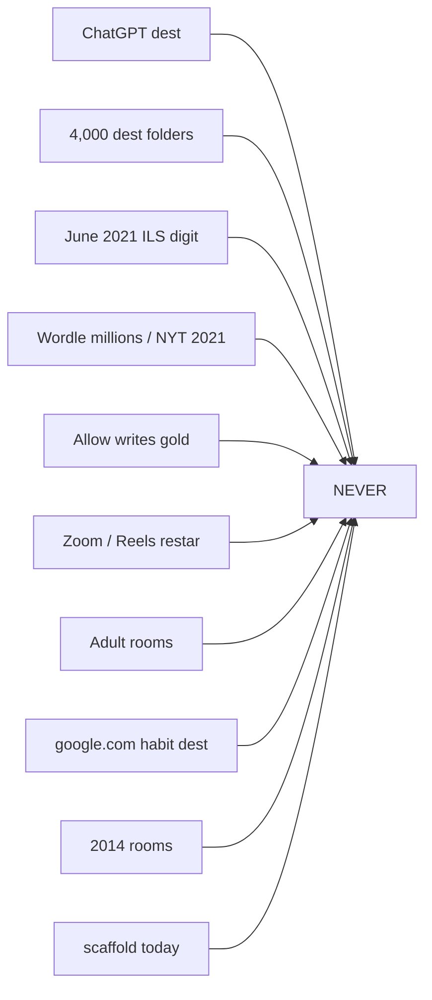

# 2021 — 4k-web flow map

**Date:** 2026-08-22  
**What this is:** the walkable map for the 4k-web pass. **Nothing is on disk.** Amber = if implement is named. Red = correctly never.  
**Door:** not created · prefix **`itt21`** · star **ATT Ask App Not to Track**  
**How to use:** walk top to bottom. Open the companion if a box needs the long cite.

Legend: **MAP** · **IF ASKED** · **NEVER**

---

## Companions

| File | When you need it |
|------|------------------|
| [`2021-READ-FIRST.md`](2021-READ-FIRST.md) | Thesis · star · AI honesty |
| [`2021-FROM-SCRATCH-4K-WEB-RESEARCH.md`](2021-FROM-SCRATCH-4K-WEB-RESEARCH.md) | Scale · mass · calendar · opened primaries |
| [`2021-FROM-SCRATCH-MAP-GOALS-STEPS-FLOWS.md`](2021-FROM-SCRATCH-MAP-GOALS-STEPS-FLOWS.md) | Implementer map · official 10 · file list |
| [`2021-CHECK-EVERY-FLOW-MAP.md`](2021-CHECK-EVERY-FLOW-MAP.md) | Visitor check walk · trap · save · key |
| [`2021-FROM-SCRATCH-GOALS-PHASES-MINUTE-STEPS.md`](2021-FROM-SCRATCH-GOALS-PHASES-MINUTE-STEPS.md) | Minute · e2e |
| [`YEAR-WEB-RESEARCH-10K-TO-BILLION.md`](YEAR-WEB-RESEARCH-10K-TO-BILLION.md) | Gray 10,022 → ILS billion |
| [`DISK-TRUTH.md`](DISK-TRUTH.md) | Hub ends 2020 · 2021 wiped |
| Parent | `years/2020/` Zoom |

**Legal:** Educational. No ChatGPT dest. No 4,000 dests. No scaffold until asked.

---

## 0. What “4k websites” maps to

| Envelope | Number | Maps to |
|----------|-------:|---------|
| Gray Dec 1994 | 10,022 | 1994 scale fact |
| This ask | ~4,000 | Walk budget · notable + mass + Wayback |
| Netcraft Jan 2021 | **1,197,982,359** | About table · January |
| Netcraft Dec 2021 | **1,168,864,866** | About table |
| ILS June | **ends 2018** | About · **no 2021 June digit** |
| ITU 2021 | **4.9B / 63%** | About |
| SimilarWeb Sep 2021 | Google 89.1B · YT 33.8B · FB 21.0B | Mass strip · no google.com dest |
| Cloudflare Radar 2021 | TikTok #1 many days after 10 Aug | Dual-cite · not the star |
| Disk | **0 rooms** | Wiped |

---

## 1. Visitor flow (if a door is ever built)

---

## 2. Test each leftover the same way

| Dest | Trap | Verb | Key |
|------|------|------|-----|
| ATT | Allow Tracking | Ask App Not to Track | `itt21-att` |
| Signal | “WhatsApp deleted you” | Handle + 15 May honesty | `itt21-signal` |
| Copilot | Empty / chat box | Waitlist + not-ChatGPT tick | `itt21-copilot` |
| Meta | Rename the Facebook app | Company rename + app-still-Facebook | `itt21-meta` |
| Win11 | Win10 is gone | Install / announce theater | `itt21-win11` |
| Flash brick | Play SWF | Note 12 Jan brick | `itt21-flash-brick` |
| Five Letter | NYT / millions | Finish one word · six rows | `itt21-game-five` |

---

## 3. NEVER

---

## 4. Continuity from 2020

2020 gold is Zoom mute → Leave. Flash EOL is **31 Dec 2020**; **12 Jan 2021** is the brick. GPT-3 waitlist is **2020**. Reels is **5 Aug 2020**. 2021 does not steal those stars. ATT is a new sheet on the same phone.
