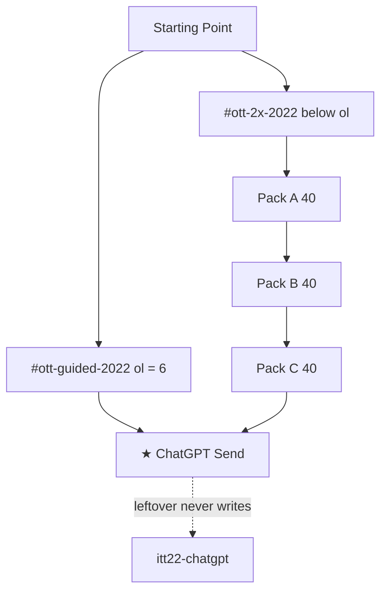

# 2022 leftover 2× map — 120 writers · hops · Next

**Date:** 2026-09-05  
**This file is the leftover 2× writer map.** Writers shipped. Leftover **2× hops** (extra dest links) are [`2022-2X-HOPS-MAP-GOALS-STEPS-FLOWS-2026-09-06.md`](2022-2X-HOPS-MAP-GOALS-STEPS-FLOWS-2026-09-06.md).  
**Named.** `years/2022/` is still **absent**. Do not write HTML from this file until the implement map Phase 4–6.  
**Implement walk:** [`2022-FROM-SCRATCH-IMPLEMENT-MAP-GOALS-PHASES-FLOWS-MINUTE-4X-2026-09-05.md`](2022-FROM-SCRATCH-IMPLEMENT-MAP-GOALS-PHASES-FLOWS-MINUTE-4X-2026-09-05.md)  
**Bible / minutes:** [`2022-2X-LEFTOVER-RESEARCH-2026-09-01.md`](2022-2X-LEFTOVER-RESEARCH-2026-09-01.md) · [`2022-2X-LEFTOVER-GOALS-PHASES-FLOWS-MINUTE-2026-09-01.md`](2022-2X-LEFTOVER-GOALS-PHASES-FLOWS-MINUTE-2026-09-01.md)  
**Thesis:** [`2022-READ-FIRST.md`](2022-READ-FIRST.md)

**2× = 120 leftover REAL writers** (Pack A 40 + Pack B 40 + Pack C 40).  
Not dest-field plaques. Not leftover 4×. Not Prompt Box / Famous / extra games.  
Older **18 / 32 / 51 / 83** counts **lose**.

When leftover-minute Pack B reuses an official whenKey as a leftover key, **this map wins** (C24). Official leftover Next = **trail Next**.

Serve later: `python3 -m http.server 8080 --bind 127.0.0.1`  
After a leftover 2× walk: leftover keys only. **Never** `itt22-chatgpt` from leftover.

---

## 0. What leftover 2× is

```
land dest
  empty / 0 ticks / 1 hop / skip wait / trap     →  no write
  period verb                                     →  itt22-<suffix>
                                                    {real, multiStep, year:"2022", kind}
  reload persist
  Next hidden until THIS dest’s leftover key
  Next = same-year dest, HTTP 200, label matches href
  gold itt22-chatgpt unchanged
```

Strip `#ott-2x-2022` sits **below** `#ott-guided-2022 ol` (exactly 6). Never inside the `<ol>`.

Each leftover dest that ships also gets leftover 2× **#2** as `<suffix>-d2`. That is still leftover 2×. Leftover 4× (`*-d4` + `*-4x`) is a different map (implement map §10).

---

## 1. Visitor picture

```
Starting Point
  #ott-guided-2022  =  6   (About · ★ Send · Twitter · Wordle · SD · Map)
  #ott-2x-2022      BELOW the ol
        Pack A  1 → 40     year-true leftover
        Pack B 41 → 80     official leftover rooms · 3× · second paths
        Pack C 81 → 120    mass continuity
              C120 Next → ★ ChatGPT
                           leftover complete still does NOT write itt22-chatgpt
```



---

## 2. Official dest leftover 2× (isolation)

Official GO writes the official whenKey. Leftover 2× on that **same room** uses `*-lx` only.

| Official n | Room | Official GO | Leftover 2× #1 | Leftover 2× #2 | Leftover Next |
|-----------:|------|-------------|----------------|----------------|---------------|
| 1 | `sites/chatgpt/index.html` | `itt22-chatgpt` | `gpt-lx` on `chatgpt/about.html` | `gpt-lx-d2` | ★ ChatGPT (trail) |
| 2 | `sites/twitter/index.html` | `itt22-twitter` | `twitter-lx` | `twitter-lx-d2` | Wordle leftover |
| 3 | `sites/wordle/index.html` | `itt22-wordle` | `wd-lx` | `wd-lx-d2` | Stable Diffusion |
| 4 | `sites/stablediffusion/index.html` | `itt22-sd` | `sd-off-lx` | `sd-off-lx-d2` | Mastodon leftover |
| 5 | `sites/mastodon/index.html` | `itt22-mastodon` | `masto-off-lx` | `masto-off-lx-d2` | BeReal leftover |
| 6 | `sites/bereal/index.html` | `itt22-bereal` | `br-lx` | `br-lx-d2` | DALL·E 2 leftover |
| 7 | `sites/dalle2/index.html` | `itt22-dalle2` | `d2-lx` | `d2-lx-d2` | Chrome habit |
| 8 | `sites/chrome/index.html` | `itt22-chrome` | `ch-lx` | `ch-lx-d2` | Windows 10 |
| 9 | `sites/windows10/index.html` | `itt22-win10` | `w10-lx` | `w10-lx-d2` | Prompt Box |
| 10 | `sites/playable/game.html` | `itt22-game-prompt` | `prompt-lx` | `prompt-lx-d2` | ★ ChatGPT |

`leftover-official.js` refuses leftover writes whose key equals official-10 n=1–10.  
Leftover-minute B41/B43/B45/B47/B49/B50/B52/B54 “leftover key = official whenKey” **lose**.

---

## 3. Pack A map — 40 year-true leftovers

First click is the period verb. Next walks A1 → A40 → ★ ChatGPT.

| # | Dest | Path | Suffix | Kind | Incomplete | Trap | Next |
|--:|------|------|--------|------|------------|------|------|
| 1 | Whisper | `sites/whisper/index.html` | `whisper-dp` | query | empty | live model · Send | Merge |
| 2 | Merge | `sites/merge/index.html` | `merge-dp` | checks | 0–1 tick | live trade · ETH2 token | FTX |
| 3 | FTX | `sites/ftx/index.html` | `ftx-dp` | checks | 0–1 tick | live book | Luna |
| 4 | Luna | `sites/luna/index.html` | `luna-dp` | checks | 0–1 tick | live UST/LUNA | Copilot GA |
| 5 | Copilot GA | `sites/copilotga/index.html` | `copga-dp` | query | empty | Send · live Copilot | Figma announce |
| 6 | Adobe←Figma | `sites/figmaad/index.html` | `figmaad-dp` | checks | 0–1 tick | live file | Steam Deck |
| 7 | Steam Deck | `sites/steamdeck/index.html` | `deck-dp` | hops | 0–1 hop | live buy | iOS 16 |
| 8 | iOS 16 | `sites/ios16/index.html` | `ios16-dp` | hops | 0–1 hop | ATT as 2022 gold | Passkeys |
| 9 | Passkeys | `sites/passkeys/index.html` | `passkeys-dp` | checks | 0–1 tick | live WebAuthn | Craiyon |
| 10 | Craiyon | `sites/craiyon/index.html` | `craiyon-dp` | query | empty | DALL·E 2 as this · live image | Heardle |
| 11 | Heardle | `sites/heardle/index.html` | `heardle-dp` | query | empty | NYT tiles as gold | Quordle |
| 12 | Quordle | `sites/quordle/index.html` | `quordle-dp` | query | empty | NYT tiles as gold | Reddit NFT |
| 13 | Reddit NFT | `sites/redditnft/index.html` | `redditnft-dp` | hops | 0–1 hop | live mint | Twitter NFT |
| 14 | Twitter NFT | `sites/twnft/index.html` | `twnft-dp` | hops | 0–1 hop | X · live mint | IG NFT |
| 15 | IG NFT | `sites/ignft/index.html` | `ignft-dp` | hops | 0–1 hop | live mint · Stories-as-2022 | LooksRare |
| 16 | LooksRare | `sites/looksrare/index.html` | `looksrare-dp` | query | empty | live mint | Temu |
| 17 | Temu | `sites/temu/index.html` | `temu-dp` | query | empty | live checkout | Next.js 13 |
| 18 | Next.js 13 | `sites/next13/index.html` | `next13-dp` | checks | 0–1 tick | live deploy · 26 Oct | Bun |
| 19 | Bun | `sites/bun22/index.html` | `bun-dp` | query | empty | 1.0-as-2022 | Perplexity |
| 20 | Perplexity | `sites/pplx/index.html` | `pplx-dp` | query | empty | Bing Chat · Send | DALL·E 2 API |
| 21 | DALL·E 2 API | `sites/d2api/index.html` | `dalle2api-dp` | query | empty | DALL·E 3 · live image | InstructGPT |
| 22 | InstructGPT | `sites/instruct/index.html` | `instruct-dp` | checks | 0–1 tick | Send as this dest | Copy.ai |
| 23 | Copy.ai | `sites/copyai/index.html` | `copyai-dp` | query | empty | Send | ElevenLabs |
| 24 | ElevenLabs | `sites/eleven/index.html` | `eleven-dp` | query | empty | live TTS | LastPass |
| 25 | LastPass | `sites/lastpass/index.html` | `lastpass-dp` | checks | 0–1 tick | dump | Arc |
| 26 | Arc | `sites/arc22/index.html` | `arc-dp` | hops | 0–1 hop | Arc-as-mass | Truth Social |
| 27 | Truth Social | `sites/truth/index.html` | `truth-dp` | hops | 0–1 hop | Truth-as-gold · X | Hive |
| 28 | Hive | `sites/hive22/index.html` | `hive-dp` | query | empty | Mastodon-as-this · X | Tumblr |
| 29 | Tumblr 2022 | `sites/tumblr22/index.html` | `tumblr22-dp` | hops | 0–1 hop | 2007-as-2022-gold | Win11 22H2 |
| 30 | Win11 22H2 | `sites/win22h2/index.html` | `w1122h2-dp` | checks | 0–1 tick | Win11-as-January | Lockdown |
| 31 | Lockdown Mode | `sites/lockdown/index.html` | `lockdown-dp` | checks | 0–1 tick | ATT as this dest | Gen-2 |
| 32 | Runway Gen-2 | `sites/gen2/index.html` | `gen2-dp` | query | empty | live generate · Sora · **2022-product claim** (Verge **20 Mar 2023**; keep dest; do not print as a 2022 leftover product) | Midjourney path |
| 33 | Midjourney path | `sites/mj/index.html` | `mj-dp` | hops | 0–1 hop | Midjourney-as-gold | Lensa |
| 34 | Lensa | `sites/lensa/index.html` | `lensa-dp` | query | empty | live upload | Mastodon surge |
| 35 | Mastodon surge | `sites/masto/index.html` | `masto-lx` | hops | 0–1 hop | X · Mastodon-as-gold | BeReal second |
| 36 | BeReal second | `sites/bereal/more.html` | `bereal-lx` | wait | skip wait | live camera | Wordle second |
| 37 | Wordle second | `sites/wordle/more.html` | `wordle-lx` | query | empty | NYT tiles as gold | Character.AI |
| 38 | Character.AI | `sites/cai/index.html` | `cai-dp` | query | empty | Send | Notion AI |
| 39 | Notion AI | `sites/notionai/index.html` | `notionai-dp` | query | empty | Send · live workspace | ChatGPT literacy |
| 40 | ChatGPT literacy | `sites/chatgpt/about.html` | `gpt-lx` | checks | 0–1 tick | Plus · GPT-4 · Bing · empty Send | ★ ChatGPT |

```
Whisper → Merge → FTX → Luna → Copilot GA → Figma
  → Steam Deck → iOS 16 → Passkeys → Craiyon → Heardle → Quordle
    → Reddit NFT → Twitter NFT → IG NFT → LooksRare → Temu → Next.js 13
      → Bun → Perplexity → DALL·E 2 API → InstructGPT → Copy.ai → ElevenLabs
        → LastPass → Arc → Truth → Hive → Tumblr → Win11 22H2
          → Lockdown → Gen-2 → Midjourney path → Lensa → Mastodon surge
            → BeReal second → Wordle second → Character.AI → Notion AI
              → ChatGPT literacy  gpt-lx
                → ★ ChatGPT Send   itt22-chatgpt   (leftover does not write this)
```

---

## 4. Pack B map — 40 official leftover rooms · 3× · second paths

None is the Send write. Prompt Box is **not** a Pack B leftover 2× dest.

**Official leftover Next = trail Next** (B41 leftover Next is Wordle, not `twitter/about.html`).  
Second-path leftover Next stays leftover.

| # | Dest | Path | Suffix | Kind | Incomplete | Trap | Next |
|--:|------|------|--------|------|------------|------|------|
| 41 | Twitter leftover 2× | `sites/twitter/index.html` | `twitter-lx` | query | empty · X | X | Wordle leftover |
| 42 | Twitter 2nd | `sites/twitter/about.html` | `tw2-lx` | hops | 0–1 hop | X | Wordle leftover |
| 43 | Wordle leftover 2× | `sites/wordle/index.html` | `wd-lx` | query | empty | NYT tiles as gold | Stable Diffusion |
| 44 | Wordle tiles-trap | `sites/wordle/tiles.html` | `wtiles-lx` | checks | tiles as save | NYT tiles gold | Stable Diffusion |
| 45 | SD leftover 2× | `sites/stablediffusion/index.html` | `sd-off-lx` | query | live weights | live generate | Mastodon leftover |
| 46 | SD weights trap | `sites/stablediffusion/about.html` | `sd-lx` | checks | generate | live weights | Mastodon leftover |
| 47 | Mastodon leftover 2× | `sites/mastodon/index.html` | `masto-off-lx` | query | empty handle | X | BeReal leftover |
| 48 | Mastodon 2nd | `sites/mastodon/about.html` | `masto2-lx` | hops | 0–1 hop | X | BeReal leftover |
| 49 | BeReal leftover 2× | `sites/bereal/index.html` | `br-lx` | wait | skip wait | live camera | DALL·E 2 leftover |
| 50 | DALL·E 2 leftover 2× | `sites/dalle2/index.html` | `d2-lx` | query | empty · DALL·E 3 | DALL·E 3 · live image | Chrome habit |
| 51 | DALL·E 2 waitlist 2nd | `sites/dalle2/about.html` | `d2wait-lx` | checks | 0–1 tick | DALL·E 3 | Chrome habit |
| 52 | Chrome leftover 2× | `sites/chrome/index.html` | `ch-lx` | checks | official logo | official pixels | Windows 10 |
| 53 | Chrome 2nd | `sites/chrome/about.html` | `chrome-lx` | query | empty | official mark | Windows 10 |
| 54 | Win10 leftover 2× | `sites/windows10/index.html` | `w10-lx` | checks | 0–1 tick | Win11-as-mass | Prompt Box |
| 55 | YouTube 3× | `sites/youtube/index.html` | `pop-youtube` | hops | 0–1 hop | Shorts-as-gold | Wikipedia |
| 56 | Wikipedia 3× | `sites/wikipedia/index.html` | `pop-wiki` | query | empty | live edit | Facebook |
| 57 | Facebook 3× | `sites/facebook/index.html` | `pop-facebook` | hops | 0–1 hop | Meta app | TikTok |
| 58 | TikTok 3×3 | `sites/tiktok/index.html` | `pop3-tiktok` | hops | 0–1 hop | 2018 merge gold | Midjourney 3×3 |
| 59 | Midjourney 3×3 | `sites/midjourney/index.html` | `pop3-mj` | hops | 0–1 hop | Midjourney-as-gold | Lensa 3×3 |
| 60 | Lensa 3×3 | `sites/lensa3/index.html` | `pop3-lensa` | query | empty | live upload | Chrome pop-more |
| 61 | Chrome pop-more | `sites/chrome/more.html` | `chrome-more` | checks | 0–1 tick | official mark | Win10 pop-more |
| 62 | Win10 pop-more | `sites/windows10/more.html` | `win10-more` | query | empty | Win11-as-January | Mastodon pop-more |
| 63 | Mastodon pop-more | `sites/mastodon/more.html` | `masto-more` | hops | 0–1 hop | X | Copilot preview |
| 64 | Copilot preview | `sites/coprev/index.html` | `coprev-lx` | query | empty | Send · GA-as-this | Whisper 2nd |
| 65 | Whisper 2nd | `sites/whisper/about.html` | `whisper-lx` | hops | 0–1 hop | live transcribe | Merge 2nd |
| 66 | Merge 2nd | `sites/merge/about.html` | `merge-lx` | checks | 0–1 tick | ETH2 token | FTX 2nd |
| 67 | FTX 2nd | `sites/ftx/about.html` | `ftx-lx` | checks | 0–1 tick | live book | iOS 16 2nd |
| 68 | iOS 16 2nd | `sites/ios16/about.html` | `ios16-lx` | hops | 0–1 hop | ATT | Passkeys 2nd |
| 69 | Passkeys 2nd | `sites/passkeys/about.html` | `pass-lx` | query | empty | live WebAuthn | Steam Deck 2nd |
| 70 | Steam Deck 2nd | `sites/steamdeck/about.html` | `deck-lx` | hops | 0–1 hop | live store | Next 13 2nd |
| 71 | Next 13 2nd | `sites/next13/about.html` | `next13-lx` | checks | 0–1 tick | live deploy | Perplexity 2nd |
| 72 | Perplexity 2nd | `sites/pplx/about.html` | `pplx-lx` | query | empty | Bing Chat | Arc 2nd |
| 73 | Arc 2nd | `sites/arc22/about.html` | `arc-lx` | hops | 0–1 hop | Arc-as-mass | LastPass 2nd |
| 74 | LastPass 2nd | `sites/lastpass/about.html` | `lp-lx` | checks | dump | dump | InstructGPT 2nd |
| 75 | InstructGPT 2nd | `sites/instruct/about.html` | `instruct-lx` | query | empty | Send | Craiyon 2nd |
| 76 | Craiyon 2nd | `sites/craiyon/about.html` | `craiyon-lx` | hops | 0–1 hop | DALL·E 2-as-this | Temu 2nd |
| 77 | Temu 2nd | `sites/temu/about.html` | `temu-lx` | query | empty | live checkout | Win11 22H2 2nd |
| 78 | Win11 22H2 2nd | `sites/win22h2/about.html` | `w1122h2-lx` | checks | 0–1 tick | January mass | Lockdown 2nd |
| 79 | Lockdown 2nd | `sites/lockdown/about.html` | `lockdown-lx` | hops | 0–1 hop | ATT | Hive 2nd |
| 80 | Hive 2nd | `sites/hive22/about.html` | `hive-lx` | query | empty | Mastodon-as-this | YouTube watch |

```
Twitter-lx → Wordle-lx → SD-off-lx → Masto-off-lx → BeReal-lx → D2-lx
  → Chrome-lx → Win10-lx
    → YouTube 3× → Wikipedia 3× → Facebook 3×
      → TikTok 3×3 → Midjourney 3×3 → Lensa 3×3
        → Chrome pop-more → Win10 pop-more → Mastodon pop-more
          → Copilot preview → Whisper 2nd → … → Hive 2nd
            → Pack C
```

First 3× keys: `itt22-pop-youtube` · `itt22-pop-wiki` · `itt22-pop-facebook`  
(pick + honesty + field ≥2 + `data-pop-go`).  
Third 3× keys: `itt22-pop3-tiktok` · `itt22-pop3-mj` · `itt22-pop3-lensa`.

---

## 5. Pack C map — 40 mass continuity leftovers

Thin OK. Still REAL. Still 2022 leftover. Never the chip. Never a 2021 ATT clone. Never a 2023 Plus dest.

| # | Dest | Path | Suffix | Kind | Incomplete | Trap | Next |
|--:|------|------|--------|------|------------|------|------|
| 81 | YouTube watch | `sites/youtube/watch.html` | `yt-lx` | hops | 0–1 hop | Shorts-as-gold | Wikipedia edit |
| 82 | Wikipedia edit | `sites/wikipedia/edit.html` | `wk-lx` | query | empty | live save | Amazon |
| 83 | Amazon | `sites/amazon/index.html` | `amzn-lx` | query | empty | 1-Click gold | Reddit |
| 84 | Reddit | `sites/reddit/index.html` | `reddit-lx` | hops | 0–1 hop | live submit | Netflix |
| 85 | Netflix | `sites/netflix/index.html` | `nfx-lx` | query | empty | live stream | Spotify |
| 86 | Spotify | `sites/spotify/index.html` | `spot-lx` | hops | 0–1 hop | Heardle-as-this | Instagram |
| 87 | Instagram | `sites/instagram/index.html` | `ig-lx` | hops | 0–1 hop | Stories-as-2022-gold | Twitter more |
| 88 | Twitter more | `sites/twitter/more.html` | `tw-lx` | query | empty | X | TikTok more |
| 89 | TikTok more | `sites/tiktok/more.html` | `tt-lx` | hops | 0–1 hop | 2018 merge gold | Google |
| 90 | Google | `sites/google/index.html` | `g-lx` | query | empty | Lucky-as-2022 | Gmail |
| 91 | Gmail | `sites/gmail/index.html` | `gm-lx` | hops | 0–1 hop | live send | Maps |
| 92 | Maps | `sites/maps/index.html` | `maps-lx` | query | empty | Street View (2007) | PayPal |
| 93 | PayPal | `sites/paypal/index.html` | `pp-lx` | checks | 0–1 tick | live pay | Slack |
| 94 | Slack | `sites/slack/index.html` | `sl-lx` | hops | 0–1 hop | live workspace | Discord |
| 95 | Discord | `sites/discord/index.html` | `dc-lx` | query | empty | live voice · MJ-as-this | Zoom |
| 96 | Zoom | `sites/zoom/index.html` | `zm-lx` | checks | Join-as-save | 2020 gold | Teams |
| 97 | Teams | `sites/teams/index.html` | `tm-lx` | hops | 0–1 hop | Teams-as-gold | Notion |
| 98 | Notion | `sites/notion/index.html` | `no-lx` | query | empty | live workspace · Notion AI-as-this | Figma |
| 99 | Figma | `sites/figma/index.html` | `fg-lx` | hops | 0–1 hop | live file · Adobe-announce-as-this | GitHub |
| 100 | GitHub | `sites/github/index.html` | `gh-lx` | query | empty | Copilot-GA-as-gold | LinkedIn |
| 101 | LinkedIn | `sites/linkedin/index.html` | `li-lx` | hops | 0–1 hop | live connect | Twitch |
| 102 | Twitch | `sites/twitch/index.html` | `twitch-lx` | query | empty | live bits | Steam |
| 103 | Steam | `sites/steam/index.html` | `steam-lx` | hops | 0–1 hop | Deck-as-this · live buy | Epic |
| 104 | Epic | `sites/epicstore/index.html` | `egs-lx` | checks | 0–1 tick | live store | PlayStation |
| 105 | PlayStation | `sites/playstation/index.html` | `ps-lx` | query | empty | official mark | Xbox |
| 106 | Xbox | `sites/xbox/index.html` | `xb-lx` | hops | 0–1 hop | official mark | Nintendo |
| 107 | Nintendo | `sites/nintendo/index.html` | `nin-lx` | query | empty | Switch-as-2017-gold | Fortnite |
| 108 | Fortnite | `sites/fortnite/index.html` | `fn-lx` | hops | 0–1 hop | 2017 gold | Among Us |
| 109 | Among Us | `sites/amongus/index.html` | `au-lx` | checks | 0–1 tick | 2020 gold | Roblox |
| 110 | Roblox | `sites/roblox/index.html` | `rbx-lx` | hops | 0–1 hop | IPO-as-this | Substack |
| 111 | Substack | `sites/substack/index.html` | `ss-lx` | query | empty | live subscribe | Patreon |
| 112 | Patreon | `sites/patreon/index.html` | `pat-lx` | checks | 0–1 tick | live pledge | Kindle |
| 113 | Kindle | `sites/kindle/index.html` | `kindle-lx` | hops | 0–1 hop | live buy | iCloud |
| 114 | iCloud | `sites/icloud/index.html` | `ic-lx` | checks | 0–1 tick | live iCloud | Edge |
| 115 | Edge | `sites/edge/index.html` | `edge-lx` | query | empty | official mark | Safari |
| 116 | Safari | `sites/safari/index.html` | `saf-lx` | hops | 0–1 hop | official mark | Firefox |
| 117 | Firefox | `sites/firefox/index.html` | `ff-lx` | query | empty | official mark | Brave |
| 118 | Brave | `sites/brave/index.html` | `brave-lx` | checks | 0–1 tick | official mark | Continuity |
| 119 | Continuity | `sites/playable/more.html` | `cont-lx` | hops | 0–1 hop | Prompt Box gold | Continuity close |
| 120 | Continuity close | `sites/playable/close.html` | `close-lx` | hops | 0–1 hop | Prompt Box gold | ★ ChatGPT |

```
YouTube watch → Wiki edit → Amazon → Reddit → Netflix → Spotify
  → Instagram → Twitter more → TikTok more → Google → Gmail → Maps
    → PayPal → Slack → Discord → Zoom → Teams → Notion → Figma → GitHub
      → LinkedIn → Twitch → Steam → Epic → PlayStation → Xbox → Nintendo
        → Fortnite → Among Us → Roblox → Substack → Patreon → Kindle
          → iCloud → Edge → Safari → Firefox → Brave
            → Continuity → Continuity close
              → ★ ChatGPT Send
```

C120 Next is the gold dest. Completing C120 still does **not** write `itt22-chatgpt`.

---

## 6. Not leftover 2×

| Thing | Why |
|-------|-----|
| `itt22-chatgpt` | star / official n=1 |
| Official whenKeys n=2–10 | official GO, not leftover 2× |
| Prompt Box gold | official game |
| Famous snake + breakout | cabinets |
| more-c / more-d God of War / Elden Ring | cabinets |
| extra games a–i · game-2…5 | cabinets |
| leftover `*-d4` / `data-4x-go *-4x` | leftover **4×** |
| Plus · GPT-4 · Bing · Threads · X | **2023** · not dests |
| ATT Ask | **2021** gold |
| Dest-field “I read the 2022 note” | plaque |

---

## 7. Fail the leftover 2× map if

- Guided gets a 7th `<li>` or `#ott-2x-2022` moves inside the `<ol>`  
- Leftover complete writes `itt22-chatgpt`  
- Official dest leftover 2× uses an official whenKey  
- Official leftover Next points at leftover `about.html` instead of trail Next  
- Count is 18 / 32 / 51 / 83  
- Next 404 · Next to 2021 / 2023  
- Period CTA is “Save leftover” / “Do leftover” / “Note leftover”  
- Live model / weights / mint / broker / dump / checkout  
- Dest name on Twitter rooms becomes X  
- Invented June 2022 ILS cell  
- Dest farm beyond these 120 writers + listed second pages

---

## 8. Done-when (leftover 2× only)

1. `#ott-2x-2022` lists Pack A then B then C **below** guided.  
2. 120 leftover 2× #1 keys write · each has a `*-d2`.  
3. Collision with official-10 whenKeys = **0**.  
4. A40 / C120 Next is ★ ChatGPT · gold key still empty until Send.  
5. Prefix after a leftover-only walk: `itt22-*` leftover suffixes only. No `itt21-*` / `itt23-*`.

HTML is **Phase 4–6** of the implement map. This file is the map.
