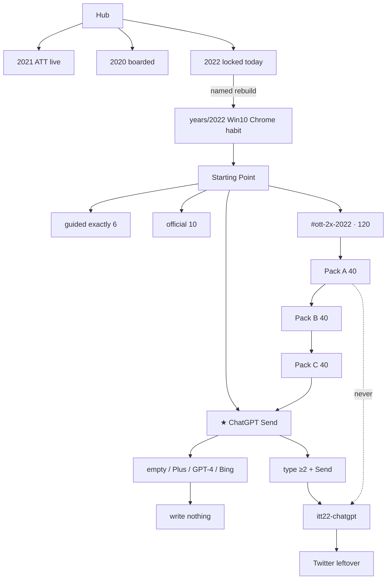

# 2022 — check every flow (live door)

**Date:** 2026-09-01  
**What this is:** the visitor walk written **before** the door exists. When implement is named, open the URLs. Do the trap. Do the save. Confirm the key.  
**Door:** `years/2022/` · **on disk** · prefix **`itt22`** · star **ChatGPT Send**  
**Not this file:** implementer map [`2022-FROM-SCRATCH-MAP-GOALS-STEPS-FLOWS.md`](2022-FROM-SCRATCH-MAP-GOALS-STEPS-FLOWS.md) · harvest [`2022-FROM-SCRATCH-RESEARCH-GOALS-PHASES-FLOWS-MINUTE-VISITED-2026-09-01.md`](2022-FROM-SCRATCH-RESEARCH-GOALS-PHASES-FLOWS-MINUTE-VISITED-2026-09-01.md) · thesis [`2022-READ-FIRST.md`](2022-READ-FIRST.md) · leftover minutes [`2022-2X-LEFTOVER-GOALS-PHASES-FLOWS-MINUTE-2026-09-01.md`](2022-2X-LEFTOVER-GOALS-PHASES-FLOWS-MINUTE-2026-09-01.md) · leftover dests [`2022-2X-LEFTOVER-RESEARCH-2026-09-01.md`](2022-2X-LEFTOVER-RESEARCH-2026-09-01.md) · criteria [`2022-2X-CRITERIA-MAP-2026-09-01.md`](2022-2X-CRITERIA-MAP-2026-09-01.md)

Format twin: [`2014-CHECK-EVERY-FLOW-MAP.md`](2014-CHECK-EVERY-FLOW-MAP.md).

**Today’s check (S0):**

```
test -d years/2022 && echo FAIL-tree-exists || echo OK-wiped
```

Pass after named implement: `FAIL-tree-exists` is expected. Hub has `a.year-card.available.y2022`.

When a door ships, serve:

```
python3 -m http.server 8080 --bind 127.0.0.1
```

Then open `http://127.0.0.1:8080/` · DevTools → Application → Local Storage → `127.0.0.1:8080`.  
Clear every `itt22-*` before you start. After each **complete**, only `itt22-*` may appear. **No `itt21-*` leak. No `itt23-*`.**

**Pass rule for every writer:** trap / empty / 0 ticks / 1 hop / skip wait **never writes**. Complete writes JSON with `real` + `year:"2022"`. Reload still shows the save. **Next** stays hidden until that dest’s key exists.

Guided list stays **exactly 6**. Chip never moves off ChatGPT Send. Dest name stays **Twitter**. **X is 23 Jul 2023.**

---

## Diagram (check this first)

```
Hub
  2021 ATT live · 2020 / 2022–2025 boarded
  └── 2022 card LOCKED today
        └── (when named) years/2022/
              Win10 · Chrome habit · not X in the dirbar
              Starting Point
                ★ ChatGPT Send     itt22-chatgpt
                guided ol = 6
                  1 About
                  2 ★ ChatGPT
                  3 Twitter leftover
                  4 Wordle leftover
                  5 Stable Diffusion leftover
                  6 Year map
                official 10
                  Send → Twitter → Wordle → SD → Mastodon
                  → BeReal → DALL·E 2 → Chrome → Win10 → Prompt Box
                #ott-2x-2022   BELOW guided   120 leftover
                  Pack A  1–40   year-true
                  Pack B 41–80   leftover-official / 3×
                  Pack C 81–120  mass continuity
                  C120 Next → ★ ChatGPT   (does not write gold)
              empty / Plus / GPT-4 / Bing / X  →  write nothing
              leftover complete  →  itt22-<suffix> only
              Exit · itt22-* only
```



**Fail the diagram if:** 7th guided `<li>` · chip is Whisper / Merge / Copilot GA / Wordle · dest named X · Plus writes gold · leftover writes `itt22-chatgpt` · June 2022 ILS cell · 32 / 51 / 83 as 2×.

---

## 0. Door + Starting Point

| Step | Do | Pass |
|------|----|------|
| 0.1 | Hub card **2022** | **Locked today.** If built: `a.year-card.available.y2022` · 2020 / 2023–2025 still locked · 2021 live |
| 0.2 | Open `/years/2022/` · Skip connect | Win10 · Chrome habit · dirbar **Start · ChatGPT · Twitter · Wordle · SD · About** · **not** X · **not** Win11-as-January |
| 0.3 | iframe is Starting Point | chip `★ One-thing · ChatGPT Send REAL` → `sites/chatgpt/index.html` |
| 0.4 | Count `#ott-guided-2022 ol > li` | **6** · About · ChatGPT · Twitter leftover · Wordle leftover · SD leftover · Year flow map |
| 0.5 | Read the thesis strip | empty / Plus / GPT-4 / Bing never write · still Twitter · table ends 2018 · Jan **1,167,715,133** · ITU **5.3B / 66%** |
| 0.6 | Strip below guided | `#ott-2x-2022` · **120** leftover + ★ · **not** inside the `<ol>` |

**Fail if:** 7th guided `<li>` · chip is Whisper / Merge / Copilot GA · dirbar says X · title says Plus · ATT Ask as 2022 gold.

---

## 1. About (guided 1) — literacy

**URL:** `/years/2022/pages/about.html`

Must print:

- ILS June **table ends 2018** at **1,630,322,579 (−8%)**. **No 2019–2022 row.** **No June 2022 cell.**
- Netcraft **January 2022** `1,167,715,133` sites · `269,835,071` unique domains · `11,700,892` computers — printed as **January**, never June
- Netcraft **December 2022** `1,125,374,532` / `271,238,722` / `12,234,425` — December pair, still not June
- ITU **5.3 billion / 66%** · **2.7 billion** offline · +6.1% — people, not sites
- ChatGPT **30 Nov 2022** research preview · InstructGPT sibling · GPT-3.5 · **1M ~5 Dec**
- Twitter close **27 Oct** · **$44B** press / **$54.20** 8-K · dest stays **Twitter** · **X is 23 Jul 2023**
- Bans: Plus · GPT-4 · Bing Chat · Threads · X · live model · live SD weights · NYT tiles as gold · ATT Ask as 2022 gold

Optional: tick both thesis boxes → Save thesis literacy. That may write `itt22-thesis-ack` only. It must **not** write `itt22-chatgpt`.

Do **not** invent a survey-wide Netcraft “active sites” total from Apache share.

---

## 2. ChatGPT Send star (guided 2) — the one-thing

**URL:** `/years/2022/sites/chatgpt/index.html`

Look: **30 Nov 2022** research-preview box · prompt field · **Send** · Plus / GPT-4 / Bing traps · `[failed-final]` no official OpenAI sparkle. Honesty: sibling of InstructGPT · GPT-3.5 series · usage free during preview · **not GPT-4**. **Next: Twitter leftover** is hidden.

| Incomplete (key stays empty) | Complete (writes `itt22-chatgpt`) |
|------------------------------|-----------------------------------|
| **Send empty** | Type prompt **≥2** |
| **Plus** | **Send** |
| **GPT-4** | Reload still shows save |
| **Bing Chat** | Payload `real: true` · `year: "2022"` · `send: true` |

Reload Send. Next **Twitter leftover** visible. Chip on home still ChatGPT Send.

Also check About still says research preview. No Plus dest. No GPT-4 dest. No live model.

---

## 3. Twitter leftover (guided 3)

**URL:** `/years/2022/sites/twitter/index.html`

Look: close **27 Oct 2022** · **$44B** / **$54.20** · dest name **Twitter**. `[failed-final]` no bird as museum art. **X** is the trap.

| Incomplete | Complete → `itt22-twitter` |
|------------|----------------------------|
| empty · **X** | leftover note · still Twitter |

Must **not** write `itt22-chatgpt`. Next: Wordle leftover.

---

## 4. Wordle leftover (guided 4)

**URL:** `/years/2022/sites/wordle/index.html`

Look: NYT **31 Jan 2022** · low seven figures · **initially remain free**. 90 users **1 Nov 2021** is **2021 leftover**. `[failed-final]` no NYT tiles as art. Tiles-as-gold is the trap.

| Incomplete | Complete → `itt22-wordle` |
|------------|---------------------------|
| empty · NYT tiles as gold | leftover buy note |

Must **not** write gold. Next: Stable Diffusion leftover.

---

## 5. Stable Diffusion leftover (guided 5)

**URL:** `/years/2022/sites/stablediffusion/index.html`

Look: Stability **22 Aug 2022** public · Creative ML **OpenRAIL-M** · v1.4. **No live weights.** Generate is the trap.

| Incomplete | Complete → `itt22-sd` |
|------------|----------------------|
| live weights · live generate | 22 Aug leftover note |

Must **not** write gold. Next: Map (guided 6).

---

## 6. Map (guided 6)

**URL:** `/years/2022/pages/map.html`

- Official 10 `<ol data-itt-ten-flows> li` = **10** (or painted from `flow-trails.js`)
- Star named ChatGPT Send · Plus / GPT-4 / Bing traps linked
- First 3× YouTube · Wikipedia · Facebook listed
- 3×3 TikTok · Midjourney · Lensa
- Pop-more Chrome · Win10 · Mastodon (disjoint from 3×3 and the star)
- No dest named X
- No Plus / GPT-4 / Bing / Threads dest
- No `sites/google/index.html` as gold

---

## 7. Official 10 (night trail)

Walk in order. After each **complete**, Next unhides the next stop.

| # | URL | Trap | Save | Key |
|--:|-----|------|------|-----|
| 1 | `sites/chatgpt/index.html` | empty · Plus · GPT-4 · Bing | prompt ≥2 + Send | `itt22-chatgpt` |
| 2 | `sites/twitter/index.html` | empty · X | leftover note · still Twitter | `itt22-twitter` |
| 3 | `sites/wordle/index.html` | empty · NYT tiles as gold | leftover buy note | `itt22-wordle` |
| 4 | `sites/stablediffusion/index.html` | live weights | 22 Aug leftover | `itt22-sd` |
| 5 | `sites/mastodon/index.html` | empty handle · X | handle leftover | `itt22-mastodon` |
| 6 | `sites/bereal/index.html` | skip wait · live camera | wait leftover | `itt22-bereal` |
| 7 | `sites/dalle2/index.html` | empty · DALL·E 3 · live image | waitlist leftover | `itt22-dalle2` |
| 8 | `sites/chrome/index.html` | official logo | habit leftover | `itt22-chrome` |
| 9 | `sites/windows10/index.html` | Win11-as-January | residual mass | `itt22-win10` |
| 10 | `sites/playable/game.html` | empty / Plus / GPT-4 tiles | leftover prompt | `itt22-game-prompt` |

Mastodon look: Nov surge after 27 Oct close · 7 Nov **1,028,362** MAU class · dest still not X.  
BeReal look: 2022 popularity spike leftover · wait machine · no live camera. Launch is 2019/2020 — leftover is the **surge**.  
DALL·E 2 look: Apr preview · Jul beta · 28 Sep waitlist off · API **3 Nov**. DALL·E 3 is **2023**.  
Chrome look: habit leftover · no official pixels.  
Win10 look: still January mass. Win11 22H2 is **20 Sep leftover**, not this dest.  
Prompt Box look: year game. Not Plus. Not a 2× key.

Leftover complete on 2–10 **must not** write `itt22-chatgpt`.

---

## 8. Leftover 2× — 120 writers

Strip `#ott-2x-2022` **below** guided. First click is the product verb. Walk A then B then C. Full dest minutes: leftover minute walk.

**CUT-LEAN** ships **0** of these. **CUT-2X** ships all **120**. Do not start CUT-2X until CUT-LEAN P0 is named and shipped.

### Pack A — year-true 40

| # | URL | Kind | Key | Incomplete | Trap | Complete |
|--:|-----|------|-----|------------|------|----------|
| 1 | `sites/whisper/index.html` | query | `itt22-whisper-dp` | empty | live model · Send | type · 21 Sep · 680k hours |
| 2 | `sites/merge/index.html` | checks | `itt22-merge-dp` | 0–1 tick | live trade · ETH2 token | both · 15 Sep · 15537393 · 99.95% |
| 3 | `sites/ftx/index.html` | checks | `itt22-ftx-dp` | 0–1 tick | live book | both · 11 Nov literacy |
| 4 | `sites/luna/index.html` | checks | `itt22-luna-dp` | 0–1 tick | live trade | both · May depeg literacy |
| 5 | `sites/copilotga/index.html` | query | `itt22-copga-dp` | empty | Send · live Copilot | type · 21 Jun · $10 / $100 |
| 6 | `sites/figmaad/index.html` | checks | `itt22-figmaad-dp` | 0–1 tick | live file · later-kill | both · 15 Sep ~$20B announce |
| 7 | `sites/steamdeck/index.html` | hops | `itt22-deck-dp` | 0–1 hop | live buy | two hops · 25 Feb |
| 8 | `sites/ios16/index.html` | hops | `itt22-ios16-dp` | 0–1 hop | ATT Ask | two hops · 12 Sep Lock Screen |
| 9 | `sites/passkeys/index.html` | checks | `itt22-passkeys-dp` | 0–1 tick | live WebAuthn · ATT | both · WWDC 6 Jun · ships iOS 16 |
| 10 | `sites/craiyon/index.html` | query | `itt22-craiyon-dp` | empty | DALL·E 2-as-this · live image | type · Jun rename |
| 11 | `sites/heardle/index.html` | query | `itt22-heardle-dp` | empty | NYT tiles · Wordle gold | type · Spotify 12 Jul |
| 12 | `sites/quordle/index.html` | query | `itt22-quordle-dp` | empty | NYT tiles | type · Jan/Feb 2022 |
| 13 | `sites/redditnft/index.html` | hops | `itt22-redditnft-dp` | 0–1 hop | live mint | two hops |
| 14 | `sites/twnft/index.html` | hops | `itt22-twnft-dp` | 0–1 hop | X · live mint | two hops · still Twitter |
| 15 | `sites/ignft/index.html` | hops | `itt22-ignft-dp` | 0–1 hop | live mint | two hops |
| 16 | `sites/looksrare/index.html` | query | `itt22-looksrare-dp` | empty | live mint | type |
| 17 | `sites/temu/index.html` | query | `itt22-temu-dp` | empty | live checkout | type · US ~1 Sep |
| 18 | `sites/next13/index.html` | checks | `itt22-next13-dp` | 0–1 tick | live deploy | both · **25 Oct** |
| 19 | `sites/bun22/index.html` | query | `itt22-bun-dp` | empty | 1.0-as-2022 | type · 1.0 is 2023 |
| 20 | `sites/pplx/index.html` | query | `itt22-pplx-dp` | empty | Bing Chat · Send | type · 7 Dec |
| 21 | `sites/d2api/index.html` | query | `itt22-dalle2api-dp` | empty | DALL·E 3 · live image | type · 3 Nov API |
| 22 | `sites/instruct/index.html` | checks | `itt22-instruct-dp` | 0–1 tick | Send | both · 27 Jan sibling |
| 23 | `sites/copyai/index.html` | query | `itt22-copyai-dp` | empty | Send | type |
| 24 | `sites/eleven/index.html` | query | `itt22-eleven-dp` | empty | live voice | type |
| 25 | `sites/lastpass/index.html` | checks | `itt22-lastpass-dp` | 0–1 tick | dump | both · 22 Dec rotate |
| 26 | `sites/arc22/index.html` | hops | `itt22-arc-dp` | 0–1 hop | Arc-as-mass | two hops |
| 27 | `sites/truth/index.html` | hops | `itt22-truth-dp` | 0–1 hop | Truth-as-gold · X | two hops · 21 Feb |
| 28 | `sites/hive22/index.html` | query | `itt22-hive-dp` | empty | Mastodon-as-this · X | type |
| 29 | `sites/tumblr22/index.html` | hops | `itt22-tumblr22-dp` | 0–1 hop | 2007-as-gold | two hops |
| 30 | `sites/win22h2/index.html` | checks | `itt22-w1122h2-dp` | 0–1 tick | Win11-as-January | both · 20 Sep |
| 31 | `sites/lockdown/index.html` | checks | `itt22-lockdown-dp` | 0–1 tick | ATT | both |
| 32 | `sites/gen2/index.html` | query | `itt22-gen2-dp` | empty | live generate · Sora | type |
| 33 | `sites/mj/index.html` | hops | `itt22-mj-dp` | 0–1 hop | Midjourney-as-gold | two hops · 12 Jul lock |
| 34 | `sites/lensa/index.html` | query | `itt22-lensa-dp` | empty | live upload | type · 21 Nov PH · 28 Nov is 4K |
| 35 | `sites/masto/index.html` | hops | `itt22-masto-lx` | 0–1 hop | X · Mastodon-as-gold | two hops · Nov surge |
| 36 | `sites/bereal/more.html` | wait | `itt22-bereal-lx` | skip wait | live camera | wait · not official key |
| 37 | `sites/wordle/more.html` | query | `itt22-wordle-lx` | empty | NYT tiles as gold | type · not official key |
| 38 | `sites/cai/index.html` | query | `itt22-cai-dp` | empty | Send | type · 16 Sep |
| 39 | `sites/notionai/index.html` | query | `itt22-notionai-dp` | empty | Send · live workspace | type |
| 40 | `sites/chatgpt/about.html` | checks | `itt22-gpt-lx` | 0–1 tick | Plus · GPT-4 · Bing · Send-as-this | both literacy · **never** `itt22-chatgpt` |

A40 Next is the **gold dest**. Completing A40 still does **not** write `itt22-chatgpt`.

### Pack B — leftover-official / 3× 40

B41–B80 in leftover minute walk §5. Official leftover keys (`itt22-twitter` … `itt22-win10`) may live here as **second rooms** or the official dest itself — leftover complete still ≠ gold. Prompt Box is the **game**, not Pack B.

Walk: Twitter · Twitter 2nd · Wordle · tiles-trap · SD · weights-trap · Mastodon · Mastodon 2nd · BeReal · DALL·E 2 · waitlist 2nd · Chrome · Chrome 2nd · Win10 · YouTube 3× · Wikipedia 3× · Facebook 3× · TikTok 3×3 · Midjourney 3×3 · Lensa 3×3 · Chrome / Win10 / Mastodon pop-more · Copilot preview leftover · Whisper 2nd → Hive 2nd.

### Pack C — mass continuity 40

C81–C120 in leftover minute walk §6. Thin OK. Still REAL. Still 2022 leftover. Never the chip. Never a 2021 ATT clone. Never a 2023 Plus dest.

C120 Next is `sites/chatgpt/index.html`. Completing C120 still does **not** write `itt22-chatgpt`.

---

## 9. Shared leftover minute (every 2× dest)

1. Land. Yellow honesty. `[failed-final]` if no still.  
2. Empty / 0 ticks / 1 hop / skip wait → **nothing writes**.  
3. Listed trap → **nothing writes**.  
4. Period verb → `itt22-<suffix>` only · `{real, multiStep, year:"2022", kind}`.  
5. Reload. Persist.  
6. Next is a **2022** dest, HTTP 200.  
7. **Never** write `itt22-chatgpt` from a leftover dest.

---

## 10. Isolation (after a named implement)

```
# clear itt22-*
# door §0
# gold: empty / Plus / GPT-4 / Bing never write · Send writes
# official 10: incomplete then complete
# leftover A1–A40 · B41–B80 · C81–C120
# leftover complete must not create itt22-chatgpt
# localStorage keys match /^itt22-/
```

**Fail the year if:** dest-field plaque · 7th guided `<li>` · Plus writes gold · dest named X · live model / weights / broker · June 2022 ILS cell · 32 / 51 / 83 as 2×.

---

## 11. What you are checking today (after named implement)

| Check | Now |
|-------|-----|
| `years/2022/` | **on disk** |
| Hub card | **available** |
| READ-FIRST lock | ChatGPT Send · 120 leftover · no June cell |
| Guided | **6** |
| Star | `itt22-chatgpt` · Plus never writes · Send writes |
| Leftover 120 | Pack A/B/C on disk · leftover complete does not write gold |
| Criteria C1–C20 | **ON DISK** |

This file is the walk.
