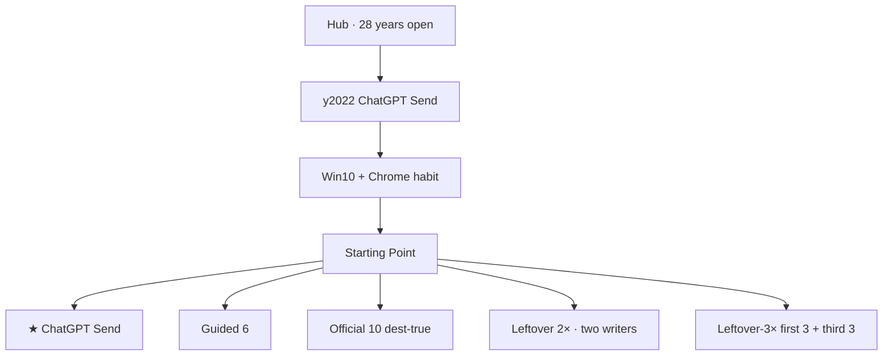
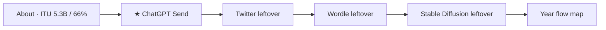
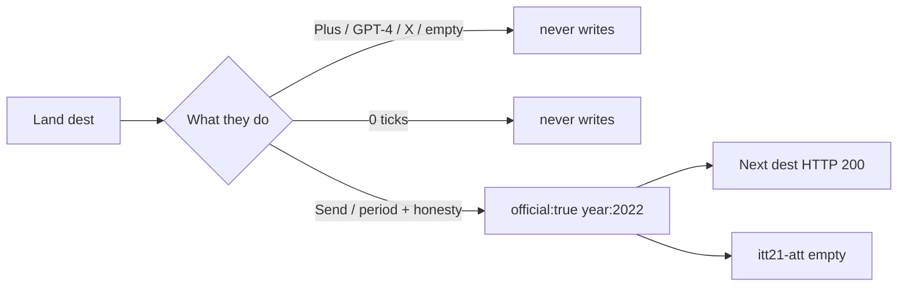
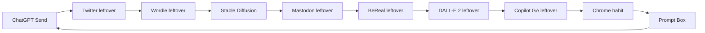
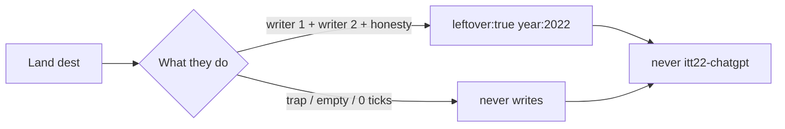
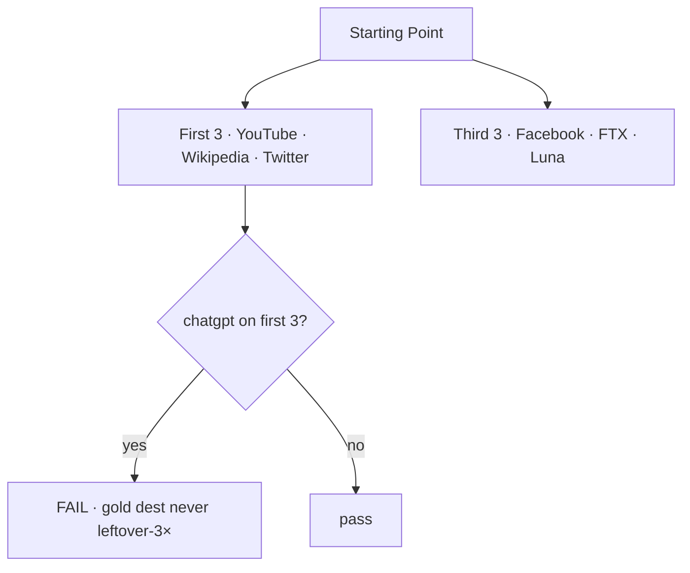

# 2022 — flow diagram (live lean)

**Date:** 2026-09-10  
**Status:** **CUT-OPEN shipped.** Dest freeze **98**. Leftover **2×**. Leftover-3× **18+18+18**. Unique vs 2021.  
**Walk list:** same dests as [`2022-MAP-DEST-TRUE-UNIQUE-2026-09-10.md`](2022-MAP-DEST-TRUE-UNIQUE-2026-09-10.md)  
**Star:** ChatGPT Send · `itt22-chatgpt` · `/years/2022/sites/chatgpt/index.html`

Walk top to bottom. Fail the first red box.

---

## Year

---

## Guided 6

7th `<li>` = fail. No ATT / Signal / Copilot waitlist.

---

## Official dest minute

ChatGPT only: type ≥2 then **Send**. Empty Send never writes.

---

## Official 10 Next chain

| n | Dest | Key | Trap |
|--:|------|-----|------|
| 1 | ChatGPT Send | `itt22-chatgpt` | Plus · empty Send |
| 2 | Twitter leftover | `itt22-twitter` | X wordmark |
| 3 | Wordle leftover | `itt22-wordle` | Wordle-as-gold |
| 4 | Stable Diffusion | `itt22-sd` | live weights |
| 5 | Mastodon leftover | `itt22-mastodon` | Threads as this |
| 6 | BeReal leftover | `itt22-bereal` | BeReal-as-gold |
| 7 | DALL·E 2 leftover | `itt22-dalle2` | DALL·E 3 as 2022 |
| 8 | Copilot GA leftover | `itt22-copilotga` | 2021 waitlist dest |
| 9 | Chrome habit | `itt22-chrome` | Chrome-as-January |
| 10 | Prompt Box | `itt22-game-prompt` | Wordle dest as cabinet |

---

## Leftover 2× (every dest)

Two `data-lo-save` on all **15** dests. Not 2× dest folders.

---

## Leftover-3× + extra dests

Extra leftover dests (not official 10): YouTube · Wikipedia · Facebook · FTX · Luna.

---

## Honesty unlist (never dests)

Plus · GPT-4 · Bing Chat · Threads · X · Bard · Sora · ATT · Signal · Copilot waitlist · Meta · Win11 · Flash · NFT · Clubhouse · Squid · invent June ILS 2022 websites.
