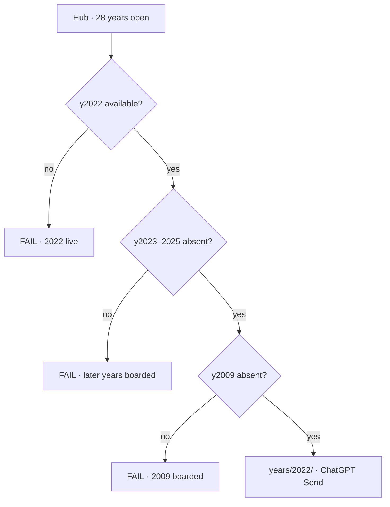
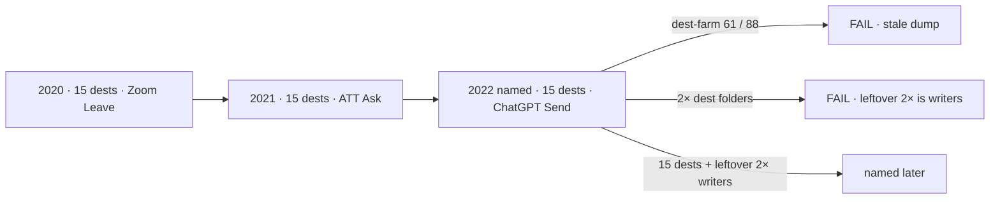
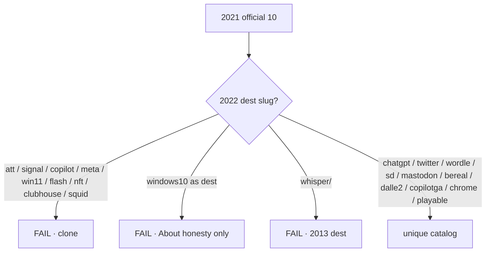
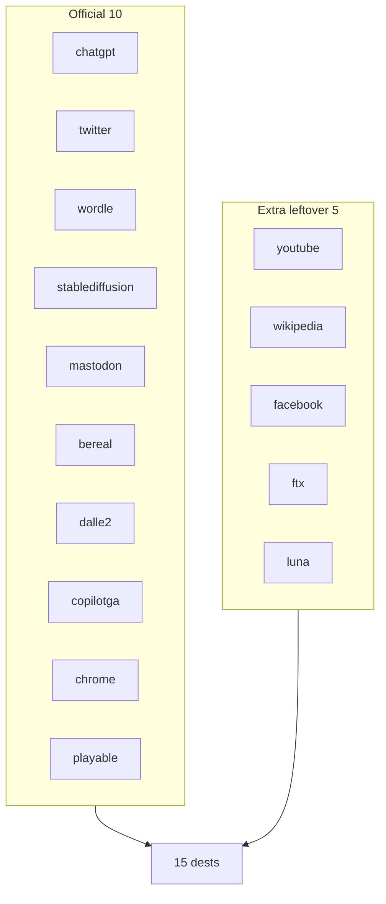
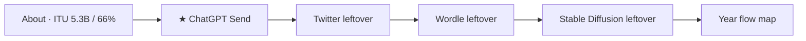
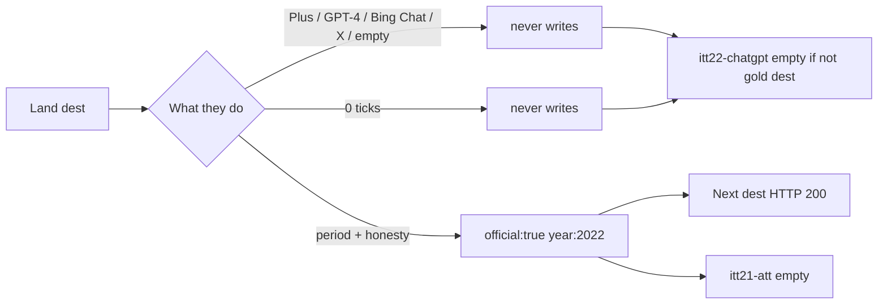
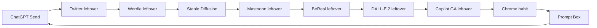
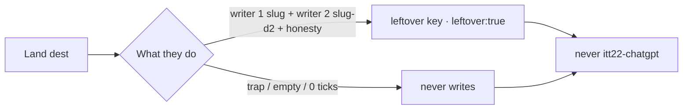
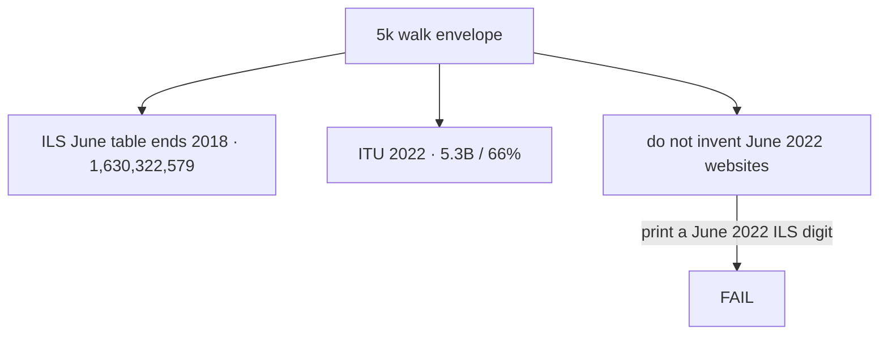
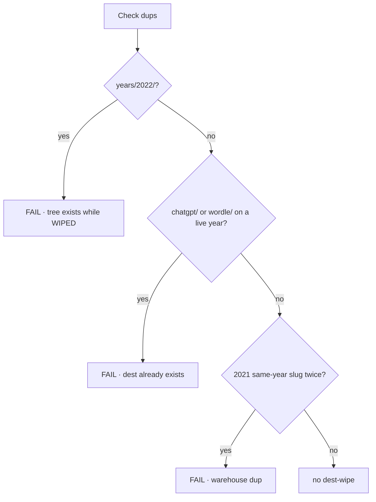

# 2022 — map every dest · every flow (research)

**Date:** 2026-09-10  
**Status:** **CUT-OPEN shipped.** Dest freeze 15. Unique vs 2021. Leftover 2×.  
**Read first:** [`2022-READ-FIRST.md`](2022-READ-FIRST.md)  
**Lock:** [`2022-FROM-SCRATCH-DEST-TRUE-UNIQUE-RESEARCH-GOALS-PHASES-FLOWS-MINUTE-2026-09-10.md`](2022-FROM-SCRATCH-DEST-TRUE-UNIQUE-RESEARCH-GOALS-PHASES-FLOWS-MINUTE-2026-09-10.md)  
**Every flow dest minutes:** [`2022-EVERY-FLOW-GOALS-PHASES-FLOWS-MINUTE-2026-09-10.md`](2022-EVERY-FLOW-GOALS-PHASES-FLOWS-MINUTE-2026-09-10.md)  
**5k:** [`2022-5K-WEB-FLOW-MAP-2026-09-10.md`](2022-5K-WEB-FLOW-MAP-2026-09-10.md)  
**Check:** [`2022-CHECK-EVERY-FLOW-MAP-2026-09-10.md`](2022-CHECK-EVERY-FLOW-MAP-2026-09-10.md)

Walk top to bottom. Fail the first red box. Dest freeze **15**. Leftover **2×** = two writers. Leftover-4× **0**. Guided **6**. Star **ChatGPT Send**.

---

## 1. Hub now (CUT-OPEN)

---

## 2. Density (match 2020 / 2021 lean)

| Year | Door | dests | Star |
|-----:|------|------:|------|
| 2020 | live lean | 15 | Zoom Leave |
| 2021 | live lean | 15 | ATT Ask |
| **2022** | **WIPED · named** | **15** | **ChatGPT Send** |

---

## 3. Unique vs 2021 (do not clone)

| 2021 dest | 2022 |
|-----------|------|
| `att/` `signal/` `copilot/` `meta/` `windows11/` `flash/` | **never** |
| `nft/` `clubhouse/` `squid/` | **never** |
| `windows10/` | About only |
| `chrome/` `playable/` | residual / Prompt Box · unique year chrome |
| `copilot/` | **`copilotga/`** · GA leftover |

---

## 4. Dest freeze 15

Leftover-3× first: YouTube · Wikipedia · **Twitter** (twitter is official · gold dest never leftover-3×).  
Leftover-3× third: Facebook · FTX · Luna.

---

## 5. Guided 6

7th `<li>` = fail.

---

## 6. Official dest minute (every official dest)

---

## 7. Official Next chain

| n | Dest | Path | Key | Trap |
|--:|------|------|-----|------|
| 1 | ChatGPT Send | `sites/chatgpt/index.html` | `itt22-chatgpt` | empty · Plus · GPT-4 |
| 2 | Twitter leftover | `sites/twitter/index.html` | `itt22-twitter` | X as 2022 dest |
| 3 | Wordle leftover | `sites/wordle/index.html` | `itt22-wordle` | Wordle-as-gold |
| 4 | Stable Diffusion | `sites/stablediffusion/index.html` | `itt22-sd` | live weights |
| 5 | Mastodon leftover | `sites/mastodon/index.html` | `itt22-mastodon` | Threads as this |
| 6 | BeReal leftover | `sites/bereal/index.html` | `itt22-bereal` | BeReal-as-gold |
| 7 | DALL·E 2 leftover | `sites/dalle2/index.html` | `itt22-dalle2` | DALL·E 3 as 2022 |
| 8 | Copilot GA leftover | `sites/copilotga/index.html` | `itt22-copilotga` | 2021 `copilot/` as this |
| 9 | Chrome habit | `sites/chrome/index.html` | `itt22-chrome` | Chrome-as-January |
| 10 | Prompt Box | `sites/playable/game.html` | `itt22-game-prompt` | Wordle dest as cabinet |

---

## 8. Leftover 2× (every dest · two writers)

Two `data-lo-save` on **every** dest of the 15. Not 2× dest folders.

---

## 9. Leftover dest minutes (5 extra)

| Dest | Path | Key prefix | Trap |
|------|------|------------|------|
| YouTube leftover | `sites/youtube/index.html` | `itt22-youtube` | 2005 upload gold as this |
| Wikipedia leftover | `sites/wikipedia/index.html` | `itt22-wikipedia` | 2001 gold as this |
| Facebook leftover | `sites/facebook/index.html` | `itt22-facebook` | Like-as-gold |
| FTX leftover | `sites/ftx/index.html` | `itt22-ftx` | live exploit |
| Luna leftover | `sites/luna/index.html` | `itt22-luna` | live exploit |

---

## 10. 5k envelope (not dests)

---

## 11. Duplicates (nothing to dest-wipe)

Stale 61 / 88 dest dumps stay paper. Do not implement them.

---

## 12. Honesty unlist (never dests)

Plus · GPT-4 · Bing Chat · Threads · X · Bard · Sora · 4o · invent June ILS 2022 websites · 100M MAU dest · ATT dest · Signal dest · Meta dest · clone `copilot/` · `whisper/` (2013 dest).

---

## Pass table (when CUT-OPEN named)

| Check | Pass |
|-------|------|
| Hub | **no** y2022 card this pass |
| Tree | **no** `years/2022/` this pass |
| Guided | 6 |
| Gold | empty / Plus / GPT-4 never write · Send writes `itt22-chatgpt` |
| Official 10 | dest-true · unique vs 2021 |
| Leftover 2× | two writers · never the star |
| Leftover-3× first | no `chatgpt` |
| Dest freeze | 15 |
| About | no invented June ILS 2022 websites |
| Neighbors | `itt21-att` empty |

## Bans

**CUT-OPEN this pass · dest-farm · Plus dest · GPT-4 dest · X dest · invent June ILS 2022 websites · leftover writes gold · leftover-4× · leftover-2× as double dest folders · clone 2021 dests · 7th guided `<li>`.**
