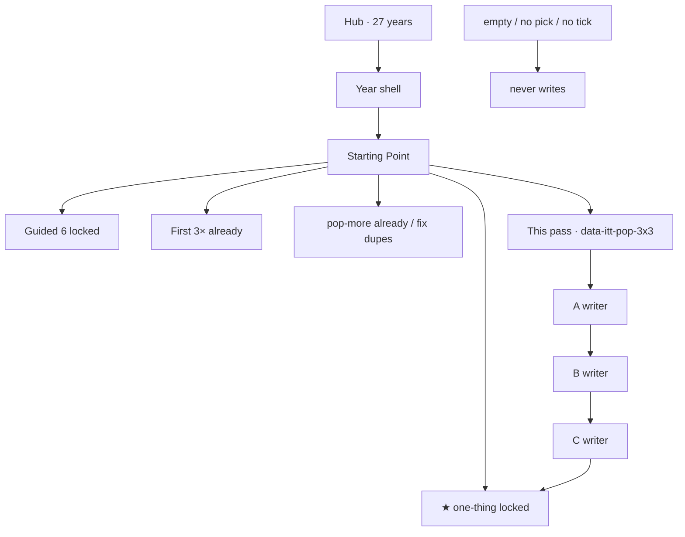

# 3× leftover flows + links — every playable year

**Date:** 2026-08-21  
**This file is the one implementer map.** **On disk 2026-08-21** (S0–S7). Re-run `python3 scripts/build-3x3-links.py` is idempotent.  
**Git only if asked.** Incomplete REAL never writes. Never invent brand pixels.

| Companion | When you need it |
|-----------|------------------|
| **This file** | Goals · steps · exact hrefs · per-year flows · approve list |
| [`3X-FLOWS-LINKS-EVERY-YEAR-RESEARCH-MAP-GOALS-STEPS-MEASURABLE-2026-08-21.md`](3X-FLOWS-LINKS-EVERY-YEAR-RESEARCH-MAP-GOALS-STEPS-MEASURABLE-2026-08-21.md) | Disk honesty · harvest · why these three |
| [`3X-POPULAR-WEBSITES-1994-2015.md`](3X-POPULAR-WEBSITES-1994-2015.md) | **First** leftover trio (already on disk) |
| [`3X-POPULAR-WEBSITES-FLOW-MAP.md`](3X-POPULAR-WEBSITES-FLOW-MAP.md) | First-trio visitor pictures |
| [`2016-2018-3X-FLOWS-DETAIL.md`](2016-2018-3X-FLOWS-DETAIL.md) | How a leftover 3× room must feel |
| [`2X-LINKS-EVERY-YEAR-IMPLEMENTATION-PHASES-MINUTE-2026-08-20.md`](2X-LINKS-EVERY-YEAR-IMPLEMENTATION-PHASES-MINUTE-2026-08-20.md) | 2× ≠ dump hrefs · injector pattern |
| [`ARCHITECTURE.md`](ARCHITECTURE.md) | Config + content. No year-forked engines. |
| Engine | [`js/immersion/year-popular-3x.js`](../js/immersion/year-popular-3x.js) |
| First-trio spec | [`scripts/popular-3x-sites.json`](../scripts/popular-3x-sites.json) |
| e2e already | [`e2e/year-more-3x.spec.js`](../e2e/year-more-3x.spec.js) · [`e2e/3x-links.spec.js`](../e2e/3x-links.spec.js) |

**Hub:** 1994–2013 + 2015–2021 (**27 years**). **2014 wiped — skip.** **2022+ not on disk.**

**Legal:** Educational. `localStorage` only. No real pizza, cams, torrents, cards, GPS, or streams.

**Two older-year blogs walked (do not skip):**

| Blog | Room | Steal |
|------|------|-------|
| Scripting News 1997 | [`years/1997/sites/scripting/`](../years/1997/sites/scripting/index.html) | Daily residual. Incomplete never writes. |
| TechCrunch 2006 | [`years/2006/sites/techcrunch/`](../years/2006/sites/techcrunch/index.html) | Press names the stack. Not the chip. |

---

# 1. Goal (what “done” means)

Give every playable year **three new leftover websites** a visitor can *use*, same engine as the first 3×.

```
Hub → year shell → Starting Point
        ★ one-thing              LOCKED
        guided <ol> exactly 6    LOCKED
        official 10              LOCKED
        first 3×                 already on disk
        second 3× / pop-more     already on disk (holes listed below)
        this pass → third 3×
              A  pick + honesty + type ≥2 + go   →  ittYY-pop3-<a>
              B  same                            →  ittYY-pop3-<b>
              C  same                            →  ittYY-pop3-<c>
        ← Year menu → hub
```

**Not done if:** the star moves, guided becomes 7, first-3× keys are overwritten, 2014 is restored, a forest year grows a new folder, a lean year grows more than +3 HTML, empty go writes, or home only gains more raw hrefs with no writer.

**Gold leftover** (same rule as 2010 Instagram / 2016 leftover 3×):

> pick a row · tick honesty · type ≥2 · go · incomplete never writes · reload persist · period costume · **not a checkbox plaque**

---

# 2. What 3× is (and is not)

| Is | Is not |
|----|--------|
| 3 leftover **websites** per year | 3× every href on home |
| 3 **writer sessions** | 3× official 10 (that would be 30 stops) |
| 3 **new** dests not already first-3× / unique pop-more / star | Yahoo/Wiki/Amazon again on 2007 |
| Measurable keys + e2e | “Also popular” prose with no write |

**Measurable done = all 8:**

1. Every playable `pages/home.html` has `[data-itt-pop-3x3="YYYY"]` with **exactly 3** `a[href*="sites/"]`.  
2. Those 3 hrefs ≠ star, ≠ first-3× trio, ≠ that year’s unique pop-more dests.  
3. Each dest has `data-pop-pick` + `data-pop-req` + `data-pop-field` + `data-pop-go`.  
4. Empty / no pick / no tick never writes. Complete writes `ittYY-pop3-<id>`.  
5. Guided `<ol>` still 6. `data-ott-one-thing` href unchanged.  
6. Forest years: **0 new folders**. Lean hole years: **only** the 12 rooms in §8.  
7. `e2e/year-3x3.spec.js` green. Existing `year-more-3x` / `3x-links` stay green.  
8. `check-all-years` 27 pass · mock audit 0 dest-field · official 10 still 10/10 REAL.

**Count if you say implement:** 81 writers · 81 home links · 12 new HTML · 0 stars moved.

---

# 3. Hard bans

| Never | Why |
|-------|-----|
| Move `data-ott-one-thing` | One hero |
| 7th guided `<li>` | Locked 6 |
| Overwrite `ittYY-pop-<first-trio-id>` | First 3× stays |
| Restore `years/2014/` | Still wiped |
| ChatGPT / Temu in 2019–2021 | 2022+ / 2026 ranks |
| IG Stories as 2013 leftover | 2016 |
| Spotify US / iPad as 2009 leftover | 2011 / 2010 |
| Adult-video top-10 room | Compiled lists only |
| Invented brand pixels | Always |
| Cam on Omegle / Chatroulette | Already first 3×; literacy only |
| Real money / GPS / live stream | Theater |
| `data-pop-go` on a dest that **already has** `data-pop-go` | Engine binds one button per page |

---

# 4. Align these pointers (every year)

```
home  [data-itt-pop-3x3="YYYY"]
      a[0]  =  years/YYYY/sites/<A>/index.html
      a[1]  =  years/YYYY/sites/<B>/index.html
      a[2]  =  years/YYYY/sites/<C>/index.html

map   three new <li> pointing at the same writers
      (not empty indexes)

key   ittYY-pop3-<slug>
      via data-pop-id="pop3-<slug>"
      YearExtras / year-popular-3x.js → ittYY-pop-pop3-<slug>
      OR extend year-popular-3x.js so data-pop-key="pop3-<slug>"
         writes ittYY-pop3-<slug> directly.

star  data-ott-one-thing="YYYY"   UNCHANGED
guided #ott-guided-YYYY ol > li   still 6
```

**Key implement lock (pick one before typing):**

- **Preferred:** add `data-pop-key="pop3-lycos"` support in [`year-popular-3x.js`](../js/immersion/year-popular-3x.js) so `localStorage` key is `ittYY-pop3-lycos`.  
- **Fallback:** `data-pop-id="pop3lycos"` writes `ittYY-pop-pop3lycos` (ugly but collision-free).  
- **Forbidden:** `data-pop-id="lycos"` on 1994 if that would smash a future first-3× id. First-3× ids are listed per year in §7.

---

# 5. Steal (do not invent an engine)

| Steal | From | Into this pass |
|-------|------|----------------|
| pick + honesty + field + go | [`year-popular-3x.js`](../js/immersion/year-popular-3x.js) | Third trio |
| Home leftover strip | `[data-itt-pop-more]` on [`years/1994/pages/home.html`](../years/1994/pages/home.html) | `[data-itt-pop-3x3]` **below** pop-more |
| Costume leftover rooms | [`docs/2016-2018-3X-FLOWS-DETAIL.md`](2016-2018-3X-FLOWS-DETAIL.md) | Every dest |
| Injector / idempotent markers | [`scripts/build-2x-links.py`](../scripts/build-2x-links.py) `<!-- ITT-4X:... -->` | `<!-- ITT-POP3:slug:start -->` |
| Trap vs save | 2007 App Store · 2018 Accept All | Year-true trap on lean holes |
| Dual-cite / bans | Each year’s About | Do not rewrite About |

---

# 6. Shared minute steps (do in this order)

### S0 — Freeze · `[x]` this file

1. Confirm ship years = 1994–2013 + 2015–2021. Skip 2014.  
2. Confirm first 3× exists on all 27 (`data-itt-pop3x`).  
3. Confirm pop-more **dupes** first 3× on **2007, 2009, 2011, 2013**.  
4. Confirm pop-more **missing** on **2012, 2019, 2020, 2021**.  
5. Lock §7 table. Stop until §12 is checked.

### S1 — Engine key · `[x]`

1. Open [`js/immersion/year-popular-3x.js`](../js/immersion/year-popular-3x.js).  
2. If `data-pop-key` present, `k = YX.key(that)` else keep `pop-` + `data-pop-id`.  
3. One-line comment: third-trio keys.  
4. Do not change first-3× behavior.  
5. `node --check js/immersion/year-popular-3x.js`.

### S2 — Spec file · `[x]`

1. Create [`scripts/popular-3x3-sites.json`](../scripts/popular-3x3-sites.json) with the 27 × 3 rows (id, name, title, why, verb, ph, btn).  
2. **Do not edit** [`scripts/popular-3x-sites.json`](../scripts/popular-3x-sites.json).

### S3 — Forest years 1994–2006 + 2008 · `[x]`

For each year in §7 forest table, for dests A, B, C:

1. Open `years/YYYY/sites/<slug>/index.html`.  
2. Confirm **no** existing `data-pop-go`. If one exists, **stop** and pick the alternate in the notes column.  
3. Append the panel in §9 (`<!-- ITT-POP3:<slug>:start -->` … `end`).  
4. `data-itt-year` already on the page. Script src stays `immersion-YYYY.js` only.  
5. After C: Next → star dest.

Then home + map (§10).

### S4 — Lean years with existing folders · `[x]`

2010, 2012, 2015–2021: same as S3 (0 new folders).  
2012 / 2019 / 2020 / 2021: the new trio **is** also `data-itt-pop-more` (same 3 hrefs on both attributes is OK — still 3 dests, not 6).

### S5 — Lean holes · `[x]`

2007, 2009, 2011, 2013 only. Create the 12 files in §8. Rewrite dupe `data-itt-pop-more` to the **new** three hrefs (do not leave Yahoo/Wiki/Amazon / Omegle copies).

### S6 — Home + map · `[x]`

§10 snippet on every playable `pages/home.html` **below** the existing pop-more / pop3x line.  
`pages/map.html`: three new `<li>` writers.

### S7 — e2e + gates · `[x]` on disk · run below

1. Add [`e2e/year-3x3.spec.js`](../e2e/year-3x3.spec.js) from §11.  
2. `npx playwright test e2e/year-3x3.spec.js e2e/year-more-3x.spec.js e2e/3x-links.spec.js --workers=1`  
3. `python3 scripts/check-all-years.py`  
4. `node scripts/audit-mock-flows.js`  
5. `node scripts/audit-all-year-flows.js` — official 10 still 10 REAL.

---

# 7. Per-year flows (life → museum → proof)

Every flow below is **leftover**. Star in the first column never changes.

**You do (all 81):** pick one named row · tick leftover honesty · type ≥2 characters · Go.  
**Empty / no pick / no tick → no `localStorage`.**

Href paths are relative from `pages/home.html`.

---

## 1994 — directories + first .gov

**Thesis:** Directories beat search. NN1 · Win 3.1 · 14.4.  
**Star stays:** [`sites/csotd/index.html`](../years/1994/sites/csotd/index.html) · `itt94-csotd`  
**Already first 3×:** Pizza Hut · NetMarket · IMDb  
**Already pop-more:** Prodigy · CompuServe · Pathfinder

| # | Life | Museum dest | Pick / type | Writes | Next |
|--:|------|-------------|-------------|--------|------|
| A | You still use a catalog, not Google | [`../sites/lycos/index.html`](../years/1994/sites/lycos/index.html) | pick `catalog` · type `web` | `itt94-pop3-lycos` | Infoseek |
| B | Paid search leftover | [`../sites/infoseek/index.html`](../years/1994/sites/infoseek/index.html) | pick `search` · type `mosaic` | `itt94-pop3-infoseek` | NASA |
| C | First agency site people actually opened | [`../sites/nasa/index.html`](../years/1994/sites/nasa/index.html) | pick `shuttle` · type `ksc` | `itt94-pop3-nasa` | ★ CSotD |

Honesty: “Leftover catalog. Star stays Cool Site of the Day.”

---

## 1995 — homestead + people-finder

**Star stays:** [`sites/amazon/ssl-checkout.html`](../years/1995/sites/amazon/ssl-checkout.html) · `itt95-ssl-checkout`  
**Already:** ESPNet · CNET · Salon · pop-more WSJ · Time Warner · HotBot

| # | Dest | Pick / type | Key | Next |
|--:|------|-------------|-----|------|
| A | [`../sites/geocities/index.html`](../years/1995/sites/geocities/index.html) | `homestead` / `colby` | `itt95-pop3-geocities` | Classmates |
| B | [`../sites/classmates/index.html`](../years/1995/sites/classmates/index.html) | `find` / `class of 89` | `itt95-pop3-classmates` | Match |
| C | [`../sites/match/index.html`](../years/1995/sites/match/index.html) | `personals` / `seattle` | `itt95-pop3-match` | ★ Amazon SSL |

Honesty: “Leftover people-web. Star stays Amazon SSL.”

---

## 1996 — free mail + portal + homestead cousin

**Star stays:** [`sites/portals/wars.html`](../years/1996/sites/portals/wars.html) · `itt96-portal-wars`  
**Already:** Craigslist · Ask Jeeves · MTV · pop-more TotalNY · Pathfinder · HotBot

| # | Dest | Pick / type | Key | Next |
|--:|------|-------------|-----|------|
| A | [`../sites/hotmail/index.html`](../years/1996/sites/hotmail/index.html) | `inbox` / `you@hotmail` | `itt96-pop3-hotmail` | Excite |
| B | [`../sites/excite/index.html`](../years/1996/sites/excite/index.html) | `portal` / `channels` | `itt96-pop3-excite` | Angelfire |
| C | [`../sites/angelfire/index.html`](../years/1996/sites/angelfire/index.html) | `page` / `my site` | `itt96-pop3-angelfire` | ★ portals |

---

## 1997 — geek news + MP3 + auction leftover

**Star stays:** [`sites/pointcast/index.html`](../years/1997/sites/pointcast/index.html) · `itt97-pointcast`  
**Already:** NYTimes · MP3.com · ZDNet · pop-more News.com · Drudge · HotWired

| # | Dest | Pick / type | Key | Next |
|--:|------|-------------|-----|------|
| A | [`../sites/slashdot/index.html`](../years/1997/sites/slashdot/index.html) | `story` / `linux` | `itt97-pop3-slashdot` | Winamp |
| B | [`../sites/winamp/index.html`](../years/1997/sites/winamp/index.html) | `skin` / `classic` | `itt97-pop3-winamp` | eBay |
| C | [`../sites/ebay/index.html`](../years/1997/sites/ebay/index.html) | `auction` / `peanut` | `itt97-pop3-ebay` | ★ PointCast |

---

## 1998 — Open Directory + CD shop + game mag

**Star stays:** [`sites/google/lucky.html`](../years/1998/sites/google/lucky.html) · `itt98-lucky`  
**Already:** GO.com · Snap · About · pop-more Open Diary · ICQ web · Broadcast.com

| # | Dest | Pick / type | Key | Next |
|--:|------|-------------|-----|------|
| A | [`../sites/dmoz/index.html`](../years/1998/sites/dmoz/index.html) | `catalog` / `computers` | `itt98-pop3-dmoz` | CDNow |
| B | [`../sites/cdnow/index.html`](../years/1998/sites/cdnow/index.html) | `album` / `ok computer` | `itt98-pop3-cdnow` | GameSpot |
| C | [`../sites/gamespot/index.html`](../years/1998/sites/gamespot/index.html) | `preview` / `halflife` | `itt98-pop3-gamespot` | ★ Lucky |

---

## 1999 — blog · day-trade · wallet leftover

**Star stays:** [`sites/aim/index.html`](../years/1999/sites/aim/index.html) · `itt99-aim`  
**Already:** LiveJournal · Neopets · eGroups · pop-more Onion · drkoop · Sixdegrees

| # | Dest | Pick / type | Key | Next |
|--:|------|-------------|-----|------|
| A | [`../sites/blogger/index.html`](../years/1999/sites/blogger/index.html) | `post` / `hello` | `itt99-pop3-blogger` | E*TRADE |
| B | [`../sites/etrade/index.html`](../years/1999/sites/etrade/index.html) | `quote` / `yhoo` | `itt99-pop3-etrade` | PayPal |
| C | [`../sites/paypal/index.html`](../years/1999/sites/paypal/index.html) | `send` / `20` | `itt99-pop3-paypal` | ★ AIM |

Trap: “Charge a real card” never writes.

---

## 2000 — crash travel + wallet + auction

**Star stays:** [`sites/mapquest/index.html`](../years/2000/sites/mapquest/index.html) · `itt00-mapquest`  
**Already:** Half.com · Baidu · Everything2 · pop-more iVillage · Women.com · Napster web

| # | Dest | Pick / type | Key | Next |
|--:|------|-------------|-----|------|
| A | [`../sites/expedia/index.html`](../years/2000/sites/expedia/index.html) | `flight` / `sfo` | `itt00-pop3-expedia` | PayPal |
| B | [`../sites/paypal/index.html`](../years/2000/sites/paypal/index.html) | `send` / `20` | `itt00-pop3-paypal` | eBay |
| C | [`../sites/ebay/index.html`](../years/2000/sites/ebay/index.html) | `watch` / `beanie` | `itt00-pop3-ebay` | ★ MapQuest |

---

## 2001 — Google arrives in the top 10 (not the chip)

**Star stays:** [`sites/wikipedia/edit.html`](../years/2001/sites/wikipedia/edit.html) · `itt01-wiki-pages`  
**Already:** BitTorrent · iTunes · Morpheus · pop-more MoveOn · grok · iMac

| # | Dest | Pick / type | Key | Next |
|--:|------|-------------|-----|------|
| A | [`../sites/google/index.html`](../years/2001/sites/google/index.html) | `search` / `wikipedia` | `itt01-pop3-google` | CNET |
| B | [`../sites/cnet/index.html`](../years/2001/sites/cnet/index.html) | `news` / `xp` | `itt01-pop3-cnet` | BBC |
| C | [`../sites/bbc/index.html`](../years/2001/sites/bbc/index.html) | `world` / `kabul` | `itt01-pop3-bbc` | ★ Wikipedia edit |

---

## 2002 — art dump + blog-search + dying encyclopedia

**Star stays:** [`sites/stumbleupon/index.html`](../years/2002/sites/stumbleupon/index.html) · `itt02-stumble`  
**Already:** Meetup · Fotolog · TypePad · pop-more Fark · Homestar · Blogspot *(do not reuse those three)*

| # | Dest | Pick / type | Key | Next |
|--:|------|-------------|-----|------|
| A | [`../sites/deviantart/index.html`](../years/2002/sites/deviantart/index.html) | `watch` / `skin` | `itt02-pop3-deviantart` | Daypop |
| B | [`../sites/daypop/index.html`](../years/2002/sites/daypop/index.html) | `blog` / `iraq` | `itt02-pop3-daypop` | Encarta |
| C | [`../sites/encarta/index.html`](../years/2002/sites/encarta/index.html) | `article` / `moon` | `itt02-pop3-encarta` | ★ StumbleUpon |

---

## 2003 — tags · voice · ads

**Star stays:** [`sites/photobucket/index.html`](../years/2003/sites/photobucket/index.html) · `itt03-photobucket`  
**Already:** 4chan literacy · hi5 · Newgrounds · pop-more Evite · Tribe · Second Life *(do not reuse)*

| # | Dest | Pick / type | Key | Next |
|--:|------|-------------|-----|------|
| A | [`../sites/delicious/index.html`](../years/2003/sites/delicious/index.html) | `tag` / `ajax` | `itt03-pop3-delicious` | Skype |
| B | [`../sites/skype/index.html`](../years/2003/sites/skype/index.html) | `call` / `echo` | `itt03-pop3-skype` | AdSense |
| C | [`../sites/adsense/index.html`](../years/2003/sites/adsense/index.html) | `ad` / `blog` | `itt03-pop3-adsense` | ★ Photobucket |

---

## 2004 — Digg birth · Gmail April Fools · tags

**Star stays:** [`sites/facebook/networks.html`](../years/2004/sites/facebook/networks.html) · `itt04-thefacebook-networks`  
**Already:** Piczo · Tagged · Odeo · pop-more Yelp · Orkut · Flickr *(do not reuse)*

| # | Dest | Pick / type | Key | Next |
|--:|------|-------------|-----|------|
| A | [`../sites/digg/index.html`](../years/2004/sites/digg/index.html) | `digg` / `firefox` | `itt04-pop3-digg` | Gmail |
| B | [`../sites/gmail/index.html`](../years/2004/sites/gmail/index.html) | `invite` / `1gb` | `itt04-pop3-gmail` | Delicious |
| C | [`../sites/delicious/index.html`](../years/2004/sites/delicious/index.html) | `tag` / `web2` | `itt04-pop3-delicious` | ★ thefacebook |

Gmail honesty: invite-only is **2004** leftover. Open worldwide is **2007**.

---

## 2005 — social king + photos + Ajax maps (not the chip)

**Star stays:** [`sites/youtube/upload.html`](../years/2005/sites/youtube/upload.html) · `itt05-yt-uploads`  
**Already:** DailyMotion · Vimeo · Gaia · pop-more Reddit front · Google Earth · Kayak

| # | Dest | Pick / type | Key | Next |
|--:|------|-------------|-----|------|
| A | [`../sites/myspace/index.html`](../years/2005/sites/myspace/index.html) | `tom` / `top 8` | `itt05-pop3-myspace` | Flickr |
| B | [`../sites/flickr/index.html`](../years/2005/sites/flickr/index.html) | `tag` / `cat` | `itt05-pop3-flickr` | Maps |
| C | [`../sites/maps/index.html`](../years/2005/sites/maps/index.html) | `drag` / `sf` | `itt05-pop3-maps` | ★ YouTube upload |

---

## 2006 — Feed + Google-owned YT + encyclopedia leftover

**Star stays:** [`sites/twitter/index.html`](../years/2006/sites/twitter/index.html) · `itt06-tweets`  
**Already:** Bebo · SlideShare · Newsvine · pop-more Twitter bird · wikiHow · Digg v4

| # | Dest | Pick / type | Key | Next |
|--:|------|-------------|-----|------|
| A | [`../sites/facebook/index.html`](../years/2006/sites/facebook/index.html) | `feed` / `open` | `itt06-pop3-facebook` | YouTube |
| B | [`../sites/youtube/index.html`](../years/2006/sites/youtube/index.html) | `watch` / `saturday` | `itt06-pop3-youtube` | Wikipedia |
| C | [`../sites/wikipedia/index.html`](../years/2006/sites/wikipedia/index.html) | `article` / `web 2.0` | `itt06-pop3-wikipedia` | ★ Twitter |

---

## 2007 — live video leftovers (portals already used)

**Star stays:** [`sites/iphone/index.html`](../years/2007/sites/iphone/index.html) · `itt07-iphone`  
**Already first 3× = pop-more (DUPE):** Yahoo · Wikipedia · Amazon · **rewrite pop-more to A/B/C**  
**Official 10 already ate:** YouTube · MySpace · Digg

| # | Dest | Pick / type | Key | Next | New file |
|--:|------|-------------|-----|------|----------|
| A | [`../sites/justin/index.html`](../years/2007/sites/justin/index.html) | `live` / `desk` | `itt07-pop3-justin` | Ustream | **yes** |
| B | [`../sites/ustream/index.html`](../years/2007/sites/ustream/index.html) | `live` / `show` | `itt07-pop3-ustream` | Qik | **yes** |
| C | [`../sites/qik/index.html`](../years/2007/sites/qik/index.html) | `phone` / `clip` | `itt07-pop3-qik` | ★ iPhone | **yes** |

Honesty: “Live leftover. Still Flash. Star stays iPhone Safari.”  
HTML after: 26 + 3 = **29** (under 50).

---

## 2008 — Web 2.0 leftovers not already official 10

**Star stays:** [`sites/appstore/index.html`](../years/2008/sites/appstore/index.html)  
**Already:** Stack Overflow · Posterous · Grooveshark · pop-more Spotify EU · Dropbox folder · Hulu watch  
**Official 10 ate:** Chrome · GitHub · G1 · Hulu · Dropbox

Folders **exist:** `friendconnect` · `evernote` · `lastfm`

| # | Dest | Pick / type | Key | Next |
|--:|------|-------------|-----|------|
| A | [`../sites/friendconnect/index.html`](../years/2008/sites/friendconnect/index.html) | `gadget` / `friends` | `itt08-pop3-friendconnect` | Evernote |
| B | [`../sites/evernote/index.html`](../years/2008/sites/evernote/index.html) | `clip` / `note` | `itt08-pop3-evernote` | Last.fm |
| C | [`../sites/lastfm/index.html`](../years/2008/sites/lastfm/index.html) | `scrobble` / `radio` | `itt08-pop3-lastfm` | ★ App Store |

---

## 2009 — seeds, not Omegle again

**Star stays:** [`sites/facebook/index.html`](../years/2009/sites/facebook/index.html) · `itt09-like`  
**Already first 3× = pop-more (DUPE):** Omegle · Chatroulette · Wikipedia · **rewrite pop-more**  
**Official 10 ate:** Twitter · Foursquare · Kickstarter

| # | Dest | Pick / type | Key | Next | New file |
|--:|------|-------------|-----|------|----------|
| A | [`../sites/mafiawars/index.html`](../years/2009/sites/mafiawars/index.html) | `job` / `hit` | `itt09-pop3-mafiawars` | WhatsApp | **yes** |
| B | [`../sites/whatsapp/index.html`](../years/2009/sites/whatsapp/index.html) | `sms` / `hello` | `itt09-pop3-whatsapp` | UberCab | **yes** |
| C | [`../sites/ubercab/index.html`](../years/2009/sites/ubercab/index.html) | `sf` / `black` | `itt09-pop3-ubercab` | ★ Like | **yes** |

Traps: cam · worldwide Uber · real charge.  
Honesty: “Seed leftover. Star stays Like. iPad never writes.”  
HTML after: 24 + 3 = **27**.

---

## 2010 — leftover browsers / funeral (official 10 ate Imgur / 4sq)

**Star stays:** [`sites/instagram/index.html`](../years/2010/sites/instagram/index.html) · `itt10-ig`  
**Already:** Netflix · Tumblr · Formspring · pop-more Groupon deal · Quora wait · IG iOS

| # | Dest | Pick / type | Key | Next |
|--:|------|-------------|-----|------|
| A | [`../sites/chrome/index.html`](../years/2010/sites/chrome/index.html) | `tab` / `omnibox` | `itt10-pop3-chrome` | Wave |
| B | [`../sites/wave/index.html`](../years/2010/sites/wave/index.html) | `funeral` / `wave` | `itt10-pop3-wave` | Android |
| C | [`../sites/android/index.html`](../years/2010/sites/android/index.html) | `market` / `app` | `itt10-pop3-android` | ★ Instagram |

---

## 2011 — seeds official 10 did not eat

**Star stays:** [`sites/googleplus/index.html`](../years/2011/sites/googleplus/index.html) · `itt11-gplus`  
**Already first 3× = pop-more (DUPE):** iCloud · Pinterest · LinkedIn · **rewrite pop-more**  
**Official 10 ate:** Airbnb · Twitter · Qwikster · IG iOS · iPad 2

| # | Dest | Pick / type | Key | Next | New file |
|--:|------|-------------|-----|------|----------|
| A | [`../sites/snapchat/index.html`](../years/2011/sites/snapchat/index.html) | `snap` / `ghost` | `itt11-pop3-snapchat` | Tumblr | **yes** |
| B | [`../sites/tumblr/index.html`](../years/2011/sites/tumblr/index.html) | `reblog` / `gif` | `itt11-pop3-tumblr` | YouTube | **yes** |
| C | [`../sites/youtube/index.html`](../years/2011/sites/youtube/index.html) | `watch` / `music` | `itt11-pop3-youtube` | ★ Google+ | **yes** |

Honesty: “Not Stories (2013). Not the G+ chip.”  
HTML after: 25 + 3 = **28**.

---

## 2012 — fills missing pop-more

**Star stays:** [`sites/instagram/android.html`](../years/2012/sites/instagram/android.html) · `itt12-ig-android`  
**Already first 3×:** Medium · Path · Flipboard · **no pop-more today**  
**Official 10 ate:** Pinterest

| # | Dest | Pick / type | Key | Next |
|--:|------|-------------|-----|------|
| A | [`../sites/reddit/index.html`](../years/2012/sites/reddit/index.html) | `sub` / `pics` | `itt12-pop3-reddit` | Tinder |
| B | [`../sites/tinder/index.html`](../years/2012/sites/tinder/index.html) | `swipe` / `usc` | `itt12-pop3-tinder` | Windows 8 |
| C | [`../sites/windows8/index.html`](../years/2012/sites/windows8/index.html) | `start` / `tiles` | `itt12-pop3-windows8` | ★ IG Android |

Also set `data-itt-pop-more="2012"` to these **same** 3 hrefs.

---

## 2013 — not Telegram / Tumblr / Snowden again

**Star stays:** [`sites/vine/record.html`](../years/2013/sites/vine/record.html) · `itt13-vine-posts`  
**Already first 3× = pop-more (DUPE):** Ask.fm · Whisper · YouTube · **rewrite pop-more**  
**Official 10 ate:** Telegram · Tumblr · Snowden · Snap Stories · iOS 7

| # | Dest | Pick / type | Key | Next | New file |
|--:|------|-------------|-----|------|----------|
| A | [`../sites/reddit/index.html`](../years/2013/sites/reddit/index.html) | `sub` / `videos` | `itt13-pop3-reddit` | Facebook | **yes** |
| B | [`../sites/facebook/index.html`](../years/2013/sites/facebook/index.html) | `home` / `graph` | `itt13-pop3-facebook` | Twitter | **yes** |
| C | [`../sites/twitter/index.html`](../years/2013/sites/twitter/index.html) | `tweet` / `vine` | `itt13-pop3-twitter` | ★ Vine | **yes** |

Honesty: “Leftover. Vine is 6s. IG Stories are 2016.”  
HTML after: 24 + 3 = **27**.

---

## 2015 — leftover apps, not Go LIVE

**Star stays:** [`sites/periscope/index.html`](../years/2015/sites/periscope/index.html) · `itt15-periscope`  
**Already:** Instagram (no Stories) · Spotify · Netflix · pop-more Meerkat · Apple Music sub · Win10 get

| # | Dest | Pick / type | Key | Next |
|--:|------|-------------|-----|------|
| A | [`../sites/discord/index.html`](../years/2015/sites/discord/index.html) | `server` / `#general` | `itt15-pop3-discord` | Echo |
| B | [`../sites/echo/index.html`](../years/2015/sites/echo/index.html) | `alexa` / `timer` | `itt15-pop3-echo` | Snapchat |
| C | [`../sites/snapchat/index.html`](../years/2015/sites/snapchat/index.html) | `snap` / `24h` | `itt15-pop3-snapchat` | ★ Periscope |

---

## 2016 — dying loops, not Stories

**Star stays:** [`sites/instagram/stories.html`](../years/2016/sites/instagram/stories.html) · `itt16-ig-stories`  
**Already:** Reddit · Netflix · YouTube · pop-more Slack · FB Live · Moments

| # | Dest | Pick / type | Key | Next |
|--:|------|-------------|-----|------|
| A | [`../sites/musically/index.html`](../years/2016/sites/musically/index.html) | `lip` / `15` | `itt16-pop3-musically` | Vine |
| B | [`../sites/vine/index.html`](../years/2016/sites/vine/index.html) | `loop` / `6` | `itt16-pop3-vine` | Snapchat |
| C | [`../sites/snapchat/index.html`](../years/2016/sites/snapchat/index.html) | `story` / `24h` | `itt16-pop3-snapchat` | ★ Stories |

Honesty: “Musical.ly is not TikTok-merge (2018). Vine dies 2017.”

---

## 2017 — living-room leftovers, not Face ID

**Star stays:** [`sites/iphone/x.html`](../years/2017/sites/iphone/x.html) · `itt17-faceid`  
**Already:** Reddit · YouTube · Amazon · pop-more Snap IPO · Bitcoin ATM · Echo Show

| # | Dest | Pick / type | Key | Next |
|--:|------|-------------|-----|------|
| A | [`../sites/fortnite/index.html`](../years/2017/sites/fortnite/index.html) | `drop` / `tilted` | `itt17-pop3-fortnite` | Teams |
| B | [`../sites/teams/index.html`](../years/2017/sites/teams/index.html) | `chat` / `#general` | `itt17-pop3-teams` | Switch |
| C | [`../sites/switch/index.html`](../years/2017/sites/switch/index.html) | `dock` / `zelda` | `itt17-pop3-switch` | ★ Face ID |

---

## 2018 — ByteDance year leftover (Accept All never writes)

**Star stays:** [`sites/gdpr/index.html`](../years/2018/sites/gdpr/index.html) · `itt18-gdpr`  
**Already:** Reddit · YouTube · Wikipedia · pop-more Discord · Apple Music · Fortnite creative

| # | Dest | Pick / type | Key | Next |
|--:|------|-------------|-----|------|
| A | [`../sites/tiktok/index.html`](../years/2018/sites/tiktok/index.html) | `fyp` / `sound` | `itt18-pop3-tiktok` | GitHub |
| B | [`../sites/github/index.html`](../years/2018/sites/github/index.html) | `issue` / `ms` | `itt18-pop3-github` | HomePod |
| C | [`../sites/homepod/index.html`](../years/2018/sites/homepod/index.html) | `siri` / `room` | `itt18-pop3-homepod` | ★ GDPR |

Trap on any cookie leftover: **Accept All never writes.**

---

## 2019 — fills missing pop-more

**Star stays:** [`sites/disneyplus/home.html`](../years/2019/sites/disneyplus/home.html) · `itt19-disneyplus`  
**Already first 3×:** YouTube · Instagram · Wikipedia · **no pop-more**

| # | Dest | Pick / type | Key | Next |
|--:|------|-------------|-----|------|
| A | [`../sites/tiktok/index.html`](../years/2019/sites/tiktok/index.html) | `fyp` / `sound` | `itt19-pop3-tiktok` | Stadia |
| B | [`../sites/stadia/index.html`](../years/2019/sites/stadia/index.html) | `stream` / `founders` | `itt19-pop3-stadia` | Arcade |
| C | [`../sites/arcade/index.html`](../years/2019/sites/arcade/index.html) | `play` / `oceanhorn` | `itt19-pop3-arcade` | ★ Disney+ |

Same 3 hrefs also become `data-itt-pop-more="2019"`.

---

## 2020 — leftover video / funeral, not Zoom

**Star stays:** [`sites/zoom/meeting.html`](../years/2020/sites/zoom/meeting.html) · `itt20-zoom`  
**Already first 3×:** YouTube · Instagram · Wikipedia · **no pop-more**

| # | Dest | Pick / type | Key | Next |
|--:|------|-------------|-----|------|
| A | [`../sites/tiktok/index.html`](../years/2020/sites/tiktok/index.html) | `fyp` / `sound` | `itt20-pop3-tiktok` | Reels |
| B | [`../sites/reels/index.html`](../years/2020/sites/reels/index.html) | `reel` / `15` | `itt20-pop3-reels` | Flash |
| C | [`../sites/flash/index.html`](../years/2020/sites/flash/index.html) | `eol` / `31 dec` | `itt20-pop3-flash` | ★ Zoom |

Honesty: “Reels 15s leftover. Not the Zoom chip. Flash dies 31 Dec 2020.”

---

## 2021 — waitlist leftovers, not ATT

**Star stays:** [`sites/att/index.html`](../years/2021/sites/att/index.html) · `itt21-att`  
**Already first 3×:** YouTube · Facebook · Wikipedia · **no pop-more**  
**ChatGPT is 2022. Do not add it.**

| # | Dest | Pick / type | Key | Next |
|--:|------|-------------|-----|------|
| A | [`../sites/copilot/index.html`](../years/2021/sites/copilot/index.html) | `wait` / `github` | `itt21-pop3-copilot` | Signal |
| B | [`../sites/signal/index.html`](../years/2021/sites/signal/index.html) | `chat` / `e2e` | `itt21-pop3-signal` | Win11 |
| C | [`../sites/win11/index.html`](../years/2021/sites/win11/index.html) | `tpm` / `start` | `itt21-pop3-win11` | ★ ATT |

---

## 2014 — skip

Wiped. No home. No trio. Do not `git checkout` the old door.

---

# 8. New files only (lean holes)

```
years/2007/sites/justin/index.html
years/2007/sites/ustream/index.html
years/2007/sites/qik/index.html
years/2009/sites/mafiawars/index.html
years/2009/sites/whatsapp/index.html
years/2009/sites/ubercab/index.html
years/2011/sites/snapchat/index.html
years/2011/sites/tumblr/index.html
years/2011/sites/youtube/index.html
years/2013/sites/reddit/index.html
years/2013/sites/facebook/index.html
years/2013/sites/twitter/index.html
```

Also: `scripts/popular-3x3-sites.json` · `e2e/year-3x3.spec.js` · maybe 4 lines in [`year-popular-3x.js`](../js/immersion/year-popular-3x.js).

**Also rewrite** `data-itt-pop-more` hrefs on 2007, 2009, 2011, 2013 to the new A/B/C (kill the dupes).

---

# 9. Dest panel (copy this)

Append to an **existing** dest that has **no** `data-pop-go`. Replace YEAR, SLUG, PICK, PH, NEXT, STAR.

```html
<!-- ITT-POP3:SLUG:start -->
<section class="itt-pop3" data-itt-year="YEAR" style="margin:12px 0;padding:12px;border:1px dashed #666;font-family:Arial,sans-serif;font-size:13px;max-width:46em">
<p><b>Also popular leftover (not the chip)</b></p>
<p class="honest" style="font-size:12px">YEAR leftover · incomplete never writes · star stays locked</p>
<p>
 <button type="button" data-pop-pick="PICK" data-pop-q="PH">PICK</button>
</p>
<label><input type="checkbox" data-pop-req> Leftover. Star stays the year chip.</label>
<p><input type="text" data-pop-field maxlength="40" placeholder="PH"></p>
<p><button type="button" data-pop-go data-pop-id="pop3-SLUG">Open leftover</button>
 <span data-pop-status></span></p>
<p hidden data-next-flow data-next-when-key="ittYY-pop-pop3-SLUG"><b>Next:</b>
 <a href="NEXT">NEXT label</a></p>
</section>
<!-- ITT-POP3:SLUG:end -->
```

If S1 shipped `data-pop-key`, add `data-pop-key="pop3-SLUG"` and set `data-next-when-key="ittYY-pop3-SLUG"`.

Lean hole pages: full dest HTML (crumb + honesty + this panel + `immersion-YEAR.js` only). Look at [`years/2007/sites/yahoo/index.html`](../years/2007/sites/yahoo/index.html) for shape.

**8 checks every dest**

1. `data-itt-year="YYYY"`  
2. Only `js/immersion-YYYY.js`  
3. Prefix `ittYY-*`  
4. Incomplete never writes  
5. Trap named when the year has one  
6. `data-next-when-key` on Next  
7. No 7th guided `<li>`  
8. No invented brand pixels  

---

# 10. Home + map snippets

**Home** — paste **below** existing `data-itt-pop-more` / `data-itt-pop3x`. Guided block above stays untouched.

```html
<p data-itt-pop-3x3="YYYY" class="itt-pop-3x3" style="font-size:12px;margin:10px 0;padding:8px;border:1px solid #333;max-width:720px">
 <b>3 more leftovers</b> (third trio · not the chip · not the first 3×):
 <a href="../sites/A/index.html">A leftover</a> ·
 <a href="../sites/B/index.html">B leftover</a> ·
 <a href="../sites/C/index.html">C leftover</a>
 · pick + honesty · empty never writes
</p>
```

**Map** — three writer `<li>` after the existing leftover list:

```html
<li><a href="../sites/A/index.html">A leftover 3×</a></li>
<li><a href="../sites/B/index.html">B leftover 3×</a></li>
<li><a href="../sites/C/index.html">C leftover 3×</a></li>
```

---

# 11. e2e contract

New file `e2e/year-3x3.spec.js`:

```
SHIP = 1994–2013 + 2015–2021   # skip 2014
for y in SHIP:
  home [data-itt-pop-3x3=y] a[href*=sites/] == 3
  those hrefs != [data-ott-one-thing] href
  #ott-guided-y ol > li == 6

samples 1994 lycos, 2005 myspace, 2010 chrome, 2018 tiktok:
  pop-go empty → no key
  pick + req + field(placeholder) → key truthy
```

Do **not** weaken [`e2e/year-more-3x.spec.js`](../e2e/year-more-3x.spec.js). After the dupe rewrite, 2007/2009/2011/2013 pop-more still has 3 site links (just different ones).

---

# 12. Approve these locks

- [ ] **3× = 3 leftover writers + 3 home links per playable year.** Not a href dump.  
- [ ] **Star and guided 6 never move.**  
- [ ] **Keys are `ittYY-pop3-*` (or `pop-pop3-*`).** First-3× `ittYY-pop-pizzahut` etc. stay.  
- [ ] **Forest years: 0 new folders.**  
- [ ] **Lean holes: only the 12 paths in §8.**  
- [ ] **2007 = Justin.tv · Ustream · Qik** (not Yahoo/Wiki/Amazon again).  
- [ ] **2009 = Mafia Wars · WhatsApp seed · UberCab seed** (not Omegle again).  
- [ ] **2012 / 2019 / 2020 / 2021 pop-more = this same trio.**  
- [ ] **2014 stays wiped.**  
- [ ] **ChatGPT never appears.**  
- [ ] **Implement only after this list is checked.**

---

# 13. Diagram



---

# 14. If you say implement

Do S1 → S7 in order. One year at a time is fine; forest years can batch. Do **not** start 2014. Do **not** grow a forest.
