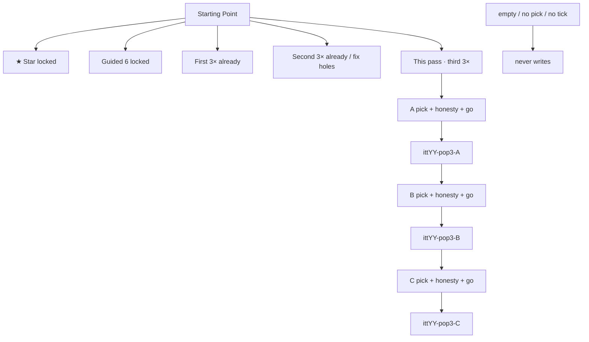

# 3× flows + links — every playable year

**Date:** 2026-08-21  
**Research freeze.** The **implementer map** (goals · exact hrefs · minute steps · approve list) is [`3X-FLOWS-LINKS-EVERY-YEAR-MAP-GOALS-STEPS-FLOWS.md`](3X-FLOWS-LINKS-EVERY-YEAR-MAP-GOALS-STEPS-FLOWS.md). **Do not implement until that file’s §12 locks are approved.**  
**Git only if asked.**

| Companion | Role |
|-----------|------|
| [`3X-POPULAR-WEBSITES-1994-2015.md`](3X-POPULAR-WEBSITES-1994-2015.md) | **First** leftover trio (already on disk) |
| [`3X-POPULAR-WEBSITES-FLOW-MAP.md`](3X-POPULAR-WEBSITES-FLOW-MAP.md) | First-trio visitor map |
| [`2016-2018-3X-FLOWS-DETAIL.md`](2016-2018-3X-FLOWS-DETAIL.md) | How a leftover 3× writer must feel |
| [`2X-LINKS-EVERY-YEAR-RESEARCH-GOALS-PHASES-MINUTE-2026-08-20.md`](2X-LINKS-EVERY-YEAR-RESEARCH-GOALS-PHASES-MINUTE-2026-08-20.md) | 2× ≠ dump more hrefs |
| Year `YYYY-READ-FIRST` / `YYYY-RESEARCH` | Thesis · bans · star (do not move) |
| Engine | `js/immersion/year-popular-3x.js` |

**Hub now:** 1994–2013 + 2015–2021 (**27 years**). **2014 wiped — skip.** **2022+ not on disk.**

**Legal:** Educational. `localStorage` only. No real orders, cams, torrents, payments, GPS. **Never invent brand pixels.** Incomplete REAL never writes.

**Two older-year blogs walked this pass (same rule as 2007 / 2009 rebuilds):**

| Blog | On-disk room | Steal |
|------|--------------|-------|
| Scripting News 1997 | `years/1997/sites/scripting/` | Daily residual, not the chip. Two-click leftover. Incomplete never writes. |
| TechCrunch 2006 | `years/2006/sites/techcrunch/` | Press names the year’s stack. Residual, not the chip. |

**Web ranks opened (order-of-magnitude, not gospel):** Hosting.com “Most Visited Websites Every Year Since 1995” (already walked in the 2× bible) · Wikipedia *List of most-visited websites* (2026 ranks — **do not** drop ChatGPT / Temu into a 2010s room).

---

# 0. What “3×” means this pass

**Not** 3× raw hrefs on Starting Point. Forest homes already dump hundreds of links. Doubling that dump is mock.

**3× = three extra leftover websites per year** that a visitor can *finish*:

```
pick a row  →  tick honesty  →  type ≥2  →  go
empty / no pick / no tick  →  never writes
writes  ittYY-pop3-<slug>
Next chip lands on the next leftover dest
```

Star chip does **not** move. Guided `<ol>` stays **exactly 6**. Official 10 stays 10.

This pass is the **next leftover trio** after the two already on disk.

---

# 1. Disk honesty (measured 2026-08-21)

| Band | What | Count |
|------|------|------:|
| First 3× | `data-itt-pop3x` + `scripts/popular-3x-sites.json` + `ittYY-pop-<id>` | **27 years × 3 = 81** writers |
| Second 3× | `data-itt-pop-more` unique dests | **19 years × 3 = 57** |
| Second 3× **broken** | pop-more **duplicates** first 3× | **2007 · 2009 · 2011 · 2013** |
| Second 3× **missing** | no `data-itt-pop-more` | **2012 · 2019 · 2020 · 2021** |
| This pass | new strip `data-itt-pop-3x3` + keys `ittYY-pop3-<slug>` | **27 × 3 = 81** new writers |

**Measurable done when:**

| # | Proof |
|--:|-------|
| 1 | Every playable home has `[data-itt-pop-3x3="YYYY"]` with **exactly 3** `a[href*="sites/"]` |
| 2 | Those 3 hrefs are **not** the star, **not** official-10 #1, **not** the first 3× trio, **not** a unique pop-more dest |
| 3 | Each dest has `[data-pop-pick]` + `[data-pop-req]` + `[data-pop-field]` + `[data-pop-go data-pop-id]` |
| 4 | Empty / no pick / no tick never writes. Complete writes `ittYY-pop3-<id>` |
| 5 | Guided `<ol>` still 6. `data-ott-one-thing` href unchanged |
| 6 | Lean years stay **≤ 50 HTML** (today 23–56). Forest years **0 new folders** — panel on an existing dest that has **no** `data-pop-go` yet |
| 7 | e2e: every year strip count = 3 · sample years empty-then-write · 2014 skipped |
| 8 | `audit-mock-flows` still 0 dest-field · official 10 still 10/10 REAL |

**HTML budget:** forest = 0 new files (bottom panel). Lean = **+3 rooms** only when the dest folder does not exist. 2014 = 0.

---

# 2. Visitor map (every year)

```
Hub → year shell → Starting Point
                      ★ one-thing  (locked)
                      guided 6     (locked)
                      official 10  (locked)
                      first 3×     (already there)
                      second 3×    (already there, except holes below)
                      ★ this pass → third 3×  A → B → C
```



---

# 3. Per-year trio (approve these 81)

**You do** is always: pick one row · tick honesty · type ≥2 · go.  
**Trap** never writes.  
**Star stays** the chip in the Star column.

### Forest years — 0 new folders (panel on existing dest)

| Year | Star stays | A | B | C | Why this year | Keys `ittYY-pop3-` |
|-----:|------------|---|---|---|----------------|--------------------|
| 1994 | CSotD | Lycos search | Infoseek | NASA | June-class directories + first .gov wander | lycos · infoseek · nasa |
| 1995 | Amazon SSL | GeoCities homestead | Classmates | Match.com | Homestead + people-finder year | geocities · classmates · match |
| 1996 | Portal wars | Hotmail | Excite | Angelfire | Free mail + portal + homestead cousin | hotmail · excite · angelfire |
| 1997 | PointCast | Slashdot | Winamp | eBay leftover | Geek news + MP3 player + auction leftover | slashdot · winamp · ebay |
| 1998 | I'm Feeling Lucky | DMOZ | CDNow | GameSpot | Open Directory + CD shop + game mag | dmoz · cdnow · gamespot |
| 1999 | AIM | Blogger | E*TRADE | PayPal leftover | Blog-before-Blogger-product · day-trade · wallet | blogger · etrade · paypal |
| 2000 | MapQuest | Expedia | PayPal | eBay leftover | Crash-year travel + wallet + auction | expedia · paypal · ebay |
| 2001 | Wikipedia edit | Google leftover | CNET leftover | BBC leftover | Google arrives in the June top 10 · not the chip | google · cnet · bbc |
| 2002 | StumbleUpon | DeviantArt | Daypop | Encarta | Art dump + blog-search + dying encyclopedia | deviantart · daypop · encarta |
| 2003 | Photobucket | Delicious | Skype leftover | AdSense leftover | Tags · voice leftover · ads | delicious · skype · adsense |
| 2004 | thefacebook | Digg leftover | Gmail leftover | Delicious leftover | Digg birth year · Gmail April Fools · tags | digg · gmail · delicious |
| 2005 | YouTube upload | MySpace leftover | Flickr leftover | Maps leftover | Social king + photos + Ajax maps (not the chip) | myspace · flickr · maps |
| 2006 | Twitter 140 | Facebook leftover | YouTube leftover | Wikipedia leftover | Feed + Google-owned YT + encyclopedia | facebook · youtube · wikipedia |
| 2008 | App Store | FriendConnect **or** Evernote · Groupon seed · Last.fm | *(confirm folder)* | | Web 2.0 leftovers not already official 10 / first 3× / pop-more | friendconnect · evernote · lastfm |

**2008 lock if folders missing:** use existing `flickr` / `orkut` / `tumblr` leftovers instead. Do not invent a folder name on implement day without `ls years/2008/sites`.

### Lean rebuilt / lean live — +3 HTML only if folder missing

| Year | Star stays | A | B | C | Why this year | New HTML? | Keys |
|-----:|------------|---|---|---|---------------|-----------|------|
| 2007 | iPhone Safari | Justin.tv | Ustream | Qik | Live-video leftovers (old 2007 3× bible). Portals already first 3×. YT/MySpace/Digg are official 10. | **+3** | justin · ustream · qik |
| 2009 | Like | Mafia Wars | WhatsApp seed | UberCab seed | Old 2009 3× bible. Omegle/Chatroulette already first 3×. Twitter/4sq/KS are official 10. | **+3** | mafiawars · whatsapp · ubercab |
| 2010 | Instagram | Chrome leftover | Wave funeral | Android leftover | Not official 10 (those ate Imgur/4sq). Folders exist. | 0 | chrome · wave · android |
| 2011 | Google+ | Snapchat seed | Tumblr leftover | YouTube leftover | Official 10 ate Airbnb/Twitter/Qwikster. | **+3** | snapchat · tumblr · youtube |
| 2012 | IG Android | Reddit leftover | Tinder leftover | Windows 8 leftover | Official 10 ate Pinterest/Medium/Path/Flipboard. Folders exist. **Also fills missing pop-more.** | 0 | reddit · tinder · windows8 |
| 2013 | Vine 6s | Reddit leftover | Facebook leftover | Twitter leftover | Official 10 ate Telegram/Tumblr/Snowden. First 3× ate Ask.fm/Whisper/YT. | **+3** | reddit · facebook · twitter |
| 2015 | Periscope | Discord leftover | Echo leftover | Snapchat leftover | Not the Go-LIVE chip. Folders exist. | 0 | discord · echo · snapchat |
| 2016 | IG Stories | Musical.ly leftover | Vine leftover (dying) | Snapchat leftover | TikTok merge is 2018. Vine dies 2017. | 0 | musically · vine · snapchat |
| 2017 | Face ID | Fortnite leftover | Teams leftover | Switch leftover | Not the X chip. Folders exist. | 0 | fortnite · teams · switch |
| 2018 | GDPR Manage | TikTok leftover | GitHub leftover | HomePod leftover | ByteDance year. Accept All never writes. | 0 | tiktok · github · homepod |
| 2019 | Disney+ | TikTok leftover | Stadia leftover | Arcade leftover | **Also fills missing pop-more.** Folders exist. | 0 | tiktok · stadia · arcade |
| 2020 | Zoom leave | TikTok leftover | Reels 15s leftover | Flash EOL leftover | Reels is not the chip. Flash dies 31 Dec. | 0 | tiktok · reels · flash |
| 2021 | ATT | Copilot leftover | Signal leftover | Win11 leftover | Copilot waitlist. ChatGPT is **2022**. | 0 | copilot · signal · win11 |

### Hole-fix (same pass, not extra beyond the 81)

These years’ **second** strip is a lie or missing. Fix it **as** the third-strip implement (do not ship a fourth strip):

| Year | Today | After this pass |
|------|-------|-----------------|
| 2007 · 2009 · 2011 · 2013 | pop-more **duplicates** first 3× | pop-more stays or is rewritten to the **new** trio. Only **one** new strip of 3 unique hrefs. |
| 2012 · 2019 · 2020 · 2021 | no pop-more | The new trio **is** pop-more (`data-itt-pop-more`) **and** `data-itt-pop-3x3` can share the same 3 hrefs |

**Do not** give those years 6 new dests. They get **3 unique new leftover doors**. Measurable still 3 writes.

---

# 4. Engine + copy (minute, every dest)

1. Dest `data-itt-year="YYYY"`. Load only `js/immersion-YYYY.js`.  
2. Prefix `ittYY-*`. New keys **`ittYY-pop3-<slug>`** (`data-pop-id` must be `pop3-<slug>` **or** extend `year-popular-3x.js` to honor `data-pop-key`).  
   **Implement lock:** if changing the engine is too much, write `data-pop-id="<slug>"` and store as `ittYY-pop-<slug>` **only when** that key is free. Never overwrite first-3× keys.  
3. Two honesty ticks or one `data-pop-req` that states leftover + star stays.  
4. `[data-pop-pick]` ≥1 · `[data-pop-field]` ≥2 · `[data-pop-go]`.  
5. Named trap on lean rooms where the year has one (2007 App Store already used; 2009 iPad; 2011 “G+ won”; 2013 15s).  
6. `data-next-when-key` → next leftover dest, last one → star.  
7. No 7th guided `<li>`. No invented logos.  
8. Forest dests that already have `data-pop-go` are **illegal** for this trio — pick another folder.

**2008 / 2007 / 2009 / 2011 / 2013 new folders (only these lean holes):**

```
years/2007/sites/justin/index.html
years/2007/sites/ustream/index.html
years/2007/sites/qik/index.html
years/2009/sites/mafiawars/index.html
years/2009/sites/whatsapp/index.html
years/2009/sites/ubercab/index.html
years/2011/sites/snapchat/index.html
years/2011/sites/tumblr/index.html
years/2011/sites/youtube/index.html
years/2013/sites/reddit/index.html
years/2013/sites/facebook/index.html
years/2013/sites/twitter/index.html
```

Plus 2008 only if `friendconnect` / `evernote` / `lastfm` are missing — then use flickr / orkut / tumblr panels instead.

---

# 5. Hard bans (every year)

| Never | Why |
|-------|-----|
| Move the star | One hero |
| 7th guided `<li>` | Locked 6 |
| Adult-video top-10 room | Compiled lists only |
| ChatGPT / Temu in 2019–2021 | 2022+ / 2026 ranks |
| IG Stories in 2013 | 2016 |
| Spotify US in 2009 | 2011 |
| iPad in 2009 | 2010 |
| Restore 2014 | Still wiped |
| Invented brand pixels | Always |
| Cam on Omegle / Chatroulette | Literacy only (already first 3×) |
| Real money / GPS / stream | Theater |

---

# 6. Phases

| Phase | What | Measurable |
|-------|------|------------|
| R0 | This file · two blogs · Hosting.com ranks · disk inventory | `[x]` this research |
| R1 | Approve §3 table + §9 locks | `[ ]` you |
| I1 | Forest 1994–2006 + 2008: pop3 panel on listed dests · home strip | 14 × 3 = 42 writers |
| I2 | Lean 2010, 2012, 2015–2021: strip + existing dests | 10 × 3 = 30 writers |
| I3 | Lean holes 2007 / 2009 / 2011 / 2013: +3 rooms each · fix dupe pop-more | 12 writers |
| I4 | `popular-3x-sites.json` **do not clobber** first trio. New file `scripts/popular-3x3-sites.json` or a `"pop3"` key |
| I5 | e2e `e2e/year-3x3.spec.js`: every year 3 links · empty never · 4 sample writes |
| I6 | `check-all-years` still 27 · mock audit 0 · official 10 still REAL |

---

# 7. e2e contract (copy this)

```
for y in SHIP_YEARS:
  home [data-itt-pop-3x3=y] a[href*=sites/]  == 3
  those hrefs != data-ott-one-thing href
  #ott-guided-y ol > li == 6

sample years (1994, 2005, 2010, 2018):
  pop-go empty → no key
  pick + req + field → ittYY-pop3-* truthy
```

---

# 8. What we did **not** do

- Did not GET 5,000 dest homepages. That is how late years became dest-field mock.  
- Did not 3× the official 10 (that would be 30 stops).  
- Did not add 2014.  
- Did not implement. This file is the check map.

---

# 9. Approve these locks

- [ ] **3× = 3 leftover writers + 3 home links per playable year.** Not 3× href dump.  
- [ ] **Star and guided 6 never move.**  
- [ ] **Keys do not overwrite first-3× `ittYY-pop-*`.** Prefer `ittYY-pop3-*`.  
- [ ] **Forest years: 0 new folders.** Lean holes: only the 12 rooms listed in §4.  
- [ ] **2014 stays wiped.**  
- [ ] **Justin.tv / Ustream / Qik** for 2007 (not Yahoo/Wiki/Amazon again).  
- [ ] **Mafia Wars / WhatsApp seed / UberCab seed** for 2009 (not Omegle again).  
- [ ] **ChatGPT never appears** before 2022.  
- [ ] **Implement only after this list is checked.**

---

# 10. Count if you say implement

| Work | Number |
|------|-------:|
| New leftover writers | **81** (27 × 3) |
| New home links | **81** |
| New HTML files | **12** lean holes + 0 forest (2008 maybe 0) |
| Years skipped | **2014** |
| Guided lists changed | **0** |
| Stars moved | **0** |
