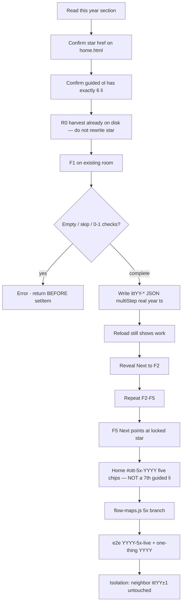
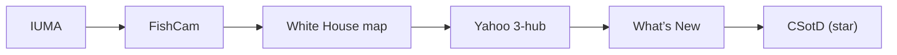
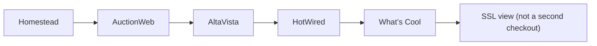
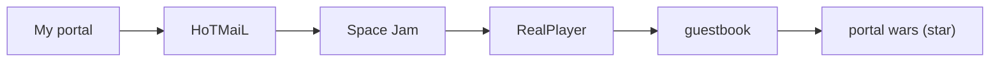
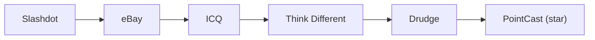
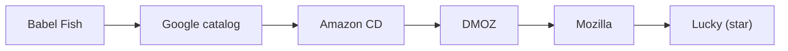
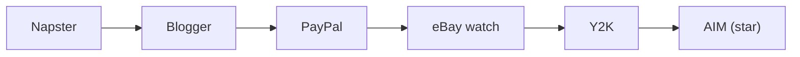
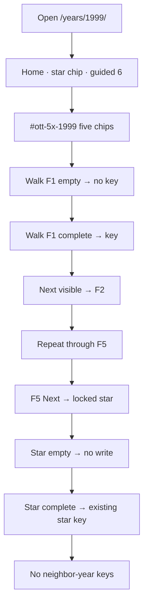
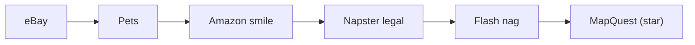

# SUPERSEDED

Use the from-scratch implement foundation:

**[`5X-IMPLEMENT-FOUNDATION-EVERY-YEAR-1994-2020.md`](5X-IMPLEMENT-FOUNDATION-EVERY-YEAR-1994-2020.md)**

That file is year sections + phases + steps + every path + flow diagrams + every recorded datapoint. This harvest-only index is not the implement bible.

---

# 5× implement bible — every harvest datapoint · phases · steps · flow diagrams (1994–2020)

**Date:** 2026-08-15  
**Status:** Implement-from-this. R0 harvest is `[x]` for every year. F1–F5 still open except **2010 · 2011 · 2012 · 2019**.  
**Do not run all years in one pass.** Say `implement 5x YYYY` or `implement 5x YYYY F1`.  
**Git only if asked.** No engine fork. Incomplete never writes.

This file is the single foundation for leftover 5×. It folds:

1. Every dated URL and fact from `docs/YYYY-5X-HARVEST.md` (nothing dropped).
2. Every locked F-loop recipe from [`IMPROVE-5X-TODO-GOALS-PHASES-STEPS-ROI-FLOWS-1994-2020.md`](IMPROVE-5X-TODO-GOALS-PHASES-STEPS-ROI-FLOWS-1994-2020.md).
3. The implement phases (R0 → F1–F5 → L → T) so existing stars, guided lists, and e2e stay green.
4. A full Next-chain diagram and a verify diagram per year.

Companions (do not replace this file):

- Harvest sources: `docs/YYYY-5X-HARVEST.md`
- Scannable goals: [`5X-EVERY-YEAR-GOALS-STEPS-ARTIFACTS-ROI-1994-2020.md`](5X-EVERY-YEAR-GOALS-STEPS-ARTIFACTS-ROI-1994-2020.md)
- Existing ten-trail check maps: [`FLOW-CHECK-DIAGRAMS-EVERY-YEAR-1994-2020.md`](FLOW-CHECK-DIAGRAMS-EVERY-YEAR-1994-2020.md)

---

## How to implement one year without breaking any flow



### Hard locks (copy onto every year)

1. Config + content only. **No engine fork.**
2. Prefix **`ittYY-*` only**. Neighbor year isolation.
3. Incomplete **never writes**. Empty, skip-bar, 0–1 checks, Accept All (2018) — return before `setItem`.
4. Never invent brand pixels. Failed-final legal.
5. Star (`data-ott-one-thing`) **locked**. Do not retarget.
6. Guided `<ol>` stays **exactly 6**. 5× chips go under P1 / “also” as `#ott-5x-YYYY`.
7. Lean years: **+3 HTML max**. Forest years: **reuse first**.
8. Do not restore pruned forests (2011–14, 2016–18, 2020).
9. Do not reopen as broken: **1995–97, 2005, 2017–18, 2020 Zoom**.
10. Do not scaffold **2021+**.
11. Do not blend Live Stats **June** cells with Pingdom **December** cells.
12. 2019 / 2020: **no June Live Stats digit** — do not invent.
13. Existing one-thing, handoff, signature, and year-real e2e must stay green.
14. Hrefs are `sites/…` never `pages/sites/…`.
15. Write shape: `{ multiStep:true, real:true, year:"YYYY", ts, …typed }`.

### Shared phases (every year)

| Phase | When | Done when |
|-------|------|-----------|
| **R0** | already `[x]` 2026-08-15 | `docs/YYYY-5X-HARVEST.md` ≥ 25 URLs |
| **F1–F5** | one flow at a time | key writes only on complete · Next reveals |
| **L** | after F1–F5 | `#ott-5x-YYYY` · flow-maps 5× branch · urlMap if new dest |
| **T** | last | `YYYY-5x-live.spec.js` + one-thing YYYY + isolation |

### Shared F-flow minute steps (reuse / deepen)

1. Open existing `index` + job page. If only one HTML and the year is lean, a new `about.html` / `job.html` counts against +3.
2. Empty submit / 0–1 checks → visible error · **return before setItem**.
3. Complete → JSON `{ multiStep:true, real:true, year:"YYYY", ts, …typed }`.
4. Reload shows the work (list, bid, board, queue, last still, last query).
5. `data-ittYY-next` / `data-next-flow` reveals on save **and** if the key already exists.
6. Boot in the year module or `year-YYYY-extras.js`. Prefer no new inline script.
7. Do not rename a key that already exists on disk (2010 `itt10-wave-funeral`, 2013 `itt13-vine-posts`, 2019 `itt19-appletv`).
8. After each F: run that year’s one-thing + any existing live spec so the star did not break.

### Shared T commands

```bash
python3 scripts/check-all-years.py
python3 scripts/audit-internal-links.py
npx playwright test e2e/one-thing-per-year.spec.js --grep YYYY --workers=1
npx playwright test e2e/year-handoff-flows.spec.js --grep YYYY --workers=1
npx playwright test e2e/YYYY-5x-live.spec.js --workers=1
```

---

## Jump to a year

| 1994–99 | 2000–09 | 2010–20 |
|---------|---------|---------|
| [1994 CSotD](#1994) · [1995 SSL](#1995) · [1996 portals](#1996) · [1997 PointCast](#1997) · [1998 Lucky](#1998) · [1999 AIM](#1999) | [2000 MapQuest](#2000) · [2001 MSN](#2001) · [2002 Stumble](#2002) · [2003 Photobucket](#2003) · [2004 networks](#2004) · [2005 Pandora](#2005) · [2006 Twitter](#2006) · [2007 iPhone](#2007) · [2008 GitHub](#2008) · [2009 Like](#2009) | [2010 Imgur shipped](#2010) · [2011 Airbnb shipped](#2011) · [2012 SoundCloud shipped](#2012) · [2013 Vine](#2013) · [2014 WhatsApp](#2014) · [2015 Watch](#2015) · [2016 Stories](#2016) · [2017 Face ID](#2017) · [2018 GDPR](#2018) · [2019 Disney+ shipped](#2019) · [2020 Zoom](#2020) |

### Scoreboard

| Year | Star key | HTML | Model | Harvest | F-pack | Wave |
|-----:|----------|-----:|--------|:-------:|:------:|------|
| 1994 | `itt94-csotd` | 178 | Authored forest | **yes** | `[ ]` | W5 |
| 1995 | `itt95-ssl-checkout` | 146 | Gold | **yes** | `[ ]` | W6 |
| 1996 | `itt96-portal-wars` | 103 | Gold | **yes** | `[ ]` | W6 |
| 1997 | `itt97-pointcast` | 89 | Gold | **yes** | `[ ]` | W6 |
| 1998 | `itt98-lucky` | 131 | Forest | **yes** | `[ ]` | W5 |
| 1999 | `itt99-aim` | 154 | Forest | **yes** | `[ ]` | W5 |
| 2000 | `itt00-mapquest` | 177 | Forest | **yes** | `[ ]` | W5 |
| 2001 | `itt01-msn` | 190 | Forest | **yes** | `[ ]` | W5 |
| 2002 | `itt02-stumble` | 213 | Forest | **yes** | `[ ]` | W4 |
| 2003 | `itt03-photobucket` | 234 | Forest | **yes** | `[ ]` | W4 |
| 2004 | `itt04-thefacebook-networks` | 293 | Forest | **yes** | `[ ]` | W4 |
| 2005 | `itt05-pandora` | 296 | Gold | **yes** | `[ ]` | W6 |
| 2006 | `itt06-tweets` | 302 | Labeled forest | **yes** | `[ ]` | W5 |
| 2007 | `itt07-iphone` | 318 | Labeled forest | **yes** | `[ ]` | W5 |
| 2008 | `itt08-github` | 328 | Labeled forest | **yes** | `[ ]` | W4 |
| 2009 | `itt09-fb-likes` | 339 | Labeled forest | **yes** | `[ ]` | W4 |
| 2010 | `itt10-imgur` | 379 | Forest peak | **yes** | **[x]** | W4 |
| 2011 | `itt11-airbnb` | 52 | Lean +3 cap · no Uber folder | **yes** | **[x]** | W3 |
| 2012 | `itt12-soundcloud` | 49 | Lean reuse +0 HTML | **yes** | **[x]** | W3 |
| 2013 | `itt13-vine-posts` | 61 | Lean reuse | **yes** | `[ ]` | W6 |
| 2014 | `itt14-wa-install` | 61 | Lean A · +3 max | **yes** | `[ ]` | W3 |
| 2015 | `itt15-watch` | 96 | Lean-ish reuse | **yes** | `[ ]` | W6 |
| 2016 | `itt16-ig-stories` | 54 | Remake · 51-HTML keep-set (not origin 57) | **yes** | `[ ]` | W2 |
| 2017 | `itt17-faceid` | 49 | Lean gold A · do not rebuild Face ID | **yes** | `[ ]` | W6 |
| 2018 | `itt18-gdpr` | 48 | Lean A− | **yes** | `[ ]` | W6 |
| 2019 | `itt19-disneyplus` | 52 | Lean after prune | **yes** | **[x]** | W1 |
| 2020 | `itt20-zoom` | 55 | Lean · do not reopen Zoom | **yes** | `[ ]` | W6 |

---

## Museum handoff spine (do not break)

Existing `e2e/year-handoff-flows.spec.js` walks 1994→2020. 5× Next chips must **not** steal the year-to-year handoff or the locked star.


---

# 1994

**Model:** Authored forest · **HTML (worktree):** 178 · **Wave:** W5 · **ROI pack:** R3
**Star path (locked):** `years/1994/sites/csotd/`
**Rooms to reuse:** IUMA · FishCam · whitehouse · yahoo hubs · ncsa · cern · csotd
**Isolation:** do not write itt95-*
**Harvest source:** [`1994-5X-HARVEST.md`](1994-5X-HARVEST.md)

### 0. Lock — what must stay green

| Lock | Rule |
|------|------|
| Star | Do not retarget `data-ott-one-thing`. Path stays `years/1994/sites/csotd/`. |
| Guided | `#ott-guided-1994 ol li` count stays **6**. |
| Prefix | Only `itt94-*`. |
| Neighbor | itt95-* untouched. |
| Incomplete | Never `setItem`. |
| Lean / forest | Reuse folders. Do not prune unless named. |
| Existing e2e | `e2e/1994-csotd-real.spec.js` · `e2e/one-thing-per-year.spec.js --grep 1994` |

### 1. Scale (visited Live Stats June table)

| Cell | Value | Cite |
|------|-------|------|
| Websites June 1994 | 2,738 | https://www.internetlivestats.com/total-number-of-websites/ |
| Users June 1994 | 25,454,590 | same table (do not blend Pingdom Dec) |
| Dual-cite | Hobbes / Gray / Pingdom growth series | label December separately |

### 2. Research datapoints (every harvest row)

Copied in full from the year harvest. Implementers must not drop a row.

<details>
<summary>Full 1994 harvest file (open for every URL)</summary>

# 1994 5× harvest — new-horizon R0 (reuse rooms)

**Date:** 2026-08-15  
**Year:** 1994 · **178 HTML** · authored forest  
**Star stays:** CSotD guestbook · `itt94-csotd` · wander then name; empty never writes  
**Do not invent:** MP3 store art · NN1 OEM pixels · flatten Yahoo tree · steal CSotD

R0 only. No product HTML in this pass. Sources visited this session (newsrooms, Live Stats table, Apple Newsroom, company history, Wayback class) plus dated primaries beyond the local research pack.

| # | Date / beat | Use | URL |
|--:|-------------|-----|-----|
| 1 | 1994 · IUMA on the Web (Usenet/Gopher → WWW) | F1 | https://cybercultural.com/p/iuma-1994/ |
| 2 | IUMA founded UCSC 1993 · CNN 9 Mar 1994 | F1 | https://en.wikipedia.org/wiki/Internet_Underground_Music_Archive |
| 3 | IUMA Santa Cruz restoration lore | F1 | https://www.goodtimes.sc/up-from-underground-the-iuma-story/ |
| 4 | WA IUMA helper-app era | F1 | https://web.archive.org/web/19961026180733/http://www.iuma.com/IUMA-2.0/help/ |
| 5 | NCSA Mosaic project | F2 residual | https://www.ncsa.illinois.edu/research/project-highlights/ncsa-mosaic/ |
| 6 | Mosaic → Netscape 1994 | F2 residual | https://en.wikipedia.org/wiki/NCSA_Mosaic |
| 7 | WA Netscape FishCam class | F2 | https://web.archive.org/web/19961219003200/http://www.netscape.com/fishcam/ |
| 8 | 1994 White House.gov imagemap class | F3 | https://web.archive.org/web/19961219024631/http://www.whitehouse.gov/ |
| 9 | WA White House 1994 welcome | F3 | https://clintonwhitehouse4.archives.gov/WH/Welcome.html |
| 10 | Yahoo founded 1994 directory | F4 | https://en.wikipedia.org/wiki/Yahoo! |
| 11 | WA Yahoo 1994 directory still | F4 | https://web.archive.org/web/19961220154510/http://www.yahoo.com/ |
| 12 | akebono Yahoo Computers class | F4 | https://web.archive.org/web/19961219000000/http://www.yahoo.com/Computers/ |
| 13 | NCSA What’s New 1994 | F5 | https://web.archive.org/web/19970101000000/http://www.ncsa.uiuc.edu/SDG/Software/Mosaic/Docs/whats-new.html |
| 14 | CERN first website still live | F5 / star residual | http://info.cern.ch/hypertext/WWW/TheProject.html |
| 15 | CERN royalty-free Web 30 Apr 1993 | F5 | https://home.cern/news/news/computing/twenty-years-free-open-web |
| 16 | TBL 1989 proposal | residual | https://www.w3.org/History/1989/proposal.html |
| 17 | Cool Site of the Day culture | star | https://en.wikipedia.org/wiki/Cool_Site_of_the_Day |
| 18 | WA CSotD class | star | https://web.archive.org/web/19961219000000/http://cool.infi.net/ |
| 19 | Live Stats June websites 2,738 | scale | https://www.internetlivestats.com/total-number-of-websites/ |
| 20 | Live Stats users ~25.5M | scale | https://www.internetlivestats.com/internet-users/ |
| 21 | Pingdom growth series (Hobbes/Gray) | scale dual-cite | https://www.pingdom.com/blog/internet-2010-in-numbers/ |
| 22 | Matthew Gray MIT web growth | scale | https://www.mit.edu/people/mkgray/growth/ |
| 23 | Hobbes Internet Timeline | scale | https://www.zakon.org/robert/internet/timeline/ |
| 24 | Cybercultural 1994 internet | residual | https://cybercultural.com/p/internet-1994/ |
| 25 | HotWired 1994 launch residual | residual | https://en.wikipedia.org/wiki/HotWired |
| 26 | Lycos 1994 search residual | residual | https://en.wikipedia.org/wiki/Lycos |
| 27 | Webcrawler 1994 residual | residual | https://en.wikipedia.org/wiki/WebCrawler |
| 28 | GNN / O'Reilly 1994 residual | residual | https://en.wikipedia.org/wiki/Global_Network_Navigator |

## F-loop keys (do not rename)

| Flow | Key | Incomplete |
|------|-----|------------|
| F1 IUMA listen | `itt94-iuma` | modem bar must finish then Play |
| F2 FishCam | `itt94-fishcam` | timer skip never writes |
| F3 White House map | `itt94-wh-map` | empty region no write |
| F4 Yahoo 3-hub | `itt94-yahoo-wander` | fewer than 3 hubs no write |
| F5 What’s New | `itt94-whatsnew` | no item opened no write |
| Star CSotD | `itt94-csotd` | wander + name; empty guestbook never writes |

Next chain: IUMA → FishCam → White House map → Yahoo 3-hub → What’s New → CSotD (star).

</details>

Same table in the open (so the bible is readable without clicking):

| # | Date / beat | Use | URL |
|--:|-------------|-----|-----|
| 1 | 1994 · IUMA on the Web (Usenet/Gopher → WWW) | F1 | https://cybercultural.com/p/iuma-1994/ |
| 2 | IUMA founded UCSC 1993 · CNN 9 Mar 1994 | F1 | https://en.wikipedia.org/wiki/Internet_Underground_Music_Archive |
| 3 | IUMA Santa Cruz restoration lore | F1 | https://www.goodtimes.sc/up-from-underground-the-iuma-story/ |
| 4 | WA IUMA helper-app era | F1 | https://web.archive.org/web/19961026180733/http://www.iuma.com/IUMA-2.0/help/ |
| 5 | NCSA Mosaic project | F2 residual | https://www.ncsa.illinois.edu/research/project-highlights/ncsa-mosaic/ |
| 6 | Mosaic → Netscape 1994 | F2 residual | https://en.wikipedia.org/wiki/NCSA_Mosaic |
| 7 | WA Netscape FishCam class | F2 | https://web.archive.org/web/19961219003200/http://www.netscape.com/fishcam/ |
| 8 | 1994 White House.gov imagemap class | F3 | https://web.archive.org/web/19961219024631/http://www.whitehouse.gov/ |
| 9 | WA White House 1994 welcome | F3 | https://clintonwhitehouse4.archives.gov/WH/Welcome.html |
| 10 | Yahoo founded 1994 directory | F4 | https://en.wikipedia.org/wiki/Yahoo! |
| 11 | WA Yahoo 1994 directory still | F4 | https://web.archive.org/web/19961220154510/http://www.yahoo.com/ |
| 12 | akebono Yahoo Computers class | F4 | https://web.archive.org/web/19961219000000/http://www.yahoo.com/Computers/ |
| 13 | NCSA What’s New 1994 | F5 | https://web.archive.org/web/19970101000000/http://www.ncsa.uiuc.edu/SDG/Software/Mosaic/Docs/whats-new.html |
| 14 | CERN first website still live | F5 / star residual | http://info.cern.ch/hypertext/WWW/TheProject.html |
| 15 | CERN royalty-free Web 30 Apr 1993 | F5 | https://home.cern/news/news/computing/twenty-years-free-open-web |
| 16 | TBL 1989 proposal | residual | https://www.w3.org/History/1989/proposal.html |
| 17 | Cool Site of the Day culture | star | https://en.wikipedia.org/wiki/Cool_Site_of_the_Day |
| 18 | WA CSotD class | star | https://web.archive.org/web/19961219000000/http://cool.infi.net/ |
| 19 | Live Stats June websites 2,738 | scale | https://www.internetlivestats.com/total-number-of-websites/ |
| 20 | Live Stats users ~25.5M | scale | https://www.internetlivestats.com/internet-users/ |
| 21 | Pingdom growth series (Hobbes/Gray) | scale dual-cite | https://www.pingdom.com/blog/internet-2010-in-numbers/ |
| 22 | Matthew Gray MIT web growth | scale | https://www.mit.edu/people/mkgray/growth/ |
| 23 | Hobbes Internet Timeline | scale | https://www.zakon.org/robert/internet/timeline/ |
| 24 | Cybercultural 1994 internet | residual | https://cybercultural.com/p/internet-1994/ |
| 25 | HotWired 1994 launch residual | residual | https://en.wikipedia.org/wiki/HotWired |
| 26 | Lycos 1994 search residual | residual | https://en.wikipedia.org/wiki/Lycos |
| 27 | Webcrawler 1994 residual | residual | https://en.wikipedia.org/wiki/WebCrawler |
| 28 | GNN / O'Reilly 1994 residual | residual | https://en.wikipedia.org/wiki/Global_Network_Navigator |

### 3. Locked F-loop keys (do not rename)

| Flow | Key | Incomplete never writes |
|------|-----|-------------------------|
| F1 IUMA listen | `itt94-iuma` | modem bar must finish then Play |
| F2 FishCam | `itt94-fishcam` | timer skip never writes |
| F3 White House map | `itt94-wh-map` | empty region no write |
| F4 Yahoo 3-hub | `itt94-yahoo-wander` | fewer than 3 hubs no write |
| F5 What’s New | `itt94-whatsnew` | no item opened no write |
| Star CSotD | `itt94-csotd` | wander + name; empty guestbook never writes |

**Next chain: IUMA → FishCam → White House map → Yahoo 3-hub → What’s New → CSotD (star).**

### 4. Whole 5× flow diagram



Hidden Next rule: `[data-next-flow]` / `[data-itt94-next]` is invisible until that room’s key exists. After save **and** on reload if the key is already set, the chip is visible and its first href is a live room in this year.

### 5. Phases — implement in this order

#### Phase R0 — Research · `[x]` 2026-08-15

Already written to [`1994-5X-HARVEST.md`](1994-5X-HARVEST.md). Do not invent new June website counts. Do not start product HTML in a research-only pass.

#### Phase F — five REAL loops

### F1 IUMA listen · `itt94-iuma` · R4 · `[ ]`

**Files:** `years/1994/sites/iuma/{index,track,about}.html` · `js/immersion/media-1994.js`  
**Steps:**

1. Index: pick residual track (no invented IUMA logo).  
2. Track: existing modem bar must **finish** then Play. Incomplete (skip bar) never writes.  
3. About: “no CD · helper app”.  
4. Next → FishCam.  
**Accept:** bar+Play → key; Play-only → no key.  
**Anti:** real MP3 payload · steal CSotD.

### F2 FishCam · `itt94-fishcam` · R4 · `[ ]`

**Files:** `sites/fishcam/` · `media-1994.js`  
**Steps:** Wait 8s (or existing timer) → still advances → persist last still id. Reload shows last still. Next → WH.  
**Accept:** reload last still; no timer skip write.

### F3 White House imagemap · `itt94-wh-map` · R4 · `[ ]`

**Files:** `sites/whitehouse/`  
**Steps:** Click a building on the map → land in that room → write building id. Empty click (no region) no write. Next → Yahoo Computers.

### F4 Yahoo 3-hub · `itt94-yahoo-wander` · R5 · `[ ]`

**Files:** `sites/yahoo/Computers|Entertainment|News/` · existing wander if any  
**Steps:** Confirm 3 hubs visited (session or key list length ≥ 3) before write. Thicken if already partial. Next → NCSA.

### F5 What’s New / NCSA · `itt94-whatsnew` · R4 · `[ ]`

**Files:** `sites/ncsa/` · `sites/cern/`  
**Steps:** Open a dated What’s New item → persist item id. Next → CSotD archive (star, not a rewrite).

**Per-flow implement checklist (do this for F1, then F2, … F5):**

1. Confirm the room path exists (`ls years/1994/sites/…`). Classify reuse vs +HTML.
2. Confirm the star chip on `years/1994/pages/home.html` is unchanged.
3. Add or thicken the machine: empty path errors and returns before `setItem`.
4. Complete path writes the locked key as REAL JSON.
5. Reload persists. Next chip points at the next node in the diagram above.
6. Run the existing year e2e listed in §0. If any fail, fix before the next F.
7. Isolation check: `sessionStorage` / `localStorage` has no neighbor-year keys.

#### Phase L — links · after F1–F5

1. Home `#ott-5x-1994` — five chips, **not** inside guided `<ol>`.
2. Each chip `data-trail-keys` matches the locked key.
3. `js/config/flow-maps.js` branch `5× F1–F5` for this year.
4. `js/config/1994.js` urlMap / titleMap only if a new dest exists.
5. One in-room href F1→F2 (or next in chain) that is not the Next chip.
6. Map hrefs stay `sites/…`.

#### Phase T — tests

```bash
python3 scripts/check-all-years.py
python3 scripts/audit-internal-links.py
npx playwright test e2e/1994-csotd-real.spec.js --workers=1
npx playwright test e2e/one-thing-per-year.spec.js --grep 1994 --workers=1
npx playwright test e2e/1994-5x-live.spec.js --workers=1   # write this spec in T
```

Live spec must cover: incomplete never writes · complete writes locked key · reload · Next href 200 · star still writes · neighbor prefix absent.

### 6. Verify diagram (walk after implement)


### 7. Anti (this year)

- real MP3 payload · steal CSotD.
- flatten Yahoo tree · NN1 OEM invent (L4 `[~]`).
- Do not add a 7th guided `<li>`.
- Do not invent brand pixels or official game art.
- Do not rename locked keys.

---

# 1995 · **do not reopen as broken**

**Model:** Gold · **HTML (worktree):** 146 · **Wave:** W6 · **ROI pack:** R3
**Star path (locked):** `years/1995/sites/amazon/ssl-checkout.html`
**Rooms to reuse:** geocities · auctionweb · altavista · hotwired · netscape cool · amazon ssl
**Isolation:** do not write itt94-* and itt96-*
**Harvest source:** [`1995-5X-HARVEST.md`](1995-5X-HARVEST.md)

### 0. Lock — what must stay green

| Lock | Rule |
|------|------|
| Star | Do not retarget `data-ott-one-thing`. Path stays `years/1995/sites/amazon/ssl-checkout.html`. |
| Guided | `#ott-guided-1995 ol li` count stays **6**. |
| Prefix | Only `itt95-*`. |
| Neighbor | itt94-* and itt96-* untouched. |
| Incomplete | Never `setItem`. |
| Lean / forest | Reuse folders. Do not prune unless named. |
| Gold | Deepen + link only. Do not rebuild the star machine. |
| Existing e2e | `e2e/1995-homestead-live.spec.js` · `e2e/one-thing-per-year.spec.js --grep 1995` |

### 1. Scale (visited Live Stats June table)

| Cell | Value | Cite |
|------|-------|------|
| Websites June 1995 | 23,500 | https://www.internetlivestats.com/total-number-of-websites/ |
| Users June 1995 | 44,838,900 | same table (do not blend Pingdom Dec) |
| Dual-cite | Hobbes / Gray / Pingdom growth series | label December separately |

### 2. Research datapoints (every harvest row)

Copied in full from the year harvest. Implementers must not drop a row.

<details>
<summary>Full 1995 harvest file (open for every URL)</summary>

# 1995 5× harvest — new-horizon R0 (reuse rooms)

**Date:** 2026-08-15  
**Year:** 1995 · **142 HTML** · gold · do not reopen SSL cart  
**Star stays:** SSL checkout · `itt95-ssl-checkout` · name+card+city; empty never writes  
**Do not invent:** AuctionWeb as eBay · second SSL star · Pez-dispenser origin myth (eBay Inc says fabricated)

R0 only. No product HTML in this pass. Sources visited this session: eBay Inc Our History, Live Stats June table, AltaVista launch class, GeoCities homestead class, plus dated primaries beyond the local 1995 research pack.

| # | Date / beat | Use | URL |
|--:|-------------|-----|-----|
| 1 | Labor Day weekend 1995 · AuctionWeb born | F2 | https://www.ebayinc.com/company/our-history/ |
| 2 | First sale · broken laser pointer · Mark Fraser | F2 | https://www.ebayinc.com/company/our-history/ |
| 3 | Pez dispenser myth is fabricated | F2 honesty | https://www.ebayinc.com/company/our-history/ |
| 4 | 3 Sep 1995 · AuctionWeb date lock | F2 | https://www.poynter.org/reporting-editing/2014/today-in-media-history-pierre-omidyar-starts-ebay/ |
| 5 | 15 Dec 1995 · AltaVista public (DEC) | F3 | https://en.wikipedia.org/wiki/AltaVista |
| 6 | WA AltaVista digital.com class | F3 | https://web.archive.org/web/19961022174555/http://altavista.digital.com/ |
| 7 | 1995blog AltaVista 25th | F3 | https://1995blog.com/2020/12/15/looking-back-25-years-to-alta-vista-and-high-speed-search-for-the-early-web/ |
| 8 | GeoCities 1995 homestead / neighborhoods | F1 | https://en.wikipedia.org/wiki/GeoCities |
| 9 | WA GeoCities homestead class | F1 | https://web.archive.org/web/19961219000000/http://www.geocities.com/ |
| 10 | HotWired departments 1994–95 | F4 | https://en.wikipedia.org/wiki/HotWired |
| 11 | WA HotWired 1995 class | F4 | https://web.archive.org/web/19961219000000/http://www.hotwired.com/ |
| 12 | Netscape What’s Cool / What’s New | F5 | https://en.wikipedia.org/wiki/Netscape |
| 13 | WA Netscape Cool class | F5 | https://web.archive.org/web/19961219000000/http://home.netscape.com/home/whats-cool.html |
| 14 | Amazon 1995 bookstore residual | residual | https://www.internetlivestats.com/total-number-of-websites/ |
| 15 | Netscape SSL / HTTPS 1994–95 star residual | star | https://en.wikipedia.org/wiki/Transport_Layer_Security |
| 16 | Live Stats June websites 23,500 | scale | https://www.internetlivestats.com/total-number-of-websites/ |
| 17 | Live Stats users 44,838,900 | scale | https://www.internetlivestats.com/total-number-of-websites/ |
| 18 | Pingdom growth series (Hobbes/Gray) dual-cite | scale | https://www.pingdom.com/blog/internet-2010-in-numbers/ |
| 19 | Matthew Gray MIT web growth | scale | https://www.mit.edu/people/mkgray/growth/ |
| 20 | Hobbes Internet Timeline | scale | https://www.zakon.org/robert/internet/timeline/ |
| 21 | Cybercultural 1995 internet | residual | https://cybercultural.com/p/internet-1995/ |
| 22 | Web Design Museum eBay 1995 | F2 residual | https://www.webdesignmuseum.org/web-design-history/ebay-1995 |
| 23 | Live Stats launched AltaVista / Amazon / AuctionWeb | residual | https://www.internetlivestats.com/total-number-of-websites/ |
| 24 | CERN first site still live (1994 residual) | residual | http://info.cern.ch/hypertext/WWW/TheProject.html |
| 25 | Yahoo 1994 directory still growing 1995 | residual | https://web.archive.org/web/19961220154510/http://www.yahoo.com/ |
| 26 | NCSA Mosaic project residual | residual | https://www.ncsa.illinois.edu/research/project-highlights/ncsa-mosaic/ |
| 27 | This Day in Tech History AuctionWeb | F2 | https://thisdayintechhistory.com/09/03/ebay-founded/ |
| 28 | Stackscale AltaVista anniversary (do not use 15 Sep as public) | F3 honesty | https://www.stackscale.com/blog/altavista-25-anniversary/ |

## F-loop keys (do not rename)

| Flow | Key | Incomplete |
|------|-----|------------|
| F1 Homestead | `itt95-homestead` | empty title never writes |
| F2 AuctionWeb bid | `itt95-aw-bid` | low-bid confirm · never say eBay |
| F3 AltaVista catalog | `itt95-av` | empty query never writes |
| F4 HotWired 3 departments | `itt95-hotwired` | fewer than 3 hops no write |
| F5 What’s Cool | `itt95-cool` | no Cool/New click no write |
| Star SSL | `itt95-ssl-checkout` | name+card+city · empty never writes · view only from F5 |

Next chain: Homestead → AuctionWeb → AltaVista → HotWired → What’s Cool → SSL **view** (not a second checkout).

</details>

Same table in the open (so the bible is readable without clicking):

| # | Date / beat | Use | URL |
|--:|-------------|-----|-----|
| 1 | Labor Day weekend 1995 · AuctionWeb born | F2 | https://www.ebayinc.com/company/our-history/ |
| 2 | First sale · broken laser pointer · Mark Fraser | F2 | https://www.ebayinc.com/company/our-history/ |
| 3 | Pez dispenser myth is fabricated | F2 honesty | https://www.ebayinc.com/company/our-history/ |
| 4 | 3 Sep 1995 · AuctionWeb date lock | F2 | https://www.poynter.org/reporting-editing/2014/today-in-media-history-pierre-omidyar-starts-ebay/ |
| 5 | 15 Dec 1995 · AltaVista public (DEC) | F3 | https://en.wikipedia.org/wiki/AltaVista |
| 6 | WA AltaVista digital.com class | F3 | https://web.archive.org/web/19961022174555/http://altavista.digital.com/ |
| 7 | 1995blog AltaVista 25th | F3 | https://1995blog.com/2020/12/15/looking-back-25-years-to-alta-vista-and-high-speed-search-for-the-early-web/ |
| 8 | GeoCities 1995 homestead / neighborhoods | F1 | https://en.wikipedia.org/wiki/GeoCities |
| 9 | WA GeoCities homestead class | F1 | https://web.archive.org/web/19961219000000/http://www.geocities.com/ |
| 10 | HotWired departments 1994–95 | F4 | https://en.wikipedia.org/wiki/HotWired |
| 11 | WA HotWired 1995 class | F4 | https://web.archive.org/web/19961219000000/http://www.hotwired.com/ |
| 12 | Netscape What’s Cool / What’s New | F5 | https://en.wikipedia.org/wiki/Netscape |
| 13 | WA Netscape Cool class | F5 | https://web.archive.org/web/19961219000000/http://home.netscape.com/home/whats-cool.html |
| 14 | Amazon 1995 bookstore residual | residual | https://www.internetlivestats.com/total-number-of-websites/ |
| 15 | Netscape SSL / HTTPS 1994–95 star residual | star | https://en.wikipedia.org/wiki/Transport_Layer_Security |
| 16 | Live Stats June websites 23,500 | scale | https://www.internetlivestats.com/total-number-of-websites/ |
| 17 | Live Stats users 44,838,900 | scale | https://www.internetlivestats.com/total-number-of-websites/ |
| 18 | Pingdom growth series (Hobbes/Gray) dual-cite | scale | https://www.pingdom.com/blog/internet-2010-in-numbers/ |
| 19 | Matthew Gray MIT web growth | scale | https://www.mit.edu/people/mkgray/growth/ |
| 20 | Hobbes Internet Timeline | scale | https://www.zakon.org/robert/internet/timeline/ |
| 21 | Cybercultural 1995 internet | residual | https://cybercultural.com/p/internet-1995/ |
| 22 | Web Design Museum eBay 1995 | F2 residual | https://www.webdesignmuseum.org/web-design-history/ebay-1995 |
| 23 | Live Stats launched AltaVista / Amazon / AuctionWeb | residual | https://www.internetlivestats.com/total-number-of-websites/ |
| 24 | CERN first site still live (1994 residual) | residual | http://info.cern.ch/hypertext/WWW/TheProject.html |
| 25 | Yahoo 1994 directory still growing 1995 | residual | https://web.archive.org/web/19961220154510/http://www.yahoo.com/ |
| 26 | NCSA Mosaic project residual | residual | https://www.ncsa.illinois.edu/research/project-highlights/ncsa-mosaic/ |
| 27 | This Day in Tech History AuctionWeb | F2 | https://thisdayintechhistory.com/09/03/ebay-founded/ |
| 28 | Stackscale AltaVista anniversary (do not use 15 Sep as public) | F3 honesty | https://www.stackscale.com/blog/altavista-25-anniversary/ |

### 3. Locked F-loop keys (do not rename)

| Flow | Key | Incomplete never writes |
|------|-----|-------------------------|
| F1 Homestead | `itt95-homestead` | empty title never writes |
| F2 AuctionWeb bid | `itt95-aw-bid` | low-bid confirm · never say eBay |
| F3 AltaVista catalog | `itt95-av` | empty query never writes |
| F4 HotWired 3 departments | `itt95-hotwired` | fewer than 3 hops no write |
| F5 What’s Cool | `itt95-cool` | no Cool/New click no write |
| Star SSL | `itt95-ssl-checkout` | name+card+city · empty never writes · view only from F5 |

**Next chain: Homestead → AuctionWeb → AltaVista → HotWired → What’s Cool → SSL **view** (not a second checkout).**

### 4. Whole 5× flow diagram



Hidden Next rule: `[data-next-flow]` / `[data-itt95-next]` is invisible until that room’s key exists. After save **and** on reload if the key is already set, the chip is visible and its first href is a live room in this year.

### 5. Phases — implement in this order

#### Phase R0 — Research · `[x]` 2026-08-15

Already written to [`1995-5X-HARVEST.md`](1995-5X-HARVEST.md). Do not invent new June website counts. Do not start product HTML in a research-only pass.

#### Phase F — five REAL loops

### F1 Homestead · `itt95-homestead` · `[ ]`

`geocities/{index,homestead,my-homestead}`. Hood → title → publish → visit your page. Empty title blocked. Trail already: `1995-homestead-live.spec.js` — deepen persist if thin. Next → AuctionWeb.

### F2 AuctionWeb bid · `itt95-aw-bid` · `[ ]`

`auctionweb/`. Low bid confirm. Never say eBay. Next → AltaVista.

### F3 AltaVista catalog · `itt95-av` · `[ ]`

Empty query blocked. Result list persist last query. Next → HotWired.

### F4 HotWired 3 departments · `itt95-hotwired` · `[ ]`

Hop 3 sections then write. Next → Netscape Cool.

### F5 What’s Cool · `itt95-cool` · `[ ]`

Click Cool/New button → land in room → write. Next → SSL **view** (not a second checkout).

**Per-flow implement checklist (do this for F1, then F2, … F5):**

1. Confirm the room path exists (`ls years/1995/sites/…`). Classify reuse vs +HTML.
2. Confirm the star chip on `years/1995/pages/home.html` is unchanged.
3. Add or thicken the machine: empty path errors and returns before `setItem`.
4. Complete path writes the locked key as REAL JSON.
5. Reload persists. Next chip points at the next node in the diagram above.
6. Run the existing year e2e listed in §0. If any fail, fix before the next F.
7. Isolation check: `sessionStorage` / `localStorage` has no neighbor-year keys.

#### Phase L — links · after F1–F5

1. Home `#ott-5x-1995` — five chips, **not** inside guided `<ol>`.
2. Each chip `data-trail-keys` matches the locked key.
3. `js/config/flow-maps.js` branch `5× F1–F5` for this year.
4. `js/config/1995.js` urlMap / titleMap only if a new dest exists.
5. One in-room href F1→F2 (or next in chain) that is not the Next chip.
6. Map hrefs stay `sites/…`.

#### Phase T — tests

```bash
python3 scripts/check-all-years.py
python3 scripts/audit-internal-links.py
npx playwright test e2e/1995-homestead-live.spec.js --workers=1
npx playwright test e2e/one-thing-per-year.spec.js --grep 1995 --workers=1
npx playwright test e2e/1995-5x-live.spec.js --workers=1   # write this spec in T
```

Live spec must cover: incomplete never writes · complete writes locked key · reload · Next href 200 · star still writes · neighbor prefix absent.

### 6. Verify diagram (walk after implement)


### 7. Anti (this year)

- rename AuctionWeb · second SSL star.
- Do not rebuild the gold star. Do not reopen this year as broken.
- Do not add a 7th guided `<li>`.
- Do not invent brand pixels or official game art.
- Do not rename locked keys.

---

# 1996 · **do not reopen as broken**

**Model:** Gold · **HTML (worktree):** 103 · **Wave:** W6 · **ROI pack:** R3
**Star path (locked):** `years/1996/sites/portals/wars.html`
**Rooms to reuse:** yahoo/my · excite/my · hotmail · spacejam · realplayer · guestbook · portals
**Isolation:** do not write itt95-* and itt97-*
**Harvest source:** [`1996-5X-HARVEST.md`](1996-5X-HARVEST.md)

### 0. Lock — what must stay green

| Lock | Rule |
|------|------|
| Star | Do not retarget `data-ott-one-thing`. Path stays `years/1996/sites/portals/wars.html`. |
| Guided | `#ott-guided-1996 ol li` count stays **6**. |
| Prefix | Only `itt96-*`. |
| Neighbor | itt95-* and itt97-* untouched. |
| Incomplete | Never `setItem`. |
| Lean / forest | Reuse folders. Do not prune unless named. |
| Gold | Deepen + link only. Do not rebuild the star machine. |
| Existing e2e | `e2e/1997-hotmail.spec.js` · `e2e/one-thing-per-year.spec.js --grep 1996` |

### 1. Scale (visited Live Stats June table)

| Cell | Value | Cite |
|------|-------|------|
| Websites June 1996 | 257,601 | https://www.internetlivestats.com/total-number-of-websites/ |
| Users June 1996 | 77,433,860 | same table (do not blend Pingdom Dec) |
| Dual-cite | Hobbes / Gray / Pingdom growth series | label December separately |

### 2. Research datapoints (every harvest row)

Copied in full from the year harvest. Implementers must not drop a row.

<details>
<summary>Full 1996 harvest file (open for every URL)</summary>

# 1996 5× harvest — new-horizon R0 (reuse rooms)

**Date:** 2026-08-15  
**Year:** 1996 · **111 HTML** · gold · portal wars star  
**Star stays:** portal wars · `itt96-portal-wars` · 3 portal hits  
**Do not invent:** 7th guided li · AuctionWeb-as-eBay · Space Jam sequel skin

R0 only. No product HTML. Sources visited this session: Space Jam still-live 1996 hub, Hotmail 4 Jul 1996 class, Live Stats June table, plus dated primaries beyond the local 1996 pack.

| # | Date / beat | Use | URL |
|--:|-------------|-----|-----|
| 1 | Space Jam 1996 site still live | F3 | https://www.spacejam.com/1996/ |
| 2 | Space Jam 1996 index2 / planets | F3 | https://www.spacejam.com/1996/index2.html |
| 3 | Polygon 1996 site still online | F3 | https://www.polygon.com/2021/4/5/22368177/space-jam-website-original-1996-version-easter-egg/ |
| 4 | 4 Jul 1996 · HoTMaiL launch (Bhatia / Smith) | F2 | https://en.wikipedia.org/wiki/Sabeer_Bhatia |
| 5 | HoTMaiL HTML homage / Independence Day | F2 | https://www.innovatorsunder35.com/the-list/sabeer-bhatia/ |
| 6 | My Yahoo 1996 personalization | F1 | https://en.wikipedia.org/wiki/Yahoo! |
| 7 | WA Yahoo 1996 directory | F1 | https://web.archive.org/web/19961220154510/http://www.yahoo.com/ |
| 8 | Excite My / portal wars residual | F1 | https://en.wikipedia.org/wiki/Excite |
| 9 | RealPlayer / RealAudio buffer era | F4 | https://en.wikipedia.org/wiki/RealPlayer |
| 10 | WA RealAudio class | F4 | https://web.archive.org/web/19961219000000/http://www.realaudio.com/ |
| 11 | Guestbook culture 1996 | F5 | https://en.wikipedia.org/wiki/Guestbook |
| 12 | Live Stats June websites 257,601 | scale | https://www.internetlivestats.com/total-number-of-websites/ |
| 13 | Live Stats users 77,433,860 | scale | https://www.internetlivestats.com/total-number-of-websites/ |
| 14 | Pingdom growth dual-cite | scale | https://www.pingdom.com/blog/internet-2010-in-numbers/ |
| 15 | Hobbes Internet Timeline | scale | https://www.zakon.org/robert/internet/timeline/ |
| 16 | Matthew Gray MIT | scale | https://www.mit.edu/people/mkgray/growth/ |
| 17 | eBay Inc 1996 first employee / $7.2M GMV | residual | https://www.ebayinc.com/company/our-history/ |
| 18 | Netscape still browser default residual | residual | https://en.wikipedia.org/wiki/Netscape |
| 19 | Cybercultural 1996 internet | residual | https://cybercultural.com/p/internet-1996/ |
| 20 | Hotmail Wikipedia service page | F2 residual | https://en.wikipedia.org/wiki/Outlook.com |
| 21 | Space Jam 2021 sequel forwards to /1996 | F3 residual | https://www.spacejam.com/ |
| 22 | Reddit 90s still-online thread | F3 residual | https://www.reddit.com/r/90s/comments/1i8kvcw/space_jam_website_from_1996_is_still_online/ |
| 23 | Live Stats users page | scale | https://www.internetlivestats.com/internet-users/ |
| 24 | GNN / O’Reilly residual | residual | https://en.wikipedia.org/wiki/Global_Network_Navigator |
| 25 | HotWired still publishing 1996 residual | residual | https://en.wikipedia.org/wiki/HotWired |
| 26 | Lycos 1996 residual | residual | https://en.wikipedia.org/wiki/Lycos |
| 27 | Webcrawler residual | residual | https://en.wikipedia.org/wiki/WebCrawler |
| 28 | CERN first site still live | residual | http://info.cern.ch/hypertext/WWW/TheProject.html |

## F-loop keys (do not rename)

| Flow | Key | Incomplete |
|------|-----|------------|
| F1 My portal | `itt96-myportal` | 0–1 widget move never writes |
| F2 HoTMaiL compose | `itt96-hotmail` | empty To/body never writes |
| F3 Space Jam 3 planets | `itt96-jam` | fewer than 3 planets no write |
| F4 RealPlayer buffer | `itt96-real` | skip-bar never writes |
| F5 Guestbook | `itt96-gb` | name shorter than 2 never writes |
| Star portal wars | `itt96-portal-wars` | fewer than 3 portal hits no write |

Next chain: My portal → HoTMaiL → Space Jam → RealPlayer → guestbook → portal wars (star).

</details>

Same table in the open (so the bible is readable without clicking):

| # | Date / beat | Use | URL |
|--:|-------------|-----|-----|
| 1 | Space Jam 1996 site still live | F3 | https://www.spacejam.com/1996/ |
| 2 | Space Jam 1996 index2 / planets | F3 | https://www.spacejam.com/1996/index2.html |
| 3 | Polygon 1996 site still online | F3 | https://www.polygon.com/2021/4/5/22368177/space-jam-website-original-1996-version-easter-egg/ |
| 4 | 4 Jul 1996 · HoTMaiL launch (Bhatia / Smith) | F2 | https://en.wikipedia.org/wiki/Sabeer_Bhatia |
| 5 | HoTMaiL HTML homage / Independence Day | F2 | https://www.innovatorsunder35.com/the-list/sabeer-bhatia/ |
| 6 | My Yahoo 1996 personalization | F1 | https://en.wikipedia.org/wiki/Yahoo! |
| 7 | WA Yahoo 1996 directory | F1 | https://web.archive.org/web/19961220154510/http://www.yahoo.com/ |
| 8 | Excite My / portal wars residual | F1 | https://en.wikipedia.org/wiki/Excite |
| 9 | RealPlayer / RealAudio buffer era | F4 | https://en.wikipedia.org/wiki/RealPlayer |
| 10 | WA RealAudio class | F4 | https://web.archive.org/web/19961219000000/http://www.realaudio.com/ |
| 11 | Guestbook culture 1996 | F5 | https://en.wikipedia.org/wiki/Guestbook |
| 12 | Live Stats June websites 257,601 | scale | https://www.internetlivestats.com/total-number-of-websites/ |
| 13 | Live Stats users 77,433,860 | scale | https://www.internetlivestats.com/total-number-of-websites/ |
| 14 | Pingdom growth dual-cite | scale | https://www.pingdom.com/blog/internet-2010-in-numbers/ |
| 15 | Hobbes Internet Timeline | scale | https://www.zakon.org/robert/internet/timeline/ |
| 16 | Matthew Gray MIT | scale | https://www.mit.edu/people/mkgray/growth/ |
| 17 | eBay Inc 1996 first employee / $7.2M GMV | residual | https://www.ebayinc.com/company/our-history/ |
| 18 | Netscape still browser default residual | residual | https://en.wikipedia.org/wiki/Netscape |
| 19 | Cybercultural 1996 internet | residual | https://cybercultural.com/p/internet-1996/ |
| 20 | Hotmail Wikipedia service page | F2 residual | https://en.wikipedia.org/wiki/Outlook.com |
| 21 | Space Jam 2021 sequel forwards to /1996 | F3 residual | https://www.spacejam.com/ |
| 22 | Reddit 90s still-online thread | F3 residual | https://www.reddit.com/r/90s/comments/1i8kvcw/space_jam_website_from_1996_is_still_online/ |
| 23 | Live Stats users page | scale | https://www.internetlivestats.com/internet-users/ |
| 24 | GNN / O’Reilly residual | residual | https://en.wikipedia.org/wiki/Global_Network_Navigator |
| 25 | HotWired still publishing 1996 residual | residual | https://en.wikipedia.org/wiki/HotWired |
| 26 | Lycos 1996 residual | residual | https://en.wikipedia.org/wiki/Lycos |
| 27 | Webcrawler residual | residual | https://en.wikipedia.org/wiki/WebCrawler |
| 28 | CERN first site still live | residual | http://info.cern.ch/hypertext/WWW/TheProject.html |

### 3. Locked F-loop keys (do not rename)

| Flow | Key | Incomplete never writes |
|------|-----|-------------------------|
| F1 My portal | `itt96-myportal` | 0–1 widget move never writes |
| F2 HoTMaiL compose | `itt96-hotmail` | empty To/body never writes |
| F3 Space Jam 3 planets | `itt96-jam` | fewer than 3 planets no write |
| F4 RealPlayer buffer | `itt96-real` | skip-bar never writes |
| F5 Guestbook | `itt96-gb` | name shorter than 2 never writes |
| Star portal wars | `itt96-portal-wars` | fewer than 3 portal hits no write |

**Next chain: My portal → HoTMaiL → Space Jam → RealPlayer → guestbook → portal wars (star).**

### 4. Whole 5× flow diagram



Hidden Next rule: `[data-next-flow]` / `[data-itt96-next]` is invisible until that room’s key exists. After save **and** on reload if the key is already set, the chip is visible and its first href is a live room in this year.

### 5. Phases — implement in this order

#### Phase R0 — Research · `[x]` 2026-08-15

Already written to [`1996-5X-HARVEST.md`](1996-5X-HARVEST.md). Do not invent new June website counts. Do not start product HTML in a research-only pass.

#### Phase F — five REAL loops

### F1 My portal · `itt96-myportal` · `[ ]`

Move **2** widgets on Yahoo My **or** Excite My. Persist layout. 0–1 move no write. Next → HoTMaiL.

### F2 HoTMaiL compose · `itt96-hotmail` · `[ ]`

Compose → inbox persist. Empty To/body blocked. Logout still clears (existing e2e). Next → Space Jam.

### F3 Space Jam 3 planets · `itt96-jam` · `[ ]`

Three planet pages then write. Next → RealPlayer.

### F4 RealPlayer buffer · `itt96-real` · `[ ]`

Buffer theater completes then write. Skip-bar no write. Next → guestbook.

### F5 Guestbook · `itt96-gb` · `[ ]`

Name min 2. Next → portal wars (star).

**Per-flow implement checklist (do this for F1, then F2, … F5):**

1. Confirm the room path exists (`ls years/1996/sites/…`). Classify reuse vs +HTML.
2. Confirm the star chip on `years/1996/pages/home.html` is unchanged.
3. Add or thicken the machine: empty path errors and returns before `setItem`.
4. Complete path writes the locked key as REAL JSON.
5. Reload persists. Next chip points at the next node in the diagram above.
6. Run the existing year e2e listed in §0. If any fail, fix before the next F.
7. Isolation check: `sessionStorage` / `localStorage` has no neighbor-year keys.

#### Phase L — links · after F1–F5

1. Home `#ott-5x-1996` — five chips, **not** inside guided `<ol>`.
2. Each chip `data-trail-keys` matches the locked key.
3. `js/config/flow-maps.js` branch `5× F1–F5` for this year.
4. `js/config/1996.js` urlMap / titleMap only if a new dest exists.
5. One in-room href F1→F2 (or next in chain) that is not the Next chip.
6. Map hrefs stay `sites/…`.

#### Phase T — tests

```bash
python3 scripts/check-all-years.py
python3 scripts/audit-internal-links.py
npx playwright test e2e/1997-hotmail.spec.js --workers=1
npx playwright test e2e/one-thing-per-year.spec.js --grep 1996 --workers=1
npx playwright test e2e/1996-5x-live.spec.js --workers=1   # write this spec in T
```

Live spec must cover: incomplete never writes · complete writes locked key · reload · Next href 200 · star still writes · neighbor prefix absent.

### 6. Verify diagram (walk after implement)


### 7. Anti (this year)

- 7th guided li · AuctionWeb-as-eBay.
- Do not rebuild the gold star. Do not reopen this year as broken.
- Do not add a 7th guided `<li>`.
- Do not invent brand pixels or official game art.
- Do not rename locked keys.

---

# 1997 · **do not reopen as broken**

**Model:** Gold · **HTML (worktree):** 89 · **Wave:** W6 · **ROI pack:** R3
**Star path (locked):** `years/1997/sites/pointcast/`
**Rooms to reuse:** slashdot · ebay · icq · apple · drudge · pointcast
**Isolation:** do not write itt96-* and itt98-*
**Harvest source:** [`1997-5X-HARVEST.md`](1997-5X-HARVEST.md)

### 0. Lock — what must stay green

| Lock | Rule |
|------|------|
| Star | Do not retarget `data-ott-one-thing`. Path stays `years/1997/sites/pointcast/`. |
| Guided | `#ott-guided-1997 ol li` count stays **6**. |
| Prefix | Only `itt97-*`. |
| Neighbor | itt96-* and itt98-* untouched. |
| Incomplete | Never `setItem`. |
| Lean / forest | Reuse folders. Do not prune unless named. |
| Gold | Deepen + link only. Do not rebuild the star machine. |
| Existing e2e | `e2e/1997-icq-real.spec.js` · `e2e/1997-hotmail.spec.js` · `e2e/one-thing-per-year.spec.js --grep 1997` |

### 1. Scale (visited Live Stats June table)

| Cell | Value | Cite |
|------|-------|------|
| Websites June 1997 | 1,117,255 | https://www.internetlivestats.com/total-number-of-websites/ |
| Users June 1997 | 120,758,310 | same table (do not blend Pingdom Dec) |
| Dual-cite | Hobbes / Gray / Pingdom growth series | label December separately |

### 2. Research datapoints (every harvest row)

Copied in full from the year harvest. Implementers must not drop a row.

<details>
<summary>Full 1997 harvest file (open for every URL)</summary>

# 1997 5× harvest — new-horizon R0 (reuse rooms)

**Date:** 2026-08-15  
**Year:** 1997 · **84 HTML** · gold · PointCast star  
**Star stays:** PointCast ≥2 channels · `itt97-pointcast`  
**Do not invent:** PointCast tick overlay unless named · IE4 OEM pixels · modern eBay rainbow mark (black wordmark)

R0 only. No product HTML. Sources visited this session: eBay Inc rename Sep 1997, Slashdot 5 Oct 1997, Think Different 1997, Live Stats June table.

| # | Date / beat | Use | URL |
|--:|-------------|-----|-----|
| 1 | 5 Oct 1997 · Slashdot / Chips & Dips | F1 | https://en.wikipedia.org/wiki/Slashdot |
| 2 | Rob Malda CmdrTaco founder class | F1 | https://www.linkedin.com/in/robmalda |
| 3 | Sep 1997 · AuctionWeb renamed eBay | F2 | https://www.ebayinc.com/company/our-history/ |
| 4 | Q2 1997 · Feedback Forum | F2 residual | https://www.ebayinc.com/company/our-history/ |
| 5 | 1997 · Beanie Babies craze on eBay | F2 residual | https://www.ebayinc.com/company/our-history/ |
| 6 | Think Different 1997 TBWA\Chiat\Day | F4 | https://en.wikipedia.org/wiki/Think_different |
| 7 | Think Different original ad copy | F4 | https://www.thecrazyones.it/spot-en.html |
| 8 | Creative Review Think Different history | F4 | https://www.creativereview.co.uk/apple-think-different-slogan/ |
| 9 | ICQ 1996–97 buddy list mass | F3 | https://en.wikipedia.org/wiki/ICQ |
| 10 | Drudge Report 1997 | F5 | https://en.wikipedia.org/wiki/Drudge_Report |
| 11 | PointCast push 1996–97 star residual | star | https://en.wikipedia.org/wiki/PointCast_(dotcom) |
| 12 | Live Stats June websites 1,117,255 | scale | https://www.internetlivestats.com/total-number-of-websites/ |
| 13 | Live Stats users 120,758,310 | scale | https://www.internetlivestats.com/total-number-of-websites/ |
| 14 | Live Stats launched Yandex / Netflix 1997 | residual | https://www.internetlivestats.com/total-number-of-websites/ |
| 15 | Pingdom dual-cite | scale | https://www.pingdom.com/blog/internet-2010-in-numbers/ |
| 16 | Hobbes Timeline | scale | https://www.zakon.org/robert/internet/timeline/ |
| 17 | Matthew Gray MIT | scale | https://www.mit.edu/people/mkgray/growth/ |
| 18 | Babel Fish is Dec 1997 (1998 F1, residual here) | residual | https://en.wikipedia.org/wiki/Babel_Fish_(website) |
| 19 | eBay millionth item / Big Bird jack-in-box | F2 residual | https://www.ebayinc.com/company/our-history/ |
| 20 | Cybercultural 1997 internet | residual | https://cybercultural.com/p/internet-1997/ |
| 21 | Apple 1997 Jobs return residual | residual | https://www.apple.com/newsroom/ |
| 22 | Jim Rutt / Malda Slashdot story | F1 residual | https://jimruttshow.blubrry.net/the-jim-rutt-show-transcripts/transcript-of-currents-013-rob-malda-on-the-slashdot-story/ |
| 23 | Live Stats users page | scale | https://www.internetlivestats.com/internet-users/ |
| 24 | Netscape still fighting IE residual | residual | https://en.wikipedia.org/wiki/Browser_wars |
| 25 | Hotmail still independent 1997 residual | residual | https://en.wikipedia.org/wiki/Outlook.com |
| 26 | Amazon still bookstore residual | residual | https://en.wikipedia.org/wiki/History_of_Amazon |
| 27 | WA Slashdot 1998 class (1997 launch) | F1 residual | https://web.archive.org/web/19980101000000/http://slashdot.org/ |
| 28 | Blue Ocean Think Different essay | F4 residual | https://www.blueoceanstrategy.com/blog/think-different-apple/ |

## F-loop keys (do not rename)

| Flow | Key | Incomplete |
|------|-----|------------|
| F1 Slashdot moderate | `itt97-slashdot` | empty comment never writes |
| F2 eBay bid | `itt97-ebay-bid` | no confirm never writes · black wordmark |
| F3 ICQ buddy | `itt97-icq-buddy` | empty UIN never writes |
| F4 Think Different | `itt97-td` | fewer than 2 product hops no write |
| F5 Drudge story | `itt97-drudge` | no headline open no write |
| Star PointCast | `itt97-pointcast` | fewer than 2 channels no write |

Next chain: Slashdot → eBay → ICQ → Think Different → Drudge → PointCast (star).

</details>

Same table in the open (so the bible is readable without clicking):

| # | Date / beat | Use | URL |
|--:|-------------|-----|-----|
| 1 | 5 Oct 1997 · Slashdot / Chips & Dips | F1 | https://en.wikipedia.org/wiki/Slashdot |
| 2 | Rob Malda CmdrTaco founder class | F1 | https://www.linkedin.com/in/robmalda |
| 3 | Sep 1997 · AuctionWeb renamed eBay | F2 | https://www.ebayinc.com/company/our-history/ |
| 4 | Q2 1997 · Feedback Forum | F2 residual | https://www.ebayinc.com/company/our-history/ |
| 5 | 1997 · Beanie Babies craze on eBay | F2 residual | https://www.ebayinc.com/company/our-history/ |
| 6 | Think Different 1997 TBWA\Chiat\Day | F4 | https://en.wikipedia.org/wiki/Think_different |
| 7 | Think Different original ad copy | F4 | https://www.thecrazyones.it/spot-en.html |
| 8 | Creative Review Think Different history | F4 | https://www.creativereview.co.uk/apple-think-different-slogan/ |
| 9 | ICQ 1996–97 buddy list mass | F3 | https://en.wikipedia.org/wiki/ICQ |
| 10 | Drudge Report 1997 | F5 | https://en.wikipedia.org/wiki/Drudge_Report |
| 11 | PointCast push 1996–97 star residual | star | https://en.wikipedia.org/wiki/PointCast_(dotcom) |
| 12 | Live Stats June websites 1,117,255 | scale | https://www.internetlivestats.com/total-number-of-websites/ |
| 13 | Live Stats users 120,758,310 | scale | https://www.internetlivestats.com/total-number-of-websites/ |
| 14 | Live Stats launched Yandex / Netflix 1997 | residual | https://www.internetlivestats.com/total-number-of-websites/ |
| 15 | Pingdom dual-cite | scale | https://www.pingdom.com/blog/internet-2010-in-numbers/ |
| 16 | Hobbes Timeline | scale | https://www.zakon.org/robert/internet/timeline/ |
| 17 | Matthew Gray MIT | scale | https://www.mit.edu/people/mkgray/growth/ |
| 18 | Babel Fish is Dec 1997 (1998 F1, residual here) | residual | https://en.wikipedia.org/wiki/Babel_Fish_(website) |
| 19 | eBay millionth item / Big Bird jack-in-box | F2 residual | https://www.ebayinc.com/company/our-history/ |
| 20 | Cybercultural 1997 internet | residual | https://cybercultural.com/p/internet-1997/ |
| 21 | Apple 1997 Jobs return residual | residual | https://www.apple.com/newsroom/ |
| 22 | Jim Rutt / Malda Slashdot story | F1 residual | https://jimruttshow.blubrry.net/the-jim-rutt-show-transcripts/transcript-of-currents-013-rob-malda-on-the-slashdot-story/ |
| 23 | Live Stats users page | scale | https://www.internetlivestats.com/internet-users/ |
| 24 | Netscape still fighting IE residual | residual | https://en.wikipedia.org/wiki/Browser_wars |
| 25 | Hotmail still independent 1997 residual | residual | https://en.wikipedia.org/wiki/Outlook.com |
| 26 | Amazon still bookstore residual | residual | https://en.wikipedia.org/wiki/History_of_Amazon |
| 27 | WA Slashdot 1998 class (1997 launch) | F1 residual | https://web.archive.org/web/19980101000000/http://slashdot.org/ |
| 28 | Blue Ocean Think Different essay | F4 residual | https://www.blueoceanstrategy.com/blog/think-different-apple/ |

### 3. Locked F-loop keys (do not rename)

| Flow | Key | Incomplete never writes |
|------|-----|-------------------------|
| F1 Slashdot moderate | `itt97-slashdot` | empty comment never writes |
| F2 eBay bid | `itt97-ebay-bid` | no confirm never writes · black wordmark |
| F3 ICQ buddy | `itt97-icq-buddy` | empty UIN never writes |
| F4 Think Different | `itt97-td` | fewer than 2 product hops no write |
| F5 Drudge story | `itt97-drudge` | no headline open no write |
| Star PointCast | `itt97-pointcast` | fewer than 2 channels no write |

**Next chain: Slashdot → eBay → ICQ → Think Different → Drudge → PointCast (star).**

### 4. Whole 5× flow diagram



Hidden Next rule: `[data-next-flow]` / `[data-itt97-next]` is invisible until that room’s key exists. After save **and** on reload if the key is already set, the chip is visible and its first href is a live room in this year.

### 5. Phases — implement in this order

#### Phase R0 — Research · `[x]` 2026-08-15

Already written to [`1997-5X-HARVEST.md`](1997-5X-HARVEST.md). Do not invent new June website counts. Do not start product HTML in a research-only pass.

#### Phase F — five REAL loops

### F1 Slashdot moderate · `itt97-slashdot` · `[ ]`

Comment → score → moderate persist. Empty comment blocked. Next → eBay.

### F2 eBay bid · `itt97-ebay-bid` · `[ ]`

Bid confirm. Black wordmark (not modern multicolor). Next → ICQ.

### F3 ICQ buddy · `itt97-icq-buddy` · `[ ]`

Add buddy persist (`icq/` multipage exists). Next → Think Different.

### F4 Think Different · `itt97-td` · `[ ]`

Product hop 2 pages. Next → Drudge.

### F5 Drudge story · `itt97-drudge` · `[ ]`

Headline → story persist. Next → PointCast (star).

**Per-flow implement checklist (do this for F1, then F2, … F5):**

1. Confirm the room path exists (`ls years/1997/sites/…`). Classify reuse vs +HTML.
2. Confirm the star chip on `years/1997/pages/home.html` is unchanged.
3. Add or thicken the machine: empty path errors and returns before `setItem`.
4. Complete path writes the locked key as REAL JSON.
5. Reload persists. Next chip points at the next node in the diagram above.
6. Run the existing year e2e listed in §0. If any fail, fix before the next F.
7. Isolation check: `sessionStorage` / `localStorage` has no neighbor-year keys.

#### Phase L — links · after F1–F5

1. Home `#ott-5x-1997` — five chips, **not** inside guided `<ol>`.
2. Each chip `data-trail-keys` matches the locked key.
3. `js/config/flow-maps.js` branch `5× F1–F5` for this year.
4. `js/config/1997.js` urlMap / titleMap only if a new dest exists.
5. One in-room href F1→F2 (or next in chain) that is not the Next chip.
6. Map hrefs stay `sites/…`.

#### Phase T — tests

```bash
python3 scripts/check-all-years.py
python3 scripts/audit-internal-links.py
npx playwright test e2e/1997-icq-real.spec.js --workers=1
npx playwright test e2e/1997-hotmail.spec.js --workers=1
npx playwright test e2e/one-thing-per-year.spec.js --grep 1997 --workers=1
npx playwright test e2e/1997-5x-live.spec.js --workers=1   # write this spec in T
```

Live spec must cover: incomplete never writes · complete writes locked key · reload · Next href 200 · star still writes · neighbor prefix absent.

### 6. Verify diagram (walk after implement)


### 7. Anti (this year)

- PointCast tick overlay unless named `[~]` · IE4 OEM invent.
- Do not rebuild the gold star. Do not reopen this year as broken.
- Do not add a 7th guided `<li>`.
- Do not invent brand pixels or official game art.
- Do not rename locked keys.

---

# 1998

**Model:** Forest · **HTML (worktree):** 131 · **Wave:** W5 · **ROI pack:** R3
**Star path (locked):** `years/1998/sites/google/lucky.html`
**Rooms to reuse:** babelfish · google/search · google/lucky · amazon music · dmoz · mozilla
**Isolation:** do not write itt97-* and itt99-*
**Harvest source:** [`1998-5X-HARVEST.md`](1998-5X-HARVEST.md)

### 0. Lock — what must stay green

| Lock | Rule |
|------|------|
| Star | Do not retarget `data-ott-one-thing`. Path stays `years/1998/sites/google/lucky.html`. |
| Guided | `#ott-guided-1998 ol li` count stays **6**. |
| Prefix | Only `itt98-*`. |
| Neighbor | itt97-* and itt99-* untouched. |
| Incomplete | Never `setItem`. |
| Lean / forest | Reuse folders. Do not prune unless named. |
| Existing e2e | `e2e/1998-2003-real-flows.spec.js` · `e2e/one-thing-per-year.spec.js --grep 1998` |

### 1. Scale (visited Live Stats June table)

| Cell | Value | Cite |
|------|-------|------|
| Websites June 1998 | 2,410,067 | https://www.internetlivestats.com/total-number-of-websites/ |
| Users June 1998 | 188,023,930 | same table (do not blend Pingdom Dec) |
| Dual-cite | Hobbes / Gray / Pingdom growth series | label December separately |

### 2. Research datapoints (every harvest row)

Copied in full from the year harvest. Implementers must not drop a row.

<details>
<summary>Full 1998 harvest file (open for every URL)</summary>

# 1998 5× harvest — new-horizon R0 (reuse rooms)

**Date:** 2026-08-15  
**Year:** 1998 · **127 HTML** · forest · Lucky star  
**Star stays:** I’m Feeling Lucky · `itt98-lucky` · 1998 sparse costume  
**Do not invent:** 2005 Google skin · second Lucky as catalog

R0 only. No product HTML. Sources visited this session: Babel Fish 9 Dec 1997 DEC+SYSTRAN, Live Stats June 1998 Google launch, eBay Inc IPO Sep 1998.

| # | Date / beat | Use | URL |
|--:|-------------|-----|-----|
| 1 | 9 Dec 1997 · AltaVista Babel Fish + SYSTRAN | F1 | https://en.wikipedia.org/wiki/Babel_Fish_(website) |
| 2 | MT Archive Babel Fish launch note | F1 | https://aclanthology.org/www.mt-archive.info/90/TCForum-1998-Ament.htm |
| 3 | Google.com 1998 (Live Stats launched) | F2 | https://web.archive.org/web/19981111184551/http://google.com/ |
| 4 | Google 1998 search residual | F2 | https://en.wikipedia.org/wiki/History_of_Google |
| 5 | Amazon Music / CDs 1998 catalog | F3 | https://en.wikipedia.org/wiki/History_of_Amazon |
| 6 | DMOZ / Open Directory 1998 | F4 | https://en.wikipedia.org/wiki/DMOZ |
| 7 | mozilla.org 1998 Netscape split | F5 | https://en.wikipedia.org/wiki/Mozilla |
| 8 | Netscape open-source announcement class | F5 | https://www.mozilla.org/en-US/about/history/ |
| 9 | Feb 1998 · Meg Whitman joins eBay | residual | https://www.ebayinc.com/company/our-history/ |
| 10 | May 1998 · My eBay | residual | https://www.ebayinc.com/company/our-history/ |
| 11 | Sep 1998 · eBay IPO NASDAQ | residual | https://www.ebayinc.com/company/our-history/ |
| 12 | Live Stats June websites 2,410,067 | scale | https://www.internetlivestats.com/total-number-of-websites/ |
| 13 | Live Stats users 188,023,930 | scale | https://www.internetlivestats.com/total-number-of-websites/ |
| 14 | Live Stats launched Google 1998 | F2 | https://www.internetlivestats.com/total-number-of-websites/ |
| 15 | Pingdom dual-cite | scale | https://www.pingdom.com/blog/internet-2010-in-numbers/ |
| 16 | Hobbes Timeline | scale | https://www.zakon.org/robert/internet/timeline/ |
| 17 | Matthew Gray MIT | scale | https://www.mit.edu/people/mkgray/growth/ |
| 18 | I’m Feeling Lucky 1998 costume | star | https://en.wikipedia.org/wiki/Google_Search |
| 19 | WA Google 1998 sparse | star | https://web.archive.org/web/19981202230410/http://www.google.com/ |
| 20 | Cybercultural 1998 internet | residual | https://cybercultural.com/p/internet-1998/ |
| 21 | Hotmail still pre-MSN residual | residual | https://en.wikipedia.org/wiki/Outlook.com |
| 22 | Live Stats users page | scale | https://www.internetlivestats.com/internet-users/ |
| 23 | Yahoo still directory residual | residual | https://en.wikipedia.org/wiki/Yahoo! |
| 24 | History of Domain Names Babel Fish | F1 residual | https://historyofdomainnames.com/babelfish-the-history-of-domain-names/ |
| 25 | Netscape Communicator residual | residual | https://en.wikipedia.org/wiki/Netscape_Communicator |
| 26 | Amazon associates / store residual | F3 residual | https://en.wikipedia.org/wiki/Amazon_(company) |
| 27 | Open Directory Project dmoz.org WA | F4 residual | https://web.archive.org/web/19990125085943/http://dmoz.org/ |
| 28 | eBay Foundation pre-IPO stock residual | residual | https://www.ebayinc.com/company/our-history/ |

## F-loop keys (do not rename)

| Flow | Key | Incomplete |
|------|-----|------------|
| F1 Babel Fish | `itt98-babelfish` | empty text never writes |
| F2 Google catalog | `itt98-google-q` | empty query never writes · not Lucky |
| F3 Amazon Music CD | `itt98-amzn-cd` | no CD add never writes |
| F4 DMOZ 2-level | `itt98-dmoz` | fewer than 2 levels no write |
| F5 Mozilla split | `itt98-mozilla` | both literacy checks required |
| Star Lucky | `itt98-lucky` | empty Lucky never writes |

Next chain: Babel Fish → Google catalog → Amazon CD → DMOZ → Mozilla → Lucky (star).

</details>

Same table in the open (so the bible is readable without clicking):

| # | Date / beat | Use | URL |
|--:|-------------|-----|-----|
| 1 | 9 Dec 1997 · AltaVista Babel Fish + SYSTRAN | F1 | https://en.wikipedia.org/wiki/Babel_Fish_(website) |
| 2 | MT Archive Babel Fish launch note | F1 | https://aclanthology.org/www.mt-archive.info/90/TCForum-1998-Ament.htm |
| 3 | Google.com 1998 (Live Stats launched) | F2 | https://web.archive.org/web/19981111184551/http://google.com/ |
| 4 | Google 1998 search residual | F2 | https://en.wikipedia.org/wiki/History_of_Google |
| 5 | Amazon Music / CDs 1998 catalog | F3 | https://en.wikipedia.org/wiki/History_of_Amazon |
| 6 | DMOZ / Open Directory 1998 | F4 | https://en.wikipedia.org/wiki/DMOZ |
| 7 | mozilla.org 1998 Netscape split | F5 | https://en.wikipedia.org/wiki/Mozilla |
| 8 | Netscape open-source announcement class | F5 | https://www.mozilla.org/en-US/about/history/ |
| 9 | Feb 1998 · Meg Whitman joins eBay | residual | https://www.ebayinc.com/company/our-history/ |
| 10 | May 1998 · My eBay | residual | https://www.ebayinc.com/company/our-history/ |
| 11 | Sep 1998 · eBay IPO NASDAQ | residual | https://www.ebayinc.com/company/our-history/ |
| 12 | Live Stats June websites 2,410,067 | scale | https://www.internetlivestats.com/total-number-of-websites/ |
| 13 | Live Stats users 188,023,930 | scale | https://www.internetlivestats.com/total-number-of-websites/ |
| 14 | Live Stats launched Google 1998 | F2 | https://www.internetlivestats.com/total-number-of-websites/ |
| 15 | Pingdom dual-cite | scale | https://www.pingdom.com/blog/internet-2010-in-numbers/ |
| 16 | Hobbes Timeline | scale | https://www.zakon.org/robert/internet/timeline/ |
| 17 | Matthew Gray MIT | scale | https://www.mit.edu/people/mkgray/growth/ |
| 18 | I’m Feeling Lucky 1998 costume | star | https://en.wikipedia.org/wiki/Google_Search |
| 19 | WA Google 1998 sparse | star | https://web.archive.org/web/19981202230410/http://www.google.com/ |
| 20 | Cybercultural 1998 internet | residual | https://cybercultural.com/p/internet-1998/ |
| 21 | Hotmail still pre-MSN residual | residual | https://en.wikipedia.org/wiki/Outlook.com |
| 22 | Live Stats users page | scale | https://www.internetlivestats.com/internet-users/ |
| 23 | Yahoo still directory residual | residual | https://en.wikipedia.org/wiki/Yahoo! |
| 24 | History of Domain Names Babel Fish | F1 residual | https://historyofdomainnames.com/babelfish-the-history-of-domain-names/ |
| 25 | Netscape Communicator residual | residual | https://en.wikipedia.org/wiki/Netscape_Communicator |
| 26 | Amazon associates / store residual | F3 residual | https://en.wikipedia.org/wiki/Amazon_(company) |
| 27 | Open Directory Project dmoz.org WA | F4 residual | https://web.archive.org/web/19990125085943/http://dmoz.org/ |
| 28 | eBay Foundation pre-IPO stock residual | residual | https://www.ebayinc.com/company/our-history/ |

### 3. Locked F-loop keys (do not rename)

| Flow | Key | Incomplete never writes |
|------|-----|-------------------------|
| F1 Babel Fish | `itt98-babelfish` | empty text never writes |
| F2 Google catalog | `itt98-google-q` | empty query never writes · not Lucky |
| F3 Amazon Music CD | `itt98-amzn-cd` | no CD add never writes |
| F4 DMOZ 2-level | `itt98-dmoz` | fewer than 2 levels no write |
| F5 Mozilla split | `itt98-mozilla` | both literacy checks required |
| Star Lucky | `itt98-lucky` | empty Lucky never writes |

**Next chain: Babel Fish → Google catalog → Amazon CD → DMOZ → Mozilla → Lucky (star).**

### 4. Whole 5× flow diagram



Hidden Next rule: `[data-next-flow]` / `[data-itt98-next]` is invisible until that room’s key exists. After save **and** on reload if the key is already set, the chip is visible and its first href is a live room in this year.

### 5. Phases — implement in this order

#### Phase R0 — Research · `[x]` 2026-08-15

Already written to [`1998-5X-HARVEST.md`](1998-5X-HARVEST.md). Do not invent new June website counts. Do not start product HTML in a research-only pass.

#### Phase F — five REAL loops

### F1 Babel Fish · `itt98-babelfish` · `[ ]`

Type text + language pair → persist last pair+sample. Empty text blocked. Next → Google search.

### F2 Google search catalog · `itt98-google-q` · `[ ]`

Query → catalog results (not Lucky). Empty blocked. Next → Amazon CD.  
**Anti:** 2005 Google skin.

### F3 Amazon Music CD · `itt98-amzn-cd` · `[ ]`

Add CD persist. Next → DMOZ.

### F4 DMOZ 2-level drill · `itt98-dmoz` · `[ ]`

Two category levels then write. Next → Mozilla.

### F5 Mozilla split · `itt98-mozilla` · `[ ]`

netscape.org vs mozilla.org literacy 2-check. Next → Lucky (star).

**Per-flow implement checklist (do this for F1, then F2, … F5):**

1. Confirm the room path exists (`ls years/1998/sites/…`). Classify reuse vs +HTML.
2. Confirm the star chip on `years/1998/pages/home.html` is unchanged.
3. Add or thicken the machine: empty path errors and returns before `setItem`.
4. Complete path writes the locked key as REAL JSON.
5. Reload persists. Next chip points at the next node in the diagram above.
6. Run the existing year e2e listed in §0. If any fail, fix before the next F.
7. Isolation check: `sessionStorage` / `localStorage` has no neighbor-year keys.

#### Phase L — links · after F1–F5

1. Home `#ott-5x-1998` — five chips, **not** inside guided `<ol>`.
2. Each chip `data-trail-keys` matches the locked key.
3. `js/config/flow-maps.js` branch `5× F1–F5` for this year.
4. `js/config/1998.js` urlMap / titleMap only if a new dest exists.
5. One in-room href F1→F2 (or next in chain) that is not the Next chip.
6. Map hrefs stay `sites/…`.

#### Phase T — tests

```bash
python3 scripts/check-all-years.py
python3 scripts/audit-internal-links.py
npx playwright test e2e/1998-2003-real-flows.spec.js --workers=1
npx playwright test e2e/one-thing-per-year.spec.js --grep 1998 --workers=1
npx playwright test e2e/1998-5x-live.spec.js --workers=1   # write this spec in T
```

Live spec must cover: incomplete never writes · complete writes locked key · reload · Next href 200 · star still writes · neighbor prefix absent.

### 6. Verify diagram (walk after implement)


### 7. Anti (this year)

- 2005 Google skin.
- Do not add a 7th guided `<li>`.
- Do not invent brand pixels or official game art.
- Do not rename locked keys.

---

# 1999

**Model:** Forest · **HTML (worktree):** 154 · **Wave:** W5 · **ROI pack:** R3
**Star path (locked):** `years/1999/sites/aim/`
**Rooms to reuse:** napster · blogger · paypal · ebay · y2k · aim · hampster · zombo
**Isolation:** do not write itt98-* and itt00-*
**Harvest source:** [`1999-5X-HARVEST.md`](1999-5X-HARVEST.md)

### 0. Lock — what must stay green

| Lock | Rule |
|------|------|
| Star | Do not retarget `data-ott-one-thing`. Path stays `years/1999/sites/aim/`. |
| Guided | `#ott-guided-1999 ol li` count stays **6**. |
| Prefix | Only `itt99-*`. |
| Neighbor | itt98-* and itt00-* untouched. |
| Incomplete | Never `setItem`. |
| Lean / forest | Reuse folders. Do not prune unless named. |
| Existing e2e | `e2e/one-thing-per-year.spec.js --grep 1999` |

### 1. Scale (visited Live Stats June table)

| Cell | Value | Cite |
|------|-------|------|
| Websites June 1999 | 3,177,453 | https://www.internetlivestats.com/total-number-of-websites/ |
| Users June 1999 | 280,866,670 | same table (do not blend Pingdom Dec) |
| Dual-cite | Hobbes / Gray / Pingdom growth series | label December separately |

### 2. Research datapoints (every harvest row)

Copied in full from the year harvest. Implementers must not drop a row.

<details>
<summary>Full 1999 harvest file (open for every URL)</summary>

# 1999 5× harvest — new-horizon R0 (reuse rooms)

**Date:** 2026-08-15  
**Year:** 1999 · **151 HTML** · forest · AIM star  
**Star stays:** AIM screen name · `itt99-aim`  
**Do not invent:** prune Hampster / Y2K / Zombo · real Napster files · real money on PayPal

R0 only. No product HTML. Sources visited this session: Napster 1 Jun 1999, eBay Inc Jun 1999 outage, Live Stats June PayPal launch, Y2K.gov class.

| # | Date / beat | Use | URL |
|--:|-------------|-----|-----|
| 1 | 1 Jun 1999 · Napster launch Fanning / Parker | F1 | https://en.wikipedia.org/wiki/Napster |
| 2 | 6 Dec 1999 · RIAA sues Napster | F1 residual | https://musicbusinessresearch.wordpress.com/2014/12/06/the-music-industrys-fight-against-napster-part-1/ |
| 3 | Early Napster history paper | F1 | https://www.moyak.com/papers/napster-history.html |
| 4 | Blogger / Pyra 1999 | F2 | https://en.wikipedia.org/wiki/Blogger_(service) |
| 5 | PayPal 1999 (Live Stats launched) | F3 | https://web.archive.org/web/19991013140707/http://paypal.com/ |
| 6 | PayPal Wikipedia 1998–99 | F3 | https://en.wikipedia.org/wiki/PayPal |
| 7 | 10 Jun 1999 · eBay 20-hour outage | F4 | https://www.ebayinc.com/company/our-history/ |
| 8 | Jul 1999 · eBay DE / AU / UK | F4 residual | https://www.ebayinc.com/company/our-history/ |
| 9 | Y2K.gov literacy class | F5 | https://web.archive.org/web/19991201000000/http://www.y2k.gov/ |
| 10 | Y2K Wikipedia residual | F5 | https://en.wikipedia.org/wiki/Year_2000_problem |
| 11 | AIM / AOL Instant Messenger star | star | https://en.wikipedia.org/wiki/AIM_(software) |
| 12 | Hampster Dance 1998–99 keep | residual | https://en.wikipedia.org/wiki/Hampster_Dance |
| 13 | Zombo.com keep | residual | https://zombo.com/ |
| 14 | Live Stats June websites 3,177,453 | scale | https://www.internetlivestats.com/total-number-of-websites/ |
| 15 | Live Stats users 280,866,670 | scale | https://www.internetlivestats.com/total-number-of-websites/ |
| 16 | Live Stats launched PayPal 1999 | F3 | https://www.internetlivestats.com/total-number-of-websites/ |
| 17 | Pingdom dual-cite | scale | https://www.pingdom.com/blog/internet-2010-in-numbers/ |
| 18 | Hobbes Timeline | scale | https://www.zakon.org/robert/internet/timeline/ |
| 19 | Matthew Gray MIT | scale | https://www.mit.edu/people/mkgray/growth/ |
| 20 | CNN Meet the Napster 2000 lookback | F1 residual | https://www.cnn.com/ALLPOLITICS/time/2000/10/02/napster.html |
| 21 | Cybercultural 1999 internet | residual | https://cybercultural.com/p/internet-1999/ |
| 22 | Live Stats users page | scale | https://www.internetlivestats.com/internet-users/ |
| 23 | Pets.com launch Nov 1998 residual (shutdown is 2000) | residual | https://en.wikipedia.org/wiki/Pets.com |
| 24 | eBay watch / My eBay 1998–99 | F4 residual | https://www.ebayinc.com/company/our-history/ |
| 25 | Blogger permalink culture | F2 residual | https://en.wikipedia.org/wiki/Blog |
| 26 | WA Napster 2000 class | F1 residual | https://web.archive.org/web/20000301122855/http://www.napster.com/ |
| 27 | AOL–Time Warner announced 2000 residual | residual | https://en.wikipedia.org/wiki/AOL |
| 28 | History of Domain Names Napster | F1 residual | https://historyofdomainnames.com/napster-the-history-of-domain-names/ |

## F-loop keys (do not rename)

| Flow | Key | Incomplete |
|------|-----|------------|
| F1 Napster search | `itt99-napster` | empty query never writes · zero-file honesty · no files |
| F2 Blogger permalink | `itt99-blogger` | empty publish never writes |
| F3 PayPal send residual | `itt99-paypal` | amount+name theater · **no money** |
| F4 eBay watch | `itt99-ebay` | no watch persist never writes |
| F5 Y2K literacy | `itt99-y2k` | both checks required |
| Star AIM | `itt99-aim` | empty SN never writes |

Next chain: Napster → Blogger → PayPal → eBay watch → Y2K → AIM (star).

</details>

Same table in the open (so the bible is readable without clicking):

| # | Date / beat | Use | URL |
|--:|-------------|-----|-----|
| 1 | 1 Jun 1999 · Napster launch Fanning / Parker | F1 | https://en.wikipedia.org/wiki/Napster |
| 2 | 6 Dec 1999 · RIAA sues Napster | F1 residual | https://musicbusinessresearch.wordpress.com/2014/12/06/the-music-industrys-fight-against-napster-part-1/ |
| 3 | Early Napster history paper | F1 | https://www.moyak.com/papers/napster-history.html |
| 4 | Blogger / Pyra 1999 | F2 | https://en.wikipedia.org/wiki/Blogger_(service) |
| 5 | PayPal 1999 (Live Stats launched) | F3 | https://web.archive.org/web/19991013140707/http://paypal.com/ |
| 6 | PayPal Wikipedia 1998–99 | F3 | https://en.wikipedia.org/wiki/PayPal |
| 7 | 10 Jun 1999 · eBay 20-hour outage | F4 | https://www.ebayinc.com/company/our-history/ |
| 8 | Jul 1999 · eBay DE / AU / UK | F4 residual | https://www.ebayinc.com/company/our-history/ |
| 9 | Y2K.gov literacy class | F5 | https://web.archive.org/web/19991201000000/http://www.y2k.gov/ |
| 10 | Y2K Wikipedia residual | F5 | https://en.wikipedia.org/wiki/Year_2000_problem |
| 11 | AIM / AOL Instant Messenger star | star | https://en.wikipedia.org/wiki/AIM_(software) |
| 12 | Hampster Dance 1998–99 keep | residual | https://en.wikipedia.org/wiki/Hampster_Dance |
| 13 | Zombo.com keep | residual | https://zombo.com/ |
| 14 | Live Stats June websites 3,177,453 | scale | https://www.internetlivestats.com/total-number-of-websites/ |
| 15 | Live Stats users 280,866,670 | scale | https://www.internetlivestats.com/total-number-of-websites/ |
| 16 | Live Stats launched PayPal 1999 | F3 | https://www.internetlivestats.com/total-number-of-websites/ |
| 17 | Pingdom dual-cite | scale | https://www.pingdom.com/blog/internet-2010-in-numbers/ |
| 18 | Hobbes Timeline | scale | https://www.zakon.org/robert/internet/timeline/ |
| 19 | Matthew Gray MIT | scale | https://www.mit.edu/people/mkgray/growth/ |
| 20 | CNN Meet the Napster 2000 lookback | F1 residual | https://www.cnn.com/ALLPOLITICS/time/2000/10/02/napster.html |
| 21 | Cybercultural 1999 internet | residual | https://cybercultural.com/p/internet-1999/ |
| 22 | Live Stats users page | scale | https://www.internetlivestats.com/internet-users/ |
| 23 | Pets.com launch Nov 1998 residual (shutdown is 2000) | residual | https://en.wikipedia.org/wiki/Pets.com |
| 24 | eBay watch / My eBay 1998–99 | F4 residual | https://www.ebayinc.com/company/our-history/ |
| 25 | Blogger permalink culture | F2 residual | https://en.wikipedia.org/wiki/Blog |
| 26 | WA Napster 2000 class | F1 residual | https://web.archive.org/web/20000301122855/http://www.napster.com/ |
| 27 | AOL–Time Warner announced 2000 residual | residual | https://en.wikipedia.org/wiki/AOL |
| 28 | History of Domain Names Napster | F1 residual | https://historyofdomainnames.com/napster-the-history-of-domain-names/ |

### 3. Locked F-loop keys (do not rename)

| Flow | Key | Incomplete never writes |
|------|-----|-------------------------|
| F1 Napster search | `itt99-napster` | empty query never writes · zero-file honesty · no files |
| F2 Blogger permalink | `itt99-blogger` | empty publish never writes |
| F3 PayPal send residual | `itt99-paypal` | amount+name theater · **no money** |
| F4 eBay watch | `itt99-ebay` | no watch persist never writes |
| F5 Y2K literacy | `itt99-y2k` | both checks required |
| Star AIM | `itt99-aim` | empty SN never writes |

**Next chain: Napster → Blogger → PayPal → eBay watch → Y2K → AIM (star).**

### 4. Whole 5× flow diagram



Hidden Next rule: `[data-next-flow]` / `[data-itt99-next]` is invisible until that room’s key exists. After save **and** on reload if the key is already set, the chip is visible and its first href is a live room in this year.

### 5. Phases — implement in this order

#### Phase R0 — Research · `[x]` 2026-08-15

Already written to [`1999-5X-HARVEST.md`](1999-5X-HARVEST.md). Do not invent new June website counts. Do not start product HTML in a research-only pass.

#### Phase F — five REAL loops

### F1 Napster search · `itt99-napster` · `[ ]`

Query → zero-file honesty → library residual. Empty query blocked. Next → Blogger.

### F2 Blogger permalink · `itt99-blogger` · `[ ]`

Publish → permalink persist. Next → PayPal.

### F3 PayPal send residual · `itt99-paypal` · `[ ]`

Amount+name theater. **No money.** Next → eBay.

### F4 eBay watch · `itt99-ebay` · `[ ]`

Browse + watch persist. Next → Y2K.

### F5 Y2K literacy · `itt99-y2k` · `[ ]`

2 checks. Zombo/Hampster weather only. Next → AIM (star).

**Per-flow implement checklist (do this for F1, then F2, … F5):**

1. Confirm the room path exists (`ls years/1999/sites/…`). Classify reuse vs +HTML.
2. Confirm the star chip on `years/1999/pages/home.html` is unchanged.
3. Add or thicken the machine: empty path errors and returns before `setItem`.
4. Complete path writes the locked key as REAL JSON.
5. Reload persists. Next chip points at the next node in the diagram above.
6. Run the existing year e2e listed in §0. If any fail, fix before the next F.
7. Isolation check: `sessionStorage` / `localStorage` has no neighbor-year keys.

#### Phase L — links · after F1–F5

1. Home `#ott-5x-1999` — five chips, **not** inside guided `<ol>`.
2. Each chip `data-trail-keys` matches the locked key.
3. `js/config/flow-maps.js` branch `5× F1–F5` for this year.
4. `js/config/1999.js` urlMap / titleMap only if a new dest exists.
5. One in-room href F1→F2 (or next in chain) that is not the Next chip.
6. Map hrefs stay `sites/…`.

#### Phase T — tests

```bash
python3 scripts/check-all-years.py
python3 scripts/audit-internal-links.py
npx playwright test e2e/one-thing-per-year.spec.js --grep 1999 --workers=1
npx playwright test e2e/1999-5x-live.spec.js --workers=1   # write this spec in T
```

Live spec must cover: incomplete never writes · complete writes locked key · reload · Next href 200 · star still writes · neighbor prefix absent.

### 6. Verify diagram (walk after implement)



### 7. Anti (this year)

- prune Hamster/Y2K/Zombo.
- Do not add a 7th guided `<li>`.
- Do not invent brand pixels or official game art.
- Do not rename locked keys.

---

# 2000

**Model:** Forest · **HTML (worktree):** 177 · **Wave:** W5 · **ROI pack:** R3
**Star path (locked):** `years/2000/sites/mapquest/`
**Rooms to reuse:** ebay · pets · amazon smile · napster legal · flash4 · mapquest
**Isolation:** do not write itt99-* and itt01-*
**Harvest source:** [`2000-5X-HARVEST.md`](2000-5X-HARVEST.md)

### 0. Lock — what must stay green

| Lock | Rule |
|------|------|
| Star | Do not retarget `data-ott-one-thing`. Path stays `years/2000/sites/mapquest/`. |
| Guided | `#ott-guided-2000 ol li` count stays **6**. |
| Prefix | Only `itt00-*`. |
| Neighbor | itt99-* and itt01-* untouched. |
| Incomplete | Never `setItem`. |
| Lean / forest | Reuse folders. Do not prune unless named. |
| Existing e2e | `e2e/2000-live-flows.spec.js` · `e2e/one-thing-per-year.spec.js --grep 2000` |

### 1. Scale (visited Live Stats June table)

| Cell | Value | Cite |
|------|-------|------|
| Websites June 2000 | 17,087,182 | https://www.internetlivestats.com/total-number-of-websites/ |
| Users June 2000 | 413,425,190 | same table (do not blend Pingdom Dec) |
| Dual-cite | Hobbes / Gray / Pingdom growth series | label December separately |

### 2. Research datapoints (every harvest row)

Copied in full from the year harvest. Implementers must not drop a row.

<details>
<summary>Full 2000 harvest file (open for every URL)</summary>

# 2000 5× harvest — new-horizon R0 (reuse rooms)

**Date:** 2026-08-15  
**Year:** 2000 · **173 HTML** · forest · crash-year  
**Star stays:** MapQuest From+To · `itt00-mapquest` · crash-year; NOT Wikipedia  
**Do not invent:** Wikipedia as 2000 star · 1995 SSL as Amazon · SWF in the Flash nag · blend Live Stats June with Pingdom Dec

R0 only. No product HTML in this pass. Sources visited this session (eBay Inc history Motors Apr + Buy It Now Nov, NYT Pets.com 8 Nov 2000, Pets.com wiki cease-orders 9 Nov 11am PST, Turner Duckworth smile, CBS Napster / Metallica class, Live Stats June table, Pingdom dual-cite). Empty / incomplete never writes.

| # | Date / beat | Use | URL |
|--:|-------------|-----|-----|
| 1 | Apr 2000 · eBay Motors + Nov Buy It Now | F1 | https://www.ebayinc.com/company/our-history/ |
| 2 | eBay 2000s · Half.com + 22.5M users class | F1 residual | https://en.wikipedia.org/wiki/EBay |
| 3 | eBay Motors Apr 2000 research starter | F1 residual | https://www.ebsco.com/research-starters/business-and-management/ebay |
| 4 | 8 Nov 2000 · Pets.com sock puppet home will close | F2 | https://www.nytimes.com/2000/11/08/business/technology-petscom-sock-puppet-s-home-will-close.html |
| 5 | 7 Nov announce · cease orders 9 Nov 11am PST | F2 | https://en.wikipedia.org/wiki/Pets.com |
| 6 | 8 Nov 2000 · LA Times Pets shutdown | F2 | https://www.latimes.com/archives/la-xpm-2000-nov-08-fi-48684-story.html |
| 7 | 8 Nov 2000 · WSJ Pets will shut down | F2 residual | https://www.wsj.com/articles/SB973617475136917228 |
| 8 | WA Pets.com shop still (Mar 2000) | F2 | https://web.archive.org/web/20000301100135/http://www.pets.com |
| 9 | 2000 · Turner Duckworth Amazon smile A→Z | F3 | https://turnerduckworth.com/work/amazon |
| 10 | 11 Feb 2001 · CBS Napster saga (RIAA Dec 1999 class) | F4 | https://www.cbsnews.com/news/napster-settlement-offer-rejected/ |
| 11 | 13 Apr 2000 · Metallica v. Napster | F4 | https://en.wikipedia.org/wiki/Metallica_v._Napster,_Inc. |
| 12 | 13 Apr 2000 · Wired Metallica rips Napster | F4 | https://www.wired.com/politics/law/news/2000/04/35670 |
| 13 | CNET Metallica sues Napster + universities | F4 | https://news.cnet.com/2100-1023-239263.html |
| 14 | CNET Metallica fingers 335,435 Napster users | F4 residual | https://news.cnet.com/Metallica-fingers-335,435-Napster-users/2100-1023_3-239956.html |
| 15 | 15 Jun 1999 · Flash Player 4 nag class | F5 | https://en.wikipedia.org/wiki/Adobe_Flash_Player |
| 16 | 24 Aug 2000 · Flash 5 / ActionScript residual | F5 residual | https://en.wikipedia.org/wiki/Adobe_Flash |
| 17 | 1996 launch · AOL closes MapQuest 2000 | star | https://en.wikipedia.org/wiki/MapQuest |
| 18 | AOL acquires MapQuest Dec 1999 · closes 2000 | star residual | https://en.wikipedia.org/wiki/AOL |
| 19 | 10 Jan 2000 · AOL–Time Warner announced | residual crash | https://en.wikipedia.org/wiki/Merger_of_AOL_and_Time_Warner |
| 20 | Jan 2000 AOL–TW NYT decade retrospective | residual | https://www.nytimes.com/2010/01/11/business/media/11merger.html |
| 21 | 10 Jan 2000 · NYT Learning Network merger day | residual | https://archive.nytimes.com/learning.blogs.nytimes.com/2012/01/10/jan-10-2000-aol-and-time-warner-announce-merger/ |
| 22 | Live Stats June websites 17,087,182 | scale | https://www.internetlivestats.com/total-number-of-websites/ |
| 23 | Live Stats users series (June cell 413,425,190) | scale | https://www.internetlivestats.com/internet-users/ |
| 24 | Pingdom growth series (Hobbes/Gray dual-cite) | scale dual-cite | https://www.pingdom.com/blog/internet-2010-in-numbers/ |
| 25 | Matthew Gray MIT web growth | scale | https://www.mit.edu/people/mkgray/growth/ |
| 26 | Hobbes Internet Timeline | scale | https://www.zakon.org/robert/internet/timeline/ |
| 27 | UCR Metallica Napster 13 Apr 2000 | F4 residual | https://ultimateclassicrock.com/metallica-napster-lawsuit/ |
| 28 | Dec 6 1999 RIAA suit timeline class | F4 residual | https://musicbusinessresearch.wordpress.com/2014/12/06/the-music-industrys-fight-against-napster-part-1/ |

## F-loop keys (do not rename)

| Flow | Key | Incomplete |
|------|-----|------------|
| F1 eBay watch+bid | `itt00-ebay-watch` | empty watch / no bid never writes |
| F2 Pets shop→shutdown | `itt00-pets` | shop without shutdown honesty never writes |
| F3 Amazon smile cart | `itt00-amzn` | empty cart never writes · not 1995 SSL |
| F4 Napster legal | `itt00-nap-legal` | no legal hop never writes |
| F5 Flash 4 nag | `itt00-flash` | download theater · no SWF · skip never writes |
| Star MapQuest | `itt00-mapquest` | From+To required; empty never writes |

Next chain: eBay → Pets → Amazon smile → Napster legal → Flash nag → MapQuest (star).

</details>

Same table in the open (so the bible is readable without clicking):

| # | Date / beat | Use | URL |
|--:|-------------|-----|-----|
| 1 | Apr 2000 · eBay Motors + Nov Buy It Now | F1 | https://www.ebayinc.com/company/our-history/ |
| 2 | eBay 2000s · Half.com + 22.5M users class | F1 residual | https://en.wikipedia.org/wiki/EBay |
| 3 | eBay Motors Apr 2000 research starter | F1 residual | https://www.ebsco.com/research-starters/business-and-management/ebay |
| 4 | 8 Nov 2000 · Pets.com sock puppet home will close | F2 | https://www.nytimes.com/2000/11/08/business/technology-petscom-sock-puppet-s-home-will-close.html |
| 5 | 7 Nov announce · cease orders 9 Nov 11am PST | F2 | https://en.wikipedia.org/wiki/Pets.com |
| 6 | 8 Nov 2000 · LA Times Pets shutdown | F2 | https://www.latimes.com/archives/la-xpm-2000-nov-08-fi-48684-story.html |
| 7 | 8 Nov 2000 · WSJ Pets will shut down | F2 residual | https://www.wsj.com/articles/SB973617475136917228 |
| 8 | WA Pets.com shop still (Mar 2000) | F2 | https://web.archive.org/web/20000301100135/http://www.pets.com |
| 9 | 2000 · Turner Duckworth Amazon smile A→Z | F3 | https://turnerduckworth.com/work/amazon |
| 10 | 11 Feb 2001 · CBS Napster saga (RIAA Dec 1999 class) | F4 | https://www.cbsnews.com/news/napster-settlement-offer-rejected/ |
| 11 | 13 Apr 2000 · Metallica v. Napster | F4 | https://en.wikipedia.org/wiki/Metallica_v._Napster,_Inc. |
| 12 | 13 Apr 2000 · Wired Metallica rips Napster | F4 | https://www.wired.com/politics/law/news/2000/04/35670 |
| 13 | CNET Metallica sues Napster + universities | F4 | https://news.cnet.com/2100-1023-239263.html |
| 14 | CNET Metallica fingers 335,435 Napster users | F4 residual | https://news.cnet.com/Metallica-fingers-335,435-Napster-users/2100-1023_3-239956.html |
| 15 | 15 Jun 1999 · Flash Player 4 nag class | F5 | https://en.wikipedia.org/wiki/Adobe_Flash_Player |
| 16 | 24 Aug 2000 · Flash 5 / ActionScript residual | F5 residual | https://en.wikipedia.org/wiki/Adobe_Flash |
| 17 | 1996 launch · AOL closes MapQuest 2000 | star | https://en.wikipedia.org/wiki/MapQuest |
| 18 | AOL acquires MapQuest Dec 1999 · closes 2000 | star residual | https://en.wikipedia.org/wiki/AOL |
| 19 | 10 Jan 2000 · AOL–Time Warner announced | residual crash | https://en.wikipedia.org/wiki/Merger_of_AOL_and_Time_Warner |
| 20 | Jan 2000 AOL–TW NYT decade retrospective | residual | https://www.nytimes.com/2010/01/11/business/media/11merger.html |
| 21 | 10 Jan 2000 · NYT Learning Network merger day | residual | https://archive.nytimes.com/learning.blogs.nytimes.com/2012/01/10/jan-10-2000-aol-and-time-warner-announce-merger/ |
| 22 | Live Stats June websites 17,087,182 | scale | https://www.internetlivestats.com/total-number-of-websites/ |
| 23 | Live Stats users series (June cell 413,425,190) | scale | https://www.internetlivestats.com/internet-users/ |
| 24 | Pingdom growth series (Hobbes/Gray dual-cite) | scale dual-cite | https://www.pingdom.com/blog/internet-2010-in-numbers/ |
| 25 | Matthew Gray MIT web growth | scale | https://www.mit.edu/people/mkgray/growth/ |
| 26 | Hobbes Internet Timeline | scale | https://www.zakon.org/robert/internet/timeline/ |
| 27 | UCR Metallica Napster 13 Apr 2000 | F4 residual | https://ultimateclassicrock.com/metallica-napster-lawsuit/ |
| 28 | Dec 6 1999 RIAA suit timeline class | F4 residual | https://musicbusinessresearch.wordpress.com/2014/12/06/the-music-industrys-fight-against-napster-part-1/ |

### 3. Locked F-loop keys (do not rename)

| Flow | Key | Incomplete never writes |
|------|-----|-------------------------|
| F1 eBay watch+bid | `itt00-ebay-watch` | empty watch / no bid never writes |
| F2 Pets shop→shutdown | `itt00-pets` | shop without shutdown honesty never writes |
| F3 Amazon smile cart | `itt00-amzn` | empty cart never writes · not 1995 SSL |
| F4 Napster legal | `itt00-nap-legal` | no legal hop never writes |
| F5 Flash 4 nag | `itt00-flash` | download theater · no SWF · skip never writes |
| Star MapQuest | `itt00-mapquest` | From+To required; empty never writes |

**Next chain: eBay → Pets → Amazon smile → Napster legal → Flash nag → MapQuest (star).**

### 4. Whole 5× flow diagram



Hidden Next rule: `[data-next-flow]` / `[data-itt00-next]` is invisible until that room’s key exists. After save **and** on reload if the key is already set, the chip is visible and its first href is a live room in this year.

### 5. Phases — implement in this order

#### Phase R0 — Research · `[x]` 2026-08-15

Already written to [`2000-5X-HARVEST.md`](2000-5X-HARVEST.md). Do not invent new June website counts. Do not start product HTML in a research-only pass.

#### Phase F — five REAL loops

### F1 eBay watch+bid · `itt00-ebay-watch` · `[ ]`

Watchlist → bid → reload bid on `myebay`. Next → Pets.

### F2 Pets shop→shutdown · `itt00-pets` · `[ ]`

Shop page then shutdown honesty. Next → Amazon smile.

### F3 Amazon smile cart · `itt00-amzn` · `[ ]`

Cart persist (not 1995 SSL). Next → Napster legal.

### F4 Napster legal · `itt00-nap-legal` · `[ ]`

News hop 2 pages. Next → Flash nag.

### F5 Flash 4 nag · `itt00-flash` · `[ ]`

Download theater · no SWF. Next → MapQuest (star).

**Per-flow implement checklist (do this for F1, then F2, … F5):**

1. Confirm the room path exists (`ls years/2000/sites/…`). Classify reuse vs +HTML.
2. Confirm the star chip on `years/2000/pages/home.html` is unchanged.
3. Add or thicken the machine: empty path errors and returns before `setItem`.
4. Complete path writes the locked key as REAL JSON.
5. Reload persists. Next chip points at the next node in the diagram above.
6. Run the existing year e2e listed in §0. If any fail, fix before the next F.
7. Isolation check: `sessionStorage` / `localStorage` has no neighbor-year keys.

#### Phase L — links · after F1–F5

1. Home `#ott-5x-2000` — five chips, **not** inside guided `<ol>`.
2. Each chip `data-trail-keys` matches the locked key.
3. `js/config/flow-maps.js` branch `5× F1–F5` for this year.
4. `js/config/2000.js` urlMap / titleMap only if a new dest exists.
5. One in-room href F1→F2 (or next in chain) that is not the Next chip.
6. Map hrefs stay `sites/…`.

#### Phase T — tests

```bash
python3 scripts/check-all-years.py
python3 scripts/audit-internal-links.py
npx playwright test e2e/2000-live-flows.spec.js --workers=1
npx playwright test e2e/one-thing-per-year.spec.js --grep 2000 --workers=1
npx playwright test e2e/2000-5x-live.spec.js --workers=1   # write this spec in T
```

Live spec must cover: incomplete never writes · complete writes locked key · reload · Next href 200 · star still writes · neighbor prefix absent.

### 6. Verify diagram (walk after implement)


### 7. Anti (this year)

- Do not add a 7th guided `<li>`.
- Do not invent brand pixels or official game art.
- Do not rename locked keys.

---

# 2001

**Model:** Forest · **HTML (worktree):** 190 · **Wave:** W5 · **ROI pack:** R3
**Star path (locked):** `years/2001/sites/msn/`
**Rooms to reuse:** wikipedia · ipod · wayback · movabletype · broadband · msn
**Isolation:** do not write itt00-* and itt02-*
**Harvest source:** [`2001-5X-HARVEST.md`](2001-5X-HARVEST.md)

### 0. Lock — what must stay green

| Lock | Rule |
|------|------|
| Star | Do not retarget `data-ott-one-thing`. Path stays `years/2001/sites/msn/`. |
| Guided | `#ott-guided-2001 ol li` count stays **6**. |
| Prefix | Only `itt01-*`. |
| Neighbor | itt00-* and itt02-* untouched. |
| Incomplete | Never `setItem`. |
| Lean / forest | Reuse folders. Do not prune unless named. |
| Existing e2e | `e2e/2001-wiki-real.spec.js` · `e2e/one-thing-per-year.spec.js --grep 2001` |

### 1. Scale (visited Live Stats June table)

| Cell | Value | Cite |
|------|-------|------|
| Websites June 2001 | 29,254,370 | https://www.internetlivestats.com/total-number-of-websites/ |
| Users June 2001 | 500,609,240 | same table (do not blend Pingdom Dec) |
| Dual-cite | Hobbes / Gray / Pingdom growth series | label December separately |

### 2. Research datapoints (every harvest row)

Copied in full from the year harvest. Implementers must not drop a row.

<details>
<summary>Full 2001 harvest file (open for every URL)</summary>

# 2001 5× harvest — new-horizon R0 (reuse rooms)

**Date:** 2026-08-15  
**Year:** 2001 · **186 HTML** · forest  
**Star stays:** MSN window · `itt01-msn` · NO Store · NO Skype  
**Do not invent:** iTunes Music Store · Skype · Firefox brand · Wikipedia Vector / mobile · blend Live Stats June with Pingdom Dec

R0 only. No product HTML in this pass. Sources visited this session (Apple Newsroom 23 Oct 2001 iPod + iTunes 2, Wikipedia UseMod history, Internet Archive Wayback press 24 Oct 2001, Movable Type / Six Apart, Pew always-on two-check, Live Stats June table, Pingdom dual-cite). Preview-only / empty title never writes.

| # | Date / beat | Use | URL |
|--:|-------------|-----|-----|
| 1 | 15 Jan 2001 · Wikipedia live · UseModWiki | F1 | https://en.wikipedia.org/wiki/History_of_Wikipedia |
| 2 | 15 Jan 2001 · HISTORY.com Wikipedia launches | F1 residual | https://www.history.com/this-day-in-history/january-15/wikipedia-launches |
| 3 | 27 Jul 2001 · WA Wikipedia HomePage | F1 | https://web.archive.org/web/20010727112808/http://www.wikipedia.org/ |
| 4 | Wikimedia 15 · Wikipedia Day 15 Jan | F1 residual | https://annual.wikimedia.org/2015/history.html |
| 5 | 9 Jan 2001 · iTunes 1.0 Mac jukebox · no Store | F2 residual | https://www.apple.com/newsroom/2001/01/09Apple-Introduces-iTunes-Worlds-Best-and-Easiest-To-Use-Jukebox-Software/ |
| 6 | 16 Jan 2001 · iTunes 275k first-week downloads | F2 residual | https://www.apple.com/newsroom/2001/01/16iTunes-Downloads-Top-275-000-in-First-Week/ |
| 7 | 23 Oct 2001 · Apple Presents iPod · 1,000 songs | F2 | https://www.apple.com/newsroom/2001/10/23Apple-Presents-iPod/ |
| 8 | 23 Oct 2001 · iTunes 2 · Auto-Sync · Mac only | F2 | https://www.apple.com/newsroom/2001/10/23Apple-Announces-iTunes-2/ |
| 9 | 23 Oct 2021 · NPR iPod 20 years (cites newsroom) | F2 residual | https://www.npr.org/2021/10/23/1048706632/20-years-ago-the-ipod-was-born |
| 10 | 10 May 2022 · Apple “The music lives on” iPod | F2 residual | https://www.apple.com/newsroom/2022/05/the-music-lives-on/ |
| 11 | 24 Oct 2001 · Wayback Machine public · 10B pages | F3 | https://librarytechnology.org/pr/9384/internet-archive-launches-wayback-machine-free-service-enables-users-to-access-archived-versions-of-web-sites-dating-from-1996 |
| 12 | Oct 2001 · Wayback wiki class (Kahle / Gilliat) | F3 residual | https://en.wikipedia.org/wiki/Wayback_Machine |
| 13 | Cybercultural Wayback launch 2001 | F3 residual | https://cybercultural.com/p/wayback-machine-launch-2001/ |
| 14 | 8 Oct 2001 · Movable Type 1.0 public | F4 | https://en.wikipedia.org/wiki/Movable_Type |
| 15 | Six Apart · MT launched 2001 | F4 | https://movabletype.org/about/ |
| 16 | MT release notes · Oct 22 2001 1.0 | F4 residual | https://movabletype.org/documentation/appendices/release-notes/ |
| 17 | Pew Broadband Difference · 6% (2000) two-check | F5 | https://www.pewresearch.org/internet/2002/06/23/the-broadband-difference-how-online-behavior-changes-with-high-speed-internet-connections/ |
| 18 | 23 Jun 2002 · Pew Main Report always-on (2-check) | F5 | https://www.pewresearch.org/internet/2002/06/23/main-report-the-broadband-difference/ |
| 19 | 25 Oct 2001 · Windows XP retail residual | residual | https://news.microsoft.com/source/2001/10/25/windows-xp-is-here/ |
| 20 | 27 Aug 2001 · IE 6 residual (XP bundle) | residual | https://www.webdesignmuseum.org/software/internet-explorer-6-0-in-2001 |
| 21 | Live Stats June websites 29,254,370 | scale | https://www.internetlivestats.com/total-number-of-websites/ |
| 22 | Live Stats users series (June cell 500,609,240) | scale | https://www.internetlivestats.com/internet-users/ |
| 23 | Pingdom growth series (dual-cite · do not blend) | scale dual-cite | https://www.pingdom.com/blog/internet-2010-in-numbers/ |
| 24 | Hobbes Internet Timeline | scale | https://www.zakon.org/robert/internet/timeline/ |
| 25 | Matthew Gray MIT web growth | scale | https://www.mit.edu/people/mkgray/growth/ |
| 26 | iPod Wikipedia 23 Oct 2001 Mac-first | F2 residual | https://en.wikipedia.org/wiki/IPod |
| 27 | IE 6 Wikipedia residual | residual | https://en.wikipedia.org/wiki/Internet_Explorer_6 |
| 28 | Windows XP Wikipedia 25 Oct retail | residual | https://en.wikipedia.org/wiki/Windows_XP |

## F-loop keys (do not rename)

| Flow | Key | Incomplete |
|------|-----|------------|
| F1 Wiki edit→history | `itt01-wiki-pages` | preview NEVER writes · UseMod 2001 |
| F2 iPod library | `itt01-ipod` | iTunes 2 library only · NO Store |
| F3 Wayback lookup | `itt01-wayback` | empty URL never writes |
| F4 Movable Type publish | `itt01-mt` | empty title blocked |
| F5 Always-on ISP | `itt01-bb` | both Pew checks required |
| Star MSN | `itt01-msn` | NO Store · NO Skype |

Next chain: Wiki → iPod → Wayback → MT → broadband → MSN (star).

</details>

Same table in the open (so the bible is readable without clicking):

| # | Date / beat | Use | URL |
|--:|-------------|-----|-----|
| 1 | 15 Jan 2001 · Wikipedia live · UseModWiki | F1 | https://en.wikipedia.org/wiki/History_of_Wikipedia |
| 2 | 15 Jan 2001 · HISTORY.com Wikipedia launches | F1 residual | https://www.history.com/this-day-in-history/january-15/wikipedia-launches |
| 3 | 27 Jul 2001 · WA Wikipedia HomePage | F1 | https://web.archive.org/web/20010727112808/http://www.wikipedia.org/ |
| 4 | Wikimedia 15 · Wikipedia Day 15 Jan | F1 residual | https://annual.wikimedia.org/2015/history.html |
| 5 | 9 Jan 2001 · iTunes 1.0 Mac jukebox · no Store | F2 residual | https://www.apple.com/newsroom/2001/01/09Apple-Introduces-iTunes-Worlds-Best-and-Easiest-To-Use-Jukebox-Software/ |
| 6 | 16 Jan 2001 · iTunes 275k first-week downloads | F2 residual | https://www.apple.com/newsroom/2001/01/16iTunes-Downloads-Top-275-000-in-First-Week/ |
| 7 | 23 Oct 2001 · Apple Presents iPod · 1,000 songs | F2 | https://www.apple.com/newsroom/2001/10/23Apple-Presents-iPod/ |
| 8 | 23 Oct 2001 · iTunes 2 · Auto-Sync · Mac only | F2 | https://www.apple.com/newsroom/2001/10/23Apple-Announces-iTunes-2/ |
| 9 | 23 Oct 2021 · NPR iPod 20 years (cites newsroom) | F2 residual | https://www.npr.org/2021/10/23/1048706632/20-years-ago-the-ipod-was-born |
| 10 | 10 May 2022 · Apple “The music lives on” iPod | F2 residual | https://www.apple.com/newsroom/2022/05/the-music-lives-on/ |
| 11 | 24 Oct 2001 · Wayback Machine public · 10B pages | F3 | https://librarytechnology.org/pr/9384/internet-archive-launches-wayback-machine-free-service-enables-users-to-access-archived-versions-of-web-sites-dating-from-1996 |
| 12 | Oct 2001 · Wayback wiki class (Kahle / Gilliat) | F3 residual | https://en.wikipedia.org/wiki/Wayback_Machine |
| 13 | Cybercultural Wayback launch 2001 | F3 residual | https://cybercultural.com/p/wayback-machine-launch-2001/ |
| 14 | 8 Oct 2001 · Movable Type 1.0 public | F4 | https://en.wikipedia.org/wiki/Movable_Type |
| 15 | Six Apart · MT launched 2001 | F4 | https://movabletype.org/about/ |
| 16 | MT release notes · Oct 22 2001 1.0 | F4 residual | https://movabletype.org/documentation/appendices/release-notes/ |
| 17 | Pew Broadband Difference · 6% (2000) two-check | F5 | https://www.pewresearch.org/internet/2002/06/23/the-broadband-difference-how-online-behavior-changes-with-high-speed-internet-connections/ |
| 18 | 23 Jun 2002 · Pew Main Report always-on (2-check) | F5 | https://www.pewresearch.org/internet/2002/06/23/main-report-the-broadband-difference/ |
| 19 | 25 Oct 2001 · Windows XP retail residual | residual | https://news.microsoft.com/source/2001/10/25/windows-xp-is-here/ |
| 20 | 27 Aug 2001 · IE 6 residual (XP bundle) | residual | https://www.webdesignmuseum.org/software/internet-explorer-6-0-in-2001 |
| 21 | Live Stats June websites 29,254,370 | scale | https://www.internetlivestats.com/total-number-of-websites/ |
| 22 | Live Stats users series (June cell 500,609,240) | scale | https://www.internetlivestats.com/internet-users/ |
| 23 | Pingdom growth series (dual-cite · do not blend) | scale dual-cite | https://www.pingdom.com/blog/internet-2010-in-numbers/ |
| 24 | Hobbes Internet Timeline | scale | https://www.zakon.org/robert/internet/timeline/ |
| 25 | Matthew Gray MIT web growth | scale | https://www.mit.edu/people/mkgray/growth/ |
| 26 | iPod Wikipedia 23 Oct 2001 Mac-first | F2 residual | https://en.wikipedia.org/wiki/IPod |
| 27 | IE 6 Wikipedia residual | residual | https://en.wikipedia.org/wiki/Internet_Explorer_6 |
| 28 | Windows XP Wikipedia 25 Oct retail | residual | https://en.wikipedia.org/wiki/Windows_XP |

### 3. Locked F-loop keys (do not rename)

| Flow | Key | Incomplete never writes |
|------|-----|-------------------------|
| F1 Wiki edit→history | `itt01-wiki-pages` | preview NEVER writes · UseMod 2001 |
| F2 iPod library | `itt01-ipod` | iTunes 2 library only · NO Store |
| F3 Wayback lookup | `itt01-wayback` | empty URL never writes |
| F4 Movable Type publish | `itt01-mt` | empty title blocked |
| F5 Always-on ISP | `itt01-bb` | both Pew checks required |
| Star MSN | `itt01-msn` | NO Store · NO Skype |

**Next chain: Wiki → iPod → Wayback → MT → broadband → MSN (star).**

### 4. Whole 5× flow diagram


Hidden Next rule: `[data-next-flow]` / `[data-itt01-next]` is invisible until that room’s key exists. After save **and** on reload if the key is already set, the chip is visible and its first href is a live room in this year.

### 5. Phases — implement in this order

#### Phase R0 — Research · `[x]` 2026-08-15

Already written to [`2001-5X-HARVEST.md`](2001-5X-HARVEST.md). Do not invent new June website counts. Do not start product HTML in a research-only pass.

#### Phase F — five REAL loops

### F1 Wiki edit→history · `itt01-wiki-pages` · `[ ]`

Edit → preview **never writes** → save → history row. Next → iPod.

### F2 iPod library · `itt01-ipod` · `[ ]`

iTunes 2 library (no Store). Next → Wayback.

### F3 Wayback lookup · `itt01-wayback` · `[ ]`

Query theater persist. Next → MT.

### F4 Movable Type publish · `itt01-mt` · `[ ]`

Empty title blocked. Next → broadband.

### F5 Always-on ISP · `itt01-bb` · `[ ]`

2-check literacy. Next → MSN (star).

**Per-flow implement checklist (do this for F1, then F2, … F5):**

1. Confirm the room path exists (`ls years/2001/sites/…`). Classify reuse vs +HTML.
2. Confirm the star chip on `years/2001/pages/home.html` is unchanged.
3. Add or thicken the machine: empty path errors and returns before `setItem`.
4. Complete path writes the locked key as REAL JSON.
5. Reload persists. Next chip points at the next node in the diagram above.
6. Run the existing year e2e listed in §0. If any fail, fix before the next F.
7. Isolation check: `sessionStorage` / `localStorage` has no neighbor-year keys.

#### Phase L — links · after F1–F5

1. Home `#ott-5x-2001` — five chips, **not** inside guided `<ol>`.
2. Each chip `data-trail-keys` matches the locked key.
3. `js/config/flow-maps.js` branch `5× F1–F5` for this year.
4. `js/config/2001.js` urlMap / titleMap only if a new dest exists.
5. One in-room href F1→F2 (or next in chain) that is not the Next chip.
6. Map hrefs stay `sites/…`.

#### Phase T — tests

```bash
python3 scripts/check-all-years.py
python3 scripts/audit-internal-links.py
npx playwright test e2e/2001-wiki-real.spec.js --workers=1
npx playwright test e2e/one-thing-per-year.spec.js --grep 2001 --workers=1
npx playwright test e2e/2001-5x-live.spec.js --workers=1   # write this spec in T
```

Live spec must cover: incomplete never writes · complete writes locked key · reload · Next href 200 · star still writes · neighbor prefix absent.

### 6. Verify diagram (walk after implement)


### 7. Anti (this year)

- iTunes Store · Skype UI.
- Do not add a 7th guided `<li>`.
- Do not invent brand pixels or official game art.
- Do not rename locked keys.

---

# 2002

**Model:** Forest · **HTML (worktree):** 213 · **Wave:** W4 · **ROI pack:** R3
**Star path (locked):** `years/2002/sites/stumbleupon/`
**Rooms to reuse:** netflix · friendster · kazaa · wired · googlenews · stumbleupon
**Isolation:** do not write itt01-* and itt03-*
**Harvest source:** [`2002-5X-HARVEST.md`](2002-5X-HARVEST.md)

### 0. Lock — what must stay green

| Lock | Rule |
|------|------|
| Star | Do not retarget `data-ott-one-thing`. Path stays `years/2002/sites/stumbleupon/`. |
| Guided | `#ott-guided-2002 ol li` count stays **6**. |
| Prefix | Only `itt02-*`. |
| Neighbor | itt01-* and itt03-* untouched. |
| Incomplete | Never `setItem`. |
| Lean / forest | Reuse folders. Do not prune unless named. |
| Existing e2e | `e2e/2002-stumble-real.spec.js` · `e2e/2002-densify.spec.js` · `e2e/one-thing-per-year.spec.js --grep 2002` |

### 1. Scale (visited Live Stats June table)

| Cell | Value | Cite |
|------|-------|------|
| Websites June 2002 | 38,760,373 | https://www.internetlivestats.com/total-number-of-websites/ |
| Users June 2002 | 662,663,600 | same table (do not blend Pingdom Dec) |
| Dual-cite | Hobbes / Gray / Pingdom growth series | label December separately |

### 2. Research datapoints (every harvest row)

Copied in full from the year harvest. Implementers must not drop a row.

<details>
<summary>Full 2002 harvest file (open for every URL)</summary>

# 2002 5× harvest — new-horizon R0 (reuse rooms)

**Date:** 2026-08-15  
**Year:** 2002 · **209 HTML** · forest  
**Star stays:** Stumble rotator · `itt02-stumble` · DO NOT rebuild rotator  
**Do not invent:** live-random the Web · iTunes Music Store · rebuild the rotator · blend Live Stats June with Pingdom Dec

R0 only. No product HTML in this pass. Sources visited this session (Netflix IPO press 22 May 2002, Friendster 2002 launch / mass-often-2003 honesty, KaZaA FastTrack theater, StopDesign Wired CSS, Google News BETA 22 Sep 2002, Pew always-on, Live Stats June table, Pingdom dual-cite). Empty add / file-drop never writes.

| # | Date / beat | Use | URL |
|--:|-------------|-----|-----|
| 1 | 22 May 2002 · Netflix IPO · $15 · DVD-by-mail | F1 | https://ir.netflix.net/investor-news-and-events/financial-releases/press-release-details/2002/Netflix-Announces-Initial-Public-Offering/default.aspx |
| 2 | 23 May 2002 · NFLX first trade · queue era | F1 | https://www.cnbc.com/2019/02/01/netflixs-ipo-in-2002-watch-cnbcs-coverage.html |
| 3 | 2002 archive · Mercury News Netflix IPO +12% | F1 residual | https://www.mercurynews.com/2014/08/26/from-the-archive-2002-netflix-shares-up-12-in-ipo/ |
| 4 | Netflix 1998 DVD e-commerce · 2002 mail queue | F1 residual | https://en.wikipedia.org/wiki/Netflix |
| 5 | Mar 2002 · Friendster founded / launch era | F2 | https://en.wikipedia.org/wiki/Friendster |
| 6 | 2002 founding · mass public often dated 2003 | F2 honesty | https://www.gsb.stanford.edu/insights/friendsters-jonathan-abrams-failure-matter-perspective |
| 7 | NYT Friendster wallflower class | F2 residual | https://www.nytimes.com/2006/10/15/business/yourmoney/15friend.html |
| 8 | Mar 2001 · KaZaA FastTrack · Feb 2002 Morpheus kick | F3 | https://en.wikipedia.org/wiki/Kazaa |
| 9 | HowStuffWorks · KaZaA P2P theater class | F3 | https://computer.howstuffworks.com/kazaa.htm |
| 10 | Cybercultural 2002 · KaZaA + always-on | F3 / F5 | https://cybercultural.com/p/internet-2002/ |
| 11 | Oct 2002 · Wired News all-CSS · Bowman / Meyer | F4 | https://stopdesign.com/journal/2002/11/11/an-interview-with-douglas-bowman-of-wired-news.html |
| 12 | 18 Oct 2002 · StopDesign one change results | F4 | https://stopdesign.com/journal/2002/10/18/one-change-immediate-results.html |
| 13 | 2012 · Bowman ten years later Wired CSS | F4 residual | https://v5.stopdesign.com/archive/2012/10/11/ten-years-later.html |
| 14 | WDM Wired News 2002 gallery | F4 residual | https://www.webdesignmuseum.org/gallery/wired-news-2002 |
| 15 | 22 Sep 2002 · Google News BETA · 4,000 sources | F5 | https://blog.google/products-and-platforms/products/news/building-google-news-everyone-retrospective/ |
| 16 | Jan 2006 · Google News out of beta (cites 2002) | F5 | https://googleblog.blogspot.com/2006/01/and-now-news.html |
| 17 | googlepress · News out of beta 23 Jan 2006 | F5 residual | http://googlepress.blogspot.com/2006/01/google-news-out-of-beta_23.html |
| 18 | Google News wiki · Sep 2002 beta | F5 residual | https://en.wikipedia.org/wiki/Google_News |
| 19 | Nov 2001 found · Feb 2002 prototype Stumble | star | https://en.wikipedia.org/wiki/StumbleUpon |
| 20 | 23 Jun 2002 · Pew Broadband Difference | residual / F5 | https://www.pewresearch.org/internet/2002/06/23/the-broadband-difference-how-online-behavior-changes-with-high-speed-internet-connections/ |
| 21 | Pew Main Report · 21% users · always-on | residual | https://www.pewresearch.org/internet/2002/06/23/main-report-the-broadband-difference/ |
| 22 | 5 Jun 2002 · Mozilla 1.0 Gecko suite | residual | https://www-archive.mozilla.org/releases/mozilla1.0 |
| 23 | WDM Mozilla 1.0 5 Jun 2002 | residual | https://www.webdesignmuseum.org/software/mozilla-1-0-in-2002 |
| 24 | Live Stats June websites 38,760,373 | scale | https://www.internetlivestats.com/total-number-of-websites/ |
| 25 | Live Stats users series (June cell 662,663,600) | scale | https://www.internetlivestats.com/internet-users/ |
| 26 | Pingdom growth series (dual-cite · do not blend) | scale dual-cite | https://www.pingdom.com/blog/internet-2010-in-numbers/ |
| 27 | Hobbes Internet Timeline | scale | https://www.zakon.org/robert/internet/timeline/ |
| 28 | Matthew Gray MIT web growth | scale | https://www.mit.edu/people/mkgray/growth/ |

## F-loop keys (do not rename)

| Flow | Key | Incomplete |
|------|-----|------------|
| F1 Netflix queue | `itt02-netflix-q` | empty add blocked · DVD queue IPO era |
| F2 Friendster testimonial | `itt02-fs` | 2002 launch · mass often 2003 honesty |
| F3 KaZaA search | `itt02-kazaa` | theater · NO files |
| F4 Wired CSS article | `itt02-wired` | no article hop never writes |
| F5 Google News BETA | `itt02-gnews` | no cluster click never writes |
| Star Stumble rotator | `itt02-stumble` | do not rebuild rotator · do not live-random the Web |

Next chain: Netflix → Friendster → KaZaA → Wired → Google News → Stumble (star).

</details>

Same table in the open (so the bible is readable without clicking):

| # | Date / beat | Use | URL |
|--:|-------------|-----|-----|
| 1 | 22 May 2002 · Netflix IPO · $15 · DVD-by-mail | F1 | https://ir.netflix.net/investor-news-and-events/financial-releases/press-release-details/2002/Netflix-Announces-Initial-Public-Offering/default.aspx |
| 2 | 23 May 2002 · NFLX first trade · queue era | F1 | https://www.cnbc.com/2019/02/01/netflixs-ipo-in-2002-watch-cnbcs-coverage.html |
| 3 | 2002 archive · Mercury News Netflix IPO +12% | F1 residual | https://www.mercurynews.com/2014/08/26/from-the-archive-2002-netflix-shares-up-12-in-ipo/ |
| 4 | Netflix 1998 DVD e-commerce · 2002 mail queue | F1 residual | https://en.wikipedia.org/wiki/Netflix |
| 5 | Mar 2002 · Friendster founded / launch era | F2 | https://en.wikipedia.org/wiki/Friendster |
| 6 | 2002 founding · mass public often dated 2003 | F2 honesty | https://www.gsb.stanford.edu/insights/friendsters-jonathan-abrams-failure-matter-perspective |
| 7 | NYT Friendster wallflower class | F2 residual | https://www.nytimes.com/2006/10/15/business/yourmoney/15friend.html |
| 8 | Mar 2001 · KaZaA FastTrack · Feb 2002 Morpheus kick | F3 | https://en.wikipedia.org/wiki/Kazaa |
| 9 | HowStuffWorks · KaZaA P2P theater class | F3 | https://computer.howstuffworks.com/kazaa.htm |
| 10 | Cybercultural 2002 · KaZaA + always-on | F3 / F5 | https://cybercultural.com/p/internet-2002/ |
| 11 | Oct 2002 · Wired News all-CSS · Bowman / Meyer | F4 | https://stopdesign.com/journal/2002/11/11/an-interview-with-douglas-bowman-of-wired-news.html |
| 12 | 18 Oct 2002 · StopDesign one change results | F4 | https://stopdesign.com/journal/2002/10/18/one-change-immediate-results.html |
| 13 | 2012 · Bowman ten years later Wired CSS | F4 residual | https://v5.stopdesign.com/archive/2012/10/11/ten-years-later.html |
| 14 | WDM Wired News 2002 gallery | F4 residual | https://www.webdesignmuseum.org/gallery/wired-news-2002 |
| 15 | 22 Sep 2002 · Google News BETA · 4,000 sources | F5 | https://blog.google/products-and-platforms/products/news/building-google-news-everyone-retrospective/ |
| 16 | Jan 2006 · Google News out of beta (cites 2002) | F5 | https://googleblog.blogspot.com/2006/01/and-now-news.html |
| 17 | googlepress · News out of beta 23 Jan 2006 | F5 residual | http://googlepress.blogspot.com/2006/01/google-news-out-of-beta_23.html |
| 18 | Google News wiki · Sep 2002 beta | F5 residual | https://en.wikipedia.org/wiki/Google_News |
| 19 | Nov 2001 found · Feb 2002 prototype Stumble | star | https://en.wikipedia.org/wiki/StumbleUpon |
| 20 | 23 Jun 2002 · Pew Broadband Difference | residual / F5 | https://www.pewresearch.org/internet/2002/06/23/the-broadband-difference-how-online-behavior-changes-with-high-speed-internet-connections/ |
| 21 | Pew Main Report · 21% users · always-on | residual | https://www.pewresearch.org/internet/2002/06/23/main-report-the-broadband-difference/ |
| 22 | 5 Jun 2002 · Mozilla 1.0 Gecko suite | residual | https://www-archive.mozilla.org/releases/mozilla1.0 |
| 23 | WDM Mozilla 1.0 5 Jun 2002 | residual | https://www.webdesignmuseum.org/software/mozilla-1-0-in-2002 |
| 24 | Live Stats June websites 38,760,373 | scale | https://www.internetlivestats.com/total-number-of-websites/ |
| 25 | Live Stats users series (June cell 662,663,600) | scale | https://www.internetlivestats.com/internet-users/ |
| 26 | Pingdom growth series (dual-cite · do not blend) | scale dual-cite | https://www.pingdom.com/blog/internet-2010-in-numbers/ |
| 27 | Hobbes Internet Timeline | scale | https://www.zakon.org/robert/internet/timeline/ |
| 28 | Matthew Gray MIT web growth | scale | https://www.mit.edu/people/mkgray/growth/ |

### 3. Locked F-loop keys (do not rename)

| Flow | Key | Incomplete never writes |
|------|-----|-------------------------|
| F1 Netflix queue | `itt02-netflix-q` | empty add blocked · DVD queue IPO era |
| F2 Friendster testimonial | `itt02-fs` | 2002 launch · mass often 2003 honesty |
| F3 KaZaA search | `itt02-kazaa` | theater · NO files |
| F4 Wired CSS article | `itt02-wired` | no article hop never writes |
| F5 Google News BETA | `itt02-gnews` | no cluster click never writes |
| Star Stumble rotator | `itt02-stumble` | do not rebuild rotator · do not live-random the Web |

**Next chain: Netflix → Friendster → KaZaA → Wired → Google News → Stumble (star).**

### 4. Whole 5× flow diagram


Hidden Next rule: `[data-next-flow]` / `[data-itt02-next]` is invisible until that room’s key exists. After save **and** on reload if the key is already set, the chip is visible and its first href is a live room in this year.

### 5. Phases — implement in this order

#### Phase R0 — Research · `[x]` 2026-08-15

Already written to [`2002-5X-HARVEST.md`](2002-5X-HARVEST.md). Do not invent new June website counts. Do not start product HTML in a research-only pass.

#### Phase F — five REAL loops

### F1 Netflix queue · `itt02-netflix-q` · `[ ]`

Add → reorder → mailed residual. Empty add blocked. Next → Friendster.

### F2 Friendster testimonial · `itt02-fs` · `[ ]`

Profile + testimonial persist. Next → KaZaA.

### F3 KaZaA search · `itt02-kazaa` · `[ ]`

Search theater · **no files**. Next → Wired.

### F4 Wired CSS article · `itt02-wired` · `[ ]`

Open article persist. Next → Google News.

### F5 Google News BETA · `itt02-gnews` · `[ ]`

Headline click persist. Next → Stumble (star).

**Per-flow implement checklist (do this for F1, then F2, … F5):**

1. Confirm the room path exists (`ls years/2002/sites/…`). Classify reuse vs +HTML.
2. Confirm the star chip on `years/2002/pages/home.html` is unchanged.
3. Add or thicken the machine: empty path errors and returns before `setItem`.
4. Complete path writes the locked key as REAL JSON.
5. Reload persists. Next chip points at the next node in the diagram above.
6. Run the existing year e2e listed in §0. If any fail, fix before the next F.
7. Isolation check: `sessionStorage` / `localStorage` has no neighbor-year keys.

#### Phase L — links · after F1–F5

1. Home `#ott-5x-2002` — five chips, **not** inside guided `<ol>`.
2. Each chip `data-trail-keys` matches the locked key.
3. `js/config/flow-maps.js` branch `5× F1–F5` for this year.
4. `js/config/2002.js` urlMap / titleMap only if a new dest exists.
5. One in-room href F1→F2 (or next in chain) that is not the Next chip.
6. Map hrefs stay `sites/…`.

#### Phase T — tests

```bash
python3 scripts/check-all-years.py
python3 scripts/audit-internal-links.py
npx playwright test e2e/2002-stumble-real.spec.js --workers=1
npx playwright test e2e/2002-densify.spec.js --workers=1
npx playwright test e2e/one-thing-per-year.spec.js --grep 2002 --workers=1
npx playwright test e2e/2002-5x-live.spec.js --workers=1   # write this spec in T
```

Live spec must cover: incomplete never writes · complete writes locked key · reload · Next href 200 · star still writes · neighbor prefix absent.

### 6. Verify diagram (walk after implement)


### 7. Anti (this year)

- live-random the Web · rebuild rotator.
- Do not add a 7th guided `<li>`.
- Do not invent brand pixels or official game art.
- Do not rename locked keys.

---

# 2003

**Model:** Forest · **HTML (worktree):** 234 · **Wave:** W4 · **ROI pack:** R3
**Star path (locked):** `years/2003/sites/photobucket/`
**Rooms to reuse:** itunes · wordpress · linkedin · myspace · adsense · photobucket
**Isolation:** do not write itt02-* and itt04-*
**Harvest source:** [`2003-5X-HARVEST.md`](2003-5X-HARVEST.md)

### 0. Lock — what must stay green

| Lock | Rule |
|------|------|
| Star | Do not retarget `data-ott-one-thing`. Path stays `years/2003/sites/photobucket/`. |
| Guided | `#ott-guided-2003 ol li` count stays **6**. |
| Prefix | Only `itt03-*`. |
| Neighbor | itt02-* and itt04-* untouched. |
| Incomplete | Never `setItem`. |
| Lean / forest | Reuse folders. Do not prune unless named. |
| Existing e2e | `e2e/2003-live-flows.spec.js` · `e2e/2003-mvp.spec.js` · `e2e/one-thing-per-year.spec.js --grep 2003` |

### 1. Scale (visited Live Stats June table)

| Cell | Value | Cite |
|------|-------|------|
| Websites June 2003 | 40,912,332 | https://www.internetlivestats.com/total-number-of-websites/ |
| Users June 2003 | 778,555,680 | same table (do not blend Pingdom Dec) |
| Dual-cite | Hobbes / Gray / Pingdom growth series | label December separately |

### 2. Research datapoints (every harvest row)

Copied in full from the year harvest. Implementers must not drop a row.

<details>
<summary>Full 2003 harvest file (open for every URL)</summary>

# 2003 5× harvest — new-horizon R0 (reuse rooms)

**Date:** 2026-08-15  
**Year:** 2003 · **232 HTML** · forest  
**Star stays:** Photobucket · `itt03-photobucket`  
**Do not invent:** Facebook / Thefacebook UI · Gmail · Firefox 1.0 as default · MySpace already #1 over Friendster · blend Live Stats June with Pingdom Dec

R0 only. No product HTML in this pass. Sources visited this session (Apple Newsroom 28 Apr 2003 iTunes Music Store — 99¢ · 200,000 songs · AAC 128kbps · iTunes 4 · Mac only · no subscription; WordPress.org 0.7; LinkedIn May 2003; MySpace Aug 2003; AdSense 18 Jun 2003; Photobucket May 2003; eBay Inc PayPal Buyer Protection residual; Live Stats June table; Pingdom dual-cite). Empty title never writes. Friendster still larger honesty. Windows iTunes is 16 Oct residual.

| # | Date / beat | Use | URL |
|--:|-------------|-----|-----|
| 1 | 28 Apr 2003 · iTunes Music Store · 99¢ · no sub | F1 | https://www.apple.com/newsroom/2003/04/28Apple-Launches-the-iTunes-Music-Store/ |
| 2 | 16 Oct 2003 · iTunes for Windows residual | F1 residual | https://www.apple.com/newsroom/2003/10/16Apple-Launches-iTunes-for-Windows/ |
| 3 | 15 Dec 2003 · 25M songs · catalog 400k+ | F1 residual | https://www.apple.com/newsroom/2003/12/15iTunes-Music-Store-Downloads-Top-25-Million-Songs/ |
| 4 | iTunes Store wiki · Mac 28 Apr · Win 16 Oct | F1 residual | https://en.wikipedia.org/wiki/ITunes_Store |
| 5 | 16 Oct 2003 · Apple–AOL music alliance residual | F1 residual | https://www.apple.com/newsroom/2003/10/16Apple-and-America-Online-Announce-Online-Music-Alliance/ |
| 6 | 27 May 2003 · WordPress 0.7 first public | F2 | https://wordpress.org/news/2003/05/wordpress-now-available/ |
| 7 | WP 0.70 docs · b2/cafelog fork | F2 | https://wordpress.org/documentation/wordpress-version/version-0-70/ |
| 8 | WordPress 40% of the web · 27 May 2003 | F2 residual | https://wordpress.org/40-percent-of-web/ |
| 9 | WA wordpress.org Jun 2003 | F2 | https://web.archive.org/web/20030618021947/http://wordpress.org/ |
| 10 | WordPress wiki · 27 May 2003 · Mullenweg / Little | F2 residual | https://en.wikipedia.org/wiki/WordPress |
| 11 | 5 May 2003 · LinkedIn launches · Hoffman / Ly | F3 | https://en.wikipedia.org/wiki/LinkedIn |
| 12 | 1 Aug 2003 · MySpace launch · eUniverse | F4 | https://en.wikipedia.org/wiki/Myspace |
| 13 | 1 Aug 2018 · CNET MySpace 15 years | F4 residual | https://www.cnet.com/culture/myspace-memories-15-years-later-facebook-social-media/ |
| 14 | Friendster still larger through fall 2003 | F4 honesty | https://en.wikipedia.org/wiki/Friendster |
| 15 | 18 Jun 2003 · AdSense self-serve | F5 | http://googlepress.blogspot.com/2003/06/google-expands-advertising-monetization.html |
| 16 | Mar 2003 content targeting → Jun self-serve | F5 residual | https://en.wikipedia.org/wiki/Google_AdSense |
| 17 | 18 Jun 2003 · ClickZ AdSense same day | F5 residual | https://clickz.com/google-starts-self-service-for-content-ads/66701/ |
| 18 | 8 May 2003 · Photobucket founded / launch | star | https://en.wikipedia.org/wiki/Photobucket |
| 19 | HowStuffWorks · Photobucket 2003 class | star residual | https://computer.howstuffworks.com/internet/social-networking/networks/photobucket.htm |
| 20 | Jun 2003 · PayPal Buyer Protection residual | residual | https://www.ebayinc.com/company/our-history/ |
| 21 | 14 Oct 2003 · PayPal $500 eBay buyer cover | residual | https://newsroom.paypal-corp.com/2003-10-14-PayPal-Offers-Protection-for-eBay-Buyers-Up-to-500-Provided-for-Qualified-Transactions |
| 22 | Live Stats June websites 40,912,332 | scale | https://www.internetlivestats.com/total-number-of-websites/ |
| 23 | Live Stats users series (June cell 778,555,680) | scale | https://www.internetlivestats.com/internet-users/ |
| 24 | Pingdom growth series (dual-cite · do not blend) | scale dual-cite | https://www.pingdom.com/blog/internet-2010-in-numbers/ |
| 25 | Hobbes Internet Timeline | scale | https://www.zakon.org/robert/internet/timeline/ |
| 26 | Matthew Gray MIT web growth | scale | https://www.mit.edu/people/mkgray/growth/ |
| 27 | Cult of Mac · iTunes Store 28 Apr 2003 | F1 residual | https://www.cultofmac.com/itunes-music-store |
| 28 | Smithsonian · iTunes Store 99¢ 28 Apr 2003 | F1 residual | https://www.smithsonianmag.com/smart-news/the-way-we-listen-to-music-changed-forever-when-apple-launched-itunes-in-2001-180985725/ |

## F-loop keys (do not rename)

| Flow | Key | Incomplete |
|------|-----|------------|
| F1 iTunes 99¢ | `itt03-itunes` | Mac-only at launch · no subscription · empty buy never writes |
| F2 WordPress publish | `itt03-wp` | empty title blocked |
| F3 LinkedIn invite | `itt03-li` | empty invite never writes · May 2003 |
| F4 MySpace Top 8 | `itt03-ms-top8` | fewer than 8 / empty never writes |
| F5 AdSense report | `itt03-adsense` | no report view never writes |
| Star Photobucket | `itt03-photobucket` | empty upload never writes |

Next chain: iTunes → WP → LinkedIn → Top 8 → AdSense → Photobucket (star).

</details>

Same table in the open (so the bible is readable without clicking):

| # | Date / beat | Use | URL |
|--:|-------------|-----|-----|
| 1 | 28 Apr 2003 · iTunes Music Store · 99¢ · no sub | F1 | https://www.apple.com/newsroom/2003/04/28Apple-Launches-the-iTunes-Music-Store/ |
| 2 | 16 Oct 2003 · iTunes for Windows residual | F1 residual | https://www.apple.com/newsroom/2003/10/16Apple-Launches-iTunes-for-Windows/ |
| 3 | 15 Dec 2003 · 25M songs · catalog 400k+ | F1 residual | https://www.apple.com/newsroom/2003/12/15iTunes-Music-Store-Downloads-Top-25-Million-Songs/ |
| 4 | iTunes Store wiki · Mac 28 Apr · Win 16 Oct | F1 residual | https://en.wikipedia.org/wiki/ITunes_Store |
| 5 | 16 Oct 2003 · Apple–AOL music alliance residual | F1 residual | https://www.apple.com/newsroom/2003/10/16Apple-and-America-Online-Announce-Online-Music-Alliance/ |
| 6 | 27 May 2003 · WordPress 0.7 first public | F2 | https://wordpress.org/news/2003/05/wordpress-now-available/ |
| 7 | WP 0.70 docs · b2/cafelog fork | F2 | https://wordpress.org/documentation/wordpress-version/version-0-70/ |
| 8 | WordPress 40% of the web · 27 May 2003 | F2 residual | https://wordpress.org/40-percent-of-web/ |
| 9 | WA wordpress.org Jun 2003 | F2 | https://web.archive.org/web/20030618021947/http://wordpress.org/ |
| 10 | WordPress wiki · 27 May 2003 · Mullenweg / Little | F2 residual | https://en.wikipedia.org/wiki/WordPress |
| 11 | 5 May 2003 · LinkedIn launches · Hoffman / Ly | F3 | https://en.wikipedia.org/wiki/LinkedIn |
| 12 | 1 Aug 2003 · MySpace launch · eUniverse | F4 | https://en.wikipedia.org/wiki/Myspace |
| 13 | 1 Aug 2018 · CNET MySpace 15 years | F4 residual | https://www.cnet.com/culture/myspace-memories-15-years-later-facebook-social-media/ |
| 14 | Friendster still larger through fall 2003 | F4 honesty | https://en.wikipedia.org/wiki/Friendster |
| 15 | 18 Jun 2003 · AdSense self-serve | F5 | http://googlepress.blogspot.com/2003/06/google-expands-advertising-monetization.html |
| 16 | Mar 2003 content targeting → Jun self-serve | F5 residual | https://en.wikipedia.org/wiki/Google_AdSense |
| 17 | 18 Jun 2003 · ClickZ AdSense same day | F5 residual | https://clickz.com/google-starts-self-service-for-content-ads/66701/ |
| 18 | 8 May 2003 · Photobucket founded / launch | star | https://en.wikipedia.org/wiki/Photobucket |
| 19 | HowStuffWorks · Photobucket 2003 class | star residual | https://computer.howstuffworks.com/internet/social-networking/networks/photobucket.htm |
| 20 | Jun 2003 · PayPal Buyer Protection residual | residual | https://www.ebayinc.com/company/our-history/ |
| 21 | 14 Oct 2003 · PayPal $500 eBay buyer cover | residual | https://newsroom.paypal-corp.com/2003-10-14-PayPal-Offers-Protection-for-eBay-Buyers-Up-to-500-Provided-for-Qualified-Transactions |
| 22 | Live Stats June websites 40,912,332 | scale | https://www.internetlivestats.com/total-number-of-websites/ |
| 23 | Live Stats users series (June cell 778,555,680) | scale | https://www.internetlivestats.com/internet-users/ |
| 24 | Pingdom growth series (dual-cite · do not blend) | scale dual-cite | https://www.pingdom.com/blog/internet-2010-in-numbers/ |
| 25 | Hobbes Internet Timeline | scale | https://www.zakon.org/robert/internet/timeline/ |
| 26 | Matthew Gray MIT web growth | scale | https://www.mit.edu/people/mkgray/growth/ |
| 27 | Cult of Mac · iTunes Store 28 Apr 2003 | F1 residual | https://www.cultofmac.com/itunes-music-store |
| 28 | Smithsonian · iTunes Store 99¢ 28 Apr 2003 | F1 residual | https://www.smithsonianmag.com/smart-news/the-way-we-listen-to-music-changed-forever-when-apple-launched-itunes-in-2001-180985725/ |

### 3. Locked F-loop keys (do not rename)

| Flow | Key | Incomplete never writes |
|------|-----|-------------------------|
| F1 iTunes 99¢ | `itt03-itunes` | Mac-only at launch · no subscription · empty buy never writes |
| F2 WordPress publish | `itt03-wp` | empty title blocked |
| F3 LinkedIn invite | `itt03-li` | empty invite never writes · May 2003 |
| F4 MySpace Top 8 | `itt03-ms-top8` | fewer than 8 / empty never writes |
| F5 AdSense report | `itt03-adsense` | no report view never writes |
| Star Photobucket | `itt03-photobucket` | empty upload never writes |

**Next chain: iTunes → WP → LinkedIn → Top 8 → AdSense → Photobucket (star).**

### 4. Whole 5× flow diagram

```mermaid
flowchart LR
  N0_iTunes["iTunes"]
  N1_WP["WP"]
  N2_LinkedIn["LinkedIn"]
  N3_Top8["Top 8"]
  N4_AdSense["AdSense"]
  N5_Photobucketstar["Photobucket (star)"]
  N0_iTunes --> N1_WP
  N1_WP --> N2_LinkedIn
  N2_LinkedIn --> N3_Top8
  N3_Top8 --> N4_AdSense
  N4_AdSense --> N5_Photobucketstar
```

Hidden Next rule: `[data-next-flow]` / `[data-itt03-next]` is invisible until that room’s key exists. After save **and** on reload if the key is already set, the chip is visible and its first href is a live room in this year.

### 5. Phases — implement in this order

#### Phase R0 — Research · `[x]` 2026-08-15

Already written to [`2003-5X-HARVEST.md`](2003-5X-HARVEST.md). Do not invent new June website counts. Do not start product HTML in a research-only pass.

#### Phase F — five REAL loops

### F1 iTunes 99¢ · `itt03-itunes` · `[ ]`

Browse → 1-click residual → library. No audio. Next → WP.

### F2 WordPress publish · `itt03-wp` · `[ ]`

Empty title blocked. Next → LinkedIn.

### F3 LinkedIn invite · `itt03-li` · `[ ]`

Invite persist. Next → Top 8.

### F4 MySpace Top 8 · `itt03-ms-top8` · `[ ]`

Save 8 persist. Next → AdSense.

### F5 AdSense report · `itt03-adsense` · `[ ]`

Stats residual. Next → Photobucket (star).

**Per-flow implement checklist (do this for F1, then F2, … F5):**

1. Confirm the room path exists (`ls years/2003/sites/…`). Classify reuse vs +HTML.
2. Confirm the star chip on `years/2003/pages/home.html` is unchanged.
3. Add or thicken the machine: empty path errors and returns before `setItem`.
4. Complete path writes the locked key as REAL JSON.
5. Reload persists. Next chip points at the next node in the diagram above.
6. Run the existing year e2e listed in §0. If any fail, fix before the next F.
7. Isolation check: `sessionStorage` / `localStorage` has no neighbor-year keys.

#### Phase L — links · after F1–F5

1. Home `#ott-5x-2003` — five chips, **not** inside guided `<ol>`.
2. Each chip `data-trail-keys` matches the locked key.
3. `js/config/flow-maps.js` branch `5× F1–F5` for this year.
4. `js/config/2003.js` urlMap / titleMap only if a new dest exists.
5. One in-room href F1→F2 (or next in chain) that is not the Next chip.
6. Map hrefs stay `sites/…`.

#### Phase T — tests

```bash
python3 scripts/check-all-years.py
python3 scripts/audit-internal-links.py
npx playwright test e2e/2003-live-flows.spec.js --workers=1
npx playwright test e2e/2003-mvp.spec.js --workers=1
npx playwright test e2e/one-thing-per-year.spec.js --grep 2003 --workers=1
npx playwright test e2e/2003-5x-live.spec.js --workers=1   # write this spec in T
```

Live spec must cover: incomplete never writes · complete writes locked key · reload · Next href 200 · star still writes · neighbor prefix absent.

### 6. Verify diagram (walk after implement)

```mermaid
flowchart TD
  S[Open /years/2003/] --> H[Home · star chip · guided 6]
  H --> C[#ott-5x-2003 five chips]
  C --> F1[Walk F1 empty → no key]
  F1 --> F1c[Walk F1 complete → key]
  F1c --> N1[Next visible → F2]
  N1 --> F5[Repeat through F5]
  F5 --> ST[F5 Next → locked star]
  ST --> EMP[Star empty → no write]
  EMP --> OK[Star complete → existing star key]
  OK --> ISO[No neighbor-year keys]
```

### 7. Anti (this year)

- Do not add a 7th guided `<li>`.
- Do not invent brand pixels or official game art.
- Do not rename locked keys.

---

# 2004

**Model:** Forest · **HTML (worktree):** 293 · **Wave:** W4 · **ROI pack:** R3
**Star path (locked):** `years/2004/sites/facebook/networks.html`
**Rooms to reuse:** flickr · gmail · firefox · digg · folklore · facebook/networks
**Isolation:** do not write itt03-* and itt05-*
**Harvest source:** [`2004-5X-HARVEST.md`](2004-5X-HARVEST.md)

### 0. Lock — what must stay green

| Lock | Rule |
|------|------|
| Star | Do not retarget `data-ott-one-thing`. Path stays `years/2004/sites/facebook/networks.html`. |
| Guided | `#ott-guided-2004 ol li` count stays **6**. |
| Prefix | Only `itt04-*`. |
| Neighbor | itt03-* and itt05-* untouched. |
| Incomplete | Never `setItem`. |
| Lean / forest | Reuse folders. Do not prune unless named. |
| Existing e2e | `e2e/2004-facebook-friends.spec.js` · `e2e/2004-real-flows.spec.js` · `e2e/one-thing-per-year.spec.js --grep 2004` |

### 1. Scale (visited Live Stats June table)

| Cell | Value | Cite |
|------|-------|------|
| Websites June 2004 | 51,611,646 | https://www.internetlivestats.com/total-number-of-websites/ |
| Users June 2004 | 910,060,180 | same table (do not blend Pingdom Dec) |
| Dual-cite | Hobbes / Gray / Pingdom growth series | label December separately |

### 2. Research datapoints (every harvest row)

Copied in full from the year harvest. Implementers must not drop a row.

<details>
<summary>Full 2004 harvest file (open for every URL)</summary>

# 2004 5× harvest — new-horizon R0 (reuse rooms)

**Date:** 2026-08-15  
**Year:** 2004 · **289 HTML** · forest  
**Star stays:** thefacebook networks · `itt04-thefacebook-networks` · NO News Feed (2006)  
**Do not invent:** News Feed · Yahoo-owned Flickr · YouTube · open Facebook for everyone · blend Live Stats June with Pingdom Dec

R0 only. No product HTML in this pass. Sources visited this session (googlepress Gmail 1 Apr 2004 invite-only 1 GB, Flickr Ludicorp Feb 2004 not Yahoo-owned, Mozilla Firefox 1.0 9 Nov 2004, Digg 5 Dec 2004, folklore.org, Harvard Crimson thefacebook 4 Feb 2004, Live Stats June table, Pingdom dual-cite). Invite-only Gmail until 2007.

| # | Date / beat | Use | URL |
|--:|-------------|-----|-----|
| 1 | 10 Feb 2004 · Flickr launches · Ludicorp | F1 | https://en.wikipedia.org/wiki/Flickr |
| 2 | WDM Flickr 2004 · Yahoo buy is 2005 | F1 | https://www.webdesignmuseum.org/gallery/flickr-2004 |
| 3 | WA flickr.com Jun 2004 (pre-Yahoo) | F1 | https://web.archive.org/web/20040604214140/http://flickr.com:80/ |
| 4 | Live Stats Flickr still (Feb 2004 WA class) | F1 residual | https://web.archive.org/web/20040226214842/http://www.flickr.com/ |
| 5 | 1 Apr 2004 · Google Gets the Message · Gmail | F2 | http://googlepress.blogspot.com/2004/04/google-gets-message-launches-gmail.html |
| 6 | 1 Apr · 1 GB · invite-only · April Fools timing | F2 | https://blog.google/products-and-platforms/products/gmail/hitting-send-on-the-next-15-years-of-gmail/ |
| 7 | PBS · Gmail 1 GB mistaken for a joke | F2 residual | https://www.pbs.org/newshour/nation/20-years-ago-people-thought-googles-gmail-launch-was-an-april-fools-day-joke |
| 8 | TIME · Gmail greatest April Fools that wasn't | F2 residual | https://time.com/3766887/googles-greatest-april-fools-hoax-ever/ |
| 9 | Google April Fools list · Gmail double-fake | F2 residual | https://en.wikipedia.org/wiki/List_of_Google_April_Fools%27_Day_jokes |
| 10 | 9 Nov 2004 · Mozilla Firefox 1.0 worldwide | F3 | https://blog.mozilla.org/press/2004/11/mozilla-foundation-releases-the-highly-anticipated-mozilla-firefox-1-0-web-browser/ |
| 11 | Firefox 1.0 version history · NYT ad later | F3 residual | https://en.wikipedia.org/wiki/Firefox_version_history |
| 12 | Computer History · 9 Nov Firefox 1.0 | F3 residual | https://www.computerhistory.org/tdih/november/9/ |
| 13 | 5 Dec 2004 · Digg public · Rose / Adelson | F4 | https://en.wikipedia.org/wiki/Digg |
| 14 | TechCrunch · Rose launched Digg Dec 2004 | F4 residual | https://techcrunch.com/2011/03/18/kevin-rose-resigns-from-digg-closing-round-on-new-startup/ |
| 15 | folklore.org · Original Macintosh stories | F5 | https://www.folklore.org/ |
| 16 | folklore · The Apple Spirit (Hertzfeld) | F5 | https://www.folklore.org/The_Apple_Spirit.html |
| 17 | 4 Feb 2004 · thefacebook Kirkland House | star | https://www.thecrimson.com/article/2014/2/4/facebook-ten-years-feature-1/ |
| 18 | 4 Feb 2004 · Fox News this-day The Facebook | star residual | https://www.foxnews.com/lifestyle/this-day-history-feb-4-2004-harvard-student-mark-zuckerberg-launches-the-facebook |
| 19 | 29 Apr 2004 · Google files S-1 IPO residual | residual | http://googlepress.blogspot.com/2004/04/google-inc-files-registration-statement.html |
| 20 | 29 Apr 2004 · Google S-1 at SEC | residual | https://www.sec.gov/Archives/edgar/data/1288776/000119312504073639/ds1.htm |
| 21 | Live Stats June websites 51,611,646 | scale | https://www.internetlivestats.com/total-number-of-websites/ |
| 22 | Live Stats users series (June cell 910,060,180) | scale | https://www.internetlivestats.com/internet-users/ |
| 23 | Pingdom growth series (dual-cite · do not blend) | scale dual-cite | https://www.pingdom.com/blog/internet-2010-in-numbers/ |
| 24 | Hobbes Internet Timeline | scale | https://www.zakon.org/robert/internet/timeline/ |
| 25 | Matthew Gray MIT web growth | scale | https://www.mit.edu/people/mkgray/growth/ |
| 26 | eBay Inc · Dream Big / Power of All of Us 2004 | residual | https://www.ebayinc.com/company/our-history/ |
| 27 | IE 6 still mass default residual | residual | https://www.webdesignmuseum.org/software/internet-explorer-6-0-in-2001 |
| 28 | folklore · Things Are Better Than Ever | F5 residual | https://www.folklore.org/Things_Are_Better_Than_Ever.html |

## F-loop keys (do not rename)

| Flow | Key | Incomplete |
|------|-----|------------|
| F1 Flickr stream | `itt04-flickr` | empty tag / no stream never writes · not Yahoo-owned |
| F2 Gmail invite | `itt04-gmail` | empty compose never writes · invite-only 1 GB |
| F3 Firefox 1.0 thanks | `itt04-fx` | no thanks / no download never writes |
| F4 Digg seed vote | `itt04-digg` | no vote never writes · Dec 2004 seed |
| F5 folklore.org story | `itt04-folk` | no story opened never writes |
| Star thefacebook networks | `itt04-thefacebook-networks` | campus networks only · NO News Feed (2006) |

Next chain: Flickr → Gmail → Firefox → Digg → folklore → networks (star).

</details>

Same table in the open (so the bible is readable without clicking):

| # | Date / beat | Use | URL |
|--:|-------------|-----|-----|
| 1 | 10 Feb 2004 · Flickr launches · Ludicorp | F1 | https://en.wikipedia.org/wiki/Flickr |
| 2 | WDM Flickr 2004 · Yahoo buy is 2005 | F1 | https://www.webdesignmuseum.org/gallery/flickr-2004 |
| 3 | WA flickr.com Jun 2004 (pre-Yahoo) | F1 | https://web.archive.org/web/20040604214140/http://flickr.com:80/ |
| 4 | Live Stats Flickr still (Feb 2004 WA class) | F1 residual | https://web.archive.org/web/20040226214842/http://www.flickr.com/ |
| 5 | 1 Apr 2004 · Google Gets the Message · Gmail | F2 | http://googlepress.blogspot.com/2004/04/google-gets-message-launches-gmail.html |
| 6 | 1 Apr · 1 GB · invite-only · April Fools timing | F2 | https://blog.google/products-and-platforms/products/gmail/hitting-send-on-the-next-15-years-of-gmail/ |
| 7 | PBS · Gmail 1 GB mistaken for a joke | F2 residual | https://www.pbs.org/newshour/nation/20-years-ago-people-thought-googles-gmail-launch-was-an-april-fools-day-joke |
| 8 | TIME · Gmail greatest April Fools that wasn't | F2 residual | https://time.com/3766887/googles-greatest-april-fools-hoax-ever/ |
| 9 | Google April Fools list · Gmail double-fake | F2 residual | https://en.wikipedia.org/wiki/List_of_Google_April_Fools%27_Day_jokes |
| 10 | 9 Nov 2004 · Mozilla Firefox 1.0 worldwide | F3 | https://blog.mozilla.org/press/2004/11/mozilla-foundation-releases-the-highly-anticipated-mozilla-firefox-1-0-web-browser/ |
| 11 | Firefox 1.0 version history · NYT ad later | F3 residual | https://en.wikipedia.org/wiki/Firefox_version_history |
| 12 | Computer History · 9 Nov Firefox 1.0 | F3 residual | https://www.computerhistory.org/tdih/november/9/ |
| 13 | 5 Dec 2004 · Digg public · Rose / Adelson | F4 | https://en.wikipedia.org/wiki/Digg |
| 14 | TechCrunch · Rose launched Digg Dec 2004 | F4 residual | https://techcrunch.com/2011/03/18/kevin-rose-resigns-from-digg-closing-round-on-new-startup/ |
| 15 | folklore.org · Original Macintosh stories | F5 | https://www.folklore.org/ |
| 16 | folklore · The Apple Spirit (Hertzfeld) | F5 | https://www.folklore.org/The_Apple_Spirit.html |
| 17 | 4 Feb 2004 · thefacebook Kirkland House | star | https://www.thecrimson.com/article/2014/2/4/facebook-ten-years-feature-1/ |
| 18 | 4 Feb 2004 · Fox News this-day The Facebook | star residual | https://www.foxnews.com/lifestyle/this-day-history-feb-4-2004-harvard-student-mark-zuckerberg-launches-the-facebook |
| 19 | 29 Apr 2004 · Google files S-1 IPO residual | residual | http://googlepress.blogspot.com/2004/04/google-inc-files-registration-statement.html |
| 20 | 29 Apr 2004 · Google S-1 at SEC | residual | https://www.sec.gov/Archives/edgar/data/1288776/000119312504073639/ds1.htm |
| 21 | Live Stats June websites 51,611,646 | scale | https://www.internetlivestats.com/total-number-of-websites/ |
| 22 | Live Stats users series (June cell 910,060,180) | scale | https://www.internetlivestats.com/internet-users/ |
| 23 | Pingdom growth series (dual-cite · do not blend) | scale dual-cite | https://www.pingdom.com/blog/internet-2010-in-numbers/ |
| 24 | Hobbes Internet Timeline | scale | https://www.zakon.org/robert/internet/timeline/ |
| 25 | Matthew Gray MIT web growth | scale | https://www.mit.edu/people/mkgray/growth/ |
| 26 | eBay Inc · Dream Big / Power of All of Us 2004 | residual | https://www.ebayinc.com/company/our-history/ |
| 27 | IE 6 still mass default residual | residual | https://www.webdesignmuseum.org/software/internet-explorer-6-0-in-2001 |
| 28 | folklore · Things Are Better Than Ever | F5 residual | https://www.folklore.org/Things_Are_Better_Than_Ever.html |

### 3. Locked F-loop keys (do not rename)

| Flow | Key | Incomplete never writes |
|------|-----|-------------------------|
| F1 Flickr stream | `itt04-flickr` | empty tag / no stream never writes · not Yahoo-owned |
| F2 Gmail invite | `itt04-gmail` | empty compose never writes · invite-only 1 GB |
| F3 Firefox 1.0 thanks | `itt04-fx` | no thanks / no download never writes |
| F4 Digg seed vote | `itt04-digg` | no vote never writes · Dec 2004 seed |
| F5 folklore.org story | `itt04-folk` | no story opened never writes |
| Star thefacebook networks | `itt04-thefacebook-networks` | campus networks only · NO News Feed (2006) |

**Next chain: Flickr → Gmail → Firefox → Digg → folklore → networks (star).**

### 4. Whole 5× flow diagram

```mermaid
flowchart LR
  N0_Flickr["Flickr"]
  N1_Gmail["Gmail"]
  N2_Firefox["Firefox"]
  N3_Digg["Digg"]
  N4_folklore["folklore"]
  N5_networksstar["networks (star)"]
  N0_Flickr --> N1_Gmail
  N1_Gmail --> N2_Firefox
  N2_Firefox --> N3_Digg
  N3_Digg --> N4_folklore
  N4_folklore --> N5_networksstar
```

Hidden Next rule: `[data-next-flow]` / `[data-itt04-next]` is invisible until that room’s key exists. After save **and** on reload if the key is already set, the chip is visible and its first href is a live room in this year.

### 5. Phases — implement in this order

#### Phase R0 — Research · `[x]` 2026-08-15

Already written to [`2004-5X-HARVEST.md`](2004-5X-HARVEST.md). Do not invent new June website counts. Do not start product HTML in a research-only pass.

#### Phase F — five REAL loops

### F1 Flickr stream · `itt04-flickr` · `[ ]`

Filename upload residual → tag → photostream reload. Next → Gmail.

### F2 Gmail invite · `itt04-gmail` · `[ ]`

Compose invite persist. Next → Firefox.

### F3 Firefox 1.0 thanks · `itt04-fx` · `[ ]`

Download-thanks persist. Next → Digg.

### F4 Digg seed vote · `itt04-digg` · `[ ]`

Vote persist. Next → folklore.

### F5 folklore story · `itt04-folk` · `[ ]`

Open story persist. Next → networks (star).

**Per-flow implement checklist (do this for F1, then F2, … F5):**

1. Confirm the room path exists (`ls years/2004/sites/…`). Classify reuse vs +HTML.
2. Confirm the star chip on `years/2004/pages/home.html` is unchanged.
3. Add or thicken the machine: empty path errors and returns before `setItem`.
4. Complete path writes the locked key as REAL JSON.
5. Reload persists. Next chip points at the next node in the diagram above.
6. Run the existing year e2e listed in §0. If any fail, fix before the next F.
7. Isolation check: `sessionStorage` / `localStorage` has no neighbor-year keys.

#### Phase L — links · after F1–F5

1. Home `#ott-5x-2004` — five chips, **not** inside guided `<ol>`.
2. Each chip `data-trail-keys` matches the locked key.
3. `js/config/flow-maps.js` branch `5× F1–F5` for this year.
4. `js/config/2004.js` urlMap / titleMap only if a new dest exists.
5. One in-room href F1→F2 (or next in chain) that is not the Next chip.
6. Map hrefs stay `sites/…`.

#### Phase T — tests

```bash
python3 scripts/check-all-years.py
python3 scripts/audit-internal-links.py
npx playwright test e2e/2004-facebook-friends.spec.js --workers=1
npx playwright test e2e/2004-real-flows.spec.js --workers=1
npx playwright test e2e/one-thing-per-year.spec.js --grep 2004 --workers=1
npx playwright test e2e/2004-5x-live.spec.js --workers=1   # write this spec in T
```

Live spec must cover: incomplete never writes · complete writes locked key · reload · Next href 200 · star still writes · neighbor prefix absent.

### 6. Verify diagram (walk after implement)

```mermaid
flowchart TD
  S[Open /years/2004/] --> H[Home · star chip · guided 6]
  H --> C[#ott-5x-2004 five chips]
  C --> F1[Walk F1 empty → no key]
  F1 --> F1c[Walk F1 complete → key]
  F1c --> N1[Next visible → F2]
  N1 --> F5[Repeat through F5]
  F5 --> ST[F5 Next → locked star]
  ST --> EMP[Star empty → no write]
  EMP --> OK[Star complete → existing star key]
  OK --> ISO[No neighbor-year keys]
```

### 7. Anti (this year)

- Do not add a 7th guided `<li>`.
- Do not invent brand pixels or official game art.
- Do not rename locked keys.

---

# 2005 · **do not reopen as broken**

**Model:** Gold · **HTML (worktree):** 296 · **Wave:** W6 · **ROI pack:** R4
**Star path (locked):** `years/2005/sites/pandora/`
**Rooms to reuse:** youtube · maps · reddit · digg · housing maps · pandora
**Isolation:** do not write itt04-* and itt06-*
**Harvest source:** [`2005-5X-HARVEST.md`](2005-5X-HARVEST.md)

### 0. Lock — what must stay green

| Lock | Rule |
|------|------|
| Star | Do not retarget `data-ott-one-thing`. Path stays `years/2005/sites/pandora/`. |
| Guided | `#ott-guided-2005 ol li` count stays **6**. |
| Prefix | Only `itt05-*`. |
| Neighbor | itt04-* and itt06-* untouched. |
| Incomplete | Never `setItem`. |
| Lean / forest | Reuse folders. Do not prune unless named. |
| Gold | Deepen + link only. Do not rebuild the star machine. |
| Existing e2e | `e2e/2005-real-flows.spec.js` · `e2e/one-thing-per-year.spec.js --grep 2005` |

### 1. Scale (visited Live Stats June table)

| Cell | Value | Cite |
|------|-------|------|
| Websites June 2005 | 64,780,617 | https://www.internetlivestats.com/total-number-of-websites/ |
| Users June 2005 | 1,027,580,990 | same table (do not blend Pingdom Dec) |
| Dual-cite | Hobbes / Gray / Pingdom growth series | label December separately |

### 2. Research datapoints (every harvest row)

Copied in full from the year harvest. Implementers must not drop a row.

<details>
<summary>Full 2005 harvest file (open for every URL)</summary>

# 2005 5× harvest — new-horizon R0 (reuse rooms)

**Date:** 2026-08-15  
**Year:** 2005 · **294 HTML** · gold · do not reopen  
**Star stays:** Pandora station · `itt05-pandora`  
**Do not invent:** Twitter · Google-owns-YouTube · Chrome · iPhone · new `sites/reader/`

R0 only. No product HTML. Sources visited this session: Google Blog “Mapping your way” 8 Feb 2005 Bret Taylor, Live Stats June YouTube + Reddit launch.

| # | Date / beat | Use | URL |
|--:|-------------|-----|-----|
| 1 | 8 Feb 2005 · Google Maps desktop | F2 | https://googleblog.blogspot.com/2005/02/mapping-your-way.html |
| 2 | Maps 15-year lookback | F2 | https://blog.google/products-and-platforms/products/maps/look-back-15-years-mapping-world/ |
| 3 | YouTube 2005 independent (not Google-owned) | F1 | https://web.archive.org/web/20050428014715/http://www.youtube.com/ |
| 4 | YouTube history Feb 2005 | F1 | https://en.wikipedia.org/wiki/History_of_YouTube |
| 5 | Reddit 2005 (Live Stats launched) | F3 | https://web.archive.org/web/20050725010627/http://reddit.com/ |
| 6 | Reddit history | F3 | https://en.wikipedia.org/wiki/Reddit |
| 7 | Digg rise 2005 | F4 | https://en.wikipedia.org/wiki/Digg |
| 8 | Housing Maps Craigslist mashup | F5 | https://en.wikipedia.org/wiki/Paul_Rademacher |
| 9 | Pandora Music Genome star | star | https://en.wikipedia.org/wiki/Pandora_Radio |
| 10 | Live Stats June websites 64,780,617 | scale | https://www.internetlivestats.com/total-number-of-websites/ |
| 11 | Live Stats users 1,027,580,990 | scale | https://www.internetlivestats.com/total-number-of-websites/ |
| 12 | Live Stats launched YouTube + Reddit | residual | https://www.internetlivestats.com/total-number-of-websites/ |
| 13 | Pingdom dual-cite | scale | https://www.pingdom.com/blog/internet-2010-in-numbers/ |
| 14 | Hobbes Timeline | scale | https://www.zakon.org/robert/internet/timeline/ |
| 15 | eBay Inc 2005 Kijiji / Skype acquire residual | residual | https://www.ebayinc.com/company/our-history/ |
| 16 | Maps Wikipedia 8 Feb lock | F2 residual | https://en.wikipedia.org/wiki/Google_Maps |
| 17 | Cybercultural 2005 internet | residual | https://cybercultural.com/p/internet-2005/ |
| 18 | Live Stats users page | scale | https://www.internetlivestats.com/internet-users/ |
| 19 | WA YouTube 2005 class | F1 residual | https://web.archive.org/web/20050428014715/http://www.youtube.com/ |
| 20 | WA Google Maps 2005 class | F2 residual | https://web.archive.org/web/20050210000000/http://maps.google.com/ |
| 21 | WA Digg 2005 class | F4 residual | https://web.archive.org/web/20050601000000/http://www.digg.com/ |
| 22 | Flickr Yahoo acquire 2005 residual (not 2004 F) | residual honesty | https://en.wikipedia.org/wiki/Flickr |
| 23 | Matthew Gray MIT | scale | https://www.mit.edu/people/mkgray/growth/ |
| 24 | Katrina Maps Sep 2005 residual | F2 residual | https://en.wikipedia.org/wiki/Google_Maps |
| 25 | Pandora launch residual | star residual | https://en.wikipedia.org/wiki/Music_Genome_Project |
| 26 | Housing Maps demo residual | F5 residual | https://en.wikipedia.org/wiki/Google_Maps |
| 27 | YouTube still independent honesty | F1 honesty | https://en.wikipedia.org/wiki/History_of_YouTube |
| 28 | Google Maps drag-no-wait Bret Taylor | F2 | https://googleblog.blogspot.com/2005/02/mapping-your-way.html |

## F-loop keys (do not rename)

| Flow | Key | Incomplete |
|------|-----|------------|
| F1 YouTube like | `itt05-yt` | no like never writes · independent 2005 |
| F2 Maps last view | `itt05-maps` | no pan never writes |
| F3 Reddit upvote | `itt05-reddit` | no vote never writes |
| F4 Digg bury | `itt05-digg` | no bury/promote never writes |
| F5 Housing Maps | `itt05-hm` | both mashup checks required |
| Star Pandora | `itt05-pandora` | empty station never writes |

Next chain: YT → Maps → Reddit → Digg bury → Housing Maps → Pandora (star).

</details>

Same table in the open (so the bible is readable without clicking):

| # | Date / beat | Use | URL |
|--:|-------------|-----|-----|
| 1 | 8 Feb 2005 · Google Maps desktop | F2 | https://googleblog.blogspot.com/2005/02/mapping-your-way.html |
| 2 | Maps 15-year lookback | F2 | https://blog.google/products-and-platforms/products/maps/look-back-15-years-mapping-world/ |
| 3 | YouTube 2005 independent (not Google-owned) | F1 | https://web.archive.org/web/20050428014715/http://www.youtube.com/ |
| 4 | YouTube history Feb 2005 | F1 | https://en.wikipedia.org/wiki/History_of_YouTube |
| 5 | Reddit 2005 (Live Stats launched) | F3 | https://web.archive.org/web/20050725010627/http://reddit.com/ |
| 6 | Reddit history | F3 | https://en.wikipedia.org/wiki/Reddit |
| 7 | Digg rise 2005 | F4 | https://en.wikipedia.org/wiki/Digg |
| 8 | Housing Maps Craigslist mashup | F5 | https://en.wikipedia.org/wiki/Paul_Rademacher |
| 9 | Pandora Music Genome star | star | https://en.wikipedia.org/wiki/Pandora_Radio |
| 10 | Live Stats June websites 64,780,617 | scale | https://www.internetlivestats.com/total-number-of-websites/ |
| 11 | Live Stats users 1,027,580,990 | scale | https://www.internetlivestats.com/total-number-of-websites/ |
| 12 | Live Stats launched YouTube + Reddit | residual | https://www.internetlivestats.com/total-number-of-websites/ |
| 13 | Pingdom dual-cite | scale | https://www.pingdom.com/blog/internet-2010-in-numbers/ |
| 14 | Hobbes Timeline | scale | https://www.zakon.org/robert/internet/timeline/ |
| 15 | eBay Inc 2005 Kijiji / Skype acquire residual | residual | https://www.ebayinc.com/company/our-history/ |
| 16 | Maps Wikipedia 8 Feb lock | F2 residual | https://en.wikipedia.org/wiki/Google_Maps |
| 17 | Cybercultural 2005 internet | residual | https://cybercultural.com/p/internet-2005/ |
| 18 | Live Stats users page | scale | https://www.internetlivestats.com/internet-users/ |
| 19 | WA YouTube 2005 class | F1 residual | https://web.archive.org/web/20050428014715/http://www.youtube.com/ |
| 20 | WA Google Maps 2005 class | F2 residual | https://web.archive.org/web/20050210000000/http://maps.google.com/ |
| 21 | WA Digg 2005 class | F4 residual | https://web.archive.org/web/20050601000000/http://www.digg.com/ |
| 22 | Flickr Yahoo acquire 2005 residual (not 2004 F) | residual honesty | https://en.wikipedia.org/wiki/Flickr |
| 23 | Matthew Gray MIT | scale | https://www.mit.edu/people/mkgray/growth/ |
| 24 | Katrina Maps Sep 2005 residual | F2 residual | https://en.wikipedia.org/wiki/Google_Maps |
| 25 | Pandora launch residual | star residual | https://en.wikipedia.org/wiki/Music_Genome_Project |
| 26 | Housing Maps demo residual | F5 residual | https://en.wikipedia.org/wiki/Google_Maps |
| 27 | YouTube still independent honesty | F1 honesty | https://en.wikipedia.org/wiki/History_of_YouTube |
| 28 | Google Maps drag-no-wait Bret Taylor | F2 | https://googleblog.blogspot.com/2005/02/mapping-your-way.html |

### 3. Locked F-loop keys (do not rename)

| Flow | Key | Incomplete never writes |
|------|-----|-------------------------|
| F1 YouTube like | `itt05-yt` | no like never writes · independent 2005 |
| F2 Maps last view | `itt05-maps` | no pan never writes |
| F3 Reddit upvote | `itt05-reddit` | no vote never writes |
| F4 Digg bury | `itt05-digg` | no bury/promote never writes |
| F5 Housing Maps | `itt05-hm` | both mashup checks required |
| Star Pandora | `itt05-pandora` | empty station never writes |

**Next chain: YT → Maps → Reddit → Digg bury → Housing Maps → Pandora (star).**

### 4. Whole 5× flow diagram

```mermaid
flowchart LR
  N0_YT["YT"]
  N1_Maps["Maps"]
  N2_Reddit["Reddit"]
  N3_Diggbury["Digg bury"]
  N4_HousingMaps["Housing Maps"]
  N5_Pandorastar["Pandora (star)"]
  N0_YT --> N1_Maps
  N1_Maps --> N2_Reddit
  N2_Reddit --> N3_Diggbury
  N3_Diggbury --> N4_HousingMaps
  N4_HousingMaps --> N5_Pandorastar
```

Hidden Next rule: `[data-next-flow]` / `[data-itt05-next]` is invisible until that room’s key exists. After save **and** on reload if the key is already set, the chip is visible and its first href is a live room in this year.

### 5. Phases — implement in this order

#### Phase R0 — Research · `[x]` 2026-08-15

Already written to [`2005-5X-HARVEST.md`](2005-5X-HARVEST.md). Do not invent new June website counts. Do not start product HTML in a research-only pass.

#### Phase F — five REAL loops

### F1 YouTube like · `itt05-yt` · `[ ]`

Upload residual → watch → like persist (deepen existing). Next → Maps.

### F2 Maps last view · `itt05-maps` · `[ ]`

Pan theater persist last. Next → Reddit.

### F3 Reddit upvote · `itt05-reddit` · `[ ]`

Persist. Next → Digg.

### F4 Digg bury · `itt05-digg` · `[ ]`

Bury/promote persist. Next → Housing Maps.

### F5 Housing Maps · `itt05-hm` · `[ ]`

Mashup literacy 2-check. Next → Pandora (star).

**Per-flow implement checklist (do this for F1, then F2, … F5):**

1. Confirm the room path exists (`ls years/2005/sites/…`). Classify reuse vs +HTML.
2. Confirm the star chip on `years/2005/pages/home.html` is unchanged.
3. Add or thicken the machine: empty path errors and returns before `setItem`.
4. Complete path writes the locked key as REAL JSON.
5. Reload persists. Next chip points at the next node in the diagram above.
6. Run the existing year e2e listed in §0. If any fail, fix before the next F.
7. Isolation check: `sessionStorage` / `localStorage` has no neighbor-year keys.

#### Phase L — links · after F1–F5

1. Home `#ott-5x-2005` — five chips, **not** inside guided `<ol>`.
2. Each chip `data-trail-keys` matches the locked key.
3. `js/config/flow-maps.js` branch `5× F1–F5` for this year.
4. `js/config/2005.js` urlMap / titleMap only if a new dest exists.
5. One in-room href F1→F2 (or next in chain) that is not the Next chip.
6. Map hrefs stay `sites/…`.

#### Phase T — tests

```bash
python3 scripts/check-all-years.py
python3 scripts/audit-internal-links.py
npx playwright test e2e/2005-real-flows.spec.js --workers=1
npx playwright test e2e/one-thing-per-year.spec.js --grep 2005 --workers=1
npx playwright test e2e/2005-5x-live.spec.js --workers=1   # write this spec in T
```

Live spec must cover: incomplete never writes · complete writes locked key · reload · Next href 200 · star still writes · neighbor prefix absent.

### 6. Verify diagram (walk after implement)

```mermaid
flowchart TD
  S[Open /years/2005/] --> H[Home · star chip · guided 6]
  H --> C[#ott-5x-2005 five chips]
  C --> F1[Walk F1 empty → no key]
  F1 --> F1c[Walk F1 complete → key]
  F1c --> N1[Next visible → F2]
  N1 --> F5[Repeat through F5]
  F5 --> ST[F5 Next → locked star]
  ST --> EMP[Star empty → no write]
  EMP --> OK[Star complete → existing star key]
  OK --> ISO[No neighbor-year keys]
```

### 7. Anti (this year)

- Reader room · Twitter · Chrome.
- Do not rebuild the gold star. Do not reopen this year as broken.
- Do not add a 7th guided `<li>`.
- Do not invent brand pixels or official game art.
- Do not rename locked keys.

---

# 2006

**Model:** Labeled forest · **HTML (worktree):** 302 · **Wave:** W5 · **ROI pack:** R3
**Star path (locked):** `years/2006/sites/twitter/`
**Rooms to reuse:** digg · facebook feed · youtube · docs · time-you · twitter
**Isolation:** do not write itt05-* and itt07-*
**Harvest source:** [`2006-5X-HARVEST.md`](2006-5X-HARVEST.md)

### 0. Lock — what must stay green

| Lock | Rule |
|------|------|
| Star | Do not retarget `data-ott-one-thing`. Path stays `years/2006/sites/twitter/`. |
| Guided | `#ott-guided-2006 ol li` count stays **6**. |
| Prefix | Only `itt06-*`. |
| Neighbor | itt05-* and itt07-* untouched. |
| Incomplete | Never `setItem`. |
| Lean / forest | Reuse folders. Do not prune unless named. |
| Existing e2e | `e2e/one-thing-per-year.spec.js --grep 2006` |

### 1. Scale (visited Live Stats June table)

| Cell | Value | Cite |
|------|-------|------|
| Websites June 2006 | 85,507,314 | https://www.internetlivestats.com/total-number-of-websites/ |
| Users June 2006 | 1,160,335,280 | same table (do not blend Pingdom Dec) |
| Dual-cite | Hobbes / Gray / Pingdom growth series | label December separately |

### 2. Research datapoints (every harvest row)

Copied in full from the year harvest. Implementers must not drop a row.

<details>
<summary>Full 2006 harvest file (open for every URL)</summary>

# 2006 5× harvest — new-horizon R0 (reuse rooms)

**Date:** 2026-08-15  
**Year:** 2006 · **299 HTML** · labeled forest · do not prune  
**Star stays:** Twitter 140 · `itt06-tweets`  
**Do not invent:** prune 299 · iPhone (2007) · Chrome (2008)

R0 only. No product HTML. Sources visited this session: Twttr 21 Mar first tweet / 15 Jul public, Live Stats June Twttr launch, Time You 2006.

| # | Date / beat | Use | URL |
|--:|-------------|-----|-----|
| 1 | 21 Mar 2006 · first tweet “just setting up my twttr” | star | https://www.history.com/this-day-in-history/july-15/twitter-launches |
| 2 | 15 Jul 2006 · Twttr public | star | https://www.history.com/this-day-in-history/july-15/twitter-launches |
| 3 | Digg front page 2006 peak | F1 | https://en.wikipedia.org/wiki/Digg |
| 4 | Sep 2006 · Facebook News Feed | F2 | https://en.wikipedia.org/wiki/News_Feed |
| 5 | Oct 2006 · Google acquires YouTube | F3 | https://en.wikipedia.org/wiki/History_of_YouTube |
| 6 | Google Docs / Writely 2006 | F4 | https://en.wikipedia.org/wiki/Google_Docs |
| 7 | Time Person of the Year You 2006 | F5 | https://en.wikipedia.org/wiki/You_(Time_Person_of_the_Year) |
| 8 | Live Stats June websites 85,507,314 | scale | https://www.internetlivestats.com/total-number-of-websites/ |
| 9 | Live Stats users 1,160,335,280 | scale | https://www.internetlivestats.com/total-number-of-websites/ |
| 10 | Live Stats launched Twttr 2006 | star | https://www.internetlivestats.com/total-number-of-websites/ |
| 11 | Pingdom dual-cite | scale | https://www.pingdom.com/blog/internet-2010-in-numbers/ |
| 12 | Hobbes Timeline | scale | https://www.zakon.org/robert/internet/timeline/ |
| 13 | eBay Inc 2006 PayPal mobile residual | residual | https://www.ebayinc.com/company/our-history/ |
| 14 | Paleofuture first-tweet lookback | star residual | https://paleofuture.com/blog/2020/3/20/heres-what-people-thought-of-twitter-when-it-first-launched |
| 15 | Cybercultural 2006 internet | residual | https://cybercultural.com/p/internet-2006/ |
| 16 | Live Stats users page | scale | https://www.internetlivestats.com/internet-users/ |
| 17 | WA Twitter 2006 class | star residual | https://web.archive.org/web/20060715000000/http://twitter.com/ |
| 18 | Dual-date YT independent 2005 / Google 2006 | F3 honesty | https://en.wikipedia.org/wiki/History_of_YouTube |
| 19 | News Feed backlash residual | F2 residual | https://en.wikipedia.org/wiki/News_Feed |
| 20 | Google Docs launch residual | F4 residual | https://en.wikipedia.org/wiki/Writely |
| 21 | Time You cover residual | F5 residual | https://en.wikipedia.org/wiki/You_(Time_Person_of_the_Year) |
| 22 | Matthew Gray MIT | scale | https://www.mit.edu/people/mkgray/growth/ |
| 23 | Odeo / Obvious Corp residual | star residual | https://en.wikipedia.org/wiki/Twitter |
| 24 | 140 characters SMS lock | star residual | https://en.wikipedia.org/wiki/Twitter |
| 25 | Digg v3 / bury residual | F1 residual | https://en.wikipedia.org/wiki/Digg |
| 26 | YouTube Google official residual | F3 residual | https://blog.google/ |
| 27 | Facebook 2006 open slowly residual | residual | https://en.wikipedia.org/wiki/History_of_Facebook |
| 28 | Live Stats Twttr screenshot | star residual | https://www.internetlivestats.com/total-number-of-websites/ |

## F-loop keys (do not rename)

| Flow | Key | Incomplete |
|------|-----|------------|
| F1 Digg front page | `itt06-digg` | no submit/bury never writes |
| F2 News Feed click | `itt06-feed` | no story click never writes |
| F3 YT Google-owns | `itt06-yt` | both dual-date checks required |
| F4 Google Docs | `itt06-docs` | empty create never writes |
| F5 Time You | `itt06-time-you` | both checks required |
| Star Twitter | `itt06-tweets` | empty 140 never writes |

Next chain: Digg → Feed → YT Google-owns → Docs → Time You → Twitter (star).

</details>

Same table in the open (so the bible is readable without clicking):

| # | Date / beat | Use | URL |
|--:|-------------|-----|-----|
| 1 | 21 Mar 2006 · first tweet “just setting up my twttr” | star | https://www.history.com/this-day-in-history/july-15/twitter-launches |
| 2 | 15 Jul 2006 · Twttr public | star | https://www.history.com/this-day-in-history/july-15/twitter-launches |
| 3 | Digg front page 2006 peak | F1 | https://en.wikipedia.org/wiki/Digg |
| 4 | Sep 2006 · Facebook News Feed | F2 | https://en.wikipedia.org/wiki/News_Feed |
| 5 | Oct 2006 · Google acquires YouTube | F3 | https://en.wikipedia.org/wiki/History_of_YouTube |
| 6 | Google Docs / Writely 2006 | F4 | https://en.wikipedia.org/wiki/Google_Docs |
| 7 | Time Person of the Year You 2006 | F5 | https://en.wikipedia.org/wiki/You_(Time_Person_of_the_Year) |
| 8 | Live Stats June websites 85,507,314 | scale | https://www.internetlivestats.com/total-number-of-websites/ |
| 9 | Live Stats users 1,160,335,280 | scale | https://www.internetlivestats.com/total-number-of-websites/ |
| 10 | Live Stats launched Twttr 2006 | star | https://www.internetlivestats.com/total-number-of-websites/ |
| 11 | Pingdom dual-cite | scale | https://www.pingdom.com/blog/internet-2010-in-numbers/ |
| 12 | Hobbes Timeline | scale | https://www.zakon.org/robert/internet/timeline/ |
| 13 | eBay Inc 2006 PayPal mobile residual | residual | https://www.ebayinc.com/company/our-history/ |
| 14 | Paleofuture first-tweet lookback | star residual | https://paleofuture.com/blog/2020/3/20/heres-what-people-thought-of-twitter-when-it-first-launched |
| 15 | Cybercultural 2006 internet | residual | https://cybercultural.com/p/internet-2006/ |
| 16 | Live Stats users page | scale | https://www.internetlivestats.com/internet-users/ |
| 17 | WA Twitter 2006 class | star residual | https://web.archive.org/web/20060715000000/http://twitter.com/ |
| 18 | Dual-date YT independent 2005 / Google 2006 | F3 honesty | https://en.wikipedia.org/wiki/History_of_YouTube |
| 19 | News Feed backlash residual | F2 residual | https://en.wikipedia.org/wiki/News_Feed |
| 20 | Google Docs launch residual | F4 residual | https://en.wikipedia.org/wiki/Writely |
| 21 | Time You cover residual | F5 residual | https://en.wikipedia.org/wiki/You_(Time_Person_of_the_Year) |
| 22 | Matthew Gray MIT | scale | https://www.mit.edu/people/mkgray/growth/ |
| 23 | Odeo / Obvious Corp residual | star residual | https://en.wikipedia.org/wiki/Twitter |
| 24 | 140 characters SMS lock | star residual | https://en.wikipedia.org/wiki/Twitter |
| 25 | Digg v3 / bury residual | F1 residual | https://en.wikipedia.org/wiki/Digg |
| 26 | YouTube Google official residual | F3 residual | https://blog.google/ |
| 27 | Facebook 2006 open slowly residual | residual | https://en.wikipedia.org/wiki/History_of_Facebook |
| 28 | Live Stats Twttr screenshot | star residual | https://www.internetlivestats.com/total-number-of-websites/ |

### 3. Locked F-loop keys (do not rename)

| Flow | Key | Incomplete never writes |
|------|-----|-------------------------|
| F1 Digg front page | `itt06-digg` | no submit/bury never writes |
| F2 News Feed click | `itt06-feed` | no story click never writes |
| F3 YT Google-owns | `itt06-yt` | both dual-date checks required |
| F4 Google Docs | `itt06-docs` | empty create never writes |
| F5 Time You | `itt06-time-you` | both checks required |
| Star Twitter | `itt06-tweets` | empty 140 never writes |

**Next chain: Digg → Feed → YT Google-owns → Docs → Time You → Twitter (star).**

### 4. Whole 5× flow diagram

```mermaid
flowchart LR
  N0_Digg["Digg"]
  N1_Feed["Feed"]
  N2_YTGoogleowns["YT Google-owns"]
  N3_Docs["Docs"]
  N4_TimeYou["Time You"]
  N5_Twitterstar["Twitter (star)"]
  N0_Digg --> N1_Feed
  N1_Feed --> N2_YTGoogleowns
  N2_YTGoogleowns --> N3_Docs
  N3_Docs --> N4_TimeYou
  N4_TimeYou --> N5_Twitterstar
```

Hidden Next rule: `[data-next-flow]` / `[data-itt06-next]` is invisible until that room’s key exists. After save **and** on reload if the key is already set, the chip is visible and its first href is a live room in this year.

### 5. Phases — implement in this order

#### Phase R0 — Research · `[x]` 2026-08-15

Already written to [`2006-5X-HARVEST.md`](2006-5X-HARVEST.md). Do not invent new June website counts. Do not start product HTML in a research-only pass.

#### Phase F — five REAL loops

### F1 Digg front page · `itt06-digg` · `[ ]`

Submit/bury → front persist (`2006-digg-live` exists — trail it). Next → Feed.

### F2 News Feed click · `itt06-feed` · `[ ]`

Story persist. Next → YT.

### F3 YT Google-owns · `itt06-yt` · `[ ]`

Dual-date honesty 2-check. Next → Docs.

### F4 Google Docs · `itt06-docs` · `[ ]`

Create residual persist. Next → Time You.

### F5 Time You · `itt06-time-you` · `[ ]`

2-check. Next → Twitter (star).

**Per-flow implement checklist (do this for F1, then F2, … F5):**

1. Confirm the room path exists (`ls years/2006/sites/…`). Classify reuse vs +HTML.
2. Confirm the star chip on `years/2006/pages/home.html` is unchanged.
3. Add or thicken the machine: empty path errors and returns before `setItem`.
4. Complete path writes the locked key as REAL JSON.
5. Reload persists. Next chip points at the next node in the diagram above.
6. Run the existing year e2e listed in §0. If any fail, fix before the next F.
7. Isolation check: `sessionStorage` / `localStorage` has no neighbor-year keys.

#### Phase L — links · after F1–F5

1. Home `#ott-5x-2006` — five chips, **not** inside guided `<ol>`.
2. Each chip `data-trail-keys` matches the locked key.
3. `js/config/flow-maps.js` branch `5× F1–F5` for this year.
4. `js/config/2006.js` urlMap / titleMap only if a new dest exists.
5. One in-room href F1→F2 (or next in chain) that is not the Next chip.
6. Map hrefs stay `sites/…`.

#### Phase T — tests

```bash
python3 scripts/check-all-years.py
python3 scripts/audit-internal-links.py
npx playwright test e2e/one-thing-per-year.spec.js --grep 2006 --workers=1
npx playwright test e2e/2006-5x-live.spec.js --workers=1   # write this spec in T
```

Live spec must cover: incomplete never writes · complete writes locked key · reload · Next href 200 · star still writes · neighbor prefix absent.

### 6. Verify diagram (walk after implement)

```mermaid
flowchart TD
  S[Open /years/2006/] --> H[Home · star chip · guided 6]
  H --> C[#ott-5x-2006 five chips]
  C --> F1[Walk F1 empty → no key]
  F1 --> F1c[Walk F1 complete → key]
  F1c --> N1[Next visible → F2]
  N1 --> F5[Repeat through F5]
  F5 --> ST[F5 Next → locked star]
  ST --> EMP[Star empty → no write]
  EMP --> OK[Star complete → existing star key]
  OK --> ISO[No neighbor-year keys]
```

### 7. Anti (this year)

- Do not add a 7th guided `<li>`.
- Do not invent brand pixels or official game art.
- Do not rename locked keys.

---

# 2007

**Model:** Labeled forest · **HTML (worktree):** 318 · **Wave:** W5 · **ROI pack:** R3
**Star path (locked):** `years/2007/sites/iphone/`
**Rooms to reuse:** streetview · gmail · platform · twitter · kindle · iphone
**Isolation:** do not write itt06-* and itt08-*
**Harvest source:** [`2007-5X-HARVEST.md`](2007-5X-HARVEST.md)

### 0. Lock — what must stay green

| Lock | Rule |
|------|------|
| Star | Do not retarget `data-ott-one-thing`. Path stays `years/2007/sites/iphone/`. |
| Guided | `#ott-guided-2007 ol li` count stays **6**. |
| Prefix | Only `itt07-*`. |
| Neighbor | itt06-* and itt08-* untouched. |
| Incomplete | Never `setItem`. |
| Lean / forest | Reuse folders. Do not prune unless named. |
| Existing e2e | `e2e/2007-flows.spec.js` · `e2e/one-thing-per-year.spec.js --grep 2007` |

### 1. Scale (visited Live Stats June table)

| Cell | Value | Cite |
|------|-------|------|
| Websites June 2007 | 121,892,559 | https://www.internetlivestats.com/total-number-of-websites/ |
| Users June 2007 | 1,373,327,790 | same table (do not blend Pingdom Dec) |
| Dual-cite | Hobbes / Gray / Pingdom growth series | label December separately |

### 2. Research datapoints (every harvest row)

Copied in full from the year harvest. Implementers must not drop a row.

<details>
<summary>Full 2007 harvest file (open for every URL)</summary>

# 2007 5× harvest — new-horizon R0 (reuse rooms)

**Date:** 2026-08-15  
**Year:** 2007 · **315 HTML** · labeled forest  
**Star stays:** iPhone Safari · `itt07-iphone`  
**Do not invent:** App Store / Chrome (those are 2008)

R0 only. No product HTML. Sources visited this session: Apple 9 Jan 2007 iPhone newsroom (phone + iPod + internet device · $499/$599 · June US · Cingular), Live Stats June Tumblr launch.

| # | Date / beat | Use | URL |
|--:|-------------|-----|-----|
| 1 | 9 Jan 2007 · Apple Reinvents the Phone | star | https://www.apple.com/newsroom/2007/01/09Apple-Reinvents-the-Phone-with-iPhone/ |
| 2 | iPhone $499 4GB / $599 8GB · June US | star | https://www.apple.com/newsroom/2007/01/09Apple-Reinvents-the-Phone-with-iPhone/ |
| 3 | 29 Jun 2007 · iPhone ships US | star residual | https://en.wikipedia.org/wiki/IPhone_(1st_generation) |
| 4 | May 2007 · Street View | F1 | https://en.wikipedia.org/wiki/Google_Street_View |
| 5 | Feb 2007 · Gmail open (no invite wall) | F2 | https://en.wikipedia.org/wiki/History_of_Gmail |
| 6 | F8 2007 Platform | F3 | https://en.wikipedia.org/wiki/Facebook_Platform |
| 7 | Twitter SXSW 2007 | F4 | https://en.wikipedia.org/wiki/Twitter |
| 8 | Nov 2007 · Kindle | F5 | https://en.wikipedia.org/wiki/Amazon_Kindle |
| 9 | Live Stats June websites 121,892,559 | scale | https://www.internetlivestats.com/total-number-of-websites/ |
| 10 | Live Stats users 1,373,327,790 | scale | https://www.internetlivestats.com/total-number-of-websites/ |
| 11 | Live Stats launched Tumblr 2007 | residual | https://www.internetlivestats.com/total-number-of-websites/ |
| 12 | Pingdom dual-cite | scale | https://www.pingdom.com/blog/internet-2010-in-numbers/ |
| 13 | eBay Inc 2007 StubHub residual | residual | https://www.ebayinc.com/company/our-history/ |
| 14 | NY Post 9 Jan Macworld | star residual | https://nypost.com/2023/01/09/on-this-day-in-history-jan-9-2007-steve-jobs-introduces-apple-iphone-at-macworld-in-san-francisco/ |
| 15 | Cybercultural 2007 internet | residual | https://cybercultural.com/p/internet-2007/ |
| 16 | Live Stats users page | scale | https://www.internetlivestats.com/internet-users/ |
| 17 | WA iPhone 2007 class | star residual | https://web.archive.org/web/20070110000000/http://www.apple.com/iphone/ |
| 18 | Street View San Francisco May 2007 | F1 residual | https://blog.google/ |
| 19 | Gmail open Feb 2007 residual | F2 residual | https://www.theverge.com/2014/4/1/5570694/gmail-10-years-old-today |
| 20 | Facebook Platform F8 residual | F3 residual | https://en.wikipedia.org/wiki/Facebook_Platform |
| 21 | Kindle 1 Nov 19 2007 residual | F5 residual | https://en.wikipedia.org/wiki/Amazon_Kindle |
| 22 | Hobbes Timeline | scale | https://www.zakon.org/robert/internet/timeline/ |
| 23 | Matthew Gray MIT | scale | https://www.mit.edu/people/mkgray/growth/ |
| 24 | Safari on iPhone desktop-class claim | star | https://www.apple.com/newsroom/2007/01/09Apple-Reinvents-the-Phone-with-iPhone/ |
| 25 | No third-party App Store 2007 honesty | residual honesty | https://www.apple.com/newsroom/2008/07/10iPhone-3G-on-Sale-Tomorrow/ |
| 26 | Tumblr 2007 residual | residual | https://web.archive.org/web/20070105095540/http://tumblr.com/ |
| 27 | TIME iPhone 9 Jan residual | star residual | https://time.com/3222128/apple-iphone/ |
| 28 | Beacon / OpenSocial plaques already literacy | residual | https://en.wikipedia.org/wiki/Beacon_(Facebook) |

## F-loop keys (do not rename)

| Flow | Key | Incomplete |
|------|-----|------------|
| F1 Street View pano | `itt07-streetview` | no pano persist never writes |
| F2 Gmail open send | `itt07-gmail` | empty To never writes · no invite wall |
| F3 Platform app | `itt07-fb-app` | no add residual never writes |
| F4 Twitter SXSW | `itt07-tw` | empty compose never writes · not 2006 star rewrite |
| F5 Kindle literacy | `itt07-kindle-ack` | both checks required |
| Star iPhone Safari | `itt07-iphone` | empty URL never writes |

Next chain: Street View → Gmail → Platform → Twitter SXSW → Kindle → iPhone (star).

</details>

Same table in the open (so the bible is readable without clicking):

| # | Date / beat | Use | URL |
|--:|-------------|-----|-----|
| 1 | 9 Jan 2007 · Apple Reinvents the Phone | star | https://www.apple.com/newsroom/2007/01/09Apple-Reinvents-the-Phone-with-iPhone/ |
| 2 | iPhone $499 4GB / $599 8GB · June US | star | https://www.apple.com/newsroom/2007/01/09Apple-Reinvents-the-Phone-with-iPhone/ |
| 3 | 29 Jun 2007 · iPhone ships US | star residual | https://en.wikipedia.org/wiki/IPhone_(1st_generation) |
| 4 | May 2007 · Street View | F1 | https://en.wikipedia.org/wiki/Google_Street_View |
| 5 | Feb 2007 · Gmail open (no invite wall) | F2 | https://en.wikipedia.org/wiki/History_of_Gmail |
| 6 | F8 2007 Platform | F3 | https://en.wikipedia.org/wiki/Facebook_Platform |
| 7 | Twitter SXSW 2007 | F4 | https://en.wikipedia.org/wiki/Twitter |
| 8 | Nov 2007 · Kindle | F5 | https://en.wikipedia.org/wiki/Amazon_Kindle |
| 9 | Live Stats June websites 121,892,559 | scale | https://www.internetlivestats.com/total-number-of-websites/ |
| 10 | Live Stats users 1,373,327,790 | scale | https://www.internetlivestats.com/total-number-of-websites/ |
| 11 | Live Stats launched Tumblr 2007 | residual | https://www.internetlivestats.com/total-number-of-websites/ |
| 12 | Pingdom dual-cite | scale | https://www.pingdom.com/blog/internet-2010-in-numbers/ |
| 13 | eBay Inc 2007 StubHub residual | residual | https://www.ebayinc.com/company/our-history/ |
| 14 | NY Post 9 Jan Macworld | star residual | https://nypost.com/2023/01/09/on-this-day-in-history-jan-9-2007-steve-jobs-introduces-apple-iphone-at-macworld-in-san-francisco/ |
| 15 | Cybercultural 2007 internet | residual | https://cybercultural.com/p/internet-2007/ |
| 16 | Live Stats users page | scale | https://www.internetlivestats.com/internet-users/ |
| 17 | WA iPhone 2007 class | star residual | https://web.archive.org/web/20070110000000/http://www.apple.com/iphone/ |
| 18 | Street View San Francisco May 2007 | F1 residual | https://blog.google/ |
| 19 | Gmail open Feb 2007 residual | F2 residual | https://www.theverge.com/2014/4/1/5570694/gmail-10-years-old-today |
| 20 | Facebook Platform F8 residual | F3 residual | https://en.wikipedia.org/wiki/Facebook_Platform |
| 21 | Kindle 1 Nov 19 2007 residual | F5 residual | https://en.wikipedia.org/wiki/Amazon_Kindle |
| 22 | Hobbes Timeline | scale | https://www.zakon.org/robert/internet/timeline/ |
| 23 | Matthew Gray MIT | scale | https://www.mit.edu/people/mkgray/growth/ |
| 24 | Safari on iPhone desktop-class claim | star | https://www.apple.com/newsroom/2007/01/09Apple-Reinvents-the-Phone-with-iPhone/ |
| 25 | No third-party App Store 2007 honesty | residual honesty | https://www.apple.com/newsroom/2008/07/10iPhone-3G-on-Sale-Tomorrow/ |
| 26 | Tumblr 2007 residual | residual | https://web.archive.org/web/20070105095540/http://tumblr.com/ |
| 27 | TIME iPhone 9 Jan residual | star residual | https://time.com/3222128/apple-iphone/ |
| 28 | Beacon / OpenSocial plaques already literacy | residual | https://en.wikipedia.org/wiki/Beacon_(Facebook) |

### 3. Locked F-loop keys (do not rename)

| Flow | Key | Incomplete never writes |
|------|-----|-------------------------|
| F1 Street View pano | `itt07-streetview` | no pano persist never writes |
| F2 Gmail open send | `itt07-gmail` | empty To never writes · no invite wall |
| F3 Platform app | `itt07-fb-app` | no add residual never writes |
| F4 Twitter SXSW | `itt07-tw` | empty compose never writes · not 2006 star rewrite |
| F5 Kindle literacy | `itt07-kindle-ack` | both checks required |
| Star iPhone Safari | `itt07-iphone` | empty URL never writes |

**Next chain: Street View → Gmail → Platform → Twitter SXSW → Kindle → iPhone (star).**

### 4. Whole 5× flow diagram

```mermaid
flowchart LR
  N0_StreetView["Street View"]
  N1_Gmail["Gmail"]
  N2_Platform["Platform"]
  N3_TwitterSXSW["Twitter SXSW"]
  N4_Kindle["Kindle"]
  N5_iPhonestar["iPhone (star)"]
  N0_StreetView --> N1_Gmail
  N1_Gmail --> N2_Platform
  N2_Platform --> N3_TwitterSXSW
  N3_TwitterSXSW --> N4_Kindle
  N4_Kindle --> N5_iPhonestar
```

Hidden Next rule: `[data-next-flow]` / `[data-itt07-next]` is invisible until that room’s key exists. After save **and** on reload if the key is already set, the chip is visible and its first href is a live room in this year.

### 5. Phases — implement in this order

#### Phase R0 — Research · `[x]` 2026-08-15

Already written to [`2007-5X-HARVEST.md`](2007-5X-HARVEST.md). Do not invent new June website counts. Do not start product HTML in a research-only pass.

#### Phase F — five REAL loops

### F1 Street View pano · `itt07-streetview` · `[ ]`

Drag/drop theater → persist last pano. Next → Gmail.

### F2 Gmail open send · `itt07-gmail` · `[ ]`

No invite wall. Empty To blocked. Next → Platform.

### F3 Platform app · `itt07-fb-app` · `[ ]`

Add residual persist. Next → Twitter.

### F4 Twitter SXSW · `itt07-tw` · `[ ]`

Compose persist (not 2006 star rewrite). Next → Kindle.

### F5 Kindle literacy trail · `itt07-kindle-ack` · `[ ]`

Already 2-req — add Next + home chip. Next → iPhone (star).

**Per-flow implement checklist (do this for F1, then F2, … F5):**

1. Confirm the room path exists (`ls years/2007/sites/…`). Classify reuse vs +HTML.
2. Confirm the star chip on `years/2007/pages/home.html` is unchanged.
3. Add or thicken the machine: empty path errors and returns before `setItem`.
4. Complete path writes the locked key as REAL JSON.
5. Reload persists. Next chip points at the next node in the diagram above.
6. Run the existing year e2e listed in §0. If any fail, fix before the next F.
7. Isolation check: `sessionStorage` / `localStorage` has no neighbor-year keys.

#### Phase L — links · after F1–F5

1. Home `#ott-5x-2007` — five chips, **not** inside guided `<ol>`.
2. Each chip `data-trail-keys` matches the locked key.
3. `js/config/flow-maps.js` branch `5× F1–F5` for this year.
4. `js/config/2007.js` urlMap / titleMap only if a new dest exists.
5. One in-room href F1→F2 (or next in chain) that is not the Next chip.
6. Map hrefs stay `sites/…`.

#### Phase T — tests

```bash
python3 scripts/check-all-years.py
python3 scripts/audit-internal-links.py
npx playwright test e2e/2007-flows.spec.js --workers=1
npx playwright test e2e/one-thing-per-year.spec.js --grep 2007 --workers=1
npx playwright test e2e/2007-5x-live.spec.js --workers=1   # write this spec in T
```

Live spec must cover: incomplete never writes · complete writes locked key · reload · Next href 200 · star still writes · neighbor prefix absent.

### 6. Verify diagram (walk after implement)

```mermaid
flowchart TD
  S[Open /years/2007/] --> H[Home · star chip · guided 6]
  H --> C[#ott-5x-2007 five chips]
  C --> F1[Walk F1 empty → no key]
  F1 --> F1c[Walk F1 complete → key]
  F1c --> N1[Next visible → F2]
  N1 --> F5[Repeat through F5]
  F5 --> ST[F5 Next → locked star]
  ST --> EMP[Star empty → no write]
  EMP --> OK[Star complete → existing star key]
  OK --> ISO[No neighbor-year keys]
```

### 7. Anti (this year)

- App Store / Chrome (2008).
- Do not add a 7th guided `<li>`.
- Do not invent brand pixels or official game art.
- Do not rename locked keys.

---

# 2008

**Model:** Labeled forest · **HTML (worktree):** 328 · **Wave:** W4 · **ROI pack:** R3
**Star path (locked):** `years/2008/sites/github/issue.html`
**Rooms to reuse:** appstore · chrome · g1 · hulu · dropbox · github
**Isolation:** do not write itt07-* and itt09-*
**Harvest source:** [`2008-5X-HARVEST.md`](2008-5X-HARVEST.md)

### 0. Lock — what must stay green

| Lock | Rule |
|------|------|
| Star | Do not retarget `data-ott-one-thing`. Path stays `years/2008/sites/github/issue.html`. |
| Guided | `#ott-guided-2008 ol li` count stays **6**. |
| Prefix | Only `itt08-*`. |
| Neighbor | itt07-* and itt09-* untouched. |
| Incomplete | Never `setItem`. |
| Lean / forest | Reuse folders. Do not prune unless named. |
| Existing e2e | `e2e/2008-real-flows.spec.js` · `e2e/2008-mvp.spec.js` · `e2e/one-thing-per-year.spec.js --grep 2008` |

### 1. Scale (visited Live Stats June table)

| Cell | Value | Cite |
|------|-------|------|
| Websites June 2008 | 172,338,726 | https://www.internetlivestats.com/total-number-of-websites/ |
| Users June 2008 | 1,571,601,630 | same table (do not blend Pingdom Dec) |
| Dual-cite | Hobbes / Gray / Pingdom growth series | label December separately |

### 2. Research datapoints (every harvest row)

Copied in full from the year harvest. Implementers must not drop a row.

<details>
<summary>Full 2008 harvest file (open for every URL)</summary>

# 2008 5× harvest — new-horizon R0 (reuse rooms)

**Date:** 2026-08-15  
**Year:** 2008 · **326 HTML** · labeled forest  
**Star stays:** GitHub · `itt08-github`  
**Do not invent:** one-click Chrome download · Friend Connect logo

R0 only. No product HTML. Sources visited this session: Apple App Store 10 Jul 2008 (500 apps · iPhone 3G $199/$299 · Jul 11 sale), Chromium Blog 2 Sep 2008, Live Stats June Dropbox launch.

| # | Date / beat | Use | URL |
|--:|-------------|-----|-----|
| 1 | 10 Jul 2008 · App Store 500 apps | F1 | https://www.apple.com/newsroom/2008/07/10iPhone-3G-on-Sale-Tomorrow/ |
| 2 | 14 Jul · 10M App Store downloads weekend | F1 | https://www.apple.com/newsroom/2008/07/14iPhone-App-Store-Downloads-Top-10-Million-in-First-Weekend/ |
| 3 | App Store turns 10 lookback | F1 | https://www.apple.com/newsroom/2018/07/app-store-turns-10/ |
| 4 | 9 Jun · iPhone 3G + App Store announced | F1 residual | https://www.apple.com/newsroom/2008/06/09Apple-Introduces-the-New-iPhone-3G/ |
| 5 | 2 Sep 2008 · Chrome beta / Chromium | F2 | https://blog.chromium.org/2008/09/welcome-to-chromium_02.html |
| 6 | Chrome open-source blog | F2 | https://opensource.googleblog.com/2008/09/google-chrome-our-fresh-take-on-browser.html |
| 7 | Oct 2008 · T-Mobile G1 / Android Market | F3 | https://en.wikipedia.org/wiki/HTC_Dream |
| 8 | Mar 2008 · Hulu | F4 | https://en.wikipedia.org/wiki/Hulu |
| 9 | Dropbox 2008 (Live Stats launched) | F5 | https://web.archive.org/web/20080324155155/http://www.getdropbox.com/ |
| 10 | GitHub 2008 star residual | star | https://en.wikipedia.org/wiki/GitHub |
| 11 | Live Stats June websites 172,338,726 | scale | https://www.internetlivestats.com/total-number-of-websites/ |
| 12 | Live Stats users 1,571,601,630 | scale | https://www.internetlivestats.com/total-number-of-websites/ |
| 13 | Live Stats launched Dropbox 2008 | F5 | https://www.internetlivestats.com/total-number-of-websites/ |
| 14 | Pingdom dual-cite | scale | https://www.pingdom.com/blog/internet-2010-in-numbers/ |
| 15 | eBay Inc 2008 iPhone app / Donahoe CEO | residual | https://www.ebayinc.com/company/our-history/ |
| 16 | Chrome Wikipedia 2 Sep lock | F2 residual | https://en.wikipedia.org/wiki/Google_Chrome |
| 17 | Cybercultural 2008 internet | residual | https://cybercultural.com/p/internet-2008/ |
| 18 | Live Stats users page | scale | https://www.internetlivestats.com/internet-users/ |
| 19 | Chrome 1.0 11 Dec 2008 residual | F2 residual | https://en.wikipedia.org/wiki/Google_Chrome |
| 20 | Scott McCloud Chrome comic residual | F2 residual | https://www.scottmccloud.com/googlechrome/ |
| 21 | Hobbes Timeline | scale | https://www.zakon.org/robert/internet/timeline/ |
| 22 | Matthew Gray MIT | scale | https://www.mit.edu/people/mkgray/growth/ |
| 23 | Android Market residual | F3 residual | https://en.wikipedia.org/wiki/Google_Play |
| 24 | Hulu Mar 2008 residual | F4 residual | https://en.wikipedia.org/wiki/Hulu |
| 25 | Dropbox YC 2007 / 2008 residual | F5 residual | https://en.wikipedia.org/wiki/Dropbox |
| 26 | GitHub launch 10 Apr 2008 residual | star residual | https://en.wikipedia.org/wiki/GitHub |
| 27 | iPhone 3G $199 8GB / $299 16GB AT&T 2-year | F1 | https://www.apple.com/newsroom/2008/07/10iPhone-3G-on-Sale-Tomorrow/ |
| 28 | Chrome Windows-only at launch honesty | F2 honesty | https://blog.chromium.org/2008/09/welcome-to-chromium_02.html |

## F-loop keys (do not rename)

| Flow | Key | Incomplete |
|------|-----|------------|
| F1 App Store library | `itt08-appstore` | no confirm-get never writes |
| F2 Chrome 3-check | `itt08-chrome` | all 3 literacy checks required |
| F3 Android Market | `itt08-g1` | no browse persist never writes |
| F4 Hulu queue | `itt08-hulu` | empty add never writes |
| F5 Dropbox folder | `itt08-db` | empty-folder residual · no files |
| Star GitHub | `itt08-github` | empty repo never writes |

Next chain: App Store → Chrome → G1 → Hulu → Dropbox → GitHub (star).

</details>

Same table in the open (so the bible is readable without clicking):

| # | Date / beat | Use | URL |
|--:|-------------|-----|-----|
| 1 | 10 Jul 2008 · App Store 500 apps | F1 | https://www.apple.com/newsroom/2008/07/10iPhone-3G-on-Sale-Tomorrow/ |
| 2 | 14 Jul · 10M App Store downloads weekend | F1 | https://www.apple.com/newsroom/2008/07/14iPhone-App-Store-Downloads-Top-10-Million-in-First-Weekend/ |
| 3 | App Store turns 10 lookback | F1 | https://www.apple.com/newsroom/2018/07/app-store-turns-10/ |
| 4 | 9 Jun · iPhone 3G + App Store announced | F1 residual | https://www.apple.com/newsroom/2008/06/09Apple-Introduces-the-New-iPhone-3G/ |
| 5 | 2 Sep 2008 · Chrome beta / Chromium | F2 | https://blog.chromium.org/2008/09/welcome-to-chromium_02.html |
| 6 | Chrome open-source blog | F2 | https://opensource.googleblog.com/2008/09/google-chrome-our-fresh-take-on-browser.html |
| 7 | Oct 2008 · T-Mobile G1 / Android Market | F3 | https://en.wikipedia.org/wiki/HTC_Dream |
| 8 | Mar 2008 · Hulu | F4 | https://en.wikipedia.org/wiki/Hulu |
| 9 | Dropbox 2008 (Live Stats launched) | F5 | https://web.archive.org/web/20080324155155/http://www.getdropbox.com/ |
| 10 | GitHub 2008 star residual | star | https://en.wikipedia.org/wiki/GitHub |
| 11 | Live Stats June websites 172,338,726 | scale | https://www.internetlivestats.com/total-number-of-websites/ |
| 12 | Live Stats users 1,571,601,630 | scale | https://www.internetlivestats.com/total-number-of-websites/ |
| 13 | Live Stats launched Dropbox 2008 | F5 | https://www.internetlivestats.com/total-number-of-websites/ |
| 14 | Pingdom dual-cite | scale | https://www.pingdom.com/blog/internet-2010-in-numbers/ |
| 15 | eBay Inc 2008 iPhone app / Donahoe CEO | residual | https://www.ebayinc.com/company/our-history/ |
| 16 | Chrome Wikipedia 2 Sep lock | F2 residual | https://en.wikipedia.org/wiki/Google_Chrome |
| 17 | Cybercultural 2008 internet | residual | https://cybercultural.com/p/internet-2008/ |
| 18 | Live Stats users page | scale | https://www.internetlivestats.com/internet-users/ |
| 19 | Chrome 1.0 11 Dec 2008 residual | F2 residual | https://en.wikipedia.org/wiki/Google_Chrome |
| 20 | Scott McCloud Chrome comic residual | F2 residual | https://www.scottmccloud.com/googlechrome/ |
| 21 | Hobbes Timeline | scale | https://www.zakon.org/robert/internet/timeline/ |
| 22 | Matthew Gray MIT | scale | https://www.mit.edu/people/mkgray/growth/ |
| 23 | Android Market residual | F3 residual | https://en.wikipedia.org/wiki/Google_Play |
| 24 | Hulu Mar 2008 residual | F4 residual | https://en.wikipedia.org/wiki/Hulu |
| 25 | Dropbox YC 2007 / 2008 residual | F5 residual | https://en.wikipedia.org/wiki/Dropbox |
| 26 | GitHub launch 10 Apr 2008 residual | star residual | https://en.wikipedia.org/wiki/GitHub |
| 27 | iPhone 3G $199 8GB / $299 16GB AT&T 2-year | F1 | https://www.apple.com/newsroom/2008/07/10iPhone-3G-on-Sale-Tomorrow/ |
| 28 | Chrome Windows-only at launch honesty | F2 honesty | https://blog.chromium.org/2008/09/welcome-to-chromium_02.html |

### 3. Locked F-loop keys (do not rename)

| Flow | Key | Incomplete never writes |
|------|-----|-------------------------|
| F1 App Store library | `itt08-appstore` | no confirm-get never writes |
| F2 Chrome 3-check | `itt08-chrome` | all 3 literacy checks required |
| F3 Android Market | `itt08-g1` | no browse persist never writes |
| F4 Hulu queue | `itt08-hulu` | empty add never writes |
| F5 Dropbox folder | `itt08-db` | empty-folder residual · no files |
| Star GitHub | `itt08-github` | empty repo never writes |

**Next chain: App Store → Chrome → G1 → Hulu → Dropbox → GitHub (star).**

### 4. Whole 5× flow diagram

```mermaid
flowchart LR
  N0_AppStore["App Store"]
  N1_Chrome["Chrome"]
  N2_G1["G1"]
  N3_Hulu["Hulu"]
  N4_Dropbox["Dropbox"]
  N5_GitHubstar["GitHub (star)"]
  N0_AppStore --> N1_Chrome
  N1_Chrome --> N2_G1
  N2_G1 --> N3_Hulu
  N3_Hulu --> N4_Dropbox
  N4_Dropbox --> N5_GitHubstar
```

Hidden Next rule: `[data-next-flow]` / `[data-itt08-next]` is invisible until that room’s key exists. After save **and** on reload if the key is already set, the chip is visible and its first href is a live room in this year.

### 5. Phases — implement in this order

#### Phase R0 — Research · `[x]` 2026-08-15

Already written to [`2008-5X-HARVEST.md`](2008-5X-HARVEST.md). Do not invent new June website counts. Do not start product HTML in a research-only pass.

#### Phase F — five REAL loops

### F1 App Store library · `itt08-appstore` · `[ ]`

Browse → confirm get → library persist. Next → Chrome.

### F2 Chrome 3-check trail · `itt08-chrome` · `[ ]`

Exists — home chip + Next. Next → G1.

### F3 Android Market · `itt08-g1` · `[ ]`

Browse persist. Next → Hulu.

### F4 Hulu queue · `itt08-hulu` · `[ ]`

Add persist. Next → Dropbox.

### F5 Dropbox folder · `itt08-db` · `[ ]`

Empty-folder residual. Next → GitHub (star).

**Per-flow implement checklist (do this for F1, then F2, … F5):**

1. Confirm the room path exists (`ls years/2008/sites/…`). Classify reuse vs +HTML.
2. Confirm the star chip on `years/2008/pages/home.html` is unchanged.
3. Add or thicken the machine: empty path errors and returns before `setItem`.
4. Complete path writes the locked key as REAL JSON.
5. Reload persists. Next chip points at the next node in the diagram above.
6. Run the existing year e2e listed in §0. If any fail, fix before the next F.
7. Isolation check: `sessionStorage` / `localStorage` has no neighbor-year keys.

#### Phase L — links · after F1–F5

1. Home `#ott-5x-2008` — five chips, **not** inside guided `<ol>`.
2. Each chip `data-trail-keys` matches the locked key.
3. `js/config/flow-maps.js` branch `5× F1–F5` for this year.
4. `js/config/2008.js` urlMap / titleMap only if a new dest exists.
5. One in-room href F1→F2 (or next in chain) that is not the Next chip.
6. Map hrefs stay `sites/…`.

#### Phase T — tests

```bash
python3 scripts/check-all-years.py
python3 scripts/audit-internal-links.py
npx playwright test e2e/2008-real-flows.spec.js --workers=1
npx playwright test e2e/2008-mvp.spec.js --workers=1
npx playwright test e2e/one-thing-per-year.spec.js --grep 2008 --workers=1
npx playwright test e2e/2008-5x-live.spec.js --workers=1   # write this spec in T
```

Live spec must cover: incomplete never writes · complete writes locked key · reload · Next href 200 · star still writes · neighbor prefix absent.

### 6. Verify diagram (walk after implement)

```mermaid
flowchart TD
  S[Open /years/2008/] --> H[Home · star chip · guided 6]
  H --> C[#ott-5x-2008 five chips]
  C --> F1[Walk F1 empty → no key]
  F1 --> F1c[Walk F1 complete → key]
  F1c --> N1[Next visible → F2]
  N1 --> F5[Repeat through F5]
  F5 --> ST[F5 Next → locked star]
  ST --> EMP[Star empty → no write]
  EMP --> OK[Star complete → existing star key]
  OK --> ISO[No neighbor-year keys]
```

### 7. Anti (this year)

- one-click Chrome download · Friend Connect logo invent.
- Do not add a 7th guided `<li>`.
- Do not invent brand pixels or official game art.
- Do not rename locked keys.

---

# 2009

**Model:** Labeled forest · **HTML (worktree):** 339 · **Wave:** W4 · **ROI pack:** R3
**Star path (locked):** `years/2009/sites/facebook/feed.html`
**Rooms to reuse:** foursquare · farmville · bing · stackoverflow · win7 · facebook like
**Isolation:** do not write itt08-* and itt10-*
**Harvest source:** [`2009-5X-HARVEST.md`](2009-5X-HARVEST.md)

### 0. Lock — what must stay green

| Lock | Rule |
|------|------|
| Star | Do not retarget `data-ott-one-thing`. Path stays `years/2009/sites/facebook/feed.html`. |
| Guided | `#ott-guided-2009 ol li` count stays **6**. |
| Prefix | Only `itt09-*`. |
| Neighbor | itt08-* and itt10-* untouched. |
| Incomplete | Never `setItem`. |
| Lean / forest | Reuse folders. Do not prune unless named. |
| Existing e2e | `e2e/2009-real-flows.spec.js` · `e2e/2009-so-accept.spec.js` · `e2e/one-thing-per-year.spec.js --grep 2009` |

### 1. Scale (visited Live Stats June table)

| Cell | Value | Cite |
|------|-------|------|
| Websites June 2009 | 238,027,855 | https://www.internetlivestats.com/total-number-of-websites/ |
| Users June 2009 | 1,766,206,240 | same table (do not blend Pingdom Dec) |
| Dual-cite | Hobbes / Gray / Pingdom growth series | label December separately |

### 2. Research datapoints (every harvest row)

Copied in full from the year harvest. Implementers must not drop a row.

<details>
<summary>Full 2009 harvest file (open for every URL)</summary>

# 2009 5× harvest — new-horizon R0 (reuse rooms)

**Date:** 2026-08-15  
**Year:** 2009 · **338 HTML** · labeled forest  
**Star stays:** Like · `itt09-fb-likes` · do not move chip to SO  
**Do not invent:** Open Graph as 2009 (that is 21 Apr 2010) · SO as star

R0 only. No product HTML. Sources visited this session: Foursquare 11 Mar 2009 SXSW, FarmVille 19 Jun 2009 Zynga, Live Stats June table, NYT Bits Foursquare 13 Mar 2009.

| # | Date / beat | Use | URL |
|--:|-------------|-----|-----|
| 1 | 11 Mar 2009 · Foursquare SXSW | F1 | https://en.wikipedia.org/wiki/Foursquare_(company) |
| 2 | 13 Mar · NYT Bits Crowley / Selvadurai | F1 | https://bits.blogs.nytimes.com/2009/03/13/foursquare-seeks-to-turn-nightlife-into-a-game/ |
| 3 | 19 Jun 2009 · FarmVille Facebook | F2 | https://en.wikipedia.org/wiki/FarmVille |
| 4 | Stanford GSB FarmVille 1M DAU / 4 days | F2 | https://www.gsb.stanford.edu/faculty-research/case-studies/zynga-launch-farmville |
| 5 | Jun 2009 · Bing | F3 | https://en.wikipedia.org/wiki/Microsoft_Bing |
| 6 | Stack Overflow 2008–09 accept culture | F4 | https://en.wikipedia.org/wiki/Stack_Overflow |
| 7 | Oct 2009 · Windows 7 | F5 | https://en.wikipedia.org/wiki/Windows_7 |
| 8 | 9 Feb 2009 · Like button residual (star) | star | https://en.wikipedia.org/wiki/Facebook_like_button |
| 9 | Live Stats June websites 238,027,855 | scale | https://www.internetlivestats.com/total-number-of-websites/ |
| 10 | Live Stats users 1,766,206,240 | scale | https://www.internetlivestats.com/total-number-of-websites/ |
| 11 | Pingdom dual-cite | scale | https://www.pingdom.com/blog/internet-2010-in-numbers/ |
| 12 | Hobbes Timeline | scale | https://www.zakon.org/robert/internet/timeline/ |
| 13 | ABC FarmVille hit | F2 residual | https://abcnews.com/Technology/AheadoftheCurve/farmville-facebook-application-attracts-millions/story?id=8997386 |
| 14 | Cybercultural 2009 internet | residual | https://cybercultural.com/p/internet-2009/ |
| 15 | Live Stats users page | scale | https://www.internetlivestats.com/internet-users/ |
| 16 | IE8 residual with Win7 | F5 residual | https://en.wikipedia.org/wiki/Internet_Explorer_8 |
| 17 | Open Graph is 21 Apr 2010 honesty | residual honesty | https://developers.facebook.com/blog/post/2010/04/21/building-the-social-web-together/ |
| 18 | WA Foursquare 2009 class | F1 residual | https://web.archive.org/web/20090315000000/http://foursquare.com/ |
| 19 | WA Bing 2009 class | F3 residual | https://web.archive.org/web/20090603000000/http://www.bing.com/ |
| 20 | WA FarmVille 2009 class | F2 residual | https://en.wikipedia.org/wiki/FarmVille |
| 21 | Matthew Gray MIT | scale | https://www.mit.edu/people/mkgray/growth/ |
| 22 | SO accepted-answer residual | F4 residual | https://stackoverflow.com/help/accepted-answer |
| 23 | Win7 22 Oct 2009 residual | F5 residual | https://en.wikipedia.org/wiki/Windows_7 |
| 24 | Like button Feb 2009 residual | star residual | https://en.wikipedia.org/wiki/Facebook_like_button |
| 25 | Fast Company Selvadurai SXSW | F1 residual | https://www.fastcompany.com/1763016/make-your-move-naveen-selvadurai-cofounder-foursquare |
| 26 | FarmVille Flash / neighbor residual | F2 residual | https://en.wikipedia.org/wiki/FarmVille |
| 27 | Bing Decision Engine residual | F3 residual | https://en.wikipedia.org/wiki/Microsoft_Bing |
| 28 | eBay Inc 2009 Skype sale residual | residual | https://www.ebayinc.com/company/our-history/ |

## F-loop keys (do not rename)

| Flow | Key | Incomplete |
|------|-----|------------|
| F1 Foursquare check-in | `itt09-foursquare` | empty venue never writes |
| F2 FarmVille neighbor | `itt09-farm` | skip 3s grow never writes |
| F3 Bing catalog | `itt09-bing` | empty query never writes |
| F4 SO accept trail | `itt09-so-accepted` | no accept never writes · not star |
| F5 Win7 / IE8 | `itt09-w7` | both product hops required |
| Star Like | `itt09-fb-likes` | no Like never writes |

Next chain: Foursquare → FarmVille → Bing → SO → Win7 → Like (star).

</details>

Same table in the open (so the bible is readable without clicking):

| # | Date / beat | Use | URL |
|--:|-------------|-----|-----|
| 1 | 11 Mar 2009 · Foursquare SXSW | F1 | https://en.wikipedia.org/wiki/Foursquare_(company) |
| 2 | 13 Mar · NYT Bits Crowley / Selvadurai | F1 | https://bits.blogs.nytimes.com/2009/03/13/foursquare-seeks-to-turn-nightlife-into-a-game/ |
| 3 | 19 Jun 2009 · FarmVille Facebook | F2 | https://en.wikipedia.org/wiki/FarmVille |
| 4 | Stanford GSB FarmVille 1M DAU / 4 days | F2 | https://www.gsb.stanford.edu/faculty-research/case-studies/zynga-launch-farmville |
| 5 | Jun 2009 · Bing | F3 | https://en.wikipedia.org/wiki/Microsoft_Bing |
| 6 | Stack Overflow 2008–09 accept culture | F4 | https://en.wikipedia.org/wiki/Stack_Overflow |
| 7 | Oct 2009 · Windows 7 | F5 | https://en.wikipedia.org/wiki/Windows_7 |
| 8 | 9 Feb 2009 · Like button residual (star) | star | https://en.wikipedia.org/wiki/Facebook_like_button |
| 9 | Live Stats June websites 238,027,855 | scale | https://www.internetlivestats.com/total-number-of-websites/ |
| 10 | Live Stats users 1,766,206,240 | scale | https://www.internetlivestats.com/total-number-of-websites/ |
| 11 | Pingdom dual-cite | scale | https://www.pingdom.com/blog/internet-2010-in-numbers/ |
| 12 | Hobbes Timeline | scale | https://www.zakon.org/robert/internet/timeline/ |
| 13 | ABC FarmVille hit | F2 residual | https://abcnews.com/Technology/AheadoftheCurve/farmville-facebook-application-attracts-millions/story?id=8997386 |
| 14 | Cybercultural 2009 internet | residual | https://cybercultural.com/p/internet-2009/ |
| 15 | Live Stats users page | scale | https://www.internetlivestats.com/internet-users/ |
| 16 | IE8 residual with Win7 | F5 residual | https://en.wikipedia.org/wiki/Internet_Explorer_8 |
| 17 | Open Graph is 21 Apr 2010 honesty | residual honesty | https://developers.facebook.com/blog/post/2010/04/21/building-the-social-web-together/ |
| 18 | WA Foursquare 2009 class | F1 residual | https://web.archive.org/web/20090315000000/http://foursquare.com/ |
| 19 | WA Bing 2009 class | F3 residual | https://web.archive.org/web/20090603000000/http://www.bing.com/ |
| 20 | WA FarmVille 2009 class | F2 residual | https://en.wikipedia.org/wiki/FarmVille |
| 21 | Matthew Gray MIT | scale | https://www.mit.edu/people/mkgray/growth/ |
| 22 | SO accepted-answer residual | F4 residual | https://stackoverflow.com/help/accepted-answer |
| 23 | Win7 22 Oct 2009 residual | F5 residual | https://en.wikipedia.org/wiki/Windows_7 |
| 24 | Like button Feb 2009 residual | star residual | https://en.wikipedia.org/wiki/Facebook_like_button |
| 25 | Fast Company Selvadurai SXSW | F1 residual | https://www.fastcompany.com/1763016/make-your-move-naveen-selvadurai-cofounder-foursquare |
| 26 | FarmVille Flash / neighbor residual | F2 residual | https://en.wikipedia.org/wiki/FarmVille |
| 27 | Bing Decision Engine residual | F3 residual | https://en.wikipedia.org/wiki/Microsoft_Bing |
| 28 | eBay Inc 2009 Skype sale residual | residual | https://www.ebayinc.com/company/our-history/ |

### 3. Locked F-loop keys (do not rename)

| Flow | Key | Incomplete never writes |
|------|-----|-------------------------|
| F1 Foursquare check-in | `itt09-foursquare` | empty venue never writes |
| F2 FarmVille neighbor | `itt09-farm` | skip 3s grow never writes |
| F3 Bing catalog | `itt09-bing` | empty query never writes |
| F4 SO accept trail | `itt09-so-accepted` | no accept never writes · not star |
| F5 Win7 / IE8 | `itt09-w7` | both product hops required |
| Star Like | `itt09-fb-likes` | no Like never writes |

**Next chain: Foursquare → FarmVille → Bing → SO → Win7 → Like (star).**

### 4. Whole 5× flow diagram

```mermaid
flowchart LR
  N0_Foursquare["Foursquare"]
  N1_FarmVille["FarmVille"]
  N2_Bing["Bing"]
  N3_SO["SO"]
  N4_Win7["Win7"]
  N5_Likestar["Like (star)"]
  N0_Foursquare --> N1_FarmVille
  N1_FarmVille --> N2_Bing
  N2_Bing --> N3_SO
  N3_SO --> N4_Win7
  N4_Win7 --> N5_Likestar
```

Hidden Next rule: `[data-next-flow]` / `[data-itt09-next]` is invisible until that room’s key exists. After save **and** on reload if the key is already set, the chip is visible and its first href is a live room in this year.

### 5. Phases — implement in this order

#### Phase R0 — Research · `[x]` 2026-08-15

Already written to [`2009-5X-HARVEST.md`](2009-5X-HARVEST.md). Do not invent new June website counts. Do not start product HTML in a research-only pass.

#### Phase F — five REAL loops

### F1 Foursquare check-in · `itt09-foursquare` · `[ ]`

Venue → shout → mayor residual. Next → FarmVille.

### F2 FarmVille neighbor · `itt09-farm` · `[ ]`

3s grow + neighbor (exists — trail). Next → Bing.

### F3 Bing catalog · `itt09-bing` · `[ ]`

Query persist. Next → SO.

### F4 SO accept trail · `itt09-so-accepted` · `[ ]`

Exists — chip + Next. Next → Win7.

### F5 Win7 / IE8 · `itt09-w7` · `[ ]`

Product hop 2-check. Next → Like (star).

**Per-flow implement checklist (do this for F1, then F2, … F5):**

1. Confirm the room path exists (`ls years/2009/sites/…`). Classify reuse vs +HTML.
2. Confirm the star chip on `years/2009/pages/home.html` is unchanged.
3. Add or thicken the machine: empty path errors and returns before `setItem`.
4. Complete path writes the locked key as REAL JSON.
5. Reload persists. Next chip points at the next node in the diagram above.
6. Run the existing year e2e listed in §0. If any fail, fix before the next F.
7. Isolation check: `sessionStorage` / `localStorage` has no neighbor-year keys.

#### Phase L — links · after F1–F5

1. Home `#ott-5x-2009` — five chips, **not** inside guided `<ol>`.
2. Each chip `data-trail-keys` matches the locked key.
3. `js/config/flow-maps.js` branch `5× F1–F5` for this year.
4. `js/config/2009.js` urlMap / titleMap only if a new dest exists.
5. One in-room href F1→F2 (or next in chain) that is not the Next chip.
6. Map hrefs stay `sites/…`.

#### Phase T — tests

```bash
python3 scripts/check-all-years.py
python3 scripts/audit-internal-links.py
npx playwright test e2e/2009-real-flows.spec.js --workers=1
npx playwright test e2e/2009-so-accept.spec.js --workers=1
npx playwright test e2e/one-thing-per-year.spec.js --grep 2009 --workers=1
npx playwright test e2e/2009-5x-live.spec.js --workers=1   # write this spec in T
```

Live spec must cover: incomplete never writes · complete writes locked key · reload · Next href 200 · star still writes · neighbor prefix absent.

### 6. Verify diagram (walk after implement)

```mermaid
flowchart TD
  S[Open /years/2009/] --> H[Home · star chip · guided 6]
  H --> C[#ott-5x-2009 five chips]
  C --> F1[Walk F1 empty → no key]
  F1 --> F1c[Walk F1 complete → key]
  F1c --> N1[Next visible → F2]
  N1 --> F5[Repeat through F5]
  F5 --> ST[F5 Next → locked star]
  ST --> EMP[Star empty → no write]
  EMP --> OK[Star complete → existing star key]
  OK --> ISO[No neighbor-year keys]
```

### 7. Anti (this year)

- Do not add a 7th guided `<li>`.
- Do not invent brand pixels or official game art.
- Do not rename locked keys.

---

# 2010 · **F-pack shipped**

**Model:** Forest peak · **HTML (worktree):** 379 · **Wave:** W4 · **ROI pack:** R3
**Star path (locked):** `years/2010/sites/imgur/`
**Rooms to reuse:** instagram · ipad · foursquare · cnn · wave · imgur
**Isolation:** do not write itt09-* and itt11-*
**Harvest source:** [`2010-5X-HARVEST.md`](2010-5X-HARVEST.md)

### 0. Lock — what must stay green

| Lock | Rule |
|------|------|
| Star | Do not retarget `data-ott-one-thing`. Path stays `years/2010/sites/imgur/`. |
| Guided | `#ott-guided-2010 ol li` count stays **6**. |
| Prefix | Only `itt10-*`. |
| Neighbor | itt09-* and itt11-* untouched. |
| Incomplete | Never `setItem`. |
| Lean / forest | Reuse folders. Do not prune unless named. |
| Existing e2e | `e2e/2010-5x-live.spec.js` · `e2e/2010-real-flows.spec.js` · `e2e/one-thing-per-year.spec.js --grep 2010` |

### 1. Scale (visited Live Stats June table)

| Cell | Value | Cite |
|------|-------|------|
| Websites June 2010 | 206,956,723 | https://www.internetlivestats.com/total-number-of-websites/ |
| Users June 2010 | 2,045,865,660 | same table (do not blend Pingdom Dec) |
| Dual-cite | Hobbes / Gray / Pingdom growth series | label December separately |

### 2. Research datapoints (every harvest row)

Copied in full from the year harvest. Implementers must not drop a row.

<details>
<summary>Full 2010 harvest file (open for every URL)</summary>

# 2010 5× harvest — reuse forest (no new rooms)

**Date:** 2026-08-15  
**Year:** 2010 forest peak · **379 HTML** · do not prune unless named  
**Star stays:** Imgur filename upload · `itt10-imgur` · empty upload never writes  
**Do not invent:** Spotify US mass · Snapchat · Instagram Android · UberX every-city · Stories/Reels · blended website count without dual-cite

Sources already visited in [`2010-DEEP-RESEARCH-WEB-HARVEST-2026-08-01.md`](2010-DEEP-RESEARCH-WEB-HARVEST-2026-08-01.md) and [`2010-MASTER-BIBLE-GOALS-PHASES-FLOWS-SOURCES.md`](2010-MASTER-BIBLE-GOALS-PHASES-FLOWS-SOURCES.md). This file is the 5× R0 index (≥25 URLs) for F1–F5.

| # | Date / beat | Use | URL |
|--:|-------------|-----|-----|
| 1 | 5 Jan · Nexus One | residual Android | https://www.theguardian.com/technology/2010/jan/05/google-nexus-one-launched |
| 2 | 27 Jan · iPad announce | F2 | https://www.apple.com/newsroom/2010/01/27Apple-Launches-iPad/ |
| 3 | iPad $499 / $599 / $699 | F2 | https://www.apple.com/newsroom/2010/01/27Apple-Launches-iPad/ |
| 4 | 19 Mar · Pinterest beta class | residual | https://www.forbes.com/sites/alexkonrad/2012/03/13/inside-pinterest-an-overnight-success-four-years-in-the-making/ |
| 5 | 19 May · Google Wave public | F5 | https://googleblog.blogspot.com/2009/05/went-walkabout-brought-back-google-wave.html |
| 6 | 4 Aug · Wave development ends | F5 | https://googleblog.blogspot.com/2010/08/update-on-google-wave.html |
| 7 | Wave funeral TechCrunch | F5 | https://techcrunch.com/2010/08/04/google-wave-rip/ |
| 8 | 7 Jun · iPhone 4 WWDC | residual | https://www.apple.com/newsroom/2010/06/07Apple-Presents-iPhone-4/ |
| 9 | 21 Jun · iOS 4 | residual | https://www.apple.com/newsroom/2010/06/07Apple-Presents-iPhone-4/ |
| 10 | 24 Jun · iPhone 4 ship | residual | https://www.apple.com/newsroom/2010/06/07Apple-Presents-iPhone-4/ |
| 11 | 28 Jun · 1.7M iPhone 4 | residual | https://www.apple.com/newsroom/2010/06/28iPhone-4-Sales-Top-1-7-Million/ |
| 12 | Jul–Aug · Antennagate | residual honesty | https://www.apple.com/newsroom/2010/07/16Letter-from-Apple-Regarding-iPhone-4/ |
| 13 | 21 Apr · F8 Open Graph / Like | F4 | https://developers.facebook.com/blog/post/2010/04/21/building-the-social-web-together/ |
| 14 | Open Graph period press | F4 | https://www.cbsnews.com/news/facebook-unveils-open-graph-personalizes-the-web/ |
| 15 | Facebook ~600M end-2010 | F4 | https://www.pingdom.com/blog/internet-2010-in-numbers/ |
| 16 | 6 Oct · Instagram App Store | F1 | https://www.britannica.com/money/Instagram |
| 17 | Instagram day-1 ~25k | F1 | https://www.britannica.com/on-this-day/October-6 |
| 18 | Instagram iOS-only (no Android 2010) | F1 | https://www.britannica.com/money/Instagram |
| 19 | Foursquare 2010 mayor culture | F3 | https://cybercultural.com/p/internet-2010/ |
| 20 | FarmVille peak ~84M MAU Mar | residual | https://en.wikipedia.org/wiki/FarmVille |
| 21 | 1 Oct · The Social Network US | residual | https://www.imdb.com/title/tt1285016/releaseinfo |
| 22 | 15 Sep · IE9 public beta | residual | https://blogs.windows.com/windowsexperience/2010/09/15/announcing-the-internet-explorer-9-beta-for-the-best-of-the-web/ |
| 23 | Live Stats June websites 206,956,723 | scale | https://www.internetlivestats.com/total-number-of-websites/ |
| 24 | Pingdom Dec ~255M websites | scale dual-cite | https://www.pingdom.com/blog/internet-2010-in-numbers/ |
| 25 | Live Stats users ~2.05B | scale | https://www.internetlivestats.com/internet-users/ |
| 26 | UberCab → Uber Oct 2010 SF black-car | residual | https://www.investopedia.com/articles/personal-finance/111015/story-uber.asp |
| 27 | Cablegate Nov 2010 | residual literacy | https://www.theguardian.com/world/2010/nov/28/us-embassy-cables-leak-wikileaks |
| 28 | YouTube ~2B views/day class | residual | https://www.pingdom.com/blog/internet-2010-in-numbers/ |

## F-loop keys (do not rename)

| Flow | Key | Incomplete |
|------|-----|------------|
| F1 Instagram filter→grid | `itt10-ig-posts` | no filter click / empty caption writes nothing |
| F2 iPad claim | `itt10-ipad-history` | both honesty boxes required |
| F3 Foursquare mayor | `itt10-4sq` | empty venue / unarmed two-step writes nothing |
| F4 Open Graph Like (CNN) | `itt10-fb-likes` | Like persist after click · CNN 2010 plugin |
| F5 Wave funeral | `itt10-wave-funeral` | May + Aug checks required (disk suffix; not `itt10-wave`) |
| Star | `itt10-imgur` | empty filename never writes |

Next chain: Instagram → iPad → Foursquare → CNN Open Graph → Wave funeral → Imgur (star).

</details>

Same table in the open (so the bible is readable without clicking):

| # | Date / beat | Use | URL |
|--:|-------------|-----|-----|
| 1 | 5 Jan · Nexus One | residual Android | https://www.theguardian.com/technology/2010/jan/05/google-nexus-one-launched |
| 2 | 27 Jan · iPad announce | F2 | https://www.apple.com/newsroom/2010/01/27Apple-Launches-iPad/ |
| 3 | iPad $499 / $599 / $699 | F2 | https://www.apple.com/newsroom/2010/01/27Apple-Launches-iPad/ |
| 4 | 19 Mar · Pinterest beta class | residual | https://www.forbes.com/sites/alexkonrad/2012/03/13/inside-pinterest-an-overnight-success-four-years-in-the-making/ |
| 5 | 19 May · Google Wave public | F5 | https://googleblog.blogspot.com/2009/05/went-walkabout-brought-back-google-wave.html |
| 6 | 4 Aug · Wave development ends | F5 | https://googleblog.blogspot.com/2010/08/update-on-google-wave.html |
| 7 | Wave funeral TechCrunch | F5 | https://techcrunch.com/2010/08/04/google-wave-rip/ |
| 8 | 7 Jun · iPhone 4 WWDC | residual | https://www.apple.com/newsroom/2010/06/07Apple-Presents-iPhone-4/ |
| 9 | 21 Jun · iOS 4 | residual | https://www.apple.com/newsroom/2010/06/07Apple-Presents-iPhone-4/ |
| 10 | 24 Jun · iPhone 4 ship | residual | https://www.apple.com/newsroom/2010/06/07Apple-Presents-iPhone-4/ |
| 11 | 28 Jun · 1.7M iPhone 4 | residual | https://www.apple.com/newsroom/2010/06/28iPhone-4-Sales-Top-1-7-Million/ |
| 12 | Jul–Aug · Antennagate | residual honesty | https://www.apple.com/newsroom/2010/07/16Letter-from-Apple-Regarding-iPhone-4/ |
| 13 | 21 Apr · F8 Open Graph / Like | F4 | https://developers.facebook.com/blog/post/2010/04/21/building-the-social-web-together/ |
| 14 | Open Graph period press | F4 | https://www.cbsnews.com/news/facebook-unveils-open-graph-personalizes-the-web/ |
| 15 | Facebook ~600M end-2010 | F4 | https://www.pingdom.com/blog/internet-2010-in-numbers/ |
| 16 | 6 Oct · Instagram App Store | F1 | https://www.britannica.com/money/Instagram |
| 17 | Instagram day-1 ~25k | F1 | https://www.britannica.com/on-this-day/October-6 |
| 18 | Instagram iOS-only (no Android 2010) | F1 | https://www.britannica.com/money/Instagram |
| 19 | Foursquare 2010 mayor culture | F3 | https://cybercultural.com/p/internet-2010/ |
| 20 | FarmVille peak ~84M MAU Mar | residual | https://en.wikipedia.org/wiki/FarmVille |
| 21 | 1 Oct · The Social Network US | residual | https://www.imdb.com/title/tt1285016/releaseinfo |
| 22 | 15 Sep · IE9 public beta | residual | https://blogs.windows.com/windowsexperience/2010/09/15/announcing-the-internet-explorer-9-beta-for-the-best-of-the-web/ |
| 23 | Live Stats June websites 206,956,723 | scale | https://www.internetlivestats.com/total-number-of-websites/ |
| 24 | Pingdom Dec ~255M websites | scale dual-cite | https://www.pingdom.com/blog/internet-2010-in-numbers/ |
| 25 | Live Stats users ~2.05B | scale | https://www.internetlivestats.com/internet-users/ |
| 26 | UberCab → Uber Oct 2010 SF black-car | residual | https://www.investopedia.com/articles/personal-finance/111015/story-uber.asp |
| 27 | Cablegate Nov 2010 | residual literacy | https://www.theguardian.com/world/2010/nov/28/us-embassy-cables-leak-wikileaks |
| 28 | YouTube ~2B views/day class | residual | https://www.pingdom.com/blog/internet-2010-in-numbers/ |

### 3. Locked F-loop keys (do not rename)

| Flow | Key | Incomplete never writes |
|------|-----|-------------------------|
| F1 Instagram filter→grid | `itt10-ig-posts` | no filter click / empty caption writes nothing |
| F2 iPad claim | `itt10-ipad-history` | both honesty boxes required |
| F3 Foursquare mayor | `itt10-4sq` | empty venue / unarmed two-step writes nothing |
| F4 Open Graph Like (CNN) | `itt10-fb-likes` | Like persist after click · CNN 2010 plugin |
| F5 Wave funeral | `itt10-wave-funeral` | May + Aug checks required (disk suffix; not `itt10-wave`) |
| Star | `itt10-imgur` | empty filename never writes |

**Next chain: Instagram → iPad → Foursquare → CNN Open Graph → Wave funeral → Imgur (star).**

### 4. Whole 5× flow diagram

```mermaid
flowchart LR
  N0_Instagram["Instagram"]
  N1_iPad["iPad"]
  N2_Foursquare["Foursquare"]
  N3_CNNOpenGraph["CNN Open Graph"]
  N4_Wavefuneral["Wave funeral"]
  N5_Imgurstar["Imgur (star)"]
  N0_Instagram --> N1_iPad
  N1_iPad --> N2_Foursquare
  N2_Foursquare --> N3_CNNOpenGraph
  N3_CNNOpenGraph --> N4_Wavefuneral
  N4_Wavefuneral --> N5_Imgurstar
```

Hidden Next rule: `[data-next-flow]` / `[data-itt10-next]` is invisible until that room’s key exists. After save **and** on reload if the key is already set, the chip is visible and its first href is a live room in this year.

### 5. Phases — implement in this order

#### Phase R0 — Research · `[x]` 2026-08-15

Already written to [`2010-5X-HARVEST.md`](2010-5X-HARVEST.md). Do not invent new June website counts. Do not start product HTML in a research-only pass.

#### Phase F — five REAL loops

### F1 IG filter→grid · `itt10-ig-posts` · `[x]`

Filter click + caption required then grid persist. Next → iPad.

### F2 iPad claim trail · `itt10-ipad-history` · `[x]`

2-check. Next → 4sq.

### F3 4sq mayor · `itt10-4sq` · `[x]`

Check-in persist. Next → CNN OG.

### F4 Open Graph Like · `itt10-fb-likes` · `[x]`

Like on 2010 CNN persist. Next → Wave funeral.

### F5 Wave funeral · `itt10-wave-funeral` · `[x]`

May + Aug 2-check. Next → Imgur (star). Disk key is `wave-funeral`.

**Per-flow implement checklist (do this for F1, then F2, … F5):**

1. Confirm the room path exists (`ls years/2010/sites/…`). Classify reuse vs +HTML.
2. Confirm the star chip on `years/2010/pages/home.html` is unchanged.
3. Add or thicken the machine: empty path errors and returns before `setItem`.
4. Complete path writes the locked key as REAL JSON.
5. Reload persists. Next chip points at the next node in the diagram above.
6. Run the existing year e2e listed in §0. If any fail, fix before the next F.
7. Isolation check: `sessionStorage` / `localStorage` has no neighbor-year keys.

#### Phase L — links · after F1–F5

1. Home `#ott-5x-2010` — five chips, **not** inside guided `<ol>`.
2. Each chip `data-trail-keys` matches the locked key.
3. `js/config/flow-maps.js` branch `5× F1–F5` for this year.
4. `js/config/2010.js` urlMap / titleMap only if a new dest exists.
5. One in-room href F1→F2 (or next in chain) that is not the Next chip.
6. Map hrefs stay `sites/…`.

#### Phase T — tests

```bash
python3 scripts/check-all-years.py
python3 scripts/audit-internal-links.py
npx playwright test e2e/2010-5x-live.spec.js --workers=1
npx playwright test e2e/2010-real-flows.spec.js --workers=1
npx playwright test e2e/one-thing-per-year.spec.js --grep 2010 --workers=1
```

Live spec must cover: incomplete never writes · complete writes locked key · reload · Next href 200 · star still writes · neighbor prefix absent.

### 6. Verify diagram (walk after implement)

```mermaid
flowchart TD
  S[Open /years/2010/] --> H[Home · star chip · guided 6]
  H --> C[#ott-5x-2010 five chips]
  C --> F1[Walk F1 empty → no key]
  F1 --> F1c[Walk F1 complete → key]
  F1c --> N1[Next visible → F2]
  N1 --> F5[Repeat through F5]
  F5 --> ST[F5 Next → locked star]
  ST --> EMP[Star empty → no write]
  EMP --> OK[Star complete → existing star key]
  OK --> ISO[No neighbor-year keys]
```

### 7. Anti (this year)

- Do not add a 7th guided `<li>`.
- Do not invent brand pixels or official game art.
- Do not rename locked keys.

---

# 2011 · **F-pack shipped**

**Model:** Lean +3 cap · no Uber folder · **HTML (worktree):** 52 · **Wave:** W3 · **ROI pack:** R3
**Star path (locked):** `years/2011/sites/airbnb/`
**Rooms to reuse:** spotify · timeline · siri · qwikster · airbnb (Uber chip → 2010)
**Isolation:** do not write itt10-* and itt12-*
**Harvest source:** [`2011-5X-HARVEST.md`](2011-5X-HARVEST.md)

### 0. Lock — what must stay green

| Lock | Rule |
|------|------|
| Star | Do not retarget `data-ott-one-thing`. Path stays `years/2011/sites/airbnb/`. |
| Guided | `#ott-guided-2011 ol li` count stays **6**. |
| Prefix | Only `itt11-*`. |
| Neighbor | itt10-* and itt12-* untouched. |
| Incomplete | Never `setItem`. |
| Lean / forest | +3 HTML max. |
| Existing e2e | `e2e/2011-5x-live.spec.js` · `e2e/2011-real-flows.spec.js` · `e2e/one-thing-per-year.spec.js --grep 2011` |

### 1. Scale (visited Live Stats June table)

| Cell | Value | Cite |
|------|-------|------|
| Websites June 2011 | 346,004,403 | https://www.internetlivestats.com/total-number-of-websites/ |
| Users June 2011 | 2,282,955,130 | same table (do not blend Pingdom Dec) |
| Dual-cite | Hobbes / Gray / Pingdom growth series | label December separately |

### 2. Research datapoints (every harvest row)

Copied in full from the year harvest. Implementers must not drop a row.

<details>
<summary>Full 2011 harvest file (open for every URL)</summary>

# 2011 5× harvest — lean reuse (no new Uber folder)

**Date:** 2026-08-15  
**Year:** 2011 lean · **52 HTML** (cap · do not add `sites/uber/`)  
**Star stays:** Airbnb request-to-book · `itt11-airbnb`  
**F1 Uber SF skipped:** HTML already at lean +3. Black-car residual stays 2010 `sites/uber`.

| # | Date / beat | Use | URL |
|--:|-------------|-----|-----|
| 1 | 14 Mar · IE 9 | residual | https://news.microsoft.com/2011/03/14/internet-explorer-9-now-available-a-faster-more-beautiful-web/ |
| 2 | 2 Mar · iPad 2 | residual | https://www.apple.com/newsroom/2011/03/02Apple-Launches-iPad-2/ |
| 3 | 11 Mar · iPad 2 US | residual | https://www.apple.com/newsroom/2011/03/02Apple-Launches-iPad-2/ |
| 4 | 28 Jun · Google+ field trial | residual | https://googleblog.blogspot.com/2011/06/introducing-google-project-real-life.html |
| 5 | 14 Jul · Spotify US | F1 | https://techcrunch.com/2011/07/14/spotify-officially-launches-in-the-u-s/ |
| 6 | Spotify $4.99 / $9.99 | F1 | https://www.npr.org/2011/07/14/137850014/spotify-music-service-launches-in-u-s |
| 7 | 12 Jul · Netflix price unbundle | F4 | https://about.netflix.com/en/news/netflix-introduces-new-plans-and-a-new-lower-price |
| 8 | 18 Sep · Qwikster announce | F4 | https://about.netflix.com/en/news/explanation-and-some-reflections |
| 9 | ~10 Oct · Qwikster cancelled | F4 | https://about.netflix.com/en/news/an-explanation-and-some-reflections |
| 10 | 22 Sep · Timeline F8 | F2 | https://abcnews.go.com/Technology/facebook-f8-timeline-open-graph-apps/story?id=14584719 |
| 11 | ~20 Sep · Top Stories feed | residual | https://www.facebook.com/notes/facebook/top-stories-a-better-way-to-stay-close/10150278932602131/ |
| 12 | 4 Oct · iPhone 4S / Siri | F3 | https://www.apple.com/newsroom/2011/10/04Apple-Launches-iPhone-4S-iOS-5-iCloud/ |
| 13 | 5 Oct · Jobs | residual honesty | https://www.apple.com/newsroom/2011/10/05Statement-by-Apples-Board-of-Directors/ |
| 14 | 12 Oct · iOS 5 | F3 | https://www.apple.com/newsroom/2011/10/12iOS-5-Software-Update-Available-Today/ |
| 15 | 14 Oct · 4S ship | F3 | https://www.apple.com/newsroom/2011/10/04Apple-Launches-iPhone-4S-iOS-5-iCloud/ |
| 16 | 19 Oct · Galaxy Nexus / ICS | residual | https://googleblog.blogspot.com/2011/10/introducing-galaxy-nexus-together-with.html |
| 17 | Live Stats June 346,004,403 | scale | https://www.internetlivestats.com/total-number-of-websites/ |
| 18 | Pingdom Dec ~555M | scale | https://www.pingdom.com/blog/internet-2011-in-numbers/ |
| 19 | FB 800M+ | residual | https://www.pingdom.com/blog/internet-2011-in-numbers/ |
| 20 | WhatsApp 1B msgs/day Oct | residual | https://blog.whatsapp.com/ |
| 21 | Snapchat Picaboo Jul / rename Sep | residual not mass | https://fortune.com/2013/03/14/snapchat-the-biggest-no-revenue-app-youve-never-heard-of/ |
| 22 | TwitchTV 6 Jun from Justin.tv | residual | https://techcrunch.com/2011/06/06/justin-tv-spinoff-twitchtv-brings-video-games-to-the-masses/ |
| 23 | Live Stats users ~2.28B | scale | https://www.internetlivestats.com/internet-users/ |
| 24 | Airbnb 2011 request-to-book (not Instant Book) | star | https://news.airbnb.com/ |
| 25 | Siri launch languages EN/FR/DE | F3 | https://www.apple.com/newsroom/2011/10/04Apple-Launches-iPhone-4S-iOS-5-iCloud/ |
| 26 | #egypt Twitter 2011 | residual | https://www.pingdom.com/blog/internet-2011-in-numbers/ |

## F-loop keys (lean reuse)

| Flow | Key | Incomplete |
|------|-----|------------|
| F1 Spotify US invite | `itt11-spotify-invited` | both honesty boxes required |
| F2 Timeline | `itt11-fb-timeline` | F8 + not-Stories checks · JSON not `"1"` |
| F3 Siri phrase | `itt11-siri-history` | empty ask writes nothing |
| F4 Qwikster | `itt11-qwikster` | all three events + hike-stayed |
| F5 residual Uber 2010 | (no new `itt11-uber`) | chip only · 2011 HTML cap |
| Star | `itt11-airbnb` | city/listing required |

Next chain: Spotify → Timeline → Siri → Qwikster → Airbnb (star).

</details>

Same table in the open (so the bible is readable without clicking):

| # | Date / beat | Use | URL |
|--:|-------------|-----|-----|
| 1 | 14 Mar · IE 9 | residual | https://news.microsoft.com/2011/03/14/internet-explorer-9-now-available-a-faster-more-beautiful-web/ |
| 2 | 2 Mar · iPad 2 | residual | https://www.apple.com/newsroom/2011/03/02Apple-Launches-iPad-2/ |
| 3 | 11 Mar · iPad 2 US | residual | https://www.apple.com/newsroom/2011/03/02Apple-Launches-iPad-2/ |
| 4 | 28 Jun · Google+ field trial | residual | https://googleblog.blogspot.com/2011/06/introducing-google-project-real-life.html |
| 5 | 14 Jul · Spotify US | F1 | https://techcrunch.com/2011/07/14/spotify-officially-launches-in-the-u-s/ |
| 6 | Spotify $4.99 / $9.99 | F1 | https://www.npr.org/2011/07/14/137850014/spotify-music-service-launches-in-u-s |
| 7 | 12 Jul · Netflix price unbundle | F4 | https://about.netflix.com/en/news/netflix-introduces-new-plans-and-a-new-lower-price |
| 8 | 18 Sep · Qwikster announce | F4 | https://about.netflix.com/en/news/explanation-and-some-reflections |
| 9 | ~10 Oct · Qwikster cancelled | F4 | https://about.netflix.com/en/news/an-explanation-and-some-reflections |
| 10 | 22 Sep · Timeline F8 | F2 | https://abcnews.go.com/Technology/facebook-f8-timeline-open-graph-apps/story?id=14584719 |
| 11 | ~20 Sep · Top Stories feed | residual | https://www.facebook.com/notes/facebook/top-stories-a-better-way-to-stay-close/10150278932602131/ |
| 12 | 4 Oct · iPhone 4S / Siri | F3 | https://www.apple.com/newsroom/2011/10/04Apple-Launches-iPhone-4S-iOS-5-iCloud/ |
| 13 | 5 Oct · Jobs | residual honesty | https://www.apple.com/newsroom/2011/10/05Statement-by-Apples-Board-of-Directors/ |
| 14 | 12 Oct · iOS 5 | F3 | https://www.apple.com/newsroom/2011/10/12iOS-5-Software-Update-Available-Today/ |
| 15 | 14 Oct · 4S ship | F3 | https://www.apple.com/newsroom/2011/10/04Apple-Launches-iPhone-4S-iOS-5-iCloud/ |
| 16 | 19 Oct · Galaxy Nexus / ICS | residual | https://googleblog.blogspot.com/2011/10/introducing-galaxy-nexus-together-with.html |
| 17 | Live Stats June 346,004,403 | scale | https://www.internetlivestats.com/total-number-of-websites/ |
| 18 | Pingdom Dec ~555M | scale | https://www.pingdom.com/blog/internet-2011-in-numbers/ |
| 19 | FB 800M+ | residual | https://www.pingdom.com/blog/internet-2011-in-numbers/ |
| 20 | WhatsApp 1B msgs/day Oct | residual | https://blog.whatsapp.com/ |
| 21 | Snapchat Picaboo Jul / rename Sep | residual not mass | https://fortune.com/2013/03/14/snapchat-the-biggest-no-revenue-app-youve-never-heard-of/ |
| 22 | TwitchTV 6 Jun from Justin.tv | residual | https://techcrunch.com/2011/06/06/justin-tv-spinoff-twitchtv-brings-video-games-to-the-masses/ |
| 23 | Live Stats users ~2.28B | scale | https://www.internetlivestats.com/internet-users/ |
| 24 | Airbnb 2011 request-to-book (not Instant Book) | star | https://news.airbnb.com/ |
| 25 | Siri launch languages EN/FR/DE | F3 | https://www.apple.com/newsroom/2011/10/04Apple-Launches-iPhone-4S-iOS-5-iCloud/ |
| 26 | #egypt Twitter 2011 | residual | https://www.pingdom.com/blog/internet-2011-in-numbers/ |

### 3. Locked F-loop keys (do not rename)

| Flow | Key | Incomplete never writes |
|------|-----|-------------------------|
| F1 Spotify US invite | `itt11-spotify-invited` | both honesty boxes required |
| F2 Timeline | `itt11-fb-timeline` | F8 + not-Stories checks · JSON not `"1"` |
| F3 Siri phrase | `itt11-siri-history` | empty ask writes nothing |
| F4 Qwikster | `itt11-qwikster` | all three events + hike-stayed |
| F5 residual Uber 2010 | (no new `itt11-uber`) | chip only · 2011 HTML cap |
| Star | `itt11-airbnb` | city/listing required |

**Next chain: Spotify → Timeline → Siri → Qwikster → Airbnb (star).**

### 4. Whole 5× flow diagram

```mermaid
flowchart LR
  N0_Spotify["Spotify"]
  N1_Timeline["Timeline"]
  N2_Siri["Siri"]
  N3_Qwikster["Qwikster"]
  N4_Airbnbstar["Airbnb (star)"]
  N0_Spotify --> N1_Timeline
  N1_Timeline --> N2_Siri
  N2_Siri --> N3_Qwikster
  N3_Qwikster --> N4_Airbnbstar
```

Hidden Next rule: `[data-next-flow]` / `[data-itt11-next]` is invisible until that room’s key exists. After save **and** on reload if the key is already set, the chip is visible and its first href is a live room in this year.

### 5. Phases — implement in this order

#### Phase R0 — Research · `[x]` 2026-08-15

Already written to [`2011-5X-HARVEST.md`](2011-5X-HARVEST.md). Do not invent new June website counts. Do not start product HTML in a research-only pass.

#### Phase F — five REAL loops

### F1 Uber SF · `itt11-uber` · skipped · HTML cap 52

No new `sites/uber/`. Chip to 2010 Uber SF residual.

### F2 Spotify invite · `itt11-spotify-invited` · `[x]`

Honesty + invite. Next → Timeline.

### F3 Timeline JSON · `itt11-fb-timeline` · `[x]`

JSON not `"1"`. Next → Siri.

### F4 Siri phrase · `itt11-siri-history` · `[x]`

Empty ask blocked. Next → Qwikster.

### F5 Qwikster honesty · `itt11-qwikster` · `[x]`

Hike stayed. Next → Airbnb (star).

**Per-flow implement checklist (do this for F1, then F2, … F5):**

1. Confirm the room path exists (`ls years/2011/sites/…`). Classify reuse vs +HTML.
2. Confirm the star chip on `years/2011/pages/home.html` is unchanged.
3. Add or thicken the machine: empty path errors and returns before `setItem`.
4. Complete path writes the locked key as REAL JSON.
5. Reload persists. Next chip points at the next node in the diagram above.
6. Run the existing year e2e listed in §0. If any fail, fix before the next F.
7. Isolation check: `sessionStorage` / `localStorage` has no neighbor-year keys.

#### Phase L — links · after F1–F5

1. Home `#ott-5x-2011` — five chips, **not** inside guided `<ol>`.
2. Each chip `data-trail-keys` matches the locked key.
3. `js/config/flow-maps.js` branch `5× F1–F5` for this year.
4. `js/config/2011.js` urlMap / titleMap only if a new dest exists.
5. One in-room href F1→F2 (or next in chain) that is not the Next chip.
6. Map hrefs stay `sites/…`.

#### Phase T — tests

```bash
python3 scripts/check-all-years.py
python3 scripts/audit-internal-links.py
npx playwright test e2e/2011-5x-live.spec.js --workers=1
npx playwright test e2e/2011-real-flows.spec.js --workers=1
npx playwright test e2e/one-thing-per-year.spec.js --grep 2011 --workers=1
```

Live spec must cover: incomplete never writes · complete writes locked key · reload · Next href 200 · star still writes · neighbor prefix absent.

### 6. Verify diagram (walk after implement)

```mermaid
flowchart TD
  S[Open /years/2011/] --> H[Home · star chip · guided 6]
  H --> C[#ott-5x-2011 five chips]
  C --> F1[Walk F1 empty → no key]
  F1 --> F1c[Walk F1 complete → key]
  F1c --> N1[Next visible → F2]
  N1 --> F5[Repeat through F5]
  F5 --> ST[F5 Next → locked star]
  ST --> EMP[Star empty → no write]
  EMP --> OK[Star complete → existing star key]
  OK --> ISO[No neighbor-year keys]
```

### 7. Anti (this year)

- Do not restore a pruned forest. +3 HTML max for the whole pack.
- Do not add a 7th guided `<li>`.
- Do not invent brand pixels or official game art.
- Do not rename locked keys.

---

# 2012 · **F-pack shipped**

**Model:** Lean reuse +0 HTML · **HTML (worktree):** 49 · **Wave:** W3 · **ROI pack:** R3
**Star path (locked):** `years/2012/sites/soundcloud/`
**Rooms to reuse:** pinterest · instagram/android · facebook/ipo · iphone/maps · sopa · soundcloud
**Isolation:** do not write itt11-* and itt13-*
**Harvest source:** [`2012-5X-HARVEST.md`](2012-5X-HARVEST.md)

### 0. Lock — what must stay green

| Lock | Rule |
|------|------|
| Star | Do not retarget `data-ott-one-thing`. Path stays `years/2012/sites/soundcloud/`. |
| Guided | `#ott-guided-2012 ol li` count stays **6**. |
| Prefix | Only `itt12-*`. |
| Neighbor | itt11-* and itt13-* untouched. |
| Incomplete | Never `setItem`. |
| Lean / forest | +3 HTML max. |
| Existing e2e | `e2e/2012-5x-live.spec.js` · `e2e/2012-real-flows.spec.js` · `e2e/one-thing-per-year.spec.js --grep 2012` |

### 1. Scale (visited Live Stats June table)

| Cell | Value | Cite |
|------|-------|------|
| Websites June 2012 | 697,089,489 | https://www.internetlivestats.com/total-number-of-websites/ |
| Users June 2012 | 2,518,453,530 | same table (do not blend Pingdom Dec) |
| Dual-cite | Hobbes / Gray / Pingdom growth series | label December separately |

### 2. Research datapoints (every harvest row)

Copied in full from the year harvest. Implementers must not drop a row.

<details>
<summary>Full 2012 harvest file (open for every URL)</summary>

# 2012 5× harvest — lean reuse (no new rooms)

**Date:** 2026-08-15  
**Year:** 2012 lean · **49 HTML** · +3 max · do not restore `/tmp` forest  
**Star stays:** SoundCloud timed comment · `itt12-soundcloud` · play then comment; empty never writes  
**Do not invent:** Stories · Reels · TikTok · Reactions · Meta · iOS 7 flat · Facebook-owns-IG as a 2011 default

Sources already visited in [`2012-FROM-SCRATCH-RESEARCH-AND-ARTIFACTS-2026-08-15.md`](2012-FROM-SCRATCH-RESEARCH-AND-ARTIFACTS-2026-08-15.md) and [`2012-READ-FIRST.md`](2012-READ-FIRST.md). This file is the 5× R0 index (≥25 URLs) for F1–F5.

| # | Date / beat | Use | URL |
|--:|-------------|-----|-----|
| 1 | 18 Jan · Wikipedia SOPA blackout | F5 | https://diff.wikimedia.org/2012/01/16/wikipedias-community-calls-for-anti-sopa-blackout-january-18/ |
| 2 | SOPA/PIPA protest class | F5 | https://en.wikipedia.org/wiki/Protests_against_SOPA_and_PIPA |
| 3 | WA English Wikipedia blackout | F5 | https://web.archive.org/web/20120118000000/http://en.wikipedia.org/wiki/Main_Page |
| 4 | Feb · Pinterest ~11.7M US uniques | F1 | https://techcrunch.com/2012/02/07/pinterest-monthly-uniques/ |
| 5 | Aug · Pinterest goes public | F1 | https://www.bbc.com/news/technology-19197531 |
| 6 | WA Pinterest Aug 2012 | F1 | https://web.archive.org/web/20120801000000/http://pinterest.com/ |
| 7 | 3 Apr · Instagram for Android | F2 | https://techcrunch.com/2012/04/03/instagram-android-demum/ |
| 8 | 9 Apr · Facebook ~$1B Instagram | residual | https://about.fb.com/news/2012/04/facebook-to-acquire-instagram/ |
| 9 | NYT ~$1B / 30M users | residual | https://dealbook.nytimes.com/2012/04/09/facebook-buys-instagram-for-1-billion/ |
| 10 | 18 May · Facebook IPO $38 | F3 | https://www.investopedia.com/ask/answers/111015/when-did-facebook-go-public.asp |
| 11 | IPO Nasdaq delay / $104B class | F3 | https://en.wikipedia.org/wiki/Initial_public_offering_of_Facebook |
| 12 | S-1 / 424B4 filing | F3 | https://www.sec.gov/Archives/edgar/data/1326801/000119312512240111/d287954d424b4.htm |
| 13 | 11 Jun · iOS 6 Maps preview | F4 | https://www.apple.com/newsroom/2012/06/11Apple-Previews-iOS-6-With-All-New-Maps-Siri-Features-Facebook-Integration-Shared-Photo-Streams-New-Passbook-App/ |
| 14 | 12 Sep · iPhone 5 | F4 residual | https://www.apple.com/newsroom/2012/09/12Apple-Introduces-iPhone-5/ |
| 15 | 21 Sep · Maps queues / flop press | F4 | https://www.theguardian.com/technology/2012/sep/21/iphone-5-apple-maps-queues |
| 16 | 28 Sep · Tim Cook Maps letter | F4 | https://www.apple.com/letter-from-tim-cook-on-maps/ |
| 17 | 4 Oct · Facebook 1B MAU | residual | https://about.fb.com/news/2012/10/one-billion-people-on-facebook/ |
| 18 | 23 Oct · iPad mini | residual | https://www.apple.com/newsroom/2012/10/23Apple-Introduces-iPad-mini/ |
| 19 | 26 Oct · Windows 8 retail | residual | https://news.microsoft.com/source/2012/10/25/windows-8-arrives/ |
| 20 | May · Chrome overtakes IE (StatCounter) | residual | https://gs.statcounter.com/press/chrome-overtakes-ie-globally-monthly |
| 21 | 5 Apr · SoundCloud timed comments | star | https://developers.soundcloud.com/blog/wave-raid/ |
| 22 | SoundCloud 10M / 15M 2012 | star | https://en.wikipedia.org/wiki/SoundCloud |
| 23 | WA SoundCloud May 2012 | star | https://web.archive.org/web/20120515000000/http://soundcloud.com/ |
| 24 | Live Stats June websites 697,089,489 | scale | https://www.internetlivestats.com/total-number-of-websites/ |
| 25 | Pingdom Dec ~634M websites | scale dual-cite | https://www.pingdom.com/blog/internet-2012-in-numbers/ |
| 26 | Live Stats users series | scale | https://www.internetlivestats.com/internet-users/ |
| 27 | 21 Dec · Gangnam first 1B views | residual | https://www.guinnessworldrecords.com/world-records/107048-first-video-to-receive-one-billion-views |
| 28 | 1 Jul · UberX ~35% cheaper | residual | https://techcrunch.com/2012/07/01/uber-opens-up-platform-to-non-limo-vehicles-with-uber-x-service-will-be-35-less-expensive/ |

## F-loop keys (do not rename)

| Flow | Key | Incomplete |
|------|-----|------------|
| F1 Pinterest pin | `itt12-pin` | both literacy boxes required · empty pin writes nothing |
| F2 IG Android | `itt12-ig-android` | Apr 3 + not-Stories required |
| F3 FB IPO | `itt12-fb-ipo-ack` | at least 2 facts |
| F4 Maps flop | `itt12-maps-note` | 2 honesty boxes + place ≥ 2 chars |
| F5 SOPA blackout | `itt12-sopa-ack` | at least 2 facts |
| Star | `itt12-soundcloud` | play then comment · empty never writes |

Next chain: Pinterest → IG Android → IPO → Maps flop → SOPA → SoundCloud (star).

</details>

Same table in the open (so the bible is readable without clicking):

| # | Date / beat | Use | URL |
|--:|-------------|-----|-----|
| 1 | 18 Jan · Wikipedia SOPA blackout | F5 | https://diff.wikimedia.org/2012/01/16/wikipedias-community-calls-for-anti-sopa-blackout-january-18/ |
| 2 | SOPA/PIPA protest class | F5 | https://en.wikipedia.org/wiki/Protests_against_SOPA_and_PIPA |
| 3 | WA English Wikipedia blackout | F5 | https://web.archive.org/web/20120118000000/http://en.wikipedia.org/wiki/Main_Page |
| 4 | Feb · Pinterest ~11.7M US uniques | F1 | https://techcrunch.com/2012/02/07/pinterest-monthly-uniques/ |
| 5 | Aug · Pinterest goes public | F1 | https://www.bbc.com/news/technology-19197531 |
| 6 | WA Pinterest Aug 2012 | F1 | https://web.archive.org/web/20120801000000/http://pinterest.com/ |
| 7 | 3 Apr · Instagram for Android | F2 | https://techcrunch.com/2012/04/03/instagram-android-demum/ |
| 8 | 9 Apr · Facebook ~$1B Instagram | residual | https://about.fb.com/news/2012/04/facebook-to-acquire-instagram/ |
| 9 | NYT ~$1B / 30M users | residual | https://dealbook.nytimes.com/2012/04/09/facebook-buys-instagram-for-1-billion/ |
| 10 | 18 May · Facebook IPO $38 | F3 | https://www.investopedia.com/ask/answers/111015/when-did-facebook-go-public.asp |
| 11 | IPO Nasdaq delay / $104B class | F3 | https://en.wikipedia.org/wiki/Initial_public_offering_of_Facebook |
| 12 | S-1 / 424B4 filing | F3 | https://www.sec.gov/Archives/edgar/data/1326801/000119312512240111/d287954d424b4.htm |
| 13 | 11 Jun · iOS 6 Maps preview | F4 | https://www.apple.com/newsroom/2012/06/11Apple-Previews-iOS-6-With-All-New-Maps-Siri-Features-Facebook-Integration-Shared-Photo-Streams-New-Passbook-App/ |
| 14 | 12 Sep · iPhone 5 | F4 residual | https://www.apple.com/newsroom/2012/09/12Apple-Introduces-iPhone-5/ |
| 15 | 21 Sep · Maps queues / flop press | F4 | https://www.theguardian.com/technology/2012/sep/21/iphone-5-apple-maps-queues |
| 16 | 28 Sep · Tim Cook Maps letter | F4 | https://www.apple.com/letter-from-tim-cook-on-maps/ |
| 17 | 4 Oct · Facebook 1B MAU | residual | https://about.fb.com/news/2012/10/one-billion-people-on-facebook/ |
| 18 | 23 Oct · iPad mini | residual | https://www.apple.com/newsroom/2012/10/23Apple-Introduces-iPad-mini/ |
| 19 | 26 Oct · Windows 8 retail | residual | https://news.microsoft.com/source/2012/10/25/windows-8-arrives/ |
| 20 | May · Chrome overtakes IE (StatCounter) | residual | https://gs.statcounter.com/press/chrome-overtakes-ie-globally-monthly |
| 21 | 5 Apr · SoundCloud timed comments | star | https://developers.soundcloud.com/blog/wave-raid/ |
| 22 | SoundCloud 10M / 15M 2012 | star | https://en.wikipedia.org/wiki/SoundCloud |
| 23 | WA SoundCloud May 2012 | star | https://web.archive.org/web/20120515000000/http://soundcloud.com/ |
| 24 | Live Stats June websites 697,089,489 | scale | https://www.internetlivestats.com/total-number-of-websites/ |
| 25 | Pingdom Dec ~634M websites | scale dual-cite | https://www.pingdom.com/blog/internet-2012-in-numbers/ |
| 26 | Live Stats users series | scale | https://www.internetlivestats.com/internet-users/ |
| 27 | 21 Dec · Gangnam first 1B views | residual | https://www.guinnessworldrecords.com/world-records/107048-first-video-to-receive-one-billion-views |
| 28 | 1 Jul · UberX ~35% cheaper | residual | https://techcrunch.com/2012/07/01/uber-opens-up-platform-to-non-limo-vehicles-with-uber-x-service-will-be-35-less-expensive/ |

### 3. Locked F-loop keys (do not rename)

| Flow | Key | Incomplete never writes |
|------|-----|-------------------------|
| F1 Pinterest pin | `itt12-pin` | both literacy boxes required · empty pin writes nothing |
| F2 IG Android | `itt12-ig-android` | Apr 3 + not-Stories required |
| F3 FB IPO | `itt12-fb-ipo-ack` | at least 2 facts |
| F4 Maps flop | `itt12-maps-note` | 2 honesty boxes + place ≥ 2 chars |
| F5 SOPA blackout | `itt12-sopa-ack` | at least 2 facts |
| Star | `itt12-soundcloud` | play then comment · empty never writes |

**Next chain: Pinterest → IG Android → IPO → Maps flop → SOPA → SoundCloud (star).**

### 4. Whole 5× flow diagram

```mermaid
flowchart LR
  N0_Pinterest["Pinterest"]
  N1_IGAndroid["IG Android"]
  N2_IPO["IPO"]
  N3_Mapsflop["Maps flop"]
  N4_SOPA["SOPA"]
  N5_SoundCloudstar["SoundCloud (star)"]
  N0_Pinterest --> N1_IGAndroid
  N1_IGAndroid --> N2_IPO
  N2_IPO --> N3_Mapsflop
  N3_Mapsflop --> N4_SOPA
  N4_SOPA --> N5_SoundCloudstar
```

Hidden Next rule: `[data-next-flow]` / `[data-itt12-next]` is invisible until that room’s key exists. After save **and** on reload if the key is already set, the chip is visible and its first href is a live room in this year.

### 5. Phases — implement in this order

#### Phase R0 — Research · `[x]` 2026-08-15

Already written to [`2012-5X-HARVEST.md`](2012-5X-HARVEST.md). Do not invent new June website counts. Do not start product HTML in a research-only pass.

#### Phase F — five REAL loops

### F1 Pinterest board · `itt12-pin` · `[x]` reuse

Pin → board → reload wall. Empty pin blocked. Next → IG Android.

### F2 IG Android · `itt12-ig-android` · `[x]`

Apr 3 theater persist. Next → IPO.

### F3 FB IPO · `itt12-fb-ipo-ack` · `[x]`

2-check. Next → Maps flop.

### F4 Maps flop · `itt12-maps-note` · `[x]`

2-check + place. Next → SOPA.

### F5 SOPA · `itt12-sopa-ack` · `[x]`

Blackout literacy. Next → SoundCloud (star).

### Polish `[x]`

Home lede already names SoundCloud timed comment.

**Per-flow implement checklist (do this for F1, then F2, … F5):**

1. Confirm the room path exists (`ls years/2012/sites/…`). Classify reuse vs +HTML.
2. Confirm the star chip on `years/2012/pages/home.html` is unchanged.
3. Add or thicken the machine: empty path errors and returns before `setItem`.
4. Complete path writes the locked key as REAL JSON.
5. Reload persists. Next chip points at the next node in the diagram above.
6. Run the existing year e2e listed in §0. If any fail, fix before the next F.
7. Isolation check: `sessionStorage` / `localStorage` has no neighbor-year keys.

#### Phase L — links · after F1–F5

1. Home `#ott-5x-2012` — five chips, **not** inside guided `<ol>`.
2. Each chip `data-trail-keys` matches the locked key.
3. `js/config/flow-maps.js` branch `5× F1–F5` for this year.
4. `js/config/2012.js` urlMap / titleMap only if a new dest exists.
5. One in-room href F1→F2 (or next in chain) that is not the Next chip.
6. Map hrefs stay `sites/…`.

#### Phase T — tests

```bash
python3 scripts/check-all-years.py
python3 scripts/audit-internal-links.py
npx playwright test e2e/2012-5x-live.spec.js --workers=1
npx playwright test e2e/2012-real-flows.spec.js --workers=1
npx playwright test e2e/one-thing-per-year.spec.js --grep 2012 --workers=1
```

Live spec must cover: incomplete never writes · complete writes locked key · reload · Next href 200 · star still writes · neighbor prefix absent.

### 6. Verify diagram (walk after implement)

```mermaid
flowchart TD
  S[Open /years/2012/] --> H[Home · star chip · guided 6]
  H --> C[#ott-5x-2012 five chips]
  C --> F1[Walk F1 empty → no key]
  F1 --> F1c[Walk F1 complete → key]
  F1c --> N1[Next visible → F2]
  N1 --> F5[Repeat through F5]
  F5 --> ST[F5 Next → locked star]
  ST --> EMP[Star empty → no write]
  EMP --> OK[Star complete → existing star key]
  OK --> ISO[No neighbor-year keys]
```

### 7. Anti (this year)

- Do not restore a pruned forest. +3 HTML max for the whole pack.
- Do not add a 7th guided `<li>`.
- Do not invent brand pixels or official game art.
- Do not rename locked keys.

---

# 2013

**Model:** Lean reuse · **HTML (worktree):** 61 · **Wave:** W6 · **ROI pack:** R4
**Star path (locked):** `years/2013/sites/vine/record.html`
**Rooms to reuse:** tinder · snap · ig video · ios7 · snowden · vine/record
**Isolation:** do not write itt12-* and itt14-*
**Harvest source:** [`2013-5X-HARVEST.md`](2013-5X-HARVEST.md)

### 0. Lock — what must stay green

| Lock | Rule |
|------|------|
| Star | Do not retarget `data-ott-one-thing`. Path stays `years/2013/sites/vine/record.html`. |
| Guided | `#ott-guided-2013 ol li` count stays **6**. |
| Prefix | Only `itt13-*`. |
| Neighbor | itt12-* and itt14-* untouched. |
| Incomplete | Never `setItem`. |
| Lean / forest | +3 HTML max. |
| Existing e2e | `e2e/2013-real-flows.spec.js` · `e2e/2013-flow-link-verify.spec.js` · `e2e/one-thing-per-year.spec.js --grep 2013` |

### 1. Scale (visited Live Stats June table)

| Cell | Value | Cite |
|------|-------|------|
| Websites June 2013 | 672,985,183 | https://www.internetlivestats.com/total-number-of-websites/ |
| Users June 2013 | 2,756,198,420 | same table (do not blend Pingdom Dec) |
| Dual-cite | Hobbes / Gray / Pingdom growth series | label December separately |

### 2. Research datapoints (every harvest row)

Copied in full from the year harvest. Implementers must not drop a row.

<details>
<summary>Full 2013 harvest file (open for every URL)</summary>

# 2013 5× harvest — lean reuse (no new rooms)

**Date:** 2026-08-15  
**Year:** 2013 lean · **59 HTML** · do not add rooms  
**Star stays:** Vine 6s loop · `itt13-vine-posts` · empty post never writes  
**Do not invent:** WhatsApp as 2013 star · Vine gone (that is **17 Jan 2017**) · Stories as Instagram 2013 · extra rooms

Sources already visited in [`2013-DEEP-RESEARCH-WEB-HARVEST-2026-08-02.md`](2013-DEEP-RESEARCH-WEB-HARVEST-2026-08-02.md) and [`2013-READ-FIRST.md`](2013-READ-FIRST.md). This file is the 5× R0 index (≥25 URLs) for F1–F5.

| # | Date / beat | Use | URL |
|--:|-------------|-----|-----|
| 1 | 24 Jan · Vine iOS live | star | https://techcrunch.com/2013/01/24/twitters-video-sharing-app-vine-goes-live-in-the-app-store/ |
| 2 | Vine 6s loop / hold-to-record | star | https://en.wikipedia.org/wiki/Vine_(service) |
| 3 | 23 Jan 2014 · year-on-Vine lock | star | https://blog.x.com/en_us/a/our-first-birthday-a-year-on-vine-0 |
| 4 | 2013 Tinder live / swipe | F1 | https://techcrunch.com/2013/10/29/sean-rad-disrupt/ |
| 5 | Tinder Best New Startup 2013 | F1 | https://en.wikipedia.org/wiki/Tinder_(app) |
| 6 | 3 Oct · Snapchat Stories 24h | F2 | https://techcrunch.com/2013/10/03/snapchat-gets-its-own-timeline-with-snapchat-stories-24-hour-photo-video-tales/ |
| 7 | Stories 24h period press | F2 | https://www.latimes.com/business/technology/la-fi-tn-snapchat-stories-feature-20131003-story.html |
| 8 | 20 Jun · IG Video 15s official | F3 | https://about.instagram.com/blog/announcements/introducing-video-on-instagram |
| 9 | IG Video 15s / 13 filters | F3 | https://techcrunch.com/2013/06/20/facebook-instagram-video/ |
| 10 | Pew same-day Vine vs IG Video | F3 residual | https://www.pewresearch.org/short-reads/2013/06/20/instagram-vine-and-the-evolution-of-social-media/ |
| 11 | 10 Jun · iOS 7 unveiled | F4 | https://www.apple.com/newsroom/2013/06/10Apple-Unveils-iOS-7/ |
| 12 | 10 Sep · iPhone 5s / Touch ID | F4 | https://www.apple.com/newsroom/2013/09/10Apple-Announces-iPhone-5s-The-Most-Forward-Thinking-Smartphone-in-the-World/ |
| 13 | 16 Sep · 5s/5c ship 20 Sep · iOS 7 18 Sep | F4 | https://www.apple.com/newsroom/2013/09/16iPhone-5s-iPhone-5c-Arrive-on-Friday-September-20/ |
| 14 | 6 Jun · Verizon metadata order | F5 | https://www.theguardian.com/world/2013/jun/06/nsa-phone-records-verizon-court-order |
| 15 | 6 Jun · PRISM tech giants | F5 | https://www.theguardian.com/world/2013/jun/06/us-tech-giants-nsa-data |
| 16 | Snowden / PRISM period BBC | F5 | https://www.bbc.com/news/world-us-canada-23123964 |
| 17 | 4 Apr · Facebook Home flop | residual | https://techcrunch.com/2013/04/04/facebook-home-launch/ |
| 18 | 17 Oct · Windows 8.1 GA | residual | https://news.microsoft.com/source/2013/10/17/windows-8-1-is-available-now-2/ |
| 19 | 22 Nov · Xbox One 13 markets | residual | https://news.xbox.com/en-us/2013/09/04/xbox-one-to-launch-on-november-22-2013-in-13-markets/ |
| 20 | Live Stats June websites 672,985,183 | scale | https://www.internetlivestats.com/total-number-of-websites/ |
| 21 | Live Stats June users 2,756,198,420 | scale | https://www.internetlivestats.com/total-number-of-websites/ |
| 22 | Vine gone is **17 Jan 2017** (not 2013) | residual honesty | https://medium.com/@vine/important-news-about-vine-909c5f4ae7a7 |
| 23 | Census ACS-28 Computer and Internet Use 2013 | residual | https://www.census.gov/library/publications/2014/acs/acs-28.html |
| 24 | ACLU NSA documents since Jun 2013 | F5 residual | https://www.aclu.org/nsa-documents-released-to-the-public-since-june-2013 |
| 25 | PCMag Stories 24h class | F2 | https://www.pcmag.com/news/snapchat-adds-24-hour-stories-feature |
| 26 | Guardian Vine Android Jun 2013 | star residual | https://www.theguardian.com/technology/appsblog/2013/jun/04/twitter-vine-app-android-brands |
| 27 | CNN IG Video 15s same day | F3 | https://www.cnn.com/2013/06/20/tech/social-media/instagram-video |
| 28 | USA Today Vine 24 Jan | star | https://www.usatoday.com/story/tech/2013/01/24/twitter-vine-video-sharing/1861625/ |

## F-loop keys (do not rename)

| Flow | Key | Incomplete |
|------|-----|------------|
| F1 Tinder trail | `itt13-tinder` | empty swipe / missing checks write nothing |
| F2 Snap 24h Stories | `itt13-snap-story` | Oct 2013 + 24h checks required |
| F3 IG Video 15s | `itt13-igvid` | 15s + not-Reels required |
| F4 iOS 7 / Touch ID | `itt13-ios7` | 2-check (flat UI + Touch ID) |
| F5 Snowden Jun 2013 | `itt13-snowden` | 2-check (Verizon + PRISM) |
| Star | `itt13-vine-posts` | empty Vine never writes · gone date is 2017 |

Next chain: Tinder → Snap → IG Video → iOS 7 → Snowden → Vine.

</details>

Same table in the open (so the bible is readable without clicking):

| # | Date / beat | Use | URL |
|--:|-------------|-----|-----|
| 1 | 24 Jan · Vine iOS live | star | https://techcrunch.com/2013/01/24/twitters-video-sharing-app-vine-goes-live-in-the-app-store/ |
| 2 | Vine 6s loop / hold-to-record | star | https://en.wikipedia.org/wiki/Vine_(service) |
| 3 | 23 Jan 2014 · year-on-Vine lock | star | https://blog.x.com/en_us/a/our-first-birthday-a-year-on-vine-0 |
| 4 | 2013 Tinder live / swipe | F1 | https://techcrunch.com/2013/10/29/sean-rad-disrupt/ |
| 5 | Tinder Best New Startup 2013 | F1 | https://en.wikipedia.org/wiki/Tinder_(app) |
| 6 | 3 Oct · Snapchat Stories 24h | F2 | https://techcrunch.com/2013/10/03/snapchat-gets-its-own-timeline-with-snapchat-stories-24-hour-photo-video-tales/ |
| 7 | Stories 24h period press | F2 | https://www.latimes.com/business/technology/la-fi-tn-snapchat-stories-feature-20131003-story.html |
| 8 | 20 Jun · IG Video 15s official | F3 | https://about.instagram.com/blog/announcements/introducing-video-on-instagram |
| 9 | IG Video 15s / 13 filters | F3 | https://techcrunch.com/2013/06/20/facebook-instagram-video/ |
| 10 | Pew same-day Vine vs IG Video | F3 residual | https://www.pewresearch.org/short-reads/2013/06/20/instagram-vine-and-the-evolution-of-social-media/ |
| 11 | 10 Jun · iOS 7 unveiled | F4 | https://www.apple.com/newsroom/2013/06/10Apple-Unveils-iOS-7/ |
| 12 | 10 Sep · iPhone 5s / Touch ID | F4 | https://www.apple.com/newsroom/2013/09/10Apple-Announces-iPhone-5s-The-Most-Forward-Thinking-Smartphone-in-the-World/ |
| 13 | 16 Sep · 5s/5c ship 20 Sep · iOS 7 18 Sep | F4 | https://www.apple.com/newsroom/2013/09/16iPhone-5s-iPhone-5c-Arrive-on-Friday-September-20/ |
| 14 | 6 Jun · Verizon metadata order | F5 | https://www.theguardian.com/world/2013/jun/06/nsa-phone-records-verizon-court-order |
| 15 | 6 Jun · PRISM tech giants | F5 | https://www.theguardian.com/world/2013/jun/06/us-tech-giants-nsa-data |
| 16 | Snowden / PRISM period BBC | F5 | https://www.bbc.com/news/world-us-canada-23123964 |
| 17 | 4 Apr · Facebook Home flop | residual | https://techcrunch.com/2013/04/04/facebook-home-launch/ |
| 18 | 17 Oct · Windows 8.1 GA | residual | https://news.microsoft.com/source/2013/10/17/windows-8-1-is-available-now-2/ |
| 19 | 22 Nov · Xbox One 13 markets | residual | https://news.xbox.com/en-us/2013/09/04/xbox-one-to-launch-on-november-22-2013-in-13-markets/ |
| 20 | Live Stats June websites 672,985,183 | scale | https://www.internetlivestats.com/total-number-of-websites/ |
| 21 | Live Stats June users 2,756,198,420 | scale | https://www.internetlivestats.com/total-number-of-websites/ |
| 22 | Vine gone is **17 Jan 2017** (not 2013) | residual honesty | https://medium.com/@vine/important-news-about-vine-909c5f4ae7a7 |
| 23 | Census ACS-28 Computer and Internet Use 2013 | residual | https://www.census.gov/library/publications/2014/acs/acs-28.html |
| 24 | ACLU NSA documents since Jun 2013 | F5 residual | https://www.aclu.org/nsa-documents-released-to-the-public-since-june-2013 |
| 25 | PCMag Stories 24h class | F2 | https://www.pcmag.com/news/snapchat-adds-24-hour-stories-feature |
| 26 | Guardian Vine Android Jun 2013 | star residual | https://www.theguardian.com/technology/appsblog/2013/jun/04/twitter-vine-app-android-brands |
| 27 | CNN IG Video 15s same day | F3 | https://www.cnn.com/2013/06/20/tech/social-media/instagram-video |
| 28 | USA Today Vine 24 Jan | star | https://www.usatoday.com/story/tech/2013/01/24/twitter-vine-video-sharing/1861625/ |

### 3. Locked F-loop keys (do not rename)

| Flow | Key | Incomplete never writes |
|------|-----|-------------------------|
| F1 Tinder trail | `itt13-tinder` | empty swipe / missing checks write nothing |
| F2 Snap 24h Stories | `itt13-snap-story` | Oct 2013 + 24h checks required |
| F3 IG Video 15s | `itt13-igvid` | 15s + not-Reels required |
| F4 iOS 7 / Touch ID | `itt13-ios7` | 2-check (flat UI + Touch ID) |
| F5 Snowden Jun 2013 | `itt13-snowden` | 2-check (Verizon + PRISM) |
| Star | `itt13-vine-posts` | empty Vine never writes · gone date is 2017 |

**Next chain: Tinder → Snap → IG Video → iOS 7 → Snowden → Vine.**

### 4. Whole 5× flow diagram

```mermaid
flowchart LR
  N0_Tinder["Tinder"]
  N1_Snap["Snap"]
  N2_IGVideo["IG Video"]
  N3_iOS7["iOS 7"]
  N4_Snowden["Snowden"]
  N5_Vine["Vine"]
  N0_Tinder --> N1_Snap
  N1_Snap --> N2_IGVideo
  N2_IGVideo --> N3_iOS7
  N3_iOS7 --> N4_Snowden
  N4_Snowden --> N5_Vine
```

Hidden Next rule: `[data-next-flow]` / `[data-itt13-next]` is invisible until that room’s key exists. After save **and** on reload if the key is already set, the chip is visible and its first href is a live room in this year.

### 5. Phases — implement in this order

#### Phase R0 — Research · `[x]` 2026-08-15

Already written to [`2013-5X-HARVEST.md`](2013-5X-HARVEST.md). Do not invent new June website counts. Do not start product HTML in a research-only pass.

#### Phase F — five REAL loops

### F1 Tinder trail · `itt13-tinder` · `[ ]`

Exists — chip + Next. Next → Snap.

### F2 Snap 24h · `itt13-snap-story` · `[ ]`

Expire theater trail. Next → IG Video.

### F3 IG Video · `itt13-igvid` · `[ ]`

15s persist. Next → iOS 7.

### F4 iOS 7 / Touch ID · `itt13-ios7` · `[ ]`

2-check. Next → Snowden.

### F5 Snowden · `itt13-snowden` · `[ ]`

2-check. Next → Vine record (star).

### Polish `[ ]`

`js/config/immersion-2013.js` tour href → `sites/vine/record.html`.

**Per-flow implement checklist (do this for F1, then F2, … F5):**

1. Confirm the room path exists (`ls years/2013/sites/…`). Classify reuse vs +HTML.
2. Confirm the star chip on `years/2013/pages/home.html` is unchanged.
3. Add or thicken the machine: empty path errors and returns before `setItem`.
4. Complete path writes the locked key as REAL JSON.
5. Reload persists. Next chip points at the next node in the diagram above.
6. Run the existing year e2e listed in §0. If any fail, fix before the next F.
7. Isolation check: `sessionStorage` / `localStorage` has no neighbor-year keys.

#### Phase L — links · after F1–F5

1. Home `#ott-5x-2013` — five chips, **not** inside guided `<ol>`.
2. Each chip `data-trail-keys` matches the locked key.
3. `js/config/flow-maps.js` branch `5× F1–F5` for this year.
4. `js/config/2013.js` urlMap / titleMap only if a new dest exists.
5. One in-room href F1→F2 (or next in chain) that is not the Next chip.
6. Map hrefs stay `sites/…`.

#### Phase T — tests

```bash
python3 scripts/check-all-years.py
python3 scripts/audit-internal-links.py
npx playwright test e2e/2013-real-flows.spec.js --workers=1
npx playwright test e2e/2013-flow-link-verify.spec.js --workers=1
npx playwright test e2e/one-thing-per-year.spec.js --grep 2013 --workers=1
npx playwright test e2e/2013-5x-live.spec.js --workers=1   # write this spec in T
```

Live spec must cover: incomplete never writes · complete writes locked key · reload · Next href 200 · star still writes · neighbor prefix absent.

### 6. Verify diagram (walk after implement)

```mermaid
flowchart TD
  S[Open /years/2013/] --> H[Home · star chip · guided 6]
  H --> C[#ott-5x-2013 five chips]
  C --> F1[Walk F1 empty → no key]
  F1 --> F1c[Walk F1 complete → key]
  F1c --> N1[Next visible → F2]
  N1 --> F5[Repeat through F5]
  F5 --> ST[F5 Next → locked star]
  ST --> EMP[Star empty → no write]
  EMP --> OK[Star complete → existing star key]
  OK --> ISO[No neighbor-year keys]
```

### 7. Anti (this year)

- add rooms · WhatsApp as 2013 star.
- Do not restore a pruned forest. +3 HTML max for the whole pack.
- Do not add a 7th guided `<li>`.
- Do not invent brand pixels or official game art.
- Do not rename locked keys.

---

# 2014 · **do not reopen as broken**

**Model:** Lean A · +3 max · **HTML (worktree):** 61 · **Wave:** W3 · **ROI pack:** R3
**Star path (locked):** `years/2014/sites/whatsapp/`
**Rooms to reuse:** twitch · slack · heartbleed · icebucket · billion · whatsapp
**Isolation:** do not write itt13-* and itt15-*
**Harvest source:** [`2014-5X-HARVEST.md`](2014-5X-HARVEST.md)

### 0. Lock — what must stay green

| Lock | Rule |
|------|------|
| Star | Do not retarget `data-ott-one-thing`. Path stays `years/2014/sites/whatsapp/`. |
| Guided | `#ott-guided-2014 ol li` count stays **6**. |
| Prefix | Only `itt14-*`. |
| Neighbor | itt13-* and itt15-* untouched. |
| Incomplete | Never `setItem`. |
| Lean / forest | +3 HTML max. |
| Gold | Deepen + link only. Do not rebuild the star machine. |
| Existing e2e | `e2e/2014-2016-flow-map-real.spec.js` · `e2e/one-thing-per-year.spec.js --grep 2014` |

### 1. Scale (visited Live Stats June table)

| Cell | Value | Cite |
|------|-------|------|
| Websites June 2014 | 968,882,453 | https://www.internetlivestats.com/total-number-of-websites/ |
| Users June 2014 | 2,925,249,355 | same table (do not blend Pingdom Dec) |
| Dual-cite | Hobbes / Gray / Pingdom growth series | label December separately |

### 2. Research datapoints (every harvest row)

Copied in full from the year harvest. Implementers must not drop a row.

<details>
<summary>Full 2014 harvest file (open for every URL)</summary>

# 2014 5× harvest — lean A (do not star Slack)

**Date:** 2026-08-15  
**Year:** 2014 lean A · **58 HTML** · Slack 3-page exists · do not star Slack  
**Star stays:** WhatsApp install · `itt14-wa-install` · empty chat never writes  
**Do not invent:** Slack as star · Heartbleed exploit payload · iPhone 1B sold (that is **Jul 2016**)

Sources already visited in [`2014-DEEP-RESEARCH-WEB-HARVEST-2026-08-09.md`](2014-DEEP-RESEARCH-WEB-HARVEST-2026-08-09.md) and [`2014-READ-FIRST.md`](2014-READ-FIRST.md). This file is the 5× R0 index (≥25 URLs) for F1–F5.

| # | Date / beat | Use | URL |
|--:|-------------|-----|-----|
| 1 | 19 Feb · Facebook to acquire WhatsApp | star context | https://about.fb.com/news/2014/02/facebook-to-acquire-whatsapp/ |
| 2 | WhatsApp ~$16B cash+stock + $3B RSU = $19B class | star context | https://www.reuters.com/article/business/facebook-to-buy-whatsapp-for-19-billion-in-deal-shocker-idUSBREA1I26D/ |
| 3 | BBC $19bn headline class | star context | https://www.bbc.com/news/business-26266689 |
| 4 | SEC exhibit press 19 Feb | star context | https://www.sec.gov/Archives/edgar/data/1326801/000132680114000010/exhibit991_pressrelease219.htm |
| 5 | 25 Aug · Amazon to acquire Twitch $970M | F1 | https://press.aboutamazon.com/2014/8/amazon-com-to-acquire-twitch |
| 6 | Twitch 55M uniques / 15B min / 1M+ broadcasters | F1 | https://press.aboutamazon.com/2014/8/amazon-com-to-acquire-twitch |
| 7 | Slack public Feb 2014 growth class | F2 | https://www.businessinsider.com/slack-app-growing-like-crazy-2014-8 |
| 8 | Slack 2014 launch residual | F2 | https://en.wikipedia.org/wiki/Slack_(software) |
| 9 | 7 Apr · OpenSSL Heartbleed CVE-2014-0160 | F3 | https://www.openssl.org/news/secadv_20140407.txt |
| 10 | CISA TA14-098A rotate / regenerate keys | F3 | https://www.cisa.gov/news-events/alerts/2014/04/08/openssl-heartbleed-vulnerability-cve-2014-0160 |
| 11 | heartbleed.com literacy (no exploit) | F3 | https://www.heartbleed.com/ |
| 12 | Summer · ALS Ice Bucket official | F4 | https://www.als.org/ibc |
| 13 | IBC how it started (Senerchia / Frates / Quinn) | F4 | https://www.als.org/ibc-how-it-started |
| 14 | TIME 2.4M unique IBC videos on Facebook | F4 | https://time.com/3117501/als-ice-bucket-challenge-videos-on-facebook/ |
| 15 | 9 Sep · iPhone 6 / 6 Plus | F5 | https://www.apple.com/newsroom/2014/09/09Apple-Announces-iPhone-6-iPhone-6-Plus-The-Biggest-Advancements-in-iPhone-History/ |
| 16 | 9 Sep · Apple Pay (US October) | F5 residual | https://www.apple.com/newsroom/2014/09/09Apple-Announces-Apple-Pay/ |
| 17 | 1B websites first crossed Sep 2014 | F5 | https://www.internetlivestats.com/total-number-of-websites/ |
| 18 | Salon 1B websites Sep 2014 dual-cite | F5 | https://www.salon.com/2014/09/17/the_number_of_websites_just_shot_past_the_one_billion_mark_and_continues_to_grow/ |
| 19 | 30 Sep · Windows 10 name / skip 9 | residual | https://news.microsoft.com/source/2014/09/30/microsoft-unveils-the-future-of-windows/ |
| 20 | 30 Sep · Windows 10 TP announce | residual | https://blogs.windows.com/windows-insider/2014/09/30/announcing-windows-10/ |
| 21 | Live Stats June websites 968,882,453 | scale | https://www.internetlivestats.com/total-number-of-websites/ |
| 22 | Live Stats June users 2,925,249,355 | scale | https://www.internetlivestats.com/total-number-of-websites/ |
| 23 | 25 Mar · Facebook to acquire Oculus | residual | https://about.fb.com/news/2014/03/facebook-to-acquire-oculus/ |
| 24 | 3 Oct · Serial podcast debut | residual | https://www.history.com/this-day-in-history/october-3/serial-podcast-debuts |
| 25 | 6 Nov · Echo / Alexa invite class | residual | https://www.cnbc.com/2014/11/06/amazon-surprises-with-new-device-a-voice-assistant.html |
| 26 | WhatsApp close Oct 6 SEC 8-K | star residual | https://www.sec.gov/Archives/edgar/data/1326801/000132680114000037/fb_8-kxclosingxofxwhatsapp.htm |
| 27 | NVD CVE-2014-0160 | F3 residual | https://nvd.nist.gov/vuln/detail/cve-2014-0160 |
| 28 | BBC Twitch $970m | F1 | https://www.bbc.com/news/technology-28930781 |

## F-loop keys (do not rename)

| Flow | Key | Incomplete |
|------|-----|------------|
| F1 Twitch chat | `itt14-twitch` | empty chat writes nothing · +2 HTML later |
| F2 Slack trail | `itt14-slack` | no workspace writes nothing · do not star |
| F3 Heartbleed rotate | `itt14-hb` | password-rotate literacy · **NO exploit** |
| F4 Ice Bucket | `itt14-ice` | both literacy boxes required |
| F5 iPhone 6 + 1B sites | `itt14-1b` | 2-check (6/6 Plus + Sep 1B websites) |
| Star | `itt14-wa-install` | empty install / empty chat never writes |

Next chain: Twitch → Slack → Heartbleed → Ice Bucket → 1B/6 → WhatsApp.

</details>

Same table in the open (so the bible is readable without clicking):

| # | Date / beat | Use | URL |
|--:|-------------|-----|-----|
| 1 | 19 Feb · Facebook to acquire WhatsApp | star context | https://about.fb.com/news/2014/02/facebook-to-acquire-whatsapp/ |
| 2 | WhatsApp ~$16B cash+stock + $3B RSU = $19B class | star context | https://www.reuters.com/article/business/facebook-to-buy-whatsapp-for-19-billion-in-deal-shocker-idUSBREA1I26D/ |
| 3 | BBC $19bn headline class | star context | https://www.bbc.com/news/business-26266689 |
| 4 | SEC exhibit press 19 Feb | star context | https://www.sec.gov/Archives/edgar/data/1326801/000132680114000010/exhibit991_pressrelease219.htm |
| 5 | 25 Aug · Amazon to acquire Twitch $970M | F1 | https://press.aboutamazon.com/2014/8/amazon-com-to-acquire-twitch |
| 6 | Twitch 55M uniques / 15B min / 1M+ broadcasters | F1 | https://press.aboutamazon.com/2014/8/amazon-com-to-acquire-twitch |
| 7 | Slack public Feb 2014 growth class | F2 | https://www.businessinsider.com/slack-app-growing-like-crazy-2014-8 |
| 8 | Slack 2014 launch residual | F2 | https://en.wikipedia.org/wiki/Slack_(software) |
| 9 | 7 Apr · OpenSSL Heartbleed CVE-2014-0160 | F3 | https://www.openssl.org/news/secadv_20140407.txt |
| 10 | CISA TA14-098A rotate / regenerate keys | F3 | https://www.cisa.gov/news-events/alerts/2014/04/08/openssl-heartbleed-vulnerability-cve-2014-0160 |
| 11 | heartbleed.com literacy (no exploit) | F3 | https://www.heartbleed.com/ |
| 12 | Summer · ALS Ice Bucket official | F4 | https://www.als.org/ibc |
| 13 | IBC how it started (Senerchia / Frates / Quinn) | F4 | https://www.als.org/ibc-how-it-started |
| 14 | TIME 2.4M unique IBC videos on Facebook | F4 | https://time.com/3117501/als-ice-bucket-challenge-videos-on-facebook/ |
| 15 | 9 Sep · iPhone 6 / 6 Plus | F5 | https://www.apple.com/newsroom/2014/09/09Apple-Announces-iPhone-6-iPhone-6-Plus-The-Biggest-Advancements-in-iPhone-History/ |
| 16 | 9 Sep · Apple Pay (US October) | F5 residual | https://www.apple.com/newsroom/2014/09/09Apple-Announces-Apple-Pay/ |
| 17 | 1B websites first crossed Sep 2014 | F5 | https://www.internetlivestats.com/total-number-of-websites/ |
| 18 | Salon 1B websites Sep 2014 dual-cite | F5 | https://www.salon.com/2014/09/17/the_number_of_websites_just_shot_past_the_one_billion_mark_and_continues_to_grow/ |
| 19 | 30 Sep · Windows 10 name / skip 9 | residual | https://news.microsoft.com/source/2014/09/30/microsoft-unveils-the-future-of-windows/ |
| 20 | 30 Sep · Windows 10 TP announce | residual | https://blogs.windows.com/windows-insider/2014/09/30/announcing-windows-10/ |
| 21 | Live Stats June websites 968,882,453 | scale | https://www.internetlivestats.com/total-number-of-websites/ |
| 22 | Live Stats June users 2,925,249,355 | scale | https://www.internetlivestats.com/total-number-of-websites/ |
| 23 | 25 Mar · Facebook to acquire Oculus | residual | https://about.fb.com/news/2014/03/facebook-to-acquire-oculus/ |
| 24 | 3 Oct · Serial podcast debut | residual | https://www.history.com/this-day-in-history/october-3/serial-podcast-debuts |
| 25 | 6 Nov · Echo / Alexa invite class | residual | https://www.cnbc.com/2014/11/06/amazon-surprises-with-new-device-a-voice-assistant.html |
| 26 | WhatsApp close Oct 6 SEC 8-K | star residual | https://www.sec.gov/Archives/edgar/data/1326801/000132680114000037/fb_8-kxclosingxofxwhatsapp.htm |
| 27 | NVD CVE-2014-0160 | F3 residual | https://nvd.nist.gov/vuln/detail/cve-2014-0160 |
| 28 | BBC Twitch $970m | F1 | https://www.bbc.com/news/technology-28930781 |

### 3. Locked F-loop keys (do not rename)

| Flow | Key | Incomplete never writes |
|------|-----|-------------------------|
| F1 Twitch chat | `itt14-twitch` | empty chat writes nothing · +2 HTML later |
| F2 Slack trail | `itt14-slack` | no workspace writes nothing · do not star |
| F3 Heartbleed rotate | `itt14-hb` | password-rotate literacy · **NO exploit** |
| F4 Ice Bucket | `itt14-ice` | both literacy boxes required |
| F5 iPhone 6 + 1B sites | `itt14-1b` | 2-check (6/6 Plus + Sep 1B websites) |
| Star | `itt14-wa-install` | empty install / empty chat never writes |

**Next chain: Twitch → Slack → Heartbleed → Ice Bucket → 1B/6 → WhatsApp.**

### 4. Whole 5× flow diagram

```mermaid
flowchart LR
  N0_Twitch["Twitch"]
  N1_Slack["Slack"]
  N2_Heartbleed["Heartbleed"]
  N3_IceBucket["Ice Bucket"]
  N4_1B6["1B/6"]
  N5_WhatsApp["WhatsApp"]
  N0_Twitch --> N1_Slack
  N1_Slack --> N2_Heartbleed
  N2_Heartbleed --> N3_IceBucket
  N3_IceBucket --> N4_1B6
  N4_1B6 --> N5_WhatsApp
```

Hidden Next rule: `[data-next-flow]` / `[data-itt14-next]` is invisible until that room’s key exists. After save **and** on reload if the key is already set, the chip is visible and its first href is a live room in this year.

### 5. Phases — implement in this order

#### Phase R0 — Research · `[x]` 2026-08-15

Already written to [`2014-5X-HARVEST.md`](2014-5X-HARVEST.md). Do not invent new June website counts. Do not start product HTML in a research-only pass.

#### Phase F — five REAL loops

### F1 Twitch chat · `itt14-twitch` · `[ ]` · +2

`twitch/{index,channel,about}`. Send → reload thread. Empty send blocked. Next → Slack.

### F2 Slack trail · `itt14-slack` · `[ ]`

Exists — chip + Next. Next → Heartbleed.

### F3 Heartbleed rotate · `itt14-hb` · `[ ]`

Password-rotate literacy (no exploit). Next → Ice Bucket.

### F4 Ice Bucket · `itt14-ice` · `[ ]`

Share residual. Next → 1B / 6.

### F5 iPhone 6 + 1B · `itt14-1b` · `[ ]`

2-check. Next → WhatsApp (star).

**Per-flow implement checklist (do this for F1, then F2, … F5):**

1. Confirm the room path exists (`ls years/2014/sites/…`). Classify reuse vs +HTML.
2. Confirm the star chip on `years/2014/pages/home.html` is unchanged.
3. Add or thicken the machine: empty path errors and returns before `setItem`.
4. Complete path writes the locked key as REAL JSON.
5. Reload persists. Next chip points at the next node in the diagram above.
6. Run the existing year e2e listed in §0. If any fail, fix before the next F.
7. Isolation check: `sessionStorage` / `localStorage` has no neighbor-year keys.

#### Phase L — links · after F1–F5

1. Home `#ott-5x-2014` — five chips, **not** inside guided `<ol>`.
2. Each chip `data-trail-keys` matches the locked key.
3. `js/config/flow-maps.js` branch `5× F1–F5` for this year.
4. `js/config/2014.js` urlMap / titleMap only if a new dest exists.
5. One in-room href F1→F2 (or next in chain) that is not the Next chip.
6. Map hrefs stay `sites/…`.

#### Phase T — tests

```bash
python3 scripts/check-all-years.py
python3 scripts/audit-internal-links.py
npx playwright test e2e/2014-2016-flow-map-real.spec.js --workers=1
npx playwright test e2e/one-thing-per-year.spec.js --grep 2014 --workers=1
npx playwright test e2e/2014-5x-live.spec.js --workers=1   # write this spec in T
```

Live spec must cover: incomplete never writes · complete writes locked key · reload · Next href 200 · star still writes · neighbor prefix absent.

### 6. Verify diagram (walk after implement)

```mermaid
flowchart TD
  S[Open /years/2014/] --> H[Home · star chip · guided 6]
  H --> C[#ott-5x-2014 five chips]
  C --> F1[Walk F1 empty → no key]
  F1 --> F1c[Walk F1 complete → key]
  F1c --> N1[Next visible → F2]
  N1 --> F5[Repeat through F5]
  F5 --> ST[F5 Next → locked star]
  ST --> EMP[Star empty → no write]
  EMP --> OK[Star complete → existing star key]
  OK --> ISO[No neighbor-year keys]
```

### 7. Anti (this year)

- Do not rebuild the gold star. Do not reopen this year as broken.
- Do not restore a pruned forest. +3 HTML max for the whole pack.
- Do not add a 7th guided `<li>`.
- Do not invent brand pixels or official game art.
- Do not rename locked keys.

---

# 2015

**Model:** Lean-ish reuse · **HTML (worktree):** 96 · **Wave:** W6 · **ROI pack:** R4
**Star path (locked):** `years/2015/sites/apple/watch.html`
**Rooms to reuse:** discord · win10 · live · apple music · photos · watch
**Isolation:** do not write itt14-* and itt16-*
**Harvest source:** [`2015-5X-HARVEST.md`](2015-5X-HARVEST.md)

### 0. Lock — what must stay green

| Lock | Rule |
|------|------|
| Star | Do not retarget `data-ott-one-thing`. Path stays `years/2015/sites/apple/watch.html`. |
| Guided | `#ott-guided-2015 ol li` count stays **6**. |
| Prefix | Only `itt15-*`. |
| Neighbor | itt14-* and itt16-* untouched. |
| Incomplete | Never `setItem`. |
| Lean / forest | +3 HTML max. |
| Existing e2e | `e2e/2015-flow-link-verify.spec.js` · `e2e/2015-shell-honesty.spec.js` · `e2e/one-thing-per-year.spec.js --grep 2015` |

### 1. Scale (visited Live Stats June table)

| Cell | Value | Cite |
|------|-------|------|
| Websites June 2015 | 863,105,652 | https://www.internetlivestats.com/total-number-of-websites/ |
| Users June 2015 | 3,185,996,155* | same table (do not blend Pingdom Dec) |
| Dual-cite | Hobbes / Gray / Pingdom growth series | label December separately |

### 2. Research datapoints (every harvest row)

Copied in full from the year harvest. Implementers must not drop a row.

<details>
<summary>Full 2015 harvest file (open for every URL)</summary>

# 2015 5× harvest — lean-ish (do not star Discord)

**Date:** 2026-08-15  
**Year:** 2015 lean-ish · **95 HTML** · Discord 4 pages exist · do not star Discord  
**Star stays:** Apple Watch claim · `itt15-watch` · 24 Apr 2015  
**Do not invent:** prune forest · Discord as star · Stories (that is **2 Aug 2016**) · default E2E as 2015 WhatsApp Web

Sources already visited in [`2015-DEEP-RESEARCH-WEB-HARVEST-2026-08-10.md`](2015-DEEP-RESEARCH-WEB-HARVEST-2026-08-10.md) and [`2015-READ-FIRST.md`](2015-READ-FIRST.md). This file is the 5× R0 index (≥25 URLs) for F1–F5.

| # | Date / beat | Use | URL |
|--:|-------------|-----|-----|
| 1 | 9 Mar · Watch ships 24 Apr nine countries | star | https://www.apple.com/newsroom/2015/03/09Apple-Watch-Available-in-Nine-Countries-on-April-24/ |
| 2 | 9 Apr · Watch preview / pre-order 10 Apr | star | https://www.apple.com/newsroom/2015/04/09Apple-Watch-In-Store-Preview-Online-Pre-Order-Begin-Friday/ |
| 3 | 9 Sep 2014 · Watch unveil / $349 Sport | star residual | https://www.apple.com/newsroom/2014/09/09Apple-Unveils-Apple-Watch-Apples-Most-Personal-Device-Ever/ |
| 4 | May · Discord public / discordapp.com | F1 | https://discord.com/company |
| 5 | Discord May 2015 release class | F1 | https://en.wikipedia.org/wiki/Discord |
| 6 | 1 Jun · Win10 free upgrade 29 Jul / 190 countries | F2 | https://news.microsoft.com/source/2015/06/01/windows-10-available-as-a-free-upgrade-on-july-29/ |
| 7 | 29 Jul · Win10 ships (GWX residual) | F2 | https://news.microsoft.com/en-in/windows-10-available-in-190-countries-as-a-free-upgrade/ |
| 8 | 26 Mar · Periscope iOS vs Meerkat | F3 | https://www.theguardian.com/technology/2015/mar/26/twitter-periscope-live-video-app-meerkat |
| 9 | 5 Aug · FB Live via Mentions (celebs only) | F3 | https://about.fb.com/news/2015/08/connect-with-public-figures-through-live/ |
| 10 | FB Live Mentions press | F3 | https://techcrunch.com/2015/08/05/facescope/ |
| 11 | 8 Jun · Apple Music debut 30 Jun | F4 | https://www.apple.com/newsroom/2015/06/08Introducing-Apple-Music-All-The-Ways-You-Love-Music-All-in-One-Place-/ |
| 12 | Music $9.99 / family $14.99 / 3-month trial | F4 | https://www.apple.com/newsroom/2015/06/08Introducing-Apple-Music-All-The-Ways-You-Love-Music-All-in-One-Place-/ |
| 13 | 28 May · Google Photos unlimited HQ | F5 | https://blog.google/products-and-platforms/products/photos/picture-this-fresh-approach-to-photos/ |
| 14 | Photos standalone I/O press | F5 | https://techcrunch.com/2015/05/28/confirmed-google-will-launch-google-photos-a-standalone-photo-host-with-unlimited-storage/ |
| 15 | 8 Jun · iOS 9 preview / blockers later | F5 | https://www.apple.com/newsroom/2015/06/08Apple-Previews-iOS-9/ |
| 16 | iOS 9 Safari content blockers class | F5 | https://www.macworld.com/article/226220/what-you-need-to-know-about-content-blockers-in-ios-9-safari.html |
| 17 | 9 Sep · iPhone 6s / 3D Touch / rose gold | residual | https://www.apple.com/newsroom/2015/09/09Apple-Introduces-iPhone-6s-iPhone-6s-Plus/ |
| 18 | 23 Jun · Echo open order $179.99 | residual | https://press.aboutamazon.com/2015/6/amazon-echo-now-available-to-all-customers |
| 19 | 3 Dec · Let's Encrypt public beta | residual | https://letsencrypt.org/2015/11/12/public-beta-timing |
| 20 | Live Stats June websites 863,105,652 | scale | https://www.internetlivestats.com/total-number-of-websites/ |
| 21 | Live Stats June users 3,185,996,155* | scale | https://www.internetlivestats.com/total-number-of-websites/ |
| 22 | Pew smartphone ~64% Apr 2015 | residual | https://www.pewresearch.org/internet/2015/04/01/us-smartphone-use-in-2015/ |
| 23 | 21 Jan · WhatsApp Web (E2E is 2016) | residual honesty | https://thenextweb.com/news/whatsapp-finally-launches-web |
| 24 | 3 Dec · Swift open source | residual | https://www.apple.com/newsroom/2015/12/03Apple-Releases-Swift-as-Open-Source/ |
| 25 | Periscope service class | F3 residual | https://en.wikipedia.org/wiki/Periscope_(service) |
| 26 | Watch Wikipedia 24 Apr lock | star | https://en.wikipedia.org/wiki/Apple_Watch |
| 27 | EFF Let's Encrypt public beta 3 Dec | residual | https://www.eff.org/deeplinks/2015/12/lets-encrypt-enters-public-beta |
| 28 | Microsoft Edge ships with Win10 | F2 residual | https://en.wikipedia.org/wiki/Microsoft_Edge_Legacy |

## F-loop keys (do not rename)

| Flow | Key | Incomplete |
|------|-----|------------|
| F1 Discord trail | `itt15-discord` | no server pick writes nothing · do not star |
| F2 Win10 / GWX | `itt15-win10` | 29 Jul 2015 + Get Windows honesty |
| F3 Periscope / Meerkat / FB Live | `itt15-live` | Mentions-celebs-only required |
| F4 Apple Music | `itt15-music` | 30 Jun + trial never writes |
| F5 Photos + iOS 9 blockers | `itt15-photos` | May/Jun 2-check (unlimited HQ + blockers) |
| Star | `itt15-watch` | 24 Apr 2015 Newsroom · both honesty boxes |

Next chain: Discord → GWX → live → Music → Photos → Watch.

</details>

Same table in the open (so the bible is readable without clicking):

| # | Date / beat | Use | URL |
|--:|-------------|-----|-----|
| 1 | 9 Mar · Watch ships 24 Apr nine countries | star | https://www.apple.com/newsroom/2015/03/09Apple-Watch-Available-in-Nine-Countries-on-April-24/ |
| 2 | 9 Apr · Watch preview / pre-order 10 Apr | star | https://www.apple.com/newsroom/2015/04/09Apple-Watch-In-Store-Preview-Online-Pre-Order-Begin-Friday/ |
| 3 | 9 Sep 2014 · Watch unveil / $349 Sport | star residual | https://www.apple.com/newsroom/2014/09/09Apple-Unveils-Apple-Watch-Apples-Most-Personal-Device-Ever/ |
| 4 | May · Discord public / discordapp.com | F1 | https://discord.com/company |
| 5 | Discord May 2015 release class | F1 | https://en.wikipedia.org/wiki/Discord |
| 6 | 1 Jun · Win10 free upgrade 29 Jul / 190 countries | F2 | https://news.microsoft.com/source/2015/06/01/windows-10-available-as-a-free-upgrade-on-july-29/ |
| 7 | 29 Jul · Win10 ships (GWX residual) | F2 | https://news.microsoft.com/en-in/windows-10-available-in-190-countries-as-a-free-upgrade/ |
| 8 | 26 Mar · Periscope iOS vs Meerkat | F3 | https://www.theguardian.com/technology/2015/mar/26/twitter-periscope-live-video-app-meerkat |
| 9 | 5 Aug · FB Live via Mentions (celebs only) | F3 | https://about.fb.com/news/2015/08/connect-with-public-figures-through-live/ |
| 10 | FB Live Mentions press | F3 | https://techcrunch.com/2015/08/05/facescope/ |
| 11 | 8 Jun · Apple Music debut 30 Jun | F4 | https://www.apple.com/newsroom/2015/06/08Introducing-Apple-Music-All-The-Ways-You-Love-Music-All-in-One-Place-/ |
| 12 | Music $9.99 / family $14.99 / 3-month trial | F4 | https://www.apple.com/newsroom/2015/06/08Introducing-Apple-Music-All-The-Ways-You-Love-Music-All-in-One-Place-/ |
| 13 | 28 May · Google Photos unlimited HQ | F5 | https://blog.google/products-and-platforms/products/photos/picture-this-fresh-approach-to-photos/ |
| 14 | Photos standalone I/O press | F5 | https://techcrunch.com/2015/05/28/confirmed-google-will-launch-google-photos-a-standalone-photo-host-with-unlimited-storage/ |
| 15 | 8 Jun · iOS 9 preview / blockers later | F5 | https://www.apple.com/newsroom/2015/06/08Apple-Previews-iOS-9/ |
| 16 | iOS 9 Safari content blockers class | F5 | https://www.macworld.com/article/226220/what-you-need-to-know-about-content-blockers-in-ios-9-safari.html |
| 17 | 9 Sep · iPhone 6s / 3D Touch / rose gold | residual | https://www.apple.com/newsroom/2015/09/09Apple-Introduces-iPhone-6s-iPhone-6s-Plus/ |
| 18 | 23 Jun · Echo open order $179.99 | residual | https://press.aboutamazon.com/2015/6/amazon-echo-now-available-to-all-customers |
| 19 | 3 Dec · Let's Encrypt public beta | residual | https://letsencrypt.org/2015/11/12/public-beta-timing |
| 20 | Live Stats June websites 863,105,652 | scale | https://www.internetlivestats.com/total-number-of-websites/ |
| 21 | Live Stats June users 3,185,996,155* | scale | https://www.internetlivestats.com/total-number-of-websites/ |
| 22 | Pew smartphone ~64% Apr 2015 | residual | https://www.pewresearch.org/internet/2015/04/01/us-smartphone-use-in-2015/ |
| 23 | 21 Jan · WhatsApp Web (E2E is 2016) | residual honesty | https://thenextweb.com/news/whatsapp-finally-launches-web |
| 24 | 3 Dec · Swift open source | residual | https://www.apple.com/newsroom/2015/12/03Apple-Releases-Swift-as-Open-Source/ |
| 25 | Periscope service class | F3 residual | https://en.wikipedia.org/wiki/Periscope_(service) |
| 26 | Watch Wikipedia 24 Apr lock | star | https://en.wikipedia.org/wiki/Apple_Watch |
| 27 | EFF Let's Encrypt public beta 3 Dec | residual | https://www.eff.org/deeplinks/2015/12/lets-encrypt-enters-public-beta |
| 28 | Microsoft Edge ships with Win10 | F2 residual | https://en.wikipedia.org/wiki/Microsoft_Edge_Legacy |

### 3. Locked F-loop keys (do not rename)

| Flow | Key | Incomplete never writes |
|------|-----|-------------------------|
| F1 Discord trail | `itt15-discord` | no server pick writes nothing · do not star |
| F2 Win10 / GWX | `itt15-win10` | 29 Jul 2015 + Get Windows honesty |
| F3 Periscope / Meerkat / FB Live | `itt15-live` | Mentions-celebs-only required |
| F4 Apple Music | `itt15-music` | 30 Jun + trial never writes |
| F5 Photos + iOS 9 blockers | `itt15-photos` | May/Jun 2-check (unlimited HQ + blockers) |
| Star | `itt15-watch` | 24 Apr 2015 Newsroom · both honesty boxes |

**Next chain: Discord → GWX → live → Music → Photos → Watch.**

### 4. Whole 5× flow diagram

```mermaid
flowchart LR
  N0_Discord["Discord"]
  N1_GWX["GWX"]
  N2_live["live"]
  N3_Music["Music"]
  N4_Photos["Photos"]
  N5_Watch["Watch"]
  N0_Discord --> N1_GWX
  N1_GWX --> N2_live
  N2_live --> N3_Music
  N3_Music --> N4_Photos
  N4_Photos --> N5_Watch
```

Hidden Next rule: `[data-next-flow]` / `[data-itt15-next]` is invisible until that room’s key exists. After save **and** on reload if the key is already set, the chip is visible and its first href is a live room in this year.

### 5. Phases — implement in this order

#### Phase R0 — Research · `[x]` 2026-08-15

Already written to [`2015-5X-HARVEST.md`](2015-5X-HARVEST.md). Do not invent new June website counts. Do not start product HTML in a research-only pass.

#### Phase F — five REAL loops

### F1 Discord trail · `itt15-discord` · `[ ]`

Exists — chip + Next. Next → GWX.

### F2 Win10 / GWX · `itt15-win10` · `[ ]`

Reserve theater persist. Next → live.

### F3 Periscope/Meerkat/FB Live · `itt15-live` · `[ ]`

Go-live literacy persist. Next → Music.

### F4 Apple Music · `itt15-music` · `[ ]`

Station persist. Next → Photos.

### F5 Photos + iOS 9 blockers · `itt15-photos` · `[ ]`

2-check. Next → Watch (star).

**Per-flow implement checklist (do this for F1, then F2, … F5):**

1. Confirm the room path exists (`ls years/2015/sites/…`). Classify reuse vs +HTML.
2. Confirm the star chip on `years/2015/pages/home.html` is unchanged.
3. Add or thicken the machine: empty path errors and returns before `setItem`.
4. Complete path writes the locked key as REAL JSON.
5. Reload persists. Next chip points at the next node in the diagram above.
6. Run the existing year e2e listed in §0. If any fail, fix before the next F.
7. Isolation check: `sessionStorage` / `localStorage` has no neighbor-year keys.

#### Phase L — links · after F1–F5

1. Home `#ott-5x-2015` — five chips, **not** inside guided `<ol>`.
2. Each chip `data-trail-keys` matches the locked key.
3. `js/config/flow-maps.js` branch `5× F1–F5` for this year.
4. `js/config/2015.js` urlMap / titleMap only if a new dest exists.
5. One in-room href F1→F2 (or next in chain) that is not the Next chip.
6. Map hrefs stay `sites/…`.

#### Phase T — tests

```bash
python3 scripts/check-all-years.py
python3 scripts/audit-internal-links.py
npx playwright test e2e/2015-flow-link-verify.spec.js --workers=1
npx playwright test e2e/2015-shell-honesty.spec.js --workers=1
npx playwright test e2e/one-thing-per-year.spec.js --grep 2015 --workers=1
npx playwright test e2e/2015-5x-live.spec.js --workers=1   # write this spec in T
```

Live spec must cover: incomplete never writes · complete writes locked key · reload · Next href 200 · star still writes · neighbor prefix absent.

### 6. Verify diagram (walk after implement)

```mermaid
flowchart TD
  S[Open /years/2015/] --> H[Home · star chip · guided 6]
  H --> C[#ott-5x-2015 five chips]
  C --> F1[Walk F1 empty → no key]
  F1 --> F1c[Walk F1 complete → key]
  F1c --> N1[Next visible → F2]
  N1 --> F5[Repeat through F5]
  F5 --> ST[F5 Next → locked star]
  ST --> EMP[Star empty → no write]
  EMP --> OK[Star complete → existing star key]
  OK --> ISO[No neighbor-year keys]
```

### 7. Anti (this year)

- prune a forest that is gone · Discord as star.
- Do not restore a pruned forest. +3 HTML max for the whole pack.
- Do not add a 7th guided `<li>`.
- Do not invent brand pixels or official game art.
- Do not rename locked keys.

---

# 2016 · **do not reopen as broken**

**Model:** Remake · 51-HTML keep-set (not origin 57) · **HTML (worktree):** 54 · **Wave:** W2 · **ROI pack:** R3
**Star path (locked):** `years/2016/sites/instagram/stories.html`
**Rooms to reuse:** musically · dyn · stem · jio · marketplace/spectacles · ig stories
**Isolation:** do not write itt15-* and itt17-*
**Harvest source:** [`2016-5X-HARVEST.md`](2016-5X-HARVEST.md)

### 0. Lock — what must stay green

| Lock | Rule |
|------|------|
| Star | Do not retarget `data-ott-one-thing`. Path stays `years/2016/sites/instagram/stories.html`. |
| Guided | `#ott-guided-2016 ol li` count stays **6**. |
| Prefix | Only `itt16-*`. |
| Neighbor | itt15-* and itt17-* untouched. |
| Incomplete | Never `setItem`. |
| Lean / forest | Reuse folders. Do not prune unless named. |
| Gold | Deepen + link only. Do not rebuild the star machine. |
| Existing e2e | `e2e/2016-game.spec.js` · `e2e/2016-real-flows.spec.js` · `e2e/2016-densify-real.spec.js` · `e2e/one-thing-per-year.spec.js --grep 2016` |

### 1. Scale (visited Live Stats June table)

| Cell | Value | Cite |
|------|-------|------|
| Websites June 2016 | 1,045,534,808 | https://www.internetlivestats.com/total-number-of-websites/ |
| Users June 2016 | (table users blank) | same table (do not blend Pingdom Dec) |
| Dual-cite | Hobbes / Gray / Pingdom growth series | label December separately |

### 2. Research datapoints (every harvest row)

Copied in full from the year harvest. Implementers must not drop a row.

<details>
<summary>Full 2016 harvest file (open for every URL)</summary>

# 2016 5× harvest — remake on 51-HTML keep-set

**Date:** 2026-08-15  
**Year:** 2016 remake · **51 HTML keep-set** (not origin 57 wiki) · Gate H0  
**Star stays:** Instagram Stories 24h · `itt16-ig-stories` · 2 Aug 2016  
**Do not invent:** Allo · LinkedIn deal · Switch · Face ID · Reels · TikTok logo · Chrome Not Secure · 7th guided li · 100M Jio as a 2016 digit (that is **2017 lookback**)

Sources already visited in [`2016-FROM-SCRATCH-RESEARCH-MEGA-5X-2026-08-15.md`](2016-FROM-SCRATCH-RESEARCH-MEGA-5X-2026-08-15.md) and [`2016-READ-FIRST.md`](2016-READ-FIRST.md). This file is the 5× R0 index (≥25 URLs) for F1–F5. Rows 4, 5, 11, 16, 26 are **new-horizon** beyond the mega pack.

| # | Date / beat | Use | URL |
|--:|-------------|-----|-----|
| 1 | 2 Aug · Instagram Stories official | star | https://about.instagram.com/blog/announcements/introducing-instagram-stories |
| 2 | Stories 24h / no likes period press | star | https://techcrunch.com/2016/08/02/instagram-stories/ |
| 3 | Stories / 500M class BBC | star residual | https://www.bbc.com/news/technology-36584511 |
| 4 | Jun · musical.ly US teen class (new-horizon) | F1 | https://www.forbes.com/sites/mnewlands/2016/06/10/the-origin-and-future-of-americas-hottest-new-app-musical-ly/ |
| 5 | May · musical.ly lip-sync origin (new-horizon) | F1 | https://www.businessinsider.com/what-is-musically-2016-5 |
| 6 | musical.ly 15s–60s / not TikTok logo | F1 | https://en.wikipedia.org/wiki/Musical.ly |
| 7 | 21 Oct · Dyn DDoS Krebs (no exploit) | F2 | https://krebsonsecurity.com/2016/10/ddos-on-dyn-impacts-twitter-spotify-reddit/ |
| 8 | 21 Oct · Dyn / Mirai literacy (new-horizon) | F2 | https://www.thousandeyes.com/blog/dyn-dns-ddos-attack |
| 9 | 6 Jul · Pokémon GO iOS + Android | F3 | https://techcrunch.com/2016/07/06/pokemon-go-is-launching-on-ios-and-android-today/ |
| 10 | 7 Sep · Pokémon GO 500M downloads | F3 | https://press.pokemon.com/en/POKEMON-GO-EXCEEDS-500-MILLION-DOWNLOADS-WORLDWIDE |
| 11 | 5 Sep · Jio Welcome Offer cheap 4G | F4 | https://www.theguardian.com/world/2016/sep/05/reliance-jio-launches-cheap-4g-services-in-india |
| 12 | Welcome Offer benefits through **31 Dec** (new-horizon) | F4 | https://www.indiatoday.in/technology/features/story/jio-welcome-offer-for-free-data-and-calls-ends-on-december-3-what-happens-next-for-jio-users-354802-2016-12-01 |
| 13 | 100M Jio is **Feb 2017 lookback** | F4 honesty | https://timesofindia.indiatimes.com/business/india-business/reliance-jio-crosses-100-million-users-in-under-6-months/articleshow/57263052.cms |
| 14 | 3 Oct · Marketplace no-pay / no delivery | F5 | https://about.fb.com/news/2016/10/introducing-marketplace-buy-and-sell-with-your-local-community/ |
| 15 | Marketplace US/UK/AU/NZ roll-out | F5 | https://techcrunch.com/2016/10/03/facebook-marketplace-2/ |
| 16 | 24 Sep · Spectacles $129.99 / Snap Inc. (new-horizon) | F5 alt | https://time.com/4506663/snapchat-sunglasses-spectacles/ |
| 17 | Spectacles price / fall roll-out | F5 alt | https://www.theverge.com/2016/9/23/13039184/snapchat-spectacles-price-release-date-snap-inc |
| 18 | 24 Feb · Reactions global | residual | https://about.fb.com/news/2016/02/reactions-now-available-globally/ |
| 19 | 7 Sep · iPhone 7 / 7 Plus | residual | https://www.apple.com/newsroom/2016/09/apple-introduces-iphone-7-iphone-7-plus/ |
| 20 | 7 Sep · AirPods (late Oct) | residual | https://www.apple.com/newsroom/2016/09/apple-reinvents-the-wireless-headphones-with-airpods/ |
| 21 | Live Stats June websites 1,045,534,808 | scale | https://www.internetlivestats.com/total-number-of-websites/ |
| 22 | WhatsApp E2E Apr 2016 (not 2015 Web) | residual honesty | https://blog.whatsapp.com/end-to-end-encryption |
| 23 | 27 Oct · Vine app to be discontinued (gone is **17 Jan 2017**) | residual honesty | https://medium.com/@vine/important-news-about-vine-909c5f4ae7a7 |
| 24 | Pokémon GO service class | F3 residual | https://en.wikipedia.org/wiki/Pok%C3%A9mon_Go |
| 25 | Win10 free upgrade ends **29 Jul 2016** | residual honesty | https://blogs.windows.com/windowsexperience/2016/07/28/windows-10-free-upgrade-offer-will-end-july-29/ |
| 26 | BBC Marketplace same-day (new-horizon press) | F5 | https://www.bbc.com/news/business-37548844 |
| 27 | Pew Social Media Update 2016 | residual | https://www.pewresearch.org/internet/2016/11/11/social-media-update-2016/ |
| 28 | Apple vs FBI customer letter | residual literacy | https://www.apple.com/customer-letter/ |

## F-loop keys (do not rename)

| Flow | Key | Incomplete |
|------|-----|------------|
| F1 musical.ly | `itt16-musically` | **NOT TikTok** · empty clip writes nothing |
| F2 Dyn | `itt16-dyn` | 21 Oct 2016 2-check · **NO exploit** |
| F3 STEM | `itt16-stem` | chirp or Game 4 · 1-check · no write |
| F4 Jio | `itt16-jio` | Welcome Offer through **31 Dec** · 100M is 2017 lookback |
| F5 Marketplace / Spectacles | `itt16-mkt` / `itt16-spec` | no-pay · empty list writes nothing |
| Star | `itt16-ig-stories` | 2 Aug 2016 · empty story never writes |

Next chain: musical.ly → Dyn → STEM → Jio → Marketplace → Stories.

</details>

Same table in the open (so the bible is readable without clicking):

| # | Date / beat | Use | URL |
|--:|-------------|-----|-----|
| 1 | 2 Aug · Instagram Stories official | star | https://about.instagram.com/blog/announcements/introducing-instagram-stories |
| 2 | Stories 24h / no likes period press | star | https://techcrunch.com/2016/08/02/instagram-stories/ |
| 3 | Stories / 500M class BBC | star residual | https://www.bbc.com/news/technology-36584511 |
| 4 | Jun · musical.ly US teen class (new-horizon) | F1 | https://www.forbes.com/sites/mnewlands/2016/06/10/the-origin-and-future-of-americas-hottest-new-app-musical-ly/ |
| 5 | May · musical.ly lip-sync origin (new-horizon) | F1 | https://www.businessinsider.com/what-is-musically-2016-5 |
| 6 | musical.ly 15s–60s / not TikTok logo | F1 | https://en.wikipedia.org/wiki/Musical.ly |
| 7 | 21 Oct · Dyn DDoS Krebs (no exploit) | F2 | https://krebsonsecurity.com/2016/10/ddos-on-dyn-impacts-twitter-spotify-reddit/ |
| 8 | 21 Oct · Dyn / Mirai literacy (new-horizon) | F2 | https://www.thousandeyes.com/blog/dyn-dns-ddos-attack |
| 9 | 6 Jul · Pokémon GO iOS + Android | F3 | https://techcrunch.com/2016/07/06/pokemon-go-is-launching-on-ios-and-android-today/ |
| 10 | 7 Sep · Pokémon GO 500M downloads | F3 | https://press.pokemon.com/en/POKEMON-GO-EXCEEDS-500-MILLION-DOWNLOADS-WORLDWIDE |
| 11 | 5 Sep · Jio Welcome Offer cheap 4G | F4 | https://www.theguardian.com/world/2016/sep/05/reliance-jio-launches-cheap-4g-services-in-india |
| 12 | Welcome Offer benefits through **31 Dec** (new-horizon) | F4 | https://www.indiatoday.in/technology/features/story/jio-welcome-offer-for-free-data-and-calls-ends-on-december-3-what-happens-next-for-jio-users-354802-2016-12-01 |
| 13 | 100M Jio is **Feb 2017 lookback** | F4 honesty | https://timesofindia.indiatimes.com/business/india-business/reliance-jio-crosses-100-million-users-in-under-6-months/articleshow/57263052.cms |
| 14 | 3 Oct · Marketplace no-pay / no delivery | F5 | https://about.fb.com/news/2016/10/introducing-marketplace-buy-and-sell-with-your-local-community/ |
| 15 | Marketplace US/UK/AU/NZ roll-out | F5 | https://techcrunch.com/2016/10/03/facebook-marketplace-2/ |
| 16 | 24 Sep · Spectacles $129.99 / Snap Inc. (new-horizon) | F5 alt | https://time.com/4506663/snapchat-sunglasses-spectacles/ |
| 17 | Spectacles price / fall roll-out | F5 alt | https://www.theverge.com/2016/9/23/13039184/snapchat-spectacles-price-release-date-snap-inc |
| 18 | 24 Feb · Reactions global | residual | https://about.fb.com/news/2016/02/reactions-now-available-globally/ |
| 19 | 7 Sep · iPhone 7 / 7 Plus | residual | https://www.apple.com/newsroom/2016/09/apple-introduces-iphone-7-iphone-7-plus/ |
| 20 | 7 Sep · AirPods (late Oct) | residual | https://www.apple.com/newsroom/2016/09/apple-reinvents-the-wireless-headphones-with-airpods/ |
| 21 | Live Stats June websites 1,045,534,808 | scale | https://www.internetlivestats.com/total-number-of-websites/ |
| 22 | WhatsApp E2E Apr 2016 (not 2015 Web) | residual honesty | https://blog.whatsapp.com/end-to-end-encryption |
| 23 | 27 Oct · Vine app to be discontinued (gone is **17 Jan 2017**) | residual honesty | https://medium.com/@vine/important-news-about-vine-909c5f4ae7a7 |
| 24 | Pokémon GO service class | F3 residual | https://en.wikipedia.org/wiki/Pok%C3%A9mon_Go |
| 25 | Win10 free upgrade ends **29 Jul 2016** | residual honesty | https://blogs.windows.com/windowsexperience/2016/07/28/windows-10-free-upgrade-offer-will-end-july-29/ |
| 26 | BBC Marketplace same-day (new-horizon press) | F5 | https://www.bbc.com/news/business-37548844 |
| 27 | Pew Social Media Update 2016 | residual | https://www.pewresearch.org/internet/2016/11/11/social-media-update-2016/ |
| 28 | Apple vs FBI customer letter | residual literacy | https://www.apple.com/customer-letter/ |

### 3. Locked F-loop keys (do not rename)

| Flow | Key | Incomplete never writes |
|------|-----|-------------------------|
| F1 musical.ly | `itt16-musically` | **NOT TikTok** · empty clip writes nothing |
| F2 Dyn | `itt16-dyn` | 21 Oct 2016 2-check · **NO exploit** |
| F3 STEM | `itt16-stem` | chirp or Game 4 · 1-check · no write |
| F4 Jio | `itt16-jio` | Welcome Offer through **31 Dec** · 100M is 2017 lookback |
| F5 Marketplace / Spectacles | `itt16-mkt` / `itt16-spec` | no-pay · empty list writes nothing |
| Star | `itt16-ig-stories` | 2 Aug 2016 · empty story never writes |

**Next chain: musical.ly → Dyn → STEM → Jio → Marketplace → Stories.**

### 4. Whole 5× flow diagram

```mermaid
flowchart LR
  N0_musically["musical.ly"]
  N1_Dyn["Dyn"]
  N2_STEM["STEM"]
  N3_Jio["Jio"]
  N4_Marketplace["Marketplace"]
  N5_Stories["Stories"]
  N0_musically --> N1_Dyn
  N1_Dyn --> N2_STEM
  N2_STEM --> N3_Jio
  N3_Jio --> N4_Marketplace
  N4_Marketplace --> N5_Stories
```

Hidden Next rule: `[data-next-flow]` / `[data-itt16-next]` is invisible until that room’s key exists. After save **and** on reload if the key is already set, the chip is visible and its first href is a live room in this year.

### 5. Phases — implement in this order

#### Phase R0 — Research · `[x]` 2026-08-15

Already written to [`2016-5X-HARVEST.md`](2016-5X-HARVEST.md). Do not invent new June website counts. Do not start product HTML in a research-only pass.

#### Phase F — five REAL loops

### F1 musical.ly · `itt16-musically` · `[ ]`

Sound → clip residual → **not TikTok**. Next → Dyn.

### F2 Dyn · `itt16-dyn` · `[ ]`

2-check · no exploit. Next → STEM.

### F3 STEM · `itt16-stem` · `[ ]`

Worktree room: chirp **or** Game 4. 1-check no write. Next → Jio.

### F4 Jio · `itt16-jio` · `[ ]`

Welcome Offer through 31 Dec. 100M is **2017 lookback**. Next → Marketplace.

### F5 Marketplace or Spectacles · `itt16-mkt` / `itt16-spec` · `[ ]`

No-pay. Next → Stories (star).

**Per-flow implement checklist (do this for F1, then F2, … F5):**

1. Confirm the room path exists (`ls years/2016/sites/…`). Classify reuse vs +HTML.
2. Confirm the star chip on `years/2016/pages/home.html` is unchanged.
3. Add or thicken the machine: empty path errors and returns before `setItem`.
4. Complete path writes the locked key as REAL JSON.
5. Reload persists. Next chip points at the next node in the diagram above.
6. Run the existing year e2e listed in §0. If any fail, fix before the next F.
7. Isolation check: `sessionStorage` / `localStorage` has no neighbor-year keys.

#### Phase L — links · after F1–F5

1. Home `#ott-5x-2016` — five chips, **not** inside guided `<ol>`.
2. Each chip `data-trail-keys` matches the locked key.
3. `js/config/flow-maps.js` branch `5× F1–F5` for this year.
4. `js/config/2016.js` urlMap / titleMap only if a new dest exists.
5. One in-room href F1→F2 (or next in chain) that is not the Next chip.
6. Map hrefs stay `sites/…`.

#### Phase T — tests

```bash
python3 scripts/check-all-years.py
python3 scripts/audit-internal-links.py
npx playwright test e2e/2016-game.spec.js --workers=1
npx playwright test e2e/2016-real-flows.spec.js --workers=1
npx playwright test e2e/2016-densify-real.spec.js --workers=1
npx playwright test e2e/one-thing-per-year.spec.js --grep 2016 --workers=1
npx playwright test e2e/2016-5x-live.spec.js --workers=1   # write this spec in T
```

Live spec must cover: incomplete never writes · complete writes locked key · reload · Next href 200 · star still writes · neighbor prefix absent.

### 6. Verify diagram (walk after implement)

```mermaid
flowchart TD
  S[Open /years/2016/] --> H[Home · star chip · guided 6]
  H --> C[#ott-5x-2016 five chips]
  C --> F1[Walk F1 empty → no key]
  F1 --> F1c[Walk F1 complete → key]
  F1c --> N1[Next visible → F2]
  N1 --> F5[Repeat through F5]
  F5 --> ST[F5 Next → locked star]
  ST --> EMP[Star empty → no write]
  EMP --> OK[Star complete → existing star key]
  OK --> ISO[No neighbor-year keys]
```

### 7. Anti (this year)

- Face ID · Reels · TikTok logo · Chrome Not Secure · 7th guided li · restore `/tmp` forest.
- Do not rebuild the gold star. Do not reopen this year as broken.
- Do not add a 7th guided `<li>`.
- Do not invent brand pixels or official game art.
- Do not rename locked keys.

---

# 2017 · **do not reopen as broken**

**Model:** Lean gold A · do not rebuild Face ID · **HTML (worktree):** 49 · **Wave:** W6 · **ROI pack:** R4
**Star path (locked):** `years/2017/sites/iphone/x.html`
**Rooms to reuse:** netflix · fortnite · twitter 280 · wannacry · vine-gone · iphone x
**Isolation:** do not write itt16-* and itt18-*
**Harvest source:** [`2017-5X-HARVEST.md`](2017-5X-HARVEST.md)

### 0. Lock — what must stay green

| Lock | Rule |
|------|------|
| Star | Do not retarget `data-ott-one-thing`. Path stays `years/2017/sites/iphone/x.html`. |
| Guided | `#ott-guided-2017 ol li` count stays **6**. |
| Prefix | Only `itt17-*`. |
| Neighbor | itt16-* and itt18-* untouched. |
| Incomplete | Never `setItem`. |
| Lean / forest | +3 HTML max. |
| Gold | Deepen + link only. Do not rebuild the star machine. |
| Existing e2e | `e2e/2017-densify-real.spec.js` · `e2e/one-thing-per-year.spec.js --grep 2017` |

### 1. Scale (visited Live Stats June table)

| Cell | Value | Cite |
|------|-------|------|
| Websites June 2017 | 1,766,926,408 | https://www.internetlivestats.com/total-number-of-websites/ |
| Users June 2017 | (table users blank) | same table (do not blend Pingdom Dec) |
| Dual-cite | Hobbes / Gray / Pingdom growth series | label December separately |

### 2. Research datapoints (every harvest row)

Copied in full from the year harvest. Implementers must not drop a row.

<details>
<summary>Full 2017 harvest file (open for every URL)</summary>

# 2017 5× harvest — gold A (do not rebuild Face ID)

**Date:** 2026-08-15  
**Year:** 2017 gold A · **49 HTML** · do not rebuild Face ID · no official art  
**Star stays:** Face ID / iPhone X · `itt17-faceid` · 12 Sep 2017 Apple Newsroom  
**Do not invent:** official Face ID / Fortnite art · TikTok US mass · GDPR as 2017 default · Vine gone as a 2016 event (announce is 2016; **gone is 17 Jan 2017**)

Sources already visited in [`2017-DEEP-RESEARCH-WEB-HARVEST-2026-08-11.md`](2017-DEEP-RESEARCH-WEB-HARVEST-2026-08-11.md) and [`2017-READ-FIRST.md`](2017-READ-FIRST.md). This file is the 5× R0 index (≥25 URLs) for F1–F5.

| # | Date / beat | Use | URL |
|--:|-------------|-----|-----|
| 1 | 12 Sep · iPhone X / Face ID official | star | https://www.apple.com/newsroom/2017/09/the-future-is-here-iphone-x/ |
| 2 | Face ID demo glitch (no official art) | star residual | https://www.bbc.com/news/technology-41266216 |
| 3 | 18 Sep · iOS 11 (Face ID is the phone) | star residual | https://www.apple.com/newsroom/2017/09/ios-11-available-tomorrow/ |
| 4 | Netflix My List how-to (official) | F1 | https://help.netflix.com/en/node/10523 |
| 5 | 5 Apr · YouTube TV live $35 / 5 metros | F1 residual | https://blog.youtube/news-and-events/youtube-tv-is-now-live/ |
| 6 | 12 Sep · Fortnite Battle Royale announce | F2 | https://www.fortnite.com/news/announcing-fortnite-battle-royale |
| 7 | 26 Sep · BR launch / 100 players | F2 | https://blog.playstation.com/2017/09/12/fortnite-battle-royale-launches-september-26/ |
| 8 | 7 Nov · Twitter 280 official | F3 | https://blog.x.com/en_us/topics/product/2017/tweetingmadeeasier |
| 9 | 12 May · CISA TA17-132A WannaCry literacy | F4 | https://www.cisa.gov/news-events/alerts/2017/05/12/indicators-associated-wannacry-ransomware |
| 10 | NAO · WannaCry + NHS (no exploit) | F4 | https://www.nao.org.uk/reports/investigation-wannacry-cyber-attack-and-the-nhs/ |
| 11 | 17 Jan · Vine app gone (archive honesty) | F5 | https://medium.com/@vine/important-news-about-vine-909c5f4ae7a7 |
| 12 | Vine Tuesday shutdown press | F5 | https://fortune.com/2017/01/17/twitter-shut-down-vine-tuesday/ |
| 13 | Vine 6s loop class (star of **2013**) | F5 residual | https://en.wikipedia.org/wiki/Vine_(service) |
| 14 | 2 Mar · Snap Inc. IPO SNAP | residual | https://www.cnbc.com/2017/03/02/snapchat-snap-open-trading-price-stock-ipo-first-day.html |
| 15 | 16 Jun · Amazon to acquire Whole Foods | residual | https://press.aboutamazon.com/2017/6/amazon-to-acquire-whole-foods-market |
| 16 | 25 Jul · Flash EOL **announced** (dead is **31 Dec 2020**) | residual honesty | https://blog.adobe.com/en/publish/2017/07/25/adobe-flash-update |
| 17 | 9 Aug · Facebook Watch (not Reels) | residual | https://about.fb.com/news/2017/08/introducing-watch-a-new-platform-for-shows-on-facebook/ |
| 18 | 5 Jun · HomePod announced (ships **Feb 2018**) | residual honesty | https://www.apple.com/newsroom/2017/06/homepod-reinvents-music-in-the-home/ |
| 19 | 12 Sep · Watch Series 3 LTE (not the one-thing) | residual | https://www.apple.com/newsroom/2017/09/apple-watch-series-3-features-built-in-cellular-and-more/ |
| 20 | Live Stats June websites 1,766,926,408 | scale | https://www.internetlivestats.com/total-number-of-websites/ |
| 21 | 27 Jun · NotPetya ≠ WannaCry 12 May | residual honesty | https://www.cisa.gov/news-events/alerts/2017/07/01/petya-ransomware |
| 22 | 21 Aug · Android 8.0 Oreo | residual | https://blog.google/products-and-platforms/platforms/android/android-oreo-superpowers-coming-device-near-you/ |
| 23 | Snap IR IPO pricing | residual | https://investor.snap.com/news/news-details/2017/Snap-Inc-Announces-Pricing-of-Initial-Public-Offering/default.aspx |
| 24 | 16 Oct · KRACK / WPA2 (no exploit kit) | residual literacy | https://www.krackattacks.com/ |
| 25 | 23 Feb · Cloudbleed incident | residual literacy | https://blog.cloudflare.com/incident-report-on-memory-leak-caused-by-cloudflare-parser-bug/ |
| 26 | 9 May · Echo Show announce | residual | https://www.theguardian.com/technology/2017/may/09/amazon-launches-echo-show-smart-speaker-touchscreen-video-calling |
| 27 | Vine 2013 birthday (star context, not gone) | F5 residual | https://blog.x.com/en_us/a/our-first-birthday-a-year-on-vine-0 |
| 28 | TechCrunch Vine to shut (announce 2016) | F5 residual | https://techcrunch.com/2016/10/27/twitter-is-shutting-down-vine/ |

## F-loop keys (do not rename)

| Flow | Key | Incomplete |
|------|-----|------------|
| F1 Netflix My List | `itt17-netflix` | empty title writes nothing · **+2 HTML max** |
| F2 Fortnite literacy | `itt17-fn` | BR **26 Sep 2017** · **no official art** |
| F3 Twitter 280 | `itt17-280` | 7 Nov 2017 · empty tweet writes nothing |
| F4 WannaCry | `itt17-wc` | 12 May 2017 literacy · **NO exploit** |
| F5 Vine gone | `itt17-vine-gone` | **17 Jan 2017** archive honesty |
| Star | `itt17-faceid` | 12 Sep Newsroom · **DO NOT REBUILD** · no official art |

Next chain: Netflix → Fortnite → 280 → WannaCry → Vine gone → Face ID.

</details>

Same table in the open (so the bible is readable without clicking):

| # | Date / beat | Use | URL |
|--:|-------------|-----|-----|
| 1 | 12 Sep · iPhone X / Face ID official | star | https://www.apple.com/newsroom/2017/09/the-future-is-here-iphone-x/ |
| 2 | Face ID demo glitch (no official art) | star residual | https://www.bbc.com/news/technology-41266216 |
| 3 | 18 Sep · iOS 11 (Face ID is the phone) | star residual | https://www.apple.com/newsroom/2017/09/ios-11-available-tomorrow/ |
| 4 | Netflix My List how-to (official) | F1 | https://help.netflix.com/en/node/10523 |
| 5 | 5 Apr · YouTube TV live $35 / 5 metros | F1 residual | https://blog.youtube/news-and-events/youtube-tv-is-now-live/ |
| 6 | 12 Sep · Fortnite Battle Royale announce | F2 | https://www.fortnite.com/news/announcing-fortnite-battle-royale |
| 7 | 26 Sep · BR launch / 100 players | F2 | https://blog.playstation.com/2017/09/12/fortnite-battle-royale-launches-september-26/ |
| 8 | 7 Nov · Twitter 280 official | F3 | https://blog.x.com/en_us/topics/product/2017/tweetingmadeeasier |
| 9 | 12 May · CISA TA17-132A WannaCry literacy | F4 | https://www.cisa.gov/news-events/alerts/2017/05/12/indicators-associated-wannacry-ransomware |
| 10 | NAO · WannaCry + NHS (no exploit) | F4 | https://www.nao.org.uk/reports/investigation-wannacry-cyber-attack-and-the-nhs/ |
| 11 | 17 Jan · Vine app gone (archive honesty) | F5 | https://medium.com/@vine/important-news-about-vine-909c5f4ae7a7 |
| 12 | Vine Tuesday shutdown press | F5 | https://fortune.com/2017/01/17/twitter-shut-down-vine-tuesday/ |
| 13 | Vine 6s loop class (star of **2013**) | F5 residual | https://en.wikipedia.org/wiki/Vine_(service) |
| 14 | 2 Mar · Snap Inc. IPO SNAP | residual | https://www.cnbc.com/2017/03/02/snapchat-snap-open-trading-price-stock-ipo-first-day.html |
| 15 | 16 Jun · Amazon to acquire Whole Foods | residual | https://press.aboutamazon.com/2017/6/amazon-to-acquire-whole-foods-market |
| 16 | 25 Jul · Flash EOL **announced** (dead is **31 Dec 2020**) | residual honesty | https://blog.adobe.com/en/publish/2017/07/25/adobe-flash-update |
| 17 | 9 Aug · Facebook Watch (not Reels) | residual | https://about.fb.com/news/2017/08/introducing-watch-a-new-platform-for-shows-on-facebook/ |
| 18 | 5 Jun · HomePod announced (ships **Feb 2018**) | residual honesty | https://www.apple.com/newsroom/2017/06/homepod-reinvents-music-in-the-home/ |
| 19 | 12 Sep · Watch Series 3 LTE (not the one-thing) | residual | https://www.apple.com/newsroom/2017/09/apple-watch-series-3-features-built-in-cellular-and-more/ |
| 20 | Live Stats June websites 1,766,926,408 | scale | https://www.internetlivestats.com/total-number-of-websites/ |
| 21 | 27 Jun · NotPetya ≠ WannaCry 12 May | residual honesty | https://www.cisa.gov/news-events/alerts/2017/07/01/petya-ransomware |
| 22 | 21 Aug · Android 8.0 Oreo | residual | https://blog.google/products-and-platforms/platforms/android/android-oreo-superpowers-coming-device-near-you/ |
| 23 | Snap IR IPO pricing | residual | https://investor.snap.com/news/news-details/2017/Snap-Inc-Announces-Pricing-of-Initial-Public-Offering/default.aspx |
| 24 | 16 Oct · KRACK / WPA2 (no exploit kit) | residual literacy | https://www.krackattacks.com/ |
| 25 | 23 Feb · Cloudbleed incident | residual literacy | https://blog.cloudflare.com/incident-report-on-memory-leak-caused-by-cloudflare-parser-bug/ |
| 26 | 9 May · Echo Show announce | residual | https://www.theguardian.com/technology/2017/may/09/amazon-launches-echo-show-smart-speaker-touchscreen-video-calling |
| 27 | Vine 2013 birthday (star context, not gone) | F5 residual | https://blog.x.com/en_us/a/our-first-birthday-a-year-on-vine-0 |
| 28 | TechCrunch Vine to shut (announce 2016) | F5 residual | https://techcrunch.com/2016/10/27/twitter-is-shutting-down-vine/ |

### 3. Locked F-loop keys (do not rename)

| Flow | Key | Incomplete never writes |
|------|-----|-------------------------|
| F1 Netflix My List | `itt17-netflix` | empty title writes nothing · **+2 HTML max** |
| F2 Fortnite literacy | `itt17-fn` | BR **26 Sep 2017** · **no official art** |
| F3 Twitter 280 | `itt17-280` | 7 Nov 2017 · empty tweet writes nothing |
| F4 WannaCry | `itt17-wc` | 12 May 2017 literacy · **NO exploit** |
| F5 Vine gone | `itt17-vine-gone` | **17 Jan 2017** archive honesty |
| Star | `itt17-faceid` | 12 Sep Newsroom · **DO NOT REBUILD** · no official art |

**Next chain: Netflix → Fortnite → 280 → WannaCry → Vine gone → Face ID.**

### 4. Whole 5× flow diagram

```mermaid
flowchart LR
  N0_Netflix["Netflix"]
  N1_Fortnite["Fortnite"]
  N2_280["280"]
  N3_WannaCry["WannaCry"]
  N4_Vinegone["Vine gone"]
  N5_FaceID["Face ID"]
  N0_Netflix --> N1_Fortnite
  N1_Fortnite --> N2_280
  N2_280 --> N3_WannaCry
  N3_WannaCry --> N4_Vinegone
  N4_Vinegone --> N5_FaceID
```

Hidden Next rule: `[data-next-flow]` / `[data-itt17-next]` is invisible until that room’s key exists. After save **and** on reload if the key is already set, the chip is visible and its first href is a live room in this year.

### 5. Phases — implement in this order

#### Phase R0 — Research · `[x]` 2026-08-15

Already written to [`2017-5X-HARVEST.md`](2017-5X-HARVEST.md). Do not invent new June website counts. Do not start product HTML in a research-only pass.

#### Phase F — five REAL loops

### F1 Netflix My List · `itt17-netflix` · `[ ]` · +2 max

Title → add → persist row. Next → Fortnite.

### F2 Fortnite literacy · `itt17-fn` · `[ ]`

No official art. Next → 280.

### F3 Twitter 280 · `itt17-280` · `[ ]`

Compose persist. Next → WannaCry.

### F4 WannaCry · `itt17-wc` · `[ ]`

Literacy · **no exploit**. Next → Vine gone.

### F5 Vine gone · `itt17-vine-gone` · `[ ]`

17 Jan archive honesty. Next → Face ID (star).

**Per-flow implement checklist (do this for F1, then F2, … F5):**

1. Confirm the room path exists (`ls years/2017/sites/…`). Classify reuse vs +HTML.
2. Confirm the star chip on `years/2017/pages/home.html` is unchanged.
3. Add or thicken the machine: empty path errors and returns before `setItem`.
4. Complete path writes the locked key as REAL JSON.
5. Reload persists. Next chip points at the next node in the diagram above.
6. Run the existing year e2e listed in §0. If any fail, fix before the next F.
7. Isolation check: `sessionStorage` / `localStorage` has no neighbor-year keys.

#### Phase L — links · after F1–F5

1. Home `#ott-5x-2017` — five chips, **not** inside guided `<ol>`.
2. Each chip `data-trail-keys` matches the locked key.
3. `js/config/flow-maps.js` branch `5× F1–F5` for this year.
4. `js/config/2017.js` urlMap / titleMap only if a new dest exists.
5. One in-room href F1→F2 (or next in chain) that is not the Next chip.
6. Map hrefs stay `sites/…`.

#### Phase T — tests

```bash
python3 scripts/check-all-years.py
python3 scripts/audit-internal-links.py
npx playwright test e2e/2017-densify-real.spec.js --workers=1
npx playwright test e2e/one-thing-per-year.spec.js --grep 2017 --workers=1
npx playwright test e2e/2017-5x-live.spec.js --workers=1   # write this spec in T
```

Live spec must cover: incomplete never writes · complete writes locked key · reload · Next href 200 · star still writes · neighbor prefix absent.

### 6. Verify diagram (walk after implement)

```mermaid
flowchart TD
  S[Open /years/2017/] --> H[Home · star chip · guided 6]
  H --> C[#ott-5x-2017 five chips]
  C --> F1[Walk F1 empty → no key]
  F1 --> F1c[Walk F1 complete → key]
  F1c --> N1[Next visible → F2]
  N1 --> F5[Repeat through F5]
  F5 --> ST[F5 Next → locked star]
  ST --> EMP[Star empty → no write]
  EMP --> OK[Star complete → existing star key]
  OK --> ISO[No neighbor-year keys]
```

### 7. Anti (this year)

- Do not rebuild the gold star. Do not reopen this year as broken.
- Do not restore a pruned forest. +3 HTML max for the whole pack.
- Do not add a 7th guided `<li>`.
- Do not invent brand pixels or official game art.
- Do not rename locked keys.

---

# 2018 · **do not reopen as broken**

**Model:** Lean A− · **HTML (worktree):** 48 · **Wave:** W6 · **ROI pack:** R4
**Star path (locked):** `years/2018/sites/gdpr/`
**Rooms to reuse:** tiktok · hearing · igtv · chrome not-secure · spectre · gdpr
**Isolation:** do not write itt17-* and itt19-*
**Harvest source:** [`2018-5X-HARVEST.md`](2018-5X-HARVEST.md)

### 0. Lock — what must stay green

| Lock | Rule |
|------|------|
| Star | Do not retarget `data-ott-one-thing`. Path stays `years/2018/sites/gdpr/`. |
| Guided | `#ott-guided-2018 ol li` count stays **6**. |
| Prefix | Only `itt18-*`. |
| Neighbor | itt17-* and itt19-* untouched. |
| Incomplete | Never `setItem`. |
| Lean / forest | +3 HTML max. |
| Gold | Deepen + link only. Do not rebuild the star machine. |
| Existing e2e | `e2e/one-thing-per-year.spec.js --grep 2018` |

### 1. Scale (visited Live Stats June table)

| Cell | Value | Cite |
|------|-------|------|
| Websites June 2018 | 1,630,322,579 | https://www.internetlivestats.com/total-number-of-websites/ |
| Users June 2018 | (table users blank) | same table (do not blend Pingdom Dec) |
| Dual-cite | Hobbes / Gray / Pingdom growth series | label December separately |

### 2. Research datapoints (every harvest row)

Copied in full from the year harvest. Implementers must not drop a row.

<details>
<summary>Full 2018 harvest file (open for every URL)</summary>

# 2018 5× harvest — lean A− (Accept All never writes)

**Date:** 2026-08-15  
**Year:** 2018 lean A− · **48 HTML** · star GDPR Manage  
**Star stays:** GDPR cookie / CMP · `itt18-gdpr` · 25 May 2018 · Accept All **NEVER writes**  
**Do not invent:** Accept All writes · Chromium Edge as 2018 default · Reels · Face ID as 2018 star · Meta branding

Sources already visited in [`2018-DEEP-RESEARCH-WEB-HARVEST-2026-08-11.md`](2018-DEEP-RESEARCH-WEB-HARVEST-2026-08-11.md) and [`2018-READ-FIRST.md`](2018-READ-FIRST.md). This file is the 5× R0 index (≥25 URLs) for F1–F5.

| # | Date / beat | Use | URL |
|--:|-------------|-----|-----|
| 1 | 25 May · GDPR applies all Member States | star | https://eur-lex.europa.eu/content/news/general-data-protection-regulation-GDPR-applies-from-25-May-2018.html |
| 2 | Regulation (EU) 2016/679 official text | star | https://eur-lex.europa.eu/eli/reg/2016/679/oj/eng |
| 3 | 25 May · US sites geo-block EU | star residual | https://www.theguardian.com/technology/2018/may/25/gdpr-us-based-news-websites-eu-internet-users-la-times |
| 4 | 2 Aug · musical.ly + TikTok unite / FYP | F1 | https://newsroom.tiktok.com/en-us/musical-ly-and |
| 5 | 2 Aug · musical.ly merge Variety | F1 | https://variety.com/2018/digital/news/musically-shutdown-tiktok-bytedance-1202893205/ |
| 6 | 10 Apr · Senate hearing page | F2 | https://www.judiciary.senate.gov/committee-activity/hearings/facebook-social-media-privacy-and-the-use-and-abuse-of-data |
| 7 | 10 Apr · Zuckerberg written testimony | F2 | https://www.judiciary.senate.gov/imo/media/doc/04-10-18%20Zuckerberg%20Testimony.pdf |
| 8 | Congress.gov joint hearing LC64510 | F2 | https://www.congress.gov/event/115th-congress/senate-event/LC64510/text |
| 9 | 20 Jun · IGTV official / 1B community | F3 | https://about.instagram.com/blog/announcements/welcome-to-igtv |
| 10 | IGTV vertical / up to 1 hour | F3 | https://techcrunch.com/2018/06/20/igtv/ |
| 11 | 8 Feb · Chrome 68 will mark HTTP Not Secure | F4 | https://blog.chromium.org/2018/02/a-secure-web-is-here-to-stay.html |
| 12 | 24 Jul · Chrome 68 HTTP Not Secure ships | F4 | https://blog.google/products-and-platforms/products/chrome/milestone-chrome-security-marking-http-not-secure/ |
| 13 | 3 Jan · Project Zero Spectre / Meltdown | F5 | https://googleprojectzero.blogspot.com/2018/01/reading-privileged-memory-with-side.html |
| 14 | Spectre / Meltdown papers hub | F5 | https://meltdownattack.com/ |
| 15 | 23 Jan · HomePod order 26 Jan / ships 9 Feb | F5 | https://www.apple.com/newsroom/2018/01/homepod-arrives-february-9-available-to-order-this-friday/ |
| 16 | Live Stats June websites 1,630,322,579 | scale | https://www.internetlivestats.com/total-number-of-websites/ |
| 17 | ITU end-2018 ~51.2% / ~3.9B users | scale residual | https://www.itu.int/en/mediacentre/Pages/2018-PR40.aspx |
| 18 | 17 Mar · Cambridge Analytica break | residual | https://www.theguardian.com/news/2018/mar/17/cambridge-analytica-facebook-influence-us-election |
| 19 | 4 Jun · Microsoft to acquire GitHub $7.5B | residual | https://news.microsoft.com/source/2018/06/04/microsoft-to-acquire-github-for-7-5-billion/ |
| 20 | 17 Sep · iOS 12 Screen Time | residual | https://www.apple.com/newsroom/2018/09/ios-12-is-available-today/ |
| 21 | 12 Sep · iPhone XR | residual | https://www.apple.com/newsroom/2018/09/apple-introduces-iphone-xr/ |
| 22 | 6 Dec · Chromium Edge **announced** (not default) | residual honesty | https://blogs.windows.com/windowsexperience/2018/12/06/microsoft-edge-making-the-web-better-through-more-open-source-collaboration/ |
| 23 | 17 May · YouTube Premium | residual | https://blog.youtube/news-and-events/introducing-youtube-premium/ |
| 24 | 1 Nov · Flickr free 1,000-photo cap | residual | https://blog.flickr.net/en/2018/11/01/changing-flickr-free-accounts-1000-photos/ |
| 25 | 8 Oct · Facebook Portal | residual | https://about.fb.com/news/2018/10/introducing-portal/ |
| 26 | 10 Aug · TLS 1.3 RFC 8446 | residual | https://datatracker.ietf.org/doc/html/rfc8446 |
| 27 | 3 Apr · Spotify direct listing SPOT | residual | https://www.cnbc.com/2018/04/03/spotify-spot-ipo-stock-starts-trading-on-the-nyse.html |
| 28 | 26 Oct · Microsoft completes GitHub | residual | https://blogs.microsoft.com/blog/2018/10/26/microsoft-completes-github-acquisition/ |

## F-loop keys (do not rename)

| Flow | Key | Incomplete |
|------|-----|------------|
| F1 TikTok FYP trail | `itt18-tiktok-fyp` | musical.ly merge **2 Aug 2018** · empty caption writes nothing |
| F2 Hearing | `itt18-hearing` | 2-check (break + 10 Apr sit) |
| F3 IGTV | `itt18-igtv` | 20 Jun 2018 · empty channel writes nothing |
| F4 Chrome Not Secure | `itt18-notsec` | Chrome **68** Jul 2018 |
| F5 Spectre / HomePod | `itt18-spectre` | 2-check (Jan 3 + HomePod Feb) · **NO exploit** |
| Star | `itt18-gdpr` | 25 May official EUR-Lex · **Accept All NEVER writes** |

Next chain: TikTok FYP → hearing → IGTV → Not Secure → Spectre → GDPR Manage.

</details>

Same table in the open (so the bible is readable without clicking):

| # | Date / beat | Use | URL |
|--:|-------------|-----|-----|
| 1 | 25 May · GDPR applies all Member States | star | https://eur-lex.europa.eu/content/news/general-data-protection-regulation-GDPR-applies-from-25-May-2018.html |
| 2 | Regulation (EU) 2016/679 official text | star | https://eur-lex.europa.eu/eli/reg/2016/679/oj/eng |
| 3 | 25 May · US sites geo-block EU | star residual | https://www.theguardian.com/technology/2018/may/25/gdpr-us-based-news-websites-eu-internet-users-la-times |
| 4 | 2 Aug · musical.ly + TikTok unite / FYP | F1 | https://newsroom.tiktok.com/en-us/musical-ly-and |
| 5 | 2 Aug · musical.ly merge Variety | F1 | https://variety.com/2018/digital/news/musically-shutdown-tiktok-bytedance-1202893205/ |
| 6 | 10 Apr · Senate hearing page | F2 | https://www.judiciary.senate.gov/committee-activity/hearings/facebook-social-media-privacy-and-the-use-and-abuse-of-data |
| 7 | 10 Apr · Zuckerberg written testimony | F2 | https://www.judiciary.senate.gov/imo/media/doc/04-10-18%20Zuckerberg%20Testimony.pdf |
| 8 | Congress.gov joint hearing LC64510 | F2 | https://www.congress.gov/event/115th-congress/senate-event/LC64510/text |
| 9 | 20 Jun · IGTV official / 1B community | F3 | https://about.instagram.com/blog/announcements/welcome-to-igtv |
| 10 | IGTV vertical / up to 1 hour | F3 | https://techcrunch.com/2018/06/20/igtv/ |
| 11 | 8 Feb · Chrome 68 will mark HTTP Not Secure | F4 | https://blog.chromium.org/2018/02/a-secure-web-is-here-to-stay.html |
| 12 | 24 Jul · Chrome 68 HTTP Not Secure ships | F4 | https://blog.google/products-and-platforms/products/chrome/milestone-chrome-security-marking-http-not-secure/ |
| 13 | 3 Jan · Project Zero Spectre / Meltdown | F5 | https://googleprojectzero.blogspot.com/2018/01/reading-privileged-memory-with-side.html |
| 14 | Spectre / Meltdown papers hub | F5 | https://meltdownattack.com/ |
| 15 | 23 Jan · HomePod order 26 Jan / ships 9 Feb | F5 | https://www.apple.com/newsroom/2018/01/homepod-arrives-february-9-available-to-order-this-friday/ |
| 16 | Live Stats June websites 1,630,322,579 | scale | https://www.internetlivestats.com/total-number-of-websites/ |
| 17 | ITU end-2018 ~51.2% / ~3.9B users | scale residual | https://www.itu.int/en/mediacentre/Pages/2018-PR40.aspx |
| 18 | 17 Mar · Cambridge Analytica break | residual | https://www.theguardian.com/news/2018/mar/17/cambridge-analytica-facebook-influence-us-election |
| 19 | 4 Jun · Microsoft to acquire GitHub $7.5B | residual | https://news.microsoft.com/source/2018/06/04/microsoft-to-acquire-github-for-7-5-billion/ |
| 20 | 17 Sep · iOS 12 Screen Time | residual | https://www.apple.com/newsroom/2018/09/ios-12-is-available-today/ |
| 21 | 12 Sep · iPhone XR | residual | https://www.apple.com/newsroom/2018/09/apple-introduces-iphone-xr/ |
| 22 | 6 Dec · Chromium Edge **announced** (not default) | residual honesty | https://blogs.windows.com/windowsexperience/2018/12/06/microsoft-edge-making-the-web-better-through-more-open-source-collaboration/ |
| 23 | 17 May · YouTube Premium | residual | https://blog.youtube/news-and-events/introducing-youtube-premium/ |
| 24 | 1 Nov · Flickr free 1,000-photo cap | residual | https://blog.flickr.net/en/2018/11/01/changing-flickr-free-accounts-1000-photos/ |
| 25 | 8 Oct · Facebook Portal | residual | https://about.fb.com/news/2018/10/introducing-portal/ |
| 26 | 10 Aug · TLS 1.3 RFC 8446 | residual | https://datatracker.ietf.org/doc/html/rfc8446 |
| 27 | 3 Apr · Spotify direct listing SPOT | residual | https://www.cnbc.com/2018/04/03/spotify-spot-ipo-stock-starts-trading-on-the-nyse.html |
| 28 | 26 Oct · Microsoft completes GitHub | residual | https://blogs.microsoft.com/blog/2018/10/26/microsoft-completes-github-acquisition/ |

### 3. Locked F-loop keys (do not rename)

| Flow | Key | Incomplete never writes |
|------|-----|-------------------------|
| F1 TikTok FYP trail | `itt18-tiktok-fyp` | musical.ly merge **2 Aug 2018** · empty caption writes nothing |
| F2 Hearing | `itt18-hearing` | 2-check (break + 10 Apr sit) |
| F3 IGTV | `itt18-igtv` | 20 Jun 2018 · empty channel writes nothing |
| F4 Chrome Not Secure | `itt18-notsec` | Chrome **68** Jul 2018 |
| F5 Spectre / HomePod | `itt18-spectre` | 2-check (Jan 3 + HomePod Feb) · **NO exploit** |
| Star | `itt18-gdpr` | 25 May official EUR-Lex · **Accept All NEVER writes** |

**Next chain: TikTok FYP → hearing → IGTV → Not Secure → Spectre → GDPR Manage.**

### 4. Whole 5× flow diagram

```mermaid
flowchart LR
  N0_TikTokFYP["TikTok FYP"]
  N1_hearing["hearing"]
  N2_IGTV["IGTV"]
  N3_NotSecure["Not Secure"]
  N4_Spectre["Spectre"]
  N5_GDPRManage["GDPR Manage"]
  N0_TikTokFYP --> N1_hearing
  N1_hearing --> N2_IGTV
  N2_IGTV --> N3_NotSecure
  N3_NotSecure --> N4_Spectre
  N4_Spectre --> N5_GDPRManage
```

Hidden Next rule: `[data-next-flow]` / `[data-itt18-next]` is invisible until that room’s key exists. After save **and** on reload if the key is already set, the chip is visible and its first href is a live room in this year.

### 5. Phases — implement in this order

#### Phase R0 — Research · `[x]` 2026-08-15

Already written to [`2018-5X-HARVEST.md`](2018-5X-HARVEST.md). Do not invent new June website counts. Do not start product HTML in a research-only pass.

#### Phase F — five REAL loops

### F1 TikTok FYP trail · `itt18-tiktok-fyp` · `[ ]`

Exists — chip + Next. Next → hearing.

### F2 Hearing · `itt18-hearing` · `[ ]`

2-check. Next → IGTV.

### F3 IGTV · `itt18-igtv` · `[ ]`

Upload residual. Next → Not Secure.

### F4 Chrome Not Secure · `itt18-notsec` · `[ ]`

Persist literacy. Next → Spectre.

### F5 Spectre / HomePod · `itt18-spectre` · `[ ]`

2-check. Next → GDPR Manage (star).

**Per-flow implement checklist (do this for F1, then F2, … F5):**

1. Confirm the room path exists (`ls years/2018/sites/…`). Classify reuse vs +HTML.
2. Confirm the star chip on `years/2018/pages/home.html` is unchanged.
3. Add or thicken the machine: empty path errors and returns before `setItem`.
4. Complete path writes the locked key as REAL JSON.
5. Reload persists. Next chip points at the next node in the diagram above.
6. Run the existing year e2e listed in §0. If any fail, fix before the next F.
7. Isolation check: `sessionStorage` / `localStorage` has no neighbor-year keys.

#### Phase L — links · after F1–F5

1. Home `#ott-5x-2018` — five chips, **not** inside guided `<ol>`.
2. Each chip `data-trail-keys` matches the locked key.
3. `js/config/flow-maps.js` branch `5× F1–F5` for this year.
4. `js/config/2018.js` urlMap / titleMap only if a new dest exists.
5. One in-room href F1→F2 (or next in chain) that is not the Next chip.
6. Map hrefs stay `sites/…`.

#### Phase T — tests

```bash
python3 scripts/check-all-years.py
python3 scripts/audit-internal-links.py
npx playwright test e2e/one-thing-per-year.spec.js --grep 2018 --workers=1
npx playwright test e2e/2018-5x-live.spec.js --workers=1   # write this spec in T
```

Live spec must cover: incomplete never writes · complete writes locked key · reload · Next href 200 · star still writes · neighbor prefix absent.

### 6. Verify diagram (walk after implement)

```mermaid
flowchart TD
  S[Open /years/2018/] --> H[Home · star chip · guided 6]
  H --> C[#ott-5x-2018 five chips]
  C --> F1[Walk F1 empty → no key]
  F1 --> F1c[Walk F1 complete → key]
  F1c --> N1[Next visible → F2]
  N1 --> F5[Repeat through F5]
  F5 --> ST[F5 Next → locked star]
  ST --> EMP[Star empty → no write]
  EMP --> OK[Star complete → existing star key]
  OK --> ISO[No neighbor-year keys]
```

### 7. Anti (this year)

- Accept All writes · Chromium Edge as 2018 default.
- Do not rebuild the gold star. Do not reopen this year as broken.
- Do not restore a pruned forest. +3 HTML max for the whole pack.
- Do not add a 7th guided `<li>`.
- Do not invent brand pixels or official game art.
- Do not rename locked keys.

---

# 2019 · **F-pack shipped**

**Model:** Lean after prune · **HTML (worktree):** 52 · **Wave:** W1 · **ROI pack:** R3
**Star path (locked):** `years/2019/sites/disneyplus/home.html`
**Rooms to reuse:** tiktok · arcade · appletv · stadia · iphone11 · airpodspro · marshmello · disneyplus/home
**Isolation:** do not write itt18-* and itt20-*
**Harvest source:** [`2019-5X-HARVEST.md`](2019-5X-HARVEST.md)

### 0. Lock — what must stay green

| Lock | Rule |
|------|------|
| Star | Do not retarget `data-ott-one-thing`. Path stays `years/2019/sites/disneyplus/home.html`. |
| Guided | `#ott-guided-2019 ol li` count stays **6**. |
| Prefix | Only `itt19-*`. |
| Neighbor | itt18-* and itt20-* untouched. |
| Incomplete | Never `setItem`. |
| Lean / forest | +3 HTML max. |
| Existing e2e | `e2e/2019-5x-live.spec.js` · `e2e/2019-densify-real.spec.js` · `e2e/one-thing-per-year.spec.js --grep 2019` |

### 1. Scale (visited Live Stats June table)

| Cell | Value | Cite |
|------|-------|------|
| Websites June 2019 | NO June digit — do not invent | https://www.internetlivestats.com/total-number-of-websites/ |
| Users June 2019 | — | same table (do not blend Pingdom Dec) |
| Dual-cite | Hobbes / Gray / Pingdom growth series | label December separately |

### 2. Research datapoints (every harvest row)

Copied in full from the year harvest. Implementers must not drop a row.

<details>
<summary>Full 2019 harvest file (open for every URL)</summary>

# 2019 5× harvest — keep-set loops (after prune)

**Date:** 2026-08-15  
**Year:** 2019 lean · **49 HTML** · backup `/tmp/itt-2019-forest-backup-20260815`  
**Star stays:** Disney+ Who’s watching + Continue · `itt19-disneyplus` · trial never writes  
**Do not invent:** June 2019 Live Stats digit · COVID spine · brand pixels · Travis Scott as 2019 default

Sources already visited in [`2019-DEEP-RESEARCH-WEB-HARVEST-2026-08-11.md`](2019-DEEP-RESEARCH-WEB-HARVEST-2026-08-11.md). This file is the 5× R0 index (≥25 URLs) for F1–F5.

| # | Date / beat | Use | URL |
|--:|-------------|-----|-----|
| 1 | 2 Feb · Marshmello | F5 chip | https://variety.com/2019/digital/news/fortnite-marshmello-concert-10-7-million-1203145218/ |
| 2 | 21 Jan · CNIL €50M | residual | https://www.bbc.com/news/technology-46944696 |
| 3 | 30 Jan · G+ consumer dies | residual | https://techcrunch.com/2019/01/30/google-for-consumers-will-shut-down-on-april-2nd/ |
| 4 | 15 May · Huawei Entity List | residual | https://2017-2021.commerce.gov/news/press-releases/2019/05/department-commerce-announces-addition-huawei-technologies-co-ltd.html |
| 5 | Huawei GMS pause | residual | https://www.reuters.com/article/world/exclusive-google-suspends-some-business-with-huawei-after-trump-blacklist-sou-idUSKCN1SP0N7/ |
| 6 | 18 Jun · Libra white paper | residual | https://www.cnbc.com/2019/06/18/facebook-libra-cryptocurrency-white-paper.html |
| 7 | 17 Jul · IG hide likes test | residual | https://www.bbc.com/news/world-49026935 |
| 8 | 24 Jul · FTC $5B | residual | https://www.ftc.gov/news-events/news/press-releases/2019/07/ftc-imposes-5-billion-penalty-sweeping-new-privacy-restrictions-facebook |
| 9 | 26 Jul · Fortnite World Cup | residual | https://www.theguardian.com/games/2019/jul/26/fortnite-world-cup-kicks-off-with-30-million-at-stake-professional-games-tournament |
| 10 | 10 Sep · iPhone 11 | F5 | https://www.apple.com/newsroom/2019/09/apple-introduces-dual-camera-iphone-11/ |
| 11 | 19 Sep · Apple Arcade | F2 | https://www.apple.com/newsroom/2019/09/apple-arcade-invites-you-to-play-something-extraordinary/ |
| 12 | 28 Oct · AirPods Pro | F5 | https://www.apple.com/newsroom/2019/10/apple-reveals-new-airpods-pro-available-october-30/ |
| 13 | 10 Sep · TV+ date lock | F3 | https://www.apple.com/newsroom/2019/09/apple-tv-launches-november-1-featuring-originals-from-the-worlds-greatest-storytellers/ |
| 14 | 1 Nov · Apple TV+ ships | F3 | https://www.apple.com/newsroom/2019/11/apple-tv-plus-is-now-available/ |
| 15 | 12 Nov · Disney+ launch | star | https://thewaltdisneycompany.com/disney-plus-launches-today/ |
| 16 | Disney+ day-one press | star | https://www.cnbc.com/2019/11/13/disney-plus-launch-10-million-sign-ups.html |
| 17 | 15 Oct · Stadia date | F4 | https://blog.google/products-and-platforms/products/stadia/stadia-arrives-november-19/ |
| 18 | Stadia Founder’s kit class | F4 | https://blog.google/products-and-platforms/products/stadia/founders-edition-and-premiere-edition-bundles/ |
| 19 | TikTok 2019 US mass / FYP | F1 | https://www.nytimes.com/2019/11/03/technology/tiktok-national-security-review.html |
| 20 | musical.ly → TikTok already past | F1 | https://newsroom.tiktok.com/en-us/musical-ly-and-tiktok/ |
| 21 | iOS 13 / iPadOS named | residual | https://www.apple.com/newsroom/2019/06/apple-previews-ios-13/ |
| 22 | iPadOS ships | residual | https://www.apple.com/newsroom/2019/09/ipados-is-available-today/ |
| 23 | Edge Chromium preview → Jan 2020 | residual | https://blogs.windows.com/msedgedev/2019/11/04/edge-chromium-release-candidate-download/ |
| 24 | Win10 free upgrade ended 29 Jul **2016** | residual honesty | https://blogs.windows.com/windowsexperience/2016/07/28/windows-10-free-upgrade-offer-will-end-july-29/ |
| 25 | Inbox by Gmail dies 2 Apr | residual | https://workspaceupdates.googleblog.com/2018/09/inbox-signing-off.html |
| 26 | Flickr 1000-photo cap enforce | residual | https://blog.flickr.net/en/2018/11/01/changing-flickr-free-accounts-1000-photos/ |
| 27 | Disney–Fox close (catalog for D+) | star context | https://thewaltdisneycompany.com/the-walt-disney-company-signs-amended-acquisition-agreement-to-acquire-twenty-first-century-fox/ |

## F-loop keys (do not rename)

| Flow | Key | Incomplete |
|------|-----|------------|
| F1 TikTok For You | `itt19-tiktok` | empty caption / missing checks write nothing |
| F2 Apple Arcade | `itt19-arcade` | no game pick writes nothing |
| F3 Apple TV+ | `itt19-appletv` | no original pick writes nothing |
| F4 Stadia | `itt19-stadia` | no tier writes nothing · do not invent shutdown |
| F5 iPhone 11 | `itt19-iphone11` | no color writes nothing |
| F5 chip AirPods Pro | `itt19-airpods-pro` | checks required |
| F5 chip Marshmello | `itt19-marshmello` | both literacy checks required |
| Star | `itt19-disneyplus` | trial button never writes · Continue save does |

Next chain: TikTok → Arcade → TV+ → Stadia → iPhone 11 → Marshmello / AirPods Pro → Disney+ Who’s watching.

</details>

Same table in the open (so the bible is readable without clicking):

| # | Date / beat | Use | URL |
|--:|-------------|-----|-----|
| 1 | 2 Feb · Marshmello | F5 chip | https://variety.com/2019/digital/news/fortnite-marshmello-concert-10-7-million-1203145218/ |
| 2 | 21 Jan · CNIL €50M | residual | https://www.bbc.com/news/technology-46944696 |
| 3 | 30 Jan · G+ consumer dies | residual | https://techcrunch.com/2019/01/30/google-for-consumers-will-shut-down-on-april-2nd/ |
| 4 | 15 May · Huawei Entity List | residual | https://2017-2021.commerce.gov/news/press-releases/2019/05/department-commerce-announces-addition-huawei-technologies-co-ltd.html |
| 5 | Huawei GMS pause | residual | https://www.reuters.com/article/world/exclusive-google-suspends-some-business-with-huawei-after-trump-blacklist-sou-idUSKCN1SP0N7/ |
| 6 | 18 Jun · Libra white paper | residual | https://www.cnbc.com/2019/06/18/facebook-libra-cryptocurrency-white-paper.html |
| 7 | 17 Jul · IG hide likes test | residual | https://www.bbc.com/news/world-49026935 |
| 8 | 24 Jul · FTC $5B | residual | https://www.ftc.gov/news-events/news/press-releases/2019/07/ftc-imposes-5-billion-penalty-sweeping-new-privacy-restrictions-facebook |
| 9 | 26 Jul · Fortnite World Cup | residual | https://www.theguardian.com/games/2019/jul/26/fortnite-world-cup-kicks-off-with-30-million-at-stake-professional-games-tournament |
| 10 | 10 Sep · iPhone 11 | F5 | https://www.apple.com/newsroom/2019/09/apple-introduces-dual-camera-iphone-11/ |
| 11 | 19 Sep · Apple Arcade | F2 | https://www.apple.com/newsroom/2019/09/apple-arcade-invites-you-to-play-something-extraordinary/ |
| 12 | 28 Oct · AirPods Pro | F5 | https://www.apple.com/newsroom/2019/10/apple-reveals-new-airpods-pro-available-october-30/ |
| 13 | 10 Sep · TV+ date lock | F3 | https://www.apple.com/newsroom/2019/09/apple-tv-launches-november-1-featuring-originals-from-the-worlds-greatest-storytellers/ |
| 14 | 1 Nov · Apple TV+ ships | F3 | https://www.apple.com/newsroom/2019/11/apple-tv-plus-is-now-available/ |
| 15 | 12 Nov · Disney+ launch | star | https://thewaltdisneycompany.com/disney-plus-launches-today/ |
| 16 | Disney+ day-one press | star | https://www.cnbc.com/2019/11/13/disney-plus-launch-10-million-sign-ups.html |
| 17 | 15 Oct · Stadia date | F4 | https://blog.google/products-and-platforms/products/stadia/stadia-arrives-november-19/ |
| 18 | Stadia Founder’s kit class | F4 | https://blog.google/products-and-platforms/products/stadia/founders-edition-and-premiere-edition-bundles/ |
| 19 | TikTok 2019 US mass / FYP | F1 | https://www.nytimes.com/2019/11/03/technology/tiktok-national-security-review.html |
| 20 | musical.ly → TikTok already past | F1 | https://newsroom.tiktok.com/en-us/musical-ly-and-tiktok/ |
| 21 | iOS 13 / iPadOS named | residual | https://www.apple.com/newsroom/2019/06/apple-previews-ios-13/ |
| 22 | iPadOS ships | residual | https://www.apple.com/newsroom/2019/09/ipados-is-available-today/ |
| 23 | Edge Chromium preview → Jan 2020 | residual | https://blogs.windows.com/msedgedev/2019/11/04/edge-chromium-release-candidate-download/ |
| 24 | Win10 free upgrade ended 29 Jul **2016** | residual honesty | https://blogs.windows.com/windowsexperience/2016/07/28/windows-10-free-upgrade-offer-will-end-july-29/ |
| 25 | Inbox by Gmail dies 2 Apr | residual | https://workspaceupdates.googleblog.com/2018/09/inbox-signing-off.html |
| 26 | Flickr 1000-photo cap enforce | residual | https://blog.flickr.net/en/2018/11/01/changing-flickr-free-accounts-1000-photos/ |
| 27 | Disney–Fox close (catalog for D+) | star context | https://thewaltdisneycompany.com/the-walt-disney-company-signs-amended-acquisition-agreement-to-acquire-twenty-first-century-fox/ |

### 3. Locked F-loop keys (do not rename)

| Flow | Key | Incomplete never writes |
|------|-----|-------------------------|
| F1 TikTok For You | `itt19-tiktok` | empty caption / missing checks write nothing |
| F2 Apple Arcade | `itt19-arcade` | no game pick writes nothing |
| F3 Apple TV+ | `itt19-appletv` | no original pick writes nothing |
| F4 Stadia | `itt19-stadia` | no tier writes nothing · do not invent shutdown |
| F5 iPhone 11 | `itt19-iphone11` | no color writes nothing |
| F5 chip AirPods Pro | `itt19-airpods-pro` | checks required |
| F5 chip Marshmello | `itt19-marshmello` | both literacy checks required |
| Star | `itt19-disneyplus` | trial button never writes · Continue save does |

**Next chain: TikTok → Arcade → TV+ → Stadia → iPhone 11 → Marshmello / AirPods Pro → Disney+ Who’s watching.**

### 4. Whole 5× flow diagram

```mermaid
flowchart LR
  N0_TikTok["TikTok"]
  N1_Arcade["Arcade"]
  N2_TV["TV+"]
  N3_Stadia["Stadia"]
  N4_iPhone11["iPhone 11"]
  N5_MarshmelloAirPodsPro["Marshmello / AirPods Pro"]
  N6_DisneyWhoswatching["Disney+ Who’s watching"]
  N0_TikTok --> N1_Arcade
  N1_Arcade --> N2_TV
  N2_TV --> N3_Stadia
  N3_Stadia --> N4_iPhone11
  N4_iPhone11 --> N5_MarshmelloAirPodsPro
  N5_MarshmelloAirPodsPro --> N6_DisneyWhoswatching
```

Hidden Next rule: `[data-next-flow]` / `[data-itt19-next]` is invisible until that room’s key exists. After save **and** on reload if the key is already set, the chip is visible and its first href is a live room in this year.

### 5. Phases — implement in this order

#### Phase R0 — Research · `[x]` 2026-08-15

Already written to [`2019-5X-HARVEST.md`](2019-5X-HARVEST.md). Do not invent new June website counts. Do not start product HTML in a research-only pass.

#### Phase F — five REAL loops

### F1 TikTok FYP · `itt19-tiktok` · `[x]`

Caption → FYP reorder. Next → Arcade.

### F2 Arcade · `itt19-arcade` · `[x]`

Pick → trial residual. Next → TV+.

### F3 TV+ continue · `itt19-appletv` · `[x]`

Original pick → watch persist. Next → Stadia. (Disk key is `appletv`, not `tvplus`.)

### F4 Stadia · `itt19-stadia` · `[x]`

Founder’s literacy. Next → iPhone 11.

### F5 iPhone 11 + buds + Marshmello chip · `itt19-iphone11` · `[x]`

Next → Marshmello · AirPods Pro · Disney+ home (star). Marshmello writes `itt19-marshmello`.

**Per-flow implement checklist (do this for F1, then F2, … F5):**

1. Confirm the room path exists (`ls years/2019/sites/…`). Classify reuse vs +HTML.
2. Confirm the star chip on `years/2019/pages/home.html` is unchanged.
3. Add or thicken the machine: empty path errors and returns before `setItem`.
4. Complete path writes the locked key as REAL JSON.
5. Reload persists. Next chip points at the next node in the diagram above.
6. Run the existing year e2e listed in §0. If any fail, fix before the next F.
7. Isolation check: `sessionStorage` / `localStorage` has no neighbor-year keys.

#### Phase L — links · after F1–F5

1. Home `#ott-5x-2019` — five chips, **not** inside guided `<ol>`.
2. Each chip `data-trail-keys` matches the locked key.
3. `js/config/flow-maps.js` branch `5× F1–F5` for this year.
4. `js/config/2019.js` urlMap / titleMap only if a new dest exists.
5. One in-room href F1→F2 (or next in chain) that is not the Next chip.
6. Map hrefs stay `sites/…`.

#### Phase T — tests

```bash
python3 scripts/check-all-years.py
python3 scripts/audit-internal-links.py
npx playwright test e2e/2019-5x-live.spec.js --workers=1
npx playwright test e2e/2019-densify-real.spec.js --workers=1
npx playwright test e2e/one-thing-per-year.spec.js --grep 2019 --workers=1
```

Live spec must cover: incomplete never writes · complete writes locked key · reload · Next href 200 · star still writes · neighbor prefix absent.

### 6. Verify diagram (walk after implement)

```mermaid
flowchart TD
  S[Open /years/2019/] --> H[Home · star chip · guided 6]
  H --> C[#ott-5x-2019 five chips]
  C --> F1[Walk F1 empty → no key]
  F1 --> F1c[Walk F1 complete → key]
  F1c --> N1[Next visible → F2]
  N1 --> F5[Repeat through F5]
  F5 --> ST[F5 Next → locked star]
  ST --> EMP[Star empty → no write]
  EMP --> OK[Star complete → existing star key]
  OK --> ISO[No neighbor-year keys]
```

### 7. Anti (this year)

- star TikTok · add Amazon/Yahoo links · invent June websites number.
- Do not restore a pruned forest. +3 HTML max for the whole pack.
- Do not add a 7th guided `<li>`.
- Do not invent brand pixels or official game art.
- Do not rename locked keys.

---

# 2020 · **do not reopen as broken**

**Model:** Lean · do not reopen Zoom · **HTML (worktree):** 55 · **Wave:** W6 · **ROI pack:** R4
**Star path (locked):** `years/2020/sites/zoom/`
**Rooms to reuse:** quibi · reels · flash · ccpa · acnh · zoom
**Isolation:** do not write itt19-* only (no 2021)
**Harvest source:** [`2020-5X-HARVEST.md`](2020-5X-HARVEST.md)

### 0. Lock — what must stay green

| Lock | Rule |
|------|------|
| Star | Do not retarget `data-ott-one-thing`. Path stays `years/2020/sites/zoom/`. |
| Guided | `#ott-guided-2020 ol li` count stays **6**. |
| Prefix | Only `itt20-*`. |
| Neighbor | itt19-* only (no 2021) untouched. |
| Incomplete | Never `setItem`. |
| Lean / forest | +3 HTML max. |
| Gold | Deepen + link only. Do not rebuild the star machine. |
| Existing e2e | `e2e/one-thing-per-year.spec.js --grep 2020` |

### 1. Scale (visited Live Stats June table)

| Cell | Value | Cite |
|------|-------|------|
| Websites June 2020 | NO June digit — do not invent | https://www.internetlivestats.com/total-number-of-websites/ |
| Users June 2020 | — | same table (do not blend Pingdom Dec) |
| Dual-cite | Hobbes / Gray / Pingdom growth series | label December separately |

### 2. Research datapoints (every harvest row)

Copied in full from the year harvest. Implementers must not drop a row.

<details>
<summary>Full 2020 harvest file (open for every URL)</summary>

# 2020 5× harvest — lean (do not reopen Zoom)

**Date:** 2026-08-15  
**Year:** 2020 lean · **52 HTML** · join ≠ save · **DO NOT REOPEN Zoom**  
**Star stays:** Zoom join → mute → chat → leave · `itt20-zoom` · **300 million daily meeting participants** (not users)  
**Do not invent:** June 2020 Live Stats digit · ATT / Meta / Jan 6 · “300M Zoom users” · ChatGPT

Sources already visited in [`2020-DEEP-RESEARCH-WEB-HARVEST-2026-08-11.md`](2020-DEEP-RESEARCH-WEB-HARVEST-2026-08-11.md) and [`2020-READ-FIRST.md`](2020-READ-FIRST.md). This file is the 5× R0 index (≥25 URLs) for F1–F5. **No June Live Stats digit** — residual scale only (Zoom participants, Flash EOL date).

| # | Date / beat | Use | URL |
|--:|-------------|-----|-----|
| 1 | Apr 2020 · 300M daily **meeting participants** | star | https://www.zoom.com/en/blog/reflecting-looking-ahead/ |
| 2 | 30 Apr · participants **not users** | star honesty | https://www.reuters.com/article/business/zoom-says-it-has-300-million-daily-meeting-participants-not-users-idUSKBN22C1IE/ |
| 3 | 30 Apr · walks back “daily active users” | star honesty | https://www.cnbc.com/2020/04/30/zoom-walks-back-claims-it-has-300-million-daily-active-users.html |
| 4 | Dec 2019 peak ~10M daily meeting participants | star residual | https://www.zoom.com/en/blog/a-message-to-our-users/ |
| 5 | 6 Apr–21 Oct · Quibi 6-min / gone | F1 | https://www.npr.org/2020/10/21/926396526/quibi-short-form-streaming-service-shutting-down |
| 6 | Quibi shut / ~$1.75B raised | F1 | https://variety.com/2020/digital/news/quibi-considers-shutting-down-jeffrey-katzenberg-meg-whitman-1234812313/ |
| 7 | Quibi open letter (Katzenberg / Whitman) | F1 | https://quibi-hq.medium.com/an-open-letter-from-quibi-8af6b415377f |
| 8 | 5 Aug · Instagram Reels 15s official | F2 | https://about.instagram.com/blog/announcements/introducing-instagram-reels-announcement |
| 9 | Reels 50+ countries same day | F2 | https://techcrunch.com/2020/08/05/instagram-reels-launches-globally-in-over-50-countries-including-u-s/ |
| 10 | Reels / TikTok-copy class Variety | F2 | https://variety.com/2020/digital/news/instagram-reels-launches-tiktok-copycat-1234725509/ |
| 11 | 31 Dec · Flash Player EOL official | F3 | https://www.adobe.com/products/flashplayer/end-of-life-alternative.html |
| 12 | 25 Jul 2017 · Flash EOL announced (end of 2020) | F3 | https://blog.adobe.com/en/publish/2017/07/25/adobe-flash-update |
| 13 | 1 Jan · CCPA in force | F4 | https://oag.ca.gov/privacy/ccpa |
| 14 | 30 Jun · AG Becerra CCPA rights advisory | F4 | https://oag.ca.gov/news/press-releases/attorney-general-becerra-reminds-consumers-data-privacy-rights-under-california |
| 15 | 20 Mar · ACNH Switch worldwide | F5 | https://www.nintendo.com/us/store/products/animal-crossing-new-horizons-switch/ |
| 16 | ACNH release / Meet chip class | F5 | https://en.wikipedia.org/wiki/Animal_Crossing:_New_Horizons |
| 17 | Live Stats table — **no June 2020 digit** | scale honesty | https://www.internetlivestats.com/total-number-of-websites/ |
| 18 | Netcraft Jan 2020 residual scale | scale residual | https://www.netcraft.com/blog/january-2020-web-server-survey |
| 19 | 15 Jan · Chromium Edge 79 stable | residual | https://blogs.windows.com/msedgedev/2020/01/15/upgrading-new-microsoft-edge-79-chromium/ |
| 20 | 11 Mar · WHO pandemic remarks | residual mood | https://www.who.int/news-room/speeches/item/who-director-general-s-opening-remarks-at-the-media-briefing-on-covid-19---11-march-2020 |
| 21 | 29 Apr · Meet free to more people | residual | https://blog.google/products-and-platforms/products/workspace/bringing-google-meet-to-more-people/ |
| 22 | 13 Oct · iPhone 12 / 12 mini (not ATT) | residual | https://www.apple.com/newsroom/2020/10/apple-announces-iphone-12-and-iphone-12-mini-a-new-era-for-iphone-with-5g/ |
| 23 | 16 Sep · iOS 14 (ATT prompt is **14.5 / 2021**) | residual honesty | https://www.apple.com/newsroom/2020/09/ios-14-is-available-today/ |
| 24 | 10 Nov · Apple unleashes M1 | residual | https://www.apple.com/newsroom/2020/11/apple-unleashes-m1/ |
| 25 | 12 Feb · WhatsApp 2 billion | residual | https://about.fb.com/news/2020/02/two-billion-users/ |
| 26 | 10 Apr · Apple + Google Exposure Notification | residual | https://www.apple.com/newsroom/2020/04/apple-and-google-partner-on-covid-19-contact-tracing-technology/ |
| 27 | 21 Oct · Quibi to shut CNBC | F1 residual | https://www.cnbc.com/2020/10/21/quibi-to-shut-down-after-just-6-months.html |
| 28 | 17 Nov · Twitter Fleets (dies **3 Aug 2021**) | residual honesty | https://blog.x.com/en_us/topics/product/2020/introducing-fleets-new-way-to-join-the-conversation |

## F-loop keys (do not rename)

| Flow | Key | Incomplete |
|------|-----|------------|
| F1 Quibi 6-min | `itt20-quibi-ep` | Apr–Oct 2020 · gone · **+2** · empty ep writes nothing |
| F2 Reels 15s | `itt20-reels` | **5 Aug 2020** · empty reel writes nothing |
| F3 Flash EOL | `itt20-flash` | **31 Dec 2020** Adobe · literacy |
| F4 CCPA | `itt20-ccpa` | **1 Jan 2020** · empty request writes nothing |
| F5 ACNH | `itt20-acnh` | **20 Mar 2020** · Meet chip |
| Star | `itt20-zoom` | join → mute → chat → leave · **join ≠ save** · **DO NOT REOPEN** · **participants, not users** |

Next chain: Quibi → Reels → Flash EOL → CCPA → ACNH → Zoom.

</details>

Same table in the open (so the bible is readable without clicking):

| # | Date / beat | Use | URL |
|--:|-------------|-----|-----|
| 1 | Apr 2020 · 300M daily **meeting participants** | star | https://www.zoom.com/en/blog/reflecting-looking-ahead/ |
| 2 | 30 Apr · participants **not users** | star honesty | https://www.reuters.com/article/business/zoom-says-it-has-300-million-daily-meeting-participants-not-users-idUSKBN22C1IE/ |
| 3 | 30 Apr · walks back “daily active users” | star honesty | https://www.cnbc.com/2020/04/30/zoom-walks-back-claims-it-has-300-million-daily-active-users.html |
| 4 | Dec 2019 peak ~10M daily meeting participants | star residual | https://www.zoom.com/en/blog/a-message-to-our-users/ |
| 5 | 6 Apr–21 Oct · Quibi 6-min / gone | F1 | https://www.npr.org/2020/10/21/926396526/quibi-short-form-streaming-service-shutting-down |
| 6 | Quibi shut / ~$1.75B raised | F1 | https://variety.com/2020/digital/news/quibi-considers-shutting-down-jeffrey-katzenberg-meg-whitman-1234812313/ |
| 7 | Quibi open letter (Katzenberg / Whitman) | F1 | https://quibi-hq.medium.com/an-open-letter-from-quibi-8af6b415377f |
| 8 | 5 Aug · Instagram Reels 15s official | F2 | https://about.instagram.com/blog/announcements/introducing-instagram-reels-announcement |
| 9 | Reels 50+ countries same day | F2 | https://techcrunch.com/2020/08/05/instagram-reels-launches-globally-in-over-50-countries-including-u-s/ |
| 10 | Reels / TikTok-copy class Variety | F2 | https://variety.com/2020/digital/news/instagram-reels-launches-tiktok-copycat-1234725509/ |
| 11 | 31 Dec · Flash Player EOL official | F3 | https://www.adobe.com/products/flashplayer/end-of-life-alternative.html |
| 12 | 25 Jul 2017 · Flash EOL announced (end of 2020) | F3 | https://blog.adobe.com/en/publish/2017/07/25/adobe-flash-update |
| 13 | 1 Jan · CCPA in force | F4 | https://oag.ca.gov/privacy/ccpa |
| 14 | 30 Jun · AG Becerra CCPA rights advisory | F4 | https://oag.ca.gov/news/press-releases/attorney-general-becerra-reminds-consumers-data-privacy-rights-under-california |
| 15 | 20 Mar · ACNH Switch worldwide | F5 | https://www.nintendo.com/us/store/products/animal-crossing-new-horizons-switch/ |
| 16 | ACNH release / Meet chip class | F5 | https://en.wikipedia.org/wiki/Animal_Crossing:_New_Horizons |
| 17 | Live Stats table — **no June 2020 digit** | scale honesty | https://www.internetlivestats.com/total-number-of-websites/ |
| 18 | Netcraft Jan 2020 residual scale | scale residual | https://www.netcraft.com/blog/january-2020-web-server-survey |
| 19 | 15 Jan · Chromium Edge 79 stable | residual | https://blogs.windows.com/msedgedev/2020/01/15/upgrading-new-microsoft-edge-79-chromium/ |
| 20 | 11 Mar · WHO pandemic remarks | residual mood | https://www.who.int/news-room/speeches/item/who-director-general-s-opening-remarks-at-the-media-briefing-on-covid-19---11-march-2020 |
| 21 | 29 Apr · Meet free to more people | residual | https://blog.google/products-and-platforms/products/workspace/bringing-google-meet-to-more-people/ |
| 22 | 13 Oct · iPhone 12 / 12 mini (not ATT) | residual | https://www.apple.com/newsroom/2020/10/apple-announces-iphone-12-and-iphone-12-mini-a-new-era-for-iphone-with-5g/ |
| 23 | 16 Sep · iOS 14 (ATT prompt is **14.5 / 2021**) | residual honesty | https://www.apple.com/newsroom/2020/09/ios-14-is-available-today/ |
| 24 | 10 Nov · Apple unleashes M1 | residual | https://www.apple.com/newsroom/2020/11/apple-unleashes-m1/ |
| 25 | 12 Feb · WhatsApp 2 billion | residual | https://about.fb.com/news/2020/02/two-billion-users/ |
| 26 | 10 Apr · Apple + Google Exposure Notification | residual | https://www.apple.com/newsroom/2020/04/apple-and-google-partner-on-covid-19-contact-tracing-technology/ |
| 27 | 21 Oct · Quibi to shut CNBC | F1 residual | https://www.cnbc.com/2020/10/21/quibi-to-shut-down-after-just-6-months.html |
| 28 | 17 Nov · Twitter Fleets (dies **3 Aug 2021**) | residual honesty | https://blog.x.com/en_us/topics/product/2020/introducing-fleets-new-way-to-join-the-conversation |

### 3. Locked F-loop keys (do not rename)

| Flow | Key | Incomplete never writes |
|------|-----|-------------------------|
| F1 Quibi 6-min | `itt20-quibi-ep` | Apr–Oct 2020 · gone · **+2** · empty ep writes nothing |
| F2 Reels 15s | `itt20-reels` | **5 Aug 2020** · empty reel writes nothing |
| F3 Flash EOL | `itt20-flash` | **31 Dec 2020** Adobe · literacy |
| F4 CCPA | `itt20-ccpa` | **1 Jan 2020** · empty request writes nothing |
| F5 ACNH | `itt20-acnh` | **20 Mar 2020** · Meet chip |
| Star | `itt20-zoom` | join → mute → chat → leave · **join ≠ save** · **DO NOT REOPEN** · **participants, not users** |

**Next chain: Quibi → Reels → Flash EOL → CCPA → ACNH → Zoom.**

### 4. Whole 5× flow diagram

```mermaid
flowchart LR
  N0_Quibi["Quibi"]
  N1_Reels["Reels"]
  N2_FlashEOL["Flash EOL"]
  N3_CCPA["CCPA"]
  N4_ACNH["ACNH"]
  N5_Zoom["Zoom"]
  N0_Quibi --> N1_Reels
  N1_Reels --> N2_FlashEOL
  N2_FlashEOL --> N3_CCPA
  N3_CCPA --> N4_ACNH
  N4_ACNH --> N5_Zoom
```

Hidden Next rule: `[data-next-flow]` / `[data-itt20-next]` is invisible until that room’s key exists. After save **and** on reload if the key is already set, the chip is visible and its first href is a live room in this year.

### 5. Phases — implement in this order

#### Phase R0 — Research · `[x]` 2026-08-15

Already written to [`2020-5X-HARVEST.md`](2020-5X-HARVEST.md). Do not invent new June website counts. Do not start product HTML in a research-only pass.

#### Phase F — five REAL loops

### F1 Quibi 6-min · `itt20-quibi-ep` · `[ ]` · +2

Show → episode theater → gone. Next → Reels.

### F2 Reels 15s · `itt20-reels` · `[ ]`

Persist. Next → Flash.

### F3 Flash EOL · `itt20-flash` · `[ ]`

2-check. Next → CCPA.

### F4 CCPA · `itt20-ccpa` · `[ ]`

Literacy persist. Next → ACNH.

### F5 ACNH / Meet chip · `itt20-acnh` · `[ ]`

Island residual. Next → Zoom (star).

**Per-flow implement checklist (do this for F1, then F2, … F5):**

1. Confirm the room path exists (`ls years/2020/sites/…`). Classify reuse vs +HTML.
2. Confirm the star chip on `years/2020/pages/home.html` is unchanged.
3. Add or thicken the machine: empty path errors and returns before `setItem`.
4. Complete path writes the locked key as REAL JSON.
5. Reload persists. Next chip points at the next node in the diagram above.
6. Run the existing year e2e listed in §0. If any fail, fix before the next F.
7. Isolation check: `sessionStorage` / `localStorage` has no neighbor-year keys.

#### Phase L — links · after F1–F5

1. Home `#ott-5x-2020` — five chips, **not** inside guided `<ol>`.
2. Each chip `data-trail-keys` matches the locked key.
3. `js/config/flow-maps.js` branch `5× F1–F5` for this year.
4. `js/config/2020.js` urlMap / titleMap only if a new dest exists.
5. One in-room href F1→F2 (or next in chain) that is not the Next chip.
6. Map hrefs stay `sites/…`.

#### Phase T — tests

```bash
python3 scripts/check-all-years.py
python3 scripts/audit-internal-links.py
npx playwright test e2e/one-thing-per-year.spec.js --grep 2020 --workers=1
npx playwright test e2e/2020-5x-live.spec.js --workers=1   # write this spec in T
```

Live spec must cover: incomplete never writes · complete writes locked key · reload · Next href 200 · star still writes · neighbor prefix absent.

### 6. Verify diagram (walk after implement)

```mermaid
flowchart TD
  S[Open /years/2020/] --> H[Home · star chip · guided 6]
  H --> C[#ott-5x-2020 five chips]
  C --> F1[Walk F1 empty → no key]
  F1 --> F1c[Walk F1 complete → key]
  F1c --> N1[Next visible → F2]
  N1 --> F5[Repeat through F5]
  F5 --> ST[F5 Next → locked star]
  ST --> EMP[Star empty → no write]
  EMP --> OK[Star complete → existing star key]
  OK --> ISO[No neighbor-year keys]
```

### 7. Anti (this year)

- ATT · Clubhouse mass · Jan 6.
- Do not rebuild the gold star. Do not reopen this year as broken.
- Do not restore a pruned forest. +3 HTML max for the whole pack.
- Do not add a 7th guided `<li>`.
- Do not invent brand pixels or official game art.
- Do not rename locked keys.

---

## Afterword — what this file is not

- It is **not** permission to implement all years in one pass.
- It is **not** a 5× HTML / 5× games order.
- It is **not** a license to restore forests or reopen gold years as broken.
- L4 official pixels remain never required.

Shipped F-packs (use as the pattern): 2010 · 2011 (Uber skipped) · 2012 · 2019 (chips + flow-maps 5× branch still thin).

Next spoken command: `implement 5x YYYY`.
