# 5× implement foundation — every year · every datapoint · phases · steps · flow diagrams (1994–2020)

**Date:** 2026-08-16  
**Status:** Canonical implement-from-this. Written from scratch. Not a 28-row index. Not a raw file dump.  
**Do not implement all years in one pass.** Say `implement 5x YYYY` or `implement 5x YYYY F1`.  
**Git only if asked.**

This is the foundation file the leftover 5× pass is supposed to run from. Each year is one section. Inside that section: every recorded datapoint, the period session, the locked 5× loops, every incomplete path, the diagrams, and the phases so existing stars / guided lists / handoff tests do not break.

Supersedes:

- [`5X-IMPLEMENT-BIBLE-FROM-HARVEST-EVERY-YEAR-1994-2020.md`](5X-IMPLEMENT-BIBLE-FROM-HARVEST-EVERY-YEAR-1994-2020.md) — harvest-only index
- [`5X-FULL-RESEARCH-CORPUS-IMPLEMENT-BIBLE-1994-2020.md`](5X-FULL-RESEARCH-CORPUS-IMPLEMENT-BIBLE-1994-2020.md) — verbatim dump of source files

Source files still exist and stay canonical for provenance. This file **organizes** them into implementable phases. It does not invent websites that were never recorded.

---

## How to implement one year so no flow breaks

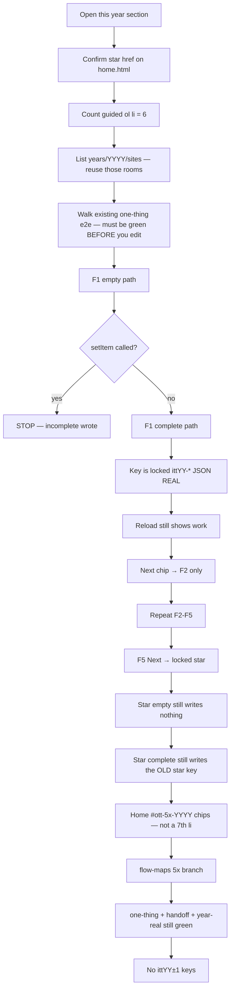

### Hard locks (every year)

1. Config + content. No engine fork.
2. Prefix `ittYY-*` only. Neighbor year isolation.
3. Incomplete never writes. Empty, skip-bar, 0–1 checks, 2018 Accept All — return before `setItem`.
4. Never invent brand pixels.
5. Star (`data-ott-one-thing`) locked. Do not retarget.
6. Guided `<ol>` stays exactly 6. 5× chips go under `#ott-5x-YYYY`.
7. Lean +3 HTML max. Forest reuse. Do not restore pruned forests (2011–14, 2016–18, 2020).
8. Do not reopen as broken: **1995–97, 2005, 2017–18, 2020 Zoom**.
9. Do not scaffold 2021+.
10. Do not blend Live Stats June with Pingdom December.
11. 2019 and 2020: no June Live Stats digit.
12. Do not rename disk keys (`itt10-wave-funeral`, `itt13-vine-posts`, `itt19-appletv`).
13. Write shape: `{ multiStep:true, real:true, year:"YYYY", ts, …typed }`.
14. Hrefs are `sites/…` never `pages/sites/…`.
15. After each F, run that year’s existing e2e. If it fails, stop.

### Every possible path you must keep working

| Path | What the visitor does | Must happen |
|------|----------------------|-------------|
| **P0 existing star** | Complete the locked one-thing only | Old star key still writes. Guided still 6. |
| **P1 incomplete F** | Open F-room, submit empty / skip timer / 0–1 checks | Visible error. **No key.** Next hidden. |
| **P2 complete F** | Finish that loop | Locked F-key writes REAL JSON. Reload persists. Next visible. |
| **P3 chain** | F1→F2→F3→F4→F5→star | Each Next href is a live room in this year. |
| **P4 home chips** | Click `#ott-5x-YYYY` chip without doing F first | Lands on the room. Still no write until complete. |
| **P5 reload mid-chain** | Finish F2, reload home | F2 chip/state remains. F3 Next only from F2 room. Star unchanged. |
| **P6 isolation** | Finish a 5× loop | `itt(YY-1)-*` and `itt(YY+1)-*` absent. |
| **P7 year handoff** | Use the museum next-year door | `e2e/year-handoff-flows.spec.js` still green. 5× Next must not steal it. |
| **P8 popular residual** | Open a continuity chip (Google on a lean year, etc.) | Literacy / residual only. Not a new star. Not a forest restore. |

### Shared T

```bash
python3 scripts/check-all-years.py
python3 scripts/audit-internal-links.py
npx playwright test e2e/one-thing-per-year.spec.js --grep YYYY --workers=1
npx playwright test e2e/year-handoff-flows.spec.js --grep YYYY --workers=1
npx playwright test e2e/YYYY-5x-live.spec.js --workers=1
```

### Jump

[1994](#1994) · [1995](#1995) · [1996](#1996) · [1997](#1997) · [1998](#1998) · [1999](#1999) · [2000](#2000) · [2001](#2001) · [2002](#2002) · [2003](#2003) · [2004](#2004) · [2005](#2005) · [2006](#2006) · [2007](#2007) · [2008](#2008) · [2009](#2009) · [2010 shipped](#2010) · [2011 shipped](#2011) · [2012 shipped](#2012) · [2013](#2013) · [2014](#2014) · [2015](#2015) · [2016](#2016) · [2017](#2017) · [2018](#2018) · [2019 shipped](#2019) · [2020](#2020)

### Scoreboard

| Year | Star key | Rooms on disk | Unique research URLs | Harvest rows | F-pack | Wave |
|-----:|----------|--------------:|---------------------:|-------------:|:------:|------|
| 1994 | `itt94-csotd` | 21 | 121 | 28 | `[ ]` | W5 |
| 1995 | `itt95-ssl-checkout` | 19 | 59 | 28 | `[ ]` | W6 |
| 1996 | `itt96-portal-wars` | 21 | 55 | 28 | `[ ]` | W6 |
| 1997 | `itt97-pointcast` | 25 | 45 | 28 | `[ ]` | W6 |
| 1998 | `itt98-lucky` | 38 | 52 | 28 | `[ ]` | W5 |
| 1999 | `itt99-aim` | 41 | 174 | 28 | `[ ]` | W5 |
| 2000 | `itt00-mapquest` | 49 | 87 | 28 | `[ ]` | W5 |
| 2001 | `itt01-msn` | 51 | 82 | 28 | `[ ]` | W5 |
| 2002 | `itt02-stumble` | 62 | 87 | 28 | `[ ]` | W4 |
| 2003 | `itt03-photobucket` | 67 | 55 | 28 | `[ ]` | W4 |
| 2004 | `itt04-thefacebook-networks` | 84 | 40 | 28 | `[ ]` | W4 |
| 2005 | `itt05-pandora` | 86 | 149 | 28 | `[ ]` | W6 |
| 2006 | `itt06-tweets` | 90 | 40 | 28 | `[ ]` | W5 |
| 2007 | `itt07-iphone` | 96 | 55 | 28 | `[ ]` | W5 |
| 2008 | `itt08-github` | 99 | 58 | 28 | `[ ]` | W4 |
| 2009 | `itt09-fb-likes` | 107 | 98 | 28 | `[ ]` | W4 |
| 2010 | `itt10-imgur` | 116 | 103 | 28 | **[x]** | W4 |
| 2011 | `itt11-airbnb` | 21 | 148 | 26 | **[x]** | W3 |
| 2012 | `itt12-soundcloud` | 22 | 79 | 28 | **[x]** | W3 |
| 2013 | `itt13-vine-posts` | 29 | 60 | 28 | `[ ]` | W6 |
| 2014 | `itt14-wa-install` | 29 | 46 | 28 | `[ ]` | W3 |
| 2015 | `itt15-watch` | 31 | 63 | 28 | `[ ]` | W6 |
| 2016 | `itt16-ig-stories` | 23 | 168 | 28 | `[ ]` | W2 |
| 2017 | `itt17-faceid` | 29 | 33 | 28 | `[ ]` | W6 |
| 2018 | `itt18-gdpr` | 29 | 71 | 28 | `[ ]` | W6 |
| 2019 | `itt19-disneyplus` | 25 | 57 | 27 | **[x]** | W1 |
| 2020 | `itt20-zoom` | 36 | 147 | 27 | `[ ]` | W6 |

_Unique http(s) URLs across year-tagged research files: **1,819**. That is the recorded corpus after de-dupe. Not 10,000 invented sites._


The handoff spine above is already tested. 5× Next chips are **inside** a year. They must not replace the year-to-year door.

---

# 1994

**Period verb:** directory wander → Cool Site guestbook  
**Model / wave / HTML:** Authored forest · W5 · 178 HTML  
**Star (locked):** `years/1994/sites/csotd/` · `itt94-csotd`  
**Isolation:** do not write itt95-*  
**Rooms on disk now:** 21  
**Research URLs recorded:** 121 · **Harvest rows:** 28 · **Source files tagged 1994:** 33

## 0. Lock — what must stay green before any edit

| Lock | Rule |
|------|------|
| Star href | `years/1994/sites/csotd/` — do not retarget `data-ott-one-thing` |
| Star key | `itt94-csotd` — empty still never writes |
| Guided | `#ott-guided-1994 ol li` count **6** |
| Prefix | `itt94-*` only |
| Neighbor | itt95-* |
| Existing e2e | `e2e/1994-csotd-real.spec.js` · `e2e/one-thing-per-year.spec.js --grep 1994` |
| Handoff | `e2e/year-handoff-flows.spec.js` pair that includes this year |
| Lean / forest | Reuse folders. Do not prune unless named. |

### Phase 0 — prove the year is still playable (do this first)

1. Open `/years/1994/`. Shell chrome loads. Iframe home is this year.
2. Count guided `<ol>` items = 6.
3. Click the star chip. Land on `years/1994/sites/csotd/`.
4. Star empty save writes nothing.
5. Star complete still writes `itt94-csotd`.
6. Run the existing e2e in the lock table. All green. **Only then start F1.**

## 1. Scale datapoints

| Datapoint | Value | Source |
|-----------|-------|--------|
| Websites June 1994 | 2,738 | https://www.internetlivestats.com/total-number-of-websites/ |
| Users June 1994 | 25,454,590 | same table — do not blend Pingdom Dec |
| Dual-cite | Hobbes / Gray / Pingdom growth series | label December separately |

## 2. Period session — the exact flow people ran

This is the year-true night, independent of 5×. 5× loops must **feel like this session**, not like a modern product tour.

### 1994 — directory, not search

**Exact flow**

1. Double-click Mosaic (early) or **Netscape Navigator 1.0** (from 15 Dec).  
2. Hear the modem. Gray `#C0C0C0` page.  
3. Either type a remembered URL **or** open **NCSA What’s New** / **Yahoo at `akebono.stanford.edu/yahoo`**.  
4. Click a **category**, then a leaf. Wait for the GIF.  
5. Optional: Cool Site of the Day (Glenn Davis, Aug) → one human pick → guestbook.  
6. Back until you hang up. **No tabs. No CSS. No search-of-the-whole-Web as the default.**

**Mass / known (1994 has no Hosting.com June table).** Contemporaneous: Mosaic What’s New added about one link a day in 1993–94; ~10k sites by Dec (Matthew Gray class). Famous names: CERN/WWW, NCSA Mosaic, Yahoo @ Stanford, Lycos, WebCrawler (full-text, 1994), IUMA, NASA, White House (Oct 1994), HotWired (Oct 1994), Infoseek/Architext (1994).

**On disk (20):** bbs, cern, csotd, exploratorium, fishcam, galaxy, gnn, hotwired, iuma, jumpstation, lycos, mcom, nasa, ncsa, personal, playable, webcrawler, weblouvre, whitehouse, yahoo.

**Missing known (year-true):** **Infoseek** (1994 search). AOL in 1994 is still mostly a **walled garden** (chat, mail, keywords) — do **not** pretend AOL.com is the 1994 WWW homepage.

**Flow to reconstruct if you add one:** Infoseek query → results list → one outbound leave. Next → Yahoo directory (contrast: browse vs search).

---

**Disk check (live, 1994):** the “On disk / Missing” paragraphs above are from the popular-links research pass. **Live site folders now are listed in §3.** Prefer live disk over a stale missing list. Do not add a room that already exists.

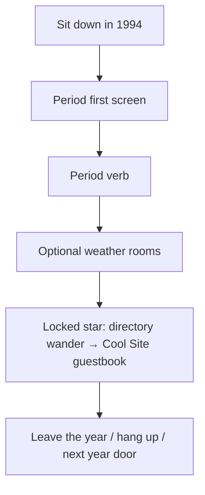

## 3. Rooms on disk right now (do not invent duplicates)

`bbs`, `cern`, `csotd`, `exploratorium`, `fishcam`, `galaxy`, `gnn`, `hotwired`, `infoseek`, `iuma`, `jumpstation`, `lycos`, `mcom`, `nasa`, `ncsa`, `personal`, `playable`, `webcrawler`, `weblouvre`, `whitehouse`, `yahoo`

_21 folders under `years/1994/sites/`._ 5× F-rooms must be one of these (forest) or count against +3 (lean).

## 4. Locked 5× keys (do not rename)

| Flow | Key | Incomplete never writes |
|------|-----|-------------------------|
| F1 IUMA listen | `itt94-iuma` | modem bar must finish then Play |
| F2 FishCam | `itt94-fishcam` | timer skip never writes |
| F3 White House map | `itt94-wh-map` | empty region no write |
| F4 Yahoo 3-hub | `itt94-yahoo-wander` | fewer than 3 hubs no write |
| F5 What’s New | `itt94-whatsnew` | no item opened no write |
| Star CSotD | `itt94-csotd` | wander + name; empty guestbook never writes |

**Next chain: IUMA → FishCam → White House map → Yahoo 3-hub → What’s New → CSotD (star).**

## 5. Whole 5× flow diagram

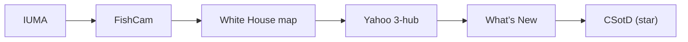

Hidden Next: `[data-next-flow]` / `[data-itt94-next]` is invisible until that room’s key exists. After save **and** on reload if the key is already set, the chip is visible and its first href is a **live** `1994` room.

## 6. Every possible way through this year

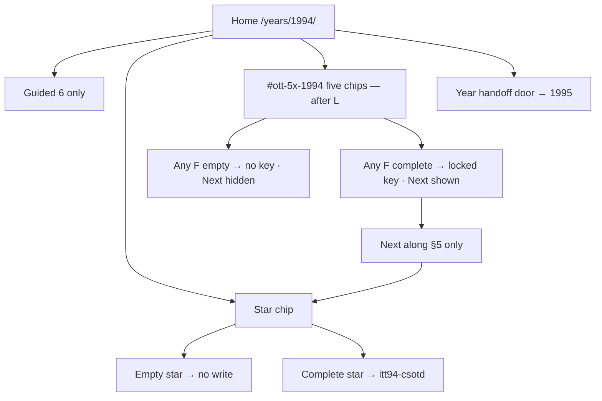

| Way | Steps | Write | Next |
|-----|-------|-------|------|
| Star only | Home → star → empty | none | none |
| Star only complete | Home → star → complete | `itt94-csotd` | year handoff, not 5× |
| F incomplete | Chip or href → empty/skip | none | hidden |
| F complete | Required fields / checks / timer | that F key | next F |
| Full 5× | F1…F5 complete then star | five F keys + star key | star last |
| Mid-chain reload | Complete F2, reload, go home | F2 remains | F3 only from F2 |
| Isolation fail | Any write to neighbor prefix | **bug — revert** | — |

## 7. Phases and minute steps

### Phase R0 — research · `[x]` 2026-08-15

Harvest file: [`1994-5X-HARVEST.md`](1994-5X-HARVEST.md). Corpus URLs are §9. Do not invent June counts. Do not start product HTML in a research-only pass.

### Phase F — five REAL loops (one at a time)

### F1 IUMA listen · `itt94-iuma` · R4 · `[ ]`

**Files:** `years/1994/sites/iuma/{index,track,about}.html` · `js/immersion/media-1994.js`  
**Steps:**

1. Index: pick residual track (no invented IUMA logo).  
2. Track: existing modem bar must **finish** then Play. Incomplete (skip bar) never writes.  
3. About: “no CD · helper app”.  
4. Next → FishCam.  
**Accept:** bar+Play → key; Play-only → no key.  
**Anti:** real MP3 payload · steal CSotD.

### F2 FishCam · `itt94-fishcam` · R4 · `[ ]`

**Files:** `sites/fishcam/` · `media-1994.js`  
**Steps:** Wait 8s (or existing timer) → still advances → persist last still id. Reload shows last still. Next → WH.  
**Accept:** reload last still; no timer skip write.

### F3 White House imagemap · `itt94-wh-map` · R4 · `[ ]`

**Files:** `sites/whitehouse/`  
**Steps:** Click a building on the map → land in that room → write building id. Empty click (no region) no write. Next → Yahoo Computers.

### F4 Yahoo 3-hub · `itt94-yahoo-wander` · R5 · `[ ]`

**Files:** `sites/yahoo/Computers|Entertainment|News/` · existing wander if any  
**Steps:** Confirm 3 hubs visited (session or key list length ≥ 3) before write. Thicken if already partial. Next → NCSA.

### F5 What’s New / NCSA · `itt94-whatsnew` · R4 · `[ ]`

**Files:** `sites/ncsa/` · `sites/cern/`  
**Steps:** Open a dated What’s New item → persist item id. Next → CSotD archive (star, not a rewrite).

**Do this for each F, in chain order:**

1. `ls years/1994/sites/<room>`. If missing and the year is lean, the new HTML counts against +3. If forest, reuse.
2. Re-confirm star href on `years/1994/pages/home.html`.
3. Wire empty / skip / 0–1 checks → visible error → `return` before `setItem`.
4. Complete → `itt94-…` JSON `{ multiStep:true, real:true, year:"1994", ts, … }`.
5. Reload the job page: the work is still there.
6. Reveal Next to the **next node in §5 only**.
7. Run existing year e2e. If red, fix before the next F.
8. `localStorage` / `sessionStorage`: no keys matching itt95-*.

### Phase L — links (only after F1–F5)

1. `years/1994/pages/home.html` — `#ott-5x-1994` with five chips. **Not** inside guided `<ol>`.
2. Each chip `data-trail-keys` equals the locked F key.
3. `js/config/flow-maps.js` — branch `5× F1–F5` for 1994.
4. `js/config/1994.js` urlMap / titleMap only if a dest is new.
5. One in-room href F1→F2 that is not the Next chip.
6. All hrefs `sites/…`.

### Phase T — tests

```bash
python3 scripts/check-all-years.py
python3 scripts/audit-internal-links.py
npx playwright test e2e/1994-csotd-real.spec.js --workers=1
npx playwright test e2e/one-thing-per-year.spec.js --grep 1994 --workers=1
npx playwright test e2e/year-handoff-flows.spec.js --grep 1994 --workers=1
npx playwright test e2e/1994-5x-live.spec.js --workers=1
```

Live spec must cover P1–P7: incomplete, complete, reload, Next href 200, star still writes, neighbor prefix absent.

## 8. Harvest datapoints (every 5× R0 row)

| # | Date / beat | Use | URL |
|--:|-------------|-----|-----|
| 1 | 1994 · IUMA on the Web (Usenet/Gopher → WWW) | F1 | https://cybercultural.com/p/iuma-1994/ |
| 2 | IUMA founded UCSC 1993 · CNN 9 Mar 1994 | F1 | https://en.wikipedia.org/wiki/Internet_Underground_Music_Archive |
| 3 | IUMA Santa Cruz restoration lore | F1 | https://www.goodtimes.sc/up-from-underground-the-iuma-story/ |
| 4 | WA IUMA helper-app era | F1 | https://web.archive.org/web/19961026180733/http://www.iuma.com/IUMA-2.0/help/ |
| 5 | NCSA Mosaic project | F2 residual | https://www.ncsa.illinois.edu/research/project-highlights/ncsa-mosaic/ |
| 6 | Mosaic → Netscape 1994 | F2 residual | https://en.wikipedia.org/wiki/NCSA_Mosaic |
| 7 | WA Netscape FishCam class | F2 | https://web.archive.org/web/19961219003200/http://www.netscape.com/fishcam/ |
| 8 | 1994 White House.gov imagemap class | F3 | https://web.archive.org/web/19961219024631/http://www.whitehouse.gov/ |
| 9 | WA White House 1994 welcome | F3 | https://clintonwhitehouse4.archives.gov/WH/Welcome.html |
| 10 | Yahoo founded 1994 directory | F4 | https://en.wikipedia.org/wiki/Yahoo! |
| 11 | WA Yahoo 1994 directory still | F4 | https://web.archive.org/web/19961220154510/http://www.yahoo.com/ |
| 12 | akebono Yahoo Computers class | F4 | https://web.archive.org/web/19961219000000/http://www.yahoo.com/Computers/ |
| 13 | NCSA What’s New 1994 | F5 | https://web.archive.org/web/19970101000000/http://www.ncsa.uiuc.edu/SDG/Software/Mosaic/Docs/whats-new.html |
| 14 | CERN first website still live | F5 / star residual | http://info.cern.ch/hypertext/WWW/TheProject.html |
| 15 | CERN royalty-free Web 30 Apr 1993 | F5 | https://home.cern/news/news/computing/twenty-years-free-open-web |
| 16 | TBL 1989 proposal | residual | https://www.w3.org/History/1989/proposal.html |
| 17 | Cool Site of the Day culture | star | https://en.wikipedia.org/wiki/Cool_Site_of_the_Day |
| 18 | WA CSotD class | star | https://web.archive.org/web/19961219000000/http://cool.infi.net/ |
| 19 | Live Stats June websites 2,738 | scale | https://www.internetlivestats.com/total-number-of-websites/ |
| 20 | Live Stats users ~25.5M | scale | https://www.internetlivestats.com/internet-users/ |
| 21 | Pingdom growth series (Hobbes/Gray) | scale dual-cite | https://www.pingdom.com/blog/internet-2010-in-numbers/ |
| 22 | Matthew Gray MIT web growth | scale | https://www.mit.edu/people/mkgray/growth/ |
| 23 | Hobbes Internet Timeline | scale | https://www.zakon.org/robert/internet/timeline/ |
| 24 | Cybercultural 1994 internet | residual | https://cybercultural.com/p/internet-1994/ |
| 25 | HotWired 1994 launch residual | residual | https://en.wikipedia.org/wiki/HotWired |
| 26 | Lycos 1994 search residual | residual | https://en.wikipedia.org/wiki/Lycos |
| 27 | Webcrawler 1994 residual | residual | https://en.wikipedia.org/wiki/WebCrawler |
| 28 | GNN / O'Reilly 1994 residual | residual | https://en.wikipedia.org/wiki/Global_Network_Navigator |

## 9. Every recorded research URL for this year

Unique http(s) URLs found in files named or filed under 1994 (research MDs, visit logs, capture notes, harvests). De-duped. Implementers do not drop a row.

| # | URL |
|--:|-----|
| 1 | http://** |
| 2 | http://127.0.0.1:8080/years/1994/ |
| 3 | http://anthology.rhizome.org/one-terabyte-of-kilobyte-age |
| 4 | http://home.nerf.edu/web1994/hotlist-surfer.html |
| 5 | http://hotmail.com` |
| 6 | http://i.imgur.residual/<file |
| 7 | http://info.cern.ch/hypertext/WWW/TheProject.html |
| 8 | http://www.icq.com/` |
| 9 | https://` |
| 10 | https://alistapart.com/ |
| 11 | https://alistapart.com/article/tohell/ |
| 12 | https://almanac.httparchive.org/en/2019/page-weight |
| 13 | https://archive.org/details/software |
| 14 | https://archive.org/details/softwarelibrary_flash |
| 15 | https://archive.org/details/softwarelibrary_flash_games |
| 16 | https://browsers.evolt.org/ |
| 17 | https://clintonwhitehouse1.archives.gov/ |
| 18 | https://clintonwhitehouse4.archives.gov/WH/Welcome.html |
| 19 | https://cybercultural.com/ |
| 20 | https://cybercultural.com/p/1994-cool-site-of-the-day/ |
| 21 | https://cybercultural.com/p/1994-perl-yahoo/ |
| 22 | https://cybercultural.com/p/geocities-1995/ |
| 23 | https://cybercultural.com/p/internet-1994/ |
| 24 | https://cybercultural.com/p/internet-1995/ |
| 25 | https://cybercultural.com/p/iuma-1994/ |
| 26 | https://cybercultural.com/p/netscape-1994/ |
| 27 | https://cybercultural.com/year/ |
| 28 | https://en.wikipedia.org/wiki/2048_(video_game |
| 29 | https://en.wikipedia.org/wiki/Agar.io |
| 30 | https://en.wikipedia.org/wiki/Cool_Site_of_the_Day |
| 31 | https://en.wikipedia.org/wiki/Draw_Something |
| 32 | https://en.wikipedia.org/wiki/FarmVille |
| 33 | https://en.wikipedia.org/wiki/Flappy_Bird |
| 34 | https://en.wikipedia.org/wiki/GeoCities |
| 35 | https://en.wikipedia.org/wiki/Global_Network_Navigator |
| 36 | https://en.wikipedia.org/wiki/HotWired |
| 37 | https://en.wikipedia.org/wiki/Internet_Underground_Music_Archive |
| 38 | https://en.wikipedia.org/wiki/Line_Rider |
| 39 | https://en.wikipedia.org/wiki/List_of_websites_founded_before_1995 |
| 40 | https://en.wikipedia.org/wiki/Lycos |
| 41 | https://en.wikipedia.org/wiki/NCSA_Mosaic |
| 42 | https://en.wikipedia.org/wiki/Prodigy_(online_service |
| 43 | https://en.wikipedia.org/wiki/WebCrawler |
| 44 | https://en.wikipedia.org/wiki/Yahoo! |
| 45 | https://eur-lex.europa.eu/content/news/general-data-protection-regulation-GDPR-applies-from-25-May-2018.html |
| 46 | https://flashgaming.fandom.com/wiki/Helicopter_Game |
| 47 | https://flashpointarchive.org/ |
| 48 | https://flashpointarchive.org/faq |
| 49 | https://github.com/gingerbeardman/apple-human-interface-guidelines |
| 50 | https://gs.statcounter.com/ |
| 51 | https://gs.statcounter.com/press/evolving-global-browser-landscape |
| 52 | https://guidebookgallery.org/ |
| 53 | https://guidebookgallery.org/screenshots/win95 |
| 54 | https://home.cern/news/news/computing/twenty-years-free-open-web |
| 55 | https://home.cern/science/computing/the-birth-of-the-web/short-history-web |
| 56 | https://hosting.com/blog/the-most-visited-websites-every-year-since-1995/ |
| 57 | https://httparchive.org/ |
| 58 | https://httparchive.org/reports/page-weight |
| 59 | https://newsroom.cisco.com/c/r/newsroom/en/us/a/y2018/m11/cisco-predicts-more-ip-traffic-in-the-next-five-years-than-in-the-history-of-the-internet.html |
| 60 | https://oldweb.today/ |
| 61 | https://oneterabyteofkilobyteage.tumblr.com/ |
| 62 | https://ruffle.rs/ |
| 63 | https://stuff.mit.edu/people/mkgray/net/web-growth-summary.html |
| 64 | https://thehistoryoftheweb.com/timeline/ |
| 65 | https://web.archive.org/ |
| 66 | https://web.archive.org/cdx/search/cdx?url=example.com/images/*&from=YYYY&to=YYYY&output=json&filter=statuscode:200&filter=mimetype:image/gif |
| 67 | https://web.archive.org/cdx/search/cdx?url=instagram.com/*&from=2012&to=2012&output=json&filter=mimetype:image.*&limit=50 |
| 68 | https://web.archive.org/cdx/search/cdx?url=vine.co/*&from=2013&to=2013&output=json&filter=mimetype:image.*&limit=50 |
| 69 | https://web.archive.org/cdx/search/cdx?url=www.facebook.com/*&from=2011&to=2012&output=json&filter=mimetype:image/gif&limit=30 |
| 70 | https://web.archive.org/cdx/search/cdx?url=www.google.com/chrome/*&from=2008&to=2013&output=json&filter=mimetype:image.*&limit=50 |
| 71 | https://web.archive.org/cdx/search/cdx?url=www.spotify.com/*&from=2011&to=2011&output=json&filter=mimetype:image.*&limit=50 |
| 72 | https://web.archive.org/web/*/https://example.com/* |
| 73 | https://web.archive.org/web/19961026180733/http://www.iuma.com/IUMA-2.0/help/ |
| 74 | https://web.archive.org/web/19961219000000/http://cool.infi.net/ |
| 75 | https://web.archive.org/web/19961219000000/http://www.yahoo.com/Computers/ |
| 76 | https://web.archive.org/web/19961219003200/http://www.netscape.com/fishcam/ |
| 77 | https://web.archive.org/web/19961219024631/http://www.whitehouse.gov/ |
| 78 | https://web.archive.org/web/19961220154510/http://www.yahoo.com/ |
| 79 | https://web.archive.org/web/19970101000000/http://www.ncsa.uiuc.edu/SDG/Software/Mosaic/Docs/whats-new.html |
| 80 | https://web.archive.org/web/YYYYMM*/https://example.com/ |
| 81 | https://web.archive.org/web/{timestamp}im_/{original-url} |
| 82 | https://webrecorder.net/blog/2020-12-23-new-oldweb-today/ |
| 83 | https://www.apkmirror.com/ |
| 84 | https://www.c-span.org/program/senate-committee/facebook-ceo-mark-zuckerberg-hearing-on-data-privacy-and-protection/500690 |
| 85 | https://www.congress.gov/event/115th-congress/senate-event/LC64510/text |
| 86 | https://www.cookiebot.com/en/cookie-banner-examples/ |
| 87 | https://www.ebayinc.com/company/our-history/ |
| 88 | https://www.flickr.com/photos/yodelanecdotal/3740158849 |
| 89 | https://www.goodtimes.sc/up-from-underground-the-iuma-story/ |
| 90 | https://www.internetlivestats.com/internet-users/ |
| 91 | https://www.internetlivestats.com/total-number-of-websites/ |
| 92 | https://www.itu.int/en/mediacentre/Pages/2018-PR40.aspx |
| 93 | https://www.judiciary.senate.gov/imo/media/doc/04-10-18%20Zuckerberg%20Testimony.pdf |
| 94 | https://www.mit.edu/people/mkgray/growth/ |
| 95 | https://www.ncsa.illinois.edu/research/project-highlights/ncsa-mosaic/ |
| 96 | https://www.newgrounds.com/wiki/about-newgrounds/history/flash-portal-history |
| 97 | https://www.onetrust.com/products/cookie-consent/ |
| 98 | https://www.pewresearch.org/internet/2012/04/13/digital-differences/ |
| 99 | https://www.pewresearch.org/internet/2015/06/26/americans-internet-access-2000-2015/ |
| 100 | https://www.pewresearch.org/internet/2015/10/08/social-networking-usage-2005-2015/ |
| 101 | https://www.pingdom.com/blog/ |
| 102 | https://www.pingdom.com/blog/internet-2010-in-numbers/ |
| 103 | https://www.spacejam.com/1996/ |
| 104 | https://www.spacejam.com/1996/` |
| 105 | https://www.theguardian.com/games/article/2024/jul/05/farmville-at-15-how-a-cutesy-facebook-game-shaped-the-modern-internet |
| 106 | https://www.versionmuseum.com/ |
| 107 | https://www.versionmuseum.com/history-of/amazon-website |
| 108 | https://www.versionmuseum.com/history-of/yahoo-website |
| 109 | https://www.w3.org/History/1989/proposal.html |
| 110 | https://www.webdesignmuseum.org/ |
| 111 | https://www.webdesignmuseum.org/gallery/amazon-1995 |
| 112 | https://www.webdesignmuseum.org/gallery/geocities-1995 |
| 113 | https://www.webdesignmuseum.org/gallery/yahoo-1994 |
| 114 | https://www.webdesignmuseum.org/gallery/yahoo-in-1995 |
| 115 | https://www.webdesignmuseum.org/gallery/year-1995 |
| 116 | https://www.webdesignmuseum.org/gallery/year-2000 |
| 117 | https://www.webdesignmuseum.org/software/netscape-navigator-1-0-in-1994 |
| 118 | https://www.webdesignmuseum.org/software/netscape-navigator-2-0-in-1995 |
| 119 | https://www.webdesignmuseum.org/web-design-history/yahoo-1994 |
| 120 | https://www.wired.com/2014/10/wired-hotwired-anniversary/ |
| 121 | https://www.zakon.org/robert/internet/timeline/ |

_121 URLs._

### Research files these URLs came from

| File | URLs in file | Bytes |
|------|-------------:|------:|
| `docs/1994-1995-DEEP-RESEARCH-AUDIT-2026-07-29.md` | 10 | 24446 |
| `docs/1994-1995-IMPLEMENTATION-PHASES.md` | 21 | 30221 |
| `docs/1994-5X-HARVEST.md` | 28 | 4095 |
| `docs/1994-IMPROVEMENT-RESEARCH.md` | 11 | 11843 |
| `docs/1994-MUSEUM-GRADE.md` | 0 | 1592 |
| `docs/1994-RESEARCH.md` | 0 | 4645 |
| `docs/5X-EVERY-YEAR-GOALS-STEPS-ARTIFACTS-ROI-1994-2020.md` | 0 | 39679 |
| `docs/COMPLEX-INTEGRATIONS-PER-YEAR-GOALS-PHASES-STEPS-1994-2020.md` | 0 | 61659 |
| `docs/FLOW-CHECK-DIAGRAMS-EVERY-YEAR-1994-2020.md` | 0 | 55123 |
| `docs/FLOW-IMPROVEMENTS-DEEP-RESEARCH-1994-2007.md` | 1 | 26464 |
| `docs/GAMES-PER-YEAR/YEAR-1994.md` | 1 | 10684 |
| `docs/GAMES-SOURCE-EXPANSION-DEEP-RESEARCH-INFO-UX-1994-2018.md` | 14 | 27482 |
| `docs/HUB-SCAN-AND-IMPROVE-PROGRAM-1994-2016.md` | 0 | 22882 |
| `docs/IMPLEMENTATION-LOG-BY-YEAR-1994-2013.md` | 0 | 7781 |
| `docs/IMPROVE-5X-RESEARCH-FLOWS-LINKS-EVERY-YEAR-1994-2020.md` | 2 | 30799 |
| `docs/IMPROVE-5X-TODO-GOALS-PHASES-STEPS-ROI-FLOWS-1994-2020.md` | 0 | 40253 |
| `docs/INTEGRATION-IDEAS-PER-YEAR-1994-2018.md` | 0 | 19194 |
| `docs/MUSEUM-GRADE-AUTHENTICITY-IMPROVEMENTS-SCAN-1994-2018-2026-08-07.md` | 0 | 22413 |
| `docs/MUSEUM-GRADE-GAP-MAP-1994-2016.md` | 0 | 30871 |
| `docs/MUSEUM-READY-BAR-1994-2012.md` | 0 | 2022 |
| `docs/NOSTALGIA-FEEL-GOALS-PHASES-STEPS-1994-2013.md` | 2 | 33989 |
| `docs/ONE-THING-PER-YEAR-INTEGRATION-1994-2018.md` | 0 | 8682 |
| `docs/POPULAR-LINKS-EXACT-FLOWS-TODO-GOALS-PHASES-STEPS-ROI-1994-2020.md` | 0 | 40850 |
| `docs/REMAINING-WORK-1994-1997.md` | 9 | 19039 |
| `docs/SOURCE-EXPANSION-DEEP-RESEARCH-INFO-UX-1994-2018.md` | 21 | 31306 |
| `docs/TO-100-PERCENT/RESEARCH-FREEZE-1994-1995.md` | 0 | 5347 |
| `docs/TO-100-PERCENT/YEAR-1994.md` | 7 | 11284 |
| `docs/UI-FEEL-ARTIFACT-ROI-MASTER-1994-2013.md` | 19 | 45051 |
| `docs/WIDELY-USED-MISSING-DEEP-RESEARCH-1994-2018.md` | 0 | 22089 |
| `docs/WIDELY-USED-MISSING-INTEGRATIONS-1994-2018.md` | 0 | 15035 |
| `docs/YEAR-TRUE-POPULAR-LINKS-AND-EXACT-FLOWS-1994-2020.md` | 8 | 35120 |
| `docs/references/1994/ASSETS.md` | 0 | 4457 |
| `docs/references/1994/CAPTURE-LOG.md` | 12 | 10949 |

## 10. Verify diagram (walk after implement)

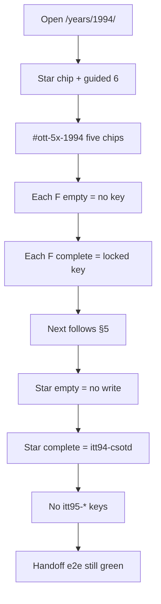

## 11. Anti

- real MP3 payload · steal CSotD.
- flatten Yahoo tree · NN1 OEM invent (L4 `[~]`).
- Win 3.1 + **Netscape Navigator 1.0**. Yahoo @ Stanford · White House imagemap · IUMA helper · FishCam multi-still · CSotD rotation · HotWired banner flow.
- Star stays:** CSotD guestbook · `itt94-csotd` · wander then name; empty never writes
- Do not invent:** MP3 store art · NN1 OEM pixels · flatten Yahoo tree · steal CSotD
- F-loop keys (do not rename)
- | F2 FishCam | `itt94-fishcam` | timer skip never writes |
- | Star CSotD | `itt94-csotd` | wander + name; empty guestbook never writes |
- No 7th guided `<li>`. No invented brand pixels. No renamed keys.
- Do not let 5× Next replace the year-to-year handoff.

---

# 1995 · **do not reopen as broken**

**Period verb:** AOL/Prodigy garden → Web → SSL view  
**Model / wave / HTML:** Gold · W6 · 146 HTML  
**Star (locked):** `years/1995/sites/amazon/ssl-checkout.html` · `itt95-ssl-checkout`  
**Isolation:** do not write itt94-* · itt96-*  
**Rooms on disk now:** 19  
**Research URLs recorded:** 59 · **Harvest rows:** 28 · **Source files tagged 1995:** 11

## 0. Lock — what must stay green before any edit

| Lock | Rule |
|------|------|
| Star href | `years/1995/sites/amazon/ssl-checkout.html` — do not retarget `data-ott-one-thing` |
| Star key | `itt95-ssl-checkout` — empty still never writes |
| Guided | `#ott-guided-1995 ol li` count **6** |
| Prefix | `itt95-*` only |
| Neighbor | itt94-* · itt96-* |
| Existing e2e | `e2e/1995-homestead-live.spec.js` · `e2e/one-thing-per-year.spec.js --grep 1995` |
| Handoff | `e2e/year-handoff-flows.spec.js` pair that includes this year |
| Lean / forest | Reuse folders. Do not prune unless named. |
| Gold | Deepen + link only. Do not rebuild the star machine. |

### Phase 0 — prove the year is still playable (do this first)

1. Open `/years/1995/`. Shell chrome loads. Iframe home is this year.
2. Count guided `<ol>` items = 6.
3. Click the star chip. Land on `years/1995/sites/amazon/ssl-checkout.html`.
4. Star empty save writes nothing.
5. Star complete still writes `itt95-ssl-checkout`.
6. Run the existing e2e in the lock table. All green. **Only then start F1.**

## 1. Scale datapoints

| Datapoint | Value | Source |
|-----------|-------|--------|
| Websites June 1995 | 23,500 | https://www.internetlivestats.com/total-number-of-websites/ |
| Users June 1995 | 44,838,900 | same table — do not blend Pingdom Dec |
| Dual-cite | Hobbes / Gray / Pingdom growth series | label December separately |

## 2. Period session — the exact flow people ran

This is the year-true night, independent of 5×. 5× loops must **feel like this session**, not like a modern product tour.

### 1995 — the Big Three open the Web

**Exact flow**

1. Install from a **CD** (AOL / Prodigy / Compuserve).  
2. Dial. **You’ve Got Mail** (AOL) or Prodigy’s family start.  
3. **Prodigy is first of the Big Three to offer full WWW** (1994–Jan 1995 class) and member home pages (June 1995).  
4. Leave the garden: Netscape or IE → **Yahoo.com** (domain 1995) / **GeoCities** neighborhood / WebCrawler.  
5. Optional: Amazon SSL checkout (museum star) · AuctionWeb bid (Sept).  
6. Stay signed into AOL even while the Web is in another window.

**Mass top 10 (Hosting.com June 1995):** AOL, Yahoo, GeoCities, Netscape, WebCrawler, Excite, **Prodigy**, Infoseek, Lycos, Compuserve.

**On disk (15):** altavista, amazon, auctionweb, classmates, cnn, geocities, hotwired, match, microsoft, netscape, pathfinder, playable, tripod, whitehouse, yahoo.

**Missing known:** **AOL.com** (mail + keyword + web exit) · **Prodigy** · **Infoseek** · **Compuserve** · **Excite** (on 1996) · WebCrawler (on 1994).

**Best add:** AOL start → mail theater → one keyword → “go to the Web” (does not write). Next → Yahoo. Prodigy as the “first WWW among the Big Three” literacy room.

---

**Disk check (live, 1995):** the “On disk / Missing” paragraphs above are from the popular-links research pass. **Live site folders now are listed in §3.** Prefer live disk over a stale missing list. Do not add a room that already exists.

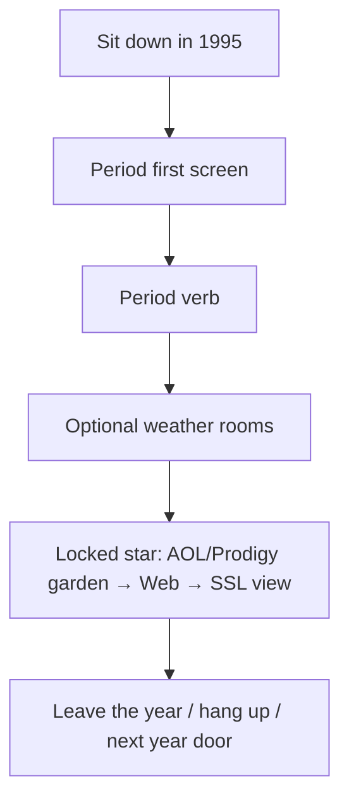

## 3. Rooms on disk right now (do not invent duplicates)

`altavista`, `amazon`, `aol`, `auctionweb`, `classmates`, `cnn`, `compuserve`, `geocities`, `hotwired`, `infoseek`, `match`, `microsoft`, `netscape`, `pathfinder`, `playable`, `prodigy`, `tripod`, `whitehouse`, `yahoo`

_19 folders under `years/1995/sites/`._ 5× F-rooms must be one of these (forest) or count against +3 (lean).

## 4. Locked 5× keys (do not rename)

| Flow | Key | Incomplete never writes |
|------|-----|-------------------------|
| F1 Homestead | `itt95-homestead` | empty title never writes |
| F2 AuctionWeb bid | `itt95-aw-bid` | low-bid confirm · never say eBay |
| F3 AltaVista catalog | `itt95-av` | empty query never writes |
| F4 HotWired 3 departments | `itt95-hotwired` | fewer than 3 hops no write |
| F5 What’s Cool | `itt95-cool` | no Cool/New click no write |
| Star SSL | `itt95-ssl-checkout` | name+card+city · empty never writes · view only from F5 |

**Next chain: Homestead → AuctionWeb → AltaVista → HotWired → What’s Cool → SSL **view** (not a second checkout).**

## 5. Whole 5× flow diagram


Hidden Next: `[data-next-flow]` / `[data-itt95-next]` is invisible until that room’s key exists. After save **and** on reload if the key is already set, the chip is visible and its first href is a **live** `1995` room.

## 6. Every possible way through this year

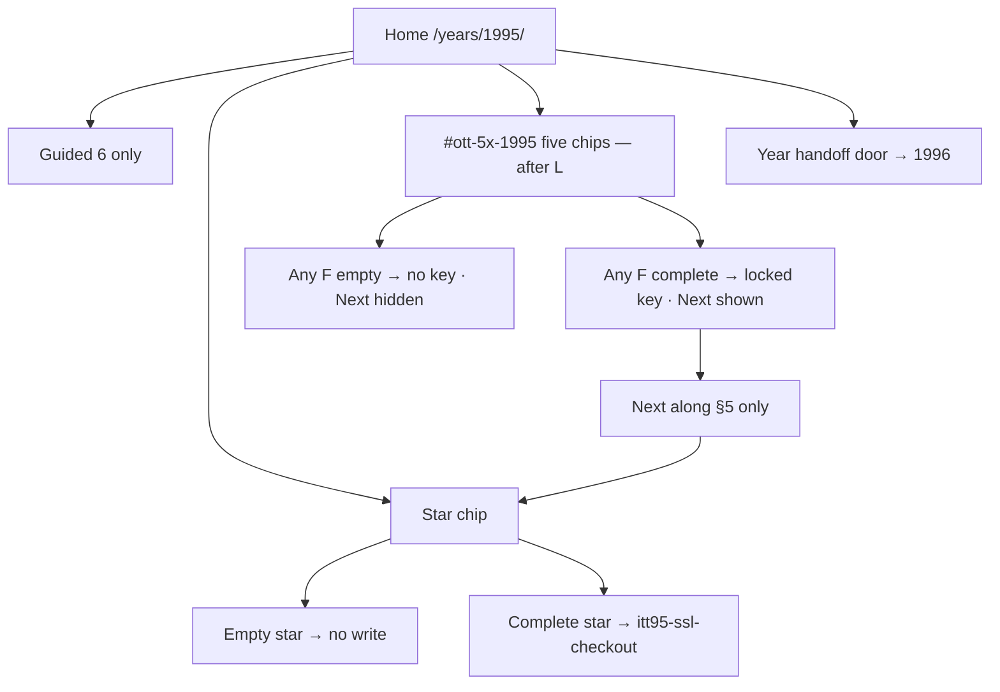

| Way | Steps | Write | Next |
|-----|-------|-------|------|
| Star only | Home → star → empty | none | none |
| Star only complete | Home → star → complete | `itt95-ssl-checkout` | year handoff, not 5× |
| F incomplete | Chip or href → empty/skip | none | hidden |
| F complete | Required fields / checks / timer | that F key | next F |
| Full 5× | F1…F5 complete then star | five F keys + star key | star last |
| Mid-chain reload | Complete F2, reload, go home | F2 remains | F3 only from F2 |
| Isolation fail | Any write to neighbor prefix | **bug — revert** | — |

## 7. Phases and minute steps

### Phase R0 — research · `[x]` 2026-08-15

Harvest file: [`1995-5X-HARVEST.md`](1995-5X-HARVEST.md). Corpus URLs are §9. Do not invent June counts. Do not start product HTML in a research-only pass.

### Phase F — five REAL loops (one at a time)

### F1 Homestead · `itt95-homestead` · `[ ]`

`geocities/{index,homestead,my-homestead}`. Hood → title → publish → visit your page. Empty title blocked. Trail already: `1995-homestead-live.spec.js` — deepen persist if thin. Next → AuctionWeb.

### F2 AuctionWeb bid · `itt95-aw-bid` · `[ ]`

`auctionweb/`. Low bid confirm. Never say eBay. Next → AltaVista.

### F3 AltaVista catalog · `itt95-av` · `[ ]`

Empty query blocked. Result list persist last query. Next → HotWired.

### F4 HotWired 3 departments · `itt95-hotwired` · `[ ]`

Hop 3 sections then write. Next → Netscape Cool.

### F5 What’s Cool · `itt95-cool` · `[ ]`

Click Cool/New button → land in room → write. Next → SSL **view** (not a second checkout).

**Do this for each F, in chain order:**

1. `ls years/1995/sites/<room>`. If missing and the year is lean, the new HTML counts against +3. If forest, reuse.
2. Re-confirm star href on `years/1995/pages/home.html`.
3. Wire empty / skip / 0–1 checks → visible error → `return` before `setItem`.
4. Complete → `itt95-…` JSON `{ multiStep:true, real:true, year:"1995", ts, … }`.
5. Reload the job page: the work is still there.
6. Reveal Next to the **next node in §5 only**.
7. Run existing year e2e. If red, fix before the next F.
8. `localStorage` / `sessionStorage`: no keys matching itt94-* · itt96-*.

### Phase L — links (only after F1–F5)

1. `years/1995/pages/home.html` — `#ott-5x-1995` with five chips. **Not** inside guided `<ol>`.
2. Each chip `data-trail-keys` equals the locked F key.
3. `js/config/flow-maps.js` — branch `5× F1–F5` for 1995.
4. `js/config/1995.js` urlMap / titleMap only if a dest is new.
5. One in-room href F1→F2 that is not the Next chip.
6. All hrefs `sites/…`.

### Phase T — tests

```bash
python3 scripts/check-all-years.py
python3 scripts/audit-internal-links.py
npx playwright test e2e/1995-homestead-live.spec.js --workers=1
npx playwright test e2e/one-thing-per-year.spec.js --grep 1995 --workers=1
npx playwright test e2e/year-handoff-flows.spec.js --grep 1995 --workers=1
npx playwright test e2e/1995-5x-live.spec.js --workers=1
```

Live spec must cover P1–P7: incomplete, complete, reload, Next href 200, star still writes, neighbor prefix absent.

## 8. Harvest datapoints (every 5× R0 row)

| # | Date / beat | Use | URL |
|--:|-------------|-----|-----|
| 1 | Labor Day weekend 1995 · AuctionWeb born | F2 | https://www.ebayinc.com/company/our-history/ |
| 2 | First sale · broken laser pointer · Mark Fraser | F2 | https://www.ebayinc.com/company/our-history/ |
| 3 | Pez dispenser myth is fabricated | F2 honesty | https://www.ebayinc.com/company/our-history/ |
| 4 | 3 Sep 1995 · AuctionWeb date lock | F2 | https://www.poynter.org/reporting-editing/2014/today-in-media-history-pierre-omidyar-starts-ebay/ |
| 5 | 15 Dec 1995 · AltaVista public (DEC) | F3 | https://en.wikipedia.org/wiki/AltaVista |
| 6 | WA AltaVista digital.com class | F3 | https://web.archive.org/web/19961022174555/http://altavista.digital.com/ |
| 7 | 1995blog AltaVista 25th | F3 | https://1995blog.com/2020/12/15/looking-back-25-years-to-alta-vista-and-high-speed-search-for-the-early-web/ |
| 8 | GeoCities 1995 homestead / neighborhoods | F1 | https://en.wikipedia.org/wiki/GeoCities |
| 9 | WA GeoCities homestead class | F1 | https://web.archive.org/web/19961219000000/http://www.geocities.com/ |
| 10 | HotWired departments 1994–95 | F4 | https://en.wikipedia.org/wiki/HotWired |
| 11 | WA HotWired 1995 class | F4 | https://web.archive.org/web/19961219000000/http://www.hotwired.com/ |
| 12 | Netscape What’s Cool / What’s New | F5 | https://en.wikipedia.org/wiki/Netscape |
| 13 | WA Netscape Cool class | F5 | https://web.archive.org/web/19961219000000/http://home.netscape.com/home/whats-cool.html |
| 14 | Amazon 1995 bookstore residual | residual | https://www.internetlivestats.com/total-number-of-websites/ |
| 15 | Netscape SSL / HTTPS 1994–95 star residual | star | https://en.wikipedia.org/wiki/Transport_Layer_Security |
| 16 | Live Stats June websites 23,500 | scale | https://www.internetlivestats.com/total-number-of-websites/ |
| 17 | Live Stats users 44,838,900 | scale | https://www.internetlivestats.com/total-number-of-websites/ |
| 18 | Pingdom growth series (Hobbes/Gray) dual-cite | scale | https://www.pingdom.com/blog/internet-2010-in-numbers/ |
| 19 | Matthew Gray MIT web growth | scale | https://www.mit.edu/people/mkgray/growth/ |
| 20 | Hobbes Internet Timeline | scale | https://www.zakon.org/robert/internet/timeline/ |
| 21 | Cybercultural 1995 internet | residual | https://cybercultural.com/p/internet-1995/ |
| 22 | Web Design Museum eBay 1995 | F2 residual | https://www.webdesignmuseum.org/web-design-history/ebay-1995 |
| 23 | Live Stats launched AltaVista / Amazon / AuctionWeb | residual | https://www.internetlivestats.com/total-number-of-websites/ |
| 24 | CERN first site still live (1994 residual) | residual | http://info.cern.ch/hypertext/WWW/TheProject.html |
| 25 | Yahoo 1994 directory still growing 1995 | residual | https://web.archive.org/web/19961220154510/http://www.yahoo.com/ |
| 26 | NCSA Mosaic project residual | residual | https://www.ncsa.illinois.edu/research/project-highlights/ncsa-mosaic/ |
| 27 | This Day in Tech History AuctionWeb | F2 | https://thisdayintechhistory.com/09/03/ebay-founded/ |
| 28 | Stackscale AltaVista anniversary (do not use 15 Sep as public) | F3 honesty | https://www.stackscale.com/blog/altavista-25-anniversary/ |

## 9. Every recorded research URL for this year

Unique http(s) URLs found in files named or filed under 1995 (research MDs, visit logs, capture notes, harvests). De-duped. Implementers do not drop a row.

| # | URL |
|--:|-----|
| 1 | http://info.cern.ch/hypertext/WWW/TheProject.html |
| 2 | http://www.auctionweb.com/` |
| 3 | http://www.yahoo.com/` |
| 4 | http://www.yahoo.com/`** |
| 5 | https://1995blog.com/2015/12/15/remembering-launch-of-alta-vista-a-high-speed-system-for-finding-information-on-early-web/ |
| 6 | https://1995blog.com/2020/12/15/looking-back-25-years-to-alta-vista-and-high-speed-search-for-the-early-web/ |
| 7 | https://blog.geocities.institute/ |
| 8 | https://browsers.evolt.org/ |
| 9 | https://clintonwhitehouse1.archives.gov/ |
| 10 | https://cybercultural.com/p/1994-perl-yahoo/ |
| 11 | https://cybercultural.com/p/geocities-1995/ |
| 12 | https://cybercultural.com/p/internet-1994/ |
| 13 | https://cybercultural.com/p/internet-1995/ |
| 14 | https://cybercultural.com/p/iuma-1994/ |
| 15 | https://en.wikipedia.org/wiki/AltaVista |
| 16 | https://en.wikipedia.org/wiki/GeoCities |
| 17 | https://en.wikipedia.org/wiki/HotWired |
| 18 | https://en.wikipedia.org/wiki/Netscape |
| 19 | https://en.wikipedia.org/wiki/Transport_Layer_Security |
| 20 | https://geocities.restorativland.org/ |
| 21 | https://guidebookgallery.org/screenshots/win95 |
| 22 | https://internetlivestats.com/total-number-of-websites/ |
| 23 | https://movingimage.org/archived-events/under-construction/ |
| 24 | https://stuff.mit.edu/people/mkgray/net/web-growth-summary.html |
| 25 | https://thehistoryoftheweb.com/1995-was-the-most-important-year-for-the-web/ |
| 26 | https://thehistoryoftheweb.com/exploring-the-web-in-1995/ |
| 27 | https://thehistoryoftheweb.com/timeline/ |
| 28 | https://thisdayintechhistory.com/09/03/ebay-founded/ |
| 29 | https://web.archive.org/web/19961022174555/http://altavista.digital.com/ |
| 30 | https://web.archive.org/web/19961219000000/http://home.netscape.com/home/whats-cool.html |
| 31 | https://web.archive.org/web/19961219000000/http://www.geocities.com/ |
| 32 | https://web.archive.org/web/19961219000000/http://www.hotwired.com/ |
| 33 | https://web.archive.org/web/19961220154510/http://www.yahoo.com/ |
| 34 | https://www.ebayinc.com/company/our-history/ |
| 35 | https://www.flickr.com/photos/yodelanecdotal/3740158849 |
| 36 | https://www.flickr.com/photos/yodelanecdotal/3740158849` |
| 37 | https://www.internetlivestats.com/total-number-of-websites/ |
| 38 | https://www.mit.edu/people/mkgray/growth/ |
| 39 | https://www.mit.edu/people/mkgray/net/ |
| 40 | https://www.ncsa.illinois.edu/research/project-highlights/ncsa-mosaic/ |
| 41 | https://www.pingdom.com/blog/internet-2010-in-numbers/ |
| 42 | https://www.poynter.org/reporting-editing/2014/today-in-media-history-pierre-omidyar-starts-ebay/ |
| 43 | https://www.stackscale.com/blog/altavista-25-anniversary/ |
| 44 | https://www.versionmuseum.com/ |
| 45 | https://www.versionmuseum.com/history-of/amazon-website |
| 46 | https://www.versionmuseum.com/history-of/netscape-browser |
| 47 | https://www.versionmuseum.com/history-of/yahoo-website |
| 48 | https://www.webdesignmuseum.org/ |
| 49 | https://www.webdesignmuseum.org/gallery/amazon-1995 |
| 50 | https://www.webdesignmuseum.org/gallery/geocities-1995 |
| 51 | https://www.webdesignmuseum.org/gallery/yahoo-1994 |
| 52 | https://www.webdesignmuseum.org/gallery/yahoo-in-1995 |
| 53 | https://www.webdesignmuseum.org/gallery/year-1995 |
| 54 | https://www.webdesignmuseum.org/software/internet-explorer-1-0-in-1995 |
| 55 | https://www.webdesignmuseum.org/software/netscape-navigator-1-0-in-1994 |
| 56 | https://www.webdesignmuseum.org/software/netscape-navigator-2-0-in-1995 |
| 57 | https://www.webdesignmuseum.org/web-design-history/ebay-1995 |
| 58 | https://www.wired.com/2014/10/wired-hotwired-anniversary/ |
| 59 | https://www.zakon.org/robert/internet/timeline/ |

_59 URLs._

### Research files these URLs came from

| File | URLs in file | Bytes |
|------|-------------:|------:|
| `docs/1994-1995-DEEP-RESEARCH-AUDIT-2026-07-29.md` | 10 | 24446 |
| `docs/1994-1995-IMPLEMENTATION-PHASES.md` | 21 | 30221 |
| `docs/1995-5X-HARVEST.md` | 23 | 4444 |
| `docs/1995-AUTHENTICITY-RESEARCH.md` | 23 | 18454 |
| `docs/1995-MUSEUM-GRADE.md` | 0 | 1548 |
| `docs/1995-RESEARCH.md` | 17 | 16913 |
| `docs/GAMES-PER-YEAR/YEAR-1995.md` | 0 | 6865 |
| `docs/TO-100-PERCENT/RESEARCH-FREEZE-1994-1995.md` | 0 | 5347 |
| `docs/TO-100-PERCENT/YEAR-1995.md` | 0 | 7549 |
| `docs/references/1995/ASSETS.md` | 7 | 5359 |
| `docs/references/1995/CAPTURE-LOG.md` | 16 | 10541 |

## 10. Verify diagram (walk after implement)

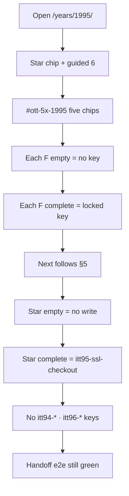

## 11. Anti

- rename AuctionWeb · second SSL star.
- Year:** 1995 · **142 HTML** · gold · do not reopen SSL cart
- Star stays:** SSL checkout · `itt95-ssl-checkout` · name+card+city; empty never writes
- Do not invent:** AuctionWeb as eBay · second SSL star · Pez-dispenser origin myth (eBay Inc says fabricated)
- | 28 | Stackscale AltaVista anniversary (do not use 15 Sep as public) | F3 honesty | https://www.stackscale.com/blog/altavista-25-anniversary/ |
- F-loop keys (do not rename)
- | F1 Homestead | `itt95-homestead` | empty title never writes |
- | F2 AuctionWeb bid | `itt95-aw-bid` | low-bid confirm · never say eBay |
- | F3 AltaVista catalog | `itt95-av` | empty query never writes |
- | Star SSL | `itt95-ssl-checkout` | name+card+city · empty never writes · view only from F5 |
- Do not rebuild the gold star. Do not reopen this year as broken.
- No 7th guided `<li>`. No invented brand pixels. No renamed keys.
- Do not let 5× Next replace the year-to-year handoff.

---

# 1996 · **do not reopen as broken**

**Period verb:** portal homepage is the start  
**Model / wave / HTML:** Gold · W6 · 103 HTML  
**Star (locked):** `years/1996/sites/portals/wars.html` · `itt96-portal-wars`  
**Isolation:** do not write itt95-* · itt97-*  
**Rooms on disk now:** 21  
**Research URLs recorded:** 55 · **Harvest rows:** 28 · **Source files tagged 1996:** 10

## 0. Lock — what must stay green before any edit

| Lock | Rule |
|------|------|
| Star href | `years/1996/sites/portals/wars.html` — do not retarget `data-ott-one-thing` |
| Star key | `itt96-portal-wars` — empty still never writes |
| Guided | `#ott-guided-1996 ol li` count **6** |
| Prefix | `itt96-*` only |
| Neighbor | itt95-* · itt97-* |
| Existing e2e | `e2e/one-thing-per-year.spec.js --grep 1996` |
| Handoff | `e2e/year-handoff-flows.spec.js` pair that includes this year |
| Lean / forest | Reuse folders. Do not prune unless named. |
| Gold | Deepen + link only. Do not rebuild the star machine. |

### Phase 0 — prove the year is still playable (do this first)

1. Open `/years/1996/`. Shell chrome loads. Iframe home is this year.
2. Count guided `<ol>` items = 6.
3. Click the star chip. Land on `years/1996/sites/portals/wars.html`.
4. Star empty save writes nothing.
5. Star complete still writes `itt96-portal-wars`.
6. Run the existing e2e in the lock table. All green. **Only then start F1.**

## 1. Scale datapoints

| Datapoint | Value | Source |
|-----------|-------|--------|
| Websites June 1996 | 257,601 | https://www.internetlivestats.com/total-number-of-websites/ |
| Users June 1996 | 77,433,860 | same table — do not blend Pingdom Dec |
| Dual-cite | Hobbes / Gray / Pingdom growth series | label December separately |

## 2. Period session — the exact flow people ran

This is the year-true night, independent of 5×. 5× loops must **feel like this session**, not like a modern product tour.

### 1996 — portal is the homepage

**Exact flow**

1. Dial or stay on AOL.  
2. Browser **home button = Yahoo or Excite or Netscape**, not a blank page.  
3. Check mail (Hotmail Jul 1996) · personalize “My Yahoo / My Excite.”  
4. Optional: Space Jam (site-as-movie) · RealPlayer buffer · Angelfire page.  
5. You do **not** start at a search-only box. You start at a **portal**.

**Mass top 10 (June 1996):** AOL, Yahoo, GeoCities, Netscape, Excite, Lycos, WebCrawler, Prodigy, Infoseek, **MSN.com**.

**On disk (18):** altavista, amazon, angelfire, aolportal, auctionweb, cnn, excite, geocities, hotmail, microsoft, netscape, playable, plugin, portals, realplayer, spacejam, theglobe, yahoo.

**Missing known:** **Prodigy** · **Infoseek** · **MSN.com** as a start page (microsoft room ≠ MSN portal) · WebCrawler (1994).

**Best add:** MSN.com start (channels) vs Yahoo. Infoseek as the “search from a portal” leftover.

---

**Disk check (live, 1996):** the “On disk / Missing” paragraphs above are from the popular-links research pass. **Live site folders now are listed in §3.** Prefer live disk over a stale missing list. Do not add a room that already exists.

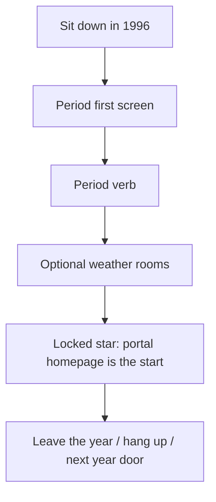

## 3. Rooms on disk right now (do not invent duplicates)

`altavista`, `amazon`, `angelfire`, `aolportal`, `auctionweb`, `cnn`, `excite`, `geocities`, `hotmail`, `infoseek`, `microsoft`, `msn`, `netscape`, `playable`, `plugin`, `portals`, `prodigy`, `realplayer`, `spacejam`, `theglobe`, `yahoo`

_21 folders under `years/1996/sites/`._ 5× F-rooms must be one of these (forest) or count against +3 (lean).

## 4. Locked 5× keys (do not rename)

| Flow | Key | Incomplete never writes |
|------|-----|-------------------------|
| F1 My portal | `itt96-myportal` | 0–1 widget move never writes |
| F2 HoTMaiL compose | `itt96-hotmail` | empty To/body never writes |
| F3 Space Jam 3 planets | `itt96-jam` | fewer than 3 planets no write |
| F4 RealPlayer buffer | `itt96-real` | skip-bar never writes |
| F5 Guestbook | `itt96-gb` | name shorter than 2 never writes |
| Star portal wars | `itt96-portal-wars` | fewer than 3 portal hits no write |

**Next chain: My portal → HoTMaiL → Space Jam → RealPlayer → guestbook → portal wars (star).**

## 5. Whole 5× flow diagram

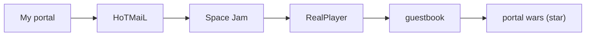

Hidden Next: `[data-next-flow]` / `[data-itt96-next]` is invisible until that room’s key exists. After save **and** on reload if the key is already set, the chip is visible and its first href is a **live** `1996` room.

## 6. Every possible way through this year


| Way | Steps | Write | Next |
|-----|-------|-------|------|
| Star only | Home → star → empty | none | none |
| Star only complete | Home → star → complete | `itt96-portal-wars` | year handoff, not 5× |
| F incomplete | Chip or href → empty/skip | none | hidden |
| F complete | Required fields / checks / timer | that F key | next F |
| Full 5× | F1…F5 complete then star | five F keys + star key | star last |
| Mid-chain reload | Complete F2, reload, go home | F2 remains | F3 only from F2 |
| Isolation fail | Any write to neighbor prefix | **bug — revert** | — |

## 7. Phases and minute steps

### Phase R0 — research · `[x]` 2026-08-15

Harvest file: [`1996-5X-HARVEST.md`](1996-5X-HARVEST.md). Corpus URLs are §9. Do not invent June counts. Do not start product HTML in a research-only pass.

### Phase F — five REAL loops (one at a time)

### F1 My portal · `itt96-myportal` · `[ ]`

Move **2** widgets on Yahoo My **or** Excite My. Persist layout. 0–1 move no write. Next → HoTMaiL.

### F2 HoTMaiL compose · `itt96-hotmail` · `[ ]`

Compose → inbox persist. Empty To/body blocked. Logout still clears (existing e2e). Next → Space Jam.

### F3 Space Jam 3 planets · `itt96-jam` · `[ ]`

Three planet pages then write. Next → RealPlayer.

### F4 RealPlayer buffer · `itt96-real` · `[ ]`

Buffer theater completes then write. Skip-bar no write. Next → guestbook.

### F5 Guestbook · `itt96-gb` · `[ ]`

Name min 2. Next → portal wars (star).

**Do this for each F, in chain order:**

1. `ls years/1996/sites/<room>`. If missing and the year is lean, the new HTML counts against +3. If forest, reuse.
2. Re-confirm star href on `years/1996/pages/home.html`.
3. Wire empty / skip / 0–1 checks → visible error → `return` before `setItem`.
4. Complete → `itt96-…` JSON `{ multiStep:true, real:true, year:"1996", ts, … }`.
5. Reload the job page: the work is still there.
6. Reveal Next to the **next node in §5 only**.
7. Run existing year e2e. If red, fix before the next F.
8. `localStorage` / `sessionStorage`: no keys matching itt95-* · itt97-*.

### Phase L — links (only after F1–F5)

1. `years/1996/pages/home.html` — `#ott-5x-1996` with five chips. **Not** inside guided `<ol>`.
2. Each chip `data-trail-keys` equals the locked F key.
3. `js/config/flow-maps.js` — branch `5× F1–F5` for 1996.
4. `js/config/1996.js` urlMap / titleMap only if a dest is new.
5. One in-room href F1→F2 that is not the Next chip.
6. All hrefs `sites/…`.

### Phase T — tests

```bash
python3 scripts/check-all-years.py
python3 scripts/audit-internal-links.py
npx playwright test e2e/one-thing-per-year.spec.js --grep 1996 --workers=1
npx playwright test e2e/year-handoff-flows.spec.js --grep 1996 --workers=1
npx playwright test e2e/1996-5x-live.spec.js --workers=1
```

Live spec must cover P1–P7: incomplete, complete, reload, Next href 200, star still writes, neighbor prefix absent.

## 8. Harvest datapoints (every 5× R0 row)

| # | Date / beat | Use | URL |
|--:|-------------|-----|-----|
| 1 | Space Jam 1996 site still live | F3 | https://www.spacejam.com/1996/ |
| 2 | Space Jam 1996 index2 / planets | F3 | https://www.spacejam.com/1996/index2.html |
| 3 | Polygon 1996 site still online | F3 | https://www.polygon.com/2021/4/5/22368177/space-jam-website-original-1996-version-easter-egg/ |
| 4 | 4 Jul 1996 · HoTMaiL launch (Bhatia / Smith) | F2 | https://en.wikipedia.org/wiki/Sabeer_Bhatia |
| 5 | HoTMaiL HTML homage / Independence Day | F2 | https://www.innovatorsunder35.com/the-list/sabeer-bhatia/ |
| 6 | My Yahoo 1996 personalization | F1 | https://en.wikipedia.org/wiki/Yahoo! |
| 7 | WA Yahoo 1996 directory | F1 | https://web.archive.org/web/19961220154510/http://www.yahoo.com/ |
| 8 | Excite My / portal wars residual | F1 | https://en.wikipedia.org/wiki/Excite |
| 9 | RealPlayer / RealAudio buffer era | F4 | https://en.wikipedia.org/wiki/RealPlayer |
| 10 | WA RealAudio class | F4 | https://web.archive.org/web/19961219000000/http://www.realaudio.com/ |
| 11 | Guestbook culture 1996 | F5 | https://en.wikipedia.org/wiki/Guestbook |
| 12 | Live Stats June websites 257,601 | scale | https://www.internetlivestats.com/total-number-of-websites/ |
| 13 | Live Stats users 77,433,860 | scale | https://www.internetlivestats.com/total-number-of-websites/ |
| 14 | Pingdom growth dual-cite | scale | https://www.pingdom.com/blog/internet-2010-in-numbers/ |
| 15 | Hobbes Internet Timeline | scale | https://www.zakon.org/robert/internet/timeline/ |
| 16 | Matthew Gray MIT | scale | https://www.mit.edu/people/mkgray/growth/ |
| 17 | eBay Inc 1996 first employee / $7.2M GMV | residual | https://www.ebayinc.com/company/our-history/ |
| 18 | Netscape still browser default residual | residual | https://en.wikipedia.org/wiki/Netscape |
| 19 | Cybercultural 1996 internet | residual | https://cybercultural.com/p/internet-1996/ |
| 20 | Hotmail Wikipedia service page | F2 residual | https://en.wikipedia.org/wiki/Outlook.com |
| 21 | Space Jam 2021 sequel forwards to /1996 | F3 residual | https://www.spacejam.com/ |
| 22 | Reddit 90s still-online thread | F3 residual | https://www.reddit.com/r/90s/comments/1i8kvcw/space_jam_website_from_1996_is_still_online/ |
| 23 | Live Stats users page | scale | https://www.internetlivestats.com/internet-users/ |
| 24 | GNN / O’Reilly residual | residual | https://en.wikipedia.org/wiki/Global_Network_Navigator |
| 25 | HotWired still publishing 1996 residual | residual | https://en.wikipedia.org/wiki/HotWired |
| 26 | Lycos 1996 residual | residual | https://en.wikipedia.org/wiki/Lycos |
| 27 | Webcrawler residual | residual | https://en.wikipedia.org/wiki/WebCrawler |
| 28 | CERN first site still live | residual | http://info.cern.ch/hypertext/WWW/TheProject.html |

## 9. Every recorded research URL for this year

Unique http(s) URLs found in files named or filed under 1996 (research MDs, visit logs, capture notes, harvests). De-duped. Implementers do not drop a row.

| # | URL |
|--:|-----|
| 1 | http://209.1.112.251/hotmail_logo.gif` |
| 2 | http://hotmail.com` |
| 3 | http://info.cern.ch/hypertext/WWW/TheProject.html |
| 4 | http://www.icq.com/` |
| 5 | http://www.museum.edu/1996/planet-hop.html` |
| 6 | http://www.yahoo.com/images/cat3.gif` |
| 7 | https://blog.geocities.institute/ |
| 8 | https://browsers.evolt.org/ |
| 9 | https://cybercultural.com/p/1996-flash-css-web-design/ |
| 10 | https://cybercultural.com/p/1996-netscape-lays-the-groundwork-for-web-applications/ |
| 11 | https://cybercultural.com/p/internet-1996/ |
| 12 | https://cybercultural.com/p/internet-1997/ |
| 13 | https://en.wikipedia.org/wiki/Excite |
| 14 | https://en.wikipedia.org/wiki/Global_Network_Navigator |
| 15 | https://en.wikipedia.org/wiki/Guestbook |
| 16 | https://en.wikipedia.org/wiki/HotWired |
| 17 | https://en.wikipedia.org/wiki/Lycos |
| 18 | https://en.wikipedia.org/wiki/Netscape |
| 19 | https://en.wikipedia.org/wiki/Outlook.com |
| 20 | https://en.wikipedia.org/wiki/RealPlayer |
| 21 | https://en.wikipedia.org/wiki/Sabeer_Bhatia |
| 22 | https://en.wikipedia.org/wiki/WebCrawler |
| 23 | https://en.wikipedia.org/wiki/Yahoo! |
| 24 | https://guidebookgallery.org/screenshots/win95 |
| 25 | https://thehistoryoftheweb.com/browser-wars/ |
| 26 | https://thehistoryoftheweb.com/timeline/ |
| 27 | https://web.archive.org/web/19961219000000/http://www.realaudio.com/ |
| 28 | https://web.archive.org/web/19961220154510/http://www.yahoo.com/ |
| 29 | https://web.archive.org/web/19971210072826/http://www.icq.com/ |
| 30 | https://web.archive.org/web/19971210171246/http://hotmail.com |
| 31 | https://web.archive.org/web/19971210171246id_/http://hotmail.com/ |
| 32 | https://www.ebayinc.com/company/our-history/ |
| 33 | https://www.innovatorsunder35.com/the-list/sabeer-bhatia/ |
| 34 | https://www.internetlivestats.com/internet-users/ |
| 35 | https://www.internetlivestats.com/total-number-of-websites/ |
| 36 | https://www.mit.edu/people/mkgray/growth/ |
| 37 | https://www.pingdom.com/blog/internet-2010-in-numbers/ |
| 38 | https://www.polygon.com/2021/4/5/22368177/space-jam-website-original-1996-version-easter-egg/ |
| 39 | https://www.reddit.com/r/90s/comments/1i8kvcw/space_jam_website_from_1996_is_still_online/ |
| 40 | https://www.spacejam.com/ |
| 41 | https://www.spacejam.com/1996/ |
| 42 | https://www.spacejam.com/1996/** |
| 43 | https://www.spacejam.com/1996/cmp/sitemap.html |
| 44 | https://www.spacejam.com/1996/img/ |
| 45 | https://www.spacejam.com/1996/index2.html |
| 46 | https://www.versionmuseum.com/history-of/amazon-website |
| 47 | https://www.versionmuseum.com/history-of/yahoo-website |
| 48 | https://www.w3.org/press-releases/1996/css1-rec/ |
| 49 | https://www.webdesignmuseum.org/gallery |
| 50 | https://www.webdesignmuseum.org/gallery/geocities-1996 |
| 51 | https://www.webdesignmuseum.org/gallery/yahoo-1996 |
| 52 | https://www.webdesignmuseum.org/gallery/year-1996 |
| 53 | https://www.webdesignmuseum.org/gallery/year-1997 |
| 54 | https://www.webdesignmuseum.org/software/internet-explorer-3-0-in-1996 |
| 55 | https://www.zakon.org/robert/internet/timeline/ |

_55 URLs._

### Research files these URLs came from

| File | URLs in file | Bytes |
|------|-------------:|------:|
| `docs/1996-1997-DEEP-RESEARCH-AUDIT-2026-07-29.md` | 11 | 18384 |
| `docs/1996-1997-IMPLEMENTATION-PHASES.md` | 15 | 25405 |
| `docs/1996-5X-HARVEST.md` | 27 | 3897 |
| `docs/1996-AUTHENTICITY-RESEARCH.md` | 8 | 6916 |
| `docs/1996-MUSEUM-GRADE.md` | 0 | 1340 |
| `docs/1996-RESEARCH.md` | 15 | 23776 |
| `docs/GAMES-PER-YEAR/YEAR-1996.md` | 1 | 4377 |
| `docs/TO-100-PERCENT/YEAR-1996.md` | 3 | 6417 |
| `docs/references/1996/ASSETS.md` | 0 | 446 |
| `docs/references/1996/CAPTURE-LOG.md` | 3 | 2758 |

## 10. Verify diagram (walk after implement)

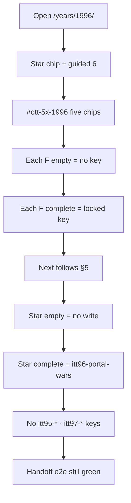

## 11. Anti

- 7th guided li · AuctionWeb-as-eBay.
- Do not invent:** 7th guided li · AuctionWeb-as-eBay · Space Jam sequel skin
- F-loop keys (do not rename)
- | F1 My portal | `itt96-myportal` | 0–1 widget move never writes |
- | F2 HoTMaiL compose | `itt96-hotmail` | empty To/body never writes |
- | F4 RealPlayer buffer | `itt96-real` | skip-bar never writes |
- | F5 Guestbook | `itt96-gb` | name shorter than 2 never writes |
- Do not rebuild the gold star. Do not reopen this year as broken.
- No 7th guided `<li>`. No invented brand pixels. No renamed keys.
- Do not let 5× Next replace the year-to-year handoff.

---

# 1997 · **do not reopen as broken**

**Period verb:** push desktop + bid + webmail  
**Model / wave / HTML:** Gold · W6 · 89 HTML  
**Star (locked):** `years/1997/sites/pointcast/` · `itt97-pointcast`  
**Isolation:** do not write itt96-* · itt98-*  
**Rooms on disk now:** 25  
**Research URLs recorded:** 45 · **Harvest rows:** 28 · **Source files tagged 1997:** 11

## 0. Lock — what must stay green before any edit

| Lock | Rule |
|------|------|
| Star href | `years/1997/sites/pointcast/` — do not retarget `data-ott-one-thing` |
| Star key | `itt97-pointcast` — empty still never writes |
| Guided | `#ott-guided-1997 ol li` count **6** |
| Prefix | `itt97-*` only |
| Neighbor | itt96-* · itt98-* |
| Existing e2e | `e2e/1997-icq-real.spec.js` · `e2e/1997-hotmail.spec.js` · `e2e/one-thing-per-year.spec.js --grep 1997` |
| Handoff | `e2e/year-handoff-flows.spec.js` pair that includes this year |
| Lean / forest | Reuse folders. Do not prune unless named. |
| Gold | Deepen + link only. Do not rebuild the star machine. |

### Phase 0 — prove the year is still playable (do this first)

1. Open `/years/1997/`. Shell chrome loads. Iframe home is this year.
2. Count guided `<ol>` items = 6.
3. Click the star chip. Land on `years/1997/sites/pointcast/`.
4. Star empty save writes nothing.
5. Star complete still writes `itt97-pointcast`.
6. Run the existing e2e in the lock table. All green. **Only then start F1.**

## 1. Scale datapoints

| Datapoint | Value | Source |
|-----------|-------|--------|
| Websites June 1997 | 1,117,255 | https://www.internetlivestats.com/total-number-of-websites/ |
| Users June 1997 | 120,758,310 | same table — do not blend Pingdom Dec |
| Dual-cite | Hobbes / Gray / Pingdom growth series | label December separately |

## 2. Period session — the exact flow people ran

This is the year-true night, independent of 5×. 5× loops must **feel like this session**, not like a modern product tour.

### 1997 — push + webmail + auction

**Exact flow**

1. Boot: PointCast (or similar) may already be **pushing** headlines on the desktop.  
2. Open Netscape/IE → portal.  
3. Hotmail in a window · ICQ/AIM buddy list stays up.  
4. eBay: search → bid → watch (not one-click buy).  
5. Slashdot / Drudge as “what the net is talking about.”  
6. Winamp + a downloaded MP3 is a **file**, not a stream.

**Mass top 10 (June 1997):** AOL, Yahoo, **MSN**, GeoCities, Excite, Lycos, Netscape, Prodigy, Infoseek, **BBC**.

**On disk (20):** aim, altavista, amazon, apple, cnn, drudge, ebay, geocities, hotbot, hotmail, icq, javaplugin, microsoft, netscape, playable, pointcast, scripting, slashdot, winamp, yahoo.

**Missing known:** **AOL.com** · **MSN.com** · **Excite** · **Lycos** · **BBC News** (bbc.com 1997 class) · Prodigy · Infoseek.

**Best add:** MSN.com portal · BBC News one-story · AOL mail residual. Do not reopen PointCast as broken (gold).

---

**Disk check (live, 1997):** the “On disk / Missing” paragraphs above are from the popular-links research pass. **Live site folders now are listed in §3.** Prefer live disk over a stale missing list. Do not add a room that already exists.

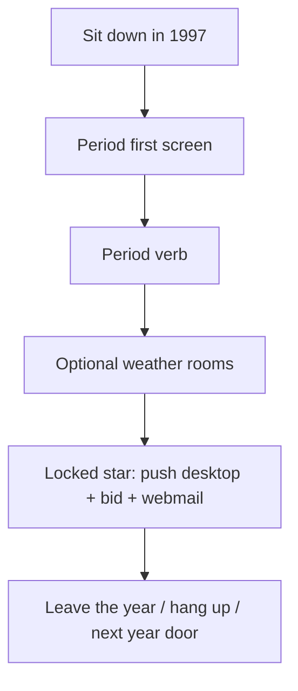

## 3. Rooms on disk right now (do not invent duplicates)

`aim`, `altavista`, `amazon`, `aol`, `apple`, `bbc`, `cnn`, `drudge`, `ebay`, `excite`, `geocities`, `hotbot`, `hotmail`, `icq`, `javaplugin`, `lycos`, `microsoft`, `msn`, `netscape`, `playable`, `pointcast`, `scripting`, `slashdot`, `winamp`, `yahoo`

_25 folders under `years/1997/sites/`._ 5× F-rooms must be one of these (forest) or count against +3 (lean).

## 4. Locked 5× keys (do not rename)

| Flow | Key | Incomplete never writes |
|------|-----|-------------------------|
| F1 Slashdot moderate | `itt97-slashdot` | empty comment never writes |
| F2 eBay bid | `itt97-ebay-bid` | no confirm never writes · black wordmark |
| F3 ICQ buddy | `itt97-icq-buddy` | empty UIN never writes |
| F4 Think Different | `itt97-td` | fewer than 2 product hops no write |
| F5 Drudge story | `itt97-drudge` | no headline open no write |
| Star PointCast | `itt97-pointcast` | fewer than 2 channels no write |

**Next chain: Slashdot → eBay → ICQ → Think Different → Drudge → PointCast (star).**

## 5. Whole 5× flow diagram

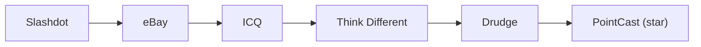

Hidden Next: `[data-next-flow]` / `[data-itt97-next]` is invisible until that room’s key exists. After save **and** on reload if the key is already set, the chip is visible and its first href is a **live** `1997` room.

## 6. Every possible way through this year

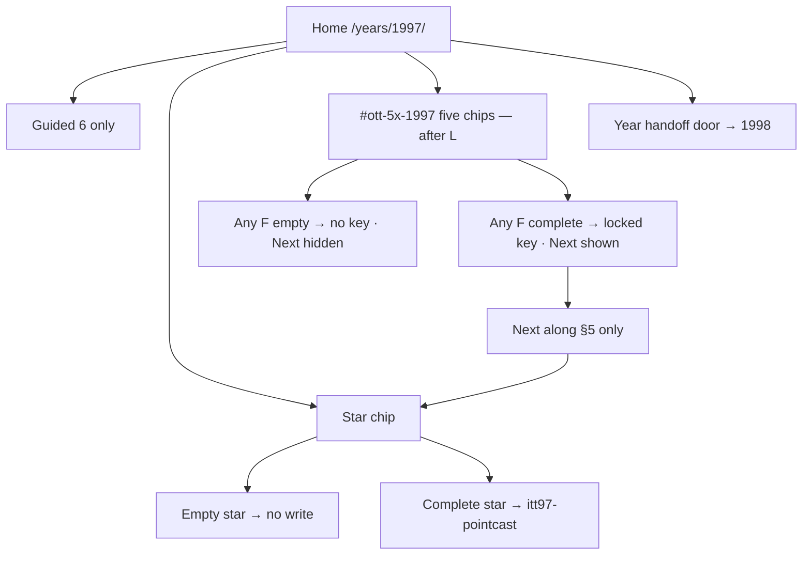

| Way | Steps | Write | Next |
|-----|-------|-------|------|
| Star only | Home → star → empty | none | none |
| Star only complete | Home → star → complete | `itt97-pointcast` | year handoff, not 5× |
| F incomplete | Chip or href → empty/skip | none | hidden |
| F complete | Required fields / checks / timer | that F key | next F |
| Full 5× | F1…F5 complete then star | five F keys + star key | star last |
| Mid-chain reload | Complete F2, reload, go home | F2 remains | F3 only from F2 |
| Isolation fail | Any write to neighbor prefix | **bug — revert** | — |

## 7. Phases and minute steps

### Phase R0 — research · `[x]` 2026-08-15

Harvest file: [`1997-5X-HARVEST.md`](1997-5X-HARVEST.md). Corpus URLs are §9. Do not invent June counts. Do not start product HTML in a research-only pass.

### Phase F — five REAL loops (one at a time)

### F1 Slashdot moderate · `itt97-slashdot` · `[ ]`

Comment → score → moderate persist. Empty comment blocked. Next → eBay.

### F2 eBay bid · `itt97-ebay-bid` · `[ ]`

Bid confirm. Black wordmark (not modern multicolor). Next → ICQ.

### F3 ICQ buddy · `itt97-icq-buddy` · `[ ]`

Add buddy persist (`icq/` multipage exists). Next → Think Different.

### F4 Think Different · `itt97-td` · `[ ]`

Product hop 2 pages. Next → Drudge.

### F5 Drudge story · `itt97-drudge` · `[ ]`

Headline → story persist. Next → PointCast (star).

**Do this for each F, in chain order:**

1. `ls years/1997/sites/<room>`. If missing and the year is lean, the new HTML counts against +3. If forest, reuse.
2. Re-confirm star href on `years/1997/pages/home.html`.
3. Wire empty / skip / 0–1 checks → visible error → `return` before `setItem`.
4. Complete → `itt97-…` JSON `{ multiStep:true, real:true, year:"1997", ts, … }`.
5. Reload the job page: the work is still there.
6. Reveal Next to the **next node in §5 only**.
7. Run existing year e2e. If red, fix before the next F.
8. `localStorage` / `sessionStorage`: no keys matching itt96-* · itt98-*.

### Phase L — links (only after F1–F5)

1. `years/1997/pages/home.html` — `#ott-5x-1997` with five chips. **Not** inside guided `<ol>`.
2. Each chip `data-trail-keys` equals the locked F key.
3. `js/config/flow-maps.js` — branch `5× F1–F5` for 1997.
4. `js/config/1997.js` urlMap / titleMap only if a dest is new.
5. One in-room href F1→F2 that is not the Next chip.
6. All hrefs `sites/…`.

### Phase T — tests

```bash
python3 scripts/check-all-years.py
python3 scripts/audit-internal-links.py
npx playwright test e2e/1997-icq-real.spec.js --workers=1
npx playwright test e2e/1997-hotmail.spec.js --workers=1
npx playwright test e2e/one-thing-per-year.spec.js --grep 1997 --workers=1
npx playwright test e2e/year-handoff-flows.spec.js --grep 1997 --workers=1
npx playwright test e2e/1997-5x-live.spec.js --workers=1
```

Live spec must cover P1–P7: incomplete, complete, reload, Next href 200, star still writes, neighbor prefix absent.

## 8. Harvest datapoints (every 5× R0 row)

| # | Date / beat | Use | URL |
|--:|-------------|-----|-----|
| 1 | 5 Oct 1997 · Slashdot / Chips & Dips | F1 | https://en.wikipedia.org/wiki/Slashdot |
| 2 | Rob Malda CmdrTaco founder class | F1 | https://www.linkedin.com/in/robmalda |
| 3 | Sep 1997 · AuctionWeb renamed eBay | F2 | https://www.ebayinc.com/company/our-history/ |
| 4 | Q2 1997 · Feedback Forum | F2 residual | https://www.ebayinc.com/company/our-history/ |
| 5 | 1997 · Beanie Babies craze on eBay | F2 residual | https://www.ebayinc.com/company/our-history/ |
| 6 | Think Different 1997 TBWA\Chiat\Day | F4 | https://en.wikipedia.org/wiki/Think_different |
| 7 | Think Different original ad copy | F4 | https://www.thecrazyones.it/spot-en.html |
| 8 | Creative Review Think Different history | F4 | https://www.creativereview.co.uk/apple-think-different-slogan/ |
| 9 | ICQ 1996–97 buddy list mass | F3 | https://en.wikipedia.org/wiki/ICQ |
| 10 | Drudge Report 1997 | F5 | https://en.wikipedia.org/wiki/Drudge_Report |
| 11 | PointCast push 1996–97 star residual | star | https://en.wikipedia.org/wiki/PointCast_(dotcom) |
| 12 | Live Stats June websites 1,117,255 | scale | https://www.internetlivestats.com/total-number-of-websites/ |
| 13 | Live Stats users 120,758,310 | scale | https://www.internetlivestats.com/total-number-of-websites/ |
| 14 | Live Stats launched Yandex / Netflix 1997 | residual | https://www.internetlivestats.com/total-number-of-websites/ |
| 15 | Pingdom dual-cite | scale | https://www.pingdom.com/blog/internet-2010-in-numbers/ |
| 16 | Hobbes Timeline | scale | https://www.zakon.org/robert/internet/timeline/ |
| 17 | Matthew Gray MIT | scale | https://www.mit.edu/people/mkgray/growth/ |
| 18 | Babel Fish is Dec 1997 (1998 F1, residual here) | residual | https://en.wikipedia.org/wiki/Babel_Fish_(website) |
| 19 | eBay millionth item / Big Bird jack-in-box | F2 residual | https://www.ebayinc.com/company/our-history/ |
| 20 | Cybercultural 1997 internet | residual | https://cybercultural.com/p/internet-1997/ |
| 21 | Apple 1997 Jobs return residual | residual | https://www.apple.com/newsroom/ |
| 22 | Jim Rutt / Malda Slashdot story | F1 residual | https://jimruttshow.blubrry.net/the-jim-rutt-show-transcripts/transcript-of-currents-013-rob-malda-on-the-slashdot-story/ |
| 23 | Live Stats users page | scale | https://www.internetlivestats.com/internet-users/ |
| 24 | Netscape still fighting IE residual | residual | https://en.wikipedia.org/wiki/Browser_wars |
| 25 | Hotmail still independent 1997 residual | residual | https://en.wikipedia.org/wiki/Outlook.com |
| 26 | Amazon still bookstore residual | residual | https://en.wikipedia.org/wiki/History_of_Amazon |
| 27 | WA Slashdot 1998 class (1997 launch) | F1 residual | https://web.archive.org/web/19980101000000/http://slashdot.org/ |
| 28 | Blue Ocean Think Different essay | F4 residual | https://www.blueoceanstrategy.com/blog/think-different-apple/ |

## 9. Every recorded research URL for this year

Unique http(s) URLs found in files named or filed under 1997 (research MDs, visit logs, capture notes, harvests). De-duped. Implementers do not drop a row.

| # | URL |
|--:|-----|
| 1 | http://hotmail.com` |
| 2 | http://www.icq.com/` |
| 3 | http://…` |
| 4 | https://browsers.evolt.org/ |
| 5 | https://cybercultural.com/ |
| 6 | https://cybercultural.com/p/1996-flash-css-web-design/ |
| 7 | https://cybercultural.com/p/internet-1996/ |
| 8 | https://cybercultural.com/p/internet-1997/ |
| 9 | https://en.wikipedia.org/wiki/Babel_Fish_(website |
| 10 | https://en.wikipedia.org/wiki/Browser_wars |
| 11 | https://en.wikipedia.org/wiki/Drudge_Report |
| 12 | https://en.wikipedia.org/wiki/History_of_Amazon |
| 13 | https://en.wikipedia.org/wiki/ICQ |
| 14 | https://en.wikipedia.org/wiki/Outlook.com |
| 15 | https://en.wikipedia.org/wiki/PointCast_(dotcom |
| 16 | https://en.wikipedia.org/wiki/Slashdot |
| 17 | https://en.wikipedia.org/wiki/Think_different |
| 18 | https://guidebookgallery.org/screenshots/win95 |
| 19 | https://jimruttshow.blubrry.net/the-jim-rutt-show-transcripts/transcript-of-currents-013-rob-malda-on-the-slashdot-story/ |
| 20 | https://thehistoryoftheweb.com/browser-wars/ |
| 21 | https://web.archive.org/ |
| 22 | https://web.archive.org/web/19971210072826/http://www.icq.com/ |
| 23 | https://web.archive.org/web/19971210171246/http://hotmail.com |
| 24 | https://web.archive.org/web/19980101000000/http://slashdot.org/ |
| 25 | https://www.apple.com/newsroom/ |
| 26 | https://www.blueoceanstrategy.com/blog/think-different-apple/ |
| 27 | https://www.creativereview.co.uk/apple-think-different-slogan/ |
| 28 | https://www.ebayinc.com/company/our-history/ |
| 29 | https://www.internetlivestats.com/internet-users/ |
| 30 | https://www.internetlivestats.com/total-number-of-websites/ |
| 31 | https://www.linkedin.com/in/robmalda |
| 32 | https://www.mit.edu/people/mkgray/growth/ |
| 33 | https://www.pingdom.com/blog/internet-2010-in-numbers/ |
| 34 | https://www.spacejam.com/1996/ |
| 35 | https://www.spacejam.com/1996/** |
| 36 | https://www.spacejam.com/1996/cmp/sitemap.html |
| 37 | https://www.spacejam.com/1996/img/ |
| 38 | https://www.thecrazyones.it/spot-en.html |
| 39 | https://www.versionmuseum.com/history-of/amazon-website |
| 40 | https://www.versionmuseum.com/history-of/yahoo-website |
| 41 | https://www.webdesignmuseum.org/ |
| 42 | https://www.webdesignmuseum.org/gallery/yahoo-1996 |
| 43 | https://www.webdesignmuseum.org/gallery/year-1996 |
| 44 | https://www.webdesignmuseum.org/gallery/year-1997 |
| 45 | https://www.zakon.org/robert/internet/timeline/ |

_45 URLs._

### Research files these URLs came from

| File | URLs in file | Bytes |
|------|-------------:|------:|
| `docs/1996-1997-DEEP-RESEARCH-AUDIT-2026-07-29.md` | 11 | 18384 |
| `docs/1996-1997-IMPLEMENTATION-PHASES.md` | 15 | 25405 |
| `docs/1997-5X-HARVEST.md` | 23 | 4010 |
| `docs/1997-MUSEUM-GRADE.md` | 0 | 2488 |
| `docs/1997-RESEARCH.md` | 0 | 3211 |
| `docs/1997-TO-100-PIXEL-PHASES.md` | 10 | 16202 |
| `docs/GAMES-PER-YEAR/YEAR-1997.md` | 0 | 3468 |
| `docs/REMAINING-WORK-1994-1997.md` | 9 | 19039 |
| `docs/TO-100-PERCENT/YEAR-1997.md` | 0 | 8084 |
| `docs/references/1997/ASSETS.md` | 0 | 2527 |
| `docs/references/1997/CAPTURE-LOG.md` | 0 | 3468 |

## 10. Verify diagram (walk after implement)

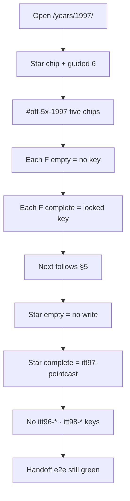

## 11. Anti

- PointCast tick overlay unless named `[~]` · IE4 OEM invent.
- | Brand wire | Amazon CONTINUITY · eBay black RECON · Yahoo WA + Jun 97 banner · Slashdot WA · Apple mark · AltaVista CONTINUITY · CNN CONTINUITY |
- | Yahoo banner | Staged Jun 1997 cat banner installed |
- Do not invent:** PointCast tick overlay unless named · IE4 OEM pixels · modern eBay rainbow mark (black wordmark)
- F-loop keys (do not rename)
- | F1 Slashdot moderate | `itt97-slashdot` | empty comment never writes |
- | F2 eBay bid | `itt97-ebay-bid` | no confirm never writes · black wordmark |
- | F3 ICQ buddy | `itt97-icq-buddy` | empty UIN never writes |
- Do not rebuild the gold star. Do not reopen this year as broken.
- No 7th guided `<li>`. No invented brand pixels. No renamed keys.
- Do not let 5× Next replace the year-to-year handoff.

---

# 1998

**Period verb:** portal night · Lucky is a trick  
**Model / wave / HTML:** Forest · W5 · 131 HTML  
**Star (locked):** `years/1998/sites/google/lucky.html` · `itt98-lucky`  
**Isolation:** do not write itt97-* · itt99-*  
**Rooms on disk now:** 38  
**Research URLs recorded:** 52 · **Harvest rows:** 28 · **Source files tagged 1998:** 12

## 0. Lock — what must stay green before any edit

| Lock | Rule |
|------|------|
| Star href | `years/1998/sites/google/lucky.html` — do not retarget `data-ott-one-thing` |
| Star key | `itt98-lucky` — empty still never writes |
| Guided | `#ott-guided-1998 ol li` count **6** |
| Prefix | `itt98-*` only |
| Neighbor | itt97-* · itt99-* |
| Existing e2e | `e2e/1998-2003-real-flows.spec.js` · `e2e/one-thing-per-year.spec.js --grep 1998` |
| Handoff | `e2e/year-handoff-flows.spec.js` pair that includes this year |
| Lean / forest | Reuse folders. Do not prune unless named. |

### Phase 0 — prove the year is still playable (do this first)

1. Open `/years/1998/`. Shell chrome loads. Iframe home is this year.
2. Count guided `<ol>` items = 6.
3. Click the star chip. Land on `years/1998/sites/google/lucky.html`.
4. Star empty save writes nothing.
5. Star complete still writes `itt98-lucky`.
6. Run the existing e2e in the lock table. All green. **Only then start F1.**

## 1. Scale datapoints

| Datapoint | Value | Source |
|-----------|-------|--------|
| Websites June 1998 | 2,410,067 | https://www.internetlivestats.com/total-number-of-websites/ |
| Users June 1998 | 188,023,930 | same table — do not blend Pingdom Dec |
| Dual-cite | Hobbes / Gray / Pingdom growth series | label December separately |

## 2. Period session — the exact flow people ran

This is the year-true night, independent of 5×. 5× loops must **feel like this session**, not like a modern product tour.

### 1998 — portal still wins; Google is a trick

**Exact flow**

1. Home is still Yahoo/AOL/MSN.  
2. Someone IMs you a **google.stanford.edu / google.com** link. You try **I'm Feeling Lucky**.  
3. You go **back to Yahoo** for the rest of the night.  
4. Optional: GoTo paid results · DMOZ volunteer category · CDNow · ICQ.

**Mass top 10 (June 1998):** AOL, Yahoo, MSN, Lycos, Excite, Netscape, GeoCities, BBC, Amazon, AmericanGreetings.

**On disk (34):** includes google, yahoo, excite, goto, dmoz, amazon, ebay, icq, netscape… **No AOL.com, no MSN.com, no Lycos, no BBC.**

**Missing known:** **AOL.com** · **MSN.com** · **Lycos** · **BBC** · AmericanGreetings (low ROI).

**Best add:** MSN start · Lycos catalog (contrast Lucky). Star stays Lucky.

---

**Disk check (live, 1998):** the “On disk / Missing” paragraphs above are from the popular-links research pass. **Live site folders now are listed in §3.** Prefer live disk over a stale missing list. Do not add a room that already exists.

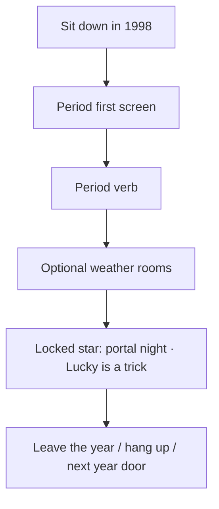

## 3. Rooms on disk right now (do not invent duplicates)

`altavista`, `amazon`, `aol`, `apple`, `bbc`, `bowienet`, `cdnow`, `cnn`, `dmoz`, `ebay`, `excite`, `gamespot`, `geocities`, `google`, `goto`, `hillmancurtis`, `hotbot`, `hotmail`, `icq`, `infoseek`, `larrypage`, `lycos`, `microsoft`, `mozilla`, `mp3com`, `msn`, `netcenter`, `netscape`, `playable`, `realplayer`, `sergeybrin`, `slashdot`, `textfiles`, `valve`, `winamp`, `winfiles`, `yahoo`, `youvegotmail`

_38 folders under `years/1998/sites/`._ 5× F-rooms must be one of these (forest) or count against +3 (lean).

## 4. Locked 5× keys (do not rename)

| Flow | Key | Incomplete never writes |
|------|-----|-------------------------|
| F1 Babel Fish | `itt98-babelfish` | empty text never writes |
| F2 Google catalog | `itt98-google-q` | empty query never writes · not Lucky |
| F3 Amazon Music CD | `itt98-amzn-cd` | no CD add never writes |
| F4 DMOZ 2-level | `itt98-dmoz` | fewer than 2 levels no write |
| F5 Mozilla split | `itt98-mozilla` | both literacy checks required |
| Star Lucky | `itt98-lucky` | empty Lucky never writes |

**Next chain: Babel Fish → Google catalog → Amazon CD → DMOZ → Mozilla → Lucky (star).**

## 5. Whole 5× flow diagram

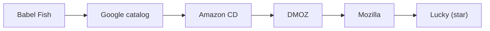

Hidden Next: `[data-next-flow]` / `[data-itt98-next]` is invisible until that room’s key exists. After save **and** on reload if the key is already set, the chip is visible and its first href is a **live** `1998` room.

## 6. Every possible way through this year

```mermaid
flowchart TD
  H[Home /years/1998/] --> G[Guided 6 only]
  H --> ST[Star chip]
  H --> C["#ott-5x-1998 five chips — after L"]
  ST --> SE[Empty star → no write]
  ST --> SC[Complete star → itt98-lucky]
  C --> Fempty[Any F empty → no key · Next hidden]
  C --> Fok[Any F complete → locked key · Next shown]
  Fok --> CHAIN[Next along §5 only]
  CHAIN --> ST
  H --> HO[Year handoff door → 1999]
```

| Way | Steps | Write | Next |
|-----|-------|-------|------|
| Star only | Home → star → empty | none | none |
| Star only complete | Home → star → complete | `itt98-lucky` | year handoff, not 5× |
| F incomplete | Chip or href → empty/skip | none | hidden |
| F complete | Required fields / checks / timer | that F key | next F |
| Full 5× | F1…F5 complete then star | five F keys + star key | star last |
| Mid-chain reload | Complete F2, reload, go home | F2 remains | F3 only from F2 |
| Isolation fail | Any write to neighbor prefix | **bug — revert** | — |

## 7. Phases and minute steps

### Phase R0 — research · `[x]` 2026-08-15

Harvest file: [`1998-5X-HARVEST.md`](1998-5X-HARVEST.md). Corpus URLs are §9. Do not invent June counts. Do not start product HTML in a research-only pass.

### Phase F — five REAL loops (one at a time)

### F1 Babel Fish · `itt98-babelfish` · `[ ]`

Type text + language pair → persist last pair+sample. Empty text blocked. Next → Google search.

### F2 Google search catalog · `itt98-google-q` · `[ ]`

Query → catalog results (not Lucky). Empty blocked. Next → Amazon CD.  
**Anti:** 2005 Google skin.

### F3 Amazon Music CD · `itt98-amzn-cd` · `[ ]`

Add CD persist. Next → DMOZ.

### F4 DMOZ 2-level drill · `itt98-dmoz` · `[ ]`

Two category levels then write. Next → Mozilla.

### F5 Mozilla split · `itt98-mozilla` · `[ ]`

netscape.org vs mozilla.org literacy 2-check. Next → Lucky (star).

**Do this for each F, in chain order:**

1. `ls years/1998/sites/<room>`. If missing and the year is lean, the new HTML counts against +3. If forest, reuse.
2. Re-confirm star href on `years/1998/pages/home.html`.
3. Wire empty / skip / 0–1 checks → visible error → `return` before `setItem`.
4. Complete → `itt98-…` JSON `{ multiStep:true, real:true, year:"1998", ts, … }`.
5. Reload the job page: the work is still there.
6. Reveal Next to the **next node in §5 only**.
7. Run existing year e2e. If red, fix before the next F.
8. `localStorage` / `sessionStorage`: no keys matching itt97-* · itt99-*.

### Phase L — links (only after F1–F5)

1. `years/1998/pages/home.html` — `#ott-5x-1998` with five chips. **Not** inside guided `<ol>`.
2. Each chip `data-trail-keys` equals the locked F key.
3. `js/config/flow-maps.js` — branch `5× F1–F5` for 1998.
4. `js/config/1998.js` urlMap / titleMap only if a dest is new.
5. One in-room href F1→F2 that is not the Next chip.
6. All hrefs `sites/…`.

### Phase T — tests

```bash
python3 scripts/check-all-years.py
python3 scripts/audit-internal-links.py
npx playwright test e2e/1998-2003-real-flows.spec.js --workers=1
npx playwright test e2e/one-thing-per-year.spec.js --grep 1998 --workers=1
npx playwright test e2e/year-handoff-flows.spec.js --grep 1998 --workers=1
npx playwright test e2e/1998-5x-live.spec.js --workers=1
```

Live spec must cover P1–P7: incomplete, complete, reload, Next href 200, star still writes, neighbor prefix absent.

## 8. Harvest datapoints (every 5× R0 row)

| # | Date / beat | Use | URL |
|--:|-------------|-----|-----|
| 1 | 9 Dec 1997 · AltaVista Babel Fish + SYSTRAN | F1 | https://en.wikipedia.org/wiki/Babel_Fish_(website) |
| 2 | MT Archive Babel Fish launch note | F1 | https://aclanthology.org/www.mt-archive.info/90/TCForum-1998-Ament.htm |
| 3 | Google.com 1998 (Live Stats launched) | F2 | https://web.archive.org/web/19981111184551/http://google.com/ |
| 4 | Google 1998 search residual | F2 | https://en.wikipedia.org/wiki/History_of_Google |
| 5 | Amazon Music / CDs 1998 catalog | F3 | https://en.wikipedia.org/wiki/History_of_Amazon |
| 6 | DMOZ / Open Directory 1998 | F4 | https://en.wikipedia.org/wiki/DMOZ |
| 7 | mozilla.org 1998 Netscape split | F5 | https://en.wikipedia.org/wiki/Mozilla |
| 8 | Netscape open-source announcement class | F5 | https://www.mozilla.org/en-US/about/history/ |
| 9 | Feb 1998 · Meg Whitman joins eBay | residual | https://www.ebayinc.com/company/our-history/ |
| 10 | May 1998 · My eBay | residual | https://www.ebayinc.com/company/our-history/ |
| 11 | Sep 1998 · eBay IPO NASDAQ | residual | https://www.ebayinc.com/company/our-history/ |
| 12 | Live Stats June websites 2,410,067 | scale | https://www.internetlivestats.com/total-number-of-websites/ |
| 13 | Live Stats users 188,023,930 | scale | https://www.internetlivestats.com/total-number-of-websites/ |
| 14 | Live Stats launched Google 1998 | F2 | https://www.internetlivestats.com/total-number-of-websites/ |
| 15 | Pingdom dual-cite | scale | https://www.pingdom.com/blog/internet-2010-in-numbers/ |
| 16 | Hobbes Timeline | scale | https://www.zakon.org/robert/internet/timeline/ |
| 17 | Matthew Gray MIT | scale | https://www.mit.edu/people/mkgray/growth/ |
| 18 | I’m Feeling Lucky 1998 costume | star | https://en.wikipedia.org/wiki/Google_Search |
| 19 | WA Google 1998 sparse | star | https://web.archive.org/web/19981202230410/http://www.google.com/ |
| 20 | Cybercultural 1998 internet | residual | https://cybercultural.com/p/internet-1998/ |
| 21 | Hotmail still pre-MSN residual | residual | https://en.wikipedia.org/wiki/Outlook.com |
| 22 | Live Stats users page | scale | https://www.internetlivestats.com/internet-users/ |
| 23 | Yahoo still directory residual | residual | https://en.wikipedia.org/wiki/Yahoo! |
| 24 | History of Domain Names Babel Fish | F1 residual | https://historyofdomainnames.com/babelfish-the-history-of-domain-names/ |
| 25 | Netscape Communicator residual | residual | https://en.wikipedia.org/wiki/Netscape_Communicator |
| 26 | Amazon associates / store residual | F3 residual | https://en.wikipedia.org/wiki/Amazon_(company) |
| 27 | Open Directory Project dmoz.org WA | F4 residual | https://web.archive.org/web/19990125085943/http://dmoz.org/ |
| 28 | eBay Foundation pre-IPO stock residual | residual | https://www.ebayinc.com/company/our-history/ |

## 9. Every recorded research URL for this year

Unique http(s) URLs found in files named or filed under 1998 (research MDs, visit logs, capture notes, harvests). De-duped. Implementers do not drop a row.

| # | URL |
|--:|-----|
| 1 | http://excite.com/` |
| 2 | http://google.com/` |
| 3 | http://home.microsoft.com/intl/web1998/ |
| 4 | http://localhost:8080/years/1998/ |
| 5 | http://www.google.com/ |
| 6 | http://www.google.com/` |
| 7 | http://www.google.com/about.html |
| 8 | http://www.google.com/search |
| 9 | http://www1.yahoo.com/` |
| 10 | https://aclanthology.org/www.mt-archive.info/90/TCForum-1998-Ament.htm |
| 11 | https://archives.iw3c2.org/www7/proceedings/1921/com1921.htm |
| 12 | https://cybercultural.com/p/1998-mozilla-w3c-dom-wasp/ |
| 13 | https://cybercultural.com/p/bowienet-launch-1998/ |
| 14 | https://cybercultural.com/p/cdnow-amazon-1998/ |
| 15 | https://cybercultural.com/p/internet-1998/ |
| 16 | https://cybercultural.com/p/internet-1999/ |
| 17 | https://cybercultural.com/p/portals-1998/ |
| 18 | https://cybercultural.com/p/search-1998/ |
| 19 | https://en.wikipedia.org/wiki/Amazon_(company |
| 20 | https://en.wikipedia.org/wiki/Babel_Fish_(website |
| 21 | https://en.wikipedia.org/wiki/DMOZ |
| 22 | https://en.wikipedia.org/wiki/Google_Search |
| 23 | https://en.wikipedia.org/wiki/History_of_Amazon |
| 24 | https://en.wikipedia.org/wiki/History_of_Google |
| 25 | https://en.wikipedia.org/wiki/Mozilla |
| 26 | https://en.wikipedia.org/wiki/Netscape_Communicator |
| 27 | https://en.wikipedia.org/wiki/Outlook.com |
| 28 | https://en.wikipedia.org/wiki/Yahoo! |
| 29 | https://historyofdomainnames.com/babelfish-the-history-of-domain-names/ |
| 30 | https://web.archive.org/ |
| 31 | https://web.archive.org/web/19980711014256/http://excite.com/ |
| 32 | https://web.archive.org/web/19981111184551/http://google.com/ |
| 33 | https://web.archive.org/web/19981202230410/http://google.com/ |
| 34 | https://web.archive.org/web/19981202230410/http://www.google.com/ |
| 35 | https://web.archive.org/web/19981212034333/http://www1.yahoo.com/ |
| 36 | https://web.archive.org/web/19990125085943/http://dmoz.org/ |
| 37 | https://web.archive.org/web/20021001071727/wp.netscape.com/newsref/pr/newsrelease558.html |
| 38 | https://www.ebayinc.com/company/our-history/ |
| 39 | https://www.internetlivestats.com/internet-users/ |
| 40 | https://www.internetlivestats.com/total-number-of-websites/ |
| 41 | https://www.mit.edu/people/mkgray/growth/ |
| 42 | https://www.mozilla.org/en-US/about/history/ |
| 43 | https://www.pingdom.com/blog/internet-2010-in-numbers/ |
| 44 | https://www.spacejam.com/1996/ |
| 45 | https://www.versionmuseum.com/history-of/amazon-website |
| 46 | https://www.versionmuseum.com/history-of/netscape-browser |
| 47 | https://www.versionmuseum.com/history-of/yahoo-website |
| 48 | https://www.w3.org/press-releases/1998/dom/ |
| 49 | https://www.webdesignmuseum.org/exhibitions/first-versions-of-popular-websites |
| 50 | https://www.webdesignmuseum.org/gallery/google-1998 |
| 51 | https://www.webdesignmuseum.org/gallery/year-1998 |
| 52 | https://www.zakon.org/robert/internet/timeline/ |

_52 URLs._

### Research files these URLs came from

| File | URLs in file | Bytes |
|------|-------------:|------:|
| `docs/1998-1999-DEEP-RESEARCH-AUDIT-2026-07-29.md` | 2 | 21446 |
| `docs/1998-1999-IMPLEMENTATION-PHASES.md` | 0 | 9101 |
| `docs/1998-5X-HARVEST.md` | 23 | 3881 |
| `docs/1998-DEEP-RESEARCH-2026-07-22.md` | 24 | 31992 |
| `docs/1998-IMPLEMENTATION-PHASES.md` | 8 | 29182 |
| `docs/1998-MUSEUM-GRADE.md` | 0 | 1311 |
| `docs/1998-QUALITY-PASS.md` | 0 | 3436 |
| `docs/1998-RESEARCH.md` | 11 | 15201 |
| `docs/GAMES-PER-YEAR/YEAR-1998.md` | 0 | 3307 |
| `docs/TO-100-PERCENT/YEAR-1998.md` | 0 | 3454 |
| `docs/references/1998/ASSETS.md` | 0 | 913 |
| `docs/references/1998/CAPTURE-LOG.md` | 0 | 2478 |

## 10. Verify diagram (walk after implement)

```mermaid
flowchart TD
  V0[Open /years/1998/] --> V1[Star chip + guided 6]
  V1 --> V2["#ott-5x-1998 five chips"]
  V2 --> V3[Each F empty = no key]
  V3 --> V4[Each F complete = locked key]
  V4 --> V5[Next follows §5]
  V5 --> V6[Star empty = no write]
  V6 --> V7[Star complete = itt98-lucky]
  V7 --> V8[No itt97-* · itt99-* keys]
  V8 --> V9[Handoff e2e still green]
```

## 11. Anti

- 2005 Google skin.
- | Bans | No Amazon smile · no multicolor eBay |
- Do not invent:** 2005 Google skin · second Lucky as catalog
- F-loop keys (do not rename)
- | F1 Babel Fish | `itt98-babelfish` | empty text never writes |
- | F2 Google catalog | `itt98-google-q` | empty query never writes · not Lucky |
- | F3 Amazon Music CD | `itt98-amzn-cd` | no CD add never writes |
- | Star Lucky | `itt98-lucky` | empty Lucky never writes |
- No 7th guided `<li>`. No invented brand pixels. No renamed keys.
- Do not let 5× Next replace the year-to-year handoff.

---

# 1999

**Period verb:** buddy list on before the browser  
**Model / wave / HTML:** Forest · W5 · 154 HTML  
**Star (locked):** `years/1999/sites/aim/` · `itt99-aim`  
**Isolation:** do not write itt98-* · itt00-*  
**Rooms on disk now:** 41  
**Research URLs recorded:** 174 · **Harvest rows:** 28 · **Source files tagged 1999:** 30

## 0. Lock — what must stay green before any edit

| Lock | Rule |
|------|------|
| Star href | `years/1999/sites/aim/` — do not retarget `data-ott-one-thing` |
| Star key | `itt99-aim` — empty still never writes |
| Guided | `#ott-guided-1999 ol li` count **6** |
| Prefix | `itt99-*` only |
| Neighbor | itt98-* · itt00-* |
| Existing e2e | `e2e/one-thing-per-year.spec.js --grep 1999` |
| Handoff | `e2e/year-handoff-flows.spec.js` pair that includes this year |
| Lean / forest | Reuse folders. Do not prune unless named. |

### Phase 0 — prove the year is still playable (do this first)

1. Open `/years/1999/`. Shell chrome loads. Iframe home is this year.
2. Count guided `<ol>` items = 6.
3. Click the star chip. Land on `years/1999/sites/aim/`.
4. Star empty save writes nothing.
5. Star complete still writes `itt99-aim`.
6. Run the existing e2e in the lock table. All green. **Only then start F1.**

## 1. Scale datapoints

| Datapoint | Value | Source |
|-----------|-------|--------|
| Websites June 1999 | 3,177,453 | https://www.internetlivestats.com/total-number-of-websites/ |
| Users June 1999 | 280,866,670 | same table — do not blend Pingdom Dec |
| Dual-cite | Hobbes / Gray / Pingdom growth series | label December separately |

## 2. Period session — the exact flow people ran

This is the year-true night, independent of 5×. 5× loops must **feel like this session**, not like a modern product tour.

### 1999 — buddy list + bubble

**Exact flow**

1. AIM (or Yahoo Messenger) signs on **before** the browser.  
2. Portal for news/mail.  
3. Napster: search a track → download a file (not a stream).  
4. Optional: Blogger publish · PayPal send · Hamster Dance novelty · Y2K countdown.  
5. GeoCities is still a **place you live**, not a joke yet (Yahoo buys it Jan 28 1999; 3rd most-visited).

**Mass top 10 (June 1999):** AOL, MSN, Yahoo, Lycos, Amazon, Excite, **About.com**, BBC, AmericanGreetings, Infospace.

**On disk (38):** aim, napster, blogger, paypal, geocities, yahoo, excite, amazon… **No AOL.com, MSN.com, About.com.**

**Missing known:** **AOL.com** · **MSN.com** · **About.com** (the “human-written directory” that ranked).

**Best add:** About.com topic page. AOL/MSN residual if 1995–98 did not already land them.

---

**Disk check (live, 1999):** the “On disk / Missing” paragraphs above are from the popular-links research pass. **Live site folders now are listed in §3.** Prefer live disk over a stale missing list. Do not add a room that already exists.

```mermaid
flowchart TD
  S0[Sit down in 1999] --> S1[Period first screen]
  S1 --> S2[Period verb]
  S2 --> S3[Optional weather rooms]
  S3 --> S4[Locked star: buddy list on before the browser]
  S4 --> S5[Leave the year / hang up / next year door]
```

## 3. Rooms on disk right now (do not invent duplicates)

`about`, `aim`, `altavista`, `amazon`, `aol`, `apple`, `askjeeves`, `blogger`, `boocom`, `bowienet`, `cnn`, `dmoz`, `ebay`, `etrade`, `excite`, `flash4`, `gamespot`, `geocities`, `google`, `hampsterdance`, `hotbot`, `icq`, `infoseek`, `matrix`, `microsoft`, `msn`, `msngaming`, `mynetscape`, `napster`, `netcenter`, `netscape`, `paypal`, `playable`, `slashdot`, `sourceforge`, `webvan`, `y2k`, `yahoo`, `yahoomessenger`, `youvegotmail`, `zombo`

_41 folders under `years/1999/sites/`._ 5× F-rooms must be one of these (forest) or count against +3 (lean).

## 4. Locked 5× keys (do not rename)

| Flow | Key | Incomplete never writes |
|------|-----|-------------------------|
| F1 Napster search | `itt99-napster` | empty query never writes · zero-file honesty · no files |
| F2 Blogger permalink | `itt99-blogger` | empty publish never writes |
| F3 PayPal send residual | `itt99-paypal` | amount+name theater · **no money** |
| F4 eBay watch | `itt99-ebay` | no watch persist never writes |
| F5 Y2K literacy | `itt99-y2k` | both checks required |
| Star AIM | `itt99-aim` | empty SN never writes |

**Next chain: Napster → Blogger → PayPal → eBay watch → Y2K → AIM (star).**

## 5. Whole 5× flow diagram

```mermaid
flowchart LR
  Y19990_Napster["Napster"]
  Y19991_Blogger["Blogger"]
  Y19992_PayPal["PayPal"]
  Y19993_eBaywatch["eBay watch"]
  Y19994_Y2K["Y2K"]
  Y19995_AIMstar["AIM (star)"]
  Y19990_Napster --> Y19991_Blogger
  Y19991_Blogger --> Y19992_PayPal
  Y19992_PayPal --> Y19993_eBaywatch
  Y19993_eBaywatch --> Y19994_Y2K
  Y19994_Y2K --> Y19995_AIMstar
```

Hidden Next: `[data-next-flow]` / `[data-itt99-next]` is invisible until that room’s key exists. After save **and** on reload if the key is already set, the chip is visible and its first href is a **live** `1999` room.

## 6. Every possible way through this year

```mermaid
flowchart TD
  H[Home /years/1999/] --> G[Guided 6 only]
  H --> ST[Star chip]
  H --> C["#ott-5x-1999 five chips — after L"]
  ST --> SE[Empty star → no write]
  ST --> SC[Complete star → itt99-aim]
  C --> Fempty[Any F empty → no key · Next hidden]
  C --> Fok[Any F complete → locked key · Next shown]
  Fok --> CHAIN[Next along §5 only]
  CHAIN --> ST
  H --> HO[Year handoff door → 2000]
```

| Way | Steps | Write | Next |
|-----|-------|-------|------|
| Star only | Home → star → empty | none | none |
| Star only complete | Home → star → complete | `itt99-aim` | year handoff, not 5× |
| F incomplete | Chip or href → empty/skip | none | hidden |
| F complete | Required fields / checks / timer | that F key | next F |
| Full 5× | F1…F5 complete then star | five F keys + star key | star last |
| Mid-chain reload | Complete F2, reload, go home | F2 remains | F3 only from F2 |
| Isolation fail | Any write to neighbor prefix | **bug — revert** | — |

## 7. Phases and minute steps

### Phase R0 — research · `[x]` 2026-08-15

Harvest file: [`1999-5X-HARVEST.md`](1999-5X-HARVEST.md). Corpus URLs are §9. Do not invent June counts. Do not start product HTML in a research-only pass.

### Phase F — five REAL loops (one at a time)

### F1 Napster search · `itt99-napster` · `[ ]`

Query → zero-file honesty → library residual. Empty query blocked. Next → Blogger.

### F2 Blogger permalink · `itt99-blogger` · `[ ]`

Publish → permalink persist. Next → PayPal.

### F3 PayPal send residual · `itt99-paypal` · `[ ]`

Amount+name theater. **No money.** Next → eBay.

### F4 eBay watch · `itt99-ebay` · `[ ]`

Browse + watch persist. Next → Y2K.

### F5 Y2K literacy · `itt99-y2k` · `[ ]`

2 checks. Zombo/Hampster weather only. Next → AIM (star).

**Do this for each F, in chain order:**

1. `ls years/1999/sites/<room>`. If missing and the year is lean, the new HTML counts against +3. If forest, reuse.
2. Re-confirm star href on `years/1999/pages/home.html`.
3. Wire empty / skip / 0–1 checks → visible error → `return` before `setItem`.
4. Complete → `itt99-…` JSON `{ multiStep:true, real:true, year:"1999", ts, … }`.
5. Reload the job page: the work is still there.
6. Reveal Next to the **next node in §5 only**.
7. Run existing year e2e. If red, fix before the next F.
8. `localStorage` / `sessionStorage`: no keys matching itt98-* · itt00-*.

### Phase L — links (only after F1–F5)

1. `years/1999/pages/home.html` — `#ott-5x-1999` with five chips. **Not** inside guided `<ol>`.
2. Each chip `data-trail-keys` equals the locked F key.
3. `js/config/flow-maps.js` — branch `5× F1–F5` for 1999.
4. `js/config/1999.js` urlMap / titleMap only if a dest is new.
5. One in-room href F1→F2 that is not the Next chip.
6. All hrefs `sites/…`.

### Phase T — tests

```bash
python3 scripts/check-all-years.py
python3 scripts/audit-internal-links.py
npx playwright test e2e/one-thing-per-year.spec.js --grep 1999 --workers=1
npx playwright test e2e/year-handoff-flows.spec.js --grep 1999 --workers=1
npx playwright test e2e/1999-5x-live.spec.js --workers=1
```

Live spec must cover P1–P7: incomplete, complete, reload, Next href 200, star still writes, neighbor prefix absent.

## 8. Harvest datapoints (every 5× R0 row)

| # | Date / beat | Use | URL |
|--:|-------------|-----|-----|
| 1 | 1 Jun 1999 · Napster launch Fanning / Parker | F1 | https://en.wikipedia.org/wiki/Napster |
| 2 | 6 Dec 1999 · RIAA sues Napster | F1 residual | https://musicbusinessresearch.wordpress.com/2014/12/06/the-music-industrys-fight-against-napster-part-1/ |
| 3 | Early Napster history paper | F1 | https://www.moyak.com/papers/napster-history.html |
| 4 | Blogger / Pyra 1999 | F2 | https://en.wikipedia.org/wiki/Blogger_(service) |
| 5 | PayPal 1999 (Live Stats launched) | F3 | https://web.archive.org/web/19991013140707/http://paypal.com/ |
| 6 | PayPal Wikipedia 1998–99 | F3 | https://en.wikipedia.org/wiki/PayPal |
| 7 | 10 Jun 1999 · eBay 20-hour outage | F4 | https://www.ebayinc.com/company/our-history/ |
| 8 | Jul 1999 · eBay DE / AU / UK | F4 residual | https://www.ebayinc.com/company/our-history/ |
| 9 | Y2K.gov literacy class | F5 | https://web.archive.org/web/19991201000000/http://www.y2k.gov/ |
| 10 | Y2K Wikipedia residual | F5 | https://en.wikipedia.org/wiki/Year_2000_problem |
| 11 | AIM / AOL Instant Messenger star | star | https://en.wikipedia.org/wiki/AIM_(software) |
| 12 | Hampster Dance 1998–99 keep | residual | https://en.wikipedia.org/wiki/Hampster_Dance |
| 13 | Zombo.com keep | residual | https://zombo.com/ |
| 14 | Live Stats June websites 3,177,453 | scale | https://www.internetlivestats.com/total-number-of-websites/ |
| 15 | Live Stats users 280,866,670 | scale | https://www.internetlivestats.com/total-number-of-websites/ |
| 16 | Live Stats launched PayPal 1999 | F3 | https://www.internetlivestats.com/total-number-of-websites/ |
| 17 | Pingdom dual-cite | scale | https://www.pingdom.com/blog/internet-2010-in-numbers/ |
| 18 | Hobbes Timeline | scale | https://www.zakon.org/robert/internet/timeline/ |
| 19 | Matthew Gray MIT | scale | https://www.mit.edu/people/mkgray/growth/ |
| 20 | CNN Meet the Napster 2000 lookback | F1 residual | https://www.cnn.com/ALLPOLITICS/time/2000/10/02/napster.html |
| 21 | Cybercultural 1999 internet | residual | https://cybercultural.com/p/internet-1999/ |
| 22 | Live Stats users page | scale | https://www.internetlivestats.com/internet-users/ |
| 23 | Pets.com launch Nov 1998 residual (shutdown is 2000) | residual | https://en.wikipedia.org/wiki/Pets.com |
| 24 | eBay watch / My eBay 1998–99 | F4 residual | https://www.ebayinc.com/company/our-history/ |
| 25 | Blogger permalink culture | F2 residual | https://en.wikipedia.org/wiki/Blog |
| 26 | WA Napster 2000 class | F1 residual | https://web.archive.org/web/20000301122855/http://www.napster.com/ |
| 27 | AOL–Time Warner announced 2000 residual | residual | https://en.wikipedia.org/wiki/AOL |
| 28 | History of Domain Names Napster | F1 residual | https://historyofdomainnames.com/napster-the-history-of-domain-names/ |

## 9. Every recorded research URL for this year

Unique http(s) URLs found in files named or filed under 1999 (research MDs, visit logs, capture notes, harvests). De-duped. Implementers do not drop a row.

| # | URL |
|--:|-----|
| 1 | http://a1.g.a.yimg.com/7/1/31/000/us.yimg.com/i/main33.gif |
| 2 | http://a1.g.a.yimg.com/7/1/31/000/us.yimg.com/i/new2.gif |
| 3 | http://a32.g.a.yimg.com/7/32/31/000/us.yimg.com/a/ya/yahoopager/messenger/messengerpromo.gif |
| 4 | http://a372.g.akamaitech.net/7/372/27/1efb40be4af853/us.yimg.com/i/geo/bld.gif |
| 5 | http://a372.g.akamaitech.net/7/372/27/44688a112a5b3d/pic.geocities.com/img/home/arrow.gif |
| 6 | http://a372.g.akamaitech.net/7/372/27/5fd49246b3dc72/us.yimg.com/i/geo/ygeo.gif |
| 7 | http://a372.g.akamaitech.net/7/372/27/7e232fccf90d10/us.yimg.com/i/geo/ed2.gif |
| 8 | http://a372.g.akamaitech.net/7/372/27/cd9e131cd1f766/us.yimg.com/i/geo/up2.gif |
| 9 | http://auctions.yahoo.com |
| 10 | http://auctions.yahoo.com/20296-category-leaf.html |
| 11 | http://auctions.yahoo.com/25971-category-leaf.html |
| 12 | http://auctions.yahoo.com/27745-category.html |
| 13 | http://auctions.yahoo.com/44367-category.html |
| 14 | http://auctions.yahoo.com/44465-category-leaf.html |
| 15 | http://cards.amazon.com/exec/obidos/subst/cards/home/home.html/ |
| 16 | http://cgi5.ebay.com/aw-cgi/eBayISAPI.dll?ListItemForSale |
| 17 | http://edit.yahoo.com/config/download_companion |
| 18 | http://edit.yahoo.com/config/geo_login |
| 19 | http://edit.yahoo.com/config/login?.src=geo&.done=http://geocities.yahoo.com/home/ |
| 20 | http://googlepress.blogspot.com/1999/06/google-receives-25-million-in-equity.html |
| 21 | http://help.yahoo.com/help/us/geo/ |
| 22 | http://home.microsoft.com/intl/web1999/ |
| 23 | http://image.altavista.com/cgi-bin/globalff |
| 24 | http://jump.altavista.com/business |
| 25 | http://jump.altavista.com/career |
| 26 | http://jump.altavista.com/cat/auto |
| 27 | http://jump.altavista.com/cat/busn |
| 28 | http://jump.altavista.com/cat/comp |
| 29 | http://jump.altavista.com/cat/entr |
| 30 | http://jump.altavista.com/cat/hlth |
| 31 | http://jump.altavista.com/cat/hobb |
| 32 | http://jump.altavista.com/cat/home |
| 33 | http://jump.altavista.com/email |
| 34 | http://jump.altavista.com/front_channel/finance |
| 35 | http://jump.altavista.com/front_tools/microav |
| 36 | http://jump.altavista.com/front_tools/usenet |
| 37 | http://jump.altavista.com/getwild |
| 38 | http://jump.altavista.com/global/av/myav |
| 39 | http://jump.altavista.com/global/av_front/shopp |
| 40 | http://jump.altavista.com/global/av_front/zip2 |
| 41 | http://jump.altavista.com/health |
| 42 | http://jump.altavista.com/help |
| 43 | http://jump.altavista.com/maps |
| 44 | http://jump.altavista.com/news |
| 45 | http://jump.altavista.com/people |
| 46 | http://jump.altavista.com/searchtip/av/content/search_tips.htm#10 |
| 47 | http://jump.altavista.com/shopping |
| 48 | http://jump.altavista.com/translate |
| 49 | http://jump.altavista.com/travel |
| 50 | http://mail.yahoo.com |
| 51 | http://messenger.yahoo.com |
| 52 | http://microav.com/help |
| 53 | http://pages.ebay.com/antiques-index.html |
| 54 | http://pages.ebay.com/auto-index.html |
| 55 | http://pages.ebay.com/books-index.html |
| 56 | http://pages.ebay.com/buy/gallery.html |
| 57 | http://pages.ebay.com/buy/index.html |
| 58 | http://pages.ebay.com/coins-index.html |
| 59 | http://pages.ebay.com/collectibles-index.html |
| 60 | http://pages.ebay.com/community/index.html |
| 61 | http://pages.ebay.com/computer-index.html |
| 62 | http://pages.ebay.com/dolls-index.html |
| 63 | http://pages.ebay.com/help/index.html |
| 64 | http://pages.ebay.com/index.html |
| 65 | http://pages.ebay.com/jewelry-index.html |
| 66 | http://pages.ebay.com/misc-index.html |
| 67 | http://pages.ebay.com/photo-index.html |
| 68 | http://pages.ebay.com/pottery-index.html |
| 69 | http://pages.ebay.com/search/items/search.html |
| 70 | http://pages.ebay.com/services/index.html |
| 71 | http://pages.ebay.com/services/myebay/myebay.html |
| 72 | http://pages.ebay.com/sitemap.html |
| 73 | http://pages.ebay.com/sports-index.html |
| 74 | http://pages.ebay.com/toys-index.html |
| 75 | http://paypal.com/` |
| 76 | http://pics.ebay.com/aw/pics/h_category.gif |
| 77 | http://pics.ebay.com/aw/pics/h_stats3.gif |
| 78 | http://pics.ebay.com/aw/pics/home/home_myebay_map_425.gif |
| 79 | http://pics.ebay.com/aw/pics/home/spacer.gif |
| 80 | http://pics.ebay.com/aw/pics/logo_home_tb.gif |
| 81 | http://pics.ebay.com/aw/pics/navbar/home-top.gif |
| 82 | http://pics.ebay.com/aw/pics/new.gif |
| 83 | http://s1.amazon.com/exec/varzea/subst/home/fixed.html |
| 84 | http://s1.amazon.com/exec/varzea/subst/home/fixed.html/ref=gw_m_ln_br_zs_2/ |
| 85 | http://s1.amazon.com/exec/varzea/subst/home/home.html |
| 86 | http://search.yahoo.com/bin/search |
| 87 | http://slashdot.org/` |
| 88 | http://sothebys.amazon.com/exec/varzea/subst/home/sothebys.html/ref=gw_m_ln_br_so_2/ |
| 89 | http://www.ajkids.com |
| 90 | http://www.altavista.com/` |
| 91 | http://www.askjeeves.com/` |
| 92 | http://www.blogger.com/` |
| 93 | http://www.cnn.com/` |
| 94 | http://www.corporate-ir.net/ireye/ir_site.zhtml?ticker=askj |
| 95 | http://www.ebay.com/` |
| 96 | http://www.geocities.com/Hollywood/ |
| 97 | http://www.geocities.com/` |
| 98 | http://www.geocities.com/area51/ |
| 99 | http://www.geocities.com/cgi-bin/search/isearch |
| 100 | http://www.geocities.com/chat/ |
| 101 | http://www.geocities.com/colosseum/ |
| 102 | http://www.geocities.com/heartland/ |
| 103 | http://www.geocities.com/neighborhoods/ |
| 104 | http://www.geocities.com/southbeach/ |
| 105 | http://www.geocities.com/sunsetstrip/ |
| 106 | http://www.geocities.com/thetropics/ |
| 107 | http://www.geocities.com/timessquare/ |
| 108 | http://www.geocities.com/tokyo/ |
| 109 | http://www.geocities.com/westhollywood/ |
| 110 | http://www.google.com/` |
| 111 | http://www.napster.com/` |
| 112 | http://www.pyra.com |
| 113 | http://www.pyra.com/images/rightmouse.gif |
| 114 | http://www.yahoo.com/ |
| 115 | http://www.yahoo.com/` |
| 116 | http://www.ynot.com/postcards/askjeeves/store2.html |
| 117 | https://browsers.evolt.org/ |
| 118 | https://cybercultural.com/p/1999-the-fall-of-netscape-and-the-rise-of-mozilla/ |
| 119 | https://cybercultural.com/p/blogs-rss-1999/ |
| 120 | https://cybercultural.com/p/google-1999/ |
| 121 | https://cybercultural.com/p/internet-1998/ |
| 122 | https://cybercultural.com/p/internet-1999/ |
| 123 | https://cybercultural.com/p/napster-1999/ |
| 124 | https://cybercultural.com/p/online-identity-bowieworld-1999/ |
| 125 | https://en.wikipedia.org/wiki/AIM_(software |
| 126 | https://en.wikipedia.org/wiki/AOL |
| 127 | https://en.wikipedia.org/wiki/Blog |
| 128 | https://en.wikipedia.org/wiki/Blogger_(service |
| 129 | https://en.wikipedia.org/wiki/Hampster_Dance |
| 130 | https://en.wikipedia.org/wiki/Napster |
| 131 | https://en.wikipedia.org/wiki/PayPal |
| 132 | https://en.wikipedia.org/wiki/Pets.com |
| 133 | https://en.wikipedia.org/wiki/Year_2000_problem |
| 134 | https://googlepress.blogspot.com/1999/06/netscape-launches-next-generation.html |
| 135 | https://guidebookgallery.org/screenshots/win98 |
| 136 | https://historyofdomainnames.com/napster-the-history-of-domain-names/ |
| 137 | https://musicbusinessresearch.wordpress.com/2014/12/06/the-music-industrys-fight-against-napster-part-1/ |
| 138 | https://web.archive.org/ |
| 139 | https://web.archive.org/web/19991012052209/http://www.ebay.com/ |
| 140 | https://web.archive.org/web/19991013084551/http://www.yahoo.com/ |
| 141 | https://web.archive.org/web/19991013085413/http://www.askjeeves.com/ |
| 142 | https://web.archive.org/web/19991013091228/http://www.cnn.com/ |
| 143 | https://web.archive.org/web/19991013091234/http://www.geocities.com/ |
| 144 | https://web.archive.org/web/19991013101141/http://www.altavista.com/ |
| 145 | https://web.archive.org/web/19991013140707/http://paypal.com/ |
| 146 | https://web.archive.org/web/19991122035413/http://www.napster.com/ |
| 147 | https://web.archive.org/web/19991128191534/http://www.blogger.com/ |
| 148 | https://web.archive.org/web/19991129190623/http://www.google.com/ |
| 149 | https://web.archive.org/web/19991201000000/http://www.y2k.gov/ |
| 150 | https://web.archive.org/web/19991204110534/http://www.amazon.com/exec/obidos/subst/home/home.html |
| 151 | https://web.archive.org/web/19991204112635/http://www.ebay.com/ |
| 152 | https://web.archive.org/web/19991204142632/http://google.com/ |
| 153 | https://web.archive.org/web/19991205080555/http://slashdot.org/ |
| 154 | https://web.archive.org/web/19991205082642/http://napster.com/ |
| 155 | https://web.archive.org/web/20000301122855/http://www.napster.com/ |
| 156 | https://www.cnn.com/ALLPOLITICS/time/2000/10/02/napster.html |
| 157 | https://www.ebayinc.com/company/our-history/ |
| 158 | https://www.internetlivestats.com/internet-users/ |
| 159 | https://www.internetlivestats.com/total-number-of-websites/ |
| 160 | https://www.justice.gov/atr/us-v-microsoft-courts-findings-fact |
| 161 | https://www.mit.edu/people/mkgray/growth/ |
| 162 | https://www.moyak.com/papers/napster-history.html |
| 163 | https://www.pingdom.com/blog/internet-2010-in-numbers/ |
| 164 | https://www.rssboard.org/rss-0-9-0 |
| 165 | https://www.versionmuseum.com/history-of/amazon-website |
| 166 | https://www.versionmuseum.com/history-of/netscape-browser |
| 167 | https://www.versionmuseum.com/history-of/yahoo-website |
| 168 | https://www.webdesignmuseum.org/exhibitions/first-versions-of-popular-websites |
| 169 | https://www.webdesignmuseum.org/gallery/amazon-1999 |
| 170 | https://www.webdesignmuseum.org/gallery/year-1999 |
| 171 | https://www.webdesignmuseum.org/software/internet-explorer-5-0-in-1999 |
| 172 | https://www.webdesignmuseum.org/years/1999 |
| 173 | https://www.zakon.org/robert/internet/timeline/ |
| 174 | https://zombo.com/ |

_174 URLs._

### Research files these URLs came from

| File | URLs in file | Bytes |
|------|-------------:|------:|
| `docs/1998-1999-DEEP-RESEARCH-AUDIT-2026-07-29.md` | 2 | 21446 |
| `docs/1998-1999-IMPLEMENTATION-PHASES.md` | 0 | 9101 |
| `docs/1999-5X-HARVEST.md` | 24 | 3873 |
| `docs/1999-DEEP-RESEARCH-2026-07-23.md` | 46 | 29221 |
| `docs/1999-IMPLEMENTATION-PHASES.md` | 2 | 13336 |
| `docs/1999-MUSEUM-GRADE.md` | 0 | 1174 |
| `docs/1999-QUALITY-PASS.md` | 0 | 4277 |
| `docs/1999-RESEARCH.md` | 13 | 23018 |
| `docs/GAMES-PER-YEAR/YEAR-1999.md` | 0 | 4213 |
| `docs/TO-100-PERCENT/YEAR-1999.md` | 0 | 1758 |
| `docs/references/1999/ASSETS.md` | 0 | 555 |
| `docs/references/1999/CAPTURE-LOG.md` | 33 | 7709 |
| `docs/references/1999/wayback-extracts/altavista-tags.txt` | 28 | 4169 |
| `docs/references/1999/wayback-extracts/altavista.txt` | 0 | 2614 |
| `docs/references/1999/wayback-extracts/amazon-tags.txt` | 5 | 5737 |
| `docs/references/1999/wayback-extracts/amazon.txt` | 0 | 3104 |
| `docs/references/1999/wayback-extracts/askjeeves-tags.txt` | 3 | 5099 |
| `docs/references/1999/wayback-extracts/askjeeves.txt` | 0 | 599 |
| `docs/references/1999/wayback-extracts/blogger-tags.txt` | 2 | 2258 |
| `docs/references/1999/wayback-extracts/blogger.txt` | 0 | 1517 |
| `docs/references/1999/wayback-extracts/ebay-tags.txt` | 30 | 4514 |
| `docs/references/1999/wayback-extracts/ebay.txt` | 0 | 1756 |
| `docs/references/1999/wayback-extracts/geocities-tags.txt` | 22 | 4266 |
| `docs/references/1999/wayback-extracts/geocities.txt` | 0 | 1825 |
| `docs/references/1999/wayback-extracts/google-tags.txt` | 0 | 689 |
| `docs/references/1999/wayback-extracts/google.txt` | 0 | 156 |
| `docs/references/1999/wayback-extracts/napster-tags.txt` | 0 | 4250 |
| `docs/references/1999/wayback-extracts/napster.txt` | 0 | 700 |
| `docs/references/1999/wayback-extracts/yahoo-tags.txt` | 13 | 2931 |
| `docs/references/1999/wayback-extracts/yahoo.txt` | 0 | 2225 |

## 10. Verify diagram (walk after implement)

```mermaid
flowchart TD
  V0[Open /years/1999/] --> V1[Star chip + guided 6]
  V1 --> V2["#ott-5x-1999 five chips"]
  V2 --> V3[Each F empty = no key]
  V3 --> V4[Each F complete = locked key]
  V4 --> V5[Next follows §5]
  V5 --> V6[Star empty = no write]
  V6 --> V7[Star complete = itt99-aim]
  V7 --> V8[No itt98-* · itt00-* keys]
  V8 --> V9[Handoff e2e still green]
```

## 11. Anti

- prune Hamster/Y2K/Zombo.
- | Bans | No Amazon smile · no streaming Napster · no XP/IE6 |
- Do not invent:** prune Hampster / Y2K / Zombo · real Napster files · real money on PayPal
- F-loop keys (do not rename)
- | F1 Napster search | `itt99-napster` | empty query never writes · zero-file honesty · no files |
- | F2 Blogger permalink | `itt99-blogger` | empty publish never writes |
- | F4 eBay watch | `itt99-ebay` | no watch persist never writes |
- | Star AIM | `itt99-aim` | empty SN never writes |
- No 7th guided `<li>`. No invented brand pixels. No renamed keys.
- Do not let 5× Next replace the year-to-year handoff.

---

# 2000

**Period verb:** Yahoo home · print MapQuest  
**Model / wave / HTML:** Forest · W5 · 177 HTML  
**Star (locked):** `years/2000/sites/mapquest/` · `itt00-mapquest`  
**Isolation:** do not write itt99-* · itt01-*  
**Rooms on disk now:** 49  
**Research URLs recorded:** 87 · **Harvest rows:** 28 · **Source files tagged 2000:** 26

## 0. Lock — what must stay green before any edit

| Lock | Rule |
|------|------|
| Star href | `years/2000/sites/mapquest/` — do not retarget `data-ott-one-thing` |
| Star key | `itt00-mapquest` — empty still never writes |
| Guided | `#ott-guided-2000 ol li` count **6** |
| Prefix | `itt00-*` only |
| Neighbor | itt99-* · itt01-* |
| Existing e2e | `e2e/2000-live-flows.spec.js` · `e2e/one-thing-per-year.spec.js --grep 2000` |
| Handoff | `e2e/year-handoff-flows.spec.js` pair that includes this year |
| Lean / forest | Reuse folders. Do not prune unless named. |

### Phase 0 — prove the year is still playable (do this first)

1. Open `/years/2000/`. Shell chrome loads. Iframe home is this year.
2. Count guided `<ol>` items = 6.
3. Click the star chip. Land on `years/2000/sites/mapquest/`.
4. Star empty save writes nothing.
5. Star complete still writes `itt00-mapquest`.
6. Run the existing e2e in the lock table. All green. **Only then start F1.**

## 1. Scale datapoints

| Datapoint | Value | Source |
|-----------|-------|--------|
| Websites June 2000 | 17,087,182 | https://www.internetlivestats.com/total-number-of-websites/ |
| Users June 2000 | 413,425,190 | same table — do not blend Pingdom Dec |
| Dual-cite | Hobbes / Gray / Pingdom growth series | label December separately |

## 2. Period session — the exact flow people ran

This is the year-true night, independent of 5×. 5× loops must **feel like this session**, not like a modern product tour.

### 2000 — Yahoo is #1; you print MapQuest

**Exact flow**

1. Broadband or still 56k. Home = Yahoo (now #1 over AOL in this June table).  
2. Mail on Yahoo/Hotmail.  
3. **MapQuest:** address → map → **print** the turn list (you do not put a phone on the dash).  
4. eBay bid · Amazon cart · optional Pets.com punchline.  
5. Napster is in court; Gnutella/LimeWire as the leftover.

**Mass top 10 (June 2000):** Yahoo, AOL, MSN, eBay, Lycos, About, BBC, Amazon, Excite, AmericanGreetings.

**On disk (45):** yahoo, ebay, amazon, mapquest, excite, napster, limewire, pets… **No AOL.com, MSN.com, About, BBC.**

**Missing known:** **AOL.com** · **MSN.com** · **About.com** · **BBC**.

**Star stays MapQuest.** Best add: MSN.com (2001 has `msn/` — do not duplicate the 2001 star). About.com one topic.

---

**Disk check (live, 2000):** the “On disk / Missing” paragraphs above are from the popular-links research pass. **Live site folders now are listed in §3.** Prefer live disk over a stale missing list. Do not add a room that already exists.

```mermaid
flowchart TD
  S0[Sit down in 2000] --> S1[Period first screen]
  S1 --> S2[Period verb]
  S2 --> S3[Optional weather rooms]
  S3 --> S4[Locked star: Yahoo home · print MapQuest]
  S4 --> S5[Leave the year / hang up / next year door]
```

## 3. Rooms on disk right now (do not invent duplicates)

`about`, `altavista`, `amazon`, `aol`, `apple`, `askjeeves`, `bbc`, `blogger`, `bowienet`, `camworld`, `cnn`, `dmoz`, `ebay`, `excite`, `expedia`, `flash4`, `gamespot`, `geocities`, `gnutella`, `google`, `half`, `hampsterdance`, `homestar`, `hotbot`, `icq`, `infoseek`, `kottke`, `limewire`, `macromedia`, `mapquest`, `matrix`, `metafilter`, `microsoft`, `msn`, `msngaming`, `mynetscape`, `napster`, `netcenter`, `netscape`, `paypal`, `pets`, `playable`, `slashdot`, `startupfailures`, `travelocity`, `y2k`, `yahoo`, `youvegotmail`, `zombo`

_49 folders under `years/2000/sites/`._ 5× F-rooms must be one of these (forest) or count against +3 (lean).

## 4. Locked 5× keys (do not rename)

| Flow | Key | Incomplete never writes |
|------|-----|-------------------------|
| F1 eBay watch+bid | `itt00-ebay-watch` | empty watch / no bid never writes |
| F2 Pets shop→shutdown | `itt00-pets` | shop without shutdown honesty never writes |
| F3 Amazon smile cart | `itt00-amzn` | empty cart never writes · not 1995 SSL |
| F4 Napster legal | `itt00-nap-legal` | no legal hop never writes |
| F5 Flash 4 nag | `itt00-flash` | download theater · no SWF · skip never writes |
| Star MapQuest | `itt00-mapquest` | From+To required; empty never writes |

**Next chain: eBay → Pets → Amazon smile → Napster legal → Flash nag → MapQuest (star).**

## 5. Whole 5× flow diagram

```mermaid
flowchart LR
  Y20000_eBay["eBay"]
  Y20001_Pets["Pets"]
  Y20002_Amazonsmile["Amazon smile"]
  Y20003_Napsterlegal["Napster legal"]
  Y20004_Flashnag["Flash nag"]
  Y20005_MapQueststar["MapQuest (star)"]
  Y20000_eBay --> Y20001_Pets
  Y20001_Pets --> Y20002_Amazonsmile
  Y20002_Amazonsmile --> Y20003_Napsterlegal
  Y20003_Napsterlegal --> Y20004_Flashnag
  Y20004_Flashnag --> Y20005_MapQueststar
```

Hidden Next: `[data-next-flow]` / `[data-itt00-next]` is invisible until that room’s key exists. After save **and** on reload if the key is already set, the chip is visible and its first href is a **live** `2000` room.

## 6. Every possible way through this year

```mermaid
flowchart TD
  H[Home /years/2000/] --> G[Guided 6 only]
  H --> ST[Star chip]
  H --> C["#ott-5x-2000 five chips — after L"]
  ST --> SE[Empty star → no write]
  ST --> SC[Complete star → itt00-mapquest]
  C --> Fempty[Any F empty → no key · Next hidden]
  C --> Fok[Any F complete → locked key · Next shown]
  Fok --> CHAIN[Next along §5 only]
  CHAIN --> ST
  H --> HO[Year handoff door → 2001]
```

| Way | Steps | Write | Next |
|-----|-------|-------|------|
| Star only | Home → star → empty | none | none |
| Star only complete | Home → star → complete | `itt00-mapquest` | year handoff, not 5× |
| F incomplete | Chip or href → empty/skip | none | hidden |
| F complete | Required fields / checks / timer | that F key | next F |
| Full 5× | F1…F5 complete then star | five F keys + star key | star last |
| Mid-chain reload | Complete F2, reload, go home | F2 remains | F3 only from F2 |
| Isolation fail | Any write to neighbor prefix | **bug — revert** | — |

## 7. Phases and minute steps

### Phase R0 — research · `[x]` 2026-08-15

Harvest file: [`2000-5X-HARVEST.md`](2000-5X-HARVEST.md). Corpus URLs are §9. Do not invent June counts. Do not start product HTML in a research-only pass.

### Phase F — five REAL loops (one at a time)

### F1 eBay watch+bid · `itt00-ebay-watch` · `[ ]`

Watchlist → bid → reload bid on `myebay`. Next → Pets.

### F2 Pets shop→shutdown · `itt00-pets` · `[ ]`

Shop page then shutdown honesty. Next → Amazon smile.

### F3 Amazon smile cart · `itt00-amzn` · `[ ]`

Cart persist (not 1995 SSL). Next → Napster legal.

### F4 Napster legal · `itt00-nap-legal` · `[ ]`

News hop 2 pages. Next → Flash nag.

### F5 Flash 4 nag · `itt00-flash` · `[ ]`

Download theater · no SWF. Next → MapQuest (star).

**Do this for each F, in chain order:**

1. `ls years/2000/sites/<room>`. If missing and the year is lean, the new HTML counts against +3. If forest, reuse.
2. Re-confirm star href on `years/2000/pages/home.html`.
3. Wire empty / skip / 0–1 checks → visible error → `return` before `setItem`.
4. Complete → `itt00-…` JSON `{ multiStep:true, real:true, year:"2000", ts, … }`.
5. Reload the job page: the work is still there.
6. Reveal Next to the **next node in §5 only**.
7. Run existing year e2e. If red, fix before the next F.
8. `localStorage` / `sessionStorage`: no keys matching itt99-* · itt01-*.

### Phase L — links (only after F1–F5)

1. `years/2000/pages/home.html` — `#ott-5x-2000` with five chips. **Not** inside guided `<ol>`.
2. Each chip `data-trail-keys` equals the locked F key.
3. `js/config/flow-maps.js` — branch `5× F1–F5` for 2000.
4. `js/config/2000.js` urlMap / titleMap only if a dest is new.
5. One in-room href F1→F2 that is not the Next chip.
6. All hrefs `sites/…`.

### Phase T — tests

```bash
python3 scripts/check-all-years.py
python3 scripts/audit-internal-links.py
npx playwright test e2e/2000-live-flows.spec.js --workers=1
npx playwright test e2e/one-thing-per-year.spec.js --grep 2000 --workers=1
npx playwright test e2e/year-handoff-flows.spec.js --grep 2000 --workers=1
npx playwright test e2e/2000-5x-live.spec.js --workers=1
```

Live spec must cover P1–P7: incomplete, complete, reload, Next href 200, star still writes, neighbor prefix absent.

## 8. Harvest datapoints (every 5× R0 row)

| # | Date / beat | Use | URL |
|--:|-------------|-----|-----|
| 1 | Apr 2000 · eBay Motors + Nov Buy It Now | F1 | https://www.ebayinc.com/company/our-history/ |
| 2 | eBay 2000s · Half.com + 22.5M users class | F1 residual | https://en.wikipedia.org/wiki/EBay |
| 3 | eBay Motors Apr 2000 research starter | F1 residual | https://www.ebsco.com/research-starters/business-and-management/ebay |
| 4 | 8 Nov 2000 · Pets.com sock puppet home will close | F2 | https://www.nytimes.com/2000/11/08/business/technology-petscom-sock-puppet-s-home-will-close.html |
| 5 | 7 Nov announce · cease orders 9 Nov 11am PST | F2 | https://en.wikipedia.org/wiki/Pets.com |
| 6 | 8 Nov 2000 · LA Times Pets shutdown | F2 | https://www.latimes.com/archives/la-xpm-2000-nov-08-fi-48684-story.html |
| 7 | 8 Nov 2000 · WSJ Pets will shut down | F2 residual | https://www.wsj.com/articles/SB973617475136917228 |
| 8 | WA Pets.com shop still (Mar 2000) | F2 | https://web.archive.org/web/20000301100135/http://www.pets.com |
| 9 | 2000 · Turner Duckworth Amazon smile A→Z | F3 | https://turnerduckworth.com/work/amazon |
| 10 | 11 Feb 2001 · CBS Napster saga (RIAA Dec 1999 class) | F4 | https://www.cbsnews.com/news/napster-settlement-offer-rejected/ |
| 11 | 13 Apr 2000 · Metallica v. Napster | F4 | https://en.wikipedia.org/wiki/Metallica_v._Napster,_Inc. |
| 12 | 13 Apr 2000 · Wired Metallica rips Napster | F4 | https://www.wired.com/politics/law/news/2000/04/35670 |
| 13 | CNET Metallica sues Napster + universities | F4 | https://news.cnet.com/2100-1023-239263.html |
| 14 | CNET Metallica fingers 335,435 Napster users | F4 residual | https://news.cnet.com/Metallica-fingers-335,435-Napster-users/2100-1023_3-239956.html |
| 15 | 15 Jun 1999 · Flash Player 4 nag class | F5 | https://en.wikipedia.org/wiki/Adobe_Flash_Player |
| 16 | 24 Aug 2000 · Flash 5 / ActionScript residual | F5 residual | https://en.wikipedia.org/wiki/Adobe_Flash |
| 17 | 1996 launch · AOL closes MapQuest 2000 | star | https://en.wikipedia.org/wiki/MapQuest |
| 18 | AOL acquires MapQuest Dec 1999 · closes 2000 | star residual | https://en.wikipedia.org/wiki/AOL |
| 19 | 10 Jan 2000 · AOL–Time Warner announced | residual crash | https://en.wikipedia.org/wiki/Merger_of_AOL_and_Time_Warner |
| 20 | Jan 2000 AOL–TW NYT decade retrospective | residual | https://www.nytimes.com/2010/01/11/business/media/11merger.html |
| 21 | 10 Jan 2000 · NYT Learning Network merger day | residual | https://archive.nytimes.com/learning.blogs.nytimes.com/2012/01/10/jan-10-2000-aol-and-time-warner-announce-merger/ |
| 22 | Live Stats June websites 17,087,182 | scale | https://www.internetlivestats.com/total-number-of-websites/ |
| 23 | Live Stats users series (June cell 413,425,190) | scale | https://www.internetlivestats.com/internet-users/ |
| 24 | Pingdom growth series (Hobbes/Gray dual-cite) | scale dual-cite | https://www.pingdom.com/blog/internet-2010-in-numbers/ |
| 25 | Matthew Gray MIT web growth | scale | https://www.mit.edu/people/mkgray/growth/ |
| 26 | Hobbes Internet Timeline | scale | https://www.zakon.org/robert/internet/timeline/ |
| 27 | UCR Metallica Napster 13 Apr 2000 | F4 residual | https://ultimateclassicrock.com/metallica-napster-lawsuit/ |
| 28 | Dec 6 1999 RIAA suit timeline class | F4 residual | https://musicbusinessresearch.wordpress.com/2014/12/06/the-music-industrys-fight-against-napster-part-1/ |

## 9. Every recorded research URL for this year

Unique http(s) URLs found in files named or filed under 2000 (research MDs, visit logs, capture notes, harvests). De-duped. Implementers do not drop a row.

| # | URL |
|--:|-----|
| 1 | http://127.0.0.1:8080 |
| 2 | http://127.0.0.1:8080/years/2000/ |
| 3 | http://slashdot.org:80/` |
| 4 | http://us.yimg.com/i/yg/img/gg/main33.gif` |
| 5 | http://www1.napster.com/` |
| 6 | http://…` |
| 7 | https://archive.nytimes.com/learning.blogs.nytimes.com/2012/01/10/jan-10-2000-aol-and-time-warner-announce-merger/ |
| 8 | https://browsers.evolt.org/ |
| 9 | https://cybercultural.com/p/blogs-rss-2000/ |
| 10 | https://cybercultural.com/p/blogs-rss-2001/ |
| 11 | https://cybercultural.com/p/blogs-rss-2002/ |
| 12 | https://cybercultural.com/p/dotcom-crash-2000/ |
| 13 | https://cybercultural.com/p/internet-1999/ |
| 14 | https://cybercultural.com/p/internet-2000/ |
| 15 | https://cybercultural.com/p/internet-2001/ |
| 16 | https://cybercultural.com/p/internet-2002/ |
| 17 | https://cybercultural.com/p/ipod-2002/ |
| 18 | https://cybercultural.com/p/karma-2000-slashdot-bowienet-v2/ |
| 19 | https://cybercultural.com/p/napster-itunes-2000/ |
| 20 | https://en.wikipedia.org/wiki/AOL |
| 21 | https://en.wikipedia.org/wiki/Adobe_Flash |
| 22 | https://en.wikipedia.org/wiki/Adobe_Flash_Player |
| 23 | https://en.wikipedia.org/wiki/EBay |
| 24 | https://en.wikipedia.org/wiki/Friendster |
| 25 | https://en.wikipedia.org/wiki/History_of_Wikipedia |
| 26 | https://en.wikipedia.org/wiki/Internet_Explorer_5 |
| 27 | https://en.wikipedia.org/wiki/Justin_Frankel |
| 28 | https://en.wikipedia.org/wiki/MapQuest |
| 29 | https://en.wikipedia.org/wiki/Merger_of_AOL_and_Time_Warner |
| 30 | https://en.wikipedia.org/wiki/Metallica_v._Napster,_Inc |
| 31 | https://en.wikipedia.org/wiki/Netscape_6 |
| 32 | https://en.wikipedia.org/wiki/Pets.com |
| 33 | https://en.wikipedia.org/wiki/Windows_Me |
| 34 | https://en.wikipedia.org/wiki/X.com_(bank |
| 35 | https://guidebookgallery.org/screenshots/win98 |
| 36 | https://musicbusinessresearch.wordpress.com/2014/12/06/the-music-industrys-fight-against-napster-part-1/ |
| 37 | https://news.cnet.com/2100-1023-239263.html |
| 38 | https://news.cnet.com/Metallica-fingers-335,435-Napster-users/2100-1023_3-239956.html |
| 39 | https://stopdesign.com/journal/2002/10/11/finally-were-live.html |
| 40 | https://turnerduckworth.com/work/amazon |
| 41 | https://ultimateclassicrock.com/metallica-napster-lawsuit/ |
| 42 | https://web.archive.org/web/*/http://www.blogger.com/ |
| 43 | https://web.archive.org/web/*/http://www.cnn.com/ |
| 44 | https://web.archive.org/web/*/http://www.ebay.com/ |
| 45 | https://web.archive.org/web/*/http://www.google.com/ |
| 46 | https://web.archive.org/web/*/http://www.macromedia.com/ |
| 47 | https://web.archive.org/web/*/http://www.metafilter.com/ |
| 48 | https://web.archive.org/web/*/http://www.paypal.com/ |
| 49 | https://web.archive.org/web/*/http://www.pets.com/ |
| 50 | https://web.archive.org/web/*/http://www.yahoo.com/ |
| 51 | https://web.archive.org/web/20000301100135/http://www.pets.com |
| 52 | https://web.archive.org/web/20000302182058/http://www.camworld.com/ |
| 53 | https://web.archive.org/web/20000407210312/http://www1.napster.com/ |
| 54 | https://web.archive.org/web/20000511142552/http://www.homestarrunner.com/ |
| 55 | https://web.archive.org/web/20000611043954/http://www.amazon.com/ |
| 56 | https://web.archive.org/web/20000611043954/http://www.amazon.com:80/exec/obidos/subst/home/home.html |
| 57 | https://web.archive.org/web/20000620041447/http://slashdot.org/ |
| 58 | https://web.archive.org/web/20000620041447id_/http://slashdot.org/` |
| 59 | https://web.archive.org/web/20000815000000/http://www.napster.com/ |
| 60 | https://web.archive.org/web/20000815111548/http://www.startupfailures.com/ |
| 61 | https://web.archive.org/web/20001013013450/http://kottke.org:80/ |
| 62 | https://web.archive.org/web/20001205144900/http://home.netscape.com/browsers/6/index.html |
| 63 | https://web.resource.org/rss/1.0/ |
| 64 | https://www.cbsnews.com/news/napster-settlement-offer-rejected/ |
| 65 | https://www.ebayinc.com/company/our-history/ |
| 66 | https://www.ebsco.com/research-starters/business-and-management/ebay |
| 67 | https://www.internetlivestats.com/internet-users/ |
| 68 | https://www.internetlivestats.com/total-number-of-websites/ |
| 69 | https://www.latimes.com/archives/la-xpm-2000-nov-08-fi-48684-story.html |
| 70 | https://www.lukew.com/ff/entry.asp?178 |
| 71 | https://www.mit.edu/people/mkgray/growth/ |
| 72 | https://www.nytimes.com/2000/01/11/business/media-megadeal-overview-america-online-agrees-buy-time-warner-for-165-billion.html |
| 73 | https://www.nytimes.com/2000/11/08/business/technology-petscom-sock-puppet-s-home-will-close.html |
| 74 | https://www.nytimes.com/2010/01/11/business/media/11merger.html |
| 75 | https://www.pewresearch.org/internet/2002/06/23/main-report-the-broadband-difference/ |
| 76 | https://www.pingdom.com/blog/internet-2010-in-numbers/ |
| 77 | https://www.versionmuseum.com/history-of/amazon-website |
| 78 | https://www.versionmuseum.com/history-of/yahoo-website |
| 79 | https://www.webdesignmuseum.org/gallery/yahoo-in-2000 |
| 80 | https://www.webdesignmuseum.org/gallery/year-2000 |
| 81 | https://www.webdesignmuseum.org/golden-age-of-web-design |
| 82 | https://www.webdesignmuseum.org/software/internet-explorer-5-5-in-2000 |
| 83 | https://www.webdesignmuseum.org/software/internet-explorer-6-0-in-2001 |
| 84 | https://www.webdesignmuseum.org/software/netscape-6-0-in-2000 |
| 85 | https://www.wired.com/politics/law/news/2000/04/35670 |
| 86 | https://www.wsj.com/articles/SB973617475136917228 |
| 87 | https://www.zakon.org/robert/internet/timeline/ |

_87 URLs._

### Research files these URLs came from

| File | URLs in file | Bytes |
|------|-------------:|------:|
| `docs/2000-2001-2002.md` | 14 | 13228 |
| `docs/2000-2001-DEEP-RESEARCH-AUDIT-2026-07-29.md` | 2 | 19121 |
| `docs/2000-2001-IMPLEMENTATION-PHASES.md` | 4 | 22714 |
| `docs/2000-2002-RESEARCH-INDEX.md` | 0 | 7073 |
| `docs/2000-5X-HARVEST.md` | 28 | 4747 |
| `docs/2000-DEEP-RESEARCH-2026-07-23.md` | 26 | 17988 |
| `docs/2000-IMPLEMENTATION-PHASES.md` | 0 | 2836 |
| `docs/2000-MOCK-TO-REAL-FLOWS.md` | 1 | 3381 |
| `docs/2000-MUSEUM-GRADE-RESEARCH-2026-07-27.md` | 0 | 7518 |
| `docs/2000-MUSEUM-GRADE.md` | 0 | 3055 |
| `docs/2000-MUSEUM-PHASES-STEP-BY-STEP.md` | 1 | 11476 |
| `docs/2000-RESEARCH.md` | 20 | 18770 |
| `docs/2000-WEB-SURF-RESEARCH-2026-07-27.md` | 6 | 10554 |
| `docs/FLOWS-LINKS-AUDIT-2000-2018-2026-08-11.md` | 0 | 6826 |
| `docs/GAMES-PER-YEAR/YEAR-2000.md` | 0 | 3469 |
| `docs/IMPLEMENT-2000-2001-2002-STEP-BY-STEP.md` | 2 | 26888 |
| `docs/LEFTOVER-FLOWS-IMPLEMENTATION-PHASES-2000-2018.md` | 0 | 4352 |
| `docs/TO-100-PERCENT/RESEARCH-FREEZE-2000.md` | 9 | 10781 |
| `docs/TO-100-PERCENT/YEAR-2000.md` | 0 | 9527 |
| `docs/references/2000/ARTIFACTS.md` | 0 | 17884 |
| `docs/references/2000/ASSETS.md` | 0 | 1611 |
| `docs/references/2000/CAPTURE-LOG.md` | 41 | 10521 |
| `docs/references/2000/wayback-extracts/leftover-freeze-2026-07-28-notes.txt` | 0 | 1602 |
| `docs/references/2000/wayback-extracts/napster-apr-20000407-notes.txt` | 0 | 486 |
| `docs/references/2000/wayback-extracts/visit-pass-2026-07-27-rebuild.txt` | 0 | 1073 |
| `docs/references/CONTINUITY-FROM-2000.md` | 0 | 1339 |

## 10. Verify diagram (walk after implement)

```mermaid
flowchart TD
  V0[Open /years/2000/] --> V1[Star chip + guided 6]
  V1 --> V2["#ott-5x-2000 five chips"]
  V2 --> V3[Each F empty = no key]
  V3 --> V4[Each F complete = locked key]
  V4 --> V5[Next follows §5]
  V5 --> V6[Star empty = no write]
  V6 --> V7[Star complete = itt00-mapquest]
  V7 --> V8[No itt99-* · itt01-* keys]
  V8 --> V9[Handoff e2e still green]
```

## 11. Anti

- Pets wordmark WA (associates **banner WA** landed; wordmark RECON)
- Bans enforced
- Do not invent:** Wikipedia as 2000 star · 1995 SSL as Amazon · SWF in the Flash nag · blend Live Stats June with Pingdom Dec
- F-loop keys (do not rename)
- | F1 eBay watch+bid | `itt00-ebay-watch` | empty watch / no bid never writes |
- | F2 Pets shop→shutdown | `itt00-pets` | shop without shutdown honesty never writes |
- | F3 Amazon smile cart | `itt00-amzn` | empty cart never writes · not 1995 SSL |
- | F4 Napster legal | `itt00-nap-legal` | no legal hop never writes |
- | F5 Flash 4 nag | `itt00-flash` | download theater · no SWF · skip never writes |
- | Star MapQuest | `itt00-mapquest` | From+To required; empty never writes |
- No 7th guided `<li>`. No invented brand pixels. No renamed keys.
- Do not let 5× Next replace the year-to-year handoff.

---

# 2001

**Period verb:** edit the encyclopedia · no Store  
**Model / wave / HTML:** Forest · W5 · 190 HTML  
**Star (locked):** `years/2001/sites/msn/` · `itt01-msn`  
**Isolation:** do not write itt00-* · itt02-*  
**Rooms on disk now:** 51  
**Research URLs recorded:** 82 · **Harvest rows:** 28 · **Source files tagged 2001:** 43

## 0. Lock — what must stay green before any edit

| Lock | Rule |
|------|------|
| Star href | `years/2001/sites/msn/` — do not retarget `data-ott-one-thing` |
| Star key | `itt01-msn` — empty still never writes |
| Guided | `#ott-guided-2001 ol li` count **6** |
| Prefix | `itt01-*` only |
| Neighbor | itt00-* · itt02-* |
| Existing e2e | `e2e/2001-wiki-real.spec.js` · `e2e/one-thing-per-year.spec.js --grep 2001` |
| Handoff | `e2e/year-handoff-flows.spec.js` pair that includes this year |
| Lean / forest | Reuse folders. Do not prune unless named. |

### Phase 0 — prove the year is still playable (do this first)

1. Open `/years/2001/`. Shell chrome loads. Iframe home is this year.
2. Count guided `<ol>` items = 6.
3. Click the star chip. Land on `years/2001/sites/msn/`.
4. Star empty save writes nothing.
5. Star complete still writes `itt01-msn`.
6. Run the existing e2e in the lock table. All green. **Only then start F1.**

## 1. Scale datapoints

| Datapoint | Value | Source |
|-----------|-------|--------|
| Websites June 2001 | 29,254,370 | https://www.internetlivestats.com/total-number-of-websites/ |
| Users June 2001 | 500,609,240 | same table — do not blend Pingdom Dec |
| Dual-cite | Hobbes / Gray / Pingdom growth series | label December separately |

## 2. Period session — the exact flow people ran

This is the year-true night, independent of 5×. 5× loops must **feel like this session**, not like a modern product tour.

### 2001 — encyclopedia you can edit; MSN as Microsoft’s web

**Exact flow**

1. Home: Yahoo or MSN. Google is now a **habit for some**, not everyone (Google enters this June top 10 at #9).  
2. Wikipedia (Jan 2001): read → **edit** (the museum star shape).  
3. Encarta still exists as the “real” encyclopedia for many PCs.  
4. Napster shutdown hangover · iTunes store is **not** 2001 (store is Apr 2003).  
5. Broadband literacy starts (“always on”).

**Mass top 10 (June 2001):** Yahoo, AOL, MSN, eBay, BBC, Amazon, Lycos, About, **Google**, CNET.

**On disk (47):** wikipedia, msn, google, yahoo, ebay, amazon, encarta, wayback… **No AOL.com, BBC, About, CNET.**

**Missing known:** **AOL.com** · **BBC** · **About.com** · **CNET** (download.com / news class).

**Best add:** CNET download page (period file, not a live binary). BBC one-story.

---

**Disk check (live, 2001):** the “On disk / Missing” paragraphs above are from the popular-links research pass. **Live site folders now are listed in §3.** Prefer live disk over a stale missing list. Do not add a room that already exists.

```mermaid
flowchart TD
  S0[Sit down in 2001] --> S1[Period first screen]
  S1 --> S2[Period verb]
  S2 --> S3[Optional weather rooms]
  S3 --> S4[Locked star: edit the encyclopedia · no Store]
  S4 --> S5[Leave the year / hang up / next year door]
```

## 3. Rooms on disk right now (do not invent duplicates)

`about`, `altavista`, `amazon`, `aol`, `apple`, `askjeeves`, `bbc`, `blogdex`, `blogger`, `bowienet`, `broadband`, `cnet`, `cnn`, `dmoz`, `ebay`, `encarta`, `excite`, `gamespot`, `geocities`, `gnutella`, `google`, `habbo`, `hampsterdance`, `hotbot`, `icq`, `infoseek`, `itunesstoreban`, `limewire`, `loudcloud`, `macromedia`, `metafilter`, `microsoft`, `moreover`, `movabletype`, `mozilla`, `msn`, `napster`, `netcenter`, `netscape`, `paypal`, `pets`, `playable`, `runescape`, `slashdot`, `startupfailures`, `wayback`, `wikipedia`, `y2k`, `yahoo`, `youvegotmail`, `zombo`

_51 folders under `years/2001/sites/`._ 5× F-rooms must be one of these (forest) or count against +3 (lean).

## 4. Locked 5× keys (do not rename)

| Flow | Key | Incomplete never writes |
|------|-----|-------------------------|
| F1 Wiki edit→history | `itt01-wiki-pages` | preview NEVER writes · UseMod 2001 |
| F2 iPod library | `itt01-ipod` | iTunes 2 library only · NO Store |
| F3 Wayback lookup | `itt01-wayback` | empty URL never writes |
| F4 Movable Type publish | `itt01-mt` | empty title blocked |
| F5 Always-on ISP | `itt01-bb` | both Pew checks required |
| Star MSN | `itt01-msn` | NO Store · NO Skype |

**Next chain: Wiki → iPod → Wayback → MT → broadband → MSN (star).**

## 5. Whole 5× flow diagram

```mermaid
flowchart LR
  Y20010_Wiki["Wiki"]
  Y20011_iPod["iPod"]
  Y20012_Wayback["Wayback"]
  Y20013_MT["MT"]
  Y20014_broadband["broadband"]
  Y20015_MSNstar["MSN (star)"]
  Y20010_Wiki --> Y20011_iPod
  Y20011_iPod --> Y20012_Wayback
  Y20012_Wayback --> Y20013_MT
  Y20013_MT --> Y20014_broadband
  Y20014_broadband --> Y20015_MSNstar
```

Hidden Next: `[data-next-flow]` / `[data-itt01-next]` is invisible until that room’s key exists. After save **and** on reload if the key is already set, the chip is visible and its first href is a **live** `2001` room.

## 6. Every possible way through this year

```mermaid
flowchart TD
  H[Home /years/2001/] --> G[Guided 6 only]
  H --> ST[Star chip]
  H --> C["#ott-5x-2001 five chips — after L"]
  ST --> SE[Empty star → no write]
  ST --> SC[Complete star → itt01-msn]
  C --> Fempty[Any F empty → no key · Next hidden]
  C --> Fok[Any F complete → locked key · Next shown]
  Fok --> CHAIN[Next along §5 only]
  CHAIN --> ST
  H --> HO[Year handoff door → 2002]
```

| Way | Steps | Write | Next |
|-----|-------|-------|------|
| Star only | Home → star → empty | none | none |
| Star only complete | Home → star → complete | `itt01-msn` | year handoff, not 5× |
| F incomplete | Chip or href → empty/skip | none | hidden |
| F complete | Required fields / checks / timer | that F key | next F |
| Full 5× | F1…F5 complete then star | five F keys + star key | star last |
| Mid-chain reload | Complete F2, reload, go home | F2 remains | F3 only from F2 |
| Isolation fail | Any write to neighbor prefix | **bug — revert** | — |

## 7. Phases and minute steps

### Phase R0 — research · `[x]` 2026-08-15

Harvest file: [`2001-5X-HARVEST.md`](2001-5X-HARVEST.md). Corpus URLs are §9. Do not invent June counts. Do not start product HTML in a research-only pass.

### Phase F — five REAL loops (one at a time)

### F1 Wiki edit→history · `itt01-wiki-pages` · `[ ]`

Edit → preview **never writes** → save → history row. Next → iPod.

### F2 iPod library · `itt01-ipod` · `[ ]`

iTunes 2 library (no Store). Next → Wayback.

### F3 Wayback lookup · `itt01-wayback` · `[ ]`

Query theater persist. Next → MT.

### F4 Movable Type publish · `itt01-mt` · `[ ]`

Empty title blocked. Next → broadband.

### F5 Always-on ISP · `itt01-bb` · `[ ]`

2-check literacy. Next → MSN (star).

**Do this for each F, in chain order:**

1. `ls years/2001/sites/<room>`. If missing and the year is lean, the new HTML counts against +3. If forest, reuse.
2. Re-confirm star href on `years/2001/pages/home.html`.
3. Wire empty / skip / 0–1 checks → visible error → `return` before `setItem`.
4. Complete → `itt01-…` JSON `{ multiStep:true, real:true, year:"2001", ts, … }`.
5. Reload the job page: the work is still there.
6. Reveal Next to the **next node in §5 only**.
7. Run existing year e2e. If red, fix before the next F.
8. `localStorage` / `sessionStorage`: no keys matching itt00-* · itt02-*.

### Phase L — links (only after F1–F5)

1. `years/2001/pages/home.html` — `#ott-5x-2001` with five chips. **Not** inside guided `<ol>`.
2. Each chip `data-trail-keys` equals the locked F key.
3. `js/config/flow-maps.js` — branch `5× F1–F5` for 2001.
4. `js/config/2001.js` urlMap / titleMap only if a dest is new.
5. One in-room href F1→F2 that is not the Next chip.
6. All hrefs `sites/…`.

### Phase T — tests

```bash
python3 scripts/check-all-years.py
python3 scripts/audit-internal-links.py
npx playwright test e2e/2001-wiki-real.spec.js --workers=1
npx playwright test e2e/one-thing-per-year.spec.js --grep 2001 --workers=1
npx playwright test e2e/year-handoff-flows.spec.js --grep 2001 --workers=1
npx playwright test e2e/2001-5x-live.spec.js --workers=1
```

Live spec must cover P1–P7: incomplete, complete, reload, Next href 200, star still writes, neighbor prefix absent.

## 8. Harvest datapoints (every 5× R0 row)

| # | Date / beat | Use | URL |
|--:|-------------|-----|-----|
| 1 | 15 Jan 2001 · Wikipedia live · UseModWiki | F1 | https://en.wikipedia.org/wiki/History_of_Wikipedia |
| 2 | 15 Jan 2001 · HISTORY.com Wikipedia launches | F1 residual | https://www.history.com/this-day-in-history/january-15/wikipedia-launches |
| 3 | 27 Jul 2001 · WA Wikipedia HomePage | F1 | https://web.archive.org/web/20010727112808/http://www.wikipedia.org/ |
| 4 | Wikimedia 15 · Wikipedia Day 15 Jan | F1 residual | https://annual.wikimedia.org/2015/history.html |
| 5 | 9 Jan 2001 · iTunes 1.0 Mac jukebox · no Store | F2 residual | https://www.apple.com/newsroom/2001/01/09Apple-Introduces-iTunes-Worlds-Best-and-Easiest-To-Use-Jukebox-Software/ |
| 6 | 16 Jan 2001 · iTunes 275k first-week downloads | F2 residual | https://www.apple.com/newsroom/2001/01/16iTunes-Downloads-Top-275-000-in-First-Week/ |
| 7 | 23 Oct 2001 · Apple Presents iPod · 1,000 songs | F2 | https://www.apple.com/newsroom/2001/10/23Apple-Presents-iPod/ |
| 8 | 23 Oct 2001 · iTunes 2 · Auto-Sync · Mac only | F2 | https://www.apple.com/newsroom/2001/10/23Apple-Announces-iTunes-2/ |
| 9 | 23 Oct 2021 · NPR iPod 20 years (cites newsroom) | F2 residual | https://www.npr.org/2021/10/23/1048706632/20-years-ago-the-ipod-was-born |
| 10 | 10 May 2022 · Apple “The music lives on” iPod | F2 residual | https://www.apple.com/newsroom/2022/05/the-music-lives-on/ |
| 11 | 24 Oct 2001 · Wayback Machine public · 10B pages | F3 | https://librarytechnology.org/pr/9384/internet-archive-launches-wayback-machine-free-service-enables-users-to-access-archived-versions-of-web-sites-dating-from-1996 |
| 12 | Oct 2001 · Wayback wiki class (Kahle / Gilliat) | F3 residual | https://en.wikipedia.org/wiki/Wayback_Machine |
| 13 | Cybercultural Wayback launch 2001 | F3 residual | https://cybercultural.com/p/wayback-machine-launch-2001/ |
| 14 | 8 Oct 2001 · Movable Type 1.0 public | F4 | https://en.wikipedia.org/wiki/Movable_Type |
| 15 | Six Apart · MT launched 2001 | F4 | https://movabletype.org/about/ |
| 16 | MT release notes · Oct 22 2001 1.0 | F4 residual | https://movabletype.org/documentation/appendices/release-notes/ |
| 17 | Pew Broadband Difference · 6% (2000) two-check | F5 | https://www.pewresearch.org/internet/2002/06/23/the-broadband-difference-how-online-behavior-changes-with-high-speed-internet-connections/ |
| 18 | 23 Jun 2002 · Pew Main Report always-on (2-check) | F5 | https://www.pewresearch.org/internet/2002/06/23/main-report-the-broadband-difference/ |
| 19 | 25 Oct 2001 · Windows XP retail residual | residual | https://news.microsoft.com/source/2001/10/25/windows-xp-is-here/ |
| 20 | 27 Aug 2001 · IE 6 residual (XP bundle) | residual | https://www.webdesignmuseum.org/software/internet-explorer-6-0-in-2001 |
| 21 | Live Stats June websites 29,254,370 | scale | https://www.internetlivestats.com/total-number-of-websites/ |
| 22 | Live Stats users series (June cell 500,609,240) | scale | https://www.internetlivestats.com/internet-users/ |
| 23 | Pingdom growth series (dual-cite · do not blend) | scale dual-cite | https://www.pingdom.com/blog/internet-2010-in-numbers/ |
| 24 | Hobbes Internet Timeline | scale | https://www.zakon.org/robert/internet/timeline/ |
| 25 | Matthew Gray MIT web growth | scale | https://www.mit.edu/people/mkgray/growth/ |
| 26 | iPod Wikipedia 23 Oct 2001 Mac-first | F2 residual | https://en.wikipedia.org/wiki/IPod |
| 27 | IE 6 Wikipedia residual | residual | https://en.wikipedia.org/wiki/Internet_Explorer_6 |
| 28 | Windows XP Wikipedia 25 Oct retail | residual | https://en.wikipedia.org/wiki/Windows_XP |

## 9. Every recorded research URL for this year

Unique http(s) URLs found in files named or filed under 2001 (research MDs, visit logs, capture notes, harvests). De-duped. Implementers do not drop a row.

| # | URL |
|--:|-----|
| 1 | http://127.0.0.1:8080 |
| 2 | http://blogdex.media.mit.edu/` |
| 3 | http://movabletype.org/` |
| 4 | http://pages.ebay.com/` |
| 5 | http://web.archive.org/ |
| 6 | http://www.alexa.com/ |
| 7 | http://www.apple.com/iTunes/` |
| 8 | http://www.apple.com/ipod/` |
| 9 | http://www.archive.org/` |
| 10 | http://www.blogger.com/` |
| 11 | http://www.google.com/` |
| 12 | http://www.google.com/images/logo.gif` |
| 13 | http://www.wikipedia.com/` |
| 14 | http://www.wikipedia.org/` |
| 15 | http://www.yahoo.com/` |
| 16 | http://www8.cnn.com/` |
| 17 | http://…` |
| 18 | https://annual.wikimedia.org/2015/history.html |
| 19 | https://archive.org/details/alexa_dh |
| 20 | https://archive.org/details/alexacrawls |
| 21 | https://browsers.evolt.org/ |
| 22 | https://cybercultural.com/p/blogs-rss-2001/ |
| 23 | https://cybercultural.com/p/blogs-rss-2002/ |
| 24 | https://cybercultural.com/p/internet-2000/ |
| 25 | https://cybercultural.com/p/internet-2001/ |
| 26 | https://cybercultural.com/p/internet-2002/ |
| 27 | https://cybercultural.com/p/ipod-2002/ |
| 28 | https://cybercultural.com/p/itunes-launch-2001/ |
| 29 | https://cybercultural.com/p/wayback-machine-launch-2001/ |
| 30 | https://en.wikipedia.org/wiki/Friendster |
| 31 | https://en.wikipedia.org/wiki/History_of_Wikipedia |
| 32 | https://en.wikipedia.org/wiki/IPod |
| 33 | https://en.wikipedia.org/wiki/Internet_Explorer_6 |
| 34 | https://en.wikipedia.org/wiki/Movable_Type |
| 35 | https://en.wikipedia.org/wiki/Wayback_Machine |
| 36 | https://en.wikipedia.org/wiki/Windows_XP |
| 37 | https://guidebookgallery.org/screenshots/winxppro |
| 38 | https://librarytechnology.org/pr/9384/internet-archive-launches-wayback-machine-free-service-enables-users-to-access-archived-versions-of-web-sites-dating-from-1996 |
| 39 | https://movabletype.org/about/ |
| 40 | https://movabletype.org/documentation/appendices/release-notes/ |
| 41 | https://news.microsoft.com/source/2001/10/25/windows-xp-is-here/ |
| 42 | https://stopdesign.com/journal/2002/10/11/finally-were-live.html |
| 43 | https://web-static.archive.org/_static/images/loading.gif |
| 44 | https://web-static.archive.org/_static/images/toolbar/wayback-toolbar-logo-200.png |
| 45 | https://web.archive.org/web/20010727112808/http://www.wikipedia.org/ |
| 46 | https://web.archive.org/web/20010727112808id_/http://www.wikipedia.org/ |
| 47 | https://web.archive.org/web/20010919170019id_/http://www.archive.org/ |
| 48 | https://web.archive.org/web/20010922021000id_/https://www.mozilla.org/ |
| 49 | https://web.archive.org/web/20011001000000/http://www.microsoft.com/windows/ie/ |
| 50 | https://web.archive.org/web/20011004133714id_/http://www.amazon.com/exec/obidos/subst/home/home.html/ |
| 51 | https://web.archive.org/web/20011005040051/http://www.microsoft.com:80/WINDOWS/IE/ |
| 52 | https://web.archive.org/web/20011014235719id_/http://pages.ebay.com/ |
| 53 | https://web.archive.org/web/20011031205736id_/http://www.apple.com/iTunes/ |
| 54 | https://web.archive.org/web/20011101014040id_/http://www.yahoo.com/ |
| 55 | https://web.archive.org/web/20011114235658id_/http://www8.cnn.com/ |
| 56 | https://web.archive.org/web/20011124154309id_/http://www.apple.com/ipod/ |
| 57 | https://web.archive.org/web/20011127233552id_/http://www.google.com/ |
| 58 | https://web.archive.org/web/20011130071527id_/http://blogdex.media.mit.edu/ |
| 59 | https://web.archive.org/web/20011201074049id_/http://www.blogger.com/ |
| 60 | https://web.archive.org/web/20011202193043id_/http://movabletype.org/ |
| 61 | https://web.archive.org/web/20011215000000/http://www.wikipedia.org/ |
| 62 | https://web.archive.org/web/20011217201553id_/http://www.wikipedia.com/ |
| 63 | https://www.apple.com/newsroom/2001/01/09Apple-Introduces-iTunes-Worlds-Best-and-Easiest-To-Use-Jukebox-Software/ |
| 64 | https://www.apple.com/newsroom/2001/01/16iTunes-Downloads-Top-275-000-in-First-Week/ |
| 65 | https://www.apple.com/newsroom/2001/10/23Apple-Announces-iTunes-2/ |
| 66 | https://www.apple.com/newsroom/2001/10/23Apple-Presents-iPod/ |
| 67 | https://www.apple.com/newsroom/2022/05/the-music-lives-on/ |
| 68 | https://www.history.com/this-day-in-history/january-15/wikipedia-launches |
| 69 | https://www.internetlivestats.com/internet-users/ |
| 70 | https://www.internetlivestats.com/total-number-of-websites/ |
| 71 | https://www.mit.edu/people/mkgray/growth/ |
| 72 | https://www.mozilla.org/` |
| 73 | https://www.npr.org/2021/10/23/1048706632/20-years-ago-the-ipod-was-born |
| 74 | https://www.pewresearch.org/internet/2002/06/23/main-report-the-broadband-difference/ |
| 75 | https://www.pewresearch.org/internet/2002/06/23/the-broadband-difference-how-online-behavior-changes-with-high-speed-internet-connections/ |
| 76 | https://www.pingdom.com/blog/internet-2010-in-numbers/ |
| 77 | https://www.versionmuseum.com/history-of/amazon-website |
| 78 | https://www.versionmuseum.com/history-of/wikipedia-website |
| 79 | https://www.webdesignmuseum.org/gallery/year-2000 |
| 80 | https://www.webdesignmuseum.org/gallery/year-2001 |
| 81 | https://www.webdesignmuseum.org/software/internet-explorer-6-0-in-2001 |
| 82 | https://www.zakon.org/robert/internet/timeline/ |

_82 URLs._

### Research files these URLs came from

| File | URLs in file | Bytes |
|------|-------------:|------:|
| `docs/2000-2001-2002.md` | 14 | 13228 |
| `docs/2000-2001-DEEP-RESEARCH-AUDIT-2026-07-29.md` | 2 | 19121 |
| `docs/2000-2001-IMPLEMENTATION-PHASES.md` | 4 | 22714 |
| `docs/2001-5X-HARVEST.md` | 28 | 4858 |
| `docs/2001-CAPTURE-RESEARCH-2026-07-25.md` | 0 | 2233 |
| `docs/2001-DEEP-RESEARCH-2026-07-25.md` | 7 | 9394 |
| `docs/2001-DEEP-RESEARCH-2026-07-26.md` | 8 | 17986 |
| `docs/2001-IMPLEMENTATION-PHASES.md` | 2 | 30383 |
| `docs/2001-MUSEUM-GRADE.md` | 0 | 1557 |
| `docs/2001-RESEARCH.md` | 11 | 13982 |
| `docs/2001-TO-2002-HANDOFF-DEEP-RESEARCH-2026-07-26.md` | 5 | 11530 |
| `docs/GAMES-PER-YEAR/YEAR-2001.md` | 0 | 3256 |
| `docs/IMPLEMENT-2000-2001-2002-STEP-BY-STEP.md` | 2 | 26888 |
| `docs/TO-100-PERCENT/YEAR-2001.md` | 1 | 7152 |
| `docs/UI-2001-2008-ROBUST.md` | 0 | 1961 |
| `docs/references/2001/ARTIFACTS.md` | 0 | 2833 |
| `docs/references/2001/ASSETS.md` | 0 | 1200 |
| `docs/references/2001/CAPTURE-LOG.md` | 26 | 9526 |
| `docs/references/2001/wayback-extracts/README.md` | 0 | 682 |
| `docs/references/2001/wayback-extracts/amazon-2001-10-wa-notes.txt` | 1 | 1351 |
| `docs/references/2001/wayback-extracts/apple-ipod-2001-11-wa-notes.txt` | 1 | 1320 |
| `docs/references/2001/wayback-extracts/archive-org-2001-pre-wayback-notes.txt` | 1 | 988 |
| `docs/references/2001/wayback-extracts/blogdex-2001-11-wa-notes.txt` | 1 | 1009 |
| `docs/references/2001/wayback-extracts/blogger-2001-12-wa-notes.txt` | 1 | 862 |
| `docs/references/2001/wayback-extracts/blogs-rss-2001-notes.txt` | 1 | 1131 |
| `docs/references/2001/wayback-extracts/cnn-2001-11-wa-notes.txt` | 1 | 963 |
| `docs/references/2001/wayback-extracts/ebay-2001-10-wa-notes.txt` | 1 | 908 |
| `docs/references/2001/wayback-extracts/google-2001-11-wa-notes.txt` | 1 | 722 |
| `docs/references/2001/wayback-extracts/handoff-to-2002-visit-2026-07-26-notes.txt` | 0 | 1586 |
| `docs/references/2001/wayback-extracts/ie6-microsoft-2001-09-wa-notes.txt` | 8 | 1279 |
| `docs/references/2001/wayback-extracts/internet-2001-notes.txt` | 1 | 983 |
| `docs/references/2001/wayback-extracts/itunes-2001-11-wa-notes.txt` | 1 | 1097 |
| `docs/references/2001/wayback-extracts/itunes-launch-2001-notes.txt` | 1 | 720 |
| `docs/references/2001/wayback-extracts/live-stats-2001-notes.txt` | 1 | 468 |
| `docs/references/2001/wayback-extracts/movabletype-2001-11-wa-notes.txt` | 1 | 1103 |
| `docs/references/2001/wayback-extracts/mozilla-2001-09-wa-notes.txt` | 1 | 719 |
| `docs/references/2001/wayback-extracts/version-museum-2001-notes.txt` | 1 | 680 |
| `docs/references/2001/wayback-extracts/wayback-launch-2001-notes.txt` | 1 | 688 |
| `docs/references/2001/wayback-extracts/wdm-year-2001-notes.txt` | 1 | 678 |
| `docs/references/2001/wayback-extracts/wikipedia-2001-07-wa-notes.txt` | 1 | 1808 |
| `docs/references/2001/wayback-extracts/wikipedia-2001-12-com-wa-notes.txt` | 1 | 1133 |
| `docs/references/2001/wayback-extracts/wikipedia-2001-12-wa-notes.txt` | 1 | 378 |
| `docs/references/2001/wayback-extracts/yahoo-2001-11-wa-notes.txt` | 1 | 948 |

## 10. Verify diagram (walk after implement)

```mermaid
flowchart TD
  V0[Open /years/2001/] --> V1[Star chip + guided 6]
  V1 --> V2["#ott-5x-2001 five chips"]
  V2 --> V3[Each F empty = no key]
  V3 --> V4[Each F complete = locked key]
  V4 --> V5[Next follows §5]
  V5 --> V6[Star empty = no write]
  V6 --> V7[Star complete = itt01-msn]
  V7 --> V8[No itt00-* · itt02-* keys]
  V8 --> V9[Handoff e2e still green]
```

## 11. Anti

- iTunes Store · Skype UI.
- Status:** **Museum-ready** · was: **Museum densify complete** (wiki densify auth · XP Start GUIdebook · Google/iPod WA · broadband · e2e expand) · hub **unlocked**
- | Broadband | Always-on ISP theater room |
- Do not invent:** iTunes Music Store · Skype · Firefox brand · Wikipedia Vector / mobile · blend Live Stats June with Pingdom Dec
- | 17 | Pew Broadband Difference · 6% (2000) two-check | F5 | https://www.pewresearch.org/internet/2002/06/23/the-broadband-difference-how-online-behavior-changes-with-high-speed-internet-connections/ |
- | 18 | 23 Jun 2002 · Pew Main Report always-on (2-check) | F5 | https://www.pewresearch.org/internet/2002/06/23/main-report-the-broadband-difference/ |
- | 23 | Pingdom growth series (dual-cite · do not blend) | scale dual-cite | https://www.pingdom.com/blog/internet-2010-in-numbers/ |
- F-loop keys (do not rename)
- | F1 Wiki edit→history | `itt01-wiki-pages` | preview NEVER writes · UseMod 2001 |
- | F3 Wayback lookup | `itt01-wayback` | empty URL never writes |
- Next chain: Wiki → iPod → Wayback → MT → broadband → MSN (star).
- No 7th guided `<li>`. No invented brand pixels. No renamed keys.
- Do not let 5× Next replace the year-to-year handoff.

---

# 2002

**Period verb:** Google News + stumble · no feed  
**Model / wave / HTML:** Forest · W4 · 213 HTML  
**Star (locked):** `years/2002/sites/stumbleupon/` · `itt02-stumble`  
**Isolation:** do not write itt01-* · itt03-*  
**Rooms on disk now:** 62  
**Research URLs recorded:** 87 · **Harvest rows:** 28 · **Source files tagged 2002:** 62

## 0. Lock — what must stay green before any edit

| Lock | Rule |
|------|------|
| Star href | `years/2002/sites/stumbleupon/` — do not retarget `data-ott-one-thing` |
| Star key | `itt02-stumble` — empty still never writes |
| Guided | `#ott-guided-2002 ol li` count **6** |
| Prefix | `itt02-*` only |
| Neighbor | itt01-* · itt03-* |
| Existing e2e | `e2e/2002-stumble-real.spec.js` · `e2e/2002-densify.spec.js` · `e2e/one-thing-per-year.spec.js --grep 2002` |
| Handoff | `e2e/year-handoff-flows.spec.js` pair that includes this year |
| Lean / forest | Reuse folders. Do not prune unless named. |

### Phase 0 — prove the year is still playable (do this first)

1. Open `/years/2002/`. Shell chrome loads. Iframe home is this year.
2. Count guided `<ol>` items = 6.
3. Click the star chip. Land on `years/2002/sites/stumbleupon/`.
4. Star empty save writes nothing.
5. Star complete still writes `itt02-stumble`.
6. Run the existing e2e in the lock table. All green. **Only then start F1.**

## 1. Scale datapoints

| Datapoint | Value | Source |
|-----------|-------|--------|
| Websites June 2002 | 38,760,373 | https://www.internetlivestats.com/total-number-of-websites/ |
| Users June 2002 | 662,663,600 | same table — do not blend Pingdom Dec |
| Dual-cite | Hobbes / Gray / Pingdom growth series | label December separately |

## 2. Period session — the exact flow people ran

This is the year-true night, independent of 5×. 5× loops must **feel like this session**, not like a modern product tour.

### 2002 — Google News; you still have a portal

**Exact flow**

1. Type **google.com** more often. Yahoo still #1 on the June table.  
2. Google News (Sep): scan headlines, not a newspaper site.  
3. Friendster: profile → friend request (not a feed).  
4. Optional: StumbleUpon random · LiveJournal · last.fm scrobble seed.  
5. IE6 on XP is the shell.

**Mass top 10 (June 2002):** Yahoo, MSN, AOL, Google, eBay, BBC, Amazon, Ask, About, Lycos.

**On disk (58):** google, googlenews, yahoo, friendster, stumbleupon, wikipedia, amazon, ebay, askjeeves… **No MSN.com homepage, AOL.com, BBC, About.**

**Missing known:** **MSN.com** · **AOL.com** · **BBC** · **About.com**.

**Best add:** MSN.com start (handoff toward 2001 star without stealing it).

---

**Disk check (live, 2002):** the “On disk / Missing” paragraphs above are from the popular-links research pass. **Live site folders now are listed in §3.** Prefer live disk over a stale missing list. Do not add a room that already exists.

```mermaid
flowchart TD
  S0[Sit down in 2002] --> S1[Period first screen]
  S1 --> S2[Period verb]
  S2 --> S3[Optional weather rooms]
  S3 --> S4[Locked star: Google News + stumble · no feed]
  S4 --> S5[Leave the year / hang up / next year door]
```

## 3. Rooms on disk right now (do not invent duplicates)

`about`, `altavista`, `amazon`, `aol`, `apple`, `askjeeves`, `bbc`, `blogdex`, `blogger`, `bowienet`, `cnn`, `daypop`, `deviantart`, `dmoz`, `ebay`, `encarta`, `excite`, `friendster`, `gamespot`, `geocities`, `gnutella`, `google`, `googlenews`, `hampsterdance`, `hotbot`, `icq`, `infoseek`, `isp`, `kazaa`, `lastfm`, `livejournal`, `loudcloud`, `macromedia`, `metafilter`, `microsoft`, `moreover`, `movabletype`, `mozilla`, `msn`, `mtv`, `napster`, `netcenter`, `netflix`, `netscape`, `paypal`, `pets`, `phoenix`, `playable`, `slashdot`, `somethingawful`, `startupfailures`, `steam`, `stumbleupon`, `technorati`, `wayback`, `wikipedia`, `wired`, `xanga`, `y2k`, `yahoo`, `youvegotmail`, `zombo`

_62 folders under `years/2002/sites/`._ 5× F-rooms must be one of these (forest) or count against +3 (lean).

## 4. Locked 5× keys (do not rename)

| Flow | Key | Incomplete never writes |
|------|-----|-------------------------|
| F1 Netflix queue | `itt02-netflix-q` | empty add blocked · DVD queue IPO era |
| F2 Friendster testimonial | `itt02-fs` | 2002 launch · mass often 2003 honesty |
| F3 KaZaA search | `itt02-kazaa` | theater · NO files |
| F4 Wired CSS article | `itt02-wired` | no article hop never writes |
| F5 Google News BETA | `itt02-gnews` | no cluster click never writes |
| Star Stumble rotator | `itt02-stumble` | do not rebuild rotator · do not live-random the Web |

**Next chain: Netflix → Friendster → KaZaA → Wired → Google News → Stumble (star).**

## 5. Whole 5× flow diagram

```mermaid
flowchart LR
  Y20020_Netflix["Netflix"]
  Y20021_Friendster["Friendster"]
  Y20022_KaZaA["KaZaA"]
  Y20023_Wired["Wired"]
  Y20024_GoogleNews["Google News"]
  Y20025_Stumblestar["Stumble (star)"]
  Y20020_Netflix --> Y20021_Friendster
  Y20021_Friendster --> Y20022_KaZaA
  Y20022_KaZaA --> Y20023_Wired
  Y20023_Wired --> Y20024_GoogleNews
  Y20024_GoogleNews --> Y20025_Stumblestar
```

Hidden Next: `[data-next-flow]` / `[data-itt02-next]` is invisible until that room’s key exists. After save **and** on reload if the key is already set, the chip is visible and its first href is a **live** `2002` room.

## 6. Every possible way through this year

```mermaid
flowchart TD
  H[Home /years/2002/] --> G[Guided 6 only]
  H --> ST[Star chip]
  H --> C["#ott-5x-2002 five chips — after L"]
  ST --> SE[Empty star → no write]
  ST --> SC[Complete star → itt02-stumble]
  C --> Fempty[Any F empty → no key · Next hidden]
  C --> Fok[Any F complete → locked key · Next shown]
  Fok --> CHAIN[Next along §5 only]
  CHAIN --> ST
  H --> HO[Year handoff door → 2003]
```

| Way | Steps | Write | Next |
|-----|-------|-------|------|
| Star only | Home → star → empty | none | none |
| Star only complete | Home → star → complete | `itt02-stumble` | year handoff, not 5× |
| F incomplete | Chip or href → empty/skip | none | hidden |
| F complete | Required fields / checks / timer | that F key | next F |
| Full 5× | F1…F5 complete then star | five F keys + star key | star last |
| Mid-chain reload | Complete F2, reload, go home | F2 remains | F3 only from F2 |
| Isolation fail | Any write to neighbor prefix | **bug — revert** | — |

## 7. Phases and minute steps

### Phase R0 — research · `[x]` 2026-08-15

Harvest file: [`2002-5X-HARVEST.md`](2002-5X-HARVEST.md). Corpus URLs are §9. Do not invent June counts. Do not start product HTML in a research-only pass.

### Phase F — five REAL loops (one at a time)

### F1 Netflix queue · `itt02-netflix-q` · `[ ]`

Add → reorder → mailed residual. Empty add blocked. Next → Friendster.

### F2 Friendster testimonial · `itt02-fs` · `[ ]`

Profile + testimonial persist. Next → KaZaA.

### F3 KaZaA search · `itt02-kazaa` · `[ ]`

Search theater · **no files**. Next → Wired.

### F4 Wired CSS article · `itt02-wired` · `[ ]`

Open article persist. Next → Google News.

### F5 Google News BETA · `itt02-gnews` · `[ ]`

Headline click persist. Next → Stumble (star).

**Do this for each F, in chain order:**

1. `ls years/2002/sites/<room>`. If missing and the year is lean, the new HTML counts against +3. If forest, reuse.
2. Re-confirm star href on `years/2002/pages/home.html`.
3. Wire empty / skip / 0–1 checks → visible error → `return` before `setItem`.
4. Complete → `itt02-…` JSON `{ multiStep:true, real:true, year:"2002", ts, … }`.
5. Reload the job page: the work is still there.
6. Reveal Next to the **next node in §5 only**.
7. Run existing year e2e. If red, fix before the next F.
8. `localStorage` / `sessionStorage`: no keys matching itt01-* · itt03-*.

### Phase L — links (only after F1–F5)

1. `years/2002/pages/home.html` — `#ott-5x-2002` with five chips. **Not** inside guided `<ol>`.
2. Each chip `data-trail-keys` equals the locked F key.
3. `js/config/flow-maps.js` — branch `5× F1–F5` for 2002.
4. `js/config/2002.js` urlMap / titleMap only if a dest is new.
5. One in-room href F1→F2 that is not the Next chip.
6. All hrefs `sites/…`.

### Phase T — tests

```bash
python3 scripts/check-all-years.py
python3 scripts/audit-internal-links.py
npx playwright test e2e/2002-stumble-real.spec.js --workers=1
npx playwright test e2e/2002-densify.spec.js --workers=1
npx playwright test e2e/one-thing-per-year.spec.js --grep 2002 --workers=1
npx playwright test e2e/year-handoff-flows.spec.js --grep 2002 --workers=1
npx playwright test e2e/2002-5x-live.spec.js --workers=1
```

Live spec must cover P1–P7: incomplete, complete, reload, Next href 200, star still writes, neighbor prefix absent.

## 8. Harvest datapoints (every 5× R0 row)

| # | Date / beat | Use | URL |
|--:|-------------|-----|-----|
| 1 | 22 May 2002 · Netflix IPO · $15 · DVD-by-mail | F1 | https://ir.netflix.net/investor-news-and-events/financial-releases/press-release-details/2002/Netflix-Announces-Initial-Public-Offering/default.aspx |
| 2 | 23 May 2002 · NFLX first trade · queue era | F1 | https://www.cnbc.com/2019/02/01/netflixs-ipo-in-2002-watch-cnbcs-coverage.html |
| 3 | 2002 archive · Mercury News Netflix IPO +12% | F1 residual | https://www.mercurynews.com/2014/08/26/from-the-archive-2002-netflix-shares-up-12-in-ipo/ |
| 4 | Netflix 1998 DVD e-commerce · 2002 mail queue | F1 residual | https://en.wikipedia.org/wiki/Netflix |
| 5 | Mar 2002 · Friendster founded / launch era | F2 | https://en.wikipedia.org/wiki/Friendster |
| 6 | 2002 founding · mass public often dated 2003 | F2 honesty | https://www.gsb.stanford.edu/insights/friendsters-jonathan-abrams-failure-matter-perspective |
| 7 | NYT Friendster wallflower class | F2 residual | https://www.nytimes.com/2006/10/15/business/yourmoney/15friend.html |
| 8 | Mar 2001 · KaZaA FastTrack · Feb 2002 Morpheus kick | F3 | https://en.wikipedia.org/wiki/Kazaa |
| 9 | HowStuffWorks · KaZaA P2P theater class | F3 | https://computer.howstuffworks.com/kazaa.htm |
| 10 | Cybercultural 2002 · KaZaA + always-on | F3 / F5 | https://cybercultural.com/p/internet-2002/ |
| 11 | Oct 2002 · Wired News all-CSS · Bowman / Meyer | F4 | https://stopdesign.com/journal/2002/11/11/an-interview-with-douglas-bowman-of-wired-news.html |
| 12 | 18 Oct 2002 · StopDesign one change results | F4 | https://stopdesign.com/journal/2002/10/18/one-change-immediate-results.html |
| 13 | 2012 · Bowman ten years later Wired CSS | F4 residual | https://v5.stopdesign.com/archive/2012/10/11/ten-years-later.html |
| 14 | WDM Wired News 2002 gallery | F4 residual | https://www.webdesignmuseum.org/gallery/wired-news-2002 |
| 15 | 22 Sep 2002 · Google News BETA · 4,000 sources | F5 | https://blog.google/products-and-platforms/products/news/building-google-news-everyone-retrospective/ |
| 16 | Jan 2006 · Google News out of beta (cites 2002) | F5 | https://googleblog.blogspot.com/2006/01/and-now-news.html |
| 17 | googlepress · News out of beta 23 Jan 2006 | F5 residual | http://googlepress.blogspot.com/2006/01/google-news-out-of-beta_23.html |
| 18 | Google News wiki · Sep 2002 beta | F5 residual | https://en.wikipedia.org/wiki/Google_News |
| 19 | Nov 2001 found · Feb 2002 prototype Stumble | star | https://en.wikipedia.org/wiki/StumbleUpon |
| 20 | 23 Jun 2002 · Pew Broadband Difference | residual / F5 | https://www.pewresearch.org/internet/2002/06/23/the-broadband-difference-how-online-behavior-changes-with-high-speed-internet-connections/ |
| 21 | Pew Main Report · 21% users · always-on | residual | https://www.pewresearch.org/internet/2002/06/23/main-report-the-broadband-difference/ |
| 22 | 5 Jun 2002 · Mozilla 1.0 Gecko suite | residual | https://www-archive.mozilla.org/releases/mozilla1.0 |
| 23 | WDM Mozilla 1.0 5 Jun 2002 | residual | https://www.webdesignmuseum.org/software/mozilla-1-0-in-2002 |
| 24 | Live Stats June websites 38,760,373 | scale | https://www.internetlivestats.com/total-number-of-websites/ |
| 25 | Live Stats users series (June cell 662,663,600) | scale | https://www.internetlivestats.com/internet-users/ |
| 26 | Pingdom growth series (dual-cite · do not blend) | scale dual-cite | https://www.pingdom.com/blog/internet-2010-in-numbers/ |
| 27 | Hobbes Internet Timeline | scale | https://www.zakon.org/robert/internet/timeline/ |
| 28 | Matthew Gray MIT web growth | scale | https://www.mit.edu/people/mkgray/growth/ |

## 9. Every recorded research URL for this year

Unique http(s) URLs found in files named or filed under 2002 (research MDs, visit logs, capture notes, harvests). De-duped. Implementers do not drop a row.

| # | URL |
|--:|-----|
| 1 | http://127.0.0.1:8080 |
| 2 | http://127.0.0.1:8080/years/2002/` |
| 3 | http://googlepress.blogspot.com/2006/01/google-news-out-of-beta_23.html |
| 4 | http://www.apple.com/ipod/ |
| 5 | http://www.movabletype.org/default_styles.shtml |
| 6 | http://www.movabletype.org/default_templates.shtml#trackback |
| 7 | http://…` |
| 8 | https://blog.google/products-and-platforms/products/news/building-google-news-everyone-retrospective/ |
| 9 | https://browsers.evolt.org/ |
| 10 | https://computer.howstuffworks.com/kazaa.htm |
| 11 | https://cybercultural.com/p/blogs-rss-2001/ |
| 12 | https://cybercultural.com/p/blogs-rss-2002/ |
| 13 | https://cybercultural.com/p/internet-2000/ |
| 14 | https://cybercultural.com/p/internet-2001/ |
| 15 | https://cybercultural.com/p/internet-2002/ |
| 16 | https://cybercultural.com/p/internet-2003/ |
| 17 | https://cybercultural.com/p/ipod-2002/ |
| 18 | https://cybercultural.com/p/itunes-launch-2001/ |
| 19 | https://cybercultural.com/p/lastfm-audioscrobbler-2002/ |
| 20 | https://cybercultural.com/p/myspace-2003/ |
| 21 | https://cybercultural.com/p/wayback-machine-launch-2001/ |
| 22 | https://cybercultural.com/year/ |
| 23 | https://en.wikipedia.org/wiki/Friendster |
| 24 | https://en.wikipedia.org/wiki/Google_News |
| 25 | https://en.wikipedia.org/wiki/History_of_Wikipedia |
| 26 | https://en.wikipedia.org/wiki/Kazaa |
| 27 | https://en.wikipedia.org/wiki/Myspace |
| 28 | https://en.wikipedia.org/wiki/Netflix |
| 29 | https://en.wikipedia.org/wiki/StumbleUpon |
| 30 | https://googleblog.blogspot.com/2006/01/and-now-news.html |
| 31 | https://guidebookgallery.org/guis/windows/winxp |
| 32 | https://ir.netflix.net/investor-news-and-events/financial-releases/press-release-details/2002/Netflix-Announces-Initial-Public-Offering/default.aspx |
| 33 | https://stopdesign.com/journal/2002/10/11/finally-were-live.html |
| 34 | https://stopdesign.com/journal/2002/10/18/one-change-immediate-results.html |
| 35 | https://stopdesign.com/journal/2002/11/11/an-interview-with-douglas-bowman-of-wired-news.html |
| 36 | https://v5.stopdesign.com/archive/2012/10/11/ten-years-later.html |
| 37 | https://web.archive.org/web/*/http://www.daypop.com/ |
| 38 | https://web.archive.org/web/20011204210720id_/http://www.daypop.com/about.htm |
| 39 | https://web.archive.org/web/20020204141118id_/http://www.daypop.com/about.htm |
| 40 | https://web.archive.org/web/20020604065327id_/http://www.microcontentnews.com/articles/blogosphere.htm |
| 41 | https://web.archive.org/web/20020606030900id_/http://www.mozilla.org/ |
| 42 | https://web.archive.org/web/20020701050155id_/http://www.movabletype.org/docs/mtmanual_trackback.html |
| 43 | https://web.archive.org/web/20020802160522id_/http://www.wikipedia.com/wiki/Main_Page |
| 44 | https://web.archive.org/web/20020808174847id_/http://www.mtv.com/ |
| 45 | https://web.archive.org/web/20020813022847/http://www.kazaa.com/ |
| 46 | https://web.archive.org/web/20020820084135id_/http://www.kazaa.com/ |
| 47 | https://web.archive.org/web/200209* |
| 48 | https://web.archive.org/web/20020930111024id_/http://news.google.com/ |
| 49 | https://web.archive.org/web/20021013195949id_/http://www.wired.com/news/culture/0,1284,55675,00.html |
| 50 | https://web.archive.org/web/20021015071523id_/http://www.amazon.com/exec/obidos/subst/home/home.html |
| 51 | https://web.archive.org/web/20021015084941id_/http://www.ebay.com/ |
| 52 | https://web.archive.org/web/20021029153007/http://www.movabletype.org/features.shtml |
| 53 | https://web.archive.org/web/20021029153007id_/http://www.movabletype.org/features.shtml |
| 54 | https://web.archive.org/web/20021111080812id_/http://www.google.com/ |
| 55 | https://web.archive.org/web/20021114161556id_/http://www.yahoo.com/ |
| 56 | https://web.archive.org/web/20021114161952id_/http://www.cnn.com/ |
| 57 | https://web.archive.org/web/20021130190725id_/http://www.wikipedia.org/ |
| 58 | https://web.archive.org/web/20021202091911/http://www.blogger.com/ |
| 59 | https://web.archive.org/web/20021202091911id_/http://www.blogger.com/ |
| 60 | https://web.archive.org/web/20021214065731id_/http://www.wikipedia.org/ |
| 61 | https://web.archive.org/web/20030315000000/http://www.friendster.com/ |
| 62 | https://web.archive.org/web/20101010001626/https://www.google.com/adplanner/planning/site_profile#siteDetails?identifier=friendster.com&geo=001&trait_type=1&lp=true|url-status=live}}</ref |
| 63 | https://web.archive.org/web/20231231065830id_/https://www.webdesignmuseum.org/gallery/year-2002 |
| 64 | https://web.archive.org/web/20240101000000id_/https://www.webdesignmuseum.org/gallery/year-2002 |
| 65 | https://www-archive.mozilla.org/releases/mozilla1.0 |
| 66 | https://www.cnbc.com/2019/02/01/netflixs-ipo-in-2002-watch-cnbcs-coverage.html |
| 67 | https://www.google.com/adplanner/planning/site_profile#siteDetails?identifier=friendster.com&geo=001&trait_type=1&lp=true|title=DoubleClick |
| 68 | https://www.gsb.stanford.edu/insights/friendsters-jonathan-abrams-failure-matter-perspective |
| 69 | https://www.internetlivestats.com/internet-users/ |
| 70 | https://www.internetlivestats.com/total-number-of-websites/ |
| 71 | https://www.mercurynews.com/2014/08/26/from-the-archive-2002-netflix-shares-up-12-in-ipo/ |
| 72 | https://www.mit.edu/people/mkgray/growth/ |
| 73 | https://www.nytimes.com/2006/10/15/business/yourmoney/15friend.html |
| 74 | https://www.pewresearch.org/internet/2002/06/23/main-report-the-broadband-difference/ |
| 75 | https://www.pewresearch.org/internet/2002/06/23/the-broadband-difference-how-online-behavior-changes-with-high-speed-internet-connections/ |
| 76 | https://www.pingdom.com/blog/internet-2010-in-numbers/ |
| 77 | https://www.theregister.com/2002/03/15/old_morpheus_still_works/ |
| 78 | https://www.theregister.com/software/2002/03/15/old-morpheus-still-works-for-unhacked-users/756991 |
| 79 | https://www.versionmuseum.com/history-of/amazon-website |
| 80 | https://www.versionmuseum.com/history-of/yahoo-website |
| 81 | https://www.webdesignmuseum.org/gallery/wired-news-2002 |
| 82 | https://www.webdesignmuseum.org/gallery/year-2000 |
| 83 | https://www.webdesignmuseum.org/gallery/year-2002 |
| 84 | https://www.webdesignmuseum.org/golden-age-of-web-design |
| 85 | https://www.webdesignmuseum.org/software/internet-explorer-6-0-in-2001 |
| 86 | https://www.webdesignmuseum.org/software/mozilla-1-0-in-2002 |
| 87 | https://www.zakon.org/robert/internet/timeline/ |
| 88 | https://guidebookgallery.org/screenshots/winxp |

_88 URLs._ Re-check 2026-08-16: added `docs/references/2002/canonical-visit-results.json` (IE6/XP chrome class).

### Research files these URLs came from

| File | URLs in file | Bytes |
|------|-------------:|------:|
| `docs/2000-2001-2002.md` | 14 | 13228 |
| `docs/2000-2002-RESEARCH-INDEX.md` | 0 | 7073 |
| `docs/2001-TO-2002-HANDOFF-DEEP-RESEARCH-2026-07-26.md` | 5 | 11530 |
| `docs/2002-2003-DEEP-RESEARCH-AUDIT-2026-07-29.md` | 6 | 23937 |
| `docs/2002-2003-IMPLEMENTATION-PHASES.md` | 0 | 27214 |
| `docs/2002-5X-HARVEST.md` | 28 | 4973 |
| `docs/2002-CAPTURE-RESEARCH-2026-07-25.md` | 0 | 2212 |
| `docs/2002-DEEP-RESEARCH-2026-07-23.md` | 10 | 7899 |
| `docs/2002-DEEP-RESEARCH-2026-07-25-pass4.md` | 4 | 9648 |
| `docs/2002-DEEP-RESEARCH-2026-07-25.md` | 14 | 9230 |
| `docs/2002-DEEP-RESEARCH-2026-07-26.md` | 9 | 16596 |
| `docs/2002-DEEP-RESEARCH-PROJECT-STACK-2026-07-25.md` | 4 | 7854 |
| `docs/2002-IMPLEMENTATION-PHASES.md` | 1 | 47766 |
| `docs/2002-MUSEUM-GRADE.md` | 0 | 2433 |
| `docs/2002-RESEARCH.md` | 10 | 21016 |
| `docs/2002-TO-2003-HANDOFF-DEEP-RESEARCH-2026-07-26.md` | 0 | 5298 |
| `docs/GAMES-PER-YEAR/YEAR-2002.md` | 0 | 3145 |
| `docs/IMPLEMENT-2000-2001-2002-STEP-BY-STEP.md` | 2 | 26888 |
| `docs/TO-100-PERCENT/YEAR-2002.md` | 0 | 4938 |
| `docs/references/2002/ARTIFACTS.md` | 0 | 21157 |
| `docs/references/2002/ASSETS.md` | 0 | 1195 |
| `docs/references/2002/CAPTURE-LOG.md` | 13 | 8116 |
| `docs/references/2002/wayback-extracts/ARTIFACTS-VISIT-2026-07-26.md` | 11 | 8769 |
| `docs/references/2002/wayback-extracts/README.md` | 0 | 804 |
| `docs/references/2002/wayback-extracts/amazon-2002-10-wa-notes.txt` | 1 | 5753 |
| `docs/references/2002/wayback-extracts/apple-ipod-2002-09-wa-notes.txt` | 2 | 948 |
| `docs/references/2002/wayback-extracts/artifacts-visit-2026-07-26-notes.txt` | 11 | 8769 |
| `docs/references/2002/wayback-extracts/blogger-2002-12-wa-notes.txt` | 1 | 5621 |
| `docs/references/2002/wayback-extracts/blogosphere-hiler-2002-wa-notes.txt` | 1 | 5845 |
| `docs/references/2002/wayback-extracts/blogs-rss-2002-notes.txt` | 1 | 5663 |
| `docs/references/2002/wayback-extracts/cnn-2002-11-wa-notes.txt` | 1 | 4738 |
| `docs/references/2002/wayback-extracts/daypop-about-2002-02-wa-notes.txt` | 2 | 2090 |
| `docs/references/2002/wayback-extracts/daypop-home-2002-10-wa-notes.txt` | 1 | 707 |
| `docs/references/2002/wayback-extracts/ebay-2002-10-wa-notes.txt` | 1 | 2517 |
| `docs/references/2002/wayback-extracts/evolt-browsers-notes.txt` | 1 | 5782 |
| `docs/references/2002/wayback-extracts/friendster-2003-03-wa-notes.txt` | 2 | 1033 |
| `docs/references/2002/wayback-extracts/friendster-wiki-notes.txt` | 3 | 5671 |
| `docs/references/2002/wayback-extracts/google-2002-11-wa-notes.txt` | 1 | 867 |
| `docs/references/2002/wayback-extracts/googlenews-2002-09-wa-notes.txt` | 1 | 5775 |
| `docs/references/2002/wayback-extracts/guidebook-xp-notes.txt` | 1 | 1561 |
| `docs/references/2002/wayback-extracts/internet-2001-handoff-notes.txt` | 1 | 5626 |
| `docs/references/2002/wayback-extracts/internet-2002-notes.txt` | 1 | 5612 |
| `docs/references/2002/wayback-extracts/ipod-2002-notes.txt` | 1 | 5662 |
| `docs/references/2002/wayback-extracts/kazaa-2002-08-wa-notes.txt` | 1 | 870 |
| `docs/references/2002/wayback-extracts/live-stats-2002-notes.txt` | 1 | 5634 |
| `docs/references/2002/wayback-extracts/movabletype-features-2002-wa-notes.txt` | 1 | 5811 |
| `docs/references/2002/wayback-extracts/mozilla-2002-06-wa-notes.txt` | 1 | 2604 |
| `docs/references/2002/wayback-extracts/mt-trackback-manual-2002-wa-notes.txt` | 3 | 5668 |
| `docs/references/2002/wayback-extracts/mtv-2002-08-wa-notes.txt` | 1 | 5595 |
| `docs/references/2002/wayback-extracts/pew-broadband-2002-notes.txt` | 1 | 5708 |
| `docs/references/2002/wayback-extracts/register-morpheus-2002-notes.txt` | 2 | 5669 |
| `docs/references/2002/wayback-extracts/stopdesign-wired-notes.txt` | 1 | 4626 |
| `docs/references/2002/wayback-extracts/versionmuseum-amazon-notes.txt` | 1 | 5647 |
| `docs/references/2002/wayback-extracts/versionmuseum-yahoo-notes.txt` | 1 | 2773 |
| `docs/references/2002/wayback-extracts/visit-pass-2026-07-25-notes.txt` | 0 | 1666 |
| `docs/references/2002/wayback-extracts/visit-pass-2026-07-25-pass4-notes.txt` | 0 | 1711 |
| `docs/references/2002/wayback-extracts/visit-pass-2026-07-26-notes.txt` | 0 | 4421 |
| `docs/references/2002/wayback-extracts/wdm-year-2002-notes.txt` | 2 | 4028 |
| `docs/references/2002/wayback-extracts/wikipedia-2002-12-wa-notes.txt` | 2 | 4124 |
| `docs/references/2002/wayback-extracts/wikipedia-en-2002-08-wa-notes.txt` | 1 | 5252 |
| `docs/references/2002/wayback-extracts/wired-redesign-pr-2002-10-wa-notes.txt` | 1 | 5350 |
| `docs/references/2002/wayback-extracts/yahoo-2002-11-wa-notes.txt` | 1 | 4270 |

## 10. Verify diagram (walk after implement)

```mermaid
flowchart TD
  V0[Open /years/2002/] --> V1[Star chip + guided 6]
  V1 --> V2["#ott-5x-2002 five chips"]
  V2 --> V3[Each F empty = no key]
  V3 --> V4[Each F complete = locked key]
  V4 --> V5[Next follows §5]
  V5 --> V6[Star empty = no write]
  V6 --> V7[Star complete = itt02-stumble]
  V7 --> V8[No itt01-* · itt03-* keys]
  V8 --> V9[Handoff e2e still green]
```

## 11. Anti

- live-random the Web · rebuild rotator.
- Star stays:** Stumble rotator · `itt02-stumble` · DO NOT rebuild rotator
- Do not invent:** live-random the Web · iTunes Music Store · rebuild the rotator · blend Live Stats June with Pingdom Dec
- | 20 | 23 Jun 2002 · Pew Broadband Difference | residual / F5 | https://www.pewresearch.org/internet/2002/06/23/the-broadband-difference-how-online-behavior-changes-with-high-speed-internet-connections/ |
- | 21 | Pew Main Report · 21% users · always-on | residual | https://www.pewresearch.org/internet/2002/06/23/main-report-the-broadband-difference/ |
- | 26 | Pingdom growth series (dual-cite · do not blend) | scale dual-cite | https://www.pingdom.com/blog/internet-2010-in-numbers/ |
- F-loop keys (do not rename)
- | F4 Wired CSS article | `itt02-wired` | no article hop never writes |
- | F5 Google News BETA | `itt02-gnews` | no cluster click never writes |
- | Star Stumble rotator | `itt02-stumble` | do not rebuild rotator · do not live-random the Web |
- No 7th guided `<li>`. No invented brand pixels. No renamed keys.
- Do not let 5× Next replace the year-to-year handoff.

---

# 2003

**Period verb:** 99¢ song · hotlink a photo  
**Model / wave / HTML:** Forest · W4 · 234 HTML  
**Star (locked):** `years/2003/sites/photobucket/` · `itt03-photobucket`  
**Isolation:** do not write itt02-* · itt04-*  
**Rooms on disk now:** 67  
**Research URLs recorded:** 55 · **Harvest rows:** 28 · **Source files tagged 2003:** 25

## 0. Lock — what must stay green before any edit

| Lock | Rule |
|------|------|
| Star href | `years/2003/sites/photobucket/` — do not retarget `data-ott-one-thing` |
| Star key | `itt03-photobucket` — empty still never writes |
| Guided | `#ott-guided-2003 ol li` count **6** |
| Prefix | `itt03-*` only |
| Neighbor | itt02-* · itt04-* |
| Existing e2e | `e2e/2003-live-flows.spec.js` · `e2e/2003-mvp.spec.js` · `e2e/one-thing-per-year.spec.js --grep 2003` |
| Handoff | `e2e/year-handoff-flows.spec.js` pair that includes this year |
| Lean / forest | Reuse folders. Do not prune unless named. |

### Phase 0 — prove the year is still playable (do this first)

1. Open `/years/2003/`. Shell chrome loads. Iframe home is this year.
2. Count guided `<ol>` items = 6.
3. Click the star chip. Land on `years/2003/sites/photobucket/`.
4. Star empty save writes nothing.
5. Star complete still writes `itt03-photobucket`.
6. Run the existing e2e in the lock table. All green. **Only then start F1.**

## 1. Scale datapoints

| Datapoint | Value | Source |
|-----------|-------|--------|
| Websites June 2003 | 40,912,332 | https://www.internetlivestats.com/total-number-of-websites/ |
| Users June 2003 | 778,555,680 | same table — do not blend Pingdom Dec |
| Dual-cite | Hobbes / Gray / Pingdom growth series | label December separately |

## 2. Period session — the exact flow people ran

This is the year-true night, independent of 5×. 5× loops must **feel like this session**, not like a modern product tour.

### 2003 — 99¢ song; MySpace custom HTML

**Exact flow**

1. iTunes Music Store (Apr 28): browse → 99¢ → FairPlay file in the library (not a stream).  
2. MySpace: pick a song, wreck the profile HTML.  
3. LinkedIn: connect (not a feed). Photobucket: upload → hotlink.  
4. Google still not “the only box,” but it is how you find the above.

**Mass top 10 (June 2003):** Yahoo, MSN, Google, AOL, eBay, Amazon, Ask, BBC, **Walmart.com**, CNET.

**On disk (65):** itunes, myspace, linkedin, photobucket, wordpress, skype, adsense… **No MSN.com, AOL.com, Walmart.com, CNET.**

**Missing known:** **MSN.com** · **AOL.com** · **Walmart.com** (mass ecommerce, not Amazon) · **CNET**.

**Best add:** Walmart.com 2003 catalog theater (one product). CNET.

---

**Disk check (live, 2003):** the “On disk / Missing” paragraphs above are from the popular-links research pass. **Live site folders now are listed in §3.** Prefer live disk over a stale missing list. Do not add a room that already exists.

```mermaid
flowchart TD
  S0[Sit down in 2003] --> S1[Period first screen]
  S1 --> S2[Period verb]
  S2 --> S3[Optional weather rooms]
  S3 --> S4[Locked star: 99¢ song · hotlink a photo]
  S4 --> S5[Leave the year / hang up / next year door]
```

## 3. Rooms on disk right now (do not invent duplicates)

`adsense`, `altavista`, `amazon`, `apple`, `askjeeves`, `blogdex`, `blogger`, `bloglines`, `bowienet`, `cnet`, `cnn`, `daypop`, `delicious`, `dmoz`, `ebay`, `encarta`, `excite`, `friendster`, `gamespot`, `geocities`, `gnutella`, `google`, `googlenews`, `hampsterdance`, `hotbot`, `icq`, `imageshack`, `infoseek`, `isp`, `itunes`, `kazaa`, `lastfm`, `linkedin`, `loudcloud`, `macromedia`, `metafilter`, `microsoft`, `moreover`, `movabletype`, `mozilla`, `mtv`, `myspace`, `napster`, `netcenter`, `netflix`, `netscape`, `paypal`, `pets`, `phoenix`, `photobucket`, `playable`, `secondlife`, `skype`, `slashdot`, `startupfailures`, `steam`, `technorati`, `walmart`, `wayback`, `wikipedia`, `wired`, `wordpress`, `y2k`, `yahoo`, `youvegotmail`, `zengarden`, `zombo`

_67 folders under `years/2003/sites/`._ 5× F-rooms must be one of these (forest) or count against +3 (lean).

## 4. Locked 5× keys (do not rename)

| Flow | Key | Incomplete never writes |
|------|-----|-------------------------|
| F1 iTunes 99¢ | `itt03-itunes` | Mac-only at launch · no subscription · empty buy never writes |
| F2 WordPress publish | `itt03-wp` | empty title blocked |
| F3 LinkedIn invite | `itt03-li` | empty invite never writes · May 2003 |
| F4 MySpace Top 8 | `itt03-ms-top8` | fewer than 8 / empty never writes |
| F5 AdSense report | `itt03-adsense` | no report view never writes |
| Star Photobucket | `itt03-photobucket` | empty upload never writes |

**Next chain: iTunes → WP → LinkedIn → Top 8 → AdSense → Photobucket (star).**

## 5. Whole 5× flow diagram

```mermaid
flowchart LR
  Y20030_iTunes["iTunes"]
  Y20031_WP["WP"]
  Y20032_LinkedIn["LinkedIn"]
  Y20033_Top8["Top 8"]
  Y20034_AdSense["AdSense"]
  Y20035_Photobucketstar["Photobucket (star)"]
  Y20030_iTunes --> Y20031_WP
  Y20031_WP --> Y20032_LinkedIn
  Y20032_LinkedIn --> Y20033_Top8
  Y20033_Top8 --> Y20034_AdSense
  Y20034_AdSense --> Y20035_Photobucketstar
```

Hidden Next: `[data-next-flow]` / `[data-itt03-next]` is invisible until that room’s key exists. After save **and** on reload if the key is already set, the chip is visible and its first href is a **live** `2003` room.

## 6. Every possible way through this year

```mermaid
flowchart TD
  H[Home /years/2003/] --> G[Guided 6 only]
  H --> ST[Star chip]
  H --> C["#ott-5x-2003 five chips — after L"]
  ST --> SE[Empty star → no write]
  ST --> SC[Complete star → itt03-photobucket]
  C --> Fempty[Any F empty → no key · Next hidden]
  C --> Fok[Any F complete → locked key · Next shown]
  Fok --> CHAIN[Next along §5 only]
  CHAIN --> ST
  H --> HO[Year handoff door → 2004]
```

| Way | Steps | Write | Next |
|-----|-------|-------|------|
| Star only | Home → star → empty | none | none |
| Star only complete | Home → star → complete | `itt03-photobucket` | year handoff, not 5× |
| F incomplete | Chip or href → empty/skip | none | hidden |
| F complete | Required fields / checks / timer | that F key | next F |
| Full 5× | F1…F5 complete then star | five F keys + star key | star last |
| Mid-chain reload | Complete F2, reload, go home | F2 remains | F3 only from F2 |
| Isolation fail | Any write to neighbor prefix | **bug — revert** | — |

## 7. Phases and minute steps

### Phase R0 — research · `[x]` 2026-08-15

Harvest file: [`2003-5X-HARVEST.md`](2003-5X-HARVEST.md). Corpus URLs are §9. Do not invent June counts. Do not start product HTML in a research-only pass.

### Phase F — five REAL loops (one at a time)

### F1 iTunes 99¢ · `itt03-itunes` · `[ ]`

Browse → 1-click residual → library. No audio. Next → WP.

### F2 WordPress publish · `itt03-wp` · `[ ]`

Empty title blocked. Next → LinkedIn.

### F3 LinkedIn invite · `itt03-li` · `[ ]`

Invite persist. Next → Top 8.

### F4 MySpace Top 8 · `itt03-ms-top8` · `[ ]`

Save 8 persist. Next → AdSense.

### F5 AdSense report · `itt03-adsense` · `[ ]`

Stats residual. Next → Photobucket (star).

**Do this for each F, in chain order:**

1. `ls years/2003/sites/<room>`. If missing and the year is lean, the new HTML counts against +3. If forest, reuse.
2. Re-confirm star href on `years/2003/pages/home.html`.
3. Wire empty / skip / 0–1 checks → visible error → `return` before `setItem`.
4. Complete → `itt03-…` JSON `{ multiStep:true, real:true, year:"2003", ts, … }`.
5. Reload the job page: the work is still there.
6. Reveal Next to the **next node in §5 only**.
7. Run existing year e2e. If red, fix before the next F.
8. `localStorage` / `sessionStorage`: no keys matching itt02-* · itt04-*.

### Phase L — links (only after F1–F5)

1. `years/2003/pages/home.html` — `#ott-5x-2003` with five chips. **Not** inside guided `<ol>`.
2. Each chip `data-trail-keys` equals the locked F key.
3. `js/config/flow-maps.js` — branch `5× F1–F5` for 2003.
4. `js/config/2003.js` urlMap / titleMap only if a dest is new.
5. One in-room href F1→F2 that is not the Next chip.
6. All hrefs `sites/…`.

### Phase T — tests

```bash
python3 scripts/check-all-years.py
python3 scripts/audit-internal-links.py
npx playwright test e2e/2003-live-flows.spec.js --workers=1
npx playwright test e2e/2003-mvp.spec.js --workers=1
npx playwright test e2e/one-thing-per-year.spec.js --grep 2003 --workers=1
npx playwright test e2e/year-handoff-flows.spec.js --grep 2003 --workers=1
npx playwright test e2e/2003-5x-live.spec.js --workers=1
```

Live spec must cover P1–P7: incomplete, complete, reload, Next href 200, star still writes, neighbor prefix absent.

## 8. Harvest datapoints (every 5× R0 row)

| # | Date / beat | Use | URL |
|--:|-------------|-----|-----|
| 1 | 28 Apr 2003 · iTunes Music Store · 99¢ · no sub | F1 | https://www.apple.com/newsroom/2003/04/28Apple-Launches-the-iTunes-Music-Store/ |
| 2 | 16 Oct 2003 · iTunes for Windows residual | F1 residual | https://www.apple.com/newsroom/2003/10/16Apple-Launches-iTunes-for-Windows/ |
| 3 | 15 Dec 2003 · 25M songs · catalog 400k+ | F1 residual | https://www.apple.com/newsroom/2003/12/15iTunes-Music-Store-Downloads-Top-25-Million-Songs/ |
| 4 | iTunes Store wiki · Mac 28 Apr · Win 16 Oct | F1 residual | https://en.wikipedia.org/wiki/ITunes_Store |
| 5 | 16 Oct 2003 · Apple–AOL music alliance residual | F1 residual | https://www.apple.com/newsroom/2003/10/16Apple-and-America-Online-Announce-Online-Music-Alliance/ |
| 6 | 27 May 2003 · WordPress 0.7 first public | F2 | https://wordpress.org/news/2003/05/wordpress-now-available/ |
| 7 | WP 0.70 docs · b2/cafelog fork | F2 | https://wordpress.org/documentation/wordpress-version/version-0-70/ |
| 8 | WordPress 40% of the web · 27 May 2003 | F2 residual | https://wordpress.org/40-percent-of-web/ |
| 9 | WA wordpress.org Jun 2003 | F2 | https://web.archive.org/web/20030618021947/http://wordpress.org/ |
| 10 | WordPress wiki · 27 May 2003 · Mullenweg / Little | F2 residual | https://en.wikipedia.org/wiki/WordPress |
| 11 | 5 May 2003 · LinkedIn launches · Hoffman / Ly | F3 | https://en.wikipedia.org/wiki/LinkedIn |
| 12 | 1 Aug 2003 · MySpace launch · eUniverse | F4 | https://en.wikipedia.org/wiki/Myspace |
| 13 | 1 Aug 2018 · CNET MySpace 15 years | F4 residual | https://www.cnet.com/culture/myspace-memories-15-years-later-facebook-social-media/ |
| 14 | Friendster still larger through fall 2003 | F4 honesty | https://en.wikipedia.org/wiki/Friendster |
| 15 | 18 Jun 2003 · AdSense self-serve | F5 | http://googlepress.blogspot.com/2003/06/google-expands-advertising-monetization.html |
| 16 | Mar 2003 content targeting → Jun self-serve | F5 residual | https://en.wikipedia.org/wiki/Google_AdSense |
| 17 | 18 Jun 2003 · ClickZ AdSense same day | F5 residual | https://clickz.com/google-starts-self-service-for-content-ads/66701/ |
| 18 | 8 May 2003 · Photobucket founded / launch | star | https://en.wikipedia.org/wiki/Photobucket |
| 19 | HowStuffWorks · Photobucket 2003 class | star residual | https://computer.howstuffworks.com/internet/social-networking/networks/photobucket.htm |
| 20 | Jun 2003 · PayPal Buyer Protection residual | residual | https://www.ebayinc.com/company/our-history/ |
| 21 | 14 Oct 2003 · PayPal $500 eBay buyer cover | residual | https://newsroom.paypal-corp.com/2003-10-14-PayPal-Offers-Protection-for-eBay-Buyers-Up-to-500-Provided-for-Qualified-Transactions |
| 22 | Live Stats June websites 40,912,332 | scale | https://www.internetlivestats.com/total-number-of-websites/ |
| 23 | Live Stats users series (June cell 778,555,680) | scale | https://www.internetlivestats.com/internet-users/ |
| 24 | Pingdom growth series (dual-cite · do not blend) | scale dual-cite | https://www.pingdom.com/blog/internet-2010-in-numbers/ |
| 25 | Hobbes Internet Timeline | scale | https://www.zakon.org/robert/internet/timeline/ |
| 26 | Matthew Gray MIT web growth | scale | https://www.mit.edu/people/mkgray/growth/ |
| 27 | Cult of Mac · iTunes Store 28 Apr 2003 | F1 residual | https://www.cultofmac.com/itunes-music-store |
| 28 | Smithsonian · iTunes Store 99¢ 28 Apr 2003 | F1 residual | https://www.smithsonianmag.com/smart-news/the-way-we-listen-to-music-changed-forever-when-apple-launched-itunes-in-2001-180985725/ |

## 9. Every recorded research URL for this year

Unique http(s) URLs found in files named or filed under 2003 (research MDs, visit logs, capture notes, harvests). De-duped. Implementers do not drop a row.

| # | URL |
|--:|-----|
| 1 | http://127.0.0.1:8080 |
| 2 | http://googlepress.blogspot.com/2003/06/google-expands-advertising-monetization.html |
| 3 | http://wordpress.org/ |
| 4 | http://wordpress.org/download/ |
| 5 | http://wordpress.org/support/ |
| 6 | http://www.apple.com/itunes/ |
| 7 | http://www.apple.com/itunes/store/ |
| 8 | http://www.bloglines.com/ |
| 9 | http://www.bloglines.com/myblogs |
| 10 | http://www.linkedin.com/img/logo.gif` |
| 11 | http://www.linkedin.com/invite/ |
| 12 | http://www.myspace.com/index.cfm?fuseaction=invite |
| 13 | http://www.myspace.com/misc/about.html |
| 14 | http://www.myspace.com/misc/about.html` |
| 15 | http://www2.google.com/press/pressrel/adsense.html |
| 16 | https://about.linkedin.com/ |
| 17 | https://clickz.com/google-starts-self-service-for-content-ads/66701/ |
| 18 | https://computer.howstuffworks.com/internet/social-networking/networks/photobucket.htm |
| 19 | https://cybercultural.com/p/internet-2002/ |
| 20 | https://cybercultural.com/p/internet-2003/ |
| 21 | https://cybercultural.com/p/myspace-2003/ |
| 22 | https://en.wikipedia.org/wiki/Friendster |
| 23 | https://en.wikipedia.org/wiki/Google_AdSense |
| 24 | https://en.wikipedia.org/wiki/ITunes_Store |
| 25 | https://en.wikipedia.org/wiki/LinkedIn |
| 26 | https://en.wikipedia.org/wiki/MySpace |
| 27 | https://en.wikipedia.org/wiki/Myspace |
| 28 | https://en.wikipedia.org/wiki/Photobucket |
| 29 | https://en.wikipedia.org/wiki/Pyra_Labs |
| 30 | https://en.wikipedia.org/wiki/WordPress |
| 31 | https://ma.tt/2003/01/the-blogging-software-dilemma/ |
| 32 | https://newsroom.paypal-corp.com/2003-10-14-PayPal-Offers-Protection-for-eBay-Buyers-Up-to-500-Provided-for-Qualified-Transactions |
| 33 | https://stopdesign.com/journal/2002/10/11/finally-were-live.html |
| 34 | https://thefwa.com/article/fwa-review-2003 |
| 35 | https://web.archive.org/web/20030618021947/http://wordpress.org/ |
| 36 | https://web.archive.org/web/TIMESTAMP/http:// |
| 37 | https://wordpress.org/40-percent-of-web/ |
| 38 | https://wordpress.org/documentation/wordpress-version/version-0-70/ |
| 39 | https://wordpress.org/news/2003/05/wordpress-now-available/ |
| 40 | https://www.apple.com/newsroom/2003/04/28Apple-Launches-the-iTunes-Music-Store/ |
| 41 | https://www.apple.com/newsroom/2003/10/16Apple-Launches-iTunes-for-Windows/ |
| 42 | https://www.apple.com/newsroom/2003/10/16Apple-and-America-Online-Announce-Online-Music-Alliance/ |
| 43 | https://www.apple.com/newsroom/2003/12/15iTunes-Music-Store-Downloads-Top-25-Million-Songs/ |
| 44 | https://www.cnet.com/culture/myspace-memories-15-years-later-facebook-social-media/ |
| 45 | https://www.cultofmac.com/itunes-music-store |
| 46 | https://www.ebayinc.com/company/our-history/ |
| 47 | https://www.internetlivestats.com/internet-users/ |
| 48 | https://www.internetlivestats.com/total-number-of-websites/ |
| 49 | https://www.mit.edu/people/mkgray/growth/ |
| 50 | https://www.pewresearch.org/internet/2002/06/23/main-report-the-broadband-difference/ |
| 51 | https://www.pingdom.com/blog/internet-2010-in-numbers/ |
| 52 | https://www.smithsonianmag.com/smart-news/the-way-we-listen-to-music-changed-forever-when-apple-launched-itunes-in-2001-180985725/ |
| 53 | https://www.webdesignmuseum.org/gallery/linkedin-2003 |
| 54 | https://www.webdesignmuseum.org/gallery/year-2003 |
| 55 | https://www.zakon.org/robert/internet/timeline/ |

_55 URLs._

### Research files these URLs came from

| File | URLs in file | Bytes |
|------|-------------:|------:|
| `docs/2002-2003-DEEP-RESEARCH-AUDIT-2026-07-29.md` | 6 | 23937 |
| `docs/2002-2003-IMPLEMENTATION-PHASES.md` | 0 | 27214 |
| `docs/2002-TO-2003-HANDOFF-DEEP-RESEARCH-2026-07-26.md` | 0 | 5298 |
| `docs/2003-5X-HARVEST.md` | 28 | 5059 |
| `docs/2003-DEEP-RESEARCH-2026-07-26.md` | 10 | 15402 |
| `docs/2003-IMPLEMENTATION-PHASES.md` | 0 | 4057 |
| `docs/2003-MUSEUM-GRADE-RESEARCH-2026-07-27.md` | 7 | 19682 |
| `docs/2003-MUSEUM-GRADE.md` | 0 | 3825 |
| `docs/2003-MUSEUM-PHASES-STEP-BY-STEP.md` | 11 | 35666 |
| `docs/2003-RESEARCH.md` | 0 | 5171 |
| `docs/2003-TO-2004-HANDOFF-DEEP-RESEARCH-2026-07-27.md` | 0 | 4924 |
| `docs/2003-WEB-SURF-RESEARCH-2026-07-27.md` | 11 | 29545 |
| `docs/GAMES-PER-YEAR/YEAR-2003.md` | 0 | 2469 |
| `docs/TO-100-PERCENT/YEAR-2003.md` | 0 | 5052 |
| `docs/references/2003/ARTIFACTS.md` | 0 | 2312 |
| `docs/references/2003/ASSETS.md` | 0 | 2803 |
| `docs/references/2003/CAPTURE-LOG.md` | 7 | 6327 |
| `docs/references/2003/RECHECK-2026-07-28.md` | 0 | 2790 |
| `docs/references/2003/RECHECK-FLOWS-2026-07-28.md` | 0 | 3133 |
| `docs/references/2003/wayback-extracts/adsense-pr-20030618.txt` | 1 | 1410 |
| `docs/references/2003/wayback-extracts/bloglines-20030704.txt` | 1 | 1178 |
| `docs/references/2003/wayback-extracts/myspace-about-20031008.txt` | 1 | 1392 |
| `docs/references/2003/wayback-extracts/visit-pass-2026-07-26-notes.txt` | 0 | 1914 |
| `docs/references/2003/wayback-extracts/visit-pass-2026-07-27-museum.txt` | 0 | 1971 |
| `docs/references/2003/wayback-extracts/wordpress-org-20030618.txt` | 1 | 723 |

## 10. Verify diagram (walk after implement)

```mermaid
flowchart TD
  V0[Open /years/2003/] --> V1[Star chip + guided 6]
  V1 --> V2["#ott-5x-2003 five chips"]
  V2 --> V3[Each F empty = no key]
  V3 --> V4[Each F complete = locked key]
  V4 --> V5[Next follows §5]
  V5 --> V6[Star empty = no write]
  V6 --> V7[Star complete = itt03-photobucket]
  V7 --> V8[No itt02-* · itt04-* keys]
  V8 --> V9[Handoff e2e still green]
```

## 11. Anti

- Do not invent:** Facebook / Thefacebook UI · Gmail · Firefox 1.0 as default · MySpace already #1 over Friendster · blend Live Stats June with Pingdom Dec
- | 24 | Pingdom growth series (dual-cite · do not blend) | scale dual-cite | https://www.pingdom.com/blog/internet-2010-in-numbers/ |
- F-loop keys (do not rename)
- | F1 iTunes 99¢ | `itt03-itunes` | Mac-only at launch · no subscription · empty buy never writes |
- | F3 LinkedIn invite | `itt03-li` | empty invite never writes · May 2003 |
- | F4 MySpace Top 8 | `itt03-ms-top8` | fewer than 8 / empty never writes |
- | F5 AdSense report | `itt03-adsense` | no report view never writes |
- | Star Photobucket | `itt03-photobucket` | empty upload never writes |
- No 7th guided `<li>`. No invented brand pixels. No renamed keys.
- Do not let 5× Next replace the year-to-year handoff.

---

# 2004

**Period verb:** .edu email → networks · no News Feed  
**Model / wave / HTML:** Forest · W4 · 293 HTML  
**Star (locked):** `years/2004/sites/facebook/networks.html` · `itt04-thefacebook-networks`  
**Isolation:** do not write itt03-* · itt05-*  
**Rooms on disk now:** 84  
**Research URLs recorded:** 40 · **Harvest rows:** 28 · **Source files tagged 2004:** 25

## 0. Lock — what must stay green before any edit

| Lock | Rule |
|------|------|
| Star href | `years/2004/sites/facebook/networks.html` — do not retarget `data-ott-one-thing` |
| Star key | `itt04-thefacebook-networks` — empty still never writes |
| Guided | `#ott-guided-2004 ol li` count **6** |
| Prefix | `itt04-*` only |
| Neighbor | itt03-* · itt05-* |
| Existing e2e | `e2e/2004-facebook-friends.spec.js` · `e2e/2004-real-flows.spec.js` · `e2e/one-thing-per-year.spec.js --grep 2004` |
| Handoff | `e2e/year-handoff-flows.spec.js` pair that includes this year |
| Lean / forest | Reuse folders. Do not prune unless named. |

### Phase 0 — prove the year is still playable (do this first)

1. Open `/years/2004/`. Shell chrome loads. Iframe home is this year.
2. Count guided `<ol>` items = 6.
3. Click the star chip. Land on `years/2004/sites/facebook/networks.html`.
4. Star empty save writes nothing.
5. Star complete still writes `itt04-thefacebook-networks`.
6. Run the existing e2e in the lock table. All green. **Only then start F1.**

## 1. Scale datapoints

| Datapoint | Value | Source |
|-----------|-------|--------|
| Websites June 2004 | 51,611,646 | https://www.internetlivestats.com/total-number-of-websites/ |
| Users June 2004 | 910,060,180 | same table — do not blend Pingdom Dec |
| Dual-cite | Hobbes / Gray / Pingdom growth series | label December separately |

## 2. Period session — the exact flow people ran

This is the year-true night, independent of 5×. 5× loops must **feel like this session**, not like a modern product tour.

### 2004 — .edu email is the lock

**Exact flow**

1. thefacebook: college email → **networks** (the star) → poke/friend. Not News Feed (2006).  
2. Gmail (Apr 1): invite lore → 1 GB.  
3. Flickr: tag a photo. Firefox 1.0 (Nov).  
4. Portal (Yahoo/MSN) still opens for a lot of parents.

**Mass top 10 (June 2004):** Yahoo, MSN, Google, AOL, eBay, Amazon, Ask, BBC, Walmart, **Weather.com**.

**On disk (80):** facebook, gmail, flickr, firefox, yelp, bbc… **No MSN.com, AOL.com, Weather.com, Walmart.com.**

**Missing known:** **Weather.com** (the “check before you leave” site) · **MSN.com** · **AOL.com** · **Walmart.com**.

**Best add:** Weather.com zip → forecast (print/save literacy). Star stays networks.

---

**Disk check (live, 2004):** the “On disk / Missing” paragraphs above are from the popular-links research pass. **Live site folders now are listed in §3.** Prefer live disk over a stale missing list. Do not add a room that already exists.

```mermaid
flowchart TD
  S0[Sit down in 2004] --> S1[Period first screen]
  S1 --> S2[Period verb]
  S2 --> S3[Optional weather rooms]
  S3 --> S4[Locked star: .edu email → networks · no News Feed]
  S4 --> S5[Leave the year / hang up / next year door]
```

## 3. Rooms on disk right now (do not invent duplicates)

`adsense`, `altavista`, `amazon`, `aol`, `apple`, `askjeeves`, `basecamp`, `bbc`, `blogdex`, `blogger`, `bloglines`, `bowienet`, `cnn`, `craigslist`, `daypop`, `delicious`, `digg`, `dmoz`, `ebay`, `encarta`, `excite`, `facebook`, `feedburner`, `firefox`, `flickr`, `folklore`, `friendster`, `gamespot`, `geocities`, `gmail`, `gnutella`, `google`, `googlenews`, `hampsterdance`, `hotbot`, `icq`, `imdb`, `infoseek`, `isp`, `itunes`, `kazaa`, `lastfm`, `linkedin`, `livejournal`, `loudcloud`, `macromedia`, `metafilter`, `microsoft`, `moreover`, `movabletype`, `mozilla`, `msn`, `mtv`, `myspace`, `napster`, `netcenter`, `netflix`, `netscape`, `orkut`, `orkutseed`, `paypal`, `pets`, `phoenix`, `playable`, `skype`, `slashdot`, `startupfailures`, `steam`, `technorati`, `tinypic`, `walmart`, `wayback`, `weather`, `web20conference`, `wikipedia`, `wired`, `wordpress`, `worldofwarcraft`, `wow`, `y2k`, `yahoo`, `yelp`, `youvegotmail`, `zombo`

_84 folders under `years/2004/sites/`._ 5× F-rooms must be one of these (forest) or count against +3 (lean).

## 4. Locked 5× keys (do not rename)

| Flow | Key | Incomplete never writes |
|------|-----|-------------------------|
| F1 Flickr stream | `itt04-flickr` | empty tag / no stream never writes · not Yahoo-owned |
| F2 Gmail invite | `itt04-gmail` | empty compose never writes · invite-only 1 GB |
| F3 Firefox 1.0 thanks | `itt04-fx` | no thanks / no download never writes |
| F4 Digg seed vote | `itt04-digg` | no vote never writes · Dec 2004 seed |
| F5 folklore.org story | `itt04-folk` | no story opened never writes |
| Star thefacebook networks | `itt04-thefacebook-networks` | campus networks only · NO News Feed (2006) |

**Next chain: Flickr → Gmail → Firefox → Digg → folklore → networks (star).**

## 5. Whole 5× flow diagram

```mermaid
flowchart LR
  Y20040_Flickr["Flickr"]
  Y20041_Gmail["Gmail"]
  Y20042_Firefox["Firefox"]
  Y20043_Digg["Digg"]
  Y20044_folklore["folklore"]
  Y20045_networksstar["networks (star)"]
  Y20040_Flickr --> Y20041_Gmail
  Y20041_Gmail --> Y20042_Firefox
  Y20042_Firefox --> Y20043_Digg
  Y20043_Digg --> Y20044_folklore
  Y20044_folklore --> Y20045_networksstar
```

Hidden Next: `[data-next-flow]` / `[data-itt04-next]` is invisible until that room’s key exists. After save **and** on reload if the key is already set, the chip is visible and its first href is a **live** `2004` room.

## 6. Every possible way through this year

```mermaid
flowchart TD
  H[Home /years/2004/] --> G[Guided 6 only]
  H --> ST[Star chip]
  H --> C["#ott-5x-2004 five chips — after L"]
  ST --> SE[Empty star → no write]
  ST --> SC[Complete star → itt04-thefacebook-networks]
  C --> Fempty[Any F empty → no key · Next hidden]
  C --> Fok[Any F complete → locked key · Next shown]
  Fok --> CHAIN[Next along §5 only]
  CHAIN --> ST
  H --> HO[Year handoff door → 2005]
```

| Way | Steps | Write | Next |
|-----|-------|-------|------|
| Star only | Home → star → empty | none | none |
| Star only complete | Home → star → complete | `itt04-thefacebook-networks` | year handoff, not 5× |
| F incomplete | Chip or href → empty/skip | none | hidden |
| F complete | Required fields / checks / timer | that F key | next F |
| Full 5× | F1…F5 complete then star | five F keys + star key | star last |
| Mid-chain reload | Complete F2, reload, go home | F2 remains | F3 only from F2 |
| Isolation fail | Any write to neighbor prefix | **bug — revert** | — |

## 7. Phases and minute steps

### Phase R0 — research · `[x]` 2026-08-15

Harvest file: [`2004-5X-HARVEST.md`](2004-5X-HARVEST.md). Corpus URLs are §9. Do not invent June counts. Do not start product HTML in a research-only pass.

### Phase F — five REAL loops (one at a time)

### F1 Flickr stream · `itt04-flickr` · `[ ]`

Filename upload residual → tag → photostream reload. Next → Gmail.

### F2 Gmail invite · `itt04-gmail` · `[ ]`

Compose invite persist. Next → Firefox.

### F3 Firefox 1.0 thanks · `itt04-fx` · `[ ]`

Download-thanks persist. Next → Digg.

### F4 Digg seed vote · `itt04-digg` · `[ ]`

Vote persist. Next → folklore.

### F5 folklore story · `itt04-folk` · `[ ]`

Open story persist. Next → networks (star).

**Do this for each F, in chain order:**

1. `ls years/2004/sites/<room>`. If missing and the year is lean, the new HTML counts against +3. If forest, reuse.
2. Re-confirm star href on `years/2004/pages/home.html`.
3. Wire empty / skip / 0–1 checks → visible error → `return` before `setItem`.
4. Complete → `itt04-…` JSON `{ multiStep:true, real:true, year:"2004", ts, … }`.
5. Reload the job page: the work is still there.
6. Reveal Next to the **next node in §5 only**.
7. Run existing year e2e. If red, fix before the next F.
8. `localStorage` / `sessionStorage`: no keys matching itt03-* · itt05-*.

### Phase L — links (only after F1–F5)

1. `years/2004/pages/home.html` — `#ott-5x-2004` with five chips. **Not** inside guided `<ol>`.
2. Each chip `data-trail-keys` equals the locked F key.
3. `js/config/flow-maps.js` — branch `5× F1–F5` for 2004.
4. `js/config/2004.js` urlMap / titleMap only if a dest is new.
5. One in-room href F1→F2 that is not the Next chip.
6. All hrefs `sites/…`.

### Phase T — tests

```bash
python3 scripts/check-all-years.py
python3 scripts/audit-internal-links.py
npx playwright test e2e/2004-facebook-friends.spec.js --workers=1
npx playwright test e2e/2004-real-flows.spec.js --workers=1
npx playwright test e2e/one-thing-per-year.spec.js --grep 2004 --workers=1
npx playwright test e2e/year-handoff-flows.spec.js --grep 2004 --workers=1
npx playwright test e2e/2004-5x-live.spec.js --workers=1
```

Live spec must cover P1–P7: incomplete, complete, reload, Next href 200, star still writes, neighbor prefix absent.

## 8. Harvest datapoints (every 5× R0 row)

| # | Date / beat | Use | URL |
|--:|-------------|-----|-----|
| 1 | 10 Feb 2004 · Flickr launches · Ludicorp | F1 | https://en.wikipedia.org/wiki/Flickr |
| 2 | WDM Flickr 2004 · Yahoo buy is 2005 | F1 | https://www.webdesignmuseum.org/gallery/flickr-2004 |
| 3 | WA flickr.com Jun 2004 (pre-Yahoo) | F1 | https://web.archive.org/web/20040604214140/http://flickr.com:80/ |
| 4 | Live Stats Flickr still (Feb 2004 WA class) | F1 residual | https://web.archive.org/web/20040226214842/http://www.flickr.com/ |
| 5 | 1 Apr 2004 · Google Gets the Message · Gmail | F2 | http://googlepress.blogspot.com/2004/04/google-gets-message-launches-gmail.html |
| 6 | 1 Apr · 1 GB · invite-only · April Fools timing | F2 | https://blog.google/products-and-platforms/products/gmail/hitting-send-on-the-next-15-years-of-gmail/ |
| 7 | PBS · Gmail 1 GB mistaken for a joke | F2 residual | https://www.pbs.org/newshour/nation/20-years-ago-people-thought-googles-gmail-launch-was-an-april-fools-day-joke |
| 8 | TIME · Gmail greatest April Fools that wasn't | F2 residual | https://time.com/3766887/googles-greatest-april-fools-hoax-ever/ |
| 9 | Google April Fools list · Gmail double-fake | F2 residual | https://en.wikipedia.org/wiki/List_of_Google_April_Fools%27_Day_jokes |
| 10 | 9 Nov 2004 · Mozilla Firefox 1.0 worldwide | F3 | https://blog.mozilla.org/press/2004/11/mozilla-foundation-releases-the-highly-anticipated-mozilla-firefox-1-0-web-browser/ |
| 11 | Firefox 1.0 version history · NYT ad later | F3 residual | https://en.wikipedia.org/wiki/Firefox_version_history |
| 12 | Computer History · 9 Nov Firefox 1.0 | F3 residual | https://www.computerhistory.org/tdih/november/9/ |
| 13 | 5 Dec 2004 · Digg public · Rose / Adelson | F4 | https://en.wikipedia.org/wiki/Digg |
| 14 | TechCrunch · Rose launched Digg Dec 2004 | F4 residual | https://techcrunch.com/2011/03/18/kevin-rose-resigns-from-digg-closing-round-on-new-startup/ |
| 15 | folklore.org · Original Macintosh stories | F5 | https://www.folklore.org/ |
| 16 | folklore · The Apple Spirit (Hertzfeld) | F5 | https://www.folklore.org/The_Apple_Spirit.html |
| 17 | 4 Feb 2004 · thefacebook Kirkland House | star | https://www.thecrimson.com/article/2014/2/4/facebook-ten-years-feature-1/ |
| 18 | 4 Feb 2004 · Fox News this-day The Facebook | star residual | https://www.foxnews.com/lifestyle/this-day-history-feb-4-2004-harvard-student-mark-zuckerberg-launches-the-facebook |
| 19 | 29 Apr 2004 · Google files S-1 IPO residual | residual | http://googlepress.blogspot.com/2004/04/google-inc-files-registration-statement.html |
| 20 | 29 Apr 2004 · Google S-1 at SEC | residual | https://www.sec.gov/Archives/edgar/data/1288776/000119312504073639/ds1.htm |
| 21 | Live Stats June websites 51,611,646 | scale | https://www.internetlivestats.com/total-number-of-websites/ |
| 22 | Live Stats users series (June cell 910,060,180) | scale | https://www.internetlivestats.com/internet-users/ |
| 23 | Pingdom growth series (dual-cite · do not blend) | scale dual-cite | https://www.pingdom.com/blog/internet-2010-in-numbers/ |
| 24 | Hobbes Internet Timeline | scale | https://www.zakon.org/robert/internet/timeline/ |
| 25 | Matthew Gray MIT web growth | scale | https://www.mit.edu/people/mkgray/growth/ |
| 26 | eBay Inc · Dream Big / Power of All of Us 2004 | residual | https://www.ebayinc.com/company/our-history/ |
| 27 | IE 6 still mass default residual | residual | https://www.webdesignmuseum.org/software/internet-explorer-6-0-in-2001 |
| 28 | folklore · Things Are Better Than Ever | F5 residual | https://www.folklore.org/Things_Are_Better_Than_Ever.html |

## 9. Every recorded research URL for this year

Unique http(s) URLs found in files named or filed under 2004 (research MDs, visit logs, capture notes, harvests). De-duped. Implementers do not drop a row.

| # | URL |
|--:|-----|
| 1 | http://127.0.0.1:8080/years/2004/ |
| 2 | http://flickr.com:80/` |
| 3 | http://googlepress.blogspot.com/2004/04/google-gets-message-launches-gmail.html |
| 4 | http://googlepress.blogspot.com/2004/04/google-inc-files-registration-statement.html |
| 5 | https://blog.google/products-and-platforms/products/gmail/hitting-send-on-the-next-15-years-of-gmail/ |
| 6 | https://blog.mozilla.org/en/firefox/firefox-milestones/ |
| 7 | https://blog.mozilla.org/press/2004/11/mozilla-foundation-releases-the-highly-anticipated-mozilla-firefox-1-0-web-browser/ |
| 8 | https://blog.mozilla.org/press/2004/12/mozilla-foundation-places-two-page-advocacy-ad-in-the-new-york-times/ |
| 9 | https://cybercultural.com/p/003-the-first-web-20-conference-2004/ |
| 10 | https://cybercultural.com/p/internet-2004/ |
| 11 | https://en.wikipedia.org/wiki/Digg |
| 12 | https://en.wikipedia.org/wiki/Firefox_version_history |
| 13 | https://en.wikipedia.org/wiki/Flickr |
| 14 | https://en.wikipedia.org/wiki/List_of_Google_April_Fools%27_Day_jokes |
| 15 | https://googlepress.blogspot.com/2004/04/google-gets-message-launches-gmail.html |
| 16 | https://techcrunch.com/2011/03/18/kevin-rose-resigns-from-digg-closing-round-on-new-startup/ |
| 17 | https://time.com/3766887/googles-greatest-april-fools-hoax-ever/ |
| 18 | https://web.archive.org/web/20040212031928/http://www.thefacebook.com/ |
| 19 | https://web.archive.org/web/20040226214842/http://www.flickr.com/ |
| 20 | https://web.archive.org/web/20040226214842/http://www.flickr.com/` |
| 21 | https://web.archive.org/web/20040401041817/http://gmail.google.com/ |
| 22 | https://web.archive.org/web/20040604214140/http://flickr.com:80/ |
| 23 | https://web.archive.org/web/20041101020136/http://www.mozilla.org/products/firefox/ |
| 24 | https://www.computerhistory.org/tdih/november/9/ |
| 25 | https://www.ebayinc.com/company/our-history/ |
| 26 | https://www.folklore.org/ |
| 27 | https://www.folklore.org/The_Apple_Spirit.html |
| 28 | https://www.folklore.org/Things_Are_Better_Than_Ever.html |
| 29 | https://www.foxnews.com/lifestyle/this-day-history-feb-4-2004-harvard-student-mark-zuckerberg-launches-the-facebook |
| 30 | https://www.history.com/this-day-in-history/february-4/facebook-launches-mark-zuckerberg |
| 31 | https://www.internetlivestats.com/internet-users/ |
| 32 | https://www.internetlivestats.com/total-number-of-websites/ |
| 33 | https://www.mit.edu/people/mkgray/growth/ |
| 34 | https://www.pbs.org/newshour/nation/20-years-ago-people-thought-googles-gmail-launch-was-an-april-fools-day-joke |
| 35 | https://www.pingdom.com/blog/internet-2010-in-numbers/ |
| 36 | https://www.sec.gov/Archives/edgar/data/1288776/000119312504073639/ds1.htm |
| 37 | https://www.thecrimson.com/article/2014/2/4/facebook-ten-years-feature-1/ |
| 38 | https://www.webdesignmuseum.org/gallery/flickr-2004 |
| 39 | https://www.webdesignmuseum.org/software/internet-explorer-6-0-in-2001 |
| 40 | https://www.zakon.org/robert/internet/timeline/ |

_40 URLs._

### Research files these URLs came from

| File | URLs in file | Bytes |
|------|-------------:|------:|
| `docs/2003-TO-2004-HANDOFF-DEEP-RESEARCH-2026-07-27.md` | 0 | 4924 |
| `docs/2004-5X-HARVEST.md` | 28 | 5018 |
| `docs/2004-DEEP-RESEARCH-2026-07-27.md` | 0 | 7114 |
| `docs/2004-DEEP-RESEARCH-AUDIT-2026-07-30.md` | 15 | 32877 |
| `docs/2004-DETAILED-SOURCE-RESEARCH-GATHERED-2026-07-30.md` | 7 | 34692 |
| `docs/2004-FROM-RESEARCH-IMPLEMENTATION-PHASES.md` | 7 | 37269 |
| `docs/2004-IMPLEMENTATION-PHASES-STEP-BY-STEP.md` | 0 | 25009 |
| `docs/2004-IMPLEMENTATION-PHASES.md` | 0 | 4924 |
| `docs/2004-MUSEUM-GRADE-RESEARCH-2026-07-27.md` | 2 | 14613 |
| `docs/2004-MUSEUM-GRADE.md` | 0 | 4906 |
| `docs/2004-RESEARCH-FREEZE-2026-07-30.md` | 4 | 10754 |
| `docs/2004-RESEARCH.md` | 0 | 7121 |
| `docs/2004-RESIDUAL-IMPLEMENTATION-PHASES-STEP-BY-STEP.md` | 0 | 15855 |
| `docs/2004-RESIDUAL-IMPLEMENTATION-PHASES.md` | 0 | 12900 |
| `docs/2004-SOURCE-VISIT-RESEARCH-2026-07-30.md` | 6 | 4642 |
| `docs/2004-WEB-SURF-RESEARCH-2026-07-27.md` | 5 | 11258 |
| `docs/GAMES-PER-YEAR/YEAR-2004.md` | 0 | 2514 |
| `docs/TO-100-PERCENT/YEAR-2004.md` | 0 | 4237 |
| `docs/references/2004/ARTIFACTS-MAP.md` | 14 | 13831 |
| `docs/references/2004/ARTIFACTS.md` | 0 | 1531 |
| `docs/references/2004/ASSETS.md` | 0 | 2036 |
| `docs/references/2004/CAPTURE-LOG.md` | 0 | 7698 |
| `docs/references/2004/RECHECK-2026-07-28.md` | 0 | 2714 |
| `docs/references/2004/RECHECK-FLOWS-2026-07-28.md` | 0 | 539 |
| `docs/references/2004/wayback-extracts/gmail-googlepress-20040401.txt` | 1 | 4782 |

## 10. Verify diagram (walk after implement)

```mermaid
flowchart TD
  V0[Open /years/2004/] --> V1[Star chip + guided 6]
  V1 --> V2["#ott-5x-2004 five chips"]
  V2 --> V3[Each F empty = no key]
  V3 --> V4[Each F complete = locked key]
  V4 --> V5[Next follows §5]
  V5 --> V6[Star empty = no write]
  V6 --> V7[Star complete = itt04-thefacebook-networks]
  V7 --> V8[No itt03-* · itt05-* keys]
  V8 --> V9[Handoff e2e still green]
```

## 11. Anti

- | [`2004-RESEARCH.md`](2004-RESEARCH.md) | Thesis · bans · P0 map |
- Do not invent:** News Feed · Yahoo-owned Flickr · YouTube · open Facebook for everyone · blend Live Stats June with Pingdom Dec
- | 10 | 9 Nov 2004 · Mozilla Firefox 1.0 worldwide | F3 | https://blog.mozilla.org/press/2004/11/mozilla-foundation-releases-the-highly-anticipated-mozilla-firefox-1-0-web-browser/ |
- | 23 | Pingdom growth series (dual-cite · do not blend) | scale dual-cite | https://www.pingdom.com/blog/internet-2010-in-numbers/ |
- F-loop keys (do not rename)
- | F1 Flickr stream | `itt04-flickr` | empty tag / no stream never writes · not Yahoo-owned |
- | F2 Gmail invite | `itt04-gmail` | empty compose never writes · invite-only 1 GB |
- | F3 Firefox 1.0 thanks | `itt04-fx` | no thanks / no download never writes |
- | F4 Digg seed vote | `itt04-digg` | no vote never writes · Dec 2004 seed |
- | F5 folklore.org story | `itt04-folk` | no story opened never writes |
- No 7th guided `<li>`. No invented brand pixels. No renamed keys.
- Do not let 5× Next replace the year-to-year handoff.

---

# 2005 · **do not reopen as broken**

**Period verb:** watch a clip · drag the map  
**Model / wave / HTML:** Gold · W6 · 296 HTML  
**Star (locked):** `years/2005/sites/pandora/` · `itt05-pandora`  
**Isolation:** do not write itt04-* · itt06-*  
**Rooms on disk now:** 86  
**Research URLs recorded:** 149 · **Harvest rows:** 28 · **Source files tagged 2005:** 75

## 0. Lock — what must stay green before any edit

| Lock | Rule |
|------|------|
| Star href | `years/2005/sites/pandora/` — do not retarget `data-ott-one-thing` |
| Star key | `itt05-pandora` — empty still never writes |
| Guided | `#ott-guided-2005 ol li` count **6** |
| Prefix | `itt05-*` only |
| Neighbor | itt04-* · itt06-* |
| Existing e2e | `e2e/2005-real-flows.spec.js` · `e2e/one-thing-per-year.spec.js --grep 2005` |
| Handoff | `e2e/year-handoff-flows.spec.js` pair that includes this year |
| Lean / forest | Reuse folders. Do not prune unless named. |
| Gold | Deepen + link only. Do not rebuild the star machine. |

### Phase 0 — prove the year is still playable (do this first)

1. Open `/years/2005/`. Shell chrome loads. Iframe home is this year.
2. Count guided `<ol>` items = 6.
3. Click the star chip. Land on `years/2005/sites/pandora/`.
4. Star empty save writes nothing.
5. Star complete still writes `itt05-pandora`.
6. Run the existing e2e in the lock table. All green. **Only then start F1.**

## 1. Scale datapoints

| Datapoint | Value | Source |
|-----------|-------|--------|
| Websites June 2005 | 64,780,617 | https://www.internetlivestats.com/total-number-of-websites/ |
| Users June 2005 | 1,027,580,990 | same table — do not blend Pingdom Dec |
| Dual-cite | Hobbes / Gray / Pingdom growth series | label December separately |

## 2. Period session — the exact flow people ran

This is the year-true night, independent of 5×. 5× loops must **feel like this session**, not like a modern product tour.

### 2005 — watch a clip; map the world

**Exact flow**

1. YouTube (Feb): upload or watch one clip. No subscriptions-as-default yet.  
2. Google Maps / Earth: drag the map (not MapQuest print).  
3. MySpace is still the nightlife profile (#9 on June list).  
4. Facebook is still mostly colleges.  
5. Pew: only **7% of US adults** use a social network (2005). Email + portal still win.

**Mass top 10 (June 2005):** Yahoo, Google, MSN, AOL, eBay, Amazon, Ask, BBC, **Myspace**, Walmart.

**On disk (84):** youtube, maps, googleearth, myspace, facebook, pandora (star), reddit… **No AOL.com, Walmart.com; Ask is askjeeves from earlier years.**

**Missing known:** **AOL.com** · **Walmart.com** · **Ask.com** 2005 skin.

**Do not reopen Pandora as broken.** Best add: Ask.com 2005 (Jeeves fading).

---

**Disk check (live, 2005):** the “On disk / Missing” paragraphs above are from the popular-links research pass. **Live site folders now are listed in §3.** Prefer live disk over a stale missing list. Do not add a room that already exists.

```mermaid
flowchart TD
  S0[Sit down in 2005] --> S1[Period first screen]
  S1 --> S2[Period verb]
  S2 --> S3[Optional weather rooms]
  S3 --> S4[Locked star: watch a clip · drag the map]
  S4 --> S5[Leave the year / hang up / next year door]
```

## 3. Rooms on disk right now (do not invent duplicates)

`adsense`, `altavista`, `amazon`, `aol`, `apple`, `ask`, `askjeeves`, `blogdex`, `blogger`, `bloglines`, `bowienet`, `cnn`, `daypop`, `delicious`, `digg`, `dmoz`, `ebay`, `elon`, `encarta`, `excite`, `facebook`, `feedburner`, `firefox`, `flickr`, `friendster`, `gamespot`, `geocities`, `gmail`, `gnutella`, `google`, `googleearth`, `googlenews`, `googlevideo`, `hampsterdance`, `hotbot`, `housingmaps`, `icq`, `infoseek`, `isp`, `itunes`, `kayak`, `kazaa`, `lastfm`, `linkedin`, `loudcloud`, `macromedia`, `maps`, `mashable`, `memeorandum`, `metafilter`, `microsoft`, `milliondollar`, `moreover`, `movabletype`, `mozilla`, `mtv`, `myspace`, `napster`, `netcenter`, `netflix`, `netscape`, `pandora`, `paypal`, `pets`, `phoenix`, `playable`, `programmableweb`, `reddit`, `secondlife`, `skype`, `slashdot`, `startupfailures`, `steam`, `techcrunch`, `technorati`, `utorrent`, `wayback`, `web20conference`, `wikipedia`, `wired`, `wordpress`, `y2k`, `yahoo`, `youtube`, `youvegotmail`, `zombo`

_86 folders under `years/2005/sites/`._ 5× F-rooms must be one of these (forest) or count against +3 (lean).

## 4. Locked 5× keys (do not rename)

| Flow | Key | Incomplete never writes |
|------|-----|-------------------------|
| F1 YouTube like | `itt05-yt` | no like never writes · independent 2005 |
| F2 Maps last view | `itt05-maps` | no pan never writes |
| F3 Reddit upvote | `itt05-reddit` | no vote never writes |
| F4 Digg bury | `itt05-digg` | no bury/promote never writes |
| F5 Housing Maps | `itt05-hm` | both mashup checks required |
| Star Pandora | `itt05-pandora` | empty station never writes |

**Next chain: YT → Maps → Reddit → Digg bury → Housing Maps → Pandora (star).**

## 5. Whole 5× flow diagram

```mermaid
flowchart LR
  Y20050_YT["YT"]
  Y20051_Maps["Maps"]
  Y20052_Reddit["Reddit"]
  Y20053_Diggbury["Digg bury"]
  Y20054_HousingMaps["Housing Maps"]
  Y20055_Pandorastar["Pandora (star)"]
  Y20050_YT --> Y20051_Maps
  Y20051_Maps --> Y20052_Reddit
  Y20052_Reddit --> Y20053_Diggbury
  Y20053_Diggbury --> Y20054_HousingMaps
  Y20054_HousingMaps --> Y20055_Pandorastar
```

Hidden Next: `[data-next-flow]` / `[data-itt05-next]` is invisible until that room’s key exists. After save **and** on reload if the key is already set, the chip is visible and its first href is a **live** `2005` room.

## 6. Every possible way through this year

```mermaid
flowchart TD
  H[Home /years/2005/] --> G[Guided 6 only]
  H --> ST[Star chip]
  H --> C["#ott-5x-2005 five chips — after L"]
  ST --> SE[Empty star → no write]
  ST --> SC[Complete star → itt05-pandora]
  C --> Fempty[Any F empty → no key · Next hidden]
  C --> Fok[Any F complete → locked key · Next shown]
  Fok --> CHAIN[Next along §5 only]
  CHAIN --> ST
  H --> HO[Year handoff door → 2006]
```

| Way | Steps | Write | Next |
|-----|-------|-------|------|
| Star only | Home → star → empty | none | none |
| Star only complete | Home → star → complete | `itt05-pandora` | year handoff, not 5× |
| F incomplete | Chip or href → empty/skip | none | hidden |
| F complete | Required fields / checks / timer | that F key | next F |
| Full 5× | F1…F5 complete then star | five F keys + star key | star last |
| Mid-chain reload | Complete F2, reload, go home | F2 remains | F3 only from F2 |
| Isolation fail | Any write to neighbor prefix | **bug — revert** | — |

## 7. Phases and minute steps

### Phase R0 — research · `[x]` 2026-08-15

Harvest file: [`2005-5X-HARVEST.md`](2005-5X-HARVEST.md). Corpus URLs are §9. Do not invent June counts. Do not start product HTML in a research-only pass.

### Phase F — five REAL loops (one at a time)

### F1 YouTube like · `itt05-yt` · `[ ]`

Upload residual → watch → like persist (deepen existing). Next → Maps.

### F2 Maps last view · `itt05-maps` · `[ ]`

Pan theater persist last. Next → Reddit.

### F3 Reddit upvote · `itt05-reddit` · `[ ]`

Persist. Next → Digg.

### F4 Digg bury · `itt05-digg` · `[ ]`

Bury/promote persist. Next → Housing Maps.

### F5 Housing Maps · `itt05-hm` · `[ ]`

Mashup literacy 2-check. Next → Pandora (star).

**Do this for each F, in chain order:**

1. `ls years/2005/sites/<room>`. If missing and the year is lean, the new HTML counts against +3. If forest, reuse.
2. Re-confirm star href on `years/2005/pages/home.html`.
3. Wire empty / skip / 0–1 checks → visible error → `return` before `setItem`.
4. Complete → `itt05-…` JSON `{ multiStep:true, real:true, year:"2005", ts, … }`.
5. Reload the job page: the work is still there.
6. Reveal Next to the **next node in §5 only**.
7. Run existing year e2e. If red, fix before the next F.
8. `localStorage` / `sessionStorage`: no keys matching itt04-* · itt06-*.

### Phase L — links (only after F1–F5)

1. `years/2005/pages/home.html` — `#ott-5x-2005` with five chips. **Not** inside guided `<ol>`.
2. Each chip `data-trail-keys` equals the locked F key.
3. `js/config/flow-maps.js` — branch `5× F1–F5` for 2005.
4. `js/config/2005.js` urlMap / titleMap only if a dest is new.
5. One in-room href F1→F2 that is not the Next chip.
6. All hrefs `sites/…`.

### Phase T — tests

```bash
python3 scripts/check-all-years.py
python3 scripts/audit-internal-links.py
npx playwright test e2e/2005-real-flows.spec.js --workers=1
npx playwright test e2e/one-thing-per-year.spec.js --grep 2005 --workers=1
npx playwright test e2e/year-handoff-flows.spec.js --grep 2005 --workers=1
npx playwright test e2e/2005-5x-live.spec.js --workers=1
```

Live spec must cover P1–P7: incomplete, complete, reload, Next href 200, star still writes, neighbor prefix absent.

## 8. Harvest datapoints (every 5× R0 row)

| # | Date / beat | Use | URL |
|--:|-------------|-----|-----|
| 1 | 8 Feb 2005 · Google Maps desktop | F2 | https://googleblog.blogspot.com/2005/02/mapping-your-way.html |
| 2 | Maps 15-year lookback | F2 | https://blog.google/products-and-platforms/products/maps/look-back-15-years-mapping-world/ |
| 3 | YouTube 2005 independent (not Google-owned) | F1 | https://web.archive.org/web/20050428014715/http://www.youtube.com/ |
| 4 | YouTube history Feb 2005 | F1 | https://en.wikipedia.org/wiki/History_of_YouTube |
| 5 | Reddit 2005 (Live Stats launched) | F3 | https://web.archive.org/web/20050725010627/http://reddit.com/ |
| 6 | Reddit history | F3 | https://en.wikipedia.org/wiki/Reddit |
| 7 | Digg rise 2005 | F4 | https://en.wikipedia.org/wiki/Digg |
| 8 | Housing Maps Craigslist mashup | F5 | https://en.wikipedia.org/wiki/Paul_Rademacher |
| 9 | Pandora Music Genome star | star | https://en.wikipedia.org/wiki/Pandora_Radio |
| 10 | Live Stats June websites 64,780,617 | scale | https://www.internetlivestats.com/total-number-of-websites/ |
| 11 | Live Stats users 1,027,580,990 | scale | https://www.internetlivestats.com/total-number-of-websites/ |
| 12 | Live Stats launched YouTube + Reddit | residual | https://www.internetlivestats.com/total-number-of-websites/ |
| 13 | Pingdom dual-cite | scale | https://www.pingdom.com/blog/internet-2010-in-numbers/ |
| 14 | Hobbes Timeline | scale | https://www.zakon.org/robert/internet/timeline/ |
| 15 | eBay Inc 2005 Kijiji / Skype acquire residual | residual | https://www.ebayinc.com/company/our-history/ |
| 16 | Maps Wikipedia 8 Feb lock | F2 residual | https://en.wikipedia.org/wiki/Google_Maps |
| 17 | Cybercultural 2005 internet | residual | https://cybercultural.com/p/internet-2005/ |
| 18 | Live Stats users page | scale | https://www.internetlivestats.com/internet-users/ |
| 19 | WA YouTube 2005 class | F1 residual | https://web.archive.org/web/20050428014715/http://www.youtube.com/ |
| 20 | WA Google Maps 2005 class | F2 residual | https://web.archive.org/web/20050210000000/http://maps.google.com/ |
| 21 | WA Digg 2005 class | F4 residual | https://web.archive.org/web/20050601000000/http://www.digg.com/ |
| 22 | Flickr Yahoo acquire 2005 residual (not 2004 F) | residual honesty | https://en.wikipedia.org/wiki/Flickr |
| 23 | Matthew Gray MIT | scale | https://www.mit.edu/people/mkgray/growth/ |
| 24 | Katrina Maps Sep 2005 residual | F2 residual | https://en.wikipedia.org/wiki/Google_Maps |
| 25 | Pandora launch residual | star residual | https://en.wikipedia.org/wiki/Music_Genome_Project |
| 26 | Housing Maps demo residual | F5 residual | https://en.wikipedia.org/wiki/Google_Maps |
| 27 | YouTube still independent honesty | F1 honesty | https://en.wikipedia.org/wiki/History_of_YouTube |
| 28 | Google Maps drag-no-wait Bret Taylor | F2 | https://googleblog.blogspot.com/2005/02/mapping-your-way.html |

## 9. Every recorded research URL for this year

Unique http(s) URLs found in files named or filed under 2005 (research MDs, visit logs, capture notes, harvests). De-duped. Implementers do not drop a row.

| # | URL |
|--:|-----|
| 1 | http://127.0.0.1:8080/ |
| 2 | http://127.0.0.1:8080/years/2005/ |
| 3 | http://127.0.0.1:8080/years/2005/` |
| 4 | http://127.0.0.1:8080/years/2005/sites/{brand}/` |
| 5 | http://appleinsider.com/articl |
| 6 | http://beta.news.com.com/Sony+ |
| 7 | http://beta.news.com.com/Ubunt |
| 8 | http://del.icio.us/ |
| 9 | http://digg.com/ |
| 10 | http://digg.com/img/logo.gif` |
| 11 | http://docs.info.apple.com/art |
| 12 | http://forum.teamxbox.com/show |
| 13 | http://goldeneyesource.com/ind |
| 14 | http://gomorning.com/psp/itune |
| 15 | http://info.cern.ch |
| 16 | http://j.1asphost.com/HiDef/ |
| 17 | http://lists.opensuse.org/arch |
| 18 | http://maps.google.com/ |
| 19 | http://msnbc.msn.com/id/945250 |
| 20 | http://news.bbc.co.uk/2/hi/business/4237338.stm |
| 21 | http://news.yahoo.com/s/space/ |
| 22 | http://news.yahoo.com/s/zd/200 |
| 23 | http://reddit.com/ |
| 24 | http://revision3.com/diggnatio |
| 25 | http://superrob.blogspot.com/2 |
| 26 | http://t.co/D9pwMXuZOa |
| 27 | http://uptimal.com |
| 28 | http://webserver001.goowy.com/ |
| 29 | http://www.dfrc.nasa.gov/Galle |
| 30 | http://www.engadget.com/entry/ |
| 31 | http://www.erikyyy.de/tempest/ |
| 32 | http://www.flickr.com/photos/jakerome/sets/750233/ |
| 33 | http://www.gizmag.com/go/2864/ |
| 34 | http://www.hackaday.com/entry/ |
| 35 | http://www.housingmaps.com/ |
| 36 | http://www.liverpool-skyline.co.uk/ |
| 37 | http://www.nsf.gov/news/news_s |
| 38 | http://www.popularmechanics.co |
| 39 | http://www.techcrunch.com/ |
| 40 | http://www.theengineer.co.uk/A |
| 41 | http://www.thehotfix.net/sp3.h |
| 42 | http://www.timesonline.co.uk/a |
| 43 | http://www.tomshardware.com/co |
| 44 | http://www.usatoday.com/tech/n |
| 45 | http://www.users.muohio.edu/pe |
| 46 | http://www.youtube.com/ |
| 47 | http://…` |
| 48 | https://blog.flickr.net/en/2005/03/20/yahoo-actually-does-acquire-flickr/ |
| 49 | https://blog.google/.../look-back-15-years-mapping-world/ |
| 50 | https://blog.google/products-and-platforms/products/maps/look-back-15-years-mapping-world/ |
| 51 | https://browsers.evolt.org/ |
| 52 | https://cybercultural.com/ |
| 53 | https://cybercultural.com/p/007-2005-web-20-conference-day-2 |
| 54 | https://cybercultural.com/p/2005-growth-of-web-20-and-rww/ |
| 55 | https://cybercultural.com/p/internet-2005/ |
| 56 | https://cybercultural.com/p/top-10-web20-moments-2005/ |
| 57 | https://designftw.mit.edu/lectures/apis/ajax_adaptive_path.pdf |
| 58 | https://designftw.mit.edu/lectures/apis/ajax_adaptive_path.pdf` |
| 59 | https://en.wikipedia.org/wiki/Delicious_(website |
| 60 | https://en.wikipedia.org/wiki/Digg |
| 61 | https://en.wikipedia.org/wiki/Diggnation |
| 62 | https://en.wikipedia.org/wiki/Flickr |
| 63 | https://en.wikipedia.org/wiki/Google_Maps |
| 64 | https://en.wikipedia.org/wiki/History_of_Facebook |
| 65 | https://en.wikipedia.org/wiki/History_of_YouTube |
| 66 | https://en.wikipedia.org/wiki/Me_at_the_zoo |
| 67 | https://en.wikipedia.org/wiki/Music_Genome_Project |
| 68 | https://en.wikipedia.org/wiki/Pandora_Radio |
| 69 | https://en.wikipedia.org/wiki/Paul_Rademacher |
| 70 | https://en.wikipedia.org/wiki/Reddit |
| 71 | https://en.wikipedia.org/wiki/The_Million_Dollar_Homepage |
| 72 | https://en.wikipedia.org/wiki/YouTube |
| 73 | https://google-code-featured.blogspot.com/2005/04/mapscraigslist-mashup.html |
| 74 | https://googleblog.blogspot.com/2005/02/mapping-your-way.html |
| 75 | https://googleblog.blogspot.com/2005/06/world-is-your-javascript-enabled_29.html |
| 76 | https://guidebookgallery.org/ |
| 77 | https://sequoiacap.com/podcast/crucible-moments-reddit/ |
| 78 | https://techcrunch.com/2005/12/09/yahoo-acquires-delicious/ |
| 79 | https://thehistoryoftheweb.com/timeline/ |
| 80 | https://web.archive.org/web/*/http://del.icio.us/ |
| 81 | https://web.archive.org/web/*/http://digg.com/ |
| 82 | https://web.archive.org/web/*/http://maps.google.com/ |
| 83 | https://web.archive.org/web/*/http://maps.google.com/` |
| 84 | https://web.archive.org/web/*/http://reddit.com/ |
| 85 | https://web.archive.org/web/*/http://www.facebook.com/ |
| 86 | https://web.archive.org/web/*/http://www.flickr.com/ |
| 87 | https://web.archive.org/web/*/http://www.housingmaps.com/* |
| 88 | https://web.archive.org/web/*/http://www.myspace.com/ |
| 89 | https://web.archive.org/web/*/http://www.techcrunch.com/ |
| 90 | https://web.archive.org/web/*/http://www.thefacebook.com/ |
| 91 | https://web.archive.org/web/*/http://www.youtube.com/ |
| 92 | https://web.archive.org/web/20050210000000/http://maps.google.com/ |
| 93 | https://web.archive.org/web/20050415000000/http://www.flickr.com/ |
| 94 | https://web.archive.org/web/20050415041110/http://flickr.com/ |
| 95 | https://web.archive.org/web/20050415041110/http://flickr.com:80/ |
| 96 | https://web.archive.org/web/20050426083114/http://www.thefacebook.com/ |
| 97 | https://web.archive.org/web/20050426083114/http://www.thefacebook.com:80/ |
| 98 | https://web.archive.org/web/20050428014715/http://www.youtube.com/ |
| 99 | https://web.archive.org/web/20050428014715id_/http://www.youtube.com/ |
| 100 | https://web.archive.org/web/20050501000000/http://www.thefacebook.com/ |
| 101 | https://web.archive.org/web/20050601000000/http://www.digg.com/ |
| 102 | https://web.archive.org/web/20050614012404/http://www.techcrunch.com/ |
| 103 | https://web.archive.org/web/20050614012404id_/http://www.techcrunch.com/ |
| 104 | https://web.archive.org/web/20050615000000/http://gmail.google.com/ |
| 105 | https://web.archive.org/web/20050615000000/http://www.google.com/ |
| 106 | https://web.archive.org/web/20050615000000/http://www.housingmaps.com/ |
| 107 | https://web.archive.org/web/20050615023751/http://housingmaps.com/ |
| 108 | https://web.archive.org/web/20050615023751/http://housingmaps.com:80/ |
| 109 | https://web.archive.org/web/20050615085330/http://www.google.com/ |
| 110 | https://web.archive.org/web/20050615085330/http://www.google.com:80/ |
| 111 | https://web.archive.org/web/20050725010627/http://reddit.com/ |
| 112 | https://web.archive.org/web/20050725010627id_/http://reddit.com/ |
| 113 | https://web.archive.org/web/20050815000000/http://www.myspace.com/ |
| 114 | https://web.archive.org/web/20050815011340/http://www.youtube.com/ |
| 115 | https://web.archive.org/web/20050815011340id_/http://www.youtube.com/ |
| 116 | https://web.archive.org/web/20050816182802/http://myspace.com/ |
| 117 | https://web.archive.org/web/20050816182802/http://myspace.com:80/ |
| 118 | https://web.archive.org/web/20050828205250/http://facebook.com/ |
| 119 | https://web.archive.org/web/20050828205250/http://facebook.com:80/ |
| 120 | https://web.archive.org/web/20050901000000/http://www.facebook.com/ |
| 121 | https://web.archive.org/web/20050916215933/http://del.icio.us/ |
| 122 | https://web.archive.org/web/20050916215933id_/http://del.icio.us/ |
| 123 | https://web.archive.org/web/20051001010702/http://maps.google.com/ |
| 124 | https://web.archive.org/web/20051001010702id_/http://maps.google.com/ |
| 125 | https://web.archive.org/web/20051001015226/http://digg.com/ |
| 126 | https://web.archive.org/web/20051001015226id_/http://digg.com/ |
| 127 | https://web.archive.org/web/20051201042652/http://www.youtube.com/ |
| 128 | https://web.archive.org/web/20051201042652id_/http://www.youtube.com/ |
| 129 | https://www.apple.com/newsroom/2005/06/28Apple-Takes-Podcasting-Mainstream/ |
| 130 | https://www.apple.com/newsroom/2005/06/30iTunes-Podcast-Subscriptions-Top-One-Million-in-First-Two-Days/ |
| 131 | https://www.ebayinc.com/company/our-history/ |
| 132 | https://www.internetlivestats.com/internet-users/ |
| 133 | https://www.internetlivestats.com/total-number-of-websites/ |
| 134 | https://www.latimes.com/archives/la-xpm-2005-jul-19-fi-news19-story.html |
| 135 | https://www.mit.edu/people/mkgray/growth/ |
| 136 | https://www.pewresearch.org/internet/2005/08/26/firefox-users/ |
| 137 | https://www.pingdom.com/blog/internet-2010-in-numbers/ |
| 138 | https://www.sec.gov/.../rrd86058_6819.htm |
| 139 | https://www.sec.gov/Archives/edgar/data/1308161/000118143105040705/rrd86058_6819.htm |
| 140 | https://www.theguardian.com/technology/2025/feb/09/google-maps-turns-20-anniversary-feature |
| 141 | https://www.versionmuseum.com/ |
| 142 | https://www.versionmuseum.com/history-of/youtube-website |
| 143 | https://www.webdesignmuseum.org/gallery |
| 144 | https://www.webdesignmuseum.org/gallery/the-million-dollar-homepage-2005 |
| 145 | https://www.webdesignmuseum.org/gallery/year-2005 |
| 146 | https://www.webdesignmuseum.org/gallery/youtube-2005 |
| 147 | https://www.ycombinator.com/companies/reddit |
| 148 | https://www.zakon.org/robert/internet/timeline/ |
| 149 | https://youtube.googleblog.com/2005/11/ |

_149 URLs._

### Research files these URLs came from

| File | URLs in file | Bytes |
|------|-------------:|------:|
| `docs/2005-5X-HARVEST.md` | 21 | 3898 |
| `docs/2005-ARTIFACTS-SOURCES-DOWNLOADS-STEP-BY-STEP.md` | 33 | 36214 |
| `docs/2005-DEEP-RESEARCH-2026-07-24.md` | 12 | 10354 |
| `docs/2005-DEEP-RESEARCH-AUDIT-2026-07-30.md` | 11 | 24657 |
| `docs/2005-DEEP-RESEARCH-FRESH-2026-07-31.md` | 26 | 21347 |
| `docs/2005-DETAILED-SOURCE-RESEARCH-GATHERED-2026-07-30.md` | 7 | 33348 |
| `docs/2005-FROM-RESEARCH-IMPLEMENTATION-PHASES.md` | 1 | 20155 |
| `docs/2005-FULL-ARTIFACT-AND-WEB-EXPAND-RESEARCH-2026-07-30.md` | 20 | 20448 |
| `docs/2005-IMPLEMENT-PHASES-CLEAR-2026-07-31.md` | 14 | 40924 |
| `docs/2005-IMPLEMENTATION-GOALS-PHASES-AND-USER-FLOWS.md` | 1 | 35204 |
| `docs/2005-IMPLEMENTATION-PHASES.md` | 0 | 1850 |
| `docs/2005-IMPLEMENTATION-STEP-BY-STEP-FROM-RESEARCH.md` | 39 | 29785 |
| `docs/2005-MASTER-BIBLE-RESEARCH-GOALS-PHASES-ROI.md` | 16 | 52963 |
| `docs/2005-MOCK-TO-REAL-AND-UI-RESEARCH.md` | 6 | 11722 |
| `docs/2005-MUSEUM-GRADE.md` | 0 | 7095 |
| `docs/2005-RESEARCH.md` | 10 | 19171 |
| `docs/2005-RESIDUAL-IMPLEMENTATION-PHASES-STEP-BY-STEP.md` | 1 | 31575 |
| `docs/2005-RESIDUAL-IMPLEMENTATION-PHASES.md` | 0 | 18002 |
| `docs/2005-SOURCE-VISIT-RESEARCH-2026-07-30.md` | 17 | 22165 |
| `docs/2005-WEB-EXPAND-RESEARCH-2026-07-30.md` | 11 | 10886 |
| `docs/GAMES-PER-YEAR/YEAR-2005.md` | 0 | 4241 |
| `docs/TO-100-PERCENT/YEAR-2005.md` | 3 | 14986 |
| `docs/references/2005/ARTIFACTS-MAP.md` | 15 | 19812 |
| `docs/references/2005/ASSETS.md` | 0 | 1923 |
| `docs/references/2005/CAPTURE-LOG.md` | 15 | 13866 |
| `docs/references/2005/notes/README.md` | 0 | 743 |
| `docs/references/2005/notes/VISIT-LOG-2026-07-30-deep-gather.txt` | 1 | 1146 |
| `docs/references/2005/notes/VISIT-LOG-2026-07-30-full-artifact-web-expand.txt` | 9 | 3085 |
| `docs/references/2005/notes/WEB-EXPAND-2026-07-30.md` | 10 | 3058 |
| `docs/references/2005/wayback-extracts/ajax-garrett-20050218-notes.txt` | 1 | 676 |
| `docs/references/2005/wayback-extracts/apple-itunes-podcasts-1m-20050630.txt` | 1 | 969 |
| `docs/references/2005/wayback-extracts/apple-itunes-podcasts-20050628.txt` | 1 | 5359 |
| `docs/references/2005/wayback-extracts/cybercultural-internet-2005.txt` | 1 | 9004 |
| `docs/references/2005/wayback-extracts/cybercultural-top10-web20-2005.txt` | 1 | 5896 |
| `docs/references/2005/wayback-extracts/delicious-extract.txt` | 1 | 1289 |
| `docs/references/2005/wayback-extracts/delicious-yahoo-20051209-notes.txt` | 1 | 603 |
| `docs/references/2005/wayback-extracts/delicious_sep2005-wa.txt` | 1 | 10267 |
| `docs/references/2005/wayback-extracts/digg-extract.txt` | 6 | 2529 |
| `docs/references/2005/wayback-extracts/digg-oct2005-extract.txt` | 1 | 1036 |
| `docs/references/2005/wayback-extracts/digg2-extract.txt` | 6 | 2529 |
| `docs/references/2005/wayback-extracts/digg_oct2005-wa.txt` | 16 | 6856 |
| `docs/references/2005/wayback-extracts/diggnation-2005-notes.txt` | 0 | 476 |
| `docs/references/2005/wayback-extracts/ebay-skype-20050912-notes.txt` | 0 | 569 |
| `docs/references/2005/wayback-extracts/facebook-extract.txt` | 0 | 665 |
| `docs/references/2005/wayback-extracts/facebook_sep2005-wa.txt` | 3 | 1301 |
| `docs/references/2005/wayback-extracts/flickr-extract.txt` | 0 | 546 |
| `docs/references/2005/wayback-extracts/flickr-yahoo-acquire-20050320.txt` | 1 | 772 |
| `docs/references/2005/wayback-extracts/flickr_apr2005-wa.txt` | 3 | 1199 |
| `docs/references/2005/wayback-extracts/gmail_2005-wa.txt` | 1 | 139 |
| `docs/references/2005/wayback-extracts/google-extract.txt` | 0 | 425 |
| `docs/references/2005/wayback-extracts/google-maps-15years-blog-notes.txt` | 3 | 961 |
| `docs/references/2005/wayback-extracts/google_jun2005-wa.txt` | 3 | 1102 |
| `docs/references/2005/wayback-extracts/housingmaps_2005-wa.txt` | 3 | 1831 |
| `docs/references/2005/wayback-extracts/livestats-websites.txt` | 3 | 6509 |
| `docs/references/2005/wayback-extracts/maps-extract.txt` | 0 | 510 |
| `docs/references/2005/wayback-extracts/maps-oct2005-extract.txt` | 1 | 716 |
| `docs/references/2005/wayback-extracts/maps_oct2005-wa.txt` | 1 | 350 |
| `docs/references/2005/wayback-extracts/milliondollarhomepage-2005-notes.txt` | 0 | 595 |
| `docs/references/2005/wayback-extracts/myspace-newscorp-20050718-notes.txt` | 1 | 951 |
| `docs/references/2005/wayback-extracts/myspace_aug2005-wa.txt` | 3 | 1982 |
| `docs/references/2005/wayback-extracts/reddit-extract.txt` | 0 | 4036 |
| `docs/references/2005/wayback-extracts/reddit-yc-launch-2005-notes.txt` | 0 | 759 |
| `docs/references/2005/wayback-extracts/reddit_jul2005-wa.txt` | 1 | 5524 |
| `docs/references/2005/wayback-extracts/techcrunch-extract.txt` | 0 | 4040 |
| `docs/references/2005/wayback-extracts/techcrunch_jun2005-wa.txt` | 1 | 12252 |
| `docs/references/2005/wayback-extracts/thefacebook_may2005-wa.txt` | 3 | 2230 |
| `docs/references/2005/wayback-extracts/wdm-year-2005.txt` | 1 | 84 |
| `docs/references/2005/wayback-extracts/wdm-youtube-2005.txt` | 1 | 87 |
| `docs/references/2005/wayback-extracts/youtube-extract.txt` | 0 | 753 |
| `docs/references/2005/wayback-extracts/youtube-sequoia-200511-notes.txt` | 0 | 587 |
| `docs/references/2005/wayback-extracts/youtube_apr2005-wa.txt` | 1 | 908 |
| `docs/references/2005/wayback-extracts/youtube_aug2005-wa.txt` | 5 | 3872 |
| `docs/references/2005/wayback-extracts/youtube_dec2005-wa.txt` | 1 | 3562 |
| `docs/references/2005/wayback-extracts/youtube_late-extract.txt` | 1 | 739 |
| `docs/references/2005/wayback-extracts/youtube_mid-extract.txt` | 1 | 745 |

## 10. Verify diagram (walk after implement)

```mermaid
flowchart TD
  V0[Open /years/2005/] --> V1[Star chip + guided 6]
  V1 --> V2["#ott-5x-2005 five chips"]
  V2 --> V3[Each F empty = no key]
  V3 --> V4[Each F complete = locked key]
  V4 --> V5[Next follows §5]
  V5 --> V6[Star empty = no write]
  V6 --> V7[Star complete = itt05-pandora]
  V7 --> V8[No itt04-* · itt06-* keys]
  V8 --> V9[Handoff e2e still green]
```

## 11. Anti

- Reader room · Twitter · Chrome.
- | [`2005-RESEARCH.md`](2005-RESEARCH.md) | Thesis · bans |
- Bans enforced
- Year:** 2005 · **294 HTML** · gold · do not reopen
- Do not invent:** Twitter · Google-owns-YouTube · Chrome · iPhone · new `sites/reader/`
- F-loop keys (do not rename)
- | F1 YouTube like | `itt05-yt` | no like never writes · independent 2005 |
- | F2 Maps last view | `itt05-maps` | no pan never writes |
- | F3 Reddit upvote | `itt05-reddit` | no vote never writes |
- | F4 Digg bury | `itt05-digg` | no bury/promote never writes |
- | Star Pandora | `itt05-pandora` | empty station never writes |
- Do not rebuild the gold star. Do not reopen this year as broken.
- No 7th guided `<li>`. No invented brand pixels. No renamed keys.
- Do not let 5× Next replace the year-to-year handoff.

---

# 2006

**Period verb:** the feed is invented · 140  
**Model / wave / HTML:** Labeled forest · W5 · 302 HTML  
**Star (locked):** `years/2006/sites/twitter/` · `itt06-tweets`  
**Isolation:** do not write itt05-* · itt07-*  
**Rooms on disk now:** 90  
**Research URLs recorded:** 40 · **Harvest rows:** 28 · **Source files tagged 2006:** 24

## 0. Lock — what must stay green before any edit

| Lock | Rule |
|------|------|
| Star href | `years/2006/sites/twitter/` — do not retarget `data-ott-one-thing` |
| Star key | `itt06-tweets` — empty still never writes |
| Guided | `#ott-guided-2006 ol li` count **6** |
| Prefix | `itt06-*` only |
| Neighbor | itt05-* · itt07-* |
| Existing e2e | `e2e/one-thing-per-year.spec.js --grep 2006` |
| Handoff | `e2e/year-handoff-flows.spec.js` pair that includes this year |
| Lean / forest | Reuse folders. Do not prune unless named. |

### Phase 0 — prove the year is still playable (do this first)

1. Open `/years/2006/`. Shell chrome loads. Iframe home is this year.
2. Count guided `<ol>` items = 6.
3. Click the star chip. Land on `years/2006/sites/twitter/`.
4. Star empty save writes nothing.
5. Star complete still writes `itt06-tweets`.
6. Run the existing e2e in the lock table. All green. **Only then start F1.**

## 1. Scale datapoints

| Datapoint | Value | Source |
|-----------|-------|--------|
| Websites June 2006 | 85,507,314 | https://www.internetlivestats.com/total-number-of-websites/ |
| Users June 2006 | 1,160,335,280 | same table — do not blend Pingdom Dec |
| Dual-cite | Hobbes / Gray / Pingdom growth series | label December separately |

## 2. Period session — the exact flow people ran

This is the year-true night, independent of 5×. 5× loops must **feel like this session**, not like a modern product tour.

### 2006 — the feed is invented

**Exact flow**

1. Facebook **News Feed** (Sep): you no longer go to a friend’s wall first — the feed comes to you.  
2. Twitter: 140 characters, public.  
3. Google passes Yahoo on this June table (#1).  
4. YouTube is bought (Oct) but the site is still “watch this link.”  
5. Pew: social is still only **11% of adults**. Most people still **email + search + portal**.

**Mass top 10 (June 2006):** **Google**, Yahoo, MSN, Myspace, eBay, AOL, Ask, Amazon, BBC, **Wikipedia**.

**On disk (87):** twitter, facebook, youtube, wikipedia, digg, reader… **No AOL.com, MSN.com, Ask.com.**

**Missing known:** **AOL.com** · **MSN.com** · **Ask.com**.

**Best add:** MSN.com 2006 (Windows Live era skin). Star stays Twitter 140.

---

**Disk check (live, 2006):** the “On disk / Missing” paragraphs above are from the popular-links research pass. **Live site folders now are listed in §3.** Prefer live disk over a stale missing list. Do not add a room that already exists.

```mermaid
flowchart TD
  S0[Sit down in 2006] --> S1[Period first screen]
  S1 --> S2[Period verb]
  S2 --> S3[Optional weather rooms]
  S3 --> S4[Locked star: the feed is invented · 140]
  S4 --> S5[Leave the year / hang up / next year door]
```

## 3. Rooms on disk right now (do not invent duplicates)

`adsense`, `altavista`, `amazon`, `aol`, `apple`, `ask`, `askjeeves`, `aws`, `blogdex`, `blogger`, `bloglines`, `bowienet`, `cnn`, `daypop`, `delicious`, `digg`, `dmoz`, `docs`, `ebay`, `encarta`, `excite`, `facebook`, `feedburner`, `firefox`, `flickr`, `friendster`, `gamespot`, `geocities`, `gmail`, `gnutella`, `google`, `googlenews`, `googlevideo`, `hampsterdance`, `hotbot`, `housingmaps`, `huffpost`, `icq`, `infoseek`, `isp`, `itunes`, `kazaa`, `lastfm`, `linkedin`, `loudcloud`, `macromedia`, `maps`, `mashable`, `meebo`, `memeorandum`, `metafilter`, `microsoft`, `milliondollar`, `moreover`, `movabletype`, `mozilla`, `msn`, `mtv`, `myspace`, `napster`, `netcenter`, `netflix`, `netscape`, `paypal`, `pets`, `phoenix`, `playable`, `programmableweb`, `reader`, `reddit`, `skype`, `slashdot`, `startupfailures`, `steam`, `techcrunch`, `technorati`, `time-you`, `twitter`, `wayback`, `web20conference`, `wikileaks`, `wikipedia`, `wired`, `wordpress`, `y2k`, `yahoo`, `youtube`, `youtubeembed`, `youvegotmail`, `zombo`

_90 folders under `years/2006/sites/`._ 5× F-rooms must be one of these (forest) or count against +3 (lean).

## 4. Locked 5× keys (do not rename)

| Flow | Key | Incomplete never writes |
|------|-----|-------------------------|
| F1 Digg front page | `itt06-digg` | no submit/bury never writes |
| F2 News Feed click | `itt06-feed` | no story click never writes |
| F3 YT Google-owns | `itt06-yt` | both dual-date checks required |
| F4 Google Docs | `itt06-docs` | empty create never writes |
| F5 Time You | `itt06-time-you` | both checks required |
| Star Twitter | `itt06-tweets` | empty 140 never writes |

**Next chain: Digg → Feed → YT Google-owns → Docs → Time You → Twitter (star).**

## 5. Whole 5× flow diagram

```mermaid
flowchart LR
  Y20060_Digg["Digg"]
  Y20061_Feed["Feed"]
  Y20062_YTGoogleowns["YT Google-owns"]
  Y20063_Docs["Docs"]
  Y20064_TimeYou["Time You"]
  Y20065_Twitterstar["Twitter (star)"]
  Y20060_Digg --> Y20061_Feed
  Y20061_Feed --> Y20062_YTGoogleowns
  Y20062_YTGoogleowns --> Y20063_Docs
  Y20063_Docs --> Y20064_TimeYou
  Y20064_TimeYou --> Y20065_Twitterstar
```

Hidden Next: `[data-next-flow]` / `[data-itt06-next]` is invisible until that room’s key exists. After save **and** on reload if the key is already set, the chip is visible and its first href is a **live** `2006` room.

## 6. Every possible way through this year

```mermaid
flowchart TD
  H[Home /years/2006/] --> G[Guided 6 only]
  H --> ST[Star chip]
  H --> C["#ott-5x-2006 five chips — after L"]
  ST --> SE[Empty star → no write]
  ST --> SC[Complete star → itt06-tweets]
  C --> Fempty[Any F empty → no key · Next hidden]
  C --> Fok[Any F complete → locked key · Next shown]
  Fok --> CHAIN[Next along §5 only]
  CHAIN --> ST
  H --> HO[Year handoff door → 2007]
```

| Way | Steps | Write | Next |
|-----|-------|-------|------|
| Star only | Home → star → empty | none | none |
| Star only complete | Home → star → complete | `itt06-tweets` | year handoff, not 5× |
| F incomplete | Chip or href → empty/skip | none | hidden |
| F complete | Required fields / checks / timer | that F key | next F |
| Full 5× | F1…F5 complete then star | five F keys + star key | star last |
| Mid-chain reload | Complete F2, reload, go home | F2 remains | F3 only from F2 |
| Isolation fail | Any write to neighbor prefix | **bug — revert** | — |

## 7. Phases and minute steps

### Phase R0 — research · `[x]` 2026-08-15

Harvest file: [`2006-5X-HARVEST.md`](2006-5X-HARVEST.md). Corpus URLs are §9. Do not invent June counts. Do not start product HTML in a research-only pass.

### Phase F — five REAL loops (one at a time)

### F1 Digg front page · `itt06-digg` · `[ ]`

Submit/bury → front persist (`2006-digg-live` exists — trail it). Next → Feed.

### F2 News Feed click · `itt06-feed` · `[ ]`

Story persist. Next → YT.

### F3 YT Google-owns · `itt06-yt` · `[ ]`

Dual-date honesty 2-check. Next → Docs.

### F4 Google Docs · `itt06-docs` · `[ ]`

Create residual persist. Next → Time You.

### F5 Time You · `itt06-time-you` · `[ ]`

2-check. Next → Twitter (star).

**Do this for each F, in chain order:**

1. `ls years/2006/sites/<room>`. If missing and the year is lean, the new HTML counts against +3. If forest, reuse.
2. Re-confirm star href on `years/2006/pages/home.html`.
3. Wire empty / skip / 0–1 checks → visible error → `return` before `setItem`.
4. Complete → `itt06-…` JSON `{ multiStep:true, real:true, year:"2006", ts, … }`.
5. Reload the job page: the work is still there.
6. Reveal Next to the **next node in §5 only**.
7. Run existing year e2e. If red, fix before the next F.
8. `localStorage` / `sessionStorage`: no keys matching itt05-* · itt07-*.

### Phase L — links (only after F1–F5)

1. `years/2006/pages/home.html` — `#ott-5x-2006` with five chips. **Not** inside guided `<ol>`.
2. Each chip `data-trail-keys` equals the locked F key.
3. `js/config/flow-maps.js` — branch `5× F1–F5` for 2006.
4. `js/config/2006.js` urlMap / titleMap only if a dest is new.
5. One in-room href F1→F2 that is not the Next chip.
6. All hrefs `sites/…`.

### Phase T — tests

```bash
python3 scripts/check-all-years.py
python3 scripts/audit-internal-links.py
npx playwright test e2e/one-thing-per-year.spec.js --grep 2006 --workers=1
npx playwright test e2e/year-handoff-flows.spec.js --grep 2006 --workers=1
npx playwright test e2e/2006-5x-live.spec.js --workers=1
```

Live spec must cover P1–P7: incomplete, complete, reload, Next href 200, star still writes, neighbor prefix absent.

## 8. Harvest datapoints (every 5× R0 row)

| # | Date / beat | Use | URL |
|--:|-------------|-----|-----|
| 1 | 21 Mar 2006 · first tweet “just setting up my twttr” | star | https://www.history.com/this-day-in-history/july-15/twitter-launches |
| 2 | 15 Jul 2006 · Twttr public | star | https://www.history.com/this-day-in-history/july-15/twitter-launches |
| 3 | Digg front page 2006 peak | F1 | https://en.wikipedia.org/wiki/Digg |
| 4 | Sep 2006 · Facebook News Feed | F2 | https://en.wikipedia.org/wiki/News_Feed |
| 5 | Oct 2006 · Google acquires YouTube | F3 | https://en.wikipedia.org/wiki/History_of_YouTube |
| 6 | Google Docs / Writely 2006 | F4 | https://en.wikipedia.org/wiki/Google_Docs |
| 7 | Time Person of the Year You 2006 | F5 | https://en.wikipedia.org/wiki/You_(Time_Person_of_the_Year) |
| 8 | Live Stats June websites 85,507,314 | scale | https://www.internetlivestats.com/total-number-of-websites/ |
| 9 | Live Stats users 1,160,335,280 | scale | https://www.internetlivestats.com/total-number-of-websites/ |
| 10 | Live Stats launched Twttr 2006 | star | https://www.internetlivestats.com/total-number-of-websites/ |
| 11 | Pingdom dual-cite | scale | https://www.pingdom.com/blog/internet-2010-in-numbers/ |
| 12 | Hobbes Timeline | scale | https://www.zakon.org/robert/internet/timeline/ |
| 13 | eBay Inc 2006 PayPal mobile residual | residual | https://www.ebayinc.com/company/our-history/ |
| 14 | Paleofuture first-tweet lookback | star residual | https://paleofuture.com/blog/2020/3/20/heres-what-people-thought-of-twitter-when-it-first-launched |
| 15 | Cybercultural 2006 internet | residual | https://cybercultural.com/p/internet-2006/ |
| 16 | Live Stats users page | scale | https://www.internetlivestats.com/internet-users/ |
| 17 | WA Twitter 2006 class | star residual | https://web.archive.org/web/20060715000000/http://twitter.com/ |
| 18 | Dual-date YT independent 2005 / Google 2006 | F3 honesty | https://en.wikipedia.org/wiki/History_of_YouTube |
| 19 | News Feed backlash residual | F2 residual | https://en.wikipedia.org/wiki/News_Feed |
| 20 | Google Docs launch residual | F4 residual | https://en.wikipedia.org/wiki/Writely |
| 21 | Time You cover residual | F5 residual | https://en.wikipedia.org/wiki/You_(Time_Person_of_the_Year) |
| 22 | Matthew Gray MIT | scale | https://www.mit.edu/people/mkgray/growth/ |
| 23 | Odeo / Obvious Corp residual | star residual | https://en.wikipedia.org/wiki/Twitter |
| 24 | 140 characters SMS lock | star residual | https://en.wikipedia.org/wiki/Twitter |
| 25 | Digg v3 / bury residual | F1 residual | https://en.wikipedia.org/wiki/Digg |
| 26 | YouTube Google official residual | F3 residual | https://blog.google/ |
| 27 | Facebook 2006 open slowly residual | residual | https://en.wikipedia.org/wiki/History_of_Facebook |
| 28 | Live Stats Twttr screenshot | star residual | https://www.internetlivestats.com/total-number-of-websites/ |

## 9. Every recorded research URL for this year

Unique http(s) URLs found in files named or filed under 2006 (research MDs, visit logs, capture notes, harvests). De-duped. Implementers do not drop a row.

| # | URL |
|--:|-----|
| 1 | http://127.0.0.1:8080/years/2006/ |
| 2 | http://twitter.com/` |
| 3 | https://about.fb.com/news/2006/09/facebook-expansion-enables-more-people-to-connect-with-friends-in-a-trusted-environment/ |
| 4 | https://about.fb.com/news/2006/09/facebook-launches-additional-privacy-controls-for-news-feed-and-mini-feed/ |
| 5 | https://aws.amazon.com/about-aws/our-origins/ |
| 6 | https://aws.amazon.com/blogs/aws/eight-years-and-counting-of-cloud-computing/ |
| 7 | https://blog.google/ |
| 8 | https://cybercultural.com/p/internet-2006/ |
| 9 | https://en.wikipedia.org/wiki/Digg |
| 10 | https://en.wikipedia.org/wiki/Feed_(Facebook |
| 11 | https://en.wikipedia.org/wiki/Google_Docs |
| 12 | https://en.wikipedia.org/wiki/Google_Reader |
| 13 | https://en.wikipedia.org/wiki/History_of_Facebook |
| 14 | https://en.wikipedia.org/wiki/History_of_Gmail |
| 15 | https://en.wikipedia.org/wiki/History_of_Twitter |
| 16 | https://en.wikipedia.org/wiki/History_of_YouTube |
| 17 | https://en.wikipedia.org/wiki/Internet_Explorer_7 |
| 18 | https://en.wikipedia.org/wiki/News_Feed |
| 19 | https://en.wikipedia.org/wiki/Twitter |
| 20 | https://en.wikipedia.org/wiki/Windows_Vista |
| 21 | https://en.wikipedia.org/wiki/Writely |
| 22 | https://en.wikipedia.org/wiki/You_(Time_Person_of_the_Year |
| 23 | https://news.microsoft.com/source/2006/10/18/microsoft-releases-windows-internet-explorer-7-for-windows-xp/ |
| 24 | https://paleofuture.com/blog/2020/3/20/heres-what-people-thought-of-twitter-when-it-first-launched |
| 25 | https://press.aboutamazon.com/2006/3/amazon-web-services-launches |
| 26 | https://ricmac.org/2006/12/11/2006-web-technology-trends/ |
| 27 | https://techcrunch.com/2006/10/10/google-docs-spreadsheets-launches/ |
| 28 | https://web.archive.org/web/20060715000000/http://twitter.com/ |
| 29 | https://www.ebayinc.com/company/our-history/ |
| 30 | https://www.history.com/this-day-in-history/july-15/twitter-launches |
| 31 | https://www.internetlivestats.com/internet-users/ |
| 32 | https://www.internetlivestats.com/total-number-of-websites/ |
| 33 | https://www.mit.edu/people/mkgray/growth/ |
| 34 | https://www.pingdom.com/blog/internet-2010-in-numbers/ |
| 35 | https://www.sec.gov/Archives/edgar/data/1288776/000119312506206884/dex991.htm |
| 36 | https://www.webdesignmuseum.org/gallery/twitter-2006 |
| 37 | https://www.webdesignmuseum.org/gallery/youtube-2006 |
| 38 | https://www.webdesignmuseum.org/software/internet-explorer-7-0-in-2006 |
| 39 | https://www.webdesignmuseum.org/years/2006 |
| 40 | https://www.zakon.org/robert/internet/timeline/ |

_40 URLs._

### Research files these URLs came from

| File | URLs in file | Bytes |
|------|-------------:|------:|
| `docs/2006-5X-HARVEST.md` | 19 | 3857 |
| `docs/2006-DEEP-RESEARCH-FRESH-2026-07-31.md` | 14 | 21594 |
| `docs/2006-DETAILED-SOURCE-RESEARCH-GATHERED-2026-07-30.md` | 20 | 16187 |
| `docs/2006-IMPLEMENT-PHASES-CLEAR-2026-07-31.md` | 1 | 15796 |
| `docs/2006-IMPLEMENTATION-GOALS-PHASES-AND-USER-FLOWS.md` | 1 | 29729 |
| `docs/2006-MUSEUM-GRADE.md` | 0 | 2921 |
| `docs/2006-RESEARCH.md` | 15 | 16258 |
| `docs/FAKE-BUTTONS-AUDIT-2006-2013.md` | 0 | 1588 |
| `docs/GAMES-PER-YEAR/YEAR-2006.md` | 0 | 2769 |
| `docs/TO-100-PERCENT/YEAR-2006.md` | 0 | 1288 |
| `docs/references/2006/ARTIFACTS-MAP.md` | 0 | 2502 |
| `docs/references/2006/ASSETS.md` | 0 | 1305 |
| `docs/references/2006/CAPTURE-LOG.md` | 4 | 3550 |
| `docs/references/2006/notes/VISIT-LOG-2026-07-30-research-open.txt` | 0 | 962 |
| `docs/references/2006/wayback-extracts/VISIT-LOG-2026-07-31-fresh-deep.txt` | 11 | 2332 |
| `docs/references/2006/wayback-extracts/aws-s3-20060314-notes.txt` | 1 | 343 |
| `docs/references/2006/wayback-extracts/cybercultural-internet-2006-notes.txt` | 1 | 1317 |
| `docs/references/2006/wayback-extracts/facebook-newsfeed-privacy-20060908-notes.txt` | 1 | 663 |
| `docs/references/2006/wayback-extracts/facebook-open-20060926-notes.txt` | 1 | 1068 |
| `docs/references/2006/wayback-extracts/google-docs-20061010-notes.txt` | 1 | 736 |
| `docs/references/2006/wayback-extracts/google-youtube-20061009-notes.txt` | 1 | 589 |
| `docs/references/2006/wayback-extracts/ie7-20061018-notes.txt` | 2 | 800 |
| `docs/references/2006/wayback-extracts/livestats-2006-notes.txt` | 1 | 612 |
| `docs/references/2006/wayback-extracts/twitter-launch-2006-notes.txt` | 1 | 511 |

## 10. Verify diagram (walk after implement)

```mermaid
flowchart TD
  V0[Open /years/2006/] --> V1[Star chip + guided 6]
  V1 --> V2["#ott-5x-2006 five chips"]
  V2 --> V3[Each F empty = no key]
  V3 --> V4[Each F complete = locked key]
  V4 --> V5[Next follows §5]
  V5 --> V6[Star empty = no write]
  V6 --> V7[Star complete = itt06-tweets]
  V7 --> V8[No itt05-* · itt07-* keys]
  V8 --> V9[Handoff e2e still green]
```

## 11. Anti

- Hard bans (never as default)
- Year:** 2006 · **299 HTML** · labeled forest · do not prune
- Do not invent:** prune 299 · iPhone (2007) · Chrome (2008)
- F-loop keys (do not rename)
- | F1 Digg front page | `itt06-digg` | no submit/bury never writes |
- | F2 News Feed click | `itt06-feed` | no story click never writes |
- | F4 Google Docs | `itt06-docs` | empty create never writes |
- | Star Twitter | `itt06-tweets` | empty 140 never writes |
- No 7th guided `<li>`. No invented brand pixels. No renamed keys.
- Do not let 5× Next replace the year-to-year handoff.

---

# 2007

**Period verb:** Safari is the phone · no App Store  
**Model / wave / HTML:** Labeled forest · W5 · 318 HTML  
**Star (locked):** `years/2007/sites/iphone/` · `itt07-iphone`  
**Isolation:** do not write itt06-* · itt08-*  
**Rooms on disk now:** 96  
**Research URLs recorded:** 55 · **Harvest rows:** 28 · **Source files tagged 2007:** 21

## 0. Lock — what must stay green before any edit

| Lock | Rule |
|------|------|
| Star href | `years/2007/sites/iphone/` — do not retarget `data-ott-one-thing` |
| Star key | `itt07-iphone` — empty still never writes |
| Guided | `#ott-guided-2007 ol li` count **6** |
| Prefix | `itt07-*` only |
| Neighbor | itt06-* · itt08-* |
| Existing e2e | `e2e/2007-flows.spec.js` · `e2e/one-thing-per-year.spec.js --grep 2007` |
| Handoff | `e2e/year-handoff-flows.spec.js` pair that includes this year |
| Lean / forest | Reuse folders. Do not prune unless named. |

### Phase 0 — prove the year is still playable (do this first)

1. Open `/years/2007/`. Shell chrome loads. Iframe home is this year.
2. Count guided `<ol>` items = 6.
3. Click the star chip. Land on `years/2007/sites/iphone/`.
4. Star empty save writes nothing.
5. Star complete still writes `itt07-iphone`.
6. Run the existing e2e in the lock table. All green. **Only then start F1.**

## 1. Scale datapoints

| Datapoint | Value | Source |
|-----------|-------|--------|
| Websites June 2007 | 121,892,559 | https://www.internetlivestats.com/total-number-of-websites/ |
| Users June 2007 | 1,373,327,790 | same table — do not blend Pingdom Dec |
| Dual-cite | Hobbes / Gray / Pingdom growth series | label December separately |

## 2. Period session — the exact flow people ran

This is the year-true night, independent of 5×. 5× loops must **feel like this session**, not like a modern product tour.

### 2007 — the phone is a browser

**Exact flow**

1. Desktop: Google / Facebook / MySpace / YouTube.  
2. If you have an iPhone (June 29): **Safari** is the one-thing — full web, not WAP. No App Store yet (that is 2008).  
3. Optional: Hulu clip · Tumblr reblog · Kindle 1 (Nov) as a store page.  
4. You still print things. Maps on the phone are not default.

**Mass top 10 (June 2007):** Google, Yahoo, MSN, Myspace, eBay, Ask, AOL, Amazon, BBC, Wikipedia.

**On disk (93):** iphone, hulu, tumblr, kindle, twitter, facebook, youtube… **No AOL.com, MSN.com, Ask.com.**

**Missing known:** **AOL.com** · **MSN.com** · **Ask.com**.

**Star stays iPhone Safari.** Best add: MSN/Live search vs Google (one query both).

---

**Disk check (live, 2007):** the “On disk / Missing” paragraphs above are from the popular-links research pass. **Live site folders now are listed in §3.** Prefer live disk over a stale missing list. Do not add a room that already exists.

```mermaid
flowchart TD
  S0[Sit down in 2007] --> S1[Period first screen]
  S1 --> S2[Period verb]
  S2 --> S3[Optional weather rooms]
  S3 --> S4[Locked star: Safari is the phone · no App Store]
  S4 --> S5[Leave the year / hang up / next year door]
```

## 3. Rooms on disk right now (do not invent duplicates)

`adsense`, `altavista`, `amazon`, `aol`, `apple`, `ask`, `askjeeves`, `aws`, `blogdex`, `blogger`, `bloglines`, `bowienet`, `cnn`, `daypop`, `delicious`, `digg`, `dmoz`, `docs`, `ebay`, `encarta`, `etsy`, `excite`, `facebook`, `feedburner`, `firefox`, `flashplayer`, `flickr`, `friendfeed`, `friendster`, `gamespot`, `geocities`, `gmail`, `gnutella`, `google`, `googlenews`, `googletranslate`, `googlevideo`, `hampsterdance`, `hotbot`, `housingmaps`, `hulu`, `icq`, `infoseek`, `iphone`, `iphoneweb`, `isp`, `itunes`, `kazaa`, `kindle`, `lastfm`, `linkedin`, `loudcloud`, `macromedia`, `maps`, `mashable`, `memeorandum`, `metafilter`, `microsoft`, `milliondollar`, `moreover`, `movabletype`, `mozilla`, `msn`, `mtv`, `myspace`, `napster`, `netcenter`, `netflix`, `netscape`, `opensocial`, `paypal`, `pets`, `phoenix`, `playable`, `programmableweb`, `reader`, `reddit`, `skype`, `slashdot`, `startupfailures`, `steam`, `techcrunch`, `technorati`, `time-you`, `tumblr`, `twitter`, `wayback`, `web20conference`, `wikipedia`, `wired`, `wordpress`, `y2k`, `yahoo`, `youtube`, `youvegotmail`, `zombo`

_96 folders under `years/2007/sites/`._ 5× F-rooms must be one of these (forest) or count against +3 (lean).

## 4. Locked 5× keys (do not rename)

| Flow | Key | Incomplete never writes |
|------|-----|-------------------------|
| F1 Street View pano | `itt07-streetview` | no pano persist never writes |
| F2 Gmail open send | `itt07-gmail` | empty To never writes · no invite wall |
| F3 Platform app | `itt07-fb-app` | no add residual never writes |
| F4 Twitter SXSW | `itt07-tw` | empty compose never writes · not 2006 star rewrite |
| F5 Kindle literacy | `itt07-kindle-ack` | both checks required |
| Star iPhone Safari | `itt07-iphone` | empty URL never writes |

**Next chain: Street View → Gmail → Platform → Twitter SXSW → Kindle → iPhone (star).**

## 5. Whole 5× flow diagram

```mermaid
flowchart LR
  Y20070_StreetView["Street View"]
  Y20071_Gmail["Gmail"]
  Y20072_Platform["Platform"]
  Y20073_TwitterSXSW["Twitter SXSW"]
  Y20074_Kindle["Kindle"]
  Y20075_iPhonestar["iPhone (star)"]
  Y20070_StreetView --> Y20071_Gmail
  Y20071_Gmail --> Y20072_Platform
  Y20072_Platform --> Y20073_TwitterSXSW
  Y20073_TwitterSXSW --> Y20074_Kindle
  Y20074_Kindle --> Y20075_iPhonestar
```

Hidden Next: `[data-next-flow]` / `[data-itt07-next]` is invisible until that room’s key exists. After save **and** on reload if the key is already set, the chip is visible and its first href is a **live** `2007` room.

## 6. Every possible way through this year

```mermaid
flowchart TD
  H[Home /years/2007/] --> G[Guided 6 only]
  H --> ST[Star chip]
  H --> C["#ott-5x-2007 five chips — after L"]
  ST --> SE[Empty star → no write]
  ST --> SC[Complete star → itt07-iphone]
  C --> Fempty[Any F empty → no key · Next hidden]
  C --> Fok[Any F complete → locked key · Next shown]
  Fok --> CHAIN[Next along §5 only]
  CHAIN --> ST
  H --> HO[Year handoff door → 2008]
```

| Way | Steps | Write | Next |
|-----|-------|-------|------|
| Star only | Home → star → empty | none | none |
| Star only complete | Home → star → complete | `itt07-iphone` | year handoff, not 5× |
| F incomplete | Chip or href → empty/skip | none | hidden |
| F complete | Required fields / checks / timer | that F key | next F |
| Full 5× | F1…F5 complete then star | five F keys + star key | star last |
| Mid-chain reload | Complete F2, reload, go home | F2 remains | F3 only from F2 |
| Isolation fail | Any write to neighbor prefix | **bug — revert** | — |

## 7. Phases and minute steps

### Phase R0 — research · `[x]` 2026-08-15

Harvest file: [`2007-5X-HARVEST.md`](2007-5X-HARVEST.md). Corpus URLs are §9. Do not invent June counts. Do not start product HTML in a research-only pass.

### Phase F — five REAL loops (one at a time)

### F1 Street View pano · `itt07-streetview` · `[ ]`

Drag/drop theater → persist last pano. Next → Gmail.

### F2 Gmail open send · `itt07-gmail` · `[ ]`

No invite wall. Empty To blocked. Next → Platform.

### F3 Platform app · `itt07-fb-app` · `[ ]`

Add residual persist. Next → Twitter.

### F4 Twitter SXSW · `itt07-tw` · `[ ]`

Compose persist (not 2006 star rewrite). Next → Kindle.

### F5 Kindle literacy trail · `itt07-kindle-ack` · `[ ]`

Already 2-req — add Next + home chip. Next → iPhone (star).

**Do this for each F, in chain order:**

1. `ls years/2007/sites/<room>`. If missing and the year is lean, the new HTML counts against +3. If forest, reuse.
2. Re-confirm star href on `years/2007/pages/home.html`.
3. Wire empty / skip / 0–1 checks → visible error → `return` before `setItem`.
4. Complete → `itt07-…` JSON `{ multiStep:true, real:true, year:"2007", ts, … }`.
5. Reload the job page: the work is still there.
6. Reveal Next to the **next node in §5 only**.
7. Run existing year e2e. If red, fix before the next F.
8. `localStorage` / `sessionStorage`: no keys matching itt06-* · itt08-*.

### Phase L — links (only after F1–F5)

1. `years/2007/pages/home.html` — `#ott-5x-2007` with five chips. **Not** inside guided `<ol>`.
2. Each chip `data-trail-keys` equals the locked F key.
3. `js/config/flow-maps.js` — branch `5× F1–F5` for 2007.
4. `js/config/2007.js` urlMap / titleMap only if a dest is new.
5. One in-room href F1→F2 that is not the Next chip.
6. All hrefs `sites/…`.

### Phase T — tests

```bash
python3 scripts/check-all-years.py
python3 scripts/audit-internal-links.py
npx playwright test e2e/2007-flows.spec.js --workers=1
npx playwright test e2e/one-thing-per-year.spec.js --grep 2007 --workers=1
npx playwright test e2e/year-handoff-flows.spec.js --grep 2007 --workers=1
npx playwright test e2e/2007-5x-live.spec.js --workers=1
```

Live spec must cover P1–P7: incomplete, complete, reload, Next href 200, star still writes, neighbor prefix absent.

## 8. Harvest datapoints (every 5× R0 row)

| # | Date / beat | Use | URL |
|--:|-------------|-----|-----|
| 1 | 9 Jan 2007 · Apple Reinvents the Phone | star | https://www.apple.com/newsroom/2007/01/09Apple-Reinvents-the-Phone-with-iPhone/ |
| 2 | iPhone $499 4GB / $599 8GB · June US | star | https://www.apple.com/newsroom/2007/01/09Apple-Reinvents-the-Phone-with-iPhone/ |
| 3 | 29 Jun 2007 · iPhone ships US | star residual | https://en.wikipedia.org/wiki/IPhone_(1st_generation) |
| 4 | May 2007 · Street View | F1 | https://en.wikipedia.org/wiki/Google_Street_View |
| 5 | Feb 2007 · Gmail open (no invite wall) | F2 | https://en.wikipedia.org/wiki/History_of_Gmail |
| 6 | F8 2007 Platform | F3 | https://en.wikipedia.org/wiki/Facebook_Platform |
| 7 | Twitter SXSW 2007 | F4 | https://en.wikipedia.org/wiki/Twitter |
| 8 | Nov 2007 · Kindle | F5 | https://en.wikipedia.org/wiki/Amazon_Kindle |
| 9 | Live Stats June websites 121,892,559 | scale | https://www.internetlivestats.com/total-number-of-websites/ |
| 10 | Live Stats users 1,373,327,790 | scale | https://www.internetlivestats.com/total-number-of-websites/ |
| 11 | Live Stats launched Tumblr 2007 | residual | https://www.internetlivestats.com/total-number-of-websites/ |
| 12 | Pingdom dual-cite | scale | https://www.pingdom.com/blog/internet-2010-in-numbers/ |
| 13 | eBay Inc 2007 StubHub residual | residual | https://www.ebayinc.com/company/our-history/ |
| 14 | NY Post 9 Jan Macworld | star residual | https://nypost.com/2023/01/09/on-this-day-in-history-jan-9-2007-steve-jobs-introduces-apple-iphone-at-macworld-in-san-francisco/ |
| 15 | Cybercultural 2007 internet | residual | https://cybercultural.com/p/internet-2007/ |
| 16 | Live Stats users page | scale | https://www.internetlivestats.com/internet-users/ |
| 17 | WA iPhone 2007 class | star residual | https://web.archive.org/web/20070110000000/http://www.apple.com/iphone/ |
| 18 | Street View San Francisco May 2007 | F1 residual | https://blog.google/ |
| 19 | Gmail open Feb 2007 residual | F2 residual | https://www.theverge.com/2014/4/1/5570694/gmail-10-years-old-today |
| 20 | Facebook Platform F8 residual | F3 residual | https://en.wikipedia.org/wiki/Facebook_Platform |
| 21 | Kindle 1 Nov 19 2007 residual | F5 residual | https://en.wikipedia.org/wiki/Amazon_Kindle |
| 22 | Hobbes Timeline | scale | https://www.zakon.org/robert/internet/timeline/ |
| 23 | Matthew Gray MIT | scale | https://www.mit.edu/people/mkgray/growth/ |
| 24 | Safari on iPhone desktop-class claim | star | https://www.apple.com/newsroom/2007/01/09Apple-Reinvents-the-Phone-with-iPhone/ |
| 25 | No third-party App Store 2007 honesty | residual honesty | https://www.apple.com/newsroom/2008/07/10iPhone-3G-on-Sale-Tomorrow/ |
| 26 | Tumblr 2007 residual | residual | https://web.archive.org/web/20070105095540/http://tumblr.com/ |
| 27 | TIME iPhone 9 Jan residual | star residual | https://time.com/3222128/apple-iphone/ |
| 28 | Beacon / OpenSocial plaques already literacy | residual | https://en.wikipedia.org/wiki/Beacon_(Facebook) |

## 9. Every recorded research URL for this year

Unique http(s) URLs found in files named or filed under 2007 (research MDs, visit logs, capture notes, harvests). De-duped. Implementers do not drop a row.

| # | URL |
|--:|-----|
| 1 | http://127.0.0.1:8080/years/2007/ |
| 2 | http://TARGET` |
| 3 | http://friendfeed.com/ |
| 4 | http://www.google.com/ |
| 5 | http://www.wikipedia.org/ |
| 6 | https://` |
| 7 | https://about.fb.com/news/2007/05/facebook-unveils-platform-for-developers-of-social-applications/ |
| 8 | https://about.fb.com/news/2007/11/leading-websites-offer-facebook-beacon-for-social-distribution/ |
| 9 | https://blog.google/ |
| 10 | https://blog.google/products-and-platforms/products/maps/look-back-15-years-mapping-world/ |
| 11 | https://browsers.evolt.org/ |
| 12 | https://cybercultural.com/p/internet-2007/ |
| 13 | https://cybercultural.com/p/twitter-in-2007-the-open-platform/ |
| 14 | https://en.wikipedia.org/wiki/Amazon_Kindle |
| 15 | https://en.wikipedia.org/wiki/Beacon_(Facebook |
| 16 | https://en.wikipedia.org/wiki/CNN/YouTube_presidential_debates |
| 17 | https://en.wikipedia.org/wiki/Facebook_Beacon |
| 18 | https://en.wikipedia.org/wiki/Facebook_Platform |
| 19 | https://en.wikipedia.org/wiki/Google_Street_View |
| 20 | https://en.wikipedia.org/wiki/Google_Street_View_coverage |
| 21 | https://en.wikipedia.org/wiki/History_of_Facebook |
| 22 | https://en.wikipedia.org/wiki/History_of_Gmail |
| 23 | https://en.wikipedia.org/wiki/History_of_Twitter |
| 24 | https://en.wikipedia.org/wiki/IPhone_(1st_generation |
| 25 | https://en.wikipedia.org/wiki/Open_Handset_Alliance |
| 26 | https://en.wikipedia.org/wiki/Twitter |
| 27 | https://en.wikipedia.org/wiki/Windows_Vista |
| 28 | https://googleblog.blogspot.com/2007/02/from-gmail-with-3.html |
| 29 | https://googleblog.blogspot.com/2007/11/wheres-my-gphone.html |
| 30 | https://guidebookgallery.org/ |
| 31 | https://maps.googleblog.com/2007/05/introducing-street-view.html |
| 32 | https://news.microsoft.com/source/2007/01/29/microsoft-launches-windows-vista-and-microsoft-office-2007-to-consumers-worldwide/ |
| 33 | https://nypost.com/2023/01/09/on-this-day-in-history-jan-9-2007-steve-jobs-introduces-apple-iphone-at-macworld-in-san-francisco/ |
| 34 | https://press.aboutamazon.com/2007/11/introducing-amazon-kindle |
| 35 | https://ricmac.org/2007/12/31/top-10-web-tech-stories-of-2007/ |
| 36 | https://techcrunch.com/2007/03/19/sxsw-showdown-dodgeball-vs-twitter/ |
| 37 | https://techcrunch.com/2007/11/05/breaking-google-announces-android-and-open-handset-alliance/ |
| 38 | https://time.com/3222128/apple-iphone/ |
| 39 | https://web.archive.org/ |
| 40 | https://web.archive.org/web/20070105095540/http://tumblr.com/ |
| 41 | https://web.archive.org/web/20070110000000/http://www.apple.com/iphone/ |
| 42 | https://web.archive.org/web/{ts}id_/{orig} |
| 43 | https://www.apple.com/newsroom/2007/01/09Apple-Reinvents-the-Phone-with-iPhone/ |
| 44 | https://www.apple.com/newsroom/2008/07/10iPhone-3G-on-Sale-Tomorrow/ |
| 45 | https://www.ebayinc.com/company/our-history/ |
| 46 | https://www.internetlivestats.com/internet-users/ |
| 47 | https://www.internetlivestats.com/total-number-of-websites/ |
| 48 | https://www.mit.edu/people/mkgray/growth/ |
| 49 | https://www.openhandsetalliance.com/press_110507.html |
| 50 | https://www.pingdom.com/blog/internet-2010-in-numbers/ |
| 51 | https://www.theverge.com/2014/4/1/5570694/gmail-10-years-old-today |
| 52 | https://www.versionmuseum.com/ |
| 53 | https://www.webdesignmuseum.org/ |
| 54 | https://www.wired.com/2007/03/twitter-is-ruling-sxsw/ |
| 55 | https://www.zakon.org/robert/internet/timeline/ |

_55 URLs._

### Research files these URLs came from

| File | URLs in file | Bytes |
|------|-------------:|------:|
| `docs/2007-5X-HARVEST.md` | 22 | 4080 |
| `docs/2007-CONNECTIONS-AND-TRAILS.md` | 0 | 18885 |
| `docs/2007-DEEP-RESEARCH-FRESH-2026-07-31.md` | 22 | 26600 |
| `docs/2007-GOALS-PHASES-AND-USER-FLOWS-CLEAR.md` | 5 | 32360 |
| `docs/2007-IMPLEMENT-PHASES-CLEAR-2026-07-31.md` | 0 | 3000 |
| `docs/2007-IMPLEMENTATION-GOALS-PHASES-AND-USER-FLOWS.md` | 1 | 34737 |
| `docs/2007-MUSEUM-GRADE-IMPLEMENT-BIBLE.md` | 20 | 76244 |
| `docs/2007-MUSEUM-GRADE.md` | 0 | 5804 |
| `docs/2007-MUSEUM-PERFECT-RESEARCH-AND-BUILD-MAP.md` | 18 | 26400 |
| `docs/2007-RECHECK-2026-07-31.md` | 0 | 6583 |
| `docs/2007-RELATABLE-CONTENT-AND-PERIOD-VOICE-2026-07-31.md` | 11 | 23251 |
| `docs/2007-RESEARCH.md` | 7 | 6690 |
| `docs/FLOW-IMPROVEMENTS-DEEP-RESEARCH-1994-2007.md` | 1 | 26464 |
| `docs/FLOW-MATCH-AUDIT-ALL-YEARS-VS-2007.md` | 0 | 14331 |
| `docs/GAMES-PER-YEAR/YEAR-2007.md` | 0 | 4025 |
| `docs/TO-100-PERCENT/YEAR-2007.md` | 0 | 2032 |
| `docs/references/2007/ARTIFACTS-MAP.md` | 0 | 2223 |
| `docs/references/2007/CAPTURE-LOG.md` | 0 | 1665 |
| `docs/references/2007/notes/VISIT-LOG-2026-07-31-deep-research.txt` | 1 | 1142 |
| `docs/references/2007/notes/VISIT-LOG-2026-07-31-relatable-content.txt` | 4 | 1555 |
| `docs/references/2007/wayback-extracts/HARVEST-DENSIFY-QUEUE-2026-08-01.md` | 0 | 2684 |

## 10. Verify diagram (walk after implement)

```mermaid
flowchart TD
  V0[Open /years/2007/] --> V1[Star chip + guided 6]
  V1 --> V2["#ott-5x-2007 five chips"]
  V2 --> V3[Each F empty = no key]
  V3 --> V4[Each F complete = locked key]
  V4 --> V5[Next follows §5]
  V5 --> V6[Star empty = no write]
  V6 --> V7[Star complete = itt07-iphone]
  V7 --> V8[No itt06-* · itt08-* keys]
  V8 --> V9[Handoff e2e still green]
```

## 11. Anti

- App Store / Chrome (2008).
- WA pixel crops (iPhone product still / pegman / Twitter sparse) — CAPTURE C07-* · never invent · does not block A–F.
- Do not invent:** App Store / Chrome (those are 2008)
- F-loop keys (do not rename)
- | F1 Street View pano | `itt07-streetview` | no pano persist never writes |
- | F2 Gmail open send | `itt07-gmail` | empty To never writes · no invite wall |
- | F3 Platform app | `itt07-fb-app` | no add residual never writes |
- | F4 Twitter SXSW | `itt07-tw` | empty compose never writes · not 2006 star rewrite |
- | Star iPhone Safari | `itt07-iphone` | empty URL never writes |
- No 7th guided `<li>`. No invented brand pixels. No renamed keys.
- Do not let 5× Next replace the year-to-year handoff.

---

# 2008

**Period verb:** Get on the App Store · Chrome omnibox  
**Model / wave / HTML:** Labeled forest · W4 · 328 HTML  
**Star (locked):** `years/2008/sites/github/issue.html` · `itt08-github`  
**Isolation:** do not write itt07-* · itt09-*  
**Rooms on disk now:** 99  
**Research URLs recorded:** 58 · **Harvest rows:** 28 · **Source files tagged 2008:** 16

## 0. Lock — what must stay green before any edit

| Lock | Rule |
|------|------|
| Star href | `years/2008/sites/github/issue.html` — do not retarget `data-ott-one-thing` |
| Star key | `itt08-github` — empty still never writes |
| Guided | `#ott-guided-2008 ol li` count **6** |
| Prefix | `itt08-*` only |
| Neighbor | itt07-* · itt09-* |
| Existing e2e | `e2e/2008-real-flows.spec.js` · `e2e/2008-mvp.spec.js` · `e2e/one-thing-per-year.spec.js --grep 2008` |
| Handoff | `e2e/year-handoff-flows.spec.js` pair that includes this year |
| Lean / forest | Reuse folders. Do not prune unless named. |

### Phase 0 — prove the year is still playable (do this first)

1. Open `/years/2008/`. Shell chrome loads. Iframe home is this year.
2. Count guided `<ol>` items = 6.
3. Click the star chip. Land on `years/2008/sites/github/issue.html`.
4. Star empty save writes nothing.
5. Star complete still writes `itt08-github`.
6. Run the existing e2e in the lock table. All green. **Only then start F1.**

## 1. Scale datapoints

| Datapoint | Value | Source |
|-----------|-------|--------|
| Websites June 2008 | 172,338,726 | https://www.internetlivestats.com/total-number-of-websites/ |
| Users June 2008 | 1,571,601,630 | same table — do not blend Pingdom Dec |
| Dual-cite | Hobbes / Gray / Pingdom growth series | label December separately |

## 2. Period session — the exact flow people ran

This is the year-true night, independent of 5×. 5× loops must **feel like this session**, not like a modern product tour.

### 2008 — Get on the App Store; Chrome; Facebook for everyone

**Exact flow**

1. Facebook is open beyond colleges. News Feed + optional **Like** is still 2009.  
2. App Store (Jul 10): search → Get → icon on the springboard.  
3. Chrome (Sep 2): one omnibox.  
4. YouTube is now a **top-3 site** on the June table.  
5. Optional: GitHub issue · Airbnb airbed (site, not the 2011 product).

**Mass top 10 (June 2008):** Google, Yahoo, **YouTube**, **Facebook**, MSN, Ask, Amazon, Myspace, Yandex, BBC.

**On disk (97):** chrome, appstore, github, facebook, youtube, airbnb (seed)… **No MSN.com, Ask.com.** Yandex is real globally — **honesty chip only**, not a US default star.

**Missing known:** **MSN.com** · **Ask.com** · Yandex chip.

**Star stays GitHub.** Best add: MSN.com 2008.

---

**Disk check (live, 2008):** the “On disk / Missing” paragraphs above are from the popular-links research pass. **Live site folders now are listed in §3.** Prefer live disk over a stale missing list. Do not add a room that already exists.

```mermaid
flowchart TD
  S0[Sit down in 2008] --> S1[Period first screen]
  S1 --> S2[Period verb]
  S2 --> S3[Optional weather rooms]
  S3 --> S4[Locked star: Get on the App Store · Chrome omnibox]
  S4 --> S5[Leave the year / hang up / next year door]
```

## 3. Rooms on disk right now (do not invent duplicates)

`adsense`, `airbnb`, `altavista`, `amazon`, `android`, `apple`, `appstore`, `ask`, `askjeeves`, `aws`, `blogdex`, `blogger`, `bloglines`, `bowienet`, `chrome`, `cnn`, `daypop`, `delicious`, `digg`, `dmoz`, `docs`, `dropbox`, `ebay`, `encarta`, `evernote`, `excite`, `facebook`, `feedburner`, `firefox`, `flickr`, `friendconnect`, `friendster`, `gamespot`, `geocities`, `github`, `gmail`, `gnutella`, `google`, `googlenews`, `googlevideo`, `groupon`, `hampsterdance`, `hotbot`, `housingmaps`, `hulu`, `icq`, `infoseek`, `iphone`, `isp`, `itunes`, `kazaa`, `lastfm`, `linkedin`, `loudcloud`, `macromedia`, `maps`, `mashable`, `memeorandum`, `metafilter`, `microsoft`, `milliondollar`, `moreover`, `movabletype`, `mozilla`, `msn`, `mtv`, `myspace`, `napster`, `netcenter`, `netflix`, `netscape`, `paypal`, `pets`, `phoenix`, `playable`, `programmableweb`, `reader`, `reddit`, `skype`, `slashdot`, `spotify`, `spotifyseed`, `startupfailures`, `steam`, `techcrunch`, `technorati`, `time-you`, `tumblr`, `twitter`, `wayback`, `web20conference`, `wikipedia`, `wired`, `wordpress`, `y2k`, `yahoo`, `youtube`, `youvegotmail`, `zombo`

_99 folders under `years/2008/sites/`._ 5× F-rooms must be one of these (forest) or count against +3 (lean).

## 4. Locked 5× keys (do not rename)

| Flow | Key | Incomplete never writes |
|------|-----|-------------------------|
| F1 App Store library | `itt08-appstore` | no confirm-get never writes |
| F2 Chrome 3-check | `itt08-chrome` | all 3 literacy checks required |
| F3 Android Market | `itt08-g1` | no browse persist never writes |
| F4 Hulu queue | `itt08-hulu` | empty add never writes |
| F5 Dropbox folder | `itt08-db` | empty-folder residual · no files |
| Star GitHub | `itt08-github` | empty repo never writes |

**Next chain: App Store → Chrome → G1 → Hulu → Dropbox → GitHub (star).**

## 5. Whole 5× flow diagram

```mermaid
flowchart LR
  Y20080_AppStore["App Store"]
  Y20081_Chrome["Chrome"]
  Y20082_G1["G1"]
  Y20083_Hulu["Hulu"]
  Y20084_Dropbox["Dropbox"]
  Y20085_GitHubstar["GitHub (star)"]
  Y20080_AppStore --> Y20081_Chrome
  Y20081_Chrome --> Y20082_G1
  Y20082_G1 --> Y20083_Hulu
  Y20083_Hulu --> Y20084_Dropbox
  Y20084_Dropbox --> Y20085_GitHubstar
```

Hidden Next: `[data-next-flow]` / `[data-itt08-next]` is invisible until that room’s key exists. After save **and** on reload if the key is already set, the chip is visible and its first href is a **live** `2008` room.

## 6. Every possible way through this year

```mermaid
flowchart TD
  H[Home /years/2008/] --> G[Guided 6 only]
  H --> ST[Star chip]
  H --> C["#ott-5x-2008 five chips — after L"]
  ST --> SE[Empty star → no write]
  ST --> SC[Complete star → itt08-github]
  C --> Fempty[Any F empty → no key · Next hidden]
  C --> Fok[Any F complete → locked key · Next shown]
  Fok --> CHAIN[Next along §5 only]
  CHAIN --> ST
  H --> HO[Year handoff door → 2009]
```

| Way | Steps | Write | Next |
|-----|-------|-------|------|
| Star only | Home → star → empty | none | none |
| Star only complete | Home → star → complete | `itt08-github` | year handoff, not 5× |
| F incomplete | Chip or href → empty/skip | none | hidden |
| F complete | Required fields / checks / timer | that F key | next F |
| Full 5× | F1…F5 complete then star | five F keys + star key | star last |
| Mid-chain reload | Complete F2, reload, go home | F2 remains | F3 only from F2 |
| Isolation fail | Any write to neighbor prefix | **bug — revert** | — |

## 7. Phases and minute steps

### Phase R0 — research · `[x]` 2026-08-15

Harvest file: [`2008-5X-HARVEST.md`](2008-5X-HARVEST.md). Corpus URLs are §9. Do not invent June counts. Do not start product HTML in a research-only pass.

### Phase F — five REAL loops (one at a time)

### F1 App Store library · `itt08-appstore` · `[ ]`

Browse → confirm get → library persist. Next → Chrome.

### F2 Chrome 3-check trail · `itt08-chrome` · `[ ]`

Exists — home chip + Next. Next → G1.

### F3 Android Market · `itt08-g1` · `[ ]`

Browse persist. Next → Hulu.

### F4 Hulu queue · `itt08-hulu` · `[ ]`

Add persist. Next → Dropbox.

### F5 Dropbox folder · `itt08-db` · `[ ]`

Empty-folder residual. Next → GitHub (star).

**Do this for each F, in chain order:**

1. `ls years/2008/sites/<room>`. If missing and the year is lean, the new HTML counts against +3. If forest, reuse.
2. Re-confirm star href on `years/2008/pages/home.html`.
3. Wire empty / skip / 0–1 checks → visible error → `return` before `setItem`.
4. Complete → `itt08-…` JSON `{ multiStep:true, real:true, year:"2008", ts, … }`.
5. Reload the job page: the work is still there.
6. Reveal Next to the **next node in §5 only**.
7. Run existing year e2e. If red, fix before the next F.
8. `localStorage` / `sessionStorage`: no keys matching itt07-* · itt09-*.

### Phase L — links (only after F1–F5)

1. `years/2008/pages/home.html` — `#ott-5x-2008` with five chips. **Not** inside guided `<ol>`.
2. Each chip `data-trail-keys` equals the locked F key.
3. `js/config/flow-maps.js` — branch `5× F1–F5` for 2008.
4. `js/config/2008.js` urlMap / titleMap only if a dest is new.
5. One in-room href F1→F2 that is not the Next chip.
6. All hrefs `sites/…`.

### Phase T — tests

```bash
python3 scripts/check-all-years.py
python3 scripts/audit-internal-links.py
npx playwright test e2e/2008-real-flows.spec.js --workers=1
npx playwright test e2e/2008-mvp.spec.js --workers=1
npx playwright test e2e/one-thing-per-year.spec.js --grep 2008 --workers=1
npx playwright test e2e/year-handoff-flows.spec.js --grep 2008 --workers=1
npx playwright test e2e/2008-5x-live.spec.js --workers=1
```

Live spec must cover P1–P7: incomplete, complete, reload, Next href 200, star still writes, neighbor prefix absent.

## 8. Harvest datapoints (every 5× R0 row)

| # | Date / beat | Use | URL |
|--:|-------------|-----|-----|
| 1 | 10 Jul 2008 · App Store 500 apps | F1 | https://www.apple.com/newsroom/2008/07/10iPhone-3G-on-Sale-Tomorrow/ |
| 2 | 14 Jul · 10M App Store downloads weekend | F1 | https://www.apple.com/newsroom/2008/07/14iPhone-App-Store-Downloads-Top-10-Million-in-First-Weekend/ |
| 3 | App Store turns 10 lookback | F1 | https://www.apple.com/newsroom/2018/07/app-store-turns-10/ |
| 4 | 9 Jun · iPhone 3G + App Store announced | F1 residual | https://www.apple.com/newsroom/2008/06/09Apple-Introduces-the-New-iPhone-3G/ |
| 5 | 2 Sep 2008 · Chrome beta / Chromium | F2 | https://blog.chromium.org/2008/09/welcome-to-chromium_02.html |
| 6 | Chrome open-source blog | F2 | https://opensource.googleblog.com/2008/09/google-chrome-our-fresh-take-on-browser.html |
| 7 | Oct 2008 · T-Mobile G1 / Android Market | F3 | https://en.wikipedia.org/wiki/HTC_Dream |
| 8 | Mar 2008 · Hulu | F4 | https://en.wikipedia.org/wiki/Hulu |
| 9 | Dropbox 2008 (Live Stats launched) | F5 | https://web.archive.org/web/20080324155155/http://www.getdropbox.com/ |
| 10 | GitHub 2008 star residual | star | https://en.wikipedia.org/wiki/GitHub |
| 11 | Live Stats June websites 172,338,726 | scale | https://www.internetlivestats.com/total-number-of-websites/ |
| 12 | Live Stats users 1,571,601,630 | scale | https://www.internetlivestats.com/total-number-of-websites/ |
| 13 | Live Stats launched Dropbox 2008 | F5 | https://www.internetlivestats.com/total-number-of-websites/ |
| 14 | Pingdom dual-cite | scale | https://www.pingdom.com/blog/internet-2010-in-numbers/ |
| 15 | eBay Inc 2008 iPhone app / Donahoe CEO | residual | https://www.ebayinc.com/company/our-history/ |
| 16 | Chrome Wikipedia 2 Sep lock | F2 residual | https://en.wikipedia.org/wiki/Google_Chrome |
| 17 | Cybercultural 2008 internet | residual | https://cybercultural.com/p/internet-2008/ |
| 18 | Live Stats users page | scale | https://www.internetlivestats.com/internet-users/ |
| 19 | Chrome 1.0 11 Dec 2008 residual | F2 residual | https://en.wikipedia.org/wiki/Google_Chrome |
| 20 | Scott McCloud Chrome comic residual | F2 residual | https://www.scottmccloud.com/googlechrome/ |
| 21 | Hobbes Timeline | scale | https://www.zakon.org/robert/internet/timeline/ |
| 22 | Matthew Gray MIT | scale | https://www.mit.edu/people/mkgray/growth/ |
| 23 | Android Market residual | F3 residual | https://en.wikipedia.org/wiki/Google_Play |
| 24 | Hulu Mar 2008 residual | F4 residual | https://en.wikipedia.org/wiki/Hulu |
| 25 | Dropbox YC 2007 / 2008 residual | F5 residual | https://en.wikipedia.org/wiki/Dropbox |
| 26 | GitHub launch 10 Apr 2008 residual | star residual | https://en.wikipedia.org/wiki/GitHub |
| 27 | iPhone 3G $199 8GB / $299 16GB AT&T 2-year | F1 | https://www.apple.com/newsroom/2008/07/10iPhone-3G-on-Sale-Tomorrow/ |
| 28 | Chrome Windows-only at launch honesty | F2 honesty | https://blog.chromium.org/2008/09/welcome-to-chromium_02.html |

## 9. Every recorded research URL for this year

Unique http(s) URLs found in files named or filed under 2008 (research MDs, visit logs, capture notes, harvests). De-duped. Implementers do not drop a row.

| # | URL |
|--:|-----|
| 1 | http://127.0.0.1:8080/ |
| 2 | http://127.0.0.1:8080/years/2008/ |
| 3 | http://twitter.com/` |
| 4 | http://www.apple.com/iphone/` |
| 5 | http://www.facebook.com/` |
| 6 | http://www.getdropbox.com/` |
| 7 | http://www.google.com/chrome/` |
| 8 | http://www.google.com/friendconnect/` |
| 9 | http://www.hulu.com/` |
| 10 | http://www.mozilla.com/firefox/` |
| 11 | http://www.netflix.com/` |
| 12 | http://www.spotify.com/` |
| 13 | http://www.t-mobile.com/ |
| 14 | http://www.t-mobile.com/` |
| 15 | http://www.youtube.com/` |
| 16 | http://…` |
| 17 | https://blog.chromium.org/2008/09/welcome-to-chromium_02.html |
| 18 | https://cybercultural.com/ |
| 19 | https://cybercultural.com/p/internet-2008/ |
| 20 | https://en.wikipedia.org/wiki/Dropbox |
| 21 | https://en.wikipedia.org/wiki/Facebook_Beacon |
| 22 | https://en.wikipedia.org/wiki/GitHub |
| 23 | https://en.wikipedia.org/wiki/Google_Chrome |
| 24 | https://en.wikipedia.org/wiki/Google_Play |
| 25 | https://en.wikipedia.org/wiki/HTC_Dream |
| 26 | https://en.wikipedia.org/wiki/Hulu |
| 27 | https://en.wikipedia.org/wiki/IPhone_3G |
| 28 | https://en.wikipedia.org/wiki/Spotify |
| 29 | https://googleblog.blogspot.com/2008/09/fresh-take-on-browser.html |
| 30 | https://guidebookgallery.org/ |
| 31 | https://news.netcraft.com/archives/category/web-server-survey/ |
| 32 | https://opensource.googleblog.com/2008/09/google-chrome-our-fresh-take-on-browser.html |
| 33 | https://web.archive.org/ |
| 34 | https://web.archive.org/web/*/http://www.itunes.com/ |
| 35 | https://web.archive.org/web/20080324155155/http://www.getdropbox.com/ |
| 36 | https://web.archive.org/web/20080324155155/http://www.getdropbox.com/` |
| 37 | https://web.archive.org/web/200807*/http://www.apple.com/iphone/ |
| 38 | https://web.archive.org/web/200807*/http://www.apple.com/iphone/appstore/ |
| 39 | https://web.archive.org/web/20081211005933/http://www.google.com/chrome/ |
| 40 | https://www.androidauthority.com/first-android-phone-t-mobile-g1-htc-dream-906362/ |
| 41 | https://www.apple.com/newsroom/2008/06/09Apple-Introduces-the-New-iPhone-3G/ |
| 42 | https://www.apple.com/newsroom/2008/07/10iPhone-3G-on-Sale-Tomorrow/ |
| 43 | https://www.apple.com/newsroom/2008/07/14Apple-Sells-One-Million-iPhone-3Gs-in-First-Weekend/ |
| 44 | https://www.apple.com/newsroom/2008/07/14iPhone-App-Store-Downloads-Top-10-Million-in-First-Weekend/ |
| 45 | https://www.apple.com/newsroom/2018/07/app-store-turns-10/ |
| 46 | https://www.dropbox.com/about |
| 47 | https://www.ebayinc.com/company/our-history/ |
| 48 | https://www.gsmarena.com/t_mobile_g1-2533.php |
| 49 | https://www.internetlivestats.com/internet-users/ |
| 50 | https://www.internetlivestats.com/total-number-of-websites/ |
| 51 | https://www.mit.edu/people/mkgray/growth/ |
| 52 | https://www.pingdom.com/blog/internet-2010-in-numbers/ |
| 53 | https://www.scottmccloud.com/googlechrome/ |
| 54 | https://www.t-mobile.com/news/press/t-mobile-unveils-the-t-mobile-g1-the-first-phone-powered-by |
| 55 | https://www.versionmuseum.com/ |
| 56 | https://www.webdesignmuseum.org/ |
| 57 | https://www.webdesignmuseum.org/software/google-chrome-1-0-in-2008 |
| 58 | https://www.zakon.org/robert/internet/timeline/ |

_58 URLs._

### Research files these URLs came from

| File | URLs in file | Bytes |
|------|-------------:|------:|
| `docs/2008-5X-HARVEST.md` | 21 | 3992 |
| `docs/2008-CONNECTIONS-AND-TRAILS.md` | 0 | 4165 |
| `docs/2008-DEEP-RESEARCH-FRESH-2026-07-31.md` | 12 | 11868 |
| `docs/2008-DEEP-RESEARCH-WEB-HARVEST-2026-08-01.md` | 30 | 25918 |
| `docs/2008-GOALS-PHASES-AND-USER-FLOWS-CLEAR.md` | 1 | 28587 |
| `docs/2008-IMPLEMENT-PHASES-CLEAR-2026-07-31.md` | 0 | 1406 |
| `docs/2008-IMPLEMENTATION-GOALS-PHASES-AND-USER-FLOWS.md` | 0 | 11239 |
| `docs/2008-MASTER-BIBLE-GOALS-PHASES-FLOWS-SOURCES.md` | 24 | 61668 |
| `docs/2008-MUSEUM-GRADE.md` | 0 | 1986 |
| `docs/2008-RESEARCH.md` | 8 | 7106 |
| `docs/GAMES-PER-YEAR/YEAR-2008.md` | 0 | 2545 |
| `docs/TO-100-PERCENT/YEAR-2008.md` | 0 | 3821 |
| `docs/UI-2001-2008-ROBUST.md` | 0 | 1961 |
| `docs/references/2008/ARTIFACTS-MAP.md` | 0 | 2119 |
| `docs/references/2008/CAPTURE-LOG.md` | 0 | 2740 |
| `docs/references/2008/notes/VISIT-LOG-2026-07-31-deep-research.txt` | 8 | 1637 |

## 10. Verify diagram (walk after implement)

```mermaid
flowchart TD
  V0[Open /years/2008/] --> V1[Star chip + guided 6]
  V1 --> V2["#ott-5x-2008 five chips"]
  V2 --> V3[Each F empty = no key]
  V3 --> V4[Each F complete = locked key]
  V4 --> V5[Next follows §5]
  V5 --> V6[Star empty = no write]
  V6 --> V7[Star complete = itt08-github]
  V7 --> V8[No itt07-* · itt09-* keys]
  V8 --> V9[Handoff e2e still green]
```

## 11. Anti

- one-click Chrome download · Friend Connect logo invent.
- | Shell | XP + **IE 7** (`browser-ie7`) · broadband connect · `data-itt-year="2008"` |
- | Scale / thesis | About · Home · 172,338,726 · Dropbox · bans |
- | Spotify Europe | Invite · ban US · **WA logo + beta stamp** |
- Legal:** Educational reconstruction. localStorage only. Never invent brand pixels.
- Do not invent:** one-click Chrome download · Friend Connect logo
- F-loop keys (do not rename)
- | F1 App Store library | `itt08-appstore` | no confirm-get never writes |
- | F3 Android Market | `itt08-g1` | no browse persist never writes |
- | F4 Hulu queue | `itt08-hulu` | empty add never writes |
- | Star GitHub | `itt08-github` | empty repo never writes |
- No 7th guided `<li>`. No invented brand pixels. No renamed keys.
- Do not let 5× Next replace the year-to-year handoff.

---

# 2009

**Period verb:** click Like  
**Model / wave / HTML:** Labeled forest · W4 · 339 HTML  
**Star (locked):** `years/2009/sites/facebook/feed.html` · `itt09-fb-likes`  
**Isolation:** do not write itt08-* · itt10-*  
**Rooms on disk now:** 107  
**Research URLs recorded:** 98 · **Harvest rows:** 28 · **Source files tagged 2009:** 15

## 0. Lock — what must stay green before any edit

| Lock | Rule |
|------|------|
| Star href | `years/2009/sites/facebook/feed.html` — do not retarget `data-ott-one-thing` |
| Star key | `itt09-fb-likes` — empty still never writes |
| Guided | `#ott-guided-2009 ol li` count **6** |
| Prefix | `itt09-*` only |
| Neighbor | itt08-* · itt10-* |
| Existing e2e | `e2e/2009-real-flows.spec.js` · `e2e/2009-so-accept.spec.js` · `e2e/one-thing-per-year.spec.js --grep 2009` |
| Handoff | `e2e/year-handoff-flows.spec.js` pair that includes this year |
| Lean / forest | Reuse folders. Do not prune unless named. |

### Phase 0 — prove the year is still playable (do this first)

1. Open `/years/2009/`. Shell chrome loads. Iframe home is this year.
2. Count guided `<ol>` items = 6.
3. Click the star chip. Land on `years/2009/sites/facebook/feed.html`.
4. Star empty save writes nothing.
5. Star complete still writes `itt09-fb-likes`.
6. Run the existing e2e in the lock table. All green. **Only then start F1.**

## 1. Scale datapoints

| Datapoint | Value | Source |
|-----------|-------|--------|
| Websites June 2009 | 238,027,855 | https://www.internetlivestats.com/total-number-of-websites/ |
| Users June 2009 | 1,766,206,240 | same table — do not blend Pingdom Dec |
| Dual-cite | Hobbes / Gray / Pingdom growth series | label December separately |

## 2. Period session — the exact flow people ran

This is the year-true night, independent of 5×. 5× loops must **feel like this session**, not like a modern product tour.

### 2009 — Like; Bing is the Microsoft box

**Exact flow**

1. Facebook: click **Like**. That is the year’s verb.  
2. Bing (Jun 1) as the IE default story.  
3. YouTube / Facebook / Google eat the evening.  
4. Optional: Foursquare check-in · FarmVille on Facebook · WhatsApp first build · Stack Overflow accept.  
5. Pew: **38% of adults** now on social (up from 7% in 2005).

**Mass top 10 (June 2009):** Yahoo, Google, YouTube, Facebook, Amazon, MSN, Ask, Yandex, Wikipedia, BBC.

**On disk (106):** facebook (Like), bing, foursquare, farmville, whatsapp, stackoverflow, youtube… **No Ask.com.** MSN still thin.

**Missing known:** **Ask.com** · MSN.com 2009 skin · Yandex chip.

**Star stays Like.** Best add: Ask.com leftover vs Bing.

---

**Disk check (live, 2009):** the “On disk / Missing” paragraphs above are from the popular-links research pass. **Live site folders now are listed in §3.** Prefer live disk over a stale missing list. Do not add a room that already exists.

```mermaid
flowchart TD
  S0[Sit down in 2009] --> S1[Period first screen]
  S1 --> S2[Period verb]
  S2 --> S3[Optional weather rooms]
  S3 --> S4[Locked star: click Like]
  S4 --> S5[Leave the year / hang up / next year door]
```

## 3. Rooms on disk right now (do not invent duplicates)

`adsense`, `altavista`, `amazon`, `android`, `apple`, `appstore`, `ask`, `askjeeves`, `aws`, `bing`, `blogdex`, `blogger`, `bloglines`, `bowienet`, `chrome`, `cnn`, `daypop`, `delicious`, `digg`, `dmoz`, `docs`, `dropbox`, `ebay`, `encarta`, `excite`, `facebook`, `farmville`, `feedburner`, `firefox`, `flickr`, `foursquare`, `foursquarecheckin`, `friendconnect`, `friendfeed`, `friendster`, `gamespot`, `geocities`, `gmail`, `gnutella`, `google`, `googlenews`, `googlevideo`, `hampsterdance`, `hotbot`, `housingmaps`, `hulu`, `icq`, `ie8`, `infoseek`, `iphone`, `isp`, `itunes`, `kazaa`, `kickstarter`, `lastfm`, `linkedin`, `loudcloud`, `macromedia`, `maps`, `mashable`, `memeorandum`, `metafilter`, `microsoft`, `milliondollar`, `moreover`, `movabletype`, `mozilla`, `mtv`, `myspace`, `napster`, `netcenter`, `netflix`, `netscape`, `paypal`, `pets`, `phoenix`, `playable`, `programmableweb`, `reader`, `reddit`, `skype`, `slashdot`, `spotify`, `stackoverflow`, `startupfailures`, `steam`, `techcrunch`, `technorati`, `time-you`, `tumblr`, `twitter`, `ubercab`, `vevo`, `wave`, `wayback`, `web20conference`, `whatsapp`, `wikipedia`, `windows7`, `wired`, `wolframalpha`, `wordpress`, `y2k`, `yahoo`, `youtube`, `youvegotmail`, `zombo`

_107 folders under `years/2009/sites/`._ 5× F-rooms must be one of these (forest) or count against +3 (lean).

## 4. Locked 5× keys (do not rename)

| Flow | Key | Incomplete never writes |
|------|-----|-------------------------|
| F1 Foursquare check-in | `itt09-foursquare` | empty venue never writes |
| F2 FarmVille neighbor | `itt09-farm` | skip 3s grow never writes |
| F3 Bing catalog | `itt09-bing` | empty query never writes |
| F4 SO accept trail | `itt09-so-accepted` | no accept never writes · not star |
| F5 Win7 / IE8 | `itt09-w7` | both product hops required |
| Star Like | `itt09-fb-likes` | no Like never writes |

**Next chain: Foursquare → FarmVille → Bing → SO → Win7 → Like (star).**

## 5. Whole 5× flow diagram

```mermaid
flowchart LR
  Y20090_Foursquare["Foursquare"]
  Y20091_FarmVille["FarmVille"]
  Y20092_Bing["Bing"]
  Y20093_SO["SO"]
  Y20094_Win7["Win7"]
  Y20095_Likestar["Like (star)"]
  Y20090_Foursquare --> Y20091_FarmVille
  Y20091_FarmVille --> Y20092_Bing
  Y20092_Bing --> Y20093_SO
  Y20093_SO --> Y20094_Win7
  Y20094_Win7 --> Y20095_Likestar
```

Hidden Next: `[data-next-flow]` / `[data-itt09-next]` is invisible until that room’s key exists. After save **and** on reload if the key is already set, the chip is visible and its first href is a **live** `2009` room.

## 6. Every possible way through this year

```mermaid
flowchart TD
  H[Home /years/2009/] --> G[Guided 6 only]
  H --> ST[Star chip]
  H --> C["#ott-5x-2009 five chips — after L"]
  ST --> SE[Empty star → no write]
  ST --> SC[Complete star → itt09-fb-likes]
  C --> Fempty[Any F empty → no key · Next hidden]
  C --> Fok[Any F complete → locked key · Next shown]
  Fok --> CHAIN[Next along §5 only]
  CHAIN --> ST
  H --> HO[Year handoff door → 2010]
```

| Way | Steps | Write | Next |
|-----|-------|-------|------|
| Star only | Home → star → empty | none | none |
| Star only complete | Home → star → complete | `itt09-fb-likes` | year handoff, not 5× |
| F incomplete | Chip or href → empty/skip | none | hidden |
| F complete | Required fields / checks / timer | that F key | next F |
| Full 5× | F1…F5 complete then star | five F keys + star key | star last |
| Mid-chain reload | Complete F2, reload, go home | F2 remains | F3 only from F2 |
| Isolation fail | Any write to neighbor prefix | **bug — revert** | — |

## 7. Phases and minute steps

### Phase R0 — research · `[x]` 2026-08-15

Harvest file: [`2009-5X-HARVEST.md`](2009-5X-HARVEST.md). Corpus URLs are §9. Do not invent June counts. Do not start product HTML in a research-only pass.

### Phase F — five REAL loops (one at a time)

### F1 Foursquare check-in · `itt09-foursquare` · `[ ]`

Venue → shout → mayor residual. Next → FarmVille.

### F2 FarmVille neighbor · `itt09-farm` · `[ ]`

3s grow + neighbor (exists — trail). Next → Bing.

### F3 Bing catalog · `itt09-bing` · `[ ]`

Query persist. Next → SO.

### F4 SO accept trail · `itt09-so-accepted` · `[ ]`

Exists — chip + Next. Next → Win7.

### F5 Win7 / IE8 · `itt09-w7` · `[ ]`

Product hop 2-check. Next → Like (star).

**Do this for each F, in chain order:**

1. `ls years/2009/sites/<room>`. If missing and the year is lean, the new HTML counts against +3. If forest, reuse.
2. Re-confirm star href on `years/2009/pages/home.html`.
3. Wire empty / skip / 0–1 checks → visible error → `return` before `setItem`.
4. Complete → `itt09-…` JSON `{ multiStep:true, real:true, year:"2009", ts, … }`.
5. Reload the job page: the work is still there.
6. Reveal Next to the **next node in §5 only**.
7. Run existing year e2e. If red, fix before the next F.
8. `localStorage` / `sessionStorage`: no keys matching itt08-* · itt10-*.

### Phase L — links (only after F1–F5)

1. `years/2009/pages/home.html` — `#ott-5x-2009` with five chips. **Not** inside guided `<ol>`.
2. Each chip `data-trail-keys` equals the locked F key.
3. `js/config/flow-maps.js` — branch `5× F1–F5` for 2009.
4. `js/config/2009.js` urlMap / titleMap only if a dest is new.
5. One in-room href F1→F2 that is not the Next chip.
6. All hrefs `sites/…`.

### Phase T — tests

```bash
python3 scripts/check-all-years.py
python3 scripts/audit-internal-links.py
npx playwright test e2e/2009-real-flows.spec.js --workers=1
npx playwright test e2e/2009-so-accept.spec.js --workers=1
npx playwright test e2e/one-thing-per-year.spec.js --grep 2009 --workers=1
npx playwright test e2e/year-handoff-flows.spec.js --grep 2009 --workers=1
npx playwright test e2e/2009-5x-live.spec.js --workers=1
```

Live spec must cover P1–P7: incomplete, complete, reload, Next href 200, star still writes, neighbor prefix absent.

## 8. Harvest datapoints (every 5× R0 row)

| # | Date / beat | Use | URL |
|--:|-------------|-----|-----|
| 1 | 11 Mar 2009 · Foursquare SXSW | F1 | https://en.wikipedia.org/wiki/Foursquare_(company) |
| 2 | 13 Mar · NYT Bits Crowley / Selvadurai | F1 | https://bits.blogs.nytimes.com/2009/03/13/foursquare-seeks-to-turn-nightlife-into-a-game/ |
| 3 | 19 Jun 2009 · FarmVille Facebook | F2 | https://en.wikipedia.org/wiki/FarmVille |
| 4 | Stanford GSB FarmVille 1M DAU / 4 days | F2 | https://www.gsb.stanford.edu/faculty-research/case-studies/zynga-launch-farmville |
| 5 | Jun 2009 · Bing | F3 | https://en.wikipedia.org/wiki/Microsoft_Bing |
| 6 | Stack Overflow 2008–09 accept culture | F4 | https://en.wikipedia.org/wiki/Stack_Overflow |
| 7 | Oct 2009 · Windows 7 | F5 | https://en.wikipedia.org/wiki/Windows_7 |
| 8 | 9 Feb 2009 · Like button residual (star) | star | https://en.wikipedia.org/wiki/Facebook_like_button |
| 9 | Live Stats June websites 238,027,855 | scale | https://www.internetlivestats.com/total-number-of-websites/ |
| 10 | Live Stats users 1,766,206,240 | scale | https://www.internetlivestats.com/total-number-of-websites/ |
| 11 | Pingdom dual-cite | scale | https://www.pingdom.com/blog/internet-2010-in-numbers/ |
| 12 | Hobbes Timeline | scale | https://www.zakon.org/robert/internet/timeline/ |
| 13 | ABC FarmVille hit | F2 residual | https://abcnews.com/Technology/AheadoftheCurve/farmville-facebook-application-attracts-millions/story?id=8997386 |
| 14 | Cybercultural 2009 internet | residual | https://cybercultural.com/p/internet-2009/ |
| 15 | Live Stats users page | scale | https://www.internetlivestats.com/internet-users/ |
| 16 | IE8 residual with Win7 | F5 residual | https://en.wikipedia.org/wiki/Internet_Explorer_8 |
| 17 | Open Graph is 21 Apr 2010 honesty | residual honesty | https://developers.facebook.com/blog/post/2010/04/21/building-the-social-web-together/ |
| 18 | WA Foursquare 2009 class | F1 residual | https://web.archive.org/web/20090315000000/http://foursquare.com/ |
| 19 | WA Bing 2009 class | F3 residual | https://web.archive.org/web/20090603000000/http://www.bing.com/ |
| 20 | WA FarmVille 2009 class | F2 residual | https://en.wikipedia.org/wiki/FarmVille |
| 21 | Matthew Gray MIT | scale | https://www.mit.edu/people/mkgray/growth/ |
| 22 | SO accepted-answer residual | F4 residual | https://stackoverflow.com/help/accepted-answer |
| 23 | Win7 22 Oct 2009 residual | F5 residual | https://en.wikipedia.org/wiki/Windows_7 |
| 24 | Like button Feb 2009 residual | star residual | https://en.wikipedia.org/wiki/Facebook_like_button |
| 25 | Fast Company Selvadurai SXSW | F1 residual | https://www.fastcompany.com/1763016/make-your-move-naveen-selvadurai-cofounder-foursquare |
| 26 | FarmVille Flash / neighbor residual | F2 residual | https://en.wikipedia.org/wiki/FarmVille |
| 27 | Bing Decision Engine residual | F3 residual | https://en.wikipedia.org/wiki/Microsoft_Bing |
| 28 | eBay Inc 2009 Skype sale residual | residual | https://www.ebayinc.com/company/our-history/ |

## 9. Every recorded research URL for this year

Unique http(s) URLs found in files named or filed under 2009 (research MDs, visit logs, capture notes, harvests). De-duped. Implementers do not drop a row.

| # | URL |
|--:|-----|
| 1 | http://127.0.0.1:8080/years/2009/ |
| 2 | http://foursquare.com/static/img/logo.png` |
| 3 | http://…` |
| 4 | https://abcnews.com/Technology/AheadoftheCurve/farmville-facebook-application-attracts-millions/story?id=8997386 |
| 5 | https://bits.blogs.nytimes.com/2009/03/13/foursquare-seeks-to-turn-nightlife-into-a-game/ |
| 6 | https://cybercultural.com/p/040-web20-big-tech-control-2009/ |
| 7 | https://cybercultural.com/p/internet-2009/ |
| 8 | https://developers.facebook.com/blog/post/2010/04/21/building-the-social-web-together/ |
| 9 | https://en.wikipedia.org/wiki/Facebook_Beacon |
| 10 | https://en.wikipedia.org/wiki/Facebook_like_button |
| 11 | https://en.wikipedia.org/wiki/FarmVille |
| 12 | https://en.wikipedia.org/wiki/Foursquare_(company |
| 13 | https://en.wikipedia.org/wiki/Google_Wave |
| 14 | https://en.wikipedia.org/wiki/Internet_Explorer_8 |
| 15 | https://en.wikipedia.org/wiki/Kickstarter |
| 16 | https://en.wikipedia.org/wiki/Like_button |
| 17 | https://en.wikipedia.org/wiki/Microsoft_Bing |
| 18 | https://en.wikipedia.org/wiki/Stack_Overflow |
| 19 | https://en.wikipedia.org/wiki/Twitter_Revolution |
| 20 | https://en.wikipedia.org/wiki/WhatsApp |
| 21 | https://en.wikipedia.org/wiki/Windows_7 |
| 22 | https://googleblog.blogspot.com/2009/05/ |
| 23 | https://googleblog.blogspot.com/2009/12/google-chrome-for-holidays-mac-linux.html |
| 24 | https://news.microsoft.com/source/2009/05/28/microsofts-new-search-at-bing-com-helps-people-make-better-decisions/ |
| 25 | https://stackoverflow.com/help/accepted-answer |
| 26 | https://techcrunch.com/2009/02/09/facebook-activates-like-button-friendfeed-tires-of-sincere-flattery/ |
| 27 | https://web.archive.org/ |
| 28 | https://web.archive.org/web/200902*/http://www.facebook.com/ |
| 29 | https://web.archive.org/web/20090209000000/http://www.facebook.com/ |
| 30 | https://web.archive.org/web/20090209000000id_/http://static.ak.fbcdn.net/images/banners/logo_header.gif |
| 31 | https://web.archive.org/web/200903*/http://foursquare.com/ |
| 32 | https://web.archive.org/web/200903*/http://www.microsoft.com/windows/internet-explorer/ |
| 33 | https://web.archive.org/web/20090315000000/http://foursquare.com/ |
| 34 | https://web.archive.org/web/200904*/http://twitter.com/ |
| 35 | https://web.archive.org/web/200904*/http://www.apple.com/iphone/appstore/ |
| 36 | https://web.archive.org/web/200904*/http://www.kickstarter.com/ |
| 37 | https://web.archive.org/web/200905*/http://wave.google.com/ |
| 38 | https://web.archive.org/web/20090501000000id_/http://www.foursquare.com/img/logo.png |
| 39 | https://web.archive.org/web/20090515000000id_/http://www.kickstarter.com/images/header_logo.png |
| 40 | https://web.archive.org/web/200906*/http://apps.facebook.com/farmville/ |
| 41 | https://web.archive.org/web/200906*/http://www.apple.com/iphone/ |
| 42 | https://web.archive.org/web/200906*/http://www.apple.com/iphone/softwareupdate/ |
| 43 | https://web.archive.org/web/200906*/http://www.bing.com/ |
| 44 | https://web.archive.org/web/200906*/http://www.facebook.com/ |
| 45 | https://web.archive.org/web/200906*/http://www.gmail.com/ |
| 46 | https://web.archive.org/web/200906*/http://www.hulu.com/ |
| 47 | https://web.archive.org/web/200906*/http://www.myspace.com/ |
| 48 | https://web.archive.org/web/200906*/http://www.youtube.com/ |
| 49 | https://web.archive.org/web/20090601000000id_/http://foursquare.com/img/logo.png |
| 50 | https://web.archive.org/web/20090601000000id_/http://static.ak.fbcdn.net/rsrc.php/z12E0/hash/8q2anwu7.gif |
| 51 | https://web.archive.org/web/20090601000000id_/http://www.kickstarter.com/images/logo.png |
| 52 | https://web.archive.org/web/20090603*/http://www.bing.com/ |
| 53 | https://web.archive.org/web/20090603/http://www.bing.com/ |
| 54 | https://web.archive.org/web/20090603000000/http://www.bing.com/ |
| 55 | https://web.archive.org/web/20090615000000id_/http://static.ak.fbcdn.net/images/logo-fb.gif |
| 56 | https://web.archive.org/web/20090615000000id_/http://static.ak.fbcdn.net/rsrc.php/z12E0/hash/8q2anwu7.gif |
| 57 | https://web.archive.org/web/20090615054231/http://www.facebook.com/ |
| 58 | https://web.archive.org/web/200907*/http://www.apple.com/iphone/appstore/ |
| 59 | https://web.archive.org/web/20090715000000id_/http://static.ak.fbcdn.net/rsrc.php/z1WGD/hash/76lh4cws.png |
| 60 | https://web.archive.org/web/200908*/http://friendfeed.com/ |
| 61 | https://web.archive.org/web/20090801000000id_/http://b.static.ak.fbcdn.net/rsrc.php/z12E0/hash/8q2anwu7.gif |
| 62 | https://web.archive.org/web/20090801000000id_/http://www.farmville.com/images/logo.png |
| 63 | https://web.archive.org/web/20090801000000id_/http://www.kickstarter.com/images/logo.png |
| 64 | https://web.archive.org/web/20090815000000id_/http://foursquare.com/img/logo.png |
| 65 | https://web.archive.org/web/200910*/http://www.android.com/ |
| 66 | https://web.archive.org/web/200910*/http://www.microsoft.com/windows/windows-7/ |
| 67 | https://web.archive.org/web/20091001000000id_/http://foursquare.com/img/foursquare-logo.png |
| 68 | https://web.archive.org/web/20091001000000id_/http://kickstarter.com/images/logo.png |
| 69 | https://web.archive.org/web/20091001000000id_/http://www.farmville.com/images/logo.gif |
| 70 | https://web.archive.org/web/20091101000000/http://www.facebook.com/login.php |
| 71 | https://web.archive.org/web/20091101000000id_/http://s3.amazonaws.com/ksr/assets/logo.png |
| 72 | https://web.archive.org/web/20091101000000id_/http://static.ak.fbcdn.net/rsrc.php/v1/yX/r/farmville_logo.gif |
| 73 | https://web.archive.org/web/20091115000000id_/http://foursquare.com/static/img/logo.png |
| 74 | https://web.archive.org/web/200912*/http://www.google.com/chrome/ |
| 75 | https://web.archive.org/web/20091201000000id_/http://foursquare.com/img/logo.png |
| 76 | https://web.archive.org/web/20091201000000id_/http://www.kickstarter.com/images/kickstarter_logo.png |
| 77 | https://web.archive.org/web/20091201000000id_/http://zynga.com/images/games/farmville/logo.png |
| 78 | https://web.archive.org/web/20091215000000/http://www.facebook.com/ |
| 79 | https://www.apple.com/newsroom/2009/04/24Apples-Revolutionary-App-Store-Downloads-Top-One-Billion-in-Just-Nine-Months/ |
| 80 | https://www.apple.com/newsroom/2009/06/08Apple-Announces-the-New-iPhone-3GS-The-Fastest-Most-Powerful-iPhone-Yet/ |
| 81 | https://www.apple.com/newsroom/2009/06/22Apple-Sells-Over-One-Million-iPhone-3GS-Models/ |
| 82 | https://www.apple.com/newsroom/2009/07/14Apples-App-Store-Downloads-Top-1-5-Billion-in-First-Year/ |
| 83 | https://www.ebayinc.com/company/our-history/ |
| 84 | https://www.fastcompany.com/1763016/make-your-move-naveen-selvadurai-cofounder-foursquare |
| 85 | https://www.fastcompany.com/90318329/foursquares-first-decade-from-viral-hit-to-real-business-and-beyond/ |
| 86 | https://www.gsb.stanford.edu/faculty-research/case-studies/zynga-launch-farmville |
| 87 | https://www.internetlivestats.com/internet-users/ |
| 88 | https://www.internetlivestats.com/total-number-of-websites/ |
| 89 | https://www.mit.edu/people/mkgray/growth/ |
| 90 | https://www.pingdom.com/blog/internet-2009-in-numbers/ |
| 91 | https://www.pingdom.com/blog/internet-2010-in-numbers/ |
| 92 | https://www.theatlantic.com/technology/archive/2010/06/evaluating-irans-twitter-revolution/58337/ |
| 93 | https://www.theguardian.com/games/article/2024/jul/05/farmville-at-15-how-a-cutesy-facebook-game-shaped-the-modern-internet |
| 94 | https://www.uber.com/us/en/newsroom/ubers-founding/ |
| 95 | https://www.versionmuseum.com/history-of/facebook-website |
| 96 | https://www.webdesignmuseum.org/ |
| 97 | https://www.webdesignmuseum.org/gallery/facebook-in-2009 |
| 98 | https://www.zakon.org/robert/internet/timeline/ |

_98 URLs._

### Research files these URLs came from

| File | URLs in file | Bytes |
|------|-------------:|------:|
| `docs/2009-5X-HARVEST.md` | 22 | 4035 |
| `docs/2009-DEEP-RESEARCH-WEB-HARVEST-2026-08-01.md` | 56 | 40423 |
| `docs/2009-GOALS-PHASES-AND-USER-FLOWS-CLEAR.md` | 1 | 42497 |
| `docs/2009-MASTER-BIBLE-GOALS-PHASES-FLOWS-SOURCES.md` | 9 | 17872 |
| `docs/2009-MUSEUM-GRADE.md` | 0 | 1521 |
| `docs/2009-RESEARCH.md` | 9 | 7278 |
| `docs/GAMES-PER-YEAR/YEAR-2009.md` | 0 | 3392 |
| `docs/TO-100-PERCENT/YEAR-2009.md` | 0 | 2009 |
| `docs/references/2009/ARTIFACTS-MAP.md` | 0 | 2392 |
| `docs/references/2009/CAPTURE-LOG.md` | 1 | 5802 |
| `docs/references/2009/harvest/HARVEST-2026-08-01-densify.txt` | 0 | 264 |
| `docs/references/2009/notes/VISIT-LOG-2026-08-01-deep-research.txt` | 0 | 2641 |
| `docs/references/2009/wayback-extracts/HARVEST-100-PASS-2026-08-01.txt` | 26 | 5358 |
| `docs/references/2009/wayback-extracts/HARVEST-RESIDUAL-QUEUE-2026-08-01.md` | 0 | 1122 |
| `docs/references/games/SOURCE-KIT-2009.md` | 0 | 231 |

## 10. Verify diagram (walk after implement)

```mermaid
flowchart TD
  V0[Open /years/2009/] --> V1[Star chip + guided 6]
  V1 --> V2["#ott-5x-2009 five chips"]
  V2 --> V3[Each F empty = no key]
  V3 --> V4[Each F complete = locked key]
  V4 --> V5[Next follows §5]
  V5 --> V6[Star empty = no write]
  V6 --> V7[Star complete = itt09-fb-likes]
  V7 --> V8[No itt08-* · itt10-* keys]
  V8 --> V9[Handoff e2e still green]
```

## 11. Anti

- | **A. Story ship** | **Yes** — thesis rooms live · scale · bans |
- Star stays:** Like · `itt09-fb-likes` · do not move chip to SO
- Do not invent:** Open Graph as 2009 (that is 21 Apr 2010) · SO as star
- F-loop keys (do not rename)
- | F1 Foursquare check-in | `itt09-foursquare` | empty venue never writes |
- | F2 FarmVille neighbor | `itt09-farm` | skip 3s grow never writes |
- | F3 Bing catalog | `itt09-bing` | empty query never writes |
- | F4 SO accept trail | `itt09-so-accepted` | no accept never writes · not star |
- | Star Like | `itt09-fb-likes` | no Like never writes |
- No 7th guided `<li>`. No invented brand pixels. No renamed keys.
- Do not let 5× Next replace the year-to-year handoff.

---

# 2010 · **F-pack already shipped**

**Period verb:** filter then share · iOS only  
**Model / wave / HTML:** Forest peak · W4 · 379 HTML  
**Star (locked):** `years/2010/sites/imgur/` · `itt10-imgur`  
**Isolation:** do not write itt09-* · itt11-*  
**Rooms on disk now:** 116  
**Research URLs recorded:** 103 · **Harvest rows:** 28 · **Source files tagged 2010:** 21

## 0. Lock — what must stay green before any edit

| Lock | Rule |
|------|------|
| Star href | `years/2010/sites/imgur/` — do not retarget `data-ott-one-thing` |
| Star key | `itt10-imgur` — empty still never writes |
| Guided | `#ott-guided-2010 ol li` count **6** |
| Prefix | `itt10-*` only |
| Neighbor | itt09-* · itt11-* |
| Existing e2e | `e2e/2010-5x-live.spec.js` · `e2e/2010-real-flows.spec.js` · `e2e/one-thing-per-year.spec.js --grep 2010` |
| Handoff | `e2e/year-handoff-flows.spec.js` pair that includes this year |
| Lean / forest | Reuse folders. Do not prune unless named. |
| Shipped 5× | F-pack already on disk. Do not rewrite keys. 2019 still needs home chips + flow-maps 5× branch. |

### Phase 0 — prove the year is still playable (do this first)

1. Open `/years/2010/`. Shell chrome loads. Iframe home is this year.
2. Count guided `<ol>` items = 6.
3. Click the star chip. Land on `years/2010/sites/imgur/`.
4. Star empty save writes nothing.
5. Star complete still writes `itt10-imgur`.
6. Run the existing e2e in the lock table. All green. **Only then start F1.**

## 1. Scale datapoints

| Datapoint | Value | Source |
|-----------|-------|--------|
| Websites June 2010 | 206,956,723 | https://www.internetlivestats.com/total-number-of-websites/ |
| Users June 2010 | 2,045,865,660 | same table — do not blend Pingdom Dec |
| Dual-cite | Hobbes / Gray / Pingdom growth series | label December separately |

## 2. Period session — the exact flow people ran

This is the year-true night, independent of 5×. 5× loops must **feel like this session**, not like a modern product tour.

### 2010 — filter, then share (iOS only)

**Exact flow**

1. Desktop: Google / Yahoo / YouTube / Facebook.  
2. iPhone: Instagram (Oct 6) — pick a photo → **filter** → share. Android Instagram is **2012**.  
3. iPad (Apr): “the website, bigger.”  
4. Optional: Pinterest pin · Imgur upload · Groupon deal.

**Mass top 10 (June 2010):** Yahoo, Google, YouTube, Facebook, Amazon, Yandex, MSN, Ask, Wikipedia, Baidu.

**On disk (115):** instagram, imgur, ipad, pinterest, groupon, facebook, youtube, yahoo, google… **Ask.com / Baidu missing.** Forest is already huge — **do not grow it.**

**Missing known:** **Ask.com** · Baidu honesty chip. Prefer **link** existing rooms, not new HTML.

---

**Disk check (live, 2010):** the “On disk / Missing” paragraphs above are from the popular-links research pass. **Live site folders now are listed in §3.** Prefer live disk over a stale missing list. Do not add a room that already exists.

```mermaid
flowchart TD
  S0[Sit down in 2010] --> S1[Period first screen]
  S1 --> S2[Period verb]
  S2 --> S3[Optional weather rooms]
  S3 --> S4[Locked star: filter then share · iOS only]
  S4 --> S5[Leave the year / hang up / next year door]
```

## 3. Rooms on disk right now (do not invent duplicates)

`adsense`, `altavista`, `amazon`, `android`, `apple`, `appstore`, `ask`, `askjeeves`, `aws`, `bing`, `blogdex`, `blogger`, `bloglines`, `bowienet`, `cablegate`, `chrome`, `cnn`, `colorapp`, `daypop`, `delicious`, `digg`, `dmoz`, `docs`, `dropbox`, `ebay`, `encarta`, `excite`, `facebook`, `farmville`, `feedburner`, `firefox`, `flickr`, `formspring`, `foursquare`, `friendconnect`, `friendfeed`, `friendster`, `gamespot`, `geocities`, `gmail`, `gnutella`, `google`, `googlenews`, `googlevideo`, `grooveshark`, `groupon`, `hampsterdance`, `hotbot`, `housingmaps`, `hulu`, `icq`, `ie8`, `ie9`, `imgur`, `infoseek`, `instagram`, `ipad`, `iphone`, `isp`, `itunes`, `kazaa`, `kickstarter`, `lastfm`, `linkedin`, `loudcloud`, `macromedia`, `maps`, `mashable`, `memeorandum`, `metafilter`, `microsoft`, `milliondollar`, `moreover`, `movabletype`, `mozilla`, `mtv`, `myspace`, `napster`, `netcenter`, `netflix`, `netscape`, `path`, `paypal`, `pets`, `phoenix`, `pinterest`, `playable`, `programmableweb`, `quora`, `reader`, `reddit`, `skype`, `slashdot`, `spotify`, `startupfailures`, `steam`, `techcrunch`, `technorati`, `time-you`, `tumblr`, `twitter`, `uber`, `ubercab`, `wave`, `wayback`, `web20conference`, `whatsapp`, `wikipedia`, `windows7`, `wired`, `wordpress`, `y2k`, `yahoo`, `youtube`, `youvegotmail`, `zombo`

_116 folders under `years/2010/sites/`._ 5× F-rooms must be one of these (forest) or count against +3 (lean).

## 4. Locked 5× keys (do not rename)

| Flow | Key | Incomplete never writes |
|------|-----|-------------------------|
| F1 Instagram filter→grid | `itt10-ig-posts` | no filter click / empty caption writes nothing |
| F2 iPad claim | `itt10-ipad-history` | both honesty boxes required |
| F3 Foursquare mayor | `itt10-4sq` | empty venue / unarmed two-step writes nothing |
| F4 Open Graph Like (CNN) | `itt10-fb-likes` | Like persist after click · CNN 2010 plugin |
| F5 Wave funeral | `itt10-wave-funeral` | May + Aug checks required (disk suffix; not `itt10-wave`) |
| Star | `itt10-imgur` | empty filename never writes |

**Next chain: Instagram → iPad → Foursquare → CNN Open Graph → Wave funeral → Imgur (star).**

## 5. Whole 5× flow diagram

```mermaid
flowchart LR
  Y20100_Instagram["Instagram"]
  Y20101_iPad["iPad"]
  Y20102_Foursquare["Foursquare"]
  Y20103_CNNOpenGraph["CNN Open Graph"]
  Y20104_Wavefuneral["Wave funeral"]
  Y20105_Imgurstar["Imgur (star)"]
  Y20100_Instagram --> Y20101_iPad
  Y20101_iPad --> Y20102_Foursquare
  Y20102_Foursquare --> Y20103_CNNOpenGraph
  Y20103_CNNOpenGraph --> Y20104_Wavefuneral
  Y20104_Wavefuneral --> Y20105_Imgurstar
```

Hidden Next: `[data-next-flow]` / `[data-itt10-next]` is invisible until that room’s key exists. After save **and** on reload if the key is already set, the chip is visible and its first href is a **live** `2010` room.

## 6. Every possible way through this year

```mermaid
flowchart TD
  H[Home /years/2010/] --> G[Guided 6 only]
  H --> ST[Star chip]
  H --> C["#ott-5x-2010 five chips — after L"]
  ST --> SE[Empty star → no write]
  ST --> SC[Complete star → itt10-imgur]
  C --> Fempty[Any F empty → no key · Next hidden]
  C --> Fok[Any F complete → locked key · Next shown]
  Fok --> CHAIN[Next along §5 only]
  CHAIN --> ST
  H --> HO[Year handoff door → 2011]
```

| Way | Steps | Write | Next |
|-----|-------|-------|------|
| Star only | Home → star → empty | none | none |
| Star only complete | Home → star → complete | `itt10-imgur` | year handoff, not 5× |
| F incomplete | Chip or href → empty/skip | none | hidden |
| F complete | Required fields / checks / timer | that F key | next F |
| Full 5× | F1…F5 complete then star | five F keys + star key | star last |
| Mid-chain reload | Complete F2, reload, go home | F2 remains | F3 only from F2 |
| Isolation fail | Any write to neighbor prefix | **bug — revert** | — |

## 7. Phases and minute steps

### Phase R0 — research · `[x]` 2026-08-15

Harvest file: [`2010-5X-HARVEST.md`](2010-5X-HARVEST.md). Corpus URLs are §9. Do not invent June counts. Do not start product HTML in a research-only pass.

### Phase F — five REAL loops (one at a time)

### F1 IG filter→grid · `itt10-ig-posts` · `[x]`

Filter click + caption required then grid persist. Next → iPad.

### F2 iPad claim trail · `itt10-ipad-history` · `[x]`

2-check. Next → 4sq.

### F3 4sq mayor · `itt10-4sq` · `[x]`

Check-in persist. Next → CNN OG.

### F4 Open Graph Like · `itt10-fb-likes` · `[x]`

Like on 2010 CNN persist. Next → Wave funeral.

### F5 Wave funeral · `itt10-wave-funeral` · `[x]`

May + Aug 2-check. Next → Imgur (star). Disk key is `wave-funeral`.

**Do this for each F, in chain order:**

1. `ls years/2010/sites/<room>`. If missing and the year is lean, the new HTML counts against +3. If forest, reuse.
2. Re-confirm star href on `years/2010/pages/home.html`.
3. Wire empty / skip / 0–1 checks → visible error → `return` before `setItem`.
4. Complete → `itt10-…` JSON `{ multiStep:true, real:true, year:"2010", ts, … }`.
5. Reload the job page: the work is still there.
6. Reveal Next to the **next node in §5 only**.
7. Run existing year e2e. If red, fix before the next F.
8. `localStorage` / `sessionStorage`: no keys matching itt09-* · itt11-*.

### Phase L — links (only after F1–F5)

1. `years/2010/pages/home.html` — `#ott-5x-2010` with five chips. **Not** inside guided `<ol>`.
2. Each chip `data-trail-keys` equals the locked F key.
3. `js/config/flow-maps.js` — branch `5× F1–F5` for 2010.
4. `js/config/2010.js` urlMap / titleMap only if a dest is new.
5. One in-room href F1→F2 that is not the Next chip.
6. All hrefs `sites/…`.

### Phase T — tests

```bash
python3 scripts/check-all-years.py
python3 scripts/audit-internal-links.py
npx playwright test e2e/2010-5x-live.spec.js --workers=1
npx playwright test e2e/2010-real-flows.spec.js --workers=1
npx playwright test e2e/one-thing-per-year.spec.js --grep 2010 --workers=1
npx playwright test e2e/year-handoff-flows.spec.js --grep 2010 --workers=1
npx playwright test e2e/2010-5x-live.spec.js --workers=1
```

Live spec must cover P1–P7: incomplete, complete, reload, Next href 200, star still writes, neighbor prefix absent.

## 8. Harvest datapoints (every 5× R0 row)

| # | Date / beat | Use | URL |
|--:|-------------|-----|-----|
| 1 | 5 Jan · Nexus One | residual Android | https://www.theguardian.com/technology/2010/jan/05/google-nexus-one-launched |
| 2 | 27 Jan · iPad announce | F2 | https://www.apple.com/newsroom/2010/01/27Apple-Launches-iPad/ |
| 3 | iPad $499 / $599 / $699 | F2 | https://www.apple.com/newsroom/2010/01/27Apple-Launches-iPad/ |
| 4 | 19 Mar · Pinterest beta class | residual | https://www.forbes.com/sites/alexkonrad/2012/03/13/inside-pinterest-an-overnight-success-four-years-in-the-making/ |
| 5 | 19 May · Google Wave public | F5 | https://googleblog.blogspot.com/2009/05/went-walkabout-brought-back-google-wave.html |
| 6 | 4 Aug · Wave development ends | F5 | https://googleblog.blogspot.com/2010/08/update-on-google-wave.html |
| 7 | Wave funeral TechCrunch | F5 | https://techcrunch.com/2010/08/04/google-wave-rip/ |
| 8 | 7 Jun · iPhone 4 WWDC | residual | https://www.apple.com/newsroom/2010/06/07Apple-Presents-iPhone-4/ |
| 9 | 21 Jun · iOS 4 | residual | https://www.apple.com/newsroom/2010/06/07Apple-Presents-iPhone-4/ |
| 10 | 24 Jun · iPhone 4 ship | residual | https://www.apple.com/newsroom/2010/06/07Apple-Presents-iPhone-4/ |
| 11 | 28 Jun · 1.7M iPhone 4 | residual | https://www.apple.com/newsroom/2010/06/28iPhone-4-Sales-Top-1-7-Million/ |
| 12 | Jul–Aug · Antennagate | residual honesty | https://www.apple.com/newsroom/2010/07/16Letter-from-Apple-Regarding-iPhone-4/ |
| 13 | 21 Apr · F8 Open Graph / Like | F4 | https://developers.facebook.com/blog/post/2010/04/21/building-the-social-web-together/ |
| 14 | Open Graph period press | F4 | https://www.cbsnews.com/news/facebook-unveils-open-graph-personalizes-the-web/ |
| 15 | Facebook ~600M end-2010 | F4 | https://www.pingdom.com/blog/internet-2010-in-numbers/ |
| 16 | 6 Oct · Instagram App Store | F1 | https://www.britannica.com/money/Instagram |
| 17 | Instagram day-1 ~25k | F1 | https://www.britannica.com/on-this-day/October-6 |
| 18 | Instagram iOS-only (no Android 2010) | F1 | https://www.britannica.com/money/Instagram |
| 19 | Foursquare 2010 mayor culture | F3 | https://cybercultural.com/p/internet-2010/ |
| 20 | FarmVille peak ~84M MAU Mar | residual | https://en.wikipedia.org/wiki/FarmVille |
| 21 | 1 Oct · The Social Network US | residual | https://www.imdb.com/title/tt1285016/releaseinfo |
| 22 | 15 Sep · IE9 public beta | residual | https://blogs.windows.com/windowsexperience/2010/09/15/announcing-the-internet-explorer-9-beta-for-the-best-of-the-web/ |
| 23 | Live Stats June websites 206,956,723 | scale | https://www.internetlivestats.com/total-number-of-websites/ |
| 24 | Pingdom Dec ~255M websites | scale dual-cite | https://www.pingdom.com/blog/internet-2010-in-numbers/ |
| 25 | Live Stats users ~2.05B | scale | https://www.internetlivestats.com/internet-users/ |
| 26 | UberCab → Uber Oct 2010 SF black-car | residual | https://www.investopedia.com/articles/personal-finance/111015/story-uber.asp |
| 27 | Cablegate Nov 2010 | residual literacy | https://www.theguardian.com/world/2010/nov/28/us-embassy-cables-leak-wikileaks |
| 28 | YouTube ~2B views/day class | residual | https://www.pingdom.com/blog/internet-2010-in-numbers/ |

## 9. Every recorded research URL for this year

Unique http(s) URLs found in files named or filed under 2010 (research MDs, visit logs, capture notes, harvests). De-duped. Implementers do not drop a row.

| # | URL |
|--:|-----|
| 1 | http://127.0.0.1:8080/years/2010/ |
| 2 | http://127.0.0.1:8080/years/2010/sites/ipad/ |
| 3 | http://foursquare.com/` |
| 4 | http://instagr.am/` |
| 5 | http://pinterest.com/` |
| 6 | http://twitter.com/` |
| 7 | http://wave.google.com/` |
| 8 | http://www.apple.com/ipad/` |
| 9 | http://www.apple.com/iphone/` |
| 10 | http://www.facebook.com/` |
| 11 | http://www.google.com/phone/` |
| 12 | http://…` |
| 13 | https://blogs.windows.com/windowsexperience/2010/09/15/announcing-the-internet-explorer-9-beta-for-the-best-of-the-web/ |
| 14 | https://cybercultural.com/p/internet-2010/ |
| 15 | https://developers.facebook.com/blog/post/2010/04/21/building-the-social-web-together/ |
| 16 | https://en.wikipedia.org/wiki/FarmVille |
| 17 | https://en.wikipedia.org/wiki/Google_Wave |
| 18 | https://googleblog.blogspot.com/2009/05/went-walkabout-brought-back-google-wave.html |
| 19 | https://googleblog.blogspot.com/2010/08/update-on-google-wave.html |
| 20 | https://techcrunch.com/2010/08/04/google-wave-rip/ |
| 21 | https://venturebeat.com/business/2010-the-year-in-internet-stats |
| 22 | https://web.archive.org/ |
| 23 | https://web.archive.org/web/*/http://pinterest.com/ |
| 24 | https://web.archive.org/web/*/http://…` |
| 25 | https://web.archive.org/web/201001*/http://www.google.com/phone/ |
| 26 | https://web.archive.org/web/20100110000000*/http://www.google.com/phone/ |
| 27 | https://web.archive.org/web/20100127*/http://www.apple.com/ipad/ |
| 28 | https://web.archive.org/web/201004*/http://www.apple.com/ipad/ |
| 29 | https://web.archive.org/web/20100401000000*/http://www.apple.com/ipad/ |
| 30 | https://web.archive.org/web/20100403000000id_/http://images.apple.com/ipad/features/images/apps_hero.jpg |
| 31 | https://web.archive.org/web/20100403000000id_/http://images.apple.com/ipad/home/images/gallery_ipad_wifi.jpg |
| 32 | https://web.archive.org/web/20100403000000id_/http://images.apple.com/ipad/home/images/hero.jpg |
| 33 | https://web.archive.org/web/20100403000000id_/http://images.apple.com/ipad/home/images/pricing_wifi.jpg |
| 34 | https://web.archive.org/web/20100415000000id_/http://images.apple.com/ipad/home/images/buy_wifi.jpg |
| 35 | https://web.archive.org/web/20100415000000id_/http://images.apple.com/ipad/home/images/hero.jpg |
| 36 | https://web.archive.org/web/201005*/http://wave.google.com/ |
| 37 | https://web.archive.org/web/20100501000000id_/http://images.apple.com/ipad/home/images/overview_hero.jpg |
| 38 | https://web.archive.org/web/20100520000000*/http://wave.google.com/ |
| 39 | https://web.archive.org/web/201006*/http://foursquare.com/ |
| 40 | https://web.archive.org/web/201006*/http://pinterest.com/ |
| 41 | https://web.archive.org/web/201006*/http://www.apple.com/iphone/ |
| 42 | https://web.archive.org/web/201006*/http://www.apple.com/iphone/ios4/ |
| 43 | https://web.archive.org/web/201006*/http://www.spotify.com/ |
| 44 | https://web.archive.org/web/201006*/http://www.youtube.com/ |
| 45 | https://web.archive.org/web/20100601000000*/http://foursquare.com/ |
| 46 | https://web.archive.org/web/20100615000000*/http://www.apple.com/iphone/ |
| 47 | https://web.archive.org/web/20100624000000id_/http://images.apple.com/iphone/apps-for-iphone/images/hero.jpg |
| 48 | https://web.archive.org/web/20100624000000id_/http://images.apple.com/iphone/features/images/facetime_hero.jpg |
| 49 | https://web.archive.org/web/20100624000000id_/http://images.apple.com/iphone/home/images/hero.jpg |
| 50 | https://web.archive.org/web/20100624000000id_/http://images.apple.com/iphone/iphone-4/images/facetime.jpg |
| 51 | https://web.archive.org/web/20100624000000id_/http://images.apple.com/iphone/iphone-4/images/overview_hero.jpg |
| 52 | https://web.archive.org/web/20100624120000id_/http://images.apple.com/iphone/home/images/hero.jpg |
| 53 | https://web.archive.org/web/20100624120000id_/http://images.apple.com/itunes/whatson/images/apps_hero.jpg |
| 54 | https://web.archive.org/web/20100624180000id_/http://images.apple.com/iphone/home/images/hero20100607.jpg |
| 55 | https://web.archive.org/web/20100625000000id_/http://images.apple.com/iphone/home/images/hero20100607.jpg |
| 56 | https://web.archive.org/web/20100625000000id_/http://images.apple.com/iphone/iphone4/images/overview_hero20100607.jpg |
| 57 | https://web.archive.org/web/201007*/http://www.facebook.com/ |
| 58 | https://web.archive.org/web/20100701000000id_/http://images.apple.com/iphone/apps-for-iphone/images/hero20100607.jpg |
| 59 | https://web.archive.org/web/20100701000000id_/http://images.apple.com/iphone/features/images/facetime_hero20100607.jpg |
| 60 | https://web.archive.org/web/20100701000000id_/http://images.apple.com/iphone/home/images/hero.jpg |
| 61 | https://web.archive.org/web/20100701120000id_/http://images.apple.com/iphone/apps-for-iphone/images/hero20100607.jpg |
| 62 | https://web.archive.org/web/20100715000000*/http://www.facebook.com/ |
| 63 | https://web.archive.org/web/20100715000000id_/http://static.ak.fbcdn.net/rsrc.php/v1/yL/r/FGFbc80dUKj.png |
| 64 | https://web.archive.org/web/20100715120000id_/http://images.apple.com/iphone/home/images/hero.jpg |
| 65 | https://web.archive.org/web/20100801000000id_/http://images.apple.com/iphone/home/images/gallery_iphone4_hero.jpg |
| 66 | https://web.archive.org/web/201009*/http://twitter.com/ |
| 67 | https://web.archive.org/web/20100915000000*/http://twitter.com/ |
| 68 | https://web.archive.org/web/201010*/http://instagr.am/ |
| 69 | https://web.archive.org/web/20101006120000id_/http://instagr.am/static/images/logo.png |
| 70 | https://web.archive.org/web/20101010000000*/http://instagr.am/ |
| 71 | https://web.archive.org/web/20101015000000id_/http://instagr.am/static/images/logo.png |
| 72 | https://web.archive.org/web/20101020000000id_/http://instagr.am/static/img/logo.png |
| 73 | https://web.archive.org/web/20101101000000id_/http://instagr.am/static/images/logo.png |
| 74 | https://web.archive.org/web/20101115000000id_/http://instagr.am/static/images/home.jpg |
| 75 | https://web.archive.org/web/201012*/http://instagr.am/ |
| 76 | https://web.archive.org/web/20101201000000id_/http://instagr.am/images/logo.png |
| 77 | https://web.archive.org/web/20101201000000id_/http://instagr.am/static/images/screenshot.png |
| 78 | https://web.archive.org/web/20101224120000id_/http://instagr.am/static/images/logo.png |
| 79 | https://web.archive.org/web/2010…im_/http://… |
| 80 | https://web.archive.org/web/20110101120000id_/http://instagr.am/static/images/logo.png |
| 81 | https://web.archive.org/web/{TIMESTAMP}id_/{ORIGINAL_URL} |
| 82 | https://web.archive.org/web/{ts}id_/{orig}` |
| 83 | https://www.apple.com/newsroom/2010/01/27Apple-Launches-iPad/ |
| 84 | https://www.apple.com/newsroom/2010/06/07Apple-Presents-iPhone-4/ |
| 85 | https://www.apple.com/newsroom/2010/06/28iPhone-4-Sales-Top-1-7-Million/ |
| 86 | https://www.apple.com/newsroom/2010/07/16Letter-from-Apple-Regarding-iPhone-4/ |
| 87 | https://www.britannica.com/money/Instagram |
| 88 | https://www.britannica.com/on-this-day/October-6 |
| 89 | https://www.cbsnews.com/news/facebook-unveils-open-graph-personalizes-the-web/ |
| 90 | https://www.forbes.com/sites/alexkonrad/2012/03/13/inside-pinterest-an-overnight-success-four-years-in-the-making/ |
| 91 | https://www.imdb.com/title/tt1285016/releaseinfo |
| 92 | https://www.internetlivestats.com/internet-users/ |
| 93 | https://www.internetlivestats.com/total-number-of-websites/ |
| 94 | https://www.investopedia.com/articles/personal-finance/111015/story-uber.asp |
| 95 | https://www.pingdom.com/blog/internet-2010-in-numbers/ |
| 96 | https://www.pingdom.com/blog/internet-2011-in-numbers/ |
| 97 | https://www.theguardian.com/technology/2010/jan/05/google-nexus-one-launched |
| 98 | https://www.theguardian.com/technology/2011/jul/14/spotify-launch-us-record-labels |
| 99 | https://www.theguardian.com/world/2010/nov/28/us-embassy-cables-leak-wikileaks |
| 100 | https://www.versionmuseum.com/history-of/facebook-website |
| 101 | https://www.webdesignmuseum.org/ |
| 102 | https://www.webdesignmuseum.org/iphone/instagram-for-iphone-in-2010 |
| 103 | https://www.wired.com/2011/07/spotify-launches-in-the-u-s-at-last/ |

_103 URLs._

### Research files these URLs came from

| File | URLs in file | Bytes |
|------|-------------:|------:|
| `docs/2010-2020-FLOWS-TODO-GOALS-PHASES-STEPS.md` | 0 | 31251 |
| `docs/2010-5X-HARVEST.md` | 22 | 4594 |
| `docs/2010-DEEP-RESEARCH-100-PERCENT-PASS-2026-08-01.md` | 10 | 23748 |
| `docs/2010-DEEP-RESEARCH-WEB-HARVEST-2026-08-01.md` | 29 | 30692 |
| `docs/2010-GOALS-PHASES-AND-USER-FLOWS-CLEAR.md` | 1 | 42452 |
| `docs/2010-MASTER-BIBLE-GOALS-PHASES-FLOWS-SOURCES.md` | 20 | 51433 |
| `docs/2010-MUSEUM-GRADE.md` | 0 | 1060 |
| `docs/2010-RESEARCH.md` | 9 | 7230 |
| `docs/2010-TO-100-PERCENT-STEP-BY-STEP-PLAN.md` | 7 | 28300 |
| `docs/GAMES-PER-YEAR/2010-2020-PLAY-TEST.md` | 0 | 1947 |
| `docs/GAMES-PER-YEAR/YEAR-2010.md` | 0 | 2399 |
| `docs/LEFT-2010-PLUS-UI-UX-DENSIFY-MAP.md` | 2 | 38599 |
| `docs/SESSION-2010-2019-BY-YEAR.md` | 0 | 8021 |
| `docs/TO-100-PERCENT/YEAR-2010.md` | 0 | 1464 |
| `docs/references/2010/ARTIFACTS-MAP.md` | 0 | 2111 |
| `docs/references/2010/CAPTURE-LOG.md` | 0 | 3806 |
| `docs/references/2010/harvest/HARVEST-QUEUE-2010.md` | 14 | 4801 |
| `docs/references/2010/notes/VISIT-LOG-2026-08-01-deep-research-to-100.txt` | 16 | 5976 |
| `docs/references/2010/notes/VISIT-LOG-2026-08-01-deep-research.txt` | 0 | 2243 |
| `docs/references/2010/wayback-extracts/HARVEST-100-EXECUTE-2026-08-01.txt` | 33 | 6628 |
| `docs/references/2010/wayback-extracts/README.md` | 14 | 1688 |

## 10. Verify diagram (walk after implement)

```mermaid
flowchart TD
  V0[Open /years/2010/] --> V1[Star chip + guided 6]
  V1 --> V2["#ott-5x-2010 five chips"]
  V2 --> V3[Each F empty = no key]
  V3 --> V4[Each F complete = locked key]
  V4 --> V5[Next follows §5]
  V5 --> V6[Star empty = no write]
  V6 --> V7[Star complete = itt10-imgur]
  V7 --> V8[No itt09-* · itt11-* keys]
  V8 --> V9[Handoff e2e still green]
```

## 11. Anti

- | Story ship | **Yes** — dual scale · bans · tablet + phone + IG thesis |
- Year:** 2010 forest peak · **379 HTML** · do not prune unless named
- Star stays:** Imgur filename upload · `itt10-imgur` · empty upload never writes
- Do not invent:** Spotify US mass · Snapchat · Instagram Android · UberX every-city · Stories/Reels · blended website count without dual-cite
- F-loop keys (do not rename)
- | Star | `itt10-imgur` | empty filename never writes |
- No 7th guided `<li>`. No invented brand pixels. No renamed keys.
- Do not let 5× Next replace the year-to-year handoff.

---

# 2011 · **F-pack already shipped**

**Period verb:** request to book · not Instant Book  
**Model / wave / HTML:** Lean +3 · no Uber folder · W3 · 52 HTML  
**Star (locked):** `years/2011/sites/airbnb/` · `itt11-airbnb`  
**Isolation:** do not write itt10-* · itt12-*  
**Rooms on disk now:** 21  
**Research URLs recorded:** 148 · **Harvest rows:** 26 · **Source files tagged 2011:** 19

## 0. Lock — what must stay green before any edit

| Lock | Rule |
|------|------|
| Star href | `years/2011/sites/airbnb/` — do not retarget `data-ott-one-thing` |
| Star key | `itt11-airbnb` — empty still never writes |
| Guided | `#ott-guided-2011 ol li` count **6** |
| Prefix | `itt11-*` only |
| Neighbor | itt10-* · itt12-* |
| Existing e2e | `e2e/2011-5x-live.spec.js` · `e2e/2011-real-flows.spec.js` · `e2e/one-thing-per-year.spec.js --grep 2011` |
| Handoff | `e2e/year-handoff-flows.spec.js` pair that includes this year |
| Lean / forest | +3 HTML max. Do not restore a forest. |
| Shipped 5× | F-pack already on disk. Do not rewrite keys. 2019 still needs home chips + flow-maps 5× branch. |

### Phase 0 — prove the year is still playable (do this first)

1. Open `/years/2011/`. Shell chrome loads. Iframe home is this year.
2. Count guided `<ol>` items = 6.
3. Click the star chip. Land on `years/2011/sites/airbnb/`.
4. Star empty save writes nothing.
5. Star complete still writes `itt11-airbnb`.
6. Run the existing e2e in the lock table. All green. **Only then start F1.**

## 1. Scale datapoints

| Datapoint | Value | Source |
|-----------|-------|--------|
| Websites June 2011 | 346,004,403 | https://www.internetlivestats.com/total-number-of-websites/ |
| Users June 2011 | 2,282,955,130 | same table — do not blend Pingdom Dec |
| Dual-cite | Hobbes / Gray / Pingdom growth series | label December separately |

## 2. Period session — the exact flow people ran

This is the year-true night, independent of 5×. 5× loops must **feel like this session**, not like a modern product tour.

### 2011 — lean. Request, don’t Instant Book

**Exact flow (this year’s museum thesis, plus the mass session)**

**Mass session (Pew: 50% of adults on social; Google is #1 worldwide):**  
Google → Facebook Timeline or YouTube → maybe Twitter.

**Year-true session (star):** Airbnb search → listing → **request to book** (host accepts). Then Spotify US invite, Timeline, Siri.

**Mass top 10 (June 2011):** Google, Yahoo, YouTube, Facebook, Amazon, Yandex, Wikipedia, Baidu, Ask, MSN.

**On disk (18 lean):** airbnb, android, chrome, duckduckgo, facebook, googleplus, ie9, instagram, ipad, iphone, netflix, path, playable, snapchat, spotify, turntable, twitch, youtube.

**Missing known, year-true (allowed +3 HTML):** **Twitter** (already a mass habit; not on 2011 disk) · **Groupon** (daily-deal peak) · **Tumblr** · **LinkedIn**.

**Continuity-only chips (do not clone 2010 forest):** Google Search · Yahoo · Wikipedia · Amazon · MSN.

**Anti:** restore Amazon CD / Yahoo directory forests.

---

**Disk check (live, 2011):** the “On disk / Missing” paragraphs above are from the popular-links research pass. **Live site folders now are listed in §3.** Prefer live disk over a stale missing list. Do not add a room that already exists.

```mermaid
flowchart TD
  S0[Sit down in 2011] --> S1[Period first screen]
  S1 --> S2[Period verb]
  S2 --> S3[Optional weather rooms]
  S3 --> S4[Locked star: request to book · not Instant Book]
  S4 --> S5[Leave the year / hang up / next year door]
```

## 3. Rooms on disk right now (do not invent duplicates)

`airbnb`, `android`, `chrome`, `duckduckgo`, `facebook`, `googleplus`, `groupon`, `ie9`, `instagram`, `ipad`, `iphone`, `netflix`, `path`, `playable`, `snapchat`, `spotify`, `tumblr`, `turntable`, `twitch`, `twitter`, `youtube`

_21 folders under `years/2011/sites/`._ 5× F-rooms must be one of these (forest) or count against +3 (lean).

## 4. Locked 5× keys (do not rename)

| Flow | Key | Incomplete never writes |
|------|-----|-------------------------|
| F1 Spotify US invite | `itt11-spotify-invited` | both honesty boxes required |
| F2 Timeline | `itt11-fb-timeline` | F8 + not-Stories checks · JSON not `"1"` |
| F3 Siri phrase | `itt11-siri-history` | empty ask writes nothing |
| F4 Qwikster | `itt11-qwikster` | all three events + hike-stayed |
| F5 residual Uber 2010 | (no new `itt11-uber`) | chip only · 2011 HTML cap |
| Star | `itt11-airbnb` | city/listing required |

**Next chain: Spotify → Timeline → Siri → Qwikster → Airbnb (star).**

## 5. Whole 5× flow diagram

```mermaid
flowchart LR
  Y20110_Spotify["Spotify"]
  Y20111_Timeline["Timeline"]
  Y20112_Siri["Siri"]
  Y20113_Qwikster["Qwikster"]
  Y20114_Airbnbstar["Airbnb (star)"]
  Y20110_Spotify --> Y20111_Timeline
  Y20111_Timeline --> Y20112_Siri
  Y20112_Siri --> Y20113_Qwikster
  Y20113_Qwikster --> Y20114_Airbnbstar
```

Hidden Next: `[data-next-flow]` / `[data-itt11-next]` is invisible until that room’s key exists. After save **and** on reload if the key is already set, the chip is visible and its first href is a **live** `2011` room.

## 6. Every possible way through this year

```mermaid
flowchart TD
  H[Home /years/2011/] --> G[Guided 6 only]
  H --> ST[Star chip]
  H --> C["#ott-5x-2011 five chips — after L"]
  ST --> SE[Empty star → no write]
  ST --> SC[Complete star → itt11-airbnb]
  C --> Fempty[Any F empty → no key · Next hidden]
  C --> Fok[Any F complete → locked key · Next shown]
  Fok --> CHAIN[Next along §5 only]
  CHAIN --> ST
  H --> HO[Year handoff door → 2012]
```

| Way | Steps | Write | Next |
|-----|-------|-------|------|
| Star only | Home → star → empty | none | none |
| Star only complete | Home → star → complete | `itt11-airbnb` | year handoff, not 5× |
| F incomplete | Chip or href → empty/skip | none | hidden |
| F complete | Required fields / checks / timer | that F key | next F |
| Full 5× | F1…F5 complete then star | five F keys + star key | star last |
| Mid-chain reload | Complete F2, reload, go home | F2 remains | F3 only from F2 |
| Isolation fail | Any write to neighbor prefix | **bug — revert** | — |

## 7. Phases and minute steps

### Phase R0 — research · `[x]` 2026-08-15

Harvest file: [`2011-5X-HARVEST.md`](2011-5X-HARVEST.md). Corpus URLs are §9. Do not invent June counts. Do not start product HTML in a research-only pass.

### Phase F — five REAL loops (one at a time)

### F1 Uber SF · `itt11-uber` · skipped · HTML cap 52

No new `sites/uber/`. Chip to 2010 Uber SF residual.

### F2 Spotify invite · `itt11-spotify-invited` · `[x]`

Honesty + invite. Next → Timeline.

### F3 Timeline JSON · `itt11-fb-timeline` · `[x]`

JSON not `"1"`. Next → Siri.

### F4 Siri phrase · `itt11-siri-history` · `[x]`

Empty ask blocked. Next → Qwikster.

### F5 Qwikster honesty · `itt11-qwikster` · `[x]`

Hike stayed. Next → Airbnb (star).

**Do this for each F, in chain order:**

1. `ls years/2011/sites/<room>`. If missing and the year is lean, the new HTML counts against +3. If forest, reuse.
2. Re-confirm star href on `years/2011/pages/home.html`.
3. Wire empty / skip / 0–1 checks → visible error → `return` before `setItem`.
4. Complete → `itt11-…` JSON `{ multiStep:true, real:true, year:"2011", ts, … }`.
5. Reload the job page: the work is still there.
6. Reveal Next to the **next node in §5 only**.
7. Run existing year e2e. If red, fix before the next F.
8. `localStorage` / `sessionStorage`: no keys matching itt10-* · itt12-*.

### Phase L — links (only after F1–F5)

1. `years/2011/pages/home.html` — `#ott-5x-2011` with five chips. **Not** inside guided `<ol>`.
2. Each chip `data-trail-keys` equals the locked F key.
3. `js/config/flow-maps.js` — branch `5× F1–F5` for 2011.
4. `js/config/2011.js` urlMap / titleMap only if a dest is new.
5. One in-room href F1→F2 that is not the Next chip.
6. All hrefs `sites/…`.

### Phase T — tests

```bash
python3 scripts/check-all-years.py
python3 scripts/audit-internal-links.py
npx playwright test e2e/2011-5x-live.spec.js --workers=1
npx playwright test e2e/2011-real-flows.spec.js --workers=1
npx playwright test e2e/one-thing-per-year.spec.js --grep 2011 --workers=1
npx playwright test e2e/year-handoff-flows.spec.js --grep 2011 --workers=1
npx playwright test e2e/2011-5x-live.spec.js --workers=1
```

Live spec must cover P1–P7: incomplete, complete, reload, Next href 200, star still writes, neighbor prefix absent.

## 8. Harvest datapoints (every 5× R0 row)

| # | Date / beat | Use | URL |
|--:|-------------|-----|-----|
| 1 | 14 Mar · IE 9 | residual | https://news.microsoft.com/2011/03/14/internet-explorer-9-now-available-a-faster-more-beautiful-web/ |
| 2 | 2 Mar · iPad 2 | residual | https://www.apple.com/newsroom/2011/03/02Apple-Launches-iPad-2/ |
| 3 | 11 Mar · iPad 2 US | residual | https://www.apple.com/newsroom/2011/03/02Apple-Launches-iPad-2/ |
| 4 | 28 Jun · Google+ field trial | residual | https://googleblog.blogspot.com/2011/06/introducing-google-project-real-life.html |
| 5 | 14 Jul · Spotify US | F1 | https://techcrunch.com/2011/07/14/spotify-officially-launches-in-the-u-s/ |
| 6 | Spotify $4.99 / $9.99 | F1 | https://www.npr.org/2011/07/14/137850014/spotify-music-service-launches-in-u-s |
| 7 | 12 Jul · Netflix price unbundle | F4 | https://about.netflix.com/en/news/netflix-introduces-new-plans-and-a-new-lower-price |
| 8 | 18 Sep · Qwikster announce | F4 | https://about.netflix.com/en/news/explanation-and-some-reflections |
| 9 | ~10 Oct · Qwikster cancelled | F4 | https://about.netflix.com/en/news/an-explanation-and-some-reflections |
| 10 | 22 Sep · Timeline F8 | F2 | https://abcnews.go.com/Technology/facebook-f8-timeline-open-graph-apps/story?id=14584719 |
| 11 | ~20 Sep · Top Stories feed | residual | https://www.facebook.com/notes/facebook/top-stories-a-better-way-to-stay-close/10150278932602131/ |
| 12 | 4 Oct · iPhone 4S / Siri | F3 | https://www.apple.com/newsroom/2011/10/04Apple-Launches-iPhone-4S-iOS-5-iCloud/ |
| 13 | 5 Oct · Jobs | residual honesty | https://www.apple.com/newsroom/2011/10/05Statement-by-Apples-Board-of-Directors/ |
| 14 | 12 Oct · iOS 5 | F3 | https://www.apple.com/newsroom/2011/10/12iOS-5-Software-Update-Available-Today/ |
| 15 | 14 Oct · 4S ship | F3 | https://www.apple.com/newsroom/2011/10/04Apple-Launches-iPhone-4S-iOS-5-iCloud/ |
| 16 | 19 Oct · Galaxy Nexus / ICS | residual | https://googleblog.blogspot.com/2011/10/introducing-galaxy-nexus-together-with.html |
| 17 | Live Stats June 346,004,403 | scale | https://www.internetlivestats.com/total-number-of-websites/ |
| 18 | Pingdom Dec ~555M | scale | https://www.pingdom.com/blog/internet-2011-in-numbers/ |
| 19 | FB 800M+ | residual | https://www.pingdom.com/blog/internet-2011-in-numbers/ |
| 20 | WhatsApp 1B msgs/day Oct | residual | https://blog.whatsapp.com/ |
| 21 | Snapchat Picaboo Jul / rename Sep | residual not mass | https://fortune.com/2013/03/14/snapchat-the-biggest-no-revenue-app-youve-never-heard-of/ |
| 22 | TwitchTV 6 Jun from Justin.tv | residual | https://techcrunch.com/2011/06/06/justin-tv-spinoff-twitchtv-brings-video-games-to-the-masses/ |
| 23 | Live Stats users ~2.28B | scale | https://www.internetlivestats.com/internet-users/ |
| 24 | Airbnb 2011 request-to-book (not Instant Book) | star | https://news.airbnb.com/ |
| 25 | Siri launch languages EN/FR/DE | F3 | https://www.apple.com/newsroom/2011/10/04Apple-Launches-iPhone-4S-iOS-5-iCloud/ |
| 26 | #egypt Twitter 2011 | residual | https://www.pingdom.com/blog/internet-2011-in-numbers/ |

## 9. Every recorded research URL for this year

Unique http(s) URLs found in files named or filed under 2011 (research MDs, visit logs, capture notes, harvests). De-duped. Implementers do not drop a row.

| # | URL |
|--:|-----|
| 1 | http://127.0.0.1:8080/years/2011/` |
| 2 | http://HOST/` |
| 3 | http://blog.whatsapp.com/index.php/2011/10/one-billion-messages/ |
| 4 | http://duckduckgo.com/` |
| 5 | http://news.netcraft.com/archives/2011/12/09/december-2011-web-server-survey.html |
| 6 | http://turntable.fm/` |
| 7 | http://windows.microsoft.com/ie9` |
| 8 | http://www.airbnb.com/` |
| 9 | http://www.facebook.com/` |
| 10 | http://www.internetworldstats.com/stats.htm |
| 11 | http://www.itu.int/ITU-D/ict/facts/2011/material/ICTFactsFigures2011.pdf |
| 12 | http://www.netflix.com/` |
| 13 | http://www.path.com/` |
| 14 | http://www.radicati.com/wp/wp-content/uploads/2011/05/Email-Statistics-Report-2011-2015-Executive-Summary.pdf |
| 15 | http://www.spotify.com/...` |
| 16 | http://www.spotify.com/us/` |
| 17 | http://yearinreview.twitter.com/en/hottopics.html |
| 18 | http://…` |
| 19 | https://abcnews.com/Technology/f8-facebook-mark-zuckerberg-announces-timeline-feature-open/story?id=14582916 |
| 20 | https://abcnews.go.com/Technology/facebook-f8-timeline-open-graph-apps/story?id=14584719 |
| 21 | https://about.netflix.com/en/news/an-explanation-and-some-reflections |
| 22 | https://about.netflix.com/en/news/explanation-and-some-reflections |
| 23 | https://about.netflix.com/en/news/netflix-introduces-new-plans-and-a-new-lower-price |
| 24 | https://amodern.net/article/snapchats-failed-ephemerality/ |
| 25 | https://android-developers.googleblog.com/2011/10/ice-cream-sandwich.html |
| 26 | https://appleinsider.com/articles/11/10/04/apple_unveils_iphone_4s_with_a5_cpu_and_4g_like_data_speeds |
| 27 | https://archive.nytimes.com/mediadecoder.blogs.nytimes.com/2011/09/19/netflix-c-e-o-apologizes-for-handling-of-price-increase/ |
| 28 | https://arstechnica.com/information-technology/2011/07/music-service-spotify-finally-to-launch-in-us-on-thursday-morning/ |
| 29 | https://bits.blogs.nytimes.com/2011/10/04/live-blogging-the-apple-iphone-5-announcement/ |
| 30 | https://blog.twitch.tv/en/2023/03/16/16-years-of-twitch/ |
| 31 | https://blog.whatsapp.com/ |
| 32 | https://cybercultural.com/p/internet-2011/ |
| 33 | https://deadline.com/2011/09/netflixs-reed-hastings-says-i-messed-up-dvd-unit-will-split-rebrand-as-qwikster-173163/ |
| 34 | https://en.wikipedia.org/wiki/Airbnb |
| 35 | https://en.wikipedia.org/wiki/Android_Ice_Cream_Sandwich |
| 36 | https://en.wikipedia.org/wiki/Feed_(Facebook |
| 37 | https://en.wikipedia.org/wiki/Galaxy_Nexus |
| 38 | https://en.wikipedia.org/wiki/Google%2B |
| 39 | https://en.wikipedia.org/wiki/History_of_Facebook |
| 40 | https://en.wikipedia.org/wiki/IPhone_4s |
| 41 | https://en.wikipedia.org/wiki/Internet_Explorer_9 |
| 42 | https://en.wikipedia.org/wiki/Justin.tv |
| 43 | https://en.wikipedia.org/wiki/Snapchat |
| 44 | https://en.wikipedia.org/wiki/Timeline_of_social_media |
| 45 | https://fortune.com/2013/03/14/snapchat-the-biggest-no-revenue-app-youve-never-heard-of/ |
| 46 | https://fortune.com/2017/02/04/snapchat-abridged-history/ |
| 47 | https://googleblog.blogspot.com/2011/06/introducing-google-project-real-life.html |
| 48 | https://googleblog.blogspot.com/2011/10/introducing-galaxy-nexus-together-with.html |
| 49 | https://googleblog.blogspot.com/2011/10/unwrapping-ice-cream-sandwich-on-galaxy.html |
| 50 | https://investors.airbnb.com/governance/default.aspx |
| 51 | https://medium.com/@annawchung/news-feeds-old-content-a-brief-history-of-algorithmically-curated-feeds-on-facebook-and-twitter-85b5e5d8e30a |
| 52 | https://news.airbnb.com/ |
| 53 | https://news.airbnb.com/about-us/ |
| 54 | https://news.microsoft.com/2011/03/14/internet-explorer-9-now-available-a-faster-more-beautiful-web/ |
| 55 | https://news.microsoft.com/download/archived/presskits/internetexplorer/docs/IE9RCFS.docx |
| 56 | https://news.microsoft.com/source/2011/03/14/microsoft-announces-global-availability-of-internet-explorer-9-2/ |
| 57 | https://news.yahoo.com/googles-google-social-network-hands-210150689.html |
| 58 | https://online.maryville.edu/blog/evolution-of-social-media/ |
| 59 | https://ourworldindata.org/rise-of-social-media |
| 60 | https://plus.google.com/` |
| 61 | https://producthabits.com/is-snapchat-going-to-die/ |
| 62 | https://ricmac.org/2011/11/28/top-10-social-web-products-of-2011/ |
| 63 | https://techcrunch.com/2011/06/06/justin-tv-launches-live-streamed-video-gaming-portal-twitchtv/ |
| 64 | https://techcrunch.com/2011/06/06/justin-tv-spinoff-twitchtv-brings-video-games-to-the-masses/ |
| 65 | https://techcrunch.com/2011/07/13/spotify-will-launch-in-the-us-tomorrow-morning-its-about-time/ |
| 66 | https://techcrunch.com/2011/07/14/heres-spotify-the-music-streaming-service-officially-lands-in-the-us/ |
| 67 | https://techcrunch.com/2011/07/14/spotify-officially-launches-in-the-u-s/ |
| 68 | https://techcrunch.com/2011/07/14/spotify-reveals-the-detail-behind-its-us-launch/ |
| 69 | https://techcrunch.com/2011/10/17/twitter-is-at-250-million-tweets-per-day/ |
| 70 | https://techcrunch.com/video/brian-chesky-on-the-success-of-airbnb/ |
| 71 | https://thenextweb.com/news/google-is-one-year-old-today-heres-a-look-at-how-its-done-so-far |
| 72 | https://thenextweb.com/news/twitchtv-justin-tvs-killer-new-esports-project |
| 73 | https://timelines.issarice.com/wiki/Timeline_of_Twitch.tv |
| 74 | https://uk.pcmag.com/browsers/81095/windows-internet-explorer-9 |
| 75 | https://web.archive.org/web/*/http://airbnb.com/rooms/ |
| 76 | https://web.archive.org/web/*/http://www.airbnb.com/ |
| 77 | https://web.archive.org/web/*/http://www.spotify.com/int/coming-to-the-us/ |
| 78 | https://web.archive.org/web/20110302000000/http://www.apple.com/ipad/ |
| 79 | https://web.archive.org/web/20110311000000/http://www.apple.com/ipad/ |
| 80 | https://web.archive.org/web/20110314000000/http://windows.microsoft.com/ie9 |
| 81 | https://web.archive.org/web/20110315000000/http://www.airbnb.com/ |
| 82 | https://web.archive.org/web/20110315000000/http://www.beautyoftheweb.com/ |
| 83 | https://web.archive.org/web/20110601000000/http://instagr.am/ |
| 84 | https://web.archive.org/web/20110601000000/http://www.airbnb.com/ |
| 85 | https://web.archive.org/web/20110606000000/http://www.justin.tv/ |
| 86 | https://web.archive.org/web/20110606000000/http://www.twitchtv.com/ |
| 87 | https://web.archive.org/web/20110628000000/https://plus.google.com/ |
| 88 | https://web.archive.org/web/20110701000000/http://www.netflix.com/ |
| 89 | https://web.archive.org/web/20110701000000/https://plus.google.com/ |
| 90 | https://web.archive.org/web/20110714000000/http://www.spotify.com/ |
| 91 | https://web.archive.org/web/20110715000000/http://www.netflix.com/ |
| 92 | https://web.archive.org/web/20110715000000/http://www.spotify.com/us/ |
| 93 | https://web.archive.org/web/20110715000000/https://plus.google.com/ |
| 94 | https://web.archive.org/web/20110801000000/http://www.spotify.com/us/ |
| 95 | https://web.archive.org/web/20110801000000/http://www.spotify.com/us/get-spotify/ |
| 96 | https://web.archive.org/web/20110801000000im_/http://… |
| 97 | https://web.archive.org/web/20110901000000/http://www.airbnb.com/ |
| 98 | https://web.archive.org/web/20110901000000/http://www.snapchat.com/ |
| 99 | https://web.archive.org/web/20110918000000/http://blog.netflix.com/ |
| 100 | https://web.archive.org/web/20110919000000/http://blog.netflix.com/ |
| 101 | https://web.archive.org/web/20110920000000/http://www.qwikster.com/ |
| 102 | https://web.archive.org/web/20110920000000/https://plus.google.com/ |
| 103 | https://web.archive.org/web/20110922000000/http://www.facebook.com/ |
| 104 | https://web.archive.org/web/20110925211838/http://blog.facebook.com/blog.php?post=10150286921207131 |
| 105 | https://web.archive.org/web/20111001000000/http://www.facebook.com/ |
| 106 | https://web.archive.org/web/20111001000000/http://www.facebook.com/about/timeline |
| 107 | https://web.archive.org/web/20111004000000/http://www.apple.com/iphone/ |
| 108 | https://web.archive.org/web/20111005000000/http://www.apple.com/icloud/ |
| 109 | https://web.archive.org/web/20111005000000/http://www.apple.com/iphone/features/siri.html |
| 110 | https://web.archive.org/web/20111011000000/http://blog.netflix.com/ |
| 111 | https://web.archive.org/web/20111012000000/http://www.apple.com/ios/ |
| 112 | https://web.archive.org/web/20111014000000/http://www.apple.com/iphone/ |
| 113 | https://web.archive.org/web/20111019000000/http://www.android.com/ |
| 114 | https://web.archive.org/web/20111101000000/http://www.snapchat.com/ |
| 115 | https://web.archive.org/web/20111201000000/http://instagram.com/ |
| 116 | https://web.archive.org/web/20111201000000/http://www.airbnb.com/ |
| 117 | https://www.apple.com/newsroom/2011/03/02Apple-Launches-iPad-2/ |
| 118 | https://www.apple.com/newsroom/2011/03/10iPad-2-Arrives-Tomorrow/ |
| 119 | https://www.apple.com/newsroom/2011/03/22iPad-2-Arrives-in-25-More-Countries-This-Friday/ |
| 120 | https://www.apple.com/newsroom/2011/08/24Steve-Jobs-Resigns-as-CEO-of-Apple/ |
| 121 | https://www.apple.com/newsroom/2011/10/04Apple-Launches-iPhone-4S-iOS-5-iCloud/ |
| 122 | https://www.apple.com/newsroom/2011/10/05Statement-by-Apples-Board-of-Directors/ |
| 123 | https://www.apple.com/newsroom/2011/10/05Steve-Jobs-1955-2011/ |
| 124 | https://www.apple.com/newsroom/2011/10/12iOS-5-Software-Update-Available-Today/ |
| 125 | https://www.billboard.com/music/music-news/read-spotifys-us-launch-announcement-1177109/ |
| 126 | https://www.businessinsider.com/history-rise-of-snapchat-snap-before-ipo-2017-3 |
| 127 | https://www.cbsnews.com/pictures/steve-jobs-unveils-the-ipad-2/ |
| 128 | https://www.cnet.com/home/smart-home/google-resets-social-agenda-with-google/ |
| 129 | https://www.cnet.com/home/smart-home/spotify-finally-launches-in-the-u-s/ |
| 130 | https://www.cnet.com/tech/mobile/the-ipad-2-makes-its-debut/ |
| 131 | https://www.cnet.com/tech/services-and-software/netflixs-lost-year-the-inside-story-of-the-price-hike-train-wreck/ |
| 132 | https://www.facebook.com/notes/facebook/top-stories-a-better-way-to-stay-close/10150278932602131/ |
| 133 | https://www.geekwire.com/2011/reed-hastings-netflix-customers-i-messed-up/ |
| 134 | https://www.igms.com/airbnb-history/ |
| 135 | https://www.internetlivestats.com/internet-users/ |
| 136 | https://www.internetlivestats.com/total-number-of-websites/ |
| 137 | https://www.npr.org/2011/07/14/137850014/spotify-music-service-launches-in-u-s |
| 138 | https://www.npr.org/sections/therecord/2011/07/14/137842612/spotify-has-arrived-stateside-heres-what-you-need-to-know |
| 139 | https://www.npr.org/sections/therecord/2011/07/14/137842612/spotify-has-arrived-stateside-heres-what-you-need-to-know/ |
| 140 | https://www.pingdom.com/blog/internet-2011-in-numbers/ |
| 141 | https://www.theguardian.com/technology/2011/jul/14/spotify-launch-us-record-labels |
| 142 | https://www.theguardian.com/technology/2011/jun/29/google-plus-facebook-social-networking |
| 143 | https://www.theguardian.com/technology/2011/oct/04/iphone-5-apple-4s |
| 144 | https://www.versionmuseum.com/history-of/facebook-website |
| 145 | https://www.webdesignmuseum.org/gallery |
| 146 | https://www.webdesignmuseum.org/gallery/facebook-2011 |
| 147 | https://www.webdesignmuseum.org/years/2011 |
| 148 | https://www.wired.com/2011/07/spotify-launches-in-the-u-s-at-last/ |

_148 URLs._

### Research files these URLs came from

| File | URLs in file | Bytes |
|------|-------------:|------:|
| `docs/2011-5X-HARVEST.md` | 21 | 3967 |
| `docs/2011-DEEP-RESEARCH-WEB-HARVEST-2026-08-02.md` | 38 | 34147 |
| `docs/2011-FROM-SCRATCH-GOALS-PHASES-MINUTE-STEPS.md` | 0 | 10032 |
| `docs/2011-FROM-SCRATCH-MAP-GOALS-STEPS-LINKS-2026-08-15.md` | 41 | 27343 |
| `docs/2011-FROM-SCRATCH-RESEARCH-AND-ARTIFACTS-2026-08-15.md` | 106 | 22935 |
| `docs/2011-GOALS-PHASES-AND-USER-FLOWS-CLEAR.md` | 0 | 9397 |
| `docs/2011-MASTER-BIBLE-GOALS-PHASES-FLOWS-SOURCES.md` | 24 | 54150 |
| `docs/2011-MINUTE-DETAIL-RESEARCH-AND-IMPROVE-2026-08-02.md` | 3 | 8453 |
| `docs/2011-MUSEUM-GRADE.md` | 0 | 1200 |
| `docs/2011-READ-FIRST.md` | 2 | 5273 |
| `docs/2011-RESEARCH.md` | 11 | 9765 |
| `docs/GAMES-PER-YEAR/YEAR-2011.md` | 0 | 2955 |
| `docs/TO-100-PERCENT/PLAN-2011-2012-2013-TO-100.md` | 0 | 21198 |
| `docs/TO-100-PERCENT/YEAR-2011.md` | 0 | 1299 |
| `docs/references/2011/ARTIFACTS-MAP.md` | 3 | 2527 |
| `docs/references/2011/CAPTURE-LOG.md` | 0 | 4052 |
| `docs/references/2011/harvest/HARVEST-QUEUE-2011.md` | 1 | 1087 |
| `docs/references/2011/notes/LEAN-INVENTORY.txt` | 0 | 2236 |
| `docs/references/2011/notes/VISIT-LOG-2026-08-02-deep-research.txt` | 21 | 3760 |

## 10. Verify diagram (walk after implement)

```mermaid
flowchart TD
  V0[Open /years/2011/] --> V1[Star chip + guided 6]
  V1 --> V2["#ott-5x-2011 five chips"]
  V2 --> V3[Each F empty = no key]
  V3 --> V4[Each F complete = locked key]
  V4 --> V5[Next follows §5]
  V5 --> V6[Star empty = no write]
  V6 --> V7[Star complete = itt11-airbnb]
  V7 --> V8[No itt10-* · itt12-* keys]
  V8 --> V9[Handoff e2e still green]
```

## 11. Anti

- Status:** Research freeze. **Do not scaffold or wipe `years/2011/` until the user says implement.**
- | 0 | **This file** | Locked facts · bans · room cap · gold |
- Disk now (do not treat as unbuilt)
- A from-scratch remake means: **rewrite year-true rooms in place** (or rebuild lean into a new tree then swap). **Do not** `cp -R` 2010. **Do not** restore `/tmp/itt-2011-clone-backup-*`. Cap **~46–58 HTML**. Hard cap **60**.
- Locked gold (never restar)
- Always **dual-cite** websites (Live Stats June + Pingdom Dec). Never blend into one unlabeled number.
- | Ban | Correct era |
- Hub → 2011 (broadband · IE 9)
- → About: dual scale + thesis + bans
- | **A Story** | **[x]** | Thesis · dual scale · bans · minute spine |
- Year:** 2011 lean · **52 HTML** (cap · do not add `sites/uber/`)
- | 21 | Snapchat Picaboo Jul / rename Sep | residual not mass | https://fortune.com/2013/03/14/snapchat-the-biggest-no-revenue-app-youve-never-heard-of/ |
- Do not restore a pruned forest. +3 HTML max for the whole pack.
- No 7th guided `<li>`. No invented brand pixels. No renamed keys.
- Do not let 5× Next replace the year-to-year handoff.

---

# 2012 · **F-pack already shipped**

**Period verb:** timed comment · IPO / Maps flop weather  
**Model / wave / HTML:** Lean reuse +0 · W3 · 49 HTML  
**Star (locked):** `years/2012/sites/soundcloud/` · `itt12-soundcloud`  
**Isolation:** do not write itt11-* · itt13-*  
**Rooms on disk now:** 22  
**Research URLs recorded:** 79 · **Harvest rows:** 28 · **Source files tagged 2012:** 22

## 0. Lock — what must stay green before any edit

| Lock | Rule |
|------|------|
| Star href | `years/2012/sites/soundcloud/` — do not retarget `data-ott-one-thing` |
| Star key | `itt12-soundcloud` — empty still never writes |
| Guided | `#ott-guided-2012 ol li` count **6** |
| Prefix | `itt12-*` only |
| Neighbor | itt11-* · itt13-* |
| Existing e2e | `e2e/2012-5x-live.spec.js` · `e2e/2012-real-flows.spec.js` · `e2e/one-thing-per-year.spec.js --grep 2012` |
| Handoff | `e2e/year-handoff-flows.spec.js` pair that includes this year |
| Lean / forest | +3 HTML max. Do not restore a forest. |
| Shipped 5× | F-pack already on disk. Do not rewrite keys. 2019 still needs home chips + flow-maps 5× branch. |

### Phase 0 — prove the year is still playable (do this first)

1. Open `/years/2012/`. Shell chrome loads. Iframe home is this year.
2. Count guided `<ol>` items = 6.
3. Click the star chip. Land on `years/2012/sites/soundcloud/`.
4. Star empty save writes nothing.
5. Star complete still writes `itt12-soundcloud`.
6. Run the existing e2e in the lock table. All green. **Only then start F1.**

## 1. Scale datapoints

| Datapoint | Value | Source |
|-----------|-------|--------|
| Websites June 2012 | 697,089,489 | https://www.internetlivestats.com/total-number-of-websites/ |
| Users June 2012 | 2,518,453,530 | same table — do not blend Pingdom Dec |
| Dual-cite | Hobbes / Gray / Pingdom growth series | label December separately |

## 2. Period session — the exact flow people ran

This is the year-true night, independent of 5×. 5× loops must **feel like this session**, not like a modern product tour.

### 2012 — IPO day; Instagram is bought

**Exact flow**

1. Mass: Google / Facebook / YouTube (Facebook passes Yahoo on this June table).  
2. May 18: Facebook IPO as a **news + login** day, not a new product.  
3. Sep 6: Facebook announces Instagram acquisition (closes later). Filter flow still iOS-first; Android IG ships 2012.  
4. Optional: Tinder is **2013**. SoundCloud is the year-true music room on disk.

**Mass top 10 (June 2012):** Google, Facebook, YouTube, Yahoo, Wikipedia, Amazon, Baidu, VK, Yandex, Ask.

**On disk (20 lean):** facebook, instagram, soundcloud, pinterest, uber, youtube, wikipedia, windows8…

**Missing known, year-true:** **Twitter** · **Tumblr** · Facebook IPO literacy page (can live under existing `facebook/`).

**Continuity chips:** Google Search · Amazon · Yahoo.

**Anti:** restore 2010 forest. Wikipedia is already here.

---

**Disk check (live, 2012):** the “On disk / Missing” paragraphs above are from the popular-links research pass. **Live site folders now are listed in §3.** Prefer live disk over a stale missing list. Do not add a room that already exists.

```mermaid
flowchart TD
  S0[Sit down in 2012] --> S1[Period first screen]
  S1 --> S2[Period verb]
  S2 --> S3[Optional weather rooms]
  S3 --> S4[Locked star: timed comment · IPO / Maps flop weather]
  S4 --> S5[Leave the year / hang up / next year door]
```

## 3. Rooms on disk right now (do not invent duplicates)

`chrome`, `facebook`, `googledrive`, `instagram`, `ipad`, `iphone`, `lyft`, `netflix`, `pinterest`, `playable`, `reddit`, `snapchat`, `soundcloud`, `spotify`, `trello`, `tumblr`, `twitter`, `uber`, `waze`, `wikipedia`, `windows8`, `youtube`

_22 folders under `years/2012/sites/`._ 5× F-rooms must be one of these (forest) or count against +3 (lean).

## 4. Locked 5× keys (do not rename)

| Flow | Key | Incomplete never writes |
|------|-----|-------------------------|
| F1 Pinterest pin | `itt12-pin` | both literacy boxes required · empty pin writes nothing |
| F2 IG Android | `itt12-ig-android` | Apr 3 + not-Stories required |
| F3 FB IPO | `itt12-fb-ipo-ack` | at least 2 facts |
| F4 Maps flop | `itt12-maps-note` | 2 honesty boxes + place ≥ 2 chars |
| F5 SOPA blackout | `itt12-sopa-ack` | at least 2 facts |
| Star | `itt12-soundcloud` | play then comment · empty never writes |

**Next chain: Pinterest → IG Android → IPO → Maps flop → SOPA → SoundCloud (star).**

## 5. Whole 5× flow diagram

```mermaid
flowchart LR
  Y20120_Pinterest["Pinterest"]
  Y20121_IGAndroid["IG Android"]
  Y20122_IPO["IPO"]
  Y20123_Mapsflop["Maps flop"]
  Y20124_SOPA["SOPA"]
  Y20125_SoundCloudstar["SoundCloud (star)"]
  Y20120_Pinterest --> Y20121_IGAndroid
  Y20121_IGAndroid --> Y20122_IPO
  Y20122_IPO --> Y20123_Mapsflop
  Y20123_Mapsflop --> Y20124_SOPA
  Y20124_SOPA --> Y20125_SoundCloudstar
```

Hidden Next: `[data-next-flow]` / `[data-itt12-next]` is invisible until that room’s key exists. After save **and** on reload if the key is already set, the chip is visible and its first href is a **live** `2012` room.

## 6. Every possible way through this year

```mermaid
flowchart TD
  H[Home /years/2012/] --> G[Guided 6 only]
  H --> ST[Star chip]
  H --> C["#ott-5x-2012 five chips — after L"]
  ST --> SE[Empty star → no write]
  ST --> SC[Complete star → itt12-soundcloud]
  C --> Fempty[Any F empty → no key · Next hidden]
  C --> Fok[Any F complete → locked key · Next shown]
  Fok --> CHAIN[Next along §5 only]
  CHAIN --> ST
  H --> HO[Year handoff door → 2013]
```

| Way | Steps | Write | Next |
|-----|-------|-------|------|
| Star only | Home → star → empty | none | none |
| Star only complete | Home → star → complete | `itt12-soundcloud` | year handoff, not 5× |
| F incomplete | Chip or href → empty/skip | none | hidden |
| F complete | Required fields / checks / timer | that F key | next F |
| Full 5× | F1…F5 complete then star | five F keys + star key | star last |
| Mid-chain reload | Complete F2, reload, go home | F2 remains | F3 only from F2 |
| Isolation fail | Any write to neighbor prefix | **bug — revert** | — |

## 7. Phases and minute steps

### Phase R0 — research · `[x]` 2026-08-15

Harvest file: [`2012-5X-HARVEST.md`](2012-5X-HARVEST.md). Corpus URLs are §9. Do not invent June counts. Do not start product HTML in a research-only pass.

### Phase F — five REAL loops (one at a time)

### F1 Pinterest board · `itt12-pin` · `[x]` reuse

Pin → board → reload wall. Empty pin blocked. Next → IG Android.

### F2 IG Android · `itt12-ig-android` · `[x]`

Apr 3 theater persist. Next → IPO.

### F3 FB IPO · `itt12-fb-ipo-ack` · `[x]`

2-check. Next → Maps flop.

### F4 Maps flop · `itt12-maps-note` · `[x]`

2-check + place. Next → SOPA.

### F5 SOPA · `itt12-sopa-ack` · `[x]`

Blackout literacy. Next → SoundCloud (star).

### Polish `[x]`

Home lede already names SoundCloud timed comment.

**Do this for each F, in chain order:**

1. `ls years/2012/sites/<room>`. If missing and the year is lean, the new HTML counts against +3. If forest, reuse.
2. Re-confirm star href on `years/2012/pages/home.html`.
3. Wire empty / skip / 0–1 checks → visible error → `return` before `setItem`.
4. Complete → `itt12-…` JSON `{ multiStep:true, real:true, year:"2012", ts, … }`.
5. Reload the job page: the work is still there.
6. Reveal Next to the **next node in §5 only**.
7. Run existing year e2e. If red, fix before the next F.
8. `localStorage` / `sessionStorage`: no keys matching itt11-* · itt13-*.

### Phase L — links (only after F1–F5)

1. `years/2012/pages/home.html` — `#ott-5x-2012` with five chips. **Not** inside guided `<ol>`.
2. Each chip `data-trail-keys` equals the locked F key.
3. `js/config/flow-maps.js` — branch `5× F1–F5` for 2012.
4. `js/config/2012.js` urlMap / titleMap only if a dest is new.
5. One in-room href F1→F2 that is not the Next chip.
6. All hrefs `sites/…`.

### Phase T — tests

```bash
python3 scripts/check-all-years.py
python3 scripts/audit-internal-links.py
npx playwright test e2e/2012-5x-live.spec.js --workers=1
npx playwright test e2e/2012-real-flows.spec.js --workers=1
npx playwright test e2e/one-thing-per-year.spec.js --grep 2012 --workers=1
npx playwright test e2e/year-handoff-flows.spec.js --grep 2012 --workers=1
npx playwright test e2e/2012-5x-live.spec.js --workers=1
```

Live spec must cover P1–P7: incomplete, complete, reload, Next href 200, star still writes, neighbor prefix absent.

## 8. Harvest datapoints (every 5× R0 row)

| # | Date / beat | Use | URL |
|--:|-------------|-----|-----|
| 1 | 18 Jan · Wikipedia SOPA blackout | F5 | https://diff.wikimedia.org/2012/01/16/wikipedias-community-calls-for-anti-sopa-blackout-january-18/ |
| 2 | SOPA/PIPA protest class | F5 | https://en.wikipedia.org/wiki/Protests_against_SOPA_and_PIPA |
| 3 | WA English Wikipedia blackout | F5 | https://web.archive.org/web/20120118000000/http://en.wikipedia.org/wiki/Main_Page |
| 4 | Feb · Pinterest ~11.7M US uniques | F1 | https://techcrunch.com/2012/02/07/pinterest-monthly-uniques/ |
| 5 | Aug · Pinterest goes public | F1 | https://www.bbc.com/news/technology-19197531 |
| 6 | WA Pinterest Aug 2012 | F1 | https://web.archive.org/web/20120801000000/http://pinterest.com/ |
| 7 | 3 Apr · Instagram for Android | F2 | https://techcrunch.com/2012/04/03/instagram-android-demum/ |
| 8 | 9 Apr · Facebook ~$1B Instagram | residual | https://about.fb.com/news/2012/04/facebook-to-acquire-instagram/ |
| 9 | NYT ~$1B / 30M users | residual | https://dealbook.nytimes.com/2012/04/09/facebook-buys-instagram-for-1-billion/ |
| 10 | 18 May · Facebook IPO $38 | F3 | https://www.investopedia.com/ask/answers/111015/when-did-facebook-go-public.asp |
| 11 | IPO Nasdaq delay / $104B class | F3 | https://en.wikipedia.org/wiki/Initial_public_offering_of_Facebook |
| 12 | S-1 / 424B4 filing | F3 | https://www.sec.gov/Archives/edgar/data/1326801/000119312512240111/d287954d424b4.htm |
| 13 | 11 Jun · iOS 6 Maps preview | F4 | https://www.apple.com/newsroom/2012/06/11Apple-Previews-iOS-6-With-All-New-Maps-Siri-Features-Facebook-Integration-Shared-Photo-Streams-New-Passbook-App/ |
| 14 | 12 Sep · iPhone 5 | F4 residual | https://www.apple.com/newsroom/2012/09/12Apple-Introduces-iPhone-5/ |
| 15 | 21 Sep · Maps queues / flop press | F4 | https://www.theguardian.com/technology/2012/sep/21/iphone-5-apple-maps-queues |
| 16 | 28 Sep · Tim Cook Maps letter | F4 | https://www.apple.com/letter-from-tim-cook-on-maps/ |
| 17 | 4 Oct · Facebook 1B MAU | residual | https://about.fb.com/news/2012/10/one-billion-people-on-facebook/ |
| 18 | 23 Oct · iPad mini | residual | https://www.apple.com/newsroom/2012/10/23Apple-Introduces-iPad-mini/ |
| 19 | 26 Oct · Windows 8 retail | residual | https://news.microsoft.com/source/2012/10/25/windows-8-arrives/ |
| 20 | May · Chrome overtakes IE (StatCounter) | residual | https://gs.statcounter.com/press/chrome-overtakes-ie-globally-monthly |
| 21 | 5 Apr · SoundCloud timed comments | star | https://developers.soundcloud.com/blog/wave-raid/ |
| 22 | SoundCloud 10M / 15M 2012 | star | https://en.wikipedia.org/wiki/SoundCloud |
| 23 | WA SoundCloud May 2012 | star | https://web.archive.org/web/20120515000000/http://soundcloud.com/ |
| 24 | Live Stats June websites 697,089,489 | scale | https://www.internetlivestats.com/total-number-of-websites/ |
| 25 | Pingdom Dec ~634M websites | scale dual-cite | https://www.pingdom.com/blog/internet-2012-in-numbers/ |
| 26 | Live Stats users series | scale | https://www.internetlivestats.com/internet-users/ |
| 27 | 21 Dec · Gangnam first 1B views | residual | https://www.guinnessworldrecords.com/world-records/107048-first-video-to-receive-one-billion-views |
| 28 | 1 Jul · UberX ~35% cheaper | residual | https://techcrunch.com/2012/07/01/uber-opens-up-platform-to-non-limo-vehicles-with-uber-x-service-will-be-35-less-expensive/ |

## 9. Every recorded research URL for this year

Unique http(s) URLs found in files named or filed under 2012 (research MDs, visit logs, capture notes, harvests). De-duped. Implementers do not drop a row.

| # | URL |
|--:|-----|
| 1 | http://127.0.0.1:8080/years/2012/` |
| 2 | http://blog.reddit.com/2012/12/top-posts-of-year-and-best-of-2012.html |
| 3 | http://httparchive.org/trends.php |
| 4 | http://instagr.am/` |
| 5 | http://news.netcraft.com/archives/2012/12/04/december-2012-web-server-survey.html |
| 6 | http://pinterest.com/` |
| 7 | http://soundcloud.com/` |
| 8 | http://windows.microsoft.com/` |
| 9 | http://www.facebook.com/` |
| 10 | http://www.internetworldstats.com/stats.htm |
| 11 | http://www.radicati.com/wp/wp-content/uploads/2012/10/Email-Market-2012-2016-Executive-Summary.pdf |
| 12 | http://…` |
| 13 | https://about.fb.com/news/2012/04/facebook-to-acquire-instagram/ |
| 14 | https://about.fb.com/news/2012/10/one-billion-people-on-facebook/ |
| 15 | https://allthingsd.com/20120702/a-status-symbol-moves-down-market-whats-behind-the-uberx-launch/ |
| 16 | https://cybercultural.com/p/internet-2012/ |
| 17 | https://dealbook.nytimes.com/2012/04/09/facebook-buys-instagram-for-1-billion/ |
| 18 | https://developers.soundcloud.com/blog/wave-raid/ |
| 19 | https://diff.wikimedia.org/2012/01/16/wikipedias-community-calls-for-anti-sopa-blackout-january-18/ |
| 20 | https://en.wikipedia.org/wiki/Browser_wars |
| 21 | https://en.wikipedia.org/wiki/Google_Drive |
| 22 | https://en.wikipedia.org/wiki/Initial_public_offering_of_Facebook |
| 23 | https://en.wikipedia.org/wiki/Instagram |
| 24 | https://en.wikipedia.org/wiki/Protests_against_SOPA_and_PIPA |
| 25 | https://en.wikipedia.org/wiki/Snapchat |
| 26 | https://en.wikipedia.org/wiki/SoundCloud |
| 27 | https://en.wikipedia.org/wiki/Timeline_of_Snapchat |
| 28 | https://en.wikipedia.org/wiki/Uber |
| 29 | https://en.wikipedia.org/wiki/Windows_8 |
| 30 | https://gizmodo.com/what-happened-on-the-internet-in-2012-in-numbers-5976659 |
| 31 | https://gs.statcounter.com/press/chrome-overtakes-ie-globally-monthly |
| 32 | https://help.soundcloud.com/hc/en-us/articles/115003566008-Comments |
| 33 | https://news.microsoft.com/source/2012/10/25/windows-8-arrives/ |
| 34 | https://techcrunch.com/2012/02/07/pinterest-monthly-uniques/ |
| 35 | https://techcrunch.com/2012/04/03/instagram-android-demum/ |
| 36 | https://techcrunch.com/2012/04/09/facebook-to-acquire-instagram-for-1-billion/ |
| 37 | https://techcrunch.com/2012/05/22/zimrides-lyft-is-going-to-give-uber-some-lower-priced-competition/ |
| 38 | https://techcrunch.com/2012/07/01/uber-opens-up-platform-to-non-limo-vehicles-with-uber-x-service-will-be-35-less-expensive/ |
| 39 | https://web.archive.org/web/20120115000000/http://pinterest.com/ |
| 40 | https://web.archive.org/web/20120118000000/http://en.wikipedia.org/wiki/Main_Page |
| 41 | https://web.archive.org/web/20120403000000/http://instagr.am/ |
| 42 | https://web.archive.org/web/20120409000000/http://www.facebook.com/ |
| 43 | https://web.archive.org/web/20120410000000/http://blog.instagram.com/ |
| 44 | https://web.archive.org/web/20120410000000im_/http://… |
| 45 | https://web.archive.org/web/20120515000000/http://soundcloud.com/ |
| 46 | https://web.archive.org/web/20120518000000/http://www.facebook.com/ |
| 47 | https://web.archive.org/web/20120601000000/http://www.google.com/chrome |
| 48 | https://web.archive.org/web/20120702000000/http://www.uber.com/ |
| 49 | https://web.archive.org/web/20120715000000/http://www.youtube.com/watch?v=9bZkp7q19f0 |
| 50 | https://web.archive.org/web/20120801000000/http://pinterest.com/ |
| 51 | https://web.archive.org/web/20120912000000/http://www.apple.com/iphone/ |
| 52 | https://web.archive.org/web/20121004000000/http://www.facebook.com/ |
| 53 | https://web.archive.org/web/20121023000000/http://www.apple.com/ipad/ |
| 54 | https://web.archive.org/web/20121026000000/http://windows.microsoft.com/ |
| 55 | https://www.apple.com/letter-from-tim-cook-on-maps/ |
| 56 | https://www.apple.com/newsroom/2012/06/11Apple-Previews-iOS-6-With-All-New-Maps-Siri-Features-Facebook-Integration-Shared-Photo-Streams-New-Passbook-App/ |
| 57 | https://www.apple.com/newsroom/2012/09/12Apple-Introduces-iPhone-5/ |
| 58 | https://www.apple.com/newsroom/2012/09/17iPhone-5-Pre-Orders-Top-Two-Million-in-First-24-Hours/ |
| 59 | https://www.apple.com/newsroom/2012/09/24iPhone-5-First-Weekend-Sales-Top-Five-Million/ |
| 60 | https://www.apple.com/newsroom/2012/10/23Apple-Introduces-iPad-mini/ |
| 61 | https://www.bbc.com/news/technology-19197531 |
| 62 | https://www.cnbc.com/2022/05/18/facebook-ipo-10-years-later-new-name-same-ceo-familiar-problem.html |
| 63 | https://www.cnet.com/tech/services-and-software/chrome-now-worlds-top-browser-but-beware-the-math/ |
| 64 | https://www.engadget.com/2012-06-01-statcounter-chrome-overtakes-internet-explorer-in-global-browse.html |
| 65 | https://www.guinnessworldrecords.com/world-records/107048-first-video-to-receive-one-billion-views |
| 66 | https://www.history.com/this-day-in-history/december-21/gangnam-style-first-youtube-video-to-hit-one-billion-views |
| 67 | https://www.internetlivestats.com/internet-users/ |
| 68 | https://www.internetlivestats.com/total-number-of-websites/ |
| 69 | https://www.investopedia.com/ask/answers/111015/when-did-facebook-go-public.asp |
| 70 | https://www.npr.org/sections/alltechconsidered/2012/08/29/160273130/president-obama-holds-ask-me-anything-session-on-reddit |
| 71 | https://www.pingdom.com/blog/internet-2012-in-numbers/ |
| 72 | https://www.sec.gov/Archives/edgar/data/1326801/000119312512240111/d287954d424b4.htm |
| 73 | https://www.speedofcreativity.org/2011/09/19/share-timed-comments-on-audio-recordings-with-soundcloud-playingwithmedia/ |
| 74 | https://www.theatlantic.com/technology/archive/2012/08/president-obamas-reddit-ama-the-numbers-are-in-and-theyre-huge/261858/ |
| 75 | https://www.theguardian.com/technology/2012/oct/04/facebook-hits-billion-users-a-month |
| 76 | https://www.theguardian.com/technology/2012/sep/21/iphone-5-apple-maps-queues |
| 77 | https://www.theguardian.com/technology/us-news-blog/2012/aug/29/barack-obama-ask-me-anything-reddit |
| 78 | https://www.versionmuseum.com/history-of/facebook-website |
| 79 | https://www.webdesignmuseum.org/gallery/facebook-in-2012 |

_79 URLs._

### Research files these URLs came from

| File | URLs in file | Bytes |
|------|-------------:|------:|
| `docs/2012-5X-HARVEST.md` | 28 | 4626 |
| `docs/2012-DEEP-RESEARCH-FULL-PASS-2026-08-02.md` | 34 | 30632 |
| `docs/2012-DEEP-RESEARCH-WEB-HARVEST-2026-08-02.md` | 28 | 24052 |
| `docs/2012-FROM-SCRATCH-GOALS-PHASES-MINUTE-STEPS.md` | 5 | 7822 |
| `docs/2012-FROM-SCRATCH-MAP-GOALS-STEPS-LINKS-2026-08-15.md` | 35 | 21387 |
| `docs/2012-FROM-SCRATCH-RESEARCH-AND-ARTIFACTS-2026-08-15.md` | 64 | 21969 |
| `docs/2012-GOALS-PHASES-AND-USER-FLOWS-CLEAR.md` | 0 | 6553 |
| `docs/2012-MASTER-BIBLE-GOALS-PHASES-FLOWS-SOURCES.md` | 20 | 44936 |
| `docs/2012-MINUTE-DETAIL-RESEARCH-AND-IMPROVE-2026-08-02.md` | 4 | 9197 |
| `docs/2012-MUSEUM-GRADE.md` | 0 | 1556 |
| `docs/2012-READ-FIRST.md` | 13 | 33013 |
| `docs/2012-RESEARCH.md` | 11 | 9127 |
| `docs/GAMES-PER-YEAR/YEAR-2012.md` | 0 | 2710 |
| `docs/MUSEUM-READY-BAR-1994-2012.md` | 0 | 2022 |
| `docs/TO-100-PERCENT/PLAN-2011-2012-2013-TO-100.md` | 0 | 21198 |
| `docs/TO-100-PERCENT/YEAR-2012.md` | 0 | 1771 |
| `docs/references/2012/ARTIFACTS-MAP.md` | 3 | 1990 |
| `docs/references/2012/CAPTURE-LOG.md` | 0 | 3046 |
| `docs/references/2012/harvest/HARVEST-QUEUE-2012.md` | 0 | 611 |
| `docs/references/2012/notes/LEAN-INVENTORY.txt` | 0 | 2269 |
| `docs/references/2012/notes/VISIT-LOG-2026-08-02-deep-research.txt` | 13 | 2965 |
| `docs/references/2012/notes/VISIT-LOG-2026-08-02-ultra-deep.txt` | 4 | 791 |

## 10. Verify diagram (walk after implement)

```mermaid
flowchart TD
  V0[Open /years/2012/] --> V1[Star chip + guided 6]
  V1 --> V2["#ott-5x-2012 five chips"]
  V2 --> V3[Each F empty = no key]
  V3 --> V4[Each F complete = locked key]
  V4 --> V5[Next follows §5]
  V5 --> V6[Star empty = no write]
  V6 --> V7[Star complete = itt12-soundcloud]
  V7 --> V8[No itt11-* · itt13-* keys]
  V8 --> V9[Handoff e2e still green]
```

## 11. Anti

- From-scratch remake (2026-08-15) — implemented in place (S0–S11). Do not wipe. Do not `cp -R` 2011. Do not restore `/tmp/itt-2012-clone-backup-*`.**
- A remake means: **rewrite year-true rooms in place**. **Do not** `cp -R` 2011. **Do not** restore `/tmp/itt-2012-clone-backup-*`. Cap **~48–55 HTML**. Hard cap **60**. Gold stays **SoundCloud** timed comment.
- 2. [Scale (dual-cite)](#2-scale-dual-cite--never-invent--never-blend-unlabeled)
- 5. [Hard bans](#5-hard-bans-never-2012-default)
- 18. [Anti-goals & common mistakes](#18-anti-goals--common-mistakes)
- | **Orientation only** (thesis · bans · scale) | Read **§1–6** · stop |
- Do not** re-scaffold the year.
- Do not** invent Instagram / Facebook / Apple / Windows logos.
- Do not** treat Windows 8 as the only January shell.
- Do not** ship Stories, Reels, Reactions, TikTok, iOS 7 flat, or Meta branding as defaults.
- | App-first content | Instagram has almost no website — **app is the product** | Do not over-weight desktop IG chrome |
- 2. Scale (dual-cite — never invent / never blend unlabeled)
- Never invent a single blended “sites” number.
- Hard post-2012 (never default UI)
- | When | What | Ban |
- | **2013** | Vine mass · iOS 7 flat · Snapchat Stories · iPhone 5s/5c · Retina mini | **Hard bans** |
- | **2014+** | Material Design | Ban |
- | **2016+** | IG Stories · FB Reactions · Reels class | Ban |
- Do not restore a pruned forest. +3 HTML max for the whole pack.
- No 7th guided `<li>`. No invented brand pixels. No renamed keys.
- Do not let 5× Next replace the year-to-year handoff.

---

# 2013

**Period verb:** hold 6s · snap dies in 24h  
**Model / wave / HTML:** Lean reuse · W6 · 61 HTML  
**Star (locked):** `years/2013/sites/vine/record.html` · `itt13-vine-posts`  
**Isolation:** do not write itt12-* · itt14-*  
**Rooms on disk now:** 29  
**Research URLs recorded:** 60 · **Harvest rows:** 28 · **Source files tagged 2013:** 20

## 0. Lock — what must stay green before any edit

| Lock | Rule |
|------|------|
| Star href | `years/2013/sites/vine/record.html` — do not retarget `data-ott-one-thing` |
| Star key | `itt13-vine-posts` — empty still never writes |
| Guided | `#ott-guided-2013 ol li` count **6** |
| Prefix | `itt13-*` only |
| Neighbor | itt12-* · itt14-* |
| Existing e2e | `e2e/2013-real-flows.spec.js` · `e2e/2013-flow-link-verify.spec.js` · `e2e/one-thing-per-year.spec.js --grep 2013` |
| Handoff | `e2e/year-handoff-flows.spec.js` pair that includes this year |
| Lean / forest | +3 HTML max. Do not restore a forest. |

### Phase 0 — prove the year is still playable (do this first)

1. Open `/years/2013/`. Shell chrome loads. Iframe home is this year.
2. Count guided `<ol>` items = 6.
3. Click the star chip. Land on `years/2013/sites/vine/record.html`.
4. Star empty save writes nothing.
5. Star complete still writes `itt13-vine-posts`.
6. Run the existing e2e in the lock table. All green. **Only then start F1.**

## 1. Scale datapoints

| Datapoint | Value | Source |
|-----------|-------|--------|
| Websites June 2013 | 672,985,183 | https://www.internetlivestats.com/total-number-of-websites/ |
| Users June 2013 | 2,756,198,420 | same table — do not blend Pingdom Dec |
| Dual-cite | Hobbes / Gray / Pingdom growth series | label December separately |

## 2. Period session — the exact flow people ran

This is the year-true night, independent of 5×. 5× loops must **feel like this session**, not like a modern product tour.

### 2013 — six seconds, then it’s gone

**Exact flow**

1. Mass: Google / Facebook / YouTube / Yahoo; **Twitter enters top 10** (#6).  
2. Vine: record 6s → post → loop.  
3. Snapchat: snap that dies.  
4. Optional: Healthcare.gov (Oct) · Snowden docs · Xbox One / PS4 store pages.  
5. Desktop Outlook.com replaces Hotmail branding.

**Mass top 10 (June 2013):** Google, Facebook, YouTube, Yahoo, Wikipedia, **Twitter**, Amazon, Baidu, Yandex, VK.

**On disk (27 lean):** vine, snapchat, tinder, whatsapp, uber, snowden, healthcare, outlook, slack…

**Missing known, year-true:** **Twitter** (the #6 site that year — highest-ROI lean add) · Google Search chip · Wikipedia chip.

**Anti:** star Twitter (star is Vine). No Amazon forest.

---

**Disk check (live, 2013):** the “On disk / Missing” paragraphs above are from the popular-links research pass. **Live site folders now are listed in §3.** Prefer live disk over a stale missing list. Do not add a room that already exists.

```mermaid
flowchart TD
  S0[Sit down in 2013] --> S1[Period first screen]
  S1 --> S2[Period verb]
  S2 --> S3[Optional weather rooms]
  S3 --> S4[Locked star: hold 6s · snap dies in 24h]
  S4 --> S5[Leave the year / hang up / next year door]
```

## 3. Rooms on disk right now (do not invent duplicates)

`bitcoin`, `chrome`, `facebook`, `glass`, `google`, `googlekeep`, `healthcare`, `instagram`, `ipad`, `iphone`, `medium`, `neocities`, `netflix`, `outlook`, `playable`, `ps4`, `slack`, `snapchat`, `snowden`, `spotify`, `telegram`, `tinder`, `tumblr`, `twitter`, `uber`, `vine`, `whatsapp`, `windows81`, `xboxone`

_29 folders under `years/2013/sites/`._ 5× F-rooms must be one of these (forest) or count against +3 (lean).

## 4. Locked 5× keys (do not rename)

| Flow | Key | Incomplete never writes |
|------|-----|-------------------------|
| F1 Tinder trail | `itt13-tinder` | empty swipe / missing checks write nothing |
| F2 Snap 24h Stories | `itt13-snap-story` | Oct 2013 + 24h checks required |
| F3 IG Video 15s | `itt13-igvid` | 15s + not-Reels required |
| F4 iOS 7 / Touch ID | `itt13-ios7` | 2-check (flat UI + Touch ID) |
| F5 Snowden Jun 2013 | `itt13-snowden` | 2-check (Verizon + PRISM) |
| Star | `itt13-vine-posts` | empty Vine never writes · gone date is 2017 |

**Next chain: Tinder → Snap → IG Video → iOS 7 → Snowden → Vine.**

## 5. Whole 5× flow diagram

```mermaid
flowchart LR
  Y20130_Tinder["Tinder"]
  Y20131_Snap["Snap"]
  Y20132_IGVideo["IG Video"]
  Y20133_iOS7["iOS 7"]
  Y20134_Snowden["Snowden"]
  Y20135_Vine["Vine"]
  Y20130_Tinder --> Y20131_Snap
  Y20131_Snap --> Y20132_IGVideo
  Y20132_IGVideo --> Y20133_iOS7
  Y20133_iOS7 --> Y20134_Snowden
  Y20134_Snowden --> Y20135_Vine
```

Hidden Next: `[data-next-flow]` / `[data-itt13-next]` is invisible until that room’s key exists. After save **and** on reload if the key is already set, the chip is visible and its first href is a **live** `2013` room.

## 6. Every possible way through this year

```mermaid
flowchart TD
  H[Home /years/2013/] --> G[Guided 6 only]
  H --> ST[Star chip]
  H --> C["#ott-5x-2013 five chips — after L"]
  ST --> SE[Empty star → no write]
  ST --> SC[Complete star → itt13-vine-posts]
  C --> Fempty[Any F empty → no key · Next hidden]
  C --> Fok[Any F complete → locked key · Next shown]
  Fok --> CHAIN[Next along §5 only]
  CHAIN --> ST
  H --> HO[Year handoff door → 2014]
```

| Way | Steps | Write | Next |
|-----|-------|-------|------|
| Star only | Home → star → empty | none | none |
| Star only complete | Home → star → complete | `itt13-vine-posts` | year handoff, not 5× |
| F incomplete | Chip or href → empty/skip | none | hidden |
| F complete | Required fields / checks / timer | that F key | next F |
| Full 5× | F1…F5 complete then star | five F keys + star key | star last |
| Mid-chain reload | Complete F2, reload, go home | F2 remains | F3 only from F2 |
| Isolation fail | Any write to neighbor prefix | **bug — revert** | — |

## 7. Phases and minute steps

### Phase R0 — research · `[x]` 2026-08-15

Harvest file: [`2013-5X-HARVEST.md`](2013-5X-HARVEST.md). Corpus URLs are §9. Do not invent June counts. Do not start product HTML in a research-only pass.

### Phase F — five REAL loops (one at a time)

### F1 Tinder trail · `itt13-tinder` · `[ ]`

Exists — chip + Next. Next → Snap.

### F2 Snap 24h · `itt13-snap-story` · `[ ]`

Expire theater trail. Next → IG Video.

### F3 IG Video · `itt13-igvid` · `[ ]`

15s persist. Next → iOS 7.

### F4 iOS 7 / Touch ID · `itt13-ios7` · `[ ]`

2-check. Next → Snowden.

### F5 Snowden · `itt13-snowden` · `[ ]`

2-check. Next → Vine record (star).

### Polish `[ ]`

`js/config/immersion-2013.js` tour href → `sites/vine/record.html`.

**Do this for each F, in chain order:**

1. `ls years/2013/sites/<room>`. If missing and the year is lean, the new HTML counts against +3. If forest, reuse.
2. Re-confirm star href on `years/2013/pages/home.html`.
3. Wire empty / skip / 0–1 checks → visible error → `return` before `setItem`.
4. Complete → `itt13-…` JSON `{ multiStep:true, real:true, year:"2013", ts, … }`.
5. Reload the job page: the work is still there.
6. Reveal Next to the **next node in §5 only**.
7. Run existing year e2e. If red, fix before the next F.
8. `localStorage` / `sessionStorage`: no keys matching itt12-* · itt14-*.

### Phase L — links (only after F1–F5)

1. `years/2013/pages/home.html` — `#ott-5x-2013` with five chips. **Not** inside guided `<ol>`.
2. Each chip `data-trail-keys` equals the locked F key.
3. `js/config/flow-maps.js` — branch `5× F1–F5` for 2013.
4. `js/config/2013.js` urlMap / titleMap only if a dest is new.
5. One in-room href F1→F2 that is not the Next chip.
6. All hrefs `sites/…`.

### Phase T — tests

```bash
python3 scripts/check-all-years.py
python3 scripts/audit-internal-links.py
npx playwright test e2e/2013-real-flows.spec.js --workers=1
npx playwright test e2e/2013-flow-link-verify.spec.js --workers=1
npx playwright test e2e/one-thing-per-year.spec.js --grep 2013 --workers=1
npx playwright test e2e/year-handoff-flows.spec.js --grep 2013 --workers=1
npx playwright test e2e/2013-5x-live.spec.js --workers=1
```

Live spec must cover P1–P7: incomplete, complete, reload, Next href 200, star still writes, neighbor prefix absent.

## 8. Harvest datapoints (every 5× R0 row)

| # | Date / beat | Use | URL |
|--:|-------------|-----|-----|
| 1 | 24 Jan · Vine iOS live | star | https://techcrunch.com/2013/01/24/twitters-video-sharing-app-vine-goes-live-in-the-app-store/ |
| 2 | Vine 6s loop / hold-to-record | star | https://en.wikipedia.org/wiki/Vine_(service) |
| 3 | 23 Jan 2014 · year-on-Vine lock | star | https://blog.x.com/en_us/a/our-first-birthday-a-year-on-vine-0 |
| 4 | 2013 Tinder live / swipe | F1 | https://techcrunch.com/2013/10/29/sean-rad-disrupt/ |
| 5 | Tinder Best New Startup 2013 | F1 | https://en.wikipedia.org/wiki/Tinder_(app) |
| 6 | 3 Oct · Snapchat Stories 24h | F2 | https://techcrunch.com/2013/10/03/snapchat-gets-its-own-timeline-with-snapchat-stories-24-hour-photo-video-tales/ |
| 7 | Stories 24h period press | F2 | https://www.latimes.com/business/technology/la-fi-tn-snapchat-stories-feature-20131003-story.html |
| 8 | 20 Jun · IG Video 15s official | F3 | https://about.instagram.com/blog/announcements/introducing-video-on-instagram |
| 9 | IG Video 15s / 13 filters | F3 | https://techcrunch.com/2013/06/20/facebook-instagram-video/ |
| 10 | Pew same-day Vine vs IG Video | F3 residual | https://www.pewresearch.org/short-reads/2013/06/20/instagram-vine-and-the-evolution-of-social-media/ |
| 11 | 10 Jun · iOS 7 unveiled | F4 | https://www.apple.com/newsroom/2013/06/10Apple-Unveils-iOS-7/ |
| 12 | 10 Sep · iPhone 5s / Touch ID | F4 | https://www.apple.com/newsroom/2013/09/10Apple-Announces-iPhone-5s-The-Most-Forward-Thinking-Smartphone-in-the-World/ |
| 13 | 16 Sep · 5s/5c ship 20 Sep · iOS 7 18 Sep | F4 | https://www.apple.com/newsroom/2013/09/16iPhone-5s-iPhone-5c-Arrive-on-Friday-September-20/ |
| 14 | 6 Jun · Verizon metadata order | F5 | https://www.theguardian.com/world/2013/jun/06/nsa-phone-records-verizon-court-order |
| 15 | 6 Jun · PRISM tech giants | F5 | https://www.theguardian.com/world/2013/jun/06/us-tech-giants-nsa-data |
| 16 | Snowden / PRISM period BBC | F5 | https://www.bbc.com/news/world-us-canada-23123964 |
| 17 | 4 Apr · Facebook Home flop | residual | https://techcrunch.com/2013/04/04/facebook-home-launch/ |
| 18 | 17 Oct · Windows 8.1 GA | residual | https://news.microsoft.com/source/2013/10/17/windows-8-1-is-available-now-2/ |
| 19 | 22 Nov · Xbox One 13 markets | residual | https://news.xbox.com/en-us/2013/09/04/xbox-one-to-launch-on-november-22-2013-in-13-markets/ |
| 20 | Live Stats June websites 672,985,183 | scale | https://www.internetlivestats.com/total-number-of-websites/ |
| 21 | Live Stats June users 2,756,198,420 | scale | https://www.internetlivestats.com/total-number-of-websites/ |
| 22 | Vine gone is **17 Jan 2017** (not 2013) | residual honesty | https://medium.com/@vine/important-news-about-vine-909c5f4ae7a7 |
| 23 | Census ACS-28 Computer and Internet Use 2013 | residual | https://www.census.gov/library/publications/2014/acs/acs-28.html |
| 24 | ACLU NSA documents since Jun 2013 | F5 residual | https://www.aclu.org/nsa-documents-released-to-the-public-since-june-2013 |
| 25 | PCMag Stories 24h class | F2 | https://www.pcmag.com/news/snapchat-adds-24-hour-stories-feature |
| 26 | Guardian Vine Android Jun 2013 | star residual | https://www.theguardian.com/technology/appsblog/2013/jun/04/twitter-vine-app-android-brands |
| 27 | CNN IG Video 15s same day | F3 | https://www.cnn.com/2013/06/20/tech/social-media/instagram-video |
| 28 | USA Today Vine 24 Jan | star | https://www.usatoday.com/story/tech/2013/01/24/twitter-vine-video-sharing/1861625/ |

## 9. Every recorded research URL for this year

Unique http(s) URLs found in files named or filed under 2013 (research MDs, visit logs, capture notes, harvests). De-duped. Implementers do not drop a row.

| # | URL |
|--:|-----|
| 1 | http://i.imgur.residual/<file |
| 2 | https://about.instagram.com/blog/announcements/introducing-video-on-instagram |
| 3 | https://archive.org/details/software |
| 4 | https://blog.x.com/en_us/a/our-first-birthday-a-year-on-vine-0 |
| 5 | https://browsers.evolt.org/ |
| 6 | https://cybercultural.com/year/ |
| 7 | https://en.wikipedia.org/wiki/Facebook_Home |
| 8 | https://en.wikipedia.org/wiki/IOS_7 |
| 9 | https://en.wikipedia.org/wiki/IPhone_5s |
| 10 | https://en.wikipedia.org/wiki/PRISM |
| 11 | https://en.wikipedia.org/wiki/PlayStation_4 |
| 12 | https://en.wikipedia.org/wiki/Snowden_disclosures |
| 13 | https://en.wikipedia.org/wiki/Timeline_of_Snapchat |
| 14 | https://en.wikipedia.org/wiki/Tinder_(app |
| 15 | https://en.wikipedia.org/wiki/Vine_(service |
| 16 | https://en.wikipedia.org/wiki/Windows_8.1 |
| 17 | https://gs.statcounter.com/browser-market-share |
| 18 | https://guidebookgallery.org/ |
| 19 | https://medium.com/@vine/important-news-about-vine-909c5f4ae7a7 |
| 20 | https://news.microsoft.com/source/2013/10/17/windows-8-1-is-available-now-2/ |
| 21 | https://news.xbox.com/en-us/2013/09/04/xbox-one-to-launch-on-november-22-2013-in-13-markets/ |
| 22 | https://techcrunch.com/2013/01/24/twitters-video-sharing-app-vine-goes-live-in-the-app-store/ |
| 23 | https://techcrunch.com/2013/04/04/facebook-home-launch/ |
| 24 | https://techcrunch.com/2013/06/20/facebook-instagram-video/ |
| 25 | https://techcrunch.com/2013/10/03/snapchat-gets-its-own-timeline-with-snapchat-stories-24-hour-photo-video-tales/ |
| 26 | https://techcrunch.com/2013/10/29/sean-rad-disrupt/ |
| 27 | https://vine.co/ |
| 28 | https://vine.co/record |
| 29 | https://web.archive.org/ |
| 30 | https://web.archive.org/cdx/search/cdx?url=example.com/images/*&from=YYYY&to=YYYY&output=json&filter=statuscode:200&filter=mimetype:image/gif |
| 31 | https://web.archive.org/cdx/search/cdx?url=instagram.com/*&from=2012&to=2012&output=json&filter=mimetype:image.*&limit=50 |
| 32 | https://web.archive.org/cdx/search/cdx?url=vine.co/*&from=2013&to=2013&output=json&filter=mimetype:image.*&limit=50 |
| 33 | https://web.archive.org/cdx/search/cdx?url=www.facebook.com/*&from=2011&to=2012&output=json&filter=mimetype:image/gif&limit=30 |
| 34 | https://web.archive.org/cdx/search/cdx?url=www.google.com/chrome/*&from=2008&to=2013&output=json&filter=mimetype:image.*&limit=50 |
| 35 | https://web.archive.org/cdx/search/cdx?url=www.spotify.com/*&from=2011&to=2011&output=json&filter=mimetype:image.*&limit=50 |
| 36 | https://web.archive.org/web/*/https://example.com/* |
| 37 | https://web.archive.org/web/YYYYMM*/https://example.com/ |
| 38 | https://web.archive.org/web/{timestamp}im_/{original-url} |
| 39 | https://www.aclu.org/nsa-documents-released-to-the-public-since-june-2013 |
| 40 | https://www.apple.com/newsroom/2013/06/10Apple-Unveils-iOS-7/ |
| 41 | https://www.apple.com/newsroom/2013/09/10Apple-Announces-iPhone-5s-The-Most-Forward-Thinking-Smartphone-in-the-World/ |
| 42 | https://www.apple.com/newsroom/2013/09/16iPhone-5s-iPhone-5c-Arrive-on-Friday-September-20/ |
| 43 | https://www.bbc.com/news/world-us-canada-23123964 |
| 44 | https://www.bighuman.com/work/vine |
| 45 | https://www.census.gov/library/publications/2014/acs/acs-28.html |
| 46 | https://www.cnn.com/2013/06/20/tech/social-media/instagram-video |
| 47 | https://www.internetlivestats.com/total-number-of-websites/ |
| 48 | https://www.latimes.com/business/technology/la-fi-tn-snapchat-stories-feature-20131003-story.html |
| 49 | https://www.pcmag.com/news/snapchat-adds-24-hour-stories-feature |
| 50 | https://www.pewresearch.org/short-reads/2013/06/20/instagram-vine-and-the-evolution-of-social-media/ |
| 51 | https://www.pingdom.com/blog/ |
| 52 | https://www.spacejam.com/1996/` |
| 53 | https://www.theguardian.com/technology/2013/oct/03/bitcoin-price-silk-road-ulbricht-value |
| 54 | https://www.theguardian.com/technology/appsblog/2013/jun/04/twitter-vine-app-android-brands |
| 55 | https://www.theguardian.com/world/2013/jun/06/nsa-phone-records-verizon-court-order |
| 56 | https://www.theguardian.com/world/2013/jun/06/us-tech-giants-nsa-data |
| 57 | https://www.usatoday.com/story/tech/2013/01/24/twitter-vine-video-sharing/1861625/ |
| 58 | https://www.versionmuseum.com/ |
| 59 | https://www.webdesignmuseum.org/ |
| 60 | https://www.webdesignmuseum.org/gallery/year-2000 |

_60 URLs._

### Research files these URLs came from

| File | URLs in file | Bytes |
|------|-------------:|------:|
| `docs/2013-5X-HARVEST.md` | 27 | 4675 |
| `docs/2013-DEEP-RESEARCH-WEB-HARVEST-2026-08-02.md` | 22 | 16070 |
| `docs/2013-GOALS-PHASES-AND-USER-FLOWS-CLEAR.md` | 0 | 4273 |
| `docs/2013-MASTER-BIBLE-GOALS-PHASES-FLOWS-SOURCES.md` | 13 | 37411 |
| `docs/2013-MUSEUM-GRADE.md` | 0 | 1954 |
| `docs/2013-READ-FIRST.md` | 3 | 12314 |
| `docs/2013-RESEARCH.md` | 9 | 5009 |
| `docs/2013-UI-PERIOD-MATCH-RESEARCH.md` | 1 | 16482 |
| `docs/FAKE-BUTTONS-AUDIT-2006-2013.md` | 0 | 1588 |
| `docs/GAMES-PER-YEAR/YEAR-2013.md` | 0 | 2692 |
| `docs/IMPLEMENTATION-LOG-BY-YEAR-1994-2013.md` | 0 | 7781 |
| `docs/MUSEUM-READY-DEEP-RESEARCH-2013.md` | 3 | 15559 |
| `docs/NOSTALGIA-FEEL-GOALS-PHASES-STEPS-1994-2013.md` | 2 | 33989 |
| `docs/TO-100-PERCENT/PLAN-2011-2012-2013-TO-100.md` | 0 | 21198 |
| `docs/TO-100-PERCENT/YEAR-2013.md` | 0 | 2465 |
| `docs/UI-FEEL-ARTIFACT-ROI-MASTER-1994-2013.md` | 19 | 45051 |
| `docs/references/2013/ARTIFACTS-MAP.md` | 0 | 1263 |
| `docs/references/2013/CAPTURE-LOG.md` | 0 | 2627 |
| `docs/references/2013/notes/LEAN-INVENTORY.txt` | 0 | 4525 |
| `docs/references/2013/notes/VISIT-LOG-2026-08-02-deep-research.txt` | 0 | 1967 |

## 10. Verify diagram (walk after implement)

```mermaid
flowchart TD
  V0[Open /years/2013/] --> V1[Star chip + guided 6]
  V1 --> V2["#ott-5x-2013 five chips"]
  V2 --> V3[Each F empty = no key]
  V3 --> V4[Each F complete = locked key]
  V4 --> V5[Next follows §5]
  V5 --> V6[Star empty = no write]
  V6 --> V7[Star complete = itt13-vine-posts]
  V7 --> V8[No itt12-* · itt14-* keys]
  V8 --> V9[Handoff e2e still green]
```

## 11. Anti

- add rooms · WhatsApp as 2013 star.
- Legal:** Educational reconstruction only. **localStorage theater only.** **Never invent brand pixels.**
- | Continuity from 2012 | §12 · reverse 2012 hard bans carefully |
- Do not** re-scaffold the live tree.
- Do not** invent Vine / iOS 7 / Snapchat Stories logos.
- 2. Scale (dual-cite — do not invent / do not blend)
- About rule:** Dual-cite Live Stats June **672,985,183** and Netcraft/Dec class **~861M** (or “~850M by Dec” Live Stats wording) with labels. Never blend into one unlabeled number.
- 5. Hard bans (never 2013 default)
- | Ban | Correct era |
- | Connect | Broadband default · mobile data class rising |
- | **S** | Ban literacy | About bans |
- | **0** | **This file** | Map · thesis · scale · bans |
- | **7** | Parent [`2012-READ-FIRST.md`](2012-READ-FIRST.md) | Continuity · reverse bans |
- 11. Continuity from 2012 (do not regress)
- 12. Anti-goals
- | **A Story** | **[x]** | Thesis · dual scale · bans · trails · What's New · Healthcare · iPad Air |
- Year:** 2013 lean · **59 HTML** · do not add rooms
- Star stays:** Vine 6s loop · `itt13-vine-posts` · empty post never writes
- Do not invent:** WhatsApp as 2013 star · Vine gone (that is **17 Jan 2017**) · Stories as Instagram 2013 · extra rooms
- Do not restore a pruned forest. +3 HTML max for the whole pack.
- No 7th guided `<li>`. No invented brand pixels. No renamed keys.
- Do not let 5× Next replace the year-to-year handoff.

---

# 2014 · **do not reopen as broken**

**Period verb:** install chat · Ice Bucket share  
**Model / wave / HTML:** Lean A +3 · W3 · 61 HTML  
**Star (locked):** `years/2014/sites/whatsapp/` · `itt14-wa-install`  
**Isolation:** do not write itt13-* · itt15-*  
**Rooms on disk now:** 29  
**Research URLs recorded:** 46 · **Harvest rows:** 28 · **Source files tagged 2014:** 16

## 0. Lock — what must stay green before any edit

| Lock | Rule |
|------|------|
| Star href | `years/2014/sites/whatsapp/` — do not retarget `data-ott-one-thing` |
| Star key | `itt14-wa-install` — empty still never writes |
| Guided | `#ott-guided-2014 ol li` count **6** |
| Prefix | `itt14-*` only |
| Neighbor | itt13-* · itt15-* |
| Existing e2e | `e2e/2014-2016-flow-map-real.spec.js` · `e2e/one-thing-per-year.spec.js --grep 2014` |
| Handoff | `e2e/year-handoff-flows.spec.js` pair that includes this year |
| Lean / forest | +3 HTML max. Do not restore a forest. |
| Gold | Deepen + link only. Do not rebuild the star machine. |

### Phase 0 — prove the year is still playable (do this first)

1. Open `/years/2014/`. Shell chrome loads. Iframe home is this year.
2. Count guided `<ol>` items = 6.
3. Click the star chip. Land on `years/2014/sites/whatsapp/`.
4. Star empty save writes nothing.
5. Star complete still writes `itt14-wa-install`.
6. Run the existing e2e in the lock table. All green. **Only then start F1.**

## 1. Scale datapoints

| Datapoint | Value | Source |
|-----------|-------|--------|
| Websites June 2014 | 968,882,453 | https://www.internetlivestats.com/total-number-of-websites/ |
| Users June 2014 | 2,925,249,355 | same table — do not blend Pingdom Dec |
| Dual-cite | Hobbes / Gray / Pingdom growth series | label December separately |

## 2. Period session — the exact flow people ran

This is the year-true night, independent of 5×. 5× loops must **feel like this session**, not like a modern product tour.

### 2014 — a hashtag that moved money

**Exact flow**

1. Mass: Google / Facebook / YouTube still eat traffic. Twitter #6. Instagram is huge **in-app**, not always in web top 10 yet.  
2. Ice Bucket: film → caption → tag.  
3. WhatsApp: install → last-seen (Facebook announces acquisition Feb).  
4. Optional: Heartbleed test · Ello invite · musical.ly seed.

**Mass top 10 (June 2014):** Google, Facebook, YouTube, Yahoo, Wikipedia, Twitter, Yandex, Amazon, Baidu, VK.

**On disk (26 lean):** icebucket, whatsapp, heartbleed, ello, musically, vine, snapchat, windows10… **No Twitter, no Facebook room, no YouTube, no Google.**

**Missing known:** **Twitter** · one **Facebook** residual (not a 2006 clone) · **YouTube** residual · **Google** residual.

**Best add (≤3 HTML):** Twitter 2014 compose (not Fleets). Continuity chips for Google/YouTube/Facebook.

---

**Disk check (live, 2014):** the “On disk / Missing” paragraphs above are from the popular-links research pass. **Live site folders now are listed in §3.** Prefer live disk over a stale missing list. Do not add a room that already exists.

```mermaid
flowchart TD
  S0[Sit down in 2014] --> S1[Period first screen]
  S1 --> S2[Period verb]
  S2 --> S3[Optional weather rooms]
  S3 --> S4[Locked star: install chat · Ice Bucket share]
  S4 --> S5[Leave the year / hang up / next year door]
```

## 3. Rooms on disk right now (do not invent duplicates)

`alibaba`, `apple`, `billion`, `cardboard`, `chrome`, `echo`, `ello`, `facebook`, `heartbleed`, `hyperlapse`, `icebucket`, `instagram`, `iphone`, `material`, `musically`, `oculus`, `playable`, `secret`, `serial`, `slack`, `snapchat`, `snowden`, `twitch`, `twitter`, `vine`, `whatsapp`, `windows10`, `yikyak`, `youtube`

_29 folders under `years/2014/sites/`._ 5× F-rooms must be one of these (forest) or count against +3 (lean).

## 4. Locked 5× keys (do not rename)

| Flow | Key | Incomplete never writes |
|------|-----|-------------------------|
| F1 Twitch chat | `itt14-twitch` | empty chat writes nothing · +2 HTML later |
| F2 Slack trail | `itt14-slack` | no workspace writes nothing · do not star |
| F3 Heartbleed rotate | `itt14-hb` | password-rotate literacy · **NO exploit** |
| F4 Ice Bucket | `itt14-ice` | both literacy boxes required |
| F5 iPhone 6 + 1B sites | `itt14-1b` | 2-check (6/6 Plus + Sep 1B websites) |
| Star | `itt14-wa-install` | empty install / empty chat never writes |

**Next chain: Twitch → Slack → Heartbleed → Ice Bucket → 1B/6 → WhatsApp.**

## 5. Whole 5× flow diagram

```mermaid
flowchart LR
  Y20140_Twitch["Twitch"]
  Y20141_Slack["Slack"]
  Y20142_Heartbleed["Heartbleed"]
  Y20143_IceBucket["Ice Bucket"]
  Y20144_1B6["1B/6"]
  Y20145_WhatsApp["WhatsApp"]
  Y20140_Twitch --> Y20141_Slack
  Y20141_Slack --> Y20142_Heartbleed
  Y20142_Heartbleed --> Y20143_IceBucket
  Y20143_IceBucket --> Y20144_1B6
  Y20144_1B6 --> Y20145_WhatsApp
```

Hidden Next: `[data-next-flow]` / `[data-itt14-next]` is invisible until that room’s key exists. After save **and** on reload if the key is already set, the chip is visible and its first href is a **live** `2014` room.

## 6. Every possible way through this year

```mermaid
flowchart TD
  H[Home /years/2014/] --> G[Guided 6 only]
  H --> ST[Star chip]
  H --> C["#ott-5x-2014 five chips — after L"]
  ST --> SE[Empty star → no write]
  ST --> SC[Complete star → itt14-wa-install]
  C --> Fempty[Any F empty → no key · Next hidden]
  C --> Fok[Any F complete → locked key · Next shown]
  Fok --> CHAIN[Next along §5 only]
  CHAIN --> ST
  H --> HO[Year handoff door → 2015]
```

| Way | Steps | Write | Next |
|-----|-------|-------|------|
| Star only | Home → star → empty | none | none |
| Star only complete | Home → star → complete | `itt14-wa-install` | year handoff, not 5× |
| F incomplete | Chip or href → empty/skip | none | hidden |
| F complete | Required fields / checks / timer | that F key | next F |
| Full 5× | F1…F5 complete then star | five F keys + star key | star last |
| Mid-chain reload | Complete F2, reload, go home | F2 remains | F3 only from F2 |
| Isolation fail | Any write to neighbor prefix | **bug — revert** | — |

## 7. Phases and minute steps

### Phase R0 — research · `[x]` 2026-08-15

Harvest file: [`2014-5X-HARVEST.md`](2014-5X-HARVEST.md). Corpus URLs are §9. Do not invent June counts. Do not start product HTML in a research-only pass.

### Phase F — five REAL loops (one at a time)

### F1 Twitch chat · `itt14-twitch` · `[ ]` · +2

`twitch/{index,channel,about}`. Send → reload thread. Empty send blocked. Next → Slack.

### F2 Slack trail · `itt14-slack` · `[ ]`

Exists — chip + Next. Next → Heartbleed.

### F3 Heartbleed rotate · `itt14-hb` · `[ ]`

Password-rotate literacy (no exploit). Next → Ice Bucket.

### F4 Ice Bucket · `itt14-ice` · `[ ]`

Share residual. Next → 1B / 6.

### F5 iPhone 6 + 1B · `itt14-1b` · `[ ]`

2-check. Next → WhatsApp (star).

**Do this for each F, in chain order:**

1. `ls years/2014/sites/<room>`. If missing and the year is lean, the new HTML counts against +3. If forest, reuse.
2. Re-confirm star href on `years/2014/pages/home.html`.
3. Wire empty / skip / 0–1 checks → visible error → `return` before `setItem`.
4. Complete → `itt14-…` JSON `{ multiStep:true, real:true, year:"2014", ts, … }`.
5. Reload the job page: the work is still there.
6. Reveal Next to the **next node in §5 only**.
7. Run existing year e2e. If red, fix before the next F.
8. `localStorage` / `sessionStorage`: no keys matching itt13-* · itt15-*.

### Phase L — links (only after F1–F5)

1. `years/2014/pages/home.html` — `#ott-5x-2014` with five chips. **Not** inside guided `<ol>`.
2. Each chip `data-trail-keys` equals the locked F key.
3. `js/config/flow-maps.js` — branch `5× F1–F5` for 2014.
4. `js/config/2014.js` urlMap / titleMap only if a dest is new.
5. One in-room href F1→F2 that is not the Next chip.
6. All hrefs `sites/…`.

### Phase T — tests

```bash
python3 scripts/check-all-years.py
python3 scripts/audit-internal-links.py
npx playwright test e2e/2014-2016-flow-map-real.spec.js --workers=1
npx playwright test e2e/one-thing-per-year.spec.js --grep 2014 --workers=1
npx playwright test e2e/year-handoff-flows.spec.js --grep 2014 --workers=1
npx playwright test e2e/2014-5x-live.spec.js --workers=1
```

Live spec must cover P1–P7: incomplete, complete, reload, Next href 200, star still writes, neighbor prefix absent.

## 8. Harvest datapoints (every 5× R0 row)

| # | Date / beat | Use | URL |
|--:|-------------|-----|-----|
| 1 | 19 Feb · Facebook to acquire WhatsApp | star context | https://about.fb.com/news/2014/02/facebook-to-acquire-whatsapp/ |
| 2 | WhatsApp ~$16B cash+stock + $3B RSU = $19B class | star context | https://www.reuters.com/article/business/facebook-to-buy-whatsapp-for-19-billion-in-deal-shocker-idUSBREA1I26D/ |
| 3 | BBC $19bn headline class | star context | https://www.bbc.com/news/business-26266689 |
| 4 | SEC exhibit press 19 Feb | star context | https://www.sec.gov/Archives/edgar/data/1326801/000132680114000010/exhibit991_pressrelease219.htm |
| 5 | 25 Aug · Amazon to acquire Twitch $970M | F1 | https://press.aboutamazon.com/2014/8/amazon-com-to-acquire-twitch |
| 6 | Twitch 55M uniques / 15B min / 1M+ broadcasters | F1 | https://press.aboutamazon.com/2014/8/amazon-com-to-acquire-twitch |
| 7 | Slack public Feb 2014 growth class | F2 | https://www.businessinsider.com/slack-app-growing-like-crazy-2014-8 |
| 8 | Slack 2014 launch residual | F2 | https://en.wikipedia.org/wiki/Slack_(software) |
| 9 | 7 Apr · OpenSSL Heartbleed CVE-2014-0160 | F3 | https://www.openssl.org/news/secadv_20140407.txt |
| 10 | CISA TA14-098A rotate / regenerate keys | F3 | https://www.cisa.gov/news-events/alerts/2014/04/08/openssl-heartbleed-vulnerability-cve-2014-0160 |
| 11 | heartbleed.com literacy (no exploit) | F3 | https://www.heartbleed.com/ |
| 12 | Summer · ALS Ice Bucket official | F4 | https://www.als.org/ibc |
| 13 | IBC how it started (Senerchia / Frates / Quinn) | F4 | https://www.als.org/ibc-how-it-started |
| 14 | TIME 2.4M unique IBC videos on Facebook | F4 | https://time.com/3117501/als-ice-bucket-challenge-videos-on-facebook/ |
| 15 | 9 Sep · iPhone 6 / 6 Plus | F5 | https://www.apple.com/newsroom/2014/09/09Apple-Announces-iPhone-6-iPhone-6-Plus-The-Biggest-Advancements-in-iPhone-History/ |
| 16 | 9 Sep · Apple Pay (US October) | F5 residual | https://www.apple.com/newsroom/2014/09/09Apple-Announces-Apple-Pay/ |
| 17 | 1B websites first crossed Sep 2014 | F5 | https://www.internetlivestats.com/total-number-of-websites/ |
| 18 | Salon 1B websites Sep 2014 dual-cite | F5 | https://www.salon.com/2014/09/17/the_number_of_websites_just_shot_past_the_one_billion_mark_and_continues_to_grow/ |
| 19 | 30 Sep · Windows 10 name / skip 9 | residual | https://news.microsoft.com/source/2014/09/30/microsoft-unveils-the-future-of-windows/ |
| 20 | 30 Sep · Windows 10 TP announce | residual | https://blogs.windows.com/windows-insider/2014/09/30/announcing-windows-10/ |
| 21 | Live Stats June websites 968,882,453 | scale | https://www.internetlivestats.com/total-number-of-websites/ |
| 22 | Live Stats June users 2,925,249,355 | scale | https://www.internetlivestats.com/total-number-of-websites/ |
| 23 | 25 Mar · Facebook to acquire Oculus | residual | https://about.fb.com/news/2014/03/facebook-to-acquire-oculus/ |
| 24 | 3 Oct · Serial podcast debut | residual | https://www.history.com/this-day-in-history/october-3/serial-podcast-debuts |
| 25 | 6 Nov · Echo / Alexa invite class | residual | https://www.cnbc.com/2014/11/06/amazon-surprises-with-new-device-a-voice-assistant.html |
| 26 | WhatsApp close Oct 6 SEC 8-K | star residual | https://www.sec.gov/Archives/edgar/data/1326801/000132680114000037/fb_8-kxclosingxofxwhatsapp.htm |
| 27 | NVD CVE-2014-0160 | F3 residual | https://nvd.nist.gov/vuln/detail/cve-2014-0160 |
| 28 | BBC Twitch $970m | F1 | https://www.bbc.com/news/technology-28930781 |

## 9. Every recorded research URL for this year

Unique http(s) URLs found in files named or filed under 2014 (research MDs, visit logs, capture notes, harvests). De-duped. Implementers do not drop a row.

| # | URL |
|--:|-----|
| 1 | http://127.0.0.1:8080/years/2014/ |
| 2 | https://about.fb.com/news/2014/02/facebook-to-acquire-whatsapp/ |
| 3 | https://about.fb.com/news/2014/03/facebook-to-acquire-oculus/ |
| 4 | https://blogs.windows.com/windows-insider/2014/09/30/announcing-windows-10/ |
| 5 | https://en.wikipedia.org/wiki/Slack_(software |
| 6 | https://gs.statcounter.com/browser-market-share/desktop/united-states-of-america/2014 |
| 7 | https://news.microsoft.com/source/2014/09/30/microsoft-unveils-the-future-of-windows/ |
| 8 | https://nvd.nist.gov/vuln/detail/cve-2014-0160 |
| 9 | https://press.aboutamazon.com/2014/8/amazon-com-to-acquire-twitch |
| 10 | https://press.aboutamazon.com/2015/6/amazon-echo-now-available-to-all-customers |
| 11 | https://siteefy.com/how-many-websites-are-there/ |
| 12 | https://techcrunch.com/2014/02/19/facebook-buying-whatsapp-for-16b-in-cash-and-stock-plus-3b-in-rsus/ |
| 13 | https://time.com/3117501/als-ice-bucket-challenge-videos-on-facebook/ |
| 14 | https://web.archive.org/web/20140219000000/https://www.whatsapp.com/ |
| 15 | https://web.archive.org/web/20140408000000/http://heartbleed.com/ |
| 16 | https://web.archive.org/web/20140626000000/https://www.google.com/design/ |
| 17 | https://web.archive.org/web/20140901000000/https://www.whatsapp.com/ |
| 18 | https://web.archive.org/web/20140909000000/https://www.apple.com/iphone-6/ |
| 19 | https://web.archive.org/web/20141001000000/https://insider.windows.com/ |
| 20 | https://web.archive.org/web/20141003000000/https://serialpodcast.org/ |
| 21 | https://web.archive.org/web/20141106000000/https://www.amazon.com/oc/echo |
| 22 | https://www.als.org/ibc |
| 23 | https://www.als.org/ibc-how-it-started |
| 24 | https://www.apple.com/newsroom/2014/09/09Apple-Announces-Apple-Pay/ |
| 25 | https://www.apple.com/newsroom/2014/09/09Apple-Announces-iPhone-6-iPhone-6-Plus-The-Biggest-Advancements-in-iPhone-History/ |
| 26 | https://www.bbc.com/news/business-26266689 |
| 27 | https://www.bbc.com/news/technology-28930781 |
| 28 | https://www.businessinsider.com/slack-app-growing-like-crazy-2014-8 |
| 29 | https://www.cisa.gov/news-events/alerts/2014/04/08/openssl-heartbleed-vulnerability-cve-2014-0160 |
| 30 | https://www.cnbc.com/2014/11/06/amazon-surprises-with-new-device-a-voice-assistant.html |
| 31 | https://www.heartbleed.com/ |
| 32 | https://www.history.com/this-day-in-history/october-3/serial-podcast-debuts |
| 33 | https://www.internetlivestats.com/total-number-of-websites/ |
| 34 | https://www.netcraft.com/blog/october-2014-web-server-survey |
| 35 | https://www.openssl.org/news/secadv_20140407.txt |
| 36 | https://www.pewresearch.org/internet/2015/04/01/chapter-one-a-portrait-of-smartphone-ownership/ |
| 37 | https://www.pewresearch.org/internet/fact-sheet/mobile/ |
| 38 | https://www.reuters.com/article/business/alibaba-surges-38-percent-on-massive-demand-in-market-debut-idUSKBN0HD2CJ/ |
| 39 | https://www.reuters.com/article/business/facebook-to-buy-whatsapp-for-19-billion-in-deal-shocker-idUSBREA1I26D/ |
| 40 | https://www.salon.com/2014/09/17/the_number_of_websites_just_shot_past_the_one_billion_mark_and_continues_to_grow/ |
| 41 | https://www.sec.gov/Archives/edgar/data/1326801/000132680114000010/exhibit991_pressrelease219.htm |
| 42 | https://www.sec.gov/Archives/edgar/data/1326801/000132680114000037/fb_8-kxclosingxofxwhatsapp.htm |
| 43 | https://www.sec.gov/Archives/edgar/data/1577552/000119312514347620/d709111d424b4.htm |
| 44 | https://www.theringer.com/2024/05/01/tech/modern-internet-2014-anniversary |
| 45 | https://www.thisamericanlife.org/about/our-other-shows |
| 46 | https://www.whatsapp.com/` |

_46 URLs._

### Research files these URLs came from

| File | URLs in file | Bytes |
|------|-------------:|------:|
| `docs/2014-2015-COMPLETION-STEPS.md` | 0 | 11466 |
| `docs/2014-2016-TO-100-PERCENT-MUSEUM-GRADE-IMPLEMENTATION-PHASES.md` | 0 | 37081 |
| `docs/2014-5X-HARVEST.md` | 25 | 4716 |
| `docs/2014-COMPLETE-TO-MUSEUM-GRADE-IMPLEMENTATION-PHASES.md` | 1 | 30159 |
| `docs/2014-DEEP-RESEARCH-WEB-HARVEST-2026-08-09.md` | 37 | 22834 |
| `docs/2014-IMPLEMENTATION-PHASES-STEP-BY-STEP.md` | 26 | 47241 |
| `docs/2014-IMPROVE-MUSEUM-GRADE-GAMES-IMPLEMENTATION-PHASES.md` | 1 | 21925 |
| `docs/2014-MASTER-BIBLE-GOALS-PHASES-FLOWS-SOURCES.md` | 0 | 11715 |
| `docs/2014-MUSEUM-GRADE.md` | 0 | 1724 |
| `docs/2014-PARITY-AND-2015-FREEZE-PHASE-MAP.md` | 1 | 37767 |
| `docs/2014-READ-FIRST.md` | 4 | 17761 |
| `docs/2014-RESEARCH.md` | 13 | 3944 |
| `docs/GAMES-PER-YEAR/YEAR-2014.md` | 0 | 3663 |
| `docs/references/2014/ARTIFACTS-MAP.md` | 0 | 3296 |
| `docs/references/2014/CAPTURE-LOG.md` | 0 | 2042 |
| `docs/references/2014/notes/LEAN-INVENTORY-2026-08-10.txt` | 0 | 2272 |

## 10. Verify diagram (walk after implement)

```mermaid
flowchart TD
  V0[Open /years/2014/] --> V1[Star chip + guided 6]
  V1 --> V2["#ott-5x-2014 five chips"]
  V2 --> V3[Each F empty = no key]
  V3 --> V4[Each F complete = locked key]
  V4 --> V5[Next follows §5]
  V5 --> V6[Star empty = no write]
  V6 --> V7[Star complete = itt14-wa-install]
  V7 --> V8[No itt13-* · itt15-* keys]
  V8 --> V9[Handoff e2e still green]
```

## 11. Anti

- Legal:** Educational reconstruction only. **localStorage theater only.** **Never invent brand pixels.** No real WhatsApp servers, SSL exploit PoCs, payments, or APK/IPA.
- | Continuity from 2013 | §11 · reverse 2013 hard bans carefully |
- Do not** scaffold until freeze accepted.
- Do not** invent WhatsApp / Material / Apple Watch ship logos.
- Do not** treat Windows 10 as January mass OS.
- 2. Scale (dual-cite — do not invent / do not blend)
- About rule:** Dual-cite Live Stats June **968,882,453** and **1B first crossed Sep 2014 (Netcraft/Live Stats)** with labels. Never blend into one unlabeled “sites” number. Note post-Sep **fluctuation** honesty (critical for 2015).
- Incomplete (open chat with no send / empty name) **never writes**. Dual number: press **~$19B** vs SEC **$16B + $3B RSU**.
- 5. Hard bans (never 2014 default)
- | Ban | Correct era |
- | Windows 10 as **January shell** | Never — TP only late |
- | Heartbleed exploit PoC / “still unfixed forever” without 1.0.1g | Never |
- | Connect | Broadband default · mobile data class dominant |
- | Storage | **`itt14-*` only** · never write `itt13-*` or `itt15-*` |
- | **S** | Ban literacy | About bans |
- | **0** | **This file** | Map · thesis · scale · bans |
- | **7** | [`2013-READ-FIRST.md`](2013-READ-FIRST.md) · live `years/2013/` | Clone + reverse bans |
- 11. Continuity from 2013 (do not regress)
- Do not rebuild the gold star. Do not reopen this year as broken.
- Do not restore a pruned forest. +3 HTML max for the whole pack.
- No 7th guided `<li>`. No invented brand pixels. No renamed keys.
- Do not let 5× Next replace the year-to-year handoff.

---

# 2015

**Period verb:** Watch ships · Win10 free for now  
**Model / wave / HTML:** Lean-ish · W6 · 96 HTML  
**Star (locked):** `years/2015/sites/apple/watch.html` · `itt15-watch`  
**Isolation:** do not write itt14-* · itt16-*  
**Rooms on disk now:** 31  
**Research URLs recorded:** 63 · **Harvest rows:** 28 · **Source files tagged 2015:** 23

## 0. Lock — what must stay green before any edit

| Lock | Rule |
|------|------|
| Star href | `years/2015/sites/apple/watch.html` — do not retarget `data-ott-one-thing` |
| Star key | `itt15-watch` — empty still never writes |
| Guided | `#ott-guided-2015 ol li` count **6** |
| Prefix | `itt15-*` only |
| Neighbor | itt14-* · itt16-* |
| Existing e2e | `e2e/2015-flow-link-verify.spec.js` · `e2e/2015-shell-honesty.spec.js` · `e2e/one-thing-per-year.spec.js --grep 2015` |
| Handoff | `e2e/year-handoff-flows.spec.js` pair that includes this year |
| Lean / forest | +3 HTML max. Do not restore a forest. |

### Phase 0 — prove the year is still playable (do this first)

1. Open `/years/2015/`. Shell chrome loads. Iframe home is this year.
2. Count guided `<ol>` items = 6.
3. Click the star chip. Land on `years/2015/sites/apple/watch.html`.
4. Star empty save writes nothing.
5. Star complete still writes `itt15-watch`.
6. Run the existing e2e in the lock table. All green. **Only then start F1.**

## 1. Scale datapoints

| Datapoint | Value | Source |
|-----------|-------|--------|
| Websites June 2015 | 863,105,652 | https://www.internetlivestats.com/total-number-of-websites/ |
| Users June 2015 | 3,185,996,155* | same table — do not blend Pingdom Dec |
| Dual-cite | Hobbes / Gray / Pingdom growth series | label December separately |

## 2. Period session — the exact flow people ran

This is the year-true night, independent of 5×. 5× loops must **feel like this session**, not like a modern product tour.

### 2015 — the watch ships; Windows is free (for now)

**Exact flow**

1. Mass: Google / Facebook / YouTube; **Instagram enters the web top 10** (#8).  
2. Apple Watch (Apr 24): the museum star is **shipped hardware literacy**, not a clone of the Watch UI.  
3. Windows 10 free upgrade (Jul 29 2015 — ends Jul 29 **2016**).  
4. Periscope / Meerkat / Facebook Live: go live.  
5. Pew: **65% of adults** on social.

**Mass top 10 (June 2015):** Google, Facebook, YouTube, Yahoo, Wikipedia, Twitter, Baidu, **Instagram**, Yandex, Amazon.

**On disk (30):** watch (apple), windows10, periscope, fblive, applemusic, discord, twitter, facebook, youtube… **No Instagram room.**

**Missing known, year-true:** **Instagram 2015** (feed + more ads, not Reels). Google / Wikipedia chips.

**Best add:** Instagram 2015 feed residual (not 2010 launch, not 2016 Stories). Star stays Watch.

---

**Disk check (live, 2015):** the “On disk / Missing” paragraphs above are from the popular-links research pass. **Live site folders now are listed in §3.** Prefer live disk over a stale missing list. Do not add a room that already exists.

```mermaid
flowchart TD
  S0[Sit down in 2015] --> S1[Period first screen]
  S1 --> S2[Period verb]
  S2 --> S3[Optional weather rooms]
  S3 --> S4[Locked star: Watch ships · Win10 free for now]
  S4 --> S5[Leave the year / hang up / next year door]
```

## 3. Rooms on disk right now (do not invent duplicates)

`amp`, `apple`, `applemusic`, `chrome`, `cortana`, `discord`, `echo`, `edge`, `facebook`, `fblive`, `fcc`, `googlephotos`, `instagram`, `ios9`, `iphone`, `letsencrypt`, `meerkat`, `messenger`, `oculus`, `peach`, `periscope`, `playable`, `privacy`, `reactnative`, `secret`, `snapchat`, `swift`, `twitter`, `whatsapp`, `windows10`, `youtube`

_31 folders under `years/2015/sites/`._ 5× F-rooms must be one of these (forest) or count against +3 (lean).

## 4. Locked 5× keys (do not rename)

| Flow | Key | Incomplete never writes |
|------|-----|-------------------------|
| F1 Discord trail | `itt15-discord` | no server pick writes nothing · do not star |
| F2 Win10 / GWX | `itt15-win10` | 29 Jul 2015 + Get Windows honesty |
| F3 Periscope / Meerkat / FB Live | `itt15-live` | Mentions-celebs-only required |
| F4 Apple Music | `itt15-music` | 30 Jun + trial never writes |
| F5 Photos + iOS 9 blockers | `itt15-photos` | May/Jun 2-check (unlimited HQ + blockers) |
| Star | `itt15-watch` | 24 Apr 2015 Newsroom · both honesty boxes |

**Next chain: Discord → GWX → live → Music → Photos → Watch.**

## 5. Whole 5× flow diagram

```mermaid
flowchart LR
  Y20150_Discord["Discord"]
  Y20151_GWX["GWX"]
  Y20152_live["live"]
  Y20153_Music["Music"]
  Y20154_Photos["Photos"]
  Y20155_Watch["Watch"]
  Y20150_Discord --> Y20151_GWX
  Y20151_GWX --> Y20152_live
  Y20152_live --> Y20153_Music
  Y20153_Music --> Y20154_Photos
  Y20154_Photos --> Y20155_Watch
```

Hidden Next: `[data-next-flow]` / `[data-itt15-next]` is invisible until that room’s key exists. After save **and** on reload if the key is already set, the chip is visible and its first href is a **live** `2015` room.

## 6. Every possible way through this year

```mermaid
flowchart TD
  H[Home /years/2015/] --> G[Guided 6 only]
  H --> ST[Star chip]
  H --> C["#ott-5x-2015 five chips — after L"]
  ST --> SE[Empty star → no write]
  ST --> SC[Complete star → itt15-watch]
  C --> Fempty[Any F empty → no key · Next hidden]
  C --> Fok[Any F complete → locked key · Next shown]
  Fok --> CHAIN[Next along §5 only]
  CHAIN --> ST
  H --> HO[Year handoff door → 2016]
```

| Way | Steps | Write | Next |
|-----|-------|-------|------|
| Star only | Home → star → empty | none | none |
| Star only complete | Home → star → complete | `itt15-watch` | year handoff, not 5× |
| F incomplete | Chip or href → empty/skip | none | hidden |
| F complete | Required fields / checks / timer | that F key | next F |
| Full 5× | F1…F5 complete then star | five F keys + star key | star last |
| Mid-chain reload | Complete F2, reload, go home | F2 remains | F3 only from F2 |
| Isolation fail | Any write to neighbor prefix | **bug — revert** | — |

## 7. Phases and minute steps

### Phase R0 — research · `[x]` 2026-08-15

Harvest file: [`2015-5X-HARVEST.md`](2015-5X-HARVEST.md). Corpus URLs are §9. Do not invent June counts. Do not start product HTML in a research-only pass.

### Phase F — five REAL loops (one at a time)

### F1 Discord trail · `itt15-discord` · `[ ]`

Exists — chip + Next. Next → GWX.

### F2 Win10 / GWX · `itt15-win10` · `[ ]`

Reserve theater persist. Next → live.

### F3 Periscope/Meerkat/FB Live · `itt15-live` · `[ ]`

Go-live literacy persist. Next → Music.

### F4 Apple Music · `itt15-music` · `[ ]`

Station persist. Next → Photos.

### F5 Photos + iOS 9 blockers · `itt15-photos` · `[ ]`

2-check. Next → Watch (star).

**Do this for each F, in chain order:**

1. `ls years/2015/sites/<room>`. If missing and the year is lean, the new HTML counts against +3. If forest, reuse.
2. Re-confirm star href on `years/2015/pages/home.html`.
3. Wire empty / skip / 0–1 checks → visible error → `return` before `setItem`.
4. Complete → `itt15-…` JSON `{ multiStep:true, real:true, year:"2015", ts, … }`.
5. Reload the job page: the work is still there.
6. Reveal Next to the **next node in §5 only**.
7. Run existing year e2e. If red, fix before the next F.
8. `localStorage` / `sessionStorage`: no keys matching itt14-* · itt16-*.

### Phase L — links (only after F1–F5)

1. `years/2015/pages/home.html` — `#ott-5x-2015` with five chips. **Not** inside guided `<ol>`.
2. Each chip `data-trail-keys` equals the locked F key.
3. `js/config/flow-maps.js` — branch `5× F1–F5` for 2015.
4. `js/config/2015.js` urlMap / titleMap only if a dest is new.
5. One in-room href F1→F2 that is not the Next chip.
6. All hrefs `sites/…`.

### Phase T — tests

```bash
python3 scripts/check-all-years.py
python3 scripts/audit-internal-links.py
npx playwright test e2e/2015-flow-link-verify.spec.js --workers=1
npx playwright test e2e/2015-shell-honesty.spec.js --workers=1
npx playwright test e2e/one-thing-per-year.spec.js --grep 2015 --workers=1
npx playwright test e2e/year-handoff-flows.spec.js --grep 2015 --workers=1
npx playwright test e2e/2015-5x-live.spec.js --workers=1
```

Live spec must cover P1–P7: incomplete, complete, reload, Next href 200, star still writes, neighbor prefix absent.

## 8. Harvest datapoints (every 5× R0 row)

| # | Date / beat | Use | URL |
|--:|-------------|-----|-----|
| 1 | 9 Mar · Watch ships 24 Apr nine countries | star | https://www.apple.com/newsroom/2015/03/09Apple-Watch-Available-in-Nine-Countries-on-April-24/ |
| 2 | 9 Apr · Watch preview / pre-order 10 Apr | star | https://www.apple.com/newsroom/2015/04/09Apple-Watch-In-Store-Preview-Online-Pre-Order-Begin-Friday/ |
| 3 | 9 Sep 2014 · Watch unveil / $349 Sport | star residual | https://www.apple.com/newsroom/2014/09/09Apple-Unveils-Apple-Watch-Apples-Most-Personal-Device-Ever/ |
| 4 | May · Discord public / discordapp.com | F1 | https://discord.com/company |
| 5 | Discord May 2015 release class | F1 | https://en.wikipedia.org/wiki/Discord |
| 6 | 1 Jun · Win10 free upgrade 29 Jul / 190 countries | F2 | https://news.microsoft.com/source/2015/06/01/windows-10-available-as-a-free-upgrade-on-july-29/ |
| 7 | 29 Jul · Win10 ships (GWX residual) | F2 | https://news.microsoft.com/en-in/windows-10-available-in-190-countries-as-a-free-upgrade/ |
| 8 | 26 Mar · Periscope iOS vs Meerkat | F3 | https://www.theguardian.com/technology/2015/mar/26/twitter-periscope-live-video-app-meerkat |
| 9 | 5 Aug · FB Live via Mentions (celebs only) | F3 | https://about.fb.com/news/2015/08/connect-with-public-figures-through-live/ |
| 10 | FB Live Mentions press | F3 | https://techcrunch.com/2015/08/05/facescope/ |
| 11 | 8 Jun · Apple Music debut 30 Jun | F4 | https://www.apple.com/newsroom/2015/06/08Introducing-Apple-Music-All-The-Ways-You-Love-Music-All-in-One-Place-/ |
| 12 | Music $9.99 / family $14.99 / 3-month trial | F4 | https://www.apple.com/newsroom/2015/06/08Introducing-Apple-Music-All-The-Ways-You-Love-Music-All-in-One-Place-/ |
| 13 | 28 May · Google Photos unlimited HQ | F5 | https://blog.google/products-and-platforms/products/photos/picture-this-fresh-approach-to-photos/ |
| 14 | Photos standalone I/O press | F5 | https://techcrunch.com/2015/05/28/confirmed-google-will-launch-google-photos-a-standalone-photo-host-with-unlimited-storage/ |
| 15 | 8 Jun · iOS 9 preview / blockers later | F5 | https://www.apple.com/newsroom/2015/06/08Apple-Previews-iOS-9/ |
| 16 | iOS 9 Safari content blockers class | F5 | https://www.macworld.com/article/226220/what-you-need-to-know-about-content-blockers-in-ios-9-safari.html |
| 17 | 9 Sep · iPhone 6s / 3D Touch / rose gold | residual | https://www.apple.com/newsroom/2015/09/09Apple-Introduces-iPhone-6s-iPhone-6s-Plus/ |
| 18 | 23 Jun · Echo open order $179.99 | residual | https://press.aboutamazon.com/2015/6/amazon-echo-now-available-to-all-customers |
| 19 | 3 Dec · Let's Encrypt public beta | residual | https://letsencrypt.org/2015/11/12/public-beta-timing |
| 20 | Live Stats June websites 863,105,652 | scale | https://www.internetlivestats.com/total-number-of-websites/ |
| 21 | Live Stats June users 3,185,996,155* | scale | https://www.internetlivestats.com/total-number-of-websites/ |
| 22 | Pew smartphone ~64% Apr 2015 | residual | https://www.pewresearch.org/internet/2015/04/01/us-smartphone-use-in-2015/ |
| 23 | 21 Jan · WhatsApp Web (E2E is 2016) | residual honesty | https://thenextweb.com/news/whatsapp-finally-launches-web |
| 24 | 3 Dec · Swift open source | residual | https://www.apple.com/newsroom/2015/12/03Apple-Releases-Swift-as-Open-Source/ |
| 25 | Periscope service class | F3 residual | https://en.wikipedia.org/wiki/Periscope_(service) |
| 26 | Watch Wikipedia 24 Apr lock | star | https://en.wikipedia.org/wiki/Apple_Watch |
| 27 | EFF Let's Encrypt public beta 3 Dec | residual | https://www.eff.org/deeplinks/2015/12/lets-encrypt-enters-public-beta |
| 28 | Microsoft Edge ships with Win10 | F2 residual | https://en.wikipedia.org/wiki/Microsoft_Edge_Legacy |

## 9. Every recorded research URL for this year

Unique http(s) URLs found in files named or filed under 2015 (research MDs, visit logs, capture notes, harvests). De-duped. Implementers do not drop a row.

| # | URL |
|--:|-----|
| 1 | http://127.0.0.1:8080/years/2015/ |
| 2 | https://about.fb.com/news/2015/08/connect-with-public-figures-through-live/ |
| 3 | https://blog.google/products-and-platforms/products/photos/picture-this-fresh-approach-to-photos/ |
| 4 | https://blog.google/products-and-platforms/products/search/introducing-accelerated-mobile-pages/ |
| 5 | https://discord.com/company |
| 6 | https://en.wikipedia.org/wiki/Apple_Watch |
| 7 | https://en.wikipedia.org/wiki/Discord |
| 8 | https://en.wikipedia.org/wiki/Microsoft_Edge_Legacy |
| 9 | https://en.wikipedia.org/wiki/Oculus_Rift_CV1 |
| 10 | https://en.wikipedia.org/wiki/Periscope_(service |
| 11 | https://engineering.fb.com/2015/03/26/android/react-native-bringing-modern-web-techniques-to-mobile/ |
| 12 | https://letsencrypt.org/2015/11/12/public-beta-timing |
| 13 | https://news.microsoft.com/en-in/windows-10-available-in-190-countries-as-a-free-upgrade/ |
| 14 | https://news.microsoft.com/source/2015/06/01/windows-10-available-as-a-free-upgrade-on-july-29/ |
| 15 | https://newsroom.snap.com/introducing-discover |
| 16 | https://press.aboutamazon.com/2015/6/amazon-echo-now-available-to-all-customers |
| 17 | https://techcrunch.com/2015/01/27/snapchat-launches-discover/ |
| 18 | https://techcrunch.com/2015/05/28/confirmed-google-will-launch-google-photos-a-standalone-photo-host-with-unlimited-storage/ |
| 19 | https://techcrunch.com/2015/05/28/google-photos-breaks-free-of-google-now-offers-free-unlimited-storage/ |
| 20 | https://techcrunch.com/2015/08/05/facescope/ |
| 21 | https://techcrunch.com/2015/09/14/hands-on-with-three-ios-9-content-blockers-1blocker-blockr-and-crystal/ |
| 22 | https://techcrunch.com/2015/10/21/youtube-red/ |
| 23 | https://techcrunch.com/2016/04/12/agents-on-messenger/ |
| 24 | https://techcrunch.com/2016/08/02/instagram-stories/ |
| 25 | https://thenextweb.com/news/whatsapp-finally-launches-web |
| 26 | https://variety.com/2015/digital/news/snapchat-launches-discover-video-feature-with-11-media-partners-1201416175/ |
| 27 | https://web.archive.org/cdx/search/cdx?url=<HOST |
| 28 | https://web.archive.org/cdx/search/cdx?url=periscope.tv&from=201503&to=201506&filter=statuscode:200&fl=timestamp,original,statuscode,mimetype&limit=15 |
| 29 | https://web.archive.org/cdx/search/cdx?url=periscope.tv&from=201503&to=201506&filter=statuscode:200&fl=timestamp,original,statuscode,mimetype&limit=40 |
| 30 | https://web.archive.org/web/20150324014833/https://www.periscope.tv/ |
| 31 | https://web.archive.org/web/20150326153619/https://www.periscope.tv/ |
| 32 | https://web.archive.org/web/<ts |
| 33 | https://www.apple.com/newsroom/2014/09/09Apple-Unveils-Apple-Watch-Apples-Most-Personal-Device-Ever/ |
| 34 | https://www.apple.com/newsroom/2015/03/09Apple-Watch-Available-in-Nine-Countries-on-April-24/ |
| 35 | https://www.apple.com/newsroom/2015/04/09Apple-Watch-In-Store-Preview-Online-Pre-Order-Begin-Friday/ |
| 36 | https://www.apple.com/newsroom/2015/06/08Apple-Previews-iOS-9/ |
| 37 | https://www.apple.com/newsroom/2015/06/08Introducing-Apple-Music-All-The-Ways-You-Love-Music-All-in-One-Place-/ |
| 38 | https://www.apple.com/newsroom/2015/09/09Apple-Introduces-iPhone-6s-iPhone-6s-Plus/ |
| 39 | https://www.apple.com/newsroom/2015/09/21iPhone-6s-iPhone-6s-Plus-Arrive-on-Friday-September-25/ |
| 40 | https://www.apple.com/newsroom/2015/12/03Apple-Releases-Swift-as-Open-Source/ |
| 41 | https://www.eff.org/deeplinks/2015/12/lets-encrypt-enters-public-beta |
| 42 | https://www.eff.org/deeplinks/2016/04/whatsapp-rolls-out-end-end-encryption-its-1bn-users |
| 43 | https://www.ftc.gov/news-events/news/press-releases/2016/12/operators-ashleymadisoncom-settle-ftc-state-charges-resulting-2015-data-breach-exposed-36-million |
| 44 | https://www.internetlivestats.com/total-number-of-websites/ |
| 45 | https://www.macworld.com/article/226220/what-you-need-to-know-about-content-blockers-in-ios-9-safari.html |
| 46 | https://www.macworld.com/article/226359/hands-on-with-content-blocking-safari-extensions-in-ios-9.html |
| 47 | https://www.meta.com/blog/first-look-at-the-rift-shipping-q1-2016/ |
| 48 | https://www.pewresearch.org/internet/2015/04/01/chapter-one-a-portrait-of-smartphone-ownership/ |
| 49 | https://www.pewresearch.org/internet/2015/04/01/us-smartphone-use-in-2015/ |
| 50 | https://www.pewresearch.org/internet/2015/04/09/teens-social-media-technology-2015/ |
| 51 | https://www.pewresearch.org/internet/fact-sheet/mobile/ |
| 52 | https://www.theguardian.com/technology/2015/jun/22/apple-music-royalties-free-trial-taylor-swift |
| 53 | https://www.theguardian.com/technology/2015/mar/26/twitter-periscope-live-video-app-meerkat |
| 54 | https://www.theverge.com/2015/5/28/8678629/google-photos-app-announced |
| 55 | https://www.versionmuseum.com/history-of/all-microsoft-windows-splash-title-screens |
| 56 | https://www.versionmuseum.com/history-of/all-windows-control-panels |
| 57 | https://www.versionmuseum.com/history-of/microsoft-windows |
| 58 | https://www.webdesignmuseum.org/apple-watch |
| 59 | https://www.webdesignmuseum.org/gallery/discord-in-2015 |
| 60 | https://www.webdesignmuseum.org/gallery/google-2015 |
| 61 | https://www.webdesignmuseum.org/gallery/google-mobile-in-2015 |
| 62 | https://www.webdesignmuseum.org/gallery/youtube-2015 |
| 63 | https://www.webdesignmuseum.org/web-design-history/microsoft-edge-2015 |
| 64 | http://home.microsoft.com/intl/web2015/ |
| 65 | http://home.microsoft.com/intl/web2015/about.html |
| 66 | http://www.amazon.com/echo |
| 67 | http://www.apple.com/ios/ios-9/ |
| 68 | http://www.apple.com/music/ |
| 69 | http://www.apple.com/watch/ |
| 70 | http://www.microsoft.com/windows/microsoft-edge/ |
| 71 | http://www.microsoft.com/windows/windows-10/ |
| 72 | https://discordapp.com/ |
| 73 | https://letsencrypt.org/ |
| 74 | https://meerkatapp.co/ |
| 75 | https://photos.google.com/ |
| 76 | https://swift.org/ |
| 77 | https://twitter.com/i/moments |
| 78 | https://web.whatsapp.com/ |
| 79 | https://www.ampproject.org/ |
| 80 | https://www.facebook.com/instantarticles |
| 81 | https://www.facebook.com/live |
| 82 | https://www.fcc.gov/openinternet |
| 83 | https://www.google.com/chrome/ |
| 84 | https://www.periscope.tv/ |
| 85 | https://www.snapchat.com/ |
| 86 | https://www.snapchat.com/discover |
| 87 | https://www.spotify.com/ |
| 88 | https://www.whatsapp.com/ |
| 89 | https://www.youtube.com/red |

_89 URLs._ Re-check 2026-08-16: added 26 period destinations from `docs/references/2015/notes/2015-lean-urlmap.json` (json was skipped on first write).

### Research files these URLs came from

| File | URLs in file | Bytes |
|------|-------------:|------:|
| `docs/2014-2015-COMPLETION-STEPS.md` | 0 | 11466 |
| `docs/2014-PARITY-AND-2015-FREEZE-PHASE-MAP.md` | 1 | 37767 |
| `docs/2015-2016-2019-GOALS-PHASES-AND-STEPS-CLEAR.md` | 0 | 27065 |
| `docs/2015-2016-2019-MUSEUM-GRADE-LAG-MAP-AND-GAMES.md` | 0 | 30286 |
| `docs/2015-2016-2019-TEST-MAP.md` | 0 | 15911 |
| `docs/2015-5X-HARVEST.md` | 26 | 4949 |
| `docs/2015-DEEP-RESEARCH-WEB-HARVEST-2026-08-06.md` | 15 | 24091 |
| `docs/2015-DEEP-RESEARCH-WEB-HARVEST-2026-08-10.md` | 27 | 25571 |
| `docs/2015-FROM-SCRATCH-GOALS-PHASES-MINUTE-STEPS.md` | 13 | 50479 |
| `docs/2015-FROM-SCRATCH-RESEARCH-AND-ARTIFACTS-2026-08-10.md` | 40 | 31083 |
| `docs/2015-GOALS-PHASES-AND-USER-FLOWS-CLEAR.md` | 0 | 3845 |
| `docs/2015-IMPLEMENTATION-PHASES-STEP-BY-STEP.md` | 1 | 47798 |
| `docs/2015-MASTER-BIBLE-GOALS-PHASES-FLOWS-SOURCES.md` | 19 | 15396 |
| `docs/2015-MUSEUM-GRADE.md` | 0 | 1785 |
| `docs/2015-READ-FIRST.md` | 1 | 7467 |
| `docs/2015-RESEARCH-IN-DETAIL-STEP-BY-STEP-PHASES.md` | 20 | 40889 |
| `docs/2015-RESEARCH.md` | 10 | 6509 |
| `docs/GAMES-PER-YEAR/YEAR-2015.md` | 0 | 2656 |
| `docs/references/2015/ARTIFACTS-MAP.md` | 0 | 3263 |
| `docs/references/2015/CAPTURE-LOG.md` | 0 | 1625 |
| `docs/references/2015/notes/CLONE-INVENTORY-2026-08-10.txt` | 0 | 1763 |
| `docs/references/2015/notes/VISIT-LOG-2026-08-06-deep-research.txt` | 1 | 2794 |
| `docs/references/2015/notes/VISIT-LOG-2026-08-10-deep-research.txt` | 0 | 1649 |

## 10. Verify diagram (walk after implement)

```mermaid
flowchart TD
  V0[Open /years/2015/] --> V1[Star chip + guided 6]
  V1 --> V2["#ott-5x-2015 five chips"]
  V2 --> V3[Each F empty = no key]
  V3 --> V4[Each F complete = locked key]
  V4 --> V5[Next follows §5]
  V5 --> V6[Star empty = no write]
  V6 --> V7[Star complete = itt15-watch]
  V7 --> V8[No itt14-* · itt16-* keys]
  V8 --> V9[Handoff e2e still green]
```

## 11. Anti

- prune a forest that is gone · Discord as star.
- Legal:** Educational reconstruction only. **localStorage theater only.** **Never invent brand pixels.**
- Do not** invent Apple Watch / Edge / Periscope / Apple Music brand art.
- Do not** ship Instagram Stories / FB Reactions / TikTok as 2015 mass defaults.
- Do not** treat Edge as Chromium rebrand years.
- 2. Scale (dual-cite — do not invent / do not blend)
- About rule:** Dual-cite **863,105,652** and **3,185,996,155** with **−11%** labeled. Never blend into one unlabeled “sites” number. Note post-1B **dip honesty**.
- | **Apr 24 2015 class** | **Apple Watch** retail ship · Sport / faces / bands · not 2014 announce-only |
- Hard bans (never 2015 product default)
- | Ban | Why |
- 1. **Apple Watch** — face · band · shipped Apr 24 honesty · multipage pair/faces
- | Storage prefix | **`itt15` only** · never write `itt14-*` from 2015 rooms |
- | Thesis / scale | **A** | Dual-cite 863,105,652 · −11% · bans |
- 2015 5× harvest — lean-ish (do not star Discord)
- Year:** 2015 lean-ish · **95 HTML** · Discord 4 pages exist · do not star Discord
- Do not invent:** prune forest · Discord as star · Stories (that is **2 Aug 2016**) · default E2E as 2015 WhatsApp Web
- F-loop keys (do not rename)
- | F1 Discord trail | `itt15-discord` | no server pick writes nothing · do not star |
- | F4 Apple Music | `itt15-music` | 30 Jun + trial never writes |
- Do not restore a pruned forest. +3 HTML max for the whole pack.
- No 7th guided `<li>`. No invented brand pixels. No renamed keys.
- Do not let 5× Next replace the year-to-year handoff.

---

# 2016 · **do not reopen as broken**

**Period verb:** Stories 24h · musical.ly not TikTok  
**Model / wave / HTML:** Remake 51-keep · W2 · 54 HTML  
**Star (locked):** `years/2016/sites/instagram/stories.html` · `itt16-ig-stories`  
**Isolation:** do not write itt15-* · itt17-*  
**Rooms on disk now:** 23  
**Research URLs recorded:** 168 · **Harvest rows:** 28 · **Source files tagged 2016:** 34

## 0. Lock — what must stay green before any edit

| Lock | Rule |
|------|------|
| Star href | `years/2016/sites/instagram/stories.html` — do not retarget `data-ott-one-thing` |
| Star key | `itt16-ig-stories` — empty still never writes |
| Guided | `#ott-guided-2016 ol li` count **6** |
| Prefix | `itt16-*` only |
| Neighbor | itt15-* · itt17-* |
| Existing e2e | `e2e/2016-game.spec.js` · `e2e/2016-real-flows.spec.js` · `e2e/2016-densify-real.spec.js` · `e2e/one-thing-per-year.spec.js --grep 2016` |
| Handoff | `e2e/year-handoff-flows.spec.js` pair that includes this year |
| Lean / forest | +3 HTML max. Do not restore a forest. |
| Gold | Deepen + link only. Do not rebuild the star machine. |

### Phase 0 — prove the year is still playable (do this first)

1. Open `/years/2016/`. Shell chrome loads. Iframe home is this year.
2. Count guided `<ol>` items = 6.
3. Click the star chip. Land on `years/2016/sites/instagram/stories.html`.
4. Star empty save writes nothing.
5. Star complete still writes `itt16-ig-stories`.
6. Run the existing e2e in the lock table. All green. **Only then start F1.**

## 1. Scale datapoints

| Datapoint | Value | Source |
|-----------|-------|--------|
| Websites June 2016 | 1,045,534,808 | https://www.internetlivestats.com/total-number-of-websites/ |
| Users June 2016 | (users blank on June table) | same table — do not blend Pingdom Dec |
| Dual-cite | Hobbes / Gray / Pingdom growth series | label December separately |

## 2. Period session — the exact flow people ran

This is the year-true night, independent of 5×. 5× loops must **feel like this session**, not like a modern product tour.

### 2016 — 24 hours, then it’s gone

**Exact flow**

1. Mass: Google / Facebook / YouTube still #1–3. Instagram #8.  
2. Instagram **Stories** (Aug 2): photo → 24h. That is the star.  
3. Pokémon GO: map → gym (no Niantic sprites).  
4. Optional: Facebook Marketplace · musical.ly · Jio in India.  
5. Win10 free upgrade **already ended 29 Jul 2016**.

**Mass top 10 (June 2016):** Google, Facebook, YouTube, Yahoo, Wikipedia, Baidu, Twitter, Instagram, Yandex, Amazon.

**On disk (20 lean):** instagram (Stories), pokemongo, facebook, musically, vine, snapchat… **No Twitter, no YouTube, no Google Search.**

**Missing known:** **Twitter 2016** (still 140 until Nov 2017) · YouTube / Google chips.

**Anti:** restore 57-HTML wiki tree; Allo as 2016 gold. H0 still open (51 vs 57).

---

**Disk check (live, 2016):** the “On disk / Missing” paragraphs above are from the popular-links research pass. **Live site folders now are listed in §3.** Prefer live disk over a stale missing list. Do not add a room that already exists.

```mermaid
flowchart TD
  S0[Sit down in 2016] --> S1[Period first screen]
  S1 --> S2[Period verb]
  S2 --> S3[Optional weather rooms]
  S3 --> S4[Locked star: Stories 24h · musical.ly not TikTok]
  S4 --> S5[Leave the year / hang up / next year door]
```

## 3. Rooms on disk right now (do not invent duplicates)

`airpods`, `amp`, `chrome`, `dyn`, `edge`, `facebook`, `google`, `home`, `instagram`, `iphone`, `jio`, `musically`, `oculus`, `pixel`, `playable`, `pokemongo`, `snapchat`, `stem`, `twitter`, `vine`, `whatsapp`, `windows10`, `youtube`

_23 folders under `years/2016/sites/`._ 5× F-rooms must be one of these (forest) or count against +3 (lean).

## 4. Locked 5× keys (do not rename)

| Flow | Key | Incomplete never writes |
|------|-----|-------------------------|
| F1 musical.ly | `itt16-musically` | **NOT TikTok** · empty clip writes nothing |
| F2 Dyn | `itt16-dyn` | 21 Oct 2016 2-check · **NO exploit** |
| F3 STEM | `itt16-stem` | chirp or Game 4 · 1-check · no write |
| F4 Jio | `itt16-jio` | Welcome Offer through **31 Dec** · 100M is 2017 lookback |
| F5 Marketplace / Spectacles | `itt16-mkt` / `itt16-spec` | no-pay · empty list writes nothing |
| Star | `itt16-ig-stories` | 2 Aug 2016 · empty story never writes |

**Next chain: musical.ly → Dyn → STEM → Jio → Marketplace → Stories.**

## 5. Whole 5× flow diagram

```mermaid
flowchart LR
  Y20160_musically["musical.ly"]
  Y20161_Dyn["Dyn"]
  Y20162_STEM["STEM"]
  Y20163_Jio["Jio"]
  Y20164_Marketplace["Marketplace"]
  Y20165_Stories["Stories"]
  Y20160_musically --> Y20161_Dyn
  Y20161_Dyn --> Y20162_STEM
  Y20162_STEM --> Y20163_Jio
  Y20163_Jio --> Y20164_Marketplace
  Y20164_Marketplace --> Y20165_Stories
```

Hidden Next: `[data-next-flow]` / `[data-itt16-next]` is invisible until that room’s key exists. After save **and** on reload if the key is already set, the chip is visible and its first href is a **live** `2016` room.

## 6. Every possible way through this year

```mermaid
flowchart TD
  H[Home /years/2016/] --> G[Guided 6 only]
  H --> ST[Star chip]
  H --> C["#ott-5x-2016 five chips — after L"]
  ST --> SE[Empty star → no write]
  ST --> SC[Complete star → itt16-ig-stories]
  C --> Fempty[Any F empty → no key · Next hidden]
  C --> Fok[Any F complete → locked key · Next shown]
  Fok --> CHAIN[Next along §5 only]
  CHAIN --> ST
  H --> HO[Year handoff door → 2017]
```

| Way | Steps | Write | Next |
|-----|-------|-------|------|
| Star only | Home → star → empty | none | none |
| Star only complete | Home → star → complete | `itt16-ig-stories` | year handoff, not 5× |
| F incomplete | Chip or href → empty/skip | none | hidden |
| F complete | Required fields / checks / timer | that F key | next F |
| Full 5× | F1…F5 complete then star | five F keys + star key | star last |
| Mid-chain reload | Complete F2, reload, go home | F2 remains | F3 only from F2 |
| Isolation fail | Any write to neighbor prefix | **bug — revert** | — |

## 7. Phases and minute steps

### Phase R0 — research · `[x]` 2026-08-15

Harvest file: [`2016-5X-HARVEST.md`](2016-5X-HARVEST.md). Corpus URLs are §9. Do not invent June counts. Do not start product HTML in a research-only pass.

### Phase F — five REAL loops (one at a time)

### F1 musical.ly · `itt16-musically` · `[ ]`

Sound → clip residual → **not TikTok**. Next → Dyn.

### F2 Dyn · `itt16-dyn` · `[ ]`

2-check · no exploit. Next → STEM.

### F3 STEM · `itt16-stem` · `[ ]`

Worktree room: chirp **or** Game 4. 1-check no write. Next → Jio.

### F4 Jio · `itt16-jio` · `[ ]`

Welcome Offer through 31 Dec. 100M is **2017 lookback**. Next → Marketplace.

### F5 Marketplace or Spectacles · `itt16-mkt` / `itt16-spec` · `[ ]`

No-pay. Next → Stories (star).

**Do this for each F, in chain order:**

1. `ls years/2016/sites/<room>`. If missing and the year is lean, the new HTML counts against +3. If forest, reuse.
2. Re-confirm star href on `years/2016/pages/home.html`.
3. Wire empty / skip / 0–1 checks → visible error → `return` before `setItem`.
4. Complete → `itt16-…` JSON `{ multiStep:true, real:true, year:"2016", ts, … }`.
5. Reload the job page: the work is still there.
6. Reveal Next to the **next node in §5 only**.
7. Run existing year e2e. If red, fix before the next F.
8. `localStorage` / `sessionStorage`: no keys matching itt15-* · itt17-*.

### Phase L — links (only after F1–F5)

1. `years/2016/pages/home.html` — `#ott-5x-2016` with five chips. **Not** inside guided `<ol>`.
2. Each chip `data-trail-keys` equals the locked F key.
3. `js/config/flow-maps.js` — branch `5× F1–F5` for 2016.
4. `js/config/2016.js` urlMap / titleMap only if a dest is new.
5. One in-room href F1→F2 that is not the Next chip.
6. All hrefs `sites/…`.

### Phase T — tests

```bash
python3 scripts/check-all-years.py
python3 scripts/audit-internal-links.py
npx playwright test e2e/2016-game.spec.js --workers=1
npx playwright test e2e/2016-real-flows.spec.js --workers=1
npx playwright test e2e/2016-densify-real.spec.js --workers=1
npx playwright test e2e/one-thing-per-year.spec.js --grep 2016 --workers=1
npx playwright test e2e/year-handoff-flows.spec.js --grep 2016 --workers=1
npx playwright test e2e/2016-5x-live.spec.js --workers=1
```

Live spec must cover P1–P7: incomplete, complete, reload, Next href 200, star still writes, neighbor prefix absent.

## 8. Harvest datapoints (every 5× R0 row)

| # | Date / beat | Use | URL |
|--:|-------------|-----|-----|
| 1 | 2 Aug · Instagram Stories official | star | https://about.instagram.com/blog/announcements/introducing-instagram-stories |
| 2 | Stories 24h / no likes period press | star | https://techcrunch.com/2016/08/02/instagram-stories/ |
| 3 | Stories / 500M class BBC | star residual | https://www.bbc.com/news/technology-36584511 |
| 4 | Jun · musical.ly US teen class (new-horizon) | F1 | https://www.forbes.com/sites/mnewlands/2016/06/10/the-origin-and-future-of-americas-hottest-new-app-musical-ly/ |
| 5 | May · musical.ly lip-sync origin (new-horizon) | F1 | https://www.businessinsider.com/what-is-musically-2016-5 |
| 6 | musical.ly 15s–60s / not TikTok logo | F1 | https://en.wikipedia.org/wiki/Musical.ly |
| 7 | 21 Oct · Dyn DDoS Krebs (no exploit) | F2 | https://krebsonsecurity.com/2016/10/ddos-on-dyn-impacts-twitter-spotify-reddit/ |
| 8 | 21 Oct · Dyn / Mirai literacy (new-horizon) | F2 | https://www.thousandeyes.com/blog/dyn-dns-ddos-attack |
| 9 | 6 Jul · Pokémon GO iOS + Android | F3 | https://techcrunch.com/2016/07/06/pokemon-go-is-launching-on-ios-and-android-today/ |
| 10 | 7 Sep · Pokémon GO 500M downloads | F3 | https://press.pokemon.com/en/POKEMON-GO-EXCEEDS-500-MILLION-DOWNLOADS-WORLDWIDE |
| 11 | 5 Sep · Jio Welcome Offer cheap 4G | F4 | https://www.theguardian.com/world/2016/sep/05/reliance-jio-launches-cheap-4g-services-in-india |
| 12 | Welcome Offer benefits through **31 Dec** (new-horizon) | F4 | https://www.indiatoday.in/technology/features/story/jio-welcome-offer-for-free-data-and-calls-ends-on-december-3-what-happens-next-for-jio-users-354802-2016-12-01 |
| 13 | 100M Jio is **Feb 2017 lookback** | F4 honesty | https://timesofindia.indiatimes.com/business/india-business/reliance-jio-crosses-100-million-users-in-under-6-months/articleshow/57263052.cms |
| 14 | 3 Oct · Marketplace no-pay / no delivery | F5 | https://about.fb.com/news/2016/10/introducing-marketplace-buy-and-sell-with-your-local-community/ |
| 15 | Marketplace US/UK/AU/NZ roll-out | F5 | https://techcrunch.com/2016/10/03/facebook-marketplace-2/ |
| 16 | 24 Sep · Spectacles $129.99 / Snap Inc. (new-horizon) | F5 alt | https://time.com/4506663/snapchat-sunglasses-spectacles/ |
| 17 | Spectacles price / fall roll-out | F5 alt | https://www.theverge.com/2016/9/23/13039184/snapchat-spectacles-price-release-date-snap-inc |
| 18 | 24 Feb · Reactions global | residual | https://about.fb.com/news/2016/02/reactions-now-available-globally/ |
| 19 | 7 Sep · iPhone 7 / 7 Plus | residual | https://www.apple.com/newsroom/2016/09/apple-introduces-iphone-7-iphone-7-plus/ |
| 20 | 7 Sep · AirPods (late Oct) | residual | https://www.apple.com/newsroom/2016/09/apple-reinvents-the-wireless-headphones-with-airpods/ |
| 21 | Live Stats June websites 1,045,534,808 | scale | https://www.internetlivestats.com/total-number-of-websites/ |
| 22 | WhatsApp E2E Apr 2016 (not 2015 Web) | residual honesty | https://blog.whatsapp.com/end-to-end-encryption |
| 23 | 27 Oct · Vine app to be discontinued (gone is **17 Jan 2017**) | residual honesty | https://medium.com/@vine/important-news-about-vine-909c5f4ae7a7 |
| 24 | Pokémon GO service class | F3 residual | https://en.wikipedia.org/wiki/Pok%C3%A9mon_Go |
| 25 | Win10 free upgrade ends **29 Jul 2016** | residual honesty | https://blogs.windows.com/windowsexperience/2016/07/28/windows-10-free-upgrade-offer-will-end-july-29/ |
| 26 | BBC Marketplace same-day (new-horizon press) | F5 | https://www.bbc.com/news/business-37548844 |
| 27 | Pew Social Media Update 2016 | residual | https://www.pewresearch.org/internet/2016/11/11/social-media-update-2016/ |
| 28 | Apple vs FBI customer letter | residual literacy | https://www.apple.com/customer-letter/ |

## 9. Every recorded research URL for this year

Unique http(s) URLs found in files named or filed under 2016 (research MDs, visit logs, capture notes, harvests). De-duped. Implementers do not drop a row.

| # | URL |
|--:|-----|
| 1 | http://blog.instagram.com/` |
| 2 | http://blog.instagram.com/post/146255204757/160621-news |
| 3 | http://help.yahoo.com/kb/SLN27925.html |
| 4 | http://help.yahoo.com/kb/SLN28092.html |
| 5 | http://instagram.com/` |
| 6 | http://news.netcraft.com/archives/category/web-server-survey/ |
| 7 | http://vine.co/` |
| 8 | http://windows.microsoft.com/` |
| 9 | http://www.apple.com/iphone-7/` |
| 10 | http://www.facebook.com/` |
| 11 | http://www.pokemongo.com/` |
| 12 | https://abcnews.com/Technology/apple-ditches-headphone-jack/story?id=41930251 |
| 13 | https://about.fb.com/news/2016/02/reactions-now-available-globally/ |
| 14 | https://about.fb.com/news/2016/04/all-facebook-users-can-now-go-live/ |
| 15 | https://about.fb.com/news/2016/04/introducing-new-ways-to-create-share-and-discover-live-video-on-facebook/ |
| 16 | https://about.fb.com/news/2016/04/messenger-platform-at-f8/ |
| 17 | https://about.fb.com/news/2016/10/introducing-marketplace-buy-and-sell-with-your-local-community/ |
| 18 | https://about.fb.com/news/2016/10/introducing-workplace-by-facebook/ |
| 19 | https://about.instagram.com/blog/announcements/introducing-instagram-stories |
| 20 | https://android-developers.googleblog.com/2016/08/taking-final-wrapper-off-of-nougat.html |
| 21 | https://blog.amp.dev/2016/02/24/amping-up-in-google-search/ |
| 22 | https://blog.google/products-and-platforms/platforms/android/android-70-nougat-more-powerful-os-made/ |
| 23 | https://blog.google/products-and-platforms/products/allo/google-allo-smarter-messaging-app/ |
| 24 | https://blog.google/products-and-platforms/products/duo/meet-google-duo-simple-1-to-1-video/ |
| 25 | https://blog.google/products-and-platforms/products/google-ar-vr/daydream-view-coming-stores-november-10th/ |
| 26 | https://blog.google/products-and-platforms/products/search/search-results-are-officially-ampd/ |
| 27 | https://blog.npmjs.org/post/141577284765/kik-left-pad-and-npm |
| 28 | https://blog.whatsapp.com/` |
| 29 | https://blog.whatsapp.com/end-to-end-encryption |
| 30 | https://blog.whatsapp.com/one-billion |
| 31 | https://blogs.microsoft.com/blog/2016/12/08/microsoft-and-linkedin-begin-journey-to-empower-professionals-around-the-world-to-achieve-more/ |
| 32 | https://blogs.windows.com/windowsexperience/2016/06/29/windows-10-anniversary-update-available-august-2/ |
| 33 | https://blogs.windows.com/windowsexperience/2016/07/28/windows-10-free-upgrade-offer-will-end-july-29/ |
| 34 | https://deepmind.google/research/alphago/ |
| 35 | https://developers.facebook.com/blog/post/2016/04/12/bots-for-messenger/ |
| 36 | https://en.wikipedia.org/wiki/AirPods |
| 37 | https://en.wikipedia.org/wiki/AlphaGo_versus_Lee_Sedol |
| 38 | https://en.wikipedia.org/wiki/Apple%E2%80%93FBI_encryption_dispute |
| 39 | https://en.wikipedia.org/wiki/DDoS_attacks_on_Dyn |
| 40 | https://en.wikipedia.org/wiki/Google_Allo |
| 41 | https://en.wikipedia.org/wiki/Let%27s_Encrypt |
| 42 | https://en.wikipedia.org/wiki/Musical.ly |
| 43 | https://en.wikipedia.org/wiki/Oculus_Rift_CV1 |
| 44 | https://en.wikipedia.org/wiki/Pok%C3%A9mon_Go |
| 45 | https://en.wikipedia.org/wiki/Samsung_Galaxy_Note_7 |
| 46 | https://en.wikipedia.org/wiki/Snap_Inc |
| 47 | https://en.wikipedia.org/wiki/Spectacles_(product |
| 48 | https://en.wikipedia.org/wiki/Super_Mario_Run |
| 49 | https://en.wikipedia.org/wiki/Timeline_of_Instagram |
| 50 | https://en.wikipedia.org/wiki/Vine_(service |
| 51 | https://en.wikipedia.org/wiki/Yahoo_data_breaches |
| 52 | https://epic.org/documents/apple-v-fbi-2/ |
| 53 | https://fortune.com/2017/01/17/twitter-shut-down-vine-tuesday/ |
| 54 | https://jep-asset.akamaized.net/jio/press-release/636104704678039645IQ.pdf |
| 55 | https://krebsonsecurity.com/2016/10/ddos-on-dyn-impacts-twitter-spotify-reddit/ |
| 56 | https://letsencrypt.org/2016/03/08/our-millionth-cert |
| 57 | https://letsencrypt.org/2025/12/09/10-years |
| 58 | https://madeby.google.com/home/` |
| 59 | https://madeby.google.com/phone/` |
| 60 | https://mashable.com/article/instagram-live-video-available |
| 61 | https://medium.com/@vine/important-news-about-vine-909c5f4ae7a7 |
| 62 | https://news.microsoft.com/source/2015/06/01/windows-10-available-as-a-free-upgrade-on-july-29/ |
| 63 | https://news.microsoft.com/source/2016/06/13/microsoft-to-acquire-linkedin/ |
| 64 | https://news.microsoft.com/source/2016/06/28/microsoft-announces-windows-10-anniversary-update-available-aug-2/ |
| 65 | https://news.microsoft.com/source/2016/11/02/microsoft-unveils-microsoft-teams/ |
| 66 | https://news.microsoft.com/source/2017/03/14/microsoft-teams-rolls-out-to-office-365-customers-worldwide/ |
| 67 | https://press.pokemon.com/en/POKEMON-GO-EXCEEDS-500-MILLION-DOWNLOADS-WORLDWIDE |
| 68 | https://searchengineland.com/google-to-launch-amp-in-search-results-february-24-2016-242902 |
| 69 | https://support.microsoft.com/en-us/topic/windows-8-1-and-windows-7-sp1-end-of-free-upgrade-offer-notification-e4e6e274-d3cd-f4c3-525e-e15d14bdac45 |
| 70 | https://techcrunch.com/2016/02/24/google-now-highlights-amp-pages-in-its-mobile-search-results/ |
| 71 | https://techcrunch.com/2016/04/05/whatsapp-completes-end-to-end-encryption-rollout/ |
| 72 | https://techcrunch.com/2016/04/12/agents-on-messenger/ |
| 73 | https://techcrunch.com/2016/06/21/instagram-500-million/ |
| 74 | https://techcrunch.com/2016/07/06/pokemon-go-is-launching-on-ios-and-android-today/ |
| 75 | https://techcrunch.com/2016/08/02/instagram-stories/ |
| 76 | https://techcrunch.com/2016/08/02/silicon-copy/ |
| 77 | https://techcrunch.com/2016/10/03/facebook-marketplace-2/ |
| 78 | https://techcrunch.com/2016/10/04/say-hello-to-google-home/ |
| 79 | https://techcrunch.com/2016/10/27/twitter-is-shutting-down-vine/ |
| 80 | https://techcrunch.com/2016/11/15/super-mario-run-hits-iphone-and-ipad-dec-15-with-full-unlock-for-9-99/ |
| 81 | https://techcrunch.com/2016/12/08/microsoft-officially-closes-its-26-2b-acquisition-of-linkedin/ |
| 82 | https://techcrunch.com/2017/04/13/instagram-stories-bigger-than-snapchat/ |
| 83 | https://telecom.economictimes.indiatimes.com/news/reliance-jio-crosses-100-million-customers-mark-in-170-days-adding-7-customers-per-second-each-day-mukesh-ambani/57269346 |
| 84 | https://time.com/4375747/instagram-500-million-users/ |
| 85 | https://time.com/4506663/snapchat-sunglasses-spectacles/ |
| 86 | https://timesofindia.indiatimes.com/business/india-business/reliance-jio-crosses-100-million-users-in-under-6-months/articleshow/57263052.cms |
| 87 | https://web.archive.org/web/20160622080301/http://blog.instagram.com/post/146255204757/160621-news |
| 88 | https://web.archive.org/web/20160802120000/http://blog.instagram.com/post/148348940287/introducing-instagram-stories |
| 89 | https://www.adweek.com/performance-marketing/facebook-reactions-launches-globally/ |
| 90 | https://www.apple.com/customer-letter/ |
| 91 | https://www.apple.com/newsroom/2016/03/21Apple-Introduces-iPhone-SE-Most-Powerful-4-inch-Smartphone-Ever/ |
| 92 | https://www.apple.com/newsroom/2016/06/apple-previews-ios-10-biggest-ios-release-ever/ |
| 93 | https://www.apple.com/newsroom/2016/09/apple-introduces-iphone-7-iphone-7-plus/ |
| 94 | https://www.apple.com/newsroom/2016/09/apple-reinvents-the-wireless-headphones-with-airpods/ |
| 95 | https://www.apple.com/newsroom/2016/09/stickers-take-iphone-by-storm/ |
| 96 | https://www.apple.com/newsroom/2016/09/whats-new-in-ios-10/ |
| 97 | https://www.apple.com/newsroom/2016/12/apple-airpods-are-now-available/ |
| 98 | https://www.bbc.co.uk/newsround/57720627 |
| 99 | https://www.bbc.com/news/business-37548844 |
| 100 | https://www.bbc.com/news/technology-35241175 |
| 101 | https://www.bbc.com/news/technology-35522899 |
| 102 | https://www.bbc.com/news/technology-35969739 |
| 103 | https://www.bbc.com/news/technology-36584511 |
| 104 | https://www.billboard.com/music/features/musically-app-lip-sync-billboard-cover-7549094/ |
| 105 | https://www.bondcap.com/reports/it16/ |
| 106 | https://www.businessinsider.com/facebook-reactions-launch-globally-2016-2 |
| 107 | https://www.businessinsider.com/what-is-musically-2016-5 |
| 108 | https://www.cnbc.com/2016/10/04/what-google-announced-at-todays-launched-event.html |
| 109 | https://www.cpsc.gov/Recalls/2016/Samsung-Recalls-Galaxy-Note7-Smartphones |
| 110 | https://www.cpsc.gov/Recalls/2017/Samsung-Expands-Recall-of-Galaxy-Note7-Smartphones-Based-on-Additional-Incidents-with-Replacement-Phones |
| 111 | https://www.eff.org/deeplinks/2016/04/whatsapp-rolls-out-end-end-encryption-its-1bn-users |
| 112 | https://www.eff.org/deeplinks/2016/05/announcing-certbot-new-tls-robot |
| 113 | https://www.eff.org/deeplinks/2016/10/lets-encrypt-largest-certificate-authority-web |
| 114 | https://www.eso.org/public/news/eso1629/ |
| 115 | https://www.facebook.com/live` |
| 116 | https://www.forbes.com/sites/kathleenchaykowski/2016/02/24/facebook-no-longer-just-has-a-like-button-thanks-to-global-launch-of-emoji-reactions/ |
| 117 | https://www.forbes.com/sites/mnewlands/2016/06/10/the-origin-and-future-of-americas-hottest-new-app-musical-ly/ |
| 118 | https://www.google.com/amp/` |
| 119 | https://www.iab.com/news/marymeeker2016/ |
| 120 | https://www.indiatoday.in/technology/features/story/jio-welcome-offer-for-free-data-and-calls-ends-on-december-3-what-happens-next-for-jio-users-354802-2016-12-01 |
| 121 | https://www.instagram.com/stories/live/` |
| 122 | https://www.internetlivestats.com/internet-users/ |
| 123 | https://www.internetlivestats.com/total-number-of-websites/ |
| 124 | https://www.investors.com/news/technology/facebooks-instagram-brings-live-video-feature-to-all-u-s-users/ |
| 125 | https://www.itu.int/en/ITU-D/Statistics/Pages/facts/default.aspx |
| 126 | https://www.itu.int/en/mediacentre/Pages/2016-PR30.aspx |
| 127 | https://www.jpl.nasa.gov/news/nasas-juno-spacecraft-in-orbit-around-mighty-jupiter/ |
| 128 | https://www.kleinerperkins.com/perspectives/2016-internet-trends-report/ |
| 129 | https://www.latimes.com/business/technology/la-fi-tn-facebook-workplace-20161010-snap-story.html |
| 130 | https://www.ligo.caltech.edu/news/ligo20160211 |
| 131 | https://www.microsoft.com/en-us/microsoft-365/blog/2016/11/02/introducing-microsoft-teams-the-chat-based-workspace-in-office-365/ |
| 132 | https://www.nature.com/articles/nature.2016.19544 |
| 133 | https://www.nature.com/articles/nature.2016.19575 |
| 134 | https://www.netcraft.com/blog/january-2016-web-server-survey |
| 135 | https://www.nintendo.co.jp/corporate/release/en/2016/161115.html |
| 136 | https://www.nytimes.com/2016/04/06/technology/whatsapp-messaging-service-introduces-full-encryption.html |
| 137 | https://www.nytimes.com/2016/09/23/technology/yahoo-hackers.html |
| 138 | https://www.nytimes.com/2016/12/14/technology/yahoo-hack.html |
| 139 | https://www.nytimes.com/2016/12/16/technology/vine-app-twitter.html |
| 140 | https://www.pewresearch.org/internet/2016/06/22/social-media-and-the-workplace/ |
| 141 | https://www.pewresearch.org/internet/2016/11/11/social-media-update-2016/ |
| 142 | https://www.pewresearch.org/internet/fact-sheet/mobile/ |
| 143 | https://www.pewresearch.org/internet/fact-sheet/social-media/ |
| 144 | https://www.pewresearch.org/journalism/2016/02/04/the-2016-presidential-campaign-a-news-event-thats-hard-to-miss/ |
| 145 | https://www.pewresearch.org/journalism/2016/05/26/news-use-across-social-media-platforms-2016/ |
| 146 | https://www.pewresearch.org/journalism/2016/12/15/many-americans-believe-fake-news-is-sowing-confusion/ |
| 147 | https://www.pewresearch.org/short-reads/2017/01/12/evolution-of-technology/ |
| 148 | https://www.pingdom.com/blog/how-we-got-from-1-to-162-million-websites-on-the-internet/ |
| 149 | https://www.reuters.com/article/business/microsoft-to-buy-linkedin-for-262-billion-in-its-largest-deal-idUSKCN0YZ1FO/ |
| 150 | https://www.reuters.com/article/business/wow-facebook-launches-reactions-worldwide-idUSKCN0VX1LE/ |
| 151 | https://www.spectacles.com/` |
| 152 | https://www.theguardian.com/technology/2016/feb/08/india-facebook-free-basics-net-neutrality-row |
| 153 | https://www.theguardian.com/technology/2016/oct/21/ddos-attack-dyn-internet-denial-service |
| 154 | https://www.theguardian.com/technology/2016/oct/26/ddos-attack-dyn-mirai-botnet |
| 155 | https://www.theguardian.com/technology/2016/oct/27/twitter-vine-video-sharing-mobile-app-shut-down-costs |
| 156 | https://www.theguardian.com/world/2016/sep/05/reliance-jio-launches-cheap-4g-services-in-india |
| 157 | https://www.theverge.com/2016/2/1/10889534/whats-app-1-billion-users-facebook-mark-zuckerberg |
| 158 | https://www.theverge.com/2016/2/24/11104328/facebook-reactions-like-button-launch |
| 159 | https://www.theverge.com/2016/4/12/11395806/facebook-messenger-bot-platform-announced-f8-conference |
| 160 | https://www.theverge.com/2016/8/2/12348354/instagram-stories-announced-snapchat-kevin-systrom-interview |
| 161 | https://www.theverge.com/2016/9/23/13039184/snapchat-spectacles-price-release-date-snap-inc |
| 162 | https://www.thousandeyes.com/blog/dyn-dns-ddos-attack |
| 163 | https://www.usatoday.com/story/tech/news/2016/04/06/facebook-adds-features-live-video-push/82680084/ |
| 164 | https://www.vox.com/2016/6/1/11830026/mary-meeker-2016-internet-trends-highlights |
| 165 | https://www.washingtonpost.com/news/worldviews/wp/2016/11/22/47-percent-of-the-worlds-population-now-use-the-internet-users-study-says/ |
| 166 | https://www.wired.com/2016/04/forget-apple-vs-fbi-whatsapp-just-switched-encryption-billion-people/ |
| 167 | https://www.wired.com/story/the-time-tim-cook-stood-his-ground-against-fbi/ |
| 168 | https://www.zdnet.com/article/what-happens-free-windows-10-upgrades-after-july-29-2016/ |

_168 URLs._

### Research files these URLs came from

| File | URLs in file | Bytes |
|------|-------------:|------:|
| `docs/2014-2016-TO-100-PERCENT-MUSEUM-GRADE-IMPLEMENTATION-PHASES.md` | 0 | 37081 |
| `docs/2015-2016-2019-GOALS-PHASES-AND-STEPS-CLEAR.md` | 0 | 27065 |
| `docs/2015-2016-2019-MUSEUM-GRADE-LAG-MAP-AND-GAMES.md` | 0 | 30286 |
| `docs/2015-2016-2019-TEST-MAP.md` | 0 | 15911 |
| `docs/2016-5X-HARVEST.md` | 28 | 5146 |
| `docs/2016-DEEP-RESEARCH-DETAIL-PASS-2026-08-11.md` | 17 | 23946 |
| `docs/2016-DEEP-RESEARCH-WEB-HARVEST-2026-08-10.md` | 28 | 36367 |
| `docs/2016-DEEP-RESEARCH-WEB-HARVEST-2026-08-11.md` | 32 | 24931 |
| `docs/2016-DEEP-RESEARCH-WEB-HARVEST-2026-08-13.md` | 26 | 12096 |
| `docs/2016-DENSIFY-GOALS-PHASES-MINUTE-STEPS.md` | 10 | 51651 |
| `docs/2016-FLOWS-DETAIL-IMPLEMENT.md` | 0 | 891 |
| `docs/2016-FROM-SCRATCH-GOALS-PHASES-MINUTE-STEPS.md` | 0 | 22853 |
| `docs/2016-FROM-SCRATCH-GOALS-ROI-PHASES-MINUTE-2026-08-15.md` | 0 | 25455 |
| `docs/2016-FROM-SCRATCH-IMPLEMENT-BIBLE-PHASES-FLOWS-MINUTE-2026-08-15.md` | 0 | 48033 |
| `docs/2016-FROM-SCRATCH-MAP-GOALS-STEPS-LINKS-2026-08-15.md` | 0 | 17813 |
| `docs/2016-FROM-SCRATCH-NOSTALGIA-IMPACT-RESEARCH-2026-08-15.md` | 21 | 34640 |
| `docs/2016-FROM-SCRATCH-QUALITY-WORKING-KITS-2026-08-15.md` | 16 | 30108 |
| `docs/2016-FROM-SCRATCH-RESEARCH-AND-ARTIFACTS-2026-08-10.md` | 10 | 15714 |
| `docs/2016-FROM-SCRATCH-RESEARCH-AND-ARTIFACTS-2026-08-15.md` | 64 | 19924 |
| `docs/2016-FROM-SCRATCH-RESEARCH-MEGA-5X-2026-08-15.md` | 95 | 35365 |
| `docs/2016-GOALS-PHASES-AND-USER-FLOWS-CLEAR.md` | 0 | 5468 |
| `docs/2016-IMPROVEMENT-PLAN-WAVE-DETAIL.md` | 0 | 19716 |
| `docs/2016-LEFTOVER-IMPLEMENTATION-PHASES.md` | 6 | 13898 |
| `docs/2016-MASTER-BIBLE-FLOWS-ARTIFACTS-UI-UX.md` | 0 | 36607 |
| `docs/2016-MUSEUM-GRADE.md` | 0 | 1871 |
| `docs/2016-P2-DENSIFY-IMPLEMENTATION-PHASES.md` | 6 | 43963 |
| `docs/2016-READ-FIRST.md` | 11 | 13411 |
| `docs/2016-TO-A-LEFTOVER-MAP.md` | 0 | 1593 |
| `docs/GAMES-PER-YEAR/YEAR-2016.md` | 0 | 2453 |
| `docs/HUB-SCAN-AND-IMPROVE-PROGRAM-1994-2016.md` | 0 | 22882 |
| `docs/MUSEUM-GRADE-GAP-MAP-1994-2016.md` | 0 | 30871 |
| `docs/references/2016/ARTIFACTS-MAP.md` | 0 | 2826 |
| `docs/references/2016/CAPTURE-LOG.md` | 0 | 1478 |
| `docs/references/2016/notes/VISIT-LOG-2026-08-10-deep-research.txt` | 0 | 4373 |

## 10. Verify diagram (walk after implement)

```mermaid
flowchart TD
  V0[Open /years/2016/] --> V1[Star chip + guided 6]
  V1 --> V2["#ott-5x-2016 five chips"]
  V2 --> V3[Each F empty = no key]
  V3 --> V4[Each F complete = locked key]
  V4 --> V5[Next follows §5]
  V5 --> V6[Star empty = no write]
  V6 --> V7[Star complete = itt16-ig-stories]
  V7 --> V8[No itt15-* · itt17-* keys]
  V8 --> V9[Handoff e2e still green]
```

## 11. Anti

- Face ID · Reels · TikTok logo · Chrome Not Secure · 7th guided li · restore `/tmp` forest.
- From-scratch remake (2026-08-15 restart) — do not scaffold or wipe until the user says `implement 2016 from scratch`:**
- Legal:** Educational reconstruction only. **localStorage theater only.** **Never invent brand pixels.**
- Do not** scaffold until freeze gate (§1–4 bans + dual-cite) is accepted.
- Do not** ship **TikTok brand** as 2016 default (use **musical.ly**).
- Do not** invent Meta branding · Reels · Chromium Edge · Face ID / iPhone X (2017).
- 2. Scale (dual-cite — do not invent / do not blend)
- About rule:** Dual-cite **1,045,534,808** and **3,424,971,237** with **+21%** and **1B restabilized Mar 2016** labels. Never blend into one unlabeled “sites” number. Note **active vs total** honesty.
- 4. Hard bans (never 2016 product default)
- | Ban | Why |
- | Real Graph / Niantic / Apple APIs | localStorage theater only |
- 8. **Scale / About** — dual-cite +1B restabilized · bans
- Do not invent:** Allo · LinkedIn deal · Switch · Face ID · Reels · TikTok logo · Chrome Not Secure · 7th guided li · 100M Jio as a 2016 digit (that is **2017 lookback**)
- F-loop keys (do not rename)
- | Star | `itt16-ig-stories` | 2 Aug 2016 · empty story never writes |
- Do not rebuild the gold star. Do not reopen this year as broken.
- Do not restore a pruned forest. +3 HTML max for the whole pack.
- No 7th guided `<li>`. No invented brand pixels. No renamed keys.
- Do not let 5× Next replace the year-to-year handoff.

---

# 2017 · **do not reopen as broken**

**Period verb:** face is the password  
**Model / wave / HTML:** Lean gold A · W6 · 49 HTML  
**Star (locked):** `years/2017/sites/iphone/x.html` · `itt17-faceid`  
**Isolation:** do not write itt16-* · itt18-*  
**Rooms on disk now:** 29  
**Research URLs recorded:** 33 · **Harvest rows:** 28 · **Source files tagged 2017:** 6

## 0. Lock — what must stay green before any edit

| Lock | Rule |
|------|------|
| Star href | `years/2017/sites/iphone/x.html` — do not retarget `data-ott-one-thing` |
| Star key | `itt17-faceid` — empty still never writes |
| Guided | `#ott-guided-2017 ol li` count **6** |
| Prefix | `itt17-*` only |
| Neighbor | itt16-* · itt18-* |
| Existing e2e | `e2e/2017-densify-real.spec.js` · `e2e/one-thing-per-year.spec.js --grep 2017` |
| Handoff | `e2e/year-handoff-flows.spec.js` pair that includes this year |
| Lean / forest | +3 HTML max. Do not restore a forest. |
| Gold | Deepen + link only. Do not rebuild the star machine. |

### Phase 0 — prove the year is still playable (do this first)

1. Open `/years/2017/`. Shell chrome loads. Iframe home is this year.
2. Count guided `<ol>` items = 6.
3. Click the star chip. Land on `years/2017/sites/iphone/x.html`.
4. Star empty save writes nothing.
5. Star complete still writes `itt17-faceid`.
6. Run the existing e2e in the lock table. All green. **Only then start F1.**

## 1. Scale datapoints

| Datapoint | Value | Source |
|-----------|-------|--------|
| Websites June 2017 | 1,766,926,408 | https://www.internetlivestats.com/total-number-of-websites/ |
| Users June 2017 | (users blank) | same table — do not blend Pingdom Dec |
| Dual-cite | Hobbes / Gray / Pingdom growth series | label December separately |

## 2. Period session — the exact flow people ran

This is the year-true night, independent of 5×. 5× loops must **feel like this session**, not like a modern product tour.

### 2017 — your face is the password

**Exact flow**

1. Mass: Google / Facebook / YouTube; Baidu #4 globally.  
2. iPhone X: Face ID enroll → unlock (star).  
3. Fortnite: drop (no Epic slash art).  
4. Optional: Equifax check · WannaCry literacy · net neutrality comment.  
5. Do not reopen Face ID as broken.

**Mass top 10 (June 2017):** Google, Facebook, YouTube, Baidu, Wikipedia, Yahoo, Twitter, Instagram, Yandex, Amazon.

**On disk (29):** iphone/Face ID, fortnite, twitter, facebook, youtube, instagram, whatsapp…

**Missing known:** Google Search chip · Wikipedia chip · Amazon chip.

**Year-true is already dense.** Prefer chips over new rooms.

---

**Disk check (live, 2017):** the “On disk / Missing” paragraphs above are from the popular-links research pass. **Live site folders now are listed in §3.** Prefer live disk over a stale missing list. Do not add a room that already exists.

```mermaid
flowchart TD
  S0[Sit down in 2017] --> S1[Period first screen]
  S1 --> S2[Period verb]
  S2 --> S3[Optional weather rooms]
  S3 --> S4[Locked star: face is the password]
  S4 --> S5[Leave the year / hang up / next year door]
```

## 3. Rooms on disk right now (do not invent duplicates)

`airpods`, `bitcoin`, `chrome`, `discord`, `echo`, `equifax`, `facebook`, `flash`, `fortnite`, `instagram`, `ios11`, `iphone`, `krack`, `musically`, `netflix`, `netneutrality`, `notpetya`, `pixel`, `playable`, `snapchat`, `switch`, `teams`, `twitter`, `vine`, `wannacry`, `whatsapp`, `windows10`, `yahoo-3b`, `youtube`

_29 folders under `years/2017/sites/`._ 5× F-rooms must be one of these (forest) or count against +3 (lean).

## 4. Locked 5× keys (do not rename)

| Flow | Key | Incomplete never writes |
|------|-----|-------------------------|
| F1 Netflix My List | `itt17-netflix` | empty title writes nothing · **+2 HTML max** |
| F2 Fortnite literacy | `itt17-fn` | BR **26 Sep 2017** · **no official art** |
| F3 Twitter 280 | `itt17-280` | 7 Nov 2017 · empty tweet writes nothing |
| F4 WannaCry | `itt17-wc` | 12 May 2017 literacy · **NO exploit** |
| F5 Vine gone | `itt17-vine-gone` | **17 Jan 2017** archive honesty |
| Star | `itt17-faceid` | 12 Sep Newsroom · **DO NOT REBUILD** · no official art |

**Next chain: Netflix → Fortnite → 280 → WannaCry → Vine gone → Face ID.**

## 5. Whole 5× flow diagram

```mermaid
flowchart LR
  Y20170_Netflix["Netflix"]
  Y20171_Fortnite["Fortnite"]
  Y20172_280["280"]
  Y20173_WannaCry["WannaCry"]
  Y20174_Vinegone["Vine gone"]
  Y20175_FaceID["Face ID"]
  Y20170_Netflix --> Y20171_Fortnite
  Y20171_Fortnite --> Y20172_280
  Y20172_280 --> Y20173_WannaCry
  Y20173_WannaCry --> Y20174_Vinegone
  Y20174_Vinegone --> Y20175_FaceID
```

Hidden Next: `[data-next-flow]` / `[data-itt17-next]` is invisible until that room’s key exists. After save **and** on reload if the key is already set, the chip is visible and its first href is a **live** `2017` room.

## 6. Every possible way through this year

```mermaid
flowchart TD
  H[Home /years/2017/] --> G[Guided 6 only]
  H --> ST[Star chip]
  H --> C["#ott-5x-2017 five chips — after L"]
  ST --> SE[Empty star → no write]
  ST --> SC[Complete star → itt17-faceid]
  C --> Fempty[Any F empty → no key · Next hidden]
  C --> Fok[Any F complete → locked key · Next shown]
  Fok --> CHAIN[Next along §5 only]
  CHAIN --> ST
  H --> HO[Year handoff door → 2018]
```

| Way | Steps | Write | Next |
|-----|-------|-------|------|
| Star only | Home → star → empty | none | none |
| Star only complete | Home → star → complete | `itt17-faceid` | year handoff, not 5× |
| F incomplete | Chip or href → empty/skip | none | hidden |
| F complete | Required fields / checks / timer | that F key | next F |
| Full 5× | F1…F5 complete then star | five F keys + star key | star last |
| Mid-chain reload | Complete F2, reload, go home | F2 remains | F3 only from F2 |
| Isolation fail | Any write to neighbor prefix | **bug — revert** | — |

## 7. Phases and minute steps

### Phase R0 — research · `[x]` 2026-08-15

Harvest file: [`2017-5X-HARVEST.md`](2017-5X-HARVEST.md). Corpus URLs are §9. Do not invent June counts. Do not start product HTML in a research-only pass.

### Phase F — five REAL loops (one at a time)

### F1 Netflix My List · `itt17-netflix` · `[ ]` · +2 max

Title → add → persist row. Next → Fortnite.

### F2 Fortnite literacy · `itt17-fn` · `[ ]`

No official art. Next → 280.

### F3 Twitter 280 · `itt17-280` · `[ ]`

Compose persist. Next → WannaCry.

### F4 WannaCry · `itt17-wc` · `[ ]`

Literacy · **no exploit**. Next → Vine gone.

### F5 Vine gone · `itt17-vine-gone` · `[ ]`

17 Jan archive honesty. Next → Face ID (star).

**Do this for each F, in chain order:**

1. `ls years/2017/sites/<room>`. If missing and the year is lean, the new HTML counts against +3. If forest, reuse.
2. Re-confirm star href on `years/2017/pages/home.html`.
3. Wire empty / skip / 0–1 checks → visible error → `return` before `setItem`.
4. Complete → `itt17-…` JSON `{ multiStep:true, real:true, year:"2017", ts, … }`.
5. Reload the job page: the work is still there.
6. Reveal Next to the **next node in §5 only**.
7. Run existing year e2e. If red, fix before the next F.
8. `localStorage` / `sessionStorage`: no keys matching itt16-* · itt18-*.

### Phase L — links (only after F1–F5)

1. `years/2017/pages/home.html` — `#ott-5x-2017` with five chips. **Not** inside guided `<ol>`.
2. Each chip `data-trail-keys` equals the locked F key.
3. `js/config/flow-maps.js` — branch `5× F1–F5` for 2017.
4. `js/config/2017.js` urlMap / titleMap only if a dest is new.
5. One in-room href F1→F2 that is not the Next chip.
6. All hrefs `sites/…`.

### Phase T — tests

```bash
python3 scripts/check-all-years.py
python3 scripts/audit-internal-links.py
npx playwright test e2e/2017-densify-real.spec.js --workers=1
npx playwright test e2e/one-thing-per-year.spec.js --grep 2017 --workers=1
npx playwright test e2e/year-handoff-flows.spec.js --grep 2017 --workers=1
npx playwright test e2e/2017-5x-live.spec.js --workers=1
```

Live spec must cover P1–P7: incomplete, complete, reload, Next href 200, star still writes, neighbor prefix absent.

## 8. Harvest datapoints (every 5× R0 row)

| # | Date / beat | Use | URL |
|--:|-------------|-----|-----|
| 1 | 12 Sep · iPhone X / Face ID official | star | https://www.apple.com/newsroom/2017/09/the-future-is-here-iphone-x/ |
| 2 | Face ID demo glitch (no official art) | star residual | https://www.bbc.com/news/technology-41266216 |
| 3 | 18 Sep · iOS 11 (Face ID is the phone) | star residual | https://www.apple.com/newsroom/2017/09/ios-11-available-tomorrow/ |
| 4 | Netflix My List how-to (official) | F1 | https://help.netflix.com/en/node/10523 |
| 5 | 5 Apr · YouTube TV live $35 / 5 metros | F1 residual | https://blog.youtube/news-and-events/youtube-tv-is-now-live/ |
| 6 | 12 Sep · Fortnite Battle Royale announce | F2 | https://www.fortnite.com/news/announcing-fortnite-battle-royale |
| 7 | 26 Sep · BR launch / 100 players | F2 | https://blog.playstation.com/2017/09/12/fortnite-battle-royale-launches-september-26/ |
| 8 | 7 Nov · Twitter 280 official | F3 | https://blog.x.com/en_us/topics/product/2017/tweetingmadeeasier |
| 9 | 12 May · CISA TA17-132A WannaCry literacy | F4 | https://www.cisa.gov/news-events/alerts/2017/05/12/indicators-associated-wannacry-ransomware |
| 10 | NAO · WannaCry + NHS (no exploit) | F4 | https://www.nao.org.uk/reports/investigation-wannacry-cyber-attack-and-the-nhs/ |
| 11 | 17 Jan · Vine app gone (archive honesty) | F5 | https://medium.com/@vine/important-news-about-vine-909c5f4ae7a7 |
| 12 | Vine Tuesday shutdown press | F5 | https://fortune.com/2017/01/17/twitter-shut-down-vine-tuesday/ |
| 13 | Vine 6s loop class (star of **2013**) | F5 residual | https://en.wikipedia.org/wiki/Vine_(service) |
| 14 | 2 Mar · Snap Inc. IPO SNAP | residual | https://www.cnbc.com/2017/03/02/snapchat-snap-open-trading-price-stock-ipo-first-day.html |
| 15 | 16 Jun · Amazon to acquire Whole Foods | residual | https://press.aboutamazon.com/2017/6/amazon-to-acquire-whole-foods-market |
| 16 | 25 Jul · Flash EOL **announced** (dead is **31 Dec 2020**) | residual honesty | https://blog.adobe.com/en/publish/2017/07/25/adobe-flash-update |
| 17 | 9 Aug · Facebook Watch (not Reels) | residual | https://about.fb.com/news/2017/08/introducing-watch-a-new-platform-for-shows-on-facebook/ |
| 18 | 5 Jun · HomePod announced (ships **Feb 2018**) | residual honesty | https://www.apple.com/newsroom/2017/06/homepod-reinvents-music-in-the-home/ |
| 19 | 12 Sep · Watch Series 3 LTE (not the one-thing) | residual | https://www.apple.com/newsroom/2017/09/apple-watch-series-3-features-built-in-cellular-and-more/ |
| 20 | Live Stats June websites 1,766,926,408 | scale | https://www.internetlivestats.com/total-number-of-websites/ |
| 21 | 27 Jun · NotPetya ≠ WannaCry 12 May | residual honesty | https://www.cisa.gov/news-events/alerts/2017/07/01/petya-ransomware |
| 22 | 21 Aug · Android 8.0 Oreo | residual | https://blog.google/products-and-platforms/platforms/android/android-oreo-superpowers-coming-device-near-you/ |
| 23 | Snap IR IPO pricing | residual | https://investor.snap.com/news/news-details/2017/Snap-Inc-Announces-Pricing-of-Initial-Public-Offering/default.aspx |
| 24 | 16 Oct · KRACK / WPA2 (no exploit kit) | residual literacy | https://www.krackattacks.com/ |
| 25 | 23 Feb · Cloudbleed incident | residual literacy | https://blog.cloudflare.com/incident-report-on-memory-leak-caused-by-cloudflare-parser-bug/ |
| 26 | 9 May · Echo Show announce | residual | https://www.theguardian.com/technology/2017/may/09/amazon-launches-echo-show-smart-speaker-touchscreen-video-calling |
| 27 | Vine 2013 birthday (star context, not gone) | F5 residual | https://blog.x.com/en_us/a/our-first-birthday-a-year-on-vine-0 |
| 28 | TechCrunch Vine to shut (announce 2016) | F5 residual | https://techcrunch.com/2016/10/27/twitter-is-shutting-down-vine/ |

## 9. Every recorded research URL for this year

Unique http(s) URLs found in files named or filed under 2017 (research MDs, visit logs, capture notes, harvests). De-duped. Implementers do not drop a row.

| # | URL |
|--:|-----|
| 1 | https://about.fb.com/news/2017/08/introducing-watch-a-new-platform-for-shows-on-facebook/ |
| 2 | https://blog.adobe.com/en/publish/2017/07/25/adobe-flash-update |
| 3 | https://blog.cloudflare.com/incident-report-on-memory-leak-caused-by-cloudflare-parser-bug/ |
| 4 | https://blog.google/products-and-platforms/platforms/android/android-oreo-superpowers-coming-device-near-you/ |
| 5 | https://blog.playstation.com/2017/09/12/fortnite-battle-royale-launches-september-26/ |
| 6 | https://blog.x.com/en_us/a/our-first-birthday-a-year-on-vine-0 |
| 7 | https://blog.x.com/en_us/topics/product/2017/tweetingmadeeasier |
| 8 | https://blog.youtube/news-and-events/youtube-tv-is-now-live/ |
| 9 | https://en.wikipedia.org/wiki/Vine_(service |
| 10 | https://fortune.com/2017/01/17/twitter-shut-down-vine-tuesday/ |
| 11 | https://help.netflix.com/en/node/10523 |
| 12 | https://investor.snap.com/news/news-details/2017/Snap-Inc-Announces-Pricing-of-Initial-Public-Offering/default.aspx |
| 13 | https://medium.com/@vine/important-news-about-vine-909c5f4ae7a7 |
| 14 | https://press.aboutamazon.com/2017/6/amazon-to-acquire-whole-foods-market |
| 15 | https://press.aboutamazon.com/2017/8/amazon-and-whole-foods-market-announce-acquisition-to-close-this-monday-will-work-together-to-make-high-quality-natural-and-organic-food-affordable-for-everyone |
| 16 | https://support.google.com/pixelphone/answer/15738422 |
| 17 | https://techcrunch.com/2016/10/27/twitter-is-shutting-down-vine/ |
| 18 | https://www.apple.com/newsroom/2017/06/homepod-reinvents-music-in-the-home/ |
| 19 | https://www.apple.com/newsroom/2017/09/apple-watch-series-3-features-built-in-cellular-and-more/ |
| 20 | https://www.apple.com/newsroom/2017/09/ios-11-available-tomorrow/ |
| 21 | https://www.apple.com/newsroom/2017/09/the-future-is-here-iphone-x/ |
| 22 | https://www.bbc.com/news/technology-41266216 |
| 23 | https://www.cisa.gov/news-events/alerts/2017/05/12/indicators-associated-wannacry-ransomware |
| 24 | https://www.cisa.gov/news-events/alerts/2017/07/01/petya-ransomware |
| 25 | https://www.cnbc.com/2017/03/02/snapchat-snap-open-trading-price-stock-ipo-first-day.html |
| 26 | https://www.fortnite.com/news/announcing-fortnite-battle-royale |
| 27 | https://www.internetlivestats.com/total-number-of-websites/ |
| 28 | https://www.krackattacks.com/ |
| 29 | https://www.nao.org.uk/reports/investigation-wannacry-cyber-attack-and-the-nhs/ |
| 30 | https://www.sec.gov/Archives/edgar/data/1564408/000119312517068848/d270216d424b4.htm |
| 31 | https://www.theguardian.com/technology/2017/may/09/amazon-launches-echo-show-smart-speaker-touchscreen-video-calling |
| 32 | https://www.theverge.com/2017/9/14/16306472/google-pixel-2-launch-date-october |
| 33 | https://www.wired.com/story/notpetya-cyberattack-ukraine-russia-code-crashed-the-world/ |

_33 URLs._

### Research files these URLs came from

| File | URLs in file | Bytes |
|------|-------------:|------:|
| `docs/2017-5X-HARVEST.md` | 28 | 5066 |
| `docs/2017-DEEP-RESEARCH-WEB-HARVEST-2026-08-11.md` | 20 | 5864 |
| `docs/2017-MUSEUM-GRADE.md` | 0 | 1419 |
| `docs/2017-READ-FIRST.md` | 1 | 4039 |
| `docs/2017-TO-MUSEUM-GRADE-IMPLEMENTATION-PHASES.md` | 0 | 7430 |
| `docs/GAMES-PER-YEAR/YEAR-2017.md` | 0 | 307 |

## 10. Verify diagram (walk after implement)

```mermaid
flowchart TD
  V0[Open /years/2017/] --> V1[Star chip + guided 6]
  V1 --> V2["#ott-5x-2017 five chips"]
  V2 --> V3[Each F empty = no key]
  V3 --> V4[Each F complete = locked key]
  V4 --> V5[Next follows §5]
  V5 --> V6[Star empty = no write]
  V6 --> V7[Star complete = itt17-faceid]
  V7 --> V8[No itt16-* · itt18-* keys]
  V8 --> V9[Handoff e2e still green]
```

## 11. Anti

- Legal:** Educational reconstruction. **localStorage theater only.** **Never invent brand pixels.** No real Face ID camera, Epic/Nintendo/Apple art, payments, or exploits. **Git only if asked.**
- | Users (websites table June cell) | **blank** | do not invent |
- All keys `itt17-*`. Incomplete multi-step **never writes**. Isolation vs `itt16-*`.
- | HEAD forest | **Do not restore** |
- 2017 5× harvest — gold A (do not rebuild Face ID)
- Year:** 2017 gold A · **49 HTML** · do not rebuild Face ID · no official art
- Do not invent:** official Face ID / Fortnite art · TikTok US mass · GDPR as 2017 default · Vine gone as a 2016 event (announce is 2016; **gone is 17 Jan 2017**)
- F-loop keys (do not rename)
- | Star | `itt17-faceid` | 12 Sep Newsroom · **DO NOT REBUILD** · no official art |
- Do not rebuild the gold star. Do not reopen this year as broken.
- Do not restore a pruned forest. +3 HTML max for the whole pack.
- No 7th guided `<li>`. No invented brand pixels. No renamed keys.
- Do not let 5× Next replace the year-to-year handoff.

---

# 2018 · **do not reopen as broken**

**Period verb:** banner → Manage · Accept All is trap  
**Model / wave / HTML:** Lean A− · W6 · 48 HTML  
**Star (locked):** `years/2018/sites/gdpr/` · `itt18-gdpr`  
**Isolation:** do not write itt17-* · itt19-*  
**Rooms on disk now:** 29  
**Research URLs recorded:** 71 · **Harvest rows:** 28 · **Source files tagged 2018:** 16

## 0. Lock — what must stay green before any edit

| Lock | Rule |
|------|------|
| Star href | `years/2018/sites/gdpr/` — do not retarget `data-ott-one-thing` |
| Star key | `itt18-gdpr` — empty still never writes |
| Guided | `#ott-guided-2018 ol li` count **6** |
| Prefix | `itt18-*` only |
| Neighbor | itt17-* · itt19-* |
| Existing e2e | `e2e/one-thing-per-year.spec.js --grep 2018` |
| Handoff | `e2e/year-handoff-flows.spec.js` pair that includes this year |
| Lean / forest | +3 HTML max. Do not restore a forest. |
| Gold | Deepen + link only. Do not rebuild the star machine. |

### Phase 0 — prove the year is still playable (do this first)

1. Open `/years/2018/`. Shell chrome loads. Iframe home is this year.
2. Count guided `<ol>` items = 6.
3. Click the star chip. Land on `years/2018/sites/gdpr/`.
4. Star empty save writes nothing.
5. Star complete still writes `itt18-gdpr`.
6. Run the existing e2e in the lock table. All green. **Only then start F1.**

## 1. Scale datapoints

| Datapoint | Value | Source |
|-----------|-------|--------|
| Websites June 2018 | 1,630,322,579 | https://www.internetlivestats.com/total-number-of-websites/ |
| Users June 2018 | (users blank) | same table — do not blend Pingdom Dec |
| Dual-cite | Hobbes / Gray / Pingdom growth series | label December separately |

## 2. Period session — the exact flow people ran

This is the year-true night, independent of 5×. 5× loops must **feel like this session**, not like a modern product tour.

### 2018 — the banner is the door

**Exact flow**

1. Mass: **YouTube passes Facebook** for #2 on this June table.  
2. Europe (and theater worldwide): cookie **banner** → **Manage** (star). Accept All is the trap — does not write.  
3. TikTok = musical.ly merge (Aug 2): For You, not a following graph.  
4. Cambridge Analytica hearing as a sitting, not a meme.  
5. IGTV is hour-class vertical — **not Reels** (Reels = 2020).

**Mass top 10 (June 2018):** Google, YouTube, Facebook, Baidu, Wikipedia, Yahoo, Twitter, Instagram, Yandex, Amazon.

**On disk (29):** gdpr, tiktok, trust, instagram/igtv, youtube, facebook, twitter…

**Missing known:** Google Search chip · Wikipedia chip · Amazon chip.

**Do not reopen GDPR.** Do not star TikTok.

---

**Disk check (live, 2018):** the “On disk / Missing” paragraphs above are from the popular-links research pass. **Live site folders now are listed in §3.** Prefer live disk over a stale missing list. Do not add a room that already exists.

```mermaid
flowchart TD
  S0[Sit down in 2018] --> S1[Period first screen]
  S1 --> S2[Period verb]
  S2 --> S3[Optional weather rooms]
  S3 --> S4[Locked star: banner → Manage · Accept All is trap]
  S4 --> S5[Leave the year / hang up / next year door]
```

## 3. Rooms on disk right now (do not invent duplicates)

`chrome`, `craigslist`, `dropbox`, `edge`, `facebook`, `flickr`, `fortnite`, `gdpr`, `github`, `googleplus`, `homepod`, `instagram`, `ios12`, `iphone`, `musically`, `oculus`, `pixel`, `playable`, `spectre`, `spotify`, `tiktok`, `tls13`, `trust`, `tumblr`, `twitter`, `vine`, `whatsapp`, `windows10`, `youtube`

_29 folders under `years/2018/sites/`._ 5× F-rooms must be one of these (forest) or count against +3 (lean).

## 4. Locked 5× keys (do not rename)

| Flow | Key | Incomplete never writes |
|------|-----|-------------------------|
| F1 TikTok FYP trail | `itt18-tiktok-fyp` | musical.ly merge **2 Aug 2018** · empty caption writes nothing |
| F2 Hearing | `itt18-hearing` | 2-check (break + 10 Apr sit) |
| F3 IGTV | `itt18-igtv` | 20 Jun 2018 · empty channel writes nothing |
| F4 Chrome Not Secure | `itt18-notsec` | Chrome **68** Jul 2018 |
| F5 Spectre / HomePod | `itt18-spectre` | 2-check (Jan 3 + HomePod Feb) · **NO exploit** |
| Star | `itt18-gdpr` | 25 May official EUR-Lex · **Accept All NEVER writes** |

**Next chain: TikTok FYP → hearing → IGTV → Not Secure → Spectre → GDPR Manage.**

## 5. Whole 5× flow diagram

```mermaid
flowchart LR
  Y20180_TikTokFYP["TikTok FYP"]
  Y20181_hearing["hearing"]
  Y20182_IGTV["IGTV"]
  Y20183_NotSecure["Not Secure"]
  Y20184_Spectre["Spectre"]
  Y20185_GDPRManage["GDPR Manage"]
  Y20180_TikTokFYP --> Y20181_hearing
  Y20181_hearing --> Y20182_IGTV
  Y20182_IGTV --> Y20183_NotSecure
  Y20183_NotSecure --> Y20184_Spectre
  Y20184_Spectre --> Y20185_GDPRManage
```

Hidden Next: `[data-next-flow]` / `[data-itt18-next]` is invisible until that room’s key exists. After save **and** on reload if the key is already set, the chip is visible and its first href is a **live** `2018` room.

## 6. Every possible way through this year

```mermaid
flowchart TD
  H[Home /years/2018/] --> G[Guided 6 only]
  H --> ST[Star chip]
  H --> C["#ott-5x-2018 five chips — after L"]
  ST --> SE[Empty star → no write]
  ST --> SC[Complete star → itt18-gdpr]
  C --> Fempty[Any F empty → no key · Next hidden]
  C --> Fok[Any F complete → locked key · Next shown]
  Fok --> CHAIN[Next along §5 only]
  CHAIN --> ST
  H --> HO[Year handoff door → 2019]
```

| Way | Steps | Write | Next |
|-----|-------|-------|------|
| Star only | Home → star → empty | none | none |
| Star only complete | Home → star → complete | `itt18-gdpr` | year handoff, not 5× |
| F incomplete | Chip or href → empty/skip | none | hidden |
| F complete | Required fields / checks / timer | that F key | next F |
| Full 5× | F1…F5 complete then star | five F keys + star key | star last |
| Mid-chain reload | Complete F2, reload, go home | F2 remains | F3 only from F2 |
| Isolation fail | Any write to neighbor prefix | **bug — revert** | — |

## 7. Phases and minute steps

### Phase R0 — research · `[x]` 2026-08-15

Harvest file: [`2018-5X-HARVEST.md`](2018-5X-HARVEST.md). Corpus URLs are §9. Do not invent June counts. Do not start product HTML in a research-only pass.

### Phase F — five REAL loops (one at a time)

### F1 TikTok FYP trail · `itt18-tiktok-fyp` · `[ ]`

Exists — chip + Next. Next → hearing.

### F2 Hearing · `itt18-hearing` · `[ ]`

2-check. Next → IGTV.

### F3 IGTV · `itt18-igtv` · `[ ]`

Upload residual. Next → Not Secure.

### F4 Chrome Not Secure · `itt18-notsec` · `[ ]`

Persist literacy. Next → Spectre.

### F5 Spectre / HomePod · `itt18-spectre` · `[ ]`

2-check. Next → GDPR Manage (star).

**Do this for each F, in chain order:**

1. `ls years/2018/sites/<room>`. If missing and the year is lean, the new HTML counts against +3. If forest, reuse.
2. Re-confirm star href on `years/2018/pages/home.html`.
3. Wire empty / skip / 0–1 checks → visible error → `return` before `setItem`.
4. Complete → `itt18-…` JSON `{ multiStep:true, real:true, year:"2018", ts, … }`.
5. Reload the job page: the work is still there.
6. Reveal Next to the **next node in §5 only**.
7. Run existing year e2e. If red, fix before the next F.
8. `localStorage` / `sessionStorage`: no keys matching itt17-* · itt19-*.

### Phase L — links (only after F1–F5)

1. `years/2018/pages/home.html` — `#ott-5x-2018` with five chips. **Not** inside guided `<ol>`.
2. Each chip `data-trail-keys` equals the locked F key.
3. `js/config/flow-maps.js` — branch `5× F1–F5` for 2018.
4. `js/config/2018.js` urlMap / titleMap only if a dest is new.
5. One in-room href F1→F2 that is not the Next chip.
6. All hrefs `sites/…`.

### Phase T — tests

```bash
python3 scripts/check-all-years.py
python3 scripts/audit-internal-links.py
npx playwright test e2e/one-thing-per-year.spec.js --grep 2018 --workers=1
npx playwright test e2e/year-handoff-flows.spec.js --grep 2018 --workers=1
npx playwright test e2e/2018-5x-live.spec.js --workers=1
```

Live spec must cover P1–P7: incomplete, complete, reload, Next href 200, star still writes, neighbor prefix absent.

## 8. Harvest datapoints (every 5× R0 row)

| # | Date / beat | Use | URL |
|--:|-------------|-----|-----|
| 1 | 25 May · GDPR applies all Member States | star | https://eur-lex.europa.eu/content/news/general-data-protection-regulation-GDPR-applies-from-25-May-2018.html |
| 2 | Regulation (EU) 2016/679 official text | star | https://eur-lex.europa.eu/eli/reg/2016/679/oj/eng |
| 3 | 25 May · US sites geo-block EU | star residual | https://www.theguardian.com/technology/2018/may/25/gdpr-us-based-news-websites-eu-internet-users-la-times |
| 4 | 2 Aug · musical.ly + TikTok unite / FYP | F1 | https://newsroom.tiktok.com/en-us/musical-ly-and |
| 5 | 2 Aug · musical.ly merge Variety | F1 | https://variety.com/2018/digital/news/musically-shutdown-tiktok-bytedance-1202893205/ |
| 6 | 10 Apr · Senate hearing page | F2 | https://www.judiciary.senate.gov/committee-activity/hearings/facebook-social-media-privacy-and-the-use-and-abuse-of-data |
| 7 | 10 Apr · Zuckerberg written testimony | F2 | https://www.judiciary.senate.gov/imo/media/doc/04-10-18%20Zuckerberg%20Testimony.pdf |
| 8 | Congress.gov joint hearing LC64510 | F2 | https://www.congress.gov/event/115th-congress/senate-event/LC64510/text |
| 9 | 20 Jun · IGTV official / 1B community | F3 | https://about.instagram.com/blog/announcements/welcome-to-igtv |
| 10 | IGTV vertical / up to 1 hour | F3 | https://techcrunch.com/2018/06/20/igtv/ |
| 11 | 8 Feb · Chrome 68 will mark HTTP Not Secure | F4 | https://blog.chromium.org/2018/02/a-secure-web-is-here-to-stay.html |
| 12 | 24 Jul · Chrome 68 HTTP Not Secure ships | F4 | https://blog.google/products-and-platforms/products/chrome/milestone-chrome-security-marking-http-not-secure/ |
| 13 | 3 Jan · Project Zero Spectre / Meltdown | F5 | https://googleprojectzero.blogspot.com/2018/01/reading-privileged-memory-with-side.html |
| 14 | Spectre / Meltdown papers hub | F5 | https://meltdownattack.com/ |
| 15 | 23 Jan · HomePod order 26 Jan / ships 9 Feb | F5 | https://www.apple.com/newsroom/2018/01/homepod-arrives-february-9-available-to-order-this-friday/ |
| 16 | Live Stats June websites 1,630,322,579 | scale | https://www.internetlivestats.com/total-number-of-websites/ |
| 17 | ITU end-2018 ~51.2% / ~3.9B users | scale residual | https://www.itu.int/en/mediacentre/Pages/2018-PR40.aspx |
| 18 | 17 Mar · Cambridge Analytica break | residual | https://www.theguardian.com/news/2018/mar/17/cambridge-analytica-facebook-influence-us-election |
| 19 | 4 Jun · Microsoft to acquire GitHub $7.5B | residual | https://news.microsoft.com/source/2018/06/04/microsoft-to-acquire-github-for-7-5-billion/ |
| 20 | 17 Sep · iOS 12 Screen Time | residual | https://www.apple.com/newsroom/2018/09/ios-12-is-available-today/ |
| 21 | 12 Sep · iPhone XR | residual | https://www.apple.com/newsroom/2018/09/apple-introduces-iphone-xr/ |
| 22 | 6 Dec · Chromium Edge **announced** (not default) | residual honesty | https://blogs.windows.com/windowsexperience/2018/12/06/microsoft-edge-making-the-web-better-through-more-open-source-collaboration/ |
| 23 | 17 May · YouTube Premium | residual | https://blog.youtube/news-and-events/introducing-youtube-premium/ |
| 24 | 1 Nov · Flickr free 1,000-photo cap | residual | https://blog.flickr.net/en/2018/11/01/changing-flickr-free-accounts-1000-photos/ |
| 25 | 8 Oct · Facebook Portal | residual | https://about.fb.com/news/2018/10/introducing-portal/ |
| 26 | 10 Aug · TLS 1.3 RFC 8446 | residual | https://datatracker.ietf.org/doc/html/rfc8446 |
| 27 | 3 Apr · Spotify direct listing SPOT | residual | https://www.cnbc.com/2018/04/03/spotify-spot-ipo-stock-starts-trading-on-the-nyse.html |
| 28 | 26 Oct · Microsoft completes GitHub | residual | https://blogs.microsoft.com/blog/2018/10/26/microsoft-completes-github-acquisition/ |

## 9. Every recorded research URL for this year

Unique http(s) URLs found in files named or filed under 2018 (research MDs, visit logs, capture notes, harvests). De-duped. Implementers do not drop a row.

| # | URL |
|--:|-----|
| 1 | http://anthology.rhizome.org/one-terabyte-of-kilobyte-age |
| 2 | https://about.fb.com/news/2018/10/introducing-portal/ |
| 3 | https://about.instagram.com/blog/announcements/welcome-to-igtv |
| 4 | https://alistapart.com/ |
| 5 | https://alistapart.com/article/tohell/ |
| 6 | https://almanac.httparchive.org/en/2019/page-weight |
| 7 | https://archive.org/details/softwarelibrary_flash |
| 8 | https://archive.org/details/softwarelibrary_flash_games |
| 9 | https://blog.chromium.org/2018/02/a-secure-web-is-here-to-stay.html |
| 10 | https://blog.cloudflare.com/rfc-8446-aka-tls-1-3/ |
| 11 | https://blog.flickr.net/en/2018/11/01/changing-flickr-free-accounts-1000-photos/ |
| 12 | https://blog.google/products-and-platforms/products/chrome/milestone-chrome-security-marking-http-not-secure/ |
| 13 | https://blog.youtube/news-and-events/introducing-youtube-premium/ |
| 14 | https://blogs.microsoft.com/blog/2018/10/26/microsoft-completes-github-acquisition/ |
| 15 | https://blogs.windows.com/windowsexperience/2018/12/06/microsoft-edge-making-the-web-better-through-more-open-source-collaboration/ |
| 16 | https://datatracker.ietf.org/doc/html/rfc8446 |
| 17 | https://dropbox.gcs-web.com/news-releases/news-release-details/dropbox-announces-pricing-initial-public-offering |
| 18 | https://en.wikipedia.org/wiki/2048_(video_game |
| 19 | https://en.wikipedia.org/wiki/Agar.io |
| 20 | https://en.wikipedia.org/wiki/Draw_Something |
| 21 | https://en.wikipedia.org/wiki/FarmVille |
| 22 | https://en.wikipedia.org/wiki/Flappy_Bird |
| 23 | https://en.wikipedia.org/wiki/Line_Rider |
| 24 | https://eur-lex.europa.eu/content/news/general-data-protection-regulation-GDPR-applies-from-25-May-2018.html |
| 25 | https://eur-lex.europa.eu/eli/reg/2016/679/oj/eng |
| 26 | https://flashgaming.fandom.com/wiki/Helicopter_Game |
| 27 | https://flashpointarchive.org/ |
| 28 | https://flashpointarchive.org/faq |
| 29 | https://github.com/gingerbeardman/apple-human-interface-guidelines |
| 30 | https://googleprojectzero.blogspot.com/2018/01/reading-privileged-memory-with-side.html |
| 31 | https://gs.statcounter.com/ |
| 32 | https://gs.statcounter.com/press/evolving-global-browser-landscape |
| 33 | https://httparchive.org/ |
| 34 | https://httparchive.org/reports/page-weight |
| 35 | https://ico.org.uk/for-the-public/ico-40/cambridge-analytica-raids/ |
| 36 | https://meltdownattack.com/ |
| 37 | https://news.microsoft.com/source/2018/06/04/microsoft-to-acquire-github-for-7-5-billion/ |
| 38 | https://newsroom.cisco.com/c/r/newsroom/en/us/a/y2018/m11/cisco-predicts-more-ip-traffic-in-the-next-five-years-than-in-the-history-of-the-internet.html |
| 39 | https://newsroom.tiktok.com/en-us/musical-ly-and |
| 40 | https://oldweb.today/ |
| 41 | https://oneterabyteofkilobyteage.tumblr.com/ |
| 42 | https://ruffle.rs/ |
| 43 | https://techcrunch.com/2018/06/20/igtv/ |
| 44 | https://variety.com/2018/digital/news/musically-shutdown-tiktok-bytedance-1202893205/ |
| 45 | https://webrecorder.net/blog/2020-12-23-new-oldweb-today/ |
| 46 | https://www.apkmirror.com/ |
| 47 | https://www.apple.com/newsroom/2018/01/homepod-arrives-february-9-available-to-order-this-friday/ |
| 48 | https://www.apple.com/newsroom/2018/06/ios-12-introduces-new-features-to-reduce-interruptions-and-manage-screen-time/ |
| 49 | https://www.apple.com/newsroom/2018/09/apple-introduces-iphone-xr/ |
| 50 | https://www.apple.com/newsroom/2018/09/ios-12-is-available-today/ |
| 51 | https://www.bbc.com/news/technology-43649018 |
| 52 | https://www.bbc.com/news/world-europe-44248448 |
| 53 | https://www.c-span.org/program/senate-committee/facebook-ceo-mark-zuckerberg-hearing-on-data-privacy-and-protection/500690 |
| 54 | https://www.cnbc.com/2018/04/03/spotify-spot-ipo-stock-starts-trading-on-the-nyse.html |
| 55 | https://www.congress.gov/event/115th-congress/senate-event/LC64510/text |
| 56 | https://www.cookiebot.com/en/cookie-banner-examples/ |
| 57 | https://www.craigslist.org/about/FOSTA |
| 58 | https://www.internetlivestats.com/total-number-of-websites/ |
| 59 | https://www.itu.int/en/mediacentre/Pages/2018-PR40.aspx |
| 60 | https://www.judiciary.senate.gov/committee-activity/hearings/facebook-social-media-privacy-and-the-use-and-abuse-of-data |
| 61 | https://www.judiciary.senate.gov/imo/media/doc/04-10-18%20Zuckerberg%20Testimony.pdf |
| 62 | https://www.macrumors.com/2018/03/15/fortnite-for-ios-beta-invites-go-out/ |
| 63 | https://www.newgrounds.com/wiki/about-newgrounds/history/flash-portal-history |
| 64 | https://www.npr.org/sections/thetwo-way/2018/03/23/596460672/craigslist-shuts-down-personals-section-after-congress-passes-bill-on-traffickin |
| 65 | https://www.nytimes.com/2018/03/17/us/politics/cambridge-analytica-trump-campaign.html |
| 66 | https://www.nytimes.com/2018/05/02/us/politics/cambridge-analytica-shut-down.html |
| 67 | https://www.onetrust.com/products/cookie-consent/ |
| 68 | https://www.pocketgamer.biz/fortnite-to-launch-on-nintendo-switch-10am-pt-today/ |
| 69 | https://www.theguardian.com/games/article/2024/jul/05/farmville-at-15-how-a-cutesy-facebook-game-shaped-the-modern-internet |
| 70 | https://www.theguardian.com/news/2018/mar/17/cambridge-analytica-facebook-influence-us-election |
| 71 | https://www.theguardian.com/technology/2018/may/25/gdpr-us-based-news-websites-eu-internet-users-la-times |

_71 URLs._

### Research files these URLs came from

| File | URLs in file | Bytes |
|------|-------------:|------:|
| `docs/2018-5X-HARVEST.md` | 28 | 5026 |
| `docs/2018-DEEP-RESEARCH-WEB-HARVEST-2026-08-11.md` | 41 | 31526 |
| `docs/2018-FROM-SCRATCH-GOALS-PHASES-MINUTE-STEPS.md` | 0 | 58667 |
| `docs/2018-MUSEUM-GRADE.md` | 0 | 1591 |
| `docs/2018-READ-FIRST.md` | 2 | 8061 |
| `docs/FLOWS-LINKS-AUDIT-2000-2018-2026-08-11.md` | 0 | 6826 |
| `docs/GAMES-PER-YEAR/YEAR-2018.md` | 0 | 1461 |
| `docs/GAMES-SOURCE-EXPANSION-DEEP-RESEARCH-INFO-UX-1994-2018.md` | 14 | 27482 |
| `docs/INTEGRATION-IDEAS-PER-YEAR-1994-2018.md` | 0 | 19194 |
| `docs/LEFTOVER-FLOWS-IMPLEMENTATION-PHASES-2000-2018.md` | 0 | 4352 |
| `docs/MUSEUM-GRADE-AUTHENTICITY-IMPROVEMENTS-SCAN-1994-2018-2026-08-07.md` | 0 | 22413 |
| `docs/ONE-THING-PER-YEAR-INTEGRATION-1994-2018.md` | 0 | 8682 |
| `docs/SOURCE-EXPANSION-DEEP-RESEARCH-INFO-UX-1994-2018.md` | 21 | 31306 |
| `docs/WIDELY-USED-MISSING-DEEP-RESEARCH-1994-2018.md` | 0 | 22089 |
| `docs/WIDELY-USED-MISSING-INTEGRATIONS-1994-2018.md` | 0 | 15035 |
| `docs/references/2018/CAPTURE-LOG.md` | 0 | 571 |

## 10. Verify diagram (walk after implement)

```mermaid
flowchart TD
  V0[Open /years/2018/] --> V1[Star chip + guided 6]
  V1 --> V2["#ott-5x-2018 five chips"]
  V2 --> V3[Each F empty = no key]
  V3 --> V4[Each F complete = locked key]
  V4 --> V5[Next follows §5]
  V5 --> V6[Star empty = no write]
  V6 --> V7[Star complete = itt18-gdpr]
  V7 --> V8[No itt17-* · itt19-* keys]
  V8 --> V9[Handoff e2e still green]
```

## 11. Anti

- Accept All writes · Chromium Edge as 2018 default.
- | Users (websites table June cell) | **blank** | do not invent |
- | **One-thing** | **GDPR CMP gate** · `sites/gdpr/index.html` · `itt18-gdpr` | COMPLEX 2018 gold: the banner is infrastructure. Accept All is visible. **REAL = Manage + rights + save.** |
- | **Second gold** | **TikTok For You** · `sites/tiktok/fyp.html` · `itt18-tiktok-fyp` | Merge **2 Aug**. FYP **reorders** from taps. Never invent the logo. |
- | **Not one-thing** | Hearing, IGTV, HomePod, YouTube Premium, Fortnite-on-Switch, GitHub, Spectre | Densify / residual / hardware. Do not steal GDPR. |
- | **May 2** | Cambridge Analytica bankruptcy | Chapter 7 class |
- | **Dec 17** | Tumblr adult-content ban | Verizon / Oath |
- All keys `itt18-*`. Incomplete multi-step **never writes**. Isolation vs `itt17-*`. REAL blob:
- ~42–55 HTML.** Do not pass **60**. Do **not** `cp years/2017`. Do **not** restore any old `HEAD:years/2018` forest. Continuity (Face ID, Stories, 280, Vine gone) = **chips**, not rooms that drown May 25.
- 9. Inspiration (read these, do not copy their years)
- | [`2017-TO-MUSEUM-GRADE-IMPLEMENTATION-PHASES.md`](2017-TO-MUSEUM-GRADE-IMPLEMENTATION-PHASES.md) | P2 harvest table · copy banks |
- 10. Do not do in this freeze
- Scaffold `years/2018/` before reading the from-scratch bible. Unlock hub 2018 before tests. Claim museum-grade A with L4 official art. Write `itt17-*` from 2018 pages. Promote IGTV or HomePod over the banner.
- | HEAD forest | **Do not restore** |
- 2018 5× harvest — lean A− (Accept All never writes)
- Star stays:** GDPR cookie / CMP · `itt18-gdpr` · 25 May 2018 · Accept All **NEVER writes**
- Do not invent:** Accept All writes · Chromium Edge as 2018 default · Reels · Face ID as 2018 star · Meta branding
- F-loop keys (do not rename)
- | Star | `itt18-gdpr` | 25 May official EUR-Lex · **Accept All NEVER writes** |
- Do not rebuild the gold star. Do not reopen this year as broken.
- Do not restore a pruned forest. +3 HTML max for the whole pack.
- No 7th guided `<li>`. No invented brand pixels. No renamed keys.
- Do not let 5× Next replace the year-to-year handoff.

---

# 2019 · **F-pack already shipped**

**Period verb:** Who’s watching · trial never writes  
**Model / wave / HTML:** Lean after prune · W1 · 52 HTML  
**Star (locked):** `years/2019/sites/disneyplus/home.html` · `itt19-disneyplus`  
**Isolation:** do not write itt18-* · itt20-*  
**Rooms on disk now:** 25  
**Research URLs recorded:** 57 · **Harvest rows:** 27 · **Source files tagged 2019:** 16

## 0. Lock — what must stay green before any edit

| Lock | Rule |
|------|------|
| Star href | `years/2019/sites/disneyplus/home.html` — do not retarget `data-ott-one-thing` |
| Star key | `itt19-disneyplus` — empty still never writes |
| Guided | `#ott-guided-2019 ol li` count **6** |
| Prefix | `itt19-*` only |
| Neighbor | itt18-* · itt20-* |
| Existing e2e | `e2e/2019-5x-live.spec.js` · `e2e/2019-densify-real.spec.js` · `e2e/one-thing-per-year.spec.js --grep 2019` |
| Handoff | `e2e/year-handoff-flows.spec.js` pair that includes this year |
| Lean / forest | +3 HTML max. Do not restore a forest. |
| Shipped 5× | F-pack already on disk. Do not rewrite keys. 2019 still needs home chips + flow-maps 5× branch. |

### Phase 0 — prove the year is still playable (do this first)

1. Open `/years/2019/`. Shell chrome loads. Iframe home is this year.
2. Count guided `<ol>` items = 6.
3. Click the star chip. Land on `years/2019/sites/disneyplus/home.html`.
4. Star empty save writes nothing.
5. Star complete still writes `itt19-disneyplus`.
6. Run the existing e2e in the lock table. All green. **Only then start F1.**

## 1. Scale datapoints

| Datapoint | Value | Source |
|-----------|-------|--------|
| Websites June 2019 | NO June digit — do not invent | https://www.internetlivestats.com/total-number-of-websites/ |
| Users June 2019 | — | same table — do not blend Pingdom Dec |
| Dual-cite | Hobbes / Gray / Pingdom growth series | label December separately |

## 2. Period session — the exact flow people ran

This is the year-true night, independent of 5×. 5× loops must **feel like this session**, not like a modern product tour.

### 2019 — Who’s watching; trial is the trap

**Exact flow**

1. Mass: Google / YouTube / Facebook still #1–3. Twitter #6. Instagram #8.  
2. Disney+ (Nov 12): pick a profile → **Continue** is the save. **7-day trial never writes.**  
3. TikTok For You: caption → post.  
4. Apple Arcade (Sep 19) · TV+ (Nov 1) · Stadia (Nov 19).  
5. No COVID spine. No June 2019 Live Stats websites digit (table ended 2018).

**Mass top 10 (June 2019):** Google, YouTube, Facebook, Baidu, Wikipedia, Twitter, Yahoo, Instagram, Yandex, *(compiled lists also show adult-video #10 — **do not museum that**)*.

**On disk (22 lean after prune):** disneyplus, tiktok, arcade, appletv, stadia, iphone11, airpodspro, chrome, windows10…

**Missing known, year-true residual:** **YouTube 2019 habit** (one page, not a clone forest) · **Instagram 2019** (hide-likes test is the year beat) · **Twitter 2019** · Wikipedia chip.

**Anti:** restore Yahoo/Amazon 2019 forest. Star stays Disney+ Continue.

---

**Disk check (live, 2019):** the “On disk / Missing” paragraphs above are from the popular-links research pass. **Live site folders now are listed in §3.** Prefer live disk over a stale missing list. Do not add a room that already exists.

```mermaid
flowchart TD
  S0[Sit down in 2019] --> S1[Period first screen]
  S1 --> S2[Period verb]
  S2 --> S3[Optional weather rooms]
  S3 --> S4[Locked star: Who’s watching · trial never writes]
  S4 --> S5[Leave the year / hang up / next year door]
```

## 3. Rooms on disk right now (do not invent duplicates)

`airpodspro`, `appletv`, `arcade`, `chrome`, `cnil`, `disneyplus`, `edge`, `facebook`, `fortnite`, `ftc`, `gdpr`, `googleplus`, `huawei`, `inbox`, `instagram`, `ios13`, `ipados`, `iphone`, `libra`, `playable`, `stadia`, `tiktok`, `twitter`, `windows10`, `youtube`

_25 folders under `years/2019/sites/`._ 5× F-rooms must be one of these (forest) or count against +3 (lean).

## 4. Locked 5× keys (do not rename)

| Flow | Key | Incomplete never writes |
|------|-----|-------------------------|
| F1 TikTok For You | `itt19-tiktok` | empty caption / missing checks write nothing |
| F2 Apple Arcade | `itt19-arcade` | no game pick writes nothing |
| F3 Apple TV+ | `itt19-appletv` | no original pick writes nothing |
| F4 Stadia | `itt19-stadia` | no tier writes nothing · do not invent shutdown |
| F5 iPhone 11 | `itt19-iphone11` | no color writes nothing |
| F5 chip AirPods Pro | `itt19-airpods-pro` | checks required |
| F5 chip Marshmello | `itt19-marshmello` | both literacy checks required |
| Star | `itt19-disneyplus` | trial button never writes · Continue save does |

**Next chain: TikTok → Arcade → TV+ → Stadia → iPhone 11 → Marshmello / AirPods Pro → Disney+ Who’s watching.**

## 5. Whole 5× flow diagram

```mermaid
flowchart LR
  Y20190_TikTok["TikTok"]
  Y20191_Arcade["Arcade"]
  Y20192_TV["TV+"]
  Y20193_Stadia["Stadia"]
  Y20194_iPhone11["iPhone 11"]
  Y20195_MarshmelloAirPodsPro["Marshmello / AirPods Pro"]
  Y20196_DisneyWhoswatching["Disney+ Who’s watching"]
  Y20190_TikTok --> Y20191_Arcade
  Y20191_Arcade --> Y20192_TV
  Y20192_TV --> Y20193_Stadia
  Y20193_Stadia --> Y20194_iPhone11
  Y20194_iPhone11 --> Y20195_MarshmelloAirPodsPro
  Y20195_MarshmelloAirPodsPro --> Y20196_DisneyWhoswatching
```

Hidden Next: `[data-next-flow]` / `[data-itt19-next]` is invisible until that room’s key exists. After save **and** on reload if the key is already set, the chip is visible and its first href is a **live** `2019` room.

## 6. Every possible way through this year

```mermaid
flowchart TD
  H[Home /years/2019/] --> G[Guided 6 only]
  H --> ST[Star chip]
  H --> C["#ott-5x-2019 five chips — after L"]
  ST --> SE[Empty star → no write]
  ST --> SC[Complete star → itt19-disneyplus]
  C --> Fempty[Any F empty → no key · Next hidden]
  C --> Fok[Any F complete → locked key · Next shown]
  Fok --> CHAIN[Next along §5 only]
  CHAIN --> ST
  H --> HO[Year handoff door → 2020]
```

| Way | Steps | Write | Next |
|-----|-------|-------|------|
| Star only | Home → star → empty | none | none |
| Star only complete | Home → star → complete | `itt19-disneyplus` | year handoff, not 5× |
| F incomplete | Chip or href → empty/skip | none | hidden |
| F complete | Required fields / checks / timer | that F key | next F |
| Full 5× | F1…F5 complete then star | five F keys + star key | star last |
| Mid-chain reload | Complete F2, reload, go home | F2 remains | F3 only from F2 |
| Isolation fail | Any write to neighbor prefix | **bug — revert** | — |

## 7. Phases and minute steps

### Phase R0 — research · `[x]` 2026-08-15

Harvest file: [`2019-5X-HARVEST.md`](2019-5X-HARVEST.md). Corpus URLs are §9. Do not invent June counts. Do not start product HTML in a research-only pass.

### Phase F — five REAL loops (one at a time)

### F1 TikTok FYP · `itt19-tiktok` · `[x]`

Caption → FYP reorder. Next → Arcade.

### F2 Arcade · `itt19-arcade` · `[x]`

Pick → trial residual. Next → TV+.

### F3 TV+ continue · `itt19-appletv` · `[x]`

Original pick → watch persist. Next → Stadia. (Disk key is `appletv`, not `tvplus`.)

### F4 Stadia · `itt19-stadia` · `[x]`

Founder’s literacy. Next → iPhone 11.

### F5 iPhone 11 + buds + Marshmello chip · `itt19-iphone11` · `[x]`

Next → Marshmello · AirPods Pro · Disney+ home (star). Marshmello writes `itt19-marshmello`.

**Do this for each F, in chain order:**

1. `ls years/2019/sites/<room>`. If missing and the year is lean, the new HTML counts against +3. If forest, reuse.
2. Re-confirm star href on `years/2019/pages/home.html`.
3. Wire empty / skip / 0–1 checks → visible error → `return` before `setItem`.
4. Complete → `itt19-…` JSON `{ multiStep:true, real:true, year:"2019", ts, … }`.
5. Reload the job page: the work is still there.
6. Reveal Next to the **next node in §5 only**.
7. Run existing year e2e. If red, fix before the next F.
8. `localStorage` / `sessionStorage`: no keys matching itt18-* · itt20-*.

### Phase L — links (only after F1–F5)

1. `years/2019/pages/home.html` — `#ott-5x-2019` with five chips. **Not** inside guided `<ol>`.
2. Each chip `data-trail-keys` equals the locked F key.
3. `js/config/flow-maps.js` — branch `5× F1–F5` for 2019.
4. `js/config/2019.js` urlMap / titleMap only if a dest is new.
5. One in-room href F1→F2 that is not the Next chip.
6. All hrefs `sites/…`.

### Phase T — tests

```bash
python3 scripts/check-all-years.py
python3 scripts/audit-internal-links.py
npx playwright test e2e/2019-5x-live.spec.js --workers=1
npx playwright test e2e/2019-densify-real.spec.js --workers=1
npx playwright test e2e/one-thing-per-year.spec.js --grep 2019 --workers=1
npx playwright test e2e/year-handoff-flows.spec.js --grep 2019 --workers=1
npx playwright test e2e/2019-5x-live.spec.js --workers=1
```

Live spec must cover P1–P7: incomplete, complete, reload, Next href 200, star still writes, neighbor prefix absent.

## 8. Harvest datapoints (every 5× R0 row)

| # | Date / beat | Use | URL |
|--:|-------------|-----|-----|
| 1 | 2 Feb · Marshmello | F5 chip | https://variety.com/2019/digital/news/fortnite-marshmello-concert-10-7-million-1203145218/ |
| 2 | 21 Jan · CNIL €50M | residual | https://www.bbc.com/news/technology-46944696 |
| 3 | 30 Jan · G+ consumer dies | residual | https://techcrunch.com/2019/01/30/google-for-consumers-will-shut-down-on-april-2nd/ |
| 4 | 15 May · Huawei Entity List | residual | https://2017-2021.commerce.gov/news/press-releases/2019/05/department-commerce-announces-addition-huawei-technologies-co-ltd.html |
| 5 | Huawei GMS pause | residual | https://www.reuters.com/article/world/exclusive-google-suspends-some-business-with-huawei-after-trump-blacklist-sou-idUSKCN1SP0N7/ |
| 6 | 18 Jun · Libra white paper | residual | https://www.cnbc.com/2019/06/18/facebook-libra-cryptocurrency-white-paper.html |
| 7 | 17 Jul · IG hide likes test | residual | https://www.bbc.com/news/world-49026935 |
| 8 | 24 Jul · FTC $5B | residual | https://www.ftc.gov/news-events/news/press-releases/2019/07/ftc-imposes-5-billion-penalty-sweeping-new-privacy-restrictions-facebook |
| 9 | 26 Jul · Fortnite World Cup | residual | https://www.theguardian.com/games/2019/jul/26/fortnite-world-cup-kicks-off-with-30-million-at-stake-professional-games-tournament |
| 10 | 10 Sep · iPhone 11 | F5 | https://www.apple.com/newsroom/2019/09/apple-introduces-dual-camera-iphone-11/ |
| 11 | 19 Sep · Apple Arcade | F2 | https://www.apple.com/newsroom/2019/09/apple-arcade-invites-you-to-play-something-extraordinary/ |
| 12 | 28 Oct · AirPods Pro | F5 | https://www.apple.com/newsroom/2019/10/apple-reveals-new-airpods-pro-available-october-30/ |
| 13 | 10 Sep · TV+ date lock | F3 | https://www.apple.com/newsroom/2019/09/apple-tv-launches-november-1-featuring-originals-from-the-worlds-greatest-storytellers/ |
| 14 | 1 Nov · Apple TV+ ships | F3 | https://www.apple.com/newsroom/2019/11/apple-tv-plus-is-now-available/ |
| 15 | 12 Nov · Disney+ launch | star | https://thewaltdisneycompany.com/disney-plus-launches-today/ |
| 16 | Disney+ day-one press | star | https://www.cnbc.com/2019/11/13/disney-plus-launch-10-million-sign-ups.html |
| 17 | 15 Oct · Stadia date | F4 | https://blog.google/products-and-platforms/products/stadia/stadia-arrives-november-19/ |
| 18 | Stadia Founder’s kit class | F4 | https://blog.google/products-and-platforms/products/stadia/founders-edition-and-premiere-edition-bundles/ |
| 19 | TikTok 2019 US mass / FYP | F1 | https://www.nytimes.com/2019/11/03/technology/tiktok-national-security-review.html |
| 20 | musical.ly → TikTok already past | F1 | https://newsroom.tiktok.com/en-us/musical-ly-and-tiktok/ |
| 21 | iOS 13 / iPadOS named | residual | https://www.apple.com/newsroom/2019/06/apple-previews-ios-13/ |
| 22 | iPadOS ships | residual | https://www.apple.com/newsroom/2019/09/ipados-is-available-today/ |
| 23 | Edge Chromium preview → Jan 2020 | residual | https://blogs.windows.com/msedgedev/2019/11/04/edge-chromium-release-candidate-download/ |
| 24 | Win10 free upgrade ended 29 Jul **2016** | residual honesty | https://blogs.windows.com/windowsexperience/2016/07/28/windows-10-free-upgrade-offer-will-end-july-29/ |
| 25 | Inbox by Gmail dies 2 Apr | residual | https://workspaceupdates.googleblog.com/2018/09/inbox-signing-off.html |
| 26 | Flickr 1000-photo cap enforce | residual | https://blog.flickr.net/en/2018/11/01/changing-flickr-free-accounts-1000-photos/ |
| 27 | Disney–Fox close (catalog for D+) | star context | https://thewaltdisneycompany.com/the-walt-disney-company-signs-amended-acquisition-agreement-to-acquire-twenty-first-century-fox/ |

## 9. Every recorded research URL for this year

Unique http(s) URLs found in files named or filed under 2019 (research MDs, visit logs, capture notes, harvests). De-duped. Implementers do not drop a row.

| # | URL |
|--:|-----|
| 1 | https://2017-2021.commerce.gov/news/press-releases/2019/05/department-commerce-announces-addition-huawei-technologies-co-ltd.html |
| 2 | https://almanac.httparchive.org/en/2019/page-weight |
| 3 | https://blog.flickr.net/en/2018/11/01/changing-flickr-free-accounts-1000-photos/ |
| 4 | https://blog.google/products-and-platforms/products/stadia/founders-edition-and-premiere-edition-bundles/ |
| 5 | https://blog.google/products-and-platforms/products/stadia/stadia-arrives-november-19/ |
| 6 | https://blogs.windows.com/msedgedev/2019/11/04/edge-chromium-release-candidate-download/ |
| 7 | https://blogs.windows.com/windowsexperience/2016/07/28/windows-10-free-upgrade-offer-will-end-july-29/ |
| 8 | https://deadline.com/2019/04/disney-announces-launch-date-and-pricing-for-disney-streaming-service-1202594147/ |
| 9 | https://en.wikipedia.org/wiki/AirPods_Pro |
| 10 | https://en.wikipedia.org/wiki/Apple_Arcade |
| 11 | https://en.wikipedia.org/wiki/Apple_TV_(streaming_service |
| 12 | https://en.wikipedia.org/wiki/Google_Stadia |
| 13 | https://en.wikipedia.org/wiki/IPhone_11 |
| 14 | https://en.wikipedia.org/wiki/Musical.ly |
| 15 | https://newsroom.tiktok.com/en-us/musical-ly-and |
| 16 | https://newsroom.tiktok.com/en-us/musical-ly-and-tiktok/ |
| 17 | https://press.disneyplus.com/news/dtci-disney-plus-nl-canada-anz |
| 18 | https://techcrunch.com/2019/01/30/google-for-consumers-will-shut-down-on-april-2nd/ |
| 19 | https://thewaltdisneycompany.com/disney-plus-launches-today/ |
| 20 | https://thewaltdisneycompany.com/news/disney-launches-today-and-a-new-era-of-disney-entertainment-begins/ |
| 21 | https://thewaltdisneycompany.com/press-releases/disney-21st-century-fox-acquisition-closing-date/ |
| 22 | https://thewaltdisneycompany.com/the-walt-disney-company-signs-amended-acquisition-agreement-to-acquire-twenty-first-century-fox/ |
| 23 | https://variety.com/2019/digital/news/disney-plus-streaming-launch-date-pricing-1203187007/ |
| 24 | https://variety.com/2019/digital/news/fortnite-marshmello-concert-10-7-million-1203145218/ |
| 25 | https://variety.com/2019/gaming/news/fortnite-in-game-marshmello-concert-draws-nearly-11-million-players-1203144953/ |
| 26 | https://workspaceupdates.googleblog.com/2018/09/inbox-signing-off.html |
| 27 | https://www.apple.com/newsroom/2019/06/apple-previews-ios-13/ |
| 28 | https://www.apple.com/newsroom/2019/09/apple-arcade-invites-you-to-play-something-extraordinary/ |
| 29 | https://www.apple.com/newsroom/2019/09/apple-arcade-its-time-to-play/ |
| 30 | https://www.apple.com/newsroom/2019/09/apple-introduces-dual-camera-iphone-11/ |
| 31 | https://www.apple.com/newsroom/2019/09/apple-tv-launches-november-1-featuring-originals-from-the-worlds-greatest-storytellers/ |
| 32 | https://www.apple.com/newsroom/2019/09/ipados-is-available-today/ |
| 33 | https://www.apple.com/newsroom/2019/09/iphone-11-pro-and-iphone-11-pro-max-the-most-powerful-and-advanced-smartphones/ |
| 34 | https://www.apple.com/newsroom/2019/10/apple-reveals-new-airpods-pro-available-october-30/ |
| 35 | https://www.apple.com/newsroom/2019/11/apple-tv-plus-is-now-available/ |
| 36 | https://www.bbc.com/news/technology-46944696 |
| 37 | https://www.bbc.com/news/world-49026935 |
| 38 | https://www.cnbc.com/2019/04/11/disney-plus-will-be-available-starting-november-12-for-6point99-a-month.html |
| 39 | https://www.cnbc.com/2019/06/18/facebook-libra-cryptocurrency-white-paper.html |
| 40 | https://www.cnbc.com/2019/09/30/wework-says-it-will-file-request-to-withdraw-its-ipo-prospectus-after-roadshow-management-turmoil.html |
| 41 | https://www.cnbc.com/2019/11/13/disney-plus-launch-10-million-sign-ups.html |
| 42 | https://www.cnbc.com/2019/11/13/disney-surpasses-10-million-sign-ups-since-launch.html |
| 43 | https://www.cnil.fr/sites/cnil/files/atoms/files/council-of-state-decision-google-2020-06-19_en_0.pdf |
| 44 | https://www.ftc.gov/news-events/news/press-releases/2019/07/ftc-imposes-5-billion-penalty-sweeping-new-privacy-restrictions-facebook |
| 45 | https://www.internetlivestats.com/internet-users/ |
| 46 | https://www.internetlivestats.com/total-number-of-websites/ |
| 47 | https://www.itu.int/en/itu-d/statistics/documents/facts/factsfigures2019.pdf |
| 48 | https://www.itu.int/en/mediacentre/Pages/2019-PR19.aspx |
| 49 | https://www.itu.int/hub/publication/d-ind-ict_mdd-2019/ |
| 50 | https://www.justice.gov/archives/opa/pr/facebook-agrees-pay-5-billion-and-implement-robust-new-protections-user-information |
| 51 | https://www.netcraft.com/blog/june-2019-web-server-survey |
| 52 | https://www.nytimes.com/2019/03/20/business/media/walt-disney-21st-century-fox-deal.html |
| 53 | https://www.nytimes.com/2019/11/03/technology/tiktok-national-security-review.html |
| 54 | https://www.reuters.com/article/world/exclusive-google-suspends-some-business-with-huawei-after-trump-blacklist-sou-idUSKCN1SP0N7/ |
| 55 | https://www.theguardian.com/games/2019/jul/26/fortnite-world-cup-kicks-off-with-30-million-at-stake-professional-games-tournament |
| 56 | https://www.theverge.com/2019/11/13/20963172/disney-plus-subscribers-10-million-star-wars-marvel-pixar-launch |
| 57 | https://www.theverge.com/2019/6/6/18654632/google-stadia-price-release-date-games-bethesda-ea-doom-ubisoft-e3-2019 |

_57 URLs._

### Research files these URLs came from

| File | URLs in file | Bytes |
|------|-------------:|------:|
| `docs/2015-2016-2019-GOALS-PHASES-AND-STEPS-CLEAR.md` | 0 | 27065 |
| `docs/2015-2016-2019-MUSEUM-GRADE-LAG-MAP-AND-GAMES.md` | 0 | 30286 |
| `docs/2015-2016-2019-TEST-MAP.md` | 0 | 15911 |
| `docs/2019-5X-HARVEST.md` | 27 | 5041 |
| `docs/2019-DEEP-RESEARCH-WEB-HARVEST-2026-08-11.md` | 28 | 27284 |
| `docs/2019-DEEP-RESEARCH-WEB-HARVEST-2026-08-13.md` | 26 | 11862 |
| `docs/2019-FROM-SCRATCH-GOALS-PHASES-MINUTE-STEPS.md` | 1 | 40706 |
| `docs/2019-GOALS-PHASES-AND-USER-FLOWS-CLEAR.md` | 0 | 27962 |
| `docs/2019-IMPLEMENTATION-PHASES-STEP-BY-STEP.md` | 0 | 36290 |
| `docs/2019-MASTER-BIBLE-FLOWS-ARTIFACTS-UI-UX.md` | 0 | 9465 |
| `docs/2019-MUSEUM-GRADE.md` | 0 | 2349 |
| `docs/2019-READ-FIRST.md` | 12 | 10556 |
| `docs/GAMES-PER-YEAR/YEAR-2019.md` | 0 | 1652 |
| `docs/SESSION-2010-2019-BY-YEAR.md` | 0 | 8021 |
| `docs/references/2019/ARTIFACTS-MAP.md` | 0 | 3106 |
| `docs/references/2019/CAPTURE-LOG.md` | 0 | 1713 |

## 10. Verify diagram (walk after implement)

```mermaid
flowchart TD
  V0[Open /years/2019/] --> V1[Star chip + guided 6]
  V1 --> V2["#ott-5x-2019 five chips"]
  V2 --> V3[Each F empty = no key]
  V3 --> V4[Each F complete = locked key]
  V4 --> V5[Next follows §5]
  V5 --> V6[Star empty = no write]
  V6 --> V7[Star complete = itt19-disneyplus]
  V7 --> V8[No itt18-* · itt20-* keys]
  V8 --> V9[Handoff e2e still green]
```

## 11. Anti

- star TikTok · add Amazon/Yahoo links · invent June websites number.
- Shell honesty (locked):** Windows 10 mass default · Chrome habit · always-on broadband · no invent Win11 / Chromium-Edge-as-only-browser as 2019 exclusive story
- Legal:** Educational reconstruction only. **localStorage theater only.** **Never invent brand pixels.**
- Do not** densify new products outside the locked spine without a harvest addendum.
- Do not** invent a **2019 Live Stats June websites** row — the public table **ends at 2018**.
- Do not** ship COVID mass / lockdown defaults as 2019 product spine.
- 2. Scale (dual-cite — do not invent / do not blend)
- | Live Stats users table | **Stops at 2016** (**3,424,971,237**) on page as visited | [Internet Live Stats — users](https://www.internetlivestats.com/internet-users/) — **do not invent 2019 row** |
- 3. Never blend hostnames + users into one unlabeled “scale” number.
- 4. Hard bans (never 2019 defaults)
- | Claim | Why banned |
- | musical.ly as Western short-video brand (2016 ban on TikTok) | **Lifted** — TikTok brand is correct 2019 mass |
- Gap honesty:** Hub may jump **2016 → 2019** while **2017–2018** are not open on this branch — do not invent those years’ product defaults into 2019 rooms without their freezes.
- [x] Hard bans listed
- Prefix:** `itt19-*` only · incomplete actions never write
- | Live Stats June websites series | **1,630,322,579** | Last table year **2018** — **no 2019 June row** (do not invent) |
- Star stays:** Disney+ Who’s watching + Continue · `itt19-disneyplus` · trial never writes
- Do not invent:** June 2019 Live Stats digit · COVID spine · brand pixels · Travis Scott as 2019 default
- F-loop keys (do not rename)
- Do not restore a pruned forest. +3 HTML max for the whole pack.
- No 7th guided `<li>`. No invented brand pixels. No renamed keys.
- Do not let 5× Next replace the year-to-year handoff.

---

# 2020 · **do not reopen as broken**

**Period verb:** Join ≠ save · mute is the save  
**Model / wave / HTML:** Lean · W6 · 55 HTML  
**Star (locked):** `years/2020/sites/zoom/` · `itt20-zoom`  
**Isolation:** do not write itt19-*  
**Rooms on disk now:** 36  
**Research URLs recorded:** 147 · **Harvest rows:** 27 · **Source files tagged 2020:** 17

## 0. Lock — what must stay green before any edit

| Lock | Rule |
|------|------|
| Star href | `years/2020/sites/zoom/` — do not retarget `data-ott-one-thing` |
| Star key | `itt20-zoom` — empty still never writes |
| Guided | `#ott-guided-2020 ol li` count **6** |
| Prefix | `itt20-*` only |
| Neighbor | itt19-* |
| Existing e2e | `e2e/one-thing-per-year.spec.js --grep 2020` |
| Handoff | `e2e/year-handoff-flows.spec.js` pair that includes this year |
| Lean / forest | +3 HTML max. Do not restore a forest. |
| Gold | Deepen + link only. Do not rebuild the star machine. |

### Phase 0 — prove the year is still playable (do this first)

1. Open `/years/2020/`. Shell chrome loads. Iframe home is this year.
2. Count guided `<ol>` items = 6.
3. Click the star chip. Land on `years/2020/sites/zoom/`.
4. Star empty save writes nothing.
5. Star complete still writes `itt20-zoom`.
6. Run the existing e2e in the lock table. All green. **Only then start F1.**

## 1. Scale datapoints

| Datapoint | Value | Source |
|-----------|-------|--------|
| Websites June 2020 | NO June digit — do not invent | https://www.internetlivestats.com/total-number-of-websites/ |
| Users June 2020 | — | same table — do not blend Pingdom Dec |
| Dual-cite | Hobbes / Gray / Pingdom growth series | label December separately |

## 2. Period session — the exact flow people ran

This is the year-true night, independent of 5×. 5× loops must **feel like this session**, not like a modern product tour.

### 2020 — join is the trap; mute is the save

**Exact flow**

1. Mass: Google / YouTube / Facebook. Twitter #6. Instagram #7.  
2. Zoom: **Join ≠ save**. Mute + chat + leave writes `itt20-zoom`.  
3. Reels (Aug 5): 15s, not Stories.  
4. Optional: Quibi 6-min · HBO Max · Flash EOL Dec 31 · CCPA Do Not Sell.  
5. 300 million Zoom **participants**, not unique users.

**Mass top 10 (June 2020):** Google, YouTube, Facebook, Baidu, Wikipedia, Twitter, Instagram, Yahoo, Yandex, *(same adult-video caveat)*.

**On disk (33):** zoom, youtube, twitter, instagram, tiktok, quibi, hbomax, flash, ccpa…

**Missing known:** Google Search chip · Wikipedia chip · **Facebook 2020 residual** (not a 2006 News Feed rebuild).

**Do not reopen Zoom.** No ATT / Jan 6 as default spine.

---

## 5. Exact flow templates (reuse, don’t invent)

When you implement one missing room, the visitor loop is the **period verb**, not a modern redesign.

| Verb | Years | Incomplete (no write) | Complete |
|------|-------|----------------------|----------|
| Directory click | 1994–98 | Open Yahoo with no category | Drill 2 levels |
| Walled-garden mail | 1995–2000 | Open AOL with no mailbox | You’ve Got Mail → one mail |
| Portal home | 1996–2004 | Load MSN/Yahoo, no module | Set start / open one channel |
| Bid | 1995–2003 | Bid 0 / empty | Bid ≥ min |
| Print directions | 2000 | Empty addresses | A→B print list |
| Wiki edit | 2001+ | Empty body | Preview → save |
| .edu join | 2004 | No school email | Networks save |
| Invite mail | 2004–07 | Empty Gmail | Address + password |
| 99¢ song | 2003–06 | No track | FairPlay file in library |
| Upload clip | 2005+ | Empty YouTube | File + title |
| 140 / Like | 2006–09 | Empty tweet / no Like | Persist |
| Safari URL | 2007 | Empty bar | Load a real 2007 URL theater |
| App Get | 2008+ | Get with no app | Icon + receipt |
| Filter share | 2010–12 | Share with no filter | `itt10-ig-posts` |
| Request to book | 2011 | Request empty | Host accept |
| 6s loop | 2013 | Post empty | Vine persist |
| 24h story | 2016 | Empty story | `itt16-ig-stories` |
| Manage cookies | 2018 | Accept All | Manage path |
| Who’s watching | 2019 | Trial | Continue ≥2 titles |
| Mute + leave | 2020 | Join only | mute+chat+leave |

---

## 6. Implement order if you want the missing popular rooms

Do **not** do this list in one pass.

| Wave | Years | Why |
|------|-------|-----|
| **P0** | 1995 AOL · 1996 MSN start · 1997 BBC | Mass #1–3 holes on gold-adjacent years |
| **P1** | 1998–2001 AOL/MSN/About/CNET | Portal years still missing the actual start pages |
| **P2** | 2004 Weather.com · 2003 Walmart.com | Mass ecommerce / daily-check sites |
| **P3** | **2011–14 Twitter** | Lean years where Twitter was top-10 and **absent** |
| **P4** | **2015 Instagram** | Instagram is top-10 in 2015 and **missing** on that year |
| **P5** | Continuity chips only: Google/Wikipedia/YouTube on lean years | One page each, labeled continuity |

Each add: 1–2 HTML · REAL incomplete-never-writes · Next into the existing star · home chip **not** a 7th guided step · urlMap + flow-map leaf · e2e.

---

## 7. What this file is not

- Not a license to put **Baidu / Yandex / VK** in the English-museum default tour (mention as global #4–10 honesty).  
- Not a license to add **adult-video** ranks.  
- Not 3× more random `href`s — the 3× link pass already exposed **existing** rooms. This file is **new known rooms** only.  
- Not a second star.

**Next words that mean something:** `implement popular 1995 AOL` · `implement popular 2013 Twitter` · `implement popular 2015 Instagram`.

**Disk check (live, 2020):** the “On disk / Missing” paragraphs above are from the popular-links research pass. **Live site folders now are listed in §3.** Prefer live disk over a stale missing list. Do not add a room that already exists.

```mermaid
flowchart TD
  S0[Sit down in 2020] --> S1[Period first screen]
  S1 --> S2[Period verb]
  S2 --> S3[Optional weather rooms]
  S3 --> S4[Locked star: Join ≠ save · mute is the save]
  S4 --> S5[Leave the year / hang up / next year door]
```

## 3. Rooms on disk right now (do not invent duplicates)

`acnh`, `apple`, `ccpa`, `chrome`, `clubhouse`, `disneyplus`, `edge`, `epic`, `exposure`, `facebook`, `flash`, `fortnite`, `gdpr`, `google`, `hbomax`, `instagram`, `ios14`, `iowa`, `iphone`, `meet`, `mixer`, `openai`, `peacock`, `playable`, `ps5`, `quest2`, `quibi`, `schrems`, `shop`, `tiktok`, `twitter`, `vine`, `wikipedia`, `windows10`, `youtube`, `zoom`

_36 folders under `years/2020/sites/`._ 5× F-rooms must be one of these (forest) or count against +3 (lean).

## 4. Locked 5× keys (do not rename)

| Flow | Key | Incomplete never writes |
|------|-----|-------------------------|
| F1 Quibi 6-min | `itt20-quibi-ep` | Apr–Oct 2020 · gone · **+2** · empty ep writes nothing |
| F2 Reels 15s | `itt20-reels` | **5 Aug 2020** · empty reel writes nothing |
| F3 Flash EOL | `itt20-flash` | **31 Dec 2020** Adobe · literacy |
| F4 CCPA | `itt20-ccpa` | **1 Jan 2020** · empty request writes nothing |
| F5 ACNH | `itt20-acnh` | **20 Mar 2020** · Meet chip |
| Star | `itt20-zoom` | join → mute → chat → leave · **join ≠ save** · **DO NOT REOPEN** · **participants, not users** |

**Next chain: Quibi → Reels → Flash EOL → CCPA → ACNH → Zoom.**

## 5. Whole 5× flow diagram

```mermaid
flowchart LR
  Y20200_Quibi["Quibi"]
  Y20201_Reels["Reels"]
  Y20202_FlashEOL["Flash EOL"]
  Y20203_CCPA["CCPA"]
  Y20204_ACNH["ACNH"]
  Y20205_Zoom["Zoom"]
  Y20200_Quibi --> Y20201_Reels
  Y20201_Reels --> Y20202_FlashEOL
  Y20202_FlashEOL --> Y20203_CCPA
  Y20203_CCPA --> Y20204_ACNH
  Y20204_ACNH --> Y20205_Zoom
```

Hidden Next: `[data-next-flow]` / `[data-itt20-next]` is invisible until that room’s key exists. After save **and** on reload if the key is already set, the chip is visible and its first href is a **live** `2020` room.

## 6. Every possible way through this year

```mermaid
flowchart TD
  H[Home /years/2020/] --> G[Guided 6 only]
  H --> ST[Star chip]
  H --> C["#ott-5x-2020 five chips — after L"]
  ST --> SE[Empty star → no write]
  ST --> SC[Complete star → itt20-zoom]
  C --> Fempty[Any F empty → no key · Next hidden]
  C --> Fok[Any F complete → locked key · Next shown]
  Fok --> CHAIN[Next along §5 only]
  CHAIN --> ST
  H --> HO[Year handoff door → end]
```

| Way | Steps | Write | Next |
|-----|-------|-------|------|
| Star only | Home → star → empty | none | none |
| Star only complete | Home → star → complete | `itt20-zoom` | year handoff, not 5× |
| F incomplete | Chip or href → empty/skip | none | hidden |
| F complete | Required fields / checks / timer | that F key | next F |
| Full 5× | F1…F5 complete then star | five F keys + star key | star last |
| Mid-chain reload | Complete F2, reload, go home | F2 remains | F3 only from F2 |
| Isolation fail | Any write to neighbor prefix | **bug — revert** | — |

## 7. Phases and minute steps

### Phase R0 — research · `[x]` 2026-08-15

Harvest file: [`2020-5X-HARVEST.md`](2020-5X-HARVEST.md). Corpus URLs are §9. Do not invent June counts. Do not start product HTML in a research-only pass.

### Phase F — five REAL loops (one at a time)

### F1 Quibi 6-min · `itt20-quibi-ep` · `[ ]` · +2

Show → episode theater → gone. Next → Reels.

### F2 Reels 15s · `itt20-reels` · `[ ]`

Persist. Next → Flash.

### F3 Flash EOL · `itt20-flash` · `[ ]`

2-check. Next → CCPA.

### F4 CCPA · `itt20-ccpa` · `[ ]`

Literacy persist. Next → ACNH.

### F5 ACNH / Meet chip · `itt20-acnh` · `[ ]`

Island residual. Next → Zoom (star).

**Do this for each F, in chain order:**

1. `ls years/2020/sites/<room>`. If missing and the year is lean, the new HTML counts against +3. If forest, reuse.
2. Re-confirm star href on `years/2020/pages/home.html`.
3. Wire empty / skip / 0–1 checks → visible error → `return` before `setItem`.
4. Complete → `itt20-…` JSON `{ multiStep:true, real:true, year:"2020", ts, … }`.
5. Reload the job page: the work is still there.
6. Reveal Next to the **next node in §5 only**.
7. Run existing year e2e. If red, fix before the next F.
8. `localStorage` / `sessionStorage`: no keys matching itt19-*.

### Phase L — links (only after F1–F5)

1. `years/2020/pages/home.html` — `#ott-5x-2020` with five chips. **Not** inside guided `<ol>`.
2. Each chip `data-trail-keys` equals the locked F key.
3. `js/config/flow-maps.js` — branch `5× F1–F5` for 2020.
4. `js/config/2020.js` urlMap / titleMap only if a dest is new.
5. One in-room href F1→F2 that is not the Next chip.
6. All hrefs `sites/…`.

### Phase T — tests

```bash
python3 scripts/check-all-years.py
python3 scripts/audit-internal-links.py
npx playwright test e2e/one-thing-per-year.spec.js --grep 2020 --workers=1
npx playwright test e2e/year-handoff-flows.spec.js --grep 2020 --workers=1
npx playwright test e2e/2020-5x-live.spec.js --workers=1
```

Live spec must cover P1–P7: incomplete, complete, reload, Next href 200, star still writes, neighbor prefix absent.

## 8. Harvest datapoints (every 5× R0 row)

| # | Date / beat | Use | URL |
|--:|-------------|-----|-----|
| 1 | Apr 2020 · 300M daily **meeting participants** | star | https://www.zoom.com/en/blog/reflecting-looking-ahead/ |
| 2 | 30 Apr · participants **not users** | star honesty | https://www.reuters.com/article/business/zoom-says-it-has-300-million-daily-meeting-participants-not-users-idUSKBN22C1IE/ |
| 3 | 30 Apr · walks back “daily active users” | star honesty | https://www.cnbc.com/2020/04/30/zoom-walks-back-claims-it-has-300-million-daily-active-users.html |
| 4 | Dec 2019 peak ~10M daily meeting participants | star residual | https://www.zoom.com/en/blog/a-message-to-our-users/ |
| 5 | 6 Apr–21 Oct · Quibi 6-min / gone | F1 | https://www.npr.org/2020/10/21/926396526/quibi-short-form-streaming-service-shutting-down |
| 6 | Quibi shut / ~$1.75B raised | F1 | https://variety.com/2020/digital/news/quibi-considers-shutting-down-jeffrey-katzenberg-meg-whitman-1234812313/ |
| 7 | Quibi open letter (Katzenberg / Whitman) | F1 | https://quibi-hq.medium.com/an-open-letter-from-quibi-8af6b415377f |
| 8 | 5 Aug · Instagram Reels 15s official | F2 | https://about.instagram.com/blog/announcements/introducing-instagram-reels-announcement |
| 9 | Reels 50+ countries same day | F2 | https://techcrunch.com/2020/08/05/instagram-reels-launches-globally-in-over-50-countries-including-u-s/ |
| 10 | Reels / TikTok-copy class Variety | F2 | https://variety.com/2020/digital/news/instagram-reels-launches-tiktok-copycat-1234725509/ |
| 11 | 31 Dec · Flash Player EOL official | F3 | https://www.adobe.com/products/flashplayer/end-of-life-alternative.html |
| 12 | 25 Jul 2017 · Flash EOL announced (end of 2020) | F3 | https://blog.adobe.com/en/publish/2017/07/25/adobe-flash-update |
| 13 | 1 Jan · CCPA in force | F4 | https://oag.ca.gov/privacy/ccpa |
| 14 | 30 Jun · AG Becerra CCPA rights advisory | F4 | https://oag.ca.gov/news/press-releases/attorney-general-becerra-reminds-consumers-data-privacy-rights-under-california |
| 15 | 20 Mar · ACNH Switch worldwide | F5 | https://www.nintendo.com/us/store/products/animal-crossing-new-horizons-switch/ |
| 16 | ACNH release / Meet chip class | F5 | https://en.wikipedia.org/wiki/Animal_Crossing:_New_Horizons |
| 17 | Live Stats table — **no June 2020 digit** | scale honesty | https://www.internetlivestats.com/total-number-of-websites/ |
| 18 | Netcraft Jan 2020 residual scale | scale residual | https://www.netcraft.com/blog/january-2020-web-server-survey |
| 19 | 15 Jan · Chromium Edge 79 stable | residual | https://blogs.windows.com/msedgedev/2020/01/15/upgrading-new-microsoft-edge-79-chromium/ |
| 21 | 29 Apr · Meet free to more people | residual | https://blog.google/products-and-platforms/products/workspace/bringing-google-meet-to-more-people/ |
| 22 | 13 Oct · iPhone 12 / 12 mini (not ATT) | residual | https://www.apple.com/newsroom/2020/10/apple-announces-iphone-12-and-iphone-12-mini-a-new-era-for-iphone-with-5g/ |
| 23 | 16 Sep · iOS 14 (ATT prompt is **14.5 / 2021**) | residual honesty | https://www.apple.com/newsroom/2020/09/ios-14-is-available-today/ |
| 24 | 10 Nov · Apple unleashes M1 | residual | https://www.apple.com/newsroom/2020/11/apple-unleashes-m1/ |
| 25 | 12 Feb · WhatsApp 2 billion | residual | https://about.fb.com/news/2020/02/two-billion-users/ |
| 26 | 10 Apr · Apple + Google Exposure Notification | residual | https://www.apple.com/newsroom/2020/04/apple-and-google-partner-on-covid-19-contact-tracing-technology/ |
| 27 | 21 Oct · Quibi to shut CNBC | F1 residual | https://www.cnbc.com/2020/10/21/quibi-to-shut-down-after-just-6-months.html |
| 28 | 17 Nov · Twitter Fleets (dies **3 Aug 2021**) | residual honesty | https://blog.x.com/en_us/topics/product/2020/introducing-fleets-new-way-to-join-the-conversation |

## 9. Every recorded research URL for this year

Unique http(s) URLs found in files named or filed under 2020 (research MDs, visit logs, capture notes, harvests). De-duped. Implementers do not drop a row.

| # | URL |
|--:|-----|
| 1 | http://www.shacknews.com/article/120605/among-us-hit-3-million-concurrent-players-over-the-weekend-says-innersloth |
| 2 | https://about.fb.com/news/2020/02/two-billion-users/ |
| 3 | https://about.instagram.com/blog/announcements/introducing-instagram-reels-announcement |
| 4 | https://almanac.httparchive.org/en/2020/page-weight |
| 5 | https://blog.adobe.com/en/publish/2017/07/25/adobe-flash-update |
| 6 | https://blog.cryptographyengineering.com/2020/04/03/does-zoom-use-end-to-end-encryption/ |
| 7 | https://blog.google/company-news/inside-google/company-announcements/apple-google-exposure-notification-api-launches/ |
| 8 | https://blog.google/intl/en-in/products/platforms/building-youtube-shorts-new-way-to/ |
| 9 | https://blog.google/products-and-platforms/products/workspace/bringing-google-meet-to-more-people/ |
| 10 | https://blog.google/products-and-platforms/products/workspace/stay-connected-meet/ |
| 11 | https://blog.playstation.com/2020/09/16/playstation-5-launches-in-november-starting-at-399-for-ps5-digital-edition-and-499-for-ps5-with-ultra-hd-blu-ray-disc-drive/ |
| 12 | https://blog.x.com/en_us/topics/product/2020/introducing-fleets-new-way-to-join-the-conversation |
| 13 | https://blog.x.com/en_us/topics/product/2021/goodbye-fleets |
| 14 | https://blog.youtube/news-and-events/one-year-of-youtube-shorts-what-weve-learned-so-far/ |
| 15 | https://blogs.windows.com/msedgedev/2020/01/15/upgrading-new-microsoft-edge-79-chromium/ |
| 16 | https://citizenlab.ca/research/move-fast-roll-your-own-crypto-a-quick-look-at-the-confidentiality-of-zoom-meetings/ |
| 17 | https://corporate.comcast.com/press/releases/peacock-launch-nationally-google-platforms-devices-july-15 |
| 18 | https://datareportal.com/reports/digital-2020-global-digital-overview |
| 19 | https://deadline.com/2020/05/hamilton-movie-july-3-streming-release-disney-plus-75-million-lin-manuel-miranda-1202932220/ |
| 20 | https://deadline.com/2020/08/facebook-launches-tiktok-rival-instagram-reels-in-u-s-50-countries-1203004853/ |
| 21 | https://deadline.com/2020/09/youtube-debuts-shorts-a-new-venue-for-mobile-videos-a-few-seconds-long-1234576210/ |
| 22 | https://discord.com/blog/discord-transparency-report-july-dec-2020 |
| 23 | https://en.wikipedia.org/wiki/Adobe_Flash_Player |
| 24 | https://en.wikipedia.org/wiki/Among_Us |
| 25 | https://en.wikipedia.org/wiki/Animal_Crossing:_New_Horizons |
| 26 | https://en.wikipedia.org/wiki/Astronomical_(Fortnite_event |
| 27 | https://en.wikipedia.org/wiki/Epic_Games_v._Apple |
| 28 | https://en.wikipedia.org/wiki/Fall_Guys |
| 29 | https://en.wikipedia.org/wiki/Genshin_Impact |
| 30 | https://en.wikipedia.org/wiki/GeoCities |
| 31 | https://en.wikipedia.org/wiki/Google_Meet |
| 32 | https://en.wikipedia.org/wiki/HBO_Max |
| 33 | https://en.wikipedia.org/wiki/Houseparty_(app |
| 34 | https://en.wikipedia.org/wiki/IOS_14 |
| 35 | https://en.wikipedia.org/wiki/NCSA_Mosaic |
| 36 | https://en.wikipedia.org/wiki/Prodigy_(online_service |
| 37 | https://en.wikipedia.org/wiki/World_Health_Organization_response_to_the_COVID-19_pandemic |
| 38 | https://fortune.com/2020/04/21/netflix-earnings-16-million-new-subscribers-despite-pandemic/ |
| 39 | https://hosting.com/blog/the-most-visited-websites-every-year-since-1995/ |
| 40 | https://indianexpress.com/article/technology/tech-news-technology/youtube-tiktok-youtube-shorts-india-6596169/ |
| 41 | https://investor.snap.com/news/news-details/2020/Snap-Inc.-Launches-Spotlight-a-New-Entertainment-Platform-for-User-Generated-Content-within-Snapchat/default.aspx |
| 42 | https://kotaku.com/microsoft-is-shutting-down-mixer-moving-streaming-to-f-1844121968 |
| 43 | https://news.stanford.edu/stories/2021/02/four-causes-zoom-fatigue-solutions |
| 44 | https://news.un.org/en/story/2021/12/1106862 |
| 45 | https://news.xbox.com/en-us/2020/06/22/bringing-more-players-into-our-gaming-vision/ |
| 46 | https://news.xbox.com/en-us/2020/09/09/xbox-series-x-and-xbox-series-s-launching-november-10/ |
| 47 | https://oag.ca.gov/news/press-releases/attorney-general-becerra-reminds-consumers-data-privacy-rights-under-california |
| 48 | https://oag.ca.gov/privacy/ccpa |
| 49 | https://oag.ca.gov/privacy/ccpa/enforcement |
| 50 | https://oag.ca.gov/privacy/ccpa/regs |
| 51 | https://openai.com/index/openai-api/ |
| 52 | https://quibi-hq.medium.com/an-open-letter-from-quibi-8af6b415377f |
| 53 | https://siteefy.com/how-many-websites-are-there/ |
| 54 | https://sonyinteractive.com/en/press-releases/2020/playstation-5-launches-this-november-at-399-for-ps5-digital-edition-and-499-for-ps5-with-ultra-hd-blu-ray-disc-drive/ |
| 55 | https://steamdb.info/app/945360/charts/ |
| 56 | https://techcommunity.microsoft.com/discussions/edgeinsiderdiscussions/january-15th-2020-is-the-date-for-stable-release-of-edge-insider/978699 |
| 57 | https://techcrunch.com/2020/08/05/instagram-reels-launches-globally-in-over-50-countries-including-u-s/ |
| 58 | https://techcrunch.com/2020/09/16/facebook-launches-a-smaller-more-powerful-oculus-quest-2-starting-at-299-and-launching-in-october/ |
| 59 | https://theintercept.com/2020/04/03/zooms-encryption-is-not-suited-for-secrets-and-has-surprising-links-to-china-researchers-discover/ |
| 60 | https://variety.com/2020/digital/news/apple-launches-iphone-12-5g-phones-1234802894/ |
| 61 | https://variety.com/2020/digital/news/hbo-max-launch-date-price-streaming-1234585776/ |
| 62 | https://variety.com/2020/digital/news/instagram-reels-launches-tiktok-copycat-1234725509/ |
| 63 | https://variety.com/2020/digital/news/quibi-considers-shutting-down-jeffrey-katzenberg-meg-whitman-1234812313/ |
| 64 | https://variety.com/2020/digital/news/travis-scott-fortnite-record-viewers-live-1234589033/ |
| 65 | https://variety.com/2020/film/news/hamilton-disney-plus-lin-manuel-miranda-1234604233/ |
| 66 | https://variety.com/2020/tv/columns/peacock-analysis-nbc-universal-1234707194/ |
| 67 | https://venturebeat.com/business/microsoft-teams-passes-75-million-daily-active-users |
| 68 | https://vhil.stanford.edu/publications/social-interaction/nonverbal-overload-theoretical-argument-causes-zoom-fatigue |
| 69 | https://www.adobe.com/products/flashplayer/end-of-life-alternative.html |
| 70 | https://www.apple.com/newsroom/2020/03/apples-wwdc-2020-kicks-off-in-june-with-an-all-new-online-format/ |
| 71 | https://www.apple.com/newsroom/2020/04/apple-and-google-partner-on-covid-19-contact-tracing-technology/ |
| 72 | https://www.apple.com/newsroom/2020/05/apple-to-host-virtual-worldwide-developers-conference-beginning-june-22/ |
| 73 | https://www.apple.com/newsroom/2020/06/apple-reimagines-the-iphone-experience-with-ios-14/ |
| 74 | https://www.apple.com/newsroom/2020/09/ios-14-is-available-today/ |
| 75 | https://www.apple.com/newsroom/2020/10/apple-announces-iphone-12-and-iphone-12-mini-a-new-era-for-iphone-with-5g/ |
| 76 | https://www.apple.com/newsroom/2020/10/apple-introduces-iphone-12-pro-and-iphone-12-pro-max-with-5g/ |
| 77 | https://www.apple.com/newsroom/2020/11/apple-unleashes-m1/ |
| 78 | https://www.apple.com/newsroom/2020/11/introducing-the-next-generation-of-mac/ |
| 79 | https://www.bbc.com/news/technology-53445090 |
| 80 | https://www.businessinsider.com/epic-games-paid-35-million-for-houseparty-in-2019-2020-5 |
| 81 | https://www.businessinsider.com/microsoft-teams-hits-75-million-daily-active-users-2020-4 |
| 82 | https://www.businessinsider.com/new-york-city-schools-reverse-zoom-ban-online-learning-2020-5 |
| 83 | https://www.businessinsider.com/zoom-blog-post-daily-active-users-meeting-participants-2020-4 |
| 84 | https://www.businesswire.com/news/home/20200527005524/en/HBO-Max-Launches-Today |
| 85 | https://www.businesswire.com/news/home/20201123005480/en/Snap-Inc.-Launches-Spotlight-a-New-Entertainment-Platform-for-User-Generated-Content-within-Snapchat |
| 86 | https://www.cbsnews.com/news/microsoft-xbox-series-x-november-10-499/ |
| 87 | https://www.cisa.gov/news-events/alerts/2020/04/02/fbi-releases-guidance-defending-against-vtc-hijacking-and-zoom-bombing |
| 88 | https://www.cmcsa.com/news-releases/news-release-details/nbcuniversal-unveils-peacock-free-premium-ad-supported-streaming |
| 89 | https://www.cnbc.com/2020/02/12/facebooks-whatsapp-hits-2-billion-user-milestone.html |
| 90 | https://www.cnbc.com/2020/04/21/netflix-nflx-earnings-q1-2020.html |
| 91 | https://www.cnbc.com/2020/04/30/zoom-walks-back-claims-it-has-300-million-daily-active-users.html |
| 92 | https://www.cnbc.com/2020/05/05/apple-wwdc-2020-announced-for-june-22-but-will-be-digital-only.html |
| 93 | https://www.cnbc.com/2020/05/27/hbo-max-new-hbo-streaming-video-service-launches.html |
| 94 | https://www.cnbc.com/2020/08/13/apple-kicks-fortnite-out-of-app-store-for-challenging-payment-rules.html |
| 95 | https://www.cnbc.com/2020/10/21/quibi-to-shut-down-after-just-6-months.html |
| 96 | https://www.cnbc.com/2020/11/23/snap-launching-a-competitor-to-tiktok-and-instagram-reels.html |
| 97 | https://www.cnet.com/tech/gaming/microsoft-shuts-down-mixer-partners-with-facebook-for-gaming-streams/ |
| 98 | https://www.cnet.com/tech/mobile/zoom-doesnt-actually-have-300-million-daily-users/ |
| 99 | https://www.cnn.com/2020/04/02/us/fbi-warning-zoombombing-trnd |
| 100 | https://www.congress.gov/crs-product/R46724 |
| 101 | https://www.cosmocover.com/newsroom/over-2-million-jelly-beans-have-stumbled-into-fall-guys-on-steam/ |
| 102 | https://www.espn.com/esports/story/_/id/29204568/riot-games-announces-june-2-release-date-valorant |
| 103 | https://www.europarl.europa.eu/RegData/etudes/ATAG/2020/652073/EPRS_ATA(2020 |
| 104 | https://www.fbi.gov/contact-us/field-offices/boston/news/press-releases/fbi-warns-of-teleconferencing-and-online-classroom-hijacking-during-covid-19-pandemic |
| 105 | https://www.federalregister.gov/documents/2020/08/11/2020-17700/addressing-the-threat-posed-by-wechat-and-taking-additional-steps-to-address-the-national-emergency |
| 106 | https://www.forbes.com/sites/tonifitzgerald/2020/07/15/peacock-launches-today-everything-you-need-to-know/ |
| 107 | https://www.fox5dc.com/news/mulan-to-premiere-sept-4-on-disney-plus-for-29-99-according-to-reports |
| 108 | https://www.globenewswire.com/news-release/2020/04/22/2020030/0/en/Zoom-Hits-Milestone-on-90-day-Security-Plan-Releases-Zoom-5-0.html |
| 109 | https://www.govinfo.gov/app/details/DCPD-202000579 |
| 110 | https://www.indexventures.com/perspectives/creating-belonging-community-discords-jason-citron-on-leading-during-covid-19/ |
| 111 | https://www.indiatoday.in/technology/news/story/youtube-shorts-launched-in-india-hopes-to-fill-spot-vacated-by-tiktok-ban-1721807-2020-09-14 |
| 112 | https://www.internetlivestats.com/total-number-of-websites/ |
| 113 | https://www.itu.int/en/mediacentre/Pages/PR-2021-11-29-FactsFigures.aspx |
| 114 | https://www.itu.int/hub/publication/d-ind-ict_mdd-2020/ |
| 115 | https://www.itu.int/itu-d/reports/statistics/facts-figures-2021/ |
| 116 | https://www.justice.gov/usao-edmi/pr/federal-state-and-local-law-enforcement-warn-against-teleconferencing-hacking-during |
| 117 | https://www.ncsa.illinois.edu/research/project-highlights/ncsa-mosaic/ |
| 118 | https://www.netcraft.com/blog/january-2020-web-server-survey |
| 119 | https://www.nintendo.com/us/nintendo-direct/02-20-2020/ |
| 120 | https://www.nintendo.com/us/store/products/animal-crossing-new-horizons-switch/ |
| 121 | https://www.npr.org/2020/04/03/826129520/a-must-for-millions-zoom-has-a-dark-side-and-an-fbi-warning |
| 122 | https://www.npr.org/2020/10/21/926396526/quibi-short-form-streaming-service-shutting-down |
| 123 | https://www.npr.org/sections/coronavirus-live-updates/2020/04/24/843631981/travis-scotts-fortnite-event-draws-record-audience |
| 124 | https://www.nytimes.com/2020/02/03/us/politics/iowa-caucus-app.html |
| 125 | https://www.nytimes.com/2020/10/21/business/media/quibi-shutting-down.html |
| 126 | https://www.pewresearch.org/internet/2012/04/13/digital-differences/ |
| 127 | https://www.pewresearch.org/internet/2015/06/26/americans-internet-access-2000-2015/ |
| 128 | https://www.pewresearch.org/internet/2015/10/08/social-networking-usage-2005-2015/ |
| 129 | https://www.pewresearch.org/internet/2020/04/30/53-of-americans-say-the-internet-has-been-essential-during-the-covid-19-outbreak/ |
| 130 | https://www.pewresearch.org/internet/2021/09/01/the-internet-and-the-pandemic/ |
| 131 | https://www.pewresearch.org/topic/internet-technology/covid-19-technology/ |
| 132 | https://www.presidency.ucsb.edu/documents/executive-order-13942-addressing-the-threat-posed-tiktok-and-taking-additional-steps |
| 133 | https://www.reuters.com/article/business/zoom-says-it-has-300-million-daily-meeting-participants-not-users-idUSKBN22C1IE/ |
| 134 | https://www.rpgsite.net/news/10084-genshin-impact-launches-on-september-28-for-pc-ios-and-android |
| 135 | https://www.slideshare.net/slideshow/digital-2020-october-global-statshot-report-october-2020-v01/238918712 |
| 136 | https://www.theguardian.com/technology/2020/aug/13/fortnite-maker-lawsuit-apple-app-store-removal |
| 137 | https://www.theverge.com/2020/6/30/21308194/discord-gaming-users-safety-center-video-voice-chat |
| 138 | https://www.versionmuseum.com/ |
| 139 | https://www.washingtonpost.com/education/2020/04/04/school-districts-including-new-york-citys-start-banning-zoom-because-online-security-issues/ |
| 140 | https://www.washingtonpost.com/video-games/2020/05/21/valorant-riot-gamess-new-shooter-launches-june-2/ |
| 141 | https://www.webdesignmuseum.org/ |
| 142 | https://www.who.int/news-room/speeches/item/who-director-general-s-opening-remarks-at-the-media-briefing-on-covid-19---11-march-2020 |
| 143 | https://www.yunbaogao.cn/index/partFile/5/itu/2022-04/5_22739.pdf |
| 144 | https://www.zoom.com/en/blog/a-message-to-our-users/ |
| 145 | https://www.zoom.com/en/blog/ceo-report-90-days-done-whats-next-for-zoom/ |
| 146 | https://www.zoom.com/en/blog/reflecting-looking-ahead/ |
| 147 | https://www.zoom.com/en/blog/zoom-hits-milestone-on-90-day-security-plan-releases-zoom-5-0/ |

_147 URLs._

### Research files these URLs came from

| File | URLs in file | Bytes |
|------|-------------:|------:|
| `docs/2010-2020-FLOWS-TODO-GOALS-PHASES-STEPS.md` | 0 | 31251 |
| `docs/2020-5X-HARVEST.md` | 28 | 5382 |
| `docs/2020-DEEP-RESEARCH-WEB-HARVEST-2026-08-11.md` | 51 | 37524 |
| `docs/2020-FROM-SCRATCH-GOALS-PHASES-MINUTE-STEPS.md` | 0 | 51424 |
| `docs/2020-READ-FIRST.md` | 3 | 9429 |
| `docs/2020-SOURCES-100-PLUS-2026-08-11.md` | 128 | 27577 |
| `docs/5X-EVERY-YEAR-GOALS-STEPS-ARTIFACTS-ROI-1994-2020.md` | 0 | 39679 |
| `docs/COMPLEX-INTEGRATIONS-PER-YEAR-GOALS-PHASES-STEPS-1994-2020.md` | 0 | 61659 |
| `docs/FLOW-CHECK-DIAGRAMS-EVERY-YEAR-1994-2020.md` | 0 | 55123 |
| `docs/GAMES-PER-YEAR/2010-2020-PLAY-TEST.md` | 0 | 1947 |
| `docs/GAMES-PER-YEAR/YEAR-2020.md` | 0 | 2101 |
| `docs/IMPROVE-5X-RESEARCH-FLOWS-LINKS-EVERY-YEAR-1994-2020.md` | 2 | 30799 |
| `docs/IMPROVE-5X-TODO-GOALS-PHASES-STEPS-ROI-FLOWS-1994-2020.md` | 0 | 40253 |
| `docs/POPULAR-LINKS-EXACT-FLOWS-TODO-GOALS-PHASES-STEPS-ROI-1994-2020.md` | 0 | 40850 |
| `docs/YEAR-TRUE-POPULAR-LINKS-AND-EXACT-FLOWS-1994-2020.md` | 8 | 35120 |
| `docs/references/2020/CAPTURE-LOG.md` | 0 | 2581 |
| `docs/references/2020/notes/VISIT-LOG-2026-08-11-deep-research.txt` | 2 | 3844 |

## 10. Verify diagram (walk after implement)

```mermaid
flowchart TD
  V0[Open /years/2020/] --> V1[Star chip + guided 6]
  V1 --> V2["#ott-5x-2020 five chips"]
  V2 --> V3[Each F empty = no key]
  V3 --> V4[Each F complete = locked key]
  V4 --> V5[Next follows §5]
  V5 --> V6[Star empty = no write]
  V6 --> V7[Star complete = itt20-zoom]
  V7 --> V8[No itt19-* keys]
  V8 --> V9[Handoff e2e still green]
```

## 11. Anti

- ATT · Clubhouse mass · Jan 6.
- 2020 — READ FIRST (research freeze · do not scaffold yet)
- Execute (do not start S2 until implement):** [`2020-FROM-SCRATCH-GOALS-PHASES-MINUTE-STEPS.md`](2020-FROM-SCRATCH-GOALS-PHASES-MINUTE-STEPS.md)
- Do not** `cp -R years/2019 years/2020`. Build a **lean year** (~40–70 HTML).
- Do not** scaffold **2021+** in the same pass (Capitol Jan 6, Trump Twitter ban Jan 8, ATT iOS 14.5 Apr 2021, Clubhouse mass).
- One-thing locked:** **Zoom meeting** (join → mute → chat → leave) — not Reels, not Among Us (that is the year **game**), not TikTok ban theater, not iPhone 12.
- | Siteefy compilation (same month) | **1,030,111,000** total · **189,021,000** active (~18%) | [Siteefy](https://siteefy.com/how-many-websites-are-there/) — **do not blend with Netcraft hostname total** |
- | **Jan 1** | **CCPA** in force (signed 2018) | P1 Do Not Sell |
- 5. Hard bans (never 2020 default)
- | Ban | Correct era / note |
- | **Jan 6** · Trump Twitter **ban** | **Jan 2021** |
- ~40–70 HTML.** Do not `cp years/2019`. Continuity (Disney+, GDPR, TikTok FYP, Face ID, Stories) = **chips**, not a forest.
- 8. Do not do in this freeze
- 2020 5× harvest — lean (do not reopen Zoom)
- Year:** 2020 lean · **52 HTML** · join ≠ save · **DO NOT REOPEN Zoom**
- Do not invent:** June 2020 Live Stats digit · ATT / Meta / Jan 6 · “300M Zoom users” · ChatGPT
- F-loop keys (do not rename)
- | Star | `itt20-zoom` | join → mute → chat → leave · **join ≠ save** · **DO NOT REOPEN** · **participants, not users** |
- Do not rebuild the gold star. Do not reopen this year as broken.
- Do not restore a pruned forest. +3 HTML max for the whole pack.
- No 7th guided `<li>`. No invented brand pixels. No renamed keys.
- Do not let 5× Next replace the year-to-year handoff.

---

## Afterword

This file is the foundation. It is not permission to implement all years at once. It is not 5× HTML. It is not a license to invent 10,000 websites that were never recorded.

Shipped F-packs (pattern years): 2010 · 2011 (Uber skipped) · 2012 · 2019 (chips + flow-maps 5× still thin).

Next spoken command: `implement 5x YYYY`.
