# 5× measurable — check diagrams (every year, every flow)

Use this file to walk what shipped. Every arrow is a real href or a real `localStorage` key.
Generator: `scripts/build-5x-measurable.py`. Law: incomplete never writes · locked star stays locked · guided `<ol>` stays 6 · no new `sites/` dirs.

**How to check a box:** open the page in the year shell, follow the arrows, confirm empty does **not** write, complete **does**.

## How to read

| Shape | Meaning |
|---|---|
| Rounded box | page you can open |
| Diamond | write gate |
| `NO WRITE` | empty / incomplete / timeout |
| `ittYY-*` | REAL localStorage key |
| ★ | locked star — do not change |

---

## Shared machines (every year uses these)

### Pack year-game (G1–G4 · `game-2.html`…`game-5.html`)

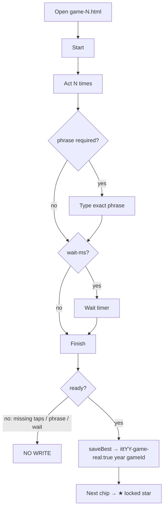

### Period toy (`?g=1`…`?g=15`)

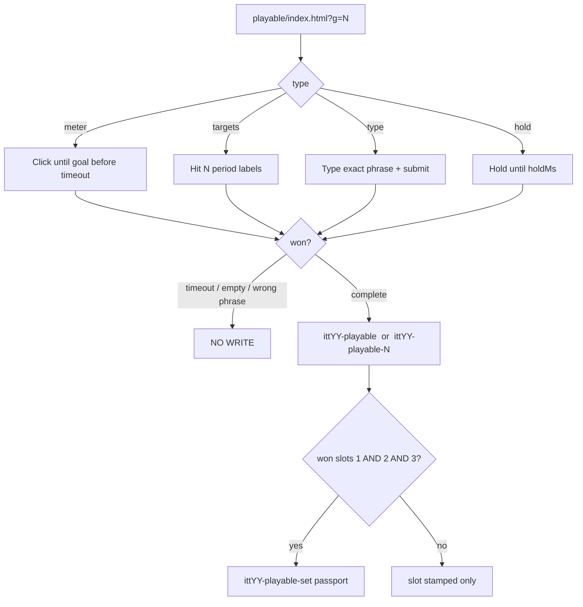

Passport still stamps at **3** (toys 1–3). Toys 4–15 write their own keys and do **not** change the set rule.

### Locked star (one-thing)

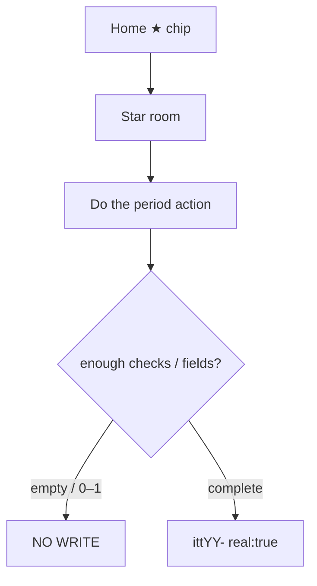

### Trail strip

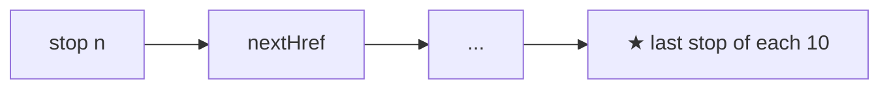

n=1–10 already shipped. n=11–50 are the 5× chains. `whenKey` only on writers. Walking a room does not write.

---

## Index

| Year | ★ Star | G0 | G1–G4 pages | Toys | Map dests | Trails | Home dests |
|-----:|---|---|---|---|---:|---:|---:|
| 1994 | CSotD guestbook (`itt94-csotd`) | Hotlist Surfer | game-2…5 | 15 | 85 | 50 | 155 |
| 1995 | SSL checkout (`itt95-ssl-checkout`) | Applet Checkers | game-2…5 | 15 | 75 | 50 | 190 |
| 1996 | Portal wars (`itt96-portal-wars`) | Planet Hop | game-2…5 | 15 | 75 | 50 | 180 |
| 1997 | PointCast (`itt97-pointcast`) | Lobby Connect 4 | game-2…5 | 15 | 70 | 50 | 185 |
| 1998 | I'm Feeling Lucky (`itt98-lucky`) | Skip-Intro | game-2…5 | 15 | 85 | 50 | 250 |
| 1999 | AIM (`itt99-aim`) | Pixel Pet | game-2…5 | 15 | 75 | 50 | 255 |
| 2000 | MapQuest (`itt00-mapquest`) | Portal Judge | game-2…5 | 15 | 85 | 50 | 295 |
| 2001 | MSN (`itt01-msn`) | Clickscape | game-2…5 | 15 | 80 | 50 | 195 |
| 2002 | StumbleUpon (`itt02-stumble`) | Room Sticky | game-2…5 | 15 | 70 | 50 | 170 |
| 2003 | Photobucket (`itt03-photobucket`) | Gags Lite | game-2…5 | 15 | 65 | 50 | 120 |
| 2004 | thefacebook networks (`itt04-thefacebook-networks`) | Cube Whack | game-2…5 | 15 | 65 | 50 | 305 |
| 2005 | Pandora (`itt05-pandora`) | HoverChop | game-2…5 | 15 | 140 | 50 | 320 |
| 2006 | Twitter 140 (`itt06-tweets`) | TrailSled | game-2…5 | 15 | 90 | 50 | 300 |
| 2007 | iPhone Safari (`itt07-iphone`) | Box Shift | game-2…5 | 15 | 125 | 50 | 315 |
| 2008 | GitHub issue (`itt08-github`) | Tap Grid | game-2…5 | 15 | 75 | 50 | 265 |
| 2009 | Facebook Like (`itt09-fb-likes`) | Plot Neighbors | game-2…5 | 15 | 90 | 50 | 290 |
| 2010 | Imgur (`itt10-imgur`) | Rag Trail | game-2…5 | 15 | 120 | 50 | 275 |
| 2011 | Airbnb request (`itt11-airbnb`) | Letter Swap | game-2…5 | 15 | 90 | 50 | 145 |
| 2012 | SoundCloud (`itt12-soundcloud`) | Guess Doodle | game-2…5 | 15 | 90 | 50 | 150 |
| 2013 | Vine 6s (`itt13-vine-posts`) | Pipe Hop | game-2…5 | 15 | 170 | 50 | 230 |
| 2014 | WhatsApp install (`itt14-wa-install`) | Tile Fold | game-2…5 | 15 | 160 | 50 | 245 |
| 2015 | Apple Watch (`itt15-watch`) | Blob Rush | game-2…5 | 15 | 155 | 50 | 180 |
| 2016 | IG Stories (`itt16-ig-stories`) | Gym Rush | game-2…5 | 15 | 120 | 50 | 185 |
| 2017 | Face ID (`itt17-faceid`) | Storm Circle | game-2…5 | 15 | 160 | 50 | 225 |
| 2018 | GDPR Manage (`itt18-gdpr`) | Consent Dash | game-2…5 | 15 | 185 | 50 | 205 |
| 2019 | Disney+ Continue (`itt19-disneyplus`) | Continue Row | game-2…5 | 15 | 85 | 50 | 145 |
| 2020 | Zoom mute/leave (`itt20-zoom`) | Sus Vote | game-2…5 | 15 | 205 | 50 | 245 |

---
## 1994

**★ Locked star:** CSotD guestbook · `sites/csotd/index.html` · `itt94-csotd`  
**Leftover F1–F5 (already shipped, do not rebuild):** IUMA → FishCam → WH map → Yahoo 3-hub → What's New → CSotD  
**Targets:** map ≥ 85 · L1 ≥ 155 · 5 games · 15 toys · 50 trails

### Night

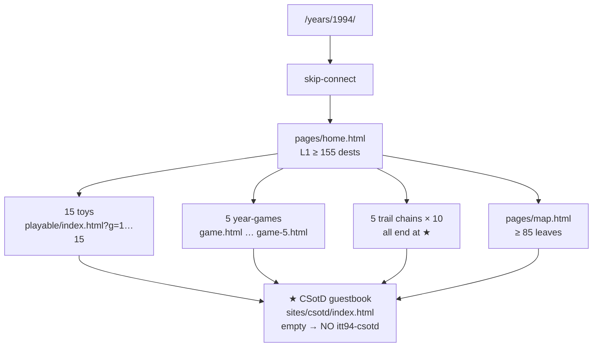

### Year-games

| Slot | Title | Page | Key | Complete | Incomplete | Next |
|---|---|---|---|---|---|---|
| G0 | Hotlist Surfer | `sites/playable/game.html` | `itt94-game-hotlist` | play until score>0 | load / no play | ★ CSotD guestbook |
| G1 | What's New ticker | `sites/playable/game-2.html` | `itt94-game-whatsnew` | Act 6 + Finish | <6 acts | ★ CSotD guestbook |
| G2 | IUMA buffer | `sites/playable/game-3.html` | `itt94-game-iumabuf` | Act 8 + Finish | <8 acts | ★ CSotD guestbook |
| G3 | CERN hop | `sites/playable/game-4.html` | `itt94-game-cernhop` | Act 3 + type `info.cern.ch` + Finish | <3 acts / type ≠ `info.cern.ch` | ★ CSotD guestbook |
| G4 | FishCam wait | `sites/playable/game-5.html` | `itt94-game-fishwait` | Act 3 + wait 2400ms + Finish | <3 acts / finish before 2400ms | ★ CSotD guestbook |

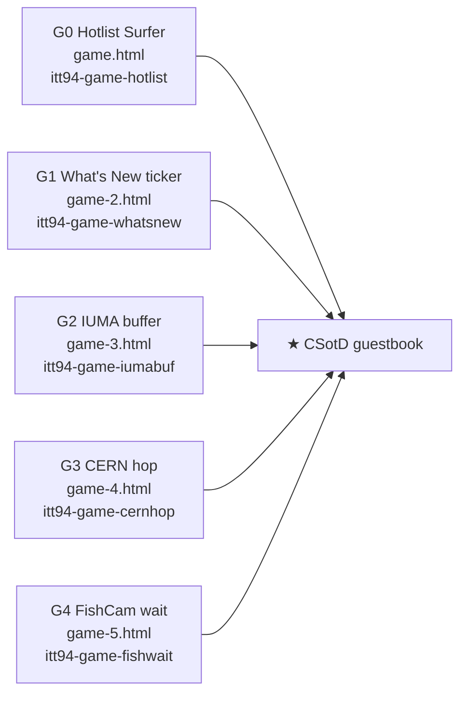

### Toys

| # | Title | Type | Key | Empty = |
|--:|---|---|---|---|
| 1 | Dial-up handshake *(keep — e2e binds this title)* | meter | `itt94-playable` | timeout / under goal |
| 2 | Hotlist hunt *(keep — e2e binds this title)* | targets | `itt94-playable-2` | timeout / under goal |
| 3 | First URL *(keep — e2e binds this title)* | type | `itt94-playable-3` | empty or wrong phrase |
| 4 | Yahoo 3-hub tap | targets | `itt94-playable-4` | timeout / under goal |
| 5 | NCSA Mosaic splash | meter | `itt94-playable-5` | timeout / under goal |
| 6 | IUMA band names | type | `itt94-playable-6` | empty or wrong phrase |
| 7 | White House map click | hold | `itt94-playable-7` | release early |
| 8 | CERN http type | targets | `itt94-playable-8` | timeout / under goal |
| 9 | What's New meter | meter | `itt94-playable-9` | timeout / under goal |
| 10 | FishCam reload type | type | `itt94-playable-10` | empty or wrong phrase |
| 11 | GNN home type | hold | `itt94-playable-11` | release early |
| 12 | WebCrawler query | targets | `itt94-playable-12` | timeout / under goal |
| 13 | Hold Mosaic throbber | meter | `itt94-playable-13` | timeout / under goal |
| 14 | Hold 14.4 handshake | type | `itt94-playable-14` | empty or wrong phrase |
| 15 | Hold IUMA buffer | hold | `itt94-playable-15` | release early |

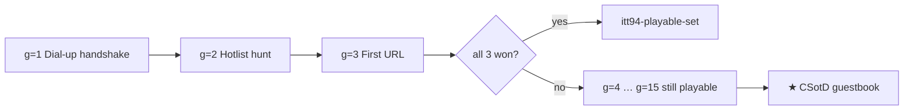

### Trail chains (50 stops · 5 × 10)

**A · leftover / original 1–10**

```mermaid
flowchart LR
  N1["1. CSotD guestbook"]
  N1 --> N2
  N2["2. Yahoo drill"]
  N2 --> N3
  N3["3. Mosaic origin"]
  N3 --> N4
  N4["4. Fish Cam"]
  N4 --> N5
  N5["5. White House"]
  N5 --> N6
  N6["6. NASA"]
  N6 --> N7
  N7["7. IUMA listen"]
  N7 --> N8
  N8["8. HotWired"]
  N8 --> N9
  N9["9. Lycos catalog"]
  N9 --> N10
  N10["10. Year game"]
  N10 --> END["★ CSotD guestbook"]
```

| n | name | href | next | whenKey |
|--:|---|---|---|---|
| 1 | CSotD guestbook | `sites/csotd/index.html` | `sites/yahoo/index.html` | `itt94-csotd` |
| 2 | Yahoo drill | `sites/yahoo/index.html` | `sites/cern/index.html` | `—` |
| 3 | Mosaic origin | `sites/cern/index.html` | `sites/ncsa/index.html` | `—` |
| 4 | Fish Cam | `sites/fishcam/index.html` | `sites/whitehouse/index.html` | `—` |
| 5 | White House | `sites/whitehouse/index.html` | `sites/nasa/index.html` | `—` |
| 6 | NASA | `sites/nasa/index.html` | `sites/iuma/index.html` | `—` |
| 7 | IUMA listen | `sites/iuma/index.html` | `sites/hotwired/index.html` | `itt94-iuma` |
| 8 | HotWired | `sites/hotwired/index.html` | `sites/lycos/index.html` | `—` |
| 9 | Lycos catalog | `sites/lycos/index.html` | `sites/csotd/index.html` | `—` |
| 10 | Year game | `sites/playable/game.html` | `sites/csotd/index.html` | `itt94-game-hotlist` |

**B · n=11–20**

```mermaid
flowchart LR
  N11["11. Bbs"]
  N11 --> N12
  N12["12. Cern"]
  N12 --> N13
  N13["13. Csotd"]
  N13 --> N14
  N14["14. Exploratorium"]
  N14 --> N15
  N15["15. Fishcam"]
  N15 --> N16
  N16["16. Galaxy"]
  N16 --> N17
  N17["17. Gnn"]
  N17 --> N18
  N18["18. Hotwired"]
  N18 --> N19
  N19["19. Infoseek"]
  N19 --> N20
  N20["20. CSotD guestbook"]
  N20 --> END["★ CSotD guestbook"]
```

| n | name | href | next | whenKey |
|--:|---|---|---|---|
| 11 | Bbs | `sites/bbs/index.html` | `sites/cern/index.html` | `—` |
| 12 | Cern | `sites/cern/index.html` | `sites/csotd/index.html` | `—` |
| 13 | Csotd | `sites/csotd/index.html` | `sites/exploratorium/index.html` | `—` |
| 14 | Exploratorium | `sites/exploratorium/index.html` | `sites/fishcam/index.html` | `—` |
| 15 | Fishcam | `sites/fishcam/index.html` | `sites/galaxy/index.html` | `—` |
| 16 | Galaxy | `sites/galaxy/index.html` | `sites/gnn/index.html` | `—` |
| 17 | Gnn | `sites/gnn/index.html` | `sites/hotwired/index.html` | `—` |
| 18 | Hotwired | `sites/hotwired/index.html` | `sites/infoseek/index.html` | `—` |
| 19 | Infoseek | `sites/infoseek/index.html` | `sites/csotd/index.html` | `—` |
| 20 | CSotD guestbook | `sites/csotd/index.html` | `(end)` | `—` |

**C · n=21–30**

```mermaid
flowchart LR
  N21["21. Hotwired"]
  N21 --> N22
  N22["22. Infoseek"]
  N22 --> N23
  N23["23. Iuma"]
  N23 --> N24
  N24["24. Jumpstation"]
  N24 --> N25
  N25["25. Lycos"]
  N25 --> N26
  N26["26. Mcom"]
  N26 --> N27
  N27["27. Nasa"]
  N27 --> N28
  N28["28. Ncsa"]
  N28 --> N29
  N29["29. Personal"]
  N29 --> N30
  N30["30. CSotD guestbook"]
  N30 --> END["★ CSotD guestbook"]
```

| n | name | href | next | whenKey |
|--:|---|---|---|---|
| 21 | Hotwired | `sites/hotwired/index.html` | `sites/infoseek/index.html` | `—` |
| 22 | Infoseek | `sites/infoseek/index.html` | `sites/iuma/index.html` | `—` |
| 23 | Iuma | `sites/iuma/index.html` | `sites/jumpstation/index.html` | `—` |
| 24 | Jumpstation | `sites/jumpstation/index.html` | `sites/lycos/index.html` | `—` |
| 25 | Lycos | `sites/lycos/index.html` | `sites/mcom/index.html` | `—` |
| 26 | Mcom | `sites/mcom/index.html` | `sites/nasa/index.html` | `—` |
| 27 | Nasa | `sites/nasa/index.html` | `sites/ncsa/index.html` | `—` |
| 28 | Ncsa | `sites/ncsa/index.html` | `sites/personal/index.html` | `—` |
| 29 | Personal | `sites/personal/index.html` | `sites/csotd/index.html` | `—` |
| 30 | CSotD guestbook | `sites/csotd/index.html` | `(end)` | `—` |

**D · n=31–40**

```mermaid
flowchart LR
  N31["31. Ncsa"]
  N31 --> N32
  N32["32. Personal"]
  N32 --> N33
  N33["33. Playable"]
  N33 --> N34
  N34["34. Webcrawler"]
  N34 --> N35
  N35["35. Weblouvre"]
  N35 --> N36
  N36["36. Whitehouse"]
  N36 --> N37
  N37["37. Yahoo"]
  N37 --> N38
  N38["38. Bbs"]
  N38 --> N39
  N39["39. Cern"]
  N39 --> N40
  N40["40. CSotD guestbook"]
  N40 --> END["★ CSotD guestbook"]
```

| n | name | href | next | whenKey |
|--:|---|---|---|---|
| 31 | Ncsa | `sites/ncsa/index.html` | `sites/personal/index.html` | `—` |
| 32 | Personal | `sites/personal/index.html` | `sites/playable/index.html` | `—` |
| 33 | Playable | `sites/playable/index.html` | `sites/webcrawler/index.html` | `—` |
| 34 | Webcrawler | `sites/webcrawler/index.html` | `sites/weblouvre/index.html` | `—` |
| 35 | Weblouvre | `sites/weblouvre/index.html` | `sites/whitehouse/index.html` | `—` |
| 36 | Whitehouse | `sites/whitehouse/index.html` | `sites/yahoo/index.html` | `—` |
| 37 | Yahoo | `sites/yahoo/index.html` | `sites/bbs/index.html` | `—` |
| 38 | Bbs | `sites/bbs/index.html` | `sites/cern/index.html` | `—` |
| 39 | Cern | `sites/cern/index.html` | `sites/csotd/index.html` | `—` |
| 40 | CSotD guestbook | `sites/csotd/index.html` | `(end)` | `—` |

**E · n=41–50**

```mermaid
flowchart LR
  N41["41. Bbs"]
  N41 --> N42
  N42["42. Cern"]
  N42 --> N43
  N43["43. Csotd"]
  N43 --> N44
  N44["44. Exploratorium"]
  N44 --> N45
  N45["45. Fishcam"]
  N45 --> N46
  N46["46. Galaxy"]
  N46 --> N47
  N47["47. Gnn"]
  N47 --> N48
  N48["48. Hotwired"]
  N48 --> N49
  N49["49. Infoseek"]
  N49 --> N50
  N50["50. CSotD guestbook"]
  N50 --> END["★ CSotD guestbook"]
```

| n | name | href | next | whenKey |
|--:|---|---|---|---|
| 41 | Bbs | `sites/bbs/index.html` | `sites/cern/index.html` | `—` |
| 42 | Cern | `sites/cern/index.html` | `sites/csotd/index.html` | `—` |
| 43 | Csotd | `sites/csotd/index.html` | `sites/exploratorium/index.html` | `—` |
| 44 | Exploratorium | `sites/exploratorium/index.html` | `sites/fishcam/index.html` | `—` |
| 45 | Fishcam | `sites/fishcam/index.html` | `sites/galaxy/index.html` | `—` |
| 46 | Galaxy | `sites/galaxy/index.html` | `sites/gnn/index.html` | `—` |
| 47 | Gnn | `sites/gnn/index.html` | `sites/hotwired/index.html` | `—` |
| 48 | Hotwired | `sites/hotwired/index.html` | `sites/infoseek/index.html` | `—` |
| 49 | Infoseek | `sites/infoseek/index.html` | `sites/csotd/index.html` | `—` |
| 50 | CSotD guestbook | `sites/csotd/index.html` | `(end)` | `—` |

### Home + map

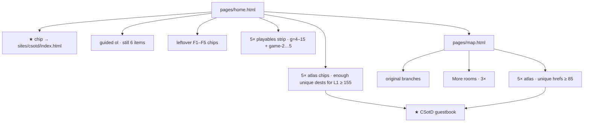

**Check:** do not add a 7th guided `<ol>` item. Atlas chips must resolve (no `#`). Query dests (`?g=` / `?atlas=`) are allowed and count as unique hrefs.

---

## 1995

**★ Locked star:** SSL checkout · `sites/amazon/ssl-checkout.html` · `itt95-ssl-checkout`  
**Leftover F1–F5 (already shipped, do not rebuild):** Homestead → AuctionWeb → AltaVista → HotWired → Cool → SSL view  
**Targets:** map ≥ 75 · L1 ≥ 190 · 5 games · 15 toys · 50 trails

### Night

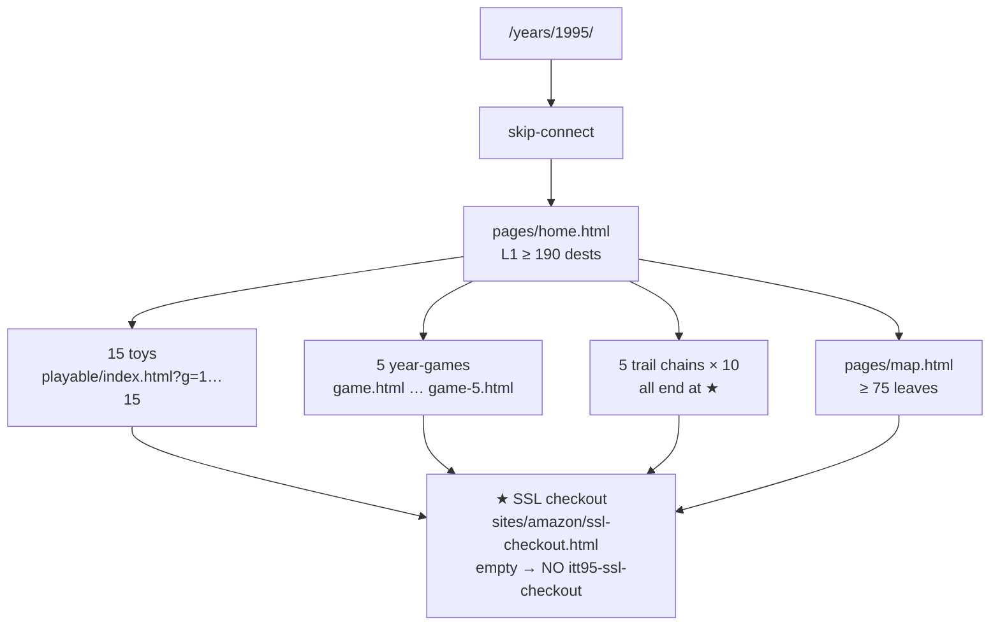

### Year-games

| Slot | Title | Page | Key | Complete | Incomplete | Next |
|---|---|---|---|---|---|---|
| G0 | Applet Checkers | `sites/playable/game.html` | `itt95-game-checkers` | play until score>0 | load / no play | ★ SSL checkout |
| G1 | Desk Mines | `sites/playable/game-2.html` | `itt95-game-mines` | Act 3 + Finish | <3 acts | ★ SSL checkout |
| G2 | Auction snipe | `sites/playable/game-3.html` | `itt95-game-snipe` | Act 3 + type `bid the last` + Finish | <3 acts / type ≠ `bid the last` | ★ SSL checkout |
| G3 | AltaVista ops | `sites/playable/game-4.html` | `itt95-game-avop` | Act 3 + type `build 1995 operator` + Finish | <3 acts / type ≠ `build 1995 operator` | ★ SSL checkout |
| G4 | Homestead plant | `sites/playable/game-5.html` | `itt95-game-homestead` | Act 3 + Finish | <3 acts | ★ SSL checkout |

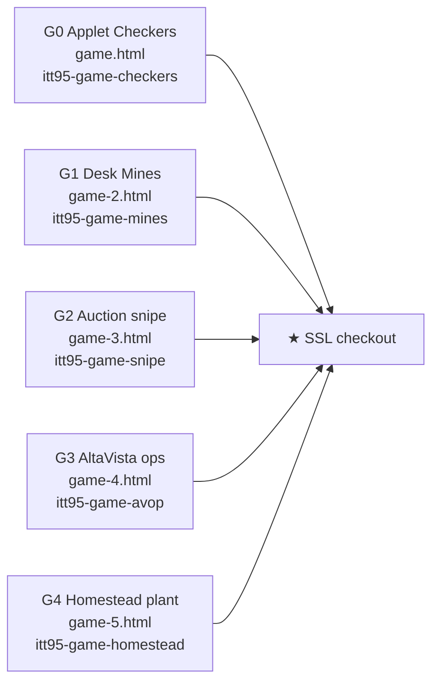

### Toys

| # | Title | Type | Key | Empty = |
|--:|---|---|---|---|
| 1 | Cart grab *(keep — e2e binds this title)* | targets | `itt95-playable` | timeout / under goal |
| 2 | Windows 95 Start *(keep — e2e binds this title)* | hold | `itt95-playable-2` | release early |
| 3 | Yahoo! category *(keep — e2e binds this title)* | type | `itt95-playable-3` | empty or wrong phrase |
| 4 | AuctionWeb bid tap | targets | `itt95-playable-4` | timeout / under goal |
| 5 | AltaVista +word | meter | `itt95-playable-5` | timeout / under goal |
| 6 | SSL lock meter | type | `itt95-playable-6` | empty or wrong phrase |
| 7 | GeoCities neighborhood tap | hold | `itt95-playable-7` | release early |
| 8 | AOL keyword type | targets | `itt95-playable-8` | timeout / under goal |
| 9 | Tripod guest type | meter | `itt95-playable-9` | timeout / under goal |
| 10 | Pathfinder section tap | type | `itt95-playable-10` | empty or wrong phrase |
| 11 | Compuserve GO type | hold | `itt95-playable-11` | release early |
| 12 | Match.com like tap | targets | `itt95-playable-12` | timeout / under goal |
| 13 | Hold Start menu | meter | `itt95-playable-13` | timeout / under goal |
| 14 | Hold 28.8 bar | type | `itt95-playable-14` | empty or wrong phrase |
| 15 | Hold SSL padlock | hold | `itt95-playable-15` | release early |

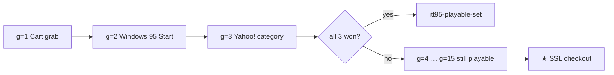

### Trail chains (50 stops · 5 × 10)

**A · leftover / original 1–10**

```mermaid
flowchart LR
  N1["1. SSL checkout"]
  N1 --> N2
  N2["2. Amazon book"]
  N2 --> N3
  N3["3. AuctionWeb bid"]
  N3 --> N4
  N4["4. GeoCities homestead"]
  N4 --> N5
  N5["5. Yahoo directory"]
  N5 --> N6
  N6["6. AltaVista"]
  N6 --> N7
  N7["7. CNN"]
  N7 --> N8
  N8["8. Microsoft"]
  N8 --> N9
  N9["9. Netscape"]
  N9 --> N10
  N10["10. Classmates"]
  N10 --> END["★ SSL checkout"]
```

| n | name | href | next | whenKey |
|--:|---|---|---|---|
| 1 | SSL checkout | `sites/amazon/ssl-checkout.html` | `sites/auctionweb/item-laser.html` | `itt95-ssl-checkout` |
| 2 | Amazon book | `sites/amazon/index.html` | `sites/amazon/ssl-checkout.html` | `—` |
| 3 | AuctionWeb bid | `sites/auctionweb/index.html` | `sites/geocities/homestead.html` | `—` |
| 4 | GeoCities homestead | `sites/geocities/homestead.html` | `sites/yahoo/index.html` | `—` |
| 5 | Yahoo directory | `sites/yahoo/index.html` | `sites/altavista/index.html` | `—` |
| 6 | AltaVista | `sites/altavista/index.html` | `sites/cnn/index.html` | `—` |
| 7 | CNN | `sites/cnn/index.html` | `sites/microsoft/index.html` | `—` |
| 8 | Microsoft | `sites/microsoft/index.html` | `sites/netscape/index.html` | `—` |
| 9 | Netscape | `sites/netscape/index.html` | `sites/amazon/index.html` | `—` |
| 10 | Classmates | `sites/classmates/index.html` | `sites/amazon/ssl-checkout.html` | `—` |

**B · n=11–20**

```mermaid
flowchart LR
  N11["11. Altavista"]
  N11 --> N12
  N12["12. Amazon"]
  N12 --> N13
  N13["13. Aol"]
  N13 --> N14
  N14["14. Auctionweb"]
  N14 --> N15
  N15["15. Classmates"]
  N15 --> N16
  N16["16. Cnn"]
  N16 --> N17
  N17["17. Compuserve"]
  N17 --> N18
  N18["18. Geocities"]
  N18 --> N19
  N19["19. Hotwired"]
  N19 --> N20
  N20["20. SSL checkout"]
  N20 --> END["★ SSL checkout"]
```

| n | name | href | next | whenKey |
|--:|---|---|---|---|
| 11 | Altavista | `sites/altavista/index.html` | `sites/amazon/index.html` | `—` |
| 12 | Amazon | `sites/amazon/index.html` | `sites/aol/index.html` | `—` |
| 13 | Aol | `sites/aol/index.html` | `sites/auctionweb/index.html` | `—` |
| 14 | Auctionweb | `sites/auctionweb/index.html` | `sites/classmates/index.html` | `—` |
| 15 | Classmates | `sites/classmates/index.html` | `sites/cnn/index.html` | `—` |
| 16 | Cnn | `sites/cnn/index.html` | `sites/compuserve/index.html` | `—` |
| 17 | Compuserve | `sites/compuserve/index.html` | `sites/geocities/index.html` | `—` |
| 18 | Geocities | `sites/geocities/index.html` | `sites/hotwired/index.html` | `—` |
| 19 | Hotwired | `sites/hotwired/index.html` | `sites/amazon/ssl-checkout.html` | `—` |
| 20 | SSL checkout | `sites/amazon/ssl-checkout.html` | `(end)` | `—` |

**C · n=21–30**

```mermaid
flowchart LR
  N21["21. Geocities"]
  N21 --> N22
  N22["22. Hotwired"]
  N22 --> N23
  N23["23. Infoseek"]
  N23 --> N24
  N24["24. Match"]
  N24 --> N25
  N25["25. Microsoft"]
  N25 --> N26
  N26["26. Netscape"]
  N26 --> N27
  N27["27. Pathfinder"]
  N27 --> N28
  N28["28. Playable"]
  N28 --> N29
  N29["29. Prodigy"]
  N29 --> N30
  N30["30. SSL checkout"]
  N30 --> END["★ SSL checkout"]
```

| n | name | href | next | whenKey |
|--:|---|---|---|---|
| 21 | Geocities | `sites/geocities/index.html` | `sites/hotwired/index.html` | `—` |
| 22 | Hotwired | `sites/hotwired/index.html` | `sites/infoseek/index.html` | `—` |
| 23 | Infoseek | `sites/infoseek/index.html` | `sites/match/index.html` | `—` |
| 24 | Match | `sites/match/index.html` | `sites/microsoft/index.html` | `—` |
| 25 | Microsoft | `sites/microsoft/index.html` | `sites/netscape/index.html` | `—` |
| 26 | Netscape | `sites/netscape/index.html` | `sites/pathfinder/index.html` | `—` |
| 27 | Pathfinder | `sites/pathfinder/index.html` | `sites/playable/index.html` | `—` |
| 28 | Playable | `sites/playable/index.html` | `sites/prodigy/index.html` | `—` |
| 29 | Prodigy | `sites/prodigy/index.html` | `sites/amazon/ssl-checkout.html` | `—` |
| 30 | SSL checkout | `sites/amazon/ssl-checkout.html` | `(end)` | `—` |

**D · n=31–40**

```mermaid
flowchart LR
  N31["31. Playable"]
  N31 --> N32
  N32["32. Prodigy"]
  N32 --> N33
  N33["33. Tripod"]
  N33 --> N34
  N34["34. Whitehouse"]
  N34 --> N35
  N35["35. Yahoo"]
  N35 --> N36
  N36["36. Ssl checkout"]
  N36 --> N37
  N37["37. Altavista"]
  N37 --> N38
  N38["38. Amazon"]
  N38 --> N39
  N39["39. Aol"]
  N39 --> N40
  N40["40. SSL checkout"]
  N40 --> END["★ SSL checkout"]
```

| n | name | href | next | whenKey |
|--:|---|---|---|---|
| 31 | Playable | `sites/playable/index.html` | `sites/prodigy/index.html` | `—` |
| 32 | Prodigy | `sites/prodigy/index.html` | `sites/tripod/index.html` | `—` |
| 33 | Tripod | `sites/tripod/index.html` | `sites/whitehouse/index.html` | `—` |
| 34 | Whitehouse | `sites/whitehouse/index.html` | `sites/yahoo/index.html` | `—` |
| 35 | Yahoo | `sites/yahoo/index.html` | `sites/amazon/ssl-checkout.html` | `—` |
| 36 | Ssl checkout | `sites/amazon/ssl-checkout.html` | `sites/altavista/index.html` | `—` |
| 37 | Altavista | `sites/altavista/index.html` | `sites/amazon/index.html` | `—` |
| 38 | Amazon | `sites/amazon/index.html` | `sites/aol/index.html` | `—` |
| 39 | Aol | `sites/aol/index.html` | `sites/amazon/ssl-checkout.html` | `—` |
| 40 | SSL checkout | `sites/amazon/ssl-checkout.html` | `(end)` | `—` |

**E · n=41–50**

```mermaid
flowchart LR
  N41["41. Amazon"]
  N41 --> N42
  N42["42. Aol"]
  N42 --> N43
  N43["43. Auctionweb"]
  N43 --> N44
  N44["44. Classmates"]
  N44 --> N45
  N45["45. Cnn"]
  N45 --> N46
  N46["46. Compuserve"]
  N46 --> N47
  N47["47. Geocities"]
  N47 --> N48
  N48["48. Hotwired"]
  N48 --> N49
  N49["49. Infoseek"]
  N49 --> N50
  N50["50. SSL checkout"]
  N50 --> END["★ SSL checkout"]
```

| n | name | href | next | whenKey |
|--:|---|---|---|---|
| 41 | Amazon | `sites/amazon/index.html` | `sites/aol/index.html` | `—` |
| 42 | Aol | `sites/aol/index.html` | `sites/auctionweb/index.html` | `—` |
| 43 | Auctionweb | `sites/auctionweb/index.html` | `sites/classmates/index.html` | `—` |
| 44 | Classmates | `sites/classmates/index.html` | `sites/cnn/index.html` | `—` |
| 45 | Cnn | `sites/cnn/index.html` | `sites/compuserve/index.html` | `—` |
| 46 | Compuserve | `sites/compuserve/index.html` | `sites/geocities/index.html` | `—` |
| 47 | Geocities | `sites/geocities/index.html` | `sites/hotwired/index.html` | `—` |
| 48 | Hotwired | `sites/hotwired/index.html` | `sites/infoseek/index.html` | `—` |
| 49 | Infoseek | `sites/infoseek/index.html` | `sites/amazon/ssl-checkout.html` | `—` |
| 50 | SSL checkout | `sites/amazon/ssl-checkout.html` | `(end)` | `—` |

### Home + map

```mermaid
flowchart TD
  H["pages/home.html"] --> STARCHIP["★ chip → sites/amazon/ssl-checkout.html"]
  H --> GUIDED["guided ol · still 6 items"]
  H --> F15["leftover F1–F5 chips"]
  H --> P15["5× playables strip · g=4–15 + game-2…5"]
  H --> ATLAS["5× atlas chips · enough unique dests for L1 ≥ 190"]
  H --> M["pages/map.html"]
  M --> CORE[original branches]
  M --> X3["More rooms · 3×"]
  M --> X5["5× atlas · unique hrefs ≥ 75"]
  ATLAS --> STAR["★ SSL checkout"]
  X5 --> STAR
```

**Check:** do not add a 7th guided `<ol>` item. Atlas chips must resolve (no `#`). Query dests (`?g=` / `?atlas=`) are allowed and count as unique hrefs.

---

## 1996

**★ Locked star:** Portal wars · `sites/portals/wars.html` · `itt96-portal-wars`  
**Leftover F1–F5 (already shipped, do not rebuild):** My portal → HoTMaiL → Space Jam → RealPlayer → guestbook → wars  
**Targets:** map ≥ 75 · L1 ≥ 180 · 5 games · 15 toys · 50 trails

### Night

```mermaid
flowchart TD
  Y["/years/1996/"] --> SKIP[skip-connect]
  SKIP --> HOME["pages/home.html<br/>L1 ≥ 180 dests"]
  HOME --> TOYS["15 toys<br/>playable/index.html?g=1…15"]
  HOME --> GAMES["5 year-games<br/>game.html … game-5.html"]
  HOME --> TRAILS["5 trail chains × 10<br/>all end at ★"]
  HOME --> MAP["pages/map.html<br/>≥ 75 leaves"]
  TOYS --> STAR["★ Portal wars<br/>sites/portals/wars.html<br/>empty → NO itt96-portal-wars"]
  GAMES --> STAR
  TRAILS --> STAR
  MAP --> STAR
```

### Year-games

| Slot | Title | Page | Key | Complete | Incomplete | Next |
|---|---|---|---|---|---|---|
| G0 | Planet Hop | `sites/playable/game.html` | `itt96-game-planets` | play until score>0 | load / no play | ★ Portal wars |
| G1 | Hotmail compose | `sites/playable/game-2.html` | `itt96-game-hotmail` | Act 3 + Finish | <3 acts | ★ Portal wars |
| G2 | Real buffer | `sites/playable/game-3.html` | `itt96-game-realbuf` | Act 3 + Finish | <3 acts | ★ Portal wars |
| G3 | My Yahoo drag | `sites/playable/game-4.html` | `itt96-game-myyahoo` | Act 2 + Finish | <2 acts | ★ Portal wars |
| G4 | Jam hub | `sites/playable/game-5.html` | `itt96-game-jamhub` | Act 4 + Finish | <4 acts | ★ Portal wars |

```mermaid
flowchart LR
  G0["G0 Planet Hop<br/>game.html<br/>itt96-game-planets"] --> ST["★ Portal wars"]
  G1["G1 Hotmail compose<br/>game-2.html<br/>itt96-game-hotmail"] --> ST
  G2["G2 Real buffer<br/>game-3.html<br/>itt96-game-realbuf"] --> ST
  G3["G3 My Yahoo drag<br/>game-4.html<br/>itt96-game-myyahoo"] --> ST
  G4["G4 Jam hub<br/>game-5.html<br/>itt96-game-jamhub"] --> ST
```

### Toys

| # | Title | Type | Key | Empty = |
|--:|---|---|---|---|
| 1 | Space Jam stars *(keep — e2e binds this title)* | targets | `itt96-playable` | timeout / under goal |
| 2 | Hotmail signup bar *(keep — e2e binds this title)* | meter | `itt96-playable-2` | timeout / under goal |
| 3 | Guestbook sign *(keep — e2e binds this title)* | type | `itt96-playable-3` | empty or wrong phrase |
| 4 | Excite channel tap | targets | `itt96-playable-4` | timeout / under goal |
| 5 | My Yahoo widget tap | meter | `itt96-playable-5` | timeout / under goal |
| 6 | RealPlayer buffer meter | type | `itt96-playable-6` | empty or wrong phrase |
| 7 | theGlobe join tap | hold | `itt96-playable-7` | release early |
| 8 | Angelfire page tap | targets | `itt96-playable-8` | timeout / under goal |
| 9 | MSN.com type | meter | `itt96-playable-9` | timeout / under goal |
| 10 | Portal wars type | type | `itt96-playable-10` | empty or wrong phrase |
| 11 | HoTMaiL address type | hold | `itt96-playable-11` | release early |
| 12 | Space Jam URL type | targets | `itt96-playable-12` | timeout / under goal |
| 13 | Hold RealPlayer | meter | `itt96-playable-13` | timeout / under goal |
| 14 | Hold Hotmail send | type | `itt96-playable-14` | empty or wrong phrase |
| 15 | Hold Jam splash | hold | `itt96-playable-15` | release early |

```mermaid
flowchart LR
  T1["g=1 Space Jam stars"] --> T2["g=2 Hotmail signup bar"]
  T2 --> T3["g=3 Guestbook sign"]
  T3 --> SET{all 3 won?}
  SET -->|yes| PS["itt96-playable-set"]
  SET -->|no| MORE["g=4 … g=15 still playable"]
  MORE --> STAR["★ Portal wars"]
```

### Trail chains (50 stops · 5 × 10)

**A · leftover / original 1–10**

```mermaid
flowchart LR
  N1["1. Portal wars"]
  N1 --> N2
  N2["2. HoTMaiL"]
  N2 --> N3
  N3["3. Space Jam"]
  N3 --> N4
  N4["4. My Yahoo"]
  N4 --> N5
  N5["5. GeoCities"]
  N5 --> N6
  N6["6. Amazon"]
  N6 --> N7
  N7["7. AuctionWeb"]
  N7 --> N8
  N8["8. Excite"]
  N8 --> N9
  N9["9. AltaVista"]
  N9 --> N10
  N10["10. Year game"]
  N10 --> END["★ Portal wars"]
```

| n | name | href | next | whenKey |
|--:|---|---|---|---|
| 1 | Portal wars | `sites/portals/wars.html` | `sites/hotmail/index.html` | `itt96-portal-wars` |
| 2 | HoTMaiL | `sites/hotmail/index.html` | `sites/spacejam/index.html` | `—` |
| 3 | Space Jam | `sites/spacejam/index.html` | `sites/yahoo/my.html` | `—` |
| 4 | My Yahoo | `sites/yahoo/my.html` | `sites/geocities/index.html` | `—` |
| 5 | GeoCities | `sites/geocities/index.html` | `sites/amazon/index.html` | `—` |
| 6 | Amazon | `sites/amazon/index.html` | `sites/auctionweb/index.html` | `—` |
| 7 | AuctionWeb | `sites/auctionweb/index.html` | `sites/excite/index.html` | `—` |
| 8 | Excite | `sites/excite/index.html` | `sites/altavista/index.html` | `—` |
| 9 | AltaVista | `sites/altavista/index.html` | `sites/portals/wars.html` | `—` |
| 10 | Year game | `sites/playable/game.html` | `sites/portals/wars.html` | `itt96-game-planets` |

**B · n=11–20**

```mermaid
flowchart LR
  N11["11. Altavista"]
  N11 --> N12
  N12["12. Amazon"]
  N12 --> N13
  N13["13. Angelfire"]
  N13 --> N14
  N14["14. Aolportal"]
  N14 --> N15
  N15["15. Auctionweb"]
  N15 --> N16
  N16["16. Cnn"]
  N16 --> N17
  N17["17. Excite"]
  N17 --> N18
  N18["18. Geocities"]
  N18 --> N19
  N19["19. Hotmail"]
  N19 --> N20
  N20["20. Portal wars"]
  N20 --> END["★ Portal wars"]
```

| n | name | href | next | whenKey |
|--:|---|---|---|---|
| 11 | Altavista | `sites/altavista/index.html` | `sites/amazon/index.html` | `—` |
| 12 | Amazon | `sites/amazon/index.html` | `sites/angelfire/index.html` | `—` |
| 13 | Angelfire | `sites/angelfire/index.html` | `sites/aolportal/index.html` | `—` |
| 14 | Aolportal | `sites/aolportal/index.html` | `sites/auctionweb/index.html` | `—` |
| 15 | Auctionweb | `sites/auctionweb/index.html` | `sites/cnn/index.html` | `—` |
| 16 | Cnn | `sites/cnn/index.html` | `sites/excite/index.html` | `—` |
| 17 | Excite | `sites/excite/index.html` | `sites/geocities/index.html` | `—` |
| 18 | Geocities | `sites/geocities/index.html` | `sites/hotmail/index.html` | `—` |
| 19 | Hotmail | `sites/hotmail/index.html` | `sites/portals/wars.html` | `—` |
| 20 | Portal wars | `sites/portals/wars.html` | `(end)` | `—` |

**C · n=21–30**

```mermaid
flowchart LR
  N21["21. Geocities"]
  N21 --> N22
  N22["22. Hotmail"]
  N22 --> N23
  N23["23. Infoseek"]
  N23 --> N24
  N24["24. Microsoft"]
  N24 --> N25
  N25["25. Msn"]
  N25 --> N26
  N26["26. Netscape"]
  N26 --> N27
  N27["27. Playable"]
  N27 --> N28
  N28["28. Plugin"]
  N28 --> N29
  N29["29. Wars"]
  N29 --> N30
  N30["30. Portal wars"]
  N30 --> END["★ Portal wars"]
```

| n | name | href | next | whenKey |
|--:|---|---|---|---|
| 21 | Geocities | `sites/geocities/index.html` | `sites/hotmail/index.html` | `—` |
| 22 | Hotmail | `sites/hotmail/index.html` | `sites/infoseek/index.html` | `—` |
| 23 | Infoseek | `sites/infoseek/index.html` | `sites/microsoft/index.html` | `—` |
| 24 | Microsoft | `sites/microsoft/index.html` | `sites/msn/index.html` | `—` |
| 25 | Msn | `sites/msn/index.html` | `sites/netscape/index.html` | `—` |
| 26 | Netscape | `sites/netscape/index.html` | `sites/playable/index.html` | `—` |
| 27 | Playable | `sites/playable/index.html` | `sites/plugin/index.html` | `—` |
| 28 | Plugin | `sites/plugin/index.html` | `sites/portals/wars.html` | `—` |
| 29 | Wars | `sites/portals/wars.html` | `sites/portals/wars.html` | `—` |
| 30 | Portal wars | `sites/portals/wars.html` | `(end)` | `—` |

**D · n=31–40**

```mermaid
flowchart LR
  N31["31. Plugin"]
  N31 --> N32
  N32["32. Wars"]
  N32 --> N33
  N33["33. Prodigy"]
  N33 --> N34
  N34["34. Realplayer"]
  N34 --> N35
  N35["35. Spacejam"]
  N35 --> N36
  N36["36. Theglobe"]
  N36 --> N37
  N37["37. Yahoo"]
  N37 --> N38
  N38["38. Altavista"]
  N38 --> N39
  N39["39. Amazon"]
  N39 --> N40
  N40["40. Portal wars"]
  N40 --> END["★ Portal wars"]
```

| n | name | href | next | whenKey |
|--:|---|---|---|---|
| 31 | Plugin | `sites/plugin/index.html` | `sites/portals/wars.html` | `—` |
| 32 | Wars | `sites/portals/wars.html` | `sites/prodigy/index.html` | `—` |
| 33 | Prodigy | `sites/prodigy/index.html` | `sites/realplayer/index.html` | `—` |
| 34 | Realplayer | `sites/realplayer/index.html` | `sites/spacejam/index.html` | `—` |
| 35 | Spacejam | `sites/spacejam/index.html` | `sites/theglobe/index.html` | `—` |
| 36 | Theglobe | `sites/theglobe/index.html` | `sites/yahoo/index.html` | `—` |
| 37 | Yahoo | `sites/yahoo/index.html` | `sites/altavista/index.html` | `—` |
| 38 | Altavista | `sites/altavista/index.html` | `sites/amazon/index.html` | `—` |
| 39 | Amazon | `sites/amazon/index.html` | `sites/portals/wars.html` | `—` |
| 40 | Portal wars | `sites/portals/wars.html` | `(end)` | `—` |

**E · n=41–50**

```mermaid
flowchart LR
  N41["41. Altavista"]
  N41 --> N42
  N42["42. Amazon"]
  N42 --> N43
  N43["43. Angelfire"]
  N43 --> N44
  N44["44. Aolportal"]
  N44 --> N45
  N45["45. Auctionweb"]
  N45 --> N46
  N46["46. Cnn"]
  N46 --> N47
  N47["47. Excite"]
  N47 --> N48
  N48["48. Geocities"]
  N48 --> N49
  N49["49. Hotmail"]
  N49 --> N50
  N50["50. Portal wars"]
  N50 --> END["★ Portal wars"]
```

| n | name | href | next | whenKey |
|--:|---|---|---|---|
| 41 | Altavista | `sites/altavista/index.html` | `sites/amazon/index.html` | `—` |
| 42 | Amazon | `sites/amazon/index.html` | `sites/angelfire/index.html` | `—` |
| 43 | Angelfire | `sites/angelfire/index.html` | `sites/aolportal/index.html` | `—` |
| 44 | Aolportal | `sites/aolportal/index.html` | `sites/auctionweb/index.html` | `—` |
| 45 | Auctionweb | `sites/auctionweb/index.html` | `sites/cnn/index.html` | `—` |
| 46 | Cnn | `sites/cnn/index.html` | `sites/excite/index.html` | `—` |
| 47 | Excite | `sites/excite/index.html` | `sites/geocities/index.html` | `—` |
| 48 | Geocities | `sites/geocities/index.html` | `sites/hotmail/index.html` | `—` |
| 49 | Hotmail | `sites/hotmail/index.html` | `sites/portals/wars.html` | `—` |
| 50 | Portal wars | `sites/portals/wars.html` | `(end)` | `—` |

### Home + map

```mermaid
flowchart TD
  H["pages/home.html"] --> STARCHIP["★ chip → sites/portals/wars.html"]
  H --> GUIDED["guided ol · still 6 items"]
  H --> F15["leftover F1–F5 chips"]
  H --> P15["5× playables strip · g=4–15 + game-2…5"]
  H --> ATLAS["5× atlas chips · enough unique dests for L1 ≥ 180"]
  H --> M["pages/map.html"]
  M --> CORE[original branches]
  M --> X3["More rooms · 3×"]
  M --> X5["5× atlas · unique hrefs ≥ 75"]
  ATLAS --> STAR["★ Portal wars"]
  X5 --> STAR
```

**Check:** do not add a 7th guided `<ol>` item. Atlas chips must resolve (no `#`). Query dests (`?g=` / `?atlas=`) are allowed and count as unique hrefs.

---

## 1997

**★ Locked star:** PointCast · `sites/pointcast/index.html` · `itt97-pointcast`  
**Leftover F1–F5 (already shipped, do not rebuild):** Slashdot → eBay → ICQ → Think Different → Drudge → PointCast  
**Targets:** map ≥ 70 · L1 ≥ 185 · 5 games · 15 toys · 50 trails

### Night

```mermaid
flowchart TD
  Y["/years/1997/"] --> SKIP[skip-connect]
  SKIP --> HOME["pages/home.html<br/>L1 ≥ 185 dests"]
  HOME --> TOYS["15 toys<br/>playable/index.html?g=1…15"]
  HOME --> GAMES["5 year-games<br/>game.html … game-5.html"]
  HOME --> TRAILS["5 trail chains × 10<br/>all end at ★"]
  HOME --> MAP["pages/map.html<br/>≥ 70 leaves"]
  TOYS --> STAR["★ PointCast<br/>sites/pointcast/index.html<br/>empty → NO itt97-pointcast"]
  GAMES --> STAR
  TRAILS --> STAR
  MAP --> STAR
```

### Year-games

| Slot | Title | Page | Key | Complete | Incomplete | Next |
|---|---|---|---|---|---|---|
| G0 | Lobby Connect 4 | `sites/playable/game.html` | `itt97-game-connect4` | play until score>0 | load / no play | ★ PointCast |
| G1 | ICQ uh-oh | `sites/playable/game-2.html` | `itt97-game-icqslap` | Act 12 + Finish | <12 acts | ★ PointCast |
| G2 | eBay black bid | `sites/playable/game-3.html` | `itt97-game-ebaybid` | Act 3 + Finish | <3 acts | ★ PointCast |
| G3 | PointCast extras | `sites/playable/game-4.html` | `itt97-game-pcchan` | Act 2 + Finish | <2 acts | ★ PointCast |
| G4 | Slashdot mod | `sites/playable/game-5.html` | `itt97-game-slashmod` | Act 3 + Finish | <3 acts | ★ PointCast |

```mermaid
flowchart LR
  G0["G0 Lobby Connect 4<br/>game.html<br/>itt97-game-connect4"] --> ST["★ PointCast"]
  G1["G1 ICQ uh-oh<br/>game-2.html<br/>itt97-game-icqslap"] --> ST
  G2["G2 eBay black bid<br/>game-3.html<br/>itt97-game-ebaybid"] --> ST
  G3["G3 PointCast extras<br/>game-4.html<br/>itt97-game-pcchan"] --> ST
  G4["G4 Slashdot mod<br/>game-5.html<br/>itt97-game-slashmod"] --> ST
```

### Toys

| # | Title | Type | Key | Empty = |
|--:|---|---|---|---|
| 1 | ICQ popup slap *(keep — e2e binds this title)* | targets | `itt97-playable` | timeout / under goal |
| 2 | ICQ status line *(keep — e2e binds this title)* | type | `itt97-playable-2` | empty or wrong phrase |
| 3 | MP3 download bar *(keep — e2e binds this title)* | meter | `itt97-playable-3` | timeout / under goal |
| 4 | eBay black word tap | targets | `itt97-playable-4` | timeout / under goal |
| 5 | Slashdot +1 tap | meter | `itt97-playable-5` | timeout / under goal |
| 6 | Drudge headline tap | type | `itt97-playable-6` | empty or wrong phrase |
| 7 | Think Different type | hold | `itt97-playable-7` | release early |
| 8 | HotBot query type | targets | `itt97-playable-8` | timeout / under goal |
| 9 | Winamp playlist tap | meter | `itt97-playable-9` | timeout / under goal |
| 10 | BBC News tap | type | `itt97-playable-10` | empty or wrong phrase |
| 11 | PointCast channel meter | hold | `itt97-playable-11` | release early |
| 12 | ICQ UIN type | targets | `itt97-playable-12` | timeout / under goal |
| 13 | Hold PointCast | meter | `itt97-playable-13` | timeout / under goal |
| 14 | Hold ICQ uh-oh | type | `itt97-playable-14` | empty or wrong phrase |
| 15 | Hold eBay bid | hold | `itt97-playable-15` | release early |

```mermaid
flowchart LR
  T1["g=1 ICQ popup slap"] --> T2["g=2 ICQ status line"]
  T2 --> T3["g=3 MP3 download bar"]
  T3 --> SET{all 3 won?}
  SET -->|yes| PS["itt97-playable-set"]
  SET -->|no| MORE["g=4 … g=15 still playable"]
  MORE --> STAR["★ PointCast"]
```

### Trail chains (50 stops · 5 × 10)

**A · leftover / original 1–10**

```mermaid
flowchart LR
  N1["1. PointCast"]
  N1 --> N2
  N2["2. ICQ"]
  N2 --> N3
  N3["3. eBay laptop"]
  N3 --> N4
  N4["4. HoTMaiL"]
  N4 --> N5
  N5["5. Slashdot"]
  N5 --> N6
  N6["6. Drudge"]
  N6 --> N7
  N7["7. HotBot"]
  N7 --> N8
  N8["8. AIM seed"]
  N8 --> N9
  N9["9. Apple"]
  N9 --> N10
  N10["10. Microsoft"]
  N10 --> END["★ PointCast"]
```

| n | name | href | next | whenKey |
|--:|---|---|---|---|
| 1 | PointCast | `sites/pointcast/index.html` | `sites/icq/index.html` | `itt97-pointcast` |
| 2 | ICQ | `sites/icq/index.html` | `sites/ebay/item-laptop.html` | `—` |
| 3 | eBay laptop | `sites/ebay/item-laptop.html` | `sites/hotmail/index.html` | `—` |
| 4 | HoTMaiL | `sites/hotmail/index.html` | `sites/slashdot/index.html` | `—` |
| 5 | Slashdot | `sites/slashdot/index.html` | `sites/drudge/index.html` | `—` |
| 6 | Drudge | `sites/drudge/index.html` | `sites/hotbot/index.html` | `—` |
| 7 | HotBot | `sites/hotbot/index.html` | `sites/aim/index.html` | `—` |
| 8 | AIM seed | `sites/aim/index.html` | `sites/apple/index.html` | `—` |
| 9 | Apple | `sites/apple/index.html` | `sites/microsoft/index.html` | `—` |
| 10 | Microsoft | `sites/microsoft/index.html` | `sites/pointcast/index.html` | `—` |

**B · n=11–20**

```mermaid
flowchart LR
  N11["11. Aim"]
  N11 --> N12
  N12["12. Altavista"]
  N12 --> N13
  N13["13. Amazon"]
  N13 --> N14
  N14["14. Aol"]
  N14 --> N15
  N15["15. Apple"]
  N15 --> N16
  N16["16. Bbc"]
  N16 --> N17
  N17["17. Cnn"]
  N17 --> N18
  N18["18. Drudge"]
  N18 --> N19
  N19["19. Ebay"]
  N19 --> N20
  N20["20. PointCast"]
  N20 --> END["★ PointCast"]
```

| n | name | href | next | whenKey |
|--:|---|---|---|---|
| 11 | Aim | `sites/aim/index.html` | `sites/altavista/index.html` | `—` |
| 12 | Altavista | `sites/altavista/index.html` | `sites/amazon/index.html` | `—` |
| 13 | Amazon | `sites/amazon/index.html` | `sites/aol/index.html` | `—` |
| 14 | Aol | `sites/aol/index.html` | `sites/apple/index.html` | `—` |
| 15 | Apple | `sites/apple/index.html` | `sites/bbc/index.html` | `—` |
| 16 | Bbc | `sites/bbc/index.html` | `sites/cnn/index.html` | `—` |
| 17 | Cnn | `sites/cnn/index.html` | `sites/drudge/index.html` | `—` |
| 18 | Drudge | `sites/drudge/index.html` | `sites/ebay/index.html` | `—` |
| 19 | Ebay | `sites/ebay/index.html` | `sites/pointcast/index.html` | `—` |
| 20 | PointCast | `sites/pointcast/index.html` | `(end)` | `—` |

**C · n=21–30**

```mermaid
flowchart LR
  N21["21. Drudge"]
  N21 --> N22
  N22["22. Ebay"]
  N22 --> N23
  N23["23. Excite"]
  N23 --> N24
  N24["24. Geocities"]
  N24 --> N25
  N25["25. Hotbot"]
  N25 --> N26
  N26["26. Hotmail"]
  N26 --> N27
  N27["27. Icq"]
  N27 --> N28
  N28["28. Javaplugin"]
  N28 --> N29
  N29["29. Lycos"]
  N29 --> N30
  N30["30. PointCast"]
  N30 --> END["★ PointCast"]
```

| n | name | href | next | whenKey |
|--:|---|---|---|---|
| 21 | Drudge | `sites/drudge/index.html` | `sites/ebay/index.html` | `—` |
| 22 | Ebay | `sites/ebay/index.html` | `sites/excite/index.html` | `—` |
| 23 | Excite | `sites/excite/index.html` | `sites/geocities/index.html` | `—` |
| 24 | Geocities | `sites/geocities/index.html` | `sites/hotbot/index.html` | `—` |
| 25 | Hotbot | `sites/hotbot/index.html` | `sites/hotmail/index.html` | `—` |
| 26 | Hotmail | `sites/hotmail/index.html` | `sites/icq/index.html` | `—` |
| 27 | Icq | `sites/icq/index.html` | `sites/javaplugin/index.html` | `—` |
| 28 | Javaplugin | `sites/javaplugin/index.html` | `sites/lycos/index.html` | `—` |
| 29 | Lycos | `sites/lycos/index.html` | `sites/pointcast/index.html` | `—` |
| 30 | PointCast | `sites/pointcast/index.html` | `(end)` | `—` |

**D · n=31–40**

```mermaid
flowchart LR
  N31["31. Javaplugin"]
  N31 --> N32
  N32["32. Lycos"]
  N32 --> N33
  N33["33. Microsoft"]
  N33 --> N34
  N34["34. Msn"]
  N34 --> N35
  N35["35. Netscape"]
  N35 --> N36
  N36["36. Playable"]
  N36 --> N37
  N37["37. Pointcast"]
  N37 --> N38
  N38["38. Scripting"]
  N38 --> N39
  N39["39. Slashdot"]
  N39 --> N40
  N40["40. PointCast"]
  N40 --> END["★ PointCast"]
```

| n | name | href | next | whenKey |
|--:|---|---|---|---|
| 31 | Javaplugin | `sites/javaplugin/index.html` | `sites/lycos/index.html` | `—` |
| 32 | Lycos | `sites/lycos/index.html` | `sites/microsoft/index.html` | `—` |
| 33 | Microsoft | `sites/microsoft/index.html` | `sites/msn/index.html` | `—` |
| 34 | Msn | `sites/msn/index.html` | `sites/netscape/index.html` | `—` |
| 35 | Netscape | `sites/netscape/index.html` | `sites/playable/index.html` | `—` |
| 36 | Playable | `sites/playable/index.html` | `sites/pointcast/index.html` | `—` |
| 37 | Pointcast | `sites/pointcast/index.html` | `sites/scripting/index.html` | `—` |
| 38 | Scripting | `sites/scripting/index.html` | `sites/slashdot/index.html` | `—` |
| 39 | Slashdot | `sites/slashdot/index.html` | `sites/pointcast/index.html` | `—` |
| 40 | PointCast | `sites/pointcast/index.html` | `(end)` | `—` |

**E · n=41–50**

```mermaid
flowchart LR
  N41["41. Scripting"]
  N41 --> N42
  N42["42. Slashdot"]
  N42 --> N43
  N43["43. Winamp"]
  N43 --> N44
  N44["44. Yahoo"]
  N44 --> N45
  N45["45. Aim"]
  N45 --> N46
  N46["46. Altavista"]
  N46 --> N47
  N47["47. Amazon"]
  N47 --> N48
  N48["48. Aol"]
  N48 --> N49
  N49["49. Apple"]
  N49 --> N50
  N50["50. PointCast"]
  N50 --> END["★ PointCast"]
```

| n | name | href | next | whenKey |
|--:|---|---|---|---|
| 41 | Scripting | `sites/scripting/index.html` | `sites/slashdot/index.html` | `—` |
| 42 | Slashdot | `sites/slashdot/index.html` | `sites/winamp/index.html` | `—` |
| 43 | Winamp | `sites/winamp/index.html` | `sites/yahoo/index.html` | `—` |
| 44 | Yahoo | `sites/yahoo/index.html` | `sites/aim/index.html` | `—` |
| 45 | Aim | `sites/aim/index.html` | `sites/altavista/index.html` | `—` |
| 46 | Altavista | `sites/altavista/index.html` | `sites/amazon/index.html` | `—` |
| 47 | Amazon | `sites/amazon/index.html` | `sites/aol/index.html` | `—` |
| 48 | Aol | `sites/aol/index.html` | `sites/apple/index.html` | `—` |
| 49 | Apple | `sites/apple/index.html` | `sites/pointcast/index.html` | `—` |
| 50 | PointCast | `sites/pointcast/index.html` | `(end)` | `—` |

### Home + map

```mermaid
flowchart TD
  H["pages/home.html"] --> STARCHIP["★ chip → sites/pointcast/index.html"]
  H --> GUIDED["guided ol · still 6 items"]
  H --> F15["leftover F1–F5 chips"]
  H --> P15["5× playables strip · g=4–15 + game-2…5"]
  H --> ATLAS["5× atlas chips · enough unique dests for L1 ≥ 185"]
  H --> M["pages/map.html"]
  M --> CORE[original branches]
  M --> X3["More rooms · 3×"]
  M --> X5["5× atlas · unique hrefs ≥ 70"]
  ATLAS --> STAR["★ PointCast"]
  X5 --> STAR
```

**Check:** do not add a 7th guided `<ol>` item. Atlas chips must resolve (no `#`). Query dests (`?g=` / `?atlas=`) are allowed and count as unique hrefs.

---

## 1998

**★ Locked star:** I'm Feeling Lucky · `sites/google/lucky.html` · `itt98-lucky`  
**Leftover F1–F5 (already shipped, do not rebuild):** Babel Fish → Google catalog → Amazon CD → DMOZ → Mozilla → Lucky  
**Targets:** map ≥ 85 · L1 ≥ 250 · 5 games · 15 toys · 50 trails

### Night

```mermaid
flowchart TD
  Y["/years/1998/"] --> SKIP[skip-connect]
  SKIP --> HOME["pages/home.html<br/>L1 ≥ 250 dests"]
  HOME --> TOYS["15 toys<br/>playable/index.html?g=1…15"]
  HOME --> GAMES["5 year-games<br/>game.html … game-5.html"]
  HOME --> TRAILS["5 trail chains × 10<br/>all end at ★"]
  HOME --> MAP["pages/map.html<br/>≥ 85 leaves"]
  TOYS --> STAR["★ I'm Feeling Lucky<br/>sites/google/lucky.html<br/>empty → NO itt98-lucky"]
  GAMES --> STAR
  TRAILS --> STAR
  MAP --> STAR
```

### Year-games

| Slot | Title | Page | Key | Complete | Incomplete | Next |
|---|---|---|---|---|---|---|
| G0 | Skip-Intro | `sites/playable/game.html` | `itt98-game-skipintro` | play until score>0 | load / no play | ★ I'm Feeling Lucky |
| G1 | DMOZ queue | `sites/playable/game-2.html` | `itt98-game-dmoz` | Act 3 + type `submit url category.` + Finish | <3 acts / type ≠ `submit url category.` | ★ I'm Feeling Lucky |
| G2 | Babel pair | `sites/playable/game-3.html` | `itt98-game-babel` | Act 3 + Finish | <3 acts | ★ I'm Feeling Lucky |
| G3 | Mozilla split | `sites/playable/game-4.html` | `itt98-game-mozsplit` | Act 8 + Finish | <8 acts | ★ I'm Feeling Lucky |
| G4 | GoTo bid | `sites/playable/game-5.html` | `itt98-game-gotobid` | Act 3 + type `bid keyword cents.` + Finish | <3 acts / type ≠ `bid keyword cents.` | ★ I'm Feeling Lucky |

```mermaid
flowchart LR
  G0["G0 Skip-Intro<br/>game.html<br/>itt98-game-skipintro"] --> ST["★ I'm Feeling Lucky"]
  G1["G1 DMOZ queue<br/>game-2.html<br/>itt98-game-dmoz"] --> ST
  G2["G2 Babel pair<br/>game-3.html<br/>itt98-game-babel"] --> ST
  G3["G3 Mozilla split<br/>game-4.html<br/>itt98-game-mozsplit"] --> ST
  G4["G4 GoTo bid<br/>game-5.html<br/>itt98-game-gotobid"] --> ST
```

### Toys

| # | Title | Type | Key | Empty = |
|--:|---|---|---|---|
| 1 | I'm Feeling Lucky *(keep — e2e binds this title)* | type | `itt98-playable` | empty or wrong phrase |
| 2 | Open Directory pick *(keep — e2e binds this title)* | targets | `itt98-playable-2` | timeout / under goal |
| 3 | Netscape download *(keep — e2e binds this title)* | meter | `itt98-playable-3` | timeout / under goal |
| 4 | Babel Fish pair tap | targets | `itt98-playable-4` | timeout / under goal |
| 5 | GoTo bid meter | meter | `itt98-playable-5` | timeout / under goal |
| 6 | Mozilla lizard tap | type | `itt98-playable-6` | empty or wrong phrase |
| 7 | Amazon CD add tap | hold | `itt98-playable-7` | release early |
| 8 | GameSpot demo tap | targets | `itt98-playable-8` | timeout / under goal |
| 9 | mp3.com song tap | meter | `itt98-playable-9` | timeout / under goal |
| 10 | Open Directory type | type | `itt98-playable-10` | empty or wrong phrase |
| 11 | google.stanford type | hold | `itt98-playable-11` | release early |
| 12 | CDNow cart type | targets | `itt98-playable-12` | timeout / under goal |
| 13 | Hold Skip Intro | meter | `itt98-playable-13` | timeout / under goal |
| 14 | Hold 56k Google | type | `itt98-playable-14` | empty or wrong phrase |
| 15 | Hold Flash splash | hold | `itt98-playable-15` | release early |

```mermaid
flowchart LR
  T1["g=1 I'm Feeling Lucky"] --> T2["g=2 Open Directory pick"]
  T2 --> T3["g=3 Netscape download"]
  T3 --> SET{all 3 won?}
  SET -->|yes| PS["itt98-playable-set"]
  SET -->|no| MORE["g=4 … g=15 still playable"]
  MORE --> STAR["★ I'm Feeling Lucky"]
```

### Trail chains (50 stops · 5 × 10)

**A · leftover / original 1–10**

```mermaid
flowchart LR
  N1["1. I'm Feeling Lucky"]
  N1 --> N2
  N2["2. Google empty"]
  N2 --> N3
  N3["3. Yahoo packed"]
  N3 --> N4
  N4["4. Amazon Music"]
  N4 --> N5
  N5["5. eBay"]
  N5 --> N6
  N6["6. CDnow"]
  N6 --> N7
  N7["7. HoTMaiL"]
  N7 --> N8
  N8["8. Mozilla.org"]
  N8 --> N9
  N9["9. Slashdot"]
  N9 --> N10
  N10["10. DMOZ"]
  N10 --> END["★ I'm Feeling Lucky"]
```

| n | name | href | next | whenKey |
|--:|---|---|---|---|
| 1 | I'm Feeling Lucky | `sites/google/lucky.html` | `sites/amazon/music.html` | `itt98-lucky` |
| 2 | Google empty | `sites/google/index.html` | `sites/google/lucky.html` | `—` |
| 3 | Yahoo packed | `sites/yahoo/index.html` | `sites/amazon/music.html` | `—` |
| 4 | Amazon Music | `sites/amazon/music.html` | `sites/ebay/index.html` | `—` |
| 5 | eBay | `sites/ebay/index.html` | `sites/cdnow/index.html` | `—` |
| 6 | CDnow | `sites/cdnow/index.html` | `sites/hotmail/index.html` | `—` |
| 7 | HoTMaiL | `sites/hotmail/index.html` | `sites/mozilla/index.html` | `—` |
| 8 | Mozilla.org | `sites/mozilla/index.html` | `sites/slashdot/index.html` | `—` |
| 9 | Slashdot | `sites/slashdot/index.html` | `sites/dmoz/index.html` | `—` |
| 10 | DMOZ | `sites/dmoz/index.html` | `sites/google/lucky.html` | `—` |

**B · n=11–20**

```mermaid
flowchart LR
  N11["11. Altavista"]
  N11 --> N12
  N12["12. Amazon"]
  N12 --> N13
  N13["13. Aol"]
  N13 --> N14
  N14["14. Apple"]
  N14 --> N15
  N15["15. Bbc"]
  N15 --> N16
  N16["16. Bowienet"]
  N16 --> N17
  N17["17. Cdnow"]
  N17 --> N18
  N18["18. Cnn"]
  N18 --> N19
  N19["19. Dmoz"]
  N19 --> N20
  N20["20. I'm Feeling Lucky"]
  N20 --> END["★ I'm Feeling Lucky"]
```

| n | name | href | next | whenKey |
|--:|---|---|---|---|
| 11 | Altavista | `sites/altavista/index.html` | `sites/amazon/index.html` | `—` |
| 12 | Amazon | `sites/amazon/index.html` | `sites/aol/index.html` | `—` |
| 13 | Aol | `sites/aol/index.html` | `sites/apple/index.html` | `—` |
| 14 | Apple | `sites/apple/index.html` | `sites/bbc/index.html` | `—` |
| 15 | Bbc | `sites/bbc/index.html` | `sites/bowienet/index.html` | `—` |
| 16 | Bowienet | `sites/bowienet/index.html` | `sites/cdnow/index.html` | `—` |
| 17 | Cdnow | `sites/cdnow/index.html` | `sites/cnn/index.html` | `—` |
| 18 | Cnn | `sites/cnn/index.html` | `sites/dmoz/index.html` | `—` |
| 19 | Dmoz | `sites/dmoz/index.html` | `sites/google/lucky.html` | `—` |
| 20 | I'm Feeling Lucky | `sites/google/lucky.html` | `(end)` | `—` |

**C · n=21–30**

```mermaid
flowchart LR
  N21["21. Cnn"]
  N21 --> N22
  N22["22. Dmoz"]
  N22 --> N23
  N23["23. Ebay"]
  N23 --> N24
  N24["24. Excite"]
  N24 --> N25
  N25["25. Gamespot"]
  N25 --> N26
  N26["26. Geocities"]
  N26 --> N27
  N27["27. Google"]
  N27 --> N28
  N28["28. Goto"]
  N28 --> N29
  N29["29. Hillmancurtis"]
  N29 --> N30
  N30["30. I'm Feeling Lucky"]
  N30 --> END["★ I'm Feeling Lucky"]
```

| n | name | href | next | whenKey |
|--:|---|---|---|---|
| 21 | Cnn | `sites/cnn/index.html` | `sites/dmoz/index.html` | `—` |
| 22 | Dmoz | `sites/dmoz/index.html` | `sites/ebay/index.html` | `—` |
| 23 | Ebay | `sites/ebay/index.html` | `sites/excite/index.html` | `—` |
| 24 | Excite | `sites/excite/index.html` | `sites/gamespot/index.html` | `—` |
| 25 | Gamespot | `sites/gamespot/index.html` | `sites/geocities/index.html` | `—` |
| 26 | Geocities | `sites/geocities/index.html` | `sites/google/index.html` | `—` |
| 27 | Google | `sites/google/index.html` | `sites/goto/index.html` | `—` |
| 28 | Goto | `sites/goto/index.html` | `sites/hillmancurtis/index.html` | `—` |
| 29 | Hillmancurtis | `sites/hillmancurtis/index.html` | `sites/google/lucky.html` | `—` |
| 30 | I'm Feeling Lucky | `sites/google/lucky.html` | `(end)` | `—` |

**D · n=31–40**

```mermaid
flowchart LR
  N31["31. Goto"]
  N31 --> N32
  N32["32. Hillmancurtis"]
  N32 --> N33
  N33["33. Hotbot"]
  N33 --> N34
  N34["34. Hotmail"]
  N34 --> N35
  N35["35. Icq"]
  N35 --> N36
  N36["36. Infoseek"]
  N36 --> N37
  N37["37. Larrypage"]
  N37 --> N38
  N38["38. Lycos"]
  N38 --> N39
  N39["39. Microsoft"]
  N39 --> N40
  N40["40. I'm Feeling Lucky"]
  N40 --> END["★ I'm Feeling Lucky"]
```

| n | name | href | next | whenKey |
|--:|---|---|---|---|
| 31 | Goto | `sites/goto/index.html` | `sites/hillmancurtis/index.html` | `—` |
| 32 | Hillmancurtis | `sites/hillmancurtis/index.html` | `sites/hotbot/index.html` | `—` |
| 33 | Hotbot | `sites/hotbot/index.html` | `sites/hotmail/index.html` | `—` |
| 34 | Hotmail | `sites/hotmail/index.html` | `sites/icq/index.html` | `—` |
| 35 | Icq | `sites/icq/index.html` | `sites/infoseek/index.html` | `—` |
| 36 | Infoseek | `sites/infoseek/index.html` | `sites/larrypage/index.html` | `—` |
| 37 | Larrypage | `sites/larrypage/index.html` | `sites/lycos/index.html` | `—` |
| 38 | Lycos | `sites/lycos/index.html` | `sites/microsoft/index.html` | `—` |
| 39 | Microsoft | `sites/microsoft/index.html` | `sites/google/lucky.html` | `—` |
| 40 | I'm Feeling Lucky | `sites/google/lucky.html` | `(end)` | `—` |

**E · n=41–50**

```mermaid
flowchart LR
  N41["41. Lycos"]
  N41 --> N42
  N42["42. Microsoft"]
  N42 --> N43
  N43["43. Mozilla"]
  N43 --> N44
  N44["44. Mp3com"]
  N44 --> N45
  N45["45. Msn"]
  N45 --> N46
  N46["46. Netcenter"]
  N46 --> N47
  N47["47. Netscape"]
  N47 --> N48
  N48["48. Playable"]
  N48 --> N49
  N49["49. Realplayer"]
  N49 --> N50
  N50["50. I'm Feeling Lucky"]
  N50 --> END["★ I'm Feeling Lucky"]
```

| n | name | href | next | whenKey |
|--:|---|---|---|---|
| 41 | Lycos | `sites/lycos/index.html` | `sites/microsoft/index.html` | `—` |
| 42 | Microsoft | `sites/microsoft/index.html` | `sites/mozilla/index.html` | `—` |
| 43 | Mozilla | `sites/mozilla/index.html` | `sites/mp3com/index.html` | `—` |
| 44 | Mp3com | `sites/mp3com/index.html` | `sites/msn/index.html` | `—` |
| 45 | Msn | `sites/msn/index.html` | `sites/netcenter/index.html` | `—` |
| 46 | Netcenter | `sites/netcenter/index.html` | `sites/netscape/index.html` | `—` |
| 47 | Netscape | `sites/netscape/index.html` | `sites/playable/index.html` | `—` |
| 48 | Playable | `sites/playable/index.html` | `sites/realplayer/index.html` | `—` |
| 49 | Realplayer | `sites/realplayer/index.html` | `sites/google/lucky.html` | `—` |
| 50 | I'm Feeling Lucky | `sites/google/lucky.html` | `(end)` | `—` |

### Home + map

```mermaid
flowchart TD
  H["pages/home.html"] --> STARCHIP["★ chip → sites/google/lucky.html"]
  H --> GUIDED["guided ol · still 6 items"]
  H --> F15["leftover F1–F5 chips"]
  H --> P15["5× playables strip · g=4–15 + game-2…5"]
  H --> ATLAS["5× atlas chips · enough unique dests for L1 ≥ 250"]
  H --> M["pages/map.html"]
  M --> CORE[original branches]
  M --> X3["More rooms · 3×"]
  M --> X5["5× atlas · unique hrefs ≥ 85"]
  ATLAS --> STAR["★ I'm Feeling Lucky"]
  X5 --> STAR
```

**Check:** do not add a 7th guided `<ol>` item. Atlas chips must resolve (no `#`). Query dests (`?g=` / `?atlas=`) are allowed and count as unique hrefs.

---

## 1999

**★ Locked star:** AIM · `sites/aim/index.html` · `itt99-aim`  
**Leftover F1–F5 (already shipped, do not rebuild):** Napster → Blogger → PayPal → eBay watch → Y2K → AIM  
**Targets:** map ≥ 75 · L1 ≥ 255 · 5 games · 15 toys · 50 trails

### Night

```mermaid
flowchart TD
  Y["/years/1999/"] --> SKIP[skip-connect]
  SKIP --> HOME["pages/home.html<br/>L1 ≥ 255 dests"]
  HOME --> TOYS["15 toys<br/>playable/index.html?g=1…15"]
  HOME --> GAMES["5 year-games<br/>game.html … game-5.html"]
  HOME --> TRAILS["5 trail chains × 10<br/>all end at ★"]
  HOME --> MAP["pages/map.html<br/>≥ 75 leaves"]
  TOYS --> STAR["★ AIM<br/>sites/aim/index.html<br/>empty → NO itt99-aim"]
  GAMES --> STAR
  TRAILS --> STAR
  MAP --> STAR
```

### Year-games

| Slot | Title | Page | Key | Complete | Incomplete | Next |
|---|---|---|---|---|---|---|
| G0 | Pixel Pet | `sites/playable/game.html` | `itt99-game-petdash` | play until score>0 | load / no play | ★ AIM |
| G1 | Napster queue | `sites/playable/game-2.html` | `itt99-game-napq` | Act 3 + Finish | <3 acts | ★ AIM |
| G2 | Blogger publish | `sites/playable/game-3.html` | `itt99-game-bpub` | Act 3 + Finish | <3 acts | ★ AIM |
| G3 | Y2K clock | `sites/playable/game-4.html` | `itt99-game-y2kclk` | Act 3 + Finish | <3 acts | ★ AIM |
| G4 | PayPal send | `sites/playable/game-5.html` | `itt99-game-paysend` | Act 3 + Finish | <3 acts | ★ AIM |

```mermaid
flowchart LR
  G0["G0 Pixel Pet<br/>game.html<br/>itt99-game-petdash"] --> ST["★ AIM"]
  G1["G1 Napster queue<br/>game-2.html<br/>itt99-game-napq"] --> ST
  G2["G2 Blogger publish<br/>game-3.html<br/>itt99-game-bpub"] --> ST
  G3["G3 Y2K clock<br/>game-4.html<br/>itt99-game-y2kclk"] --> ST
  G4["G4 PayPal send<br/>game-5.html<br/>itt99-game-paysend"] --> ST
```

### Toys

| # | Title | Type | Key | Empty = |
|--:|---|---|---|---|
| 1 | Y2K countdown frenzy *(keep — e2e binds this title)* | meter | `itt99-playable` | timeout / under goal |
| 2 | Napster track grab *(keep — e2e binds this title)* | targets | `itt99-playable-2` | timeout / under goal |
| 3 | Blogger post title *(keep — e2e binds this title)* | type | `itt99-playable-3` | empty or wrong phrase |
| 4 | Napster song tap | targets | `itt99-playable-4` | timeout / under goal |
| 5 | PayPal $ meter | meter | `itt99-playable-5` | timeout / under goal |
| 6 | Y2K clock meter | type | `itt99-playable-6` | empty or wrong phrase |
| 7 | Ask Jeeves type | hold | `itt99-playable-7` | release early |
| 8 | Hampster dance tap | targets | `itt99-playable-8` | timeout / under goal |
| 9 | SourceForge project tap | meter | `itt99-playable-9` | timeout / under goal |
| 10 | AIM away type | type | `itt99-playable-10` | empty or wrong phrase |
| 11 | Boo.com splash tap | hold | `itt99-playable-11` | release early |
| 12 | Zombo type | targets | `itt99-playable-12` | timeout / under goal |
| 13 | Hold Napster search | meter | `itt99-playable-13` | timeout / under goal |
| 14 | Hold Y2K | type | `itt99-playable-14` | empty or wrong phrase |
| 15 | Hold AIM buddy | hold | `itt99-playable-15` | release early |

```mermaid
flowchart LR
  T1["g=1 Y2K countdown frenzy"] --> T2["g=2 Napster track grab"]
  T2 --> T3["g=3 Blogger post title"]
  T3 --> SET{all 3 won?}
  SET -->|yes| PS["itt99-playable-set"]
  SET -->|no| MORE["g=4 … g=15 still playable"]
  MORE --> STAR["★ AIM"]
```

### Trail chains (50 stops · 5 × 10)

**A · leftover / original 1–10**

```mermaid
flowchart LR
  N1["1. AIM sign-on"]
  N1 --> N2
  N2["2. Napster"]
  N2 --> N3
  N3["3. Google"]
  N3 --> N4
  N4["4. Blogger"]
  N4 --> N5
  N5["5. Y2K"]
  N5 --> N6
  N6["6. SourceForge"]
  N6 --> N7
  N7["7. PayPal"]
  N7 --> N8
  N8["8. Amazon"]
  N8 --> N9
  N9["9. eBay"]
  N9 --> N10
  N10["10. Ask Jeeves"]
  N10 --> END["★ AIM"]
```

| n | name | href | next | whenKey |
|--:|---|---|---|---|
| 1 | AIM sign-on | `sites/aim/index.html` | `sites/napster/index.html` | `itt99-aim` |
| 2 | Napster | `sites/napster/index.html` | `sites/google/index.html` | `—` |
| 3 | Google | `sites/google/index.html` | `sites/blogger/edit.html` | `—` |
| 4 | Blogger | `sites/blogger/edit.html` | `sites/y2k/index.html` | `—` |
| 5 | Y2K | `sites/y2k/index.html` | `sites/sourceforge/index.html` | `—` |
| 6 | SourceForge | `sites/sourceforge/index.html` | `sites/paypal/index.html` | `—` |
| 7 | PayPal | `sites/paypal/index.html` | `sites/amazon/index.html` | `—` |
| 8 | Amazon | `sites/amazon/index.html` | `sites/ebay/index.html` | `—` |
| 9 | eBay | `sites/ebay/index.html` | `sites/askjeeves/index.html` | `—` |
| 10 | Ask Jeeves | `sites/askjeeves/index.html` | `sites/aim/index.html` | `—` |

**B · n=11–20**

```mermaid
flowchart LR
  N11["11. About"]
  N11 --> N12
  N12["12. Aim"]
  N12 --> N13
  N13["13. Altavista"]
  N13 --> N14
  N14["14. Amazon"]
  N14 --> N15
  N15["15. Aol"]
  N15 --> N16
  N16["16. Apple"]
  N16 --> N17
  N17["17. Askjeeves"]
  N17 --> N18
  N18["18. Blogger"]
  N18 --> N19
  N19["19. Boocom"]
  N19 --> N20
  N20["20. AIM"]
  N20 --> END["★ AIM"]
```

| n | name | href | next | whenKey |
|--:|---|---|---|---|
| 11 | About | `sites/about/index.html` | `sites/aim/index.html` | `—` |
| 12 | Aim | `sites/aim/index.html` | `sites/altavista/index.html` | `—` |
| 13 | Altavista | `sites/altavista/index.html` | `sites/amazon/index.html` | `—` |
| 14 | Amazon | `sites/amazon/index.html` | `sites/aol/index.html` | `—` |
| 15 | Aol | `sites/aol/index.html` | `sites/apple/index.html` | `—` |
| 16 | Apple | `sites/apple/index.html` | `sites/askjeeves/index.html` | `—` |
| 17 | Askjeeves | `sites/askjeeves/index.html` | `sites/blogger/index.html` | `—` |
| 18 | Blogger | `sites/blogger/index.html` | `sites/boocom/index.html` | `—` |
| 19 | Boocom | `sites/boocom/index.html` | `sites/aim/index.html` | `—` |
| 20 | AIM | `sites/aim/index.html` | `(end)` | `—` |

**C · n=21–30**

```mermaid
flowchart LR
  N21["21. Blogger"]
  N21 --> N22
  N22["22. Boocom"]
  N22 --> N23
  N23["23. Bowienet"]
  N23 --> N24
  N24["24. Cnn"]
  N24 --> N25
  N25["25. Dmoz"]
  N25 --> N26
  N26["26. Ebay"]
  N26 --> N27
  N27["27. Etrade"]
  N27 --> N28
  N28["28. Excite"]
  N28 --> N29
  N29["29. Flash4"]
  N29 --> N30
  N30["30. AIM"]
  N30 --> END["★ AIM"]
```

| n | name | href | next | whenKey |
|--:|---|---|---|---|
| 21 | Blogger | `sites/blogger/index.html` | `sites/boocom/index.html` | `—` |
| 22 | Boocom | `sites/boocom/index.html` | `sites/bowienet/index.html` | `—` |
| 23 | Bowienet | `sites/bowienet/index.html` | `sites/cnn/index.html` | `—` |
| 24 | Cnn | `sites/cnn/index.html` | `sites/dmoz/index.html` | `—` |
| 25 | Dmoz | `sites/dmoz/index.html` | `sites/ebay/index.html` | `—` |
| 26 | Ebay | `sites/ebay/index.html` | `sites/etrade/index.html` | `—` |
| 27 | Etrade | `sites/etrade/index.html` | `sites/excite/index.html` | `—` |
| 28 | Excite | `sites/excite/index.html` | `sites/flash4/index.html` | `—` |
| 29 | Flash4 | `sites/flash4/index.html` | `sites/aim/index.html` | `—` |
| 30 | AIM | `sites/aim/index.html` | `(end)` | `—` |

**D · n=31–40**

```mermaid
flowchart LR
  N31["31. Excite"]
  N31 --> N32
  N32["32. Flash4"]
  N32 --> N33
  N33["33. Gamespot"]
  N33 --> N34
  N34["34. Geocities"]
  N34 --> N35
  N35["35. Google"]
  N35 --> N36
  N36["36. Hampsterdance"]
  N36 --> N37
  N37["37. Hotbot"]
  N37 --> N38
  N38["38. Icq"]
  N38 --> N39
  N39["39. Infoseek"]
  N39 --> N40
  N40["40. AIM"]
  N40 --> END["★ AIM"]
```

| n | name | href | next | whenKey |
|--:|---|---|---|---|
| 31 | Excite | `sites/excite/index.html` | `sites/flash4/index.html` | `—` |
| 32 | Flash4 | `sites/flash4/index.html` | `sites/gamespot/index.html` | `—` |
| 33 | Gamespot | `sites/gamespot/index.html` | `sites/geocities/index.html` | `—` |
| 34 | Geocities | `sites/geocities/index.html` | `sites/google/index.html` | `—` |
| 35 | Google | `sites/google/index.html` | `sites/hampsterdance/index.html` | `—` |
| 36 | Hampsterdance | `sites/hampsterdance/index.html` | `sites/hotbot/index.html` | `—` |
| 37 | Hotbot | `sites/hotbot/index.html` | `sites/icq/index.html` | `—` |
| 38 | Icq | `sites/icq/index.html` | `sites/infoseek/index.html` | `—` |
| 39 | Infoseek | `sites/infoseek/index.html` | `sites/aim/index.html` | `—` |
| 40 | AIM | `sites/aim/index.html` | `(end)` | `—` |

**E · n=41–50**

```mermaid
flowchart LR
  N41["41. Icq"]
  N41 --> N42
  N42["42. Infoseek"]
  N42 --> N43
  N43["43. Matrix"]
  N43 --> N44
  N44["44. Microsoft"]
  N44 --> N45
  N45["45. Msn"]
  N45 --> N46
  N46["46. Msngaming"]
  N46 --> N47
  N47["47. Mynetscape"]
  N47 --> N48
  N48["48. Napster"]
  N48 --> N49
  N49["49. Netcenter"]
  N49 --> N50
  N50["50. AIM"]
  N50 --> END["★ AIM"]
```

| n | name | href | next | whenKey |
|--:|---|---|---|---|
| 41 | Icq | `sites/icq/index.html` | `sites/infoseek/index.html` | `—` |
| 42 | Infoseek | `sites/infoseek/index.html` | `sites/matrix/index.html` | `—` |
| 43 | Matrix | `sites/matrix/index.html` | `sites/microsoft/index.html` | `—` |
| 44 | Microsoft | `sites/microsoft/index.html` | `sites/msn/index.html` | `—` |
| 45 | Msn | `sites/msn/index.html` | `sites/msngaming/index.html` | `—` |
| 46 | Msngaming | `sites/msngaming/index.html` | `sites/mynetscape/index.html` | `—` |
| 47 | Mynetscape | `sites/mynetscape/index.html` | `sites/napster/index.html` | `—` |
| 48 | Napster | `sites/napster/index.html` | `sites/netcenter/index.html` | `—` |
| 49 | Netcenter | `sites/netcenter/index.html` | `sites/aim/index.html` | `—` |
| 50 | AIM | `sites/aim/index.html` | `(end)` | `—` |

### Home + map

```mermaid
flowchart TD
  H["pages/home.html"] --> STARCHIP["★ chip → sites/aim/index.html"]
  H --> GUIDED["guided ol · still 6 items"]
  H --> F15["leftover F1–F5 chips"]
  H --> P15["5× playables strip · g=4–15 + game-2…5"]
  H --> ATLAS["5× atlas chips · enough unique dests for L1 ≥ 255"]
  H --> M["pages/map.html"]
  M --> CORE[original branches]
  M --> X3["More rooms · 3×"]
  M --> X5["5× atlas · unique hrefs ≥ 75"]
  ATLAS --> STAR["★ AIM"]
  X5 --> STAR
```

**Check:** do not add a 7th guided `<ol>` item. Atlas chips must resolve (no `#`). Query dests (`?g=` / `?atlas=`) are allowed and count as unique hrefs.

---

## 2000

**★ Locked star:** MapQuest · `sites/mapquest/index.html` · `itt00-mapquest`  
**Leftover F1–F5 (already shipped, do not rebuild):** eBay → Pets → Amazon smile → Napster legal → Flash nag → MapQuest  
**Targets:** map ≥ 85 · L1 ≥ 295 · 5 games · 15 toys · 50 trails

### Night

```mermaid
flowchart TD
  Y["/years/2000/"] --> SKIP[skip-connect]
  SKIP --> HOME["pages/home.html<br/>L1 ≥ 295 dests"]
  HOME --> TOYS["15 toys<br/>playable/index.html?g=1…15"]
  HOME --> GAMES["5 year-games<br/>game.html … game-5.html"]
  HOME --> TRAILS["5 trail chains × 10<br/>all end at ★"]
  HOME --> MAP["pages/map.html<br/>≥ 85 leaves"]
  TOYS --> STAR["★ MapQuest<br/>sites/mapquest/index.html<br/>empty → NO itt00-mapquest"]
  GAMES --> STAR
  TRAILS --> STAR
  MAP --> STAR
```

### Year-games

| Slot | Title | Page | Key | Complete | Incomplete | Next |
|---|---|---|---|---|---|---|
| G0 | Portal Judge | `sites/playable/game.html` | `itt00-game-portaljudge` | play until score>0 | load / no play | ★ MapQuest |
| G1 | MapQuest print | `sites/playable/game-2.html` | `itt00-game-mqprint` | Act 3 + Finish | <3 acts | ★ MapQuest |
| G2 | Pets sock | `sites/playable/game-3.html` | `itt00-game-petsock` | Act 3 + Finish | <3 acts | ★ MapQuest |
| G3 | Flash skip % | `sites/playable/game-4.html` | `itt00-game-flash3` | Act 3 + Finish | <3 acts | ★ MapQuest |
| G4 | eBay Dutch | `sites/playable/game-5.html` | `itt00-game-dutch` | Act 3 + Finish | <3 acts | ★ MapQuest |

```mermaid
flowchart LR
  G0["G0 Portal Judge<br/>game.html<br/>itt00-game-portaljudge"] --> ST["★ MapQuest"]
  G1["G1 MapQuest print<br/>game-2.html<br/>itt00-game-mqprint"] --> ST
  G2["G2 Pets sock<br/>game-3.html<br/>itt00-game-petsock"] --> ST
  G3["G3 Flash skip %<br/>game-4.html<br/>itt00-game-flash3"] --> ST
  G4["G4 eBay Dutch<br/>game-5.html<br/>itt00-game-dutch"] --> ST
```

### Toys

| # | Title | Type | Key | Empty = |
|--:|---|---|---|---|
| 1 | Dot-com balloon *(keep — e2e binds this title)* | meter | `itt00-playable` | timeout / under goal |
| 2 | Flash banner slap *(keep — e2e binds this title)* | targets | `itt00-playable-2` | timeout / under goal |
| 3 | eBay bid note *(keep — e2e binds this title)* | type | `itt00-playable-3` | empty or wrong phrase |
| 4 | MapQuest A-to-B tap | targets | `itt00-playable-4` | timeout / under goal |
| 5 | eBay Dutch qty tap | meter | `itt00-playable-5` | timeout / under goal |
| 6 | Half.com price tap | type | `itt00-playable-6` | empty or wrong phrase |
| 7 | Expedia flight tap | hold | `itt00-playable-7` | release early |
| 8 | Gnutella search type | targets | `itt00-playable-8` | timeout / under goal |
| 9 | LimeWire query type | meter | `itt00-playable-9` | timeout / under goal |
| 10 | Kottke post tap | type | `itt00-playable-10` | empty or wrong phrase |
| 11 | Camworld reload tap | hold | `itt00-playable-11` | release early |
| 12 | Homestar tap | targets | `itt00-playable-12` | timeout / under goal |
| 13 | Hold Flash % | meter | `itt00-playable-13` | timeout / under goal |
| 14 | Hold MapQuest print | type | `itt00-playable-14` | empty or wrong phrase |
| 15 | Hold 56k cart | hold | `itt00-playable-15` | release early |

```mermaid
flowchart LR
  T1["g=1 Dot-com balloon"] --> T2["g=2 Flash banner slap"]
  T2 --> T3["g=3 eBay bid note"]
  T3 --> SET{all 3 won?}
  SET -->|yes| PS["itt00-playable-set"]
  SET -->|no| MORE["g=4 … g=15 still playable"]
  MORE --> STAR["★ MapQuest"]
```

### Trail chains (50 stops · 5 × 10)

**A · leftover / original 1–10**

```mermaid
flowchart LR
  N1["1. MapQuest"]
  N1 --> N2
  N2["2. Amazon smile"]
  N2 --> N3
  N3["3. eBay"]
  N3 --> N4
  N4["4. PayPal"]
  N4 --> N5
  N5["5. Napster"]
  N5 --> N6
  N6["6. Gnutella"]
  N6 --> N7
  N7["7. Pets.com"]
  N7 --> N8
  N8["8. Google"]
  N8 --> N9
  N9["9. CNN"]
  N9 --> N10
  N10["10. Y2K"]
  N10 --> END["★ MapQuest"]
```

| n | name | href | next | whenKey |
|--:|---|---|---|---|
| 1 | MapQuest | `sites/mapquest/index.html` | `sites/amazon/index.html` | `itt00-mapquest` |
| 2 | Amazon smile | `sites/amazon/index.html` | `sites/ebay/index.html` | `—` |
| 3 | eBay | `sites/ebay/index.html` | `sites/paypal/index.html` | `—` |
| 4 | PayPal | `sites/paypal/index.html` | `sites/napster/index.html` | `—` |
| 5 | Napster | `sites/napster/index.html` | `sites/gnutella/index.html` | `—` |
| 6 | Gnutella | `sites/gnutella/index.html` | `sites/pets/index.html` | `—` |
| 7 | Pets.com | `sites/pets/index.html` | `sites/google/index.html` | `—` |
| 8 | Google | `sites/google/index.html` | `sites/cnn/index.html` | `—` |
| 9 | CNN | `sites/cnn/index.html` | `sites/blogger/index.html` | `—` |
| 10 | Y2K | `sites/y2k/index.html` | `sites/mapquest/index.html` | `—` |

**B · n=11–20**

```mermaid
flowchart LR
  N11["11. About"]
  N11 --> N12
  N12["12. Altavista"]
  N12 --> N13
  N13["13. Amazon"]
  N13 --> N14
  N14["14. Aol"]
  N14 --> N15
  N15["15. Apple"]
  N15 --> N16
  N16["16. Askjeeves"]
  N16 --> N17
  N17["17. Bbc"]
  N17 --> N18
  N18["18. Blogger"]
  N18 --> N19
  N19["19. Bowienet"]
  N19 --> N20
  N20["20. MapQuest"]
  N20 --> END["★ MapQuest"]
```

| n | name | href | next | whenKey |
|--:|---|---|---|---|
| 11 | About | `sites/about/index.html` | `sites/altavista/index.html` | `—` |
| 12 | Altavista | `sites/altavista/index.html` | `sites/amazon/index.html` | `—` |
| 13 | Amazon | `sites/amazon/index.html` | `sites/aol/index.html` | `—` |
| 14 | Aol | `sites/aol/index.html` | `sites/apple/index.html` | `—` |
| 15 | Apple | `sites/apple/index.html` | `sites/askjeeves/index.html` | `—` |
| 16 | Askjeeves | `sites/askjeeves/index.html` | `sites/bbc/index.html` | `—` |
| 17 | Bbc | `sites/bbc/index.html` | `sites/blogger/index.html` | `—` |
| 18 | Blogger | `sites/blogger/index.html` | `sites/bowienet/index.html` | `—` |
| 19 | Bowienet | `sites/bowienet/index.html` | `sites/mapquest/index.html` | `—` |
| 20 | MapQuest | `sites/mapquest/index.html` | `(end)` | `—` |

**C · n=21–30**

```mermaid
flowchart LR
  N21["21. Blogger"]
  N21 --> N22
  N22["22. Bowienet"]
  N22 --> N23
  N23["23. Camworld"]
  N23 --> N24
  N24["24. Cnn"]
  N24 --> N25
  N25["25. Dmoz"]
  N25 --> N26
  N26["26. Ebay"]
  N26 --> N27
  N27["27. Excite"]
  N27 --> N28
  N28["28. Expedia"]
  N28 --> N29
  N29["29. Flash4"]
  N29 --> N30
  N30["30. MapQuest"]
  N30 --> END["★ MapQuest"]
```

| n | name | href | next | whenKey |
|--:|---|---|---|---|
| 21 | Blogger | `sites/blogger/index.html` | `sites/bowienet/index.html` | `—` |
| 22 | Bowienet | `sites/bowienet/index.html` | `sites/camworld/index.html` | `—` |
| 23 | Camworld | `sites/camworld/index.html` | `sites/cnn/index.html` | `—` |
| 24 | Cnn | `sites/cnn/index.html` | `sites/dmoz/index.html` | `—` |
| 25 | Dmoz | `sites/dmoz/index.html` | `sites/ebay/index.html` | `—` |
| 26 | Ebay | `sites/ebay/index.html` | `sites/excite/index.html` | `—` |
| 27 | Excite | `sites/excite/index.html` | `sites/expedia/index.html` | `—` |
| 28 | Expedia | `sites/expedia/index.html` | `sites/flash4/index.html` | `—` |
| 29 | Flash4 | `sites/flash4/index.html` | `sites/mapquest/index.html` | `—` |
| 30 | MapQuest | `sites/mapquest/index.html` | `(end)` | `—` |

**D · n=31–40**

```mermaid
flowchart LR
  N31["31. Expedia"]
  N31 --> N32
  N32["32. Flash4"]
  N32 --> N33
  N33["33. Gamespot"]
  N33 --> N34
  N34["34. Geocities"]
  N34 --> N35
  N35["35. Gnutella"]
  N35 --> N36
  N36["36. Google"]
  N36 --> N37
  N37["37. Half"]
  N37 --> N38
  N38["38. Hampsterdance"]
  N38 --> N39
  N39["39. Homestar"]
  N39 --> N40
  N40["40. MapQuest"]
  N40 --> END["★ MapQuest"]
```

| n | name | href | next | whenKey |
|--:|---|---|---|---|
| 31 | Expedia | `sites/expedia/index.html` | `sites/flash4/index.html` | `—` |
| 32 | Flash4 | `sites/flash4/index.html` | `sites/gamespot/index.html` | `—` |
| 33 | Gamespot | `sites/gamespot/index.html` | `sites/geocities/index.html` | `—` |
| 34 | Geocities | `sites/geocities/index.html` | `sites/gnutella/index.html` | `—` |
| 35 | Gnutella | `sites/gnutella/index.html` | `sites/google/index.html` | `—` |
| 36 | Google | `sites/google/index.html` | `sites/half/index.html` | `—` |
| 37 | Half | `sites/half/index.html` | `sites/hampsterdance/index.html` | `—` |
| 38 | Hampsterdance | `sites/hampsterdance/index.html` | `sites/homestar/index.html` | `—` |
| 39 | Homestar | `sites/homestar/index.html` | `sites/mapquest/index.html` | `—` |
| 40 | MapQuest | `sites/mapquest/index.html` | `(end)` | `—` |

**E · n=41–50**

```mermaid
flowchart LR
  N41["41. Hampsterdance"]
  N41 --> N42
  N42["42. Homestar"]
  N42 --> N43
  N43["43. Hotbot"]
  N43 --> N44
  N44["44. Icq"]
  N44 --> N45
  N45["45. Infoseek"]
  N45 --> N46
  N46["46. Kottke"]
  N46 --> N47
  N47["47. Limewire"]
  N47 --> N48
  N48["48. Macromedia"]
  N48 --> N49
  N49["49. Mapquest"]
  N49 --> N50
  N50["50. MapQuest"]
  N50 --> END["★ MapQuest"]
```

| n | name | href | next | whenKey |
|--:|---|---|---|---|
| 41 | Hampsterdance | `sites/hampsterdance/index.html` | `sites/homestar/index.html` | `—` |
| 42 | Homestar | `sites/homestar/index.html` | `sites/hotbot/index.html` | `—` |
| 43 | Hotbot | `sites/hotbot/index.html` | `sites/icq/index.html` | `—` |
| 44 | Icq | `sites/icq/index.html` | `sites/infoseek/index.html` | `—` |
| 45 | Infoseek | `sites/infoseek/index.html` | `sites/kottke/index.html` | `—` |
| 46 | Kottke | `sites/kottke/index.html` | `sites/limewire/index.html` | `—` |
| 47 | Limewire | `sites/limewire/index.html` | `sites/macromedia/index.html` | `—` |
| 48 | Macromedia | `sites/macromedia/index.html` | `sites/mapquest/index.html` | `—` |
| 49 | Mapquest | `sites/mapquest/index.html` | `sites/mapquest/index.html` | `—` |
| 50 | MapQuest | `sites/mapquest/index.html` | `(end)` | `—` |

### Home + map

```mermaid
flowchart TD
  H["pages/home.html"] --> STARCHIP["★ chip → sites/mapquest/index.html"]
  H --> GUIDED["guided ol · still 6 items"]
  H --> F15["leftover F1–F5 chips"]
  H --> P15["5× playables strip · g=4–15 + game-2…5"]
  H --> ATLAS["5× atlas chips · enough unique dests for L1 ≥ 295"]
  H --> M["pages/map.html"]
  M --> CORE[original branches]
  M --> X3["More rooms · 3×"]
  M --> X5["5× atlas · unique hrefs ≥ 85"]
  ATLAS --> STAR["★ MapQuest"]
  X5 --> STAR
```

**Check:** do not add a 7th guided `<ol>` item. Atlas chips must resolve (no `#`). Query dests (`?g=` / `?atlas=`) are allowed and count as unique hrefs.

---

## 2001

**★ Locked star:** MSN · `sites/msn/index.html` · `itt01-msn`  
**Leftover F1–F5 (already shipped, do not rebuild):** Wiki → iPod → Wayback → Movable Type → broadband → MSN  
**Targets:** map ≥ 80 · L1 ≥ 195 · 5 games · 15 toys · 50 trails

### Night

```mermaid
flowchart TD
  Y["/years/2001/"] --> SKIP[skip-connect]
  SKIP --> HOME["pages/home.html<br/>L1 ≥ 195 dests"]
  HOME --> TOYS["15 toys<br/>playable/index.html?g=1…15"]
  HOME --> GAMES["5 year-games<br/>game.html … game-5.html"]
  HOME --> TRAILS["5 trail chains × 10<br/>all end at ★"]
  HOME --> MAP["pages/map.html<br/>≥ 80 leaves"]
  TOYS --> STAR["★ MSN<br/>sites/msn/index.html<br/>empty → NO itt01-msn"]
  GAMES --> STAR
  TRAILS --> STAR
  MAP --> STAR
```

### Year-games

| Slot | Title | Page | Key | Complete | Incomplete | Next |
|---|---|---|---|---|---|---|
| G0 | Clickscape | `sites/playable/game.html` | `itt01-game-clickscape` | play until score>0 | load / no play | ★ MSN |
| G1 | Wiki preview | `sites/playable/game-2.html` | `itt01-game-wikiprev` | Act 3 + type `edit preview save.` + Finish | <3 acts / type ≠ `edit preview save.` | ★ MSN |
| G2 | iPod wheel | `sites/playable/game-3.html` | `itt01-game-ipodwheel` | Act 3 + Finish | <3 acts | ★ MSN |
| G3 | Wayback fetch | `sites/playable/game-4.html` | `itt01-game-wayback` | Act 3 + Finish | <3 acts | ★ MSN |
| G4 | Code Red quiz | `sites/playable/game-5.html` | `itt01-game-patchquiz` | Act 2 + Finish | <2 acts | ★ MSN |

```mermaid
flowchart LR
  G0["G0 Clickscape<br/>game.html<br/>itt01-game-clickscape"] --> ST["★ MSN"]
  G1["G1 Wiki preview<br/>game-2.html<br/>itt01-game-wikiprev"] --> ST
  G2["G2 iPod wheel<br/>game-3.html<br/>itt01-game-ipodwheel"] --> ST
  G3["G3 Wayback fetch<br/>game-4.html<br/>itt01-game-wayback"] --> ST
  G4["G4 Code Red quiz<br/>game-5.html<br/>itt01-game-patchquiz"] --> ST
```

### Toys

| # | Title | Type | Key | Empty = |
|--:|---|---|---|---|
| 1 | Wiki save race *(keep — e2e binds this title)* | type | `itt01-playable` | empty or wrong phrase |
| 2 | Broadband install *(keep — e2e binds this title)* | meter | `itt01-playable-2` | timeout / under goal |
| 3 | iPod scroll wheel *(keep — e2e binds this title)* | targets | `itt01-playable-3` | timeout / under goal |
| 4 | MSN Messenger tap | targets | `itt01-playable-4` | timeout / under goal |
| 5 | Code Red meter | meter | `itt01-playable-5` | timeout / under goal |
| 6 | Nimda patch tap | type | `itt01-playable-6` | empty or wrong phrase |
| 7 | Movable Type type | hold | `itt01-playable-7` | release early |
| 8 | Wikipedia edit type | targets | `itt01-playable-8` | timeout / under goal |
| 9 | iTunes ban type | meter | `itt01-playable-9` | timeout / under goal |
| 10 | Habbo room tap | type | `itt01-playable-10` | empty or wrong phrase |
| 11 | Broadband order tap | hold | `itt01-playable-11` | release early |
| 12 | Encarta search type | targets | `itt01-playable-12` | timeout / under goal |
| 13 | Hold wiki save | meter | `itt01-playable-13` | timeout / under goal |
| 14 | Hold iPod click | type | `itt01-playable-14` | empty or wrong phrase |
| 15 | Hold WayBack | hold | `itt01-playable-15` | release early |

```mermaid
flowchart LR
  T1["g=1 Wiki save race"] --> T2["g=2 Broadband install"]
  T2 --> T3["g=3 iPod scroll wheel"]
  T3 --> SET{all 3 won?}
  SET -->|yes| PS["itt01-playable-set"]
  SET -->|no| MORE["g=4 … g=15 still playable"]
  MORE --> STAR["★ MSN"]
```

### Trail chains (50 stops · 5 × 10)

**A · leftover / original 1–10**

```mermaid
flowchart LR
  N1["1. MSN Messenger"]
  N1 --> N2
  N2["2. Wikipedia"]
  N2 --> N3
  N3["3. iPod"]
  N3 --> N4
  N4["4. iTunes"]
  N4 --> N5
  N5["5. Broadband"]
  N5 --> N6
  N6["6. IE 6"]
  N6 --> N7
  N7["7. Wayback"]
  N7 --> N8
  N8["8. Google"]
  N8 --> N9
  N9["9. Blogger"]
  N9 --> N10
  N10["10. Movable Type"]
  N10 --> END["★ MSN"]
```

| n | name | href | next | whenKey |
|--:|---|---|---|---|
| 1 | MSN Messenger | `sites/msn/index.html` | `sites/wikipedia/index.html` | `itt01-msn` |
| 2 | Wikipedia | `sites/wikipedia/edit.html` | `sites/apple/ipod.html` | `—` |
| 3 | iPod | `sites/apple/ipod.html` | `sites/apple/itunes.html` | `—` |
| 4 | iTunes | `sites/apple/itunes.html` | `sites/broadband/index.html` | `—` |
| 5 | Broadband | `sites/broadband/index.html` | `sites/microsoft/ie6.html` | `—` |
| 6 | IE 6 | `sites/microsoft/ie6.html` | `sites/wayback/index.html` | `—` |
| 7 | Wayback | `sites/wayback/index.html` | `sites/google/index.html` | `—` |
| 8 | Google | `sites/google/index.html` | `sites/amazon/index.html` | `—` |
| 9 | Blogger | `sites/blogger/index.html` | `sites/movabletype/index.html` | `—` |
| 10 | Movable Type | `sites/movabletype/index.html` | `sites/msn/index.html` | `—` |

**B · n=11–20**

```mermaid
flowchart LR
  N11["11. About"]
  N11 --> N12
  N12["12. Altavista"]
  N12 --> N13
  N13["13. Amazon"]
  N13 --> N14
  N14["14. Aol"]
  N14 --> N15
  N15["15. Apple"]
  N15 --> N16
  N16["16. Askjeeves"]
  N16 --> N17
  N17["17. Bbc"]
  N17 --> N18
  N18["18. Blogdex"]
  N18 --> N19
  N19["19. Blogger"]
  N19 --> N20
  N20["20. MSN"]
  N20 --> END["★ MSN"]
```

| n | name | href | next | whenKey |
|--:|---|---|---|---|
| 11 | About | `sites/about/index.html` | `sites/altavista/index.html` | `—` |
| 12 | Altavista | `sites/altavista/index.html` | `sites/amazon/index.html` | `—` |
| 13 | Amazon | `sites/amazon/index.html` | `sites/aol/index.html` | `—` |
| 14 | Aol | `sites/aol/index.html` | `sites/apple/index.html` | `—` |
| 15 | Apple | `sites/apple/index.html` | `sites/askjeeves/index.html` | `—` |
| 16 | Askjeeves | `sites/askjeeves/index.html` | `sites/bbc/index.html` | `—` |
| 17 | Bbc | `sites/bbc/index.html` | `sites/blogdex/index.html` | `—` |
| 18 | Blogdex | `sites/blogdex/index.html` | `sites/blogger/index.html` | `—` |
| 19 | Blogger | `sites/blogger/index.html` | `sites/msn/index.html` | `—` |
| 20 | MSN | `sites/msn/index.html` | `(end)` | `—` |

**C · n=21–30**

```mermaid
flowchart LR
  N21["21. Blogdex"]
  N21 --> N22
  N22["22. Blogger"]
  N22 --> N23
  N23["23. Bowienet"]
  N23 --> N24
  N24["24. Broadband"]
  N24 --> N25
  N25["25. Cnet"]
  N25 --> N26
  N26["26. Cnn"]
  N26 --> N27
  N27["27. Dmoz"]
  N27 --> N28
  N28["28. Ebay"]
  N28 --> N29
  N29["29. Encarta"]
  N29 --> N30
  N30["30. MSN"]
  N30 --> END["★ MSN"]
```

| n | name | href | next | whenKey |
|--:|---|---|---|---|
| 21 | Blogdex | `sites/blogdex/index.html` | `sites/blogger/index.html` | `—` |
| 22 | Blogger | `sites/blogger/index.html` | `sites/bowienet/index.html` | `—` |
| 23 | Bowienet | `sites/bowienet/index.html` | `sites/broadband/index.html` | `—` |
| 24 | Broadband | `sites/broadband/index.html` | `sites/cnet/index.html` | `—` |
| 25 | Cnet | `sites/cnet/index.html` | `sites/cnn/index.html` | `—` |
| 26 | Cnn | `sites/cnn/index.html` | `sites/dmoz/index.html` | `—` |
| 27 | Dmoz | `sites/dmoz/index.html` | `sites/ebay/index.html` | `—` |
| 28 | Ebay | `sites/ebay/index.html` | `sites/encarta/index.html` | `—` |
| 29 | Encarta | `sites/encarta/index.html` | `sites/msn/index.html` | `—` |
| 30 | MSN | `sites/msn/index.html` | `(end)` | `—` |

**D · n=31–40**

```mermaid
flowchart LR
  N31["31. Ebay"]
  N31 --> N32
  N32["32. Encarta"]
  N32 --> N33
  N33["33. Excite"]
  N33 --> N34
  N34["34. Gamespot"]
  N34 --> N35
  N35["35. Geocities"]
  N35 --> N36
  N36["36. Gnutella"]
  N36 --> N37
  N37["37. Google"]
  N37 --> N38
  N38["38. Habbo"]
  N38 --> N39
  N39["39. Hampsterdance"]
  N39 --> N40
  N40["40. MSN"]
  N40 --> END["★ MSN"]
```

| n | name | href | next | whenKey |
|--:|---|---|---|---|
| 31 | Ebay | `sites/ebay/index.html` | `sites/encarta/index.html` | `—` |
| 32 | Encarta | `sites/encarta/index.html` | `sites/excite/index.html` | `—` |
| 33 | Excite | `sites/excite/index.html` | `sites/gamespot/index.html` | `—` |
| 34 | Gamespot | `sites/gamespot/index.html` | `sites/geocities/index.html` | `—` |
| 35 | Geocities | `sites/geocities/index.html` | `sites/gnutella/index.html` | `—` |
| 36 | Gnutella | `sites/gnutella/index.html` | `sites/google/index.html` | `—` |
| 37 | Google | `sites/google/index.html` | `sites/habbo/index.html` | `—` |
| 38 | Habbo | `sites/habbo/index.html` | `sites/hampsterdance/index.html` | `—` |
| 39 | Hampsterdance | `sites/hampsterdance/index.html` | `sites/msn/index.html` | `—` |
| 40 | MSN | `sites/msn/index.html` | `(end)` | `—` |

**E · n=41–50**

```mermaid
flowchart LR
  N41["41. Habbo"]
  N41 --> N42
  N42["42. Hampsterdance"]
  N42 --> N43
  N43["43. Hotbot"]
  N43 --> N44
  N44["44. Icq"]
  N44 --> N45
  N45["45. Infoseek"]
  N45 --> N46
  N46["46. Itunesstoreban"]
  N46 --> N47
  N47["47. Limewire"]
  N47 --> N48
  N48["48. Loudcloud"]
  N48 --> N49
  N49["49. Macromedia"]
  N49 --> N50
  N50["50. MSN"]
  N50 --> END["★ MSN"]
```

| n | name | href | next | whenKey |
|--:|---|---|---|---|
| 41 | Habbo | `sites/habbo/index.html` | `sites/hampsterdance/index.html` | `—` |
| 42 | Hampsterdance | `sites/hampsterdance/index.html` | `sites/hotbot/index.html` | `—` |
| 43 | Hotbot | `sites/hotbot/index.html` | `sites/icq/index.html` | `—` |
| 44 | Icq | `sites/icq/index.html` | `sites/infoseek/index.html` | `—` |
| 45 | Infoseek | `sites/infoseek/index.html` | `sites/itunesstoreban/index.html` | `—` |
| 46 | Itunesstoreban | `sites/itunesstoreban/index.html` | `sites/limewire/index.html` | `—` |
| 47 | Limewire | `sites/limewire/index.html` | `sites/loudcloud/index.html` | `—` |
| 48 | Loudcloud | `sites/loudcloud/index.html` | `sites/macromedia/index.html` | `—` |
| 49 | Macromedia | `sites/macromedia/index.html` | `sites/msn/index.html` | `—` |
| 50 | MSN | `sites/msn/index.html` | `(end)` | `—` |

### Home + map

```mermaid
flowchart TD
  H["pages/home.html"] --> STARCHIP["★ chip → sites/msn/index.html"]
  H --> GUIDED["guided ol · still 6 items"]
  H --> F15["leftover F1–F5 chips"]
  H --> P15["5× playables strip · g=4–15 + game-2…5"]
  H --> ATLAS["5× atlas chips · enough unique dests for L1 ≥ 195"]
  H --> M["pages/map.html"]
  M --> CORE[original branches]
  M --> X3["More rooms · 3×"]
  M --> X5["5× atlas · unique hrefs ≥ 80"]
  ATLAS --> STAR["★ MSN"]
  X5 --> STAR
```

**Check:** do not add a 7th guided `<ol>` item. Atlas chips must resolve (no `#`). Query dests (`?g=` / `?atlas=`) are allowed and count as unique hrefs.

---

## 2002

**★ Locked star:** StumbleUpon · `sites/stumbleupon/index.html` · `itt02-stumble`  
**Leftover F1–F5 (already shipped, do not rebuild):** Netflix queue → Friendster → KaZaA → Wired CSS → Google News → Stumble  
**Targets:** map ≥ 70 · L1 ≥ 170 · 5 games · 15 toys · 50 trails

### Night

```mermaid
flowchart TD
  Y["/years/2002/"] --> SKIP[skip-connect]
  SKIP --> HOME["pages/home.html<br/>L1 ≥ 170 dests"]
  HOME --> TOYS["15 toys<br/>playable/index.html?g=1…15"]
  HOME --> GAMES["5 year-games<br/>game.html … game-5.html"]
  HOME --> TRAILS["5 trail chains × 10<br/>all end at ★"]
  HOME --> MAP["pages/map.html<br/>≥ 70 leaves"]
  TOYS --> STAR["★ StumbleUpon<br/>sites/stumbleupon/index.html<br/>empty → NO itt02-stumble"]
  GAMES --> STAR
  TRAILS --> STAR
  MAP --> STAR
```

### Year-games

| Slot | Title | Page | Key | Complete | Incomplete | Next |
|---|---|---|---|---|---|---|
| G0 | Room Sticky | `sites/playable/game.html` | `itt02-game-roomsticky` | play until score>0 | load / no play | ★ StumbleUpon |
| G1 | Friendster note | `sites/playable/game-2.html` | `itt02-game-ftest` | Act 3 + Finish | <3 acts | ★ StumbleUpon |
| G2 | KaZaA search | `sites/playable/game-3.html` | `itt02-game-kazaasearch` | Act 3 + Finish | <3 acts | ★ StumbleUpon |
| G3 | Netflix queue | `sites/playable/game-4.html` | `itt02-game-nfq` | Act 3 + Finish | <3 acts | ★ StumbleUpon |
| G4 | News cluster | `sites/playable/game-5.html` | `itt02-game-gnclus` | Act 3 + Finish | <3 acts | ★ StumbleUpon |

```mermaid
flowchart LR
  G0["G0 Room Sticky<br/>game.html<br/>itt02-game-roomsticky"] --> ST["★ StumbleUpon"]
  G1["G1 Friendster note<br/>game-2.html<br/>itt02-game-ftest"] --> ST
  G2["G2 KaZaA search<br/>game-3.html<br/>itt02-game-kazaasearch"] --> ST
  G3["G3 Netflix queue<br/>game-4.html<br/>itt02-game-nfq"] --> ST
  G4["G4 News cluster<br/>game-5.html<br/>itt02-game-gnclus"] --> ST
```

### Toys

| # | Title | Type | Key | Empty = |
|--:|---|---|---|---|
| 1 | Friendster add *(keep — e2e binds this title)* | targets | `itt02-playable` | timeout / under goal |
| 2 | Friendster testimonial *(keep — e2e binds this title)* | type | `itt02-playable-2` | empty or wrong phrase |
| 3 | Kazaa search bar *(keep — e2e binds this title)* | meter | `itt02-playable-3` | timeout / under goal |
| 4 | Stumble tap | targets | `itt02-playable-4` | timeout / under goal |
| 5 | Google News cluster tap | meter | `itt02-playable-5` | timeout / under goal |
| 6 | Last.fm scrobble type | type | `itt02-playable-6` | empty or wrong phrase |
| 7 | LiveJournal post type | hold | `itt02-playable-7` | release early |
| 8 | DeviantArt fave tap | targets | `itt02-playable-8` | timeout / under goal |
| 9 | Steam install tap | meter | `itt02-playable-9` | timeout / under goal |
| 10 | SomethingAwful tap | type | `itt02-playable-10` | empty or wrong phrase |
| 11 | Xanga post type | hold | `itt02-playable-11` | release early |
| 12 | Phoenix download tap | targets | `itt02-playable-12` | timeout / under goal |
| 13 | Hold Stumble | meter | `itt02-playable-13` | timeout / under goal |
| 14 | Hold KaZaA | type | `itt02-playable-14` | empty or wrong phrase |
| 15 | Hold Netflix queue | hold | `itt02-playable-15` | release early |

```mermaid
flowchart LR
  T1["g=1 Friendster add"] --> T2["g=2 Friendster testimonial"]
  T2 --> T3["g=3 Kazaa search bar"]
  T3 --> SET{all 3 won?}
  SET -->|yes| PS["itt02-playable-set"]
  SET -->|no| MORE["g=4 … g=15 still playable"]
  MORE --> STAR["★ StumbleUpon"]
```

### Trail chains (50 stops · 5 × 10)

**A · leftover / original 1–10**

```mermaid
flowchart LR
  N1["1. StumbleUpon"]
  N1 --> N2
  N2["2. Friendster"]
  N2 --> N3
  N3["3. KaZaA"]
  N3 --> N4
  N4["4. Blogger"]
  N4 --> N5
  N5["5. Google News"]
  N5 --> N6
  N6["6. Wikipedia"]
  N6 --> N7
  N7["7. Daypop"]
  N7 --> N8
  N8["8. Wired"]
  N8 --> N9
  N9["9. Google"]
  N9 --> N10
  N10["10. Year game"]
  N10 --> END["★ StumbleUpon"]
```

| n | name | href | next | whenKey |
|--:|---|---|---|---|
| 1 | StumbleUpon | `sites/stumbleupon/index.html` | `sites/friendster/index.html` | `itt02-stumble` |
| 2 | Friendster | `sites/friendster/index.html` | `sites/kazaa/index.html` | `—` |
| 3 | KaZaA | `sites/kazaa/index.html` | `sites/blogger/index.html` | `—` |
| 4 | Blogger | `sites/blogger/index.html` | `sites/googlenews/index.html` | `—` |
| 5 | Google News | `sites/googlenews/index.html` | `sites/wikipedia/index.html` | `—` |
| 6 | Wikipedia | `sites/wikipedia/index.html` | `sites/daypop/index.html` | `—` |
| 7 | Daypop | `sites/daypop/index.html` | `sites/wired/index.html` | `—` |
| 8 | Wired | `sites/wired/index.html` | `sites/google/index.html` | `—` |
| 9 | Google | `sites/google/index.html` | `sites/stumbleupon/index.html` | `—` |
| 10 | Year game | `sites/playable/game.html` | `sites/stumbleupon/index.html` | `itt02-game-roomsticky` |

**B · n=11–20**

```mermaid
flowchart LR
  N11["11. About"]
  N11 --> N12
  N12["12. Altavista"]
  N12 --> N13
  N13["13. Amazon"]
  N13 --> N14
  N14["14. Aol"]
  N14 --> N15
  N15["15. Apple"]
  N15 --> N16
  N16["16. Askjeeves"]
  N16 --> N17
  N17["17. Bbc"]
  N17 --> N18
  N18["18. Blogdex"]
  N18 --> N19
  N19["19. Blogger"]
  N19 --> N20
  N20["20. StumbleUpon"]
  N20 --> END["★ StumbleUpon"]
```

| n | name | href | next | whenKey |
|--:|---|---|---|---|
| 11 | About | `sites/about/index.html` | `sites/altavista/index.html` | `—` |
| 12 | Altavista | `sites/altavista/index.html` | `sites/amazon/index.html` | `—` |
| 13 | Amazon | `sites/amazon/index.html` | `sites/aol/index.html` | `—` |
| 14 | Aol | `sites/aol/index.html` | `sites/apple/index.html` | `—` |
| 15 | Apple | `sites/apple/index.html` | `sites/askjeeves/index.html` | `—` |
| 16 | Askjeeves | `sites/askjeeves/index.html` | `sites/bbc/index.html` | `—` |
| 17 | Bbc | `sites/bbc/index.html` | `sites/blogdex/index.html` | `—` |
| 18 | Blogdex | `sites/blogdex/index.html` | `sites/blogger/index.html` | `—` |
| 19 | Blogger | `sites/blogger/index.html` | `sites/stumbleupon/index.html` | `—` |
| 20 | StumbleUpon | `sites/stumbleupon/index.html` | `(end)` | `—` |

**C · n=21–30**

```mermaid
flowchart LR
  N21["21. Blogdex"]
  N21 --> N22
  N22["22. Blogger"]
  N22 --> N23
  N23["23. Bowienet"]
  N23 --> N24
  N24["24. Cnn"]
  N24 --> N25
  N25["25. Daypop"]
  N25 --> N26
  N26["26. Deviantart"]
  N26 --> N27
  N27["27. Dmoz"]
  N27 --> N28
  N28["28. Ebay"]
  N28 --> N29
  N29["29. Encarta"]
  N29 --> N30
  N30["30. StumbleUpon"]
  N30 --> END["★ StumbleUpon"]
```

| n | name | href | next | whenKey |
|--:|---|---|---|---|
| 21 | Blogdex | `sites/blogdex/index.html` | `sites/blogger/index.html` | `—` |
| 22 | Blogger | `sites/blogger/index.html` | `sites/bowienet/index.html` | `—` |
| 23 | Bowienet | `sites/bowienet/index.html` | `sites/cnn/index.html` | `—` |
| 24 | Cnn | `sites/cnn/index.html` | `sites/daypop/index.html` | `—` |
| 25 | Daypop | `sites/daypop/index.html` | `sites/deviantart/index.html` | `—` |
| 26 | Deviantart | `sites/deviantart/index.html` | `sites/dmoz/index.html` | `—` |
| 27 | Dmoz | `sites/dmoz/index.html` | `sites/ebay/index.html` | `—` |
| 28 | Ebay | `sites/ebay/index.html` | `sites/encarta/index.html` | `—` |
| 29 | Encarta | `sites/encarta/index.html` | `sites/stumbleupon/index.html` | `—` |
| 30 | StumbleUpon | `sites/stumbleupon/index.html` | `(end)` | `—` |

**D · n=31–40**

```mermaid
flowchart LR
  N31["31. Ebay"]
  N31 --> N32
  N32["32. Encarta"]
  N32 --> N33
  N33["33. Excite"]
  N33 --> N34
  N34["34. Friendster"]
  N34 --> N35
  N35["35. Gamespot"]
  N35 --> N36
  N36["36. Geocities"]
  N36 --> N37
  N37["37. Gnutella"]
  N37 --> N38
  N38["38. Google"]
  N38 --> N39
  N39["39. Googlenews"]
  N39 --> N40
  N40["40. StumbleUpon"]
  N40 --> END["★ StumbleUpon"]
```

| n | name | href | next | whenKey |
|--:|---|---|---|---|
| 31 | Ebay | `sites/ebay/index.html` | `sites/encarta/index.html` | `—` |
| 32 | Encarta | `sites/encarta/index.html` | `sites/excite/index.html` | `—` |
| 33 | Excite | `sites/excite/index.html` | `sites/friendster/index.html` | `—` |
| 34 | Friendster | `sites/friendster/index.html` | `sites/gamespot/index.html` | `—` |
| 35 | Gamespot | `sites/gamespot/index.html` | `sites/geocities/index.html` | `—` |
| 36 | Geocities | `sites/geocities/index.html` | `sites/gnutella/index.html` | `—` |
| 37 | Gnutella | `sites/gnutella/index.html` | `sites/google/index.html` | `—` |
| 38 | Google | `sites/google/index.html` | `sites/googlenews/index.html` | `—` |
| 39 | Googlenews | `sites/googlenews/index.html` | `sites/stumbleupon/index.html` | `—` |
| 40 | StumbleUpon | `sites/stumbleupon/index.html` | `(end)` | `—` |

**E · n=41–50**

```mermaid
flowchart LR
  N41["41. Google"]
  N41 --> N42
  N42["42. Googlenews"]
  N42 --> N43
  N43["43. Hampsterdance"]
  N43 --> N44
  N44["44. Hotbot"]
  N44 --> N45
  N45["45. Icq"]
  N45 --> N46
  N46["46. Infoseek"]
  N46 --> N47
  N47["47. Isp"]
  N47 --> N48
  N48["48. Kazaa"]
  N48 --> N49
  N49["49. Lastfm"]
  N49 --> N50
  N50["50. StumbleUpon"]
  N50 --> END["★ StumbleUpon"]
```

| n | name | href | next | whenKey |
|--:|---|---|---|---|
| 41 | Google | `sites/google/index.html` | `sites/googlenews/index.html` | `—` |
| 42 | Googlenews | `sites/googlenews/index.html` | `sites/hampsterdance/index.html` | `—` |
| 43 | Hampsterdance | `sites/hampsterdance/index.html` | `sites/hotbot/index.html` | `—` |
| 44 | Hotbot | `sites/hotbot/index.html` | `sites/icq/index.html` | `—` |
| 45 | Icq | `sites/icq/index.html` | `sites/infoseek/index.html` | `—` |
| 46 | Infoseek | `sites/infoseek/index.html` | `sites/isp/index.html` | `—` |
| 47 | Isp | `sites/isp/index.html` | `sites/kazaa/index.html` | `—` |
| 48 | Kazaa | `sites/kazaa/index.html` | `sites/lastfm/index.html` | `—` |
| 49 | Lastfm | `sites/lastfm/index.html` | `sites/stumbleupon/index.html` | `—` |
| 50 | StumbleUpon | `sites/stumbleupon/index.html` | `(end)` | `—` |

### Home + map

```mermaid
flowchart TD
  H["pages/home.html"] --> STARCHIP["★ chip → sites/stumbleupon/index.html"]
  H --> GUIDED["guided ol · still 6 items"]
  H --> F15["leftover F1–F5 chips"]
  H --> P15["5× playables strip · g=4–15 + game-2…5"]
  H --> ATLAS["5× atlas chips · enough unique dests for L1 ≥ 170"]
  H --> M["pages/map.html"]
  M --> CORE[original branches]
  M --> X3["More rooms · 3×"]
  M --> X5["5× atlas · unique hrefs ≥ 70"]
  ATLAS --> STAR["★ StumbleUpon"]
  X5 --> STAR
```

**Check:** do not add a 7th guided `<ol>` item. Atlas chips must resolve (no `#`). Query dests (`?g=` / `?atlas=`) are allowed and count as unique hrefs.

---

## 2003

**★ Locked star:** Photobucket · `sites/photobucket/index.html` · `itt03-photobucket`  
**Leftover F1–F5 (already shipped, do not rebuild):** iTunes 99¢ → WordPress → LinkedIn → Top 8 → AdSense → Photobucket  
**Targets:** map ≥ 65 · L1 ≥ 120 · 5 games · 15 toys · 50 trails

### Night

```mermaid
flowchart TD
  Y["/years/2003/"] --> SKIP[skip-connect]
  SKIP --> HOME["pages/home.html<br/>L1 ≥ 120 dests"]
  HOME --> TOYS["15 toys<br/>playable/index.html?g=1…15"]
  HOME --> GAMES["5 year-games<br/>game.html … game-5.html"]
  HOME --> TRAILS["5 trail chains × 10<br/>all end at ★"]
  HOME --> MAP["pages/map.html<br/>≥ 65 leaves"]
  TOYS --> STAR["★ Photobucket<br/>sites/photobucket/index.html<br/>empty → NO itt03-photobucket"]
  GAMES --> STAR
  TRAILS --> STAR
  MAP --> STAR
```

### Year-games

| Slot | Title | Page | Key | Complete | Incomplete | Next |
|---|---|---|---|---|---|---|
| G0 | Gags Lite | `sites/playable/game.html` | `itt03-game-gagslite` | play until score>0 | load / no play | ★ Photobucket |
| G1 | iTunes 99¢ | `sites/playable/game-2.html` | `itt03-game-it99` | Act 2 + Finish | <2 acts | ★ Photobucket |
| G2 | LinkedIn connect | `sites/playable/game-3.html` | `itt03-game-licon` | Act 3 + Finish | <3 acts | ★ Photobucket |
| G3 | Top 8 pick | `sites/playable/game-4.html` | `itt03-game-top8` | Act 8 + Finish | <8 acts | ★ Photobucket |
| G4 | WP publish | `sites/playable/game-5.html` | `itt03-game-wppub` | Act 3 + Finish | <3 acts | ★ Photobucket |

```mermaid
flowchart LR
  G0["G0 Gags Lite<br/>game.html<br/>itt03-game-gagslite"] --> ST["★ Photobucket"]
  G1["G1 iTunes 99¢<br/>game-2.html<br/>itt03-game-it99"] --> ST
  G2["G2 LinkedIn connect<br/>game-3.html<br/>itt03-game-licon"] --> ST
  G3["G3 Top 8 pick<br/>game-4.html<br/>itt03-game-top8"] --> ST
  G4["G4 WP publish<br/>game-5.html<br/>itt03-game-wppub"] --> ST
```

### Toys

| # | Title | Type | Key | Empty = |
|--:|---|---|---|---|
| 1 | MySpace Top 8 shuffle *(keep — e2e binds this title)* | targets | `itt03-playable` | timeout / under goal |
| 2 | MySpace mood *(keep — e2e binds this title)* | type | `itt03-playable-2` | empty or wrong phrase |
| 3 | iTunes load *(keep — e2e binds this title)* | hold | `itt03-playable-3` | release early |
| 4 | WordPress title type | targets | `itt03-playable-4` | timeout / under goal |
| 5 | AdSense apply tap | meter | `itt03-playable-5` | timeout / under goal |
| 6 | Photobucket upload tap | type | `itt03-playable-6` | empty or wrong phrase |
| 7 | MySpace comment type | hold | `itt03-playable-7` | release early |
| 8 | Skype call tap | targets | `itt03-playable-8` | timeout / under goal |
| 9 | Second Life TP tap | meter | `itt03-playable-9` | timeout / under goal |
| 10 | ImageShack tap | type | `itt03-playable-10` | empty or wrong phrase |
| 11 | Zen Garden theme tap | hold | `itt03-playable-11` | release early |
| 12 | Last.fm track type | targets | `itt03-playable-12` | timeout / under goal |
| 13 | Hold iTunes buy | meter | `itt03-playable-13` | timeout / under goal |
| 14 | Hold WP publish | type | `itt03-playable-14` | empty or wrong phrase |
| 15 | Hold Top 8 | hold | `itt03-playable-15` | release early |

```mermaid
flowchart LR
  T1["g=1 MySpace Top 8 shuffle"] --> T2["g=2 MySpace mood"]
  T2 --> T3["g=3 iTunes load"]
  T3 --> SET{all 3 won?}
  SET -->|yes| PS["itt03-playable-set"]
  SET -->|no| MORE["g=4 … g=15 still playable"]
  MORE --> STAR["★ Photobucket"]
```

### Trail chains (50 stops · 5 × 10)

**A · leftover / original 1–10**

```mermaid
flowchart LR
  N1["1. Photobucket"]
  N1 --> N2
  N2["2. MySpace"]
  N2 --> N3
  N3["3. iTunes Store"]
  N3 --> N4
  N4["4. WordPress"]
  N4 --> N5
  N5["5. LinkedIn"]
  N5 --> N6
  N6["6. Friendster"]
  N6 --> N7
  N7["7. Bloglines"]
  N7 --> N8
  N8["8. AdSense"]
  N8 --> N9
  N9["9. Blogger"]
  N9 --> N10
  N10["10. Google"]
  N10 --> END["★ Photobucket"]
```

| n | name | href | next | whenKey |
|--:|---|---|---|---|
| 1 | Photobucket | `sites/photobucket/index.html` | `sites/myspace/index.html` | `itt03-photobucket-album` |
| 2 | MySpace | `sites/myspace/index.html` | `sites/itunes/index.html` | `—` |
| 3 | iTunes Store | `sites/itunes/index.html` | `sites/wordpress/index.html` | `—` |
| 4 | WordPress | `sites/wordpress/index.html` | `sites/linkedin/index.html` | `—` |
| 5 | LinkedIn | `sites/linkedin/index.html` | `sites/friendster/index.html` | `—` |
| 6 | Friendster | `sites/friendster/index.html` | `sites/bloglines/index.html` | `—` |
| 7 | Bloglines | `sites/bloglines/index.html` | `sites/adsense/index.html` | `—` |
| 8 | AdSense | `sites/adsense/index.html` | `sites/google/index.html` | `—` |
| 9 | Blogger | `sites/blogger/index.html` | `sites/photobucket/index.html` | `—` |
| 10 | Google | `sites/google/index.html` | `sites/photobucket/index.html` | `—` |

**B · n=11–20**

```mermaid
flowchart LR
  N11["11. Adsense"]
  N11 --> N12
  N12["12. Altavista"]
  N12 --> N13
  N13["13. Amazon"]
  N13 --> N14
  N14["14. Apple"]
  N14 --> N15
  N15["15. Askjeeves"]
  N15 --> N16
  N16["16. Blogdex"]
  N16 --> N17
  N17["17. Blogger"]
  N17 --> N18
  N18["18. Bloglines"]
  N18 --> N19
  N19["19. Bowienet"]
  N19 --> N20
  N20["20. Photobucket"]
  N20 --> END["★ Photobucket"]
```

| n | name | href | next | whenKey |
|--:|---|---|---|---|
| 11 | Adsense | `sites/adsense/index.html` | `sites/altavista/index.html` | `—` |
| 12 | Altavista | `sites/altavista/index.html` | `sites/amazon/index.html` | `—` |
| 13 | Amazon | `sites/amazon/index.html` | `sites/apple/index.html` | `—` |
| 14 | Apple | `sites/apple/index.html` | `sites/askjeeves/index.html` | `—` |
| 15 | Askjeeves | `sites/askjeeves/index.html` | `sites/blogdex/index.html` | `—` |
| 16 | Blogdex | `sites/blogdex/index.html` | `sites/blogger/index.html` | `—` |
| 17 | Blogger | `sites/blogger/index.html` | `sites/bloglines/index.html` | `—` |
| 18 | Bloglines | `sites/bloglines/index.html` | `sites/bowienet/index.html` | `—` |
| 19 | Bowienet | `sites/bowienet/index.html` | `sites/photobucket/index.html` | `—` |
| 20 | Photobucket | `sites/photobucket/index.html` | `(end)` | `—` |

**C · n=21–30**

```mermaid
flowchart LR
  N21["21. Bloglines"]
  N21 --> N22
  N22["22. Bowienet"]
  N22 --> N23
  N23["23. Cnet"]
  N23 --> N24
  N24["24. Cnn"]
  N24 --> N25
  N25["25. Daypop"]
  N25 --> N26
  N26["26. Delicious"]
  N26 --> N27
  N27["27. Dmoz"]
  N27 --> N28
  N28["28. Ebay"]
  N28 --> N29
  N29["29. Encarta"]
  N29 --> N30
  N30["30. Photobucket"]
  N30 --> END["★ Photobucket"]
```

| n | name | href | next | whenKey |
|--:|---|---|---|---|
| 21 | Bloglines | `sites/bloglines/index.html` | `sites/bowienet/index.html` | `—` |
| 22 | Bowienet | `sites/bowienet/index.html` | `sites/cnet/index.html` | `—` |
| 23 | Cnet | `sites/cnet/index.html` | `sites/cnn/index.html` | `—` |
| 24 | Cnn | `sites/cnn/index.html` | `sites/daypop/index.html` | `—` |
| 25 | Daypop | `sites/daypop/index.html` | `sites/delicious/index.html` | `—` |
| 26 | Delicious | `sites/delicious/index.html` | `sites/dmoz/index.html` | `—` |
| 27 | Dmoz | `sites/dmoz/index.html` | `sites/ebay/index.html` | `—` |
| 28 | Ebay | `sites/ebay/index.html` | `sites/encarta/index.html` | `—` |
| 29 | Encarta | `sites/encarta/index.html` | `sites/photobucket/index.html` | `—` |
| 30 | Photobucket | `sites/photobucket/index.html` | `(end)` | `—` |

**D · n=31–40**

```mermaid
flowchart LR
  N31["31. Ebay"]
  N31 --> N32
  N32["32. Encarta"]
  N32 --> N33
  N33["33. Excite"]
  N33 --> N34
  N34["34. Friendster"]
  N34 --> N35
  N35["35. Gamespot"]
  N35 --> N36
  N36["36. Geocities"]
  N36 --> N37
  N37["37. Gnutella"]
  N37 --> N38
  N38["38. Google"]
  N38 --> N39
  N39["39. Googlenews"]
  N39 --> N40
  N40["40. Photobucket"]
  N40 --> END["★ Photobucket"]
```

| n | name | href | next | whenKey |
|--:|---|---|---|---|
| 31 | Ebay | `sites/ebay/index.html` | `sites/encarta/index.html` | `—` |
| 32 | Encarta | `sites/encarta/index.html` | `sites/excite/index.html` | `—` |
| 33 | Excite | `sites/excite/index.html` | `sites/friendster/index.html` | `—` |
| 34 | Friendster | `sites/friendster/index.html` | `sites/gamespot/index.html` | `—` |
| 35 | Gamespot | `sites/gamespot/index.html` | `sites/geocities/index.html` | `—` |
| 36 | Geocities | `sites/geocities/index.html` | `sites/gnutella/index.html` | `—` |
| 37 | Gnutella | `sites/gnutella/index.html` | `sites/google/index.html` | `—` |
| 38 | Google | `sites/google/index.html` | `sites/googlenews/index.html` | `—` |
| 39 | Googlenews | `sites/googlenews/index.html` | `sites/photobucket/index.html` | `—` |
| 40 | Photobucket | `sites/photobucket/index.html` | `(end)` | `—` |

**E · n=41–50**

```mermaid
flowchart LR
  N41["41. Google"]
  N41 --> N42
  N42["42. Googlenews"]
  N42 --> N43
  N43["43. Hampsterdance"]
  N43 --> N44
  N44["44. Hotbot"]
  N44 --> N45
  N45["45. Icq"]
  N45 --> N46
  N46["46. Imageshack"]
  N46 --> N47
  N47["47. Infoseek"]
  N47 --> N48
  N48["48. Isp"]
  N48 --> N49
  N49["49. Itunes"]
  N49 --> N50
  N50["50. Photobucket"]
  N50 --> END["★ Photobucket"]
```

| n | name | href | next | whenKey |
|--:|---|---|---|---|
| 41 | Google | `sites/google/index.html` | `sites/googlenews/index.html` | `—` |
| 42 | Googlenews | `sites/googlenews/index.html` | `sites/hampsterdance/index.html` | `—` |
| 43 | Hampsterdance | `sites/hampsterdance/index.html` | `sites/hotbot/index.html` | `—` |
| 44 | Hotbot | `sites/hotbot/index.html` | `sites/icq/index.html` | `—` |
| 45 | Icq | `sites/icq/index.html` | `sites/imageshack/index.html` | `—` |
| 46 | Imageshack | `sites/imageshack/index.html` | `sites/infoseek/index.html` | `—` |
| 47 | Infoseek | `sites/infoseek/index.html` | `sites/isp/index.html` | `—` |
| 48 | Isp | `sites/isp/index.html` | `sites/itunes/index.html` | `—` |
| 49 | Itunes | `sites/itunes/index.html` | `sites/photobucket/index.html` | `—` |
| 50 | Photobucket | `sites/photobucket/index.html` | `(end)` | `—` |

### Home + map

```mermaid
flowchart TD
  H["pages/home.html"] --> STARCHIP["★ chip → sites/photobucket/index.html"]
  H --> GUIDED["guided ol · still 6 items"]
  H --> F15["leftover F1–F5 chips"]
  H --> P15["5× playables strip · g=4–15 + game-2…5"]
  H --> ATLAS["5× atlas chips · enough unique dests for L1 ≥ 120"]
  H --> M["pages/map.html"]
  M --> CORE[original branches]
  M --> X3["More rooms · 3×"]
  M --> X5["5× atlas · unique hrefs ≥ 65"]
  ATLAS --> STAR["★ Photobucket"]
  X5 --> STAR
```

**Check:** do not add a 7th guided `<ol>` item. Atlas chips must resolve (no `#`). Query dests (`?g=` / `?atlas=`) are allowed and count as unique hrefs.

---

## 2004

**★ Locked star:** thefacebook networks · `sites/facebook/networks.html` · `itt04-thefacebook-networks`  
**Leftover F1–F5 (already shipped, do not rebuild):** Flickr → Gmail invite → Firefox 1.0 → Digg → folklore → networks  
**Targets:** map ≥ 65 · L1 ≥ 305 · 5 games · 15 toys · 50 trails

### Night

```mermaid
flowchart TD
  Y["/years/2004/"] --> SKIP[skip-connect]
  SKIP --> HOME["pages/home.html<br/>L1 ≥ 305 dests"]
  HOME --> TOYS["15 toys<br/>playable/index.html?g=1…15"]
  HOME --> GAMES["5 year-games<br/>game.html … game-5.html"]
  HOME --> TRAILS["5 trail chains × 10<br/>all end at ★"]
  HOME --> MAP["pages/map.html<br/>≥ 65 leaves"]
  TOYS --> STAR["★ thefacebook networks<br/>sites/facebook/networks.html<br/>empty → NO itt04-thefacebook-networks"]
  GAMES --> STAR
  TRAILS --> STAR
  MAP --> STAR
```

### Year-games

| Slot | Title | Page | Key | Complete | Incomplete | Next |
|---|---|---|---|---|---|---|
| G0 | Cube Whack | `sites/playable/game.html` | `itt04-game-cubewhack` | play until score>0 | load / no play | ★ thefacebook networks |
| G1 | Poke | `sites/playable/game-2.html` | `itt04-game-poke` | Act 3 + Finish | <3 acts | ★ thefacebook networks |
| G2 | Gmail invites | `sites/playable/game-3.html` | `itt04-game-ginvite` | Act 3 + Finish | <3 acts | ★ thefacebook networks |
| G3 | Flickr fave | `sites/playable/game-4.html` | `itt04-game-flickrfave` | Act 3 + Finish | <3 acts | ★ thefacebook networks |
| G4 | Firefox 1.0 | `sites/playable/game-5.html` | `itt04-game-ffdl` | Act 3 + Finish | <3 acts | ★ thefacebook networks |

```mermaid
flowchart LR
  G0["G0 Cube Whack<br/>game.html<br/>itt04-game-cubewhack"] --> ST["★ thefacebook networks"]
  G1["G1 Poke<br/>game-2.html<br/>itt04-game-poke"] --> ST
  G2["G2 Gmail invites<br/>game-3.html<br/>itt04-game-ginvite"] --> ST
  G3["G3 Flickr fave<br/>game-4.html<br/>itt04-game-flickrfave"] --> ST
  G4["G4 Firefox 1.0<br/>game-5.html<br/>itt04-game-ffdl"] --> ST
```

### Toys

| # | Title | Type | Key | Empty = |
|--:|---|---|---|---|
| 1 | Gmail archive blur *(keep — e2e binds this title)* | type | `itt04-playable` | empty or wrong phrase |
| 2 | thefacebook poke *(keep — e2e binds this title)* | targets | `itt04-playable-2` | timeout / under goal |
| 3 | Flickr upload *(keep — e2e binds this title)* | meter | `itt04-playable-3` | timeout / under goal |
| 4 | Firefox download meter | targets | `itt04-playable-4` | timeout / under goal |
| 5 | thefacebook poke tap | meter | `itt04-playable-5` | timeout / under goal |
| 6 | Digg bury tap | type | `itt04-playable-6` | empty or wrong phrase |
| 7 | Orkut scrap type | hold | `itt04-playable-7` | release early |
| 8 | Yelp review type | targets | `itt04-playable-8` | timeout / under goal |
| 9 | World of Warcraft login tap | meter | `itt04-playable-9` | timeout / under goal |
| 10 | Web 2.0 Conf tap | type | `itt04-playable-10` | empty or wrong phrase |
| 11 | Folklore story tap | hold | `itt04-playable-11` | release early |
| 12 | Craigslist post type | targets | `itt04-playable-12` | timeout / under goal |
| 13 | Hold Firefox | meter | `itt04-playable-13` | timeout / under goal |
| 14 | Hold poke | type | `itt04-playable-14` | empty or wrong phrase |
| 15 | Hold Gmail compose | hold | `itt04-playable-15` | release early |

```mermaid
flowchart LR
  T1["g=1 Gmail archive blur"] --> T2["g=2 thefacebook poke"]
  T2 --> T3["g=3 Flickr upload"]
  T3 --> SET{all 3 won?}
  SET -->|yes| PS["itt04-playable-set"]
  SET -->|no| MORE["g=4 … g=15 still playable"]
  MORE --> STAR["★ thefacebook networks"]
```

### Trail chains (50 stops · 5 × 10)

**A · leftover / original 1–10**

```mermaid
flowchart LR
  N1["1. thefacebook networks"]
  N1 --> N2
  N2["2. Gmail"]
  N2 --> N3
  N3["3. Firefox 1.0"]
  N3 --> N4
  N4["4. Flickr"]
  N4 --> N5
  N5["5. del.icio.us"]
  N5 --> N6
  N6["6. Digg seed"]
  N6 --> N7
  N7["7. Friends"]
  N7 --> N8
  N8["8. Profile"]
  N8 --> N9
  N9["9. Invite"]
  N9 --> N10
  N10["10. Web 2.0 Conf"]
  N10 --> END["★ thefacebook networks"]
```

| n | name | href | next | whenKey |
|--:|---|---|---|---|
| 1 | thefacebook networks | `sites/facebook/networks.html` | `sites/facebook/friends.html` | `itt04-thefacebook-networks` |
| 2 | Gmail | `sites/gmail/index.html` | `sites/firefox/index.html` | `—` |
| 3 | Firefox 1.0 | `sites/firefox/index.html` | `sites/flickr/index.html` | `—` |
| 4 | Flickr | `sites/flickr/index.html` | `sites/delicious/index.html` | `—` |
| 5 | del.icio.us | `sites/delicious/index.html` | `sites/digg/index.html` | `—` |
| 6 | Digg seed | `sites/digg/index.html` | `sites/facebook/friends.html` | `—` |
| 7 | Friends | `sites/facebook/friends.html` | `sites/facebook/profile.html` | `—` |
| 8 | Profile | `sites/facebook/profile.html` | `sites/facebook/invite.html` | `—` |
| 9 | Invite | `sites/facebook/invite.html` | `sites/gmail/index.html` | `—` |
| 10 | Web 2.0 Conf | `sites/web20conference/index.html` | `sites/facebook/networks.html` | `—` |

**B · n=11–20**

```mermaid
flowchart LR
  N11["11. Adsense"]
  N11 --> N12
  N12["12. Altavista"]
  N12 --> N13
  N13["13. Amazon"]
  N13 --> N14
  N14["14. Aol"]
  N14 --> N15
  N15["15. Apple"]
  N15 --> N16
  N16["16. Askjeeves"]
  N16 --> N17
  N17["17. Basecamp"]
  N17 --> N18
  N18["18. Bbc"]
  N18 --> N19
  N19["19. Blogdex"]
  N19 --> N20
  N20["20. thefacebook networks"]
  N20 --> END["★ thefacebook networks"]
```

| n | name | href | next | whenKey |
|--:|---|---|---|---|
| 11 | Adsense | `sites/adsense/index.html` | `sites/altavista/index.html` | `—` |
| 12 | Altavista | `sites/altavista/index.html` | `sites/amazon/index.html` | `—` |
| 13 | Amazon | `sites/amazon/index.html` | `sites/aol/index.html` | `—` |
| 14 | Aol | `sites/aol/index.html` | `sites/apple/index.html` | `—` |
| 15 | Apple | `sites/apple/index.html` | `sites/askjeeves/index.html` | `—` |
| 16 | Askjeeves | `sites/askjeeves/index.html` | `sites/basecamp/index.html` | `—` |
| 17 | Basecamp | `sites/basecamp/index.html` | `sites/bbc/index.html` | `—` |
| 18 | Bbc | `sites/bbc/index.html` | `sites/blogdex/index.html` | `—` |
| 19 | Blogdex | `sites/blogdex/index.html` | `sites/facebook/networks.html` | `—` |
| 20 | thefacebook networks | `sites/facebook/networks.html` | `(end)` | `—` |

**C · n=21–30**

```mermaid
flowchart LR
  N21["21. Bbc"]
  N21 --> N22
  N22["22. Blogdex"]
  N22 --> N23
  N23["23. Blogger"]
  N23 --> N24
  N24["24. Bloglines"]
  N24 --> N25
  N25["25. Bowienet"]
  N25 --> N26
  N26["26. Cnn"]
  N26 --> N27
  N27["27. Craigslist"]
  N27 --> N28
  N28["28. Daypop"]
  N28 --> N29
  N29["29. Delicious"]
  N29 --> N30
  N30["30. thefacebook networks"]
  N30 --> END["★ thefacebook networks"]
```

| n | name | href | next | whenKey |
|--:|---|---|---|---|
| 21 | Bbc | `sites/bbc/index.html` | `sites/blogdex/index.html` | `—` |
| 22 | Blogdex | `sites/blogdex/index.html` | `sites/blogger/index.html` | `—` |
| 23 | Blogger | `sites/blogger/index.html` | `sites/bloglines/index.html` | `—` |
| 24 | Bloglines | `sites/bloglines/index.html` | `sites/bowienet/index.html` | `—` |
| 25 | Bowienet | `sites/bowienet/index.html` | `sites/cnn/index.html` | `—` |
| 26 | Cnn | `sites/cnn/index.html` | `sites/craigslist/index.html` | `—` |
| 27 | Craigslist | `sites/craigslist/index.html` | `sites/daypop/index.html` | `—` |
| 28 | Daypop | `sites/daypop/index.html` | `sites/delicious/index.html` | `—` |
| 29 | Delicious | `sites/delicious/index.html` | `sites/facebook/networks.html` | `—` |
| 30 | thefacebook networks | `sites/facebook/networks.html` | `(end)` | `—` |

**D · n=31–40**

```mermaid
flowchart LR
  N31["31. Daypop"]
  N31 --> N32
  N32["32. Delicious"]
  N32 --> N33
  N33["33. Digg"]
  N33 --> N34
  N34["34. Dmoz"]
  N34 --> N35
  N35["35. Ebay"]
  N35 --> N36
  N36["36. Encarta"]
  N36 --> N37
  N37["37. Excite"]
  N37 --> N38
  N38["38. Facebook"]
  N38 --> N39
  N39["39. Feedburner"]
  N39 --> N40
  N40["40. thefacebook networks"]
  N40 --> END["★ thefacebook networks"]
```

| n | name | href | next | whenKey |
|--:|---|---|---|---|
| 31 | Daypop | `sites/daypop/index.html` | `sites/delicious/index.html` | `—` |
| 32 | Delicious | `sites/delicious/index.html` | `sites/digg/index.html` | `—` |
| 33 | Digg | `sites/digg/index.html` | `sites/dmoz/index.html` | `—` |
| 34 | Dmoz | `sites/dmoz/index.html` | `sites/ebay/index.html` | `—` |
| 35 | Ebay | `sites/ebay/index.html` | `sites/encarta/index.html` | `—` |
| 36 | Encarta | `sites/encarta/index.html` | `sites/excite/index.html` | `—` |
| 37 | Excite | `sites/excite/index.html` | `sites/facebook/index.html` | `—` |
| 38 | Facebook | `sites/facebook/index.html` | `sites/feedburner/index.html` | `—` |
| 39 | Feedburner | `sites/feedburner/index.html` | `sites/facebook/networks.html` | `—` |
| 40 | thefacebook networks | `sites/facebook/networks.html` | `(end)` | `—` |

**E · n=41–50**

```mermaid
flowchart LR
  N41["41. Facebook"]
  N41 --> N42
  N42["42. Feedburner"]
  N42 --> N43
  N43["43. Firefox"]
  N43 --> N44
  N44["44. Flickr"]
  N44 --> N45
  N45["45. Folklore"]
  N45 --> N46
  N46["46. Friendster"]
  N46 --> N47
  N47["47. Gamespot"]
  N47 --> N48
  N48["48. Geocities"]
  N48 --> N49
  N49["49. Gmail"]
  N49 --> N50
  N50["50. thefacebook networks"]
  N50 --> END["★ thefacebook networks"]
```

| n | name | href | next | whenKey |
|--:|---|---|---|---|
| 41 | Facebook | `sites/facebook/index.html` | `sites/feedburner/index.html` | `—` |
| 42 | Feedburner | `sites/feedburner/index.html` | `sites/firefox/index.html` | `—` |
| 43 | Firefox | `sites/firefox/index.html` | `sites/flickr/index.html` | `—` |
| 44 | Flickr | `sites/flickr/index.html` | `sites/folklore/index.html` | `—` |
| 45 | Folklore | `sites/folklore/index.html` | `sites/friendster/index.html` | `—` |
| 46 | Friendster | `sites/friendster/index.html` | `sites/gamespot/index.html` | `—` |
| 47 | Gamespot | `sites/gamespot/index.html` | `sites/geocities/index.html` | `—` |
| 48 | Geocities | `sites/geocities/index.html` | `sites/gmail/index.html` | `—` |
| 49 | Gmail | `sites/gmail/index.html` | `sites/facebook/networks.html` | `—` |
| 50 | thefacebook networks | `sites/facebook/networks.html` | `(end)` | `—` |

### Home + map

```mermaid
flowchart TD
  H["pages/home.html"] --> STARCHIP["★ chip → sites/facebook/networks.html"]
  H --> GUIDED["guided ol · still 6 items"]
  H --> F15["leftover F1–F5 chips"]
  H --> P15["5× playables strip · g=4–15 + game-2…5"]
  H --> ATLAS["5× atlas chips · enough unique dests for L1 ≥ 305"]
  H --> M["pages/map.html"]
  M --> CORE[original branches]
  M --> X3["More rooms · 3×"]
  M --> X5["5× atlas · unique hrefs ≥ 65"]
  ATLAS --> STAR["★ thefacebook networks"]
  X5 --> STAR
```

**Check:** do not add a 7th guided `<ol>` item. Atlas chips must resolve (no `#`). Query dests (`?g=` / `?atlas=`) are allowed and count as unique hrefs.

---

## 2005

**★ Locked star:** Pandora · `sites/pandora/index.html` · `itt05-pandora`  
**Leftover F1–F5 (already shipped, do not rebuild):** YouTube like → Maps → Reddit → Digg bury → Housing Maps → Pandora  
**Targets:** map ≥ 140 · L1 ≥ 320 · 5 games · 15 toys · 50 trails

### Night

```mermaid
flowchart TD
  Y["/years/2005/"] --> SKIP[skip-connect]
  SKIP --> HOME["pages/home.html<br/>L1 ≥ 320 dests"]
  HOME --> TOYS["15 toys<br/>playable/index.html?g=1…15"]
  HOME --> GAMES["5 year-games<br/>game.html … game-5.html"]
  HOME --> TRAILS["5 trail chains × 10<br/>all end at ★"]
  HOME --> MAP["pages/map.html<br/>≥ 140 leaves"]
  TOYS --> STAR["★ Pandora<br/>sites/pandora/index.html<br/>empty → NO itt05-pandora"]
  GAMES --> STAR
  TRAILS --> STAR
  MAP --> STAR
```

### Year-games

| Slot | Title | Page | Key | Complete | Incomplete | Next |
|---|---|---|---|---|---|---|
| G0 | HoverChop | `sites/playable/game.html` | `itt05-game-heli` | play until score>0 | load / no play | ★ Pandora |
| G1 | View surge | `sites/playable/game-2.html` | `itt05-game-ytsurge` | Act 20 + Finish | <20 acts | ★ Pandora |
| G2 | Reddit first | `sites/playable/game-3.html` | `itt05-game-rpost` | Act 3 + type `submit one post.` + Finish | <3 acts / type ≠ `submit one post.` | ★ Pandora |
| G3 | Maps drag | `sites/playable/game-4.html` | `itt05-game-mapdrag` | Act 3 + Finish | <3 acts | ★ Pandora |
| G4 | Cart surf class | `sites/playable/game-5.html` | `itt05-game-cpcart` | Act 3 + Finish | <3 acts | ★ Pandora |

```mermaid
flowchart LR
  G0["G0 HoverChop<br/>game.html<br/>itt05-game-heli"] --> ST["★ Pandora"]
  G1["G1 View surge<br/>game-2.html<br/>itt05-game-ytsurge"] --> ST
  G2["G2 Reddit first<br/>game-3.html<br/>itt05-game-rpost"] --> ST
  G3["G3 Maps drag<br/>game-4.html<br/>itt05-game-mapdrag"] --> ST
  G4["G4 Cart surf class<br/>game-5.html<br/>itt05-game-cpcart"] --> ST
```

### Toys

| # | Title | Type | Key | Empty = |
|--:|---|---|---|---|
| 1 | YouTube view surge *(keep — e2e binds this title)* | targets | `itt05-playable` | timeout / under goal |
| 2 | Reddit first post *(keep — e2e binds this title)* | type | `itt05-playable-2` | empty or wrong phrase |
| 3 | Google Maps drag *(keep — e2e binds this title)* | meter | `itt05-playable-3` | timeout / under goal |
| 4 | Digg bury tap | targets | `itt05-playable-4` | timeout / under goal |
| 5 | Pandora thumb tap | meter | `itt05-playable-5` | timeout / under goal |
| 6 | HousingMaps pin tap | type | `itt05-playable-6` | empty or wrong phrase |
| 7 | Google Earth spin tap | hold | `itt05-playable-7` | release early |
| 8 | Kayak flight tap | targets | `itt05-playable-8` | timeout / under goal |
| 9 | µTorrent add tap | meter | `itt05-playable-9` | timeout / under goal |
| 10 | TechCrunch headline tap | type | `itt05-playable-10` | empty or wrong phrase |
| 11 | Mashable tap | hold | `itt05-playable-11` | release early |
| 12 | FeedBurner burn tap | targets | `itt05-playable-12` | timeout / under goal |
| 13 | Hold HoverChop | meter | `itt05-playable-13` | timeout / under goal |
| 14 | Hold YouTube play | type | `itt05-playable-14` | empty or wrong phrase |
| 15 | Hold Pandora | hold | `itt05-playable-15` | release early |

```mermaid
flowchart LR
  T1["g=1 YouTube view surge"] --> T2["g=2 Reddit first post"]
  T2 --> T3["g=3 Google Maps drag"]
  T3 --> SET{all 3 won?}
  SET -->|yes| PS["itt05-playable-set"]
  SET -->|no| MORE["g=4 … g=15 still playable"]
  MORE --> STAR["★ Pandora"]
```

### Trail chains (50 stops · 5 × 10)

**A · leftover / original 1–10**

```mermaid
flowchart LR
  N1["1. Pandora station"]
  N1 --> N2
  N2["2. YouTube"]
  N2 --> N3
  N3["3. Google Maps"]
  N3 --> N4
  N4["4. HousingMaps"]
  N4 --> N5
  N5["5. Digg"]
  N5 --> N6
  N6["6. Reddit"]
  N6 --> N7
  N7["7. Flickr"]
  N7 --> N8
  N8["8. iTunes podcasts"]
  N8 --> N9
  N9["9. TechCrunch"]
  N9 --> N10
  N10["10. HoverChop"]
  N10 --> END["★ Pandora"]
```

| n | name | href | next | whenKey |
|--:|---|---|---|---|
| 1 | Pandora station | `sites/pandora/index.html` | `sites/youtube/index.html` | `itt05-pandora` |
| 2 | YouTube | `sites/youtube/index.html` | `sites/maps/index.html` | `itt05-yt-uploads` |
| 3 | Google Maps | `sites/maps/index.html` | `sites/housingmaps/index.html` | `—` |
| 4 | HousingMaps | `sites/housingmaps/index.html` | `sites/digg/index.html` | `—` |
| 5 | Digg | `sites/digg/index.html` | `sites/reddit/index.html` | `—` |
| 6 | Reddit | `sites/reddit/index.html` | `sites/flickr/index.html` | `—` |
| 7 | Flickr | `sites/flickr/index.html` | `sites/delicious/index.html` | `—` |
| 8 | iTunes podcasts | `sites/itunes/index.html` | `sites/techcrunch/index.html` | `—` |
| 9 | TechCrunch | `sites/techcrunch/index.html` | `sites/playable/game.html` | `—` |
| 10 | HoverChop | `sites/playable/game.html` | `sites/youtube/index.html` | `itt05-game-heli` |

**B · n=11–20**

```mermaid
flowchart LR
  N11["11. Adsense"]
  N11 --> N12
  N12["12. Altavista"]
  N12 --> N13
  N13["13. Amazon"]
  N13 --> N14
  N14["14. Aol"]
  N14 --> N15
  N15["15. Apple"]
  N15 --> N16
  N16["16. Ask"]
  N16 --> N17
  N17["17. Askjeeves"]
  N17 --> N18
  N18["18. Blogdex"]
  N18 --> N19
  N19["19. Blogger"]
  N19 --> N20
  N20["20. Pandora"]
  N20 --> END["★ Pandora"]
```

| n | name | href | next | whenKey |
|--:|---|---|---|---|
| 11 | Adsense | `sites/adsense/index.html` | `sites/altavista/index.html` | `—` |
| 12 | Altavista | `sites/altavista/index.html` | `sites/amazon/index.html` | `—` |
| 13 | Amazon | `sites/amazon/index.html` | `sites/aol/index.html` | `—` |
| 14 | Aol | `sites/aol/index.html` | `sites/apple/index.html` | `—` |
| 15 | Apple | `sites/apple/index.html` | `sites/ask/index.html` | `—` |
| 16 | Ask | `sites/ask/index.html` | `sites/askjeeves/index.html` | `—` |
| 17 | Askjeeves | `sites/askjeeves/index.html` | `sites/blogdex/index.html` | `—` |
| 18 | Blogdex | `sites/blogdex/index.html` | `sites/blogger/index.html` | `—` |
| 19 | Blogger | `sites/blogger/index.html` | `sites/pandora/index.html` | `—` |
| 20 | Pandora | `sites/pandora/index.html` | `(end)` | `—` |

**C · n=21–30**

```mermaid
flowchart LR
  N21["21. Blogdex"]
  N21 --> N22
  N22["22. Blogger"]
  N22 --> N23
  N23["23. Bloglines"]
  N23 --> N24
  N24["24. Bowienet"]
  N24 --> N25
  N25["25. Cnn"]
  N25 --> N26
  N26["26. Daypop"]
  N26 --> N27
  N27["27. Delicious"]
  N27 --> N28
  N28["28. Digg"]
  N28 --> N29
  N29["29. Dmoz"]
  N29 --> N30
  N30["30. Pandora"]
  N30 --> END["★ Pandora"]
```

| n | name | href | next | whenKey |
|--:|---|---|---|---|
| 21 | Blogdex | `sites/blogdex/index.html` | `sites/blogger/index.html` | `—` |
| 22 | Blogger | `sites/blogger/index.html` | `sites/bloglines/index.html` | `—` |
| 23 | Bloglines | `sites/bloglines/index.html` | `sites/bowienet/index.html` | `—` |
| 24 | Bowienet | `sites/bowienet/index.html` | `sites/cnn/index.html` | `—` |
| 25 | Cnn | `sites/cnn/index.html` | `sites/daypop/index.html` | `—` |
| 26 | Daypop | `sites/daypop/index.html` | `sites/delicious/index.html` | `—` |
| 27 | Delicious | `sites/delicious/index.html` | `sites/digg/index.html` | `—` |
| 28 | Digg | `sites/digg/index.html` | `sites/dmoz/index.html` | `—` |
| 29 | Dmoz | `sites/dmoz/index.html` | `sites/pandora/index.html` | `—` |
| 30 | Pandora | `sites/pandora/index.html` | `(end)` | `—` |

**D · n=31–40**

```mermaid
flowchart LR
  N31["31. Digg"]
  N31 --> N32
  N32["32. Dmoz"]
  N32 --> N33
  N33["33. Ebay"]
  N33 --> N34
  N34["34. Elon"]
  N34 --> N35
  N35["35. Encarta"]
  N35 --> N36
  N36["36. Excite"]
  N36 --> N37
  N37["37. Facebook"]
  N37 --> N38
  N38["38. Feedburner"]
  N38 --> N39
  N39["39. Firefox"]
  N39 --> N40
  N40["40. Pandora"]
  N40 --> END["★ Pandora"]
```

| n | name | href | next | whenKey |
|--:|---|---|---|---|
| 31 | Digg | `sites/digg/index.html` | `sites/dmoz/index.html` | `—` |
| 32 | Dmoz | `sites/dmoz/index.html` | `sites/ebay/index.html` | `—` |
| 33 | Ebay | `sites/ebay/index.html` | `sites/elon/index.html` | `—` |
| 34 | Elon | `sites/elon/index.html` | `sites/encarta/index.html` | `—` |
| 35 | Encarta | `sites/encarta/index.html` | `sites/excite/index.html` | `—` |
| 36 | Excite | `sites/excite/index.html` | `sites/facebook/index.html` | `—` |
| 37 | Facebook | `sites/facebook/index.html` | `sites/feedburner/index.html` | `—` |
| 38 | Feedburner | `sites/feedburner/index.html` | `sites/firefox/index.html` | `—` |
| 39 | Firefox | `sites/firefox/index.html` | `sites/pandora/index.html` | `—` |
| 40 | Pandora | `sites/pandora/index.html` | `(end)` | `—` |

**E · n=41–50**

```mermaid
flowchart LR
  N41["41. Feedburner"]
  N41 --> N42
  N42["42. Firefox"]
  N42 --> N43
  N43["43. Flickr"]
  N43 --> N44
  N44["44. Friendster"]
  N44 --> N45
  N45["45. Gamespot"]
  N45 --> N46
  N46["46. Geocities"]
  N46 --> N47
  N47["47. Gmail"]
  N47 --> N48
  N48["48. Gnutella"]
  N48 --> N49
  N49["49. Google"]
  N49 --> N50
  N50["50. Pandora"]
  N50 --> END["★ Pandora"]
```

| n | name | href | next | whenKey |
|--:|---|---|---|---|
| 41 | Feedburner | `sites/feedburner/index.html` | `sites/firefox/index.html` | `—` |
| 42 | Firefox | `sites/firefox/index.html` | `sites/flickr/index.html` | `—` |
| 43 | Flickr | `sites/flickr/index.html` | `sites/friendster/index.html` | `—` |
| 44 | Friendster | `sites/friendster/index.html` | `sites/gamespot/index.html` | `—` |
| 45 | Gamespot | `sites/gamespot/index.html` | `sites/geocities/index.html` | `—` |
| 46 | Geocities | `sites/geocities/index.html` | `sites/gmail/index.html` | `—` |
| 47 | Gmail | `sites/gmail/index.html` | `sites/gnutella/index.html` | `—` |
| 48 | Gnutella | `sites/gnutella/index.html` | `sites/google/index.html` | `—` |
| 49 | Google | `sites/google/index.html` | `sites/pandora/index.html` | `—` |
| 50 | Pandora | `sites/pandora/index.html` | `(end)` | `—` |

### Home + map

```mermaid
flowchart TD
  H["pages/home.html"] --> STARCHIP["★ chip → sites/pandora/index.html"]
  H --> GUIDED["guided ol · still 6 items"]
  H --> F15["leftover F1–F5 chips"]
  H --> P15["5× playables strip · g=4–15 + game-2…5"]
  H --> ATLAS["5× atlas chips · enough unique dests for L1 ≥ 320"]
  H --> M["pages/map.html"]
  M --> CORE[original branches]
  M --> X3["More rooms · 3×"]
  M --> X5["5× atlas · unique hrefs ≥ 140"]
  ATLAS --> STAR["★ Pandora"]
  X5 --> STAR
```

**Check:** do not add a 7th guided `<ol>` item. Atlas chips must resolve (no `#`). Query dests (`?g=` / `?atlas=`) are allowed and count as unique hrefs.

---

## 2006

**★ Locked star:** Twitter 140 · `sites/twitter/index.html` · `itt06-tweets`  
**Leftover F1–F5 (already shipped, do not rebuild):** Digg → News Feed → YT Google-owns → Docs → Time You → Twitter  
**Targets:** map ≥ 90 · L1 ≥ 300 · 5 games · 15 toys · 50 trails

### Night

```mermaid
flowchart TD
  Y["/years/2006/"] --> SKIP[skip-connect]
  SKIP --> HOME["pages/home.html<br/>L1 ≥ 300 dests"]
  HOME --> TOYS["15 toys<br/>playable/index.html?g=1…15"]
  HOME --> GAMES["5 year-games<br/>game.html … game-5.html"]
  HOME --> TRAILS["5 trail chains × 10<br/>all end at ★"]
  HOME --> MAP["pages/map.html<br/>≥ 90 leaves"]
  TOYS --> STAR["★ Twitter 140<br/>sites/twitter/index.html<br/>empty → NO itt06-tweets"]
  GAMES --> STAR
  TRAILS --> STAR
  MAP --> STAR
```

### Year-games

| Slot | Title | Page | Key | Complete | Incomplete | Next |
|---|---|---|---|---|---|---|
| G0 | TrailSled | `sites/playable/game.html` | `itt06-game-sled` | play until score>0 | load / no play | ★ Twitter 140 |
| G1 | 140 dash | `sites/playable/game-2.html` | `itt06-game-t140` | Act 3 + type `post 140 exactly.` + Finish | <3 acts / type ≠ `post 140 exactly.` | ★ Twitter 140 |
| G2 | Feed click | `sites/playable/game-3.html` | `itt06-game-feedclick` | Act 3 + Finish | <3 acts | ★ Twitter 140 |
| G3 | Kong badge | `sites/playable/game-4.html` | `itt06-game-kongbadge` | Act 3 + Finish | <3 acts | ★ Twitter 140 |
| G4 | Wiki cite | `sites/playable/game-5.html` | `itt06-game-wikicite` | Act 3 + Finish | <3 acts | ★ Twitter 140 |

```mermaid
flowchart LR
  G0["G0 TrailSled<br/>game.html<br/>itt06-game-sled"] --> ST["★ Twitter 140"]
  G1["G1 140 dash<br/>game-2.html<br/>itt06-game-t140"] --> ST
  G2["G2 Feed click<br/>game-3.html<br/>itt06-game-feedclick"] --> ST
  G3["G3 Kong badge<br/>game-4.html<br/>itt06-game-kongbadge"] --> ST
  G4["G4 Wiki cite<br/>game-5.html<br/>itt06-game-wikicite"] --> ST
```

### Toys

| # | Title | Type | Key | Empty = |
|--:|---|---|---|---|
| 1 | Tweet in 140 *(keep — e2e binds this title)* | type | `itt06-playable` | empty or wrong phrase |
| 2 | Digg bury/boost *(keep — e2e binds this title)* | targets | `itt06-playable-2` | timeout / under goal |
| 3 | YouTube buffer *(keep — e2e binds this title)* | hold | `itt06-playable-3` | release early |
| 4 | News Feed story tap | targets | `itt06-playable-4` | timeout / under goal |
| 5 | Docs new file tap | meter | `itt06-playable-5` | timeout / under goal |
| 6 | AWS console tap | type | `itt06-playable-6` | empty or wrong phrase |
| 7 | Reader subscribe tap | hold | `itt06-playable-7` | release early |
| 8 | Time You tap | targets | `itt06-playable-8` | timeout / under goal |
| 9 | Meebo IM type | meter | `itt06-playable-9` | timeout / under goal |
| 10 | HuffPost comment type | type | `itt06-playable-10` | empty or wrong phrase |
| 11 | WikiLeaks tap | hold | `itt06-playable-11` | release early |
| 12 | Kong badge tap | targets | `itt06-playable-12` | timeout / under goal |
| 13 | Hold 140 send | meter | `itt06-playable-13` | timeout / under goal |
| 14 | Hold TrailSled | type | `itt06-playable-14` | empty or wrong phrase |
| 15 | Hold Feed scroll | hold | `itt06-playable-15` | release early |

```mermaid
flowchart LR
  T1["g=1 Tweet in 140"] --> T2["g=2 Digg bury/boost"]
  T2 --> T3["g=3 YouTube buffer"]
  T3 --> SET{all 3 won?}
  SET -->|yes| PS["itt06-playable-set"]
  SET -->|no| MORE["g=4 … g=15 still playable"]
  MORE --> STAR["★ Twitter 140"]
```

### Trail chains (50 stops · 5 × 10)

**A · leftover / original 1–10**

```mermaid
flowchart LR
  N1["1. Twitter 140"]
  N1 --> N2
  N2["2. News Feed"]
  N2 --> N3
  N3["3. YouTube"]
  N3 --> N4
  N4["4. Digg"]
  N4 --> N5
  N5["5. Reddit"]
  N5 --> N6
  N6["6. Google Docs"]
  N6 --> N7
  N7["7. AWS"]
  N7 --> N8
  N8["8. Google Reader"]
  N8 --> N9
  N9["9. Time You"]
  N9 --> N10
  N10["10. TrailSled"]
  N10 --> END["★ Twitter 140"]
```

| n | name | href | next | whenKey |
|--:|---|---|---|---|
| 1 | Twitter 140 | `sites/twitter/index.html` | `sites/facebook/feed.html` | `itt06-tweets` |
| 2 | News Feed | `sites/facebook/feed.html` | `sites/youtube/index.html` | `itt06-feed` |
| 3 | YouTube | `sites/youtube/index.html` | `sites/digg/index.html` | `—` |
| 4 | Digg | `sites/digg/index.html` | `sites/reddit/index.html` | `—` |
| 5 | Reddit | `sites/reddit/index.html` | `sites/docs/index.html` | `—` |
| 6 | Google Docs | `sites/docs/index.html` | `sites/aws/index.html` | `—` |
| 7 | AWS | `sites/aws/index.html` | `sites/reader/index.html` | `—` |
| 8 | Google Reader | `sites/reader/index.html` | `sites/time-you/index.html` | `—` |
| 9 | Time You | `sites/time-you/index.html` | `sites/playable/game.html` | `—` |
| 10 | TrailSled | `sites/playable/game.html` | `sites/youtube/index.html` | `itt06-game-sled` |

**B · n=11–20**

```mermaid
flowchart LR
  N11["11. Adsense"]
  N11 --> N12
  N12["12. Altavista"]
  N12 --> N13
  N13["13. Amazon"]
  N13 --> N14
  N14["14. Aol"]
  N14 --> N15
  N15["15. Apple"]
  N15 --> N16
  N16["16. Ask"]
  N16 --> N17
  N17["17. Askjeeves"]
  N17 --> N18
  N18["18. Aws"]
  N18 --> N19
  N19["19. Blogdex"]
  N19 --> N20
  N20["20. Twitter 140"]
  N20 --> END["★ Twitter 140"]
```

| n | name | href | next | whenKey |
|--:|---|---|---|---|
| 11 | Adsense | `sites/adsense/index.html` | `sites/altavista/index.html` | `—` |
| 12 | Altavista | `sites/altavista/index.html` | `sites/amazon/index.html` | `—` |
| 13 | Amazon | `sites/amazon/index.html` | `sites/aol/index.html` | `—` |
| 14 | Aol | `sites/aol/index.html` | `sites/apple/index.html` | `—` |
| 15 | Apple | `sites/apple/index.html` | `sites/ask/index.html` | `—` |
| 16 | Ask | `sites/ask/index.html` | `sites/askjeeves/index.html` | `—` |
| 17 | Askjeeves | `sites/askjeeves/index.html` | `sites/aws/index.html` | `—` |
| 18 | Aws | `sites/aws/index.html` | `sites/blogdex/index.html` | `—` |
| 19 | Blogdex | `sites/blogdex/index.html` | `sites/twitter/index.html` | `—` |
| 20 | Twitter 140 | `sites/twitter/index.html` | `(end)` | `—` |

**C · n=21–30**

```mermaid
flowchart LR
  N21["21. Aws"]
  N21 --> N22
  N22["22. Blogdex"]
  N22 --> N23
  N23["23. Blogger"]
  N23 --> N24
  N24["24. Bloglines"]
  N24 --> N25
  N25["25. Bowienet"]
  N25 --> N26
  N26["26. Cnn"]
  N26 --> N27
  N27["27. Daypop"]
  N27 --> N28
  N28["28. Delicious"]
  N28 --> N29
  N29["29. Digg"]
  N29 --> N30
  N30["30. Twitter 140"]
  N30 --> END["★ Twitter 140"]
```

| n | name | href | next | whenKey |
|--:|---|---|---|---|
| 21 | Aws | `sites/aws/index.html` | `sites/blogdex/index.html` | `—` |
| 22 | Blogdex | `sites/blogdex/index.html` | `sites/blogger/index.html` | `—` |
| 23 | Blogger | `sites/blogger/index.html` | `sites/bloglines/index.html` | `—` |
| 24 | Bloglines | `sites/bloglines/index.html` | `sites/bowienet/index.html` | `—` |
| 25 | Bowienet | `sites/bowienet/index.html` | `sites/cnn/index.html` | `—` |
| 26 | Cnn | `sites/cnn/index.html` | `sites/daypop/index.html` | `—` |
| 27 | Daypop | `sites/daypop/index.html` | `sites/delicious/index.html` | `—` |
| 28 | Delicious | `sites/delicious/index.html` | `sites/digg/index.html` | `—` |
| 29 | Digg | `sites/digg/index.html` | `sites/twitter/index.html` | `—` |
| 30 | Twitter 140 | `sites/twitter/index.html` | `(end)` | `—` |

**D · n=31–40**

```mermaid
flowchart LR
  N31["31. Delicious"]
  N31 --> N32
  N32["32. Digg"]
  N32 --> N33
  N33["33. Dmoz"]
  N33 --> N34
  N34["34. Docs"]
  N34 --> N35
  N35["35. Ebay"]
  N35 --> N36
  N36["36. Encarta"]
  N36 --> N37
  N37["37. Excite"]
  N37 --> N38
  N38["38. Facebook"]
  N38 --> N39
  N39["39. Feedburner"]
  N39 --> N40
  N40["40. Twitter 140"]
  N40 --> END["★ Twitter 140"]
```

| n | name | href | next | whenKey |
|--:|---|---|---|---|
| 31 | Delicious | `sites/delicious/index.html` | `sites/digg/index.html` | `—` |
| 32 | Digg | `sites/digg/index.html` | `sites/dmoz/index.html` | `—` |
| 33 | Dmoz | `sites/dmoz/index.html` | `sites/docs/index.html` | `—` |
| 34 | Docs | `sites/docs/index.html` | `sites/ebay/index.html` | `—` |
| 35 | Ebay | `sites/ebay/index.html` | `sites/encarta/index.html` | `—` |
| 36 | Encarta | `sites/encarta/index.html` | `sites/excite/index.html` | `—` |
| 37 | Excite | `sites/excite/index.html` | `sites/facebook/index.html` | `—` |
| 38 | Facebook | `sites/facebook/index.html` | `sites/feedburner/index.html` | `—` |
| 39 | Feedburner | `sites/feedburner/index.html` | `sites/twitter/index.html` | `—` |
| 40 | Twitter 140 | `sites/twitter/index.html` | `(end)` | `—` |

**E · n=41–50**

```mermaid
flowchart LR
  N41["41. Facebook"]
  N41 --> N42
  N42["42. Feedburner"]
  N42 --> N43
  N43["43. Firefox"]
  N43 --> N44
  N44["44. Flickr"]
  N44 --> N45
  N45["45. Friendster"]
  N45 --> N46
  N46["46. Gamespot"]
  N46 --> N47
  N47["47. Geocities"]
  N47 --> N48
  N48["48. Gmail"]
  N48 --> N49
  N49["49. Gnutella"]
  N49 --> N50
  N50["50. Twitter 140"]
  N50 --> END["★ Twitter 140"]
```

| n | name | href | next | whenKey |
|--:|---|---|---|---|
| 41 | Facebook | `sites/facebook/index.html` | `sites/feedburner/index.html` | `—` |
| 42 | Feedburner | `sites/feedburner/index.html` | `sites/firefox/index.html` | `—` |
| 43 | Firefox | `sites/firefox/index.html` | `sites/flickr/index.html` | `—` |
| 44 | Flickr | `sites/flickr/index.html` | `sites/friendster/index.html` | `—` |
| 45 | Friendster | `sites/friendster/index.html` | `sites/gamespot/index.html` | `—` |
| 46 | Gamespot | `sites/gamespot/index.html` | `sites/geocities/index.html` | `—` |
| 47 | Geocities | `sites/geocities/index.html` | `sites/gmail/index.html` | `—` |
| 48 | Gmail | `sites/gmail/index.html` | `sites/gnutella/index.html` | `—` |
| 49 | Gnutella | `sites/gnutella/index.html` | `sites/twitter/index.html` | `—` |
| 50 | Twitter 140 | `sites/twitter/index.html` | `(end)` | `—` |

### Home + map

```mermaid
flowchart TD
  H["pages/home.html"] --> STARCHIP["★ chip → sites/twitter/index.html"]
  H --> GUIDED["guided ol · still 6 items"]
  H --> F15["leftover F1–F5 chips"]
  H --> P15["5× playables strip · g=4–15 + game-2…5"]
  H --> ATLAS["5× atlas chips · enough unique dests for L1 ≥ 300"]
  H --> M["pages/map.html"]
  M --> CORE[original branches]
  M --> X3["More rooms · 3×"]
  M --> X5["5× atlas · unique hrefs ≥ 90"]
  ATLAS --> STAR["★ Twitter 140"]
  X5 --> STAR
```

**Check:** do not add a 7th guided `<ol>` item. Atlas chips must resolve (no `#`). Query dests (`?g=` / `?atlas=`) are allowed and count as unique hrefs.

---

## 2007

**★ Locked star:** iPhone Safari · `sites/iphone/index.html` · `itt07-iphone`  
**Leftover F1–F5 (already shipped, do not rebuild):** Street View → Gmail open → Platform → SXSW → Kindle → iPhone  
**Targets:** map ≥ 125 · L1 ≥ 315 · 5 games · 15 toys · 50 trails

### Night

```mermaid
flowchart TD
  Y["/years/2007/"] --> SKIP[skip-connect]
  SKIP --> HOME["pages/home.html<br/>L1 ≥ 315 dests"]
  HOME --> TOYS["15 toys<br/>playable/index.html?g=1…15"]
  HOME --> GAMES["5 year-games<br/>game.html … game-5.html"]
  HOME --> TRAILS["5 trail chains × 10<br/>all end at ★"]
  HOME --> MAP["pages/map.html<br/>≥ 125 leaves"]
  TOYS --> STAR["★ iPhone Safari<br/>sites/iphone/index.html<br/>empty → NO itt07-iphone"]
  GAMES --> STAR
  TRAILS --> STAR
  MAP --> STAR
```

### Year-games

| Slot | Title | Page | Key | Complete | Incomplete | Next |
|---|---|---|---|---|---|---|
| G0 | Box Shift | `sites/playable/game.html` | `itt07-game-boxshift` | play until score>0 | load / no play | ★ iPhone Safari |
| G1 | Street grab | `sites/playable/game-2.html` | `itt07-game-svgrab` | Act 2 + Finish | <2 acts | ★ iPhone Safari |
| G2 | Safari URL | `sites/playable/game-3.html` | `itt07-game-safurl` | Act 3 + type `type 2007 url` + Finish | <3 acts / type ≠ `type 2007 url` | ★ iPhone Safari |
| G3 | Kindle whisper | `sites/playable/game-4.html` | `itt07-game-kindle` | Act 3 + Finish | <3 acts | ★ iPhone Safari |
| G4 | Beacon out | `sites/playable/game-5.html` | `itt07-game-beacon` | Act 2 + Finish | <2 acts | ★ iPhone Safari |

```mermaid
flowchart LR
  G0["G0 Box Shift<br/>game.html<br/>itt07-game-boxshift"] --> ST["★ iPhone Safari"]
  G1["G1 Street grab<br/>game-2.html<br/>itt07-game-svgrab"] --> ST
  G2["G2 Safari URL<br/>game-3.html<br/>itt07-game-safurl"] --> ST
  G3["G3 Kindle whisper<br/>game-4.html<br/>itt07-game-kindle"] --> ST
  G4["G4 Beacon out<br/>game-5.html<br/>itt07-game-beacon"] --> ST
```

### Toys

| # | Title | Type | Key | Empty = |
|--:|---|---|---|---|
| 1 | Slide to unlock *(keep — e2e binds this title)* | hold | `itt07-playable` | release early |
| 2 | App icon grid *(keep — e2e binds this title)* | targets | `itt07-playable-2` | timeout / under goal |
| 3 | iPhone text *(keep — e2e binds this title)* | type | `itt07-playable-3` | empty or wrong phrase |
| 4 | Beacon opt-out tap | targets | `itt07-playable-4` | timeout / under goal |
| 5 | iPhone web tap | meter | `itt07-playable-5` | timeout / under goal |
| 6 | Hulu ep tap | type | `itt07-playable-6` | empty or wrong phrase |
| 7 | Tumblr post type | hold | `itt07-playable-7` | release early |
| 8 | Etsy favorite tap | targets | `itt07-playable-8` | timeout / under goal |
| 9 | OpenSocial gadget tap | meter | `itt07-playable-9` | timeout / under goal |
| 10 | FriendFeed share tap | type | `itt07-playable-10` | empty or wrong phrase |
| 11 | Translate pair type | hold | `itt07-playable-11` | release early |
| 12 | Flash nag tap | targets | `itt07-playable-12` | timeout / under goal |
| 13 | Hold Safari | meter | `itt07-playable-13` | timeout / under goal |
| 14 | Hold pinch | type | `itt07-playable-14` | empty or wrong phrase |
| 15 | Hold Kindle | hold | `itt07-playable-15` | release early |

```mermaid
flowchart LR
  T1["g=1 Slide to unlock"] --> T2["g=2 App icon grid"]
  T2 --> T3["g=3 iPhone text"]
  T3 --> SET{all 3 won?}
  SET -->|yes| PS["itt07-playable-set"]
  SET -->|no| MORE["g=4 … g=15 still playable"]
  MORE --> STAR["★ iPhone Safari"]
```

### Trail chains (50 stops · 5 × 10)

**A · leftover / original 1–10**

```mermaid
flowchart LR
  N1["1. iPhone Safari"]
  N1 --> N2
  N2["2. Street View"]
  N2 --> N3
  N3["3. Gmail open"]
  N3 --> N4
  N4["4. Beacon"]
  N4 --> N5
  N5["5. Twitter"]
  N5 --> N6
  N6["6. YouTube"]
  N6 --> N7
  N7["7. Netflix DVD"]
  N7 --> N8
  N8["8. Flash nag"]
  N8 --> N9
  N9["9. Digg"]
  N9 --> N10
  N10["10. Box Shift"]
  N10 --> END["★ iPhone Safari"]
```

| n | name | href | next | whenKey |
|--:|---|---|---|---|
| 1 | iPhone Safari | `sites/iphone/index.html` | `sites/maps/streetview.html` | `itt07-iphone` |
| 2 | Street View | `sites/maps/streetview.html` | `sites/gmail/index.html` | `itt07-streetview` |
| 3 | Gmail open | `sites/gmail/index.html` | `sites/facebook/beacon.html` | `—` |
| 4 | Beacon | `sites/facebook/beacon.html` | `sites/twitter/index.html` | `—` |
| 5 | Twitter | `sites/twitter/index.html` | `sites/youtube/index.html` | `—` |
| 6 | YouTube | `sites/youtube/index.html` | `sites/netflix/index.html` | `—` |
| 7 | Netflix DVD | `sites/netflix/index.html` | `sites/iphone/index.html` | `—` |
| 8 | Flash nag | `sites/flashplayer/index.html` | `sites/iphone/index.html` | `—` |
| 9 | Digg | `sites/digg/index.html` | `sites/iphone/index.html` | `—` |
| 10 | Box Shift | `sites/playable/game.html` | `sites/iphone/index.html` | `itt07-game-boxshift` |

**B · n=11–20**

```mermaid
flowchart LR
  N11["11. Adsense"]
  N11 --> N12
  N12["12. Altavista"]
  N12 --> N13
  N13["13. Amazon"]
  N13 --> N14
  N14["14. Aol"]
  N14 --> N15
  N15["15. Apple"]
  N15 --> N16
  N16["16. Ask"]
  N16 --> N17
  N17["17. Askjeeves"]
  N17 --> N18
  N18["18. Aws"]
  N18 --> N19
  N19["19. Blogdex"]
  N19 --> N20
  N20["20. iPhone Safari"]
  N20 --> END["★ iPhone Safari"]
```

| n | name | href | next | whenKey |
|--:|---|---|---|---|
| 11 | Adsense | `sites/adsense/index.html` | `sites/altavista/index.html` | `—` |
| 12 | Altavista | `sites/altavista/index.html` | `sites/amazon/index.html` | `—` |
| 13 | Amazon | `sites/amazon/index.html` | `sites/aol/index.html` | `—` |
| 14 | Aol | `sites/aol/index.html` | `sites/apple/index.html` | `—` |
| 15 | Apple | `sites/apple/index.html` | `sites/ask/index.html` | `—` |
| 16 | Ask | `sites/ask/index.html` | `sites/askjeeves/index.html` | `—` |
| 17 | Askjeeves | `sites/askjeeves/index.html` | `sites/aws/index.html` | `—` |
| 18 | Aws | `sites/aws/index.html` | `sites/blogdex/index.html` | `—` |
| 19 | Blogdex | `sites/blogdex/index.html` | `sites/iphone/index.html` | `—` |
| 20 | iPhone Safari | `sites/iphone/index.html` | `(end)` | `—` |

**C · n=21–30**

```mermaid
flowchart LR
  N21["21. Aws"]
  N21 --> N22
  N22["22. Blogdex"]
  N22 --> N23
  N23["23. Blogger"]
  N23 --> N24
  N24["24. Bloglines"]
  N24 --> N25
  N25["25. Bowienet"]
  N25 --> N26
  N26["26. Cnn"]
  N26 --> N27
  N27["27. Daypop"]
  N27 --> N28
  N28["28. Delicious"]
  N28 --> N29
  N29["29. Digg"]
  N29 --> N30
  N30["30. iPhone Safari"]
  N30 --> END["★ iPhone Safari"]
```

| n | name | href | next | whenKey |
|--:|---|---|---|---|
| 21 | Aws | `sites/aws/index.html` | `sites/blogdex/index.html` | `—` |
| 22 | Blogdex | `sites/blogdex/index.html` | `sites/blogger/index.html` | `—` |
| 23 | Blogger | `sites/blogger/index.html` | `sites/bloglines/index.html` | `—` |
| 24 | Bloglines | `sites/bloglines/index.html` | `sites/bowienet/index.html` | `—` |
| 25 | Bowienet | `sites/bowienet/index.html` | `sites/cnn/index.html` | `—` |
| 26 | Cnn | `sites/cnn/index.html` | `sites/daypop/index.html` | `—` |
| 27 | Daypop | `sites/daypop/index.html` | `sites/delicious/index.html` | `—` |
| 28 | Delicious | `sites/delicious/index.html` | `sites/digg/index.html` | `—` |
| 29 | Digg | `sites/digg/index.html` | `sites/iphone/index.html` | `—` |
| 30 | iPhone Safari | `sites/iphone/index.html` | `(end)` | `—` |

**D · n=31–40**

```mermaid
flowchart LR
  N31["31. Delicious"]
  N31 --> N32
  N32["32. Digg"]
  N32 --> N33
  N33["33. Dmoz"]
  N33 --> N34
  N34["34. Docs"]
  N34 --> N35
  N35["35. Ebay"]
  N35 --> N36
  N36["36. Encarta"]
  N36 --> N37
  N37["37. Etsy"]
  N37 --> N38
  N38["38. Excite"]
  N38 --> N39
  N39["39. Facebook"]
  N39 --> N40
  N40["40. iPhone Safari"]
  N40 --> END["★ iPhone Safari"]
```

| n | name | href | next | whenKey |
|--:|---|---|---|---|
| 31 | Delicious | `sites/delicious/index.html` | `sites/digg/index.html` | `—` |
| 32 | Digg | `sites/digg/index.html` | `sites/dmoz/index.html` | `—` |
| 33 | Dmoz | `sites/dmoz/index.html` | `sites/docs/index.html` | `—` |
| 34 | Docs | `sites/docs/index.html` | `sites/ebay/index.html` | `—` |
| 35 | Ebay | `sites/ebay/index.html` | `sites/encarta/index.html` | `—` |
| 36 | Encarta | `sites/encarta/index.html` | `sites/etsy/index.html` | `—` |
| 37 | Etsy | `sites/etsy/index.html` | `sites/excite/index.html` | `—` |
| 38 | Excite | `sites/excite/index.html` | `sites/facebook/index.html` | `—` |
| 39 | Facebook | `sites/facebook/index.html` | `sites/iphone/index.html` | `—` |
| 40 | iPhone Safari | `sites/iphone/index.html` | `(end)` | `—` |

**E · n=41–50**

```mermaid
flowchart LR
  N41["41. Excite"]
  N41 --> N42
  N42["42. Facebook"]
  N42 --> N43
  N43["43. Feedburner"]
  N43 --> N44
  N44["44. Firefox"]
  N44 --> N45
  N45["45. Flashplayer"]
  N45 --> N46
  N46["46. Flickr"]
  N46 --> N47
  N47["47. Friendfeed"]
  N47 --> N48
  N48["48. Friendster"]
  N48 --> N49
  N49["49. Gamespot"]
  N49 --> N50
  N50["50. iPhone Safari"]
  N50 --> END["★ iPhone Safari"]
```

| n | name | href | next | whenKey |
|--:|---|---|---|---|
| 41 | Excite | `sites/excite/index.html` | `sites/facebook/index.html` | `—` |
| 42 | Facebook | `sites/facebook/index.html` | `sites/feedburner/index.html` | `—` |
| 43 | Feedburner | `sites/feedburner/index.html` | `sites/firefox/index.html` | `—` |
| 44 | Firefox | `sites/firefox/index.html` | `sites/flashplayer/index.html` | `—` |
| 45 | Flashplayer | `sites/flashplayer/index.html` | `sites/flickr/index.html` | `—` |
| 46 | Flickr | `sites/flickr/index.html` | `sites/friendfeed/index.html` | `—` |
| 47 | Friendfeed | `sites/friendfeed/index.html` | `sites/friendster/index.html` | `—` |
| 48 | Friendster | `sites/friendster/index.html` | `sites/gamespot/index.html` | `—` |
| 49 | Gamespot | `sites/gamespot/index.html` | `sites/iphone/index.html` | `—` |
| 50 | iPhone Safari | `sites/iphone/index.html` | `(end)` | `—` |

### Home + map

```mermaid
flowchart TD
  H["pages/home.html"] --> STARCHIP["★ chip → sites/iphone/index.html"]
  H --> GUIDED["guided ol · still 6 items"]
  H --> F15["leftover F1–F5 chips"]
  H --> P15["5× playables strip · g=4–15 + game-2…5"]
  H --> ATLAS["5× atlas chips · enough unique dests for L1 ≥ 315"]
  H --> M["pages/map.html"]
  M --> CORE[original branches]
  M --> X3["More rooms · 3×"]
  M --> X5["5× atlas · unique hrefs ≥ 125"]
  ATLAS --> STAR["★ iPhone Safari"]
  X5 --> STAR
```

**Check:** do not add a 7th guided `<ol>` item. Atlas chips must resolve (no `#`). Query dests (`?g=` / `?atlas=`) are allowed and count as unique hrefs.

---

## 2008

**★ Locked star:** GitHub issue · `sites/github/issue.html` · `itt08-github`  
**Leftover F1–F5 (already shipped, do not rebuild):** App Store → Chrome → G1 → Hulu → Dropbox → GitHub  
**Targets:** map ≥ 75 · L1 ≥ 265 · 5 games · 15 toys · 50 trails

### Night

```mermaid
flowchart TD
  Y["/years/2008/"] --> SKIP[skip-connect]
  SKIP --> HOME["pages/home.html<br/>L1 ≥ 265 dests"]
  HOME --> TOYS["15 toys<br/>playable/index.html?g=1…15"]
  HOME --> GAMES["5 year-games<br/>game.html … game-5.html"]
  HOME --> TRAILS["5 trail chains × 10<br/>all end at ★"]
  HOME --> MAP["pages/map.html<br/>≥ 75 leaves"]
  TOYS --> STAR["★ GitHub issue<br/>sites/github/issue.html<br/>empty → NO itt08-github"]
  GAMES --> STAR
  TRAILS --> STAR
  MAP --> STAR
```

### Year-games

| Slot | Title | Page | Key | Complete | Incomplete | Next |
|---|---|---|---|---|---|---|
| G0 | Tap Grid | `sites/playable/game.html` | `itt08-game-tapgrid` | play until score>0 | load / no play | ★ GitHub issue |
| G1 | Store 500 | `sites/playable/game-2.html` | `itt08-game-store500` | Act 2 + Finish | <2 acts | ★ GitHub issue |
| G2 | Chrome box | `sites/playable/game-3.html` | `itt08-game-chromebox` | Act 3 + Finish | <3 acts | ★ GitHub issue |
| G3 | G1 Market | `sites/playable/game-4.html` | `itt08-game-g1market` | Act 2 + Finish | <2 acts | ★ GitHub issue |
| G4 | Hulu ep | `sites/playable/game-5.html` | `itt08-game-huluep` | Act 2 + Finish | <2 acts | ★ GitHub issue |

```mermaid
flowchart LR
  G0["G0 Tap Grid<br/>game.html<br/>itt08-game-tapgrid"] --> ST["★ GitHub issue"]
  G1["G1 Store 500<br/>game-2.html<br/>itt08-game-store500"] --> ST
  G2["G2 Chrome box<br/>game-3.html<br/>itt08-game-chromebox"] --> ST
  G3["G3 G1 Market<br/>game-4.html<br/>itt08-game-g1market"] --> ST
  G4["G4 Hulu ep<br/>game-5.html<br/>itt08-game-huluep"] --> ST
```

### Toys

| # | Title | Type | Key | Empty = |
|--:|---|---|---|---|
| 1 | Chrome tab storm *(keep — e2e binds this title)* | targets | `itt08-playable` | timeout / under goal |
| 2 | App Store install *(keep — e2e binds this title)* | meter | `itt08-playable-2` | timeout / under goal |
| 3 | Android Market search *(keep — e2e binds this title)* | type | `itt08-playable-3` | empty or wrong phrase |
| 4 | App Store 500 tap | targets | `itt08-playable-4` | timeout / under goal |
| 5 | Hulu ad tap | meter | `itt08-playable-5` | timeout / under goal |
| 6 | Dropbox file type | type | `itt08-playable-6` | empty or wrong phrase |
| 7 | GitHub issue type | hold | `itt08-playable-7` | release early |
| 8 | Groupon buy tap | targets | `itt08-playable-8` | timeout / under goal |
| 9 | Evernote clip type | meter | `itt08-playable-9` | timeout / under goal |
| 10 | Spotify seed tap | type | `itt08-playable-10` | empty or wrong phrase |
| 11 | Android Market tap | hold | `itt08-playable-11` | release early |
| 12 | Chrome omnibox type | targets | `itt08-playable-12` | timeout / under goal |
| 13 | Hold install | meter | `itt08-playable-13` | timeout / under goal |
| 14 | Hold Chrome | type | `itt08-playable-14` | empty or wrong phrase |
| 15 | Hold Dropbox | hold | `itt08-playable-15` | release early |

```mermaid
flowchart LR
  T1["g=1 Chrome tab storm"] --> T2["g=2 App Store install"]
  T2 --> T3["g=3 Android Market search"]
  T3 --> SET{all 3 won?}
  SET -->|yes| PS["itt08-playable-set"]
  SET -->|no| MORE["g=4 … g=15 still playable"]
  MORE --> STAR["★ GitHub issue"]
```

### Trail chains (50 stops · 5 × 10)

**A · leftover / original 1–10**

```mermaid
flowchart LR
  N1["1. GitHub issue"]
  N1 --> N2
  N2["2. App Store"]
  N2 --> N3
  N3["3. Chrome"]
  N3 --> N4
  N4["4. Android G1"]
  N4 --> N5
  N5["5. Hulu"]
  N5 --> N6
  N6["6. Facebook"]
  N6 --> N7
  N7["7. Twitter"]
  N7 --> N8
  N8["8. YouTube"]
  N8 --> N9
  N9["9. Dropbox"]
  N9 --> N10
  N10["10. iPhone 3G"]
  N10 --> END["★ GitHub issue"]
```

| n | name | href | next | whenKey |
|--:|---|---|---|---|
| 1 | GitHub issue | `sites/github/issue.html` | `sites/appstore/index.html` | `itt08-github` |
| 2 | App Store | `sites/appstore/index.html` | `sites/chrome/index.html` | `—` |
| 3 | Chrome | `sites/chrome/index.html` | `sites/android/index.html` | `—` |
| 4 | Android G1 | `sites/android/index.html` | `sites/hulu/index.html` | `—` |
| 5 | Hulu | `sites/hulu/index.html` | `sites/facebook/index.html` | `—` |
| 6 | Facebook | `sites/facebook/index.html` | `sites/twitter/index.html` | `—` |
| 7 | Twitter | `sites/twitter/index.html` | `sites/youtube/index.html` | `—` |
| 8 | YouTube | `sites/youtube/index.html` | `sites/dropbox/index.html` | `—` |
| 9 | Dropbox | `sites/dropbox/index.html` | `sites/iphone/index.html` | `—` |
| 10 | iPhone 3G | `sites/iphone/index.html` | `sites/github/issue.html` | `—` |

**B · n=11–20**

```mermaid
flowchart LR
  N11["11. Adsense"]
  N11 --> N12
  N12["12. Airbnb"]
  N12 --> N13
  N13["13. Altavista"]
  N13 --> N14
  N14["14. Amazon"]
  N14 --> N15
  N15["15. Android"]
  N15 --> N16
  N16["16. Apple"]
  N16 --> N17
  N17["17. Appstore"]
  N17 --> N18
  N18["18. Ask"]
  N18 --> N19
  N19["19. Askjeeves"]
  N19 --> N20
  N20["20. GitHub issue"]
  N20 --> END["★ GitHub issue"]
```

| n | name | href | next | whenKey |
|--:|---|---|---|---|
| 11 | Adsense | `sites/adsense/index.html` | `sites/airbnb/index.html` | `—` |
| 12 | Airbnb | `sites/airbnb/index.html` | `sites/altavista/index.html` | `—` |
| 13 | Altavista | `sites/altavista/index.html` | `sites/amazon/index.html` | `—` |
| 14 | Amazon | `sites/amazon/index.html` | `sites/android/index.html` | `—` |
| 15 | Android | `sites/android/index.html` | `sites/apple/index.html` | `—` |
| 16 | Apple | `sites/apple/index.html` | `sites/appstore/index.html` | `—` |
| 17 | Appstore | `sites/appstore/index.html` | `sites/ask/index.html` | `—` |
| 18 | Ask | `sites/ask/index.html` | `sites/askjeeves/index.html` | `—` |
| 19 | Askjeeves | `sites/askjeeves/index.html` | `sites/github/issue.html` | `—` |
| 20 | GitHub issue | `sites/github/issue.html` | `(end)` | `—` |

**C · n=21–30**

```mermaid
flowchart LR
  N21["21. Ask"]
  N21 --> N22
  N22["22. Askjeeves"]
  N22 --> N23
  N23["23. Aws"]
  N23 --> N24
  N24["24. Blogdex"]
  N24 --> N25
  N25["25. Blogger"]
  N25 --> N26
  N26["26. Bloglines"]
  N26 --> N27
  N27["27. Bowienet"]
  N27 --> N28
  N28["28. Chrome"]
  N28 --> N29
  N29["29. Cnn"]
  N29 --> N30
  N30["30. GitHub issue"]
  N30 --> END["★ GitHub issue"]
```

| n | name | href | next | whenKey |
|--:|---|---|---|---|
| 21 | Ask | `sites/ask/index.html` | `sites/askjeeves/index.html` | `—` |
| 22 | Askjeeves | `sites/askjeeves/index.html` | `sites/aws/index.html` | `—` |
| 23 | Aws | `sites/aws/index.html` | `sites/blogdex/index.html` | `—` |
| 24 | Blogdex | `sites/blogdex/index.html` | `sites/blogger/index.html` | `—` |
| 25 | Blogger | `sites/blogger/index.html` | `sites/bloglines/index.html` | `—` |
| 26 | Bloglines | `sites/bloglines/index.html` | `sites/bowienet/index.html` | `—` |
| 27 | Bowienet | `sites/bowienet/index.html` | `sites/chrome/index.html` | `—` |
| 28 | Chrome | `sites/chrome/index.html` | `sites/cnn/index.html` | `—` |
| 29 | Cnn | `sites/cnn/index.html` | `sites/github/issue.html` | `—` |
| 30 | GitHub issue | `sites/github/issue.html` | `(end)` | `—` |

**D · n=31–40**

```mermaid
flowchart LR
  N31["31. Chrome"]
  N31 --> N32
  N32["32. Cnn"]
  N32 --> N33
  N33["33. Daypop"]
  N33 --> N34
  N34["34. Delicious"]
  N34 --> N35
  N35["35. Digg"]
  N35 --> N36
  N36["36. Dmoz"]
  N36 --> N37
  N37["37. Docs"]
  N37 --> N38
  N38["38. Dropbox"]
  N38 --> N39
  N39["39. Ebay"]
  N39 --> N40
  N40["40. GitHub issue"]
  N40 --> END["★ GitHub issue"]
```

| n | name | href | next | whenKey |
|--:|---|---|---|---|
| 31 | Chrome | `sites/chrome/index.html` | `sites/cnn/index.html` | `—` |
| 32 | Cnn | `sites/cnn/index.html` | `sites/daypop/index.html` | `—` |
| 33 | Daypop | `sites/daypop/index.html` | `sites/delicious/index.html` | `—` |
| 34 | Delicious | `sites/delicious/index.html` | `sites/digg/index.html` | `—` |
| 35 | Digg | `sites/digg/index.html` | `sites/dmoz/index.html` | `—` |
| 36 | Dmoz | `sites/dmoz/index.html` | `sites/docs/index.html` | `—` |
| 37 | Docs | `sites/docs/index.html` | `sites/dropbox/index.html` | `—` |
| 38 | Dropbox | `sites/dropbox/index.html` | `sites/ebay/index.html` | `—` |
| 39 | Ebay | `sites/ebay/index.html` | `sites/github/issue.html` | `—` |
| 40 | GitHub issue | `sites/github/issue.html` | `(end)` | `—` |

**E · n=41–50**

```mermaid
flowchart LR
  N41["41. Dropbox"]
  N41 --> N42
  N42["42. Ebay"]
  N42 --> N43
  N43["43. Encarta"]
  N43 --> N44
  N44["44. Evernote"]
  N44 --> N45
  N45["45. Excite"]
  N45 --> N46
  N46["46. Facebook"]
  N46 --> N47
  N47["47. Feedburner"]
  N47 --> N48
  N48["48. Firefox"]
  N48 --> N49
  N49["49. Flickr"]
  N49 --> N50
  N50["50. GitHub issue"]
  N50 --> END["★ GitHub issue"]
```

| n | name | href | next | whenKey |
|--:|---|---|---|---|
| 41 | Dropbox | `sites/dropbox/index.html` | `sites/ebay/index.html` | `—` |
| 42 | Ebay | `sites/ebay/index.html` | `sites/encarta/index.html` | `—` |
| 43 | Encarta | `sites/encarta/index.html` | `sites/evernote/index.html` | `—` |
| 44 | Evernote | `sites/evernote/index.html` | `sites/excite/index.html` | `—` |
| 45 | Excite | `sites/excite/index.html` | `sites/facebook/index.html` | `—` |
| 46 | Facebook | `sites/facebook/index.html` | `sites/feedburner/index.html` | `—` |
| 47 | Feedburner | `sites/feedburner/index.html` | `sites/firefox/index.html` | `—` |
| 48 | Firefox | `sites/firefox/index.html` | `sites/flickr/index.html` | `—` |
| 49 | Flickr | `sites/flickr/index.html` | `sites/github/issue.html` | `—` |
| 50 | GitHub issue | `sites/github/issue.html` | `(end)` | `—` |

### Home + map

```mermaid
flowchart TD
  H["pages/home.html"] --> STARCHIP["★ chip → sites/github/issue.html"]
  H --> GUIDED["guided ol · still 6 items"]
  H --> F15["leftover F1–F5 chips"]
  H --> P15["5× playables strip · g=4–15 + game-2…5"]
  H --> ATLAS["5× atlas chips · enough unique dests for L1 ≥ 265"]
  H --> M["pages/map.html"]
  M --> CORE[original branches]
  M --> X3["More rooms · 3×"]
  M --> X5["5× atlas · unique hrefs ≥ 75"]
  ATLAS --> STAR["★ GitHub issue"]
  X5 --> STAR
```

**Check:** do not add a 7th guided `<ol>` item. Atlas chips must resolve (no `#`). Query dests (`?g=` / `?atlas=`) are allowed and count as unique hrefs.

---

## 2009

**★ Locked star:** Facebook Like · `sites/facebook/feed.html` · `itt09-fb-likes`  
**Leftover F1–F5 (already shipped, do not rebuild):** Foursquare → FarmVille → Bing → SO accept → Win7 → Like  
**Targets:** map ≥ 90 · L1 ≥ 290 · 5 games · 15 toys · 50 trails

### Night

```mermaid
flowchart TD
  Y["/years/2009/"] --> SKIP[skip-connect]
  SKIP --> HOME["pages/home.html<br/>L1 ≥ 290 dests"]
  HOME --> TOYS["15 toys<br/>playable/index.html?g=1…15"]
  HOME --> GAMES["5 year-games<br/>game.html … game-5.html"]
  HOME --> TRAILS["5 trail chains × 10<br/>all end at ★"]
  HOME --> MAP["pages/map.html<br/>≥ 90 leaves"]
  TOYS --> STAR["★ Facebook Like<br/>sites/facebook/feed.html<br/>empty → NO itt09-fb-likes"]
  GAMES --> STAR
  TRAILS --> STAR
  MAP --> STAR
```

### Year-games

| Slot | Title | Page | Key | Complete | Incomplete | Next |
|---|---|---|---|---|---|---|
| G0 | Plot Neighbors | `sites/playable/game.html` | `itt09-game-plotneighbors` | play until score>0 | load / no play | ★ Facebook Like |
| G1 | Like burst | `sites/playable/game-2.html` | `itt09-game-likeburst` | Act 2 + Finish | <2 acts | ★ Facebook Like |
| G2 | Farm wilt | `sites/playable/game-3.html` | `itt09-game-farmwilt` | Act 3 + Finish | <3 acts | ★ Facebook Like |
| G3 | Bing decide | `sites/playable/game-4.html` | `itt09-game-bing2` | Act 3 + Finish | <3 acts | ★ Facebook Like |
| G4 | Mayor | `sites/playable/game-5.html` | `itt09-game-mayor` | Act 2 + Finish | <2 acts | ★ Facebook Like |

```mermaid
flowchart LR
  G0["G0 Plot Neighbors<br/>game.html<br/>itt09-game-plotneighbors"] --> ST["★ Facebook Like"]
  G1["G1 Like burst<br/>game-2.html<br/>itt09-game-likeburst"] --> ST
  G2["G2 Farm wilt<br/>game-3.html<br/>itt09-game-farmwilt"] --> ST
  G3["G3 Bing decide<br/>game-4.html<br/>itt09-game-bing2"] --> ST
  G4["G4 Mayor<br/>game-5.html<br/>itt09-game-mayor"] --> ST
```

### Toys

| # | Title | Type | Key | Empty = |
|--:|---|---|---|---|
| 1 | FarmVille plant *(keep — e2e binds this title)* | targets | `itt09-playable` | timeout / under goal |
| 2 | Status update *(keep — e2e binds this title)* | type | `itt09-playable-2` | empty or wrong phrase |
| 3 | Bitcoin block *(keep — e2e binds this title)* | meter | `itt09-playable-3` | timeout / under goal |
| 4 | Foursquare check-in tap | targets | `itt09-playable-4` | timeout / under goal |
| 5 | SO accept tap | meter | `itt09-playable-5` | timeout / under goal |
| 6 | Win7 start tap | type | `itt09-playable-6` | empty or wrong phrase |
| 7 | Kickstarter back tap | hold | `itt09-playable-7` | release early |
| 8 | Wolfram query type | targets | `itt09-playable-8` | timeout / under goal |
| 9 | Wave blip type | meter | `itt09-playable-9` | timeout / under goal |
| 10 | UberCab tap | type | `itt09-playable-10` | empty or wrong phrase |
| 11 | Vevo play tap | hold | `itt09-playable-11` | release early |
| 12 | IE8 tab tap | targets | `itt09-playable-12` | timeout / under goal |
| 13 | Hold Like | meter | `itt09-playable-13` | timeout / under goal |
| 14 | Hold harvest | type | `itt09-playable-14` | empty or wrong phrase |
| 15 | Hold mayor | hold | `itt09-playable-15` | release early |

```mermaid
flowchart LR
  T1["g=1 FarmVille plant"] --> T2["g=2 Status update"]
  T2 --> T3["g=3 Bitcoin block"]
  T3 --> SET{all 3 won?}
  SET -->|yes| PS["itt09-playable-set"]
  SET -->|no| MORE["g=4 … g=15 still playable"]
  MORE --> STAR["★ Facebook Like"]
```

### Trail chains (50 stops · 5 × 10)

**A · leftover / original 1–10**

```mermaid
flowchart LR
  N1["1. Facebook Like"]
  N1 --> N2
  N2["2. FarmVille"]
  N2 --> N3
  N3["3. Stack Overflow"]
  N3 --> N4
  N4["4. Bing"]
  N4 --> N5
  N5["5. Google"]
  N5 --> N6
  N6["6. Foursquare"]
  N6 --> N7
  N7["7. Kickstarter"]
  N7 --> N8
  N8["8. Twitter"]
  N8 --> N9
  N9["9. Chrome"]
  N9 --> N10
  N10["10. App Store"]
  N10 --> END["★ Facebook Like"]
```

| n | name | href | next | whenKey |
|--:|---|---|---|---|
| 1 | Facebook Like | `sites/facebook/feed.html` | `sites/farmville/index.html` | `itt09-fb-likes` |
| 2 | FarmVille | `sites/farmville/index.html` | `sites/stackoverflow/index.html` | `—` |
| 3 | Stack Overflow | `sites/stackoverflow/index.html` | `sites/bing/index.html` | `—` |
| 4 | Bing | `sites/bing/index.html` | `sites/google/index.html` | `—` |
| 5 | Google | `sites/google/index.html` | `sites/foursquare/index.html` | `—` |
| 6 | Foursquare | `sites/foursquare/index.html` | `sites/kickstarter/index.html` | `—` |
| 7 | Kickstarter | `sites/kickstarter/index.html` | `sites/twitter/index.html` | `—` |
| 8 | Twitter | `sites/twitter/index.html` | `sites/chrome/index.html` | `—` |
| 9 | Chrome | `sites/chrome/index.html` | `sites/appstore/index.html` | `—` |
| 10 | App Store | `sites/appstore/index.html` | `sites/facebook/feed.html` | `—` |

**B · n=11–20**

```mermaid
flowchart LR
  N11["11. Adsense"]
  N11 --> N12
  N12["12. Altavista"]
  N12 --> N13
  N13["13. Amazon"]
  N13 --> N14
  N14["14. Android"]
  N14 --> N15
  N15["15. Apple"]
  N15 --> N16
  N16["16. Appstore"]
  N16 --> N17
  N17["17. Ask"]
  N17 --> N18
  N18["18. Askjeeves"]
  N18 --> N19
  N19["19. Aws"]
  N19 --> N20
  N20["20. Facebook Like"]
  N20 --> END["★ Facebook Like"]
```

| n | name | href | next | whenKey |
|--:|---|---|---|---|
| 11 | Adsense | `sites/adsense/index.html` | `sites/altavista/index.html` | `—` |
| 12 | Altavista | `sites/altavista/index.html` | `sites/amazon/index.html` | `—` |
| 13 | Amazon | `sites/amazon/index.html` | `sites/android/index.html` | `—` |
| 14 | Android | `sites/android/index.html` | `sites/apple/index.html` | `—` |
| 15 | Apple | `sites/apple/index.html` | `sites/appstore/index.html` | `—` |
| 16 | Appstore | `sites/appstore/index.html` | `sites/ask/index.html` | `—` |
| 17 | Ask | `sites/ask/index.html` | `sites/askjeeves/index.html` | `—` |
| 18 | Askjeeves | `sites/askjeeves/index.html` | `sites/aws/index.html` | `—` |
| 19 | Aws | `sites/aws/index.html` | `sites/facebook/feed.html` | `—` |
| 20 | Facebook Like | `sites/facebook/feed.html` | `(end)` | `—` |

**C · n=21–30**

```mermaid
flowchart LR
  N21["21. Askjeeves"]
  N21 --> N22
  N22["22. Aws"]
  N22 --> N23
  N23["23. Bing"]
  N23 --> N24
  N24["24. Blogdex"]
  N24 --> N25
  N25["25. Blogger"]
  N25 --> N26
  N26["26. Bloglines"]
  N26 --> N27
  N27["27. Bowienet"]
  N27 --> N28
  N28["28. Chrome"]
  N28 --> N29
  N29["29. Cnn"]
  N29 --> N30
  N30["30. Facebook Like"]
  N30 --> END["★ Facebook Like"]
```

| n | name | href | next | whenKey |
|--:|---|---|---|---|
| 21 | Askjeeves | `sites/askjeeves/index.html` | `sites/aws/index.html` | `—` |
| 22 | Aws | `sites/aws/index.html` | `sites/bing/index.html` | `—` |
| 23 | Bing | `sites/bing/index.html` | `sites/blogdex/index.html` | `—` |
| 24 | Blogdex | `sites/blogdex/index.html` | `sites/blogger/index.html` | `—` |
| 25 | Blogger | `sites/blogger/index.html` | `sites/bloglines/index.html` | `—` |
| 26 | Bloglines | `sites/bloglines/index.html` | `sites/bowienet/index.html` | `—` |
| 27 | Bowienet | `sites/bowienet/index.html` | `sites/chrome/index.html` | `—` |
| 28 | Chrome | `sites/chrome/index.html` | `sites/cnn/index.html` | `—` |
| 29 | Cnn | `sites/cnn/index.html` | `sites/facebook/feed.html` | `—` |
| 30 | Facebook Like | `sites/facebook/feed.html` | `(end)` | `—` |

**D · n=31–40**

```mermaid
flowchart LR
  N31["31. Chrome"]
  N31 --> N32
  N32["32. Cnn"]
  N32 --> N33
  N33["33. Daypop"]
  N33 --> N34
  N34["34. Delicious"]
  N34 --> N35
  N35["35. Digg"]
  N35 --> N36
  N36["36. Dmoz"]
  N36 --> N37
  N37["37. Docs"]
  N37 --> N38
  N38["38. Dropbox"]
  N38 --> N39
  N39["39. Ebay"]
  N39 --> N40
  N40["40. Facebook Like"]
  N40 --> END["★ Facebook Like"]
```

| n | name | href | next | whenKey |
|--:|---|---|---|---|
| 31 | Chrome | `sites/chrome/index.html` | `sites/cnn/index.html` | `—` |
| 32 | Cnn | `sites/cnn/index.html` | `sites/daypop/index.html` | `—` |
| 33 | Daypop | `sites/daypop/index.html` | `sites/delicious/index.html` | `—` |
| 34 | Delicious | `sites/delicious/index.html` | `sites/digg/index.html` | `—` |
| 35 | Digg | `sites/digg/index.html` | `sites/dmoz/index.html` | `—` |
| 36 | Dmoz | `sites/dmoz/index.html` | `sites/docs/index.html` | `—` |
| 37 | Docs | `sites/docs/index.html` | `sites/dropbox/index.html` | `—` |
| 38 | Dropbox | `sites/dropbox/index.html` | `sites/ebay/index.html` | `—` |
| 39 | Ebay | `sites/ebay/index.html` | `sites/facebook/feed.html` | `—` |
| 40 | Facebook Like | `sites/facebook/feed.html` | `(end)` | `—` |

**E · n=41–50**

```mermaid
flowchart LR
  N41["41. Dropbox"]
  N41 --> N42
  N42["42. Ebay"]
  N42 --> N43
  N43["43. Encarta"]
  N43 --> N44
  N44["44. Excite"]
  N44 --> N45
  N45["45. Facebook"]
  N45 --> N46
  N46["46. Farmville"]
  N46 --> N47
  N47["47. Feedburner"]
  N47 --> N48
  N48["48. Firefox"]
  N48 --> N49
  N49["49. Flickr"]
  N49 --> N50
  N50["50. Facebook Like"]
  N50 --> END["★ Facebook Like"]
```

| n | name | href | next | whenKey |
|--:|---|---|---|---|
| 41 | Dropbox | `sites/dropbox/index.html` | `sites/ebay/index.html` | `—` |
| 42 | Ebay | `sites/ebay/index.html` | `sites/encarta/index.html` | `—` |
| 43 | Encarta | `sites/encarta/index.html` | `sites/excite/index.html` | `—` |
| 44 | Excite | `sites/excite/index.html` | `sites/facebook/index.html` | `—` |
| 45 | Facebook | `sites/facebook/index.html` | `sites/farmville/index.html` | `—` |
| 46 | Farmville | `sites/farmville/index.html` | `sites/feedburner/index.html` | `—` |
| 47 | Feedburner | `sites/feedburner/index.html` | `sites/firefox/index.html` | `—` |
| 48 | Firefox | `sites/firefox/index.html` | `sites/flickr/index.html` | `—` |
| 49 | Flickr | `sites/flickr/index.html` | `sites/facebook/feed.html` | `—` |
| 50 | Facebook Like | `sites/facebook/feed.html` | `(end)` | `—` |

### Home + map

```mermaid
flowchart TD
  H["pages/home.html"] --> STARCHIP["★ chip → sites/facebook/feed.html"]
  H --> GUIDED["guided ol · still 6 items"]
  H --> F15["leftover F1–F5 chips"]
  H --> P15["5× playables strip · g=4–15 + game-2…5"]
  H --> ATLAS["5× atlas chips · enough unique dests for L1 ≥ 290"]
  H --> M["pages/map.html"]
  M --> CORE[original branches]
  M --> X3["More rooms · 3×"]
  M --> X5["5× atlas · unique hrefs ≥ 90"]
  ATLAS --> STAR["★ Facebook Like"]
  X5 --> STAR
```

**Check:** do not add a 7th guided `<ol>` item. Atlas chips must resolve (no `#`). Query dests (`?g=` / `?atlas=`) are allowed and count as unique hrefs.

---

## 2010

**★ Locked star:** Imgur · `sites/imgur/index.html` · `itt10-imgur`  
**Leftover F1–F5 (already shipped, do not rebuild):** IG filter → iPad → 4sq → Open Graph → Wave funeral → Imgur  
**Targets:** map ≥ 120 · L1 ≥ 275 · 5 games · 15 toys · 50 trails

### Night

```mermaid
flowchart TD
  Y["/years/2010/"] --> SKIP[skip-connect]
  SKIP --> HOME["pages/home.html<br/>L1 ≥ 275 dests"]
  HOME --> TOYS["15 toys<br/>playable/index.html?g=1…15"]
  HOME --> GAMES["5 year-games<br/>game.html … game-5.html"]
  HOME --> TRAILS["5 trail chains × 10<br/>all end at ★"]
  HOME --> MAP["pages/map.html<br/>≥ 120 leaves"]
  TOYS --> STAR["★ Imgur<br/>sites/imgur/index.html<br/>empty → NO itt10-imgur"]
  GAMES --> STAR
  TRAILS --> STAR
  MAP --> STAR
```

### Year-games

| Slot | Title | Page | Key | Complete | Incomplete | Next |
|---|---|---|---|---|---|---|
| G0 | Rag Trail | `sites/playable/game.html` | `itt10-game-ragtrail` | play until score>0 | load / no play | ★ Imgur |
| G1 | IG filter | `sites/playable/game-2.html` | `itt10-game-igfilter` | Act 3 + Finish | <3 acts | ★ Imgur |
| G2 | iPad rotate | `sites/playable/game-3.html` | `itt10-game-ipadrot` | Act 3 + Finish | <3 acts | ★ Imgur |
| G3 | OG like | `sites/playable/game-4.html` | `itt10-game-oglike` | Act 2 + Finish | <2 acts | ★ Imgur |
| G4 | Imgur up | `sites/playable/game-5.html` | `itt10-game-imgurup` | Act 3 + Finish | <3 acts | ★ Imgur |

```mermaid
flowchart LR
  G0["G0 Rag Trail<br/>game.html<br/>itt10-game-ragtrail"] --> ST["★ Imgur"]
  G1["G1 IG filter<br/>game-2.html<br/>itt10-game-igfilter"] --> ST
  G2["G2 iPad rotate<br/>game-3.html<br/>itt10-game-ipadrot"] --> ST
  G3["G3 OG like<br/>game-4.html<br/>itt10-game-oglike"] --> ST
  G4["G4 Imgur up<br/>game-5.html<br/>itt10-game-imgurup"] --> ST
```

### Toys

| # | Title | Type | Key | Empty = |
|--:|---|---|---|---|
| 1 | App Store tap *(keep — e2e binds this title)* | targets | `itt10-playable` | timeout / under goal |
| 2 | iPad multitouch *(keep — e2e binds this title)* | hold | `itt10-playable-2` | release early |
| 3 | Instagram caption *(keep — e2e binds this title)* | type | `itt10-playable-3` | empty or wrong phrase |
| 4 | Imgur title type | targets | `itt10-playable-4` | timeout / under goal |
| 5 | 4sq check-in tap | meter | `itt10-playable-5` | timeout / under goal |
| 6 | Path post tap | type | `itt10-playable-6` | empty or wrong phrase |
| 7 | Quora answer type | hold | `itt10-playable-7` | release early |
| 8 | Formspring ask type | targets | `itt10-playable-8` | timeout / under goal |
| 9 | Grooveshark play tap | meter | `itt10-playable-9` | timeout / under goal |
| 10 | Color app tap | type | `itt10-playable-10` | empty or wrong phrase |
| 11 | Pinterest pin tap | hold | `itt10-playable-11` | release early |
| 12 | Cablegate fact tap | targets | `itt10-playable-12` | timeout / under goal |
| 13 | Hold filter | meter | `itt10-playable-13` | timeout / under goal |
| 14 | Hold iPad | type | `itt10-playable-14` | empty or wrong phrase |
| 15 | Hold Imgur | hold | `itt10-playable-15` | release early |

```mermaid
flowchart LR
  T1["g=1 App Store tap"] --> T2["g=2 iPad multitouch"]
  T2 --> T3["g=3 Instagram caption"]
  T3 --> SET{all 3 won?}
  SET -->|yes| PS["itt10-playable-set"]
  SET -->|no| MORE["g=4 … g=15 still playable"]
  MORE --> STAR["★ Imgur"]
```

### Trail chains (50 stops · 5 × 10)

**A · leftover / original 1–10**

```mermaid
flowchart LR
  N1["1. Imgur upload"]
  N1 --> N2
  N2["2. Reddit"]
  N2 --> N3
  N3["3. Instagram"]
  N3 --> N4
  N4["4. iPad"]
  N4 --> N5
  N5["5. iPhone 4"]
  N5 --> N6
  N6["6. Facebook"]
  N6 --> N7
  N7["7. Foursquare"]
  N7 --> N8
  N8["8. Digg"]
  N8 --> N9
  N9["9. Groupon"]
  N9 --> N10
  N10["10. Fruit Slash"]
  N10 --> END["★ Imgur"]
```

| n | name | href | next | whenKey |
|--:|---|---|---|---|
| 1 | Imgur upload | `sites/imgur/index.html` | `sites/reddit/index.html` | `itt10-imgur` |
| 2 | Reddit | `sites/reddit/index.html` | `sites/instagram/index.html` | `—` |
| 3 | Instagram | `sites/instagram/index.html` | `sites/ipad/index.html` | `—` |
| 4 | iPad | `sites/ipad/index.html` | `sites/iphone/index.html` | `—` |
| 5 | iPhone 4 | `sites/iphone/index.html` | `sites/facebook/index.html` | `—` |
| 6 | Facebook | `sites/facebook/index.html` | `sites/foursquare/index.html` | `—` |
| 7 | Foursquare | `sites/foursquare/index.html` | `sites/digg/index.html` | `—` |
| 8 | Digg | `sites/digg/index.html` | `sites/groupon/index.html` | `—` |
| 9 | Groupon | `sites/groupon/index.html` | `sites/playable/fruit.html` | `—` |
| 10 | Fruit Slash | `sites/playable/fruit.html` | `sites/imgur/index.html` | `itt10-game-fruit` |

**B · n=11–20**

```mermaid
flowchart LR
  N11["11. Adsense"]
  N11 --> N12
  N12["12. Altavista"]
  N12 --> N13
  N13["13. Amazon"]
  N13 --> N14
  N14["14. Android"]
  N14 --> N15
  N15["15. Apple"]
  N15 --> N16
  N16["16. Appstore"]
  N16 --> N17
  N17["17. Ask"]
  N17 --> N18
  N18["18. Askjeeves"]
  N18 --> N19
  N19["19. Aws"]
  N19 --> N20
  N20["20. Imgur"]
  N20 --> END["★ Imgur"]
```

| n | name | href | next | whenKey |
|--:|---|---|---|---|
| 11 | Adsense | `sites/adsense/index.html` | `sites/altavista/index.html` | `—` |
| 12 | Altavista | `sites/altavista/index.html` | `sites/amazon/index.html` | `—` |
| 13 | Amazon | `sites/amazon/index.html` | `sites/android/index.html` | `—` |
| 14 | Android | `sites/android/index.html` | `sites/apple/index.html` | `—` |
| 15 | Apple | `sites/apple/index.html` | `sites/appstore/index.html` | `—` |
| 16 | Appstore | `sites/appstore/index.html` | `sites/ask/index.html` | `—` |
| 17 | Ask | `sites/ask/index.html` | `sites/askjeeves/index.html` | `—` |
| 18 | Askjeeves | `sites/askjeeves/index.html` | `sites/aws/index.html` | `—` |
| 19 | Aws | `sites/aws/index.html` | `sites/imgur/index.html` | `—` |
| 20 | Imgur | `sites/imgur/index.html` | `(end)` | `—` |

**C · n=21–30**

```mermaid
flowchart LR
  N21["21. Askjeeves"]
  N21 --> N22
  N22["22. Aws"]
  N22 --> N23
  N23["23. Bing"]
  N23 --> N24
  N24["24. Blogdex"]
  N24 --> N25
  N25["25. Blogger"]
  N25 --> N26
  N26["26. Bloglines"]
  N26 --> N27
  N27["27. Bowienet"]
  N27 --> N28
  N28["28. Cablegate"]
  N28 --> N29
  N29["29. Chrome"]
  N29 --> N30
  N30["30. Imgur"]
  N30 --> END["★ Imgur"]
```

| n | name | href | next | whenKey |
|--:|---|---|---|---|
| 21 | Askjeeves | `sites/askjeeves/index.html` | `sites/aws/index.html` | `—` |
| 22 | Aws | `sites/aws/index.html` | `sites/bing/index.html` | `—` |
| 23 | Bing | `sites/bing/index.html` | `sites/blogdex/index.html` | `—` |
| 24 | Blogdex | `sites/blogdex/index.html` | `sites/blogger/index.html` | `—` |
| 25 | Blogger | `sites/blogger/index.html` | `sites/bloglines/index.html` | `—` |
| 26 | Bloglines | `sites/bloglines/index.html` | `sites/bowienet/index.html` | `—` |
| 27 | Bowienet | `sites/bowienet/index.html` | `sites/cablegate/index.html` | `—` |
| 28 | Cablegate | `sites/cablegate/index.html` | `sites/chrome/index.html` | `—` |
| 29 | Chrome | `sites/chrome/index.html` | `sites/imgur/index.html` | `—` |
| 30 | Imgur | `sites/imgur/index.html` | `(end)` | `—` |

**D · n=31–40**

```mermaid
flowchart LR
  N31["31. Cablegate"]
  N31 --> N32
  N32["32. Chrome"]
  N32 --> N33
  N33["33. Cnn"]
  N33 --> N34
  N34["34. Colorapp"]
  N34 --> N35
  N35["35. Daypop"]
  N35 --> N36
  N36["36. Delicious"]
  N36 --> N37
  N37["37. Digg"]
  N37 --> N38
  N38["38. Dmoz"]
  N38 --> N39
  N39["39. Docs"]
  N39 --> N40
  N40["40. Imgur"]
  N40 --> END["★ Imgur"]
```

| n | name | href | next | whenKey |
|--:|---|---|---|---|
| 31 | Cablegate | `sites/cablegate/index.html` | `sites/chrome/index.html` | `—` |
| 32 | Chrome | `sites/chrome/index.html` | `sites/cnn/index.html` | `—` |
| 33 | Cnn | `sites/cnn/index.html` | `sites/colorapp/index.html` | `—` |
| 34 | Colorapp | `sites/colorapp/index.html` | `sites/daypop/index.html` | `—` |
| 35 | Daypop | `sites/daypop/index.html` | `sites/delicious/index.html` | `—` |
| 36 | Delicious | `sites/delicious/index.html` | `sites/digg/index.html` | `—` |
| 37 | Digg | `sites/digg/index.html` | `sites/dmoz/index.html` | `—` |
| 38 | Dmoz | `sites/dmoz/index.html` | `sites/docs/index.html` | `—` |
| 39 | Docs | `sites/docs/index.html` | `sites/imgur/index.html` | `—` |
| 40 | Imgur | `sites/imgur/index.html` | `(end)` | `—` |

**E · n=41–50**

```mermaid
flowchart LR
  N41["41. Dmoz"]
  N41 --> N42
  N42["42. Docs"]
  N42 --> N43
  N43["43. Dropbox"]
  N43 --> N44
  N44["44. Ebay"]
  N44 --> N45
  N45["45. Encarta"]
  N45 --> N46
  N46["46. Excite"]
  N46 --> N47
  N47["47. Facebook"]
  N47 --> N48
  N48["48. Farmville"]
  N48 --> N49
  N49["49. Feedburner"]
  N49 --> N50
  N50["50. Imgur"]
  N50 --> END["★ Imgur"]
```

| n | name | href | next | whenKey |
|--:|---|---|---|---|
| 41 | Dmoz | `sites/dmoz/index.html` | `sites/docs/index.html` | `—` |
| 42 | Docs | `sites/docs/index.html` | `sites/dropbox/index.html` | `—` |
| 43 | Dropbox | `sites/dropbox/index.html` | `sites/ebay/index.html` | `—` |
| 44 | Ebay | `sites/ebay/index.html` | `sites/encarta/index.html` | `—` |
| 45 | Encarta | `sites/encarta/index.html` | `sites/excite/index.html` | `—` |
| 46 | Excite | `sites/excite/index.html` | `sites/facebook/index.html` | `—` |
| 47 | Facebook | `sites/facebook/index.html` | `sites/farmville/index.html` | `—` |
| 48 | Farmville | `sites/farmville/index.html` | `sites/feedburner/index.html` | `—` |
| 49 | Feedburner | `sites/feedburner/index.html` | `sites/imgur/index.html` | `—` |
| 50 | Imgur | `sites/imgur/index.html` | `(end)` | `—` |

### Home + map

```mermaid
flowchart TD
  H["pages/home.html"] --> STARCHIP["★ chip → sites/imgur/index.html"]
  H --> GUIDED["guided ol · still 6 items"]
  H --> F15["leftover F1–F5 chips"]
  H --> P15["5× playables strip · g=4–15 + game-2…5"]
  H --> ATLAS["5× atlas chips · enough unique dests for L1 ≥ 275"]
  H --> M["pages/map.html"]
  M --> CORE[original branches]
  M --> X3["More rooms · 3×"]
  M --> X5["5× atlas · unique hrefs ≥ 120"]
  ATLAS --> STAR["★ Imgur"]
  X5 --> STAR
```

**Check:** do not add a 7th guided `<ol>` item. Atlas chips must resolve (no `#`). Query dests (`?g=` / `?atlas=`) are allowed and count as unique hrefs.

---

## 2011

**★ Locked star:** Airbnb request · `sites/airbnb/index.html` · `itt11-airbnb`  
**Leftover F1–F5 (already shipped, do not rebuild):** Spotify → Timeline → Siri → Qwikster → Airbnb  
**Targets:** map ≥ 90 · L1 ≥ 145 · 5 games · 15 toys · 50 trails

### Night

```mermaid
flowchart TD
  Y["/years/2011/"] --> SKIP[skip-connect]
  SKIP --> HOME["pages/home.html<br/>L1 ≥ 145 dests"]
  HOME --> TOYS["15 toys<br/>playable/index.html?g=1…15"]
  HOME --> GAMES["5 year-games<br/>game.html … game-5.html"]
  HOME --> TRAILS["5 trail chains × 10<br/>all end at ★"]
  HOME --> MAP["pages/map.html<br/>≥ 90 leaves"]
  TOYS --> STAR["★ Airbnb request<br/>sites/airbnb/index.html<br/>empty → NO itt11-airbnb"]
  GAMES --> STAR
  TRAILS --> STAR
  MAP --> STAR
```

### Year-games

| Slot | Title | Page | Key | Complete | Incomplete | Next |
|---|---|---|---|---|---|---|
| G0 | Letter Swap | `sites/playable/game.html` | `itt11-game-letterswap` | play until score>0 | load / no play | ★ Airbnb request |
| G1 | Siri line | `sites/playable/game-2.html` | `itt11-game-siriline` | Act 3 + type `what is the weather` + Finish | <3 acts / type ≠ `what is the weather` | ★ Airbnb request |
| G2 | Spotify invite | `sites/playable/game-3.html` | `itt11-game-spotinv` | Act 2 + Finish | <2 acts | ★ Airbnb request |
| G3 | Timeline on | `sites/playable/game-4.html` | `itt11-game-tlon` | Act 2 + Finish | <2 acts | ★ Airbnb request |
| G4 | Airbnb dates | `sites/playable/game-5.html` | `itt11-game-airreq` | Act 3 + Finish | <3 acts | ★ Airbnb request |

```mermaid
flowchart LR
  G0["G0 Letter Swap<br/>game.html<br/>itt11-game-letterswap"] --> ST["★ Airbnb request"]
  G1["G1 Siri line<br/>game-2.html<br/>itt11-game-siriline"] --> ST
  G2["G2 Spotify invite<br/>game-3.html<br/>itt11-game-spotinv"] --> ST
  G3["G3 Timeline on<br/>game-4.html<br/>itt11-game-tlon"] --> ST
  G4["G4 Airbnb dates<br/>game-5.html<br/>itt11-game-airreq"] --> ST
```

### Toys

| # | Title | Type | Key | Empty = |
|--:|---|---|---|---|
| 1 | Hangout circles *(keep — e2e binds this title)* | targets | `itt11-playable` | timeout / under goal |
| 2 | Siri query *(keep — e2e binds this title)* | type | `itt11-playable-2` | empty or wrong phrase |
| 3 | Snapchat timer *(keep — e2e binds this title)* | meter | `itt11-playable-3` | timeout / under goal |
| 4 | Airbnb dates type | targets | `itt11-playable-4` | timeout / under goal |
| 5 | Snap send tap | meter | `itt11-playable-5` | timeout / under goal |
| 6 | Turntable DJ tap | type | `itt11-playable-6` | empty or wrong phrase |
| 7 | Twitch follow tap | hold | `itt11-playable-7` | release early |
| 8 | Google+ +1 tap | targets | `itt11-playable-8` | timeout / under goal |
| 9 | IE9 download tap | meter | `itt11-playable-9` | timeout / under goal |
| 10 | DuckDuckGo bang type | type | `itt11-playable-10` | empty or wrong phrase |
| 11 | Path moment tap | hold | `itt11-playable-11` | release early |
| 12 | Groupon deal tap | targets | `itt11-playable-12` | timeout / under goal |
| 13 | Hold Siri | meter | `itt11-playable-13` | timeout / under goal |
| 14 | Hold Snap | type | `itt11-playable-14` | empty or wrong phrase |
| 15 | Hold Timeline | hold | `itt11-playable-15` | release early |

```mermaid
flowchart LR
  T1["g=1 Hangout circles"] --> T2["g=2 Siri query"]
  T2 --> T3["g=3 Snapchat timer"]
  T3 --> SET{all 3 won?}
  SET -->|yes| PS["itt11-playable-set"]
  SET -->|no| MORE["g=4 … g=15 still playable"]
  MORE --> STAR["★ Airbnb request"]
```

### Trail chains (50 stops · 5 × 10)

**A · leftover / original 1–10**

```mermaid
flowchart LR
  N1["1. Airbnb request"]
  N1 --> N2
  N2["2. Timeline"]
  N2 --> N3
  N3["3. Spotify US"]
  N3 --> N4
  N4["4. Siri / 4S"]
  N4 --> N5
  N5["5. Google+"]
  N5 --> N6
  N6["6. iPad 2"]
  N6 --> N7
  N7["7. Qwikster"]
  N7 --> N8
  N8["8. YouTube residual"]
  N8 --> N9
  N9["9. Instagram iOS"]
  N9 --> N10
  N10["10. Letter Swap"]
  N10 --> END["★ Airbnb request"]
```

| n | name | href | next | whenKey |
|--:|---|---|---|---|
| 1 | Airbnb request | `sites/airbnb/index.html` | `sites/facebook/timeline.html` | `itt11-airbnb` |
| 2 | Timeline | `sites/facebook/timeline.html` | `sites/spotify/index.html` | `itt11-fb-timeline` |
| 3 | Spotify US | `sites/spotify/index.html` | `sites/iphone/siri.html` | `itt11-spotify-plan` |
| 4 | Siri / 4S | `sites/iphone/siri.html` | `sites/googleplus/index.html` | `itt11-siri-history` |
| 5 | Google+ | `sites/googleplus/index.html` | `sites/ipad/index.html` | `—` |
| 6 | iPad 2 | `sites/ipad/index.html` | `sites/netflix/qwikster.html` | `—` |
| 7 | Qwikster | `sites/netflix/qwikster.html` | `sites/youtube/index.html` | `itt11-qwikster` |
| 8 | YouTube residual | `sites/youtube/index.html` | `sites/instagram/index.html` | `itt11-yt-did-upload` |
| 9 | Instagram iOS | `sites/instagram/index.html` | `sites/twitch/index.html` | `—` |
| 10 | Letter Swap | `sites/playable/game.html` | `sites/airbnb/index.html` | `itt11-game-letterswap` |

**B · n=11–20**

```mermaid
flowchart LR
  N11["11. Airbnb"]
  N11 --> N12
  N12["12. Android"]
  N12 --> N13
  N13["13. Chrome"]
  N13 --> N14
  N14["14. Duckduckgo"]
  N14 --> N15
  N15["15. Facebook"]
  N15 --> N16
  N16["16. Googleplus"]
  N16 --> N17
  N17["17. Groupon"]
  N17 --> N18
  N18["18. Ie9"]
  N18 --> N19
  N19["19. Instagram"]
  N19 --> N20
  N20["20. Airbnb request"]
  N20 --> END["★ Airbnb request"]
```

| n | name | href | next | whenKey |
|--:|---|---|---|---|
| 11 | Airbnb | `sites/airbnb/index.html` | `sites/android/index.html` | `—` |
| 12 | Android | `sites/android/index.html` | `sites/chrome/index.html` | `—` |
| 13 | Chrome | `sites/chrome/index.html` | `sites/duckduckgo/index.html` | `—` |
| 14 | Duckduckgo | `sites/duckduckgo/index.html` | `sites/facebook/index.html` | `—` |
| 15 | Facebook | `sites/facebook/index.html` | `sites/googleplus/index.html` | `—` |
| 16 | Googleplus | `sites/googleplus/index.html` | `sites/groupon/index.html` | `—` |
| 17 | Groupon | `sites/groupon/index.html` | `sites/ie9/index.html` | `—` |
| 18 | Ie9 | `sites/ie9/index.html` | `sites/instagram/index.html` | `—` |
| 19 | Instagram | `sites/instagram/index.html` | `sites/airbnb/index.html` | `—` |
| 20 | Airbnb request | `sites/airbnb/index.html` | `(end)` | `—` |

**C · n=21–30**

```mermaid
flowchart LR
  N21["21. Ie9"]
  N21 --> N22
  N22["22. Instagram"]
  N22 --> N23
  N23["23. Ipad"]
  N23 --> N24
  N24["24. Iphone"]
  N24 --> N25
  N25["25. Netflix"]
  N25 --> N26
  N26["26. Path"]
  N26 --> N27
  N27["27. Playable"]
  N27 --> N28
  N28["28. Snapchat"]
  N28 --> N29
  N29["29. Spotify"]
  N29 --> N30
  N30["30. Airbnb request"]
  N30 --> END["★ Airbnb request"]
```

| n | name | href | next | whenKey |
|--:|---|---|---|---|
| 21 | Ie9 | `sites/ie9/index.html` | `sites/instagram/index.html` | `—` |
| 22 | Instagram | `sites/instagram/index.html` | `sites/ipad/index.html` | `—` |
| 23 | Ipad | `sites/ipad/index.html` | `sites/iphone/index.html` | `—` |
| 24 | Iphone | `sites/iphone/index.html` | `sites/netflix/index.html` | `—` |
| 25 | Netflix | `sites/netflix/index.html` | `sites/path/index.html` | `—` |
| 26 | Path | `sites/path/index.html` | `sites/playable/index.html` | `—` |
| 27 | Playable | `sites/playable/index.html` | `sites/snapchat/index.html` | `—` |
| 28 | Snapchat | `sites/snapchat/index.html` | `sites/spotify/index.html` | `—` |
| 29 | Spotify | `sites/spotify/index.html` | `sites/airbnb/index.html` | `—` |
| 30 | Airbnb request | `sites/airbnb/index.html` | `(end)` | `—` |

**D · n=31–40**

```mermaid
flowchart LR
  N31["31. Snapchat"]
  N31 --> N32
  N32["32. Spotify"]
  N32 --> N33
  N33["33. Tumblr"]
  N33 --> N34
  N34["34. Turntable"]
  N34 --> N35
  N35["35. Twitch"]
  N35 --> N36
  N36["36. Twitter"]
  N36 --> N37
  N37["37. Youtube"]
  N37 --> N38
  N38["38. Airbnb"]
  N38 --> N39
  N39["39. Android"]
  N39 --> N40
  N40["40. Airbnb request"]
  N40 --> END["★ Airbnb request"]
```

| n | name | href | next | whenKey |
|--:|---|---|---|---|
| 31 | Snapchat | `sites/snapchat/index.html` | `sites/spotify/index.html` | `—` |
| 32 | Spotify | `sites/spotify/index.html` | `sites/tumblr/index.html` | `—` |
| 33 | Tumblr | `sites/tumblr/index.html` | `sites/turntable/index.html` | `—` |
| 34 | Turntable | `sites/turntable/index.html` | `sites/twitch/index.html` | `—` |
| 35 | Twitch | `sites/twitch/index.html` | `sites/twitter/index.html` | `—` |
| 36 | Twitter | `sites/twitter/index.html` | `sites/youtube/index.html` | `—` |
| 37 | Youtube | `sites/youtube/index.html` | `sites/airbnb/index.html` | `—` |
| 38 | Airbnb | `sites/airbnb/index.html` | `sites/android/index.html` | `—` |
| 39 | Android | `sites/android/index.html` | `sites/airbnb/index.html` | `—` |
| 40 | Airbnb request | `sites/airbnb/index.html` | `(end)` | `—` |

**E · n=41–50**

```mermaid
flowchart LR
  N41["41. Airbnb"]
  N41 --> N42
  N42["42. Android"]
  N42 --> N43
  N43["43. Chrome"]
  N43 --> N44
  N44["44. Duckduckgo"]
  N44 --> N45
  N45["45. Facebook"]
  N45 --> N46
  N46["46. Googleplus"]
  N46 --> N47
  N47["47. Groupon"]
  N47 --> N48
  N48["48. Ie9"]
  N48 --> N49
  N49["49. Instagram"]
  N49 --> N50
  N50["50. Airbnb request"]
  N50 --> END["★ Airbnb request"]
```

| n | name | href | next | whenKey |
|--:|---|---|---|---|
| 41 | Airbnb | `sites/airbnb/index.html` | `sites/android/index.html` | `—` |
| 42 | Android | `sites/android/index.html` | `sites/chrome/index.html` | `—` |
| 43 | Chrome | `sites/chrome/index.html` | `sites/duckduckgo/index.html` | `—` |
| 44 | Duckduckgo | `sites/duckduckgo/index.html` | `sites/facebook/index.html` | `—` |
| 45 | Facebook | `sites/facebook/index.html` | `sites/googleplus/index.html` | `—` |
| 46 | Googleplus | `sites/googleplus/index.html` | `sites/groupon/index.html` | `—` |
| 47 | Groupon | `sites/groupon/index.html` | `sites/ie9/index.html` | `—` |
| 48 | Ie9 | `sites/ie9/index.html` | `sites/instagram/index.html` | `—` |
| 49 | Instagram | `sites/instagram/index.html` | `sites/airbnb/index.html` | `—` |
| 50 | Airbnb request | `sites/airbnb/index.html` | `(end)` | `—` |

### Home + map

```mermaid
flowchart TD
  H["pages/home.html"] --> STARCHIP["★ chip → sites/airbnb/index.html"]
  H --> GUIDED["guided ol · still 6 items"]
  H --> F15["leftover F1–F5 chips"]
  H --> P15["5× playables strip · g=4–15 + game-2…5"]
  H --> ATLAS["5× atlas chips · enough unique dests for L1 ≥ 145"]
  H --> M["pages/map.html"]
  M --> CORE[original branches]
  M --> X3["More rooms · 3×"]
  M --> X5["5× atlas · unique hrefs ≥ 90"]
  ATLAS --> STAR["★ Airbnb request"]
  X5 --> STAR
```

**Check:** do not add a 7th guided `<ol>` item. Atlas chips must resolve (no `#`). Query dests (`?g=` / `?atlas=`) are allowed and count as unique hrefs.

---

## 2012

**★ Locked star:** SoundCloud · `sites/soundcloud/index.html` · `itt12-soundcloud`  
**Leftover F1–F5 (already shipped, do not rebuild):** Pinterest → IG Android → IPO → Maps flop → SOPA → SoundCloud  
**Targets:** map ≥ 90 · L1 ≥ 150 · 5 games · 15 toys · 50 trails

### Night

```mermaid
flowchart TD
  Y["/years/2012/"] --> SKIP[skip-connect]
  SKIP --> HOME["pages/home.html<br/>L1 ≥ 150 dests"]
  HOME --> TOYS["15 toys<br/>playable/index.html?g=1…15"]
  HOME --> GAMES["5 year-games<br/>game.html … game-5.html"]
  HOME --> TRAILS["5 trail chains × 10<br/>all end at ★"]
  HOME --> MAP["pages/map.html<br/>≥ 90 leaves"]
  TOYS --> STAR["★ SoundCloud<br/>sites/soundcloud/index.html<br/>empty → NO itt12-soundcloud"]
  GAMES --> STAR
  TRAILS --> STAR
  MAP --> STAR
```

### Year-games

| Slot | Title | Page | Key | Complete | Incomplete | Next |
|---|---|---|---|---|---|---|
| G0 | Guess Doodle | `sites/playable/game.html` | `itt12-game-guessdoodle` | play until score>0 | load / no play | ★ SoundCloud |
| G1 | Pin board | `sites/playable/game-2.html` | `itt12-game-pinboard` | Act 3 + Finish | <3 acts | ★ SoundCloud |
| G2 | Second prompt | `sites/playable/game-3.html` | `itt12-game-draw2` | Act 3 + Finish | <3 acts | ★ SoundCloud |
| G3 | SOPA black | `sites/playable/game-4.html` | `itt12-game-sopa` | Act 2 + Finish | <2 acts | ★ SoundCloud |
| G4 | Maps flop | `sites/playable/game-5.html` | `itt12-game-mapsflop` | Act 2 + Finish | <2 acts | ★ SoundCloud |

```mermaid
flowchart LR
  G0["G0 Guess Doodle<br/>game.html<br/>itt12-game-guessdoodle"] --> ST["★ SoundCloud"]
  G1["G1 Pin board<br/>game-2.html<br/>itt12-game-pinboard"] --> ST
  G2["G2 Second prompt<br/>game-3.html<br/>itt12-game-draw2"] --> ST
  G3["G3 SOPA black<br/>game-4.html<br/>itt12-game-sopa"] --> ST
  G4["G4 Maps flop<br/>game-5.html<br/>itt12-game-mapsflop"] --> ST
```

### Toys

| # | Title | Type | Key | Empty = |
|--:|---|---|---|---|
| 1 | IPO ticker rush *(keep — e2e binds this title)* | meter | `itt12-playable` | timeout / under goal |
| 2 | Timeline scroll *(keep — e2e binds this title)* | targets | `itt12-playable-2` | timeout / under goal |
| 3 | Hashtag type *(keep — e2e binds this title)* | type | `itt12-playable-3` | empty or wrong phrase |
| 4 | Draw guess type | targets | `itt12-playable-4` | timeout / under goal |
| 5 | IG Android tap | meter | `itt12-playable-5` | timeout / under goal |
| 6 | FB IPO meter | type | `itt12-playable-6` | empty or wrong phrase |
| 7 | Trello card type | hold | `itt12-playable-7` | release early |
| 8 | Waze drive tap | targets | `itt12-playable-8` | timeout / under goal |
| 9 | Lyft request tap | meter | `itt12-playable-9` | timeout / under goal |
| 10 | Windows 8 tile tap | type | `itt12-playable-10` | empty or wrong phrase |
| 11 | Drive file tap | hold | `itt12-playable-11` | release early |
| 12 | Maps flop tap | targets | `itt12-playable-12` | timeout / under goal |
| 13 | Hold draw | meter | `itt12-playable-13` | timeout / under goal |
| 14 | Hold SOPA | type | `itt12-playable-14` | empty or wrong phrase |
| 15 | Hold tile | hold | `itt12-playable-15` | release early |

```mermaid
flowchart LR
  T1["g=1 IPO ticker rush"] --> T2["g=2 Timeline scroll"]
  T2 --> T3["g=3 Hashtag type"]
  T3 --> SET{all 3 won?}
  SET -->|yes| PS["itt12-playable-set"]
  SET -->|no| MORE["g=4 … g=15 still playable"]
  MORE --> STAR["★ SoundCloud"]
```

### Trail chains (50 stops · 5 × 10)

**A · leftover / original 1–10**

```mermaid
flowchart LR
  N1["1. SoundCloud"]
  N1 --> N2
  N2["2. IG Android"]
  N2 --> N3
  N3["3. Facebook IPO"]
  N3 --> N4
  N4["4. SOPA blackout"]
  N4 --> N5
  N5["5. Reddit AMA"]
  N5 --> N6
  N6["6. iPhone 5"]
  N6 --> N7
  N7["7. Windows 8"]
  N7 --> N8
  N8["8. Pinterest"]
  N8 --> N9
  N9["9. Uber seed"]
  N9 --> N10
  N10["10. Guess Doodle"]
  N10 --> END["★ SoundCloud"]
```

| n | name | href | next | whenKey |
|--:|---|---|---|---|
| 1 | SoundCloud | `sites/soundcloud/index.html` | `sites/instagram/android.html` | `itt12-soundcloud` |
| 2 | IG Android | `sites/instagram/android.html` | `sites/instagram/acquired.html` | `itt12-ig-android` |
| 3 | Facebook IPO | `sites/facebook/ipo.html` | `sites/wikipedia/sopa-blackout.html` | `itt12-fb-ipo-ack` |
| 4 | SOPA blackout | `sites/wikipedia/sopa-blackout.html` | `sites/reddit/ama.html` | `—` |
| 5 | Reddit AMA | `sites/reddit/ama.html` | `sites/iphone/index.html` | `—` |
| 6 | iPhone 5 | `sites/iphone/index.html` | `sites/ipad/index.html` | `—` |
| 7 | Windows 8 | `sites/windows8/index.html` | `sites/chrome/index.html` | `—` |
| 8 | Pinterest | `sites/pinterest/index.html` | `sites/snapchat/index.html` | `—` |
| 9 | Uber seed | `sites/uber/index.html` | `sites/soundcloud/index.html` | `—` |
| 10 | Guess Doodle | `sites/playable/game.html` | `sites/soundcloud/index.html` | `itt12-game-guessdoodle` |

**B · n=11–20**

```mermaid
flowchart LR
  N11["11. Chrome"]
  N11 --> N12
  N12["12. Facebook"]
  N12 --> N13
  N13["13. Googledrive"]
  N13 --> N14
  N14["14. Instagram"]
  N14 --> N15
  N15["15. Ipad"]
  N15 --> N16
  N16["16. Iphone"]
  N16 --> N17
  N17["17. Lyft"]
  N17 --> N18
  N18["18. Netflix"]
  N18 --> N19
  N19["19. Pinterest"]
  N19 --> N20
  N20["20. SoundCloud"]
  N20 --> END["★ SoundCloud"]
```

| n | name | href | next | whenKey |
|--:|---|---|---|---|
| 11 | Chrome | `sites/chrome/index.html` | `sites/facebook/index.html` | `—` |
| 12 | Facebook | `sites/facebook/index.html` | `sites/googledrive/index.html` | `—` |
| 13 | Googledrive | `sites/googledrive/index.html` | `sites/instagram/index.html` | `—` |
| 14 | Instagram | `sites/instagram/index.html` | `sites/ipad/index.html` | `—` |
| 15 | Ipad | `sites/ipad/index.html` | `sites/iphone/index.html` | `—` |
| 16 | Iphone | `sites/iphone/index.html` | `sites/lyft/index.html` | `—` |
| 17 | Lyft | `sites/lyft/index.html` | `sites/netflix/index.html` | `—` |
| 18 | Netflix | `sites/netflix/index.html` | `sites/pinterest/index.html` | `—` |
| 19 | Pinterest | `sites/pinterest/index.html` | `sites/soundcloud/index.html` | `—` |
| 20 | SoundCloud | `sites/soundcloud/index.html` | `(end)` | `—` |

**C · n=21–30**

```mermaid
flowchart LR
  N21["21. Netflix"]
  N21 --> N22
  N22["22. Pinterest"]
  N22 --> N23
  N23["23. Playable"]
  N23 --> N24
  N24["24. Reddit"]
  N24 --> N25
  N25["25. Snapchat"]
  N25 --> N26
  N26["26. Soundcloud"]
  N26 --> N27
  N27["27. Spotify"]
  N27 --> N28
  N28["28. Trello"]
  N28 --> N29
  N29["29. Tumblr"]
  N29 --> N30
  N30["30. SoundCloud"]
  N30 --> END["★ SoundCloud"]
```

| n | name | href | next | whenKey |
|--:|---|---|---|---|
| 21 | Netflix | `sites/netflix/index.html` | `sites/pinterest/index.html` | `—` |
| 22 | Pinterest | `sites/pinterest/index.html` | `sites/playable/index.html` | `—` |
| 23 | Playable | `sites/playable/index.html` | `sites/reddit/index.html` | `—` |
| 24 | Reddit | `sites/reddit/index.html` | `sites/snapchat/index.html` | `—` |
| 25 | Snapchat | `sites/snapchat/index.html` | `sites/soundcloud/index.html` | `—` |
| 26 | Soundcloud | `sites/soundcloud/index.html` | `sites/spotify/index.html` | `—` |
| 27 | Spotify | `sites/spotify/index.html` | `sites/trello/index.html` | `—` |
| 28 | Trello | `sites/trello/index.html` | `sites/tumblr/index.html` | `—` |
| 29 | Tumblr | `sites/tumblr/index.html` | `sites/soundcloud/index.html` | `—` |
| 30 | SoundCloud | `sites/soundcloud/index.html` | `(end)` | `—` |

**D · n=31–40**

```mermaid
flowchart LR
  N31["31. Trello"]
  N31 --> N32
  N32["32. Tumblr"]
  N32 --> N33
  N33["33. Twitter"]
  N33 --> N34
  N34["34. Uber"]
  N34 --> N35
  N35["35. Waze"]
  N35 --> N36
  N36["36. Sopa blackout"]
  N36 --> N37
  N37["37. Windows8"]
  N37 --> N38
  N38["38. About"]
  N38 --> N39
  N39["39. Chrome"]
  N39 --> N40
  N40["40. SoundCloud"]
  N40 --> END["★ SoundCloud"]
```

| n | name | href | next | whenKey |
|--:|---|---|---|---|
| 31 | Trello | `sites/trello/index.html` | `sites/tumblr/index.html` | `—` |
| 32 | Tumblr | `sites/tumblr/index.html` | `sites/twitter/index.html` | `—` |
| 33 | Twitter | `sites/twitter/index.html` | `sites/uber/index.html` | `—` |
| 34 | Uber | `sites/uber/index.html` | `sites/waze/index.html` | `—` |
| 35 | Waze | `sites/waze/index.html` | `sites/wikipedia/sopa-blackout.html` | `—` |
| 36 | Sopa blackout | `sites/wikipedia/sopa-blackout.html` | `sites/windows8/index.html` | `—` |
| 37 | Windows8 | `sites/windows8/index.html` | `sites/youtube/about.html` | `—` |
| 38 | About | `sites/youtube/about.html` | `sites/chrome/index.html` | `—` |
| 39 | Chrome | `sites/chrome/index.html` | `sites/soundcloud/index.html` | `—` |
| 40 | SoundCloud | `sites/soundcloud/index.html` | `(end)` | `—` |

**E · n=41–50**

```mermaid
flowchart LR
  N41["41. About"]
  N41 --> N42
  N42["42. Chrome"]
  N42 --> N43
  N43["43. Facebook"]
  N43 --> N44
  N44["44. Googledrive"]
  N44 --> N45
  N45["45. Instagram"]
  N45 --> N46
  N46["46. Ipad"]
  N46 --> N47
  N47["47. Iphone"]
  N47 --> N48
  N48["48. Lyft"]
  N48 --> N49
  N49["49. Netflix"]
  N49 --> N50
  N50["50. SoundCloud"]
  N50 --> END["★ SoundCloud"]
```

| n | name | href | next | whenKey |
|--:|---|---|---|---|
| 41 | About | `sites/youtube/about.html` | `sites/chrome/index.html` | `—` |
| 42 | Chrome | `sites/chrome/index.html` | `sites/facebook/index.html` | `—` |
| 43 | Facebook | `sites/facebook/index.html` | `sites/googledrive/index.html` | `—` |
| 44 | Googledrive | `sites/googledrive/index.html` | `sites/instagram/index.html` | `—` |
| 45 | Instagram | `sites/instagram/index.html` | `sites/ipad/index.html` | `—` |
| 46 | Ipad | `sites/ipad/index.html` | `sites/iphone/index.html` | `—` |
| 47 | Iphone | `sites/iphone/index.html` | `sites/lyft/index.html` | `—` |
| 48 | Lyft | `sites/lyft/index.html` | `sites/netflix/index.html` | `—` |
| 49 | Netflix | `sites/netflix/index.html` | `sites/soundcloud/index.html` | `—` |
| 50 | SoundCloud | `sites/soundcloud/index.html` | `(end)` | `—` |

### Home + map

```mermaid
flowchart TD
  H["pages/home.html"] --> STARCHIP["★ chip → sites/soundcloud/index.html"]
  H --> GUIDED["guided ol · still 6 items"]
  H --> F15["leftover F1–F5 chips"]
  H --> P15["5× playables strip · g=4–15 + game-2…5"]
  H --> ATLAS["5× atlas chips · enough unique dests for L1 ≥ 150"]
  H --> M["pages/map.html"]
  M --> CORE[original branches]
  M --> X3["More rooms · 3×"]
  M --> X5["5× atlas · unique hrefs ≥ 90"]
  ATLAS --> STAR["★ SoundCloud"]
  X5 --> STAR
```

**Check:** do not add a 7th guided `<ol>` item. Atlas chips must resolve (no `#`). Query dests (`?g=` / `?atlas=`) are allowed and count as unique hrefs.

---

## 2013

**★ Locked star:** Vine 6s · `sites/vine/record.html` · `itt13-vine-posts`  
**Leftover F1–F5 (already shipped, do not rebuild):** Tinder → Snap 24h → IG Video → iOS 7 → Snowden → Vine  
**Targets:** map ≥ 170 · L1 ≥ 230 · 5 games · 15 toys · 50 trails

### Night

```mermaid
flowchart TD
  Y["/years/2013/"] --> SKIP[skip-connect]
  SKIP --> HOME["pages/home.html<br/>L1 ≥ 230 dests"]
  HOME --> TOYS["15 toys<br/>playable/index.html?g=1…15"]
  HOME --> GAMES["5 year-games<br/>game.html … game-5.html"]
  HOME --> TRAILS["5 trail chains × 10<br/>all end at ★"]
  HOME --> MAP["pages/map.html<br/>≥ 170 leaves"]
  TOYS --> STAR["★ Vine 6s<br/>sites/vine/record.html<br/>empty → NO itt13-vine-posts"]
  GAMES --> STAR
  TRAILS --> STAR
  MAP --> STAR
```

### Year-games

| Slot | Title | Page | Key | Complete | Incomplete | Next |
|---|---|---|---|---|---|---|
| G0 | Pipe Hop | `sites/playable/game.html` | `itt13-game-pipehop` | play until score>0 | load / no play | ★ Vine 6s |
| G1 | Vine 6s | `sites/playable/game-2.html` | `itt13-game-vin6` | Act 3 + Finish | <3 acts | ★ Vine 6s |
| G2 | Swipe 10 | `sites/playable/game-3.html` | `itt13-game-swipe10` | Act 10 + Finish | <10 acts | ★ Vine 6s |
| G3 | Snap 10s | `sites/playable/game-4.html` | `itt13-game-snap10` | Act 2 + Finish | <2 acts | ★ Vine 6s |
| G4 | iOS 7 flat | `sites/playable/game-5.html` | `itt13-game-ios7flat` | Act 2 + Finish | <2 acts | ★ Vine 6s |

```mermaid
flowchart LR
  G0["G0 Pipe Hop<br/>game.html<br/>itt13-game-pipehop"] --> ST["★ Vine 6s"]
  G1["G1 Vine 6s<br/>game-2.html<br/>itt13-game-vin6"] --> ST
  G2["G2 Swipe 10<br/>game-3.html<br/>itt13-game-swipe10"] --> ST
  G3["G3 Snap 10s<br/>game-4.html<br/>itt13-game-snap10"] --> ST
  G4["G4 iOS 7 flat<br/>game-5.html<br/>itt13-game-ios7flat"] --> ST
```

2013 also keeps `loopsix` (`sites/playable/loop.html`) as a wing original. It is not G1–G4.

### Toys

| # | Title | Type | Key | Empty = |
|--:|---|---|---|---|
| 1 | Vine 6-second hold *(keep — e2e binds this title)* | hold | `itt13-playable` | release early |
| 2 | Snap streak dots *(keep — e2e binds this title)* | targets | `itt13-playable-2` | timeout / under goal |
| 3 | WhatsApp status *(keep — e2e binds this title)* | type | `itt13-playable-3` | empty or wrong phrase |
| 4 | iOS 7 tile tap | targets | `itt13-playable-4` | timeout / under goal |
| 5 | Snowden fact tap | meter | `itt13-playable-5` | timeout / under goal |
| 6 | Bitcoin news tap | type | `itt13-playable-6` | empty or wrong phrase |
| 7 | Telegram chat type | hold | `itt13-playable-7` | release early |
| 8 | Xbox One tap | targets | `itt13-playable-8` | timeout / under goal |
| 9 | PS4 share tap | meter | `itt13-playable-9` | timeout / under goal |
| 10 | Healthcare.gov tap | type | `itt13-playable-10` | empty or wrong phrase |
| 11 | Google Keep note type | hold | `itt13-playable-11` | release early |
| 12 | Medium clap tap | targets | `itt13-playable-12` | timeout / under goal |
| 13 | Hold Vine | meter | `itt13-playable-13` | timeout / under goal |
| 14 | Hold Snap | type | `itt13-playable-14` | empty or wrong phrase |
| 15 | Hold swipe | hold | `itt13-playable-15` | release early |

```mermaid
flowchart LR
  T1["g=1 Vine 6-second hold"] --> T2["g=2 Snap streak dots"]
  T2 --> T3["g=3 WhatsApp status"]
  T3 --> SET{all 3 won?}
  SET -->|yes| PS["itt13-playable-set"]
  SET -->|no| MORE["g=4 … g=15 still playable"]
  MORE --> STAR["★ Vine 6s"]
```

### Trail chains (50 stops · 5 × 10)

**A · leftover / original 1–10**

```mermaid
flowchart LR
  N1["1. Vine hold"]
  N1 --> N2
  N2["2. IG Video"]
  N2 --> N3
  N3["3. Snap Stories"]
  N3 --> N4
  N4["4. iOS 7"]
  N4 --> N5
  N5["5. Touch ID"]
  N5 --> N6
  N6["6. Snowden"]
  N6 --> N7
  N7["7. WhatsApp"]
  N7 --> N8
  N8["8. Telegram"]
  N8 --> N9
  N9["9. HealthCare.gov"]
  N9 --> N10
  N10["10. Pipe Hop"]
  N10 --> END["★ Vine 6s"]
```

| n | name | href | next | whenKey |
|--:|---|---|---|---|
| 1 | Vine hold | `sites/vine/record.html` | `sites/instagram/video.html` | `itt13-vine-posts` |
| 2 | IG Video | `sites/instagram/video.html` | `sites/snapchat/story.html` | `—` |
| 3 | Snap Stories | `sites/snapchat/story.html` | `sites/iphone/ios7.html` | `—` |
| 4 | iOS 7 | `sites/iphone/ios7.html` | `sites/iphone/touchid.html` | `—` |
| 5 | Touch ID | `sites/iphone/touchid.html` | `sites/snowden/index.html` | `—` |
| 6 | Snowden | `sites/snowden/index.html` | `sites/whatsapp/index.html` | `—` |
| 7 | WhatsApp | `sites/whatsapp/index.html` | `sites/telegram/index.html` | `—` |
| 8 | Telegram | `sites/telegram/index.html` | `sites/healthcare/index.html` | `—` |
| 9 | HealthCare.gov | `sites/healthcare/index.html` | `sites/playable/game.html` | `—` |
| 10 | Pipe Hop | `sites/playable/game.html` | `sites/vine/record.html` | `itt13-game-pipehop` |

**B · n=11–20**

```mermaid
flowchart LR
  N11["11. Bitcoin"]
  N11 --> N12
  N12["12. Chrome"]
  N12 --> N13
  N13["13. Home"]
  N13 --> N14
  N14["14. Glass"]
  N14 --> N15
  N15["15. Google"]
  N15 --> N16
  N16["16. Googlekeep"]
  N16 --> N17
  N17["17. Healthcare"]
  N17 --> N18
  N18["18. Video"]
  N18 --> N19
  N19["19. Air"]
  N19 --> N20
  N20["20. Vine 6s"]
  N20 --> END["★ Vine 6s"]
```

| n | name | href | next | whenKey |
|--:|---|---|---|---|
| 11 | Bitcoin | `sites/bitcoin/index.html` | `sites/chrome/index.html` | `—` |
| 12 | Chrome | `sites/chrome/index.html` | `sites/facebook/home.html` | `—` |
| 13 | Home | `sites/facebook/home.html` | `sites/glass/index.html` | `—` |
| 14 | Glass | `sites/glass/index.html` | `sites/google/index.html` | `—` |
| 15 | Google | `sites/google/index.html` | `sites/googlekeep/index.html` | `—` |
| 16 | Googlekeep | `sites/googlekeep/index.html` | `sites/healthcare/index.html` | `—` |
| 17 | Healthcare | `sites/healthcare/index.html` | `sites/instagram/video.html` | `—` |
| 18 | Video | `sites/instagram/video.html` | `sites/ipad/air.html` | `—` |
| 19 | Air | `sites/ipad/air.html` | `sites/vine/record.html` | `—` |
| 20 | Vine 6s | `sites/vine/record.html` | `(end)` | `—` |

**C · n=21–30**

```mermaid
flowchart LR
  N21["21. Video"]
  N21 --> N22
  N22["22. Air"]
  N22 --> N23
  N23["23. Iphone"]
  N23 --> N24
  N24["24. Medium"]
  N24 --> N25
  N25["25. Neocities"]
  N25 --> N26
  N26["26. Netflix"]
  N26 --> N27
  N27["27. Outlook"]
  N27 --> N28
  N28["28. Playable"]
  N28 --> N29
  N29["29. Ps4"]
  N29 --> N30
  N30["30. Vine 6s"]
  N30 --> END["★ Vine 6s"]
```

| n | name | href | next | whenKey |
|--:|---|---|---|---|
| 21 | Video | `sites/instagram/video.html` | `sites/ipad/air.html` | `—` |
| 22 | Air | `sites/ipad/air.html` | `sites/iphone/index.html` | `—` |
| 23 | Iphone | `sites/iphone/index.html` | `sites/medium/index.html` | `—` |
| 24 | Medium | `sites/medium/index.html` | `sites/neocities/index.html` | `—` |
| 25 | Neocities | `sites/neocities/index.html` | `sites/netflix/index.html` | `—` |
| 26 | Netflix | `sites/netflix/index.html` | `sites/outlook/index.html` | `—` |
| 27 | Outlook | `sites/outlook/index.html` | `sites/playable/index.html` | `—` |
| 28 | Playable | `sites/playable/index.html` | `sites/ps4/index.html` | `—` |
| 29 | Ps4 | `sites/ps4/index.html` | `sites/vine/record.html` | `—` |
| 30 | Vine 6s | `sites/vine/record.html` | `(end)` | `—` |

**D · n=31–40**

```mermaid
flowchart LR
  N31["31. Playable"]
  N31 --> N32
  N32["32. Ps4"]
  N32 --> N33
  N33["33. Slack"]
  N33 --> N34
  N34["34. Snapchat"]
  N34 --> N35
  N35["35. Snowden"]
  N35 --> N36
  N36["36. Spotify"]
  N36 --> N37
  N37["37. Telegram"]
  N37 --> N38
  N38["38. Tinder"]
  N38 --> N39
  N39["39. Tumblr"]
  N39 --> N40
  N40["40. Vine 6s"]
  N40 --> END["★ Vine 6s"]
```

| n | name | href | next | whenKey |
|--:|---|---|---|---|
| 31 | Playable | `sites/playable/index.html` | `sites/ps4/index.html` | `—` |
| 32 | Ps4 | `sites/ps4/index.html` | `sites/slack/index.html` | `—` |
| 33 | Slack | `sites/slack/index.html` | `sites/snapchat/index.html` | `—` |
| 34 | Snapchat | `sites/snapchat/index.html` | `sites/snowden/index.html` | `—` |
| 35 | Snowden | `sites/snowden/index.html` | `sites/spotify/index.html` | `—` |
| 36 | Spotify | `sites/spotify/index.html` | `sites/telegram/index.html` | `—` |
| 37 | Telegram | `sites/telegram/index.html` | `sites/tinder/index.html` | `—` |
| 38 | Tinder | `sites/tinder/index.html` | `sites/tumblr/index.html` | `—` |
| 39 | Tumblr | `sites/tumblr/index.html` | `sites/vine/record.html` | `—` |
| 40 | Vine 6s | `sites/vine/record.html` | `(end)` | `—` |

**E · n=41–50**

```mermaid
flowchart LR
  N41["41. Tinder"]
  N41 --> N42
  N42["42. Tumblr"]
  N42 --> N43
  N43["43. Twitter"]
  N43 --> N44
  N44["44. Uber"]
  N44 --> N45
  N45["45. Vine"]
  N45 --> N46
  N46["46. Whatsapp"]
  N46 --> N47
  N47["47. Windows81"]
  N47 --> N48
  N48["48. Xboxone"]
  N48 --> N49
  N49["49. Record"]
  N49 --> N50
  N50["50. Vine 6s"]
  N50 --> END["★ Vine 6s"]
```

| n | name | href | next | whenKey |
|--:|---|---|---|---|
| 41 | Tinder | `sites/tinder/index.html` | `sites/tumblr/index.html` | `—` |
| 42 | Tumblr | `sites/tumblr/index.html` | `sites/twitter/index.html` | `—` |
| 43 | Twitter | `sites/twitter/index.html` | `sites/uber/index.html` | `—` |
| 44 | Uber | `sites/uber/index.html` | `sites/vine/index.html` | `—` |
| 45 | Vine | `sites/vine/index.html` | `sites/whatsapp/index.html` | `—` |
| 46 | Whatsapp | `sites/whatsapp/index.html` | `sites/windows81/index.html` | `—` |
| 47 | Windows81 | `sites/windows81/index.html` | `sites/xboxone/index.html` | `—` |
| 48 | Xboxone | `sites/xboxone/index.html` | `sites/vine/record.html` | `—` |
| 49 | Record | `sites/vine/record.html` | `sites/vine/record.html` | `—` |
| 50 | Vine 6s | `sites/vine/record.html` | `(end)` | `—` |

### Home + map

```mermaid
flowchart TD
  H["pages/home.html"] --> STARCHIP["★ chip → sites/vine/record.html"]
  H --> GUIDED["guided ol · still 6 items"]
  H --> F15["leftover F1–F5 chips"]
  H --> P15["5× playables strip · g=4–15 + game-2…5"]
  H --> ATLAS["5× atlas chips · enough unique dests for L1 ≥ 230"]
  H --> M["pages/map.html"]
  M --> CORE[original branches]
  M --> X3["More rooms · 3×"]
  M --> X5["5× atlas · unique hrefs ≥ 170"]
  ATLAS --> STAR["★ Vine 6s"]
  X5 --> STAR
```

**Check:** do not add a 7th guided `<ol>` item. Atlas chips must resolve (no `#`). Query dests (`?g=` / `?atlas=`) are allowed and count as unique hrefs.

---

## 2014

**★ Locked star:** WhatsApp install · `sites/whatsapp/index.html` · `itt14-wa-install`  
**Leftover F1–F5 (already shipped, do not rebuild):** Twitch → Slack → Heartbleed → Ice Bucket → iPhone 6/1B → WhatsApp  
**Targets:** map ≥ 160 · L1 ≥ 245 · 5 games · 15 toys · 50 trails

### Night

```mermaid
flowchart TD
  Y["/years/2014/"] --> SKIP[skip-connect]
  SKIP --> HOME["pages/home.html<br/>L1 ≥ 245 dests"]
  HOME --> TOYS["15 toys<br/>playable/index.html?g=1…15"]
  HOME --> GAMES["5 year-games<br/>game.html … game-5.html"]
  HOME --> TRAILS["5 trail chains × 10<br/>all end at ★"]
  HOME --> MAP["pages/map.html<br/>≥ 160 leaves"]
  TOYS --> STAR["★ WhatsApp install<br/>sites/whatsapp/index.html<br/>empty → NO itt14-wa-install"]
  GAMES --> STAR
  TRAILS --> STAR
  MAP --> STAR
```

### Year-games

| Slot | Title | Page | Key | Complete | Incomplete | Next |
|---|---|---|---|---|---|---|
| G0 | Tile Fold | `sites/playable/game.html` | `itt14-game-tilefold` | play until score>0 | load / no play | ★ WhatsApp install |
| G1 | Flap flood | `sites/playable/game-2.html` | `itt14-game-flapflood` | Act 3 + Finish | <3 acts | ★ WhatsApp install |
| G2 | WA ticks | `sites/playable/game-3.html` | `itt14-game-waticks` | Act 2 + Finish | <2 acts | ★ WhatsApp install |
| G3 | Ice dump | `sites/playable/game-4.html` | `itt14-game-icedump` | Act 3 + Finish | <3 acts | ★ WhatsApp install |
| G4 | Heartbleed | `sites/playable/game-5.html` | `itt14-game-bleed` | Act 2 + Finish | <2 acts | ★ WhatsApp install |

```mermaid
flowchart LR
  G0["G0 Tile Fold<br/>game.html<br/>itt14-game-tilefold"] --> ST["★ WhatsApp install"]
  G1["G1 Flap flood<br/>game-2.html<br/>itt14-game-flapflood"] --> ST
  G2["G2 WA ticks<br/>game-3.html<br/>itt14-game-waticks"] --> ST
  G3["G3 Ice dump<br/>game-4.html<br/>itt14-game-icedump"] --> ST
  G4["G4 Heartbleed<br/>game-5.html<br/>itt14-game-bleed"] --> ST
```

### Toys

| # | Title | Type | Key | Empty = |
|--:|---|---|---|---|
| 1 | Password rotate rush *(keep — e2e binds this title)* | targets | `itt14-playable` | timeout / under goal |
| 2 | Ice Bucket nominate *(keep — e2e binds this title)* | type | `itt14-playable-2` | empty or wrong phrase |
| 3 | 1B counter *(keep — e2e binds this title)* | meter | `itt14-playable-3` | timeout / under goal |
| 4 | Ice Bucket hold | targets | `itt14-playable-4` | timeout / under goal |
| 5 | Heartbleed fact tap | meter | `itt14-playable-5` | timeout / under goal |
| 6 | Slack message type | type | `itt14-playable-6` | empty or wrong phrase |
| 7 | Twitch clip tap | hold | `itt14-playable-7` | release early |
| 8 | Echo wake tap | targets | `itt14-playable-8` | timeout / under goal |
| 9 | YikYak post type | meter | `itt14-playable-9` | timeout / under goal |
| 10 | Ello join tap | type | `itt14-playable-10` | empty or wrong phrase |
| 11 | Serial play tap | hold | `itt14-playable-11` | release early |
| 12 | 1B sites meter | targets | `itt14-playable-12` | timeout / under goal |
| 13 | Hold dump | meter | `itt14-playable-13` | timeout / under goal |
| 14 | Hold flap | type | `itt14-playable-14` | empty or wrong phrase |
| 15 | Hold tick | hold | `itt14-playable-15` | release early |

```mermaid
flowchart LR
  T1["g=1 Password rotate rush"] --> T2["g=2 Ice Bucket nominate"]
  T2 --> T3["g=3 1B counter"]
  T3 --> SET{all 3 won?}
  SET -->|yes| PS["itt14-playable-set"]
  SET -->|no| MORE["g=4 … g=15 still playable"]
  MORE --> STAR["★ WhatsApp install"]
```

### Trail chains (50 stops · 5 × 10)

**A · leftover / original 1–10**

```mermaid
flowchart LR
  N1["1. WhatsApp install"]
  N1 --> N2
  N2["2. WhatsApp chat"]
  N2 --> N3
  N3["3. Heartbleed"]
  N3 --> N4
  N4["4. iPhone 6"]
  N4 --> N5
  N5["5. Apple Pay"]
  N5 --> N6
  N6["6. Ice Bucket"]
  N6 --> N7
  N7["7. Serial"]
  N7 --> N8
  N8["8. Slack"]
  N8 --> N9
  N9["9. 1B websites"]
  N9 --> N10
  N10["10. Tile Fold"]
  N10 --> END["★ WhatsApp install"]
```

| n | name | href | next | whenKey |
|--:|---|---|---|---|
| 1 | WhatsApp install | `sites/whatsapp/index.html` | `sites/whatsapp/chat.html` | `itt14-wa-install` |
| 2 | WhatsApp chat | `sites/whatsapp/chat.html` | `sites/heartbleed/rotate.html` | `itt14-wa-msgs` |
| 3 | Heartbleed | `sites/heartbleed/rotate.html` | `sites/iphone/index.html` | `itt14-heartbleed-rotate` |
| 4 | iPhone 6 | `sites/iphone/index.html` | `sites/iphone/pay.html` | `—` |
| 5 | Apple Pay | `sites/iphone/pay.html` | `sites/icebucket/index.html` | `—` |
| 6 | Ice Bucket | `sites/icebucket/index.html` | `sites/serial/index.html` | `—` |
| 7 | Serial | `sites/serial/index.html` | `sites/slack/index.html` | `—` |
| 8 | Slack | `sites/slack/index.html` | `sites/billion/index.html` | `itt14-slack` |
| 9 | 1B websites | `sites/billion/index.html` | `sites/playable/game.html` | `—` |
| 10 | Tile Fold | `sites/playable/game.html` | `sites/whatsapp/index.html` | `itt14-game-tilefold` |

**B · n=11–20**

```mermaid
flowchart LR
  N11["11. Alibaba"]
  N11 --> N12
  N12["12. Watch"]
  N12 --> N13
  N13["13. Billion"]
  N13 --> N14
  N14["14. Cardboard"]
  N14 --> N15
  N15["15. Chrome"]
  N15 --> N16
  N16["16. Echo"]
  N16 --> N17
  N17["17. Ello"]
  N17 --> N18
  N18["18. Facebook"]
  N18 --> N19
  N19["19. Heartbleed"]
  N19 --> N20
  N20["20. WhatsApp install"]
  N20 --> END["★ WhatsApp install"]
```

| n | name | href | next | whenKey |
|--:|---|---|---|---|
| 11 | Alibaba | `sites/alibaba/index.html` | `sites/apple/watch.html` | `—` |
| 12 | Watch | `sites/apple/watch.html` | `sites/billion/index.html` | `—` |
| 13 | Billion | `sites/billion/index.html` | `sites/cardboard/index.html` | `—` |
| 14 | Cardboard | `sites/cardboard/index.html` | `sites/chrome/index.html` | `—` |
| 15 | Chrome | `sites/chrome/index.html` | `sites/echo/index.html` | `—` |
| 16 | Echo | `sites/echo/index.html` | `sites/ello/index.html` | `—` |
| 17 | Ello | `sites/ello/index.html` | `sites/facebook/index.html` | `—` |
| 18 | Facebook | `sites/facebook/index.html` | `sites/heartbleed/index.html` | `—` |
| 19 | Heartbleed | `sites/heartbleed/index.html` | `sites/whatsapp/index.html` | `—` |
| 20 | WhatsApp install | `sites/whatsapp/index.html` | `(end)` | `—` |

**C · n=21–30**

```mermaid
flowchart LR
  N21["21. Facebook"]
  N21 --> N22
  N22["22. Heartbleed"]
  N22 --> N23
  N23["23. Hyperlapse"]
  N23 --> N24
  N24["24. Icebucket"]
  N24 --> N25
  N25["25. Video"]
  N25 --> N26
  N26["26. Iphone"]
  N26 --> N27
  N27["27. Material"]
  N27 --> N28
  N28["28. Musically"]
  N28 --> N29
  N29["29. Oculus"]
  N29 --> N30
  N30["30. WhatsApp install"]
  N30 --> END["★ WhatsApp install"]
```

| n | name | href | next | whenKey |
|--:|---|---|---|---|
| 21 | Facebook | `sites/facebook/index.html` | `sites/heartbleed/index.html` | `—` |
| 22 | Heartbleed | `sites/heartbleed/index.html` | `sites/hyperlapse/index.html` | `—` |
| 23 | Hyperlapse | `sites/hyperlapse/index.html` | `sites/icebucket/index.html` | `—` |
| 24 | Icebucket | `sites/icebucket/index.html` | `sites/instagram/video.html` | `—` |
| 25 | Video | `sites/instagram/video.html` | `sites/iphone/index.html` | `—` |
| 26 | Iphone | `sites/iphone/index.html` | `sites/material/index.html` | `—` |
| 27 | Material | `sites/material/index.html` | `sites/musically/index.html` | `—` |
| 28 | Musically | `sites/musically/index.html` | `sites/oculus/index.html` | `—` |
| 29 | Oculus | `sites/oculus/index.html` | `sites/whatsapp/index.html` | `—` |
| 30 | WhatsApp install | `sites/whatsapp/index.html` | `(end)` | `—` |

**D · n=31–40**

```mermaid
flowchart LR
  N31["31. Musically"]
  N31 --> N32
  N32["32. Oculus"]
  N32 --> N33
  N33["33. Playable"]
  N33 --> N34
  N34["34. Secret"]
  N34 --> N35
  N35["35. Serial"]
  N35 --> N36
  N36["36. Slack"]
  N36 --> N37
  N37["37. Story"]
  N37 --> N38
  N38["38. Snowden"]
  N38 --> N39
  N39["39. Twitch"]
  N39 --> N40
  N40["40. WhatsApp install"]
  N40 --> END["★ WhatsApp install"]
```

| n | name | href | next | whenKey |
|--:|---|---|---|---|
| 31 | Musically | `sites/musically/index.html` | `sites/oculus/index.html` | `—` |
| 32 | Oculus | `sites/oculus/index.html` | `sites/playable/index.html` | `—` |
| 33 | Playable | `sites/playable/index.html` | `sites/secret/index.html` | `—` |
| 34 | Secret | `sites/secret/index.html` | `sites/serial/index.html` | `—` |
| 35 | Serial | `sites/serial/index.html` | `sites/slack/index.html` | `—` |
| 36 | Slack | `sites/slack/index.html` | `sites/snapchat/story.html` | `—` |
| 37 | Story | `sites/snapchat/story.html` | `sites/snowden/index.html` | `—` |
| 38 | Snowden | `sites/snowden/index.html` | `sites/twitch/index.html` | `—` |
| 39 | Twitch | `sites/twitch/index.html` | `sites/whatsapp/index.html` | `—` |
| 40 | WhatsApp install | `sites/whatsapp/index.html` | `(end)` | `—` |

**E · n=41–50**

```mermaid
flowchart LR
  N41["41. Snowden"]
  N41 --> N42
  N42["42. Twitch"]
  N42 --> N43
  N43["43. Twitter"]
  N43 --> N44
  N44["44. Vine"]
  N44 --> N45
  N45["45. Whatsapp"]
  N45 --> N46
  N46["46. Windows10"]
  N46 --> N47
  N47["47. Yikyak"]
  N47 --> N48
  N48["48. Youtube"]
  N48 --> N49
  N49["49. Alibaba"]
  N49 --> N50
  N50["50. WhatsApp install"]
  N50 --> END["★ WhatsApp install"]
```

| n | name | href | next | whenKey |
|--:|---|---|---|---|
| 41 | Snowden | `sites/snowden/index.html` | `sites/twitch/index.html` | `—` |
| 42 | Twitch | `sites/twitch/index.html` | `sites/twitter/index.html` | `—` |
| 43 | Twitter | `sites/twitter/index.html` | `sites/vine/index.html` | `—` |
| 44 | Vine | `sites/vine/index.html` | `sites/whatsapp/index.html` | `—` |
| 45 | Whatsapp | `sites/whatsapp/index.html` | `sites/windows10/index.html` | `—` |
| 46 | Windows10 | `sites/windows10/index.html` | `sites/yikyak/index.html` | `—` |
| 47 | Yikyak | `sites/yikyak/index.html` | `sites/youtube/index.html` | `—` |
| 48 | Youtube | `sites/youtube/index.html` | `sites/alibaba/index.html` | `—` |
| 49 | Alibaba | `sites/alibaba/index.html` | `sites/whatsapp/index.html` | `—` |
| 50 | WhatsApp install | `sites/whatsapp/index.html` | `(end)` | `—` |

### Home + map

```mermaid
flowchart TD
  H["pages/home.html"] --> STARCHIP["★ chip → sites/whatsapp/index.html"]
  H --> GUIDED["guided ol · still 6 items"]
  H --> F15["leftover F1–F5 chips"]
  H --> P15["5× playables strip · g=4–15 + game-2…5"]
  H --> ATLAS["5× atlas chips · enough unique dests for L1 ≥ 245"]
  H --> M["pages/map.html"]
  M --> CORE[original branches]
  M --> X3["More rooms · 3×"]
  M --> X5["5× atlas · unique hrefs ≥ 160"]
  ATLAS --> STAR["★ WhatsApp install"]
  X5 --> STAR
```

**Check:** do not add a 7th guided `<ol>` item. Atlas chips must resolve (no `#`). Query dests (`?g=` / `?atlas=`) are allowed and count as unique hrefs.

---

## 2015

**★ Locked star:** Apple Watch · `sites/apple/watch.html` · `itt15-watch`  
**Leftover F1–F5 (already shipped, do not rebuild):** Discord → Win10 → live video → Apple Music → Photos → Watch  
**Targets:** map ≥ 155 · L1 ≥ 180 · 5 games · 15 toys · 50 trails

### Night

```mermaid
flowchart TD
  Y["/years/2015/"] --> SKIP[skip-connect]
  SKIP --> HOME["pages/home.html<br/>L1 ≥ 180 dests"]
  HOME --> TOYS["15 toys<br/>playable/index.html?g=1…15"]
  HOME --> GAMES["5 year-games<br/>game.html … game-5.html"]
  HOME --> TRAILS["5 trail chains × 10<br/>all end at ★"]
  HOME --> MAP["pages/map.html<br/>≥ 155 leaves"]
  TOYS --> STAR["★ Apple Watch<br/>sites/apple/watch.html<br/>empty → NO itt15-watch"]
  GAMES --> STAR
  TRAILS --> STAR
  MAP --> STAR
```

### Year-games

| Slot | Title | Page | Key | Complete | Incomplete | Next |
|---|---|---|---|---|---|---|
| G0 | Blob Rush | `sites/playable/game.html` | `itt15-game-blobrush` | play until score>0 | load / no play | ★ Apple Watch |
| G1 | Watch face | `sites/playable/game-2.html` | `itt15-game-watchface` | Act 3 + Finish | <3 acts | ★ Apple Watch |
| G2 | Win10 free | `sites/playable/game-3.html` | `itt15-game-win10free` | Act 2 + Finish | <2 acts | ★ Apple Watch |
| G3 | Live hold | `sites/playable/game-4.html` | `itt15-game-livehold` | Act 3 + Finish | <3 acts | ★ Apple Watch |
| G4 | Music trial | `sites/playable/game-5.html` | `itt15-game-musictrial` | Act 2 + Finish | <2 acts | ★ Apple Watch |

```mermaid
flowchart LR
  G0["G0 Blob Rush<br/>game.html<br/>itt15-game-blobrush"] --> ST["★ Apple Watch"]
  G1["G1 Watch face<br/>game-2.html<br/>itt15-game-watchface"] --> ST
  G2["G2 Win10 free<br/>game-3.html<br/>itt15-game-win10free"] --> ST
  G3["G3 Live hold<br/>game-4.html<br/>itt15-game-livehold"] --> ST
  G4["G4 Music trial<br/>game-5.html<br/>itt15-game-musictrial"] --> ST
```

### Toys

| # | Title | Type | Key | Empty = |
|--:|---|---|---|---|
| 1 | Go LIVE *(keep — e2e binds this title)* | hold | `itt15-playable` | release early |
| 2 | Close the rings *(keep — e2e binds this title)* | targets | `itt15-playable-2` | timeout / under goal |
| 3 | 3 months free *(keep — e2e binds this title)* | type | `itt15-playable-3` | empty or wrong phrase |
| 4 | Periscope title type | targets | `itt15-playable-4` | timeout / under goal |
| 5 | Apple Music tap | meter | `itt15-playable-5` | timeout / under goal |
| 6 | Photos backup tap | type | `itt15-playable-6` | empty or wrong phrase |
| 7 | Discord join tap | hold | `itt15-playable-7` | release early |
| 8 | Peach tap | targets | `itt15-playable-8` | timeout / under goal |
| 9 | Meerkat live tap | meter | `itt15-playable-9` | timeout / under goal |
| 10 | FB Live tap | type | `itt15-playable-10` | empty or wrong phrase |
| 11 | Let's Encrypt tap | hold | `itt15-playable-11` | release early |
| 12 | Cortana type | targets | `itt15-playable-12` | timeout / under goal |
| 13 | Hold live | meter | `itt15-playable-13` | timeout / under goal |
| 14 | Hold Watch | type | `itt15-playable-14` | empty or wrong phrase |
| 15 | Hold Music | hold | `itt15-playable-15` | release early |

```mermaid
flowchart LR
  T1["g=1 Go LIVE"] --> T2["g=2 Close the rings"]
  T2 --> T3["g=3 3 months free"]
  T3 --> SET{all 3 won?}
  SET -->|yes| PS["itt15-playable-set"]
  SET -->|no| MORE["g=4 … g=15 still playable"]
  MORE --> STAR["★ Apple Watch"]
```

### Trail chains (50 stops · 5 × 10)

**A · leftover / original 1–10**

```mermaid
flowchart LR
  N1["1. Apple Watch"]
  N1 --> N2
  N2["2. Win10"]
  N2 --> N3
  N3["3. Periscope"]
  N3 --> N4
  N4["4. Meerkat"]
  N4 --> N5
  N5["5. Apple Music"]
  N5 --> N6
  N6["6. Blockers"]
  N6 --> N7
  N7["7. Google Photos"]
  N7 --> N8
  N8["8. Discord"]
  N8 --> N9
  N9["9. Facebook Live"]
  N9 --> N10
  N10["10. Blob Rush"]
  N10 --> END["★ Apple Watch"]
```

| n | name | href | next | whenKey |
|--:|---|---|---|---|
| 1 | Apple Watch | `sites/apple/watch.html` | `sites/windows10/index.html` | `itt15-watch` |
| 2 | Win10 | `sites/windows10/index.html` | `sites/periscope/index.html` | `—` |
| 3 | Periscope | `sites/periscope/index.html` | `sites/meerkat/index.html` | `—` |
| 4 | Meerkat | `sites/meerkat/index.html` | `sites/applemusic/index.html` | `—` |
| 5 | Apple Music | `sites/applemusic/index.html` | `sites/ios9/blockers.html` | `—` |
| 6 | Blockers | `sites/ios9/blockers.html` | `sites/googlephotos/index.html` | `—` |
| 7 | Google Photos | `sites/googlephotos/index.html` | `sites/discord/index.html` | `—` |
| 8 | Discord | `sites/discord/index.html` | `sites/fblive/index.html` | `—` |
| 9 | Facebook Live | `sites/fblive/index.html` | `sites/apple/watch.html` | `—` |
| 10 | Blob Rush | `sites/playable/game.html` | `sites/apple/watch.html` | `itt15-game-blobrush` |

**B · n=11–20**

```mermaid
flowchart LR
  N11["11. Amp"]
  N11 --> N12
  N12["12. Apple"]
  N12 --> N13
  N13["13. Applemusic"]
  N13 --> N14
  N14["14. Chrome"]
  N14 --> N15
  N15["15. Cortana"]
  N15 --> N16
  N16["16. Discord"]
  N16 --> N17
  N17["17. Echo"]
  N17 --> N18
  N18["18. Edge"]
  N18 --> N19
  N19["19. Facebook"]
  N19 --> N20
  N20["20. Apple Watch"]
  N20 --> END["★ Apple Watch"]
```

| n | name | href | next | whenKey |
|--:|---|---|---|---|
| 11 | Amp | `sites/amp/index.html` | `sites/apple/index.html` | `—` |
| 12 | Apple | `sites/apple/index.html` | `sites/applemusic/index.html` | `—` |
| 13 | Applemusic | `sites/applemusic/index.html` | `sites/chrome/index.html` | `—` |
| 14 | Chrome | `sites/chrome/index.html` | `sites/cortana/index.html` | `—` |
| 15 | Cortana | `sites/cortana/index.html` | `sites/discord/index.html` | `—` |
| 16 | Discord | `sites/discord/index.html` | `sites/echo/index.html` | `—` |
| 17 | Echo | `sites/echo/index.html` | `sites/edge/index.html` | `—` |
| 18 | Edge | `sites/edge/index.html` | `sites/facebook/index.html` | `—` |
| 19 | Facebook | `sites/facebook/index.html` | `sites/apple/watch.html` | `—` |
| 20 | Apple Watch | `sites/apple/watch.html` | `(end)` | `—` |

**C · n=21–30**

```mermaid
flowchart LR
  N21["21. Edge"]
  N21 --> N22
  N22["22. Facebook"]
  N22 --> N23
  N23["23. Fblive"]
  N23 --> N24
  N24["24. Fcc"]
  N24 --> N25
  N25["25. Googlephotos"]
  N25 --> N26
  N26["26. Instagram"]
  N26 --> N27
  N27["27. Ios9"]
  N27 --> N28
  N28["28. Iphone"]
  N28 --> N29
  N29["29. Letsencrypt"]
  N29 --> N30
  N30["30. Apple Watch"]
  N30 --> END["★ Apple Watch"]
```

| n | name | href | next | whenKey |
|--:|---|---|---|---|
| 21 | Edge | `sites/edge/index.html` | `sites/facebook/index.html` | `—` |
| 22 | Facebook | `sites/facebook/index.html` | `sites/fblive/index.html` | `—` |
| 23 | Fblive | `sites/fblive/index.html` | `sites/fcc/index.html` | `—` |
| 24 | Fcc | `sites/fcc/index.html` | `sites/googlephotos/index.html` | `—` |
| 25 | Googlephotos | `sites/googlephotos/index.html` | `sites/instagram/index.html` | `—` |
| 26 | Instagram | `sites/instagram/index.html` | `sites/ios9/index.html` | `—` |
| 27 | Ios9 | `sites/ios9/index.html` | `sites/iphone/index.html` | `—` |
| 28 | Iphone | `sites/iphone/index.html` | `sites/letsencrypt/index.html` | `—` |
| 29 | Letsencrypt | `sites/letsencrypt/index.html` | `sites/apple/watch.html` | `—` |
| 30 | Apple Watch | `sites/apple/watch.html` | `(end)` | `—` |

**D · n=31–40**

```mermaid
flowchart LR
  N31["31. Iphone"]
  N31 --> N32
  N32["32. Letsencrypt"]
  N32 --> N33
  N33["33. Meerkat"]
  N33 --> N34
  N34["34. Messenger"]
  N34 --> N35
  N35["35. Oculus"]
  N35 --> N36
  N36["36. Peach"]
  N36 --> N37
  N37["37. Periscope"]
  N37 --> N38
  N38["38. Playable"]
  N38 --> N39
  N39["39. Ashleymadison"]
  N39 --> N40
  N40["40. Apple Watch"]
  N40 --> END["★ Apple Watch"]
```

| n | name | href | next | whenKey |
|--:|---|---|---|---|
| 31 | Iphone | `sites/iphone/index.html` | `sites/letsencrypt/index.html` | `—` |
| 32 | Letsencrypt | `sites/letsencrypt/index.html` | `sites/meerkat/index.html` | `—` |
| 33 | Meerkat | `sites/meerkat/index.html` | `sites/messenger/index.html` | `—` |
| 34 | Messenger | `sites/messenger/index.html` | `sites/oculus/index.html` | `—` |
| 35 | Oculus | `sites/oculus/index.html` | `sites/peach/index.html` | `—` |
| 36 | Peach | `sites/peach/index.html` | `sites/periscope/index.html` | `—` |
| 37 | Periscope | `sites/periscope/index.html` | `sites/playable/index.html` | `—` |
| 38 | Playable | `sites/playable/index.html` | `sites/privacy/ashleymadison.html` | `—` |
| 39 | Ashleymadison | `sites/privacy/ashleymadison.html` | `sites/apple/watch.html` | `—` |
| 40 | Apple Watch | `sites/apple/watch.html` | `(end)` | `—` |

**E · n=41–50**

```mermaid
flowchart LR
  N41["41. Playable"]
  N41 --> N42
  N42["42. Ashleymadison"]
  N42 --> N43
  N43["43. Reactnative"]
  N43 --> N44
  N44["44. Secret"]
  N44 --> N45
  N45["45. Snapchat"]
  N45 --> N46
  N46["46. Swift"]
  N46 --> N47
  N47["47. Twitter"]
  N47 --> N48
  N48["48. Whatsapp"]
  N48 --> N49
  N49["49. Windows10"]
  N49 --> N50
  N50["50. Apple Watch"]
  N50 --> END["★ Apple Watch"]
```

| n | name | href | next | whenKey |
|--:|---|---|---|---|
| 41 | Playable | `sites/playable/index.html` | `sites/privacy/ashleymadison.html` | `—` |
| 42 | Ashleymadison | `sites/privacy/ashleymadison.html` | `sites/reactnative/index.html` | `—` |
| 43 | Reactnative | `sites/reactnative/index.html` | `sites/secret/index.html` | `—` |
| 44 | Secret | `sites/secret/index.html` | `sites/snapchat/index.html` | `—` |
| 45 | Snapchat | `sites/snapchat/index.html` | `sites/swift/index.html` | `—` |
| 46 | Swift | `sites/swift/index.html` | `sites/twitter/index.html` | `—` |
| 47 | Twitter | `sites/twitter/index.html` | `sites/whatsapp/index.html` | `—` |
| 48 | Whatsapp | `sites/whatsapp/index.html` | `sites/windows10/index.html` | `—` |
| 49 | Windows10 | `sites/windows10/index.html` | `sites/apple/watch.html` | `—` |
| 50 | Apple Watch | `sites/apple/watch.html` | `(end)` | `—` |

### Home + map

```mermaid
flowchart TD
  H["pages/home.html"] --> STARCHIP["★ chip → sites/apple/watch.html"]
  H --> GUIDED["guided ol · still 6 items"]
  H --> F15["leftover F1–F5 chips"]
  H --> P15["5× playables strip · g=4–15 + game-2…5"]
  H --> ATLAS["5× atlas chips · enough unique dests for L1 ≥ 180"]
  H --> M["pages/map.html"]
  M --> CORE[original branches]
  M --> X3["More rooms · 3×"]
  M --> X5["5× atlas · unique hrefs ≥ 155"]
  ATLAS --> STAR["★ Apple Watch"]
  X5 --> STAR
```

**Check:** do not add a 7th guided `<ol>` item. Atlas chips must resolve (no `#`). Query dests (`?g=` / `?atlas=`) are allowed and count as unique hrefs.

---

## 2016

**★ Locked star:** IG Stories · `sites/instagram/stories.html` · `itt16-ig-stories`  
**Leftover F1–F5 (already shipped, do not rebuild):** musical.ly → Dyn → STEM → Jio → Marketplace → Stories  
**Targets:** map ≥ 120 · L1 ≥ 185 · 5 games · 15 toys · 50 trails

### Night

```mermaid
flowchart TD
  Y["/years/2016/"] --> SKIP[skip-connect]
  SKIP --> HOME["pages/home.html<br/>L1 ≥ 185 dests"]
  HOME --> TOYS["15 toys<br/>playable/index.html?g=1…15"]
  HOME --> GAMES["5 year-games<br/>game.html … game-5.html"]
  HOME --> TRAILS["5 trail chains × 10<br/>all end at ★"]
  HOME --> MAP["pages/map.html<br/>≥ 120 leaves"]
  TOYS --> STAR["★ IG Stories<br/>sites/instagram/stories.html<br/>empty → NO itt16-ig-stories"]
  GAMES --> STAR
  TRAILS --> STAR
  MAP --> STAR
```

### Year-games

| Slot | Title | Page | Key | Complete | Incomplete | Next |
|---|---|---|---|---|---|---|
| G0 | Gym Rush | `sites/playable/game.html` | `itt16-game-gymrush` | play until score>0 | load / no play | ★ IG Stories |
| G1 | Story 24h | `sites/playable/game-2.html` | `itt16-game-story24` | Act 3 + Finish | <3 acts | ★ IG Stories |
| G2 | Lip lock | `sites/playable/game-3.html` | `itt16-game-liplock` | Act 3 + Finish | <3 acts | ★ IG Stories |
| G3 | Dyn out | `sites/playable/game-4.html` | `itt16-game-dynout` | Act 2 + Finish | <2 acts | ★ IG Stories |
| G4 | Stop walk | `sites/playable/game-5.html` | `itt16-game-pokewalk` | Act 5 + Finish | <5 acts | ★ IG Stories |

```mermaid
flowchart LR
  G0["G0 Gym Rush<br/>game.html<br/>itt16-game-gymrush"] --> ST["★ IG Stories"]
  G1["G1 Story 24h<br/>game-2.html<br/>itt16-game-story24"] --> ST
  G2["G2 Lip lock<br/>game-3.html<br/>itt16-game-liplock"] --> ST
  G3["G3 Dyn out<br/>game-4.html<br/>itt16-game-dynout"] --> ST
  G4["G4 Stop walk<br/>game-5.html<br/>itt16-game-pokewalk"] --> ST
```

### Toys

| # | Title | Type | Key | Empty = |
|--:|---|---|---|---|
| 1 | Add to Story *(keep — e2e binds this title)* | hold | `itt16-playable` | release early |
| 2 | Reaction tap *(keep — e2e binds this title)* | targets | `itt16-playable-2` | timeout / under goal |
| 3 | go outside *(keep — e2e binds this title)* | type | `itt16-playable-3` | empty or wrong phrase |
| 4 | Dyn fact tap | targets | `itt16-playable-4` | timeout / under goal |
| 5 | Jio offer tap | meter | `itt16-playable-5` | timeout / under goal |
| 6 | STEM kit tap | type | `itt16-playable-6` | empty or wrong phrase |
| 7 | Pixel tap | hold | `itt16-playable-7` | release early |
| 8 | Home/Assistant tap | targets | `itt16-playable-8` | timeout / under goal |
| 9 | Marketplace list type | meter | `itt16-playable-9` | timeout / under goal |
| 10 | AirPods pair tap | type | `itt16-playable-10` | empty or wrong phrase |
| 11 | Vine leftover tap | hold | `itt16-playable-11` | release early |
| 12 | Pokéstop tap | targets | `itt16-playable-12` | timeout / under goal |
| 13 | Hold story | meter | `itt16-playable-13` | timeout / under goal |
| 14 | Hold lip | type | `itt16-playable-14` | empty or wrong phrase |
| 15 | Hold gym | hold | `itt16-playable-15` | release early |

```mermaid
flowchart LR
  T1["g=1 Add to Story"] --> T2["g=2 Reaction tap"]
  T2 --> T3["g=3 go outside"]
  T3 --> SET{all 3 won?}
  SET -->|yes| PS["itt16-playable-set"]
  SET -->|no| MORE["g=4 … g=15 still playable"]
  MORE --> STAR["★ IG Stories"]
```

### Trail chains (50 stops · 5 × 10)

**A · leftover / original 1–10**

```mermaid
flowchart LR
  N1["1. IG Stories"]
  N1 --> N2
  N2["2. Pokémon GO"]
  N2 --> N3
  N3["3. Reactions"]
  N3 --> N4
  N4["4. Jack / AirPods"]
  N4 --> N5
  N5["5. AirPods"]
  N5 --> N6
  N6["6. Vine goodbye"]
  N6 --> N7
  N7["7. musical.ly"]
  N7 --> N8
  N8["8. WhatsApp E2E"]
  N8 --> N9
  N9["9. Dyn"]
  N9 --> N10
  N10["10. Gym Rush"]
  N10 --> END["★ IG Stories"]
```

| n | name | href | next | whenKey |
|--:|---|---|---|---|
| 1 | IG Stories | `sites/instagram/stories.html` | `sites/pokemongo/index.html` | `itt16-ig-stories` |
| 2 | Pokémon GO | `sites/pokemongo/index.html` | `sites/facebook/reactions.html` | `itt16-pogo` |
| 3 | Reactions | `sites/facebook/reactions.html` | `sites/iphone/jack.html` | `itt16-reactions` |
| 4 | Jack / AirPods | `sites/iphone/jack.html` | `sites/airpods/index.html` | `itt16-iphone7-jack` |
| 5 | AirPods | `sites/airpods/index.html` | `sites/vine/goodbye.html` | `itt16-airpods` |
| 6 | Vine goodbye | `sites/vine/goodbye.html` | `sites/musically/create.html` | `itt16-vine-end` |
| 7 | musical.ly | `sites/musically/create.html` | `sites/whatsapp/security.html` | `itt16-musically` |
| 8 | WhatsApp E2E | `sites/whatsapp/security.html` | `sites/dyn/index.html` | `itt16-wa-e2e` |
| 9 | Dyn | `sites/dyn/index.html` | `sites/stem/index.html` | `itt16-dyn` |
| 10 | Gym Rush | `sites/playable/game.html` | `sites/instagram/stories.html` | `itt16-game-gymrush` |

**B · n=11–20**

```mermaid
flowchart LR
  N11["11. Airpods"]
  N11 --> N12
  N12["12. Serp"]
  N12 --> N13
  N13["13. Chrome"]
  N13 --> N14
  N14["14. Dyn"]
  N14 --> N15
  N15["15. Edge"]
  N15 --> N16
  N16["16. Facebook"]
  N16 --> N17
  N17["17. Google"]
  N17 --> N18
  N18["18. Home"]
  N18 --> N19
  N19["19. Instagram"]
  N19 --> N20
  N20["20. IG Stories"]
  N20 --> END["★ IG Stories"]
```

| n | name | href | next | whenKey |
|--:|---|---|---|---|
| 11 | Airpods | `sites/airpods/index.html` | `sites/amp/serp.html` | `—` |
| 12 | Serp | `sites/amp/serp.html` | `sites/chrome/index.html` | `—` |
| 13 | Chrome | `sites/chrome/index.html` | `sites/dyn/index.html` | `—` |
| 14 | Dyn | `sites/dyn/index.html` | `sites/edge/index.html` | `—` |
| 15 | Edge | `sites/edge/index.html` | `sites/facebook/index.html` | `—` |
| 16 | Facebook | `sites/facebook/index.html` | `sites/google/index.html` | `—` |
| 17 | Google | `sites/google/index.html` | `sites/home/index.html` | `—` |
| 18 | Home | `sites/home/index.html` | `sites/instagram/index.html` | `—` |
| 19 | Instagram | `sites/instagram/index.html` | `sites/instagram/stories.html` | `—` |
| 20 | IG Stories | `sites/instagram/stories.html` | `(end)` | `—` |

**C · n=21–30**

```mermaid
flowchart LR
  N21["21. Home"]
  N21 --> N22
  N22["22. Instagram"]
  N22 --> N23
  N23["23. Iphone"]
  N23 --> N24
  N24["24. Jio"]
  N24 --> N25
  N25["25. Musically"]
  N25 --> N26
  N26["26. Rift"]
  N26 --> N27
  N27["27. Pixel"]
  N27 --> N28
  N28["28. Playable"]
  N28 --> N29
  N29["29. Pokemongo"]
  N29 --> N30
  N30["30. IG Stories"]
  N30 --> END["★ IG Stories"]
```

| n | name | href | next | whenKey |
|--:|---|---|---|---|
| 21 | Home | `sites/home/index.html` | `sites/instagram/index.html` | `—` |
| 22 | Instagram | `sites/instagram/index.html` | `sites/iphone/index.html` | `—` |
| 23 | Iphone | `sites/iphone/index.html` | `sites/jio/index.html` | `—` |
| 24 | Jio | `sites/jio/index.html` | `sites/musically/index.html` | `—` |
| 25 | Musically | `sites/musically/index.html` | `sites/oculus/rift.html` | `—` |
| 26 | Rift | `sites/oculus/rift.html` | `sites/pixel/index.html` | `—` |
| 27 | Pixel | `sites/pixel/index.html` | `sites/playable/index.html` | `—` |
| 28 | Playable | `sites/playable/index.html` | `sites/pokemongo/index.html` | `—` |
| 29 | Pokemongo | `sites/pokemongo/index.html` | `sites/instagram/stories.html` | `—` |
| 30 | IG Stories | `sites/instagram/stories.html` | `(end)` | `—` |

**D · n=31–40**

```mermaid
flowchart LR
  N31["31. Playable"]
  N31 --> N32
  N32["32. Pokemongo"]
  N32 --> N33
  N33["33. Snapchat"]
  N33 --> N34
  N34["34. Stem"]
  N34 --> N35
  N35["35. Twitter"]
  N35 --> N36
  N36["36. Vine"]
  N36 --> N37
  N37["37. Whatsapp"]
  N37 --> N38
  N38["38. Windows10"]
  N38 --> N39
  N39["39. Youtube"]
  N39 --> N40
  N40["40. IG Stories"]
  N40 --> END["★ IG Stories"]
```

| n | name | href | next | whenKey |
|--:|---|---|---|---|
| 31 | Playable | `sites/playable/index.html` | `sites/pokemongo/index.html` | `—` |
| 32 | Pokemongo | `sites/pokemongo/index.html` | `sites/snapchat/index.html` | `—` |
| 33 | Snapchat | `sites/snapchat/index.html` | `sites/stem/index.html` | `—` |
| 34 | Stem | `sites/stem/index.html` | `sites/twitter/index.html` | `—` |
| 35 | Twitter | `sites/twitter/index.html` | `sites/vine/index.html` | `—` |
| 36 | Vine | `sites/vine/index.html` | `sites/whatsapp/index.html` | `—` |
| 37 | Whatsapp | `sites/whatsapp/index.html` | `sites/windows10/index.html` | `—` |
| 38 | Windows10 | `sites/windows10/index.html` | `sites/youtube/index.html` | `—` |
| 39 | Youtube | `sites/youtube/index.html` | `sites/instagram/stories.html` | `—` |
| 40 | IG Stories | `sites/instagram/stories.html` | `(end)` | `—` |

**E · n=41–50**

```mermaid
flowchart LR
  N41["41. Windows10"]
  N41 --> N42
  N42["42. Youtube"]
  N42 --> N43
  N43["43. Stories"]
  N43 --> N44
  N44["44. Airpods"]
  N44 --> N45
  N45["45. Serp"]
  N45 --> N46
  N46["46. Chrome"]
  N46 --> N47
  N47["47. Dyn"]
  N47 --> N48
  N48["48. Edge"]
  N48 --> N49
  N49["49. Facebook"]
  N49 --> N50
  N50["50. IG Stories"]
  N50 --> END["★ IG Stories"]
```

| n | name | href | next | whenKey |
|--:|---|---|---|---|
| 41 | Windows10 | `sites/windows10/index.html` | `sites/youtube/index.html` | `—` |
| 42 | Youtube | `sites/youtube/index.html` | `sites/instagram/stories.html` | `—` |
| 43 | Stories | `sites/instagram/stories.html` | `sites/airpods/index.html` | `—` |
| 44 | Airpods | `sites/airpods/index.html` | `sites/amp/serp.html` | `—` |
| 45 | Serp | `sites/amp/serp.html` | `sites/chrome/index.html` | `—` |
| 46 | Chrome | `sites/chrome/index.html` | `sites/dyn/index.html` | `—` |
| 47 | Dyn | `sites/dyn/index.html` | `sites/edge/index.html` | `—` |
| 48 | Edge | `sites/edge/index.html` | `sites/facebook/index.html` | `—` |
| 49 | Facebook | `sites/facebook/index.html` | `sites/instagram/stories.html` | `—` |
| 50 | IG Stories | `sites/instagram/stories.html` | `(end)` | `—` |

### Home + map

```mermaid
flowchart TD
  H["pages/home.html"] --> STARCHIP["★ chip → sites/instagram/stories.html"]
  H --> GUIDED["guided ol · still 6 items"]
  H --> F15["leftover F1–F5 chips"]
  H --> P15["5× playables strip · g=4–15 + game-2…5"]
  H --> ATLAS["5× atlas chips · enough unique dests for L1 ≥ 185"]
  H --> M["pages/map.html"]
  M --> CORE[original branches]
  M --> X3["More rooms · 3×"]
  M --> X5["5× atlas · unique hrefs ≥ 120"]
  ATLAS --> STAR["★ IG Stories"]
  X5 --> STAR
```

**Check:** do not add a 7th guided `<ol>` item. Atlas chips must resolve (no `#`). Query dests (`?g=` / `?atlas=`) are allowed and count as unique hrefs.

---

## 2017

**★ Locked star:** Face ID · `sites/iphone/x.html` · `itt17-faceid`  
**Leftover F1–F5 (already shipped, do not rebuild):** Netflix list → Fortnite → 280 → WannaCry → Vine gone → Face ID  
**Targets:** map ≥ 160 · L1 ≥ 225 · 5 games · 15 toys · 50 trails

### Night

```mermaid
flowchart TD
  Y["/years/2017/"] --> SKIP[skip-connect]
  SKIP --> HOME["pages/home.html<br/>L1 ≥ 225 dests"]
  HOME --> TOYS["15 toys<br/>playable/index.html?g=1…15"]
  HOME --> GAMES["5 year-games<br/>game.html … game-5.html"]
  HOME --> TRAILS["5 trail chains × 10<br/>all end at ★"]
  HOME --> MAP["pages/map.html<br/>≥ 160 leaves"]
  TOYS --> STAR["★ Face ID<br/>sites/iphone/x.html<br/>empty → NO itt17-faceid"]
  GAMES --> STAR
  TRAILS --> STAR
  MAP --> STAR
```

### Year-games

| Slot | Title | Page | Key | Complete | Incomplete | Next |
|---|---|---|---|---|---|---|
| G0 | Storm Circle | `sites/playable/game.html` | `itt17-game-stormcircle` | play until score>0 | load / no play | ★ Face ID |
| G1 | Face fail | `sites/playable/game-2.html` | `itt17-game-facefail` | Act 3 + Finish | <3 acts | ★ Face ID |
| G2 | 280 type | `sites/playable/game-3.html` | `itt17-game-t280` | Act 3 + type `post 280.` + Finish | <3 acts / type ≠ `post 280.` | ★ Face ID |
| G3 | WannaCry | `sites/playable/game-4.html` | `itt17-game-wcry` | Act 2 + Finish | <2 acts | ★ Face ID |
| G4 | Vine bye | `sites/playable/game-5.html` | `itt17-game-vinebye` | Act 2 + Finish | <2 acts | ★ Face ID |

```mermaid
flowchart LR
  G0["G0 Storm Circle<br/>game.html<br/>itt17-game-stormcircle"] --> ST["★ Face ID"]
  G1["G1 Face fail<br/>game-2.html<br/>itt17-game-facefail"] --> ST
  G2["G2 280 type<br/>game-3.html<br/>itt17-game-t280"] --> ST
  G3["G3 WannaCry<br/>game-4.html<br/>itt17-game-wcry"] --> ST
  G4["G4 Vine bye<br/>game-5.html<br/>itt17-game-vinebye"] --> ST
```

### Toys

| # | Title | Type | Key | Empty = |
|--:|---|---|---|---|
| 1 | Face ID gaze *(keep — e2e binds this title)* | hold | `itt17-playable` | release early |
| 2 | Storm drop *(keep — e2e binds this title)* | targets | `itt17-playable-2` | timeout / under goal |
| 3 | two hundred eighty *(keep — e2e binds this title)* | type | `itt17-playable-3` | empty or wrong phrase |
| 4 | WannaCry tap | targets | `itt17-playable-4` | timeout / under goal |
| 5 | Vine goodbye tap | meter | `itt17-playable-5` | timeout / under goal |
| 6 | Switch dock tap | type | `itt17-playable-6` | empty or wrong phrase |
| 7 | NotPetya tap | hold | `itt17-playable-7` | release early |
| 8 | Equifax tap | targets | `itt17-playable-8` | timeout / under goal |
| 9 | Net neutrality tap | meter | `itt17-playable-9` | timeout / under goal |
| 10 | Animoji hold | type | `itt17-playable-10` | empty or wrong phrase |
| 11 | KRACK fact tap | hold | `itt17-playable-11` | release early |
| 12 | Yahoo 3B tap | targets | `itt17-playable-12` | timeout / under goal |
| 13 | Hold Face ID | meter | `itt17-playable-13` | timeout / under goal |
| 14 | Hold 280 | type | `itt17-playable-14` | empty or wrong phrase |
| 15 | Hold storm | hold | `itt17-playable-15` | release early |

```mermaid
flowchart LR
  T1["g=1 Face ID gaze"] --> T2["g=2 Storm drop"]
  T2 --> T3["g=3 two hundred eighty"]
  T3 --> SET{all 3 won?}
  SET -->|yes| PS["itt17-playable-set"]
  SET -->|no| MORE["g=4 … g=15 still playable"]
  MORE --> STAR["★ Face ID"]
```

### Trail chains (50 stops · 5 × 10)

**A · leftover / original 1–10**

```mermaid
flowchart LR
  N1["1. Face ID / X"]
  N1 --> N2
  N2["2. Fortnite BR"]
  N2 --> N3
  N3["3. Twitter 280"]
  N3 --> N4
  N4["4. WannaCry"]
  N4 --> N5
  N5["5. Vine gone"]
  N5 --> N6
  N6["6. Teams GA"]
  N6 --> N7
  N7["7. Equifax"]
  N7 --> N8
  N8["8. Switch"]
  N8 --> N9
  N9["9. YouTube TV"]
  N9 --> N10
  N10["10. Storm Circle"]
  N10 --> END["★ Face ID"]
```

| n | name | href | next | whenKey |
|--:|---|---|---|---|
| 1 | Face ID / X | `sites/iphone/x.html` | `sites/fortnite/index.html` | `itt17-faceid` |
| 2 | Fortnite BR | `sites/fortnite/index.html` | `sites/twitter/280.html` | `itt17-fortnite` |
| 3 | Twitter 280 | `sites/twitter/280.html` | `sites/wannacry/index.html` | `itt17-twitter280` |
| 4 | WannaCry | `sites/wannacry/index.html` | `sites/vine/gone.html` | `itt17-wannacry` |
| 5 | Vine gone | `sites/vine/gone.html` | `sites/teams/index.html` | `itt17-vine-gone` |
| 6 | Teams GA | `sites/teams/index.html` | `sites/equifax/index.html` | `—` |
| 7 | Equifax | `sites/equifax/index.html` | `sites/switch/index.html` | `—` |
| 8 | Switch | `sites/switch/index.html` | `sites/youtube/tv.html` | `—` |
| 9 | YouTube TV | `sites/youtube/tv.html` | `sites/playable/game.html` | `—` |
| 10 | Storm Circle | `sites/playable/game.html` | `sites/iphone/x.html` | `itt17-game-stormcircle` |

**B · n=11–20**

```mermaid
flowchart LR
  N11["11. Airpods"]
  N11 --> N12
  N12["12. Bitcoin"]
  N12 --> N13
  N13["13. Chrome"]
  N13 --> N14
  N14["14. Nitro"]
  N14 --> N15
  N15["15. Show"]
  N15 --> N16
  N16["16. Equifax"]
  N16 --> N17
  N17["17. Facebook"]
  N17 --> N18
  N18["18. Eol"]
  N18 --> N19
  N19["19. Fortnite"]
  N19 --> N20
  N20["20. Face ID"]
  N20 --> END["★ Face ID"]
```

| n | name | href | next | whenKey |
|--:|---|---|---|---|
| 11 | Airpods | `sites/airpods/index.html` | `sites/bitcoin/index.html` | `—` |
| 12 | Bitcoin | `sites/bitcoin/index.html` | `sites/chrome/index.html` | `—` |
| 13 | Chrome | `sites/chrome/index.html` | `sites/discord/nitro.html` | `—` |
| 14 | Nitro | `sites/discord/nitro.html` | `sites/echo/show.html` | `—` |
| 15 | Show | `sites/echo/show.html` | `sites/equifax/index.html` | `—` |
| 16 | Equifax | `sites/equifax/index.html` | `sites/facebook/index.html` | `—` |
| 17 | Facebook | `sites/facebook/index.html` | `sites/flash/eol.html` | `—` |
| 18 | Eol | `sites/flash/eol.html` | `sites/fortnite/index.html` | `—` |
| 19 | Fortnite | `sites/fortnite/index.html` | `sites/iphone/x.html` | `—` |
| 20 | Face ID | `sites/iphone/x.html` | `(end)` | `—` |

**C · n=21–30**

```mermaid
flowchart LR
  N21["21. Eol"]
  N21 --> N22
  N22["22. Fortnite"]
  N22 --> N23
  N23["23. Stories"]
  N23 --> N24
  N24["24. Ios11"]
  N24 --> N25
  N25["25. Iphone"]
  N25 --> N26
  N26["26. Krack"]
  N26 --> N27
  N27["27. Musically"]
  N27 --> N28
  N28["28. Netflix"]
  N28 --> N29
  N29["29. Netneutrality"]
  N29 --> N30
  N30["30. Face ID"]
  N30 --> END["★ Face ID"]
```

| n | name | href | next | whenKey |
|--:|---|---|---|---|
| 21 | Eol | `sites/flash/eol.html` | `sites/fortnite/index.html` | `—` |
| 22 | Fortnite | `sites/fortnite/index.html` | `sites/instagram/stories.html` | `—` |
| 23 | Stories | `sites/instagram/stories.html` | `sites/ios11/index.html` | `—` |
| 24 | Ios11 | `sites/ios11/index.html` | `sites/iphone/index.html` | `—` |
| 25 | Iphone | `sites/iphone/index.html` | `sites/krack/index.html` | `—` |
| 26 | Krack | `sites/krack/index.html` | `sites/musically/index.html` | `—` |
| 27 | Musically | `sites/musically/index.html` | `sites/netflix/index.html` | `—` |
| 28 | Netflix | `sites/netflix/index.html` | `sites/netneutrality/index.html` | `—` |
| 29 | Netneutrality | `sites/netneutrality/index.html` | `sites/iphone/x.html` | `—` |
| 30 | Face ID | `sites/iphone/x.html` | `(end)` | `—` |

**D · n=31–40**

```mermaid
flowchart LR
  N31["31. Netflix"]
  N31 --> N32
  N32["32. Netneutrality"]
  N32 --> N33
  N33["33. Notpetya"]
  N33 --> N34
  N34["34. 2"]
  N34 --> N35
  N35["35. Playable"]
  N35 --> N36
  N36["36. Ipo"]
  N36 --> N37
  N37["37. Switch"]
  N37 --> N38
  N38["38. Teams"]
  N38 --> N39
  N39["39. Twitter"]
  N39 --> N40
  N40["40. Face ID"]
  N40 --> END["★ Face ID"]
```

| n | name | href | next | whenKey |
|--:|---|---|---|---|
| 31 | Netflix | `sites/netflix/index.html` | `sites/netneutrality/index.html` | `—` |
| 32 | Netneutrality | `sites/netneutrality/index.html` | `sites/notpetya/index.html` | `—` |
| 33 | Notpetya | `sites/notpetya/index.html` | `sites/pixel/2.html` | `—` |
| 34 | 2 | `sites/pixel/2.html` | `sites/playable/index.html` | `—` |
| 35 | Playable | `sites/playable/index.html` | `sites/snapchat/ipo.html` | `—` |
| 36 | Ipo | `sites/snapchat/ipo.html` | `sites/switch/index.html` | `—` |
| 37 | Switch | `sites/switch/index.html` | `sites/teams/index.html` | `—` |
| 38 | Teams | `sites/teams/index.html` | `sites/twitter/index.html` | `—` |
| 39 | Twitter | `sites/twitter/index.html` | `sites/iphone/x.html` | `—` |
| 40 | Face ID | `sites/iphone/x.html` | `(end)` | `—` |

**E · n=41–50**

```mermaid
flowchart LR
  N41["41. Teams"]
  N41 --> N42
  N42["42. Twitter"]
  N42 --> N43
  N43["43. Gone"]
  N43 --> N44
  N44["44. Wannacry"]
  N44 --> N45
  N45["45. E2e"]
  N45 --> N46
  N46["46. Windows10"]
  N46 --> N47
  N47["47. Yahoo 3b"]
  N47 --> N48
  N48["48. Tv"]
  N48 --> N49
  N49["49. X"]
  N49 --> N50
  N50["50. Face ID"]
  N50 --> END["★ Face ID"]
```

| n | name | href | next | whenKey |
|--:|---|---|---|---|
| 41 | Teams | `sites/teams/index.html` | `sites/twitter/index.html` | `—` |
| 42 | Twitter | `sites/twitter/index.html` | `sites/vine/gone.html` | `—` |
| 43 | Gone | `sites/vine/gone.html` | `sites/wannacry/index.html` | `—` |
| 44 | Wannacry | `sites/wannacry/index.html` | `sites/whatsapp/e2e.html` | `—` |
| 45 | E2e | `sites/whatsapp/e2e.html` | `sites/windows10/index.html` | `—` |
| 46 | Windows10 | `sites/windows10/index.html` | `sites/yahoo-3b/index.html` | `—` |
| 47 | Yahoo 3b | `sites/yahoo-3b/index.html` | `sites/youtube/tv.html` | `—` |
| 48 | Tv | `sites/youtube/tv.html` | `sites/iphone/x.html` | `—` |
| 49 | X | `sites/iphone/x.html` | `sites/iphone/x.html` | `—` |
| 50 | Face ID | `sites/iphone/x.html` | `(end)` | `—` |

### Home + map

```mermaid
flowchart TD
  H["pages/home.html"] --> STARCHIP["★ chip → sites/iphone/x.html"]
  H --> GUIDED["guided ol · still 6 items"]
  H --> F15["leftover F1–F5 chips"]
  H --> P15["5× playables strip · g=4–15 + game-2…5"]
  H --> ATLAS["5× atlas chips · enough unique dests for L1 ≥ 225"]
  H --> M["pages/map.html"]
  M --> CORE[original branches]
  M --> X3["More rooms · 3×"]
  M --> X5["5× atlas · unique hrefs ≥ 160"]
  ATLAS --> STAR["★ Face ID"]
  X5 --> STAR
```

**Check:** do not add a 7th guided `<ol>` item. Atlas chips must resolve (no `#`). Query dests (`?g=` / `?atlas=`) are allowed and count as unique hrefs.

---

## 2018

**★ Locked star:** GDPR Manage · `sites/gdpr/manage.html` · `itt18-gdpr`  
**Leftover F1–F5 (already shipped, do not rebuild):** TikTok FYP → hearing → IGTV → Not Secure → Spectre → GDPR  
**Targets:** map ≥ 185 · L1 ≥ 205 · 5 games · 15 toys · 50 trails

### Night

```mermaid
flowchart TD
  Y["/years/2018/"] --> SKIP[skip-connect]
  SKIP --> HOME["pages/home.html<br/>L1 ≥ 205 dests"]
  HOME --> TOYS["15 toys<br/>playable/index.html?g=1…15"]
  HOME --> GAMES["5 year-games<br/>game.html … game-5.html"]
  HOME --> TRAILS["5 trail chains × 10<br/>all end at ★"]
  HOME --> MAP["pages/map.html<br/>≥ 185 leaves"]
  TOYS --> STAR["★ GDPR Manage<br/>sites/gdpr/manage.html<br/>empty → NO itt18-gdpr"]
  GAMES --> STAR
  TRAILS --> STAR
  MAP --> STAR
```

### Year-games

| Slot | Title | Page | Key | Complete | Incomplete | Next |
|---|---|---|---|---|---|---|
| G0 | Consent Dash | `sites/playable/game.html` | `itt18-game-consentdash` | play until score>0 | load / no play | ★ GDPR Manage |
| G1 | FYP swipe | `sites/playable/game-2.html` | `itt18-game-fypswipe` | Act 8 + Finish | <8 acts | ★ GDPR Manage |
| G2 | Not Secure | `sites/playable/game-3.html` | `itt18-game-notsec` | Act 2 + Finish | <2 acts | ★ GDPR Manage |
| G3 | IGTV up | `sites/playable/game-4.html` | `itt18-game-igtvup` | Act 3 + Finish | <3 acts | ★ GDPR Manage |
| G4 | Spectre | `sites/playable/game-5.html` | `itt18-game-spectre` | Act 2 + Finish | <2 acts | ★ GDPR Manage |

```mermaid
flowchart LR
  G0["G0 Consent Dash<br/>game.html<br/>itt18-game-consentdash"] --> ST["★ GDPR Manage"]
  G1["G1 FYP swipe<br/>game-2.html<br/>itt18-game-fypswipe"] --> ST
  G2["G2 Not Secure<br/>game-3.html<br/>itt18-game-notsec"] --> ST
  G3["G3 IGTV up<br/>game-4.html<br/>itt18-game-igtvup"] --> ST
  G4["G4 Spectre<br/>game-5.html<br/>itt18-game-spectre"] --> ST
```

### Toys

| # | Title | Type | Key | Empty = |
|--:|---|---|---|---|
| 1 | Cookie banner slap *(keep — e2e binds this title)* | targets | `itt18-playable` | timeout / under goal |
| 2 | For You scroll *(keep — e2e binds this title)* | hold | `itt18-playable-2` | release early |
| 3 | i want to be forgotten *(keep — e2e binds this title)* | type | `itt18-playable-3` | empty or wrong phrase |
| 4 | IGTV title type | targets | `itt18-playable-4` | timeout / under goal |
| 5 | Spectre fact tap | meter | `itt18-playable-5` | timeout / under goal |
| 6 | TikTok FYP tap | type | `itt18-playable-6` | empty or wrong phrase |
| 7 | Hearing clip tap | hold | `itt18-playable-7` | release early |
| 8 | TLS 1.3 tap | targets | `itt18-playable-8` | timeout / under goal |
| 9 | HomePod tap | meter | `itt18-playable-9` | timeout / under goal |
| 10 | Fortnite season tap | type | `itt18-playable-10` | empty or wrong phrase |
| 11 | G+ sunset tap | hold | `itt18-playable-11` | release early |
| 12 | Craigslist post type | targets | `itt18-playable-12` | timeout / under goal |
| 13 | Hold FYP | meter | `itt18-playable-13` | timeout / under goal |
| 14 | Hold Manage | type | `itt18-playable-14` | empty or wrong phrase |
| 15 | Hold IGTV | hold | `itt18-playable-15` | release early |

```mermaid
flowchart LR
  T1["g=1 Cookie banner slap"] --> T2["g=2 For You scroll"]
  T2 --> T3["g=3 i want to be forgotten"]
  T3 --> SET{all 3 won?}
  SET -->|yes| PS["itt18-playable-set"]
  SET -->|no| MORE["g=4 … g=15 still playable"]
  MORE --> STAR["★ GDPR Manage"]
```

### Trail chains (50 stops · 5 × 10)

**A · leftover / original 1–10**

```mermaid
flowchart LR
  N1["1. GDPR Manage"]
  N1 --> N2
  N2["2. TikTok FYP"]
  N2 --> N3
  N3["3. Hearing"]
  N3 --> N4
  N4["4. IGTV"]
  N4 --> N5
  N5["5. Chrome 68"]
  N5 --> N6
  N6["6. HomePod"]
  N6 --> N7
  N7["7. Fortnite Switch"]
  N7 --> N8
  N8["8. GitHub Microsoft"]
  N8 --> N9
  N9["9. G+ sunset"]
  N9 --> N10
  N10["10. Consent Dash"]
  N10 --> END["★ GDPR Manage"]
```

| n | name | href | next | whenKey |
|--:|---|---|---|---|
| 1 | GDPR Manage | `sites/gdpr/index.html` | `sites/tiktok/fyp.html` | `itt18-gdpr` |
| 2 | TikTok FYP | `sites/tiktok/fyp.html` | `sites/trust/index.html` | `itt18-tiktok-fyp` |
| 3 | Hearing | `sites/trust/index.html` | `sites/instagram/igtv.html` | `itt18-ca` |
| 4 | IGTV | `sites/instagram/igtv.html` | `sites/chrome/not-secure.html` | `itt18-igtv` |
| 5 | Chrome 68 | `sites/chrome/not-secure.html` | `sites/homepod/index.html` | `—` |
| 6 | HomePod | `sites/homepod/index.html` | `sites/fortnite/switch.html` | `—` |
| 7 | Fortnite Switch | `sites/fortnite/switch.html` | `sites/github/microsoft.html` | `—` |
| 8 | GitHub Microsoft | `sites/github/microsoft.html` | `sites/googleplus/sunset.html` | `—` |
| 9 | G+ sunset | `sites/googleplus/sunset.html` | `sites/playable/game.html` | `—` |
| 10 | Consent Dash | `sites/playable/game.html` | `sites/gdpr/index.html` | `itt18-game-consentdash` |

**B · n=11–20**

```mermaid
flowchart LR
  N11["11. Chrome"]
  N11 --> N12
  N12["12. Personals"]
  N12 --> N13
  N13["13. Ipo"]
  N13 --> N14
  N14["14. Chromium"]
  N14 --> N15
  N15["15. Facebook"]
  N15 --> N16
  N16["16. 1000"]
  N16 --> N17
  N17["17. Switch"]
  N17 --> N18
  N18["18. Gdpr"]
  N18 --> N19
  N19["19. Microsoft"]
  N19 --> N20
  N20["20. GDPR Manage"]
  N20 --> END["★ GDPR Manage"]
```

| n | name | href | next | whenKey |
|--:|---|---|---|---|
| 11 | Chrome | `sites/chrome/index.html` | `sites/craigslist/personals.html` | `—` |
| 12 | Personals | `sites/craigslist/personals.html` | `sites/dropbox/ipo.html` | `—` |
| 13 | Ipo | `sites/dropbox/ipo.html` | `sites/edge/chromium.html` | `—` |
| 14 | Chromium | `sites/edge/chromium.html` | `sites/facebook/index.html` | `—` |
| 15 | Facebook | `sites/facebook/index.html` | `sites/flickr/1000.html` | `—` |
| 16 | 1000 | `sites/flickr/1000.html` | `sites/fortnite/switch.html` | `—` |
| 17 | Switch | `sites/fortnite/switch.html` | `sites/gdpr/index.html` | `—` |
| 18 | Gdpr | `sites/gdpr/index.html` | `sites/github/microsoft.html` | `—` |
| 19 | Microsoft | `sites/github/microsoft.html` | `sites/gdpr/manage.html` | `—` |
| 20 | GDPR Manage | `sites/gdpr/manage.html` | `(end)` | `—` |

**C · n=21–30**

```mermaid
flowchart LR
  N21["21. Gdpr"]
  N21 --> N22
  N22["22. Microsoft"]
  N22 --> N23
  N23["23. Sunset"]
  N23 --> N24
  N24["24. Homepod"]
  N24 --> N25
  N25["25. Igtv"]
  N25 --> N26
  N26["26. Ios12"]
  N26 --> N27
  N27["27. Faceid"]
  N27 --> N28
  N28["28. Musically"]
  N28 --> N29
  N29["29. Go"]
  N29 --> N30
  N30["30. GDPR Manage"]
  N30 --> END["★ GDPR Manage"]
```

| n | name | href | next | whenKey |
|--:|---|---|---|---|
| 21 | Gdpr | `sites/gdpr/index.html` | `sites/github/microsoft.html` | `—` |
| 22 | Microsoft | `sites/github/microsoft.html` | `sites/googleplus/sunset.html` | `—` |
| 23 | Sunset | `sites/googleplus/sunset.html` | `sites/homepod/index.html` | `—` |
| 24 | Homepod | `sites/homepod/index.html` | `sites/instagram/igtv.html` | `—` |
| 25 | Igtv | `sites/instagram/igtv.html` | `sites/ios12/index.html` | `—` |
| 26 | Ios12 | `sites/ios12/index.html` | `sites/iphone/faceid.html` | `—` |
| 27 | Faceid | `sites/iphone/faceid.html` | `sites/musically/index.html` | `—` |
| 28 | Musically | `sites/musically/index.html` | `sites/oculus/go.html` | `—` |
| 29 | Go | `sites/oculus/go.html` | `sites/gdpr/manage.html` | `—` |
| 30 | GDPR Manage | `sites/gdpr/manage.html` | `(end)` | `—` |

**D · n=31–40**

```mermaid
flowchart LR
  N31["31. Musically"]
  N31 --> N32
  N32["32. Go"]
  N32 --> N33
  N33["33. 3"]
  N33 --> N34
  N34["34. Playable"]
  N34 --> N35
  N35["35. Spectre"]
  N35 --> N36
  N36["36. Direct"]
  N36 --> N37
  N37["37. Tiktok"]
  N37 --> N38
  N38["38. Tls13"]
  N38 --> N39
  N39["39. Trust"]
  N39 --> N40
  N40["40. GDPR Manage"]
  N40 --> END["★ GDPR Manage"]
```

| n | name | href | next | whenKey |
|--:|---|---|---|---|
| 31 | Musically | `sites/musically/index.html` | `sites/oculus/go.html` | `—` |
| 32 | Go | `sites/oculus/go.html` | `sites/pixel/3.html` | `—` |
| 33 | 3 | `sites/pixel/3.html` | `sites/playable/index.html` | `—` |
| 34 | Playable | `sites/playable/index.html` | `sites/spectre/index.html` | `—` |
| 35 | Spectre | `sites/spectre/index.html` | `sites/spotify/direct.html` | `—` |
| 36 | Direct | `sites/spotify/direct.html` | `sites/tiktok/index.html` | `—` |
| 37 | Tiktok | `sites/tiktok/index.html` | `sites/tls13/index.html` | `—` |
| 38 | Tls13 | `sites/tls13/index.html` | `sites/trust/index.html` | `—` |
| 39 | Trust | `sites/trust/index.html` | `sites/gdpr/manage.html` | `—` |
| 40 | GDPR Manage | `sites/gdpr/manage.html` | `(end)` | `—` |

**E · n=41–50**

```mermaid
flowchart LR
  N41["41. Tls13"]
  N41 --> N42
  N42["42. Trust"]
  N42 --> N43
  N43["43. Ban"]
  N43 --> N44
  N44["44. 280"]
  N44 --> N45
  N45["45. Gone"]
  N45 --> N46
  N46["46. E2e"]
  N46 --> N47
  N47["47. Windows10"]
  N47 --> N48
  N48["48. Premium"]
  N48 --> N49
  N49["49. Manage"]
  N49 --> N50
  N50["50. GDPR Manage"]
  N50 --> END["★ GDPR Manage"]
```

| n | name | href | next | whenKey |
|--:|---|---|---|---|
| 41 | Tls13 | `sites/tls13/index.html` | `sites/trust/index.html` | `—` |
| 42 | Trust | `sites/trust/index.html` | `sites/tumblr/ban.html` | `—` |
| 43 | Ban | `sites/tumblr/ban.html` | `sites/twitter/280.html` | `—` |
| 44 | 280 | `sites/twitter/280.html` | `sites/vine/gone.html` | `—` |
| 45 | Gone | `sites/vine/gone.html` | `sites/whatsapp/e2e.html` | `—` |
| 46 | E2e | `sites/whatsapp/e2e.html` | `sites/windows10/index.html` | `—` |
| 47 | Windows10 | `sites/windows10/index.html` | `sites/youtube/premium.html` | `—` |
| 48 | Premium | `sites/youtube/premium.html` | `sites/gdpr/manage.html` | `—` |
| 49 | Manage | `sites/gdpr/manage.html` | `sites/gdpr/manage.html` | `—` |
| 50 | GDPR Manage | `sites/gdpr/manage.html` | `(end)` | `—` |

### Home + map

```mermaid
flowchart TD
  H["pages/home.html"] --> STARCHIP["★ chip → sites/gdpr/manage.html"]
  H --> GUIDED["guided ol · still 6 items"]
  H --> F15["leftover F1–F5 chips"]
  H --> P15["5× playables strip · g=4–15 + game-2…5"]
  H --> ATLAS["5× atlas chips · enough unique dests for L1 ≥ 205"]
  H --> M["pages/map.html"]
  M --> CORE[original branches]
  M --> X3["More rooms · 3×"]
  M --> X5["5× atlas · unique hrefs ≥ 185"]
  ATLAS --> STAR["★ GDPR Manage"]
  X5 --> STAR
```

**Check:** do not add a 7th guided `<ol>` item. Atlas chips must resolve (no `#`). Query dests (`?g=` / `?atlas=`) are allowed and count as unique hrefs.

---

## 2019

**★ Locked star:** Disney+ Continue · `sites/disneyplus/home.html` · `itt19-disneyplus`  
**Leftover F1–F5 (already shipped, do not rebuild):** TikTok → Arcade → TV+ → Stadia → iPhone 11 → Disney+  
**Targets:** map ≥ 85 · L1 ≥ 145 · 5 games · 15 toys · 50 trails

### Night

```mermaid
flowchart TD
  Y["/years/2019/"] --> SKIP[skip-connect]
  SKIP --> HOME["pages/home.html<br/>L1 ≥ 145 dests"]
  HOME --> TOYS["15 toys<br/>playable/index.html?g=1…15"]
  HOME --> GAMES["5 year-games<br/>game.html … game-5.html"]
  HOME --> TRAILS["5 trail chains × 10<br/>all end at ★"]
  HOME --> MAP["pages/map.html<br/>≥ 85 leaves"]
  TOYS --> STAR["★ Disney+ Continue<br/>sites/disneyplus/home.html<br/>empty → NO itt19-disneyplus"]
  GAMES --> STAR
  TRAILS --> STAR
  MAP --> STAR
```

### Year-games

| Slot | Title | Page | Key | Complete | Incomplete | Next |
|---|---|---|---|---|---|---|
| G0 | Continue Row | `sites/playable/game.html` | `itt19-game-continuerow` | play until score>0 | load / no play | ★ Disney+ Continue |
| G1 | Profile pick | `sites/playable/game-2.html` | `itt19-game-dpluspick` | Act 3 + Finish | <3 acts | ★ Disney+ Continue |
| G2 | Arcade card | `sites/playable/game-3.html` | `itt19-game-arcadecard` | Act 2 + Finish | <2 acts | ★ Disney+ Continue |
| G3 | Stadia ping | `sites/playable/game-4.html` | `itt19-game-stadia` | Act 2 + Finish | <2 acts | ★ Disney+ Continue |
| G4 | FYP 2019 | `sites/playable/game-5.html` | `itt19-game-fyp19` | Act 8 + Finish | <8 acts | ★ Disney+ Continue |

```mermaid
flowchart LR
  G0["G0 Continue Row<br/>game.html<br/>itt19-game-continuerow"] --> ST["★ Disney+ Continue"]
  G1["G1 Profile pick<br/>game-2.html<br/>itt19-game-dpluspick"] --> ST
  G2["G2 Arcade card<br/>game-3.html<br/>itt19-game-arcadecard"] --> ST
  G3["G3 Stadia ping<br/>game-4.html<br/>itt19-game-stadia"] --> ST
  G4["G4 FYP 2019<br/>game-5.html<br/>itt19-game-fyp19"] --> ST
```

### Toys

| # | Title | Type | Key | Empty = |
|--:|---|---|---|---|
| 1 | Who's watching *(keep — e2e binds this title)* | targets | `itt19-playable` | timeout / under goal |
| 2 | Continue-row scroll *(keep — e2e binds this title)* | hold | `itt19-playable-2` | release early |
| 3 | who's watching *(keep — e2e binds this title)* | type | `itt19-playable-3` | empty or wrong phrase |
| 4 | Stadia fact tap | targets | `itt19-playable-4` | timeout / under goal |
| 5 | TikTok swipe | meter | `itt19-playable-5` | timeout / under goal |
| 6 | Apple TV+ tap | type | `itt19-playable-6` | empty or wrong phrase |
| 7 | iPhone 11 tap | hold | `itt19-playable-7` | release early |
| 8 | AirPods Pro tap | targets | `itt19-playable-8` | timeout / under goal |
| 9 | Libra fact tap | meter | `itt19-playable-9` | timeout / under goal |
| 10 | CNIL fine tap | type | `itt19-playable-10` | empty or wrong phrase |
| 11 | FTC tap | hold | `itt19-playable-11` | release early |
| 12 | Inbox leftover tap | targets | `itt19-playable-12` | timeout / under goal |
| 13 | Hold Continue | meter | `itt19-playable-13` | timeout / under goal |
| 14 | Hold Arcade | type | `itt19-playable-14` | empty or wrong phrase |
| 15 | Hold FYP | hold | `itt19-playable-15` | release early |

```mermaid
flowchart LR
  T1["g=1 Who's watching"] --> T2["g=2 Continue-row scroll"]
  T2 --> T3["g=3 who's watching"]
  T3 --> SET{all 3 won?}
  SET -->|yes| PS["itt19-playable-set"]
  SET -->|no| MORE["g=4 … g=15 still playable"]
  MORE --> STAR["★ Disney+ Continue"]
```

### Trail chains (50 stops · 5 × 10)

**A · leftover / original 1–10**

```mermaid
flowchart LR
  N1["1. Disney+"]
  N1 --> N2
  N2["2. TikTok"]
  N2 --> N3
  N3["3. Arcade"]
  N3 --> N4
  N4["4. TV+"]
  N4 --> N5
  N5["5. Stadia"]
  N5 --> N6
  N6["6. iPhone 11"]
  N6 --> N7
  N7["7. AirPods Pro"]
  N7 --> N8
  N8["8. Chrome habit"]
  N8 --> N9
  N9["9. Windows 10 residual"]
  N9 --> N10
  N10["10. Continue Row"]
  N10 --> END["★ Disney+ Continue"]
```

| n | name | href | next | whenKey |
|--:|---|---|---|---|
| 1 | Disney+ | `sites/disneyplus/index.html` | `sites/tiktok/index.html` | `itt19-disneyplus` |
| 2 | TikTok | `sites/tiktok/index.html` | `sites/arcade/index.html` | `—` |
| 3 | Arcade | `sites/arcade/index.html` | `sites/appletv/index.html` | `—` |
| 4 | TV+ | `sites/appletv/index.html` | `sites/stadia/index.html` | `—` |
| 5 | Stadia | `sites/stadia/index.html` | `sites/iphone/iphone11.html` | `—` |
| 6 | iPhone 11 | `sites/iphone/iphone11.html` | `sites/airpodspro/index.html` | `—` |
| 7 | AirPods Pro | `sites/airpodspro/index.html` | `sites/chrome/index.html` | `—` |
| 8 | Chrome habit | `sites/chrome/index.html` | `sites/windows10/index.html` | `—` |
| 9 | Windows 10 residual | `sites/windows10/index.html` | `sites/playable/game.html` | `—` |
| 10 | Continue Row | `sites/playable/game.html` | `sites/disneyplus/index.html` | `itt19-game-continuerow` |

**B · n=11–20**

```mermaid
flowchart LR
  N11["11. Airpodspro"]
  N11 --> N12
  N12["12. Appletv"]
  N12 --> N13
  N13["13. Arcade"]
  N13 --> N14
  N14["14. Chrome"]
  N14 --> N15
  N15["15. Cnil"]
  N15 --> N16
  N16["16. Disneyplus"]
  N16 --> N17
  N17["17. Edge"]
  N17 --> N18
  N18["18. Ftc fine"]
  N18 --> N19
  N19["19. Marshmello"]
  N19 --> N20
  N20["20. Disney+ Continue"]
  N20 --> END["★ Disney+ Continue"]
```

| n | name | href | next | whenKey |
|--:|---|---|---|---|
| 11 | Airpodspro | `sites/airpodspro/index.html` | `sites/appletv/index.html` | `—` |
| 12 | Appletv | `sites/appletv/index.html` | `sites/arcade/index.html` | `—` |
| 13 | Arcade | `sites/arcade/index.html` | `sites/chrome/index.html` | `—` |
| 14 | Chrome | `sites/chrome/index.html` | `sites/cnil/index.html` | `—` |
| 15 | Cnil | `sites/cnil/index.html` | `sites/disneyplus/index.html` | `—` |
| 16 | Disneyplus | `sites/disneyplus/index.html` | `sites/edge/index.html` | `—` |
| 17 | Edge | `sites/edge/index.html` | `sites/facebook/ftc-fine.html` | `—` |
| 18 | Ftc fine | `sites/facebook/ftc-fine.html` | `sites/fortnite/marshmello.html` | `—` |
| 19 | Marshmello | `sites/fortnite/marshmello.html` | `sites/disneyplus/home.html` | `—` |
| 20 | Disney+ Continue | `sites/disneyplus/home.html` | `(end)` | `—` |

**C · n=21–30**

```mermaid
flowchart LR
  N21["21. Ftc fine"]
  N21 --> N22
  N22["22. Marshmello"]
  N22 --> N23
  N23["23. Ftc"]
  N23 --> N24
  N24["24. Residual"]
  N24 --> N25
  N25["25. Funeral"]
  N25 --> N26
  N26["26. Gms"]
  N26 --> N27
  N27["27. Gone"]
  N27 --> N28
  N28["28. Instagram"]
  N28 --> N29
  N29["29. Ios13"]
  N29 --> N30
  N30["30. Disney+ Continue"]
  N30 --> END["★ Disney+ Continue"]
```

| n | name | href | next | whenKey |
|--:|---|---|---|---|
| 21 | Ftc fine | `sites/facebook/ftc-fine.html` | `sites/fortnite/marshmello.html` | `—` |
| 22 | Marshmello | `sites/fortnite/marshmello.html` | `sites/ftc/index.html` | `—` |
| 23 | Ftc | `sites/ftc/index.html` | `sites/gdpr/residual.html` | `—` |
| 24 | Residual | `sites/gdpr/residual.html` | `sites/googleplus/funeral.html` | `—` |
| 25 | Funeral | `sites/googleplus/funeral.html` | `sites/huawei/gms.html` | `—` |
| 26 | Gms | `sites/huawei/gms.html` | `sites/inbox/gone.html` | `—` |
| 27 | Gone | `sites/inbox/gone.html` | `sites/instagram/index.html` | `—` |
| 28 | Instagram | `sites/instagram/index.html` | `sites/ios13/index.html` | `—` |
| 29 | Ios13 | `sites/ios13/index.html` | `sites/disneyplus/home.html` | `—` |
| 30 | Disney+ Continue | `sites/disneyplus/home.html` | `(end)` | `—` |

**D · n=31–40**

```mermaid
flowchart LR
  N31["31. Instagram"]
  N31 --> N32
  N32["32. Ios13"]
  N32 --> N33
  N33["33. Ipados"]
  N33 --> N34
  N34["34. Iphone"]
  N34 --> N35
  N35["35. Libra"]
  N35 --> N36
  N36["36. Playable"]
  N36 --> N37
  N37["37. Stadia"]
  N37 --> N38
  N38["38. Tiktok"]
  N38 --> N39
  N39["39. Twitter"]
  N39 --> N40
  N40["40. Disney+ Continue"]
  N40 --> END["★ Disney+ Continue"]
```

| n | name | href | next | whenKey |
|--:|---|---|---|---|
| 31 | Instagram | `sites/instagram/index.html` | `sites/ios13/index.html` | `—` |
| 32 | Ios13 | `sites/ios13/index.html` | `sites/ipados/index.html` | `—` |
| 33 | Ipados | `sites/ipados/index.html` | `sites/iphone/index.html` | `—` |
| 34 | Iphone | `sites/iphone/index.html` | `sites/libra/index.html` | `—` |
| 35 | Libra | `sites/libra/index.html` | `sites/playable/index.html` | `—` |
| 36 | Playable | `sites/playable/index.html` | `sites/stadia/index.html` | `—` |
| 37 | Stadia | `sites/stadia/index.html` | `sites/tiktok/index.html` | `—` |
| 38 | Tiktok | `sites/tiktok/index.html` | `sites/twitter/index.html` | `—` |
| 39 | Twitter | `sites/twitter/index.html` | `sites/disneyplus/home.html` | `—` |
| 40 | Disney+ Continue | `sites/disneyplus/home.html` | `(end)` | `—` |

**E · n=41–50**

```mermaid
flowchart LR
  N41["41. Tiktok"]
  N41 --> N42
  N42["42. Twitter"]
  N42 --> N43
  N43["43. Windows10"]
  N43 --> N44
  N44["44. Youtube"]
  N44 --> N45
  N45["45. Home"]
  N45 --> N46
  N46["46. Airpodspro"]
  N46 --> N47
  N47["47. Appletv"]
  N47 --> N48
  N48["48. Arcade"]
  N48 --> N49
  N49["49. Chrome"]
  N49 --> N50
  N50["50. Disney+ Continue"]
  N50 --> END["★ Disney+ Continue"]
```

| n | name | href | next | whenKey |
|--:|---|---|---|---|
| 41 | Tiktok | `sites/tiktok/index.html` | `sites/twitter/index.html` | `—` |
| 42 | Twitter | `sites/twitter/index.html` | `sites/windows10/index.html` | `—` |
| 43 | Windows10 | `sites/windows10/index.html` | `sites/youtube/index.html` | `—` |
| 44 | Youtube | `sites/youtube/index.html` | `sites/disneyplus/home.html` | `—` |
| 45 | Home | `sites/disneyplus/home.html` | `sites/airpodspro/index.html` | `—` |
| 46 | Airpodspro | `sites/airpodspro/index.html` | `sites/appletv/index.html` | `—` |
| 47 | Appletv | `sites/appletv/index.html` | `sites/arcade/index.html` | `—` |
| 48 | Arcade | `sites/arcade/index.html` | `sites/chrome/index.html` | `—` |
| 49 | Chrome | `sites/chrome/index.html` | `sites/disneyplus/home.html` | `—` |
| 50 | Disney+ Continue | `sites/disneyplus/home.html` | `(end)` | `—` |

### Home + map

```mermaid
flowchart TD
  H["pages/home.html"] --> STARCHIP["★ chip → sites/disneyplus/home.html"]
  H --> GUIDED["guided ol · still 6 items"]
  H --> F15["leftover F1–F5 chips"]
  H --> P15["5× playables strip · g=4–15 + game-2…5"]
  H --> ATLAS["5× atlas chips · enough unique dests for L1 ≥ 145"]
  H --> M["pages/map.html"]
  M --> CORE[original branches]
  M --> X3["More rooms · 3×"]
  M --> X5["5× atlas · unique hrefs ≥ 85"]
  ATLAS --> STAR["★ Disney+ Continue"]
  X5 --> STAR
```

**Check:** do not add a 7th guided `<ol>` item. Atlas chips must resolve (no `#`). Query dests (`?g=` / `?atlas=`) are allowed and count as unique hrefs.

---

## 2020

**★ Locked star:** Zoom mute/leave · `sites/zoom/index.html` · `itt20-zoom`  
**Leftover F1–F5 (already shipped, do not rebuild):** Quibi → Reels → Flash EOL → CCPA → ACNH → Zoom  
**Targets:** map ≥ 205 · L1 ≥ 245 · 5 games · 15 toys · 50 trails

### Night

```mermaid
flowchart TD
  Y["/years/2020/"] --> SKIP[skip-connect]
  SKIP --> HOME["pages/home.html<br/>L1 ≥ 245 dests"]
  HOME --> TOYS["15 toys<br/>playable/index.html?g=1…15"]
  HOME --> GAMES["5 year-games<br/>game.html … game-5.html"]
  HOME --> TRAILS["5 trail chains × 10<br/>all end at ★"]
  HOME --> MAP["pages/map.html<br/>≥ 205 leaves"]
  TOYS --> STAR["★ Zoom mute/leave<br/>sites/zoom/index.html<br/>empty → NO itt20-zoom"]
  GAMES --> STAR
  TRAILS --> STAR
  MAP --> STAR
```

### Year-games

| Slot | Title | Page | Key | Complete | Incomplete | Next |
|---|---|---|---|---|---|---|
| G0 | Sus Vote | `sites/playable/game.html` | `itt20-game-among` | play until score>0 | load / no play | ★ Zoom mute/leave |
| G1 | Breakout | `sites/playable/game-2.html` | `itt20-game-breakout` | Act 3 + Finish | <3 acts | ★ Zoom mute/leave |
| G2 | Reels 15s | `sites/playable/game-3.html` | `itt20-game-reels15` | Act 3 + Finish | <3 acts | ★ Zoom mute/leave |
| G3 | Flash EOL | `sites/playable/game-4.html` | `itt20-game-flasheol` | Act 2 + Finish | <2 acts | ★ Zoom mute/leave |
| G4 | Turnip | `sites/playable/game-5.html` | `itt20-game-turnip` | Act 2 + Finish | <2 acts | ★ Zoom mute/leave |

```mermaid
flowchart LR
  G0["G0 Sus Vote<br/>game.html<br/>itt20-game-among"] --> ST["★ Zoom mute/leave"]
  G1["G1 Breakout<br/>game-2.html<br/>itt20-game-breakout"] --> ST
  G2["G2 Reels 15s<br/>game-3.html<br/>itt20-game-reels15"] --> ST
  G3["G3 Flash EOL<br/>game-4.html<br/>itt20-game-flasheol"] --> ST
  G4["G4 Turnip<br/>game-5.html<br/>itt20-game-turnip"] --> ST
```

### Toys

| # | Title | Type | Key | Empty = |
|--:|---|---|---|---|
| 1 | Pick a color *(keep — e2e binds this title)* | targets | `itt20-playable` | timeout / under goal |
| 2 | Task bar *(keep — e2e binds this title)* | hold | `itt20-playable-2` | release early |
| 3 | red is sus *(keep — e2e binds this title)* | type | `itt20-playable-3` | empty or wrong phrase |
| 4 | Zoom mute tap | targets | `itt20-playable-4` | timeout / under goal |
| 5 | Reels 15s hold | meter | `itt20-playable-5` | timeout / under goal |
| 6 | Flash EOL type | type | `itt20-playable-6` | empty or wrong phrase |
| 7 | CCPA opt-out tap | hold | `itt20-playable-7` | release early |
| 8 | ACNH turnip tap | targets | `itt20-playable-8` | timeout / under goal |
| 9 | Quibi tap | meter | `itt20-playable-9` | timeout / under goal |
| 10 | Clubhouse room tap | type | `itt20-playable-10` | empty or wrong phrase |
| 11 | Meet join tap | hold | `itt20-playable-11` | release early |
| 12 | Shop checkout tap | targets | `itt20-playable-12` | timeout / under goal |
| 13 | Hold mute | meter | `itt20-playable-13` | timeout / under goal |
| 14 | Hold Reels | type | `itt20-playable-14` | empty or wrong phrase |
| 15 | Hold vote | hold | `itt20-playable-15` | release early |

```mermaid
flowchart LR
  T1["g=1 Pick a color"] --> T2["g=2 Task bar"]
  T2 --> T3["g=3 red is sus"]
  T3 --> SET{all 3 won?}
  SET -->|yes| PS["itt20-playable-set"]
  SET -->|no| MORE["g=4 … g=15 still playable"]
  MORE --> STAR["★ Zoom mute/leave"]
```

### Trail chains (50 stops · 5 × 10)

**A · leftover / original 1–10**

```mermaid
flowchart LR
  N1["1. Zoom mute"]
  N1 --> N2
  N2["2. Reels"]
  N2 --> N3
  N3["3. CCPA"]
  N3 --> N4
  N4["4. Flash EOL"]
  N4 --> N5
  N5["5. Edge 79"]
  N5 --> N6
  N6["6. Shorts"]
  N6 --> N7
  N7["7. ACNH"]
  N7 --> N8
  N8["8. Astronomical"]
  N8 --> N9
  N9["9. Meet"]
  N9 --> N10
  N10["10. Sus Vote"]
  N10 --> END["★ Zoom mute/leave"]
```

| n | name | href | next | whenKey |
|--:|---|---|---|---|
| 1 | Zoom mute | `sites/zoom/index.html` | `sites/instagram/reels.html` | `itt20-zoom` |
| 2 | Reels | `sites/instagram/reels.html` | `sites/ccpa/index.html` | `—` |
| 3 | CCPA | `sites/ccpa/index.html` | `sites/flash/eol.html` | `—` |
| 4 | Flash EOL | `sites/flash/eol.html` | `sites/edge/index.html` | `—` |
| 5 | Edge 79 | `sites/edge/index.html` | `sites/youtube/shorts.html` | `—` |
| 6 | Shorts | `sites/youtube/shorts.html` | `sites/acnh/island.html` | `—` |
| 7 | ACNH | `sites/acnh/island.html` | `sites/fortnite/astronomical.html` | `—` |
| 8 | Astronomical | `sites/fortnite/astronomical.html` | `sites/meet/index.html` | `—` |
| 9 | Meet | `sites/meet/index.html` | `sites/playable/game.html` | `—` |
| 10 | Sus Vote | `sites/playable/game.html` | `sites/zoom/index.html` | `itt20-game-among` |

**B · n=11–20**

```mermaid
flowchart LR
  N11["11. Island"]
  N11 --> N12
  N12["12. M1"]
  N12 --> N13
  N13["13. Ccpa"]
  N13 --> N14
  N14["14. Chrome"]
  N14 --> N15
  N15["15. Clubhouse"]
  N15 --> N16
  N16["16. Residual"]
  N16 --> N17
  N17["17. Edge"]
  N17 --> N18
  N18["18. Liberty"]
  N18 --> N19
  N19["19. Exposure"]
  N19 --> N20
  N20["20. Zoom mute/leave"]
  N20 --> END["★ Zoom mute/leave"]
```

| n | name | href | next | whenKey |
|--:|---|---|---|---|
| 11 | Island | `sites/acnh/island.html` | `sites/apple/m1.html` | `—` |
| 12 | M1 | `sites/apple/m1.html` | `sites/ccpa/index.html` | `—` |
| 13 | Ccpa | `sites/ccpa/index.html` | `sites/chrome/index.html` | `—` |
| 14 | Chrome | `sites/chrome/index.html` | `sites/clubhouse/index.html` | `—` |
| 15 | Clubhouse | `sites/clubhouse/index.html` | `sites/disneyplus/residual.html` | `—` |
| 16 | Residual | `sites/disneyplus/residual.html` | `sites/edge/index.html` | `—` |
| 17 | Edge | `sites/edge/index.html` | `sites/epic/liberty.html` | `—` |
| 18 | Liberty | `sites/epic/liberty.html` | `sites/exposure/index.html` | `—` |
| 19 | Exposure | `sites/exposure/index.html` | `sites/zoom/index.html` | `—` |
| 20 | Zoom mute/leave | `sites/zoom/index.html` | `(end)` | `—` |

**C · n=21–30**

```mermaid
flowchart LR
  N21["21. Liberty"]
  N21 --> N22
  N22["22. Exposure"]
  N22 --> N23
  N23["23. Facebook"]
  N23 --> N24
  N24["24. Eol"]
  N24 --> N25
  N25["25. Astronomical"]
  N25 --> N26
  N26["26. Residual"]
  N26 --> N27
  N27["27. Google"]
  N27 --> N28
  N28["28. Hbomax"]
  N28 --> N29
  N29["29. Igtv"]
  N29 --> N30
  N30["30. Zoom mute/leave"]
  N30 --> END["★ Zoom mute/leave"]
```

| n | name | href | next | whenKey |
|--:|---|---|---|---|
| 21 | Liberty | `sites/epic/liberty.html` | `sites/exposure/index.html` | `—` |
| 22 | Exposure | `sites/exposure/index.html` | `sites/facebook/index.html` | `—` |
| 23 | Facebook | `sites/facebook/index.html` | `sites/flash/eol.html` | `—` |
| 24 | Eol | `sites/flash/eol.html` | `sites/fortnite/astronomical.html` | `—` |
| 25 | Astronomical | `sites/fortnite/astronomical.html` | `sites/gdpr/residual.html` | `—` |
| 26 | Residual | `sites/gdpr/residual.html` | `sites/google/index.html` | `—` |
| 27 | Google | `sites/google/index.html` | `sites/hbomax/index.html` | `—` |
| 28 | Hbomax | `sites/hbomax/index.html` | `sites/instagram/igtv.html` | `—` |
| 29 | Igtv | `sites/instagram/igtv.html` | `sites/zoom/index.html` | `—` |
| 30 | Zoom mute/leave | `sites/zoom/index.html` | `(end)` | `—` |

**D · n=31–40**

```mermaid
flowchart LR
  N31["31. Hbomax"]
  N31 --> N32
  N32["32. Igtv"]
  N32 --> N33
  N33["33. Ios14"]
  N33 --> N34
  N34["34. Iowa"]
  N34 --> N35
  N35["35. 12"]
  N35 --> N36
  N36["36. Meet"]
  N36 --> N37
  N37["37. Mixer"]
  N37 --> N38
  N38["38. Gpt3"]
  N38 --> N39
  N39["39. Peacock"]
  N39 --> N40
  N40["40. Zoom mute/leave"]
  N40 --> END["★ Zoom mute/leave"]
```

| n | name | href | next | whenKey |
|--:|---|---|---|---|
| 31 | Hbomax | `sites/hbomax/index.html` | `sites/instagram/igtv.html` | `—` |
| 32 | Igtv | `sites/instagram/igtv.html` | `sites/ios14/index.html` | `—` |
| 33 | Ios14 | `sites/ios14/index.html` | `sites/iowa/index.html` | `—` |
| 34 | Iowa | `sites/iowa/index.html` | `sites/iphone/12.html` | `—` |
| 35 | 12 | `sites/iphone/12.html` | `sites/meet/index.html` | `—` |
| 36 | Meet | `sites/meet/index.html` | `sites/mixer/index.html` | `—` |
| 37 | Mixer | `sites/mixer/index.html` | `sites/openai/gpt3.html` | `—` |
| 38 | Gpt3 | `sites/openai/gpt3.html` | `sites/peacock/index.html` | `—` |
| 39 | Peacock | `sites/peacock/index.html` | `sites/zoom/index.html` | `—` |
| 40 | Zoom mute/leave | `sites/zoom/index.html` | `(end)` | `—` |

**E · n=41–50**

```mermaid
flowchart LR
  N41["41. Gpt3"]
  N41 --> N42
  N42["42. Peacock"]
  N42 --> N43
  N43["43. Playable"]
  N43 --> N44
  N44["44. Ps5"]
  N44 --> N45
  N45["45. Quest2"]
  N45 --> N46
  N46["46. Quibi"]
  N46 --> N47
  N47["47. Schrems"]
  N47 --> N48
  N48["48. Shop"]
  N48 --> N49
  N49["49. Spacehey"]
  N49 --> N50
  N50["50. Zoom mute/leave"]
  N50 --> END["★ Zoom mute/leave"]
```

| n | name | href | next | whenKey |
|--:|---|---|---|---|
| 41 | Gpt3 | `sites/openai/gpt3.html` | `sites/peacock/index.html` | `—` |
| 42 | Peacock | `sites/peacock/index.html` | `sites/playable/index.html` | `—` |
| 43 | Playable | `sites/playable/index.html` | `sites/ps5/index.html` | `—` |
| 44 | Ps5 | `sites/ps5/index.html` | `sites/quest2/index.html` | `—` |
| 45 | Quest2 | `sites/quest2/index.html` | `sites/quibi/index.html` | `—` |
| 46 | Quibi | `sites/quibi/index.html` | `sites/schrems/index.html` | `—` |
| 47 | Schrems | `sites/schrems/index.html` | `sites/shop/index.html` | `—` |
| 48 | Shop | `sites/shop/index.html` | `sites/spacehey/index.html` | `—` |
| 49 | Spacehey | `sites/spacehey/index.html` | `sites/zoom/index.html` | `—` |
| 50 | Zoom mute/leave | `sites/zoom/index.html` | `(end)` | `—` |

### Home + map

```mermaid
flowchart TD
  H["pages/home.html"] --> STARCHIP["★ chip → sites/zoom/index.html"]
  H --> GUIDED["guided ol · still 6 items"]
  H --> F15["leftover F1–F5 chips"]
  H --> P15["5× playables strip · g=4–15 + game-2…5"]
  H --> ATLAS["5× atlas chips · enough unique dests for L1 ≥ 245"]
  H --> M["pages/map.html"]
  M --> CORE[original branches]
  M --> X3["More rooms · 3×"]
  M --> X5["5× atlas · unique hrefs ≥ 205"]
  ATLAS --> STAR["★ Zoom mute/leave"]
  X5 --> STAR
```

**Check:** do not add a 7th guided `<ol>` item. Atlas chips must resolve (no `#`). Query dests (`?g=` / `?atlas=`) are allowed and count as unique hrefs.

---
