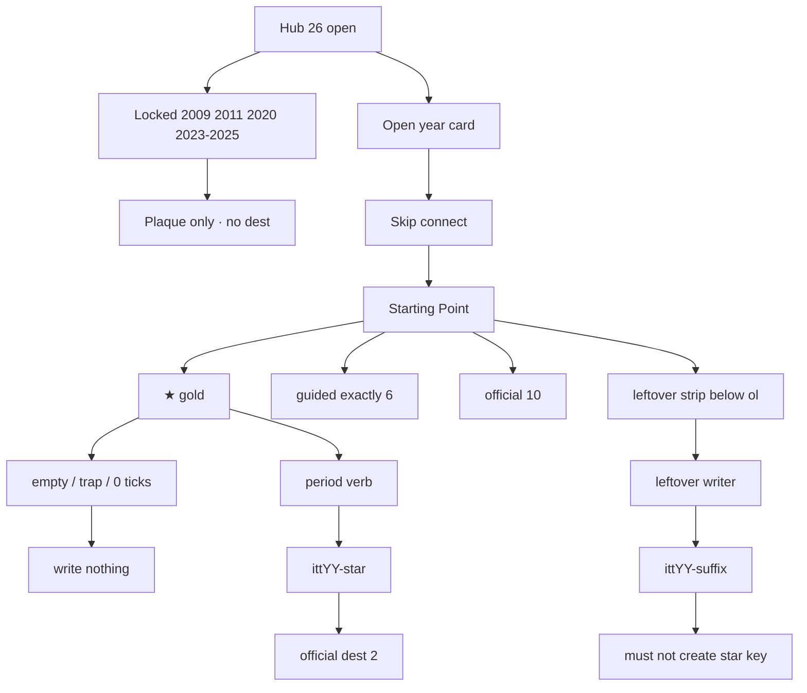

# All years — check every flow (new diagram)

**Date:** 2026-09-01  
**What this is:** one visitor walk for **every year on disk now**. Open the URL. Do the trap. Do the save. Confirm the key.  
**Disk:** **26 years open** · 1994–2008 + 2010 + 2012–2019 + 2021–2022.  
**Boarded (do not invent dests):** **2009 · 2011 · 2020 · 2023 · 2024 · 2025**.  
**Law:** [`DISK-TRUTH.md`](DISK-TRUTH.md). Per-year maps lose if they still say a live year is wiped (or a wiped year is live).

Serve:

```
python3 -m http.server 8081 --bind 127.0.0.1
```

Open `http://127.0.0.1:8081/` · DevTools → Application → Local Storage.  
Clear `ittYY-*` for the year you are checking **before** you start.

**Pass rule (every writer):** empty / trap / 0 ticks / 1 hop / skip wait **never writes**. Complete writes JSON with `real` + `year:"YYYY"`. Reload still shows the save. **Next** stays hidden until that dest’s key exists. Guided `<ol>` stays **exactly 6**. Chip never moves. Exit keys are `ittYY-*` only — no neighbor year.

**Leftover law (do not mix):**

| Years | Leftover you are checking |
|-------|---------------------------|
| **2007 · 2021 · 2022** | leftover-official **120** · `#ott-2x-YYYY` below guided · leftover complete **never** writes the star |
| **2010 · 2012–2019** | leftover **9+9+9** dest-true · not 120 |
| **2001 · 2002 · 2003** | CUT-FOREST leftover ~18 year-true |
| **1994–2000 · 2004–2006 · 2008** | forest leftover / older machines · leftover-official matrix is a **sample**, not every dest |

---

## Diagram (check this first)

```
Hub · 26 years open
  OPEN   1994–2008 + 2010 + 2012–2019 + 2021–2022
  LOCKED 2009 · 2011 · 2020 · 2023 · 2024 · 2025
        │
        ▼
  years/YYYY/  Skip connect
        │
        ▼
  Starting Point
    ★ gold chip          ← one star. never leftover. never next-year product
    guided ol = 6        ← About · ★ · leftover · leftover · leftover · Map
    official 10          ← 10 writers · Next waits for the key
    leftover strip       ← BELOW guided · never inside <ol>
        │
        ├─ gold trap / empty / 0 ticks  →  write nothing
        ├─ gold complete                →  ittYY-star  · reload persist
        ├─ official dest 2–10 complete  →  that dest key only
        ├─ leftover complete            →  ittYY-<suffix> only · NEVER the star
        └─ Exit                         →  ittYY-* only
```



**Fail if:** 7th guided `<li>` · chip is a leftover dest · trap writes · leftover writes gold · Next to a neighbor year · 404 · boarded year dest folder · invented June ILS cell after 2018.

---

## 0. Hub (do this once)

| Step | Do | Pass |
|------|----|------|
| 0.1 | Open `/` | body says **26 years open** |
| 0.2 | Each open year | `a.year-card.available.yYYYY` · href `years/YYYY/` |
| 0.3 | Each boarded year | `.year-card.locked.yYYYY` · **no** `available` · **no** href into a tree |
| 0.4 | Atlas | 2007 / 2021 / 2022 are **open** doors · 2009 / 2011 / 2020 / 2023–2025 gray |

Boarded card is the check. Do **not** open a dest for 2009 / 2011 / 2020 / 2023 / 2024 / 2025.

---

## Shared year door (every OPEN year)

| Step | Do | Pass |
|------|----|------|
| D1 | `/years/YYYY/` · Skip connect | Shell matches the year (XP+IE6 through 2007 · IE7 2008 · lean later · Chrome habit **2015+**) |
| D2 | Starting Point chip | ★ one-thing · href is official n=1 |
| D3 | `#ott-guided-YYYY ol > li` | **6** · first About · last Map |
| D4 | About | dual-cite honest · bans printed · thesis ticks do **not** write gold |
| D5 | Official 10 dests | each href HTTP 200 · `data-itt-year="YYYY"` |
| D6 | Leftover complete | never creates the star key |

Then walk that year’s official 10 below. Gold = n=1.

---

## 1994 · CSotD guestbook · `itt94-csotd`

**Trap:** submit empty / no wander. **Save:** name + note + guestbook.

| n | Dest | href | key |
|--:|------|------|-----|
| 1 | ★ CSotD guestbook | `sites/csotd/index.html` | `itt94-csotd` |
| 2 | Yahoo drill | `sites/yahoo/index.html` | `itt94-yahoo-wander` |
| 3 | Mosaic origin | `sites/cern/index.html` | `itt94-cern` |
| 4 | Fish Cam | `sites/fishcam/index.html` | `itt94-fishcam` |
| 5 | White House | `sites/whitehouse/index.html` | `itt94-wh-map` |
| 6 | NASA | `sites/nasa/index.html` | `itt94-nasa` |
| 7 | IUMA listen | `sites/iuma/listen.html` | `itt94-iuma` |
| 8 | HotWired | `sites/hotwired/index.html` | `itt94-hotwired` |
| 9 | Lycos catalog | `sites/lycos/index.html` | `itt94-lycos` |
| 10 | Hotlist Surfer | `sites/playable/game.html` | `itt94-game-hotlist` |

**Fail if:** search box as the chip · leftover writes `itt94-csotd`.

---

## 1995 · SSL checkout · `itt95-ssl-checkout`

**Trap:** submit empty cart. **Save:** name + card + city.

| n | Dest | href | key |
|--:|------|------|-----|
| 1 | ★ SSL checkout | `sites/amazon/ssl-checkout.html` | `itt95-ssl-checkout` |
| 2 | Amazon book | `sites/amazon/index.html` | `itt95-amazon` |
| 3 | AuctionWeb bid | `sites/auctionweb/item-laser.html` | `itt95-aw-bid` |
| 4 | GeoCities homestead | `sites/geocities/homestead.html` | `itt95-homestead` |
| 5 | Yahoo directory | `sites/yahoo/index.html` | `itt95-yahoo` |
| 6 | AltaVista | `sites/altavista/index.html` | `itt95-av` |
| 7 | CNN | `sites/cnn/index.html` | `itt95-cnn` |
| 8 | Microsoft | `sites/microsoft/index.html` | `itt95-ms` |
| 9 | Netscape | `sites/netscape/index.html` | `itt95-ns-dl` |
| 10 | Classmates | `sites/classmates/index.html` | `itt95-classmates` |

**Fail if:** eBay-as-chip (AuctionWeb is leftover) · empty SSL writes.

---

## 1996 · Portal wars · `itt96-portal-wars`

**Trap:** hop only one portal. **Save:** Yahoo + Excite + AltaVista.

| n | Dest | href | key |
|--:|------|------|-----|
| 1 | ★ Portal wars | `sites/portals/wars.html` | `itt96-portal-wars` |
| 2 | HoTMaiL | `sites/hotmail/index.html` | `itt96-hotmail-user` |
| 3 | Space Jam | `sites/spacejam/index.html` | `itt96-jam` |
| 4 | My Yahoo | `sites/yahoo/my.html` | `itt96-myyahoo` |
| 5 | GeoCities | `sites/geocities/index.html` | `itt96-geocities` |
| 6 | Amazon | `sites/amazon/index.html` | `itt96-amazon` |
| 7 | AuctionWeb | `sites/auctionweb/index.html` | `itt96-auctionweb` |
| 8 | Excite | `sites/excite/index.html` | `itt96-excite` |
| 9 | AltaVista | `sites/altavista/index.html` | `itt96-av` |
| 10 | Planets | `sites/playable/game.html` | `itt96-game-planets` |

---

## 1997 · PointCast · `itt97-pointcast`

**Trap:** one channel only. **Save:** News + Weather.

| n | Dest | href | key |
|--:|------|------|-----|
| 1 | ★ PointCast | `sites/pointcast/index.html` | `itt97-pointcast` |
| 2 | ICQ | `sites/icq/index.html` | `itt97-icq-buddy` |
| 3 | eBay laptop | `sites/ebay/item-laptop.html` | `itt97-ebay` |
| 4 | HoTMaiL | `sites/hotmail/index.html` | `itt97-hotmail` |
| 5 | Slashdot | `sites/slashdot/story.html` | `itt97-sd-comments-ie4` |
| 6 | Drudge | `sites/drudge/index.html` | `itt97-drudge` |
| 7 | HotBot | `sites/hotbot/index.html` | `itt97-hotbot` |
| 8 | AIM seed | `sites/aim/index.html` | `itt97-aim-seed` |
| 9 | Think Different | `sites/apple/think-different.html` | `itt97-td` |
| 10 | Microsoft | `sites/microsoft/index.html` | `itt97-ms` |

**Fail if:** eBay is the chip.

---

## 1998 · I’m Feeling Lucky · `itt98-lucky`

**Trap:** Lucky with empty query. **Save:** type ≥2 + Lucky.

| n | Dest | href | key |
|--:|------|------|-----|
| 1 | ★ I’m Feeling Lucky | `sites/google/lucky.html` | `itt98-lucky` |
| 2 | Google empty | `sites/google/index.html` | `itt98-google` |
| 3 | Yahoo packed | `sites/yahoo/index.html` | `itt98-yahoo` |
| 4 | Amazon Music | `sites/amazon/music.html` | `itt98-amazon-music` |
| 5 | eBay | `sites/ebay/index.html` | `itt98-ebay` |
| 6 | CDnow | `sites/cdnow/index.html` | `itt98-cdnow` |
| 7 | HoTMaiL | `sites/hotmail/index.html` | `itt98-hotmail` |
| 8 | Mozilla.org | `sites/mozilla/index.html` | `itt98-mozilla` |
| 9 | Slashdot | `sites/slashdot/index.html` | `itt98-slashdot` |
| 10 | DMOZ | `sites/dmoz/index.html` | `itt98-dmoz` |

**Fail if:** portal is the chip · empty Lucky writes.

---

## 1999 · AIM sign-on · `itt99-aim`

**Trap:** sign-on empty. **Save:** screen name + sign-on.

| n | Dest | href | key |
|--:|------|------|-----|
| 1 | ★ AIM sign-on | `sites/aim/index.html` | `itt99-aim` |
| 2 | Napster | `sites/napster/search.html` | `itt99-napster` |
| 3 | Google | `sites/google/index.html` | `itt99-google` |
| 4 | Blogger | `sites/blogger/edit.html` | `itt99-blogger` |
| 5 | Y2K | `sites/y2k/index.html` | `itt99-y2k` |
| 6 | SourceForge | `sites/sourceforge/index.html` | `itt99-sf` |
| 7 | PayPal | `sites/paypal/send.html` | `itt99-paypal` |
| 8 | Amazon | `sites/amazon/index.html` | `itt99-amazon` |
| 9 | eBay | `sites/ebay/item-laptop.html` | `itt99-ebay` |
| 10 | Ask Jeeves | `sites/askjeeves/index.html` | `itt99-jeeves` |

---

## 2000 · MapQuest · `itt00-mapquest`

**Trap:** empty From/To. **Save:** from + to + Get Directions.

| n | Dest | href | key |
|--:|------|------|-----|
| 1 | ★ MapQuest | `sites/mapquest/index.html` | `itt00-mapquest` |
| 2 | Amazon smile | `sites/amazon/index.html` | `itt00-amazon` |
| 3 | eBay | `sites/ebay/item-laptop.html` | `itt00-ebay` |
| 4 | PayPal | `sites/paypal/send.html` | `itt00-paypal` |
| 5 | Napster | `sites/napster/search.html` | `itt00-napster` |
| 6 | Gnutella | `sites/gnutella/index.html` | `itt00-gnutella` |
| 7 | Pets.com | `sites/pets/shop.html` | `itt00-amazon-cart` |
| 8 | Google | `sites/google/index.html` | `itt00-google` |
| 9 | CNN | `sites/cnn/index.html` | `itt00-cnn` |
| 10 | Y2K | `sites/y2k/index.html` | `itt00-y2k` |

---

## 2001 · Wikipedia UseMod · `itt01-wiki`

**Trap:** Preview · empty Save. **Save:** body + **Save** (Preview never writes).

| n | Dest | href | key |
|--:|------|------|-----|
| 1 | ★ Wikipedia | `sites/wikipedia/edit.html` | `itt01-wiki` |
| 2 | Wayback | `sites/archive/index.html` | `itt01-wayback` |
| 3 | iTunes library | `sites/itunes/index.html` | `itt01-itunes` |
| 4 | iPod | `sites/apple/ipod.html` | `itt01-ipod` |
| 5 | Napster leftover | `sites/napster/index.html` | `itt01-napster` |
| 6 | Movable Type | `sites/movabletype/index.html` | `itt01-mt` |
| 7 | Google leftover | `sites/google/index.html` | `itt01-google` |
| 8 | Yahoo leftover | `sites/yahoo/index.html` | `itt01-yahoo` |
| 9 | Amazon leftover | `sites/amazon/index.html` | `itt01-amz` |
| 10 | Clickscape | `sites/playable/game.html` | `itt01-game-clickscape` |

**Fail if:** Preview writes · Store-as-chip.

---

## 2002 · StumbleUpon · `itt02-stumble`

**Trap:** Stumble with no topic. **Save:** pick topic + Stumble + Thumb up.

| n | Dest | href | key |
|--:|------|------|-----|
| 1 | ★ StumbleUpon | `sites/stumbleupon/index.html` | `itt02-stumble` |
| 2 | Always-on | `sites/isp/index.html` | `itt02-broadband` |
| 3 | KaZaA | `sites/kazaa/index.html` | `itt02-kazaa` |
| 4 | Wired CSS | `sites/wired/index.html` | `itt02-wired` |
| 5 | Phoenix | `sites/phoenix/index.html` | `itt02-phoenix` |
| 6 | Mozilla 1.0 | `sites/mozilla/index.html` | `itt02-mozilla` |
| 7 | iPod gen 2 | `sites/ipod/index.html` | `itt02-ipod2` |
| 8 | Friendster seed | `sites/friendster/index.html` | `itt02-fs` |
| 9 | TrackBack | `sites/movabletype/trackback.html` | `itt02-trackback` |
| 10 | Room Sticky | `sites/playable/game.html` | `itt02-game-roomsticky` |

**Fail if:** checkbox-as-topic (dest is a **select**) · MySpace-as-chip.

---

## 2003 · Photobucket · `itt03-photobucket`

**Trap:** empty filename. **Save:** filename + upload.

| n | Dest | href | key |
|--:|------|------|-----|
| 1 | ★ Photobucket | `sites/photobucket/index.html` | `itt03-photobucket` |
| 2 | iTunes Store | `sites/itunes/index.html` | `itt03-itunes-library` |
| 3 | WordPress | `sites/wordpress/dashboard.html` | `itt03-wp-posts` |
| 4 | LinkedIn | `sites/linkedin/invite.html` | `itt03-li-connections` |
| 5 | MySpace | `sites/myspace/index.html` | `itt03-ms-top8` |
| 6 | Friendster mass | `sites/friendster/friends.html` | `itt03-fs-mass` |
| 7 | AdSense | `sites/adsense/index.html` | `itt03-adsense` |
| 8 | Bloglines | `sites/bloglines/index.html` | `itt03-bloglines-feeds` |
| 9 | Blogger-Google | `sites/blogger/edit.html` | `itt03-blog` |
| 10 | Gags Lite | `sites/playable/game.html` | `itt03-game-gagslite` |

---

## 2004 · thefacebook networks · `itt04-thefacebook-networks`

**Trap:** Join with no college. **Save:** network + honesty + Join.

| n | Dest | href | key |
|--:|------|------|-----|
| 1 | ★ thefacebook networks | `sites/facebook/networks.html` | `itt04-thefacebook-networks` |
| 2 | Gmail | `sites/gmail/index.html` | `itt04-gmail` |
| 3 | Firefox 1.0 | `sites/firefox/index.html` | `itt04-fx` |
| 4 | Flickr | `sites/flickr/index.html` | `itt04-flickr` |
| 5 | del.icio.us | `sites/delicious/index.html` | `itt04-delicious` |
| 6 | Digg seed | `sites/digg/index.html` | `itt04-digg` |
| 7 | Friends | `sites/facebook/friends.html` | `itt04-fb-friends` |
| 8 | Profile | `sites/facebook/profile.html` | `itt04-fb-profile` |
| 9 | Invite | `sites/facebook/invite.html` | `itt04-fb-invite` |
| 10 | Web 2.0 Conf | `sites/web20conference/index.html` | `itt04-web20` |

**Fail if:** News Feed-as-chip (Feed is 2006 leftover).

---

## 2005 · YouTube upload · `itt05-yt-uploads`

**Trap:** empty title. **Save:** residual title + upload.

| n | Dest | href | key |
|--:|------|------|-----|
| 1 | ★ Upload | `sites/youtube/upload.html` | `itt05-yt-uploads` |
| 2 | Maps leftover | `sites/maps/index.html` | `itt05-maps` |
| 3 | Pandora leftover | `sites/pandora/index.html` | `itt05-pandora` |
| 4 | HousingMaps leftover | `sites/housingmaps/index.html` | `itt05-hm` |
| 5 | Digg leftover | `sites/digg/index.html` | `itt05-digg` |
| 6 | Reddit leftover | `sites/reddit/index.html` | `itt05-reddit` |
| 7 | Flickr leftover | `sites/flickr/index.html` | `itt05-flickr` |
| 8 | iTunes podcasts leftover | `sites/itunes/podcasts.html` | `itt05-pod` |
| 9 | TechCrunch leftover | `sites/techcrunch/index.html` | `itt05-tc` |
| 10 | HoverChop | `sites/playable/game.html` | `itt05-game-heli` |

**Fail if:** Google-owns-YouTube as 2005 gold (that leftover is 2006).

---

## 2006 · Twttr · `itt06-tweets`

**Trap:** empty / 0 ticks. **Save:** ticks + body + Update.

| n | Dest | href | key |
|--:|------|------|-----|
| 1 | ★ Twttr | `sites/twitter/index.html` | `itt06-tweets` |
| 2 | News Feed leftover | `sites/facebook/feed.html` | `itt06-feed` |
| 3 | Facebook open leftover | `sites/facebook/open.html` | `itt06-fb-open` |
| 4 | YouTube Google-owned leftover | `sites/youtube/index.html` | `itt06-yt` |
| 5 | Google Docs leftover | `sites/googledocs/index.html` | `itt06-gdocs` |
| 6 | S3 leftover | `sites/aws/index.html` | `itt06-s3` |
| 7 | IE7 leftover | `sites/ie7/index.html` | `itt06-ie7` |
| 8 | Wiki millionth leftover | `sites/wikipedia/millionth.html` | `itt06-wiki-1m` |
| 9 | Roblox leftover | `sites/roblox/index.html` | `itt06-roblox` |
| 10 | Line Rider leftover | `sites/playable/linerider.html` | `itt06-game-linerider` |

**Fail if:** iPhone-as-chip · trail `whenKey` is `itt06-yt-google` (dest writes `itt06-yt`). Starting Point has **no** popular 3× row this year — that is a known hole, not a dest.

---

## 2007 · iPhone Safari · `itt07-iphone` · leftover **120**

**Trap:** empty URL · 0 ticks · **App Store** · **Chrome** · 3G. **Save:** URL ≥2 + both ticks + **Go**.

| n | Dest | href | key |
|--:|------|------|-----|
| 1 | ★ iPhone Safari | `sites/iphone/index.html` | `itt07-iphone` |
| 2 | Street View leftover | `sites/streetview/index.html` | `itt07-streetview` |
| 3 | Gmail open leftover | `sites/gmail/index.html` | `itt07-gmail` |
| 4 | Facebook Platform leftover | `sites/fbplat/index.html` | `itt07-fbplat` |
| 5 | Twitter leftover | `sites/twitter/index.html` | `itt07-twitter` |
| 6 | YouTube leftover | `sites/youtube/index.html` | `itt07-youtube` |
| 7 | Tumblr leftover | `sites/tumblr/index.html` | `itt07-tumblr` |
| 8 | Kindle leftover | `sites/kindle/index.html` | `itt07-kindle` |
| 9 | XP/IE6 residual | `sites/ie6/index.html` | `itt07-ie6` |
| 10 | Safari Queue | `sites/playable/game.html` | `itt07-game-safariq` |

**Leftover 2×:** `#ott-2x-2007` below guided · 120 writers · A40 `sites/iphone/about.html` `itt07-iphone-lx` **never** writes gold.  
Popular 3×: YouTube · Wikipedia · MySpace. 3×3: Digg · Flickr · Reddit.

**Fail if:** App Store writes gold · chip is Street View · iPhone is January desktop · leftover writes `itt07-iphone` · June cell invented (2007 **has** 121,892,559).

About must print: June **121,892,559** · January **106,875,138** · users **1,373,327,790**.

---

## 2008 · GitHub issue · `itt08-github`

**Trap:** empty issue. **Save:** title + body + submit.

| n | Dest | href | key |
|--:|------|------|-----|
| 1 | ★ GitHub issue | `sites/github/issue.html` | `itt08-github` |
| 2 | App Store leftover | `sites/appstore/index.html` | `itt08-apps` |
| 3 | Chrome | `sites/chrome/index.html` | `itt08-chrome` |
| 4 | Android G1 | `sites/android/index.html` | `itt08-android` |
| 5 | Hulu | `sites/hulu/index.html` | `itt08-hulu` |
| 6 | Facebook | `sites/facebook/index.html` | `itt08-facebook` |
| 7 | Twitter | `sites/twitter/index.html` | `itt08-tweets` |
| 8 | YouTube | `sites/youtube/index.html` | `itt08-yt` |
| 9 | Dropbox | `sites/dropbox/index.html` | `itt08-dropbox` |
| 10 | iPhone 3G | `sites/iphone/index.html` | `itt08-iphone3g` |

**Fail if:** App Store is the chip (it is official leftover) · Chrome-as-January-desktop.

---

## 2010 · Instagram iOS · `itt10-ig-posts`

**Trap:** empty share. **Save:** filter + share.

| n | Dest | href | key |
|--:|------|------|-----|
| 1 | ★ Instagram | `sites/instagram/index.html` | `itt10-ig-posts` |
| 2 | iPhone 4 | `sites/iphone/index.html` | `itt10-iphone4` |
| 3 | iPad | `sites/ipad/order.html` | `itt10-ipad` |
| 4 | Open Graph | `sites/facebook/index.html` | `itt10-fb-og` |
| 5 | FarmVille peak | `sites/farmville/index.html` | `itt10-farm` |
| 6 | Imgur | `sites/imgur/index.html` | `itt10-imgur` |
| 7 | Foursquare | `sites/foursquare/index.html` | `itt10-4sq` |
| 8 | Twitter | `sites/twitter/index.html` | `itt10-tweets` |
| 9 | YouTube | `sites/youtube/index.html` | `itt10-yt` |
| 10 | Sling Nest | `sites/playable/game.html` | `itt10-game-slingnest` |

**Fail if:** Android Instagram-as-chip (that is 2012). Leftover here is **9+9+9**, not 120.

---

## 2012 · IG Android · `itt12-ig-android`

**Trap:** empty share. **Save:** named filter + share.

| n | Dest | href | key |
|--:|------|------|-----|
| 1 | ★ Instagram Android | `sites/instagram/android.html` | `itt12-ig-android` |
| 2 | Pinterest | `sites/pinterest/index.html` | `itt12-pin` |
| 3 | Facebook IPO | `sites/facebook/ipo.html` | `itt12-fb-ipo` |
| 4 | Facebook 1B | `sites/facebook/index.html` | `itt12-facebook` |
| 5 | Maps flop | `sites/iphone/maps.html` | `itt12-maps` |
| 6 | SOPA | `sites/wikipedia/sopa.html` | `itt12-sopa` |
| 7 | Medium leftover | `sites/medium/index.html` | `itt12-pop-medium` |
| 8 | Path leftover | `sites/path/index.html` | `itt12-pop-path` |
| 9 | Flipboard leftover | `sites/flipboard/index.html` | `itt12-pop-flipboard` |
| 10 | Guess Doodle | `sites/playable/game.html` | `itt12-game-guessdoodle` |

---

## 2013 · Vine 6s · `itt13-vine-posts`

**Trap:** empty loop. **Save:** 6s post.

| n | Dest | href | key |
|--:|------|------|-----|
| 1 | ★ Vine 6s | `sites/vine/record.html` | `itt13-vine-posts` |
| 2 | IG Video | `sites/instagram/video.html` | `itt13-ig-posts` |
| 3 | Stories | `sites/snapchat/story.html` | `itt13-snap-story` |
| 4 | iOS 7 | `sites/iphone/ios7.html` | `itt13-ios7` |
| 5 | Touch ID | `sites/iphone/touchid.html` | `itt13-touchid` |
| 6 | Snowden | `sites/snowden/index.html` | `itt13-snowden-ack` |
| 7 | Telegram | `sites/telegram/index.html` | `itt13-telegram-chat` |
| 8 | Yahoo×Tumblr | `sites/tumblr/index.html` | `itt13-tumblr-yahoo` |
| 9 | Win8.1 | `sites/windows81/index.html` | `itt13-win81` |
| 10 | Loop Six | `sites/playable/game.html` | `itt13-game-loopsix` |

**Fail if:** Stories-as-Instagram (Stories here are Snapchat).

---

## 2014 · WhatsApp Install · `itt14-wa-install`

**Trap:** Messenger. **Save:** Install.

| n | Dest | href | key |
|--:|------|------|-----|
| 1 | ★ WhatsApp | `sites/whatsapp/index.html` | `itt14-wa-install` |
| 2 | Chat | `sites/whatsapp/chat.html` | `itt14-wa-chat` |
| 3 | Heartbleed | `sites/heartbleed/index.html` | `itt14-heartbleed` |
| 4 | Ice Bucket | `sites/icebucket/index.html` | `itt14-icebucket` |
| 5 | iPhone 6 | `sites/iphone/index.html` | `itt14-iphone6` |
| 6 | Apple Pay | `sites/iphone/pay.html` | `itt14-applepay` |
| 7 | Material | `sites/material/index.html` | `itt14-material` |
| 8 | Slack | `sites/slack/index.html` | `itt14-slack` |
| 9 | Twitch | `sites/twitch/index.html` | `itt14-twitch` |
| 10 | Tile Fold | `sites/playable/game.html` | `itt14-game-tilefold` |

**Fail if:** Messenger writes gold · chip is Ice Bucket.

---

## 2015 · Periscope Go LIVE · `itt15-periscope`

**Trap:** empty title / no LIVE. **Save:** title + Go LIVE. Chrome habit **starts** this year.

| n | Dest | href | key |
|--:|------|------|-----|
| 1 | ★ Periscope Go LIVE | `sites/periscope/index.html` | `itt15-periscope` |
| 2 | Google Photos | `sites/googlephotos/index.html` | `itt15-googlephotos` |
| 3 | Windows 10 | `sites/windows10/index.html` | `itt15-win10` |
| 4 | Apple Music | `sites/applemusic/index.html` | `itt15-applemusic` |
| 5 | Edge Spartan | `sites/edge/index.html` | `itt15-edge` |
| 6 | Watch leftover | `sites/apple/watch.html` | `itt15-watch` |
| 7 | Snap Discover | `sites/snapchat/discover.html` | `itt15-snap-discover` |
| 8 | Discord | `sites/discord/index.html` | `itt15-discord` |
| 9 | Let's Encrypt | `sites/letsencrypt/index.html` | `itt15-le` |
| 10 | Blob Rush | `sites/playable/game.html` | `itt15-game-blobrush` |

**Fail if:** IG Stories-as-chip (that is 2016).

---

## 2016 · IG Stories · `itt16-ig-stories`

**Trap:** empty add. **Save:** add leftover story.

| n | Dest | href | key |
|--:|------|------|-----|
| 1 | ★ Instagram Stories | `sites/instagram/stories.html` | `itt16-ig-stories` |
| 2 | Pokémon GO | `sites/pokemongo/index.html` | `itt16-pogo` |
| 3 | Reactions | `sites/facebook/reactions.html` | `itt16-fb-react` |
| 4 | WhatsApp E2E | `sites/whatsapp/e2e.html` | `itt16-wa-e2e` |
| 5 | iPhone 7 | `sites/iphone/index.html` | `itt16-iphone7` |
| 6 | Vine goodbye | `sites/vine/goodbye.html` | `itt16-vine-end` |
| 7 | Spectacles | `sites/snapchat/spectacles.html` | `itt16-spectacles` |
| 8 | musical.ly | `sites/musically/index.html` | `itt16-musically` |
| 9 | Win10 upgrade ends | `sites/windows10/end.html` | `itt16-win10-end` |
| 10 | Gym Rush | `sites/playable/game.html` | `itt16-game-gymrush` |

**Fail if:** Snapchat-as-chip (Snap invented the format; the chip is IG Stories).

---

## 2017 · Face ID · `itt17-faceid`

**Trap:** empty look. **Save:** look + swipe up.

| n | Dest | href | key |
|--:|------|------|-----|
| 1 | ★ Face ID / iPhone X | `sites/iphone/x.html` | `itt17-faceid` |
| 2 | Fortnite BR | `sites/fortnite/index.html` | `itt17-fortnite` |
| 3 | Twitter 280 | `sites/twitter/280.html` | `itt17-twitter-280` |
| 4 | Teams GA | `sites/teams/index.html` | `itt17-teams` |
| 5 | Vine gone | `sites/vine/gone.html` | `itt17-vine-gone` |
| 6 | Nintendo Switch | `sites/switch/index.html` | `itt17-switch` |
| 7 | WannaCry | `sites/wannacry/index.html` | `itt17-wannacry` |
| 8 | musical.ly | `sites/musically/index.html` | `itt17-musically` |
| 9 | Equifax freeze | `sites/equifax/index.html` | `itt17-equifax` |
| 10 | Storm Circle | `sites/playable/game.html` | `itt17-game-stormcircle` |

**Fail if:** Fortnite-as-chip.

---

## 2018 · GDPR Manage · `itt18-gdpr`

**Trap:** **Accept All**. **Save:** Manage.

| n | Dest | href | key |
|--:|------|------|-----|
| 1 | ★ GDPR Manage | `sites/gdpr/index.html` | `itt18-gdpr` |
| 2 | TikTok For You | `sites/tiktok/fyp.html` | `itt18-tiktok-fyp` |
| 3 | Hearing | `sites/trust/index.html` | `itt18-hearing` |
| 4 | IGTV | `sites/instagram/igtv.html` | `itt18-igtv` |
| 5 | Chrome 68 | `sites/chrome/not-secure.html` | `itt18-not-secure` |
| 6 | HomePod | `sites/homepod/index.html` | `itt18-homepod` |
| 7 | Spectre | `sites/spectre/index.html` | `itt18-spectre` |
| 8 | Fortnite on Switch | `sites/fortnite/switch.html` | `itt18-fn-switch` |
| 9 | GitHub $7.5B | `sites/github/microsoft.html` | `itt18-github` |
| 10 | Consent Dash | `sites/playable/game.html` | `itt18-game-consentdash` |

**Fail if:** Accept All writes · Reels-as-chip.

---

## 2019 · Disney+ Continue · `itt19-disneyplus`

**Trap:** trial. **Save:** Who’s watching + Continue.

| n | Dest | href | key |
|--:|------|------|-----|
| 1 | ★ Disney+ Who’s watching | `sites/disneyplus/home.html` | `itt19-disneyplus` |
| 2 | TikTok For You | `sites/tiktok/index.html` | `itt19-tiktok` |
| 3 | Apple Arcade | `sites/arcade/index.html` | `itt19-arcade` |
| 4 | Apple TV+ | `sites/appletv/index.html` | `itt19-appletv` |
| 5 | Stadia | `sites/stadia/index.html` | `itt19-stadia` |
| 6 | iPhone 11 | `sites/iphone/iphone11.html` | `itt19-iphone11` |
| 7 | AirPods Pro | `sites/airpodspro/index.html` | `itt19-airpods-pro` |
| 8 | Chrome habit | `sites/chrome/index.html` | `itt19-chrome` |
| 9 | Windows 10 residual | `sites/windows10/index.html` | `itt19-win10` |
| 10 | Continue Row | `sites/playable/game.html` | `itt19-game-continuerow` |

**Fail if:** trial writes · Zoom-as-chip · invented June 2019 ILS cell (table **ends 2018**).

---

## 2021 · ATT Ask · `itt21-att` · leftover **120**

**Trap:** **Allow**. **Save:** Privacy → Tracking hops + ticks + **Ask**.

| n | Dest | href | key |
|--:|------|------|-----|
| 1 | ★ ATT Ask | `sites/att/index.html` | `itt21-att` |
| 2 | Signal leftover | `sites/signal/index.html` | `itt21-signal` |
| 3 | Copilot waitlist | `sites/copilot/index.html` | `itt21-copilot` |
| 4 | Meta rename | `sites/meta/index.html` | `itt21-meta` |
| 5 | Windows 11 leftover | `sites/windows11/index.html` | `itt21-win11` |
| 6 | Flash brick | `sites/flash/index.html` | `itt21-flash-brick` |
| 7 | Chrome habit | `sites/chrome/index.html` | `itt21-chrome` |
| 8 | Windows 10 residual | `sites/windows10/index.html` | `itt21-win10` |
| 9 | Facebook leftover | `sites/facebook/index.html` | `itt21-pop-facebook` |
| 10 | Five Letter | `sites/playable/game.html` | `itt21-game-five` |

**Fail if:** Allow writes · ChatGPT-as-chip · NYT Wordle tiles as gold · Win11 as January OS · leftover writes `itt21-att`.  
About: table ends 2018 · Netcraft Jan **1,197,982,359** · ITU **4.9B / 63%**.  
Known hole: leftover-official matrix lists 56 dests, **50 files** (6 stale rows).

---

## 2022 · ChatGPT Send · `itt22-chatgpt` · leftover **120**

**Trap:** empty · **Plus** · **GPT-4** · **Bing Chat**. **Save:** type ≥2 + ticks + **Send**. Dest name stays **Twitter**.

| n | Dest | href | key |
|--:|------|------|-----|
| 1 | ★ ChatGPT Send | `sites/chatgpt/index.html` | `itt22-chatgpt` |
| 2 | Twitter leftover | `sites/twitter/index.html` | `itt22-twitter` |
| 3 | Wordle leftover | `sites/wordle/index.html` | `itt22-wordle` |
| 4 | Stable Diffusion | `sites/stablediffusion/index.html` | `itt22-sd` |
| 5 | Mastodon leftover | `sites/mastodon/index.html` | `itt22-mastodon` |
| 6 | BeReal leftover | `sites/bereal/index.html` | `itt22-bereal` |
| 7 | DALL·E 2 leftover | `sites/dalle2/index.html` | `itt22-dalle2` |
| 8 | Chrome habit | `sites/chrome/index.html` | `itt22-chrome` |
| 9 | Windows 10 residual | `sites/windows10/index.html` | `itt22-win10` |
| 10 | Prompt Box | `sites/playable/game.html` | `itt22-game-prompt` |

**Fail if:** Plus writes · dest named X · leftover writes `itt22-chatgpt` · skip-wait BeReal writes.  
About: table ends 2018 · Netcraft Jan **1,167,715,133** · ITU **5.3B / 66%**.  
Known hole: leftover-official matrix lists 56 dests, **44 files** (12 stale rows).

---

## Boarded — check the lock only

Do **not** open a dest. The check is the locked card.

| Year | Card | If someone named it later, star would be | Do not treat as live |
|------|------|------------------------------------------|----------------------|
| **2009** | locked | Facebook Like `itt09-like` | Like dest · FarmVille dest |
| **2011** | locked | Google+ `itt11-gplus` | Circles dest |
| **2020** | locked | Zoom Leave `itt20-zoom` | READ-FIRST still **lies** (“door on disk”) |
| **2023** | locked | Plus Subscribe `itt23-plus` · dest name **X** | freeze ready · no HTML |
| **2024** | locked | GPT-4o Talk `itt24-gpt4o` | freeze ready · no HTML |
| **2025** | locked | none | GPT-5 / R1 are 2025 · not 2024 gold |

```
test -d years/2009 && echo FAIL || echo OK-wiped
test -d years/2011 && echo FAIL || echo OK-wiped
test -d years/2020 && echo FAIL || echo OK-wiped
test -d years/2023 && echo FAIL || echo OK-wiped
test -d years/2024 && echo FAIL || echo OK-wiped
test -d years/2025 && echo FAIL || echo OK-wiped
```

---

## Isolation (after any complete)

| Check | Pass |
|-------|------|
| Gold complete | only `ittYY-<star>` |
| Official dest 2–10 complete | that dest key · **not** the star |
| Leftover complete | `ittYY-<suffix>` · **not** the star |
| Neighbor prefix | no `itt(YY-1)-*` · no `itt(YY+1)-*` |
| Boarded year | no `itt09` / `itt11` / `itt20` / `itt23` / `itt24` / `itt25` writers on disk |

---

## Companion maps

| Year | Per-year check map |
|------|--------------------|
| 2007 | [`2007-CHECK-EVERY-FLOW-MAP.md`](2007-CHECK-EVERY-FLOW-MAP.md) |
| 2021 | no check-every-flow file yet — use this diagram + [`2021-READ-FIRST.md`](2021-READ-FIRST.md) |
| 2022 | [`2022-CHECK-EVERY-FLOW-MAP.md`](2022-CHECK-EVERY-FLOW-MAP.md) (header still talks like a freeze — **door is live**) |
| 2023 / 2024 | freeze maps only · door absent |
| What’s shipped vs not | [`SHIP-COMPLETE-VS-INCOMPLETE-2026-09-01.md`](SHIP-COMPLETE-VS-INCOMPLETE-2026-09-01.md) |

Official hrefs and `whenKey`s in this file are copied from `js/config/flow-trails.js` on 2026-09-01. If a dest file 404s, the trail is the bug — do not invent a second star.
