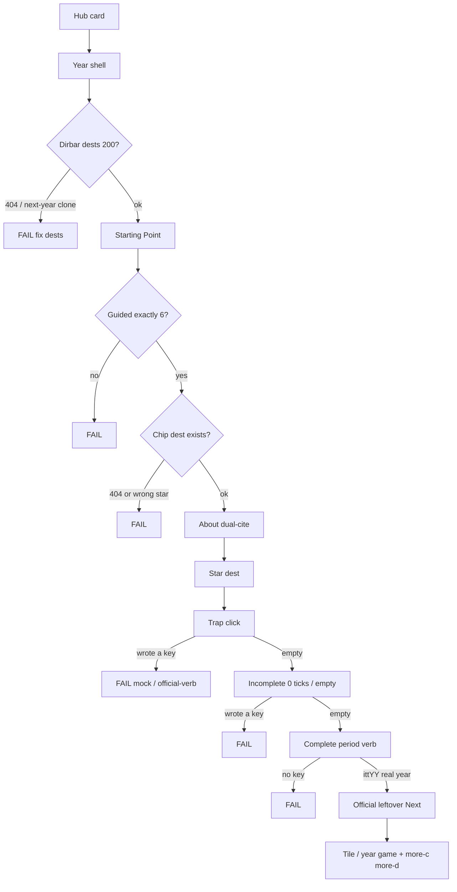
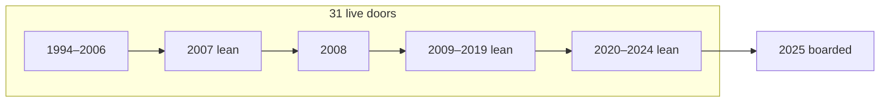
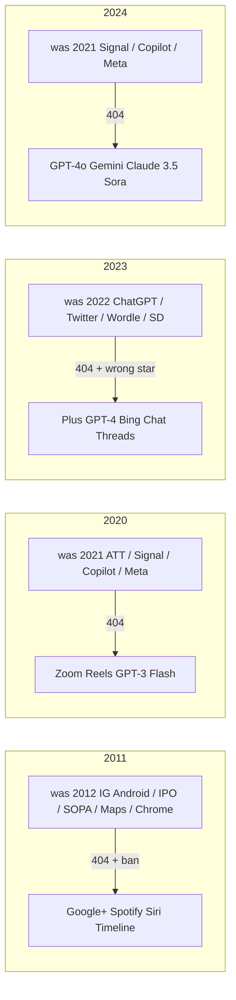
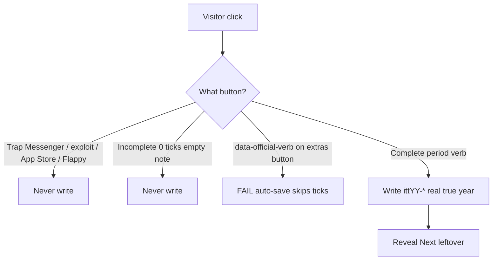

# All-years research + implement recheck — 2026-08-29

**Disk 2026-09-01:** this file’s “31 live / 2025 only boarded” spine **loses** to [`DISK-TRUTH.md`](DISK-TRUTH.md) + [`ALL-YEARS-IMPLEMENT-GOALS-PHASES-EVERY-FLOW-MINUTE-2026-09-01.md`](ALL-YEARS-IMPLEMENT-GOALS-PHASES-EVERY-FLOW-MINUTE-2026-09-01.md) (24 open · 2021 live · 2007/2009/2011/2020/2022–2025 wiped).

Shared bar from each year’s READ-FIRST / densify / REAL contract:

- Year **on disk** is the source of truth. Do not wipe. Do not restore a forest. Do not add dest folders unless named.
- Guided **exactly 6**. Chip dest exists. Official 10 dests exist.
- Trap / incomplete **never writes**. Complete writes `ittYY-*` `{ real:true, year }`.
- **No** `data-official-verb` on a period-verb button that also has extras honesty (that auto-save skips ticks).
- Shell dirbar dests **200**. Clone leftover rooms from the next year are banned.
- Dual-cite scale. 5k is a research envelope, not dest count.
- **2025** is the only boarded year.

`check-all-years.py --http` this pass: **31/31 pass**.

## Check this path — every year

Same walk for 1994–2024. If any box fails, the year is not on the implement bar.



## Museum spine — what is live



Stars you should land on (chip, not leftover):

```mermaid
flowchart TD
  y94[1994 CSotD] --> y95[1995 SSL checkout]
  y95 --> y96[1996 Portal wars]
  y96 --> y97[1997 PointCast]
  y97 --> y98[1998 Lucky]
  y98 --> y99[1999 AIM]
  y99 --> y00[2000 MapQuest]
  y00 --> y01[2001 Wiki edit]
  y01 --> y02[2002 Stumble]
  y02 --> y03[2003 Photobucket]
  y03 --> y04[2004 thefacebook]
  y04 --> y05[2005 YT upload]
  y05 --> y06[2006 Twitter 140]
  y06 --> y07[2007 iPhone Safari]
  y07 --> y08[2008 GitHub / App Store]
  y08 --> y09[2009 Facebook Like]
  y09 --> y10[2010 Instagram iOS]
  y10 --> y11[2011 Google+]
  y11 --> y12[2012 IG Android]
  y12 --> y13[2013 Vine 6s]
  y13 --> y14[2014 WhatsApp Install]
  y14 --> y15[2015 Periscope]
  y15 --> y16[2016 IG Stories]
  y16 --> y17[2017 Face ID]
  y17 --> y18[2018 GDPR]
  y18 --> y19[2019 Disney+]
  y19 --> y20[2020 Zoom mute leave]
  y20 --> y21[2021 ATT Ask]
  y21 --> y22[2022 ChatGPT Send]
  y22 --> y23[2023 Plus Subscribe]
  y23 --> y24[2024 GPT-4o Talk]
  y24 --> y25[2025 boarded]
```



## Dirbar remaps this pass



## Writer honesty



## What was wrong

| Year | Fail | Fix |
|------|------|-----|
| 2011 | Dirbar was 2012 clone: IG Android / IPO / SOPA / Maps flop / Chrome (**404** + banned as 2011 default) | Dirbar → Google+ · Spotify · Siri · Timeline · Pinterest · Twitter · About |
| 2020 | Dirbar was 2021 clone: ATT / Signal / Copilot / Meta (**404**) | Dirbar → Zoom · Reels · GPT-3 · Flash EOL · About |
| 2023 | Dirbar was 2022 clone: ChatGPT / Twitter / Wordle / SD (**404**). ChatGPT is the **2022** star. | Dirbar → Plus · GPT-4 · Bing Chat · Threads · About |
| 2024 | Dirbar was 2021 clone: Signal / Copilot / Meta (**404**) | Dirbar → GPT-4o · Gemini · Claude 3.5 · Sora · About |
| 2011 Siri / Spotify / Timeline / Airbnb | `data-official-verb` on extras buttons wrote before ticks | Removed. Densify Siri trap nowempty now holds. |
| 2012 / 2009 READ-FIRST | Said **wiped** while lean doors are live | Disk truth updated |
| 2020 / 2023 READ-FIRST | Said **2024 wiped** while 2024 GPT-4o is live | Child lock updated |
| `audit-all-year-flows.js` | `WIPED = {2014}` skipped a live door | Scan 1994–2024 · 2025 only boarded · 2014 + 2020–2024 stars restored |
| `check-every-flow.js` | `WIPED = {2007,2020,2024,2025}` skipped live lean doors | 2025 only · 2007 gold = iPhone Safari |
| Missing densify year-checks | 2007 · 2020–2024 had no sibling densify spec | Added |

Dirbar 404 scan after fix: **0** across 1994–2024.

## Densify pack this pass

`2007` · `2011` (dirbar + Siri honesty) · `2014` · `2020` · `2021` · `2022` · `2023` · `2024` — all green after the selector / ban-table / official-verb fixes.

## Still leftover (not this pass)

- 1994–1999 / 2000–2006 / 2008 use older home chrome (JS `paintStart` or densify-trails). Guided 6 is injected; do not force a second `#ott-guided` forest.
- 1994–1999 have no per-year `*-densify.spec.js` (they have sites / buttons / 5× packs). `year-home-densify` still covers ≥20 links.
- `itt_5x_contract.py` still lists 2007 / 2020 / 2024 as wiped for **5× plaques** only (those lean doors have no 5× plaques). That is leftover theater, not dest 404s.
- Early-year `data-official-verb` on dests that are **the** leftover writer (no extras gate) stays. Do not strip those blindly.

```bash
python3 scripts/check-all-years.py --http http://127.0.0.1:8080
npx playwright test e2e/2007-densify.spec.js e2e/2011-densify.spec.js e2e/2014-densify.spec.js e2e/2020-densify.spec.js e2e/2021-densify.spec.js e2e/2022-densify.spec.js e2e/2023-densify.spec.js e2e/2024-densify.spec.js --workers=1
```
