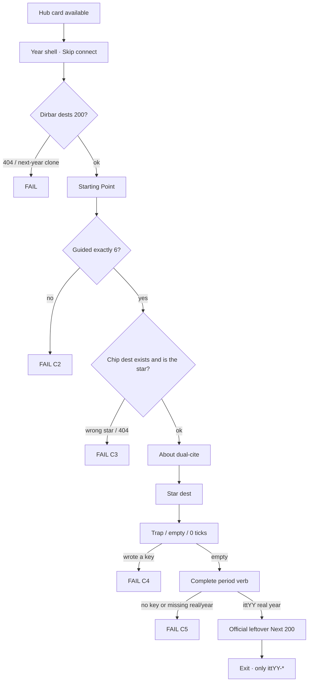
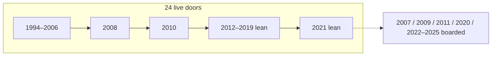
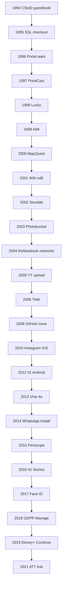

# All years — implement bible · goals · phases · every minute flow

**Date:** 2026-09-01  
**Status:** **walk this to implement or recheck.** Disk + `scripts/itt_gate.py` win when older MD disagrees.  
**Hub now:** **25 years open** · **1994–2017, 2019**.  
**Wiped:** 2018 · 2020–2025. Do **not** invent dests for wiped years. Rebuild only if named.

This file is the **cross-year implement map**. Year-true leftover dest lists stay in that year’s leftover / from-scratch harvest. Stars, guided 6, official 10, and gold minutes here are copied from live `start-data.js` + `flow-trails.js` + one-thing e2e + READ-FIRST.

| Companion | Role |
|-----------|------|
| This file | **Walk / implement this.** Criteria · shared phases · every year gold minute · official 10 · leftover machine |
| [`DISK-TRUTH.md`](DISK-TRUTH.md) | Which years exist |
| [`2021-2X-CRITERIA-MAP-2026-09-01.md`](2021-2X-CRITERIA-MAP-2026-09-01.md) | 2021 leftover 120 tick rows |
| Year `*-READ-FIRST.md` | Thesis · bans · dual-cite |
| Year `*-FROM-SCRATCH-*MINUTE*` | Dest-by-dest leftover when that year has one |

**Legal:** Educational. `localStorage` only. No live IDFA / mint / broker / exploit / PoC. **Never invent brand pixels.** `[failed-final]` on rooms without a harvest still.

Serve: `python3 -m http.server 8080 --bind 127.0.0.1`  
Clear `ittYY-*` for the year you are checking. After a walk: only that year’s prefix.

---

## Criteria (always)

Same envelope as 2001–2002 criteria map, 2005 leftover, 2014 6× leftover, 2021 leftover.

| # | Rule | Fail if |
|--:|------|---------|
| C1 | 2× = leftover **REAL writers** a visitor can finish. Not dest-field plaques. | “I read the year note” ships |
| C2 | Guided `#ott-guided-YYYY ol > li` **exactly 6** | 7th `<li>` |
| C3 | Star does **not** move. Star key is **never** a leftover 2× key | leftover dest is the chip |
| C4 | Empty / trap / 0 ticks / 1 hop / skip wait **never writes** | trap writes gold |
| C5 | Complete writes `{real:true, multiStep:true, year:"YYYY", kind?}` under `ittYY-<suffix>` | missing `real` or `year` |
| C6 | Next hidden until **this** dest’s key exists. Next is **this year**, HTTP 200 | Next to neighbor year · 404 |
| C7 | After a walk: only `ittYY-*` | neighbor prefix appears |
| C8 | Dual-cite scale. ILS June **table ends 2018**. Never invent a later June websites cell | fake June 2019–2025 cell |
| C9 | No invented brand pixels | official logo as art |
| C10 | Do not `git checkout` a wiped forest | HTML dump as density |
| C11 | Do not invent dests for boarded years | 2020/2022 dest folders while wiped |
| C12 | Official 10 every stop is a writer | plaque official trail |
| C13 | Leftover complete **never** writes the star | leftover writes gold |
| C14 | Year differences live in **config + content**, not a skin | 2017 leftover cloned as 2021 |
| C15 | Games cabinets ≠ leftover 2× dests. Famous = 2 | cabinet counted as 2× |

---

## Goals

A visitor can open **every live year**, finish the gold, walk official 10, and finish leftover dests without moving the chip.

```
Hub → year card available
  → Skip connect · year-true shell
  → Starting Point
       guided ol = 6
       ★ chip = gold dest
  → About dual-cite
  → ★ gold: trap never writes · complete writes ittYY-star
  → Official 10: Next after write · leftover ≠ gold
  → Leftover strip below guided (if that year has 2×)
  → Year game
  → Exit · ittYY-* only
```

**Not done if:** 7th guided `<li>` · star moved · dest-field plaques · neighbor prefix · invented June ILS cell · wiped year dests invented.

---

## Shared leftover machine (every dest, every year)

```
open dest
  empty / trap / 0 ticks / 1 hop / skip wait   →  no key
  complete year-true verb                      →  ittYY-*  {real, multiStep, year}
  Next href HTTP 200 · gold key unchanged
```



---

## Shared implement phases

Use these for **any** named rebuild. Do not start P1 until P0 is named and the year is allowed on disk.

| Phase | What | Pass |
|-------|------|------|
| P0 | Hub card available · `SHIP_YEARS` · atlas OPEN · period CSS / chrome habit if 2015+ · About dual-cite · year tree 200 | card `available` · `years/YYYY/` 200 |
| P1 | Star dest · official-verb / extras · trap never writes | e2e incomplete + complete |
| P2 | Guided 6 · official 10 + `flow-trails.js` `"YYYY"` | 10 dests 200 · Next after write |
| P3 | Leftover pack that year named (18 / 120 / 6×) · also-nav in-year · 0 404 | strip below guided |
| P4 | Year game + famous 2 · cabinets not 2× | game writes `ittYY-game-*` |
| P5 | e2e + visitor gate year list · isolation walk | CI green · no neighbor prefix |

**Wiped year:** stop at research freeze until someone says **implement YYYY** / **rebuild YYYY**.

---

## Museum spine (disk 2026-09-01)



Stars you should land on (chip, not leftover):



Boarded stars (lock only · no dests until named): 2007 iPhone Safari · 2009 Facebook Like · 2011 Google+ · 2020 Zoom mute→leave · 2022 ChatGPT Send · 2023 Plus Subscribe · 2024 GPT-4o Talk · 2025 boarded.

---

# LIVE YEARS — gold minute + official 10

How to use a year block:

1. Door check (shared mermaid).  
2. Gold minute. Incomplete must leave `localStorage` empty.  
3. Official 10 in order. Next waits for the write.  
4. Leftover dests if that year named a 2× pack.  
5. Year game.  
6. Isolation: only `ittYY-*`.

Shared leftover minute (every leftover dest):

1. Land. Yellow honesty. `[failed-final]` if no still.  
2. Empty / 0 ticks / 1 hop / skip wait → nothing writes.  
3. Listed trap → nothing writes.  
4. Period verb → `ittYY-<suffix>` only.  
5. Reload. Persist. Next is this year, 200.  
6. Gold key unchanged.

---

## 1994 · live forest · `itt94`

**Thesis:** Directories before search. Cool Site of the Day guestbook is the save.  
**Shell:** Win 3.1 · Netscape 1.0 · 14.4.  
**Star:** CSotD · `sites/csotd/index.html` · `itt94-csotd`  
**Incomplete:** empty guestbook submit. **Trap:** search-as-the-door. **Complete:** visit a cool link + name + note → submit.

**Gold minute**

1. Land guestbook.  
2. Submit empty → no key.  
3. Open the cool link. Return.  
4. Name + note. Submit.  
5. `itt94-csotd`. Next → Yahoo browse (don’t search).

**Guided 6:** About · ★ CSotD · Yahoo @ Stanford · CERN / NCSA · Fish Cam / White House · Map.

**Official 10**

| n | Dest | Key | Incomplete | Complete |
|--:|------|-----|------------|----------|
| 1 | CSotD guestbook | `itt94-csotd` | empty submit | visit + name + note |
| 2 | Yahoo drill | `itt94-yahoo-wander` | search box as gold | browse 3 hubs |
| 3 | Mosaic origin | `itt94-cern` | empty | WWW leftover |
| 4 | Fish Cam | `itt94-fishcam` | skip hop | still + about |
| 5 | White House | `itt94-wh-map` | empty | map leftover |
| 6 | NASA | `itt94-nasa` | empty | leftover |
| 7 | IUMA listen | `itt94-iuma` | play-as-live | listen leftover |
| 8 | HotWired | `itt94-hotwired` | official still | leftover |
| 9 | Lycos catalog | `itt94-lycos` | empty | catalog leftover |
| 10 | Hotlist Surfer | `itt94-game-hotlist` | empty | year game |

**Fail if:** Google-as-1994-door · 7th guided · invented 1995 eBay gold.

---

## 1995 · live forest · `itt95`

**Thesis:** Stores wake up. SSL checkout is the save. AuctionWeb is not eBay yet.  
**Star:** SSL checkout · `sites/amazon/ssl-checkout.html` · `itt95-ssl-checkout`  
**Incomplete:** empty submit. **Complete:** name + card + city.

**Gold minute:** 1 Land padlock. 2 Submit empty → no key. 3 Name + card + city → `itt95-ssl-checkout`. 4 Next → AuctionWeb bid higher.

**Guided 6:** About · ★ SSL · Amazon books → cart · AuctionWeb · GeoCities homestead · Yahoo / map.

**Official 10:** SSL · Amazon book · AuctionWeb bid · GeoCities homestead · Yahoo · AltaVista · CNN · Microsoft · Netscape · Classmates.

**Fail if:** eBay-as-1995-gold · empty SSL writes.

---

## 1996 · live forest · `itt96`

**Thesis:** Portals as home. Walk Yahoo + Excite + AltaVista.  
**Star:** Portal wars · `sites/portals/wars.html` · `itt96-portal-wars`  
**Incomplete:** one portal only. **Complete:** Yahoo + Excite + AltaVista hops.

**Gold minute:** 1 Land wars. 2 One portal → no key. 3 Three portals → `itt96-portal-wars`. 4 Next → HoTMaiL.

**Guided 6:** About · ★ Portal wars · HoTMaiL · Space Jam 3 planets · My Yahoo / GeoCities · Map.

**Official 10:** Portal wars · HoTMaiL · Space Jam · My Yahoo · GeoCities · Amazon · AuctionWeb · Excite · AltaVista · Planet Hop.

**Fail if:** Google-as-1996-gold · one-portal write.

---

## 1997 · live forest · `itt97`

**Thesis:** News pushes onto the desktop. PointCast subscribe is the save.  
**Star:** PointCast · `sites/pointcast/index.html` · `itt97-pointcast`  
**Incomplete:** one channel. **Complete:** News + Weather.

**Gold minute:** 1 Land. 2 News only → no key. 3 News + Weather → `itt97-pointcast`. 4 Next → ICQ.

**Guided 6:** About · ★ PointCast · ICQ · eBay laptop bid · HoTMaiL / Slashdot · Map.

**Official 10:** PointCast · ICQ · eBay laptop · HoTMaiL · Slashdot · Drudge · HotBot · AIM seed · Think Different · Microsoft.

**Fail if:** eBay-as-gold · ICQ as chip.

---

## 1998 · live forest · `itt98`

**Thesis:** Yahoo is fat. Google is almost nothing. Lucky is the sport.  
**Star:** I’m Feeling Lucky · `sites/google/lucky.html` · `itt98-lucky`  
**Incomplete:** Lucky with empty query. **Complete:** type a query + Lucky.

**Gold minute:** 1 Land sparse. 2 Lucky empty → no key. 3 Type `yahoo` + Lucky → `itt98-lucky`. 4 Next → Amazon Music.

**Guided 6:** About · ★ Lucky · Google empty · Yahoo packed · Buy a CD / eBay · Map.

**Official 10:** Lucky · Google empty · Yahoo packed · Amazon Music · eBay · CDnow · HoTMaiL · Mozilla.org · Slashdot · DMOZ.

**Fail if:** packed-Google-as-1998 · empty Lucky writes.

---

## 1999 · live forest · `itt99`

**Thesis:** The ding meant they were there. AIM sign-on is the save.  
**Star:** AIM · `sites/aim/index.html` · `itt99-aim`  
**Incomplete:** empty screen name. **Complete:** screen name sign-on.

**Gold minute:** 1 Land buddy list. 2 Sign on empty → no key. 3 Screen name → `itt99-aim`. 4 Next → Napster search (no real files).

**Guided 6:** About · ★ AIM · Napster · Google funded-still-empty · Blogger / Y2K / SourceForge · Map.

**Official 10:** AIM · Napster · Google · Blogger · Y2K · SourceForge · PayPal · Amazon · eBay · Ask Jeeves.

**Fail if:** iPhone / Chrome as 1999 · live Napster files.

---

## 2000 · live forest · `itt00`

**Thesis:** Peak and crash. MapQuest print is the save. Pets is the memory.  
**Star:** MapQuest · `sites/mapquest/index.html` · `itt00-mapquest`  
**Incomplete:** empty from/to. **Complete:** from + to · print leftover.

**Gold minute:** 1 Land. 2 Get directions empty → no key. 3 From + to → `itt00-mapquest`. 4 Next → Amazon smile.

**Guided 6:** About · ★ MapQuest · Amazon smile · Napster war · Pets.com / Google · Map.

**Official 10:** MapQuest · Amazon smile · eBay · PayPal · Napster · Gnutella · Pets.com · Google · CNN · Y2K.

**Fail if:** Gmail / thefacebook as 2000 gold.

---

## 2001 · CUT-FOREST LIVE · `itt01`

**Thesis:** Memory, jukebox, monopoly. Wiki edit is the save. Preview is not Save.  
**Star:** Wikipedia edit · `sites/wikipedia/edit.html` · `itt01-wiki`  
**Incomplete:** empty / Preview. **Complete:** year-true edit + Save.

**Gold minute:** 1 Land UseMod. 2 Preview → no key. 3 Empty Save → no key. 4 Type + Save → `itt01-wiki`. 5 Next → Wayback.

**Guided 6:** About · ★ Wikipedia · Wayback leftover · iTunes library leftover (no Store) · iPod leftover · Map.

**Official 10:** Wikipedia · Wayback · iTunes library · iPod · Napster leftover · Movable Type · Google leftover · Yahoo leftover · Amazon smile leftover · Clickscape.

**2× leftover:** named **18** (do **not** grow to 120). Variety peer is 2004. See [`2001-2002-CRITERIA-MAP-2026-08-30.md`](2001-2002-CRITERIA-MAP-2026-08-30.md).

**Fail if:** iTunes Store 99¢ as gold · 2000 clone forest as density · 2× padded to 171.

---

## 2002 · CUT-FOREST LIVE · `itt02`

**Thesis:** Always-on is still a minority. Stumble is the save.  
**Star:** StumbleUpon · `sites/stumbleupon/index.html` · `itt02-stumble`  
**Incomplete:** Stumble with no topic. **Complete:** topic + Stumble.

**Gold minute:** 1 Land. 2 Stumble empty → no key. 3 Pick topic + Stumble → `itt02-stumble`. 4 Next → always-on leftover.

**Guided 6:** About · ★ Stumble · Always-on leftover · KaZaA leftover · Wired CSS leftover · Map.

**Official 10:** Stumble · Always-on · KaZaA · Wired CSS · Phoenix · Mozilla 1.0 · iPod gen 2 · Friendster seed · TrackBack · Room Sticky.

**2× leftover:** named **18**. Friendster is leftover **seed** (mass Mar 2003).

**Fail if:** Friendster-as-already-mass · Firefox 1.0 wordmark · Photobucket gold.

---

## 2003 · CUT-FOREST LIVE · `itt03`

**Thesis:** Hotlink and 99¢. Photobucket upload is the save.  
**Star:** Photobucket · `sites/photobucket/index.html` · `itt03-photobucket`  
**Incomplete:** empty upload. **Complete:** upload leftover.

**Gold minute:** 1 Land. 2 Upload empty → no key. 3 Year-true upload → `itt03-photobucket`. 4 Next → iTunes Store leftover (Store never writes gold).

**Guided 6:** About · ★ Photobucket · iTunes Store leftover · WordPress leftover · LinkedIn leftover · Map.

**Official 10:** Photobucket · iTunes Store leftover · WordPress · LinkedIn · MySpace · Friendster mass · AdSense · Bloglines · Blogger-Google · Gags Lite.

**Fail if:** iTunes Store as gold · MySpace moved to 2017.

---

## 2004 · live forest · `itt04`

**Thesis:** Web 2.0 hinge. Campus graph. thefacebook networks is the save.  
**Star:** thefacebook networks · `sites/facebook/networks.html` · `itt04-thefacebook-networks`  
**Incomplete:** Join with no network. **Complete:** Harvard + name + Join.

**Gold minute:** 1 Land campus. 2 Join empty → no key. 3 Harvard + name + Join → key. 4 Next → Friends / poke.

**Guided 6:** About · ★ networks · Firefox 1.0 · Gmail 1GB invite · Flickr / Thefacebook · Map.

**Official 10:** networks · Gmail · Firefox 1.0 · Flickr · del.icio.us · Digg seed · Friends · Profile · Invite · Web 2.0 Conf.

**Fail if:** open Facebook · News Feed (2006) · YouTube upload (2005).

---

## 2005 · live · `itt05`

**Thesis:** YouTube upload is the save. Maps / Reddit / Digg leftover. Yahoo still #1. Google does not own YouTube.  
**Star:** Upload · `sites/youtube/upload.html` · `itt05-yt-uploads`  
**Incomplete:** empty title / dating / Google-owned. **Complete:** title + desc + honesty ticks + upload.

**Gold minute:** 1 Land upload. 2 Empty submit → no key. 3 Dating / Google-owned trap → no key. 4 Title + desc + ticks → `itt05-yt-uploads`. 5 Next → Maps leftover (no Street View).

**Guided 6:** About · ★ Upload · Maps leftover · Reddit leftover · Digg leftover · Map.

**Official 10:** Upload · Maps · Pandora · HousingMaps · Digg · Reddit · Flickr leftover · iTunes podcasts · TechCrunch · HoverChop.

**2× leftover:** 120 (40+40+40) when that freeze is named. Star is never a 2× key. See [`2005-2X-LEFTOVER-RESEARCH-2026-08-31.md`](2005-2X-LEFTOVER-RESEARCH-2026-08-31.md).

**Fail if:** Google-owns-YouTube as 2005 gold · Street View · Twitter.

---

## 2006 · live · `itt06`

**Thesis:** The feed and the 140-character update. Twttr is the save. iPhone is not here.  
**Star:** Twttr · `sites/twitter/index.html` · `itt06-tweets`  
**Incomplete:** empty / 280 / iPhone. **Complete:** 140-class update.

**Gold minute:** 1 Land Twttr. 2 Empty / 280 / iPhone trap → no key. 3 Update leftover → `itt06-tweets`. 4 Next → News Feed leftover (5 Sep).

**Guided 6:** About · ★ Twttr · News Feed leftover · YouTube Google-owned leftover · Google Docs leftover · Map.

**Official 10:** Twttr · News Feed · Facebook open leftover · YouTube Google-owned · Docs · S3 · IE7 · Wiki millionth · Roblox leftover · Line Rider.

**Fail if:** iPhone · 280 · Instagram.

**Implement note (2026-09-01):** gold Update binds in `js/immersion/year-2006-extras.js`. That file is on the 2006 registry extra list so `data-tw06-post` writes `itt06-tweets`.

---

## 2008 · live forest · `itt08`

**Thesis:** The phone becomes a platform. GitHub issue is the chip (App Store is official leftover).  
**Star:** GitHub issue · `sites/github/issue.html` · `itt08-github`  
**Incomplete:** empty title/body. **Complete:** title + body.

**Gold minute:** 1 Land issue. 2 Submit empty → no key. 3 Title + body → `itt08-github`. 4 Next → App Store leftover (~500 apps).

**Guided 6:** About · App Store · Chrome · ★ GitHub issue · Android G1 / Hulu · Map.

**Official 10:** GitHub issue · App Store leftover · Chrome · Android G1 · Hulu · Facebook · Twitter · YouTube · Dropbox · iPhone 3G.

**Fail if:** App Store as the chip · iPad / Instagram.

---

## 2010 · live lean · `itt10`

**Thesis:** Photos leave the phone as a square. Instagram iOS filter → share.  
**Star:** Instagram · `sites/instagram/index.html` · `itt10-ig-posts`  
**Incomplete:** share empty / no filter. **Complete:** filter + caption + share.

**Gold minute:** 1 Land square. 2 Share empty → no key. 3 Filter + caption + share → `itt10-ig-posts`. 4 Next → iPhone 4.

**Guided 6:** About · ★ Instagram · iPhone 4 · iPad · Open Graph · Map.

**Official 10:** Instagram · iPhone 4 · iPad · Open Graph · FarmVille peak · Imgur · Foursquare · Twitter · YouTube · Sling Nest.

**Fail if:** Android IG as 2010 gold (that is 2012) · Stories.

---

## 2012 · live lean · `itt12`

**Thesis:** Photos leave the iPhone. Filter → share on Android.  
**Star:** Instagram Android · `sites/instagram/android.html` · `itt12-ig-android`  
**Incomplete:** share without filter. **Complete:** filter → share.

**Gold minute:** 1 Land Android. 2 Share empty → no key. 3 Filter + share → `itt12-ig-android`. 4 Next → Pinterest.

**Guided 6:** About · ★ IG Android · Facebook IPO · SOPA blackout · iPhone Maps flop · Pinterest. *(Disk: last chip is Pinterest, not Map.)*

**Official 10:** IG Android · Pinterest · Facebook IPO · Facebook 1B · Maps flop · SOPA · Medium · Path · Flipboard · Guess Doodle.

**Fail if:** Vine as 2012 gold · restore 115-room forest.

---

## 2013 · live lean · `itt13`

**Thesis:** The loop is six seconds. Hold, then post.  
**Star:** Vine 6s · `sites/vine/record.html` · `itt13-vine-posts`  
**Incomplete:** post without hold. **Complete:** hold 6s + post.

**Gold minute:** 1 Land record. 2 Post without hold → no key. 3 Hold + post → `itt13-vine-posts`. 4 Next → IG Video 15s.

**Guided 6:** About · ★ Vine · iOS 7 · Snapchat Stories · IG Video leftover · Map.

**Official 10:** Vine 6s · IG Video · Stories · iOS 7 · Touch ID · Snowden · Telegram · Yahoo×Tumblr · Win8.1 · Loop Six.

**Fail if:** TikTok brand · Stories-as-2016-gold on this chip.

---

## 2014 · live lean · `itt14`

**Thesis:** Messaging becomes the mass internet. Install is the save. Messenger is the trap.  
**Star:** WhatsApp Install · `sites/whatsapp/index.html` · `itt14-wa-install`  
**Incomplete:** Messenger tap. **Complete:** two deal notes + Install.

**Gold minute:** 1 Land $19B. 2 Messenger → no key. 3 Two deal notes + Install → `itt14-wa-install`. 4 Next → WhatsApp chat leftover.

**Guided 6:** About · ★ WhatsApp Install · Heartbleed leftover · Ice Bucket leftover · iPhone 6 leftover · Map.

**Official 10:** WhatsApp · Chat leftover · Heartbleed · Ice Bucket · iPhone 6 · Apple Pay · Material · Slack · Twitch · Tile Fold.

**6× leftover:** Oculus · Ello · Serial · musical.ly · TrueCrypt · Echo invite. Strip `#ott-2x-2014-6x` below guided. See [`2014-6X-LEFTOVER-GOALS-PHASES-FLOWS-MINUTE.md`](2014-6X-LEFTOVER-GOALS-PHASES-FLOWS-MINUTE.md).

**Fail if:** Watch / Win10 as 2014 dests (those ship 2015) · chip is Oculus.

---

## 2015 · **LIVE lean door** · Periscope Go LIVE · `itt15`

**Thesis:** The phone goes live. Title then Go LIVE. Win10 is a product room, not January chrome.  
**Shell:** Win7 residual + Chrome habit. Edge is Spartan, not Chromium.  
**Star:** Periscope · `sites/periscope/index.html` · `itt15-periscope`  
**Incomplete:** Go LIVE with empty title. **Complete:** title + Go LIVE.

**Gold minute:** 1 Land. 2 Go LIVE empty → no key. 3 Title + Go LIVE → `itt15-periscope`. 4 Next → Google Photos.

**Guided 6:** About · ★ Periscope · Google Photos · Windows 10 · Apple Music · Map.

**Official 10:** Periscope · Photos · Win10 · Apple Music · Edge Spartan · Watch leftover · Snap Discover · Discord · Let’s Encrypt · Blob Rush.

**Fail if:** Stories / Reactions / Pokémon GO as 2015 defaults · Chromium Edge.

---

## 2016 · live lean · `itt16`

**Thesis:** The 24-hour Story jumps to the mass feed. Snapchat deserve the credit.  
**Star:** Instagram Stories · `sites/instagram/stories.html` · `itt16-ig-stories`  
**Incomplete:** add empty. **Complete:** 24h text + add.

**Gold minute:** 1 Land 24h. 2 Add empty → no key. 3 Text + add → `itt16-ig-stories`. 4 Next → Pokémon GO leftover.

**Guided 6:** About · ★ Stories · Pokémon GO leftover · Reactions · WhatsApp E2E · Map.

**Official 10:** Stories · Pokémon GO · Reactions · WhatsApp E2E · iPhone 7 · Vine goodbye · Spectacles · musical.ly · Win10 upgrade ends · Gym Rush.

**Fail if:** TikTok brand · Reels · Meta · Face ID as new.

---

## 2017 · live lean · `itt17`

**Thesis:** The face becomes the password. Look, then unlock.  
**Star:** Face ID / iPhone X · `sites/iphone/x.html` · `itt17-faceid`  
**Incomplete:** unlock without look. **Complete:** look + unlock.

**Gold minute:** 1 Land no Home. 2 Unlock without look → no key. 3 Look + unlock → `itt17-faceid`. 4 Next → Fortnite leftover.

**Guided 6:** About · ★ Face ID · Fortnite BR leftover · Twitter 280 · Teams GA · Map.

**Official 10:** Face ID · Fortnite BR · Twitter 280 · Teams GA · Vine gone · Switch · WannaCry · musical.ly · Equifax freeze · Storm Circle.

**Fail if:** TikTok US mass · GDPR · Meta · MySpace as a 2017 dest.

---

## 2018 · **WIPED** · GDPR Manage later · `itt18`

**Thesis:** The banner is the door. Accept All never writes. Manage → Save does.  
**Star:** GDPR Manage · `sites/gdpr/index.html` · `itt18-gdpr`  
**Incomplete:** Accept All. **Complete:** Manage + honesty ticks + Save.

**Gold minute:** 1 Land banner. 2 Accept All → no key. 3 Manage + ticks + Save → `itt18-gdpr`. 4 Next → TikTok For You (2 Aug merge).

**Guided 6:** About · ★ GDPR · TikTok FYP · Hearing · IGTV · Map.

**Official 10:** GDPR · TikTok FYP · Hearing · IGTV · Chrome 68 Not Secure · HomePod · Spectre · Fortnite on Switch · GitHub $7.5B · Consent Dash.

**Fail if:** Reels · Meta · Chromium Edge as default · Face ID as new.

---

## 2019 · live lean · `itt19`

**Thesis:** Who’s watching is the door. 7-day trial is the trap. Continue is the save. ILS June table already ended.  
**Star:** Disney+ Who’s watching · `sites/disneyplus/home.html` · `itt19-disneyplus`  
**Incomplete:** Continue / trial without profiles. **Complete:** honesty + Adult + two titles + Kids + Adult + Continue.

**Gold minute:** 1 Land Who’s watching. 2 Trial → no key. 3 Continue empty → no key. 4 Two honesties + Adult + two titles + Kids + Adult + Continue → `itt19-disneyplus`. 5 Next → TikTok leftover (2019 US mass).

**Guided 6:** About · ★ Disney+ · TikTok For You · Apple Arcade · Stadia · Map.

**Official 10:** Disney+ · TikTok · Arcade · Apple TV+ · Stadia · iPhone 11 · AirPods Pro · Chrome habit · Win10 residual · Continue Row.

**Scale print:** table ends 2018 · ITU 4.1B / 53.6%. Never invent a June 2019 websites cell.

**Fail if:** Reels · Zoom-as-mass · Chromium Edge as default · trial writes gold.

---

## 2021 · **WIPED** · ATT Ask later · `itt21`

**Thesis:** The phone asks first. Ask App Not to Track is the save. Allow is the trap. No ChatGPT.  
**Shell:** Win10 mass · Chrome habit. Win11 is 5 Oct leftover.  
**Star:** ATT Ask · `sites/att/index.html` · `itt21-att`  
**Incomplete:** Allow · empty · hops skipped · 0 ticks. **Complete:** Privacy → Tracking + two honesties + Ask.

**Gold minute**

1. Land sheet. Not a ChatGPT box.  
2. Allow → no `itt21-att`.  
3. Ask with 0 ticks / hops skipped → no key.  
4. Privacy → Tracking. Both honesties. Ask App Not to Track.  
5. `itt21-att` `{real, year:"2021"}`. Next → Signal leftover.  
6. Leave. No `itt20-*`. No `itt22-*`.

**Guided 6:** About · ★ ATT · Signal leftover · Copilot waitlist · Meta rename · Map.

**Official 10:** ATT · Signal · Copilot waitlist · Meta rename · Win11 leftover · Flash brick · Chrome habit · Win10 residual · Facebook leftover · Five Letter.

**Leftover 2×:** **120** writers. Pack A 40 + Pack B 40 + Pack C 40. Strip `#ott-2x-2021` **below** guided. ATT literacy leftover `itt21-att-lx` never writes gold.

Pack A first walk: Shorts → AirTag → Coinbase → Beeple → BAYC → Log4j **patch** → WhatsApp21 → Telegram → iOS 15 → Mail Privacy → Relay → Hide My Email → Spaces → Super Follows → FB outage → Haugen → DALL·E 1 → Codex → Win365 → Android 12 → Pixel 6 → TikTok21 → Spotlight → Stage → Substack → Notion21 → FigJam → Roblox IPO → Affirm → Paramount+ → Disney+ Day → Top Shot → Clubhouse → GME → Epic → Robinhood → OpenSea → Wordle seed (90 users 1 Nov) → Copilot 2nd path → ATT literacy → ★ Ask.

**Scale print:** ILS table ends 2018 · Netcraft Jan **1,197,982,359** · Netcraft Dec pair **1,168,864,866** · ITU **4.9B / 63%**.

**Walk / tick:** [`2021-2X-LEFTOVER-GOALS-PHASES-FLOWS-MINUTE-2026-09-01.md`](2021-2X-LEFTOVER-GOALS-PHASES-FLOWS-MINUTE-2026-09-01.md) · [`2021-2X-CRITERIA-MAP-2026-09-01.md`](2021-2X-CRITERIA-MAP-2026-09-01.md).

**Fail if:** Allow writes · ChatGPT dest · Wordle millions / NYT · Meta-app · Zoom-as-2021-gold · Log4j exploit · June 2021 ILS cell · leftover writes `itt21-att`.

---

# WIPED YEARS — lock only

Do **not** write `years/YYYY/` from this file. Catalogs that still mention 2009 / 2011 (`start-data.js`, `flow-trails.js`) are **stale** until a named rebuild. Implement only if asked.

Shared wiped door (when named later):

```
Hub card locked now
  → named rebuild
  → P0 lean door · do not git checkout old forest
  → P1 star · trap never writes
  → P2 guided 6 · official 10
  → P3 leftover pack that freeze names
```

## 2007 · wiped · lock iPhone Safari

**Thesis (lock):** The phone becomes a browser. Safari on iPhone is the save.  
**Star (lock):** iPhone Safari · `itt07-*` when named.  
**Do not:** dest folders this pass · clone 2008 App Store as 2007 gold.

## 2009 · wiped · lock Facebook Like

**Thesis (lock):** Like is the year verb. Two partner pages.  
**Star (lock):** Facebook Like · `itt09-like` · two pages then Like. Empty Like never writes.  
**Guided lock (catalog only):** About · Like · FarmVille · Bing · iPhone 3GS · Map.  
**Official 10 lock (catalog only):** Like · FarmVille · Bing · 3GS · App Store leftover · Twitter leftover · Foursquare leftover · Kickstarter leftover · Win7 leftover · Plot Neighbors.  
**Do not:** ship from stale `start-data` while `years/2009/` is absent.

## 2011 · wiped · lock Google+

**Thesis (lock):** Google tries to rebuild Facebook as Circles. Spotify US leftover. Siri leftover.  
**Star (lock):** Google+ · `itt11-gplus` · circle + two people + Hangout. Hangout empty never writes.  
**Do not:** 2012 IG Android dests as 2011 dirbar.

## 2020 · wiped · lock Zoom mute → leave

**Thesis (lock):** Mute → chat → Leave is the save. Join is the trap.  
**Star (lock):** `sites/zoom/meeting.html` · `itt20-zoom`.  
**Scale lock:** no June 2020 ILS cell · Netcraft Jan **1,295,973,827** · 300M **participants**, not users.  
**Shell lock:** Win10 + Chrome habit.  
**Do not:** invent dests · case-count dashboard · “300 million Zoom users.”  
Minute bible (notebook): [`2020-FROM-SCRATCH-GOALS-PHASES-FLOWS-MINUTE-E2E-2026-08-28.md`](2020-FROM-SCRATCH-GOALS-PHASES-FLOWS-MINUTE-E2E-2026-08-28.md).

## 2022 · wiped · lock ChatGPT Send

**Thesis (lock):** Research-preview year. Send is the save. Empty / Plus / GPT-4 / Bing Chat never write.  
**Star (lock):** ChatGPT Send · `itt22-chatgpt`.  
**Leftover lock:** Twitter · Wordle NYT · Stable Diffusion · Mastodon · BeReal · DALL·E 2.  
**Shell lock:** Win10 + Chrome habit. X is next year.  
**Do not:** ship Send as a 2021 dest.

## 2023 · wiped · lock Plus Subscribe

**Thesis (lock):** Plus Subscribe is the save.  
**Star (lock):** Plus · `itt23-*` when named.  
**Do not:** Plus as 2021/2022 gold.

## 2024 · wiped · lock GPT-4o Talk

**Thesis (lock):** The model talks. GPT-4o Talk is the save.  
**Star (lock):** `sites/chatgpt/4o.html` · `itt24-gpt4o` · 13 May 2024.  
**Leftover lock:** Gemini · Claude 3.5 · Sora preview · Apple Intelligence · o1. Plus stays 2023.  
**Shell lock:** Win11 residual + Chrome habit.  
**Do not:** 4o as 2021 dest. 2025 stays boarded.

## 2025 · wiped · boarded

Not a dest year. No star. No guided. No official 10.

---

# Check walk (any live year)

```
python3 -m http.server 8080 --bind 127.0.0.1
# clear ittYY-*
# door check mermaid
# gold incomplete then complete
# official 10 Next after write
# leftover dests if named
# leftover complete must not create star key
# localStorage keys match /^ittYY-/
python3 scripts/check-all-years.py --http http://127.0.0.1:8080
```

**Fail the museum if:** any live year has a 7th guided `<li>` · star 404 · trap writes · invented June 2019–2025 ILS cell · dests invented for a wiped year.

---

## Sources (this file wins on walk order)

- Live `ui/year/start-data.js` guided 6 + chip  
- Live `js/config/flow-trails.js` official 10  
- Live `e2e/one-thing-per-year.spec.js` gold incomplete / complete  
- Year READ-FIRST thesis / bans / dual-cite  
- `scripts/itt_gate.py` `SHIP_YEARS` / `_WIPED`  
- 2021 leftover freeze + criteria map  

**Verdict key:** LIVE · WIPED · LOCK · FAIL.

Older “31 live doors / 2025 only boarded / 2020–2024 lean on disk” sentences in [`ALL-YEARS-CRITERIA-RECHECK-2026-08-29.md`](ALL-YEARS-CRITERIA-RECHECK-2026-08-29.md) **lose** to this file + DISK-TRUTH.
