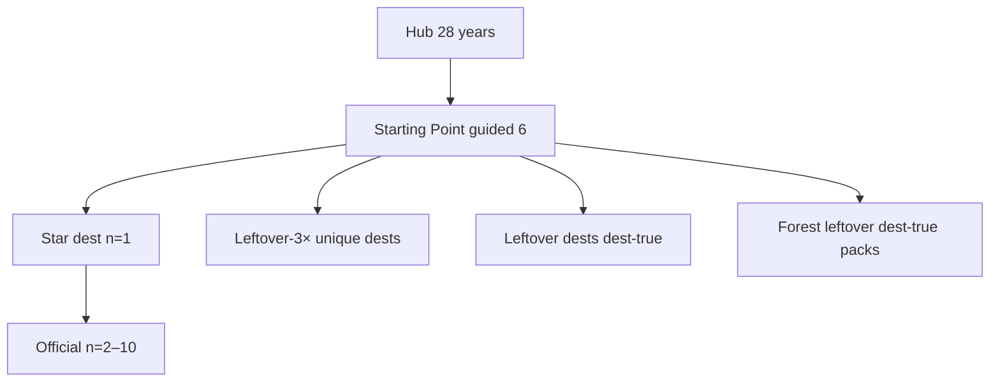

# Dest-true flow map — every playable year

**Date:** 2026-09-20
**Status:** Map first. Deep-research KEEP/DROP year-false uses this list. Not dest-farm. Not leftover-2× warehouse dests.
**Visitor 100%:** dest-true I/O — empty/trap never write; leftover never writes the star.

Do not dest-farm leftover-20. Do not grow leftover-3× unique past 2018=3 / 2021=5. 2015/2017/2019 warehouse dest folders are not dest-true leftover dests to 3×.

| Year | Dest folders | Star | Official 10 | Leftover-3× unique | Leftover dests | Pack dests | Dest-true flows |
|------|-------------:|------|------------:|-------------------:|---------------:|-----------:|----------------:|
| **1994** | 159 | CSotD guestbook | 10 | 0 | 0 | 4 | **14** |
| **1995** | 153 | Amazon SSL checkout | 10 | 0 | 0 | 4 | **14** |
| **1996** | 156 | Portal wars | 10 | 0 | 0 | 4 | **14** |
| **1997** | 168 | PointCast | 10 | 0 | 0 | 4 | **14** |
| **1998** | 156 | I'm Feeling Lucky | 10 | 0 | 0 | 4 | **14** |
| **1999** | 432 | AIM | 10 | 0 | 0 | 4 | **14** |
| **2000** | 486 | MapQuest | 10 | 0 | 0 | 3 | **13** |
| **2001** | 261 | Wikipedia UseMod | 10 | 0 | 0 | 0 | **10** |
| **2002** | 234 | StumbleUpon | 10 | 0 | 0 | 0 | **10** |
| **2003** | 206 | Photobucket upload | 10 | 0 | 0 | 0 | **10** |
| **2004** | 810 | thefacebook networks | 7 | 0 | 0 | 4 | **11** |
| **2005** | 351 | YouTube upload | 10 | 0 | 0 | 4 | **14** |
| **2006** | 378 | Twttr | 9 | 0 | 0 | 2 | **11** |
| **2007** | 46 | iPhone Safari | 10 | 9 | 23 | 0 | **42** |
| **2008** | 597 | GitHub issue | 10 | 0 | 0 | 4 | **14** |
| **2010** | 44 | Instagram iOS | 10 | 9 | 22 | 0 | **41** |
| **2011** | 62 | Google+ Hangout | 10 | 9 | 31 | 0 | **50** |
| **2012** | 48 | IG Android | 9 | 9 | 24 | 0 | **42** |
| **2013** | 54 | Vine 6s | 9 | 9 | 0 | 0 | **18** |
| **2014** | 36 | WhatsApp Install | 9 | 9 | 18 | 0 | **36** |
| **2015** | 213 | Periscope Go LIVE | 10 | 9 | 0 | 0 | **19** |
| **2016** | 106 | IG Stories | 10 | 9 | 74 | 0 | **93** |
| **2017** | 222 | Face ID | 10 | 0 (leftover-20 instead) | 20 extra | 0 | **30** |
| **2018** | 44 | GDPR Manage | 10 | 3 | 31 | 0 | **44** |
| **2019** | 170 | Disney+ Continue | 10 | 9 | 0 | 0 | **19** |
| **2020** | 39 | Zoom Leave | 10 | 9 | 1 | 0 | **20** |
| **2021** | 30 | ATT Ask | 10 | 5 | 15 | 0 | **30** |
| **2022** | 38 | ChatGPT Send | 10 | 9 | 19 | 0 | **38** |

**Dest-true flows to recheck:** 699 (official 10 + leftover-3× unique + leftover dests + forest packs + 2017 leftover-20 extra). Not dest-folder count.

Year-false KEEP / DROP / MISS (research continue complete, not applied): [`YEAR-FALSE-KEEP-DROP.md`](YEAR-FALSE-KEEP-DROP.md).

---

## 1994

Star: `csotd` · CSotD guestbook. Dest folders **158**.

**Official 10** (10): `csotd` · `yahoo` · `cern` · `fishcam` · `whitehouse` · `nasa` · `iuma` · `hotwired` · `lycos` · `playable`

**Leftover-3× unique:** none

**Forest leftover dest-true packs** (3): `webcrawler` · `galaxy` · `gnn` · (`jumpstation` DROP, dest gone)

Dest-true flows this year: **14**.

## 1995

Star: `amazon` · Amazon SSL checkout. Dest folders **153**.

**Official 10** (10): `amazon` · `auctionweb` · `geocities` · `yahoo` · `altavista` · `cnn` · `microsoft` · `netscape` · `pathfinder` · `playable`

**Leftover-3× unique:** none

**Forest leftover dest-true packs** (4): `classmates` · `match` · `tripod` · `pathfinder`

Dest-true flows this year: **14**.

## 1996

Star: `portals` · Portal wars. Dest folders **154**.

**Official 10** (10): `portals` · `hotmail` · `spacejam` · `yahoo` · `geocities` · `amazon` · `auctionweb` · `excite` · `altavista` · `playable`

**Leftover-3× unique:** none

**Forest leftover dest-true packs** (2): `angelfire` · `realplayer` · (`aolportal` / `theglobe` DROP, dests gone)

Dest-true flows this year: **14**.

## 1997

Star: `pointcast` · PointCast. Dest folders **167**.

**Official 10** (10): `pointcast` · `icq` · `ebay` · `hotmail` · `slashdot` · `drudge` · `hotbot` · `apple` · `microsoft` · `playable`

**Leftover-3× unique:** none

**Forest leftover dest-true packs** (3): `aim` · `winamp` · `scripting` · (`javaplugin` DROP, dest gone)

Dest-true flows this year: **14**.

## 1998

Star: `google` · I'm Feeling Lucky. Dest folders **153**.

**Official 10** (10): `google` · `yahoo` · `amazon` · `ebay` · `cdnow` · `hotmail` · `mozilla` · `slashdot` · `dmoz` · `snap`

**Leftover-3× unique:** none

**Forest leftover dest-true packs** (1): `goto` · (`mp3com` / `realplayer` / `winamp` DROP, dests gone)

Dest-true flows this year: **14**.

## 1999

Star: `aim` · AIM. Dest folders **432**.

**Official 10** (10): `aim` · `napster` · `google` · `blogger` · `y2k` · `sourceforge` · `paypal` · `amazon` · `ebay` · `askjeeves`

**Leftover-3× unique:** none

**Forest leftover dest-true packs** (4): `yahoomessenger` · `etrade` · `webvan` · `boocom`

Dest-true flows this year: **14**.

## 2000

Star: `mapquest` · MapQuest. Dest folders **484**.

**Official 10** (10): `mapquest` · `amazon` · `ebay` · `paypal` · `napster` · `gnutella` · `pets` · `google` · `cnn` · `y2k`

**Leftover-3× unique:** none

**Forest leftover dest-true packs** (1): `limewire` · (`expedia` / `travelocity` DROP, dests gone)

Dest-true flows this year: **13**.

## 2001

Star: `wikipedia` · Wikipedia UseMod. Dest folders **261**.

**Official 10** (10): `wikipedia` · `archive` · `itunes` · `apple` · `napster` · `movabletype` · `google` · `yahoo` · `amazon` · `playable`

**Leftover-3× unique:** none

Dest-true flows this year: **10**.

## 2002

Star: `stumbleupon` · StumbleUpon. Dest folders **234**.

**Official 10** (10): `stumbleupon` · `isp` · `kazaa` · `wired` · `phoenix` · `mozilla` · `ipod` · `friendster` · `movabletype` · `playable`

**Leftover-3× unique:** none

Dest-true flows this year: **10**.

## 2003

Star: `photobucket` · Photobucket upload. Dest folders **206**.

**Official 10** (10): `photobucket` · `itunes` · `wordpress` · `linkedin` · `myspace` · `friendster` · `adsense` · `bloglines` · `blogger` · `playable`

**Leftover-3× unique:** none

Dest-true flows this year: **10**.

## 2004

Star: `facebook` · thefacebook networks. Dest folders **810**.

**Official 10** (7): `facebook` · `gmail` · `firefox` · `flickr` · `delicious` · `digg` · `web20conference`

**Leftover-3× unique:** none

**Forest leftover dest-true packs** (4): `basecamp` · `tinypic` · `orkutseed` · `worldofwarcraft`

Dest-true flows this year: **11**.

## 2005

Star: `youtube` · YouTube upload. Dest folders **350**.

**Official 10** (10): `youtube` · `maps` · `pandora` · `housingmaps` · `digg` · `reddit` · `flickr` · `itunes` · `techcrunch` · `playable`

**Leftover-3× unique:** none

**Forest leftover dest-true packs** (3): `utorrent` · `googleearth` · `kayak` · (`secondlife` DROP, dest gone)

Dest-true flows this year: **14**.

## 2006

Star: `twitter` · Twttr. Dest folders **376**.

**Official 10** (9): `twitter` · `facebook` · `youtube` · `googledocs` · `aws` · `ie7` · `wikipedia` · `roblox` · `playable`

**Leftover-3× unique:** none

**Forest leftover dest-true packs** (0): (`meebo` / `huffpost` DROP, dests gone)

Dest-true flows this year: **11**.

## 2007

Star: `iphone` · iPhone Safari. Dest folders **33**.

**Official 10** (10): `iphone` · `streetview` · `gmail` · `fbplat` · `twitter` · `youtube` · `tumblr` · `kindle` · `ie6` · `playable`

**Leftover-3× unique** (9): `wiki` · `myspace` · `maps` · `ebay` · `stumble` · `wow` · `flickr` · `reddit` · `digg`

**Leftover dests** (23): `hackernews` · `friendfeed` · `tesla` · `amazon` · `bbc` · `aol` · `msn` · `ask` · `netflix` · `appletv` · `ipodtouch` · `justintv` · `icanhas` · `funnyordie` · `pownce` · `androidann` · `feedburner` · `gears` · `iplayer` · `lastfm` · `clubpenguin` · `amazonmp3` · `safari3`

Dest-true flows this year: **42**.

## 2008

Star: `github` · GitHub issue. Dest folders **597**.

**Official 10** (10): `github` · `appstore` · `chrome` · `android` · `hulu` · `facebook` · `twitter` · `youtube` · `dropbox` · `iphone`

**Leftover-3× unique:** none

**Forest leftover dest-true packs** (4): `evernote` · `groupon` · `airbnb` · `spotifyseed`

Dest-true flows this year: **14**.

## 2010

Star: `instagram` · Instagram iOS. Dest folders **44**.

**Official 10** (10): `instagram` · `iphone` · `ipad` · `facebook` · `farmville` · `imgur` · `foursquare` · `twitter` · `youtube` · `playable`

**Leftover-3× unique** (9): `netflix` · `tumblr` · `formspring` · `chrome` · `wave` · `android` · `reddit` · `google` · `groupon`

**Leftover dests** (22): `flipboard` · `minecraft` · `baidu` · `yandex` · `hulu` · `angry` · `path` · `googlebuzz` · `chromewebstore` · `kinect` · `cityville` · `ibooks` · `ios4` · `nexusone` · `froyo` · `skype` · `wordpress` · `bing` · `flickr` · `wikipedia` · `ebay` · `paypal`

Dest-true flows this year: **41**.

## 2011

Star: `googleplus` · Google+ Hangout. Dest folders **62**.

**Official 10** (10): `googleplus` · `spotify` · `iphone` · `facebook` · `ipad` · `airbnb` · `instagram` · `twitter` · `qwikster` · `playable`

**Leftover-3× unique** (9): `icloud` · `pinterest` · `linkedin` · `kindlefire` · `minecraft` · `twitch` · `youtube` · `dropbox` · `hulu`

**Leftover dests** (31): `snapchat` · `ios5` · `imessage` · `chromebook` · `honeycomb` · `ics` · `wechat` · `line` · `temple` · `skyrim` · `nytpaywall` · `skypebuy` · `grouponipo` · `zyngaipo` · `googlewallet` · `stripe` · `duolingo` · `codecademy` · `baidu` · `yandex` · `wikipedia` · `amazon` · `reddit` · `tumblr` · `netflix` · `github` · `whatsapp` · `path` · `nintendo3ds` · `psnhack` · `gowalla`

Dest-true flows this year: **50**.

## 2012

Star: `instagram` · IG Android. Dest folders **48**.

**Official 10** (9): `instagram` · `pinterest` · `facebook` · `iphone` · `wikipedia` · `medium` · `path` · `flipboard` · `playable`

**Leftover-3× unique** (9): `drawsomething` · `googledrive` · `snapchat` · `uber` · `buzzfeed` · `youtube` · `reddit` · `surface` · `windows8`

**Leftover dests** (24): `tinder` · `duolingo` · `baidu` · `yandex` · `vk` · `coursera` · `udacity` · `edx` · `nexus7` · `jellybean` · `ios6` · `applemaps` · `googleplay` · `kindlefirehd` · `github` · `dropbox` · `evernote` · `linkedin` · `etsy` · `netflix` · `hulu` · `whatsapp` · `coinbase` · `tumblr`

Dest-true flows this year: **42**.

## 2013

Star: `vine` · Vine 6s. Dest folders **54**.

**Official 10** (9): `vine` · `instagram` · `snapchat` · `iphone` · `snowden` · `telegram` · `tumblr` · `windows81` · `playable`

**Leftover-3× unique** (9): `askfm` · `whisper` · `youtube` · `chrome` · `medium` · `yikyak` · `reddit` · `facebook` · `twitter`

Dest-true flows this year: **18**.

## 2014

Star: `whatsapp` · WhatsApp Install. Dest folders **36**.

**Official 10** (9): `whatsapp` · `heartbleed` · `icebucket` · `iphone` · `applepay` · `material` · `slack` · `twitch` · `playable`

**Leftover-3× unique** (9): `snapchat` · `instagram` · `uber` · `twitter` · `musically14` · `truecrypt` · `facebook` · `wikipedia` · `youtube`

**Leftover dests** (18): `baidu` · `yandex` · `vk` · `chrome` · `google` · `yahoo` · `amazon` · `netflix` · `github` · `reddit` · `alibabaipo` · `oculusfb` · `inbox` · `echo` · `flappybird` · `game2048` · `androidl` · `ios8`

Dest-true flows this year: **36**.

## 2015

Star: `periscope` · Periscope Go LIVE. Dest folders **213**.

**Official 10** (10): `periscope` · `googlephotos` · `windows10` · `applemusic` · `edge` · `apple` · `snapchat` · `discord` · `letsencrypt` · `playable`

**Leftover-3× unique** (9): `instagram` · `spotify` · `netflix` · `meerkat` · `applemusicsub` · `win10get` · `vine` · `echo` · `youtube`

Dest-true flows this year: **19**.

## 2016

Star: `instagram` · IG Stories. Dest folders **106**.

**Official 10** (10): `instagram` · `pokemongo` · `facebook` · `whatsapp` · `iphone` · `vine` · `snapchat` · `musically` · `windows10` · `playable`

**Leftover-3× unique** (9): `slack` · `reddit` · `netflix` · `youtube` · `alphago` · `assistant` · `dyn` · `fblive` · `moments`

**Leftover dests** (74): `douyin` · `wikipedia` · `twitter` · `amazon` · `google` · `yahoo` · `baidu` · `yandex` · `chrome` · `github` · `pinterest` · `tumblr` · `twitch` · `discord` · `airpods` · `pixel` · `nougat` · `allo` · `duo` · `googlehome` · `oculusrift` · `psvr` · `overwatch` · `doom2016` · `uncharted4` · `nomanssky` · `clashroyale` · `signal` · `telegram` · `paypal` · `applepay` · `panamapapers` · `figma` · `thedao` · `ethereum` · `ios10` · `sierra` · `daydream` · `battlefield1` · `letsencrypt` · `steam` · `wechat` · `tinder` · `uber` · `airbnb` · `spotify` · `hulu` · `nyt` · `bbc` · `dropbox` · `gitlab` · `shopify` · `stripe` · `minecraft` · `roblox` · `messenger` · `skype` · `tesla` · `canva` · `medium` · `vk` · `taobao` · `ebay` · `etsy` · `mastodon` · `ringer` · `athletic` · `peach` · `tay` · `zcash` · `prisma` · `vive` · `miitomo` · `iana`

Dest-true flows this year: **93**.

## 2017

Star: `iphone` · Face ID. Dest folders **222**.

**Official 10** (10): `iphone` · `fortnite` · `twitter` · `teams` · `vine` · `switch` · `wannacry` · `musically` · `equifax` · `playable`

**Leftover-3× unique:** none. **Unique leftover-20 extra dests** (20): `animoji` · `ios11` · `pubgnote` · `cuphead` · `twitterlite` · `snapipo` · `slack17` · `hangoutschat` · `snapmap` · `instagram17` · `botw` · `splatoon2` · `notpetya` · `krack` · `tbh` · `messengerday` · `creditfrz` · `cloudbleed` · `gettingoverit` · `hollowknight`

Dest-true flows this year: **30**.

## 2018

Star: `gdpr` · GDPR Manage. Dest folders **44**.

**Official 10** (10): `gdpr` · `tiktok` · `trust` · `instagram` · `chrome` · `homepod` · `spectre` · `fortnite` · `github` · `playable`

**Leftover-3× unique** (3): `reddit` · `youtube` · `wikipedia`

**Leftover dests** (31): `facebook` · `twitter` · `amazon` · `google` · `yahoo` · `baidu` · `yandex` · `netflix` · `snapchat` · `discord` · `gplusgone` · `androidpie` · `ios12` · `spotify` · `twitch` · `whatsapp` · `linkedin` · `pinterest` · `steam` · `wechat` · `tinder` · `uber` · `airbnb` · `pubg` · `rdr2` · `mojave` · `onedot` · `epicstore` · `nso` · `espnplus` · `caffeine`

Dest-true flows this year: **44**.

## 2019

Star: `disneyplus` · Disney+ Continue. Dest folders **170**.

**Official 10** (10): `disneyplus` · `tiktok` · `arcade` · `appletv` · `stadia` · `iphone` · `airpodspro` · `chrome` · `windows10` · `playable`

**Leftover-3× unique** (9): `amazon` · `facebook` · `google` · `instagram` · `nyt` · `oculusquest` · `twitter` · `yahoo` · `youtube`

Dest-true flows this year: **19**.

## 2020

Star: `zoom` · Zoom Leave. Dest folders **39**.

**Official 10** (10): `zoom` · `houseparty` · `discord` · `teams` · `classroom` · `netflix` · `tiktok` · `amongus` · `animalcrossing` · `playable`

**Leftover-3× unique** (9): `amazon` · `facebook` · `google` · `instagram` · `youtube` · `slack` · `reddit` · `wikipedia` · `nyt`

**Leftover dests** (1): `clubhouse`

Dest-true flows this year: **20**.

## 2021

Star: `att` · ATT Ask. Dest folders **30**.

**Official 10** (10): `att` · `signal` · `copilot` · `meta` · `windows11` · `flash` · `chrome` · `windows10` · `facebook` · `playable`

**Leftover-3× unique** (5): `amazon` · `google` · `instagram` · `twitter` · `youtube`

**Leftover dests** (15): `yahoo` · `baidu` · `yandex` · `wikipedia` · `reddit` · `netflix` · `tiktok` · `discord` · `twitch` · `github` · `nft` · `coinbaseipo` · `epicapple` · `m1` · `clubhouse21`

Dest-true flows this year: **30**.

## 2022

Star: `chatgpt` · ChatGPT Send. Dest folders **38**.

**Official 10** (10): `chatgpt` · `wordle` · `twitter` · `bereal` · `iphone` · `ftx` · `mastodon` · `tiktok` · `windows11` · `playable`

**Leftover-3× unique** (9): `amazon` · `google` · `instagram` · `facebook` · `youtube` · `reddit` · `wikipedia` · `netflix` · `nyt`

**Leftover dests** (19): `temu` · `chrome` · `baidu` · `yandex` · `yahoo` · `github` · `discord` · `twitch` · `spotify` · `snapchat` · `whatsapp` · `linkedin` · `pinterest` · `musk` · `stablediff` · `midjourney` · `dalle2` · `ios16` · `m2`

Dest-true flows this year: **38**.

