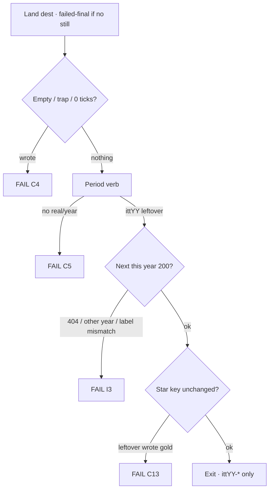

# Every live year — improve flows + links · goals · phases · minute steps

**Date:** 2026-09-03  
**Status:** **walk this to implement.** One wave, then look, then the next. Do not dump all six waves in one pass.  
**Hub now:** **26 years open** · **1994–2019**.  
**Wiped:** 2020–2025. Do **not** invent dests for wiped years. Rebuild only if named.

Leftover **2× is already on every dest** in every live year (two leftover writers · leftover key · not the star). This file does **not** re-do that. It improves **costume, year-true verbs, mass hops, and fake dests**.

**Disk scan this pass:** leftover writers `<2` = **0**. Thinness is dest **variety** and leftover **feel**, not missing leftover buttons.

---

## Companions (read these, do not fork a second law)

| File | Role |
|------|------|
| **This file** | **Execute this.** Waves 0–6 · dest minutes · file lists · verify |
| [`DISK-TRUTH.md`](DISK-TRUTH.md) | Which years exist. Wins when anything else disagrees |
| [`ALL-YEARS-IMPLEMENT-GOALS-PHASES-EVERY-FLOW-MINUTE-2026-09-01.md`](ALL-YEARS-IMPLEMENT-GOALS-PHASES-EVERY-FLOW-MINUTE-2026-09-01.md) | Gold minute · official 10 · shared leftover machine. Hub spine in that file **lags** (2007/2009/2011 live) |
| Year `YYYY-READ-FIRST.md` | Thesis · star · bans · dual-cite |
| Year `*-FROM-SCRATCH-MAP-*` / `*-2X-LEFTOVER-*` | Dest-by-dest leftover when that year has one |
| [`2001-2002-CRITERIA-MAP-2026-08-30.md`](2001-2002-CRITERIA-MAP-2026-08-30.md) | 2001–2003 variety · leftover **18** · do not pad to 120 |
| [`1994-1999-2X-LEFTOVER-120-FREEZE-2026-09-02.md`](1994-1999-2X-LEFTOVER-120-FREEZE-2026-09-02.md) | 90s leftover-120 · **named slugs only** |
| [`2011-2020-2X-LEFTOVER-RESEARCH-2026-08-31.md`](2011-2020-2X-LEFTOVER-RESEARCH-2026-08-31.md) | 2012–2019 leftover is **9+9+9** + leftover-official · not a 120 forest |
| [`ARCHITECTURE.md`](ARCHITECTURE.md) | Year differences live in config + content |
| [`OPERATING-PROCESS.md`](OPERATING-PROCESS.md) | Incomplete REAL writes nothing |
| `js/config/flow-trails.js` | Official 10. Do **not** invent a second n=1 list |
| `e2e/2x-links.matrix.json` · `e2e/leftover-official.matrix.json` | Leftover 2× / leftover-official rows |

**Trust order:** live `years/` · `scripts/itt_gate.py` `SHIP_YEARS` · DISK-TRUTH · this file · year READ-FIRST. Older MD that boards 2007/2009/2011 or keeps 2020–2024 playable **loses**.

**Legal:** Educational. `localStorage` only. No exploit / PoC / live OAuth / live CDN. **Never invent brand pixels.** `[failed-final]` on rooms without a harvest still.

Serve: `python3 -m http.server 8080 --bind 127.0.0.1`  
Clear `ittYY-*` for the year you are checking. After a walk: only that year’s prefix.

---

## Criteria (always)

Same envelope as [`ALL-YEARS-IMPLEMENT-GOALS-PHASES-EVERY-FLOW-MINUTE-2026-09-01.md`](ALL-YEARS-IMPLEMENT-GOALS-PHASES-EVERY-FLOW-MINUTE-2026-09-01.md) C1–C15. Extra rules for **this** improve pass:

| # | Rule | Fail if |
|--:|------|---------|
| I1 | Existing dest first. Rewrite a folder on disk before adding a folder | New dest while a “Continuity leftover N” page still ships |
| I2 | Leftover CTA is a **period verb**, not “Save leftover 2×” / “Type leftover” / “Do leftover” | Plaque ships as the visitor save |
| I3 | Leftover Next **label matches href**. Next is this year, HTTP 200 | “Tumblr” → `../airbnb/about.html` |
| I4 | Starting Point / map / 3× never offer a dest whose `<h1>` is “Continuity leftover N” | Discord listed as a 2009 room |
| I5 | Anachronistic slugs are **rewritten or unlisted**. File may stay so old hrefs 200 | Figma / Notion / Teams offered as 2009/2011 leftover |
| I6 | 2001–2003 leftover **named pack stays 18**. New dests are **variety** (V1/V2), not leftover-120 | Pad 2001 to 120 leftover keys |
| I7 | 2012–2019 stay **9+9+9 + leftover-official**. Lean caps: 2014/2016 **70** HTML · 2017/2019 **90** | 120-row dest farm on a lean door |
| I8 | 2014: **no new `google.com` dest**. Chrome habit is 2015+ | Google folder added as 2014 leftover |
| I9 | Popular 3× grows by linking dests **already on disk** first | Invent dests to fill a 3× strip |
| I10 | One wave · verify · look. Do not start Wave N+1 until Wave N pass table is ticked | All six waves in one dump |

Stars, guided 6, official 10 n=1, and boarded 2020–2025 **do not move**.

---

## Goals

A visitor can open **every live year**, finish the gold, walk official 10, and wander **year-true mass leftover** without hitting a numbered continuity plaque or a dest from the wrong decade.

```
Hub → year card available
  → Skip connect · year-true shell
  → Starting Point
       guided ol = 6
       ★ chip = gold dest
       leftover / 3× strip **below** the <ol>
  → About dual-cite
  → ★ gold: trap never writes · complete writes ittYY-star
  → Official 10: Next after write · leftover ≠ gold
  → Leftover dest: period verb · Next 200 · gold unchanged
  → Year game
  → Exit · ittYY-* only
```

**Not done if:** 7th guided `<li>` · star moved · “Continuity leftover 15” on the hallway · Discord-as-2009 · dest-field plaques · neighbor prefix · invented June ILS cell · 2020+ dests · lean HTML cap blown.

---

## Shared leftover machine (every dest, every wave)

Copy of the all-years machine. Do not invent a second one.

```
open dest
  empty / trap / 0 ticks / 1 hop / skip wait   →  no key
  complete year-true verb                      →  ittYY-*  {real, multiStep, year}
  Next href HTTP 200 · gold key unchanged
```



### Dest file recipe (when you rewrite or add)

Every dest this pass touches must have:

1. `data-itt-year="YYYY"` on `<html>`.  
2. Honesty line + `[failed-final]` or a harvested still.  
3. Trap control (`data-lo-trap` / `data-itt-trap` / `data-official-trap`). Trap **never writes**.  
4. Incomplete path (empty field / 0 ticks / 1 hop).  
5. Complete period control. Leftover key `ittYY-<suffix>` · **not** the star suffix.  
6. Hidden Next: `data-next-flow` + `data-next-when-key` · href this year · label = dest name.  
7. Second page (`about.html` / `more.html` / hop) with a **different** leftover key if it is leftover 2×.  
8. Immersion stub `js/immersion-YYYY.js` only. No new engine.

### Files you always touch together

| Touch | Why |
|-------|-----|
| `years/YYYY/sites/<slug>/*.html` | The room |
| `js/config/YYYY.js` `urlMap` + rooms | Chrome location + smoke |
| Starting Point leftover / 3× strip (`pages/home.html` or YearUI start-data) | Hallway |
| `years/YYYY/pages/map.html` | Map 200 |
| `e2e/2x-links.matrix.json` | Leftover 2× row |
| `e2e/leftover-official.matrix.json` | If leftover-official |
| Year `urlMap` smoke | `python3 scripts/smoke-production.py` |

Do **not** edit `flow-trails.js` n=1. Official n=2–10 hrefs stay. Add leftover only.

---

## Shared implement phases (this pass)

Do not start a wave’s P1 until that wave is **named** in chat (`start wave 1`).

| Phase | What | Pass |
|-------|------|------|
| P0 | Read this file + year READ-FIRST + DISK-TRUTH. Confirm year is live. Note HTML cap | Year card `available` · `years/YYYY/` 200 |
| P1 | Inventory: dest list · continuity titles · anachronistic slugs · 3× ids · official-verb count | Table in the wave ticked |
| P2 | Rewrite or add dests per the wave dest-minute table | Each row: trap empty · complete writes leftover · Next 200 |
| P3 | Wire hallway: home leftover / 3× / map · urlMap · both matrices | 0 dest miss · 0 next miss |
| P4 | Verify (commands below) + browser gold + 2 leftover dests | Gates green · only `ittYY-*` |
| P5 | Stop. Do not start the next wave | User looks |

**Wiped year:** stop. 2020–2025 stay boarded.

---

## Wave order

| Wave | Years | Kind | New dests? |
|------|-------|------|------------|
| **0** | all live | Baseline leftover 2× already on disk | No |
| **1** | 2009 · 2011 | Honesty — kill fake dests | No |
| **2** | 2001 · 2002 · 2003 | Mass session on dests **already on disk** · official-verb | No |
| **3** | 2010 · 2013 · 2014 · 2015 · 2016 | 3× strips · few mass leftover | Only if cap allows |
| **4** | 1994–1999 | leftover-120 `more.html` verbs | Only freeze-named slugs |
| **5** | 2004 · 2005 · 2006 · 2008 | Forest fold + year-voice | No |
| **6** | 2007 · 2012 · 2017 · 2018 · 2019 | Lean leftover polish | No |

---

# WAVE 0 — baseline

**Named ask:** leftover 2× is already on every dest. Freeze that as the floor.

### P0

1. Read [`DISK-TRUTH.md`](DISK-TRUTH.md) header. Hub is 1994–2019.  
2. Confirm `scripts/itt_gate.py` `_WIPED = {2020…2025}`.  
3. Do **not** add dests.

### P1–P3

No dest edits. Optional: run the verify block so the working tree is known-green.

### P4 verify

```bash
python3 scripts/smoke-production.py --base http://127.0.0.1:8080
python3 scripts/audit-internal-links.py
node scripts/audit-mock-flows.js
```

### P5

Commit **only if named** (`commit` / `commit and push`). Wave 1 can start on the uncommitted tree if you say so.

**Fail if:** dests added · stars moved · 2020+ scaffolded.

---

# WAVE 1 — 2009 + 2011 honesty

**Read first:** [`2009-READ-FIRST.md`](2009-READ-FIRST.md) · [`2009-2X-LEFTOVER-GOALS-PHASES-FLOWS-MINUTE-2026-09-01.md`](2009-2X-LEFTOVER-GOALS-PHASES-FLOWS-MINUTE-2026-09-01.md) · [`2011-READ-FIRST.md`](2011-READ-FIRST.md) · [`2011-2X-LEFTOVER-GOALS-PHASES-FLOWS-MINUTE-2026-09-01.md`](2011-2X-LEFTOVER-GOALS-PHASES-FLOWS-MINUTE-2026-09-01.md) · [`2011-FROM-SCRATCH-MAP-GOALS-STEPS-FLOWS.md`](2011-FROM-SCRATCH-MAP-GOALS-STEPS-FLOWS.md)

**Stars stay:** Facebook Like `itt09-like` · Google+ `itt11-gplus`.

**Disk now:** 2009 = 68 dests · **118** continuity pages · **12** wrong-era slugs. 2011 = 71 dests · **42** continuity pages · **9** wrong-era slugs. Example: `years/2009/sites/discord/index.html` title is **Continuity leftover 15**.

**No new dest folders.**

## 1. Inventory (P1)

Walk `years/2009/sites/*/` and `years/2011/sites/*/`. Tick a slug **REWRITE** or **UNLIST**.

### 2009 — wrong-era slugs (UNLIST from hallway unless the row says REWRITE)

| Slug | Why it is wrong | Action | Hallway replacement (already on disk) |
|------|-----------------|--------|----------------------------------------|
| `discord` | Discord **2015** | UNLIST | `chatroulette` · `omegle` |
| `figma` | Figma **2016** | UNLIST | `farmville` |
| `notion` | Notion **2016** | UNLIST | `wikipedia` |
| `slack` | Slack public **2014** | UNLIST | `friendfeed` |
| `teams` | Teams **2017** | UNLIST | `gmail` |
| `brave` | Brave **2016** | UNLIST | `chrome` leftover (Chrome is 2008 product room, not January chrome) |
| `edge` | Edge **2015** | UNLIST | `ie8` |
| `tt` | TikTok brand later | UNLIST | `youtube` |
| `icloud` | iCloud **2011** | UNLIST as 2009 dest | `iphone` leftover |
| `patreon` | Patreon **2013** | UNLIST | `kickstarter` |
| `twitch` | Justin.tv 2007 / Twitch 2011 | UNLIST as 2009 mass | `hulu` |
| `zoom` | Company 2011 · mass 2020 | UNLIST as 2009 dest | `gvoice` |

Keep the HTML file so old hrefs 200. Remove from Starting Point leftover strip, map leftover list, popular 3×, YearUI extra rooms.

### 2011 — wrong-era slugs

| Slug | Why | Action | Replacement on disk |
|------|-----|--------|---------------------|
| `discord` | 2015 | UNLIST | `skype` · `gplus` hangout |
| `figma` | 2016 | UNLIST | `dropbox` |
| `notion` | 2016 | UNLIST | `evernote` is 2008 — use `linkedin` leftover |
| `slack` | 2013 public / 2014 | UNLIST | `gplus` |
| `teams` | 2017 | UNLIST | `skype` |
| `brave` | 2016 | UNLIST | `chrome` leftover |
| `edge` | 2015 | UNLIST | `ie9` is 2011 product — use `wp75` / `silk` |
| `tt` | TikTok later | UNLIST | `youtube` |
| `patreon` | 2013 | UNLIST | `kickstarter` if present · else `airbnb` leftover |

**2011 KEEP (year-true leftover, rewrite verb if plaque):** `googleplus` · `siri` · `icloud` · `snapchat` (seed) · `qwikster` · `rdio` · `silk` · `wallet` · `kindlefire` · `chromebook` · `android4` · `jobs`.

## 2. Rewrite minute (P2) — every REWRITE / KEEP dest that still says Continuity leftover

Shared 2009 leftover minute ([`2009-2X-LEFTOVER-GOALS-PHASES-FLOWS-MINUTE-2026-09-01.md`](2009-2X-LEFTOVER-GOALS-PHASES-FLOWS-MINUTE-2026-09-01.md)):

1. Land. `[failed-final]`.  
2. Empty / 0 ticks / 1 hop → nothing.  
3. Trap (Like-as-this / iPhone 4 / Instagram) → nothing.  
4. Period verb → `itt09-<suffix>` only.  
5. Next 200. Never write `itt09-like`.

Shared 2011 leftover minute ([`2011-2X-LEFTOVER-GOALS-PHASES-FLOWS-MINUTE-2026-09-01.md`](2011-2X-LEFTOVER-GOALS-PHASES-FLOWS-MINUTE-2026-09-01.md)):

1. Land. `[failed-final]`.  
2. Empty / trap (Hangout-as-gold / IG Android / Stories) → nothing.  
3. Period verb → `itt11-<suffix>` only.  
4. Next 200. Never write `itt11-gplus`.

### 2009 KEEP dests — verb table (use these, do not invent)

| Dest | Path | Trap | Complete | Next |
|------|------|------|----------|------|
| FarmVille | `sites/farmville/index.html` | IG-as-this | plant leftover | `facebook` |
| Chatroulette | `sites/chatroulette/index.html` | Discord-as-this | next-stranger leftover | `omegle` |
| Omegle | `sites/omegle/index.html` | live cam | next leftover | `chatroulette` |
| Bing | `sites/bing/index.html` | Google-as-2009-gold | one query | `wikipedia` |
| Wave | `sites/wave/index.html` | Gmail-as-this | invite leftover | `gmail` |
| Wolfram | `sites/wolfram/index.html` | live compute | one query | `bing` |
| Foursquare | `sites/foursquare/index.html` | IG check-in | check-in leftover | `farmville` |
| Palm Pre | `sites/palmpre/index.html` | iPhone-as-gold | webOS leftover | `iphone` |
| Angry Birds | `sites/angry/index.html` | live app | sling leftover | `playable/game.html` |
| Bitcoin seed | `sites/bitcoin/index.html` | 2017 ATH | paper leftover | `wikipedia` |

### 2011 KEEP dests — verb table

| Dest | Path | Trap | Complete | Next |
|------|------|------|----------|------|
| Google+ | `sites/googleplus/index.html` | **star — do not leftover-2× this key** | Circles / Hangout writes `itt11-gplus` only from gold | hangouts |
| Siri | `sites/siri/index.html` | Assistant-as-2016 | ask leftover | `iphone` |
| iCloud | `sites/icloud/index.html` | Photos-as-2015 | find-my leftover | `iphone` |
| Snapchat seed | `sites/snapchat/index.html` | Stories-as-2013 | snap leftover | `instagram` |
| Qwikster | `sites/qwikster/index.html` | Netflix-as-gold | split leftover | `netflix` |
| Rdio | `sites/rdio/index.html` | Spotify-US-as-this | play leftover | `spotify` |
| Silk | `sites/silk/index.html` | Chrome-as-gold | cloud leftover | `kindlefire` |
| Wallet | `sites/wallet/index.html` | Apple Pay 2014 | tap leftover | `iphone` |

## 3. Hallway (P3)

1. Starting Point leftover strip: only KEEP dests.  
2. Popular 3× 2009 stays Omegle · Chatroulette · Wikipedia ([`scripts/popular-3x-sites.json`](../scripts/popular-3x-sites.json)) — do not add Discord.  
3. Fix leftover Next labels vs hrefs on `years/2009` and `years/2011` (cloned extras).  
4. Update 2× matrix titles so they are not “Continuity leftover N”.

## 4. Verify (P4)

```bash
python3 scripts/audit-internal-links.py
node scripts/audit-mock-flows.js
npx playwright test e2e/one-thing-per-year.spec.js --grep "2009|2011"
npx playwright test e2e/2x-links-all-years.spec.js --grep "2009|2011"
```

Browser: 2009 Like trap → Like complete → `itt09-like` · open FarmVille leftover trap → complete → Next · storage has no `itt09-like` overwrite. 2011 same with G+ and Qwikster.

**Wave 1 pass**

- [x] No hallway / 3× / map link to a dest whose `<h1>` is Continuity leftover N  
- [x] Discord / Figma / Notion / Teams / Brave / Edge / tt not offered as 2009 rooms  
- [x] Same for 2011  
- [x] Stars unchanged (`itt09-like` · `itt11-gplus` one-thing e2e 5/5)  
- [x] 0 broken hrefs · mock OK · smoke OK (2026-09-03)  

---

# WAVE 2 — 2001–2003 mass session on dests already on disk

**Read first:** [`2001-READ-FIRST.md`](2001-READ-FIRST.md) · [`2002-READ-FIRST.md`](2002-READ-FIRST.md) · [`2003-READ-FIRST.md`](2003-READ-FIRST.md) · [`2001-2002-CRITERIA-MAP-2026-08-30.md`](2001-2002-CRITERIA-MAP-2026-08-30.md) · leftover-18 tables in the 2026-08-30 from-scratch minute files.

**Stars stay:** Wiki `itt01-wiki` · Stumble `itt02-stumble` · Photobucket `itt03-photobucket`.

**Law (updated 2026-09-03 after the cited source pass):** leftover **named 18** stays 18. **Do not add dest folders** for 2001–2003. Jupiter/Nielsen ranks (AOL / MSN / Yahoo parents) are **hallway + costume** on dests already on disk, not a new leftover-120 forest. Do **not** `git checkout` the old 2000 forest. Do **not** clone `years/2000/sites/amazon`.

**What people actually did (Pew / ClickZ / Media Metrix, opened this pass):** typical-day **email** then **search**; IM was AIM / Yahoo Messenger / MSN (short home sessions); maps were start+end → print; commerce was research-then-buy. MySpace-as-mass is **late 2006**, not a 2001–2003 dest. Google was **15th** in June 2001 — not the 2001 door.

`years/2001/sites/grok/` is **Grokster** leftover (year-true P2P). Keep. Do not confuse with 2023 Grok.

## 2. Dest-minute table — rewrite existing dests only

No new `sites/<slug>/`. If Hotmail / MSN / AOL / eBay / Craigslist **already exist** as folders, deepen the verb. If they do **not** exist, put the mass hop on **Yahoo / Google / Amazon / CNN / eBay-if-present** leftover pages as 3× / also-this-year links. Do not invent the folder.

### 2001 — deepen (folders already on disk)

| Dest | Path | Trap | Incomplete | Complete | Next |
|------|------|------|------------|----------|------|
| Yahoo portal leftover | `sites/yahoo/index.html` | Google-as-2001-gold | empty | directory leftover (not search-as-star) | `google` leftover |
| Google leftover | `sites/google/index.html` | Lucky-as-star (1998) | empty | one sparse query leftover | `cnn` |
| Amazon smile leftover | `sites/amazon/index.html` | 1-Click-new | empty cart | book leftover | `yahoo` |
| CNN leftover | `sites/cnn/index.html` | live CNN | empty | 2001 headline leftover | `wikipedia/edit.html` (gold, do not write) |
| Hotmail / MSN / AOL | only if folder already exists | Gmail-as-this | empty sign-in / keyword | leftover sign-on | `yahoo` |

### 2002 — deepen

Same Yahoo / Google / Amazon leftover costume. Next → `googlenews` or Stumble (star never written). Friendster stays **seed**. Phoenix leftover must not say Firefox 1.0.

### 2003 — deepen

Photobucket gold unchanged. If `ebay` / `craigslist` / `hotmail` folders **already exist**, leftover listing / city / sign-in as in the old add-table. If they do **not** exist, **do not add them** this wave — 3× from Photobucket to Yahoo / Amazon / Wikipedia leftover only. MySpace leftover is 2003 seed/mass on disk already; do not grow it.

**Superseded (do not implement):** the 2026-09-03 first draft that added `aol` · `msn` · `hotmail` · `lycos` · `about` · `cnet` · `ebay` · `craigslist` as new dest folders. Source pass + leftover-18 freeze win.

## 3. Official-verb (P2b)

2001–2003 official leftover dests are at **`data-official-verb` = 0** today.

1. Read A2 in [`MUSEUM-GRADE-100-GATES-EVERY-YEAR-1994-2023.md`](MUSEUM-GRADE-100-GATES-EVERY-YEAR-1994-2023.md).  
2. Stamp `data-official-verb` on official **n=2–10** dests only.  
3. **Never** stamp gold: wiki edit · Stumble · Photobucket upload.  
4. Official GO writes that dest’s `whenKey` from `flow-trails.js`. Trap never latches GO.

## 4. Hallway (P3)

1. Starting Point leftover strip **below** guided 6.  
2. Map lists the new dests.  
3. Popular 3×: 2001 google/yahoo/cnn may gain **aol** as a fourth **only** if you extend the 3× machine — otherwise keep 3 and put AOL on leftover strip.  
4. `urlMap` + both matrices.  
5. `js/config/2001.js` (and 2002/2003) rooms[] prepend.

## 5. Verify (P4)

```bash
python3 scripts/smoke-production.py
python3 scripts/audit-internal-links.py
node scripts/audit-mock-flows.js
npx playwright test e2e/one-thing-per-year.spec.js --grep "2001|2002|2003"
```

Browser 2003: Photobucket empty → no key · upload complete → `itt03-photobucket` · eBay leftover empty → no key · listing complete → leftover key · Next lands Photobucket · gold unchanged.

**Wave 2 pass**

- [x] No new dest folders on 2001–2003 (29 / 26 / 23 dests unchanged)  
- [x] Named leftover-18 keys unchanged (no pad to 120)  
- [x] Yahoo / Google / Amazon / CNN leftover keep period leftover machines; official n=2–9 stamped `data-official-verb`  
- [x] Official n=2–9 write from period control (24 dests). n=10 games not stamped  
- [x] Gold dests have no `data-official-verb`  
- [x] Not a 2000 Amazon dump  
- [x] 3× from gold to Yahoo / Google / Amazon / CNN · 0 broken hrefs · one-thing 2001–2003 6/6 (2026-09-03)  

---

# WAVE 3 — 2010 + 2013–2016 links (lean)

**Read first:**  
[`2010-READ-FIRST.md`](2010-READ-FIRST.md) · [`2013-READ-FIRST.md`](2013-READ-FIRST.md) · [`2013-FROM-SCRATCH-MAP-GOALS-STEPS-FLOWS.md`](2013-FROM-SCRATCH-MAP-GOALS-STEPS-FLOWS.md) · [`2014-READ-FIRST.md`](2014-READ-FIRST.md) · [`2014-FROM-SCRATCH-MAP-GOALS-STEPS-FLOWS.md`](2014-FROM-SCRATCH-MAP-GOALS-STEPS-FLOWS.md) · [`2014-6X-LEFTOVER-GOALS-PHASES-FLOWS-MINUTE.md`](2014-6X-LEFTOVER-GOALS-PHASES-FLOWS-MINUTE.md) · [`2015-READ-FIRST.md`](2015-READ-FIRST.md) · [`2016-READ-FIRST.md`](2016-READ-FIRST.md) · [`2011-2020-2X-LEFTOVER-RESEARCH-2026-08-31.md`](2011-2020-2X-LEFTOVER-RESEARCH-2026-08-31.md)

**Stars stay:** IG iOS `itt10-ig` / `itt10-ig-posts` (live tree + one-thing e2e win if docs disagree) · Vine `itt13-vine-posts` · WA Install `itt14-wa-install` · Periscope `itt15-periscope` · Stories `itt16-ig-stories`.

**Caps:** 2014/2016 HTML **70**. Prefer **strips** over dests. If a dest would blow the cap, **only** do the strip.  
**Research lock:** [`THIN-YEARS-FLOWS-LINKS-RESEARCH-2026-09-03.md`](THIN-YEARS-FLOWS-LINKS-RESEARCH-2026-09-03.md).

**2014 ban:** no new Google dest ([`2014-FROM-SCRATCH-MAP-GOALS-STEPS-FLOWS.md`](2014-FROM-SCRATCH-MAP-GOALS-STEPS-FLOWS.md)).

## 1. 3× / also-this-year strips first (P2)

On **gold + official 10 dests**, add or retarget a strip to dests **already on disk**:

| Year | Strip targets (must exist) | Do not link |
|------|----------------------------|-------------|
| 2010 | `facebook` · `youtube` · `twitter` · `tumblr` · `netflix` · `reddit` | IG Android · Stories · iPad 2 |
| 2013 | `youtube` · `twitter` · `facebook` · `instagram` · `vine` · `snapchat` | TikTok · IG Stories · iPhone 6 |
| 2014 | `facebook` · `instagram` · `youtube` · `wikipedia` · `whatsapp` · `twitter` | **google dest** · Watch · Win10 |
| 2015 | dests on disk: `instagram` · `spotify` · `netflix` · `windows10` · `periscope` | Stories · Pokémon GO · Chromium Edge · FB Live mass |
| 2016 | `facebook` · `youtube` · `instagram` · `vine` · `whatsapp` · `pokemongo` | TikTok brand · Reels · Face ID |

Label = dest name. Href = `../<slug>/index.html`. 0 404.

Popular 3× JSON may stay at 3. The **also-this-year** strip is the density. Do not invent a second official 10.

**Wave 3 pass (2026-09-03):** gold + official dests on 2010 / 2013–2016 now hop the required on-disk dests. 47 files rewritten. Dest folders unchanged. Link audit 0 broken. One-thing e2e 10/10. No Allo / Note 7 dest (cap + 6× freeze).

## 2. Optional dests — only if `find years/YYYY -name '*.html' | wc -l` leaves headroom

| Year | Add at most | Path | Key | Trap | Complete | Next |
|------|-------------|------|-----|------|----------|------|
| 2010 | `amazon` leftover | `sites/amazon/index.html` | `amz-lx` | 1-Click-new | smile leftover | `facebook` |
| 2010 | `wikipedia` leftover | `sites/wikipedia/index.html` | `wiki-lx` | wiki-as-2010-gold | edit leftover | `reddit` |
| 2010 | `gmail` leftover | `sites/gmail/index.html` | `gmail-lx` | Priority Inbox-as-gold | tab leftover | `gmailtab` |
| 2013 | `netflix` leftover | `sites/netflix/index.html` | `nfx-lx` | 4K-as-this | queue leftover | `youtube` |
| 2014 | `reddit` leftover | `sites/reddit/index.html` | `reddit-lx` | live vote | upvote leftover | `twitter` |
| 2015 | `facebook` leftover | `sites/facebook/index.html` | `fb-lx` | Live-as-mass | feed leftover · Mentions honesty | `instagram` |
| 2016 | `twitter` leftover | `sites/twitter/index.html` | `tw-lx` | 280-as-this | 140 leftover | `facebook` |

Skip the row if the folder exists. Skip the year if HTML cap would break.

## 3. Bans (repeat)

| Year | Ban |
|------|-----|
| 2010 | IG Android · Stories · Reels · Siri · Google+ · Snapchat mass |
| 2013 | Vine-as-TikTok · Snap Stories-as-IG Stories · Slack-as-default · WA-as-star |
| 2014 | Heartbleed exploit · Ice Bucket celebrity still · Apple Pay PAN · Google dest |
| 2015 | IG Stories · Reactions worldwide · Chromium Edge · Pokémon GO · Oculus CV1 buy |
| 2016 | TikTok brand · Reels · Meta · Face ID · Switch buy |

## 4. Verify (P4)

```bash
python3 -c "import pathlib; y='2014'; print(len(list(pathlib.Path(f'years/{y}').rglob('*.html'))))"
python3 scripts/audit-internal-links.py
npx playwright test e2e/one-thing-per-year.spec.js --grep "2010|2013|2014|2015|2016"
npx playwright test e2e/year-more-3x.spec.js --grep "2010|2014|2016"
```

**Wave 3 pass**

- [ ] From each gold dest, ≥6 year-true mass hrefs 200  
- [ ] 2014 HTML ≤70 · 2016 HTML ≤70  
- [ ] No new Google dest in 2014  
- [ ] Stars unchanged · Stories not in 2015 · IG Android not in 2010  

---

# WAVE 4 — 1994–1999 leftover-120 quality

**Read first:** [`1994-1999-2X-LEFTOVER-120-FREEZE-2026-09-02.md`](1994-1999-2X-LEFTOVER-120-FREEZE-2026-09-02.md) · year `YYYY-MUSEUM-GRADE.md` · [`1994-MUSEUM-GRADE.md`](1994-MUSEUM-GRADE.md) …

**Stars stay:** CSotD · SSL · Portal wars · PointCast · Lucky · AIM.

**Disk now:** ~29–35 `more.html` pages per year still read as leftover-120 fillers.

**New dests:** only slugs **named** in the 09-02 freeze. The 08-31 “no new dest folders” line is superseded **for those slugs only**.

## 1. Per-year `more.html` minute (P2)

For each `years/YYYY/sites/<slug>/more.html` that is a leftover-120 second path:

1. Land. Year-true title (not “leftover more”).  
2. Different `data-lo-key` from `index.html`.  
3. Trap = search-as-gold / 1995 eBay-as-1994 / packed-Google-as-1998.  
4. Complete = one 90s verb (catalog hop · listen · guestbook · padlock · Lucky-empty is gold’s job).  
5. Next → a dest that year has (Yahoo · AltaVista · HoTMaiL · AIM).

### Verb hints (do not invent brands)

| Year | Example dest | `more.html` verb | Next |
|------|--------------|------------------|------|
| 1994 | `aliweb` | submit leftover | `yahoo` |
| 1994 | `well` | login leftover | `cern` |
| 1994 | `wwworm` | query leftover | `jumpstation` |
| 1994 | `iuma` | listen leftover | `hotwired` |
| 1995 | `suck` | essay leftover | `hotwired` |
| 1995 | `auctionweb` | bid leftover · not eBay gold | `amazon/ssl-checkout.html` is gold — Next Yahoo |
| 1996 | `hotmail` | sign-up leftover · not portal-wars gold | `yahoo/my.html` |
| 1996 | `spacejam` | planet leftover | `portals/wars.html` |
| 1997 | `winamp` | play leftover | `mp3com` |
| 1997 | `netflix` | **DVD-by-mail** leftover · not stream | `amazon` |
| 1998 | `google/more.html` | **empty** honesty · Lucky stays gold | `yahoo` |
| 1998 | `cdnow` | buy CD leftover | `amazon/music.html` |
| 1999 | `napster/more.html` | search leftover · **no real files** | `aim` |
| 1999 | `webvan` | crash leftover | `paypal` |

## 2. Verify (P4)

Browser 1994: CSotD empty → no key · complete → `itt94-csotd` · ALIWEB more leftover complete → leftover key · gold unchanged.  
1998: Lucky empty → no key.

**Wave 4 pass**

- [x] 235 `more.html` 1994–1999: period verb (Submit / Query / Bid / Crash / Note leftover empty), not “Save leftover 2×” (playable cabinets skipped)  
- [x] No dest folders added  
- [x] Google 1998 `more.html` stays empty leftover · Lucky gold `itt98-lucky` one-thing e2e green (2026-09-03)  

---

# WAVE 5 — forest fold (2004–2006, 2008)

**Read first:** [`2004-MUSEUM-GRADE.md`](2004-MUSEUM-GRADE.md) · [`2005-READ-FIRST.md`](2005-READ-FIRST.md) · [`2006-READ-FIRST.md`](2006-READ-FIRST.md) · [`2008-MUSEUM-GRADE.md`](2008-MUSEUM-GRADE.md) · A4 in [`MUSEUM-GRADE-100-GATES-EVERY-YEAR-1994-2023.md`](MUSEUM-GRADE-100-GATES-EVERY-YEAR-1994-2023.md)

**Stars stay:** thefacebook networks · YouTube upload · Twttr · GitHub issue.

**No new dests.**

## 1. Home rails (P2)

On `years/2004/pages/home.html` · `2005` · `2006` · `2008`:

1. Guided 6 + ★ chip stay first.  
2. Leftover warehouse / 5× / 2× lists move under `.itt-home-more` (or existing `itt-home-more`).  
3. Thesis line matches READ-FIRST.

## 2. Continuity voice (P2)

Rewrite **Amazon / Yahoo / AltaVista / Zombo** continuity pages so they are **that year’s costume**, not a 2000 dump ([`NON-DONE.md`](NON-DONE.md) N8 is archival but the residual is still true).

| Year | Continuity must say | Must not say |
|------|---------------------|--------------|
| 2004 | smile leftover · Gmail is the new mail | News Feed · YouTube upload |
| 2005 | Maps leftover · **not** Street View · YT **not** Google-owned | Twitter · iPhone |
| 2006 | YouTube Google-owned leftover · News Feed leftover · 140 | iPhone · 280 · Instagram |
| 2008 | App Store leftover ~500 · Chrome leftover · G1 · Hulu | App Store as chip · iPad · IG |

`years/2005/sites/android/` = **Google buys Android Inc** leftover, not the 2008 phone. Title must say that.

2006 Starting Point popular 3× hole: add a 3× row from dests on disk (YouTube · Facebook · Wikipedia) **below** guided. Known hole in ALL-YEARS-CHECK.

## 3. Verify (P4)

Browser: 2005 upload empty / dating / Google-owned trap → no key · complete → `itt05-yt-uploads`. 2006 empty / 280 / iPhone trap → no key · 140 update → `itt06-tweets`. 2008 empty issue → no key.

**Wave 5 pass (2026-09-03)**

- [x] Fold: leftover warehouse under `.itt-home-more` on 2004 / 2005 / 2006 / 2008 homes (not above the chip)  
- [x] 2005 About / upload: not Google-owned  
- [x] 2005 android dest title is **Google buys Android Inc leftover** (not G1)  
- [x] 2006 Starting Point 3×: YouTube · Facebook · Wikipedia below guided (`#itt-2006-pop3x-dp`)  
- [x] Amazon / Yahoo / AltaVista / Zombo year-true costume + period verbs · dest folders 90 / 117 / 126 / 105 unchanged  
- [x] App Store is not the 2008 chip (★ stays GitHub issue)  

---

# WAVE 6 — remaining lean doors (2007, 2012, 2017–2019)

**File lists + dest minutes for Wave 6 and the next three waves live in** [`EVERY-YEAR-NEXT-IMPROVE-MAP-GOALS-PHASES-FLOWS-MINUTE-2026-09-03.md`](EVERY-YEAR-NEXT-IMPROVE-MAP-GOALS-PHASES-FLOWS-MINUTE-2026-09-03.md). That map wins when this section is thinner.

**Read first:** [`2007-READ-FIRST.md`](2007-READ-FIRST.md) · [`2007-2X-LEFTOVER-GOALS-PHASES-FLOWS-MINUTE-2026-09-01.md`](2007-2X-LEFTOVER-GOALS-PHASES-FLOWS-MINUTE-2026-09-01.md) · [`2012-READ-FIRST.md`](2012-READ-FIRST.md) · [`2017-READ-FIRST.md`](2017-READ-FIRST.md) · [`2018-READ-FIRST.md`](2018-READ-FIRST.md) · [`2019-READ-FIRST.md`](2019-READ-FIRST.md)

**Stars stay:** iPhone Safari `itt07-iphone` · IG Android `itt12-ig-android` · Face ID `itt17-faceid` · GDPR `itt18-gdpr` · Disney+ Continue `itt19-disneyplus`.

**No forests. No 2020+.**

## 2007

63 continuity pages (`amz/c.html`, `bbc/c.html`, …). Rewrite using the Pack A verb table in [`2007-2X-LEFTOVER-GOALS-PHASES-FLOWS-MINUTE-2026-09-01.md`](2007-2X-LEFTOVER-GOALS-PHASES-FLOWS-MINUTE-2026-09-01.md).

Traps: App Store · Chrome · 3G · Like. Those **never write** `itt07-iphone`.

## 2012

Deepen dests already on disk: Facebook IPO · Draw Something · Drive · Tinder **seed** · Vine **wait** · Surface · Windows 8. 3×: Facebook · YouTube · Twitter (on disk). No Stories. No 2013 Vine mass as 2012 default.

## 2017

Literacy leftover (`krack` · `nnrepeal` · `flashend` · `wannacry` · `equifax`) keeps literacy ticks — give a period control, not “Save leftover.” Twitter 280 leftover must not write a 140 gold. Fortnite / Switch leftover stay leftover. No TikTok-as-star.

## 2018

GDPR **Accept All never writes** ([`2018-READ-FIRST.md`](2018-READ-FIRST.md)). Cambridge / IGTV / Fortnite iOS / TikTok leftover / Mastodon / GitHub+MS: period verbs. Chrome “Not Secure” leftover is a tick, not a plaque. No Chromium Edge.

## 2019

Continue Row is the year game. TikTok leftover · Stadia · Arcade · Fold · Libra **literacy** · FTC-Facebook leftover. About prints **ILS table ends 2018** — never invent a June 2019 websites cell (C8). No Zoom-as-2020 · no 4o.

## Verify (P4)

```bash
npx playwright test e2e/one-thing-per-year.spec.js --grep "2007|2012|2017|2018|2019"
```

2018: Accept All → no `itt18-gdpr`. 2019: trial trap → no `itt19-disneyplus`. 2007: empty Safari URL → no `itt07-iphone`.

**Wave 6 pass (2026-09-03)**

- [x] 2007 continuity `c.html` pages have 2007 verbs  
- [x] 2018 Accept All writes nothing  
- [x] 2019 About has no invented June ILS cell  
- [x] Lean HTML file counts not grown (2017 91 · 2019 96) · dest folders unchanged  
- [x] File lists + dest minutes: [`EVERY-YEAR-NEXT-IMPROVE-MAP-GOALS-PHASES-FLOWS-MINUTE-2026-09-03.md`](EVERY-YEAR-NEXT-IMPROVE-MAP-GOALS-PHASES-FLOWS-MINUTE-2026-09-03.md)

---

# Every year — gold lock (do not retouch unless broken)

Copy of live stars. If a wave would move one, **stop**.

| Year | Star dest | Key | READ-FIRST / trail |
|------|-----------|-----|--------------------|
| 1994 | `sites/csotd/index.html` | `itt94-csotd` | [`1994-MUSEUM-GRADE.md`](1994-MUSEUM-GRADE.md) |
| 1995 | `sites/amazon/ssl-checkout.html` | `itt95-ssl-checkout` | [`1995-MUSEUM-GRADE.md`](1995-MUSEUM-GRADE.md) |
| 1996 | `sites/portals/wars.html` | `itt96-portal-wars` | [`1996-MUSEUM-GRADE.md`](1996-MUSEUM-GRADE.md) |
| 1997 | `sites/pointcast/index.html` | `itt97-pointcast` | [`1997-MUSEUM-GRADE.md`](1997-MUSEUM-GRADE.md) |
| 1998 | `sites/google/lucky.html` | `itt98-lucky` | [`1998-MUSEUM-GRADE.md`](1998-MUSEUM-GRADE.md) |
| 1999 | `sites/aim/index.html` | `itt99-aim` | [`1999-MUSEUM-GRADE.md`](1999-MUSEUM-GRADE.md) |
| 2000 | `sites/mapquest/index.html` | `itt00-mapquest` | [`2000-MUSEUM-GRADE.md`](2000-MUSEUM-GRADE.md) |
| 2001 | `sites/wikipedia/edit.html` | `itt01-wiki` | [`2001-READ-FIRST.md`](2001-READ-FIRST.md) |
| 2002 | `sites/stumbleupon/index.html` | `itt02-stumble` | [`2002-READ-FIRST.md`](2002-READ-FIRST.md) |
| 2003 | `sites/photobucket/index.html` | `itt03-photobucket` | [`2003-READ-FIRST.md`](2003-READ-FIRST.md) |
| 2004 | `sites/facebook/networks.html` | `itt04-thefacebook-networks` | `flow-trails.js` |
| 2005 | `sites/youtube/upload.html` | `itt05-yt-uploads` | [`2005-READ-FIRST.md`](2005-READ-FIRST.md) |
| 2006 | `sites/twitter/index.html` | `itt06-tweets` | [`2006-READ-FIRST.md`](2006-READ-FIRST.md) |
| 2007 | iPhone Safari | `itt07-iphone` | [`2007-READ-FIRST.md`](2007-READ-FIRST.md) |
| 2008 | `sites/github/issue.html` | `itt08-github` | [`2008-MUSEUM-GRADE.md`](2008-MUSEUM-GRADE.md) |
| 2009 | Facebook Like | `itt09-like` | [`2009-READ-FIRST.md`](2009-READ-FIRST.md) |
| 2010 | Instagram iOS | `itt10-ig` | [`2010-READ-FIRST.md`](2010-READ-FIRST.md) |
| 2011 | Google+ | `itt11-gplus` | [`2011-READ-FIRST.md`](2011-READ-FIRST.md) |
| 2012 | IG Android | `itt12-ig-android` | [`2012-READ-FIRST.md`](2012-READ-FIRST.md) |
| 2013 | Vine 6s | `itt13-vine-posts` | [`2013-READ-FIRST.md`](2013-READ-FIRST.md) |
| 2014 | WhatsApp Install | `itt14-wa-install` | [`2014-READ-FIRST.md`](2014-READ-FIRST.md) |
| 2015 | Periscope Go LIVE | `itt15-periscope` | [`2015-READ-FIRST.md`](2015-READ-FIRST.md) |
| 2016 | IG Stories | `itt16-ig-stories` | [`2016-READ-FIRST.md`](2016-READ-FIRST.md) |
| 2017 | Face ID | `itt17-faceid` | [`2017-READ-FIRST.md`](2017-READ-FIRST.md) |
| 2018 | GDPR Manage | `itt18-gdpr` | [`2018-READ-FIRST.md`](2018-READ-FIRST.md) |
| 2019 | Disney+ Continue | `itt19-disneyplus` | [`2019-READ-FIRST.md`](2019-READ-FIRST.md) |
| 2020–2025 | **Boarded** | — | Do not scaffold |

Guided 6 and official 10: walk the year block in [`ALL-YEARS-IMPLEMENT-GOALS-PHASES-EVERY-FLOW-MINUTE-2026-09-01.md`](ALL-YEARS-IMPLEMENT-GOALS-PHASES-EVERY-FLOW-MINUTE-2026-09-01.md). This file does not reprint those tables.

---

# Verify block (every wave P4)

```bash
# static
python3 scripts/smoke-production.py
python3 scripts/smoke-production.py --base http://127.0.0.1:8080
python3 scripts/audit-internal-links.py
python3 scripts/test-authenticity.py
node scripts/audit-mock-flows.js
python3 scripts/check-5x-contract.py

# year named in the wave
npx playwright test e2e/one-thing-per-year.spec.js --grep YYYY
npx playwright test e2e/leftover-official.spec.js --grep YYYY
npx playwright test e2e/2x-links-all-years.spec.js --grep YYYY
```

Browser (every year you touched):

1. Hub card open. Skip connect. Title matches G8 (NN/IE through 2014 · Chrome habit 2015+).  
2. Starting Point: guided **exactly 6**. ★ = trail n=1.  
3. Gold: empty/trap → no key. Complete → locked star. Reload persist.  
4. One leftover: empty/trap → no key. Complete → leftover key. Gold unchanged. Next 200.  
5. Exit. `localStorage` keys are `ittYY-*` (and chrome prefs) only.

Ship pack before a named push: `npm run ci` ([`scripts/ci.sh`](../scripts/ci.sh)).

---

# Explicitly out of scope

Do **not** treat as this pass unless product scope changes:

- Rebuild 2020 Zoom / 2021 ATT / 2022 Send / 2023 Plus / 2024 4o  
- `git checkout` of any wiped forest  
- Move a star · 7th guided `<li>` · second official-10 list  
- Invent brand pixels · Heartbleed exploit · Ice Bucket celebrity stills  
- Invent ILS June 2019–2025 websites cells  
- Count games cabinets as leftover 2×  
- Pad 2001–2003 leftover to 120 · grow 2012–2019 into a 120 dest farm  
- Commit / push unless named  

L4 (perfect WA logos, OEM toolbar crops, modem WAV) stays optional forever.

---

# How to start

Say **one** of:

| You say | We do |
|---------|--------|
| `start wave 0` | Verify baseline · no dest edits |
| `start wave 1` | 2009 + 2011 honesty (recommended first implement) |
| `commit then wave 1` | Commit leftover-2× tree, then Wave 1 |
| `start wave 2` | Only after Wave 1 pass table is ticked |
| `start wave 6` | Remaining lean polish — walk [`EVERY-YEAR-NEXT-IMPROVE-MAP-GOALS-PHASES-FLOWS-MINUTE-2026-09-03.md`](EVERY-YEAR-NEXT-IMPROVE-MAP-GOALS-PHASES-FLOWS-MINUTE-2026-09-03.md) |

Do not say “do all years” as one implement. Waves 0–5 are ticked here. Waves 6–9 are the next-improve map. Live tree + DISK-TRUTH still win.
