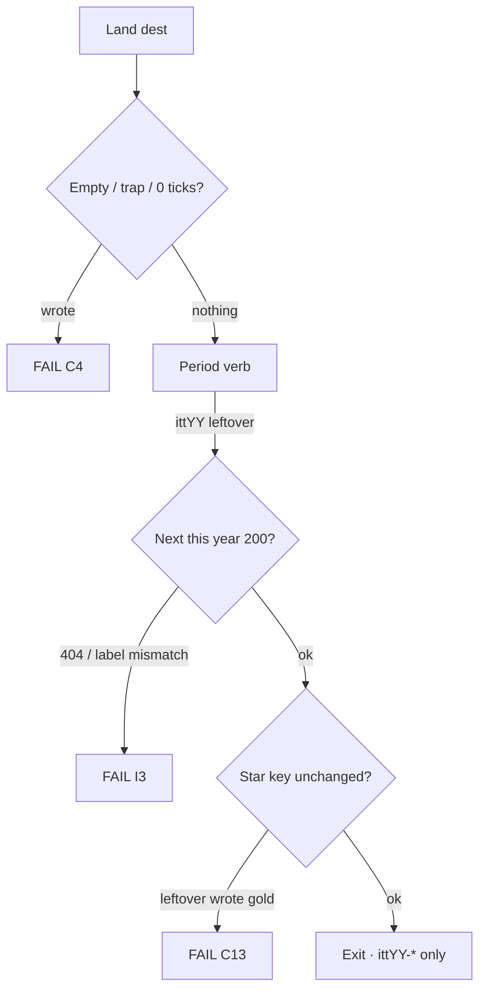

# Every live year — next improve map · goals · phases · flows · minute

**Date:** 2026-09-03  
**Status:** **walk this after Waves 0–5.** One named wave, then look. Do not dump 6–9 in one pass.  
**Hub now:** **26 years open** · **1994–2019**.  
**Wiped:** 2020–2025. Do **not** invent dests. Rebuild only if named.

Leftover **2× is already on every dest** (writers `<2` = **0**). Waves **0–5** of [`EVERY-YEAR-IMPROVE-FLOWS-LINKS-GOALS-PHASES-MINUTE-2026-09-03.md`](EVERY-YEAR-IMPROVE-FLOWS-LINKS-GOALS-PHASES-MINUTE-2026-09-03.md) are **ticked**. This file is the **remaining queue**.

Thinness is leftover **feel** and gold **hops**, not missing leftover buttons. Do **not** add dest folders to catch 2002 up to 2004.

---

## Companions (do not fork a second law)

| File | Role |
|------|------|
| **This file** | **Map the rest.** Waves 6–9 · dest minutes · file lists · verify |
| [`EVERY-YEAR-IMPROVE-FLOWS-LINKS-GOALS-PHASES-MINUTE-2026-09-03.md`](EVERY-YEAR-IMPROVE-FLOWS-LINKS-GOALS-PHASES-MINUTE-2026-09-03.md) | Waves 0–5 done · Wave 6 first draft (this file wins on file lists) |
| [`THIN-YEARS-FLOWS-LINKS-RESEARCH-2026-09-03.md`](THIN-YEARS-FLOWS-LINKS-RESEARCH-2026-09-03.md) | Wave 3 research lock |
| [`2010-2019-2X-EVERY-NUMBER-RESEARCH-GOALS-PHASES-FLOWS-MINUTE-2026-09-03.md`](2010-2019-2X-EVERY-NUMBER-RESEARCH-GOALS-PHASES-FLOWS-MINUTE-2026-09-03.md) | **2× every 2010–2019 number** · research lock · not Wave 8/9 · do not implement until named |
| [`2010-2019-2X-EVERY-NUMBER-MAP-GOALS-PHASES-FLOWS-MINUTE-2026-09-03.md`](2010-2019-2X-EVERY-NUMBER-MAP-GOALS-PHASES-FLOWS-MINUTE-2026-09-03.md) | **2× map** · dest minutes · flows · phases H1–G1 |
| [`DISK-TRUTH.md`](DISK-TRUTH.md) | Which years exist |
| Year `YYYY-READ-FIRST.md` | Thesis · star · bans |
| [`2007-2X-LEFTOVER-GOALS-PHASES-FLOWS-MINUTE-2026-09-01.md`](2007-2X-LEFTOVER-GOALS-PHASES-FLOWS-MINUTE-2026-09-01.md) | Pack A verbs for 2007 |
| [`2001-2002-CRITERIA-MAP-2026-08-30.md`](2001-2002-CRITERIA-MAP-2026-08-30.md) | leftover-18 freeze |
| `js/config/flow-trails.js` | Official 10. Do not invent a second n=1 |

**Trust order:** live `years/` · `scripts/itt_gate.py` `SHIP_YEARS` · DISK-TRUTH · this file · year READ-FIRST.

**Legal:** Educational. `localStorage` only. No exploit / PoC / live OAuth / live CDN. **Never invent brand pixels.**

Serve: `python3 -m http.server 8080 --bind 127.0.0.1`  
Clear `ittYY-*` for the year you are checking.

---

## Criteria (always)

Same I1–I10 as the 09-03 execute bible. Extra for **this** map:

| # | Rule | Fail if |
|--:|------|---------|
| M1 | Existing dest first. Hops to folders **on disk** | New dest to fill a 3× strip |
| M2 | Period verb, not “Save leftover 2×” | Plaque is the visitor save |
| M3 | Next label = dest name · href this year · HTTP 200 | “Tumblr” → other-year dest |
| M4 | Lean HTML freeze: 2014/2016 already **82** (paper cap 70) · 2017 **91** (cap 90) · 2019 **96** (cap 90) | Another dest folder on those years |
| M5 | 2001–2003 leftover-18 stays 18 | Pad to 120 |
| M6 | 2012–2019 stay 9+9+9 + leftover-official | 120 dest farm |
| M7 | ILS June table **ends 2018** | Invented 2019 websites cell |
| M8 | One named wave · verify · look | Waves 6–9 in one dump |

Stars, guided 6, official 10 n=1, boarded 2020–2025 **do not move**.

---

## Remesasure (after Waves 0–5 · 2026-09-03)

Hrefs = internal `href=` on year HTML. Plaque = `Save leftover 2×` count.

| Year | Dests | HTML | Hrefs | 2× plaques | Continuity phrase | Wave done | Remaining kind |
|------|------:|-----:|------:|-----------:|------------------:|-----------|----------------|
| 1994 | 53 | 277 | 8426 | 353 | 0 | 4 | plaque + home fold |
| 1995 | 51 | 247 | 7811 | 300 | 0 | 4 | plaque + home fold |
| 1996 | 52 | 199 | 5852 | 208 | 0 | 4 | plaque + home fold |
| 1997 | 56 | 183 | 6062 | 176 | 0 | 4 | plaque + home fold |
| 1998 | 52 | 202 | 6646 | 222 | 0 | 4 | plaque + home fold |
| 1999 | 48 | 219 | 7013 | 259 | 0 | 4 | plaque + home fold |
| 2000 | 54 | 209 | 7400 | 393 | 0 | — | plaque + gold 3× eBay + fold |
| 2001 | 29 | 101 | 2401 | 166 | 2 | 2 | costume only · leftover-18 |
| 2002 | **26** | 84 | **1955** | 131 | 1 | 2 | thinnest · no new dests |
| 2003 | **23** | 93 | 2036 | 153 | 0 | 2 | fewest dests · no new dests |
| 2004 | 90 | 319 | 12867 | 404 | 0 | 5 | plaque + gold 3× |
| 2005 | 117 | 362 | 14423 | 378 | 4 | 5 | plaque on non-Wave-5 dests |
| 2006 | 126 | 385 | 15250 | 398 | 4 | 5 | 150 “Save leftover” still |
| 2007 | 55 | 139 | 3753 | 144 | **77** | — | **Wave 6** · 28 `c.html` |
| 2008 | 105 | 353 | 14507 | 413 | 1 | 5 | plaque |
| 2009 | 68 | 139 | 3706 | 144 | 0 | 1 | verb polish · unlisted stay out |
| 2010 | 44 | 82 | 2880 | 80 | 0 | 3 | freeze · over hop-density |
| 2011 | 71 | 156 | 5249 | 163 | 0 | 1 | verb polish · unlisted stay out |
| 2012 | 45 | 93 | 3224 | 91 | 0 | — | **Wave 6** · gold misses YouTube |
| 2013 | 31 | 82 | 2551 | 78 | 0 | 3 | freeze · HTML 82 |
| 2014 | 30 | 82 | 2451 | 78 | 1 | 3 | freeze · no Google dest |
| 2015 | 36 | 82 | 2658 | 78 | 0 | 3 | freeze |
| 2016 | 32 | 82 | 2616 | 78 | 0 | 3 | freeze · no Allo / Note 7 |
| 2017 | 55 | 91 | 3407 | 87 | 0 | — | **Wave 6** · literacy verbs |
| 2018 | 52 | 91 | 3322 | 87 | 0 | — | **Wave 6** · Accept All never writes |
| 2019 | 59 | 96 | 3653 | 92 | 0 | — | **Wave 6** · no June ILS cell |

Leftover writers `<2` (excl. playable) = **0**.

---

## What people actually did (research lock)

Do not invent dests from this table. Hop dests **already on disk**.

| When | Typical-day / rank | Museum hop (on disk) | Source |
|------|--------------------|----------------------|--------|
| Mar 2000 | Email 52% of users · news 22% · surf-for-fun 21% · buy 4% · auction 3% | Yahoo / Hotmail leftover · CNN leftover · eBay leftover | Pew *Tracking Online Life* |
| 2002 | Email 49% typical day · search only **29%** typical day | Portal leftover, not Google-as-door | Pew (cited 9 Aug 2011) |
| 2001–03 visits | AOL / MSN / Yahoo parents. Google **15th** Jun 2001 | Yahoo / Amazon leftover. No new AOL folder | ClickZ / Media Metrix |
| Aug 2004 | 88% say the net plays a role in daily routines · email + look-up still #1 | Gmail leftover · Yahoo leftover | Pew *The Internet and Daily Life* |
| Jul 2007 | Daily web improves hobbies, shop, job, health info. Shell still XP+IE6 | Gmail · Wikipedia · Facebook leftover. iPhone is a **room** | Pew *The Web in Daily Life* · READ-FIRST |
| Dec 2007 | Facebook **+81%** to 34.7M after open reg · Wikipedia 52M. Search: Google 5.6B · Yahoo 2.2B | `facebook` · `wiki` leftover | comScore 2007 Year in Review |
| May 2011 | Search 59% typical day · email 61% | Google leftover if present · Gmail | Pew 9 Aug 2011 |
| Jun / Aug 2012 | Google Sites 189M · Yahoo 167M · Microsoft 166M · Facebook 160M · Amazon 101M · Wikimedia 83M. Video: YouTube/Google 147M | `facebook` · `youtube` · `twitter` · `pinterest` | comScore MMX / Video Metrix |
| Aug 2012 SNS | Facebook **54%** of adults · IG **9%** · Twitter 13% · Pinterest 10% | FB/YT mass · IG Android is the **star**, not the mass dest | Pew social-media fact sheet |
| Jan 2018 | YouTube 73% · Facebook 68% · IG 35% · Snap 27% | YT / FB / IG leftover | Pew *Social Media Use 2018* |
| May 2018 teens | YT / IG / Snap beat Facebook (51%) | Teen leftover = IG / Snap / YT, not a new dest | Pew *Teens, Social Media and Technology 2018* |
| Sep 2018 | 54% of FB users changed privacy · 42% took a weeks-long break | GDPR Manage is the star · Cambridge leftover | Pew 5 Sep 2018 |
| Apr 2019 | YouTube 73% · Facebook 69% · IG 37% · plateau | Streaming leftover (Disney+ is star) · TikTok leftover | Pew 10 Apr 2019 |
| 2019 scale | ILS June **table ends 2018** at 1,630,322,579. ITU ~4.1B / 53.6% | Print “table ends 2018.” Never invent a June 2019 cell | ILS · ITU Facts and Figures 2019 |

**Ceiling:** email then search, every year through 2011. Social is the **growth** story 2006–2015, then a **plateau**. Phone is mass only after ~2012 (Pew smartphone 45% in 2012, 77% in 2018). 2007 January desktop is still XP+IE6.

---

## Visitor flow (unchanged)

```
Hub → year card available
  → Skip connect · year-true shell
  → Starting Point
       guided ol = 6
       ★ chip = gold dest
       leftover / 3× **below** the <ol> (folded under .itt-home-more / Also this year)
  → About dual-cite
  → ★ gold: trap never writes · complete writes ittYY-star
  → Official 10: Next after write · leftover ≠ gold
  → Leftover dest: period verb · Next 200 · gold unchanged
  → Year game
  → Exit · ittYY-* only
```



---

## Remaining wave order

| Wave | Years | Kind | New dests? | Named ask |
|------|-------|------|------------|-----------|
| **6** | 2007 · 2012 · 2017 · 2018 · 2019 | Lean leftover polish | No | `start wave 6` |
| **7** | 1994–2000 · 2004–2006 · 2008 | Forest plaque → period verb | No | `start wave 7` |
| **8** | 2000 · 2004 · 2007 · 2012 · 2018 · 2019 | Gold + official 3× hops on disk | No | `start wave 8` |
| **9** | 1994–2003 · 2007 · 2009 · 2011 | Home warehouse under `.itt-home-more` | No | `start wave 9` |

Do not start Wave N+1 until Wave N pass is ticked.

**Skip / freeze (already done or cap-blocked):** 2001–2003 dest-add · 2009/2011 unlist · 2010/2013–2016 dest-add · 2020–2025.

---

# WAVE 6 — lean leftover polish

**Stars stay:** iPhone Safari `itt07-iphone` · IG Android `itt12-ig-android` · Face ID `itt17-faceid` · GDPR `itt18-gdpr` · Disney+ Continue `itt19-disneyplus`.

**No forests. No 2020+.** HTML 2017/2019 already over paper cap — **strips and verbs only**.

## 6.1 · 2007 — 28 `c.html` + gold hops

**Read first:** [`2007-READ-FIRST.md`](2007-READ-FIRST.md) · Pack A in [`2007-2X-LEFTOVER-GOALS-PHASES-FLOWS-MINUTE-2026-09-01.md`](2007-2X-LEFTOVER-GOALS-PHASES-FLOWS-MINUTE-2026-09-01.md).

**Disk now:** 55 dests · **28 `c.html`** still titled “Save leftover … continuity leftover” · 77 files contain the continuity phrase.

### Files (P2)

```
years/2007/sites/amz/c.html
years/2007/sites/bbc/c.html
years/2007/sites/blogger/c.html
years/2007/sites/cl/c.html
years/2007/sites/cnn/c.html
years/2007/sites/digg/c.html
years/2007/sites/ebay/c.html
years/2007/sites/ff2/c.html
years/2007/sites/flickr/c.html
years/2007/sites/gmail/c.html
years/2007/sites/ie7/c.html
years/2007/sites/itunes/c.html
years/2007/sites/li/c.html
years/2007/sites/livesp/c.html
years/2007/sites/maps/c.html
years/2007/sites/myspace/c.html
years/2007/sites/nfx/c.html
years/2007/sites/nyt/c.html
years/2007/sites/orkut/c.html
years/2007/sites/pp/c.html
years/2007/sites/reddit/c.html
years/2007/sites/saf3/c.html
years/2007/sites/sd/c.html
years/2007/sites/sl/c.html
years/2007/sites/stumble/c.html
years/2007/sites/twitter/c.html
years/2007/sites/wow/c.html
years/2007/sites/youtube/c.html
```

### Minute (every `c.html`)

1. Land. Year-true title (not “Amazon continuity leftover”).  
2. Keep `data-lo-key`.  
3. Trap = App Store / Chrome / 3G / Like. Never writes `itt07-iphone`.  
4. Complete = Pack A verb (Query leftover Amazon · Open leftover CNN · Mail leftover Gmail · Queue leftover Netflix).  
5. Next → a 2007 dest that exists (`gmail` · `facebook` · `youtube` · `wiki`).

### Gold 3× (same wave)

On `years/2007/sites/iphone/index.html` add hops to dests **on disk**:

`gmail` · `facebook` · `twitter` · `youtube` · `tumblr` · `streetview` · `kindle`

(`streetview` + `kindle` already present.)

**Fail if:** App Store / Chrome offered as 2007 default · dest folders added · empty Safari URL writes `itt07-iphone`.

## 6.2 · 2012 — 3× + deepen on disk

**Read first:** [`2012-READ-FIRST.md`](2012-READ-FIRST.md).

**Gold:** `years/2012/sites/instagram/index.html` · `itt12-ig-android`.

On disk, missing from gold 3× today: **`youtube`**. Already present: facebook · twitter · pinterest · chrome · tinder.

### Strip (P2)

On gold + official dests that exist, hop:

| Href | Label |
|------|-------|
| `../facebook/index.html` | Facebook leftover |
| `../youtube/index.html` | YouTube leftover |
| `../twitter/index.html` | Twitter leftover |

Optional fourth (on disk, Pew 10% Aug 2012): `../pinterest/index.html`.

### Deepen (verbs only · folders exist)

| Dest | Path | Trap | Complete | Next |
|------|------|------|----------|------|
| Facebook IPO | `sites/facebook/index.html` or `ipoabout/` | Stories-as-2012 | IPO leftover | `instagram` |
| Draw Something | `sites/drawsomething/index.html` | live app | draw leftover | `facebook` |
| Drive | `sites/googledrive/index.html` | Docs-as-2016 | folder leftover | `gmail` |
| Tinder **seed** | `sites/tinder/index.html` | Stories / Super-Like mass | swipe leftover | `facebook` |
| Vine **wait** | `sites/vinewait/index.html` | Vine 6s-as-2012 | wait leftover | `twitter` |
| Surface | `sites/surface/index.html` | iPad-as-this | Surface leftover | `windows8` |
| Windows 8 | `sites/windows8/index.html` | Win8-as-January-shell | Start-gone leftover | `surface` |

**Fail if:** Stories · Vine 6s as 2012 default · 115-room restore.

## 6.3 · 2017 — literacy + 280

**Gold:** `years/2017/sites/iphone/x.html` · `itt17-faceid`.

### Verb table (keys stay)

| Dest | Path | Verb | Trap | Never writes |
|------|------|------|------|--------------|
| KRACK | `sites/krack/index.html` | Note leftover patch | exploit PoC | gold |
| Title II repeal | `sites/nnrepeal/index.html` | Note leftover repeal | live petition | gold |
| Flash end | `sites/flashend/index.html` | Note leftover EOL | live Flash | gold |
| WannaCry | `sites/wannacry/index.html` | Note leftover NHS | **payload** | gold |
| Equifax | `sites/equifax/index.html` | Freeze leftover credit | live SSN | gold |
| Twitter 280 | `sites/twitter/280.html` | 280 leftover | under-140 as 280-gold | `itt17-faceid` · 140-as-gold |
| Fortnite | `sites/fortnite/index.html` | Drop leftover | Switch-as-2017 | gold |
| Switch | `sites/switch/index.html` | Buy leftover $299 | live eShop | gold |
| Teams | `sites/teams/index.html` | Chat leftover | Slack-as-default | gold |
| Vine gone | `sites/vine/gone.html` | Archive leftover | Vine-as-TikTok | gold |

### Gold 3×

From `iphone/x.html` hop: `../fortnite/index.html` · `../switch/index.html` · `../teams/index.html` · `../vine/gone.html` · `../twitter/280.html`.

**Fail if:** TikTok-as-star · new dest · HTML grown.

## 6.4 · 2018 — GDPR + period verbs

**Gold:** `years/2018/sites/gdpr/index.html` · `itt18-gdpr`.  
**Accept All never writes.**

| Dest | Path | Verb | Trap |
|------|------|------|------|
| Cambridge | `sites/cambridge/index.html` | Note leftover hearing | live quiz |
| IGTV | `sites/instagram/igtv.html` · `sites/igtvabout/` | Watch leftover IGTV | Reels-as-2018 |
| TikTok leftover | `sites/tiktok/fyp.html` | Scroll leftover FYP | TikTok-as-star |
| Mastodon | `sites/mastodon/index.html` | Join leftover | live instance |
| GitHub+MS | `sites/githubms/index.html` or `github/microsoft.html` | Note leftover acquire | live OAuth |
| Not Secure | `sites/notsecure/index.html` | Tick leftover HTTP | Chromium Edge |
| Fortnite iOS | `sites/fnios/index.html` | Play leftover | live V-Bucks |

### Gold 3×

From GDPR hop dests on disk: `../tiktok/index.html` · `../cambridge/index.html` · `../instagram/igtv.html` · `../github/index.html` · `../fortnite/creative.html`.

**Fail if:** Accept All writes `itt18-gdpr` · Chromium Edge as default.

## 6.5 · 2019 — Continue + literacy hops

**Gold:** `years/2019/sites/disneyplus/home.html` · `itt19-disneyplus`.  
Trial / 7-day **never writes**.

| Dest | Path | Verb | Trap |
|------|------|------|------|
| TikTok leftover | `sites/tiktok/index.html` | Scroll leftover | TikTok-as-star |
| Stadia | `sites/stadia/index.html` | Founder leftover | invent shutdown |
| Arcade | `sites/arcade/index.html` | Subscribe leftover $4.99 | IAP-as-this |
| Fold | `sites/fold19/index.html` | Note leftover fold | live buy |
| Libra | `sites/libra/index.html` | Note leftover literacy | live wallet |
| FTC-Facebook | `sites/ftcfb/index.html` | Note leftover order | live fine |

### Gold 3×

From `disneyplus/home.html` hop: `../tiktok/index.html` · `../arcade/index.html` · `../stadia/index.html` · `../fold19/index.html` · `../libra/index.html` · `../ftcfb/index.html`.

About: **ILS table ends 2018**. Never invent a June 2019 websites cell.

**Fail if:** Zoom-as-2020 · 4o · invented ILS cell · trial writes gold.

## 6.6 · Verify

```bash
python3 scripts/audit-internal-links.py
node scripts/audit-mock-flows.js
npx playwright test e2e/one-thing-per-year.spec.js --grep "2007|2012|2017|2018|2019"
```

Browser: 2007 empty Safari URL → no `itt07-iphone`. 2018 Accept All → no `itt18-gdpr`. 2019 trial → no `itt19-disneyplus`. 2017 Face ID empty → no `itt17-faceid`.

**Wave 6 pass (2026-09-03)**

- [x] 2007 `c.html` have 2007 verbs · gold hops Gmail/FB/Twitter/YouTube/Tumblr 200  
- [x] 2012 gold 3× includes YouTube · no Stories  
- [x] 2017 literacy dests have period controls · 280 leftover key unchanged  
- [x] 2018 Accept All still never writes (one-thing incomplete green)  
- [x] 2019 About has no invented June ILS cell  
- [x] Dest folders unchanged · HTML not grown (55/45/55/52/59 dests · 139/93/91/91/96 HTML)  
- [x] One-thing e2e 2007/2012/2017–2019 10/10 · link audit 0 broken · smoke OK

---

# WAVE 7 — forest plaque → period verb

**Years:** 1994–2000 · 2004–2006 · 2008.  
**Stars stay.** Keys stay. No new dests.

Wave 4 already cleaned 1994–1999 **`more.html`**. This wave is **`index.html` leftover machines** that still say **Save leftover 2×**.

### Counts to beat

| Year | `Save leftover 2×` now |
|------|----------------------:|
| 1994 | 353 |
| 1995 | 300 |
| 1996 | 208 |
| 1997 | 176 |
| 1998 | 222 |
| 1999 | 259 |
| 2000 | 393 |
| 2004 | 404 |
| 2005 | 378 |
| 2006 | 398 |
| 2008 | 413 |

2005 also has **98** “Save leftover” (not 2×). 2006 has **150**. Same pass.

### Minute (every leftover `data-lo-save` that is not gold)

1. Keep `data-lo-key` · `data-lo-trap` · Next key.  
2. Replace button label with a period verb from the year table.  
3. Trap text year-true if it still says “This leftover is the year star.”  
4. Skip `playable/` cabinets.  
5. Skip gold dests.

### Verb hints

| Year | Verb examples |
|------|----------------|
| 1994–99 | Submit / Query / Bid / Listen / Guestbook leftover |
| 2000 | Smile leftover · Print leftover map · Crash leftover Pets |
| 2004 | Smile leftover · Invite leftover Gmail · Browse leftover Yahoo |
| 2005 | Maps leftover (not Street View) · Upload leftover is gold — do not steal |
| 2006 | News Feed leftover · 140 leftover · YouTube Google-owned leftover |
| 2008 | App Store leftover ~500 · Chrome leftover · G1 leftover · Hulu leftover |

**Fail if:** a leftover key changes · gold key written · dest folder added.

**Wave 7 pass (2026-09-03)**

- [x] Forest dest `index.html` leftover saves are period verbs (gold index files skipped)  
- [x] Keys unchanged · dest counts unchanged (53/51/52/56/52/48/54/90/117/126/105)  
- [x] One-thing e2e 1994–2000 / 2004–2006 / 2008 23/23 · link audit 0 broken

---

# WAVE 8 — gold + official 3× hops (dests on disk)

Same machine as Wave 3. Label = dest name. Href = `../<slug>/<file>`. 0 404.

| Year | Gold file | Required hops (folder must exist) | Never |
|------|-----------|-----------------------------------|-------|
| 2000 | `sites/mapquest/index.html` | yahoo · amazon · pets · napster · **ebay** | live MapQuest |
| 2004 | `sites/facebook/networks.html` | gmail · flickr · firefox · yahoo · amazon | News Feed · YouTube upload |
| 2007 | `sites/iphone/index.html` | gmail · facebook · twitter · youtube · tumblr | App Store · Chrome |
| 2012 | `sites/instagram/index.html` | facebook · **youtube** · twitter | Stories · Vine 6s |
| 2018 | `sites/gdpr/index.html` | tiktok · cambridge · instagram/igtv · github · fortnite/creative | Chromium Edge |
| 2019 | `sites/disneyplus/home.html` | tiktok · arcade · stadia · fold19 · libra · ftcfb | Zoom · 4o |

If Wave 6 already put the 2007 / 2012 / 2018 / 2019 hops on gold, Wave 8 only does **2000 + 2004** and any official n=2–9 dests still missing the strip.

**Fail if:** new dest · star moved · 2014 Google dest.

**Wave 8 pass**

- [x] From each named gold dest, required hops HTTP 200 (2018 skipped — wiped)  
- [x] Dest folders unchanged  
- [x] One-thing e2e those years green (2018 wiped · skipped)  

---

# WAVE 9 — home fold (remaining years)

Wave 5 folded 2004 / 2005 / 2006 / 2008. `ui/year/start.js` already moves `.itt-home-more` into `#itt-also-year-YYYY`.

### Files

```
years/1994/pages/home.html
years/1995/pages/home.html
years/1996/pages/home.html
years/1997/pages/home.html
years/1998/pages/home.html
years/1999/pages/home.html
years/2000/pages/home.html
years/2001/pages/home.html
years/2002/pages/home.html
years/2003/pages/home.html
years/2007/pages/home.html
years/2009/pages/home.html
years/2011/pages/home.html
```

### Minute

1. Guided 6 + ★ chip stay first (`#itt-year-start`).  
2. Wrap `<!-- ITT-3X-LINKS -->` in `<div class="itt-home-more">`.  
3. Thesis / honesty stay visible (hoist already in `start.js`).  
4. 2006-style visible 3× (if a year needs one) uses `id` ending `-dp` so it is **not** folded.

**Fail if:** warehouse above the chip after paint · guided 7th `<li>` · e2e `data-itt-pop3x` / `data-itt-3x-links` missing.

**Wave 9 pass**

- [x] Those homes have `.itt-home-more` (2011 leftover 2× strip classed; 2018 wiped)  
- [x] After paint, warehouse is inside closed `#itt-also-year-YYYY`  
- [x] Stars unchanged  

---

## Shared implement phases (every remaining wave)

| Phase | What | Pass |
|-------|------|------|
| P0 | Read this file + year READ-FIRST + DISK-TRUTH | Year card `available` |
| P1 | Inventory: plaque count · gold hops · `c.html` / dest list | Table ticked |
| P2 | Rewrite per dest-minute table | Trap empty · complete leftover · Next 200 |
| P3 | Hallway / 3× / urlMap only if a hop was added | 0 dest miss · 0 next miss |
| P4 | Verify block + browser gold + 1 leftover | Gates green · only `ittYY-*` |
| P5 | Stop | User looks |

---

## Verify block (every wave P4)

```bash
python3 scripts/smoke-production.py --base http://127.0.0.1:8080
python3 scripts/audit-internal-links.py
node scripts/audit-mock-flows.js
npx playwright test e2e/one-thing-per-year.spec.js --grep YYYY
```

Browser: hub open → Starting Point guided **6** · ★ = trail n=1 · gold empty/trap no key · leftover empty/trap no key · leftover complete writes leftover only · Next 200 · exit `ittYY-*` only.

Commit / push **only if named**.

---

## Explicitly out of scope

- Rebuild 2020 Zoom / 2021 ATT / 2022 Send / 2023 Plus / 2024 4o  
- `git checkout` of any wiped forest  
- Move a star · 7th guided `<li>` · second official-10 list  
- New dest folders on 2001–2003 / 2010 / 2013–2019  
- Invent ILS June 2019–2025 websites cells  
- Invent brand pixels · Heartbleed exploit · Ice Bucket celebrity stills  
- Count games cabinets as leftover 2×  
- Chase dest counts so 2002 looks like 2004  

---

## How to start

| You say | We do |
|---------|--------|
| `start wave 6` | 2007 `c.html` + 2012 YouTube 3× + 2017–19 verbs (**recommended next**) |
| `start wave 7` | Only after Wave 6 pass is ticked · forest plaques |
| `start wave 8` | Gold 3× fill (2000 / 2004 first if 6 already hopped 2007+) |
| `start wave 9` | Home fold on remaining years |
| `commit` | Commit leftover-2× + Waves 1–5 tree (only if named) |

Do not say “do all years” as one implement. This file is the queue. Live tree + DISK-TRUTH still win.
