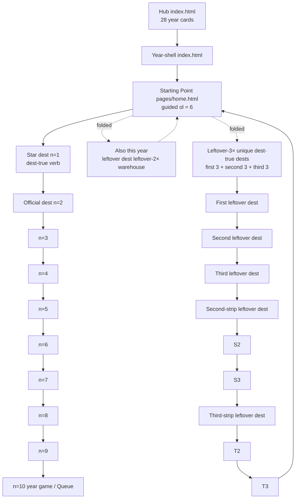
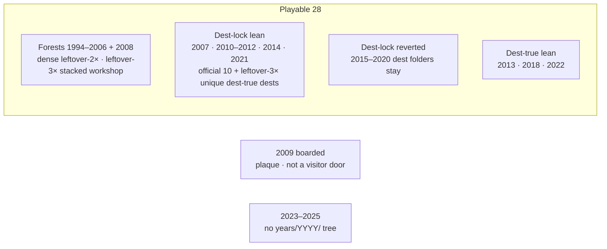
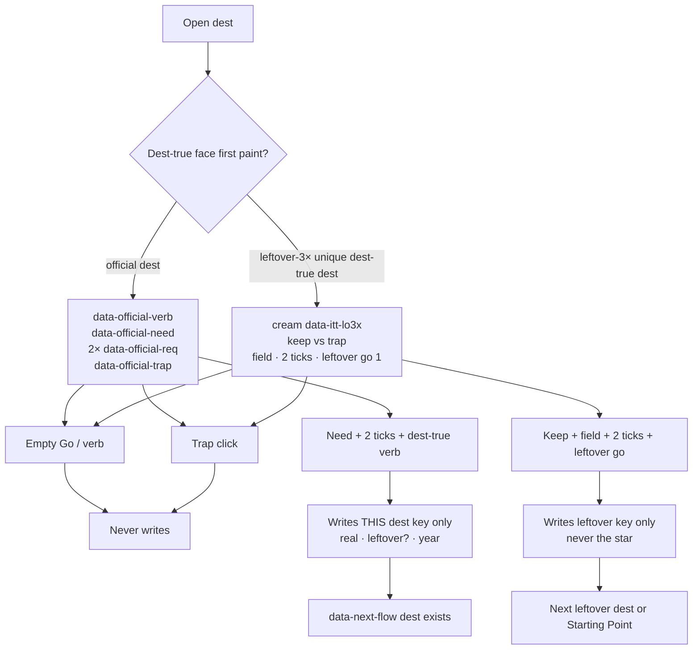
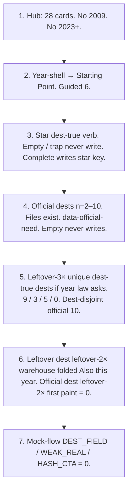
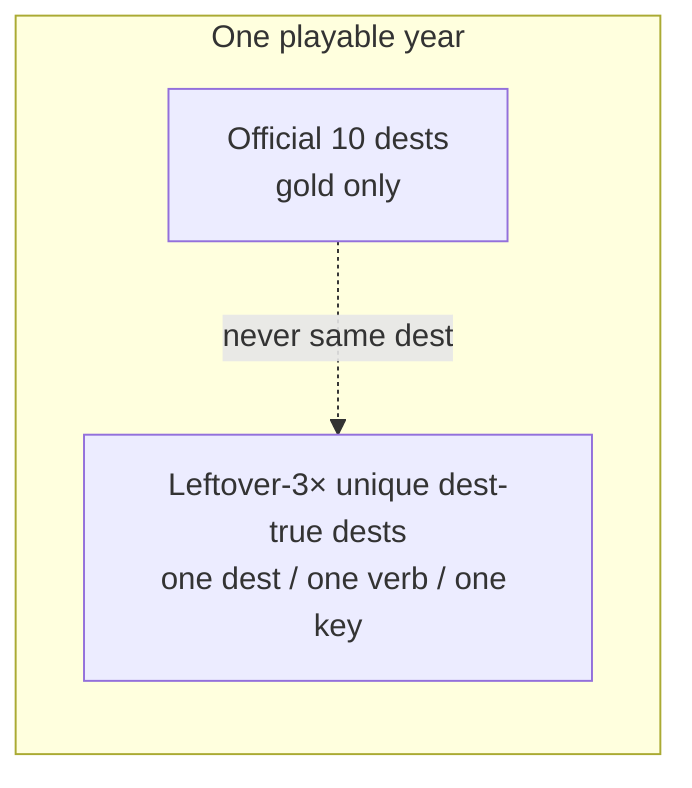

# Flow-check diagram

**Date:** 2026-09-20  
**Status:** Check map. Not dest-farm.  
**Ship law:** [`DISK-TRUTH.md`](DISK-TRUTH.md).  
**Dest-true I/O:** [`VISITOR-100-FLOWS.md`](VISITOR-100-FLOWS.md).  
**Leftover-3× unique dest-true dests:** [`LEFTOVER-3X-UNIQUE-CRITERIA.md`](LEFTOVER-3X-UNIQUE-CRITERIA.md).

**One-line:** Check **links** (hrefs exist) then **flows** (empty never writes · trap never writes · complete writes this dest’s key · leftover never writes the star). Dest-folder count is not a pass.

---

## 1. Museum door (every playable year)

**Link check:** hub href · year-shell · Starting Point · About · Map · star file · official 10 files · leftover-3× unique dest-true dest files.

**Flow check:** dest-true I/O on star + leftover dest leftover-3× unique dest-true dests (diagram 3).

---

## 2. Year classes (what to expect)

| Class | Years | Official 10 | Leftover-3× unique dest-true dests | Check |
|-------|-------|-------------|-----------------------------------|-------|
| Forest | 1994–2006 + 2008 | 10 files | **Workshop stacked** — not unique dest-true 9 | Links + dest-true official dest I/O. Do not dest-farm unique leftover-3×n |
| Dest-lock lean | 2007, 2010–2012, 2014, 2021 | 10 | 9 / 9 / 9 / 9 / 9 / **5 stop** | Do not dest-lock revert dest-farm dests |
| Dest-lock reverted | 2015–2020 | 10 | 9 / 9 / leftover-20 (2017) / 3 / 9 / 9 | Dest folders stay. Unique dest-true dests dest-disjoint |
| Dest-true lean | 2013, 2018, 2022 | 10 | 9 / **3 stop** / 9 | 2018 GDPR Manage is the I/O model |
| Boarded | 2009 | plaque | catalogs not visitor | Do not restore as a playable door |
| Wiped | 2023–2025 | no tree | — | Do not restore |

---

## 3. Dest-true I/O (every dest you walk)

**Fail if:** cloned “Go leftover” plaque · leftover go ≠ 1 on leftover-3× unique dest-true dests · leftover writes star · empty writes · trap writes · dest-farm leftover dest leftover-3× dest-farm extra dests counted as unique dest-true dests.

---

## 4. Check order (walk this)

**Packs:**

| Check | Pack |
|-------|------|
| FLOW-CHECK walk (hub · guided 6 · leftover-2×=0 · leftover-3× stops · leftover I/O sample) | `e2e/flow-check-pipeline.spec.js` · `e2e/visitor-door.spec.js` |
| Leftover-3× unique dest-true dests | `e2e/leftover-3x-unique.spec.js` |
| Official dest leftover-2× gone | `e2e/official-leftover-2x.spec.js` |
| Official dest empty/complete | `e2e/all-years-official-10-real.spec.js` |
| Dest-farm leftover-3× CUT (walks unique dest-true dests) | `e2e/2010-2015-3x-cut.spec.js` · `e2e/2015-2020-3x-cut.spec.js` |
| Mock | `node scripts/audit-mock-flows.js` |

---

## 5. Leftover-3× unique dest-true dests (dest-disjoint)

| Year | Unique dest-true dests | Star never written by leftover |
|------|------------------------|--------------------------------|
| 2007 | 9 wiki…digg | `itt07-iphone` |
| 2010 | 9 netflix…groupon | `itt10-ig-posts` |
| 2011 | 9 | `itt11-gplus` |
| 2012 | 9 + leftover-4× unique 3 | `itt12-ig-android` |
| 2013 | 9 | Vine record |
| 2014 | 9 | `itt14-wa-install` |
| 2015 | 9 | `itt15-periscope` |
| 2016 | 9 | `itt16-ig-stories` |
| 2017 | **0 leftover-3× unique dest-true dests** (unique leftover-20) | `itt17-faceid` |
| 2018 | **3 stop** | `itt18-gdpr` |
| 2019 | 9 | `itt19-disneyplus` |
| 2020 | 9 | `itt20-zoom` |
| 2021 | **5 stop** | `itt21-att` |
| 2022 | 9 amazon…nyt | `itt22-chatgpt` |

Do not dest-farm leftover dest leftover-3× unique dest-true dests past the stop. Do not dest-farm leftover dest leftover-20 dests unless named.

---

## 6. Dest-true star verbs (spot-check)

| Year | Star dest | Dest-true verb | Trap never writes |
|------|-----------|----------------|-------------------|
| 2010 | Instagram | filter → caption → Share | Stories-as-gold |
| 2012 | IG Android | filter → Share | — |
| 2016 | Stories | Add to Story | Reels-as-gold |
| 2017 | Face ID | Look / swipe | Home button |
| 2018 | GDPR | **Manage** | **Accept All** |
| 2019 | Disney+ | **Continue** | Trial |
| 2021 | ATT | **Ask** | **Allow** |
| 2022 | ChatGPT | Send | GPT-4 / empty |
